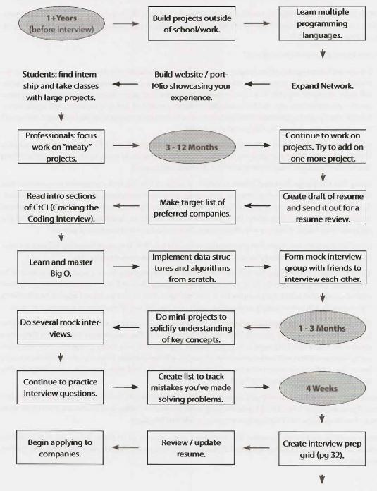
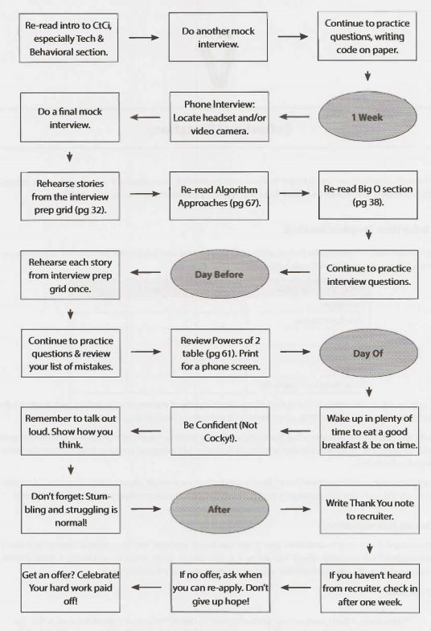
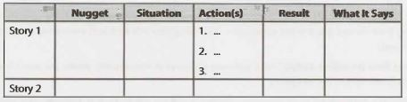

CRACKING The CODING INTERVIEW
=============================

6TH  EDITION 

189   PROGRAMMING QUESTIONS & SOLUTIONS 

By: GAYLE LAAKMANN MCDOWELL

Founder and CEO, CareerCup.com

CareerCup, LLC Palo Alto, CA

*ALso BY GAYLE LAAKMANN  McDowELL*

- *CRACKING  THE PM INTERVIEW*: *How TO LAND A PRODUCT MANAGER JoB IN TECHNOLOGY*
- *CRACKING THE TECH CAREER*: INSIDER ADVICE ON LANDING A JOB AT GOOGLE,  MICROSOFT, APP LE, OR ANY TOP TECH COMPANY 

**CRACKING THE CODING INTERVIEW, SIXTH EDITION**

Copyright © 2015 by CareerCup.

All rights reserved. No part of this book may be reproduced in any form by any electronic or mechanical means, including information storage and retrieval systems, without permission in writing from the author or publisher, except by a reviewer who may quote brief passages in a review.

Published by CareerCup, LLC, Palo Alto, CA. Compiled Feb 10, 2016. 

For more information, contact support@careercup.com.

978-0-9847828-5-7 (ISBN  13) 

### Foreward

Dear Reader,

Let's get the introductions out of the way.

I am not a recruiter. I am a software engineer. And as such, I know what it's like to be asked to whip up brilliant algorithms on the spot and then write flawless code on a whiteboard. I know because I've been asked to do the same thing-in interviews at Google, Microsoft, Apple, and Amazon, among other companies.

I also know because I've been on the other side of the table, asking candidates to do this. I've combed through stacks of resumes to find the engineers who I thought might be able to actually pass these interviews. I've evaluated them as they solved-or tried to solve-challenging questions. And I've debated in Google's Hiring Committee whether a candidate did well enough to merit an offer. I understand the full hiring circle because I've been through it all, repeatedly.

And you, reader, are probably preparing for an interview, perhaps tomorrow, next week, or next year. I am here to help you solidify your understanding of computer science fundamentals and then learn how to apply those fundamentals to crack the coding interview.

The 6th edition of Cracking the Coding Interview updates the 5th edition with 70% more content: additional questions, revised solutions, new chapter introductions, more algorithm strategies, hints for all problems, and other content. Be sure to check out our website, CrackingTheCodinglnterview.com, to connect with other candidates and discover new resources.

I'm excited for you and for the skills you are going to develop. Thorough preparation will give you a wide range of technical and communication skills. It will be well worth it, no matter where the effort takes you!

I encourage you to read these introductory chapters carefully. They contain important insight that just might make the difference between a "hire" and a "no hire".

**And remember-interviews are hard!** In my years of interviewing at Google, I saw some interviewers ask "easy" questions while others ask harder questions. But you know what? Getting the easy questions doesn't make it any easier to get the offer. Receiving an offer is not about solving questions flawlessly (very few candidates do!). Rather, it is about answering questions better than other candidates. So don't stress out when you get a tricky question-everyone else probably thought it was hard too. It's okay to not be flawless.

Study hard, practice-and good luck! Gayle L. McDowell

Founder/CEO, CareerCup.com

Author of __Cracking the PM Interview__ and __Cracking the Tech Career__

### Introduction

#### Something's Wrong

We walked out of the hiring meeting frustrated-again. Of the ten candidates we reviewed that day, none would receive offers. Were we being too harsh, we wondered?

I, in particular, was disappointed. We had rejected one of my candidates. A former student. One I had referred. He had a 3.73 GPA from the University of Washington, one of the best computer science schools in the world, and had done extensive work on open-source projects. He was energetic. He was creative. He was sharp. He worked hard. He was a true geek in all the best ways.

But I had to agree with the rest of the committee: the data wasn't there. Even if my emphatic recommendation could sway them to reconsider, he would surely get rejected in the later stages of the hiring process. There were just too many red flags.

Although he was quite intelligent, he struggled to solve the interview problems. Most successful candidates could fly through the first question, which was a twist on a well-known problem, but he had trouble developing an algorithm. When he came up with one, he failed to consider solutions that optimized for other scenarios. Finally, when he began coding, he flew through the code with an initial solution, but it was riddled with mistakes that he failed to catch. Though he wasn't the worst candidate we'd seen by any measure, he was far from meeting the "bar." Rejected.

When he asked for feedback over the phone a couple of weeks later, I struggled with what to tell him. Be smarter? No, I knew he was brilliant. Be a better coder? No, his skills were on par with some of the best I'd seen.

Like many motivated candidates, he had prepared extensively. He had read K&R's classic C book, and he'd reviewed CLRS' famous algorithms textbook. He could describe in detail the myriad of ways of balancing a tree, and he could do things in C that no sane programmer should ever want to do.

I had to tell him the unfortunate truth: those books aren't enough. Academic books prepare you for fancy research, and they will probably make you a better software engineer, but they're not sufficient for interviews. Why? I'll give you a hint: Your interviewers haven't seen red-black trees since they were in school either.

To crack the coding interview, you need to prepare with real interview questions. You must practice on real problems and learn their patterns. It's about developing a fresh algorithm, not memorizing existing problems.

***Cracking the Coding Interview*** is the result of my first-hand experience interviewing at top companies and later coaching candidates through these interviews. It is the result of hundreds of conversations with candidates. It is the result of the thousands of questions contributed by candidates and interviewers. And it's the result of seeing so many interview questions from so many firms. Enclosed in this book are 189 of the best interview questions, selected from thousands of potential problems.

#### My Approach

The focus of ***Cracking the Coding Interview*** is algorithm, coding, and design questions. Why? Because while you can and will be asked behavioral questions, the answers will be as varied as your resume. Like-wise, while many firms will ask so-called "trivia" questions (e.g., "What is a virtual function?"), the skills developed through practicing these questions are limited to very specific bits of knowledge. The book will briefly touch on some of these questions to show you what they're like, but I have chosen to allocate space to areas where there's more to learn.

#### My Passion

Teaching is my passion. I love helping people understand new concepts and giving them tools to help them excel in their passions.

My first official experience teaching was in college at the University of Pennsylvania, when I became a teaching assistant for an undergraduate computer science course during my second year. I went on to TA for several other courses, and I eventually launched my own computer science course there, focused on hands-on skills.

As an engineer at Google, training and mentoring new engineers were some of the things I enjoyed most. I even used my "20% time" to teach two computer science courses at the University of Washington.

Now, years later, I continue to teach computer science concepts, but this time with the goal of preparing engineers at startups for their acquisition interviews. I've seen their mistakes and struggles, and I've developed techniques and strategies to help them combat those very issues.

***Cracking the Coding Interview, Cracking the PM Interview, Cracking the Tech Career, and CareerCup*** reflect my passion for teaching. Even now, you can often find me "hanging out" at CareerCup.com, helping users who stop by for assistance.

Join us.

Gayle L. McDowell

## I

### The Interview Process

At most of the top tech companies (and many other companies), algorithm and coding problems form the largest component of the interview process. Think of these as problem-solving questions. The interviewer is looking to evaluate your ability to solve algorithmic problems you haven't seen before.

Very often, you might get through only one question in an interview. Forty-five minutes is not a long time, and it's difficult to get through several different questions in that time frame.

You should do your best to talk out loud throughout the problem and explain your thought process. Your interviewer might jump in sometimes to help you; let them. It's normal and doesn't really mean that you're doing poorly. (That said, of course not needing hints is even better.)

At the end of the interview, the interviewer will walk away with a gut feel for how you did. A numeric score might be assigned to your performance, but it's not actually a quantitative assessment. There's no chart that says how many points you get for different things. It just doesn't work like that.

Rather, your interviewer will make an assessment of your performance, usually based on the following: 

- Analytical skills: Did you need much help solving the problem? How optimal was your solution? How long did it take you to arrive at a solution? If you had to design/architect a new solution, did you structure the problem well and think through the tradeoffs of different decisions?
- Coding skills: Were you able to successfully translate your algorithm to reasonable code? Was it clean and well-organized? Did you think about potential errors? Did you use good style?
- Technical knowledge/ Computer Science fundamentals: Do you have a strong foundation in computer science and the relevant technologies?
- Experience: Have you made good technical decisions in the past? Have you built interesting, challenging projects? Have you shown drive, initiative, and other important factors?
- Culture fit/Communication skills: Do your personality and values fit with the company and team? Did you communicate well with your interviewer?

The weighting of these areas will vary based on the question, interviewer, role, team, and company. In a standard algorithm question, it might be almost entirely the first three of those.

### Why?

This is one of the most common questions candidates have as they get started with this process. Why do things this way? After all,

1. Lots of great candidates don't do well in these sorts of interviews.
2. You could look up the answer if it did ever come up.
3. You rarely have to use data structures such as binary search trees in the real world. If you did need to, you could surely learn it.
4. Whiteboard coding is an artificial environment. You would never code on the whiteboard in the real world, obviously.

These complaints aren't without merit. In fact, I agree with all of them, at least in part.

At the same time, there is reason to do things this way for some-not all-positions. It's not important that you agree with this logic, but it is a good idea to understand why these questions are being asked. It helps offer a little insight into the interviewer's mindset.

#### False negatives are acceptable.

This is sad (and frustrating for candidates), but true.

From the company's perspective, it's actually acceptable that some good candidates are rejected. The company is out to build a great set of employees. They can accept that they miss out on some good people. They'd prefer not to, of course, as it raises their recruiting costs. It is an acceptable tradeoff, though, provided they can still hire enough good people.

They're far more concerned with false positives: people who do well in an interview but are not in fact very good.

#### Problem-solving skills are valuable.

If you're able to work through several hard problems (with some help, perhaps), you're probably pretty good at developing optimal algorithms. You're smart.

Smart people tend to do good things, and that's valuable at a company. It's not the only thing that matters, of course, but it is a really good thing.

#### Basic data structure and algorithm knowledge is useful.

Many interviewers would argue that basic computer science knowledge is, in fact, useful. Understanding trees, graphs, lists, sorting, and other knowledge does come up periodically. When it does, it's really valuable.

Could you learn it as needed? Sure. But it's very difficult to know that you should use a binary search tree if you don't know of its existence. And if you do know of its existence, then you pretty much know the basics.

Other interviewers justify the reliance on data structures and algorithms by arguing that it's a good "proxy". Even if the skills wouldn't be that hard to learn on their own, they say it's reasonably well-correlated with being a good developer. It means that you've either gone through a computer science program (in which case you've learned and retained a reasonably broad set of technical knowledge) or learned this stuff on your own. Either way, it's a good sign.

There's another reason why data structure and algorithm knowledge comes up: because it's hard to ask problem-solving questions that don't involve them. It turns out that the vast majority of problem-solving questions involve some of these basics. When enough candidates know these basics, it's easy to get into a pattern of asking questions with them.

#### Whiteboards let you focus on what matters.

It's absolutely true that you'd struggle with writing perfect code on a whiteboard. Fortunately, your inter­viewer doesn't expect that. Virtually everyone has some bugs or minor syntactical errors.

The nice thing about a whiteboard is that in some ways, you can focus on the big picture. You don't have a compiler, so you don't need to make your code compile. You don't need to write the entire class definition and boilerplate code. You get to focus on the interesting, "meaty" parts of the code: the function that the question is really all about.

That's not to say that you should just write pseudocode or that correctness doesn't matter. Most inter­viewers aren't okay with pseudocode, and fewer errors are better.

Whiteboards also tend to encourage candidates to speak more and explain their thought process. When a candidate is given a computer, their communication drops substantially.

#### But it's not for everyone or every company or every situation.

The above sections are intended to help you understand the thought process of the company.

My personal thoughts? For the right situation, when done well, it's a reasonable judge of someone's problem-solving skills, in that people who do well tend to be fairly smart.

However, it's often not done very well. You have bad interviewers or people who just ask bad questions.

It's also not appropriate for all companies. Some companies should value someone's prior experience more or need skills with particular technologies. These sorts of questions don't put much weight on that.

It also won't measure someone's work ethic or ability to focus. Then again, almost no interview process can really evaluate this.

This is not a perfect process by anymeans, but what is? All interview processes have their downsides. 

I'll leave you with this: it is what it is, so let's do the best we can with it.

### How Questions are Selected

Candidates frequently ask what the "recent" interview questions are at a specific company. Just asking this question reveals a fundamental misunderstanding of where questions come from.

At the vast majority of companies, there are no lists of what interviewers should ask. Rather, each inter­viewer selects their own questions.

Since it's somewhat of a "free for all" as far as questions, there's nothing that makes a question a "recent Google interview question" other than the fact that some interviewer who happens to work at Google just so happened to ask that question recently.

The questions asked this year at Google do not really differ from those asked three years ago. In fact, the questions asked at Google generally don't differ from those asked at similar companies (Amazon, Facebook, etc.).

There are some broad differences across companies. Some companies focus on algorithms (often with some system design worked in), and others really like knowledge-based questions. But within a given category of question, there is little that makes it "belong" to one company instead of another. A Google algorithm question is essentially the same as a Facebook algorithm question.

### It's All Relative

If there's no grading system, how are you evaluated? How does an interviewer know what to expect of you? 

Good question. The answer actually makes a lot of sense once you understand it.

Interviewers assess you relative to other candidates on that same question by the same interviewer. It's a relative comparison.

For example, suppose you came up with some cool new brainteaser or math problem. You ask your friend Alex the question, and it takes him 30 minutes to solve it. You ask Bella and she takes 50 minutes. Chris is never able to solve it. Dexter takes 15 minutes, but you had to give him some major hints and he probably would have taken far longer without them. Ellie takes 10-and comes up with an alternate approach you weren't even aware of. Fred takes 35 minutes.

You'll walk away saying. "Wow, Ellie did really well. I'll bet she's pretty good at math". (Of course, she could have just gotten lucky. And maybe Chris got unlucky. You might ask a few more questions just to really make sure that it wasn't good or bad luck.)

Interview questions are much the same way. Your interviewer develops a feel for your performance by comparing you to other people. It's not about the candidates she's interviewing that week. It's about all the candidates that she's ever asked this question to.

For this reason, getting a hard question isn't a bad thing. When it's harder for you, it's harder for everyone. It doesn't make it any less likely that you'll do well.

### Frequently Asked Questions

#### I didn't hear back immediately after my interview. Am I rejected?

No. There are a number of reasons why a company's decision might be delayed. A very simple explanation is that one of your interviewers hasn't provided their feedback yet. Very, very few companies have a policy of not responding to candidates they reject.

If you haven't heard back from a company within 3 - 5 business days after your interview, check in (politely) with your recruiter.

#### Can I re-apply to a company after getting rejected?

Almost always, but you typically have to wait a bit (6 months to a 1 year). Your first bad interview usually won't affect you too much when you re-interview. Lots of people get rejected from Google or Microsoft and later get offers from them.

## II

### Behind the Scenes

Most companies conduct their interviews in very similar ways. We will offer an overview of how companies interview and what they're looking for. This information should guide your interview preparation and your reactions during and after the interview.

Once you are selected for an interview, you usually go through a screening interview. This is typically conducted over the phone. College candidates who attend top schools may have these interviews in-person.

Don't let the name fool you; the "screening" interview often involves coding and algorithms questions, and the bar can be just as high as it is for in-person interviews. If you're unsure whether or not the interview will be technical, ask your recruiting coordinator what position your interviewer holds (or what the interview might cover). An engineer will usually perform a technical interview.

Many companies have taken advantage of online synchronized document editors, but others will expect you to write code on paper and read it back over the phone. Some interviewers may even give you "home-work" to solve after you hang up the phone or just ask you to email them the code you wrote.

You typically do one or two screening interviewers before being brought on-site.

In an on-site interview round, you usually have 3 to 6 in-person interviews. One of these is often over lunch. The lunch interview is usually not technical, and the interviewer may not even submit feedback. This is a good person to discuss your interests with and to ask about the company culture. Your other interviews will be mostly technical and will involve a combination of coding, algorithm, design/architecture, and behavioral/experience questions.

The distribution of questions between the above topics varies between companies and even teams due to company priorities, size, and just pure randomness. Interviewers are often given a good deal of freedom in their interview questions.

After your interview, your interviewers will provide feedback in some form. In some companies, your inter­viewers meet together to discuss your performance and come to a decision. In other companies, inter­viewers submit a recommendation to a hiring manager or hiring committee to make a final decision. In some companies, interviewers don't even make the decision; their feedback goes to a hiring committee to make a decision.

Most companies get back after about a week with next steps (offer, rejection, further interviews, or just an update on the process). Some companies respond much sooner (sometimes same day!) and others take much longer.

If you have waited more than a week, you should follow up with your recruiter. If your recruiter does not respond, this does not mean that you are rejected (at least not at any major tech company, and almost any other company). Let me repeat that again: not responding indicates nothing about your status. The intention is that all recruiters should tell candidates once a final decision is made.

Delays can and do happen. Follow up with your recruiter if you expect a delay, but be respectful when you do. Recruiters are just like you. They get busy and forgetful too.

### The Microsoft Interview

Microsoft wants smart people. Geeks. People who are passionate about technology. You probably won't be tested on the ins and outs of C++ APls, but you will be expected to write code on the board.

In a typical interview, you'll show up at Microsoft at some time in the morning and fill out initial paper work. You'll have a short interview with a recruiter who will give you a sample question. Your recruiter is usually there to prep you, not to grill you on technical questions. If you get asked some basic technical questions, it may be because your recruiter wants to ease you into the interview so that you're less nervous when the "real" interview starts.

Be nice to your recruiter. Your recruiter can be your biggest advocate, even pushing to re-interview you if you stumbled on your first interview. They can fight for you to be hired-or not!

During the day, you'll do four or five interviews, often with two different teams. Unlike many companies, where you meet your interviewers in a conference room, you'll meet with your Microsoft interviewers in their office. This is a great time to look around and get a feel for the team culture.

Depending on the team, interviewers may or may not share their feedback on you with the rest of the interview loop.

When you complete your interviews with a team, you might speak with a hiring manager (often called the "as app", short for "as appropriate"). If so, that's a great sign! It likely means that you passed the interviews with a particular team. It's now down to the hiring manager's decision.

You might get a decision that day, or it might be a week. After one week of no word from HR, send a friendly email asking for a status update.

If your recruiter isn't very responsive, it's because she's busy, not because you're being silently rejected.

#### Definitely Prepare:

"Why do you want to work for Microsoft?"

In this question, Microsoft wants to see that you're passionate about technology. A great answer might be, "I've been using Microsoft software as long as I can remember, and I'm really impressed at how Microsoft manages to create a product that is universally excellent. For example, I've been using Visual Studio recently to learn game programming, and its APls are excellent". Note how this shows a passion for technology!

#### What's Unique:

You'll only reach the hiring manager if you've done well, so if you do, that's a great sign!

Additionally, Microsoft tends to give teams more individual control, and the product set is diverse. Experiences can vary substantially across Microsoft since different teams look for different things.

### The Amazon Interview

Amazon's recruiting process typically begins with a phone screen in which a candidate interviews with a specific team. A small portion of the time, a candidate may have two or more interviews, which can indicate either that one of their interviewers wasn't convinced or that they are being considered for a different team or profile. In more unusual cases, such as when a candidate is local or has recently interviewed for a different position, a candidate may only do one phone screen.

The engineer who interviews you will usually ask you to write simple code via a shared document editor. They will also often ask a broad set of questions to explore what areas of technology you're familiar with.

Next, you fly to Seattle (or whichever office you're interviewing for) for four or five interviews with one or two teams that have selected you based on your resume and phone interviews. You will have to code on a whiteboard, and some interviewers will stress other skills. Interviewers are each assigned a specific area to probe and may seem very different from each other. They cannot see the other feedback until they have submitted their own, and they are discouraged from discussing it until the hiring meeting.

The "bar raiser" interviewer is charged with keeping the interview bar high. They attend special training and will interview candidates outside their group in order to balance out the group itself. If one interview seems significantly harder and different, that's most likely the bar raiser. This person has both significant experience with interviews and veto power in the hiring decision. Remember, though: just because you seem to be struggling more in this interview doesn't mean you're actually doing worse. Your performance is judged relative to other candidates; it's not evaluated on a simple "percent correct" basis.

Once your interviewers have entered their feedback, they will meet to discuss it. They will be the people making the hiring decision.

While Amazon's recruiters are usually excellent at following up with candidates, occasionally there are delays. If you haven't heard from Amazon within a week, we recommend a friendly email.

#### Definitely Prepare:

Amazon cares a lot about scale. Make sure you prepare for scalability questions. You don't need a back-ground in distributed systems to answer these questions. See our recommendations in the System Design and Scalability chapter.

Additionally, Amazon tends to ask a lot of questions about object-oriented design. Check out the Object-Oriented Design chapter for sample questions and suggestions.

#### What's Unique:

The Bar Raiser is brought in from a different team to keep the bar high. You need to impress both this person and the hiring manager.

Amazon tends to experiment more with its hiring process than other companies do. The process described here is the typical experience, but due to Amazon's experimentation, it's not necessarily universal.

### The Google Interview

There are many scary rumors floating around about Google interviews, but they're mostly just that: rumors. The interview is not terribly different from Microsoft's or Amazon's.

A Google engineer performs the first phone screen, so expect tough technical questions. These questions may involve coding, sometimes via a shared document. Candidates are typically held to the same standard and are asked similar questions on phone screens as in on-site interviews.

On your on-site interview, you'll interview with four to six people, one of whom will be a lunch interviewer. Interviewer feedback is kept confidential from the other interviewers, so you can be assured that you enter each interview with blank slate. Your lunch interviewer doesn't submit feedback, so this is a great opportunity to ask honest questions.

Interviewers are typically not given specific focuses, and there is no "structure" or "system" as to what you're asked when. Each interviewer can conduct the interview however she would like.

Written feedback is submitted to a hiring committee (HC) of engineers and managers to make a hire / no-hire recommendation. Feedback is typically broken down into four categories (Analytical Ability, Coding, Experience, and Communication) and you are given an overall score from 1.0 to 4.0. The HC usually does not include any of your interviewers. If it does, it was purely by random chance.

To extend an offer, the HC wants to see at least one interviewer who is an "enthusiastic endorser". In other words, a packet with scores of 3.6, 3.1, 3.1 and 2.6 is better than all 3.1s.

You do not necessarily need to excel in every interview, and your phone screen performance is usually not a strong factor in the final decision.

If the hiring committee recommends an offer, your packet will go to a compensation committee and then to the executive management committee. Returning a decision can take several weeks because there are so many stages and committees.

#### Definitely Prepare:

As a web-based company, Google cares about how to design a scalable system. So, make sure you prepare for questions from System Design and Scalability.

Google puts a strong focus on analytical (algorithm) skills, regardless of experience. You should be very well prepared for these questions, even if you think your prior experience should count for more.

#### What's Different:

Your interviewers do not make the hiring decision. Rather, they enter feedback which is passed to a hiring committee. The hiring committee recommends a decision which can be-though rarely is-rejected by Google executives.

### The Apple Interview

Much like the company itself, Apple's interview process has minimal bureaucracy. The interviewers will be looking for excellent technical skills, but a passion for the position and the company is also very important. While it's not a prerequisite to be a Mac user, you should at least be familiar with the system.

The interview process usually begins with a recruiter phone screen to get a basic sense of your skills, followed up by a series of technical phone screens with team members.

Once you're invited on campus, you'll typically be greeted by the recruiter who provides an overview of the process. You will then have 6-8 interviews with members of the team with which you're interviewing, as well as key people with whom your team works.

You can expect a mix of one-on-one and two-on-one interviews. Be ready to code on a whiteboard and make sure all of your thoughts are clearly communicated. Lunch is with your potential future manager and appears more casual, but it is still an interview. Each interviewer usually focuses on a different area and is discouraged from sharing feedback with other interviewers unless there's something they want subsequent interviewers to drill into.

Towards the end of the day, your interviewers will compare notes. If everyone still feels you're a viable candidate, you will have an interview with the director and the VP of the organization to which you're applying. While this decision is rather informal, it's a very good sign if you make it. This decision also happens behind the scenes, and if you don't pass, you'll simply be escorted out of the building without ever having been the wiser (until now).

If you made it to the director and VP interviews, all of your interviewers will gather in a conference room to give an official thumbs up or thumbs down. The VP typically won't be present but can still veto the hire if they weren't impressed. Your recruiter will usually follow up a few days later, but feel free to ping him or her for updates.

#### Definitely Prepare:

If you know what team you're interviewing with, make sure you read up on that product. What do you like about it? What would you improve? Offering specific recommendations can show your passion for the job.

#### What's Unique:

Apple does two-on-one interviews often, but don't get stressed out about them-it's the same as a one-on-one interview!

Also, Apple employees are huge Apple fans. You should show this same passion in your interview.

### The Facebook Interview

Once selected for an interview, candidates will generally do one or two phone screens. Phone screens will be technical and will involve coding, usually an online document editor.

After the phone interview(s), you might be asked to do a homework assignment that will include a mix of coding and algorithms. Pay attention to your coding style here. If you've never worked in an environment which had thorough code reviews, it may be a good idea to get someone who has to review your code.

During your on-site interview, you will interview primarily with other software engineers, but hiring managers are also involved whenever they are available. All interviewers have gone through comprehensive interview training, and who you interview with has no bearing on your odds of getting an offer.

Each interviewer is given a "role" during the on-site interviews, which helps ensure that there are no repetitive questions and that they get a holistic picture of a candidate. These roles are:

- Behavioral ("Jedi"): This interview assesses your ability to be successful in Facebook's environment. Would you fit well with the culture and values? What are you excited about? How do you tackle challenges? Be prepared to talk about your interest in Facebook as well. Facebook wants passionate people. You might also be asked some coding questions in this interview.
- Coding and Algorithms ("Ninja"); These are your standard coding and algorithms questions, much like what you'll find in this book. These questions are designed to be challenging. You can use any programming language you want.
- Design/Architecture ("Pirate"): For a backend software engineer, you might be asked system design questions. Front-end or other specialties will be asked design questions related to that discipline. You should openly discuss different solutions and their tradeoffs.

You can typically expect two "ninja" interviews and one "jedi" interview. Experienced candidates will also usually get a "pirate" interview.

After your interview, interviewers submit written feedback, prior to discussing your performance with each other. This ensures that your performance in one interview will not bias another interviewer's feedback.

Once everyone's feedback is submitted, your interviewing team and a hiring manager get together to collaborate on a final decision.They come to a consensus decision and submit a final hire recommendation to the hiring committee.

#### Definitely Prepare:

The youngest of the "elite" tech companies, Facebook wants developers with an entrepreneurial spirit. In your interviews, you should show that you love to build stuff fast.

They want to know you can hack together an elegant and scalable solution using any language of choice. Knowing PHP is not especially important, particularly given that Facebook also does a lot of backend work in C++, Python, Erlang, and other languages.

#### What's Unique:

Facebook interviews developers for the company "in general", not for a specific team. If you are hired, you will go through a six-week "bootcamp" which will help ramp you up in the massive code base. You'll get mentorship from senior devs, learn best practices, and, ultimately, get a greater flexibility in choosing a project than if you were assigned to a project in your interview.

### The Palantir Interview

Unlike some companies which do "pooled" interviews (where you interview with the company as a whole, not with a specific team), Palantir interviews for a specific team. Occasionally, your application might be re-routed to another team where there is a better fit.

The Palantir interview process typically starts with two phone interviews. These interviews are about 30 to 45 minutes and will be primarily technical. Expect to cover a bit about your prior experience, with a heavy focus on algorithm questions.

You might also be sent a HackerRank coding assessment, which will evaluate your ability to write optimal algorithms and correct code. Less experienced candidates, such as those in college, are particularly likely to get such a test.

After this, successful candidates are invited to campus and will interview with up to five people. Onsite interviews cover your prior experience, relevant domain knowledge, data structures and algorithms, and design.

You may also likely get a demo of Palantir's products. Ask good questions and demonstrate your passion for the company.

After the interview, the interviewers meet to discuss your feedback with the hiring manager.

#### Definitely Prepare:

Palantir values hiring brilliant engineers. Many candidates report that Palantir's questions were harder than those they saw at Google and other top companies. This doesn't necessarily mean it's harder to get an offer (although it certainly can); it just means interviewers prefer more challenging questions. If you're inter­viewing with Palantir, you should learn your core data structures and algorithms inside and out. Then, focus on preparing with the hardest algorithm questions.

Brush up on system design too if you're interviewing for a backend role. This is an important part of the process.

#### What's Unique:

A coding challenge is a common part of Palantir's process. Although you'll be at your computer and can look up material as needed, don't walk into this unprepared. The questions can be extremely challenging and the efficiency of your algorithm will be evaluated. Thorough interview preparation will help you here. You can also practice coding challenges online at HackerRank.com.

## III

### Special Situations

There are many paths that lead someone to this book. Perhaps you have more experience but have never done this sort of interview. Perhaps you're a tester or a PM. Or perhaps you're actually using this book to teach yourself how to interview better. Here's a little something for all these "special situations".

### Experienced Candidates

Some people assume that the algorithm-style questions you see in this book are only for recent grads. That's not entirely true.

More experienced engineers might see slightly less focus on algorithm questions-but only slightly

If a company asks algorithm questions to inexperienced candidates, they tend to ask them to experienced candidates too. Rightly or wrongly, they feel that the skills demonstrated in these questions are important for all developers.

Some interviewers might hold experience candidates to a somewhat lower standard. After all, it's been years since these candidates took an algorithms class. They're out of practice.

Others though hold experienced candidates to a higher standard, reasoning that the more years of experience allow a candidate to have seen many more types of problems. 

On average, it balances out.

The exception to this rule is system design and architecture questions, as well as questions about your resume. Typically, students don't study much system architecture, so experience with such challenges would only come professionally. Your performance in such interview questions would be evaluated with respect to your experience level. However, students and recent graduates are still asked these questions and should be prepared to solve them as well as they can.

Additionally, experienced candidates will be expected to give a more in-depth, impressive response to questions like, "What was the hardest bug you've faced?"You have more experience, and your response to these questions should show it.

### Testers and SDETs

SDETs (software design engineers in test) write code, but to test features instead of build features. As such, they have to be great coders and great testers. Double the prep work!

If you're applying for an SDET role, take the following approach:

- *Prepare the Core Testing Problems:* For example, how would you test a light bulb? A pen? A cash register? Microsoft Word? The Testing chapter will give you more background on these problems.
- *Practice the Coding Questions:* The number one thing that SDETs get rejected for is coding skills. Although coding standards are typically lower for an SDET than for a traditional developer, SDETs are still expected to be very strong in coding and algorithms. Make sure that you practice solving all the same coding and algorithm questions that a regular developer would get.
- *Practice Testing the Coding Questions:* A very popular format for SDET questions is "Write code to do X", followed up by, "Okay, now test it". Even when the question doesn't specifically require this, you should ask yourself, "How would I test this?" Remember: any problem can be an SDET problem!

Strong communication skills can also be very important for testers, since your job requires you to work with so many different people. Do not neglect the Behavioral Questions section.

#### Career Advice

Finally, a word of career advice: If, like many candidates, you are hoping to apply to an SDET position as the "easy" way into a company, be aware that many candidates find it very difficult to move from an SDET position to a dev position. Make sure to keep your coding and algorithms skills very sharp if you hope to make this move, and try to switch within one to two years. Otherwise, you might find it very difficult to be taken seriously in a dev interview.

Never let your coding skills atrophy.

### Product (and Program) Management

These "PM" roles vary wildly across companies and even within a company. At Microsoft, for instance, some PMs may be essentially customer evangelists, working in a customer-facing role that borders on marketing. Across campus though, other PMs may spend much of their day coding. The latter type of PMs would likely be tested on coding, since this is an important part of their job function.

Generally speaking, interviewers for PM positions are looking for candidates to demonstrate skills in the following areas:

- *Handling Ambiguity:* This is typically not the most critical area for an interview, but you should be aware that interviewers do look for skill here. Interviewers want to see that, when faced with an ambiguous situation, you don't get overwhelmed and stall. They want to see you tackle the problem head on: seeking new information, prioritizing the most important parts, and solving the problem in a structured way. This typically will not be tested directly (though it can be), but it may be one of many things the interviewer is looking for in a problem.
- *Customer Focus (Attitude):* Interviewers want to see that your attitude is customer-focused. Do you assume that everyone will use the product just like you do? Or are you the type of person who puts himself in the customer's shoes and tries to understand how they want to use the product? Questions like "Design an alarm clock for the blind" are ripe for examining this aspect. When you hear a question like this, be sure to ask a lot of questions to understand who the customer is and how they are using the product. The skills covered in the Testing section are closely related to this.
- *Customer Focus (Technical Skills):* Some teams with more complex products need to ensure that their PMs walk in with a strong understanding of the product, as it would be difficult to acquire this knowledge on the job. Deep technical knowledge of mobile phones is probably not necessary to work on the Android or Windows Phone teams (although it might still be nice to have), whereas an understanding of security might be necessary to work on Windows Security. Hopefully, you wouldn't interview with a team that required specific technical skills unless you at least claim to possess the requisite skills.
- *Multi-Level Communication:* PMs need to be able to communicate with people at all levels in the company, across many positions and ranges of technical skills.Your interviewer will want to see that you possess this flexibility in your communication. This is often examined directly, through a question such as, "Explain TCP/IP to your grandmother". Your communication skills may also be assessed by how you discuss your prior projects.
- *Passion for Technology:* Happy employees are productive employees, so a company wants to make sure that you'll enjoy the job and be excited about your work. A passion for technology-and, ideally, the company or team-should come across in your answers.You may be asked a question directly like, "Why are you interested in Microsoft?" Additionally, your interviewers will look for enthusiasm in how you discuss your prior experience and how you discuss the team's challenges.They want to see that you will be eager to face the job's challenges.
- *Teamwork/ Leadership:* This may be the most important aspect of the interview, and-not surprisingly-the job itself. All interviewers will be looking for your ability to work well with other people. Most commonly, this is assessed with questions like, "Tell me about a time when a teammate wasn't pulling his / her own weight". Your interviewer is looking to see that you handle conflicts well, that you take initiative, that you understand people, and that people like working with you.Your work preparing for behavioral questions will be extremely important here.

All of the above areas are important skills for PMs to master and are therefore key focus areas of the inter­view. The weighting of each of these areas will roughly match the importance that the area holds in the actual job.

### Dev Lead and Managers

Strong coding skills are almost always required for dev lead positions and often for management positions as well. If you'll be coding on the job, make sure to be very strong with coding and algorithms-just like a dev would be. Google, in particular, holds managers to high standards when it comes to coding.

In addition, prepare to be examined for skills in the following areas:

- *Teamwork/Leadership:* Anyone in a management-like role needs to be able to both lead and work with people.You will be examined implicitly and explicitly in these areas. Explicit evaluation will come in the form of asking you how you handled prior situations, such as when you disagreed with a manager.The implicit evaluation comes in the form of your interviewers watching how you interact with them. If you come off as too arrogant or too passive, your interviewer may feel you aren't great as a manager.
- *Prioritization:* Managers are often faced with tricky issues, such as how to make sure a team meets a tough deadline.Your interviewers will want to see that you can prioritize a project appropriately, cutting the less important aspects. Prioritization means asking the right questions to understand what is critical and what you can reasonably expect to accomplish.
- *Communication:* Managers need to communicate with people both above and below them, and potentially with customers and other much less technical people. Interviewers will look to see that you can communicate at many levels and that you can do so in a way that is friendly and engaging. This is, in some ways, an evaluation of your personality.
- *"Getting Things Done":* Perhaps the most important thing that a manager can do is be a person who "gets things done". This means striking the right balance between preparing for a project and actually implementing it.You need to understand how to structure a project and how to motivate people so you can accomplish the team's goals.

Ultimately, most of these areas come back to your prior experience and your personality. Be sure to prepare very, very thoroughly using the interview preparation grid.

### Startups

The application and interview process for startups is highly variable. We can't go through every startup, but we can offer some general pointers. Understand, however, that the process at a specific startup might deviate from this.

#### The Application Process

Many startups might post job listings, but for the hottest startups, often the best way in is through a personal referral. This reference doesn't necessarily need to be a close friend or a coworker. Often just by reaching out and expressing your interest, you can get someone to pick up your resume to see if you're a good fit.

#### Visas and Work Authorization

Unfortunately, many smaller startups in the U.S. are not able to sponsor work visas. They hate the system as much you do, but you won't be able to convince them to hire you anyway. If you require a visa and wish to work at a startup, your best bet is to reach out to a professional recruiter who works with many startups (and may have a better idea of which startups will work with visa issues), or to focus your search on bigger startups.

#### Resume Selection Factors

Startups tend to want engineers who are not only smart and who can code, but also people who would work well in an entrepreneurial environment. Your resume should ideally show initiative. What sort of projects have you started?

Being able to "hit the ground running" is also very important; they want people who already know the language of the company.

#### The Interview Process

In contrast to big companies, which tend to look mostly at your general aptitude with respect to software development, startups often look closely at your personality fit, skill set, and prior experience.

- *Personality Fit:* Personality fit is typically assessed by how you interact with your interviewer. Establishing a friendly, engaging conversation with your interviewers is your ticket to many job offers.
- *Skill Set:* Because startups need people who can hit the ground running, they are likely to assess your skills with specific programming languages. If you know a language that the startup works with, make sure to brush up on the details.
- *Experience:* Startups are likely to ask you a lot of questions about your experience. Pay special attention to the Behavioral Questions section.

In addition to the above areas, the coding and algorithms questions that you see in this book are also very common.

### Acquisitions and Acquihires

During the technical due diligence process for many acquisitions, the acquirer will often interview most or all of a startup's employees. Google, Yahoo, Facebook, and many other companies have this as a standard part of many acquisitions.

#### Which startups go through this? And why?

Part of the reasoning for this is that their employees had to go through this process to get hired. They don't want acquisitions to be an "easy way" into the company. And, since the team is a core motivator for the acquisition, they figure it makes sense to assess the skills of the team.

Not all acquisitions are like this, of course. The famous multi-billion dollar acquisitions generally did not have to go through this process. Those acquisitions, after all, are usually about the user base and community, less so about the employees or even the technology. Assessing the team's skills is less essential.

However, it is not as simple as "acquihires get interviewed, traditional acquisitions do not". There is a big gray area between acquihires (i.e., talent acquisitions) and product acquisitions. Many startups are acquired for the team and ideas behind the technology.The acquirer might discontinue the product, but have the team work on something very similar.

If your startup is going through this process, you can typically expect your team to have interviews very similar to what a normal candidate would experience (and, therefore, very similar to what you'll see in this book).

#### How important are these interviews?

These interviews can carry enormous importance. They have three different roles:

- They can make or break acquisitions. They are often the reason a company does not get acquired.
- They determine which employees receive offers to join the acquirer.
- They can affect the acquisition price (in part as a consequence of the number of employees who join). 

These interviews are much more than a mere "screen".

#### Which employees go through the interviews?

For tech startups, usually all of the engineers go through the interview process, as they are one of the core motivators for the acquisition.

In addition, sales, customer support, product managers, and essentially any other role might have to go through it.

The CEO is often slotted into a product manager interview or a dev manager interview, as this is often the closest match for the CEO's current responsibilities. This is not an absolute rule, though. It depends on what the CEO's role presently is and what the CEO is interested in. With some of my clients, the CEO has even opted to not interview and to leave the company upon the acquisition.

#### What happens to employees who don't perform well in the interview?

Employees who underperform will often not receive offers to join the acquirer. (If many employees don't perform well, then the acquisition will likely not go through.)

In some cases, employees who performed poorly in interviews will get contract positions for the purpose of "knowledge transfer". These are temporary positions with the expectation that the employee leaves at the termination of the contract (often six months), although sometimes the employee ends up being retained.

In other cases, the poor performance was a result of the employee being mis-slotted. This occurs in two common situations:

- Sometimes a startup labels someone who is not a "traditional" software engineer as a software engineer. This often happens with data scientists or database engineers. These people may underperform during the software engineer interviews, as their actual role involves other skills.
- In other cases, a CEO "sells" a junior software engineer as more senior than he actually is. He underper-forms for the senior bar because he's being held to an unfairly high standard.

In either case, sometimes the employee will be re-interviewed for a more appropriate position. (Other times though, the employee is just out of luck.)

In rare cases, a CEO is able to override the decision for a particularly strong employee whose interview performance didn't reflect this.

#### Your "best" (and worst} employees might surprise you.

The problem-solving/algorithm interviews conducted at the top tech companies evaluate particular skills, which might not perfectly match what their manager evaluates in their employees.

I've worked with many companies that are surprised at who their strongest and weakest performers are in interviews. That junior engineer who still has a lot to learn about professional development might turn out to be a great problem-solver in these interviews.

Don't count anyone out-or in-until you've evaluated them the same way their interviewers will.

#### Are employees held to the same standards as typical candidates?

Essentially yes, although there is a bit more leeway.

The big companies tend to take a risk-averse approach to hiring. If someone is on the fence, they often lean towards a no-hire.

In the case of an acquisition, the "on the fence" employees can be pulled through by strong performance from the rest of the team.

#### How do employees tend to react to the news of an acquisition/acquihire?

This is a big concern for many startup CEOs and founders. Will the employees be upset about this process? Or, what if we get their hopes up but it doesn't happen?

What I've seen with my clients is that the leadership is worried about this more than is necessary.

Certainly, some employees are upset about the process. They might not be excited about joining one of the big companies for any number of reasons.

Most employees, though, are cautiously optimistic about the process.They hope it goes through, but they know that the existence of these interviews means that it might not.

#### What happens to the team after an acquisition?

Every situation is different. However, most of my clients have been kept together as a team, or possibly integrated into an existing team.

#### How should you prepare your team for acquisition interviews?

Interview prep for acquisition interviews is fairly similar to typical interviews at the acquirer. The difference is that your company is doing this as a team and that each employee wasn't individually selected for the interview on their own merits.

*You're all in this together.*

Some startups I've worked with put their "real" work on hold and have their teams spend the next two or three weeks on interview prep.

Obviously, that's not a choice all companies can make, but-from the perspective of wanting the acquisition to go through-that does increase your results substantially.

Your team should study individually, in teams of two or three, or by doing mock interviews with each other. If possible, use all three of these approaches.

*Some people may be less prepared than others.*

Many developers at startups might have only vaguely heard of big O time, binary search tree, breadth-first search, and other important concepts. They'll need some extra time to prepare.

People without computer science degrees (or who earned their degrees a long time ago) should focus first on learning the core concepts discussed in this book, especially big O time (which is one of the most important). A good first exercise is to implement all the core data structures and algorithms from scratch.

If the acquisition is important to your company, give these people the time they need to prepare. They'll need it.

*Don't wait until the last minute.*

As a startup, you might be used to taking things as they come without a ton of planning. Startups that do this with acquisition interviews tend not to fare well.

Acquisition interviews often come up very suddenly. A company's CEO is chatting with an acquirer (or several acquirers) and conversations get increasingly serious. The acquirer mentions the possibility of inter­views at some point in the future. Then, all of a sudden, there's a "come in at the end of this week" message.

If you wait until there's a firm date set for the interviews, you probably won't get much more than a couple of days to prepare. That might not be enough time for your engineers to learn core computer science concepts and practice interview questions.

### For Interviewers

Since writing the last edition, I've learned that a lot of interviewers are using Cracking the Coding Interview to learn how to interview. That wasn't really the book's intention, but I might as well offer some guidance for interviews.

#### Don't actually ask the exact questions in here.

First, these questions were selected because they're good for interview preparation. Some questions that are good for interview preparation are not always good for interviewing. For example, there are some brainteasers in this book because sometimes interviewers ask these sorts of questions. It's worthwhile for candidates to practice those if they're interviewing at a company that likes them, even though I personally find them to be bad questions.

Second, your candidates are reading this book, too. You don't want to ask questions that your candidates have already solved.

You can ask questions similar to these, but don't just pluck questions out of here. Your goal is to test their problem-solving skills, not their memorization skills.

#### Ask Medium and Hard Problems

The goal of these questions is to evaluate someone's problem-solving skills. When you ask questions that are too easy, performance gets clustered together. Minor issues can substantially drop someone's performance. It's not a reliable indicator.

#### Look for questions with multiple hurdles.

Some questions have "Aha!" moments. They rest on a particular insight. If the candidate doesn't get that one bit, then they do poorly. If they get it, then suddenly they've outperformed many candidates.

Even if that insight is an indicator of skills, it's still only one indicator. Ideally, you want a question that has a series of hurdles, insights, or optimizations. Multiple data points beat a single data point.

Here's a test: if you can give a hint or piece of guidance that makes a substantial difference in a candidate's performance, then it's probably not a good interview question.

#### Use hard questions, not hard knowledge.

Some interviewers, in an attempt to make a question hard, inadvertently make the knowledge hard. Sure enough, fewer candidates do well so the statistics look right, but it's not for reasons that indicate much about the candidates' skills.

The knowledge you are expecting candidates to have should be fairly straightforward data structure and algorithm knowledge. It's reasonable to expect a computer science graduate to understand the basics of big O and trees. Most won't remember Dijkstra's algorithm or the specifics of how AVL trees works.

If your interview question expects obscure knowledge, ask yourself: is this truly an important skill? Is it so important that I would like to either reduce the number of candidates I hire or reduce the amount to which I focus on problem-solving or other skills?

Every new skill or attribute you evaluate shrinks the number of offers extended, unless you counter-balance this by relaxing the requirements for a different skill. Sure, all else being equal, you might prefer someone who could recite the finer points of a two-inch thick algorithms textbook. But all else isn't equal.

#### Avoid "scary" questions.

Some questions intimidate candidates because it seems like they involve some specialized knowledge, even if they really don't. This often includes questions that involve:

- Math or probability.
- Low-level knowledge (memory allocation, etc.).
- System design or scalability.
- Proprietary systems (Google Maps, etc.).

For example, one question I sometimes ask is to find all positive integer solutions under 1,000 to a³ + b³ = c³ + d³ (page 68).

Many candidates will at first think they have to do some sort of fancy factorization of this or semi-advanced math. They don't. They need to understand the concept of exponents, sums, and equality, and that's it.

When I ask this question, I explicitly say, "I know this sounds like a math problem. Don't worry. It's not. It's an algorithm question". If they start going down the path of factorization, I stop them and remind them that it's not a math question.

Other questions might involve a bit of probability. It might be stuff that a candidate would surely know (e.g., to pick between five options, pick a random number between 1 and 5). But simply the fact that it involves probability will intimidate candidates.

Be careful asking questions that sound intimidating. Remember that this is already a really intimidating situation for candidates. Adding on a "scary" question might just fluster a candidate and cause him to underperform.

If you're going to ask a question that sounds "scary", make sure you really re assure candidates that it doesn't require the knowledge that they think it does.

#### Offer positive reinforcement.

Some interviewers put so much focus on the "right" question that they forget to think about their own behavior.

Many candidates are intimidated by interviewing and try to read into the interviewer's every word. They can cling to each thing that might possibly sound positive or negative. They interpret that little comment of "good luck" to mean something, even though you say it to everyone regardless of performance.

You want candidates to feel good about the experience, about you, and about their performance. You want them to feel comfortable. A candidate who is nervous will perform poorly, and it doesn't mean that they aren't good. Moreover, a good candidate who has a negative reaction to you or to the company is less likely to accept an offer-and they might dissuade their friends from interviewing/accepting as well.

Try to be warm and friendly to candidates. This is easier for some people than others, but do your best. 

Even if being warm and friendly doesn't come naturally to you, you can still make a concerted effort to sprinkle in positive remarks throughout the interview:

- "Right, exactly". 
- "Great point".
- "Good work".
- "Okay, that's a really interesting approach". 
- "Perfect".

No matter how poorly a candidate is doing, there is always something they got right. Find a way to infuse some positivity into the interview.

#### Probe deeper on behavioral questions.

Many candidates are poor at articulating their specific accomplishments.

You ask them a question about a challenging situation, and they tell you about a difficult situation their team faced. As far as you can tell, the candidate didn't really do much.

Not so fast, though. A candidate might not focus on themselves because they've been trained to celebrate their team's accomplishments and not boast about themselves. This is especially common for people in leadership roles and female candidates.

Don't assume that a candidate didn't do much in a situation just because you have trouble understanding what they did. Call out the situation (nicely!). Ask them specifically if they can tell you what their role was.

If it didn't really sound like resolving the situation was difficult, then, again, probe deeper. Ask them to go into more details about how they thought about the issue and the different steps they took. Ask them why they took certain actions. Not describing the details of the actions they took makes them a flawed candidate, but not necessarily a flawed employee.

Being a good interview candidate is its own skill (after all, that's part of why this book exists), and it's prob­ably not one you want to evaluate.

#### Coach your candidates.

Read through the sections on how candidates can develop good algorithms. Many of these tips are ones you can offer to candidates who are struggling. You're not "teaching to the test" when you do this; you're separating interview skills from job skills.

- Many candidates don't use an example to solve an interview question (or they don't use a good example). This makes it substantially more difficult to develop a solution, but it doesn't necessarily mean that they're not very good problem solvers. If candidates don't write an example themselves, or if they inadvertently write a special case, guide them.
- Some candidates take a long time to find the bug because they use an enormous example. This doesn't make them a bad tester or developer. It just means that they didn't realize that it would be more efficient to analyze their code conceptually first, or that a small example would work nearly as well. Guide them.
- If they dive into code before they have an optimal solution, pull them back and focus them on the algorithm (if that's what you want to see). It's unfair to say that a candidate never found or implemented the optimal solution if they didn't really have the time to do so.
- If they get nervous and stuck and aren't sure where to go, suggest to them that they walk through the brute force solution and look for areas to optimize.
- If they haven't said anything and there is a fairly obvious brute force, remind them that they can start off with a brute force. Their first solution doesn't have to be perfect.

Even if you think that a candidate's ability in one of these areas is an important factor, it's not the only factor. You can always mark someone down for "failing" this hurdle while helping to guide them past it.

While this book is here to coach candidates through interviews, one of your goals as an interviewer is to remove the effect of not preparing. After all, some candidates have studied for interviews and some candidates haven't, and this probably doesn't reveal much about their skills as an engineer.

Guide candidates using the tips in this book (within reason, of course-you don't want to coach candidates through the problems so much that you're not evaluating their problem-solving skills anymore).

Be careful here, though. If you're someone who comes off as intimidating to candidates, this coaching could make things worse. It can come off as your telling candidates that they're constantly messing up by creating bad examples, not prioritizing testing the right way, and so on.

#### If they want silence, give them silence.

One of the most common questions that candidates ask me is how to deal with an interviewer who insists on talking when they just need a moment to think in silence.

If your candidate needs this, give your candidate this time to think. Learn to distinguish between "I'm stuck and have no idea what to do", and "I'm thinking in silence".

It might help you to guide your candidate, and it might help many candidates, but it doesn't necessarily help all candidates. Some need a moment to think. Give them that time, and take into account when you're evaluating them that they got a bit less guidance than others.

#### Know your mode: sanity check, quality, specialist, and proxy.

At a very, very high level, there are four modes of questions:

- **Sanity Check:** These are often easy problem-solving or design questions. They assess a minimum degree of competence in problem-solving. They won't tell distinguish between "okay" versus "great'; so don't evaluate them as such. You can use them early in the process (to filter out the worst candidates), or when you only need a minimum degree of competency.
- **Quality Check:** These are the more challenging questions, often in problem-solving or design. They are designed to be rigorous and really make a candidate think. Use these when algorithmic/problem-solving skills are of high importance. The biggest mistake people make here is asking questions that are, in fact, bad problem-solving questions.
- **Specialist Questions:** These questions test knowledge of specific topics, such as Java or machine learning. They should be used when for skills a good engineer couldn't quickly learn on the job. These questions need to be appropriate for true specialists. Unfortunately, I've seen situations where a company asks a candidate who just completed a 10-week coding bootcamp detailed questions about Java. What does this show? If she has this knowledge, then she only learned it recently and, therefore, it's likely to be easily acquirable. If it's easily acquirable, then there's no reason to hire for it.
- **Proxy Knowledge:** This is knowledge that is not quite at the specialist level (in fact, you might not even need it), but that you would expect a candidate at their level to know. For example, it might not be very important to you if a candidate knows CSS or HTML. But if a candidate has worked in depth with these technologies and can't talk about why tables are or aren't good, that suggests an issue. They're not absorbing information core to their job.

When companies get into trouble is when they mix and match these:

- They ask specialist questions to people who aren't specialists.
- They hire for specialist roles when they don't need specialists.
- They need specialists but are only assessing pretty basic skills.
- They are asking sanity check (easy) questions, but think they're asking quality check questions. They therefore interpret a strong difference between "okay" and "great" performance, even though a very minor detail might have separated these.

In fact, having worked with a number of small and large tech companies on their hiring process, I have found that most companies are doing one of these things wrong.

## IV

### Before the Interview

Acing an interview starts well before the interview itself-years before, in fact. The following timeline outlines what you should be thinking about when.

If you're starting late into this process, don't worry. Do as much "catching up" as you can, and then focus on preparation. Good luck!

### Getting the Right Experience

Without a great resume, there's no interview. And without great experience, there's no great resume. There­fore, the first step in landing an interview is getting great experience. The further in advance you can think about this the better.

For current students, this may mean the following:

- *Take the Big Project Classes:* Seek out the classes with big coding projects. This is a great way to get some-what practical experience before you have any formal work experience. The more relevant the project is to the real world, the better.
- *Get an Internship:* Do everything you can to land an internship early in school. It will pave the way for even better internships before you graduate. Many of the top tech companies have internship programs designed especially for freshman and sophomores. You can also look at startups, which might be more flexible.
- *Start Something:* Build a project on your own time, participate in hackathons, or contribute to an open source project. It doesn't matter too much what it is. The important thing is that you're coding. Not only will this develop your technical skills and practical experience, your initiative will impress companies.

Professionals, on the other hand, may already have the right experience to switch to their dream company. For instance, a Google dev probably already has sufficient experience to switch to Facebook. However, if you're trying to move from a lesser-known company to one of the "biggies", or from testing/IT into a dev role, the following advice will be useful:

- Shift Work Responsibilities More Towards Coding: Without revealing to your manager that you are thinking of leaving, you can discuss your eagerness to take on bigger coding challenges. As much as possible, try to ensure that these projects are "meaty", use relevant technologies, and lend themselves well to a resume bullet or two. It is these coding projects that will, ideally, form the bulk of your resume.
- Use Your Nights and Weekends: If you have some free time, use it to build a mobile app, a web app, or a piece of desktop software. Doing such projects is also a great way to get experience with new technologies, making you more relevant to today's companies. This project work should definitely be listed on your resume; few things are as impressive to an interviewer as a candidate who built something "just for fun:·

All of these boil down to the two big things that companies want to see: that you're smart and that you can code. If you can prove that, you can land your interview.

In addition, you should think in advance about where you want your career to go. If you want to move into management down the road, even though you're currently looking for a dev position, you should find ways now of developing leadership experience.

### Writing a Great Resume

Resume screeners look for the same things that interviewers do. They want to know that you're smart and that you can code.

That means you should prepare your resume to highlight those two things. Your love of tennis, traveling, or magic cards won't do much to show that. Think twice before cutting more technical lines in order to allow space for your non-technical hobbies.

#### Appropriate Resume Length

In the US, it is strongly advised to keep a resume to one page if you have less than ten years of experience. More experienced candidates can often justify 1.5 - 2 pages otherwise.

Think twice about a long resume. Shorter resumes are often more impressive.

- Recruiters only spend a fixed amount of time (about 10 seconds) looking at your resume. If you limit the content to the most impressive items, the recruiter is sure to see them. Adding additional items just distracts the recruiter from what you'd really like them to see.
- Some people just flat-out refuse to read long resumes. Do you really want to risk having your resume tossed for this reason?

If you are thinking right now that you have too much experience and can't fit it all on one or two pages, trust me, you can. Long resumes are not a reflection of having tons of experience; they're a reflection of not understanding how to prioritize content.

#### Employment History

Your resume does not-and should not-include a full history of every role you've ever had. Include only the relevant positions-the ones that make you a more impressive candidate.

*Writing Strong Bullets*

For each role, try to discuss your accomplishments with the following approach: "Accomplished X by implementing Y which led to z:· Here's an example:

- "Reduced object rendering time by 75% by implementing distributed caching, leading to a 10% reduction in log-in time:·

Here's another example with an alternate wording:

- "Increased average match accuracy from 1.2 to 1.5 by implementing a new comparison algorithm based on windiff".

Not everything you did will fit into this approach, but the principle is the same: show what you did, how you did it, and what the results were. Ideally, you should try to make the results "measurable" somehow.

#### Projects

Developing the projects section on your resume is often the best way to present yourself as more experienced. This is especially true for college students or recent grads.

The projects should include your 2 - 4 most significant projects. State what the project was and which languages or technologies it employed. You may also want to consider including details such as whether the project was an individual or a team project, and whether it was completed for a course or independently. These details are not required, so only include them if they make you look better. Independent projects are generally preferred over course projects, as it shows initiative.

Do not add too many projects. Many candidates make the mistake of adding all 13 of their prior projects, cluttering their resume with small, non-impressive projects.

So what should you build? Honestly, it doesn't matter that much. Some employers really like open source projects (it offers experience contributing to a large code base), while others prefer independent projects (it's easier to understand your personal contributions). You could build a mobile app, a web app, or almost anything. The most important thing is that you're building something.

#### Programming Languages and Software

*Software*

Be conservative about what software you list, and understand what's appropriate for the company. Software like Microsoft Office can almost always be cut. Technical software like Visual Studio and Eclipse is somewhat more relevant, but many of the top tech companies won't even care about that. After all, is it really that hard to learn Visual Studio?

Of course, it won't hurt you to list all this software. It just takes up valuable space. You need to evaluate the trade-off of that.

*Languages*

Should you list everything you've ever worked with, or shorten the list to just the ones that you're most comfortable with?

Listing everything you've ever worked with is dangerous. Many interviewers consider anything on your resume to be "fair game" as far as the interview.

One alternative is to list most of the languages you've used, but add your experience level. This approach is shown below:

- Languages: Java (expert}, C++ (proficient), JavaScript (prior experience).

Use whatever wording ("expert'; "fluent'; etc.) effectively communicates your skillset.

Some people list the number of years of experience they have with a particular language, but this can be really confusing. If you first learned Java 10 years ago, and have used it occasionally throughout that time, how many years of experience is this?

For this reason, the number of years of experience is a poor metric for resumes. It's better to just describe what you mean in plain English.

#### Advice for Non-Native English Speakers and Internationals

Some companies will throw out your resume just because of a typo. Please get at least one native English speaker to proofread your resume.

Additionally, for US positions, do not include age, marital status, or nationality. This sort of personal information is not appreciated by companies, as it creates a legal liability for them.

### Beware of (Potential) Stigma

Certain languages have stigmas associated with them. Sometimes this is because of the language themselves, but often it's because of the places where this language is used. I'm not defending the stigma; I'm just letting you know of it.

A few stigmas you should be aware of:

- **Enterprise Languages:** Certain languages have a stigma associated with them, and those are often the ones that are used for enterprise development. Visual Basic is a good example of this. If you show yourself to be an expert with VB, it can cause people to assume that you're less skilled. Many of these same people will admit that, yes, VB.NET is actually perfectly capable of building sophisticated applications. But still, the kinds of applications that people tend to build with it are not very sophisticated. You would be unlikely to see a big name Silicon Valley using VB.
	
	In fact, the same argument (although less strong) applies to the whole .NET platform. If your primary focus is .NET and you're not applying for .NET roles, you'll have to do more to show that you're strong technically than if you were coming in with a different background.

- **Being Too Language Focused:** When recruiters at some of the top tech companies see resumes that list every flavor of Java on their resume, they make negative assumptions about the caliber of candidate. There is a belief in many circles that the best software engineers don't define themselves around a particular language. Thus, when they see a candidate seems to flaunt which specific versions of a language they know, recruiters will often bucket the candidate as "not our kind of person".
	
	Note that this does not mean that you should necessarily take this "language flaunting" off your resume. You need to understand what that company values. Some companies do value this.

- **Certifications:** Certifications for software engineers can be anything from a positive, to a neutral, to a negative. This goes hand-in-hand with being too language focused; the companies that are biased against candidates with a very lengthy list of technologies tend to also be biased against certifications. This means that in some cases, you should actually remove this sort of experience from your resume.
- **Knowing Only One or Two Languages:** The more time you've spent coding, the more things you've built, the more languages you will have tended to work with. The assumption then, when they see a resume with only one language, is that you haven't experienced very many problems. They also often worry that candidates with only one or two languages will have trouble learning new technologies (why hasn't the candidate learned more things?) or will just feel too tied with a specific technology (potentially not using the best language for the task).

This advice is here not just to help you work on your resume, but also to help you develop the right experience. If your expertise is in C#.NET, try developing some projects in Python and JavaScript. If you only know one or two languages, build some applications in a different language.

Where possible, try to truly diversify. The languages in the cluster of {Python, Ruby, and JavaScript} are somewhat similar to each other. It's better if you can learn languages that are more different, like Python, C++, and Java.

### Preparation Map

The following map should give you an idea of how to tackle the interview preparation process. One of the key takeaways here is that it's not just about interview questions. Do projects and write code, too!
 

## V

### Behavioral Questions

Behavioral questions are asked to get to know your personality, to understand your resume more deeply, and just to ease you into an interview. They are important questions and can be prepared for.

### Interview Preparation Grid

Go through each of the projects or components of your resume and ensure that you can talk about them in detail. Filling out a grid like this may help:

| Common Questions          | Project 1 | Project 2 | Project 3 |
| --                        | --        | --        | --        |
| Challenges                |           |           |           |
| Mistakes/Failures         |           |           |           |
| Enjoyed                   |           |           |           |
| Leadership                |           |           |           |
| Conflicts                 |           |           |           |
| What You'd Do Differently |           |           |           |

Along the top, as columns, you should list all the major aspects of your resume, including each project, job, or activity. Along the side, as rows, you should list the common behavioral questions.

Study this grid before your interview. Reducing each story to just a couple of keywords may make the grid easier to study and recall. You can also more easily have this grid in front of you during an interview without it being a distraction.

In addition, ensure that you have one to three projects that you can talk about in detail. You should be able to discuss the technical components in depth. These should be projects where you played a central role.

#### What are your weaknesses?

When asked about your weaknesses, give a real weakness! Answers like "My greatest weakness is that I work too hard" tell your interviewer that you're arrogant and/or won't admit to your faults. A good answer conveys a real, legitimate weakness but emphasizes how you work to overcome it.

For example:

> "Sometimes, I don't have a very good attention to detail. While that's good because it lets me execute quickly, it also means that I sometimes make careless mistakes. Because of that, I make sure to always have someone else double check my work."

#### What questions should you ask the interviewer?

Most interviewers will give you a chance to ask them questions. The quality of your questions will be a factor, whether subconsciously or consciously, in their decisions. Walk into the interview with some questions in mind.

You can think about three general types of questions.

*Genuine Questions*

These are the questions you actually want to know the answers to. Here are a few ideas of questions that are valuable to many candidates:

1. "What is the ratio of testers to developers to program managers? What is the interaction like? How does project planning happen on the team?"
2. "What brought you to this company? What has been most challenging for you?"

These questions will give you a good feel for what the day-to-day life is like at the company.

*Insightful Questions*

These questions demonstrate your knowledge or understanding of technology.

1. "I noticed that you use technology X. How do you handle problem Y?"
2. "Why did the product choose to use the X protocol over the Y protocol? I know it has benefits like A, B, C, but many companies choose not to use it because of issue D".

Asking such questions will typically require advance research about the company.

*Passion Questions*

These questions are designed to demonstrate your passion for technology. They show that you're interested in learning and will be a strong contributor to the company.

1. "I'm very interested in scalability, and I'd love to learn more about it. What opportunities are there at this company to learn about this?"
2. "I'm not familiar with technology X, but it sounds like a very interesting solution. Could you tell me a bit more about how it works?"

### Know Your Technical Projects

As part of your preparation, you should focus on two or three technical projects that you should deeply master. Select projects that ideally fit the following criteria:

- The project had challenging components (beyond just "learning a lot").
- You played a central role (ideally on the challenging components).
- You can talk at technical depth.

For those projects, and all your projects, be able to talk about the challenges, mistakes, technical decisions, choices of technologies (and tradeoffs of these), and the things you would do differently.

You can also think about follow-up questions, like how you would scale the application.

### Responding to Behavioral Questions

Behavioral questions allow your interviewer to get to know you and your prior experience better. Remember the following advice when responding to questions.

#### Be Specific, Not Arrogant

Arrogance is a red flag, but you still want to make yourself sound impressive. So how do you make yourself sound good without being arrogant? By being specific!

Specificity means giving just the facts and letting the interviewer derive an interpretation. For example, rather than saying that you "did all the hard parts," you can instead describe the specific bits you did that were challenging.

#### Limit Details

When a candidate blabbers on about a problem, it's hard for an interviewer who isn't well versed in the subject or project to understand it.

Stay light on details and just state the key points. When possible, try to translate it or at least explain the impact. You can always offer the interviewer the opportunity to drill in further.

> "By examining the most common user behavior and applying the Rabin-Karp algorithm, I designed a new algorithm to reduce search from O(n) to O(log n) in 90% of cases. I can go into more details if you'd like".

This demonstrates the key points while letting your interviewer ask for more details if he wants to.

#### Focus on Yourself, Not Your Team

Interviews are fundamentally an individual assessment. Unfortunately, when you listen to many candidates (especially those in leadership roles), their answers are about "we", "us", and "the team". The interviewer walks away having little idea what the candidate's actual impact was and might conclude that the candidate did little.

Pay attention to your answers. Listen for how much you say "we" versus 'T' Assume that every question is about your role, and speak to that.

#### Give Structured Answers

There are two common ways to think about structuring responses to a behavioral question: nugget first and S.A.R. These techniques can be used separately or together.

*Nugget First*

Nugget First means starting your response with a "nugget" that succinctly describes what your response will be about.

For example:

- Interviewer: "Tell me about a time you had to persuade a group of people to make a big change". 
- Candidate: "Sure, let me tell you about the time when I convinced my school to let undergraduates teach their own courses. Initially, my school had a rule where..".

This technique grabs your interviewer's attention and makes it very clear what your story will be about. It also helps you be more focused in your communication, since you've made it very clear to yourself what the gist of your response is.

*S.A.R. (Situation, Action, Result)*

The S.A.R. approach means that you start off outlining the situation, then explaining the actions you took, and lastly, describing the result.

*Example:* "Tell me about a challenging interaction with a teammate".

- **Situation:** On my operating systems project, I was assigned to work with three other people. While two were great, the third team member didn't contribute much. He stayed quiet during meetings, rarely chipped in during email discussions, and struggled to complete his components.This was an issue not only because it shifted more work onto us, but also because we didn't know if we could count on him.
- **Action:** I didn't want to write him off completely yet, so I tried to resolve the situation. I did three things. 
	
	First, I wanted to understand why he was acting like this. Was it laziness? Was he busy with something else? I struck up a conversation with him and then asked him open-ended questions about how he felt it was going. Interestingly, basically out of nowhere, he said that he wanted to take on the writeup, which is one of the most time intensive parts. This showed me that it wasn't laziness; it was that he didn't feel like he was good enough to write code.
	
	Second, now that I understand the cause, I tried to make it clear that he shouldn't fear messing up. I told him about some of the bigger mistakes that I made and admitted that I wasn't clear about a lot of parts of the project either.
	
	Third and finally, I asked him to help me with breaking out some of the components of the project. We sat down together and designed a thorough spec for one of the big component, in much more detail than we had before. Once he could see all the pieces, it helped show him that the project wasn't as scary as he'd assumed.

- **Result:** With his confidence raised, he now offered to take on a bunch of the smaller coding work, and then eventually some of the biggest parts. He finished all his work on time, and he contributed more in discussions. We were happy to work with him on a future project.

The situation and the result should be succinct. Your interviewer generally does not need many details to understand what happened and, in fact, may be confused by them.

By using the S.A.R. model with clear situations, actions and results, the interviewer will be able to easily identify how you made an impact and why it mattered.

Consider putting your stories into the following grid:

#### Explore the Action

In almost all cases, the "action" is the most important part of the story. Unfortunately, far too many people talk on and on about the situation, but then just breeze through the action.

Instead, dive into the action. Where possible, break down the action into multiple parts. For example: "I did three things. First, !..."This will encourage sufficient depth.

#### Think About What It Says

Re-read the story on page 35. What personality attributes has the candidate demonstrated?

- **Initiative/Leadership:** The candidate tried to resolve the situation by addressing it head-on.
- **Empathy:** The candidate tried to understand what was happening to the person. The candidate also showed empathy in knowing what would resolve the teammate's insecurity.
- **Compassion:** Although the teammate was harming the team, the candidate wasn't angry at the teammate. His empathy led him to compassion.
- **Humility:** The candidate was able to admit to his own flaws (not only to the teammate, but also to the interviewer).
- **Teamwork/Helpfulness:** The candidate worked with the teammate to break down the project into manageable chunks.

You should think about your stories from this perspective. Analyze the actions you took and how you reacted. What personality attributes does your reaction demonstrate?

In many cases, the answer is "none". That usually means you need to rework how you communicate the story to make the attribute clearer. You don't want to explicitly say,"I did X because I have empathy," but you can go one step away from that. For example:

- **Less Clear Attribute:** "I called up the client and told him what happened".
- **More Clear Attribute (Empathy and Courage):** "I made sure to call the client myself, because I knew that he would appreciate hearing it directly from me".

If you still can't make the personality attributes clear, then you might need to come up with a new story entirely.

### So, tell me about yourself...

Many interviewers kick off the session by asking you to tell them a bit about yourself, or asking you to walk through your resume.This is essentially a "pitch". It's your interviewer's first impression of you, so you want to be sure to nail this.

#### Structure

A typical structure that works well for many people is essentially chronological, with the opening sentence describing their current job and the conclusion discussing their relevant and interesting hobbies outside of work (if any).

1. **Current Role [Headline Only]:** "I'm a software engineer at Microworks, where I've been leading the Android team for the last five years".
1. **College:** My background is in computer science. I did my undergrad at Berkeley and spent a few summers working at startups, including one where I attempted to launch my own business.
1. **Post College & Onwards:** After college, I wanted to get some exposure to larger corporations so I joined Amazon as a developer. It was a great experience. I learned a ton about large system design and I got to really drive the launch of a key part of AWS.That actually showed me that I really wanted to be in a more entrepreneurial environment.
1. **Current Role [Details]:** One of my old managers from Amazon recruited me out to join her startup, which was what brought me to Microworks. Here, I did the initial system architecture, which has scaled pretty well with our rapid growth. I then took an opportunity to lead the Android team. I do manage a team of three, but my role is primarily with technical leadership: architecture, coding, etc.
1. **Outside of Work:** Outside of work, I've been participating in some hackathons-mostly doing iOS development there as a way to learn it more deeply. I'm also active as a moderator on online forums around Android development.
1. **Wrap Up:** I'm looking now for something new, and your company caught my eye. I've always loved the connection with the user, and I really want to get back to a smaller environment too.

This structure works well for about 95% of candidates. For candidate with more experience, you might condense part of it. Ten years from now, the candidate's initial statements might become just: "After my CS degree from Berkeley, I spent a few years at Amazon and then joined a startup where I led the Android team".

#### Hobbies

Think carefully about your hobbies. You may or may not want to discuss them.

Often they're just fluff. If your hobby is just generic activities like skiing or playing with your dog, you can probably skip it.

Sometimes though, hobbies can be useful. This often happens when:

- The hobby is extremely unique (e.g., fire breathing). It may strike up a bit of a conversation and kick off the interview on a more amiable note.
- The hobby is technical. This not only boosts your actual skillset, but it also shows passion for technology. 
- The hobby demonstrates a positive personality attribute. A hobby like "remodeling your house yourself" shows a drive to learn new things, take some risks, and get your hands dirty (literally and figuratively).

It would rarely hurt to mention hobbies, so when in doubt, you might as well.

Think about how to best frame your hobby though. Do you have any successes or specific work to show from it (e.g., landing a part in a play)? Is there a personality attribute this hobby demonstrates?

#### Sprinkle in Shows of Successes

- In the above pitch, the candidate has casually dropped in some highlights of his background.
- He specifically mentioned that he was recruited out of Microworks by his old manager, which shows that he was successful at Amazon.
- He also mentions wanting to be in a smaller environment, which shows some element of culture fit (assuming this is a startup he's applying for).
- He mentions some successes he's had, such as launching a key part of AWS and architecting a scalable system.
- He mentions his hobbies, both of which show a drive to learn.

When you think about your pitch, think about what different aspects of your background say about you. Can you can drop in shows of successes (awards, promotions, being recruited out by someone you worked with, launches, etc.)? What do you want to communicate about yourself?

