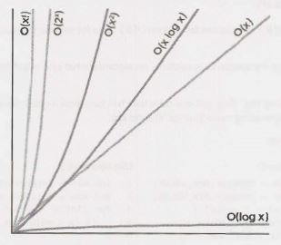

## VI

### BigO

This is such an important concept that we are dedicating an entire (long!) chapter to it.

Big O time is the language and metric we use to describe the efficiency of algorithms. Not understanding it thoroughly can really hurt you in developing an algorithm. Not only might you be judged  harshly for not really understanding big 0, but you will also struggle to judge when your algorithm is getting faster or slower.

Master this concept.


### An Analogy

Imagine the following scenario: You've got a file on a hard drive and you need to send it to your friend who lives across the country. You need to get the file to your friend as fast as possible. How should you send it?

Most people'sfirst thought would be email, FTP, or some other means of electronic transfer. That thought is reasonable, but only half correct.

If it's a small file, you're certainly right. It would take 5 - 10 hours to get to an airport, hop on a flight, and then deliver it to your friend.

But what if the file were really, really large? Is it possible that it's faster to physically deliver it via plane?

Yes, actually  it is. A one-terabyte (1 TB) file could take more than a day to transfer electronically.  It would be much faster to just fly it across the country. If your  file is that urgent (and cost isn't an issue), you might just want to do that.

What if there were no flights, and instead you had to drive across the country? Even then, for a really huge file, it would be faster to drive.


### Time Complexity

This is what the concept of asymptotic runtime, or big O time, means. We could describe the data transfer "algorithm" runtime as:

- Electronic Transfer: O(s), where s is the size of the file. This means that the time to transfer the file increases linearly with the size of the file. (Yes, this is a bit of a simplification, but that's okay for these purposes.)
- Airplane Transfer: O(1)  with respect to the size of the file. As the size of the file increases, it won't take any longer to get the file to your friend. The time is constant.

No matter how big the constant is and how slow the linear increase is, linear will at some point surpass constant.

```
+
|                               XXX
|                            XXX
|     O(1)                 XXX
+-----------------------XXX----------+
|                     XXX
|                   XXX
|                 XXX
|              XXXX
|            XXX    O(S)
|          XXX
|       XXX
|    XXXX
|XXXXX
XX
|
+-----------------------------------+
```


There are many more runtimes than this. Some of the most common ones are O(log  N), O(N log N), O(N), O(N²) and 0(2ᴺ). There's no fixed list of possible runtimes, though.

You can also have multiple variables in your runtime. For example, the time to paint a fence that's w meters wide and h meters high could be described as O(wh). If you needed p layers of paint, then you could say that the time is O(whp).


#### Big 0, Big Theta, and  Big Omega

If  you've never covered big O in an academic setting, you can probably skip this subsection. It might confuse you more than it helps. This "FYI" is mostly here to clear up ambiguity in wording for people who have learned big O before, so that they don't say, "But I thought big O meant..:'

Academics use big 0, big 0 (theta), and big O (omega) to describe runtimes.

- **O (big O):** In academia, big O describes an upper bound on the time. An algorithm that prints all the values in an array could be described as O(N), but it could also be described as O(N²), O(N³), or O(2ᴺ) (or many other big O times). The algorithm is at least as fast as each of these; therefore they are upper bounds on the runtime. This is similar to a less-than-or-equal-to relationship. If Bob is X years old (I'll assume no one lives past age 130), then you could say X <= 130. It would also be correct to say that X <= 1, 000 or X <= 1,000,000. It's technically  true (although not terribly useful). Likewise, a simple algorithm to print the values in an array is O(N) as well as O(N³) or any runtime bigger than O(N). 
- **Ω (big  omega):** In academia, Ω is the equivalent concept but for lower bound. Printing the values in an array is Ω(N) as well as Ω(log  N) and Ω(1). After all, you know that it won't be faster than those runtimes.
- **Θ(big theta):** In academia, Θ means both O and Ω. That is, an algorithm is Θ(N) if it is both O(N) and Ω(N). Θ gives a tight bound on runtime.

In industry (and therefore in interviews), people seem to have merged Θ and O together. Industry's meaning of big O is closer to what academics mean by 0, in that it would be seen as incorrect to describe printing an array as O(N²). Industry would just say this is O(N).

For this book, we will use big O in the way that industry tends to use it: By always  trying  to offer the tightest description of the runtime.


#### Best  Case, Worst  Case, and  Expected Case

We can actually describe our runtime for an algorithm in three different ways.

Let's look at this from the perspective of quick sort. Quick sort picks a random element as a"pivot" and then swaps values in the array such that the elements less than pivot appear before elements greater than pivot. This gives a"partial sort:'Then it recursively sorts the left and right sides using a similar process.

- **Best Case:**  If all elements are equal, then quick sort will, on average, just traverse through the array once. This isO(N). (This actually depends slightly on the implementation of quick sort. There are implementa­ tions, though, that will run very quickly on a sorted array.)
- **Worst Case:** What if we get really unlucky and the pivot is repeatedly the biggest element in the array? (Actually, this can easily happen. If the pivot is chosen to be the first element in the subarray and the array is sorted in reverse order, we'll have this situation.)  In this case, our recursion doesn't divide the array in half and recurse on each half. It just shrinks the subarray by one element.  This will degenerate to anO(N²) runtime.
- **Expected Case:** Usually, though, these wonderful or terrible situations won't happen. Sure, sometimes the pivot will be very low or very high, but it won't happen over and over again. We can expect a runtime of O(N  log   N).

We rarely ever discuss best case time complexity, because it's not a very useful concept. After all, we could take essentially any algorithm, special case some input, and then get an O(1) time in the best case.

For many-probably most-algorithms, the worst case and the expected case are the same. Sometimes they're different, though, and we need to describe both of the runtimes.

What is the relationship between best/worst/expected case and big O/theta/omega?

It's easy for candidates to muddle these concepts (probably because both have some concepts of "higher': "lower" and "exactly right"), but there is no particular relationship between the concepts.

Best, worst, and expected cases describe the big O (or big theta) time for particular inputs or scenarios. 

Big O, big omega, and big theta describe the upper, lower, and tight bounds for the runtime.

### Space Complexity

Time is not the only thing that matters in an algorithm. We might also care about the amount of memory­
or space-required by an algorithm.

Space complexity is a parallel concept to time complexity. If we need to create an array of size n, this will require O(n) space. If we need a two-dimensional  array of size nxn, this will require O(n²) space.

Stack space in recursive calls counts,  too. For example,  code like this would take O(n) time and O(n) space.
```java
int sum(int  n)  {/*Ex  1.*/
    if (n  <=  0)   {
        return 0;
    }
    return n +  sum(n-1);
}   
Each call adds a level to the stack.
sum(4)
   -> sum(3)
      -> sum(2)
         -> sum(l)
              -> sum(0)
Each of these calls is added to the call stack and takes up actual memory.
```

However, just because you have n calls total doesn't mean it takes O(n) space. Consider the below func­tion, which adds adjacent elements between O and  n:

```java
int pairSumSequence(int n) {/*  Ex 2.*/
    int sum  =  0;
    for  (inti=  0; i <   n; i++) {
        sum+=  pairSum(i, i +  1);
    }
    return  sum;
}

int pairSum(int a, int b) {
    return  a +  b;
}
```

There will be roughly O(n) calls to pairSum. However, those calls do not exist simultaneously on the call stack, so you only need O(1) space.


### Drop the Constants

It is very  possible for O(N) code to run faster than O(1) code for specific inputs. Big O just describes the rate of increase.

For this reason, we drop the constants in runtime. An algorithm  that one might have described  as O(2N) is actually O(N).

Many people resist doing this. They will see code that has two (non-nested) for loops and continue this O(2N). They think they're being more "precise:"They're not.

Consider the below code:

```
MinandMax1                      MinandMax2
1 int min = Integer.MAX_VALUE;  1 int min = Integer.MAX_VALUE;
2 int max = Integer.MIN_VALUE;  2 int max = Integer.MIN_VALUE;
3 for (int x : array) {         3 for (int x : array) {
4   if (x < min) min x;         4   if (x < min) min = x;
5   if (x > max) max = x;       5 }
6 }                             6 for (int x : array) {
                                7   if (x > max) max = x;
                                8 }
```

Which one is faster?The first one does one for loop and the other one does two for loops. But then, the first solution has two lines of code per for loop rather than one.

If you're going to count the number of instructions, then you'd have to go to the assembly level and take into account that multiplication requires more instructions than addition, how the compiler would opti­ mize something, and all sorts of other details.

This would be horrendously complicated, so don't even start going down this road. Big O allows us to express how the runtimescales. We just need to accept that it doesn't mean that O(N) is always better than O(N²).


### Drop the Non-Dominant Terms

What do you do about an expression such as O(N² + N)? That second N isn't exactly a constant. But it's not especially important.

We already said that we drop constants. Therefore, O(N² + N²) would be O(N²). If we don't care about that latter N² term, why would we care about N? We don't.

You should drop the non-dominant terms.

- O(N² + N) becomes O(N²).
- O(N +  log  N) becomesO(N).
- O(5\*2ᴺ   +  1000N¹⁰⁰) becomes O(2ᴺ).

We might still have a sum in a runtime. For example, the expression O(B² + A) cannot be reduced (without some special knowledge of A and B).

The following graph depicts the rate of increase for some of the common big O times.




As you can see,0(x²) is much worse than O(x), but it's not nearly as bad as O(2ˣ) or O(x!). There are lots of runtimes  worse than O(x!) too, such as O(xˣ) or O(2ˣ * x!).


### Multi-Part Algorithms: Add vs. Multiply

Suppose you have an algorithm that has two steps. When do you multiply the runtimes and when do you add them?

This is a common source of confusion for candidates.

```
Add the Runtimes: O(A  +  B)        Multiply the Runtimes: O(A*B)
1   for (int a   :   arrA)  {       1   for (int a:   arrA)  {
2       print(a);                   2       for (int b:  arrB) {
3   }                               3           print(a +  "," +  b);
4                                   4       }
5   for (int b  :  arrB) {          5   } 
6       print(b);
7   }
```

In the example on the left, we do A chunks of work then B chunks of work. Therefore, the total amount of work is O(A + B).

In the example on the right,  we do  B chunks of work for each element in A.Therefore, the total amount of work is O(A * B).

In other words:

- If your algorithm is in the form "do this, then, when you're all done, do that" then you add the runtimes. 
- If your algorithm is in the form "do this for each time you do that" then you multiply the runtimes.

It's very easy to mess this up in an interview, so be careful.


### Amortized Time

An ArrayList, or a dynamically resizing array, allows you to have the benefits of an array while  offering flexibility  in size. You won't run  out of space in the Arraylist since  its capacity will grow as you insert elements.

An Arraylist is implemented with an array. When the array hits capacity, the Arraylist class will create a new array with double the capacity and  copy all the elements over to the new array.

How do you describe the  runtime of insertion? This is a tricky question.

The array could be full. If the array contains N elements, then inserting a new element will take O(N) time. You will have to create a new array of size 2N and then copy N elements over.This insertion will take O(N) time.

However, we also know that this  doesn't happen very often. The  vast majority of the time insertion will be in O(l) time.

We need a concept that takes both into account.This is what amortized time does. It allows us to describe that, yes, this  worst case  happens every  once in a while.  But once it happens, it won't happen again for so long that the  cost is "amortized:'

In this case, what is the amortized time?

As we insert elements, we double the capacity when the size of the array is a power of 2. So after X elements, we double the capacity at array sizes  1, 2, 4, 8, 16,  ..., X. That doubling takes,  respectively, 1, 2, 4, 8, 16, 32, 64, ..., X copies.

What  is the sum  of 1  + 2 + 4 + 8 + 16 + ... + X? If you read this sum  left to right,  it starts with  1  and  doubles until it gets to X. If you read  right to left, it starts with X and  halves  until it gets to 1.

What then is the sum  of X +  X/2 +  X/4  +  X/8 + ... + 1 ?This is roughly 2X.

Therefore, X insertions take  O(2X) time. The amortized time for each insertion is O(1).


### Log N Runtimes

We commonly see O(log N) in runtimes. Where does this come from?

Let's look at binary search as an example. In binary search, we are looking for an example x in an N-element sorted array. We first compare x to the midpoint of the array.  If x   ==    middle, then we return. If x   < middle, then we search on the left side of the array.  If x  >   middle, then we search on the right side of the array.

```
search  9 within   {1,  5,  8,  9,  11,  13,  15,  19,  21}
    compare 9 to  11 -> smaller.
    search  9 within {1,  5,  8,  9,  11}
        compare 9 to  8  -> bigger
        search  9 within {9,  11}
            compare 9 to  9 return
```

We start off with an N-element array to search. Then, after a single step, we're down to N/2 elements. One more step, and we're down to N/4 elements.  We stop when we either find the value or we're down to just one element.

The total runtime is then a matter of how many steps (dividing  N by 2 each time) we can take until N becomes 1.

```
N = 16
N = 8    // divide   by  2
N = 4    // divide   by  2
N = 2    // divide   by  2
N = 1    // divide   by  2
```
We could look at this in reverse (going from 1  to 16 instead of 16 to 1). How many times we can multiply 1 by 2 until we get N?
```
N = 1 
N = 2    // divide   by  2
N = 4    // divide   by  2
N = 8    // divide   by  2
N = 16   // divide   by  2
```
What is kin the expression 2k  =   N?This is exactly what log expresses.
```
2⁴     =   16 ->  log₂l6  =  4 
log₂N  =   k  ->  2ᵏ    =  N
```
This is a good takeaway for you to have. When you see a problem where the number of elements in the problem space gets halved each time, that will likely be a O(log N) runtime.

This is the same reason why finding an element in a balanced binary search tree is O(log N). With each comparison, we go either left or right.  Half the nodes are on each side, so we cut the problem space in half each time.

> What's the base of the log?That's an excellent question!The short answer is that it doesn't matter for the purposes of big 0.The longer explanation can be found at "Bases of Logs" on page 630.


### Recursive Runtimes

Here's a tricky one. What's the runtime of this code?

```java
int f(int n)  {
    if (n  <= 1)  {
        return  1;
    }
    return f(n  -  1)  + f(n -  1);
}
```

A lot of people will, for some reason, see the two calls to f and jump to O(N²). This is completely incorrect.

Rather than making assumptions, let's derive the runtime  by walking through  the code. Suppose we call f(4). This calls f(3)  twice. Each of those calls to f(3) calls f(2), until we get down to f(1).

```
                   f(4)
               /          \
             /              \
        f(3)                  f(3)        
       /    \                /    \       
    f(2)    f(2)          f(2)    f(2)    
    /  \    /  \          /  \    /  \    
f(1)    f(1)    f(1)  f(1)    f(1)    f(1)
```


How many calls are in this tree? (Don't count!)

The tree will have depth N. Each node (i.e., function  call) has two children. Therefore, each level will have twice as many calls as the one above it.The number of nodes on each level is:

| LEVEL | # NODES | Also expressed as...             | Or... |
| --    | --      | --                               | --    |
| 0     | 1       |                                  | 2⁰    |
| 1     | 2       | 2 * previous level = 2           | 2¹    |
| 2     | 4       | 2 * previous level = 2 * 2¹ = 2² | 2²    |
| 3     | 8       | 2 * previous level = 2 * 2² = 2³ | 2³    |
| 4     | 16      | 2 * previous level = 2 * 2³ = 2⁴ | 2⁴    |


Therefore, there will be 2° + 2¹ + 2² + 2³ +  2⁴   +   . • .   +  2ᴺ  (which is 2⁽ᴺ⁺¹⁾ - 1) nodes. (See"Sum of Powers of 2ᴺ on page 630.)

Try to remember this pattern. When you have a recursive function that makes multiple calls, the runtime will often (but not always) look like O(branchesᵈᵉᵖᵗʰ), where branches is the number of times each recursive call branches. In this case, this gives us O(2ᴺ).


> As you may recall, the base of a log doesn't matter  for big O since logs of different  bases are only different  by a constant factor. However, this does not apply to exponents. The base of an exponent does matter. Compare 2ⁿ and 8ⁿ. If you expand 8ⁿ, you get (2³)ⁿ which equals 2³ⁿ, which equals 2²ⁿ * 2ⁿ. As you can see, 8ⁿ and 2ⁿ are different by a factor of 2²ⁿ. That is very much not a constant factor!


The space complexity of this algorithm will be O(N). Although  we have O(2ᴺ) nodes in the tree total, only O(N)  exist at any given time. Therefore, we would only need to have O(N) memory available.


### Examples and  Exercises

Big O time is a difficult  concept at first. However, once it"clicks;' it gets fairly easy. The same patterns come up again and again, and the rest you can derive.

We'll start off easy and get progressively more difficult.


**Example 1**

```java
What is the runtime of the below code?
void foo(int[] array)  {
    int sum  =  0;
    int product =  1;
    for  (inti= 0; i <   array.length;   i++) { 
        sum =+ array[i); 
    }
    for  (int i= 0; i <   array.length;   i++) {
        product*=  array[i];
    }
    System.out.println(sum  +  ",  " +  product);
}
```

This will take O(N) time. The fact that we iterate through the array twice doesn't matter.


**Example 2**

```java
What is the runtime of the below code?
1     void printPairs(int[] array)  {
2          for  (int  i= 0; i <   array.length;   i++) {
3               for (int j =  0; j <   array.length;   j++) {
4                System.out.println(array[i] +  "," +  array[j]);
5                }
6            }
7       }
```

The inner for loop has O(N) iterations and it is called N times. Therefore, the runtime is O(N² ).

Another way we can see this is by inspecting what the "meaning" of the code is. It is printing all pairs (two­ element sequences). There are O(N²) pairs; therefore, the runtime is O(N²).


**Example 3**

```java
This is very similar code to the above example, but now the inner for loop starts at i +  1.
1      void printUnorderedPairs(int[] array)  {
2        for  (int i= 0; i <   array.length;   i++) {
3               for  (int j= i +  1; j <   array.length;   j++) {
4                System.out.println(array[i] +  "," +  array[j]);
5                   }
6            }
7      }
```

We can derive the runtime several ways.


> This pattern of for loop is very common. It's important that you know the runtime and that you deeply understand it. You can't rely on just memorizing common runtimes. Deep comprehen­ sion is important.


Counting the Iterations
The first time through j runs for N-1 steps. The second time, it's N-2 steps. Then N-3 steps. And so on. Therefore, the number of steps total is:
```
(N-1) +  (N-2) +  (N-3) +  ... + 2  + 1
    =  1 + 2 + 3 +  ... + N-1
    = sum of  1 through  N-1
```
The sum of 1  through N-1 is (N(N -1))/2 (see "Sum of Integers 1  through N" on page 630), so the runtime will be O(N²).

*What It Means*

Alternatively, we can figure out the runtime by thinking about what the code "means:' It iterates through each pair of values for ( i, j) where j is bigger than i.

There are N² total pairs. Roughly half of those will have i <   j and the remaining half will have i >   j. This code goes through roughly (N²)/2 pairs so it does O(N²) work. 

*Visualizing What It Does*

The code iterates through the following (i, j) pairs when N =  8: 

```
(0, 1)  (0, 2)  (0, 3)  (0, 4)  (0, 5)  (0, 6)  (0, 7)
        (1, 2)  (1, 3)  (1, 4)  (1, 5)  (1, 6)  (1, 7)
                (2, 3)  (2, 4)  (2, 5)  (2, 6)  (2, 7)
                        (3, 4)  (3, 5)  (3, 6)  (3, 7)
                                (4, 5)  (4, 6)  (4, 7)
                                        (5, 6)  (5, 7)
                                                (6, 7)
```

This looks like half of an NxN matrix, which has size (roughly) (N²)/2. Therefore, it takes O (N²)  time.

*Average Work*

We know that the outer loop runs N times. How much work does the inner loop do? It varies across itera­tions, but we can think about the average iteration.

What is the average value of 1,    2,    3,    4,  5,    6,    7,  8,    9,  10? The average value will be in the middle, so it will be roughly 5. (We could give a more precise answer, of course, but we don't need to for big O.)

What about for 1,  2,   3,   ..., N? The average value in this sequence is N/2.

Therefore, since the inner loop does N/2 work on average and it is run N times, the total work is N²/2 which is O(N²).


**Example 4**

This is similar to the above, but now we have two different arrays.

```java
void  printUnorderedPairs(int[] arrayA,  int[] arrayB)  {
    for (inti= 0;  i <   arrayA.length;  i++)  {
        for (int j = 0;  j <   arrayB.length;  j++)  {
            if  (arrayA[i] <   arrayB[j]) {
                System.out.println(arrayA[i] + "," + arrayB[j]); 
            }
        }
    }
}
```


We can break up this analysis. The if-statement within j's for loop is O(1) time since it's just a sequence of constant-time statements.

We now have this:

```java
1     void  printUnorderedPairs(int[]  arrayA,  int[] arrayB)  {
2           for (int i= 0;   i <   arrayA.length;  i++) {
3                 for (int j =  0;   j <   arrayB.length;   j++) {
4                  /* O(1)  work*/
5                  }
6            }
7       }
``` 

For each element ofarrayA, the inner for loop  goes throughb iterations, where b = arrayB.length. lf a = arrayA.length, then the  runtime is O(ab).

If you said O(N²), then remember your mistake for the future.  It's not O(N² ) because there are two different inputs. Both matter. This is an extremely common mistake.


**Example 5**

```java
What about this strange bit of code?
1      void   printUnorderedPairs(int[] arrayA, int[]   arrayB) {
2           for (int i=  0;   i <   arrayA.length;  i++) {
3                 for (int j =  0;   j <   arrayB.length;   j++) {
4                       for (int k=  0;   k  <   100000;  k++)   {
5                            System.out.println(arrayA[i]  +  "," +  arrayB[j]);
6                       }
7                  }
8           }
9      }
```

Nothing has really changed here.  100,000 units of work is still constant, so the  runtime is O(ab).


**Example 6**

```java
The following code reverses an array. What is its runtime?
1      void reverse(int[]  array) {
2           for (inti= 0;   i <array.length/ 2;   i++)  {
3                 int other= array.length -  i -  1;
4                 int temp=  array[i];
5                 array[i] =  array[other];
6                 array[other] =  temp;
7            }
8      }
```

This algorithm runs in O(N) time. The fact that it only goes through half of the array (in terms of iterations) does not  impact the  big O time.

**Example7**

Which of the  following are equivalent to O(N)? Why?

- O(N  +  P), where P  <   N/2
- O(2N)
- O(N  +  log N)
- O(N   +  M)

Let's go through these.

- If P  <  N/2, then we know that N is the dominant term so we can drop the O( P).
- O(2N) is O(N) since we drop constants.
- O(N) dominatesO(log N),so we can drop theO(log N).
- There is no established relationship between N and M, so we have to keep both variables in there. Therefore,all but the last one are equivalent to O(N).

**Examples 8**

Suppose we had an algorithm that took in an array of strings, sorted each string, and then sorted the full array. What would the runtime be?

Many candidates will reason the following: sorting each string is O(N  log   N) and we have to do this for each string,so that's O(N\*N log N).We also have to sort this array,so that's an additional O(N log N) work.Therefore,the total runtime is O(N²  log N +  N log N),which isjust O(N² log N).

This is completely  incorrect. Did you catch the error?

The problem is that we used N in two different  ways. In one case,it's the length of the string (which string?). And in another case, it's the length of the array.

In your interviews, you can prevent this error by either not using the variable "N" at all, or by only using it when there is no ambiguity as to what N could represent.

In fact, I wouldn't even use a and b here,or m and n. It's too easy to forget which is which and mix them up. An O(a²) runtime is completely different from anO(a\*b) runtime.

Let's define new terms-and use names that are logical.

- Let s be the length of the longest string. 
- Let a be the length of the array.

Now we can work through this in parts:

- Sorting  each string is O(s  log s).
- We have to do this for every string (and there are a strings), so that's O(a\*s  log   s).
- Now we have to sort all the strings.There area strings, so you'll may be inclined to say that this takes O(a log a) time. This is what most candidates would say. You should also take into account that you need to compare the strings. Each string comparison takes O(s) time. There are O(a log a) comparisons, therefore this will take O(a\*s log a) time.

If you add up these two parts,you get O(a\*s(log a + log s)). This is it.There is no way to reduce it further.

**Example 9**

The following simple code sums the values of all the nodes in a balanced binary search tree. What is its runtime?

```java
1      int sum(Node  node)  {
2         if (node  == null) {
3                  return  0;
4         }
5         return  sum(node.left) + node.value + sum(node.right);
6       }
```

Just because it's a binary search tree doesn't mean that there is a log in it! We can look at this two ways.

*What It Means*

The most straightforward way is to think about what this means. This code touches each node in the tree once and does a constant time amount of work with each "touch" (excluding the recursive calls).

Therefore, the runtime will be linear in terms of the number of nodes. If there areN nodes, then the runtime is O(N).

*Recursive Pattern*

On page 44, we discussed a pattern  for the runtime of recursive functions that have multiple brnnches. Let's try that approach here.

We said that the runtime of a recursive function with multiple branches is typically O(branchesᵈᵉᵖᵗʰ). There are two branches at each call, so we're looking at O(2ᵈᵉᵖᵗʰ).

At this point many people might assume that something went wrong since we have an exponential algo­ rithm-that something in our logic is flawed or that we've inadvertently created an exponential time algo­ rithm (yikes!).

The second statement is correct. We do have an exponential time algorithm, but it's not as bad as one might think. Consider what variable it's exponential with respect to.

What is depth? The tree is a balanced binary search tree. Therefore,  if there are N total nodes, then depth is roughly log N.

By the equation above, we get O(2¹ᵒᵍ ᴺ). 

Recall what log₂  means:
    
    2ᵖ = Q  - >   log₂Q  =  P

What is 2^log N? There is a relationship between 2 and log, so we should be able to simplify this.

Let P  =  2^log N. By  the definition of log₂, we can write this as log₂P = log₂N. This means that P  =  N.

    Let   P  = 2ˡᵒᵍ ᴺ
      -> log₂P =  log₂N
      -> p  = N
      ->2ˡᵒᵍᴺ  = N

Therefore, the runtime of this code is O(N), where N is the number of nodes.


**Example 10**

The following method checks if a number is prime by checking for divisibility on numbers less than it. It only needs to go up to the square root of n because if n is divisible by a number greater than its square root then it's divisible by something smaller than it.

For example, while 33 is divisible by 11 (which is greater than the square root of 33), the "counterpart"to 11 is 3 (3 * 11 = 33). 33 will have already been eliminated as a prime number by 3.

What is the time complexity of this function?

```java
1     boolean   isPrime(int n)  {
2          for   (int x =  2;  x  *  x  <=  n;  x++)  {
3               if (n  %   X   == 0)  {
4                    return false;
5                   }
6             }
7          return true;
8       }
```

Many people get this question wrong. If you're careful about your logic, it's fairly easy.

The work inside the for loop is constant. Therefore, we just need to know how many iterations the for loop goes through in the worst case.

The for loop will start when x  =  2 and end when x\*x  =  n. Or, in other words, it stops when x = √n (when x equals the square root of n).

This for loop is really something like this:

```java
1     boolean   isPrime(int n)  {
2         for (int x=  2;  x <= sqrt(n);  x++)  {
3               if (n  %   X== 0)  {
4                    return false;
5                }
6          }
7         return true;
8     }
```
This runs in O(√n) time.

**Example 11**

The following code computes n!   (n factorial). What is its time complexity?

```java
1     int factorial(int n)  {
2          if (n  <   0)  {
3               return -1; 
4           }  else if (n == 0)
5                return 1;
6          } else {
7                return n  * factorial(n -  1);
8          }
9       }
```
 
This is just a straight recursion from n to n -1 to n - 2 down to 1. It will take O(n) time.


**Example 12**

This code counts all permutations of a string.

```java
1 void  permutation(String str) {
2   permutation(str,  "");
3 }
4 
5 void  permutation(String str,  String prefix) {
6   if (str.length() ==  0)  {
7       System.out.println(prefix);
8   } else {
9       for (int i= 0;  i <   str.length();  i++)   {
10          String rem  =  str.substring(0, i) + str.substring(i + 1);
11          permutation(rem, prefix  + str.charAt(i));
12      }
13  }
14 }
```

This is a (very!) tricky one. We can think about this by looking at how many times permutation gets called and how long each call takes. We'll aim for getting as tight of an upper bound as possible.

*How many times does permutation get called in its base case?*

If we were to generate a permutation, then we would need to pick characters for each "slot:' Suppose we had 7 characters in the string. In the first slot,we have 7 choices. Once we pick the letter there, we have 6 choices for the next slot. (Note that this is 6 choices for each of the 7 choices earlier.) Then 5 choices for the next slot,and so on.

Therefore,the total number of options is 7 * 6 * 5 * 4 * 3 * 2 * 1, which is also expressed  as 7! (7 factorial). This tells us that there are n! permutations.  Therefore, permutation is called n !   times in its base case (when prefix is the full permutation).

*How many times does permutation get called before its base case?*

But, of course,we also need to consider how many times lines 9 through 12 are hit. Picture a large call tree representing all the calls. There are n !  leaves, as shown above. Each leaf is attached to a path of length n. Therefore,we know there will be no more than n  *  n !  nodes (function calls) in this tree.

*How long does each function call take?*

Executing line 7 takes O(n) time since each character needs to be printed.

Line 10 and line 11 will also take O(n) time combined,due to the string concatenation. Observe that the sum of the lengths of rem, prefix, and str.charAt(i) will always be n.

Each node in our call tree therefore corresponds to O(n) work.

*What is the total runtime?*

Since we are calling permutation O(n *  n ! ) times (as an upper bound),and each one takes O(n) time, the total runtime will not exceed O(n² * n! ).

Through more complex mathematics,we can derive a tighter runtime equation (though not necessarily a nice closed-form expression). This would almost certainly be beyond the scope of any normal interview.


Example 13

The following code computes the Nth Fibonacci number.

```java
1      int fib(int n)  {
2            if (n  <=   0)  return  0;
3            else if (n  ==  1)  return 1;
4         return fib(n  -  1)  + fib(n -  2);
5      }
```

We can use the earlier pattern we'd established for recursive calls: O(branchesᵈᵉᵖᵗʰ).

There are 2 branches per call,and we go as deep as N,therefore the runtime is O(2ᴺ).

> Through some very complicated math,we can actually get a tighter runtime. The time is indeed exponential,but it's actually closer to 0(1. 6ᴺ). The reason that it's not exactly O(2ᴺ) is that, at the bottom of the call stack,there is sometimes only one call. It turns out that a lot of the nodes are at the bottom (as is true in most trees), so this single versus double call actually makes a big difference. Saying O(2ᴺ) would suffice for the scope of an interview,though (and is still techni­ cally correct,  if you read the note about big theta on page 39). You might get "bonus points" if you can recognize that it'll actually be less than that.

Generally speaking, when you see an algorithm with multiple recursive calls, you're looking at exponential runtime.

**Example 14**

The following code prints all Fibonacci numbers from Oto n. What is its time complexity?

```java
1     void  allFib(int n)  {
2         for (int i= 0;  i <  n;  i++)  {
3                   System.out.println(i + ":   "+ fib(i));
4          }
5      }
6
7     int fib(int n)  {
8          if (n  <=  0)  return 0;
9          else if (n  == 1)  return  1;
10       return fib(n - 1)  + fib(n -  2);
11   }
```

Many people will rush to concluding that since fib(n) takes O(2ⁿ) time and it's called n times, then it's O(n2ⁿ).

Not so fast. Can you find the error in the logic?

The error is that the n is changing. Yes, fib(n) takes O(2ⁿ) time, but it matters what that value of n is. 

Instead, let's walk through each call.
```
fib(!) ->  2¹ steps 
fib(2) ->  2² steps 
fib(3) ->  2³ steps 
fib(4) ->  2⁴ steps
...
fib(n) ->  2ⁿ steps
```
Therefore, the total amount of work is:
```
2¹   +  2²   +  2³   +  2⁴   +  ...  +  2ⁿ
```
As we showed on page 44, this is 2ⁿ⁺¹. Therefore, the runtime to compute  the first n Fibonacci numbers (using this terrible algorithm) is still O(2ⁿ).


**Example 15**

The following code prints all Fibonacci numbers from Oto n. However, this time, it stores (i.e., caches) previ­ ously computed  values in an integer array. If it has already been computed, it just returns the cache. What is its runtime?
```java
1     void  allFib(int n)  {
2         int[] memo  =  new int[n + 1];
3          for (int i=    0;  i   n;  i++)   {
4               System.out.println(i + ": "+ fib(i, memo));
5            }
6       }
7
8     int fib(int n,  int[] memo) {
9          if (n  <=          0)  return 0;
10        else if (n==    1)  return 1;
11        else if (memo[n] >  0)  return memo[n];
12
13       memo[n] = fib(n -  1,  memo)+  fib(n -  2,  memo);
14         return memo[n];
15   }
```
Let's walk through what this algorithm does. 
```
fib(l) ->  return 1
fib(2)
    fib(l) ->  return 1 
    fib(0) ->  return  0 
    store 1  at memo[2]
fib(3)
    fib(2) ->  lookup memo[2]   ->  return 1 
    fib(l) ->  return 1
    store 2  at memo[3]
fib(4)
    fib(3) ->  lookup  memo[3]   ->  return  2 
    fib(2) ->  lookup  memo[2]   ->  return 1 
    store 3  at memo[4]
fib(5)
    fib(4) ->  lookup memo[4]   ->  return  3 
    fib(3) ->  lookup memo[3]   ->  return  2 
    store 5  at memo[5]
```

At each call to fib(i), we have already computed and  stored the values for fib(i-1) and  fib(i-2). We just  look up those values,  sum  them, store the new  result, and  return. This takes a constant amount of time.

We're doing a constant amount of work N times, so this is O(n) time.

This technique, called  memoization, is a very  common one to optimize exponential time recursive algo­rithms.


**Example 16**

The following function prints  the powers of 2 from  1 through n (inclusive). For example, if n is 4, it would print  1, 2, and 4. What is its runtime?
```java
1      int  powers0f2(int n) {
2           if (n <   1) {
3                return 0;
4            } else if  (n ==  1) {
5                System.out.println(l);
6                 return 1;
7           }  else {
8                int  prev =  powers0f2(n  / 2);
9              int  curr =  prev *  2;
10               System.out.println(curr);
11               return curr;
12         }
13    }
```
There are several ways we could  compute this runtime.

**What It Does**

Let's walk through a call like powersOf2(50). 
```
powers0f2(50)
    ->  powers0f2(25)
        ->  powers0f2(12)
            ->  powers0f2(6)
                ->  powers0f2(3)
                    ->  powersOf2(1)
                        ->  print &   return 1
                    print &   return  2
                print &   return  4
            print &  return  8 print &  return 16
        print &   return  32
```     
The runtime, then, is the number of times we can divide 50 (or n) by 2 until we get down to the base case (1). As we discussed on page 44, the  number of times we can halve n until we get  1 is O( log n).

**What It Means**

We can also approach the  runtime by thinking about what  the code is supposed to be doing. It's supposed to be computing the  powers of 2 from  1  through n.

Each call to powersOf2 results in exactly one number being printed and returned (excluding what happens in the  recursive calls). So if the algorithm prints  13 values at the end, then powersOf2 was called  13 times.

In this case, we are told  that it prints  all the  powers of 2 between 1 and  n. Therefore, the  number of times the function is called  (which  will be its runtime) must equal the  number of powers of 2 between 1 and n.

There are log N powers of 2 between 1  and n. Therefore, the  runtime is O( log n).

*Rate of Increase*

A final way to approach the  runtime is to think  about how  the  runtime changes as n gets bigger. After all, this is exactly  what  big O time means.

If N  goes from  P to  P+l, the  number of calls to  powersOfTwo might not  change at all. When  will the number of calls to powersOfTwo increase? It will increase by 1 each time n doubles in size.

So, each time n doubles, the  number of calls to powersOfTwo  increases by 1. Therefore, the  number of calls to powersOfTwo is the  number of times you can  double 1 until  you get  n. It is x in the  equation 2ˣ =  n. 

What is x? The value of x is log n. This is exactly  what  meant by x = log n.

Therefore, the  runtime is O( log n).

---

**Additional Problems**

---


Vl.1     The following code computes the product of a and b. What is its runtime?
int product(int a, int b)   {
int sum  =  0;
for (int i= 0;   i <   b;  i++)  {
sum  +=  a;
}
return sum;
}
Vl.2     The following code computes ab. What is its runtime?
int  power(int a, int  b)   {
if (b <   0)   {


CrackingTheCodinglnterview.com \ 6th Edition         55 
VI I     Big 0


return 0;  II error
}  else   if (b  == 0)  {
return 1;
}  else   {
return a *  power(a,  b  -  1);
}
}
Vl.3      The following code computes a   %   b. What is its runtime?
int mod(int  a,  int b)  {
if (b   <=  0) {
return  -1;
}
int div  = a I  b;
return a  -  div  *b;
}
Vl.4    The following code performs integer division. What  is its runtime (assume a and  b are  both positive)?
int div(int a, int b) {
int count  =  0;
int sum =  b·,
while  (sum <=  a)  {
sum  +=  b;
count++;
}
return  count;
}
VI.S    The following code computes the  [integer] square root of a number. If the  number is not  a perfect square (there is no integer square root) , then it returns -1.  It does this by successive guessing. If n is 100, it first guesses SO. Too high? Try something lower  - halfway  between 1 and SO. What is its runtime?
int sqrt(int n)  {
return sqrt_helper(n,  1,  n);
}

int sqrt_helper(int n,  int min,  int max) {
if (max <  min) return -1;  II no square  root

int guess  =  (min +  max) I 2,
if (guess   *guess  == n)  {  II found  it!
return  guess;
}  else if (guess   *guess  <  n)  {  II too  low 
return sqrt_helper(n, guess
}  else {  II too  high
 
max); II try  higher 
return sqrt_helper(n, min,  guess  -  l); II try   lower
}
}
Vl.6    The  following code computes the  [integer] square root of  a  number. If the  number is not a  perfect square (there is no  integer square root), then it returns -1.  It does this  by  trying increasingly large numbers until it finds the  right value  (or is too high). What is its runtime?
int sqrt(int n)  {
for  (int guess  = 1;  guess  *guess  <=  n;  guess++)  {
if (guess  *  guess  ==  n)  {
return  guess;


56           Cracking the Coding Interview, 6th Edition 
VI I     Big 0


}
}
return  -1;
}
Vl.7    If a binary search tree is not balanced, how long might it take (worst case) to find an element in it?

Vl.8      You are looking for a specific value in a binary tree,  but the tree  is not a binary search  tree.
What is the time complexity of this?

Vl.9    The appendToNew method appends a value to an array by creating  a new, longer array and returning  this longer  array. You've used the appendToNew method to create  a copyArray function that repeatedly calls appendToNew. How long does copying an array take?
int[]  copyArray(int[] array) { int[] copy=  new  int[0]; for (int value   :   array) {
copy=  appendToNew(copy,  value);
}
return copy;
}

int[] appendToNew(int[] array, int  value) {
// copy all elements  over  to  new  array
int[] bigger=  new  int[array.length +  1];
for  (int i= 0;  i <  array.length; i++)  {
bigger[i] =  array[i];
}
 
// add new  element bigger[bigger.length -  1] return  bigger;
}
 

value; 
Vl.10   The following code sums the digits in a number. What is its big O time?
int  sumDigits(int n)  {
int sum  =  0;
while  (n  >   0)  {
sum  +=  n %   10;
n /=  10;
}
return sum;
}
Vl.11    The following code  prints all strings of length  k where the characters are in sorted  order. It does this by generating all strings of length k and then checking if each is sorted. What is its runtime?
int numChars   =  26;

void  printSortedStrings(int  remaining) {
printSortedStrings(remaining,  "");
}

void  printSortedStrings(int remaining,   String prefix) {
if (remaining== 0)  {
if (isinOrder(prefix)) {
System.out.println(prefix);
}


CrackingTheCodinglnterview.com I 6th  Edition             57t. 
VI I       Big 0


}  else {
for (int i=  0;   i <   numchars; i++)  {
char c  =  ithletter(i);
printSortedStrings(remaining -  1,   prefix +  c);
}
}
}

boolean isinOrder(String  s)  {
for (int i=  1;   i <   s.length();  i++) {
int prev   ithLetter(s.charAt(i  -   1));
int curr =  ithLetter(s.charAt(i));
if (prev >  curr) {
return false;
}
}
return true;
}

char ithLetter(int i)  {
return (char) (((int)  'a')  +  i);
}
Vl.12    The  following code computes the  intersection (the  number of elements in common) of two arrays. It assumes that neither array has duplicates. It computes the  intersection by sorting one  array (array  b) and  then iterating through array a  checking (via binary  search) if each value  is in b. What is its runtime?
int  intersection(int[]  a, int[]  b) {
mergesort(b);
int intersect =  0;

for (int x   :   a) {
if (binarySearch(b,  x)  >= 0) {
intersect++;
}
}
 


}

Solutions
 
return intersect; 


1. O(b). The for loop just  iterates through b.

2.  0(b). The recursive code iterates through b calls, since it subtracts one at each level.

3.  0(1). It does a constant amount of work.

4.  0( X ). The variable count will eventually equal X.The  while loop iterates count times. Therefore, it iterates X times.

5.  0(log  n). This algorithm is essentially doing a binary search to find  the square root. Therefore, the runtime isO(log n).
6.  O(sqrt(n)). This is just  a straightforward loop  that stops when guess\*guess   >     n  (or, in other words, when guess  >  sqrt(n)).


58          Cracking the Coding Interview, 6th Edition 
VI I      Big 0


7. O(n), where n is the number of nodes in the tree.The max time to find an element is the depth tree.The tree could be a straight list downwards and have depth n.
8.  O(n). Without anyordering propertyon the nodes, we might have to search through all the nodes.

9.  O(N² ), where n is the number of elements in the array. The first call to appendToNew takes 1  copy. The second call takes 2 copies.The third call takes 3 copies. And so on.The total time will be the sum of 1 through n,which isO(N²).
10.0(log n). The runtime will be the number of digits in the number. A number with d digits can have a value up to 10d. If n  =  10d,then  d  =  log n. Therefore, the runtime is 0(log n).

11.0(kck), where k is the length of the string and c is the number of characters in the alphabet.  It takes
0(c k) time to generate  each string. Then, we need to check that each of these is sorted, which takes
O(k) time.

12.0(b log  b  +  a  log  b).First,we have to sort arrayb,which takesO(b  log b) time.Then,for each element in a,we do binarysearch in 0(log b) time.The second part takesO(a log b) time.


