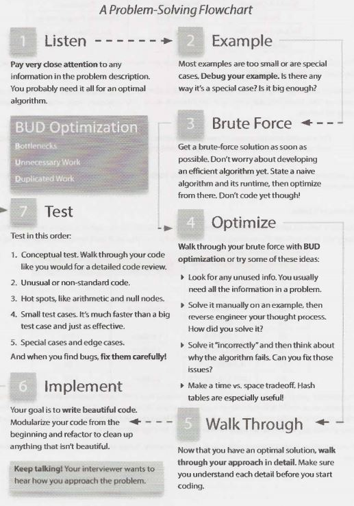
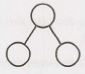

## VII

### Technical Questions


Technical questions form the basis for how many of the  top  tech companies interview. Many candidates are intimidated by the  difficulty of these questions, but  there are logical ways to approach them.


### How to Prepare

Many candidates just  read through problems and  solutions. That's like trying  to learn  calculus by reading a problem and its answer. You need to practice solving problems. Memorizing solutions won't help you much.

For each problem in this book  (and any other problem you might encounter), do the  following:

1. *Try to solve the problem on your own.* Hints are  provided at the  back  of this book,  but  push yourself  to develop a solution with as little help as possible. Many questions are designed to be tough-that's okay! When  you're solving a problem, make sure to think  about the  space and  time  efficiency.
2. *Write the code on paper.* Coding on a computer offers luxuries such  as syntax highlighting, code comple­ tion, and  quick debugging. Coding on paper does not. Get used to this-and to how  slow it is to write and  edit  code-by coding on paper.
3. *Test your code-on paper.* This means testing the  general cases,  base cases,  error  cases,  and  so on. You'll need to do this during your interview, so it's best to practice this in advance.
4. *Type your paper code as-is into a computer.* You will probably make a bunch of mistakes. Start a list of all the  errors  you make so that you can keep these in mind during the  actual interview.

In addition, try to do as many mock interviews as possible. You and a friend can take turns giving each other mock  interviews. Though your friend  may not  be an expert interviewer, he or she may still be able  to walk you  through a coding or algorithm problem. You'll also learn  a lot by experiencing what it's like to be  an interviewer.


### What You Need To Know

The  sorts  of data structure and  algorithm questions that many companies focus  on  are  not  knowledge tests.  However, they  do assume a baseline of knowledge.


#### Core  Data Structures, Algorithms, and Concepts

Most interviewers won't ask about specific  algorithms for  binary tree  balancing or other complex algo­rithms. Frankly, being several  years out  of school, they  probably don't remember these algorithms either.

You're usually  only expected to know  the  basics.  Here's a list of the  absolute, must-have knowledge:

| Data Structures       | Algorithms           | Concepts                |
| --                    | --                   | --                      |
| Linked Lists          | Breadth-First Search | Bit Manipulation        |
| Trees, Tries, &Graphs | Depth-First Search   | Memory (Stack vs. Heap) |
| Stacks & Queues Heaps | Binary Search        | Recursion               |
| Heaps                 | Merge Sort           | Dynamic Programming     |
| Vectors/Arraylists    | Quick Sort           | Big OTime & Space       |
| Hash Tables           |                      |                         |

For each of these topics,make sure you understand how to use and implement them and, where applicable, the space and time complexity.

Practicing implementing the data structures and algorithm (on paper, and then on a computer) is also a great exercise.  It will help you learn how the internals of the data structures work, which is important for many interviews.


> Did you miss that paragraph above? It's important. If you don't feel very, very comfortable with each of the data structures and algorithms listed, practice implementing them from scratch.


In particular,  hash tables are an extremely important topic. Make sure you are very comfortable with this data structure.


#### Powers of 2 Table

The table below is useful for many questions involving scalability or any sort of memory limitation. Memo­
rizing this table isn't strictly required, but it can be useful. You should at least be comfortable deriving it.


| Power of 2 | Exact Value (x)   | Approx. Value | X bytes into MB, GB, etc. |
| 7	         | 128               | 	             |                           |
| 8	         | 256               | 	             |                           |
| 10         | 1024              | 	1 thousand   | 1KB                       |
| 16         | 65,536            | 	             | 64KB                      |
| 20         | 1,048,576         | 	1 million    | 1 MB                      |
| 30         | 1,073,741,824     | 	1 billion    | 1 GB                      |
| 32         | 4,294,967,296     | 	             | 4GB                       |
| 40         | l,099,511,627,776 | 	1 trillion   | 1TB                       |

For example, you could use this table to quickly compute that a bit vector mapping every 32-bit integer to a boolean value could fit in memory on a typical machine.There are 2^32 such integers. Because each integer takes one bit in this bit vector, we need 2^32 bits (or 2^29 bytes) to store this mapping.That's about half a giga­ byte of memory, which can be easily held in memory on a typical machine.

If you are doing a phone screen with a web-based company, it may be useful to have this table in front of you.


### Walking Through a Problem

The below map/flowchart walks you through how to solve a problem. Use this in your practice. You can download  this handout  and more at CrackingTheCodinglnterview.com.



We'll go through this flowchart in more detail.


#### What  to Expect

Interviews are supposed to be difficult. If you  don't  get  every-or any-answer immediately, that's okay! That's the normal experience, and it's not bad.

Listen for guidance from the interviewer. The interviewer might take a more active or less active role in your problem solving. The level of interviewer participation depends on your performance, the difficulty of the question, what the interviewer is looking for, and the interviewer's own personality.

When you're given a problem  (or when you're practicing), work your way through it using the approach below.


##### 1. Listen  Carefully

You've likely heard this advice  before, but I'm saying something a bit more than the standard "make sure you hear the problem correctly" advice.

Yes, you do want to listen to the problem and make sure you heard it correctly. You do want to ask questions about anything you're unsure about.

But I'm saying something more than that.

Listen carefully to the problem, and be sure that you've mentally recorded any unique information in the problem.

For example, suppose a question starts with one of the following lines.  It's reasonable to assume that the information is there for a reason.

- "Given two arrays that are sorted, find ..:'

  You probably  need to know that the data is sorted. The optimal algorithm for the sorted situation is probably different than the optimal algorithm for the unsorted situation.

- "Design an algorithm to be run repeatedly on a server that ..."

   The server/to-be-run-repeatedly situation is different from the run-once situation. Perhaps this means that you cache data? Or perhaps it justifies some reasonable precomputation on the initial dataset?

It's unlikely (although not impossible) that your interviewer would give you this information if it didn't affect the algorithm.

Many candidates will hear the problem correctly. But ten minutes into developing  an algorithm, some of the key details of the problem have been forgotten. Now they are in a situation where they actually can't solve the problem optimally.

Your first algorithm doesn't need to use the information. But if you find yourself stuck, or you're still working to develop something more optimal, ask yourself if you've used all the information in the problem.

You might even find it useful to write the pertinent information on the whiteboard.


##### 2. Draw an Example

An example can dramatically improve your ability to solve an interview question, and yet so many candi­dates just try to solve the question in their heads.

When you hear a question, get out of your chair, go to the whiteboard, and draw an example. 

There's an art to drawing an example though. You want a good example.

Very typically, a candidate might draw something like this for an example of a binary search tree:





This is a bad example for several reasons. First, it's too small. You will have trouble finding a pattern in such a small example. Second, it's not specific. A binary search tree has values. What if the numbers tell you something about how to approach the problem? Third, it's actually a special case. It's not just a balanced tree, but it's also a beautiful, perfect tree where every node other than the leaves has two children. Special cases can be very deceiving.

Instead, you want to create an example that is:

- Specific. It should use real numbers or strings (if applicable to the problem). 
- Sufficiently large. Most examples are too small, by about 50%.
- Not a special case. Be careful. It's very easy to inadvertently draw a special case. If there's any way your example is a special case (even if you think it probably won't be a big deal), you should fix it.

Try to make the best example you can. If it later turns out your example isn't quite right, you can and should fix it.


##### 3. State a Brute Force

Once you have an example done (actually, you can switch the order of steps 2 and 3 in some problems), state a brute force. It's okay and expected that your initial algorithm won't be very optimal.

Some candidates don't state the brute force because they think it's both obvious and terrible. But here's the thing: Even if it's obvious for you, it's not necessarily obvious for all candidates. You don't want your inter­ viewer to think that you're struggling to see even the easy solution.

It's okay that this initial solution is terrible. Explain what the space and time complexity is, and then dive into improvements.

Despite being possibly slow, a brute force algorithm is valuable to discuss. It's a starting point for optimiza­
tions, and it helps you wrap your head around the problem.


##### 0ptimize

Once you have a brute force algorithm, you should work on optimizing it. A few techniques that work well are:

1. Look for any unused information. Did your interviewer tell you that the array was sorted? How can you leverage that information?

2. Use a fresh example. Sometimes, just seeing a different example will unclog your mind or help you see a pattern in the problem.

3. Solve it"incorrectly:' Just like having an inefficient solution can help you find an efficient solution, having an incorrect solution might help you find a correct solution. For example, if you're asked to generate  a random value  from a set  such  that all values are equally likely, an incorrect solution might be one that returns a semi-random value:  Any value  could be  returned, but some are more likely than others. You can then think about why that solution isn't perfectly random. Can you rebalance the  probabilities?

4. Make time vs. space tradeoff. Sometimes storing extra  state about the  problem can help you optimiz:e the  runtime.

5. Precompute information. Is there a way that you can reorganiz:e the  data (sorting, etc.) or compute some values upfront that will help save time  in the long  run?

6. Use a hash table. Hash tables are widely  used in interview questions and  should be  at the  top  of your mind.

7. Think about the  best conceivable runtime (discussed on page 72).

Walk through the bruteforce with theseideas in mind and look for BUD (page 67).


##### 5. Walk Through

After you've nailed down an optimal algorithm, don't just  dive into coding. Take a moment to solidify your understanding of the  algorithm.

Whiteboard coding is slow-very slow. So is testing your code and  fixing it. As a result,  you need to make sure that you get  it as close to "perfect" in the beginning as possible.

Walk through your algorithm and  get  a feel for the  structure of the  code.  Know what the  variables are and when they change.

> What  about pseudocode? You can  write  pseudocode if you'd like. Be careful  about what you write.  Basic steps ("(1) Search array. (2) Find biggest. (3) Insert  in heap:') or brief  logic ("if p    < q, move p. else  move q") can  be  valuable. But when your  pseudocode starts having for loops that are written in plain English, then you're  essentially just writing sloppy code.  It'd probably be faster  to just write the  code.


If you don't understand exactly  what you're about to write, you'll struggle to code it. It will take you longer to finish the  code,  and  you're more likely to make major errors.

##### 6. Implement

Now that you have an optimal algorithm and  you know  exactly  what you're  going to write, go ahead and implement it.

Start  coding in the  far top  left corner of the  whiteboard (you'll need the  space).  Avoid "line creep" (where each line of code is written an awkward slant).  It makes your  code look messy and  can be  very confusing when working in a whitespace-sensitive language, like Python.

Remember that you only have a short amount of code to demonstrate that you're a great developer. Every­ thing counts. Write beautiful code. 

Beautiful  code means:

- Modularized code. This shows good coding style. It also makes things easier for you. If your  algorithm uses  a matrix  initialized to  { { 1,   2,   3},   {4,    5,   6},  ...}, don't waste your  time  writing this initialization code.  Just  pretend you have a function initlncrementalMatrix(int size). Fill in the  details later  if you need to.

- Error checks. Some interviewers  care a lot about this, while others  don't. A good compromise here is to add a todo and then just explain out loud what you'd like to test.

- Use other  classes/structs where  appropriate. If you need  to return  a list of start  and end  points  from a function,  you  could  do  this as a two-dimensional array. It's better though to  do  this as a list of StartEndPair (or possibly Range)  objects. You don't necessarily have to fill in the details for the class. Just pretend it exists and deal with the details later if you have time.

- Good variable names. Code that  uses single-letter variables everywhere is difficult to read. That's not to say that  there's anything wrong with using i and j, where appropriate (such as in a basic for-loop iter­ ating  through an array). However, be careful about where you do this. If you write something like int i =  startOfChild ( array), there might be a better name for this variable, such as startChild.
   
    Long variable names  can also be slow to write though. A good compromise that most interviewers will be okay with is to abbreviate it after the first usage. You can use startChild the first time, and then explain to your interviewer that you will abbreviate this as sc after this.

The specifics of what makes good code vary between interviewers  and candidates, and the problem itself. Focus on writing beautiful  code, whatever that means to you.

If you see something you can refactor later on, then explain this to your interviewer and decide  whether or not it's worth the time to do so. Usually it is, but not always.

If you get confused (which is common), go back to your example and walk through it again.


##### 7. Test

You wouldn't check in code in the real world without testing it, and you shouldn't"submit"code in an inter­
view without testing it either.

There are smart and not-so-smart ways to test your code though.

What many candidates do is take their earlier example and test it against  their code. That might  discover bugs, but  it'll take a really long time to do so. Hand testing is very slow. If you really did use a nice, big example to develop your algorithm, then  it'll take you a very long time to find that little off-by-one error at the end of your code.

Instead, try this approach:

1. Start with a"conceptual"test. A conceptual test means just reading and analyzing what each line of code does. Think about it like you're explaining the lines of code for a code reviewer. Does the code do what you think it should do?

1. Weird looking code. Double check that  line of code that says x   =  length  -   2. Investigate that  for loop that starts at i =  1. While you undoubtedly did this for a reason, it's really easy to get it just slightly wrong.

1. Hot spots. You've coded  long enough to know  what  things  are likely to cause  problems.  Base cases in recursive code. Integer division. Null nodes in binary trees. The start and end of iteration  through a linked list. Double check that stuff.

1. Small test cases. This is the first time we use an actual, specific test case to test the code. Don't use that nice, big 8-element array from the algorithm part. Instead, use a 3 or 4 element array. It'll likely discover the same bugs, but it will be much faster to do so.

1. Special cases. Test your code against  null or single element values, the extreme cases, and other  special cases.

When  you find bugs (and  you  probably will), you should of course fix them. But don't just make the  first correction you think  of. Instead,carefully analyze why the  bug  occurred and  ensure that your fix is the  best one.


### Optimize & Solve Technique #1: Look for BUD

This is perhaps the  most useful approach I've  found for optimizing problems. "BUD" is a silly acronym for;

- Bottlenecks
- Unnecessary work
- Duplicated work

These are three of the most common things that an algorithm can "waste"time doing. You can walk through your brute force looking for these things. When you find one of them, you can then focus on getting rid of it.

If it's still not  optimal, you can repeat this approach on your current best algorithm.

#### Bottlenecks

A bottleneck is a part  of your algorithm that slows down the  overall runtime. There  are two common ways this occurs:

- You have one-time work that slows  down your algorithm. For example, suppose you have a two-step algorithm where you first sort the  array and  then you find elements with a particular property. The first step isO(N log  N) and  the second step isO(N).  Perhaps you could reduce the  second step toO(log N) or 0(1), but  would it matter? Not too  much.  It's certainly not  a priority,  as theO(N log  N) is the bottleneck. Until you optimize the  first step, your overall algorithm will beO(N log  N).

- You have a chunk of work that's done repeatedly, like searching. Perhaps you can reduce that from O(N) to O(log  N) or even 0(1). That will greatly speed up your overall runtime. 

Optimizing a bottleneck can make a big difference in your overall runtime.

> Example:  Given an  array  of distinct integer values,  count the  number of pairs  of integers that have difference k. For example, given  the array {1,   7,  5,  9,  2,  12,  3} and the  difference
k  =  2,there are four pairs  with difference 2: (1,  3),  (3, 5),  (5,  7),  (7,  9).


A brute force algorithm is to go through the  array,starting from the first element, and then search through the  remaining elements (which  will form the  other side of the  pair). For each pair, compute the  difference. If the  difference equals k, increment a counter of the  difference.

The bottleneck here is the  repeated search for the  "other  side" of the pair. It's therefore the  main  thing to focus  on optimizing.

How can we more quickly find the  right "other  side"? Well, we actually know  the  other side  of (x,  ? ). It's x +   k or x - k. If we sorted the  array,we could  find the  other side  for each of the N elements in O(log N) time  by doing a binary  search.

We now  have a two-step algorithm, where both steps take O(N  log  N) time.  Now, sorting is the  new bottleneck. Optimizing the second step won't help because the first step is slowing us down anyway.

We just have to get  rid of the  first step entirely and  operate on an unsorted array. How can  we find things quickly in an unsorted array? With a hash table.

Throw everything in the array into the hash table. Then, to look up if x  +  k or x  -   k exist in the array, we just look it up in the hash table. We can do this in O(N) time.


#### UnnecessaryWork
 
> Example: Print all positive integer solutions to the equation a3 +  b3 = c3  +  d3 where a, b, c, and d are integers between  1  and 1000.
 
A brute force solution will just have four nested for loops. Something like:

	1     n =  1000
	2     for   a  from      to  n
	3          for   b from      to   n
	4               for   c  from      to  n
	S                   for d  from      to  n
	6                         if a3   + b3  == c3  +d3
	7                              print a,   b,  c, d

This algorithm iterates through all possible values of a, b, c, and d and checks if that combination happens to work.

It's unnecessary to continuechecking for other possiblevalues of d. Only one could work. We should at least break after we find a valid solution.

	1     n =  1000
	2     for   a  from      to  n
	3          for   b from      to  n
	4               for   c  from      to  n
	S                    for d  from      to  n
	G                        if a3   + b3  == c3  +d3
	7                              print a,   b,  c, d
	8                              break//    break  out  ofd's  loop

This won't make a meaningful change to the runtime-our algorithm is still O(N4)-but it's still a good, quick fix to make.

Is there anything else that is unnecessary? Yes.  If there's onl  one valid d value for each (a, b, c), then we can just compute it. This is just simple math: d = 3    a 3  + b 3  - C 3  •

```
1  n =  1000
2  for   a  from      to  n
3     for   b  from      to   n
4       for   c  from      to  n 
5          d =  pow(a3  + b3 - c3, 1/3) // Will  roudn to  int
6          if a3 + b3  ==  c3 + d3 // Validate that the value   works
7              print a,   b,  c, d
```

The if statement  on line 6 is important. Line 5 will always find a value for d, but we need to check that it's the right integer value.

This will reduce our runtime from O(N4 ) to O(N3 ).


##### Duplicated Work

Using the same problem and brute force algorithm as above, let's look for duplicated work this time.

The algorithm operates by essentially iterating through all (a,  b) pairs and then searching all (c,  d) pairs to find if there are any matches to that (a,  b)  pair.

Why do we keep on computing all (c, d) pairs for each (a, b) pair?We shouldjust create the list of ( c, d) pairs once.Then, when we have  an (a, b) pair, find the matches within the  (c,  d) list.We can quickly locate the  matches by inserting each ( c,  d) pair into a hash table that maps from the sum  to the pair (or, rather, the  list of pairs  that have  that sum).

	1   n  =  1000
	2   for c  from   1  to n
	3         for d  from 1  to  n
	4               result =  c3   +d'
	5               append (c,  d)   to list  at  value map[result]
	6   for a  from   1  to n
	7         for b  from   1  to n
	8               result= a' +  b3
	9               list= map.get(result)
	10              for each pair in list
	11                  print  a, b,   pair

Actually, once we have  the  map of all the  (c,  d) pairs,  we can just use  that directly. We don't need to generate the  (a,  b) pairs. Each (a,  b) will already be in the map.

	1     n  =  1000
	2     for c  from   1  to n
	3          for d  from   1  to  n
	4                result =  c3   +d3
	5                append  (c, d)  to list at value map[result]
	6
	7     for  each result, list  in map
	8          for each pairl  in list
	9                for  each pair2 in  list
	10                   print pairl,  pair2

This will take our runtime to O(N²).


### Optimize & Solve Technique #2: DIY (Do It Yourself)

The first time you heard about how to find an element in a sorted array (before being taught binary search), you probably didn't jump to, "Ah ha!We'll compare the target element to the  midpoint and then recurse on the  appropriate half'

And yet, you  could give  someone who  has  no  knowledge of computer science an  alphabetized pile  of student papers and they'll  likely  implement something like  binary search to  locate a  student's  paper. They'll  probably say, "Gosh, Peter Smith?  He'll be  somewhere in the  bottom of the  stack:'They'II pick  a random paper in the middle(ish), compare the name to "Peter Smith'; and then continue this process on the remainder of the  papers. Although they have  no knowledge of binary search, they  intuitively "get it:'

Our brains are  funny  like this. Throw the  phrase "Design an  algorithm" in there and people often get  all jumbled up. But give people an actual example-whether just of the  data (e.g., an array) or of the  real-life parallel (e.g., a pile of papers)-and their  intuition gives them a very nice algorithm.

I've seen this come up countless times with  candidates.Their computer algorithm is extraordinarily slow, but when asked to solve the  same problem manually, they  immediately do  something quite fast.  (And it's not too  surprisingly, in some sense.Things that are slow for a computer are often slow by hand.Why would you put  yourself through extra work?)

Therefore, when you get a question, try just working it through intuitively on a real example. Often a bigger example will be easier.

> Example: Given a smaller strings and a bigger string b, design an algorithm to find all permuta­
tions of the shorter string within the longer one.Print the location of each permutation.

Think for a moment  about  how you'd solve this problem. Note permutations  are rearrangements of the string, so the characters in s can appear in any order in b.They must be contiguous though(not split by other characters).

If you're like most candidates, you probably thought of something like: Generate all permutations ofs and then look for each in b.Since there are S! permutations, this will takeO(S !    * B) time, whereS is the length ofs and B is the length of b.

This works, but it's an extraordinarily slow algorithm. It's actually worse than an exponential algorithm. Ifs has 14 characters, that's over 87 billion permutations. Add one more character into s and we have 15 times more permutations.Ouch!

Approached a different way, you could develop a decent algorithm fairly easily. Give yourself a big example, like this one:
   
	s:   abbc
	b:   cbabadcbbabbcbabaabccbabc

Where are the permutations of s within b? Don't worry about how you're doing it.Just find them.Even a 12 year old could do this!

(No, really, go find them.I'll wait!)

I've underlined below each permutation. 

	s:   abbc
	b:  cbabadcbbabbcbabaabccbabc
	   ____   ____ ____
	     ____ ____ ___


Did you find these? How?

Few people-even those who earlier came up with the 0(S !  * B) algorithm-actually generate  all the permutations  of abbc  to locate those permutations  in b.Almost everyone takes one of two(very similar) approaches:

1. Walk through b and look at sliding windows of4 characters(sinces has length 4).Check if each window is a permutation ofs.
2. Walk through b.Every time you see a character ins, check if the next four(the  length ofs) characters are a permutation ofs.

Depending on the exact implementation of the "is this a permutation" part, you'll probably get a runtime of eitherO(B * S),O(B * Slog S), or O(B * S2).None of these are the most optimal algorithm(there is an 0( B) algorithm), but it's a lot better than what we had before.

Try this approach when you're solving questions. Use a nice, big example and intuitively-manually, that is-solve it for the specific example.Then, afterwards, think hard about how you solved it.Reverse engineer your own approach.

Be particularly aware of any"optimizations"you intuitively or automatically made. For example, when you were doing this problem, you might have just skipped right over the sliding window with "d"  in it since "d"  isn't in abbc. That's an optimization your brain made, and it's something you should at least be aware of in your algorithm.

### Optimize & Solve Technique #3: Simplify and Generalize

With Simplify and Generalize, we implement  a multi-step approach.  First we simplify or tweak some constraint, such as the data type. Then, we solve this new simplified version of the problem. Finally, once we have an algorithm for the simplified problem, we try to adapt it for the more complex version.

> Example:  A ransom note  can be formed by cutting  words out of a magazine to form a new sentence. How would you figure out if a ransom note (represented as a string) can be formed from a given magazine (string)?

To simplify the problem, we can modify it so that we are cutting characters  out of a magazine instead of whole words.

We can solve the simplified ransom note problem with characters by simply creating an array and counting the characters. Each spot in the array corresponds to one letter. First, we count the number of times each character in the ransom note appears, and then we go through the magazine to see if we have all of those characters.

When we generalize the algorithm, we do a very similar thing. This time, rather than creating an array with character counts, we create a hash table that maps from a word to its frequency.


### Optimize & Solve Technique #4: Base Case and Build

With Base Case and Build, we solve the problem first for a base case (e.g., n  =  1) and then try to build up from there. When we get to more complex/interesting cases (often n = 3 or n = 4), we try to build those using the prior solutions.


> Example: Design an algorithm to print all permutations of a string. For simplicity, assume all char­acters are unique.


Consider a test string abcdefg.

	Case  "a"   -->  {"a"}
	Case  "ab"   -->  {"ab", "ba"} 
	Case  "abc"   -->   ?

This is the first "interesting" case. If we had the answer to P ("ab"), how could we generate  P ("abc")? 

Well, the additional letter is "c," so we can just stick c in at every possible point. That is: 

P("abc") = insert "c" into all locations of all strings in P("ab")
P("abc") = insert "c" into all locations of all strings in {"ab","ba"}
P("abc") = merge({"cab", ""acb", "abc"}, {"cba", abca", bac"})
P("abc") = {"cab", "acb", "abc", "cba", "bca", bac"} 
   
Now that we understand the pattern, we can develop a general recursive algorithn1:We generate all permu­ tations of a string s1 .... sn by "chopping off" the last character and generating  all permutations  of s1 .....  sn_1   Once we have the list of all permutations of s1 ..... Sn-1, we iterate through this list. For each string in it,
we insert Sn  into every location of the string.

Base Case and Build algorithms often lead to natural recursive algorithms.


### Optimize & Solve Technique #5: Data Structure Brainstorm

This approach is certainly hacky, but  it often works. We can simply  run through a list of data structures and try to apply each one. This approach is useful because solving  a problem may be trivial once it occurs to us to use, say, a tree.

> Example:  Numbers are  randomly generated and  stored into  an  (expanding) array. How would you keep track of the  median?


Our data structure brainstorm might look like the  following:

- Linked list? Probably not. Linked lists tend not  to do very well with accessing and  sorting numbers.

- Array? Maybe,  but  you  already have an  array. Could  you  somehow keep the  elements sorted? That's probably expensive. Let's hold off on this and  return to it if it's needed.

- Binary tree? This is possible, since  binary  trees do  fairly well with  ordering. In fact, if the  binary  search tree  is perfectly balanced, the  top  might be the  median. But, be  careful-if  there's an even number of elements, the median is actually the average of the middle two elements. The middle two elements can't both be at the  top. This is probably a workable algorithm, but  let's come back to it.

- Heap?  A heap is really  good at  basic  ordering and  keeping track  of max  and  mins. This is actually interesting-if you had two  heaps, you could keep track of the  bigger half and  the  smaller half of the elements. The bigger half is kept  in a min heap, such  that the  smallest element in the  bigger half is at the root. The smaller half is kept  in a max heap, such that the  biggest element of the smaller half is at the root.  Now, with these data structures, you have the  potential median elements at the  roots.  If the  heaps are no longer the  same size, you can quickly "rebalance" the  heaps by popping an element off the  one heap and  pushing it onto the  other.

Note that the  more problems you do, the  more developed your  instinct on  which data structure to apply will be. You will also develop a more finely tuned instinct as to which of these approaches is the most useful.


### Best Conceivable Runtime (BCR)

Considering the  best conceivable runtime can offer a useful hint  for some problem.

The best conceivable runtime is, literally, the  best runtime you could conceive of a solution to  a problem having. You can easily prove that there is no way you could beat the  BCR.

For example, suppose you  want to compute the  number of elements that two  arrays  (of length A and  B) have in common. You immediately know that you can't do that in better than O(A  +  B) time because you have to "touch" each element in each array. O(A   +   B) is the  BCR.

Or, suppose you want to print  all pairs of values within  an array. You know  you can't  do that in better than
0(N²) time  because there are N²  pairs to print.

Be careful though! Suppose your interviewer asks you to find all pairs with sum  k within an array (assuming all distinct elements). Some candidates who  have not  fully mastered the  concept of BCR will say that the BCR is O(N² ) because you have  to look at N² pairs.
That's  not  true. Just  because you want all pairs  with a particular sum  doesn't mean you have to look at all
pairs. In fact, you don't.

> What's the relationship between the Best Conceivable Runtime and Best Case Runtime? Nothing at all! The Best Conceivable Runtime is for a problem and is largely a function of the inputs and outputs.  It has no particular connection  to a specific algorithm. In fact, if  you compute  the Best Conceivable Runtime by thinking about what your algorithm does, you're probably doing something  wrong. The Best Case Runtime is for a specific algorithm (and is a mostly useless value).


Note that the best conceivable runtime is not necessarily achievable, It says only that you can't do better
than it.


##### An Example of How to Use BCR

Question: Given two sorted arrays, find the number of elements in common. The arrays are the same length and each has all distinct elements.

Let's start with a good example. We'll underline the elements in common.

	A:  13   27    35   40   49   55    59
	B:  17   35   39   40   55   58    60

A brute force algorithm for this problem is to start with each element in A and search for it in B. This  takes O(N²) time since for each of N elements in A, we need to do anO(N)  search in B.

The  BCR isO(N), because we know we will have to look at each element at least once and there are 2N total elements. (If we skipped an element, then the value of that element could change the result. For example, if we never looked at the last value in B, then that 60 could be a 59.)

Let's think about where we are right now. We have an O(N²) algorithm and we want to do better  than that-potentially, but not necessarily, as fast asO(N).

	Brute   Force:                O(N²)
	Optimal  Algorithm:   ? 
	BCR: 	O(N)

What is betweenO(N²) andO(N)? Lots of things. Infinite things actually. We could theoretically have an algorithm that's O(N    log(log(log(log(N))))). However, both in interviews and in real life, that runtime doesn't come up a whole lot.

> Try to remember this for your interview because it throws a lot of people off. Runtime is not a multiple choice question. Yes, it's very common to have a runtime that'sO(log N),O(N),O(N log N), 0(N² ) or 0(2N ). But you shouldn't assume that something has a particular runtime by sheer process of elimination. In fact, those times when you're confused about the runtime and so you want to take a guess-those are the times when you're most likely to have a non-obvious and less common runtime. Maybe the runtime is 0(N² K), where N is the size of the array and K is the number of pairs. Derive, don't guess.

Most likely, we're driving towards anO(N) algorithm or anO(N   log N) algorithm. What does that tell us? 

If we imagine our current algorithm's runtime asO(N  x N), then getting toO(N) orO(N  x  log N) might mean reducing that secondO(N) in the equation to 0(1) or 0(log N).

> This is one way that BCR can be useful. We can use the runtimes to get a "hint" for what we need to reduce.


That second 0(N) comes from searching. The array is sorted. Can we search in a sorted array in faster than
O(N) time?

Why, yes. We can use binary search to find an element in a sorted array in 0(log N) time. 

We now have an improved algorithm: 0(N   log N).

	Brute   Force:      O(N²) 
	Improved Algorithm: O(N log  N) 
	Optimal  Algorithm: ?
	BCR:                O(N)

Can we do even better? Doing better likely means reducing that O(log N) to 0(1).

In general, we cannot search an array-even a sorted array-in better than 0(log N) time. This is not the general case though. We're doing this search over and over again.

The BCR is telling us that we will never, ever have an algorithm that's faster than O(N). Therefore, any work we do in 0(N) time is a "freebie"-it won't impact our runtime.

Re-read the list of optimization tips on page 64. Is there anything that can help us?

One of the tips there suggests precomputing  or doing upfront work. Any upfront work we do in O(N) time is a freebie. It won't impact our runtime.


> This is another place where BCR can be useful. Any work you do that's less than or equal to the BCR is "free;' in the sense that it won't impact your runtime. You might want to eliminate it even­ tually, but it's not a top priority just yet.


Our focus is still on reducing search from 0(log N) to 0(1). Any precomputation that's 0(N) or less is
"free:'

In this case, we can just throw everything in B into a hash table. This will take O(N) time. Then, we just go through A and look up each element  in the hash table. This look up (or search) is 0(1), so our runtime is O(N).

Suppose our interviewer hits us with a question that makes us cringe: Can we do better?

No, not in terms of runtime. We have achieved the fastest possible runtime, therefore we cannot optimize the big O time. We could potentially optimize the space complexity.


> This is another place where BCR is useful. It tells us that we're "done" in terms of optimizing the runtime, and we should therefore turn our efforts to the space complexity.


In fact, even without the interviewer prompting us, we should have a question mark with respect to our algorithm. We would have achieved the exact same runtime if the data wasn't sorted. So why did the inter­ viewer give us sorted arrays?That's not unheard of, but it is a bit strange.

Let's turn back to our example.

	A:  13   27   35  40   49   55   59
	B:  17   35   39   40  55   58    60

We're now looking for an algorithm that:

- Operates in 0(1) space (probably). We already have an O(N) space algorithm with optimal runtime. If we want to use less additional space, that probably means no additional space. Therefore, we need to drop the hash table.

- Operates  in o (N) time (probably).We'll probably want to at least match the current best runtime, and we know we can't beat it.

- Uses the fact that the arrays are sorted.

Our best algorithm that doesn't use extra space was the binary search one. Let's think about optimizing that. We can try walking through the algorithm.

1.  Do a binary search inB for A[0]     13. Not found.

2.  Do a binary search in B for A[1]  =  27. Not found.

3.  Do a binary search inB for A[2]       35. Found atB[l].

4.  Do a binary search inB for A[3]     40. Found atB[5].
5.  Do a binary search inB for A[ 4]       49. Not found.

6. ....

Think about BUD. The bottleneck is the searching.Is there anything unnecessary or duplicated?

It's unnecessary that A[3]   =   40 searched over all ofB. We know that we just found 35 atB[1], so 40 certainly won't be before 35.

Each binary search should start where the last one left off.

In fact, we don't need to do a binary search at all now.We can just do a linear search. As long as the linear search inB is just picking up where the last one left off, we know that we're going to be operating in linear time.

1. Do a linear search inB for A[0]  =   13.Start atB[0]   =   17.Stop atB[0]  =  17.Not found.

2. Do a linear search inB for A[1]  =   27.Start atB[0]   =   17.Stop atB[l]  =  35. Not found.

3. Do a linear search inB for A[2]  =   35. Start atB[l]  =   35. Stop atB[l] =  35. Found.

4. Do a linear search inB for A[3]  =   40. Start atB[2]  =   39. Stop atB[3] =  40. Found.

5. Do a linear search inB for A[4]  =   49.Start atB[3]   =   40.Stop atB[4]  =  55. Found.

6.   ...

This algorithm is very similar to merging two sorted arrays. It operates in O(N) time and 0(1) space. We have now reached theBCR and have minimal space. We know that we cannot do better.

> This is another way we can useBCR. If you ever reach theBCR and have 0(1) additional space, then you know that you can't optimize the big O time or space.


Best Conceivable Runtime is not a "real" algorithm concept, in that you won't find it in algorithm textbooks. But I have found it personally very useful, when solving problems myself, as well as while coaching people through problems.

If you're struggling to grasp it, make sure you understand big O time first (page 38). You need to master it. Once you do, figuring out theBCR of a problem should take literally seconds.


### Handling Incorrect Answers

One  of the  most pervasive-and dangerous-rumors is that candidates need to get  every  question right. That's not  quite true.

First, responses to interview questions shouldn't be thought of as "correct" or "incorrect:' When  I evaluate how someone performed in an interview, I never think, "How many  questions did they  get  right?" It's not a binary  evaluation. Rather, it's about how optimal their final solution was, how long it took them to get there, how  much help  they  needed, and  how  clean  was their  code. There  is a range of factors.

Second, your performance is evaluated in comparison to other candidates. For example, if you solve a ques­ tion optimally in 15 minutes, and someone else solves an easier question in five minutes, did that person do better than you? Maybe, but  maybe not. If you are asked really easy questions, then you might be expected to get optimal solutions really quickly. But if the questions are hard, then a number of mistakes are expected.

Third, many-possibly most-questions are too difficult to expect even a strong candidate to immediately spit out  the  optimal algorithm. The questions I tend to ask would take strong candidates typically 20 to 30 minutes to solve.

In evaluating thousands of hiring  packets at Google,  I have only once seen a candidate have a "flawless" set of interviews. Everyone else, including the  hundreds who got  offers, made mistakes.


### When You've Heard a Question Before

If you've  heard a question before, admit this to your interviewer. Your interviewer is asking you these ques­ tions  in order to  evaluate your  problem-solving skills. If you  already know  the  question, then you  aren't giving  them the opportunity to evaluate you.

Additionally, your  interviewer may find it highly  dishonest if you don't reveal  that you know  the  question. (And, conversely, you'll get  big honesty points if you do reveal this.)


### The "Perfect" Language for Interviews

At many  of the  top companies, interviewers aren't picky about languages. They're  more interested in how well you solve the problems than whether you know  a specific language.

Other companies though are more tied to a language and  are interested in seeing how  well you can code in a particular language.

If  you're  given  a  choice of languages, then you  should probably pick  whatever language you're  most comfortable with.

That said, if you have several good languages, you should keep in mind the  following.

##### Prevalence

It's not  required, but  it is ideal  for your  interviewer to know  the  language you're  coding in. A more widely known language can be better for this reason.

##### Language Readability

Even if your interviewer doesn't know  your programming language, they  should hopefully be able  to basi­ cally understand it. Some  languages are more naturally readable than others, due to their  similarity to other languages.

For example, Java is fairly easy for people to understand, even if they haven't worked in it. Most people have worked in something with Java-like syntax, such as C and C++.

However, languages such as Scala or Objective  C have fairly different  syntax.

##### Potential Problems

Some languages just open you up to potential issues. For example,  using C++ means that, in addition to all the usual bugs you can have in your code, you can have memory management and pointer issues.

##### Verbosity

Some languages are more verbose than others. Java for example is a fairly verbose language as compared with Python. Just compare the following code snippets.

Python:

	1      diet    {"left":  1,  "right":  2,  "top":  3,  "bottom":  4};

Java:

	l	HashMap<String,   Integer>  diet	new HashMap<String,    Integer>().
	2	diet.put("left",  1);	
	3	dict.put("right",  2);	
	4	diet.put("top",   3);	
	5	dict.put("bottom",  4);	

However, some of the verbosity of Java can be reduced by abbreviating code. I could imagine a candidate
on a whiteboard writing something like this:

	1    HM<S,  I> diet=  new  HM<S,   I>().
	2    diet.put("left",  1);
	3    ...     "right",  2
	4    ...     "top",  3
	5    ...     "bottom",   4

The candidate would need to explain the abbreviations, but most interviewers wouldn't mind.

##### Ease  of Use

Some operations are easier in some languages than others. For example,  in Python, you can very easily return multiple values from a function. In Java, the same action would require a new class. This can be handy for certain problems.

Similar to the above though, this can be mitigated by just abbreviating code or presuming methods that you don't actually  have. For example, if one language provides a function to transpose a matrix and another language doesn't, this doesn't necessarily make the first language much better to code in (for a problem that needs such a function).  You could just assume that the other language has a similar method.

 
### What Good Coding Looks Like
 
You probably know by now that employers want to see that you write"good, clean" code. But what does this really mean, and how is this demonstrated in an interview?

Broadly speaking,  good code has the following properties:

- **•Correct:** The code should operate correctly on all expected and unexpected inputs.
- **Efficient:** The code should operate as efficiently as possible in terms of both time and space. This "effi­
ciency" includes both the asymptotic (big 0) efficiency and the practical, real-life efficiency. That is, a constant factor might get dropped when you compute the big O time, but in real life, it can very much matter.
- **Simple:** If you can do something in 10 lines instead of 100, you should. Code should be as quick as possible for a developer to write.
- **Readable:** A different  developer should be able to read your code and understand what it does and how it does it. Readable code has comments where necessary, but it implements things in an easily understandable way. That means that your fancy code that does a bunch of complex bit shifting is not necessarily good code.
- **Maintainable:** Code should be reasonably adaptable to changes during the life cycle of a product and should be easy to maintain by other developers, as well as the initial developer.

Striving for these aspects requires a balancing act. For example,  it's often advisable to sacrifice some degree of efficiency to make code more maintainable, and vice versa.

You should think about these elements as you code during an interview. The following aspects of code are more specific ways to demonstrate the earlier list.


##### Use Data Structures Generously

Suppose you were asked to write a function to add two simple mathematical expressions which are of the form Ax• +  Bxb  +  . . .   (where the coefficients and exponents can be any positive or negative real number). That is, the expression is a sequence of terms, where each term is simply a constant times an exponent. The interviewer also adds that she doesn't want you to have to do string parsing, so you can use whatever data structure you'd like to hold the expressions.

There are a number of different ways you can implement this.

*Bad Implementation*

A bad implementation would be to store the expression as a single array of doubles, where the kth element corresponds to the coefficient of the xk  term in the expression. This structure is problematic because it could not support expressions with negative or non-integer exponents. It would also require an array of
1000 elements to store just the expression x^1000

	1     int[] sum(double[]  expr1,  double[]   expr2)  {
	2
	3      }

*Less Bad Implementation*

A slightly  less bad implementation would be to store the expression as a set of two arrays, c oefficients and exponents. Under this approach, the terms of the expression are stored in any order, but "matched" such that the ith term of the expression is represented by c oefficients [ i] *  X^exponents[il.

Under this implementation, if coefficients [ p]   =   k and exponents [ p]   =  m, then the pth term is kxn. Although this doesn't have the same limitations as the earlier solution, it's still very messy. You need to keep track of two arrays for just one expression.  Expressions could have "undefined" values if the arrays were of different lengths. And returning an expression is annoying because you need to return two arrays.

	1      ??? sum(double[]   coeffsl,  double[] expon1,  double[]   coeffs2,  double[]   expon2)  {
	2      ....
	3      }


*Good Implementation*

A good implementation for this problem is to design your own data structure for the expression.

```java
1     class  ExprTerm {
2          double   coefficient;
3            double   exponent;
4      }
5
6     ExprTerm[]  sum(ExprTerm[] exprl,  ExprTerm[]  expr2)   {
7
8     }
```

Some might (and have) argued that this is"over-optimizing:' Perhapsso, perhapsnot. Regardless of whether you think it's over-optimizing, the above code demonstrates that you think about how to design your code and don' t just slop something together in the fastest way possible.


##### Appropriate Code Reuse

Suppose you were asked to write a function to check if the value of a binary number (passed as a string)
equals the hexadecimal representation of a string.

An elegant implementationof this problem leverages code reuse.

```java
1     boolean  compareBinToHex(String binary,  String hex)  {
2          int nl       convertFromBase(binary,  2);
3            int N²  =   convertFromBase(hex,  16);
4          if (nl< 0  I   I      N²  <   0)  {
5                   return false;
6             }
7          return nl==    N²;
8       }
9
10   int   convertFromBase(String number,   int base)   {
11        if (base<   2    I   I     (base> 10  &&   base!=  16)) return -1;
12        int value   =  0;
13        for (int i=    number.length() -  1;   i >=  0;  i--) {
14             int digit =   digitToValue(number.charAt(i));
15             if (digit<  0  I   I      digit>= base)   {
16                  return -1;
17              }
18             int  exp= number.length() -  1  - i;
19             value   += digit *  Math.pow(base,  exp);
20         }
21       return  value;
22   }
23
24  int digitToValue(char  c)  {  ... }
```

We could have implemented  separate code to conver t a binary·number and a hexadecimal  code, but this just makes our code harder to write and harder to maintain.  Instead, we reuse code by writing one convertFromBase method and one digitToValue method.


##### Modular

Writing modular code means separating  isolated chunks of code out into their own methods. This helps keep the code more maintainable, readable, and testable.

Imagine you are writing  code to swap the  minimum and maximum element in an integer array. You could implement it all in one method like this:

```java
l  void  swapMinMax(int[] array) {
2  	int minindex=  0; 
3  	for (int i=  1;   i <   array.length;   i++) {
4  		if (array[i] <   array[minindex]) {
5  			minindex =  i;
6  		}
7  	}
8  
9  	int maxindex=  0;
10 	for (inti=  1;   i <   array.length;   i++) {
11 		if (array[i] >   array[maxindex])  {
12 			maxindex=  i;
13 		}
14 	}
15 	
16 	int temp=  array[minindex]; 
17 	array[minindex] = array[maxindex]; 
18 	array[maxindex] =  temp; 
19 }
``` 

Or, you  could  implement in a more modular way by separating the  relatively isolated chunks of code into their  own methods.

```java
1      void  swapMinMaxBetter(int[]  array) {
2           int minindex=  getMinindex(array);
3           int maxindex=  getMaxindex(array);
4           swap(array,  minindex,  maxindex);
5      }
6
7      int  getMinindex(int[] array) {  ... }
8      int  getMaxindex(int[] array)  {  ... }
9      void swap(int[] array,  int  m,  int n) {  ... }
```

While the non-modular code isn't particularly awful, the nice thing about the  modular code is that it's easily testable because each component can  be  verified  separately. As code gets  more complex, it becomes increasingly important to write it in a modular way. This will make it easier to read and maintain. Your inter­ viewer  wants to see you demonstrate these skills in your interview.

##### Flexible and  Robust

Just  because your  interviewer only  asks  you  to  write  code to  check  if a normal tic-tac-toe board has  a winner, doesn't mean you must assume that  it's a 3x3 board. Why not  write the code in a more general way that  implements it for an NxN board?

Writing  flexible,  general-purpose code may  also  mean using variables instead of hard-coded values or using templates/ generics to solve a problem. If we can  write our  code to solve a more general problem, we should.

Of course,  there is a limit. If the solution is much more complex for the  general case, and it seems unneces­
sary at this point in time, it may be better just  to implement the  simple, expected case.


##### Error Checking

One sign of a careful coder is that  she doesn't make assumptions about theinput. Instead, she validates that the input is what it should be, either through ASSERT statements or if-statements.


For example, recall the earlier  code to convert a number from its base i (e.g., base 2 or base 16) representa­
tion to an int.

```java
1      int convertToBase(String  number, int base) {
2           if  (base <   2  ||      (base >  10  &&   base !=  16)) return -1;
3           int  value =  0;
4           for (int i=  number.length() - 1; i >= 0;   i--) {
5                 int digit= digitToValue(number.charAt(i));
6                 if (digit <   0   ||    digit >= base) {
7                       return  -1;
8                 }
9                 int  exp= number.length() - 1 - i;
10               value +=  digit *  Math.pow(base,  exp);
11          }
12         return value;
13   }
```

In line 2, we check to see that base is valid (we assume that bases greater than 10, other than base 16, have no standard representation in string form). In line 6, we do another error check: making sure that each digit falls within the allowable range.

Checks  like these are critical in production code and, therefore, in interview code as well.

Of course, writing  these error  checks can  be  tedious and  can  waste precious time  in an  interview. The important thing is to point out  that you  would write  the  checks.  If the  error  checks are much more than a quick if-statement, it may be best to leave some space where the error checks would go and indicate to your interviewer that you'll fill them in when you're finished with the  rest of the  code.


### Don't Give Up!

I  know interview questions can be overwhelming, but  that's part of what the  interviewer is testing. Do you rise to a challenge, or do you  shrink back in fear? It's important that you step up and  eagerly meet a tricky problem head-on. After all, remember that interviews are  supposed to be hard.  It shouldn't be  a surprise when you get  a really tough problem.

For extra "points;' show  excitement about solving  hard problems.


## VIII

### The Offer and  Beyond

Just when you thought  you could sit back and relax after your interviews, now you're faced with the post­ interview stress: Should you accept the offer?  Is it the right one? How do you decline an offer? What about deadlines? We'll handle a few of these issues here and go into more details about how to evaluate an offer, and how to negotiate it.


### Handling Offers and Rejection

Whether you're accepting an offer, declining an offer, or responding to a rejection, it matters what you do.


##### Offer Deadlines and Extensions

When companies extend an offer, there's almost always a deadline attached to it. Usually these deadlines are one to four weeks out. If you're still waiting to hear back from other companies, you can ask for an exten­ sion. Companies will usually try to accommodate this, if possible.


##### Declining  an Offer

Even if you aren't interested in working for this company right now, you might be interested in working for it in a few years. (Or, your contacts might one day move to a more exciting company.)  It's in your best interest to decline the offer on good terms and keep a line of communication open.

When you decline an offer, provide a reason that is non-offensive and inarguable. For example, if you were declining a big company for a startup, you could explain that you feel a startup is the right choice for you at this time. The big company can't suddenly "become" a startup, so they can't argue about your reasoning.


##### Handling Rejection

Getting rejected is unfortunate, but it doesn't mean that you're not a great engineer. Lots of great engineers do poorly, either because they don't "test well" on these sort of interviewers, or they just had an "off" day.

Fortunately, most companies understand that these interviews aren't perfect and many good engineers get rejected. For this reason, companies are often eager to re-interview previously rejected candidate. Some companies will even reach out to old candidates or expedite their application because of their prior perfor­ mance.

When you do get the unfortunate call, use this as an opportunity to build a bridge to re-apply. Thank your recruiter for his time, explain that you're disappointed but that you understand their position, and ask when you can reapply to the company.

You can also ask for feedback from the recruiter. In most cases, the big tech companies won't offer feed­ back, but there are some companies that will. It doesn't hurt to ask a question like, "Is there anything you'd suggest I work on for next time?"


### Evaluating the Offer

Congratulations! You got an offer! And-if you're lucky-you may have even gotten multiple offers. Your recruiter's job is now to do everything he can to encourage you to accept it. How do you know if the company is the right fit for you? We'll go through a few things you should consider in evaluating an offer.


##### The Financial  Package

Perhaps the biggest mistake that candidates make in evaluating an offer is looking too much at their salary. Candidates often look so much at this one number that they wind up accepting the offer that is worse finan­ cially. Salary is just one part of your financial compensation. You should also look at:

- Signing Bonus, Relocation, and Other One Time Perks: Many companies  offer a signing bonus and/or relo­ cation. When comparing offers, it's wise to amortize this cash over three years (or however long you expect to stay).
- Cost ofLiving Difference: Taxes and other cost of living differences can make a big difference in your take­
home pay. Silicon Valley, for example, is 30+% more expensive than Seattle.
- Annual  Bonus: Annual  bonuses at tech companies can range from anywhere from 3% to 30%. Your recruiter might reveal the average annual bonus, but if not, check with friends at the company.
- Stock Options and Grants: Equity compensation can form another big part of your annual compensation.
Like signing bonuses, stock compensation between companies can be compared by amortizing it over three years and then lumping that value into salary.

Remember, though, that what you learn and how a company advances your career often makes far more of a difference to your long term finances than the salary. Think very carefully about how much emphasis you really want to put on money right now.


##### Career Development

As thrilled  as you may be to receive this offer, odds are, in a few years, you'll start thinking about inter­ viewing again. Therefore, it's important that you think right now about how this offer would impact your career path. This means considering the following questions:

- How good does the company's name look on my resume? 
- How much will  I learn? Will  I learn relevant things?
- What is the promotion plan? How do the careers of developers progress?
- If I want to move into management, does this company offer a realistic plan? 
- Is the company or team growing?
- If I do want to leave the company, is it situated near other companies I'm interested in, or will  I need to move?

The final point is extremely important and usually overlooked. If you only have a few other companies to pick from in your city, your career options will be more restricted. Fewer options means that you're less likely to discover really great opportunities.


##### Company Stability

All else being equal, of course stability is a good thing. No one wants to be fired or laid off.

However, all else isn't actually equal. The more stable companies are also often growing more slowly.

How much emphasis you should put on company stability really depends on you and your values. For some candidates, stability should not be a large factor. Can you fairly quickly find a new job? If so, it might  be better to take the rapidly growing  company, even if it's unstable? If you have work visa restrictions or just aren't confident in your ability to find something new, stability might be more important.


##### The Happiness Factor

Last but not least, you should of course consider how happy you will be. Any of the following factors may impact that:

- *The Product:* Many people look heavily at what product they are building, and of course this matters a bit. However, for most engineers, there are more important factor, such as who you work with.
- *Manager and Teammates:* When people say that they love, or hate, their job, it's often because of their teammates and their manager. Have you met them? Did you enjoy talking with them?
- *Company Culture:* Culture is tied to everything from how decisions get made, to the social atmosphere, to how the company is organized. Ask your future teammates how they would describe the culture.
- *Hours:* Ask future teammates about how long they typically work, and figure out if that meshes with your lifestyle. Remember, though, that hours before major deadlines are typically much longer.

Additionally, note that if you are given the opportunity to switch teams easily (like you are at Google and
Facebook), you'll have an opportunity to find a team and product that matches you well.


### Negotiation

Years ago, I signed up for a negotiations class. On the first day, the instructor asked us to imagine a scenario where we wanted to buy a car. Dealership A sells the car for a fixed $20,000-no negotiating.  Dealership B allows us to negotiate. How much would the car have to be (after negotiating) for us to go to Dealership B? (Quick! Answer this for yourself!)

On average, the class said that the car would have to be $750 cheaper. In other words, students were willing to pay $750 just to avoid having to negotiate for an hour or so. Not surprisingly, in a class poll, most of these students also said they didn't  negotiate  their job offer. They just accepted whatever the company gave them.

Many of us can probably  sympathize with this position.  Negotiation  isn't fun for most of us. But still, the financial benefits of negotiation are usually worth it.

Do yourself a favor. Negotiate. Here are some tips to get you started.

- *Just Do It.* Yes,   I know it's scary; (almost) no one likes negotiating.  But it's so, so worth it. Recruiters will not revoke an offer because you negotiated, so you have little to lose. This is especially true if the offer is from a larger company. You probably won't be negotiating with your future teammates.
- *Have a Viable Alternative.* Fundamentally, recruiters negotiate  with you because they're concerned you may not join the company otherwise. If you have alternative options, that will make their concern much more real.
- *Have a Specific "Ask":* It's more effective to ask for an additional  $7000 in salary than to just ask for"more:'After all, if you just ask for more, the recruiter could throw in another $1000 and technically have satis­
fied your wishes.
- *Overshoot:*  In negotiations, people usually don't agree to whatever you demand. It's a back  and  forth conversation. Ask for a bit more than you're really hoping to get, since the company will probably meet you in the middle.
- *Think Beyond Salary:* Companies are often more willing to negotiate on non-salary components, since boosting your salary too much could mean that they're paying you more than your peers. Consider asking for more equity or a bigger signing bonus. Alternatively, you may be able to ask for your reloca­ tion benefits in cash, instead of having  the company  pay directly  for the moving  fees. This is a great avenue for many college students, whose actual moving expenses are fairly cheap.
- *Use Your BestMedium:* Many people will advise you to only negotiate over the phone. To a certain extent, they're right; it is better to negotiate over the phone. However, if you don't feel comfortable on a phone negotiation, do it via email. It's more important that you attempt to negotiate than that you do it via a specific medium.

Additionally, if you're negotiating with a big company, you should know that they often have "levels" for employees, where all employees at a particular level are paid around the same amount. Microsoft has a particularly well-defined system for this. You can negotiate within the salary range for your level, but going beyond that requires bumping up a level. If you're looking  for a big bump,  you'll need  to convince the recruiter and your future team that your experience matches this higher level-a difficult, but feasible, thing to do.


### On the Job

Navigating your career path doesn't end at the interview.  In fact, it's just getting started. Once you actually join a company, you need to start thinking about your career path. Where will you go from here, and how will you get there?

##### Set a Timeline

It's a common story: you join a company, and you're psyched. Everything is great. Five years later, you're still there. And it's then that you realize that these last three years didn't add much to your skill set or to your resume. Why didn't you just leave after two years?

When you're enjoying your job, it's very easy to get wrapped up in it and not realize that your career is not advancing. This is why you should outline your career path before starting a new job. Where do you want to be in ten years? And what are the steps necessary to get there? In addition, each year, think about what the next year of experience will bring you and how your career or your skill set advanced in the last year.

By outlining your path in advance and checking in on it regularly, you can avoid falling into this compla­
cency trap.


##### Build Strong Relationships

When you want to move on to something new, your network will be critical. After all, applying online is tricky; a personal  referral is much better, and your ability to do so hinges on your network.

At work, establish strong relationships with your manager and teammates. When employees leave, keep in touch with them. Just a friendly note a few weeks after their departure will help to bridge that connection from a work acquaintance to a personal acquaintance.

This same approach applies to your personal life. Your friends,  and your friends of friends, are valuable connections. Be open to helping others, and they'll be more likely to help you.


##### Ask for What You Want

While some managers may really try to grow your career, others will take a more hands-off approach. It's up to you to pursue the challenges that are right for your career.

Be (reasonably)  frank about your goals with your manager. If you want to take on more back-end coding projects, say so. If you'd  like to explore more leadership opportunities, discuss how you might be able to do so.

You need to be your best advocate, so that you can achieve goals according to your timeline.


##### Keep Interviewing

Set a goal of interviewing at least once a year, even if you aren't actively looking for a newjob. This will keep your interview  skills fresh, and also keep you in tune with what sorts of opportunities (and salaries) are out there.

If you get an offer, you don't have to take it. It will still build a connection with that company in case you want to join at a later date.


## IX Interview Questions

## 1 Arrays and Strings

## 2 Linked  Lists

## 3 Stacks and Queues

## 4 Trees and Graphs

## 5 Bit Manipulation