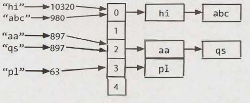
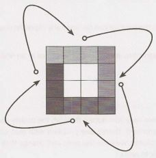

## 1 Arrays and Strings


Hopefully, all readers of this book are familiar with arrays and strings, so we won't .bore you with such details. Instead, we'll focus on some of the more common techniques and issues with these data struc­tures.

Please note that array questions and string questions are often interchangeable. That is, a question that this book states using an array may be asked instead as a string question, and vice versa.


### Hash Tables

A hash table is a data structure that maps keys to values for highly efficient lookup. There are a number of ways of implementing this. Here, we will describe a simple but common implementation.

In this simple implementation, we use an array of linked lists and a hash code function. To insert a key
(which might be a string or essentially any other data type) and value, we do the following:

1. First, compute the key's hash code, which will usually be an int or long. Note that two different keys could have the same hash code, as there may be an infinite number of keys and a finite number of ints.

2. Then, map the hash code to an index in the array. This could be done with something like hash(key)%  array_length. Two different hash codes could, of course, map to the same index.

3. At this index, there is a linked list of keys and values. Store the key and value in this index. We must use a linked list because of collisions: you could have two different keys with the same hash code, or two different hash codes that map to the same index.

To retrieve the value pair by its key, you repeat this process. Compute the hash code from the key, and then compute the index from the hash code. Then, search through the linked list for the value with this key.

If the number of collisions is very high, the worst case runtime is O(N), where N is the number of keys. However, we generally assume a good implementation that keeps collisions to a minimum, in which case the lookup time is O(1).



Alternatively, we can implement the hash table with a balanced binary search tree. This gives us an O(log N) lookup time. The advantage of this is potentially using less space, since we no longer allocate a large array. We can also iterate through the keys in order, which can be useful sometimes.


### ArrayList & Resizable Arrays

In some languages, arrays (often called lists in this case) are automatically resizable. The array or list will grow as you append items. In other languages, like Java, arrays are fixed length. The size is defined when you create the array.

When you need an array-like data structure that offers dynamic resizing, you would usually use an ArrayList. An ArrayList is an array that resizes itself as needed while still providing O(1) access. A typical implementa­ tion is that when the array is full, the array doubles in size. Each doubling takes O(n) time, but happens so rarely that its amortized insertion time is still O(1).

```java
1	ArrayList<String>  merge(String[]  words,   String[] more)  {
2		ArrayList<String> sentence =  new ArrayList<String>();
3		for (String w : words)  sentence.add(w);
4		for (String w : more)  sentence.add(w);
5		return sentence;
6	}
```

This is an essential data structure for interviews. Be sure you are comfortable with dynamically resizable arrays/lists in whatever language you will be working with. Note that the name of the data structure as well as the "resizing factor" (which is 2 in Java) can vary.

*Why is the amortized insertion runtime O(1)?*

Suppose you have an array of size N. We can work backwards to compute how many elements we copied at each capacity increase. Observe that when we increase the array to K elements, the array was previously
half that size. Therefore, we needed to copy '.Yi elements.

```
final  capacity increase  :  n/2  elements to  copy
previous capacity increase:  n/4  elements to  copy
previous capacity increase:  n/8  elements to  copy 
previous capacity increase:  n/16  elements to  copy
...
second  capacity increase :  2 elements to  copy 
first capacity increase   :  1  element to  copy
```

> Therefore, the total number of copies to insert N elements is roughly N/2 + N/4 + N/8 + ... + 2 + 1, which is just less than N.


If the sum of this series isn't obvious to you, imagine this: Suppose you have a kilometer-long walk to the store. You walk 0.5 kilometers, and then 0.25 kilometers, and then 0.125 kilometers, and so on. You will never exceed one kilometer (although you'll get very close to it).


Therefore, inserting N elements takes O(N) work total. Each insertion is O(1) on average, even though some insertions take O(N) time in the worst case.


### StringBuilder

Imagine you were concatenating a list of strings, as shown below. What would the running time of this code be? For simplicity, assume that the strings are all the same length (call this x) and that there are n strings.

```java
1	String  joinWords(String[]  words) {
2		String sentence =  "";
3		for (String w :  words)  {
4			sentence = sentence +  w;
5		}
6		return sentence;
7	}
```

On each concatenation,a new copy of the string is created, and the two strings are copied over,character by character. The first iteration requires us to copy x characters. The second iteration requires copying 2x characters. The third iteration requires 3x, and so on.The total time therefore is O(x + 2x + . . . + nx). This reduces to O(xn²).

> Why is it O(xn²)? Because 1 + 2 + ... + n equals n(n+1)/2, or O(n²).

StringBuilder can help you avoid.this problem. StringBuilder simply creates a resizable array of all the strings, copying them back to a string only when necessary.

```java
1	String  joinWords(String[]  words) {
2		StringBuilder  sentence = new  StringBuilder();
3		for (String w   :   words)  {
4			sentence.append(w);
5		}
6		return sentence.toString();
7	}
```

A good exercise to practice strings,arrays,and general data structures is to implement your own version of StringBuilder, HashTable and ArrayList.

**Additional Reading:** HashTable Collision Resolution (pg 636), Rabin-Karp Substring Search (pg 636).

---

Interview Questions

---

**1.1 Is Unique:** Implement an algorithm to determine if a string has all unique characters. What if you cannot use additional data structures?

SOLUTION

---

You should first ask your interviewer if the string is an ASCII string or a Unicode string. Asking this question will show an eye for detail and a solid foundation in computer science. We'll assume for simplicity the char­ acter set is ASCII. If this assumption is not valid, we would need to increase the storage size.

One solution is to create an array of boolean values, where the flag at index i indicates whether character i in the alphabet is contained in the string. The second time you see this character you can immediately return false.

We can also immediately return false if the string length exceeds the number of unique characters in the alphabet. After all, you can't form a string of 280 unique characters out of a 128-character alphabet.

> It's also okay to assume 256 characters. This would be the case in extended ASCII. You should clarify your assumptions with your interviewer.


The code below implements this algorithm.

```java
1 	boolean  isUniqueChars(String str) {
2 		if (str.length() >   128) return false;
3	
4 		boolean[]   char_set =  new boolean[128];
5 		for (int i = 0;  i <  str.length(); i++)  {
6 			int val =  str.charAt(i);
7 			if  (char_set[val]) {//Already  found  this char  in  string
8 				return false;
9 			}
10			char_set[val] =  true;
11		}
12		return true;
13	}
```

The time complexity for this code is O(n), where n is the length of the string. The space complexity is O(1). (You could also argue the time complexity is O(1), since the for loop will never iterate through more than 128 characters.) If you didn't want to assume the character set is fixed, you could express the complexity as O(c) space and O(min (c, n)) or O(c) time, where c is the size of the character set.


We can reduce our space usage by a factor of eight by using a bit vector. We will assume, in the below code, that the string only uses the lowercase letters a through z. This will allow us to use just a single int.

```java
1 	boolean   isUniqueChars(String str)  {
2 		int  checker = 0;
3 		for  (int  i = 0;  i < str.length(); i++) {
4 			int  val =  str.charAt(i) -   'a';
5 			if ((checker & (1 << val))  >   0) {
6 				return false;
7 			}
8 			checker |=  (1 << val);
9 		}
10		return true;
11	}
```

If we can't use additional data structures, we can do the following:

1. Compare every character of the string to every other character of the string. This will take O(N²) time and O(1) space.
2. If we are allowed to modify the input string, we could sort the string in O(n log(n)) time and then linearly check the string for neighboring characters that are identical. Careful, though: many sorting algorithms take up extra space.

These solutions are not as optimal in some respects, but might be better depending on the constraints of the problem.

**1.2 Check Permutation:** Given two strings, write a method to decide if one is a permutation of the other. 


SOLUTION

--- 

Like in many questions, we should confirm some details with our interviewer. We should understand if the permutation comparison is case sensitive. That is: is God a permutation of dog? Additionally, we should ask if whitespace is significant. We will assume for this problem that the comparison is case sensitive and whitespace is significant. So, "god     " is different from "dog".

Observe first that strings of different lengths cannot be permutations of each other. There are two easy ways to solve this problem, both of which use this optimization.


**Solution #1: Sort the strings.**

If two strings are permutations, then we know they have the same characters, but in different orders. There­ fore, sorting the strings will put the characters from two permutations in the same order. We just need to compare the sorted versions of the strings.

```java
1 	String sort(String  s) {
2 		char[] content = s.toCharArray();
3 		java.util.Arrays.sort(content);
4 		return new  String(content);
5 	}
6	
7 	boolean  permutation(String s, String t)  {
8 		if (s.length()  !=  t.length()) {
9 			return false;
10		}
11		return  sort(s).equals(sort(t));
12	}
```

Though this algorithm is not as optimal in some senses, it may be preferable in one sense: It's clean, simple and easy to understand. In a practical sense, this may very well be a superior way to implement the problem.

However, if efficiency is very important, we can implement it a different way.


**Solution #2: Check if the two strings have identical character counts.**

We can also use the definition of a permutation-two words with the same character counts-to imple­ ment this algorithm. We simply iterate through this code, counting how many times each character appears. Then, afterwards, we compare the two arrays.

```java
1 	boolean permutation(String  s,  String  t)  {
2 		if (s.length() !=  t.length()) {
3 			return  false;
4 		}
5 	
6 		int[] letters = new  int[128]; // Assumption
7 	
8 		char[]  s_array =  s.toCharArray();
9 		for  (char c  : s_array) {  // count number of  each char in  s.
10			letters[c]++;
11		}
12	
13		for  (int i = 0; i < t.length(); i++) {
14			int c =  (int) t.charAt(i);
15			letters[c]--;
16			if (letters[c] <   0) {
17				return  false;
18			}
19		}
20	
21		return  true;
22	}
```

Note the assumption on line 6. In your interview, you should always check with your interviewer about the size of the character set. We assumed that the character set was ASCII.


**1.3 	URLify:** Write a method to replace all spaces in a string with '%20'. You may assume that the string has sufficient space at the end to hold the additional characters, and that you are given the "true" length of the string. (Note: if implementing in Java, please use a character array so that you can perform this operation in place.)

```
EXAMPLE
Input:     "Mr  John  Smith       ",  13
Output:    "Mr%20John%20Smith" 
```

SOLUTION
 
---

A common approach in string manipulation problems is to edit the string starting from the end and working backwards. This is useful because we have an extra buffer at the end, which allows us to change characters without worrying about what we're overwriting.

We will use this approach in this problem. The algorithm employs a two-scan approach. In the first scan, we count the number of spaces. By tripling this number, we can  compute how  many  extra characters we will have in the final string.  In the second pass,  which is done in reverse order, we actually edit the string. When we see a space, we replace it with %20. If there is no space, then we copy the original character.
The code below implements this algorithm.

```java
1 	void replaceSpaces(char([] str,   int  trueLength) {
2 		int  spaceCount  =  0, index, i  =  0;
3 		for (i - 0; i <  trueLength;   i++)  {
4 			if (str[i] ==  ' ') {
5 				spaceCount++;
6 			}
7 		}
8 		index  =  truelength +  spaceCount  *  2;
9 		if (truelength < str.length)  str[trueLength] = '\0';  // End  array
10		for (i =  truelength -  1;   i >= 0;   i-- )  {
11			if (str[i] ==  ' ') {
12				str[index -  1]    =  '0';
13				str[index -  2]   =  '2';
14				str[index -  3]   =   '%';
15				index  =  index -  3;
16			}  else {
17				str[index  -  1]   =  str[i];
18				index--;
19			}
20		}
21	}
```

We have implemented this problem using character arrays, because Java strings are immutable. If we used strings directly, the function would have to return a new copy of the string,  but it would allow us to imple­ ment this in just  one pass.

**1.4 	Palindrome Permutation:** Given  a  string,  write   a  function to  check if it  is a  permutation of a  palindrome. A palindrome is a  word  or  phrase that is the same forwards and  backwards. A permutation is a rearrangement of letters. The  palindrome does not  need to  be  limited to just dictionary words.

```
EXAMPLE
Input:      Tact  Coa
Output:     True (permutations: "taco  cat'; "atco   cta", etc.)
```

SOLUTION

---

This is a question where it helps to figure out what it means for a string to be a permutation of a palindrome. This is like asking  what the "defining features" of such  a string would be.

A palindrome is a string that is the same forwards and backwards. Therefore, to decide if a string is a permu­tation of a palindrome, we need to know if it can be written such that it's the same forwards and backwards.

What does it take to be able to write a set of characters the same way forwards and backwards? We need to have an even number of almost all characters, so that half can be  on one side and  half can be on the other side. At most one character (the middle character) can have an odd  count.

For example, we know tactcoapapa is a permutation of a palindrome because it has two  Ts, four As, two Cs, two Ps, and one O. That O would be the center of all possible palindromes.


> To be more precise, strings with even length (after removing all non-letter characters) must have all even counts of characters. Strings of an odd length must have exactly one character with an odd count. Of course, an "even" string can't have an odd number of exactly one character, otherwise it wouldn't be an even-length string (an odd number+ many even numbers= an odd number). Likewise, a string with odd length can't have  all characters with even counts (sum of evens is even). It's therefore sufficient to say that, to be a permutation ot a palindrome,  a string can have no more than one character that is odd. This will cover both the odd and the even cases.


This leads us to our first algorithm.

**Solution#1**

Implementing this algorithm is fairly straightforward. We use a hash table to count how many times each character appears. Then, we iterate through the hash table and ensure that no more than one character has an odd count.

```java
1 	boolean  isPermutationOfPalindrome(String phrase)   {
2 		int[] table = buildCharFrequencyTable(phrase);
3 		return checkMaxOneOdd(table);
4 	}
5	
6 	/*  Check that no more than  one character has  an odd count.*/
7 	boolean  checkMaxOneOdd(int[] table) {
8 		boolean  foundOdd =  false;
9 		for  (int count  :  table) {
10			if  (count % 2  ==  1)  {
11				if (foundOdd)  {
12					return false;
13				}
14				foundOdd =  true;
15			}
16		}
17		return true;
18	}
19	
20	/*  Map  each character to  a number. a  -> 0,   b  -> 1,   c  -> 2,  etc.
21	 * This  is case  insensitive.  Non-letter characters map  to   -1. */
22	int getCharNumber(Character c)  {
23		int a  = Character.getNumericValue('a');
24		int z  =  Character.getNumericValue('z');
25		int val =  Character.getNumericValue(c);
26		if (a <= val  &&   val <= z)  {
27			return val  -   a;
28		}
29		return  -1;
30	}
31	
32	/*  Count how many  times  each character appears.*/
33	int[] buildCharFrequencyTable(String phrase)  {
34		int[] table =  new  int[Character.getNumericValue('z') -
35		Character.getNumericValue('a') +  1];
36		for   (char  c  : phrase.toCharArray()) {
37			int x = getCharNumber(c);
38			if (x  !=  -1)  {
39				table[x]++;
40			}
41		}
42		return table;
43	}
```

This algorithm takes O(N) time, where N is the length of the string.

**Solution #2**

We can't optimize the big O time here since any algorithm will always have to look through the entire string. However, we can make some smaller incremental improvements. Because this is a relatively simple problem, it can be worthwhile to discuss some small optimizations or at least some tweaks.

Instead of checking the number of odd counts at the end, we can check as we go along. Then, as soon as we get to the end, we have our answer.

```java
1 	boolean isPermutationOfPalindrome(String  phrase)  {
2 		int countOdd =  0;
3 		int[]  table = new int[Character.getNumericValue('z') -
4 							Character.getNumericValue('a')  + 1];
5 		for (char c : phrase.toCharArray()) {
6 			int x = getCharNumber(c);
7 			if (x   !=  -1) {
8 				table[x]++;
9 				if (table[x] % 2 == 1) {
10					countOdd++;
11				}  else  {
12					countOdd--;
13				}
14			}
15		}
16		return countOdd <=  1;
17	}
```

It's important to be very clear here that this is not necessarily more optimal. It has the same big O time and might even be slightly slower. We have eliminated a final iteration through the hash table, but now we have to run a few extra lines of code for each character in the string.

You should discuss this with your interviewer as an alternate, but not necessarily more optimal, solution.

**Solution #3**

If you think more deeply about this problem, you might notice that we don't actually need to know the counts. We just need to know if the count is even or odd. Think about flipping a light on/off (that is initially off). If the light winds up in the off state, we don't know how many times we flipped it, but we do know it was an even count.

Given this, we can use a single integer (as a bit vector). When we see a letter, we map it to an integer between  O and 26 (assuming an English alphabet). Then we toggle the bit at that value. At the end of the iteration, we check that at most one bit in the integer is set to 1.

We can easily check that no bits in the integer are 1: just compare the integer to 0. There is actually a very elegant way to check that an integer has exactly one bit set to 1.

Picture an integer like 00010000. We could of course shift the integer repeatedly to check that there's only a single 1. Alternatively,  if we subtract 1 from the number, we'll get 00001111. What's notable about this
is that there is no overlap between the numbers (as opposed to say 00101000, which, when we subtract 1 from, we get 00100111.) So, we can check to see that a number has exactly one 1 because if we subtract 1 from it and then AND it with the new number, we should get 0. 

```
00010000   -  1  =  00001111
00010000  &  00001111  = 0
```

This leads us to our final implementation.

```java
1 	boolean  isPermutationOfPalindrome(String phrase)  {
2 		int  bitVector =  createBitVector(phrase);
3 		return  bitVector == 0  ||   checkExactlyOneBitSet(bitVector);
4 	}
5	
6 	/* Create a bit vector for the string. For  each letter with value i, toggle the
7 	 * ith bit.*/
8 	int createBitVector(String phrase) {
9 		int  bitVector = 0;
10		for (char c : phrase.toCharArray())  {
11			int x = getCharNumber(c);
12			bitVector = toggle(bitVector,  x);
13		}
14		return bitVector;
15	}
16	
17	/* Toggle the ith bit in the integer.*/
18	int toggle(int bitVector, int index) {
19		if  (index <   0)  return bitVector;
20	
21		int mask =  1  << index;
22		if  ((bitVector &  mask) == 0) {
23			bitVector  |= mask;
24		}  else {
25			bitVector &= ~mask;
26		}
27		return  bitVector;
28	}
29	
30	/* Check that exactly one bit is set by subtracting one from the integer and
31	 * ANDing it with  the original integer.*/
32	boolean   checkExactlyOneBitSet(int bitVector)  {
33		return  (bitVector &  (bitVector  -  1)) ==  0;
34	}
```

Like the other solutions, this is O(N).

It's interesting to note a solution that we did not explore. We avoided solutions along the lines of"create all possible permutations and check if they are palindromes:'While such a solution would work, it's entirely infeasible in the real world. Generating all permutations requires factorial time (which is actually worse than exponential time), and it is essentially infeasible to perform on strings longer than about 10-15 characters.

I mention this (impractical) solution because a lot of candidates hear a problem like this and say, "In order to check if A is in group B, I must know everything that is in B and then check if one of the items equals A:' That's not always the case, and this problem is a simple demonstration of it. You don't need to generate all permutations in order to check if one is a palindrome.

 
**1.51 One Away:** There are three types of edits that can be performed  on strings: insert a character, remove a character, or replace a character. Given two strings, write a function to check if they are one edit (or zero edits) away.

```
EXAMPLE 
pale,   ple  ->  true 
pales,  pale ->  true 
pale,   bale ->  true 
pale,   bae  ->  false
```
 
SOLUTION

---


There is a "brute force" algorithm to do this. We could check all possible strings that are one edit away by testing the removal of each character (and comparing), testing the replacement  of each character (and comparing), and then testing the insertion of each possible character (and comparing).

That would be too slow, so let's not bother with implementing it.

This is one of those problems where it's helpful to think about the "meaning" of each of these operations. What does it mean for two strings to be one insertion, replacement, or removal away from each other?

- **Replacement:** Consider two strings, such as bale and pale, that are one replacement  away. Yes, that does mean that you could replace a character in bale to make pale. But more precisely, it means that they are different only in one place.
- **Insertion:** The strings apple and aple are one insertion away. This means that if you compared the strings, they would be identical-except for a shift at some point in the strings.
- **Removal:** The strings apple and aple are also one removal away, since removal is just the inverse of insertion.

We can go ahead and implement this algorithm now. We'll merge the insertion and removal check into one step, and check the replacement step separately.

Observe that you don't need to check the strings for insertion, removal, and replacement edits. The lengths of the strings will indicate which of these you need to check.

```java
1 	boolean   oneEditAway(String  first, String  second) {
2 		if (first.length() == second.length()) {
3 			return oneEditReplace(first, second);
4 		}  else if (first.length() +  1 ==  second.length()) {
5 			return oneEditinsert(first,  second);
6 		}  else if (first.length() -  1 ==   second.length()) {
7 			return oneEditinsert(second, first);
8 		}
9 		return false;
10	}
11	
12	boolean oneEditReplace(String s1,  String s2)   {
13		boolean   foundDifference  =  false;
14		for (int i = 0; i < s1.length();  i++)   {
15			if (s1.charAt(i) != s2.charAt(i)) {
16				if (foundDifference)  {
17					return false;
18				}
19		
20				foundDifference  =  true;
21			}
22		}
23		return true;
24	}
25	
26	/* Check if you  can  insert a  character into s1 to make s2.*/
27	boolean oneEditinsert(String  s1,  String s2)   {
28		int index1 =  0;
29		int index2 =  0;
30		while  (index2 <  s2.length() &&   index1 <  s1.length()) {
31			if (s1.charAt(index1)  !=  s2.charAt(index2)) {
32				if  (index1 != index2) {
33					return false;
34				}
35				index2++;
36			} else {
37				index1++;
38				index2++;
39			}
40		}
41		return true;
42  }
```

This algorithm (and almost any reasonable algorithm) takes O(n) time, where n is the length of the shorter string.


> Why is the runtime dictated by the shorter string instead of the longer string? If the strings are the same length (plus or minusone character), then it doesn't matter whether we use the longer string or the shorter string to define the runtime. If the strings are very different lengths, then the algorithm will terminate in O(1)  time. One really, really long string therefore won't significantly extend the runtime. It increases the runtime only if both strings are long.

We might notice that the code for oneEditReplace is very simtlar to that for oneEditinsert. We can merge them into one method.

To do this, observe  that both methods follow similar logic: compare each character and ensure  that the strings are only different by one. The methods  vary in how they handle  that difference. The method oneEditReplace does nothing other than flag the difference, whereas oneEditinsert increments the pointer to the longer string. We can handle both of these in the same method.

```java
1 	boolean  oneEditAway(String first,  String second)   {
2 		/*Length  checks.*/
3 		if (Math.abs(first.length() -  second.length()) >   1)  {
4 			return false;
5 		}
6		
7 		/*Get  shorter and  longer string.*/
8 		String sl = first.length() <  second.length() ?  first :   second;
9 		String s2 = first.length() < second.length()  ?  second   :   first;
10		
11		int index1  = 0;
12		int index2  = 0;
13		boolean foundDifference  =  false;
14		while  (index2 <  s2.length() &&   index1 <  sl.length()) {
15			if  (sl.charAt(index1) != s2.charAt(index2)) {
16				/*Ensure that  this  is  the first difference found.*/
17				if (foundDifference)  return false;
18				foundDifference =  true;
19		
20				if (sl.length() == s2.length()) {//On replace, move shorter pointer
21					index1++;
22				}
23			}  else {
24				index1++;  // If matching,  move  shorter pointer
25			}
26			index2++;  // Always   move  pointer for longer string
27		}
28		return true;
29	}
```

Some  people might argue the  first approach is better, as it is clearer and easier to follow. Others, however, will argue that the  second approach is better, since  it's more compact and doesn't duplicate code (which can facilitate maintainability).

You don't necessarily need to "pick a side:'You can discuss the  tradeoffs with your interviewer.

**1.6 	String  Compression:** Implement a method to perform basic string  compression using the  counts of repeated characters. For example, the  string aabcccccaaa would become a2blc5a3. If the "compressed" string would not  become smaller than the  original string, your method should return the original string. You can assume the  string has only uppercase and lowercase letters (a - z). 


SOLUTION
 
---

At first glance, implementing this method seems fairly straightforward, but perhaps a bit tedious. We iterate through the  string,  copying characters to a new  string and counting the  repeats. At each iteration, check if the current character is the same as the next  character. If not, add its compressed version to the  result.

How hard could it be?

```java
1 	String compressBad(String str) {
2 		String compressedString =  "";
3 		int countConsecutive =  0;
4 		for (int i = 0;   i <   str.length();  i++) {	
5			countConsecutive++;
6		
7 			/*If next character is different than current,append this char to result.*/
8 			if (i + 1 >= str.length()  || str.charAt(i) != str.charAt(i + 1)) {
9 				compressedString +=  ""   +  str.charAt(i) + countConsecutive;
10				countConsecutive =  0;
11			}
12		}
13		return  compressedString.length() < str.length() ? compressedString str;
14	}
```

This works. ls it efficient,  though?Take a look at the  runtime of this code.

The  runtime is O(p + k²), where p is the  size of the  original string and k is thelnumber of character sequences. For example, if the  string  is aabccdeeaa,  then there are  six characte  sequences. It's slow because string concatenation operates in O(n² ) time  (see StringBuilder on pg 89).

We can fix this by using a StringBuilder.

```java
1 	String compress(String str) {
2 		StringBuilder compressed =  new StringBuilder();
3 		int countConsecutive =  0;
4 		for   (int i = 0;  i <   str.length(); i++)  {
5 			countConsecutive++;
6		
7 			/*If next character is different than current, append this char to result.*/
8 			if (i + 1  >=  str.length() || str.charAt(i) != str.charAt(i +  1))  {
9 				compressed.append(str.charAt(i));
10				compressed.append(countConsecutive);
11				countConsecutive =  0;
12			}
13		}
14		return compressed.length() <   str.length() ?  compressed.toString()  :   str;
15	}
```

Both of these solutions create the compressed string first and then return the shorter of the input string and the compressed string.

Instead, we can check in advance.This will be more optimal in cases where we don't have a large number of repeating characters. It will avoid us having to create a stringthat we never use. The downside of this is that it causes a second loop through the characters and also adds nearly duplicated code.

```java
1 	String  compress(String str) {
2 		/*  Check final  length and return input   string if it would be longer. */
3 		int finallength =  countCompression(str);
4 		if (finallength >=  str.length())  return str;
5		
6 		StringBuilder compressed =  new StringBuilder(finalLength); // initial capacity
7 		int  countConsecutive =  0;
8 		for  (int i = 0;  i <   str.length(); i++)  {
9 			countConsecutive++;
10		
11			/* If next character is different than current, append this char to resu	lt.*/
12			if (i +  1  >=  str.length() || str.charAt(i)  != str.charAt(i + 1))   {
13				compressed.append(str.charAt(i));
14				compressed.append(countConsecutive);
15				countConsecutive =  0;
16			}
17		}
18		return  compressed.toString();
19	}
20		
21	int  countCompression(String str) {
22		int compressedlength =  0;
23		int countConsecutive =  0;
24		for  (int i = 0;  i <   str.length(); i++)  {
25			countConsecutive++;
26		
27			/*If next character is different than current, increase the length.*/
28			if (i +  1  >=  str.length() || str.charAt(i) != str.charAt(i + 1))   {
29				compressedlength +=  1 +  String.valueOf(countConsecutive).length();
30				countConsecutive = 0;
31			}
32		}
33		return  compressedlength;
34	}
```

One other  benefit of this approach  is that we can initialize StringBuilder to its necessary capacity up-front. Without this, StringBuilder will (behind the scenes) need to double its capacity every time it hits capacity. The capacity could be double what we ultimately need.


**1.7 	Rotate Matrix:** Given an image represented by an NxN matrix, where each pixel in the image is 4 bytes, write a method to rotate the image by 90 degrees. Can you do this in place?


SOLUTION

--

Because we're rotating the matrix by 90 degrees, the easiest way to do this is to implement the rotation in layers. We perform a circular rotation on each layer, moving the top edge to the right edge, the right edge to the bottom edge, the bottom edge to the left edge, and the left edge to the top edge.



How do we perform this four-way edge swap? One option is to copy the top edge to an array, and then move the left to the top, the bottom to the left, and so on. This requires O(N)  memory, which is actually unnecessary.

A better way to do this is to implement the swap index by index. In this case, we do the following:

```
1     for i =  0 to  n
2         temp      = top[i];
3         top[i]    = left[i]
4         left[i]   = bottom[i]
5         bottom[i] = right[i]
6         right[i]  = temp
```

We perform such a swap on each layer, starting from the outermost layer and working our way inwards. (Alternatively, we could start from the inner layer and work outwards.)

The code for this algorithm is below.

```java
1 	boolean   rotate(int[][] matrix)  {
2 		if  (matrix.length == 0 || matrix.length  != matrix[0].length) return false;
3 		int n  = matrix.length;
4 		for (int  layer =  0;  layer <  n/2;  layer++)  {
5 			int first = layer;
6 			int last = n  -  1  -  layer;
7 			for (int i =  first; i <   last; i++)  {
8 				int offset =  i -  first;
9 				int top =  matrix[first][i]; // save top
10		
11				// left ->  top
12				matrix[first][i] =  matrix[last - offset][first];
13		
14				// bottom ->  left
15				matrix[last - offset][first] = matrix[last][last  -  offset];
16		
17				// right  ->  bottom
18				matrix[last][last -  offset] = matrix[i][last];
19		
20				// top   ->  right
21				matrix[i][last]  = top;   // right<-  saved top
22			}
23		}
24		return  true;
25	}
```

This algorithm is O(N²), which is the best we can do since any algorithm must touch all N² elements.


**1.8 Zero Matrix:** Write an algorithm such that if an element in an MxN matrix is 0, its entire row and column are set to 0.


SOLUTION

---


At first glance, this problem seems easy: just iterate through the matrix and every time we see a cell with value zero, set its row and column to 0. There's one problem with that solution though: when we come across other cells in that row or column, we'll see the zeros and change their row and column to zero.Pretty soon, our entire  matrix will be set to zeros.

One way around this is to keep a second matrix which flags the zero locations. We would then do a second pass through the matrix to set the zeros.This would take O(MN) space.

Do we really need O(MN) space?  No. Since we're going  to set the entire row and column to zero, we don't need to track that it was exactly cell[2][4] (row 2, column 4). We only need to know that row 2 has a zero somewhere, and column 4 has a zero somewhere.We'll set the entire row and column to zero anyway, so why would we care to keep track of the exact location of the zero?

The code below implements this algorithm. We use two arrays to keep track of all the rows with zeros and all the columns with zeros. We then nullify rows and columns  based  on the values in these arrays.

```java
1 	void setZeros(int[][] matrix)  {
2 		boolean[]  row = new  boolean[matrix .length];
3 		boolean[]  column  = new  boolean[matrix[0].length];
4		
5 		// Store  the  row and column  index with value  0
6 		for  (int i =  0; i < matrix.length; i++)   {
7 			for  (int j = 0; j < matrix[0].length; j++) {
8 				if  (matrix[i][j] ==  0)  {
9 					row[i] = true;
10					column[j]  = true;
11				}
12			}
13		}
14		
15		// Nullify  rows
16		for (inti = 0; i <  row.length;   i++) {
17			if (row[i])  nullifyRow(matrix, i);
18		}
19		
20		// Nullify  columns
21		for (int j =  0;   j <   column.length;  j++) {
22			if (column[j])  nullifyColumn(matrix, j);
23		}
24		}
25		
26		void nullifyRow(int[][]  matrix, int  row) {
27		for (int j = 0; j < matrix[0].length; j++) {
28			matrix[row][j] =  0;
29		}
30		}
31		
32		void nullifyColumn(int[][] matrix, int  col) {
33		for (int  i =  0;   i <   matrix.length;   i++) {
34			matrix[i][col] =  0;
35		}
36	}
```

To make this somewhat more space efficient we could  use  a bit vector instead of a boolean array. It would still be O(N)  space.

We can  reduce the  space to O(1) by using the  first row as a replacement for the  row  array  and  the  first column as a replacement for the column array. This works as follows:

1. Check if the first row and first column have any zeros, and set variables rowHasZero and columnHasZero. (We'll nullify the first row and  first column later, if necessary.)
2. Iterate through the rest of the matrix, setting matrix[i][0] and matrix[0][j] to zero whenever there's a zero in matrix[i][j].
3. Iterate through rest of matrix, nullifying row i if there's a zero in matrix[i][0].
4. Iterate through rest of matrix, nullifying column j if there's a zero in matrix[0][j].
5. Nullify the  first row and  first column, if necessary (based on values from Step  1). 

This code is below:

```java
1 	void  setzeros(int[][] matrix) {
2 		boolean  rowHasZero = false;
3 		boolean  colHasZero = false;
4		
5 		// Check   if first row  has a  zero
6 		for (int j = 0;   j <   matrix[0].length;  j++) {
7 			if  (matrix[0][j] == 0) {
8 				rowHasZero  = true;
9 				break;
10			}
11		}
12		
13		// Check   if first column   has a  zero
14		for (int i = 0;   i <   matrix.length;   i++) {
15			if (matrix[i][0] ==    0) {
16				colHasZero = true;
17				break;
18			}
19		}
20		
21		// Check   for zeros in the rest  of the array
22		for (int i =  1;   i <   matrix.length;  i++) {
23			for (int j =  1;   j < matrix[0].length; j++) {
24				if  (matrix[iJ[jJ ==  0) {
25					matrix[i][0] =  0;
26					matrix[0J[j] =  0;
27				}
28			}
29		}
30		
31		// Nullify rows   based  on  values in  first column
32		for (int i = 1;   i <   matrix.length; i++) {
33			if  (matrix[i][0] == 0) {
34				nullifyRow(matrix,  i);
35			}
36		}
37		
38		// Nullify  columns based on  values in  first row
39		for (int j = 1;   j < matrix[0].length;   j++) {
40			if (matrix[0][j] ==    0) {
41				nullifyColumn(matrix,  j);
42			}
43		}
44		
45		// Nullify first row
46		if (rowHasZero) {
47			nullifyRow(matrix,  0);
48		}
49		
50		// Nullify first column
51		if (colHasZero) {
52			nullifyColumn(matrix,  0);
53		}
54	}
```

This code has  a lot of"do  this for the  rows, then the  equivalent action for the  column:' In an interview, you could abbreviate this code by adding comments and TODOs that explain that the next chunk of code looks the  same as the  earlier code,  but  using rows. This would allow you to focus  on the  most important parts of the  algorithm.


**1.9 	String Rotation:** Assumeyou have a method i5Sub5tring which checks if one word is a substring of another. Given two strings,  51 and 52, write code to check if 52 is a rotation of 51 using only one
call to i5Sub5tring (e.g., "waterbottle" is a rotation of" erbottlewat").

SOLUTION

---

If we imagine that s2  is a rotation of s1,  then we can  ask what the  rotation point is. For example, if you rotate waterbottle after  wat. you  get  erbottlewat. In a rotation, we cut s1  into  two  parts,  x and y, and rearrange them to get  s2.

```
s1 = xy   =  waterbottle
x  = wat
y  = erbottle
s2 = yx   = erbottlewat
```

So, we need to check  if there's a way to split s1 into x  andy such that xy = s1 andyx = s2. Regardless of where the division between x andy is, we can see thatyx will always be a substring of xyxy.That is, s2 will always be a substring of s1s1.

And this is precisely how we solve the problem: simply do isSubstring(slsl,  s2). The code below implements this algorithm.

```java
1 	boolean  isRotation(String sl,  String s2)  {
2 		int len =  sl.length();
3 		/*  Check that sl and s2 are  equal  length and not  empty*/
4 		if (len == s2.length() &&   len   >   0)  {
5 			/*  Concatenate  sl and sl within new  buffer  */
6 			String slsl =  sl + sl;
7 			return isSubstring(slsl,  s2);
8 		}
9 		return false;
10	}
```

The runtime of this varies based on the runtime of isSubstring. But if you assume that isSubstring runs in O(A+B) time (on strings of length A and B), then the runtime of isRotation is O(N).


