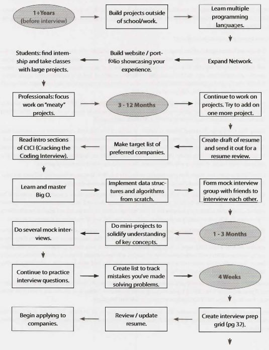
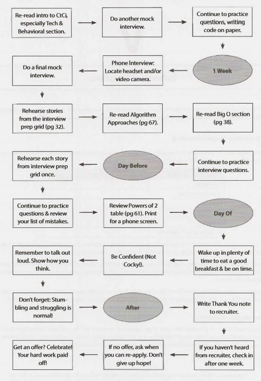
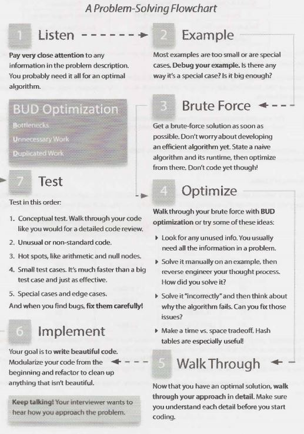

CRACKING
CODING INTERVIEW
189   PROGRAMMING Q!JESTIONS & SOLUTIONS 


CRACKING the CODING INTERVIEW
=============================
##### 6TH  EDITION 


*ALso BY GAYLE LAAKMANN  McDowELL*


*CRACKING  THE PM INTERVIEW*
*How TO LAND A PRODUCT MANAGER JoB IN TECHNOLOGY*


CRACKING THE TECH CAREER

INSIDER ADVICE ON LANDING A JOB AT GOOGLE,  MICROSOFT, APP LE, OR ANY TOP TECH COMPANY 


CRACKING
the
CODING INTERVIEW
6th Edition
189 Programming Questions and Solutions


GAYLE LAAKMANN MCDOWELL
Founder and CEO, CareerCup.com


CareerCup, LLC Palo Alto, CA 


**CRACKING THE CODING INTERVIEW, SIXTH EDITION**
Copyright © 2015 by CareerCup.
All rights reserved. No part of this book may be reproduced in any form by any electronic or me­ chanical means, including information storage and retrieval systems, without permission in writing from the author or publisher, except by a reviewer who may quote brief passages in a review.

Published by CareerCup, LLC, Palo Alto, CA. Compiled Feb 10, 2016. For more information, contact support@careercup.com.


978-0-9847828-5-7 (ISBN  13) 


For Davis and Tobin,
and all the things that bring usjoy in life. 
Introduction


Join us at www.CrackingTheCodinglnterview.com to download the complete solutions, contribute or view solutions in other programming languages, discuss problems from this book with other readers, askquestions, report issues, view this book's errata, and seekadditional advice.


X                 Cracking the Coding Interview, 6th Edition 
Foreword


Dear Reader,

Let's get the introductions out of the way.

I am not a recruiter. I  am a software engineer. And as such, I know what it's like to be asked to whip up bril­ liant algorithms on the spot and then write flawless code on a whiteboard. I know because I've been asked to do the same thing-in interviews at Google, Microsoft, Apple, and Amazon, among other companies.

I  also know because I've been on the other side of the table, asking candidates to do this. I've combed through stacks of resumes to find the engineers who I thought might be able to actually pass these inter­ views. I've evaluated them as they solved-or tried to solve-challenging  questions. And I've debated in Google's Hiring Committee  whether a candidate did well enough to merit an offer. I understand the full hiring circle because I've been through it all, repeatedly.

And you, reader, are probably preparing for an interview, perhaps tomorrow, next week, or next year. I am here to help you solidify your understanding of computer science fundamentals and then learn how to apply those fundamentals to crack the coding interview.
The 6th edition of Cracking the Coding Interview updates the 5th edition with 70% more content: additional questions, revised solutions, new chapter introductions, more algorithm strategies, hints for all problems, and other content. Be sure to check out our website, CrackingTheCodinglnterview.com, to connect with other candidates and discover new resources.

I'm excited for you and for the skills you are going to develop. Thorough preparation will give you a wide range of technical and communication skills. It will be well worth  it, no matter where the effort takes you!

I  encourage you to read these introductory chapters carefully. They contain important insight that just might make the difference between a "hire" and a "no hire:'

**And remember-interviews are  hard!**  In my years of interviewing at Google, I  saw some interviewers ask "easy" questions while others ask harder questions. But you know what? Getting the easy questions doesn't make it any easier to get the offer. Receiving an offer is not about solving questions flawlessly (very few candidates do!). Rather, it is about answering questions better than other candidates. So don't stress out when you get a tricky question-everyone else probably thought it was hard too. It's okay to not be flaw­ less.
Study hard, practice-and good luck! Gayle L. McDowell
Founder/CEO, CareerCup.com
Author of Cracking the PM Interview and Cracking the Tech Career


CrackingTheCodinglnterview.com J 6th Edition 

### Introduction

#### Something's Wrong

We walked out of the hiring meeting frustrated-again. Of the ten candidates we reviewed that day, none would receive offers. Were we being too harsh, we wondered?

I,  in particular, was disappointed.  We had rejected  one of my candidates. A former student.  One I had referred. He had a 3.73 GPA from the University of Washington, one of the best computer science schools in the world, and had done extensive work on open-source projects. He was energetic. He was creative. He was sharp. He worked hard. He was a true geek in all the best ways.

But I had to agree with the rest of the committee: the data wasn't there. Even if my emphatic recommenda­ tion could sway them to reconsider, he would surely get rejected in the later stages of the hiring process. There were just too many red flags.

Although he was quite intelligent, he struggled to solve the interview problems. Most successful candi­ dates could fly through the first question, which was a twist on a well-known problem, but he had trouble developing an algorithm. When he came up with one, he failed to consider solutions that optimized for other  scenarios. Finally, when he began  coding, he flew through  the code with an initial solution, but it was riddled with mistakes that he failed to catch. Though he wasn't the worst candidate we'd seen by any measure, he was far from meeting the "bar:' Rejected.

When he asked for feedback over the phone a couple of weeks later, I struggled with what to tell him. Be smarter? No,  I knew he was brilliant. Be a better coder? No, his skills were on par with some of the best I'd seen.

Like many motivated candidates, he had prepared extensively. He had read K&R's classic C book, and he'd reviewed CLRS' famous algorithms textbook. He could describe in detail the myriad of ways of balancing a tree, and he could do things in C that no sane programmer should ever want to do.

I had to tell him the unfortunate  truth: those books aren't enough. Academic books prepare you for fancy research, and they will probably make you a better software engineer, but they're not sufficient for inter­ views. Why? I'll give you a hint: Your interviewers haven't seen red-black trees since they were in school either.

To crack the coding interview, you need to prepare  with real interview questions. You must practice on real problems and learn their patterns. It's about developing a fresh algorithm, not memorizing existing problems.

**Cracking the Coding Interview** is the result of my first-hand experience interviewing at top companies and later coaching candidates through these interviews. It is the result of hundreds of conversations with candi­ dates. It is the result of the thousands of questions contributed by candidates and interviewers. And it's the result of seeing so many interview questions from so many firms. Enclosed in this book are 189 of the best interview questions, selected from thousands of potential problems.


#### My Approach

The focus of **Cracking the  Coding Interview** is algorithm, coding, and design questions. Why? Because while you can and will be asked behavioral questions, the answers will be as varied as your resume. Like­ wise, while many firms will ask so-called "trivia" questions (e.g., "What is a virtual function?"), the skills devel­ oped through practicing these questions are limited to very specific bits of knowledge. The book will briefly touch on some of these questions to show you what they're like, but I have chosen to allocate space to areas where there's more to learn.

#### My Passion

Teaching is my passion. I love helping people understand new concepts and giving them tools to help them excel in their passions.

My first official experience teaching was in college at the University of Pennsylvania, when I   became a teaching assistant for an undergraduate computer science course during my second year. I  went on to TA for several other courses, and I  eventually launched my own computer science course there, focused on hands-on skills.

As an engineer at Google, training and mentoring new engineers were some of the things I  enjoyed most. I
even used my"20% time"to teach two computer science courses at the University of Washington.

Now, years later, I  continue to teach computer science concepts, but this time with the goal of preparing engineers at startups for their acquisition interviews. I've seen their mistakes and struggles, and I've devel­ oped techniques and strategies to help them combat those very issues.

**Cracking the  Coding Interview, Cracking the  PM Interview, Cracking the  Tech  Career, and CareerCup** reflect my passion for teaching. Even now, you can often find me "hanging out"at CareerCup.com, helping users who stop by for assistance.

Join us.

Gayle L. McDowell


## I

### The Interview Process


At most of the top tech companies (and many other companies). algorithm and  coding problems form the largest component of the  interview process. Think of these as problem-solving questions. The interviewer is looking to evaluate your ability to solve algorithmic problems you haven't seen before.

Very often,  you might get  through only one  question in an interview. Forty-five minutes is not  a long  time, and it's difficult to get through several different questions in that time frame.

You should do your best to talk out  loud throughout the  problem and  explain your thought process. Your interviewer might jump in sometimes to help  you; let them. It's normal and  doesn't really mean that you're doing poorly.  (That said, of course not  needing hints is even better.)

At the  end of the interview, the  interviewer will walk away with a gut  feel for how  you did. A numeric score might be assigned to your performance, but it's not actually a quantitative assessment. There's no chart that says how  many points you get  for different things. It just doesn't work like that.
Rather, your  interviewer will make an assessment of your performance, usually based on the following: Analytical  skills: Did you need much help  solving the  problem? How optimal was  your solution? How
long  did it take  you to arrive at a solution? If you had  to design/architect a new  solution, did you struc­
ture  the  problem well and  think through the  tradeoffs of different decisions?

Coding skills: Were you  able  to successfully translate your  algorithm to reasonable code? Was it clean and  well-organized? Did you think about potential errors?  Did you use good style?

Technical knowledge/ Computer Science fundamentals: Do you have a strong foundation in computer science and  the relevant technologies?

Experience: Have you made good technical decisions in the past? Have you built interesting, challenging projects? Have you shown drive, initiative,  and  other important factors?
Culture fit/ Communication skills: Do your personality and  values fit with  the  company and  team? Did you communicate well with your interviewer?

The weighting of these areas will vary based on the  question, interviewer, role, team, and  company. In a standard algorithm question, it might be almost entirely  the first three of those.


### Why?

This is one  of the  most common questions candidates have as they  get  started with  this process. Why do things this way? After all,
- Lots of great candidates don't do well in these sorts of interviews.
- You could look up the answer if it did ever come up.
- You rarely have to use data structures such as binary search trees in the real world.  If you  did need to, you could surely learn it.
- Whiteboard coding is an artificial environment.  You would never code on the whiteboard in the real world, obviously.
These complaints aren't without merit. In fact I agree with all of them, at least in part.

At the same time, there is reason to do things this way for some-not all-positions. It's not important that you agree with this logic, but it is a good idea to understand why these questions are being asked.  It helps offer a little insight into the interviewer's mindset.

#### False negatives are  acceptable.

This is sad (and frustrating for candidates), but true.

From the company's perspective, it's actually acceptable that some good candidates are rejected. The company is out to build a great set of employees. They can accept that they miss out on some good people. They'd prefer not to, of course, as it raises their recruiting costs. It is an acceptable tradeoff, though, provided they can still hire enough good people.

They're far more concerned with false positives: people who do well in an interview but are not in fact very good.

#### Problem-solving skills are  valuable.

If you're able to work through several hard problems (with some help, perhaps), you're probably pretty good at developing optimal algorithms. You're smart.

Smart people tend to do good things, and that's valuable at a company.  It's not the only thing that matters, of course, but it is a really good thing.


#### Basic data structure and  algorithm knowledge is useful.

Many interviewers would argue that basic computer science knowledge is, in fact, useful. Understanding trees, graphs, lists, sorting, and other knowledge does come up periodically. When it does, it's really valu­ able.

Could you learn it as needed? Sure. But it's very difficult to know that you should use a binary search tree if you don't know of its existence. And if you do know of its existence, then you pretty much know the basics.

Other interviewers justify the reliance on data structures and algorithms by arguing that it's a good "proxy:' Even if the skills wouldn't be that hard to learn on their own, they say it's reasonably well-correlated with being a good developer.  It means that you've either gone through a computer science program (in which case you've learned and retained a reasonably broad set of technical knowledge) or learned this stuff on your own. Either way, it's a good sign.

There's another reason why data structure and algorithm knowledge comes up: because it's hard to ask problem-solving questions that don't involve them. It turns out that the vast majority of problem-solving questions involve some of these basics. When enough candidates know these basics, it's easy to get into a pattern of asking questions with them.


#### Whiteboards  let you focus on what matters.

It's absolutely true that you'd struggle with writing perfect code on a whiteboard. Fortunately, your inter­
viewer doesn't expect that. Virtually everyone has some bugs or minor syntactical errors.

The nice thing about a whiteboard is that in some ways, you can focus on the big picture. You don't have a compiler. so you don't need to make your code compile. You don't need to write the entire class definition and boilerplate code. You get to focus on the interesting, "meaty" parts of the code: the function that the question is really all about.

That's not to say that you should just write pseudocode or that correctness doesn't matter. Most inter­
viewers aren't okay with pseudocode, and fewer errors are better.

Whiteboards also tend to encourage candidates to speak more and explain their thought process. When a candidate is given a computer, their communication drops substantially.


#### But it's not for everyone or every company or every situation.

The above sections are intended to help you understand the thought process of the company.

My personal thoughts?  For the  right situation, when done  well, it's a reasonable  judge  of someone's problem-solving skills, in that people who do well tend to be fairly smart.

However, it's often not done very well. You have bad interviewers or people who just ask bad questions.

It's also not appropriate for all companies. Some companies should value someone's prior experience more or need skills with particular technologies. These sorts of questions don't put much weight on that.

It also won't measure someone's work ethic or ability to focus. Then again, almost no interview process can really evaluate this.

This is not a perfect process by any means, but what is? All interview processes have their downsides. I'll leave you with this: it is what it is, so let's do the best we can with it.

### How Questions are Selected

Candidates frequently ask what the "recent" interview questions are at a specific company. Just asking this question reveals a fundamental misunderstanding of where questions come from.

At the vast majority of companies, there are no lists of what interviewers should ask. Rather, each inter­
viewer selects their own questions.

Since it's somewhat of a "free for all" as far as questions, there's nothing that makes a question a "recent Google interview question" other than the fact that some interviewer who happens to work at Google just so happened to ask that question recently.

The questions asked this year at Google do not really differ from those asked three years ago. In fact, the questions asked at Google generally don't differ from those asked at similar companies (Amazon, Facebook, etc.).

There are some broaddifferencesacross companies. Some companiesfocus on algorithms (often with some system design worked in), and others really like knowledge-based  questions. But within a given category of question, there is little that makes it "belong" to one company instead of another. A Google algorithm question is essentially the same as a Facebook algorithm question.

### It's All Relative

If there's no grading system, how are you evaluated? How does an interviewer know what to expect of you? Good question. The answer actually makes a lot of sense once you understand it.
Interviewers assess you relative to other candidates on that same question by the same interviewer. It's a relative comparison.

For example, suppose you came up with some cool new brainteaser or math problem. You ask your friend Alex the question, and it takes him 30 minutes to solve it. You ask Bella and she takes 50 minutes. Chris is never able to solve it. Dexter takes 15 minutes, but you had to give him some major hints and he probably would have taken far longer without them. Ellie takes 10-and comes up with an alternate approach you weren't even aware of. Fred takes 35 minutes.

You'll walk away saying, "Wow, Ellie did really well. I'll bet she's pretty good  at math:' (Of course, she could have just gotten lucky. And maybe Chris got unlucky. You might ask a few more questions just to really make sure that it wasn't good or bad luck.)

Interview questions are much the same way. Your interviewer develops a feel for your performance by comparing you to other people. It's not about the candidates she's interviewing that week.  It's about all the candidates that she's ever  asked this question to.

For this reason, getting a hard question isn't a bad thing. When it's harder for you, it's harder for everyone. It doesn't make it any less likely that you'll do well.


### Frequently Asked Questions


#### I didn't  hear  back immediately after my interview. Am I rejected?

No. There are a number of reasons why a company's decision might be delayed. A very simple explanation is that one of your interviewers hasn't provided their feedback yet. Very, very few companies have a policy of not responding to candidates they reject.

If you haven't heard back from a company within 3 - 5 business days after your interview, check in (politely)
with your recruiter.


#### Can I re-apply to a company after getting rejected?

Almost  always, but you typically  have to wait a bit (6 months  to a 1 year). Your first bad interview usually won't affect you too much when you re-interview. Lots of people get rejected from Google or Microsoft and later get offers from them.


## II

### Behind the Scenes

Most companies conduct their interviews in very similar ways. We will offer an overview of how companies interview and what they're looking for. This information should guide your interview preparation and your reactions during and after the interview.

Once you are selected for an interview, you usually go through  a screening interview. This is typically conducted overthe phone. College candidates who attend top schools may have these interviews in-person.

Don't let the name fool you; the "screening"interview often involves coding and algorithms questions, and the bar can be just as high as it is for in-person interviews. If you're unsure whether or not the interview will be technical, ask your recruiting coordinator what position your interviewer holds (or what the interview might cover). An engineer will usually perform a technical interview.

Many companies have taken advantage  of online synchronized document  editors, but others will expect you to write code on paper and read it back over the phone. Some interviewers may even give you "home­ work"to solve after you hang up the phone or just ask you to email them the code you wrote.

You typically do one or two screening interviewers before being brought on-site.

In an on-site interview round, you usually have 3 to 6 in-person interviews. One of these is often over lunch. The lunch interview is usually not technical, and the interviewer may not even submit feedback. This is a good person to discuss your interests with and to ask about the company culture. Your other interviews will be mostly technical and will involve a combination of coding, algorithm, design/architecture,  and behav­ ioral/experience questions.

The distribution of questions between the above toics varies between companies and even teams due to company priorities, size, and just pure randomness. Interviewers are often given a good deal of freedom in their interview questions.

After your interview, your interviewers will provide feedback in some form. In some companies, your inter­ viewers meet together  to discuss your performance  and come to a decision. In other companies, inter­ viewers submit a recommendation to a hiring manager or hiring committee  to make a final decision. In some companies, interviewers don't even make the decision; their feedback goes to a hiring committee to make a decision.

Most companies get back after about a week with next steps (offer, rejection, further interviews, or just an update  on the process). Some companies respond  much sooner (sometimes same day!) and others take much longer.

If you have waited more than a week, you should follow up with your recruiter. If your recruiter does not respond, this does not mean that you are rejected (at least not at any major tech company, and almost any
other  company).  Let me repeat that again: not responding indicates  nothing about your status. The inten­
tion is that all recruiters should tell candidates once a final decision is made.

Delays can and do happen. Follow up with your recruiter if you expect a delay, but be respectful when you do. Recruiters are just like you. They get busy and forgetful too.


### The Microsoft Interview

Microsoft wants smart people.  Geeks. People who are passionate about technology. You probably won't be tested on the ins and outs of C++ APls, but you will be expected to write code on the board.

In a typical interview, you'll show up at Microsoft at some time in the morning and fill out initial paper work. You'll have a short interview with a recruiter who will give you a sample  question. Your recruiter  is usually there  to prep you, not to grill you on technical questions. If you get asked some basic technical  questions, it may be because your recruiter wants to ease you into the interview so that you're less nervous  when the "real" interview starts.

Be nice to your recruiter. Your recruiter can be your biggest advocate, even pushing to re-interview  you if you stumbled on your first interview. They can fight for you to be hired-or not!

During the day, you'll do four or five interviews, often  with two different teams.  Unlike many companies, where  you meet  your interviewers  in a conference room, you'll meet  with your Microsoft interviewers  in their office. This is a great  time to look around and get a feel for the team culture.

Depending on  the  team,  interviewers  may or may not  share  their feedback on you with the  rest  of the interview loop.

When you complete your interviews with a team, you might speak with a hiring manager (often called the "as app'; short for "as appropriate"). If so, that's a great  sign! It likely means  that  you passed the interviews with a particular team. It's now down to the hiring manager's decision.

You might get a decision that day, or it might be a week. After one week of no word from HR, send a friendly email asking for a status update.

If your recruiter isn't very responsive,  it's because she's busy, not because you're being silently rejected.


#### Definitely Prepare:

"Why do you want to work for Microsoft?"

In this question, Microsoft wants to see that you're passionate about technology. A great answer might be, "I've been using Microsoft software  as long as I can remember, and I'm really impressed at how Microsoft manages to create a product that is universally excellent. For example, I've been usingVisual Studio recently to learn game programming, and its APls are excellent:' Note how this shows a passion for technology!


#### What's Unique:

You'll only reach the hiring manager if you've done well, so if you do, that's a great  sign!

Additionally, Microsoft tends  to give teams more individual  control, and the product set is diverse. Experi­
ences can vary substantially across Microsoft since different teams  look for different things.


### The Amazon Interview

Amazon's recruiting process typically begins with a phone screen in which a candidate interviews with a specific team. A small portion of the time, a candidate may have two or more interviews, which can indicate either that one of their interviewers wasn't convinced or that they are being considered for a different team or profile. In more unusual cases, such as when a candidate is local or has recently interviewed for a different position, a candidate may only do one phone screen.

The engineer who interviews you will usually ask you to write simple code via a shared document editor. They will also often ask a broad set of questions to explore what areas of technology  you're familiar with.

Next, you fly to Seattle (or whichever office you're interviewing for) for four or five interviews with one or two teams that have selected you based on your resume and phone interviews. You will have to code on a whiteboard,  and some interviewers will stress other skills. Interviewers are each assigned a specific area to probe and may seem very different from each other. They cannot see the other feedback until they have submitted their own, and they are discouraged from discussing it until the hiring meeting.

The "bar raiser" interviewer is charged with keeping the interview bar high. They attend special training and will interview candidates outside their group in order to balance out the group itself. If one interview seems significantly harder and different,  that's most likely the bar raiser. This person has both significant experi­ ence with interviews and veto power in the hiring decision. Remember, though: just because you seem to be struggling more in this interview doesn't mean you're actually doing worse. Your performance is judged relative to other candidates; it's not evaluated on a simple "percent correct" basis.

Once your interviewers have entered their feedback, they will meet to discuss it. They will be the people making the hiring decision.

While Amazon's recruiters are usually excellent at following up with candidates, occasionally there are delays. If you haven't heard from Amazon within a week, we recommend a friendly email.


#### Definitely Prepare:

Amazon cares a lot about scale. Make sure you prepare for scalability questions. You don't need a back­ ground in distributed systems to answer these questions. See our recommendations in the System Design and Scalability chapter.

Additionally, Amazon tends to ask a lot of questions about object-oriented design. Check out the Object­ Oriented Design chapter for sample questions and suggestions.

#### What's Unique:

The Bar Raiser is brought in from a different team to keep the bar high. You need to impress both this person and the hiring manager.

Amazon tends to experiment more with its hiring process than other companies do. The process described here is the typical experience, but due to Amazon's experimentation, it's not necessarily universal.


### The Google  Interview

There are many scary rumors floating around about Google interviews, but they're mostly just that: rumors. The interview is not terribly different from Microsoft's or Amazon's.

A Google engineer performs the first phone screen, so expect tough technical questions. These questions may involve coding, sometimes via a shared document.  Candidates are typically held to the same standard and are asked similar questions on phone screens as in on-site interviews.

On your on-site interview, you'll interview with four to six people, one of whom will be a lunch interviewer. Interviewer feedback is kept confidential from the other interviewers, so you can be assured that you enter each interview with blank slate. Your lunch interviewer doesn't submit feedback, so this is a great opportu­ nity to ask honest questions.

Interviewers are typically not given specific focuses, and there is no "structure" or "system" as to what you're asked when. Each interviewer can conduct the interview however she would like.

Written feedback is submitted to a hiring committee (HC) of engineers and managers to make a hire I no-hire recommendation. Feedback is typically broken down into four categories (Analytical Ability, Coding, Experience, and Communication) and you are given an overall score from 1.0 to4.0. The  HC usually does not include any of your interviewers. If it does, it was purely by random chance.

To extend an offer, the HC wants to see at least one interviewer who is an "enthusiastic endorser:' In other words, a packet with scores of 3.6, 3.1, 3.1 and 2.6 is better than all 3.1s.

You do not necessarily need to excel in every interview, and your phone screen performance is usually not a strong factor in the final decision.

If the hiring committee recommends an offer, your packet will go to a compensation committee and then to the executive management committee. Returning a decision can take several weeks because there are so many stages and committees.


#### Definitely Prepare:

As a web-based company, Google cares about how to design a scalable system. So, make sure you prepare for questions from System Design and Scalability.

Google puts a strong focus on analytical (algorithm) skills, regardless of experience. You should be very well prepared for these questions, even if you think your prior experience should count for more.


#### What's Different:

Your interviewers do not make the hiring decision. Rather, they enter feedback which is passed to a hiring committee. The hiring committee recommends a decision which can be-though rarely is-rejected by Google executives.


### The Apple Interview

Much like the company itself, Apple's interview process has minimal bureaucracy. The interviewers will be looking for excellent technical skills, but a passion for the position and the company is also very important. While it's not a prerequisite to be a Mac user, you should at least be familiar with the system.

The interview process usually begins with a recruiter phone screen to get a basic sense of your skills, followed up by a series of technical phone screens with team members.

Once you're invited on campus, you'll typically be greeted by the recruiter who provides an overview of the process. You will then have 6-8 interviews with members of the team with which you're interviewing, as well as key people with whom your team works.

You can  expect a mix of one-on-one and  two-on-one interviews. Be ready to code on a whiteboard and make sure all of your  thoughts are clearly communicated. Lunch is with your potential future manager and appears more casual,  but  it is still an  interview. Each interviewer usually  focuses on  a different area  and is discouraged from sharing feedback with  other interviewers unless there's something they  want subse­ quent interviewers to drill into.

Towards the end of the day, your interviewers will compare notes. If everyone still feels you're a viable candi­ date,  you will have an interview with the  director and  the VP of the  organization to which you're applying. While this decision is rather informal,  it's a very good sign if you make it. This decision also happens behind the  scenes, and  if you don't pass,  you'll simply  be  escorted out  of the  building without ever  having been the  wiser (until now).

If you made it to the  director and  VP interviews, all of your  interviewers will gather in a conference room to give an official thumbs up or thumbs down. The VP typically won't be present but  can still veto the  hire if they  weren't impressed. Your recruiter will usually  follow  up a few days  later, but  feel free to ping him or her for updates.


#### Definitely Prepare:

If you know  what team you're  interviewing with, make sure  you read up on that product. What  do you like about it? What would you improve? Offering  specific  recommendations can show your passion for the job.


#### What's Unique:

Apple does two-on-one interviews often,  but  don't get  stressed out  about them-it's the  same as a one-on­
one  interview!

Also, Apple employees are huge Apple fans. You should show this same passion in your interview.


### The Facebook Interview

Once  selected for an interview, candidates will generally do one  or two phone screens. Phone screens will be technical and will involve coding, usually  an online document editor.

After the  phone interview(s), you might be asked to do a homework assignment that will include a mix of coding and  algorithms. Pay attention to your coding style here.  If you've never worked in an environment which had thorough code reviews,  it may be a good idea to get  someone who  has to review  your code.

During  your  on-site  interview, you  will interview primarily   with  other software engineers, but   hiring managers are also involved whenever they  are available. All interviewers have gone through comprehen­ sive interview training, and  who you interview with has no bearing on your odds of getting an offer.

Each interviewer is given a"role" during the  on-site interviews, which helps ensure that there are no repeti­ tive questions and  that they  get  a holistic  picture of a candidate. These  roles are:

- Behavioral ("Jedi"): This  interview assesses your  ability  to  be  successful in  Facebook's environment. Would  you  fit well with  the  culture and  values? What  are you excited about? How do  you  tackle  chal­ lenges? Be prepared to talk about your interest in Facebook as well. Facebook wants passionate people. You might also be asked some coding questions in this interview.
- Coding and  Algorithms ("Ninja"); These  are your  standard coding and  algorithms questions, much like what you'll find in this book. These  questions are designed to be challenging. You can use any program­ ming  language you want.
- Design/Architecture ("Pirate"): For a backend software  engineer,  you might  be  asked  system  design questions. Front-end  or other  specialties  will be asked design  questions related  to that  discipline. You should openly discuss different solutions  and their tradeoffs.

You can typically expect  two "ninja" interviews  and one "jedi" interview.  Experienced  candidates will also usually get a "pirate" interview.

After your interview, interviewers  submit written feedback,  prior to discussing your performance with each other. This ensures  that your performance in one interview will not bias another interviewer's feedback.

Once everyone's  feedback  is submitted, your interviewing team  and  a hiring manager get  together to collaborate on a final decision.They come to a consensus decision and submit a final hire recommendation to the hiring committee.

#### Definitely Prepare:

The youngest of the "elite" tech  companies, Facebook wants developers with an entrepreneurial spirit. In your interviews, you should show that you love to build stuff fast.

They want to know you can hack together an elegant and scalable solution using any language of choice. Knowing PHP is not especially important, particularly given that Facebook also does a lot of backend work in C++, Python, Erlang, and other languages.


#### What's Unique:

Facebook interviews developers for the company "in general;' not for a specific team. If you are hired, you will go through a six-week "bootcamp"  which will help ramp you up in the massive code base. You'll get mentorship from senior  devs, learn best  practices,  and, ultimately, get  a greater flexibility in choosing a project than if you were assigned to a project in your interview.


### The Palantir Interview

Unlike some companies which do "pooled" interviews  (where you interview with the company as a whole, not with a specific team),  Palantir interviews  for a specific team. Occasionally, your application might  be re-routed to another team where there is a better fit.

The Palantir interview process typically starts with two phone interviews. These interviews are about 30 to
45 minutes and will be primarily technical. Expect to cover a bit about your prior experience, with a heavy focus on algorithm questions.

You might  also be sent a HackerRank coding assessment, which will evaluate your ability to write optimal algorithms and correct code. Less experienced candidates, such as those  in college, are particularly likely to get such a test.

After this, successful candidates are invited  to campus and  will interview  with up to five people.  Onsite interviews  cover your prior experience,  relevant  domain  knowledge, data  structures and algorithms,  and design.

You may also likely get a demo  of Palantir's products.  Ask good  questions and demonstrate your passion for the company.

After the interview, the interviewers meet to discuss your feedback  with the hiring manager.

#### Definitely Prepare:

Palantir values hiring brilliant engineers. Many candidates report that Palantir's questions were harder than those they saw at Google and other top companies. This doesn't necessarily mean it's harder to get an offer (although it certainly  can); it just means interviewers prefer more challenging questions. If you're inter­ viewing with Palantir, you should learn your core data structures and algorithms inside and out. Then, focus on preparing with the hardest algorithm questions.

Brush up on system design too if you're interviewing for a backend role. This is an important  part of the process.


#### What's Unique:

A coding challenge is a common part of Palantir's process. Although  you'll be at your computer and can look up material as needed, don't walk into this unprepared. The questions can be extremely challenging and the efficiency of your algorithm will be evaluated. Thorough interview preparation will help you here. You can also practice coding challenges online at HackerRank.com.


## III

### Special  Situations

There are many paths that lead someone to this book. Perhaps you have more experience but have never done this sort of interview. Perhaps you're a tester or a PM. Or perhaps you're actually using this book to teach yourself how to interview better. Here's a little something for all these "special situations:'


### Experienced Candidates

Some people assume that the algorithm-style questions you see in this book are only for recent grads. That's not entirely true.

More experienced engineers might see slightly less focus on algorithm questions-but only slightly

Ifa company asks algorithm questions to inexperienced candidates, they tend to ask them to experienced candidates too. Rightly or wrongly, they feel that the skills demonstrated in these questions are important for all developers.

Some interviewers might hold experience candidates  to a somewhat lower standard. After all, it's been years since these candidates took an algorithms class. They're out of practice.

Others though hold experienced candidates to a higher standard, reasoning that the more years of experi­
ence allow a candidate to have seen many more types of problems. On average, it balances out.
The exception to this rule is system design and architecture  questions, as well as questions  about  your resume. Typically, students  don't  study much system architecture, so experience  with such challenges would only come professionally. Your performance in such interview questions would be evaluated with respect to your experience level. However, students  and recent graduates  are still asked these questions and should be prepared to solve them as well as they can.

Additionally, experienced  candidates  will be expected  to give a more in-depth, impressive response to questions like, "What was the hardest bug you've faced?"You have more experience, and your response to these questions should show it.


### Testers and SDETs

SDETs (software design engineers in test) write code, but to test features instead of build features. As such, they have to be great coders and great testers. Double the prep work!

If you're applying for an SDET role, take the following approach:

- *Prepare the Core Testing Problems:* For example, how  would you test a light  bulb? A pen? A cash register? Microsoft Word? The Testing chapter will give you more background on these problems.
- *Practice the Coding Questions:* The number one thing that SDETs get rejected for is coding skills. Although coding standards are typically lower for an SDET than for a traditional developer, SDETs are still expected to be very strong in coding and algorithms. Make sure that you practice solving all the  same coding and algorithm questions that a regular developer would get.
- *Practice Testing the Coding Questions:* A very popular format for SDET questions is "Write code to do X;' followed up by, "Okay, now  test it:' Even when the  question doesn't specifically require this, you should ask yourself, "How would I  test this?" Remember: any problem can be an SDET problem!

Strong communication skills can also be very important for testers, since your job requires you to work with so many different people. Do not  neglect the  Behavioral Questions section.


#### Career Advice

Finally, a word  of career advice:  If, like many candidates, you are hoping to apply to an SDET position as the "easy" way into a company, be aware that many candidates find it very difficult to move from an SDET posi­ tion  to a dev position. Make sure to keep your coding and algorithms skills very sharp if you hope to make this move,  and try to switch within one  to two  years. Otherwise, you might find it very difficult to be taken
seriously in a dev interview.

Never let your coding skills atrophy.


### Product (and Program) Management

These "PM" roles vary wildly across companies and even within a company. At Microsoft, for instance, some PMs may be essentially customer evangelists, working in a customer-facing role that borders on marketing. Across campus though, other PMs may spend much of their  day coding. The latter type  of PMs would likely be tested on coding, since  this is an important part  of their job  function.

Generally speaking, interviewers for PM positions are  looking for candidates to demonstrate skills in the following areas:

- *Handling Ambiguity:* This is typically  not  the  most critical area  for an interview, but  you should be aware that interviewers do  look for skill here.  Interviewers want to  see  that,  when faced with  an ambiguous situation, you  don't get  overwhelmed and stall. They  want to  see  you  tackle the  problem head on: seeking new  information, prioritizing the most important parts,  and solving the  problem in a structured way. This typically  will not  be  tested directly (though it can  be), but  it may  be one  of many things the interviewer is looking for in a problem.
- *Customer Focus (Attitude):* Interviewers want to  see  that your  attitude is customer-focused. Do you assume that everyone will use  the  product just  like you do?  Or are  you  the  type  of person who  puts himself  in the  customer's shoes and tries to understand how  they  want to use  the  product? Questions like "Design an alarm  clock for the  blind" are ripe for examining this  aspect. When you hear a question like this, be sure to ask a lot of questions to understand who the  customer is and how they  are using the product. The skills covered in theTesting section are closely related to this.
- *Customer Focus (Technical Skills):* Some teams with more complex products need to ensure that theirPMs walk in with a strong understanding of the product, as it would be difficult to acquire this knowledge on thejob. Deep  technical knowledge of mobile phones is probably not  necessary to work on the  Android orWindows Phone teams (although it might still be nice to have), whereas an understanding of security might be necessary to work on Windows Security. Hopefully, you wouldn't interview with  a team that required specific technical skills unless you at least claim to possess the requisite skills.
- *Multi-Level Communication:* PMs need  to be  able to communicate  with people  at all levels in the company, across many positions and ranges of technical skills.Your interviewer will want to see that you possess this flexibility in your communication. This is often examined directly, through a question such as, "ExplainTCP/IP to your grandmother:'Your communication skills may also be assessed by how you discuss your prior projects.
- *Passion for Technology:* Happy employees are productive employees, so a company wants to make sure that you'll enjoy the job and be excited about your work. A passion for technology-and, ideally, the company or team-should come across in your answers.You may be asked a question directly like, "Why are you interested  in Microsoft?" Additionally, your interviewers will look for enthusiasm  in how you discuss your prior experience and how you discuss the team's challenges.They want to see that you will be eager to face the job's challenges.
- *Teamwork/ Leadership:* This may be the most important  aspect  of the interview, and-not surpris­ ingly-the job itself. All interviewers will be looking for your ability to work well with other people. Most commonly, this is assessed with questions like, "Tell me about a time when a teammate  wasn't pulling his / her own weight:'Your interviewer is looking to see that you handle conflicts well, that you take initiative, that you understand people, and that people like working with you.Your work preparing for behavioral questions will be extremely important here.

All of the above areas are important skills for PMs to master and are therefore key focus areas of the inter­ view. The weighting of each of these areas will roughly match the importance that the area holds in the actual job.


### Dev Lead and Managers

Strong coding skills are almost always required for dev lead positions and often for management positions as well. If you'll be coding on the job, make sure to be very strong with coding and algorithms-just like a dev would be. Google, in particular, holds managers to high standards when it comes to coding.

In addition, prepare to be examined for skills in the following areas:

- *TeamworkILeadership:* Anyone in a management-like  role needs to be able to both lead and work with people.You will be examined implicitly and explicitly in these areas. Explicit evaluation will come in the form of asking you how you handled prior situations, such as when you disagreed with a manager.The implicit evaluation comes in the form of your interviewers watching how you interact with them. If you come off as too arrogant or too passive, your interviewer may feel you aren't great as a manager.
- *Prioritization:* Managers are often faced with tricky issues, such as how to make sure a team meets a tough deadline.Your interviewers will want to see that you can prioritize a project appropriately, cutting the less important aspects. Prioritization means asking the right questions to understand what is critical and what you can reasonably expect to accomplish.
- *Communication:* Managers need to communicate with people both above and below them, and poten­ tially with customers and other much less technical people. Interviewers will look to see that you can communicate at many levels and that you can do so in a way that is friendly and engaging. This is, in some ways, an evaluation of your personality.
- *"Getting Things Done":* Perhaps the most important thing that a manager can do is be a person who "gets things done:'This means striking the right balance between preparing for a project and actually imple­ menting it.You need to understand how to structure a project and how to motivate people so you can accomplish the team's goals.

Ultimately, most of these areas come back to your prior experience and your personality. Be sure to prepare very, very thoroughly using the interview preparation grid.


### Startups

The application and interview process for startups is highly variable. We can't go through every startup, but we can offer some general pointers. Understand, however, that the process at a specific startup might deviate from this.

#### The Application Process

Many startups might postjob listings, but for the hottest startups, often the best way in is through a personal referral. This reference doesn't necessarily need to be a close friend or a coworker. Often just by reaching out and expressing your interest, you can get someone to pick up your resume to see if you're  a good fit.


#### Visas and Work Authorization

Unfortunately, many smaller startups in the U.S. are not able to sponsor work visas. They hate the system as much you do, but you won't be able to convince them to hire you anyway. If you require a visa and wish to work at a startup, your best bet is to reach out to a professional recruiter who works with many startups (and may have a better idea of which startups will work with visa issues), or to focus your search on bigger startups.


#### Resume Selection Factors

Startups tend to want engineers who are not only smart and who can code, but also people who would work well in an entrepreneurial environment. Your resume should ideally show initiative. What sort of proj­ ects have you started?

Being able to "hit the ground running" is also very important; they want people who already know the language of the company.


#### The Interview Process

In contrast to big companies, which tend to look mostly at your general aptitude with respect to software development, startups often look closely at your personality fit, skill set, and prior experience.

- *Personality Fit:* Personality fit is typically assessed by how you interact with your interviewer. Establishing a friendly, engaging conversation with your interviewers is your ticket to many job offers.
- *Skill Set:* Because startups need people who can hit the ground running, they are likely to assess your skills with specific programming languages. If you know a language that the startup works with, make sure to brush up on the details.
- *Experience:* Startups are likely to ask you a lot of questions about your experience. Pay special attention to the Behavioral Questions section.

In addition to the above areas, the coding and algorithms questions that you see in this book are also very common.

### Acquisitions and Acquihires

During the technical due diligence process for many acquisitions, the acquirer  will often interview most or all of a startup's employees. Google, Yahoo, Facebook, and many other companies have this as a standard part of many acquisitions.

#### Which startups go through this? And why?

Part of the reasoning for this is that their employees had to go through this process to get hired. They don't want acquisitions to be an "easy way" into the company. And, since the team is a core motivator for the acquisition, they figure it makes sense to assess the skills of the team.

Not all acquisitions are like this, of course. The famous multi-billion dollar acquisitions generally did not have to go through this process. Those acquisitions, after all, are usually about the user base and commu­ nity, less so about the employees or even the technology. Assessing the team's  skills is less essential.

However, it is not as simple as"acquihires get interviewed, traditional acquisitions do not:'There is a big gray area between acquihires (i.e., talent acquisitions) and product acquisitions. Many startups are acquired for the team and ideas behind the technology.The acquirer might discontinue the product, but have the team work on something very similar.

If your startup is going through this process, you can typically expect your team to have interviews very similar to what a normal candidate would experience  (and, therefore, very similar to what you'll see in this book).


#### How  important are these interviews?

These interviews can carry enormous importance. They have three different roles:

- They can make or break acquisitions. They are often the reason a company does not get acquired.
- They determine which employees receive offers to join the acquirer.
- They can affect the acquisition price (in part as a consequence of the number of employees who join). 

These interviews are much more than a mere"screen:'

#### Which employees go through the interviews?

For tech startups, usually all of the engineers go through the interview process, as they are one of the core motivators for the acquisition.

In addition, sales, customer support, product managers, and essentially any other role might have to go through it.

The CEO is often slotted into a product manager interview or a dev manager interview, as this is often the closest match for the CEO's current responsibilities. This is not an absolute rule, though. It depends on what the CEO's role presently is and what the CEO is interested in. With some of my clients, the CEO has even opted to not interview and to leave the company upon the acquisition.

#### What happens to employees who don't perform well in the interview?

Employees who underperform will often not receive offers to join the acquirer.  (If many employees don't perform well, then the acquisition will likely not go through.)

In some cases, employees who performed poorly in interviews will get contract positions for the purpose of "knowledge transfer:'These are temporary positions with the expectation that the employee leaves at the termination of the contract (often six months),  although sometimes the employee ends up being retained.

In other cases, the poor performance was a result of the employee being mis-slotted. This occurs in two common situations:

- Sometimes a startup labels someone who is not a "traditional" software engineer as a software engineer. This often happens with data scientists or database engineers. These people may underperform during the software engineer interviews, as their actual role involves other skills.
- In other cases, a CEO "sells" a junior software engineer as more senior than he actually is. He underper­ forms for the senior bar because he's being held to an unfairly high standard.

In either case, sometimes the employee will be re-interviewed for a more appropriate position. (Other times though, the employee is just out of luck.)

In rare cases, a CEO is able to override the decision for a particularly strong employee whose interview performance didn't reflect this.


#### Your "best" (and worst} employees might surprise you.

The problem-solving/algorithm interviews conducted at the top tech companies evaluate particular skills, which might not perfectly match what their manager evaluates in their employees.

I've worked with many companies that are surprised at who their strongest and weakest performers are in interviews. That junior engineer who still has a lot to learn about professional development might turn out to be a great problem-solver in these interviews.

Don't count anyone out-or in-until you've evaluated them the same way their interviewers will.


#### Are  employees held to the same standards as typical candidates?

Essentially yes, although there is a bit more leeway.

The big companies tend to take a risk-averse approach to hiring. If someone is on the fence, they often lean towards a no-hire.

In the case of an acquisition, the "on the fence" employees can be pulled through by strong performance from the rest of the team.


#### How  do  employees tend to react to the news of an  acquisition/acquihire?

This is a big concern for many startup CEOs and founders. Will the employees be upset about this process? Or, what if we get their hopes up but it doesn't happen?

What I've seen with my clients is that the leadership is worried about this more than is necessary.

Certainly, some employees are upset about the process. They might not be excited aboutjoining one of the big companies for any number of reasons.

Most employees, though, are cautiously optimistic about the process.They hope it goes through, but they know that the existence of these interviews means that it might not.


#### What happens to the team after an acquisition?

Every situation is different. However, most of my clients have been kept together as a team, or possibly integrated into an existing team.


#### How should you prepare your team for acquisition interviews?

Interview prep for acquisition interviews is fairly similar to typical interviews at the acquirer. The difference is that your company is doing this as a team and that each employee wasn't individually selected for the interview on their own merits.

*You're all in this together.*

Some startups I've worked  with put their "real" work on hold and have their teams spend the next two or three weeks on interview prep.

Obviously, that's not a choice all companies can make, but-from the perspective of wanting the acquisi­
tion to go through-that does increase your results substantially.

Your team should study individually, in teams of two or three, or by doing mock interviews with each other. If possible, use all three of these approaches.

*Some people may be less prepared than others.*

Many developers at startups might have only vaguely heard of big O time, binary search tree, breadth-first search, and other important concepts. They'll need some extra time to prepare.

People without computer science degrees (or who earned their degrees a long time ago) should focus first on learning the core concepts discussed in this book, especially big O time (which is one of the most important). A good first exercise is to implement  all the core data structures and algorithms from scratch.

If the acquisition is important to your company, give these people the time they need to prepare. They'll need it.

*Don't wait until the last minute.*

As a startup, you might be used to taking things as they come without a ton of planning. Startups that do this with acquisition interviews tend not to fare well.

Acquisition interviews often come up very suddenly. A company's CEO is chatting with an acquirer (or several acquirers) and conversations get increasingly serious. The acquirer mentions the possibility of inter­ views at some point in the future. Then, all of a sudden, there's a "come in at the end of this week" message.

If you wait until there's a firm date set for the interviews, you probably won't get much more than a couple of days to prepare. That might not be enough time for your engineers to learn core computer science concepts and practice interview questions.


### For Interviewers

Since writing the last edition, I've learned that a lot of interviewers are using Cracking the Coding Interview to learn how to interview. That wasn't really the book's intention, but I might as well offer some guidance for interviews.

#### Don't actually ask the exact questions in here.

First, these questions were selected because they're good for interview preparation. Some questions that are good for interview preparation are not always good for interviewing.  For example,  there are some brainteasers in this book because  sometimes interviewers ask these sorts of questions.  It's worthwhile for candidates to practice those if they're interviewing at a company that likes them, even though I personally find them to be bad questions.

Second, your candidates are reading this book, too. You don't want to ask questions that your candidates have already solved.

You can ask questions similar to these, but don't just pluck questions out of here. Your goal is to test their problem-solving skills, not their memorization skills.


#### Ask Medium  and  Hard Problems

The goal of these questions is to evaluate someone's problem-solving skills. When you ask questions that are too easy, performance  gets clustered together.  Minor issues can substantially drop someone's perfor­ mance.  It's not a reliable indicator.


#### Look for questions with multiple hurdles.

Some questions have "Aha!" moments. They rest on a particular insight. If the candidate doesn't get that one bit, then they do poorly. If they  get it, then suddenly they've outperformed many candidates.

Even if that insight is an indicator of skills, it's still only one indicator.  Ideally, you want a question that has a series of hurdles, insights, or optimizations. Multiple data points beat a single data point.

Here's a test: if you can give a hint or piece of guidance that makes a substantial difference in a candidate's performance, then it's probably not a good interview question.


#### Use hard questions, not  hard knowledge.

Some interviewers, in an attempt to make a question hard, inadvertently make the knowledge hard. Sure enough, fewer candidates do well so the statistics look right, but it's not for reasons that indicate much about the candidates' skills.

The knowledge you are expecting candidates to have should be fairly straightforward data structure and algorithm  knowledge.  It's reasonable to expect a computer science graduate to understand the basics of big O and trees. Most won't remember  Dijkstra's algorithm or the specifics of how AVL trees works.

If your interview question expects  obscure knowledge, ask yourself: is this truly an important skill? Is it so important that I would like to either reduce the number of candidates I hire or reduce the amount to which
I focus on problem-solving  or other skills?

Every new skill or attribute you evaluate shrinks the number of offers extended, unless you counter-balance this by relaxing the requirements for a different skill. Sure, all else being equal, you might prefer someone who could recite the finer points of a two-inch thick algorithms textbook. But all else isn't equal.


#### Avoid "scary" questions.

Some questions intimidate candidates because it seems like they involve some specialized knowledge, even if they really don't. This often includes questions that involve:

- Math or probability.
- Low-level knowledge (memory allocation, etc.).
- System design orcalability.
- Proprietary systems (Google Maps, etc.).

For example, one question I sometimes ask is to find all positive integer solutions under 1,000 to  a³ + b³
=  c³ + d³ (page 68).

Many candidates will at first think they have to do some sort of fancy factorization of this or semi-advanced math. They don't. They need to understand the concept of exponents, sums, and equality, and that's it.

When I ask this question, I explicitly say, "I know this sounds like a math problem. Don't worry. It's not. It's an algorithm question:' If they start going down the path of factorization, I stop them and remind them that it's not a math question.

Other questions might involve a bit of probability. It might be stuff that a candidate would surely know (e.g., to pick between five options, pick a random number between  1  and 5). But simply the fact that it involves probability will intimidate candidates.

Be careful asking questions that sound intimidating. Remember that this is already a really intimidating situation for candidates. Adding on a "scary" question might just fluster a candidate  and cause him to underperform.

If you're going to ask a question that sounds"scary;' make sure you really reassure candidates that it doesn't require the knowledge that they think it does.

#### Offer positive reinforcement.

Some interviewers put so much focus on the "right" question that they forget to think about  their own behavior.

Many candidates are intimidated by interviewing and try to read into the interviewer's every word. They can cling to each thing that might possibly sound positive or negative. They interpret that little comment of "good luck" to mean something, even though you say it to everyone regardless of performance.

You want candidates to feel good about the experience, about you, and about their performance. You want them to feel comfortable. A candidate who is nervous will perform poorly, and it doesn't mean that they aren't good. Moreover, a good candidate who has a negative reaction to you or to the company is less likely to accept an offer-and they might dissuade their friends from interviewing/accepting as well.
Try to be warm and friendly to candidates. This is easier for some people than others, but do your best. Even if being warm and friendly doesn't come naturally to you, you can still make a concerted effort to
sprinkle in positive remarks throughout the interview:

- "Right, exactly:' 
- "Great point:'
- "Good  work:'
- "Okay,  that's a really interesting approach:' 
- "Perfect:'

No matter how poorly a candidate is doing, there is always something they got right. Find a way to infuse some positivity into the interview.


#### Probe deeper on behavioral questions.

Many candidates are poor at articulating their specific accomplishments.

You ask them a question about a challenging situation, and they tell you about a difficult situation their team faced.  As far as you can tell, the candidate didn't really do much.

Not so fast, though. A candidate might not focus on themselves because they've been trained to celebrate their team's accomplishments and not boast about themselves. This is especially common for people in leadership roles and female candidates.

Don't assume that a candidate didn't do much in a situation just because you have trouble understanding what they did. Call out the situation (nicely!). Ask them specifically  if they can tell you what their role was.

If it didn't really sound like resolving the situation was difficult, then, again, probe deeper. Ask them to go into more details about how they thought about the issue and the different steps they took. Ask them why they took certain actions. Not describing the details of the actions they took makes them a flawed candi­ date, but not necessarily a flawed employee.

Being a good interview candidate is its own skill (after all, that's part of why this book exists), and it's prob­
ably not one you want to evaluate.


#### Coach your candidates.

Read through the sections on how candidates can develop good algorithms. Many of these tips are ones you can offer to candidates who are struggling. You're not "teaching to the test" when you do this; you're separating interview  skills from job skills.

- Many candidates don't use an example to solve an interview question (or they don't use a good example). This makes it substantially more difficult to develop a solution, but it doesn't necessarily mean that they're not very good problem solvers. If candidates don't write an example themselves, or if they inadvertently write a special case, guide them.
- Some  candidates take a long time to find the bug because they use an enormous example. This doesn't make them a bad tester or developer. Itjust means that they didn't realize that it would be more efficient to analyze their code conceptually first, or that a small example would work nearly as well. Guide them.
- If they dive into code before they have an optimal solution, pull them back and focus them on the algo­ rithm (if that's what you want to see). It's unfair to say that a candidate never found or implemented the optimal solution if they didn't really have the time to do so.
- If they get nervous and stuck and aren't sure where to go, suggest to them that they walk through the brute force solution and look for areas to optimize.
- If they haven't said anything and there is a fairly obvious brute force, remind them that they can start off with a brute force. Their first solution doesn't have to be perfect.

Even if you think that a candidate's ability in one of these areas is an important factor, it's not the only factor. You can always mark someone down for "failing" this hurdle while helping to guide them past it.

While this book is here to coach candidates through interviews, one of your goals as an interviewer is to remove the effect of not preparing. After all, some candidates have studied for interviews and some candi­ dates haven't, and this probably doesn't reveal much about their skills as an engineer.

Guide candidates using the tips in this book (within reason, of course-you don't want to coach candidates through the problems so much that you're not evaluating their problem-solving skills anymore).

Be careful here,  though. If you're someone who comes off as intimidating to candidates, this coaching could make things worse. It can come off as your telling candidates that they're constantly messing up by creating bad examples, not prioritizing testing the  right way, and so on.


#### If they  want  silence, give them silence.

One of the  most common questions that candidates ask me is how  to deal  with an interviewer who insists on talking when they just need a moment to think in silence.

If your candidate needs this, give your candidate this time to think.  Learn to distinguish between"I'm stuck and  have  no idea what to do;' and"I'm thinking in silence:'

It might help you  to guide your candidate, and  it might help many candidates, but  it doesn't necessarily help all candidates. Some  need a moment to think. Give them that time, and take into account when you're evaluating them that they  got a bit less guidance than others.


#### Know your mode: sanity check, quality, specialist, and  proxy.

At a very, very high level, there are four modes of questions:

- **Sanity Check:**  These are  often easy  problem-solving or  design questions. They  assess a  minimum degree of competence in problem-solving. They won't tell distinguish between "okay" versus "great';  so don't evaluate them as such. You can use them early in the process (to filter out the worst candidates), or when you only need a minimum degree of competency.
- **Quality Check:**  These are  the  more challenging questions, often in problem-solving or design. They are designed to be  rigorous and  really make a candidate think.  Use these when algorithmic/problem­ solving skills are of high importance. The biggest mistake people make here is asking questions that are, in fact, bad problem-solving questions.
- **Specialist Questions:** These questions test knowledge of  specific  topics,   such  as  Java  or  machine learning. They should be used when for skills a good engineer couldn't quickly learn  on the job. These questions need to  be  appropriate for  true   specialists. Unfortunately, I've  seen situations where a company asks a candidate who just completed a 10-week coding bootcamp detailed questions about Java. What does this show? If she has this knowledge, then she only learned it recently and, therefore, it's likely to be easily acquirable. If it's easily acquirable, then there's no reason to hire for it.
- **Proxy Knowledge:** This is knowledge that is not quite at the specialist level (in fact, you might not even need it), but  that you would expect a candidate at their level to know.  For example, it might not be very important to you if a candidate knows CSS or HTML. But if a candidate has worked in depth with these technologies and  can't  talk  about why  tables are  or aren't good, that suggests an  issue.  They're  not absorbing information core to their job.

When companies get  into trouble is when they  mix and match these:

- They ask specialist questions to people who  aren't specialists.
- They hire for specialist roles when they don't need specialists.
- They need specialists but are only assessing pretty basic skills.
- They  are  asking sanity  check (easy)  questions, but  think they're asking quality check questions. They therefore interpret a strong difference between "okay" and  "great"  performance, even though a very minor detail might have separated these.

In fact, having worked with  a number of small  and  large  tech companies on  their  hiring  process, I  have found that most companies are doing one  of these things wrong.


## IV

### Before the Interview

Acing an interview starts well before the interview itself-years before, in fact. The following timeline outlines what you should be thinking about when.

If you're starting late into this process, don't worry. Do as much "catching up" as you can, and then focus on preparation. Good luck!


### Getting the Right Experience

Without a great resume, there's no interview. And without great experience, there's no great resume. There­ fore, the first step in landing an interview is getting great experience. The further in advance you can think about this the better.

For current students, this may mean the following:

- *Take the Big Project Classes:* Seek out the classes with big coding projects. This is a great way to get some­ what practical experience before you have any formal work experience. The more relevant the project is to the real world, the better.
- *Get an Internship:* Do everything  you can to land an internship early in school. It will pave the way for even better internships before you graduate. Many of the top tech companies have internship programs designed especially for freshman and sophomores. You can also look at startups, which might be more flexible.
- *Start Something:*  Build a project on your own time, participate in hackathons, or contribute to an open source project.  It doesn't matter too much what it is. The  important thing is that you're coding. Not only will this develop your technical skills and practical experience, your initiative will impress companies.

Professionals, on the other hand, may already have the right experience to switch to their dream company. For instance,  a Google dev probably already has sufficient experience to switch to Facebook. However, if you're trying to move from a lesser-known company to one of the "biggies;' or from testing/IT into a dev role, the following advice will be useful:

- Shift Work Responsibilities More Towards Coding: Without revealing to your manager that you are thinking of leaving, you can discuss your eagerness to take on bigger coding challenges.  As much as possible, try to ensure that these projects are "meaty;' use relevant technologies, and lend themselves well to a resume bullet or two. It is these coding projects that will, ideally, form the bulk of your resume.
- Use  Your Nights and Weekends: If you have some free time, use it to build a mobile app, a web app, or a piece of desktop software. Doing such projects is also a great way to get experience with new technolo­ gies, making you more relevant to today's companies.  This project work should definitely be listed on your resume; few things are as impressive to an interviewer as a candidate who built something "just for fun:·

All of these boil down to the two big things that companies want to see: that you're smart and that you can code.  If you  can  prove that, you can land your interview.

In addition, you should think in advance about where you want your career to go. If you want to move into management down the road, even though you're currently looking for a dev position, you should find ways now of developing leadership experience.


### Writing a Great Resume

Resume screeners look for the same things that interviewers do. They want to know that you're smart and that you can code.

That means you should prepare your resume to highlight those two things. Your love of tennis, traveling, or magic cards won't do much to show that. Think twice before cutting more technical lines in order to allow space for your non-technical hobbies.


#### Appropriate Resume Length

In the US, it is strongly  advised to keep a resume to one page if you have less than ten years of experience. More experienced candidates can often justify 1.5 - 2 pages  otherwise.

Think twice about a long resume. Shorter resumes are often more impressive.

- Recruiters only spend a fixed amount of time (about 10 seconds) looking at your resume. If you limit the content to the most impressive items, the recruiter is sure to see them. Adding additional items just distracts the recruiter from what you'd really like them to see.
- Some people just flat-out refuse to read long resumes. Do you really want to risk having your resume tossed for this reason?

If you are thinking right now that you have too much experience and can't fit it all on one or two pages, trust me, you can. Long resumes are not a reflection of having tons of experience; they're a reflection of not understanding how to prioritize content.


#### Employment  History

Your resume does not-and should not-include a full history of every role you've ever had. Include only the relevant positions-the ones that make you a more impressive candidate.

*Writing Strong Bullets*

For each role, try to discuss your accomplishments with the following approach: "Accomplished X by imple­
menting Y which led to z:· Here's an example:
- "Reduced  object rendering  time by 75% by implementing distributed caching, leading to a 10% reduc­tion in log-in time:·

Here's another example with an alternate wording:

- "Increased average match accuracy from 1.2 to 1.5 by implementing a new comparison algorithm based on windiff:'

Not everything you did will fit into this approach, but the principle is the same: show what you did, how you did it, and what the results were. Ideally, you should try to make the results"measurable" somehow.


#### Projects

Developing the projects section on your resume is often the best way to present yourself as more experi­
enced. This is especially true for college students or recent grads.

The projects  should include your 2 - 4 most significant projects. State what the project was and which languages or technologies it employed. You may also want to consider including details such as whether the project was an individual or a team project, and whether it was completed  for a course or indepen­ dently. These details are not required, so only include them if they make you look better. Independent projects are generally preferred over course projects, as it shows initiative.

Do not add too many projects.  Many candidates make the mistake of adding all 13 of their prior projects, cluttering their resume with small, non-impressive projects.

So what should you build? Honestly, it doesn't matter that much. Some employers really like open source projects (it offers experience contributing to a large code base), while others prefer independent projects (it's easier to understand your personal contributions). You could build a mobile app, a web app, or almost anything. The most important thing is that you're building something.


#### Programming Languages and Software

*Software*

Be conservative about what software you list, and understand what's appropriate for the company. Soft­ ware like Microsoft Office can almost always be cut. Technical software like Visual Studio and Eclipse is somewhat more relevant, but many of the top tech companies won't even care about that. After all, is it really that hard to learn Visual Studio?

Of course, it won't hurt you to list all this software. It just takes up valuable space. You need to evaluate the trade-off of that.

*Languages*

Should you list everything you've ever worked with, or shorten the list to just the ones that you're most comfortable with?

Listing everything you've ever worked with is dangerous.  Many interviewers consider anything on your resume to be "fair game"  as far as the interview.

One alternative is to list most of the languages  you've used, but add your experience  level. This approach is shown below:

- Languages: Java (expert}, C++ (proficient), JavaScript  (prior experience).

Use whatever wording ("expert'; "fluent'; etc.) effectively communicates your skillset.

Some people list the number of years of experience they have with a particular language, but this can be really confusing.  If you first learned  Java 10 years ago, and have used it occasionally throughout that time, how many years of experience is this?

For this reason, the number of years of experience is a poor metric for resumes. It's better to just describe what you mean in plain English.


#### Advice for Non-Native English Speakers and  Internationals

Some companies will throw out your resume just because  of a typo. Please get at least one native English speaker to proofread your resume.

Additionally, for US positions, do not include age, marital status, or nationality. This sort of personal informa­
tion is not appreciated by companies, as it creates a legal liability for them.


### Beware of  (Potential) Stigma

Certain languages have stigmas associated with them. Sometimes this is because of the language them­ selves, but often it's because of the places where this language is used. I'm not defending the stigma; I'm just letting you know of it.

A few stigmas you should be aware of:

- **Enterprise Languages:** Certain languages have a stigma associated with them, and those are often the ones that are used for enterprise development. Visual Basic is a good example of this. If you show your­ self to be an expert with VB, it can cause people to assume that you're less skilled. Many of these same people will admit that, yes, VB.NET is actually perfectly capable of building sophisticated applications. But still, the kinds of applications that people tend to build with it are not very sophisticated. You would be unlikely to see a big name Silicon Valley using VB.
	
	In fact, the same argument  (although less strong) applies to the whole .NET platform. If your primary focus is .NET and you're not applying for .NET roles, you'll have to do more to show that you're strong technically than if you were coming in with a different background.

- **Being Too Language Focused:** When recruiters at some of the top tech companies see resumes that list every flavor of Java on their resume, they make negative assumptions about the caliber of candi­ date. There is a belief in many circles that the best software engineers don't define themselves around a particular language. Thus, when they see a candidate seems to flaunt which specific versions of a language they know, recruiters will often bucket the candidate as "not our kind of person:'
	
	Note that this does not mean that you should necessarily take this "language flaunting" off your resume. You need to understand what that company values. Some companies do value this.

- **Certifications:** Certifications for software engineers  can be anything from a positive, to a neutral, to a negative. This goes hand-in-hand with being too language focused; the companies that are biased against candidates with a very lengthy list of technologies tend to also be biased against certifications. This means that in some cases, you should actually remove this sort of experience from your resume.
- **Knowing  Only One or Two Languages:** The more time you've spent coding, the more things you've built, the more languages you will have tended  to work with. The assumption then, when they see a resume with only one language, is that you haven't experienced very many problems. They also often worry that candidates with only one or two languages will have trouble learning new technologies (why hasn't the candidate learned more things?) or will just feel too tied with a specific technology (poten­ tially not using the best language for the task).

This advice is here not just to help you work on your resume, but also to help you develop the right experi­ ence. If your expertise is in C#.NET, try developing some projects in Python and JavaScript. If you only know one or two languages, build some applications in a different language.

Where possible, try to truly diversify. The languages  in the cluster of {Python, Ruby, and JavaScript} are somewhat similar to each other. It's better if you can learn languages that are more different, like Python, C++, and Java.


### Preparation Map

The following map should give you an idea of how  to tackle  the  interview preparation process. One of the key takeaways here is that it's not  just about interview questions. Do projects and write code,  too!
 




## V

### Behavioral Questions


Behavioral questions are asked to get to know your personality, to understand your resume more deeply, and just to ease you into an interview. They are important questions and can be prepared for.


### Interview Preparation Grid

Go through each of the projects or components of your resume and ensure that you can talk about them in detail. Filling out a grid like this may help:

| Common Questions          | Project 1 | Project 2 | Project 3 |
| --                        | --        | --        | --        |
| Challenges                |           |           |           |
| Mistakes/Failures         |           |           |           |
| Enjoyed                   |           |           |           |
| Leadership                |           |           |           |
| Conflicts                 |           |           |           |
| What You'd Do Differently |           |           |           |

Along the top, as columns, you should list all the major aspects of your resume, including each project, job, or activity. Along the side, as rows, you should list the common behavioral questions.

Study this grid before your interview. Reducing each story to just a couple of keywords may make the grid easier to study and recall. You can also more easily have this grid in front of you during an interview without it being a distraction.

In addition, ensure that you have one to three projects that you can talk about in detail. You should be able to discuss the technical components in depth. These should be projects where you played a central role.


#### What are your weaknesses?

When asked about your weaknesses, give a real weakness!  Answers like "My greatest weakness is that I work too hard"tell your interviewer that you're arrogant and/or won't admit to your faults. A good answer conveys a real, legitimate weakness but emphasizes how you work to overcome it.

For example:

> "Sometimes, I  don't have a very good attention to detail. While that's good because it lets me execute quickly, it also means that I  sometimes make careless mistakes. Because of that, I  make sure to always have someone else double check my work."

#### What  questions should you ask the interviewer?

Most interviewers will give you a chance to ask them questions. The quality of your questions will be a factor, whether subconsciously or consciously, in their decisions. Walk into the interview with some ques­ tions in mind.

You can think about three general types of questions.

*Genuine Questions*

These are the questions you actually want to know the answers to. Here are a few ideas of questions that are valuable to many candidates:

1. "What is the ratio of testers to developers to program managers? What is the interaction like? How does project planning happen  on the team?"
2. "What brought you to this company? What has been most challenging for you?"

These questions will give you a good feel for what the day-to-day life is like at the company.

*Insightful Questions*

These questions demonstrate your knowledge or understanding of technology.

1. "I noticed that you use technology X. How  do you handle problem Y?"
2. "Why did the product choose to use the X protocol over the Y protocol? I know it has benefits like A, B, C, but many companies choose not to use it because of issue o:'

Asking such questions will typically require advance research about the company.

*Passion Questions*

These questions are designed  to demonstrate your passion for technology. They show that you're inter­
ested in learning and will be a strong contributor to the company.

1. "I'm very interested in scalability, and I'd love to learn more about it. What opportunities  are there at this company to learn about this?"
2. "I'm not familiar with technology X, but it sounds like a very interesting solution. Could you tell me a bit more about how it works?"


### Know Your Technical Projects

As part of your preparation, you should focus on two or three technical projects that you should deeply master. Select projects that ideally fit the following criteria:

- The project had challenging components  (beyond just "learning a lot").
- You played a central role (ideally on the challenging components).
- You can talk at technical depth.

For those projects, and all your projects, be able to talk about the challenges, mistakes, technical decisions, choices of technologies (and tradeoffs of these), and the things you would do differently.

You can also think about follow-up questions, like how you would scale the application.

### Responding to Behavioral Questions

Behavioral questions allow your interviewer to get to know you and your prior experience better. Remember the following advice when responding to questions.

#### Be Specific,  Not Arrogant

Arrogance is a red flag, but you still want to make yourself sound impressive. So how do you make yourself sound good without being arrogant? By being specific!

Specificity means giving just the facts and letting the interviewer derive an interpretation.  For example, rather than saying that you "did all the hard parts," you can instead describe the specific bits you did that were challenging.


#### Limit Details

When a candidate  blabbers on about  a problem, it's hard for an interviewer who isn't well versed in the subject or projectto understand it.

Stay light on details and just state the key points. When possible, try to translate it or at least explain the impact. You can always offer the interviewer the opportunity to drill in further.

>"By  examining the  most  common  user behavior  and  applying the  Rabin-Karp algorithm, I designed a new algorithm to reduce search from O(n)  to 0(log  n)  in 90% of cases. I can go into more details if you'd like:'


This demonstrates the key points while letting your interviewer ask for more details if he wants to.


#### Focus on Yourself,  Not Your Team

Interviews are fundamentally an individual assessment. Unfortunately, when you listen to many candidates (especially those in leadership roles), their answers are about "we'; "us'; and "the team:' The interviewer walks away having little idea what the candidate's actual impact was and might conclude that the candi­ date did little.

Pay attention  to your answers. Listen for how much you say "we" versus 'T' Assume that every question is about your role, and speak to that.


#### Give Structured Answers

There are two common ways to think about structuring responses to a behavioral question: nugget  first and S.A.R. These techniques can be used separately or together.

*Nugget First*

Nugget First means starting your response with a "nugget" that succinctly describes what your response will be about.

For example:

- Interviewer: "Tell me about a time you had to persuade a group of people to make a big change:' 
- Candidate:"Sure, let me tell you about the time when I convinced my school to let undergraduates teach their own courses. Initially, my school had a rule where..:'

This technique grabs your interviewer's attention and makes it very clear what your story will be about. It also helps you be more focused in your communication, since you've made it very clear to yourself what the gist of your response is.

*S.A.R. (Situation, Action, Result)*

The S.A.R. approach means that you start off outlining the situation, then explaining the actions you took, and lastly, describing the result.

*Example:* ''Tell me about a challenging interaction with a teammate:'

- **Situation:** On my operating systems project, I was assigned to work with three other people. While two were great, the third team member didn't contribute  much. He stayed quiet during meetings, rarely chipped in during email discussions, and struggled to complete his components.This was an issue not only because it shifted more work onto us, but also because we didn't know if we could count on him.
- **Action:** I didn't want to write him off completely yet, so I tried to resolve the situation. I did three things. 
	
	First, I wanted to understand  why he was acting like this. Was it laziness? Was he busy with something else? I struck up a conversation with him and then asked him open-ended questions about how he felt it was going. Interestingly, basically out of nowhere, he said that he wanted to take on the writeup, which is one of the most time intensive parts. This showed me that it wasn't laziness; it was that he didn't feel like he was good enough to write code.
	
	Second, now that I understand the cause, I tried to make it clear that he shouldn't fear messing up. I told him about some of the bigger mistakes that I made and admitted that I wasn't clear about a lot of parts of the project either.
	
	Third and finally, I asked him to help me with breaking out some of the components  of the project. We sat down together  and designed a thorough  spec for one of the big component,  in much more detail than we had before. Once he could see all the pieces, it helped show him that the project wasn't as scary as he'd assumed.

- **Result:**  With his confidence raised, he now offered to take on a bunch of the smaller coding work, and then eventually some of the biggest parts. He finished all his work on time, and he contributed more in discussions. We were happy to work with him on a future project.

The situation and the result should be succinct. Your interviewer generally does not need many details to understand what happened and, in fact, may be confused by them.

By using the S.A.R. model with clear situations, actions and results, the interviewer will be able to easily identify how you made an impact and why it mattered.

Consider putting your stories into the following grid:


#### Explore the Action

In almost all cases, the "action" is the most important part of the story. Unfortunately, far too many people talk on and on about the situation, but then just breeze through the action.

Instead, dive into the action. Where possible, break down the action into multiple  parts. For example:"I  did three things. First, !..."This will encourage sufficient depth.


#### Think About What  It Says

Re-read the story on page 35. What personality attributes has the candidate demonstrated?

- **Initiative/Leadership:** The candidate tried to resolve the situation by addressing it head-on.
- **Empathy:** The candidate tried to understand what was happening to the person. The candidate also showed empathy in knowing what would resolve the teammate's insecurity.
- **Compassion:** Although the teammate was harming the team, the candidate wasn't angry at the team­ mate. His empathy led him to compassion.
- **Humility:** The candidate was able to admit to his own flaws (not only to the teammate, but also to the interviewer).
- **Teamwork/Helpfulness:** The candidate worked with the teammate to break down the project into manageable chunks.

You should think about your stories from this perspective. Analyze the actions you took and how you reacted. What personality attributes does your reaction demonstrate?

In many cases, the answer is"none:'That usually means you need to rework how you communicate the story to make the attribute clearer. You don't want to explicitly say,"I did X because I have empathy;' but you can go one step away from that. For example:

- **Less Clear Attribute:** "I called up the client and told him what happened:'
- **More  Clear Attribute (Empathy and  Courage):**"I made sure to call the client myself, because I knew that he would appreciate hearing it directly from me:'

If you still can't make the personality attributes clear, then you might need to come up with a new story entirely.


### So, tell me about yourself...

Many interviewers  kick off the session by asking you to tell them a bit about yourself, or asking you to walk through your resume.This is essentially a"pitch''. It's your interviewer's first impression of you, so you want to be sure to nail this.


#### Structure

A typical structure that works well for many people is essentially chronological, with the opening sentence describing their current job and the conclusion discussing their relevant and interesting hobbies outside of work  (if any).

1. **Current Role  [Headline Only]:** "I'm a software engineer at Microworks, where I've been leading the Android team for the last five years:'
1. **College:** My background is in computer science. I   did my undergrad at Berkeley and spent a few summers working at startups, including one where I attempted to launch my own business.
1. **Post College & Onwards:** After college, I wanted to get some exposure to larger corporations so I joined Amazon as a developer. It was a great experience. I learned a ton about large system design and I got to really drive the launch of a key part of AWS.That actually showed me that I really wanted to be in a more entrepreneurial environment.
1. **Current Role  [Details]:** One of my old managers from Amazon recruited me out to join her startup, which was what brought me to Microworks. Here, I did the initial system architecture, which has scaled pretty well with our rapid growth. I then took an opportunity to lead the Android team. I do manage a team of three, but my role is primarily with technical leadership: architecture, coding, etc.
1. **Outside of Work:**  Outside of work, I've been participating in some hackathons-mostly  doing iOS development there as a way to learn it more deeply. I'm also active as a moderator on online forums around Android development.
1. **Wrap Up:** I'm looking now for something new, and your company caught my eye. I've always  loved  the connection with the user, and I really want to get back to a smaller environment too.

This structure works well for about 95% of candidates. For candidate with more experience, you might condense part of it. Ten years from now, the candidate's initial statements might become just: "After my CS degree from Berkeley, I spent a few years at Amazon and then joined a startup where I led the Android team:'


#### Hobbies

Think carefully about your hobbies. You may or may not want to discuss them.

Often they're just fluff. If your hobby is just generic activities like skiing or playing with your dog, you can probably skip it.

Sometimes though, hobbies can be useful. This often happens when:

- The hobby is extremely unique (e.g., fire breathing). It may strike up a bit of a conversation and kick off the interview on a more amiable note.
- The hobby is technical. This not only boosts your actual skillset, but it also shows passion for technology. 
- The hobby demonstrates a positive personality attribute. A hobby like "remodeling your house yourself"shows a drive to learn new  things, take some  risks, and get your hands dirty (literally and figuratively).

It would rarely hurt to mention hobbies, so when in doubt, you might as well.

Think about how to best frame your hobby though. Do you have any successes or specific work to show from  it (e.g., landing a part in a play)? Is there a personality attribute this hobby demonstrates?


#### Sprinkle in Shows of Successes

- In the above pitch, the candidate has casually dropped in some highlights of his background.
- He specifically mentioned that he was recruited out of Microworks by his old manager, which shows that he was successful at Amazon.
- He also mentions wanting to be in a smaller environment, which shows some element of culture fit (assuming this is a startup he's applying for).
- He mentions some successes he's had, such as launching  a key part of AWS and architecting  a scalable system.
- He mentions his hobbies, both of which show a drive to learn.

When you think about your pitch, think about what different aspects of your background say about you. Can you can drop in shows of successes (awards, promotions, being recruited out by someone you worked with, launches, etc.)? What do you want to communicate about yourself?


## VI

### BigO

This is such an important concept that we are dedicating an entire (long!) chapter to it.

Big O time is the language and metric we use to describe the efficiency of algorithms. Not understanding it thoroughly can really hurt you in developing an algorithm. Not only might you be judged  harshly for not really understanding big 0, but you will also struggle to judge when your algorithm is getting faster or slower.

Master this concept.


### An Analogy

Imagine the following scenario: You've got a file on a hard drive and you need to send it to your friend who lives across the country. You need to get the file to your friend as fast as possible. How should you send it?

Most people'sfirst thought would be email, FTP, or some other means of electronic transfer. That thought is reasonable, but only half correct.

If it's a small file, you're certainly right. It would take 5 - 10 hours to get to an airport, hop on a flight, and then deliver it to your friend.

But what if the file were really, really large? Is it possible that it's faster to physically deliver it via plane?

Yes, actually  it is. A one-terabyte (1 TB) file could take more than a day to transfer electronically.  It would be much faster to just fly it across the country. If your  file is that urgent (and cost isn't an issue), you might just want to do that.

What if there were no flights, and instead you had to drive across the country? Even then, for a really huge file, it would be faster to drive.


### Time Complexity

This is what the concept of asymptotic runtime, or big O time, means. We could describe the data transfer
"algorithm" runtime as:

- Electronic Transfer: 0(s), where s is the size of the file. This means that the time to transfer the file increases linearly with the size of the file. (Yes, this is a bit of a simplification, but that's okay for these purposes.)
- Airplane Transfer: 0(1)  with respect to the size of the file. As the size of the file increases, it won't take any longer to get the file to your friend. The time is constant.


38            Cracking the Coding Interview, 6th  Edition 
VI I      Big 0


No matter how big the constant is and how slow the linear increase is, linear will at some point surpass constant.


There are many more runtimes than this. Some of the most common ones are O(log  N), O(N log N), O(N), O(N²) and 0(2ⁿ). There's no fixed list of possible runtimes, though.

You can also have multiple variables in your runtime. For example, the time to paint a fence that's w meters wide and h meters high could be described as O(wh). If you needed p layers of paint, then you could say that the time is O(whp).


#### Big 0, Big Theta, and  Big Omega

If  you've never covered big O in an academic setting, you can probably skip this subsection. It might confuse you more than it helps. This "FYI" is mostly here to clear up ambiguity in wording for people who have learned big O before, so that they don't say, "But I thought big O meant..:'

Academics use big 0, big 0 (theta), and big O (omega) to describe runtimes.

- **O (big 0):** In academia, big O describes an upper bound on the time. An algorithm that prints all the values in an array could be described as O(N), but it could also be described as O(N²), O(N³), or 0(2ⁿ) (or many other big O times). The algorithm is at least as fast as each of these; therefore they are upper bounds on the runtime. This is similar to a less-than-or-equal-to relationship. If Bob is X years old (I'll assume no one lives past age 130), then you could say X <= 130. It would also be correct to say that X <= 1, 000 or X <= 1,000,000. It's technically  true (although not terribly useful). Likewise, a simple algorithm to print the values in an array is O(N) as well as O(N³) or any runtime bigger than O(N).
- **Ω (big  omega):** In academia, Ω is the equivalent concept but for lower bound. Printing the values in an array is Ω(N) as well as Ω(log  N) and Ω(1). After all, you know that it won't be faster than those runtimes.
- **Θ(big theta):** In academia, Θ means both O and Ω. That is, an algorithm is Θ(N) if it is both O(N) and Ω(N). Θ gives a tight bound on runtime.

In industry (and therefore in interviews), people seem to have merged Θ and O together. Industry's meaning of big O is closer to what academics mean by 0, in that it would be seen as incorrect to describe printing an array as O(N²). Industry would just say this is O(N).

For this book, we will use big O in the way that industry tends to use it: By always  trying  to offer the tightest description of the runtime.


#### Best  Case, Worst  Case, and  Expected Case

We can actually describe our runtime for an algorithm in three different ways.

Let's look at this from the perspective of quick sort. Quick sort picks a random element as a"pivot" and then swaps values in the array such that the elements less than pivot appear before elements greater than pivot. This gives a"partial sort:'Then it recursively sorts the left and right sides using a similar process.

- **Best Case:**  If all elements are equal, then quick sort will, on average, just traverse through the array once. This isO(N). (This actually depends slightly on the implementation of quick sort. There are implementa­ tions, though, that will run very quickly on a sorted array.)
- **Worst Case:** What if we get really unlucky and the pivot is repeatedly the biggest element in the array? (Actually, this can easily happen. If the pivot is chosen to be the first element in the subarray and the array is sorted in reverse order, we'll have this situation.)  In this case, our recursion doesn't divide the array in half and recurse on each half. It just shrinks the subarray by one element.  This will degenerate to anO(N²) runtime.
- **Expected Case:** Usually, though, these wonderful or terrible situations won't happen. Sure, sometimes the pivot will be very low or very high, but it won't happen over and over again. We can expect a runtime ofO(N  log   N).

We rarely ever discuss best case time complexity, because it's not a very useful concept. After all, we could take essentially any algorithm, special case some input, and then get an O(1) time in the best case.

For many-probably most-algorithms, the worst case and the expected case are the same. Sometimes they're different, though, and we need to describe both of the runtimes.

What is the relationship between best/worst/expected case and big 0/theta/omega?

It's easy for candidates to muddle these concepts (probably because both have some concepts of"higher': "lower" and "exactly right"), but there is no particular relationship between the concepts.

Best, worst, and expected cases describe the big O (or big theta) time for particular inputs or scenarios. Big 0, big omega, and big theta describe the upper, lower, and tight bounds for the runtime.

### Space Complexity

Time is not the only thing that matters in an algorithm. We might also care about the amount of memory­
or space-required by an algorithm.

Space complexity is a parallel concept to time complexity. If we need to create an array of size n, this will require 0(n) space. If we need a two-dimensional  array of size nxn, this will requireO(N²) space.

Stack space in recursive calls counts,  too. For example,  code like this would takeO(n) time and O(n) space.
```java
int sum(int  n)  {/*Ex  1.*/
	if (n  <=  0)   {
		return 0;
	}
	return n +  sum(n-1);
}	
Each call adds a level to the stack.
sum(4)
   -> sum(3)
      -> sum(2)
         -> sum(l)
              -> sum(0)
Each of these calls is added to the call stack and takes up actual memory.
```

However, just because you have n calls total doesn't mean it takesO(n) space. Consider the below func­tion, which adds adjacent elements between O and  n:

```java
int pairSumSequence(int n) {/*  Ex 2.*/
	int sum  =  0;
	for  (inti=  0; i <   n; i++) {
		sum+=  pairSum(i, i +  1);
	}
	return  sum;
}

int pairSum(int a, int b) {
	return  a +  b;
}
```

There will be roughly O(n) calls to pairSum. However, those calls do not exist simultaneously on the call stack, so you only need O(1) space.


### Drop the Constants

It is very  possible for O(N) code to run faster than O(1) code for specific inputs. Big O just describes the rate of increase.

For this reason, we drop the constants in runtime. An algorithm  that one might have described  as O(2N) is actually O(N).

Many people resist doing this. They will see code that has two (non-nested) for loops and continue this O(2N). They think they're being more "precise:'They're not.

Consider the below code:


Which one is faster?The first one does one for loop and the other one does two for loops. But then, the first solution has two lines of code per for loop rather than one.

If you're going to count the number of instructions, then you'd have to go to the assembly level and take into account that multiplication requires more instructions than addition, how the compiler would opti­ mize something, and all sorts of other details.

This would be horrendously complicated, so don't even start going down this road. Big O allows us to express how the runtimescales. We just need to accept that it doesn't mean that O(N) is always better than O(N²).


### Drop the Non-Dominant Terms

What do you do about an expression such as O(N² + N)? That second N isn't exactly a constant. But it's not especially important.

We already said that we drop constants. Therefore,0(N² + N²) would be O(N²). If we don't care about that latter N² term, why would we care about N? We don't.

You should drop the non-dominant terms.

- O(N² + N) becomesO(N²).
- O(N +  log  N) becomesO(N).
- 0(5\*2^N   +  1000N^100 ) becomes0(2^N).

We might still have a sum in a runtime. For example, the expression O(82 + A) cannot be reduced (without some special knowledge of A and B).

The following graph depicts the rate of increase for some of the common big O times.


As you can see,0(x²) is much worse than O(x), but it's not nearly as bad as O(2x) or O(x ! ). There are lots of runtimes  worse than O(x ! ) too, such as O(x^x) or O(2^x  * x ! ).


### Multi-Part Algorithms: Add vs. Multiply

Suppose you have an algorithm that has two steps. When do you multiply the runtimes and when do you add them?

This is a common source of confusion for candidates.

```java
 
Add the Runtimes: 0(A  +  B)
for (int a   :   arrA)  {
	print(a);
}

for (int b  :  arrB) {
	print(b);
}
 
Multiply the Runtimes: 0(A*B)
for (int a:   arrA)  {
	for (int b:  arrB) {
		print(a +  "," +  b);
	}
} 
```

In the example on the left, we do A chunks of work then B chunks of work. Therefore, the total amount of work is O(A + B).

In the example on the right,  we do  B chunks of work for each element in A.Therefore, the total amount of work is O(A * B).

In other words:

- If your algorithm is in the form "do this, then, when you're all done, do that"then you add the runtimes. 
- If your algorithm is in the form "do this for each time you do that" then you multiply the runtimes.

It's very easy to mess this up in an interview, so be careful.


### Amortized Time

An ArrayList, or a dynamically resizing array, allows you to have the benefits of an array while  offering flexibility  in size. You won't run  out of space in the Arraylist since  its capacity will grow as you insert elements.

An Arraylist is implemented with an array. When the array hits capacity, the Arraylist class will create a new array with double the capacity and  copy all the elements over to the new array.

How do you describe the  runtime of insertion? This is a tricky question.

The array could be full. If the array contains N elements, then inserting a new element will take O(N) time. You will have to create a new array of size 2N and then copy N elements over.This insertion will take O(N) time.

However, we also know that this  doesn't happen very often. The  vast majority of the time insertion will be in O(l) time.

We need a concept that takes both into account.This is what amortized time does. It allows us to describe that, yes, this  worst case  happens every  once in a while.  But once it happens, it won't happen again for so long that the  cost is "amortized:'

In this case, what is the amortized time?

As we insert elements, we double the capacity when the size of the array is a power of 2. So after X elements, we double the capacity at array sizes  1, 2, 4, 8, 16,  ..., X. That doubling takes,  respectively, 1, 2, 4, 8, 16, 32,
64, ..., X copies.

What  is the sum  of 1  + 2 + 4 + 8 + 16 + ... + X? If you read this sum  left to right,  it starts with  1  and  doubles until it gets to X. If you read  right to left, it starts with X and  halves  until it gets to 1.

What then is the sum  of X +  X/2 +  X/4  +  X/8 + ... + 1 ?This is roughly 2X.

Therefore, X insertions take  O(2X) time. The amortized time for each insertion is O(1).


### Log N Runtimes

We commonly see O(log N) in runtimes. Where does this come from?

Let's look at binary search as an example. In binary search, we are looking for an example x in an N-element sorted array. We first compare x to the midpoint of the array.  If x   ==    middle, then we return. If x   < middle, then we search on the left side of the array.  If x  >   middle, then we search on the right side of the array.

```
search  9 within   {1,  5,  8,  9,  11,  13,  15,  19,  21}
	compare 9 to  11 -> smaller.
	search  9 within {1,  5,  8,  9,  11}
		compare 9 to  8  -> bigger
		search  9 within {9,  11}
			compare 9 to  9 return
```

We start off with an N-element array to search. Then, after a single step, we're down to N/2 elements. One more step, and we're down to N/4 elements.  We stop when we either find the value or we're down to just
one element.

The total runtime is then a matter of how many steps (dividing  N by 2 each time) we can take until N
becomes 1.


N = 16
N = 8    // divide   by  2
N = 4    // divide   by  2
N = 2    // divide   by  2
N = 1    // divide   by  2

We could look at this in reverse (going from 1  to 16 instead of 16 to 1). How many times we can multiply 1 by 2 until we get N?

N = 1 
N = 2    // divide   by  2
N = 4    // divide   by  2
N = 8    // divide   by  2
N = 16   // divide   by  2
 
What is kin the expression 2k  =   N?This is exactly what log expresses.

2⁴ =   16 -> log₂l6  =  4 
log₂N  =   k  ->  2^k    =  N

This is a good takeaway for you to have. When you see a problem where the number of elements in the problem space gets halved each time, that will likely be a O(log N) runtime.

This is the same reason why finding an element in a balanced binary search tree is O( log   N). With each comparison, we go either left or right.  Half the nodes are on each side, so we cut the problem space in half each time.


>What's the base of the log?That's an excellent question!The short answer is that it doesn't matter for the purposes of big 0.The longer explanation can be found at "Bases of Logs" on page 630.


### Recursive Runtimes

Here's a tricky one. What's the runtime of this code?

```java
int f(int n)  {
	if (n  <= 1)  {
		return  1;
	}
	return f(n  -  1)  + f(n -  1);
}
```

A lot of people will, for some reason, see the two calls to f and jump to 0(N²). This is completely incorrect.

Rather than making assumptions, let's derive the runtime  by walking through  the code. Suppose we call f(4). This calls f(3)  twice. Each of those calls to f(3) calls f(2), until we get down to f(1).
f(4) 


How many calls are in this tree? (Don't count!)

The tree will have depth N. Each node (i.e., function  call) has two children. Therefore, each level will have twice as many calls as the one above it.The number of nodes on each level is:


Therefore, there will be 2° + 2¹ + 2² + 2³ +  2⁴   +   . • .   +  2^N  (which is 2^(N+1) - 1) nodes. (See"Sum of Powers of 2^N on page 630.)

Try to remember this pattern. When you have a recursive function that makes multiple calls, the runtime will often (but not always) look like O(branches^depth), where branches is the number of times each recursive call branches. In this case, this gives us O(2^N).


> As you may recall, the base of a log doesn't matter  for big O since logs of different  bases are only different  by a constant factor. However, this does not apply to exponents. The base of an exponent does matter. Compare 2^n and 8^n. If you expand 8^n, you get (2^(3))^n     which equals 2^(3n), which equals 2^(2n) ≠ 2^n. As you can see, 8^n and 2^n are different by a factor of 2^(2n). That is very much not a constant factor!


The space complexity of this algorithm will be O(N). Although  we have 0(2^N) nodes in the tree total, only O(N)  exist at any given time. Therefore, we would only need to have O(N) memory available.


### Examples and  Exercises

Big O time is a difficult  concept at first. However, once it"clicks;' it gets fairly easy. The same patterns come up again and again, and the rest you can derive.

We'll start off easy and get progressively more difficult.


##### Example 1

```java
What is the runtime of the below code?
void foo(int[] array)  {
	int sum  =  0;
	int product =  1;
	for  (inti= 0; i <   array.length;   i++) { 
		sum =+ array[i); 
	}
	for  (int i= 0; i <   array.length;   i++) {
		product*=  array[i];
	}
	System.out.println(sum  +  ",  " +  product);
}
```

This will take O(N) time. The fact that we iterate through the array twice doesn't matter.


##### Example2

```java
What is the runtime of the below code?
1     void printPairs(int[] array)  {
2          for  (int  i= 0; i <   array.length;   i++) {
3               for (int j =  0; j <   array.length;   j++) {
4                System.out.println(array[i] +  "," +  array[j]);
5                }
6            }
7       }
```

The inner for loop has O(N) iterations and it is called N times. Therefore, the runtime is O(N² ).

Another way we can see this is by inspecting what the "meaning" of the code is. It is printing all pairs (two­
element sequences). There are O(N² ) pairs; therefore, the runtime is O(N² ).


Example3

```java
This is very similar code to the above example, but now the inner for loop starts at i +  1.
1      void printUnorderedPairs(int[] array)  {
2        for  (int i= 0; i <   array.length;   i++) {
3               for  (int j= i +  1; j <   array.length;   j++) {
4                System.out.println(array[i] +  "," +  array[j]);
5                   }
6            }
7      }
```

We can derive the runtime several ways.


> This pattern of for loop is very common. It's important that you know the runtime and that you deeply understand it. You can't rely on just memorizing common runtimes. Deep comprehen­ sion is important.


Counting the Iterations
The first time through j runs for N-1 steps. The second time, it's N-2 steps. Then N-3 steps. And so on. Therefore, the number of steps total is:
(N-1) +  (N-2) +  (N-3) +  ... + 2  + 1
	=  1 + 2 + 3 +  ... + N-1
	= sum of  1 through  N-1

The sum of 1  through N-1 is (N(N -1))/2 (see "Sum of Integers 1  through N" on page 630), so the runtime will be O(N²).

*What It Means*

Alternatively, we can figure out the runtime by thinking about what the code "means:' It iterates through each pair of values for ( i, j) where j is bigger than i.

There are N² total pairs. Roughly half of those will have i <   j and the remaining half will have i >   j. This code goes through roughly (N²)/2 pairs so it does O(N²) work. 

*Visualizing What It Does*

The code iterates through the following (i, j) pairs when N =  8: 

```
(0, 1)  (0, 2)  (0, 3)  (0, 4)  (0, 5)  (0, 6)  (0, 7)
	    (1, 2)  (1, 3)  (1, 4)  (1, 5)  (1, 6)  (1, 7)
		        (2, 3)  (2, 4)  (2, 5)	(2,	6)	(2, 7)
				        (3, 4)  (3, 5)	(3,	6)	(3, 7)
						        (4, 5)	(4,	6)	(4, 7)
									    (5,	6)	(5, 7)
												(6, 7)
```

This looks like half of an NxN matrix, which has size (roughly) (N²)/2. Therefore, it takes O (N²)  time.

*Average Work*

We know that the outer loop runs N times. How much work does the inner loop do? It varies across itera­tions, but we can think about the average iteration.

What is the average value of 1,    2,    3,    4,  5,    6,    7,  8,    9,  10? The average value will be in the middle, so it will be roughly 5. (We could give a more precise answer, of course, but we don't need to for big O.)

What about for 1,  2,   3,   ..., N? The average value in this sequence is N/2.

Therefore, since the inner loop does N/2 work on average and it is run N times, the total work is N/i which is O(N² ).


Example4

This is similar to the above, but now we have two different arrays.

```java
void  printUnorderedPairs(int[] arrayA,  int[] arrayB)  {
	for (inti= 0;  i <   arrayA.length;  i++)  {
		for (int j = 0;  j <   arrayB.length;  j++)  {
			if  (arrayA[i] <   arrayB[j]) {
				System.out.println(arrayA[i] + "," + arrayB[j]); 
			}
		}
	}
}
```


We can break up this analysis. The if-statement within j's for loop is 0(1) time since it's just a sequence of constant-time statements.

We now have this:

```java
1     void  printUnorderedPairs(int[]  arrayA,  int[] arrayB)  {
2           for (int i= 0;   i <   arrayA.length;  i++) {
3                 for (int j =  0;   j <   arrayB.length;   j++) {
4                  /* 0(1)  work*/
5                  }
6            }
7       }
``` 

For each element ofarrayA, the inner for loop  goes throughb iterations, whereb   =  arrayB. length. lfa   = arrayA.length,then the  runtime is O(ab).

If you said O(N²), then remember your mistake for the future.  It's notO(N² ) because there are two different inputs. Both matter. This is an extremely common mistake.


Examples

```java
What about this strange bit of code?
1      void   printUnorderedPairs(int[] arrayA, int[]   arrayB) {
2           for (int i=  0;   i <   arrayA.length;  i++) {
3                 for (int j =  0;   j <   arrayB.length;   j++) {
4                       for (int k=  0;   k  <   100000;  k++)   {
5                            System.out.println(arrayA[i]  +  "," +  arrayB[j]);
6                       }
7                  }
8           }
9      }
```

Nothing has really changed here.  100,000 units of work is still constant, so the  runtime is 0(ab).


Example6

```java
The following code reverses an array. What is its runtime?
1      void reverse(int[]  array) {
2           for (inti= 0;   i <array.length/ 2;   i++)  {
3                 int other= array.length -  i -  1;
4                 int temp=  array[i];
5                 array[i] =  array[other];
6                 array[other] =  temp;
7            }
8      }
```

This algorithm runs inO( N) time. The fact that it only goes through half of the array (in terms of iterations) does not  impact the  big O time.

Example7

Which of the  following are equivalent toO(N)? Why?

- O(N  +  P), where P  <   X
- 0(2N)
- O(N  +  log N)
- O(N   +  M)

Let's go through these.

- If P  <    X, then we know that N is the dominant term so we can drop the 0( P).
- 0(2N) isO(N) since we drop constants.
- O(N) dominatesO(log N),so we can drop theO(log N).
- There is no established relationship between N and M, so we have to keep both variables in there. Therefore,all but the last one are equivalent toO(N).

Examples 8

Suppose we had an algorithm that took in an array of strings, sorted each string, and then sorted the full array. What would the runtime be?

Many candidates will reason the following: sorting each string isO(N  log   N) and we have to do this for each string,so that'sO(N\*N log N).We also have to sort this array,so that's an additionalO(N log N) work.Therefore,the total runtime isO(N²  log N +  N log N),which isjust 0(N²   log  N).

This is completely  incorrect. Did you catch the error?

The problem is that we used N in two different  ways. In one case,it's the length of the string (which string?). And in another case,it's the length of the array.

In your interviews, you can prevent this error by either not using the variable "N" at all,or by only using it when there is no ambiguity as to what N could represent.

In fact, I wouldn't even use a and b here,or m and n. It's too easy to forget which is which and mix them up. An O(a²) runtime is completely different from anO(a\*b) runtime.

Let's define new terms-and use names that are logical.

- Let s be the length of the longest string. 
- Let a be the length of the array.

Now we can work through this in parts:

- Sorting  each string is 0(s  log s).
- We have to do this for every string (and there are a strings),so that's O(a\s  log   s).
- Now we have to sort all the strings.There area strings,so you'll may be inclined to say that this takesO(a log   a) time. This is what most candidates would say. You should also take into account that you need to compare the strings. Each string comparison  takesO(s) time.There areO(a   log   a) comparisons, therefore this will take 0(a\*s  log  a) time.

If you add up these two parts,you get0(a\*s(log a + log s)). This is it.There is no way to reduce it further.

Example 9

The following simple code sums the values of all the nodes in a balanced binary search tree. What is its runtime?

```java
1      int sum(Node  node)  {
2         if (node  == null) {
3                  return  0;
4         }
5         return  sum(node.left) + node.value   + sum(node.right);
6       }
```

Just because it's a binary search tree doesn't mean that there is a log in it! We can look at this two ways.

*What It Means*

The most straightforward way is to think about what this means. This code touches each node in the tree once and does a constant time amount of work with each "touch" (excluding the recursive calls).

Therefore, the runtime will be linear in terms of the number of nodes. If there areN nodes, then the runtime isO(N).

Recursive Pattern

On page 44, we discussed a pattern  for the runtime of recursive functions that have multiple brnnches. Let's try that approach here.

We said that the runtime of a recursive function with multiple branches is typically O( branches^depth). There are two branches at each call, so we're looking at 0(2^depth).

At this point many people might assume that something went wrong since we have an exponential algo­ rithm-that something in our logic is flawed or that we've inadvertently created an exponential time algo­ rithm (yikes!).

The second statement is correct. We do have an exponential time algorithm, but it's not as bad as one might think. Consider what variable it's exponential with respect to.

What is depth? The tree is a balanced binary search tree. Therefore,  if there are N total nodes, then depth is roughly log N.

By the equation above, we getO(2^1og N). 

Recall what log₂  means:
	2^p = Q  - >   log₂Q  =  P

What is 2^log N? There is a relationship between 2 and log, so we should be able to simplify this.

Let P  =  2^log N. By  the definition of log₂, we can write this as log₂P  =  log₂N. This means that P  =  N.

	Let   P  = 2^log N
      -> log₂P =  log₂N
      -> p  = N
      ->2^logN  = N

Therefore, the runtime of this code is O(N), where N is the number of nodes.


Example 10

The following method checks if a number is prime by checking for divisibility on numbers less than it. It only needs to go up to the square root of n because if n is divisible by a number greater than its square root then it's divisible by something smaller than it.

For example, while 33 is divisible by 11 (which is greater than the square root of 33), the "counterpart"to 11 is 3 (3 * 11 = 33). 33 will have already been eliminated as a prime number by 3.

What is the time complexity of this function?

```java
1     boolean   isPrime(int n)  {
2          for   (int x =  2;  x  *  x  <=  n;  x++)  {
3               if (n  %   X   == 0)  {
4                    return false;
5                   }
6             }
7          return true;
8       }
```

Many people get this question wrong. If you're careful about your logic, it's fairly easy.

The work inside the for loop is constant. Therefore, we just need to know how many iterations the for loop goes through in the worst case.

The for loop will start when x  =  2 and end when x\*x  =  n. Or, in other words, it stops when x = vn (when x equals the square root of n).

This for loop is really something like this:

```java
1     boolean   isPrime(int n)  {
2         for (int x=  2;  x <= sqrt(n);  x++)  {
3               if (n  %   X== 0)  {
4                    return false;
5                }
6          }
7         return true;
8     }
This runs in O( sqrt(n))  time.
```

Example11

The following code computes n !   (n factorial). What is its time complexity?

```java
1     int factorial(int n)  {
2          if (n  <   0)  {
3               return -1; 
4           }  else if (n == 0)
5                return 1;
6          } else {
7                return n  * factorial(n -  1);
8          }
9       }
```
 
This is just a straight recursion from n to n -1 to n - 2 down to 1. It will take O( n) time.


Example12

This code counts all permutations of a string.

```java
1 void  permutation(String str) {
2 	permutation(str,  "");
3 }
4 
5 void  permutation(String str,  String prefix) {
6 	if (str.length() ==  0)  {
7		System.out.println(prefix);
8	} else {
9		for (int i= 0;  i <   str.length();  i++)   {
10			String rem  =  str.substring(0, i) + str.substring(i + 1);
11			permutation(rem, prefix  + str.charAt(i));
12		}
13	}
14 }
```

This is a (very!) tricky one. We can think about this by looking at how many times permutation gets called and how long each call takes. We'll aim for getting as tight of an upper bound as possible.

*How many times does permutation get called in its base case?*

If we were to generate a permutation, then we would need to pick characters for each "slot:' Suppose we had 7 characters in the string. In the first slot,we have 7 choices. Once we pick the letter there, we have 6 choices for the next slot. (Note that this is 6 choices for each of the 7 choices earlier.) Then 5 choices for the next slot,and so on.

Therefore,the total number of options is 7 * 6 * 5 * 4 * 3 * 2 * 1, which is also expressed  as 7! (7 factorial). This tells us that there are n! permutations.  Therefore, permutation is called n !   times in its base case (when prefix is the full permutation).

*How many times does permutation get called before its base case?*

But, of course,we also need to consider how many times lines 9 through 12 are hit. Picture a large call tree representing all the calls. There are n !  leaves, as shown above. Each leaf is attached to a path of length n. Therefore,we know there will be no more than n  *  n !  nodes (function calls) in this tree.

*How long does each function call take?*

Executing line 7 takes 0(n) time since each character needs to be printed.

Line 10 and line 11 will also take O(n) time combined,due to the string concatenation. Observe that the sum of the lengths of rem,prefix,and str. charAt(i) will always be n.

Each node in our call tree therefore corresponds to 0(n) work.

*What is the total runtime?*

Since we are calling permutation 0(n *  n ! ) times (as an upper bound),and each one takes 0(n) time, the total runtime will not exceed O(N² * n! ).

Through more complex mathematics,we can derive a tighter runtime equation (though not necessarily a nice closed-form expression). This would almost certainly be beyond the scope of any normal interview.


Example 13

The following code computes the Nth Fibonacci number.

```java
1      int fib(int n)  {
2            if (n  <=   0)  return  0;
3            else if (n  ==  1)  return 1;
4         return fib(n  -  1)  + fib(n -  2);
5      }
```

We can use the earlier pattern we'd established for recursive calls: O(branchesdepth).

There are 2 branches per call,and we go as deep as N,therefore the runtime is O(2^N).

> Through some very complicated math,we can actually get a tighter runtime. The time is indeed exponential,but it's actually closer to 0(1. 6N). The reason that it's not exactly 0(2N) is that, at the bottom of the call stack,there is sometimes only one call. It turns out that a lot of the nodes are at the bottom (as is true in most trees), so this single versus double call actually makes a big difference. Saying O(2^N) would suffice for the scope of an interview,though (and is still techni­ cally correct,  if you read the note about big theta on page 39). You might get "bonus points" if you can recognize that it'll actually be less than that.


Generally speaking, when you see an algorithm with multiple recursive calls, you're looking at exponential runtime.


Example14

The following code prints all Fibonacci numbers from Oto n. What is its time complexity?

```java
1     void  allFib(int n)  {
2         for (int i= 0;  i <  n;  i++)  {
3                   System.out.println(i + ":   "+ fib(i));
4          }
5      }
6
7     int fib(int n)  {
8          if (n  <=  0)  return 0;
9          else if (n  == 1)  return  1;
10       return fib(n - 1)  + fib(n -  2);
11   }
```

Many people will rush to concluding that since fib(n) takes 0(2°) time and it's called n times, then it's
O(n2^n).

Not so fast. Can you find the error in the logic?

The error is that the n is changing. Yes, fib(n) takes 0(2^n) time, but it matters what that value of n is. 

Instead, let's walk through each call.

fib(!) ->  21 steps fib(2) ->  22  steps fib(3) ->  23  steps fib(4) ->  2• steps

fib(n) ->  2"  steps
Therefore, the total amount of work is:
21   +  22   +  23   +  24   +  , , ,  +  2°
As we showed on page 44, this is 2°+1. Therefore, the runtime to compute  the first n Fibonacci numbers
(using this terrible algorithm) is still O(2°).


Example15

The following code prints all Fibonacci numbers from Oto n. However, this time, it stores (i.e., caches) previ­ ously computed  values in an integer array. If it has already been computed, it just returns the cache. What is its runtime?
1     void  allFib(int n)  {
2         int[] memo  =  new int[n + 1];
3          for (int i=    0;  i   n;  i++)   {
4               System.out.println(i + ": "+ fib(i, memo));
5            }
6       }
7
8     int fib(int n,  int[] memo) {
9          if (n  <=          0)  return 0;
10        else if (n==    1)  return 1;
11        else if (memo[n] >  0)  return memo[n];
12
13       memo[n] = fib(n -  1,  memo)+  fib(n -  2,  memo);


CrackingTheCodinglnterview.com I 6th  Edition             S3 
VI I       Big 0


14         return memo[n];
15   }
Let's walk through what this algorithm does. fib(l) ->  return 1
fib(2)
fib(l) ->  return 1 fib(0) ->  return  0 store 1  at memo[2]
fib(3)
fib(2) ->  lookup memo[2]   ->  return 1 fib(l) ->  return 1
store 2  at memo[3]
fib(4)
fib(3) ->  lookup  memo[3]   ->  return  2 fib(2) ->  lookup  memo[2]   ->  return 1 store 3  at memo[4]
fib(S)
fib(4) ->   lookup  memo[4]   ->  return  3 fib(3) ->  lookup memo[3]   ->  return  2 store 5  at memo[S]

At each call to fib(i), we have already computed and  stored the values for fib(i-1) and  fib(i-2). We just  look up those values,  sum  them, store the new  result, and  return. This takes a constant amount of time.

We're doing a constant amount of work N times,  so this is O ( n) time.

This technique, called  memoization, is a very  common one to optimize exponential time recursive algo­
rithms.


Example 16

The following function prints  the powers of 2 from  1 through n (inclusive). For example, if n is 4, it would print  1, 2, and 4. What is its runtime?
1      int  powers0f2(int n) {
2           if (n <   1) {
3                return 0;
4            } else if  (n ==  1) {
5                System.out.println(l);
6                 return 1;
7           }  else {
8                int  prev =  powers0f2(n  / 2);
9              int  curr =  prev *  2;
10               System.out.println(curr);
11               return curr;
12         }
13    }
There are several ways we could  compute this runtime.

What It Does

Let's walk through a call like powers0f2 ( 50).
powers0f2(50)
->  powers0f2(25)


54          Cracking the Coding Interview, 6th Edition 
VI I       Big 0


->  powers0f2(12)
->  powers0f2(6)
->  powers0f2(3)
->  powersOf2(1)
->  print &   return 1
print &   return  2
print &   return  4
print &  return  8 print &  return 16
print &   return  32
The runtime, then, is the number of times we can divide 50 (or n) by 2 until we get down to the base case (1). As we discussed on page 44, the  number of times we can halve n until we get  1 is O( log n).

What It Means

We can also approach the  runtime by thinking about what  the code is supposed to be doing. It's supposed to be computing the  powers of 2 from  1  through n.

Each call to powers0f2 results in exactly one number being printed and returned (excluding what happens in the  recursive calls). So if the algorithm prints  13 values at the end, then powers0f2 was called  13 times.

In this case, we are told  that it prints  all the  powers of 2 between 1 and  n. Therefore, the  number of times the function is called  (which  will be its runtime) must equal the  number of powers of 2 between 1 and n.

There are log N powers of 2 between 1  and n. Therefore, the  runtime is 0( log n).

Rate ofIncrease

A final way to approach the  runtime is to think  about how  the  runtime changes as n gets bigger. After all, this is exactly  what  big O time means.

If N  goes from  P to  P+l, the  number of calls to  powersOfTwo might not  change at all. When  will the number of calls to powersOfTwo increase? It will increase by 1 each time n doubles in size.
So, each time n doubles, the  number of calls to powersOfTwo  increases by 1. Therefore, the  number of calls to powersOfTwo is the  number of times you can  double 1 until  you get  n. It is x in the  equation 2x
=  n. 

What is x? The value of x is log n. This is exactly  what  meant by x

Therefore, the  runtime is O( log n).


Additional Problems
 

log n. 


Vl.1     The following code computes the product of a and b. What is its runtime?
int product(int a, int b)   {
int sum  =  0;
for (int i= 0;   i <   b;  i++)  {
sum  +=  a;
}
return sum;
}
Vl.2     The following code computes ab. What is its runtime?
int  power(int a, int  b)   {
if (b <   0)   {


CrackingTheCodinglnterview.com \ 6th Edition         55 
VI I     Big 0


return 0;  II error
}  else   if (b  == 0)  {
return 1;
}  else   {
return a *  power(a,  b  -  1);
}
}
Vl.3      The following code computes a   %   b. What is its runtime?
int mod(int  a,  int b)  {
if (b   <=  0) {
return  -1;
}
int div  = a I  b;
return a  -  div  *b;
}
Vl.4 	The following code performs integer division. What  is its runtime (assume a and  b are  both positive)?
int div(int a, int b) {
int count  =  0;
int sum =  b·,
while  (sum <=  a)  {
sum  +=  b;
count++;
}
return  count;
}
VI.S	The following code computes the  [integer] square root of a number. If the  number is not  a perfect square (there is no integer square root) , then it returns -1.  It does this by successive guessing. If n is 100, it first guesses SO. Too high? Try something lower  - halfway  between 1 and SO. What is its runtime?
int sqrt(int n)  {
return sqrt_helper(n,  1,  n);
}

int sqrt_helper(int n,  int min,  int max) {
if (max <  min) return -1;  II no square  root

int guess  =  (min +  max) I 2,
if (guess   *guess  == n)  {  II found  it!
return  guess;
}  else if (guess   *guess  <  n)  {  II too  low 
return sqrt_helper(n, guess
}  else {  II too  high
 
max); II try  higher 
return sqrt_helper(n, min,  guess  -  l); II try   lower
}
}
Vl.6 	The  following code computes the  [integer] square root of  a  number. If the  number is not a  perfect square (there is no  integer square root), then it returns -1.  It does this  by  trying increasingly large numbers until it finds the  right value  (or is too high). What is its runtime?
int sqrt(int n)  {
for  (int guess  = 1;  guess  *guess  <=  n;  guess++)  {
if (guess  *  guess  ==  n)  {
return  guess;


56           Cracking the Coding Interview, 6th Edition 
VI I     Big 0


}
}
return  -1;
}
Vl.7	If a binary search tree is not balanced, how long might it take (worst case) to find an element in it?

Vl.8      You are looking for a specific value in a binary tree,  but the tree  is not a binary search  tree.
What is the time complexity of this?

Vl.9	The appendToNew method appends a value to an array by creating  a new, longer array and returning  this longer  array. You've used the appendToNew method to create  a copyArray function that repeatedly calls appendToNew. How long does copying an array take?
int[]  copyArray(int[] array) { int[] copy=  new  int[0]; for (int value   :   array) {
copy=  appendToNew(copy,  value);
}
return copy;
}

int[] appendToNew(int[] array, int  value) {
// copy all elements  over  to  new  array
int[] bigger=  new  int[array.length +  1];
for  (int i= 0;  i <  array.length; i++)  {
bigger[i] =  array[i];
}
 
// add new  element bigger[bigger.length -  1] return  bigger;
}
 

value; 
Vl.10   The following code sums the digits in a number. What is its big O time?
int  sumDigits(int n)  {
int sum  =  0;
while  (n  >   0)  {
sum  +=  n %   10;
n /=  10;
}
return sum;
}
Vl.11    The following code  prints all strings of length  k where the characters are in sorted  order. It does this by generating all strings of length k and then checking if each is sorted. What is its runtime?
int numChars   =  26;

void  printSortedStrings(int  remaining) {
printSortedStrings(remaining,  "");
}

void  printSortedStrings(int remaining,   String prefix) {
if (remaining== 0)  {
if (isinOrder(prefix)) {
System.out.println(prefix);
}


CrackingTheCodinglnterview.com I 6th  Edition             57t. 
VI I       Big 0


}  else {
for (int i=  0;   i <   numchars; i++)  {
char c  =  ithletter(i);
printSortedStrings(remaining -  1,   prefix +  c);
}
}
}

boolean isinOrder(String  s)  {
for (int i=  1;   i <   s.length();  i++) {
int prev   ithLetter(s.charAt(i  -   1));
int curr =  ithLetter(s.charAt(i));
if (prev >  curr) {
return false;
}
}
return true;
}

char ithLetter(int i)  {
return (char) (((int)  'a')  +  i);
}
Vl.12    The  following code computes the  intersection (the  number of elements in common) of two arrays. It assumes that neither array has duplicates. It computes the  intersection by sorting one  array (array  b) and  then iterating through array a  checking (via binary  search) if each value  is in b. What is its runtime?
int  intersection(int[]  a, int[]  b) {
mergesort(b);
int intersect =  0;

for (int x   :   a) {
if (binarySearch(b,  x)  >= 0) {
intersect++;
}
}
 


}

Solutions
 
return intersect; 


1. O(b). The for loop just  iterates through b.

2.  0(b). The recursive code iterates through b calls, since it subtracts one at each level.

3.  0(1). It does a constant amount of work.

4.  0( X ). The variable count will eventually equal X.The  while loop iterates count times. Therefore, it iterates X times.

5.  0(log  n). This algorithm is essentially doing a binary search to find  the square root. Therefore, the runtime isO(log n).
6.  O(sqrt(n)). This is just  a straightforward loop  that stops when guess\*guess   >     n  (or, in other words, when guess  >  sqrt(n)).


58          Cracking the Coding Interview, 6th Edition 
VI I      Big 0


7. O(n), where n is the number of nodes in the tree.The max time to find an element is the depth tree.The tree could be a straight list downwards and have depth n.
8.  O(n). Without anyordering propertyon the nodes, we might have to search through all the nodes.

9.  O(N² ), where n is the number of elements in the array. The first call to appendToNew takes 1  copy. The second call takes 2 copies.The third call takes 3 copies. And so on.The total time will be the sum of 1 through n,which isO(N²).
10.0(log n). The runtime will be the number of digits in the number. A number with d digits can have a value up to 10d. If n  =  10d,then  d  =  log n. Therefore, the runtime is 0(log n).

11.0(kck), where k is the length of the string and c is the number of characters in the alphabet.  It takes
0(c k) time to generate  each string. Then, we need to check that each of these is sorted, which takes
O(k) time.

12.0(b log  b  +  a  log  b).First,we have to sort arrayb,which takesO(b  log b) time.Then,for each element in a,we do binarysearch in 0(log b) time.The second part takesO(a log b) time.


## VII

### Technical Questions


Technical questions form the basis for how many of the  top  tech companies interview. Many candidates are intimidated by the  difficulty of these questions, but  there are logical ways to approach them.


### How to Prepare

Many candidates just  read through problems and  solutions. That's like trying  to learn  calculus by reading a problem and its answer. You need to practice solving problems. Memorizing solutions won't help you much.

For each problem in this book  (and any other problem you might encounter), do the  following:

1. *Try to solve the problem on your own.* Hints are  provided at the  back  of this book,  but  push yourself  to develop a solution with as little help as possible. Many questions are designed to be tough-that's okay! When  you're solving a problem, make sure to think  about the  space and  time  efficiency.
2. *Write the code on paper.* Coding on a computer offers luxuries such  as syntax highlighting, code comple­ tion, and  quick debugging. Coding on paper does not. Get used to this-and to how  slow it is to write and  edit  code-by coding on paper.
3. *Test your code-on paper.* This means testing the  general cases,  base cases,  error  cases,  and  so on. You'll need to do this during your interview, so it's best to practice this in advance.
4. *Type your paper code as-is into a computer.* You will probably make a bunch of mistakes. Start a list of all the  errors  you make so that you can keep these in mind during the  actual interview.

In addition, try to do as many mock interviews as possible. You and a friend can take turns giving each other mock  interviews. Though your friend  may not  be an expert interviewer, he or she may still be able  to walk you  through a coding or algorithm problem. You'll also learn  a lot by experiencing what it's like to be  an interviewer.


### What You Need To Know

The  sorts  of data structure and  algorithm questions that many companies focus  on  are  not  knowledge tests.  However, they  do assume a baseline of knowledge.


#### Core  Data Structures, Algorithms, and Concepts

Most interviewers won't ask about specific  algorithms for  binary tree  balancing or other complex algo­rithms. Frankly, being several  years out  of school, they  probably don't remember these algorithms either.

You're usually  only expected to know  the  basics.  Here's a list of the  absolute, must-have knowledge:

| Data Structures       | Algorithms           | Concepts                |
| --                    | --                   | --                      |
| Linked Lists          | Breadth-First Search | Bit Manipulation        |
| Trees, Tries, &Graphs | Depth-First Search   | Memory (Stack vs. Heap) |
| Stacks & Queues Heaps | Binary Search        | Recursion               |
| Heaps                 | Merge Sort           | Dynamic Programming     |
| Vectors/Arraylists    | Quick Sort           | Big OTime & Space       |
| Hash Tables           |                      |                         |

For each of these topics,make sure you understand how to use and implement them and, where applicable, the space and time complexity.

Practicing implementing the data structures and algorithm (on paper, and then on a computer) is also a great exercise.  It will help you learn how the internals of the data structures work, which is important for many interviews.


> Did you miss that paragraph above? It's important. If you don't feel very, very comfortable with each of the data structures and algorithms listed, practice implementing them from scratch.


In particular,  hash tables are an extremely important topic. Make sure you are very comfortable with this data structure.


#### Powers of 2 Table

The table below is useful for many questions involving scalability or any sort of memory limitation. Memo­
rizing this table isn't strictly required, but it can be useful. You should at least be comfortable deriving it.


| Power of 2 | Exact Value (x)   | Approx. Value | X bytes into MB, GB, etc. |
| 7	         | 128               | 	             |                           |
| 8	         | 256               | 	             |                           |
| 10         | 1024              | 	1 thousand   | 1KB                       |
| 16         | 65,536            | 	             | 64KB                      |
| 20         | 1,048,576         | 	1 million    | 1 MB                      |
| 30         | 1,073,741,824     | 	1 billion    | 1 GB                      |
| 32         | 4,294,967,296     | 	             | 4GB                       |
| 40         | l,099,511,627,776 | 	1 trillion   | 1TB                       |

For example, you could use this table to quickly compute that a bit vector mapping every 32-bit integer to a boolean value could fit in memory on a typical machine.There are 2^32 such integers. Because each integer takes one bit in this bit vector, we need 2^32 bits (or 2^29 bytes) to store this mapping.That's about half a giga­ byte of memory, which can be easily held in memory on a typical machine.

If you are doing a phone screen with a web-based company, it may be useful to have this table in front of you.


### Walking Through a Problem

The below map/flowchart walks you through how to solve a problem. Use this in your practice. You can download  this handout  and more at CrackingTheCodinglnterview.com.



We'll go through this flowchart in more detail.


#### What  to Expect

Interviews are supposed to be difficult. If you  don't  get  every-or any-answer immediately, that's okay! That's the normal experience, and it's not bad.

Listen for guidance from the interviewer. The interviewer might take a more active or less active role in your problem solving. The level of interviewer participation depends on your performance, the difficulty of the question, what the interviewer is looking for, and the interviewer's own personality.

When you're given a problem  (or when you're practicing), work your way through it using the approach below.


##### 1. Listen  Carefully

You've likely heard this advice  before, but I'm saying something a bit more than the standard "make sure you hear the problem correctly" advice.

Yes, you do want to listen to the problem and make sure you heard it correctly. You do want to ask questions about anything you're unsure about.

But I'm saying something more than that.

Listen carefully to the problem, and be sure that you've mentally recorded any unique information in the problem.

For example, suppose a question starts with one of the following lines.  It's reasonable to assume that the information is there for a reason.

- "Given two arrays that are sorted, find ..:'

  You probably  need to know that the data is sorted. The optimal algorithm for the sorted situation is probably different than the optimal algorithm for the unsorted situation.

- "Design an algorithm to be run repeatedly on a server that ..."

   The server/to-be-run-repeatedly situation is different from the run-once situation. Perhaps this means that you cache data? Or perhaps it justifies some reasonable precomputation on the initial dataset?

It's unlikely (although not impossible) that your interviewer would give you this information if it didn't affect the algorithm.

Many candidates will hear the problem correctly. But ten minutes into developing  an algorithm, some of the key details of the problem have been forgotten. Now they are in a situation where they actually can't solve the problem optimally.

Your first algorithm doesn't need to use the information. But if you find yourself stuck, or you're still working to develop something more optimal, ask yourself if you've used all the information in the problem.

You might even find it useful to write the pertinent information on the whiteboard.


##### 2. Draw an Example

An example can dramatically improve your ability to solve an interview question, and yet so many candi­dates just try to solve the question in their heads.

When you hear a question, get out of your chair, go to the whiteboard, and draw an example. 

There's an art to drawing an example though. You want a good example.

Very typically, a candidate might draw something like this for an example of a binary search tree:


This is a bad example for several reasons. First, it's too small. You will have trouble finding a pattern in such a small example. Second, it's not specific. A binary search tree has values. What if the numbers tell you something about how to approach the problem? Third, it's actually a special case. It's not just a balanced tree, but it's also a beautiful, perfect tree where every node other than the leaves has two children. Special cases can be very deceiving.

Instead, you want to create an example that is:

- Specific. It should use real numbers or strings (if applicable to the problem). 
- Sufficiently large. Most examples are too small, by about 50%.
- Not a special case. Be careful. It's very easy to inadvertently draw a special case. If there's any way your example is a special case (even if you think it probably won't be a big deal), you should fix it.

Try to make the best example you can. If it later turns out your example isn't quite right, you can and should fix it.


##### 3. State a Brute Force

Once you have an example done (actually, you can switch the order of steps 2 and 3 in some problems), state a brute force. It's okay and expected that your initial algorithm won't be very optimal.

Some candidates don't state the brute force because they think it's both obvious and terrible. But here's the thing: Even if it's obvious for you, it's not necessarily obvious for all candidates. You don't want your inter­ viewer to think that you're struggling to see even the easy solution.

It's okay that this initial solution is terrible. Explain what the space and time complexity is, and then dive into improvements.

Despite being possibly slow, a brute force algorithm is valuable to discuss. It's a starting point for optimiza­
tions, and it helps you wrap your head around the problem.


##### 0ptimize

Once you have a brute force algorithm, you should work on optimizing it. A few techniques that work well are:

1. Look for any unused information. Did your interviewer tell you that the array was sorted? How can you leverage that information?

2. Use a fresh example. Sometimes, just seeing a different example will unclog your mind or help you see a pattern in the problem.

3. Solve it"incorrectly:' Just like having an inefficient solution can help you find an efficient solution, having an incorrect solution might help you find a correct solution. For example, if you're asked to generate  a random value  from a set  such  that all values are equally likely, an incorrect solution might be one that returns a semi-random value:  Any value  could be  returned, but some are more likely than others. You can then think about why that solution isn't perfectly random. Can you rebalance the  probabilities?

4. Make time vs. space tradeoff. Sometimes storing extra  state about the  problem can help you optimiz:e the  runtime.

5. Precompute information. Is there a way that you can reorganiz:e the  data (sorting, etc.) or compute some values upfront that will help save time  in the long  run?

6. Use a hash table. Hash tables are widely  used in interview questions and  should be  at the  top  of your mind.

7. Think about the  best conceivable runtime (discussed on page 72).

Walk through the bruteforce with theseideas in mind and look for BUD (page 67).


##### 5. Walk Through

After you've nailed down an optimal algorithm, don't just  dive into coding. Take a moment to solidify your understanding of the  algorithm.

Whiteboard coding is slow-very slow. So is testing your code and  fixing it. As a result,  you need to make sure that you get  it as close to "perfect" in the beginning as possible.

Walk through your algorithm and  get  a feel for the  structure of the  code.  Know what the  variables are and when they change.

> What  about pseudocode? You can  write  pseudocode if you'd like. Be careful  about what you write.  Basic steps ("(1) Search array. (2) Find biggest. (3) Insert  in heap:') or brief  logic ("if p    < q, move p. else  move q") can  be  valuable. But when your  pseudocode starts having for loops that are written in plain English, then you're  essentially just writing sloppy code.  It'd probably be faster  to just write the  code.


If you don't understand exactly  what you're about to write, you'll struggle to code it. It will take you longer to finish the  code,  and  you're more likely to make major errors.

##### 6. Implement

Now that you have an optimal algorithm and  you know  exactly  what you're  going to write, go ahead and implement it.

Start  coding in the  far top  left corner of the  whiteboard (you'll need the  space).  Avoid "line creep" (where each line of code is written an awkward slant).  It makes your  code look messy and  can be  very confusing when working in a whitespace-sensitive language, like Python.

Remember that you only have a short amount of code to demonstrate that you're a great developer. Every­ thing counts. Write beautiful code. 

Beautiful  code means:

- Modularized code. This shows good coding style. It also makes things easier for you. If your  algorithm uses  a matrix  initialized to  { { 1,   2,   3},   {4,    5,   6},  ...}, don't waste your  time  writing this initialization code.  Just  pretend you have a function initlncrementalMatrix(int size). Fill in the  details later  if you need to.

- Error checks. Some interviewers  care a lot about this, while others  don't. A good compromise here is to add a todo and then just explain out loud what you'd like to test.

- Use other  classes/structs where  appropriate. If you need  to return  a list of start  and end  points  from a function,  you  could  do  this as a two-dimensional array. It's better though to  do  this as a list of StartEndPair (or possibly Range)  objects. You don't necessarily have to fill in the details for the class. Just pretend it exists and deal with the details later if you have time.

- Good variable names. Code that  uses single-letter variables everywhere is difficult to read. That's not to say that  there's anything wrong with using i and j, where appropriate (such as in a basic for-loop iter­ ating  through an array). However, be careful about where you do this. If you write something like int i =  startOfChild ( array), there might be a better name for this variable, such as startChild.
   
    Long variable names  can also be slow to write though. A good compromise that most interviewers will be okay with is to abbreviate it after the first usage. You can use startChild the first time, and then explain to your interviewer that you will abbreviate this as sc after this.

The specifics of what makes good code vary between interviewers  and candidates, and the problem itself. Focus on writing beautiful  code, whatever that means to you.

If you see something you can refactor later on, then explain this to your interviewer and decide  whether or not it's worth the time to do so. Usually it is, but not always.

If you get confused (which is common), go back to your example and walk through it again.


##### 7. Test

You wouldn't check in code in the real world without testing it, and you shouldn't"submit"code in an inter­
view without testing it either.

There are smart and not-so-smart ways to test your code though.

What many candidates do is take their earlier example and test it against  their code. That might  discover bugs, but  it'll take a really long time to do so. Hand testing is very slow. If you really did use a nice, big example to develop your algorithm, then  it'll take you a very long time to find that little off-by-one error at the end of your code.

Instead, try this approach:

1. Start with a"conceptual"test. A conceptual test means just reading and analyzing what each line of code does. Think about it like you're explaining the lines of code for a code reviewer. Does the code do what you think it should do?

1. Weird looking code. Double check that  line of code that says x   =  length  -   2. Investigate that  for loop that starts at i =  1. While you undoubtedly did this for a reason, it's really easy to get it just slightly wrong.

1. Hot spots. You've coded  long enough to know  what  things  are likely to cause  problems.  Base cases in recursive code. Integer division. Null nodes in binary trees. The start and end of iteration  through a linked list. Double check that stuff.

1. Small test cases. This is the first time we use an actual, specific test case to test the code. Don't use that nice, big 8-element array from the algorithm part. Instead, use a 3 or 4 element array. It'll likely discover the same bugs, but it will be much faster to do so.

1. Special cases. Test your code against  null or single element values, the extreme cases, and other  special cases.

When  you find bugs (and  you  probably will), you should of course fix them. But don't just make the  first correction you think  of. Instead,carefully analyze why the  bug  occurred and  ensure that your fix is the  best one.


### Optimize & Solve Technique #1: Look for BUD

This is perhaps the  most useful approach I've  found for optimizing problems. "BUD" is a silly acronym for;

- Bottlenecks
- Unnecessary work
- Duplicated work

These are three of the most common things that an algorithm can "waste"time doing. You can walk through your brute force looking for these things. When you find one of them, you can then focus on getting rid of it.

If it's still not  optimal, you can repeat this approach on your current best algorithm.

#### Bottlenecks

A bottleneck is a part  of your algorithm that slows down the  overall runtime. There  are two common ways this occurs:

- You have one-time work that slows  down your algorithm. For example, suppose you have a two-step algorithm where you first sort the  array and  then you find elements with a particular property. The first step isO(N log  N) and  the second step isO(N).  Perhaps you could reduce the  second step toO(log N) or 0(1), but  would it matter? Not too  much.  It's certainly not  a priority,  as theO(N log  N) is the bottleneck. Until you optimize the  first step, your overall algorithm will beO(N log  N).

- You have a chunk of work that's done repeatedly, like searching. Perhaps you can reduce that from O(N) to O(log  N) or even 0(1). That will greatly speed up your overall runtime. 

Optimizing a bottleneck can make a big difference in your overall runtime.

> Example:  Given an  array  of distinct integer values,  count the  number of pairs  of integers that have difference k. For example, given  the array {1,   7,  5,  9,  2,  12,  3} and the  difference
k  =  2,there are four pairs  with difference 2: (1,  3),  (3, 5),  (5,  7),  (7,  9).


A brute force algorithm is to go through the  array,starting from the first element, and then search through the  remaining elements (which  will form the  other side of the  pair). For each pair, compute the  difference. If the  difference equals k, increment a counter of the  difference.

The bottleneck here is the  repeated search for the  "other  side" of the pair. It's therefore the  main  thing to focus  on optimizing.

How can we more quickly find the  right "other  side"? Well, we actually know  the  other side  of (x,  ? ). It's x +   k or x - k. If we sorted the  array,we could  find the  other side  for each of the N elements in O(log N) time  by doing a binary  search.

We now  have a two-step algorithm, where both steps take O(N  log  N) time.  Now, sorting is the  new bottleneck. Optimizing the second step won't help because the first step is slowing us down anyway.

We just have to get  rid of the  first step entirely and  operate on an unsorted array. How can  we find things quickly in an unsorted array? With a hash table.

Throw everything in the array into the hash table. Then, to look up if x  +  k or x  -   k exist in the array, we just look it up in the hash table. We can do this in O(N) time.


#### UnnecessaryWork
 
> Example: Print all positive integer solutions to the equation a3 +  b3 = c3  +  d3 where a, b, c, and d are integers between  1  and 1000.
 
A brute force solution will just have four nested for loops. Something like:

	1     n =  1000
	2     for   a  from      to  n
	3          for   b from      to   n
	4               for   c  from      to  n
	S                   for d  from      to  n
	6                         if a3   + b3  == c3  +d3
	7                              print a,   b,  c, d

This algorithm iterates through all possible values of a, b, c, and d and checks if that combination happens to work.

It's unnecessary to continuechecking for other possiblevalues of d. Only one could work. We should at least break after we find a valid solution.

	1     n =  1000
	2     for   a  from      to  n
	3          for   b from      to  n
	4               for   c  from      to  n
	S                    for d  from      to  n
	G                        if a3   + b3  == c3  +d3
	7                              print a,   b,  c, d
	8                              break//    break  out  ofd's  loop

This won't make a meaningful change to the runtime-our algorithm is still O(N4)-but it's still a good, quick fix to make.

Is there anything else that is unnecessary? Yes.  If there's onl  one valid d value for each (a, b, c), then we can just compute it. This is just simple math: d = 3    a 3  + b 3  - C 3  •

```
1  n =  1000
2  for   a  from      to  n
3     for   b  from      to   n
4       for   c  from      to  n 
5          d =  pow(a3  + b3 - c3, 1/3) // Will  roudn to  int
6          if a3 + b3  ==  c3 + d3 // Validate that the value   works
7              print a,   b,  c, d
```

The if statement  on line 6 is important. Line 5 will always find a value for d, but we need to check that it's the right integer value.

This will reduce our runtime from O(N4 ) to O(N3 ).


##### Duplicated Work

Using the same problem and brute force algorithm as above, let's look for duplicated work this time.

The algorithm operates by essentially iterating through all (a,  b) pairs and then searching all (c,  d) pairs to find if there are any matches to that (a,  b)  pair.

Why do we keep on computing all (c, d) pairs for each (a, b) pair?We shouldjust create the list of ( c, d) pairs once.Then, when we have  an (a, b) pair, find the matches within the  (c,  d) list.We can quickly locate the  matches by inserting each ( c,  d) pair into a hash table that maps from the sum  to the pair (or, rather, the  list of pairs  that have  that sum).

	1   n  =  1000
	2   for c  from   1  to n
	3         for d  from 1  to  n
	4               result =  c3   +d'
	5               append (c,  d)   to list  at  value map[result]
	6   for a  from   1  to n
	7         for b  from   1  to n
	8               result= a' +  b3
	9               list= map.get(result)
	10              for each pair in list
	11                  print  a, b,   pair

Actually, once we have  the  map of all the  (c,  d) pairs,  we can just use  that directly. We don't need to generate the  (a,  b) pairs. Each (a,  b) will already be in the map.

	1     n  =  1000
	2     for c  from   1  to n
	3          for d  from   1  to  n
	4                result =  c3   +d3
	5                append  (c, d)  to list at value map[result]
	6
	7     for  each result, list  in map
	8          for each pairl  in list
	9                for  each pair2 in  list
	10                   print pairl,  pair2

This will take our runtime to O(N²).


### Optimize & Solve Technique #2: DIY (Do It Yourself)

The first time you heard about how to find an element in a sorted array (before being taught binary search), you probably didn't jump to, "Ah ha!We'll compare the target element to the  midpoint and then recurse on the  appropriate half'

And yet, you  could give  someone who  has  no  knowledge of computer science an  alphabetized pile  of student papers and they'll  likely  implement something like  binary search to  locate a  student's  paper. They'll  probably say, "Gosh, Peter Smith?  He'll be  somewhere in the  bottom of the  stack:'They'II pick  a random paper in the middle(ish), compare the name to "Peter Smith'; and then continue this process on the remainder of the  papers. Although they have  no knowledge of binary search, they  intuitively "get it:'

Our brains are  funny  like this. Throw the  phrase "Design an  algorithm" in there and people often get  all jumbled up. But give people an actual example-whether just of the  data (e.g., an array) or of the  real-life parallel (e.g., a pile of papers)-and their  intuition gives them a very nice algorithm.

I've seen this come up countless times with  candidates.Their computer algorithm is extraordinarily slow, but when asked to solve the  same problem manually, they  immediately do  something quite fast.  (And it's not too  surprisingly, in some sense.Things that are slow for a computer are often slow by hand.Why would you put  yourself through extra work?)

Therefore, when you get a question, try just working it through intuitively on a real example. Often a bigger example will be easier.

> Example: Given a smaller strings and a bigger string b, design an algorithm to find all permuta­
tions of the shorter string within the longer one.Print the location of each permutation.

Think for a moment  about  how you'd solve this problem. Note permutations  are rearrangements of the string, so the characters in s can appear in any order in b.They must be contiguous though(not split by other characters).

If you're like most candidates, you probably thought of something like: Generate all permutations ofs and then look for each in b.Since there are S! permutations, this will takeO(S !    * B) time, whereS is the length ofs and B is the length of b.

This works, but it's an extraordinarily slow algorithm. It's actually worse than an exponential algorithm. Ifs has 14 characters, that's over 87 billion permutations. Add one more character into s and we have 15 times more permutations.Ouch!

Approached a different way, you could develop a decent algorithm fairly easily. Give yourself a big example, like this one:
   
	s:   abbc
	b:   cbabadcbbabbcbabaabccbabc

Where are the permutations of s within b? Don't worry about how you're doing it.Just find them.Even a 12 year old could do this!

(No, really, go find them.I'll wait!)

I've underlined below each permutation. 

	s:   abbc
	b:  cbabadcbbabbcbabaabccbabc
	   ____   ____ ____
	     ____ ____ ___


Did you find these? How?

Few people-even those who earlier came up with the 0(S !  * B) algorithm-actually generate  all the permutations  of abbc  to locate those permutations  in b.Almost everyone takes one of two(very similar) approaches:

1. Walk through b and look at sliding windows of4 characters(sinces has length 4).Check if each window is a permutation ofs.
2. Walk through b.Every time you see a character ins, check if the next four(the  length ofs) characters are a permutation ofs.

Depending on the exact implementation of the "is this a permutation" part, you'll probably get a runtime of eitherO(B * S),O(B * Slog S), or O(B * S2).None of these are the most optimal algorithm(there is an 0( B) algorithm), but it's a lot better than what we had before.

Try this approach when you're solving questions. Use a nice, big example and intuitively-manually, that is-solve it for the specific example.Then, afterwards, think hard about how you solved it.Reverse engineer your own approach.

Be particularly aware of any"optimizations"you intuitively or automatically made. For example, when you were doing this problem, you might have just skipped right over the sliding window with "d"  in it since "d"  isn't in abbc. That's an optimization your brain made, and it's something you should at least be aware of in your algorithm.

### Optimize & Solve Technique #3: Simplify and Generalize

With Simplify and Generalize, we implement  a multi-step approach.  First we simplify or tweak some constraint, such as the data type. Then, we solve this new simplified version of the problem. Finally, once we have an algorithm for the simplified problem, we try to adapt it for the more complex version.

> Example:  A ransom note  can be formed by cutting  words out of a magazine to form a new sentence. How would you figure out if a ransom note (represented as a string) can be formed from a given magazine (string)?

To simplify the problem, we can modify it so that we are cutting characters  out of a magazine instead of whole words.

We can solve the simplified ransom note problem with characters by simply creating an array and counting the characters. Each spot in the array corresponds to one letter. First, we count the number of times each character in the ransom note appears, and then we go through the magazine to see if we have all of those characters.

When we generalize the algorithm, we do a very similar thing. This time, rather than creating an array with character counts, we create a hash table that maps from a word to its frequency.


### Optimize & Solve Technique #4: Base Case and Build

With Base Case and Build, we solve the problem first for a base case (e.g., n  =  1) and then try to build up from there. When we get to more complex/interesting cases (often n = 3 or n = 4), we try to build those using the prior solutions.


> Example: Design an algorithm to print all permutations of a string. For simplicity, assume all char­acters are unique.


Consider a test string abcdefg.

	Case  "a"   -->  {"a"}
	Case  "ab"   -->  {"ab", "ba"} 
	Case  "abc"   -->   ?

This is the first "interesting" case. If we had the answer to P ("ab"), how could we generate  P ("abc")? 

Well, the additional letter is "c," so we can just stick c in at every possible point. That is: 

P("abc") = insert "c" into all locations of all strings in P("ab")
P("abc") = insert "c" into all locations of all strings in {"ab","ba"}
P("abc") = merge({"cab", ""acb", "abc"}, {"cba", abca", bac"})
P("abc") = {"cab", "acb", "abc", "cba", "bca", bac"} 
   
Now that we understand the pattern, we can develop a general recursive algorithn1:We generate all permu­ tations of a string s1 .... sn by "chopping off" the last character and generating  all permutations  of s1 .....  sn_1   Once we have the list of all permutations of s1 ..... Sn-1, we iterate through this list. For each string in it,
we insert Sn  into every location of the string.

Base Case and Build algorithms often lead to natural recursive algorithms.


### Optimize & Solve Technique #5: Data Structure Brainstorm

This approach is certainly hacky, but  it often works. We can simply  run through a list of data structures and try to apply each one. This approach is useful because solving  a problem may be trivial once it occurs to us to use, say, a tree.

> Example:  Numbers are  randomly generated and  stored into  an  (expanding) array. How would you keep track of the  median?


Our data structure brainstorm might look like the  following:

- Linked list? Probably not. Linked lists tend not  to do very well with accessing and  sorting numbers.

- Array? Maybe,  but  you  already have an  array. Could  you  somehow keep the  elements sorted? That's probably expensive. Let's hold off on this and  return to it if it's needed.

- Binary tree? This is possible, since  binary  trees do  fairly well with  ordering. In fact, if the  binary  search tree  is perfectly balanced, the  top  might be the  median. But, be  careful-if  there's an even number of elements, the median is actually the average of the middle two elements. The middle two elements can't both be at the  top. This is probably a workable algorithm, but  let's come back to it.

- Heap?  A heap is really  good at  basic  ordering and  keeping track  of max  and  mins. This is actually interesting-if you had two  heaps, you could keep track of the  bigger half and  the  smaller half of the elements. The bigger half is kept  in a min heap, such  that the  smallest element in the  bigger half is at the root. The smaller half is kept  in a max heap, such that the  biggest element of the smaller half is at the root.  Now, with these data structures, you have the  potential median elements at the  roots.  If the  heaps are no longer the  same size, you can quickly "rebalance" the  heaps by popping an element off the  one heap and  pushing it onto the  other.

Note that the  more problems you do, the  more developed your  instinct on  which data structure to apply will be. You will also develop a more finely tuned instinct as to which of these approaches is the most useful.


### Best Conceivable Runtime (BCR)

Considering the  best conceivable runtime can offer a useful hint  for some problem.

The best conceivable runtime is, literally, the  best runtime you could conceive of a solution to  a problem having. You can easily prove that there is no way you could beat the  BCR.

For example, suppose you  want to compute the  number of elements that two  arrays  (of length A and  B) have in common. You immediately know that you can't do that in better than O(A  +  B) time because you have to "touch" each element in each array. O(A   +   B) is the  BCR.

Or, suppose you want to print  all pairs of values within  an array. You know  you can't  do that in better than
0(N²) time  because there are N²  pairs to print.

Be careful though! Suppose your interviewer asks you to find all pairs with sum  k within an array (assuming all distinct elements). Some candidates who  have not  fully mastered the  concept of BCR will say that the BCR is O(N² ) because you have  to look at N² pairs.
That's  not  true. Just  because you want all pairs  with a particular sum  doesn't mean you have to look at all
pairs. In fact, you don't.

> What's the relationship between the Best Conceivable Runtime and Best Case Runtime? Nothing at all! The Best Conceivable Runtime is for a problem and is largely a function of the inputs and outputs.  It has no particular connection  to a specific algorithm. In fact, if  you compute  the Best Conceivable Runtime by thinking about what your algorithm does, you're probably doing something  wrong. The Best Case Runtime is for a specific algorithm (and is a mostly useless value).


Note that the best conceivable runtime is not necessarily achievable, It says only that you can't do better
than it.


##### An Example of How to Use BCR

Question: Given two sorted arrays, find the number of elements in common. The arrays are the same length and each has all distinct elements.

Let's start with a good example. We'll underline the elements in common.

	A:  13   27    35   40   49   55    59
	B:  17   35   39   40   55   58    60

A brute force algorithm for this problem is to start with each element in A and search for it in B. This  takes O(N²) time since for each of N elements in A, we need to do anO(N)  search in B.

The  BCR isO(N), because we know we will have to look at each element at least once and there are 2N total elements. (If we skipped an element, then the value of that element could change the result. For example, if we never looked at the last value in B, then that 60 could be a 59.)

Let's think about where we are right now. We have an O(N²) algorithm and we want to do better  than that-potentially, but not necessarily, as fast asO(N).

	Brute   Force:                O(N²)
	Optimal  Algorithm:   ? 
	BCR: 	O(N)

What is betweenO(N²) andO(N)? Lots of things. Infinite things actually. We could theoretically have an algorithm that's O(N    log(log(log(log(N))))). However, both in interviews and in real life, that runtime doesn't come up a whole lot.

> Try to remember this for your interview because it throws a lot of people off. Runtime is not a multiple choice question. Yes, it's very common to have a runtime that'sO(log N),O(N),O(N log N), 0(N² ) or 0(2N ). But you shouldn't assume that something has a particular runtime by sheer process of elimination. In fact, those times when you're confused about the runtime and so you want to take a guess-those are the times when you're most likely to have a non-obvious and less common runtime. Maybe the runtime is 0(N² K), where N is the size of the array and K is the number of pairs. Derive, don't guess.

Most likely, we're driving towards anO(N) algorithm or anO(N   log N) algorithm. What does that tell us? 

If we imagine our current algorithm's runtime asO(N  x N), then getting toO(N) orO(N  x  log N) might mean reducing that secondO(N) in the equation to 0(1) or 0(log N).

> This is one way that BCR can be useful. We can use the runtimes to get a "hint" for what we need to reduce.


That second 0(N) comes from searching. The array is sorted. Can we search in a sorted array in faster than
O(N) time?

Why, yes. We can use binary search to find an element in a sorted array in 0(log N) time. 

We now have an improved algorithm: 0(N   log N).

	Brute   Force:      O(N²) 
	Improved Algorithm: O(N log  N) 
	Optimal  Algorithm: ?
	BCR:                O(N)

Can we do even better? Doing better likely means reducing that O(log N) to 0(1).

In general, we cannot search an array-even a sorted array-in better than 0(log N) time. This is not the general case though. We're doing this search over and over again.

The BCR is telling us that we will never, ever have an algorithm that's faster than O(N). Therefore, any work we do in 0(N) time is a "freebie"-it won't impact our runtime.

Re-read the list of optimization tips on page 64. Is there anything that can help us?

One of the tips there suggests precomputing  or doing upfront work. Any upfront work we do in O(N) time is a freebie. It won't impact our runtime.


> This is another place where BCR can be useful. Any work you do that's less than or equal to the BCR is "free;' in the sense that it won't impact your runtime. You might want to eliminate it even­ tually, but it's not a top priority just yet.


Our focus is still on reducing search from 0(log N) to 0(1). Any precomputation that's 0(N) or less is
"free:'

In this case, we can just throw everything in B into a hash table. This will take O(N) time. Then, we just go through A and look up each element  in the hash table. This look up (or search) is 0(1), so our runtime is O(N).

Suppose our interviewer hits us with a question that makes us cringe: Can we do better?

No, not in terms of runtime. We have achieved the fastest possible runtime, therefore we cannot optimize the big O time. We could potentially optimize the space complexity.


> This is another place where BCR is useful. It tells us that we're "done" in terms of optimizing the runtime, and we should therefore turn our efforts to the space complexity.


In fact, even without the interviewer prompting us, we should have a question mark with respect to our algorithm. We would have achieved the exact same runtime if the data wasn't sorted. So why did the inter­ viewer give us sorted arrays?That's not unheard of, but it is a bit strange.

Let's turn back to our example.

	A:  13   27   35  40   49   55   59
	B:  17   35   39   40  55   58    60

We're now looking for an algorithm that:

- Operates in 0(1) space (probably). We already have an O(N) space algorithm with optimal runtime. If we want to use less additional space, that probably means no additional space. Therefore, we need to drop the hash table.

- Operates  in o (N) time (probably).We'll probably want to at least match the current best runtime, and we know we can't beat it.

- Uses the fact that the arrays are sorted.

Our best algorithm that doesn't use extra space was the binary search one. Let's think about optimizing that. We can try walking through the algorithm.

1.  Do a binary search inB for A[0]     13. Not found.

2.  Do a binary search in B for A[1]  =  27. Not found.

3.  Do a binary search inB for A[2]       35. Found atB[l].

4.  Do a binary search inB for A[3]     40. Found atB[5].
5.  Do a binary search inB for A[ 4]       49. Not found.

6. ....

Think about BUD. The bottleneck is the searching.Is there anything unnecessary or duplicated?

It's unnecessary that A[3]   =   40 searched over all ofB. We know that we just found 35 atB[1], so 40 certainly won't be before 35.

Each binary search should start where the last one left off.

In fact, we don't need to do a binary search at all now.We can just do a linear search. As long as the linear search inB is just picking up where the last one left off, we know that we're going to be operating in linear time.

1. Do a linear search inB for A[0]  =   13.Start atB[0]   =   17.Stop atB[0]  =  17.Not found.

2. Do a linear search inB for A[1]  =   27.Start atB[0]   =   17.Stop atB[l]  =  35. Not found.

3. Do a linear search inB for A[2]  =   35. Start atB[l]  =   35. Stop atB[l] =  35. Found.

4. Do a linear search inB for A[3]  =   40. Start atB[2]  =   39. Stop atB[3] =  40. Found.

5. Do a linear search inB for A[4]  =   49.Start atB[3]   =   40.Stop atB[4]  =  55. Found.

6.   ...

This algorithm is very similar to merging two sorted arrays. It operates in O(N) time and 0(1) space. We have now reached theBCR and have minimal space. We know that we cannot do better.

> This is another way we can useBCR. If you ever reach theBCR and have 0(1) additional space, then you know that you can't optimize the big O time or space.


Best Conceivable Runtime is not a "real" algorithm concept, in that you won't find it in algorithm textbooks. But I have found it personally very useful, when solving problems myself, as well as while coaching people through problems.

If you're struggling to grasp it, make sure you understand big O time first (page 38). You need to master it. Once you do, figuring out theBCR of a problem should take literally seconds.


### Handling Incorrect Answers

One  of the  most pervasive-and dangerous-rumors is that candidates need to get  every  question right. That's not  quite true.

First, responses to interview questions shouldn't be thought of as "correct" or "incorrect:' When  I evaluate how someone performed in an interview, I never think, "How many  questions did they  get  right?" It's not a binary  evaluation. Rather, it's about how optimal their final solution was, how long it took them to get there, how  much help  they  needed, and  how  clean  was their  code. There  is a range of factors.

Second, your performance is evaluated in comparison to other candidates. For example, if you solve a ques­ tion optimally in 15 minutes, and someone else solves an easier question in five minutes, did that person do better than you? Maybe, but  maybe not. If you are asked really easy questions, then you might be expected to get optimal solutions really quickly. But if the questions are hard, then a number of mistakes are expected.

Third, many-possibly most-questions are too difficult to expect even a strong candidate to immediately spit out  the  optimal algorithm. The questions I tend to ask would take strong candidates typically 20 to 30 minutes to solve.

In evaluating thousands of hiring  packets at Google,  I have only once seen a candidate have a "flawless" set of interviews. Everyone else, including the  hundreds who got  offers, made mistakes.


### When You've Heard a Question Before

If you've  heard a question before, admit this to your interviewer. Your interviewer is asking you these ques­ tions  in order to  evaluate your  problem-solving skills. If you  already know  the  question, then you  aren't giving  them the opportunity to evaluate you.

Additionally, your  interviewer may find it highly  dishonest if you don't reveal  that you know  the  question. (And, conversely, you'll get  big honesty points if you do reveal this.)


### The "Perfect" Language for Interviews

At many  of the  top companies, interviewers aren't picky about languages. They're  more interested in how well you solve the problems than whether you know  a specific language.

Other companies though are more tied to a language and  are interested in seeing how  well you can code in a particular language.

If  you're  given  a  choice of languages, then you  should probably pick  whatever language you're  most comfortable with.

That said, if you have several good languages, you should keep in mind the  following.

##### Prevalence

It's not  required, but  it is ideal  for your  interviewer to know  the  language you're  coding in. A more widely known language can be better for this reason.

##### Language Readability

Even if your interviewer doesn't know  your programming language, they  should hopefully be able  to basi­ cally understand it. Some  languages are more naturally readable than others, due to their  similarity to other languages.

For example, Java is fairly easy for people to understand, even if they haven't worked in it. Most people have worked in something with Java-like syntax, such as C and C++.

However, languages such as Scala or Objective  C have fairly different  syntax.

##### Potential Problems

Some languages just open you up to potential issues. For example,  using C++ means that, in addition to all the usual bugs you can have in your code, you can have memory management and pointer issues.

##### Verbosity

Some languages are more verbose than others. Java for example is a fairly verbose language as compared with Python. Just compare the following code snippets.

Python:

	1      diet    {"left":  1,  "right":  2,  "top":  3,  "bottom":  4};

Java:

	l	HashMap<String,   Integer>  diet	new HashMap<String,    Integer>().
	2	diet.put("left",  1);	
	3	dict.put("right",  2);	
	4	diet.put("top",   3);	
	5	dict.put("bottom",  4);	

However, some of the verbosity of Java can be reduced by abbreviating code. I could imagine a candidate
on a whiteboard writing something like this:

	1    HM<S,  I> diet=  new  HM<S,   I>().
	2    diet.put("left",  1);
	3    ...     "right",  2
	4    ...     "top",  3
	5    ...     "bottom",   4

The candidate would need to explain the abbreviations, but most interviewers wouldn't mind.

##### Ease  of Use

Some operations are easier in some languages than others. For example,  in Python, you can very easily return multiple values from a function. In Java, the same action would require a new class. This can be handy for certain problems.

Similar to the above though, this can be mitigated by just abbreviating code or presuming methods that you don't actually  have. For example, if one language provides a function to transpose a matrix and another language doesn't, this doesn't necessarily make the first language much better to code in (for a problem that needs such a function).  You could just assume that the other language has a similar method.

 
### What Good Coding Looks Like
 
You probably know by now that employers want to see that you write"good, clean" code. But what does this really mean, and how is this demonstrated in an interview?

Broadly speaking,  good code has the following properties:

- **•Correct:** The code should operate correctly on all expected and unexpected inputs.
- **Efficient:** The code should operate as efficiently as possible in terms of both time and space. This "effi­
ciency" includes both the asymptotic (big 0) efficiency and the practical, real-life efficiency. That is, a constant factor might get dropped when you compute the big O time, but in real life, it can very much matter.
- **Simple:** If you can do something in 10 lines instead of 100, you should. Code should be as quick as possible for a developer to write.
- **Readable:** A different  developer should be able to read your code and understand what it does and how it does it. Readable code has comments where necessary, but it implements things in an easily understandable way. That means that your fancy code that does a bunch of complex bit shifting is not necessarily good code.
- **Maintainable:** Code should be reasonably adaptable to changes during the life cycle of a product and should be easy to maintain by other developers, as well as the initial developer.

Striving for these aspects requires a balancing act. For example,  it's often advisable to sacrifice some degree of efficiency to make code more maintainable, and vice versa.

You should think about these elements as you code during an interview. The following aspects of code are more specific ways to demonstrate the earlier list.


##### Use Data Structures Generously

Suppose you were asked to write a function to add two simple mathematical expressions which are of the form Ax• +  Bxb  +  . . .   (where the coefficients and exponents can be any positive or negative real number). That is, the expression is a sequence of terms, where each term is simply a constant times an exponent. The interviewer also adds that she doesn't want you to have to do string parsing, so you can use whatever data structure you'd like to hold the expressions.

There are a number of different ways you can implement this.

*Bad Implementation*

A bad implementation would be to store the expression as a single array of doubles, where the kth element corresponds to the coefficient of the xk  term in the expression. This structure is problematic because it could not support expressions with negative or non-integer exponents. It would also require an array of
1000 elements to store just the expression x^1000

	1     int[] sum(double[]  expr1,  double[]   expr2)  {
	2
	3      }

*Less Bad Implementation*

A slightly  less bad implementation would be to store the expression as a set of two arrays, c oefficients and exponents. Under this approach, the terms of the expression are stored in any order, but "matched" such that the ith term of the expression is represented by c oefficients [ i] *  X^exponents[il.

Under this implementation, if coefficients [ p]   =   k and exponents [ p]   =  m, then the pth term is kxn. Although this doesn't have the same limitations as the earlier solution, it's still very messy. You need to keep track of two arrays for just one expression.  Expressions could have "undefined" values if the arrays were of different lengths. And returning an expression is annoying because you need to return two arrays.

	1      ??? sum(double[]   coeffsl,  double[] expon1,  double[]   coeffs2,  double[]   expon2)  {
	2      ....
	3      }


*Good Implementation*

A good implementation for this problem is to design your own data structure for the expression.

```java
1     class  ExprTerm {
2          double   coefficient;
3            double   exponent;
4      }
5
6     ExprTerm[]  sum(ExprTerm[] exprl,  ExprTerm[]  expr2)   {
7
8     }
```

Some might (and have) argued that this is"over-optimizing:' Perhapsso, perhapsnot. Regardless of whether you think it's over-optimizing, the above code demonstrates that you think about how to design your code and don' t just slop something together in the fastest way possible.


##### Appropriate Code Reuse

Suppose you were asked to write a function to check if the value of a binary number (passed as a string)
equals the hexadecimal representation of a string.

An elegant implementationof this problem leverages code reuse.

```java
1     boolean  compareBinToHex(String binary,  String hex)  {
2          int nl       convertFromBase(binary,  2);
3            int N²  =   convertFromBase(hex,  16);
4          if (nl< 0  I   I      N²  <   0)  {
5                   return false;
6             }
7          return nl==    N²;
8       }
9
10   int   convertFromBase(String number,   int base)   {
11        if (base<   2    I   I     (base> 10  &&   base!=  16)) return -1;
12        int value   =  0;
13        for (int i=    number.length() -  1;   i >=  0;  i--) {
14             int digit =   digitToValue(number.charAt(i));
15             if (digit<  0  I   I      digit>= base)   {
16                  return -1;
17              }
18             int  exp= number.length() -  1  - i;
19             value   += digit *  Math.pow(base,  exp);
20         }
21       return  value;
22   }
23
24  int digitToValue(char  c)  {  ... }
```

We could have implemented  separate code to conver t a binary·number and a hexadecimal  code, but this just makes our code harder to write and harder to maintain.  Instead, we reuse code by writing one convertFromBase method and one digitToValue method.


##### Modular

Writing modular code means separating  isolated chunks of code out into their own methods. This helps keep the code more maintainable, readable, and testable.

Imagine you are writing  code to swap the  minimum and maximum element in an integer array. You could implement it all in one method like this:

```java
l  void  swapMinMax(int[] array) {
2  	int minindex=  0; 
3  	for (int i=  1;   i <   array.length;   i++) {
4  		if (array[i] <   array[minindex]) {
5  			minindex =  i;
6  		}
7  	}
8  
9  	int maxindex=  0;
10 	for (inti=  1;   i <   array.length;   i++) {
11 		if (array[i] >   array[maxindex])  {
12 			maxindex=  i;
13 		}
14 	}
15 	
16 	int temp=  array[minindex]; 
17 	array[minindex] = array[maxindex]; 
18 	array[maxindex] =  temp; 
19 }
``` 

Or, you  could  implement in a more modular way by separating the  relatively isolated chunks of code into their  own methods.

```java
1      void  swapMinMaxBetter(int[]  array) {
2           int minindex=  getMinindex(array);
3           int maxindex=  getMaxindex(array);
4           swap(array,  minindex,  maxindex);
5      }
6
7      int  getMinindex(int[] array) {  ... }
8      int  getMaxindex(int[] array)  {  ... }
9      void swap(int[] array,  int  m,  int n) {  ... }
```

While the non-modular code isn't particularly awful, the nice thing about the  modular code is that it's easily testable because each component can  be  verified  separately. As code gets  more complex, it becomes increasingly important to write it in a modular way. This will make it easier to read and maintain. Your inter­ viewer  wants to see you demonstrate these skills in your interview.

##### Flexible and  Robust

Just  because your  interviewer only  asks  you  to  write  code to  check  if a normal tic-tac-toe board has  a winner, doesn't mean you must assume that  it's a 3x3 board. Why not  write the code in a more general way that  implements it for an NxN board?

Writing  flexible,  general-purpose code may  also  mean using variables instead of hard-coded values or using templates/ generics to solve a problem. If we can  write our  code to solve a more general problem, we should.

Of course,  there is a limit. If the solution is much more complex for the  general case, and it seems unneces­
sary at this point in time, it may be better just  to implement the  simple, expected case.


##### Error Checking

One sign of a careful coder is that  she doesn't make assumptions about theinput. Instead, she validates that the input is what it should be, either through ASSERT statements or if-statements.


For example, recall the earlier  code to convert a number from its base i (e.g., base 2 or base 16) representa­
tion to an int.

```java
1      int convertToBase(String  number, int base) {
2           if  (base <   2  ||      (base >  10  &&   base !=  16)) return -1;
3           int  value =  0;
4           for (int i=  number.length() - 1; i >= 0;   i--) {
5                 int digit= digitToValue(number.charAt(i));
6                 if (digit <   0   ||    digit >= base) {
7                       return  -1;
8                 }
9                 int  exp= number.length() - 1 - i;
10               value +=  digit *  Math.pow(base,  exp);
11          }
12         return value;
13   }
```

In line 2, we check to see that base is valid (we assume that bases greater than 10, other than base 16, have no standard representation in string form). In line 6, we do another error check: making sure that each digit falls within the allowable range.

Checks  like these are critical in production code and, therefore, in interview code as well.

Of course, writing  these error  checks can  be  tedious and  can  waste precious time  in an  interview. The important thing is to point out  that you  would write  the  checks.  If the  error  checks are much more than a quick if-statement, it may be best to leave some space where the error checks would go and indicate to your interviewer that you'll fill them in when you're finished with the  rest of the  code.


### Don't Give Up!

I  know interview questions can be overwhelming, but  that's part of what the  interviewer is testing. Do you rise to a challenge, or do you  shrink back in fear? It's important that you step up and  eagerly meet a tricky problem head-on. After all, remember that interviews are  supposed to be hard.  It shouldn't be  a surprise when you get  a really tough problem.

For extra "points;' show  excitement about solving  hard problems.


