## VIII

### The Offer and  Beyond

Just when you thought  you could sit back and relax after your interviews, now you're faced with the post­ interview stress: Should you accept the offer?  Is it the right one? How do you decline an offer? What about deadlines? We'll handle a few of these issues here and go into more details about how to evaluate an offer, and how to negotiate it.


### Handling Offers and Rejection

Whether you're accepting an offer, declining an offer, or responding to a rejection, it matters what you do.


##### Offer Deadlines and Extensions

When companies extend an offer, there's almost always a deadline attached to it. Usually these deadlines are one to four weeks out. If you're still waiting to hear back from other companies, you can ask for an exten­ sion. Companies will usually try to accommodate this, if possible.


##### Declining  an Offer

Even if you aren't interested in working for this company right now, you might be interested in working for it in a few years. (Or, your contacts might one day move to a more exciting company.)  It's in your best interest to decline the offer on good terms and keep a line of communication open.

When you decline an offer, provide a reason that is non-offensive and inarguable. For example, if you were declining a big company for a startup, you could explain that you feel a startup is the right choice for you at this time. The big company can't suddenly "become" a startup, so they can't argue about your reasoning.


##### Handling Rejection

Getting rejected is unfortunate, but it doesn't mean that you're not a great engineer. Lots of great engineers do poorly, either because they don't "test well" on these sort of interviewers, or they just had an "off" day.

Fortunately, most companies understand that these interviews aren't perfect and many good engineers get rejected. For this reason, companies are often eager to re-interview previously rejected candidate. Some companies will even reach out to old candidates or expedite their application because of their prior perfor­ mance.

When you do get the unfortunate call, use this as an opportunity to build a bridge to re-apply. Thank your recruiter for his time, explain that you're disappointed but that you understand their position, and ask when you can reapply to the company.

You can also ask for feedback from the recruiter. In most cases, the big tech companies won't offer feed­ back, but there are some companies that will. It doesn't hurt to ask a question like, "Is there anything you'd suggest I work on for next time?"


### Evaluating the Offer

Congratulations! You got an offer! And-if you're lucky-you may have even gotten multiple offers. Your recruiter's job is now to do everything he can to encourage you to accept it. How do you know if the company is the right fit for you? We'll go through a few things you should consider in evaluating an offer.


##### The Financial  Package

Perhaps the biggest mistake that candidates make in evaluating an offer is looking too much at their salary. Candidates often look so much at this one number that they wind up accepting the offer that is worse finan­ cially. Salary is just one part of your financial compensation. You should also look at:

- Signing Bonus, Relocation, and Other One Time Perks: Many companies  offer a signing bonus and/or relo­ cation. When comparing offers, it's wise to amortize this cash over three years (or however long you expect to stay).
- Cost ofLiving Difference: Taxes and other cost of living differences can make a big difference in your take­
home pay. Silicon Valley, for example, is 30+% more expensive than Seattle.
- Annual  Bonus: Annual  bonuses at tech companies can range from anywhere from 3% to 30%. Your recruiter might reveal the average annual bonus, but if not, check with friends at the company.
- Stock Options and Grants: Equity compensation can form another big part of your annual compensation.
Like signing bonuses, stock compensation between companies can be compared by amortizing it over three years and then lumping that value into salary.

Remember, though, that what you learn and how a company advances your career often makes far more of a difference to your long term finances than the salary. Think very carefully about how much emphasis you really want to put on money right now.


##### Career Development

As thrilled  as you may be to receive this offer, odds are, in a few years, you'll start thinking about inter­ viewing again. Therefore, it's important that you think right now about how this offer would impact your career path. This means considering the following questions:

- How good does the company's name look on my resume? 
- How much will  I learn? Will  I learn relevant things?
- What is the promotion plan? How do the careers of developers progress?
- If I want to move into management, does this company offer a realistic plan? 
- Is the company or team growing?
- If I do want to leave the company, is it situated near other companies I'm interested in, or will  I need to move?

The final point is extremely important and usually overlooked. If you only have a few other companies to pick from in your city, your career options will be more restricted. Fewer options means that you're less likely to discover really great opportunities.


##### Company Stability

All else being equal, of course stability is a good thing. No one wants to be fired or laid off.

However, all else isn't actually equal. The more stable companies are also often growing more slowly.

How much emphasis you should put on company stability really depends on you and your values. For some candidates, stability should not be a large factor. Can you fairly quickly find a new job? If so, it might  be better to take the rapidly growing  company, even if it's unstable? If you have work visa restrictions or just aren't confident in your ability to find something new, stability might be more important.


##### The Happiness Factor

Last but not least, you should of course consider how happy you will be. Any of the following factors may impact that:

- *The Product:* Many people look heavily at what product they are building, and of course this matters a bit. However, for most engineers, there are more important factor, such as who you work with.
- *Manager and Teammates:* When people say that they love, or hate, their job, it's often because of their teammates and their manager. Have you met them? Did you enjoy talking with them?
- *Company Culture:* Culture is tied to everything from how decisions get made, to the social atmosphere, to how the company is organized. Ask your future teammates how they would describe the culture.
- *Hours:* Ask future teammates about how long they typically work, and figure out if that meshes with your lifestyle. Remember, though, that hours before major deadlines are typically much longer.

Additionally, note that if you are given the opportunity to switch teams easily (like you are at Google and
Facebook), you'll have an opportunity to find a team and product that matches you well.


### Negotiation

Years ago, I signed up for a negotiations class. On the first day, the instructor asked us to imagine a scenario where we wanted to buy a car. Dealership A sells the car for a fixed $20,000-no negotiating.  Dealership B allows us to negotiate. How much would the car have to be (after negotiating) for us to go to Dealership B? (Quick! Answer this for yourself!)

On average, the class said that the car would have to be $750 cheaper. In other words, students were willing to pay $750 just to avoid having to negotiate for an hour or so. Not surprisingly, in a class poll, most of these students also said they didn't  negotiate  their job offer. They just accepted whatever the company gave them.

Many of us can probably  sympathize with this position.  Negotiation  isn't fun for most of us. But still, the financial benefits of negotiation are usually worth it.

Do yourself a favor. Negotiate. Here are some tips to get you started.

- *Just Do It.* Yes,   I know it's scary; (almost) no one likes negotiating.  But it's so, so worth it. Recruiters will not revoke an offer because you negotiated, so you have little to lose. This is especially true if the offer is from a larger company. You probably won't be negotiating with your future teammates.
- *Have a Viable Alternative.* Fundamentally, recruiters negotiate  with you because they're concerned you may not join the company otherwise. If you have alternative options, that will make their concern much more real.
- *Have a Specific "Ask":* It's more effective to ask for an additional  $7000 in salary than to just ask for"more:'After all, if you just ask for more, the recruiter could throw in another $1000 and technically have satis­
fied your wishes.
- *Overshoot:*  In negotiations, people usually don't agree to whatever you demand. It's a back  and  forth conversation. Ask for a bit more than you're really hoping to get, since the company will probably meet you in the middle.
- *Think Beyond Salary:* Companies are often more willing to negotiate on non-salary components, since boosting your salary too much could mean that they're paying you more than your peers. Consider asking for more equity or a bigger signing bonus. Alternatively, you may be able to ask for your reloca­ tion benefits in cash, instead of having  the company  pay directly  for the moving  fees. This is a great avenue for many college students, whose actual moving expenses are fairly cheap.
- *Use Your BestMedium:* Many people will advise you to only negotiate over the phone. To a certain extent, they're right; it is better to negotiate over the phone. However, if you don't feel comfortable on a phone negotiation, do it via email. It's more important that you attempt to negotiate than that you do it via a specific medium.

Additionally, if you're negotiating with a big company, you should know that they often have "levels" for employees, where all employees at a particular level are paid around the same amount. Microsoft has a particularly well-defined system for this. You can negotiate within the salary range for your level, but going beyond that requires bumping up a level. If you're looking  for a big bump,  you'll need  to convince the recruiter and your future team that your experience matches this higher level-a difficult, but feasible, thing to do.


### On the Job

Navigating your career path doesn't end at the interview.  In fact, it's just getting started. Once you actually join a company, you need to start thinking about your career path. Where will you go from here, and how will you get there?

##### Set a Timeline

It's a common story: you join a company, and you're psyched. Everything is great. Five years later, you're still there. And it's then that you realize that these last three years didn't add much to your skill set or to your resume. Why didn't you just leave after two years?

When you're enjoying your job, it's very easy to get wrapped up in it and not realize that your career is not advancing. This is why you should outline your career path before starting a new job. Where do you want to be in ten years? And what are the steps necessary to get there? In addition, each year, think about what the next year of experience will bring you and how your career or your skill set advanced in the last year.

By outlining your path in advance and checking in on it regularly, you can avoid falling into this compla­
cency trap.


##### Build Strong Relationships

When you want to move on to something new, your network will be critical. After all, applying online is tricky; a personal  referral is much better, and your ability to do so hinges on your network.

At work, establish strong relationships with your manager and teammates. When employees leave, keep in touch with them. Just a friendly note a few weeks after their departure will help to bridge that connection from a work acquaintance to a personal acquaintance.

This same approach applies to your personal life. Your friends,  and your friends of friends, are valuable connections. Be open to helping others, and they'll be more likely to help you.


##### Ask for What You Want

While some managers may really try to grow your career, others will take a more hands-off approach. It's up to you to pursue the challenges that are right for your career.

Be (reasonably)  frank about your goals with your manager. If you want to take on more back-end coding projects, say so. If you'd  like to explore more leadership opportunities, discuss how you might be able to do so.

You need to be your best advocate, so that you can achieve goals according to your timeline.


##### Keep Interviewing

Set a goal of interviewing at least once a year, even if you aren't actively looking for a newjob. This will keep your interview  skills fresh, and also keep you in tune with what sorts of opportunities (and salaries) are out there.

If you get an offer, you don't have to take it. It will still build a connection with that company in case you want to join at a later date.


## IX Interview Questions

## 1

### Arrays and Strings


Hopefully, all readers of this book are familiar with arrays and strings, so we won't .bore you with such details. Instead, we'll focus on some of the more common techniques and issues with  these data struc­
tures.

Please note  that  array questions and string questions are often interchangeable.That is, a question that this book states using an array may be asked instead  as a string question, and vice versa.


### Hash Tables

A hash table is a data structure  that maps keys to values for highly efficient  lookup. There are a number of ways of implementing this. Here, we will describe a simple but common implementation.

In this simple implementation,  we use an array of linked lists and a hash code function.  To insert a key
(which might be a string or essentially any other data type) and value, we do the following:

1. First,  compute the key's hash code, which will usually be an int or long. Note that two different keys could  have the same hash code, as there may be an infinite  number of keys and a finite number of ints.

2. Then, map the hash code to an index in the array. This could be done with something like hash(key)%   array_length. Two different  hash codes could, of course, map to the same index.

3. At this index, there is a linked list of keys and values. Store the key and value in this index. We must use a linked list because of collisions: you could have two different keys with the same hash code, or two different hash codes that map to the same index.

To retrieve the value pair by its key, you repeat this process. Compute the hash code from the key, and then compute the index from the hash code. Then, search through  the linked list for the value with this key.

If the number of collisions is very high, the worst case runtime  is O(N), where  N is the number of keys. However, we generally assume a good implementation that keeps collisions to a minimum,  in which case the lookup time is O(1).


Alternatively, we can implement the hash table with a balanced binary search tree. This gives us an O(log N) lookup time. The advantage of this is potentially using less space, since we no longer allocate a large array. We can also iterate through the keys in order, which can be useful sometimes.


### Arraylist & Resizable Arrays

In some languages, arrays (often called lists in this case) are automatically resizable. The array or list will grow as you append items. In other languages, like Java, arrays are fixed length. The size is defined when you create the array.

When you need an array-like data structure that offers dynamic resizing, you would usually use an Arraylist. An Arraylist is an array that resizes itself as needed while still providing O(1) access. A typical implementa­ tion is that when the array is full, the array doubles in size. Each doubling takes 0(n) time, but happens so rarely that its amortized insertion time is still O(1).

```java
1     Arraylist<String>  merge(String[]  words,   String[] more)  {
2         Arraylist<String> sentence=  new Arraylist<String>();
3         for (String w  :   words)  sentence.add(w);
4         for (String w:  more)  sentence.add(w);
5         return sentence;
6        }
```

This is an essential data structure for interviews. Be sure you are comfortable with dynamically resizable arrays/lists in whatever language you will be working with. Note that the name of the data structure as well as the "resizing factor" (which is 2 in Java) can vary.

*Why is the amortized insertion runtime O(1)?*

Suppose you have an array of size N. We can work backwards to compute how many elements we copied at each capacity increase. Observe that when we increase the array to K elements, the array was previously
half that size. Therefore, we needed to copy '.Yi  elements.

```
final  capacity increase  :  n/2  elements to  copy
previous capacity increase:  n/4  elements to  copy
previous capacity increase:  n/8  elements to  copy 
previous capacity increase:  n/16  elements to  copy
....
second  capacity increase :  2 elements to  copy 
first capacity increase   :  1  element to  copy
```

> Therefore, the total number of copies to insert N elements is roughly N/2 + N/4 + N/8 + ... + 2 + 1, which is just less than N.


If the sum of this series isn't obvious to you, imagine this: Suppose you have a kilometer-long walk to the store. You walk 0.5 kilometers, and then 0.25 kilometers, and then 0.125 kilometers, and so on. You will never exceed one kilometer (although you'll get very close to it).


Therefore, inserting N elements takes O(N) work total. Each insertion is O(1) on average, even though some insertions take O(N) time in the worst case.


### StringBuilder

Imagine you were concatenating a list of strings, as shown below. What would the running time of this code be? For simplicity, assume that the strings are all the same length (call this x) and that there are n strings.

```java
1      String  joinWords(String[]  words) {
2           String sentence =  "";
3           for (String w:  words)  {
4                 sentence = sentence +  w;
5           }
6           return sentence;
7      }
```

On each concatenation,a new copy of the  string is created, and the  two strings are copied over,character by character. The first iteration requires us to copy  x characters. The second iteration requires copying 2x characters.T he third iteration requires 3x,and so on.The total time therefore isO(x   +  2x   +   . . . +  nx). This reduces toO(xN²).

> Why is itO(xN²)?Because1  +  2   +  ... +  n equals n(n+1)/2, or O(N² ).

StringBuilder can help  you avoid.this problem. StringBuilder simply creates a resizable array of all the  strings,  copying them back to a string only when necessary.

```java
1      String  joinWords(String[]  words) {
2           StringBuilder  sentence    new  StringBuilder();
3           for (String w   :   words)  {
4                 sentence.append(w);
5           }
6           return sentence.toString();
7      }
```

A good exercise to practice strings,arrays,and general data structures is to implement your own  version of StringBuilder, HashTable and ArrayList.

**Additional Reading:** HashTable Collision Resolution (pg 636), Rabin-Karp Substring Search (pg 636).

---
Interview Questions
---

**1.1 Is Unique:** Implement an algorithm to determine if a string has all unique characters. What if you cannot use additional data structures?

SOLUTION

---

You should first ask your interviewer if the string is an ASCII string or a Unicode string. Asking this question will show an eye for detail and a solid foundation in computer science. We'll assume for simplicity the char­ acter set is ASCII. If this assumption is not valid, we would need to increase the storage size.

One solution is to create an array of boolean values, where the flag at index i indicates whether character i in the alphabet is contained in the string. The second time you see this character you can immediately return false.

We can also immediately return false if the string length exceeds the number of unique characters in the alphabet. After all, you can't form a string of 280 unique characters out of a 128-character alphabet.

>It's also okay to assume 256 characters. This would be the case in extended ASCII. You should clarify your assumptions with your interviewer.


The code below implements this algorithm.

```java
1      boolean  isUniqueChars(String str) {
2         if (str.length() >   128) return false;
3
4         boolean[]   char_set=  new boolean[128];
5           for   (int i= 0;  i <  str.length(); i++)  {
6              int val=  str.charAt(i);
7              if  (char_set[val]) {//Already  found  this char  in  string
8                   return false;
9                }
10            char_set[val]=  true;
11         }
12       return true;
13   }
```

The time complexity for this code isO(n), where n is the length of the string. The space complexity isO(l). (You could also argue the time complexity is O(1), since the for loop will never iterate through more than 128 characters.) If you  didn't want to assume the character set is fixed, you could express the complexity as O(c) space and O(min (c, n)) or O(c)  time, where c is the size of the character set.


We can reduce our space usage by a factor of eight by using a bit vector. We will assume, in the below code, that the string only uses the lowercase letters a through z. This will allow us to use just a single int.

```java
1    boolean   isUniqueChars(String str)  {
2         int  checker=  0;
3          for  (int  i= 0;  i < str.length(); i++) {
4           int  val=  str.charAt(i) -   'a';
5                if ((checker & (1 << val))  >   0) {
6                   return false;
7                }
8               checker |=  (1 << val);
9           }
10       return true;
11    }
```

If we can't use additional  data structures, we can do the following:

1. Compare every character of the string to every other character of the string. This will take 0(N²) time and O(1) space.
2.   If we are allowed to modify the input string, we could sort the string in O(n log(n)) time and then linearly check the string for neighboring  characters that are identical. Careful, though: many sorting algorithms take up extra space.

These solutions are not as optimal in some respects, but might be better depending  on the constraints of the problem.

**1.2 Check  Permutation:** Given two strings, write a method to decide if one is a permutation of the other. 


SOLUTION

--- 

Like in many questions, we should confirm some details with our interviewer. We should understand if the permutation  comparison  is case sensitive. That is: is God a permutation of dog? Additionally, we should ask if whitespace is significant. We will assume for this problem that the comparison is case sensitive and whitespace is significant. So, "god      " is different from "dog".

Observe first that strings of different lengths cannot be permutations of each other. There are two easy ways to solve this problem, both of which use this optimization.


**Solution #1: Sort  the  strings.**

If two strings are permutations, then we know they have the same characters, but in different orders. There­ fore, sorting the strings will put the characters from two permutations in the same order. We just need to compare the sorted versions of the strings.

```java
1     String sort(String  s) {
2         char[] content= s.toCharArray();
3          java.util.Arrays.sort(content);
4       return new  String(content);
5       }
6
7    boolean  permutation(String s, String t)  {
8         if (s.length()  !=  t.length()) {
9               return false;
10         }
11      return  sort(s).equals(sort(t));
12  }
```

Though this algorithm  is not as optimal in some senses, it may be preferable in one sense: It's clean,  simple and easy to understand. In a practical sense, this may very well be a superior way to implement the problem.

However, if efficiency is very important, we can implement  it a different way.


**Solution #2: Check if the two strings have identical character counts.**

We can also use the definition of a permutation-two words with the same character counts-to imple­ ment this algorithm. We simply iterate through this code, counting how many times each character appears. Then, afterwards, we compare the two arrays.

```java
1      boolean permutation(String  s,  String  t)  {
2       if (s.length() !=  t.length()) {
3                return  false; 
4       }
5       
6       int[] letters = new  int[128]; // Assumption 
7       
8       char[]  s_array =  s.toCharArray();
9       for  (char c  :    s_array) {  // count number of  each char in  s.
10       	letters[c]++;
11       }
12       
13       for  (int i= 0; i < t.length(); i++) { 
14       	int c=  (int) t.charAt(i); 
15       	letters[c]--;
16       	if (letters[c] <   0) {
17       		return  false;
18       	}
19       }
20       
21   return  true; 
22   }
```

Note the assumption on line 6. In your interview, you should always check with your interviewer about the size of the character set. We assumed that the character set was ASCII.


**1.3 	URLify:** Write a method to replace all spaces in a string with '%20'. You may assume that the string has sufficient space at the end to hold the additional characters, and that you are given the "true" length of the string. (Note: if implementing in Java, please use a character array so that you can perform this operation in place.)

```
EXAMPLE
Input:     "Mr  John  Smith       ",  13
Output:    "Mr%20John%20Smith" 
```

SOLUTION
 
---

A common approach in string manipulation problems is to edit the string starting from the end and working backwards. This is useful because we have an extra buffer at the end, which allows us to change characters without worrying about what we're overwriting.

We will use this approach in this problem. The algorithm employs a two-scan approach. In the first scan, we count the number of spaces. By tripling this number, we can  compute how  many  extra characters we will have in the final string.  In the second pass,  which is done in reverse order, we actually edit the string. When we see a space, we replace it with %20. If there is no space, then we copy the original character.
The code below implements this algorithm.

```java
1      void replaceSpaces(char(J str,   int  trueLength) {
2           int  spaceCount  =  0, index, i  =  0;
3           for (i - 0; i <  trueLength;   i++)  {
4                 if (str[i] ==  ' ') {
5                       spaceCount++;
6                 }
7           } 
g           index  =  truelength +  spaceCount  *  2;
9          if (truelength < str.length)  str[trueLength] = '\0';  // End  array 
10         for (i =  truelength -  1;   i >= 0;   i-- )  {
11               if (str[i] ==  ' ') {
12                     str[index -  1]    =  '0';
13                     str[index -  2]   =  '2';
14                     str[index -  3]   =   '%';
15                     index  =  index -  3;
16               }  else {
17                     str[index  -  1]   =  str[i];
18                     index--;
19               }
20         }
21   }
```

We have implemented this problem using character arrays, because Java strings are immutable. If we used strings directly, the function would have to return a new copy of the string,  but it would allow us to imple­ ment this in just  one pass.

**1.4 	Palindrome Permutation:** Given  a  string,  write   a  function to  check if it  is a  permutation of a  palindrome. A palindrome is a  word  or  phrase that is the same forwards and  backwards. A permutation is a rearrangement of letters. The  palindrome does not  need to  be  limited to just dictionary words.

```
EXAMPLE
Input:      Tact  Coa
Output:     True (permutations: "taco  cat'; "atco   cta", etc.)
```

SOLUTION

---

This is a question where it helps to figure out what it means for a string to be a permutation of a palindrome. This is like asking  what the "defining features" of such  a string would be.

A palindrome is a string that is the same forwards and backwards. Therefore, to decide if a string is a permu­tation of a palindrome, we need to know if it can be written such that it's the same forwards and backwards.

What does it take to be able to write a set of characters the same way forwards and backwards? We need to have an even number of almost all characters, so that half can be  on one side and  half can be on the other side. At most one character (the middle character) can have an odd  count.

For example, we know tactcoapapa is a permutation of a palindrome because it has two  Ts, four As, two Cs, two Ps, and one O. That O would be the center of all possible palindromes.


> To be more precise, strings with even length (after removing all non-letter characters) must have all even counts of characters. Strings of an odd length must have exactly one character with an odd count. Of course, an "even" string can't have an odd number of exactly one character, otherwise it wouldn't be an even-length string (an odd number+ many even numbers= an odd number). Likewise, a string with odd length can't have  all characters with even counts (sum of evens is even). It's therefore sufficient to say that, to be a permutation ot a palindrome,  a string can have no more than one character that is odd. This will cover both the odd and the even cases.


This leads us to our first algorithm.

**Solution#1**

Implementing this algorithm is fairly straightforward. We use a hash table to count how many times each character appears. Then, we iterate through the hash table and ensure that no more than one character has an odd count.

```java
1     boolean  isPermutationOfPalindrome(String phrase)   {
2         int[] table = buildCharFrequencyTable(phrase);
3           return checkMaxOneOdd(table);
4       }
5
6     /*  Check that no more than  one character has  an odd count.   */
7    boolean  checkMaxOneOdd(int[] table) {
8         boolean  foundOdd=  false;
9         for  (int count  :  table) {
10            if  (count% 2  ==  1)  {
11                 if (foundOdd)  {
12                      return false;
13                       }
14                 foundOdd=  true;
15             }
16        }
17       return true;
18   }
19
20  /*  Map  each character to  a number. a  -> 0,   b  -> 1,   c  -> 2,  etc.
21      * This  is case  insensitive.  Non-letter characters map  to   -1.  */
22   int getCharNumber(Character c)  {
23       int a  = Character.getNumericValue('a');
24       int z  =  Character.getNumericValue('z');
25       int val=  Character.getNumericValue(c);
26       if (a<= val  &&   val<= z)  {
27            return val  -   a;
28        }
29       return  -1;
30   }
31
32    /*  Count how many  times  each character appears.   */
33  int[] buildCharFrequencyTable(String phrase)  {
34       int[] table =  new  int[Character.getNumericValue('z') - 
35                             Character.getNumericValue('a') +  1];
36       for   (char  c  : phrase.toCharArray()) {
37            int x = getCharNumber(c);
38             if (x  !=  -1)  {
39                  table[x]++;
40             }
41        }
42        return table;
43   }
```

This algorithm takes O(N) time, where N is the length of the string.

**Solution #2**

We can't optimize the big O time here since any algorithm will always have to look through the entire string. However, we can make some smaller incremental improvements. Because this is a relatively simple problem, it can be worthwhile to discuss some small optimizations or at least some tweaks.

Instead of checking the number of odd counts at the end, we can check as we go along. Then, as soon as we get to the end, we have our answer.

```java
1     boolean   isPermutationOfPalindrome(String  phrase)  {
2          int countOdd =  0;
3          int[]  table = new int[Character.getNumericValue('z')  -
4                           Character.getNumericValue('a')  + 1];
5          for (char c   :   phrase.toCharArray())  {
6               int x = getCharNumber(c);
7               if (x   !=  -1)   {
8                    table[x]++;
9                    if (table[x] %   2
10                       countOdd++;
11                  }  else  {
12                       countOdd--;
13                  }
14             }
15        }
16       return countOdd <=  1;
17   }
```

It's important to be very clear here that this is not necessarily more optimal. It has the same big O time and might even be slightly slower. We have eliminated a final iteration through the hash table, but now we have to run a few extra lines of code for each character in the string.

You should discuss this with your interviewer as an alternate, but not necessarily more optimal, solution.

**Solution #3**

If you think more deeply about this problem, you might notice that we don't actually need to know the counts. We just need to know if the count is even or odd. Think about flipping a light on/off (that is initially off). If the light winds up in the off state, we don't know how many times we flipped it, but we do know it was an even count.

Given this, we can use a single integer (as a bit vector). When we see a letter, we map it to an integer between  O and 26 (assuming an English alphabet). Then we toggle the bit at that value. At the end of the iteration, we check that at most one bit in the integer is set to 1.

We can easily check that no bits in the integer are 1: just compare the integer to 0. There is actually a very elegant way to check that an integer has exactly one bit set to 1.

Picture an integer like 00010000. We could of course shift the integer repeatedly to check that there's only a single 1. Alternatively,  if we subtract 1 from the number, we'll get 00001111. What's notable about this
is that there is no overlap between the numbers (as opposed to say 00101000, which, when we subtract 1 from, we get 00100111.) So, we can check to see that a number has exactly one 1 because if we subtract 1 from it and then AND it with the new number, we should get 0. 

```
00010000   -  1  =  00001111
00010000  &  00001111  = 0
```

This leads us to our final implementation.

```java
1     boolean  isPermutationOfPalindrome(String phrase)  {
2          int  bitVector =  createBitVector(phrase);
3         return  bitVector == 0  I   I     checkExactlyOneBitSet(bitVector);
4     }
5
6     /* Create a  bit  vector for the  string. For  each  letter with   value   i,  toggle the
7       * ith bit. */
8     int  createBitVector(String phrase) {
9          int  bitVector = 0;
10        for (char c  :   phrase.toCharArray())  {
11             int x=  getCharNumber(c);
12             bitVector=  toggle(bitVector,  x);
13        }
14        return bitVector;
15   }
16
17   /* Toggle  the   ith bit in  the   integer. */
18   int toggle(int bitVector, int index) {
19        if  (index <   0)  return bitVector;
20 
21       int mask=  1  << index;
22        if  ((bitVector &  mask) == 0) {}
23             bitVector  |= mask;
24        }  else {
25             bitVector &= ~mask; 
26          }
27        return  bitVector;
28   }
29
30   /* Check that  exactly one  bit is set by subtracting one  from the   integer and
31     *  ANDing  it with  the   original integer. */
32   boolean   checkExactlyOneBitSet(int bitVector)  {
33        return  (bitVector &  (bitVector  -  1)) ==  0;
34    }
```

Like the other solutions, this is O(N).

It's interesting to note a solution that we did not explore. We avoided solutions along the lines of"create all possible permutations and check if they are palindromes:'While such a solution would work, it's entirely infeasible in the real world. Generating all permutations requires factorial time (which is actually worse than exponential time), and it is essentially infeasible to perform on strings longer than about 10-15 characters.

I mention this (impractical) solution because a lot of candidates hear a problem like this and say, "In order to check if A is in group B, I must know everything that is in B and then check if one of the items equals A:' That's not always the case, and this problem is a simple demonstration of it. You don't need to generate all permutations in order to check if one is a palindrome.

 
**1.51 One Away:** There are three types of edits that can be performed  on strings: insert a character, remove a character, or replace a character. Given two strings, write a function to check if they are one edit (or zero edits) away.

```
EXAMPLE 
pale,   ple  ->  true 
pales,  pale ->  true 
pale,   bale ->  true 
pale,   bae  ->  false
```
 
SOLUTION

---


There is a "brute force" algorithm to do this. We could check all possible strings that are one edit away by testing the removal of each character (and comparing), testing the replacement  of each character (and comparing), and then testing the insertion of each possible character (and comparing).

That would be too slow, so let's not bother with implementing it.

This is one of those problems where it's helpful to think about the "meaning" of each of these operations. What does it mean for two strings to be one insertion, replacement, or removal away from each other?

- **Replacement:** Consider two strings, such as bale and pale, that are one replacement  away. Yes, that does mean that you could replace a character in bale to make pale. But more precisely, it means that they are different only in one place.
- **Insertion:** The strings apple and aple are one insertion away. This means that if you compared the strings, they would be identical-except for a shift at some point in the strings.
- **Removal:** The strings apple and aple are also one removal away, since removal is just the inverse of insertion.

We can go ahead and implement this algorithm now. We'll merge the insertion and removal check into one step, and check the replacement step separately.

Observe that you don't need to check the strings for insertion, removal, and replacement edits. The lengths of the strings will indicate which of these you need to check.

```java
1     boolean   oneEditAway(String  first, String  second) {
2         if (first.length()==    second.length()) {
3               return oneEditReplace(first, second);
4          }  else if (first.length()+  1==  second.length()) {
5               return oneEditinsert(first,  second);
6          }  else if (first.length() -  1==   second.length()) {
7               return oneEditinsert(second, first);
8          }
9          return false;
10   }
11
12   boolean   oneEditReplace(String sl,  String s2)   {
13        boolean   foundDifference  =  false;
14       for (int i=    0;  i <   sl.length();  i++)   {
15             if (sl.charAt(i) !=          s2.charAt(i)) {
16                  if (foundDifference)  { 
17                       return false; 
18                  }
19
20                  foundDifference  =  true;
21             }
22        }
23        return true;
24   }
25
26     /* Check if you  can  insert a  character into sl to make s2.   */
27   boolean oneEditinsert(String  sl,  String s2)   {
28        int indexl =  0;
29        int index2   =  0;
30           while  (index2<  s2.length() &&   indexl<  sl.length()) {
31             if (sl.charAt(indexl)  !=  s2.charAt(index2)) {
32                  if  (indexl !=index2) {
33                       return false;
34                        }
35                  index2++;
36             } else {
37                  indexl++;
38                  index2++;
}
40         }
41        return true;
42   }
```

This algorithm (and almost any reasonable algorithm) takes O(n)  time, where n is the length of the shorter string.


> Why is the runtime dictated by the shorter string instead of the longer string? If the strings are the same length (plus or minusone character), then it doesn't matter whether we use the longer string or the shorter string to define the runtime. If the strings are very different lengths, then the algorithm will terminate in 0( 1)  time. One really, really long string therefore won't significantly extend the runtime. It increases the runtime only if both strings are long.


We might notice that the code for oneEditReplace is very simtlar to that for oneEditinsert. We can merge them into one method.

To do this, observe  that both methods follow similar logic: compare each character and ensure  that the strings are only different by one. The methods  vary in how they handle  that difference. The method oneEditReplace does nothing other than flag the difference, whereas oneEditinsert increments the pointer to the longer string. We can handle both of these in the same method.

```java
1     boolean  oneEditAway(String first,  String second)   {
2          /* Length  checks. */
3         if (Math.abs(first.length() -  second.length()) >   1)  {
4               return false;
5            }
6
7          /* Get  shorter and  longer string.*/
8          String sl    first.length()<  second.length() ?  first :   second;
9          String s2  =first.length()< second.length()  ?   second   :   first;
10
11        int  indexl =0;
12        int index2  =0;
13        boolean foundDifference  =  false;
14        while  (index2<  s2.length() &&   indexl<  sl.length()) {
15             if  (sl.charAt(indexl) !=s2.charAt(index2)) {
16                    /* Ensure that  this  is  the first difference found.*/
17                     if (foundDifference)  return false;
18                    foundDifference =  true;
19
20                     if (sl.length() == s2.length()) {//On replace,  move  shorter pointer
21                          indexl++;
22                 }
23               }  else {
24                     indexl++;  // If matching,  move  shorter pointer
25               }
26               index2++;  // Always   move  pointer for longer string
27          }
28         return true;
29   }
```

Some  people might argue the  first approach is better, as it is clearer and easier to follow. Others, however, will argue that the  second approach is better, since  it's more compact and doesn't duplicate code (which can facilitate maintainability).

You don't necessarily need to "pick a side:'You can discuss the  tradeoffs with your interviewer.

**1.6 	String  Compression:** Implement a method to perform basic string  compression using the  counts of repeated characters. For example, the  string aabcccccaaa would become a2blc5a3. If the "compressed" string would not  become smaller than the  original string, your method should return the original string. You can assume the  string has only uppercase and lowercase letters (a - z). 


SOLUTION
 
---

At first glance, implementing this method seems fairly straightforward, but perhaps a bit tedious. We iterate through the  string,  copying characters to a new  string and counting the  repeats. At each iteration, check if the current character is the same as the next  character. If not, add its compressed version to the  result.

How hard could it be?

```java
1      String compressBad(String str) {
2           String compressedString=  "";
3           int  countConsecutive =  0;
4 	for (int i= 0;   i <   str.length();  i++) { S		countConsecutive++;
6
7                 /* If next  character is  different  than current,  append  this  char to result.*/
8                 if (i +  1  >= str.length()  I   I     str.charAt(i)  !=  str.charAt(i +  1)) {
9                       compressedString +=  ""   +  str.charAt(i)  +  countConsecutive;
10                     countConsecutive =  0;
11               }
12        }
13         return  compressedString.length() <   str.length() ?   compressedString     str;
14    }
```

This works. ls it efficient,  though?Take a look at the  runtime of this code.

The  runtime is O(p + k²), where p is the  size of the  original string and k is thelnumber of character sequences. For example, if the  string  is aabccdeeaa,  then there are  six characte  sequences. It's slow because string concatenation operates in O(n² ) time  (see StringBuilder on pg 89).

We can fix this by using a StringBuilder.

```java
1     String compress(String str) {
2         StringBuilder compressed=  new StringBuilder();
3            int countConsecutive=  0;
4         for   (int i= 0;  i <   str.length(); i++)  {
5                  countConsecutive++;
6
7              /*  If next  character is different than  current,  append this char  to  result.*/
8              if (i + 1  >=  str.length() I   I      str.charAt(i) != str.charAt(i +  1))  {
9                   compressed.append(str.charAt(i));
10                 compressed.append(countConsecutive);
11                 countConsecutive=  0;
12            }
13        }
14       return compressed.length() <   str.length() ?  compressed.toString()  :   str;
15   }
```

Both of these solutions create the compressed string first and then return the shorter of the input string and the compressed string.

Instead, we can check in advance.This will be more optimal in cases where we don't have a large number of repeating characters. It will avoid us having to create a stringthat we never use. The downside of this is that it causes a second loop through the characters and also adds nearly duplicated code.

```java
1     String  compress(String str) {
2         /*  Check final  length and return input   string if it would be longer. */
3         int finallength=  countCompression(str);
4         if (finallength >=  str.length())  return str;
5
6         StringBuilder compressed=  new StringBuilder(finalLength);  // initial capacity
7         int  countConsecutive =  0;
8         for  (int i= 0;  i <   str.length(); i++)  {
9              countConsecutive++;
10
11            /*  If next  character is different than  current,  append this char  to  result.*/
12            if (i +  1  >=  str.length()  I   I      str.charAt(i)  != str.charAt(i + 1))   {
13                 compressed.append(str.charAt(i));
14                 compressed.append(countConsecutive);
15                 countConsecutive=  0;
16              }
17        }
18       return  compressed.toString();
19    }
20
21  int  countCompression(String str) {
22       int compressedlength=  0;
23       int countConsecutive=  0;
24       for  (int i= 0;  i <   str.length(); i++)  {
25            countConsecutive++;
26
27            /*  If next  character is different than  current,  increase the  length.*/
28            if (i +  1  >=  str.length()  I   I      str.charAt(i) != str.charAt(i + 1))   {
compressedlength   +=  1 +  String.valueOf(countConsecutive).length();
30                 countConsecutive =  0;
31            }
32        }
33       return  compressedlength;
34    }
```

One other  benefit of this approach  is that we can initialize StringBuilder to its necessary capacity up-front. Without this, StringBuilder will (behind the scenes) need to double its capacity every time it hits capacity. The capacity could be double what we ultimately need.


**1.7 	Rotate Matrix:** Given an image represented by an NxN matrix, where each pixel in the image is 4 bytes, write a method to rotate the image by 90 degrees. Can you do this in place?


SOLUTION

--

Because we're rotating the matrix by 90 degrees, the easiest way to do this is to implement the rotation in layers. We perform a circular rotation on each layer, moving the top edge to the right edge, the right edge to the bottom edge, the bottom edge to the left edge, and the left edge to the top edge.

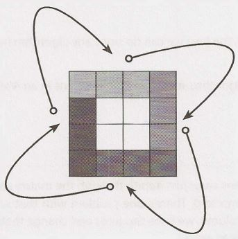

How do we perform this four-way edge swap? One option is to copy the top edge to an array, and then move the left to the top, the bottom to the left, and so on. This requires O(N)  memory, which is actually unnecessary.

A better way to do this is to implement the swap index by index. In this case, we do the following:

```
1     for i =  0 to  n
2         temp=  top[i];
3          top[i] =  left[i]
4         left[i] =  bottom[i]
5          bottom[i]= right[i]
6          right[i] = temp
```

We perform such a swap on each layer, starting from the outermost layer and working our way inwards. (Alternatively, we could start from the inner layer and work outwards.)

The code for this algorithm is below.

```java
1     boolean   rotate(int[][] matrix)  {
2          if  (matrix.length== 0  I   I     matrix.length  != matrix[0].length) return false;
3            int n  = matrix.length;
4          for (int  layer =  0;  layer <  n  / 2;  layer++)  {
5               int first= layer;
6               int last= n  -  1  -  layer;
7               for(int i =  first; i <   last; i++)  {
8                    int offset =  i -  first;
9                    int top=  matrix[first][i]; II save top
10
11                  // left ->  top
12                   matrix[first][i] =  matrix[last-offset][first];
13
14                  // bottom ->  left 
15                   matrix[last-offset][first] = matrix[last][last  -  offset];
16
17                   // right  ->  bottom
18                  matrix[last][last -  offset] = matrix[i][last]; 
19
20                  // top   ->  right
21					matrix[i][last]  = top;   // right<-  saved top
22				} 
23        }
24		return  true; 
25   }
```

This algorithm is O(N²), which is the best we can do since any algorithm must touch all N² elements.


**1.8 Zero Matrix:** Write an algorithm such that if an element in an MxN matrix is 0, its entire row and column are set to 0.


SOLUTION

---


At first glance, this problem seems easy: just iterate through the matrix and every time we see a cell with value zero, set its row and column to 0. There's one problem with that solution though: when we come across other cells in that row or column, we'll see the zeros and change their row and column to zero.Pretty soon, our entire  matrix will be set to zeros.

One way around this is to keep a second matrix which flags the zero locations. We would then do a second pass through the matrix to set the zeros.This would take O(MN) space.

Do we really need O(MN) space?  No. Since we're going  to set the entire row and column to zero, we don't need to track that it was exactly cell[2][4] (row 2, column 4). We only need to know that row 2 has a zero somewhere, and column 4 has a zero somewhere.We'll set the entire row and column to zero anyway, so why would we care to keep track of the exact location of the zero?

The code below implements this algorithm. We use two arrays to keep track of all the rows with zeros and all the columns with zeros. We then nullify rows and columns  based  on the values in these arrays.

```java
1     void setZeros(int[][] matrix)  {
2          boolean[]  row = new  boolean[matrix .length];
3          boolean[]   column  = new  boolean[matrix[0].length];
4
5          II Store  the  row and column  index with value  0
6          for  (int i=  0; i< matrix.length; i++)   {
7               for  (int j = 0; j< matrix[0].length;j++) {
8                    if  (matrix[i][j] ==  0)  {
9                         row[i] = true;
10                       column[j]  = true;
11                     }
12              }
13        }
14
15         // Nullify  rows
16         for (inti= 0; i <  row.length;   i++) {
17               if (row[i])  nullifyRow(matrix, i);
18        }
19
20         // Nullify  columns
21         for (int j =  0;   j <   column.length;  j++) {
22               if (column[j])  nullifyColumn(matrix, j);
23         }
24    }
25
26    void nullifyRow(int[][]  matrix, int  row) {
27         for (int j=    0;   j <   matrix[0].length;   j++) {
28               matrix[row][j] =  0;
29        }
30    }
31
32    void nullifyColumn(int[][] matrix, int  col) {
33         for (int  i=  0;   i <   matrix.length;   i++) {
34               matrix[i][col]=  0;
35         }
36     }
```

To make this somewhat more space efficient we could  use  a bit vector instead of a boolean array. It would still be O(N)  space.

We can  reduce the  space to O(1) by using the  first row as a replacement for the  row  array  and  the  first column as a replacement for the column array. This works as follows:

1.  Check   if  the   first   row   and   first  column  have   any   zeros,   and   set   variables rowHasZero   and columnHasZero. (We'll nullify the first row and  first column later, if necessary.)
2.  Iterate through the  rest of the  matrix,  setting matrix[i][0)  and  matrix[0) [j] to zero whenever there's a zero in matrix[i][j].
3.  Iterate through rest of matrix, nullifying row i if there's a zero in matrix[i][0].
4.   Iterate through rest of matrix, nullifying column j if there's a zero in matrix[0][j].
5.  Nullify the  first row and  first column, if necessary (based on values from Step  1). 

This code is below:

```java
1      void  setzeros(int[][] matrix) {
2           boolean  rowHasZero = false;
3           boolean  colHasZero  = false;
4
5           // Check   if first row  has a  zero
6           for (int j=    0;   j <   matrix[0].length;  j++) {
7                 if  (matrix[0][j] ==         0) {
8                       rowHasZero  = true;
9                       break;
10              }
11         }
12
13         // Check   if first column   has a  zero
14         for (int i=     0;   i <   matrix.length;   i++) {
15               if (matrix[i][0]==    0) {
16                     colHasZero = true;
17                     break;
18              }
19         }
20 
21 		// Check   for zeros in the rest  of the array 
22 		for (int i=  1;   i <   matrix.length;  i++) {
23 		for (int j =  1;   j <   matrix[0].length;j++) {
24 		if  (matrix[iJ[jJ ==  0) { 
25 		matrix[i][0]=  0; 
26 		matrix[0J[j] =  0;
27 		}
28 		}
29 		}
30
31		// Nullify rows   based  on  values in  first column 
32		for (int i=   1;   i <   matrix.length; i++) {
33		if  (matrix[i][0] == 0) {
34		nullifyRow(matrix,  i); 
35              }
36        }
37 
38		// Nullify  columns based on  values in  first row
39		for (int j=    1;   j <   matrix[0].length;   j++) {
40		if (matrix[0][j]==    0) {
41		nullifyColumn(matrix,  j);
42		}
43		}
44
45		// Nullify first row 
46		if (rowHasZero) {
47		nullifyRow(matrix,  0);
48		}
49		
50		// Nullify first column 
51		if (colHasZero) {
52		nullifyColumn(matrix,  0);
53		} 
54   }
```

This code has  a lot of"do  this for the  rows, then the  equivalent action for the  column:' In an interview, you could abbreviate this code by adding comments and TODOs that explain that the next chunk of code looks the  same as the  earlier code,  but  using rows. This would allow you to focus  on the  most important parts of the  algorithm.


**1.9 	String Rotation:** Assumeyou have a method i5Sub5tring which checks if one word is a substring of another. Given two strings,  51 and 52, write code to check if 52 is a rotation of 51 using only one
call to i5Sub5tring (e.g., "waterbottle" is a rotation of" erbottlewat").

SOLUTION

---

If we imagine that 52  is a rotation of 51,  then we can  ask what the  rotation point is. For example, if you rotate waterbottle after  wat. you  get  erbottlewat. In a rotation, we cut 51  into  two  parts,  x and y, and rearrange them to get  s2.

```
51 =  xy   =  waterbottle
x  =  wat
y = erbottle
s2  = yx   = erbottlewat
```

So, we need to check  if there's a way to split s1 into x  andy such that xy = s1 andyx = s2. Regardless of where the division between x andy is, we can see thatyx will always be a substring of xyxy.That is, s2 will always be a substring of s1s1.

And this is precisely how we solve the problem: simply do isSubstring(slsl,  s2). The code below implements this algorithm.

```java
1     boolean  isRotation(String sl,  String s2)  {
2         int len  =  sl.length();
3            /*  Check that sl and s2 are  equal  length and not  empty*/
4         if (len == s2.length() &&   len   >   0)  {
5                  /*  Concatenate  sl and sl within new  buffer  */
6              String slsl =  sl + sl;
7              return isSubstring(slsl,  s2);
8          }
9         return false;
10   }
```

The runtime of this varies based on the runtime of isSubstring. But if you assume that isSubstring runs inO(A+B) time (on strings of length A and B), then the runtime of isRotation is O(N).


## 2 Linked  Lists

A linked list is a data structure that represents a sequence of nodes. In a singly linked list, each node points to the next node in the linked list. A doubly linked list gives each node pointers to both the next and the previous node.

The following diagram depicts a doubly linked list:


Unlike an array, a linked list does not provide constant time access to a particular "index" within the list. This means that if you'd like to find the Kth element in the list, you will need to iterate through K elements.

The benefit of a linked list is that you can add and remove items from the beginning of the list in constant time. For specific applications, this can be useful.


### Creating a Linked List

The code below implements a very basic singly linked list.

```java
1 	class Node {
2 		Node next=  null; 
3 		int data;
4 		
5 		public  Node(int d)  {
6 			data=  d;
7 		}
8		
9		void  appendToTail(int d)  { 
10			Node end=  new Node(d);
11			Node n  =  this;
12			while   (n.next  != null) {
13				n  =  n.next;
14			}
15			n.next=  end; 
16		}
17	}
``` 

In this implementation, we don't have a LinkedList data structure. We access the linked list through a reference to the head Node of the linked list. When you implement the linked list this way, you need to be a bit careful. What if multiple objects need a reference to the linked list, and then the head of the linked list changes? Some objects might still be pointing to the old head.

We could, if we chose, implement a LinkedList class that wraps the Node class. This would essentially just have a single member variable: the head Node. This would largely resolve the earlier issue.

Remember that when you're discussing a linked list in an interview, you must understand  whether it is a singly linked list or a doubly linked list.


### Deleting a Node from a Singly Linked List

Deleting a node from a linked list is fairly straightforward. Given a node n, we find the previous node prev and set prev.next equal to n. next. If the list is doubly linked, we must also update  n. next to set n. next. prev equal to n. prev. The important things to remember are (1) to check for the null pointer and (2) to update the head or tail pointer as necessary.

Additionally,  if you implement this code in C, C++ or another  language that requires the developer to do memory management, you should consider if the removed node should be deallocated.

```java
1     Node deleteNode(Node head,   int d)  {
2          Node n  =  head;
3
4          if (n.data == d)  {
5               return head.next; /*moved  head*/
6          }
7
8         while   (n.next  != null)  {
9               if  (n.next.data == d)  {
10                  n.next = n.next.next;
11                  return head;   /*   head  didn't change*/
12             }
13			   n = n.next;
14        }
15        return head;
16   }
```

### The "Runner"Technique

The "runner" (or second pointer) technique  is used in many linked list problems. The runner technique means that you iterate through the linked list with two pointers simultaneously, with one ahead of the other. The "fast" node might be ahead by a fixed amount, or it might be hopping multiple nodes for each one node that the"slow" node iterates through.

For example, suppose you had a linked list a1 - >a2 ->....->an -> b1 -> b2 ->...->bn  and you wanted to rearrange it into a1 ->b1 ->a2 - >b2 -> ...- >an - >bn. You do not know the length of the linked list (but you do know that the length is an even number).

You could have one pointer pl (the fast pointer) move  every two elements for every one move that p2 makes. When pl hits the end of the linked list, p2 will be at the midpoint. Then, move pl back to the front and begin"weaving" the elements. On each iteration, p2 selects an element and inserts it after pl.


### Recursive  Problems

A number of linked list problems rely on recursion. If you're having trouble solving a linked list problem, you should explore if a recursive approach will work. We won't go into depth on recursion here, since a later chapter is devoted to it.

However, you should remember that recursive algorithms take at least O (n)  space, where n is the depth of the recursive call. All recursive algorithms can be implemented iteratively, although they may be much more complex.

---
Interview Questions
---

**2.1 Remove Dups:** Write code to remove duplicates from an unsorted linked list.

FOLLOW UP

How would you solve this problem if a temporary buffer is not allowed?

SOLUTION

---

In order to remove duplicates from a linked list, we  need to be able to track duplicates. A simple hash table will work well  here.

In the below solution, we  simply iterate through the linked list, adding each element to a hash table. When we  discover a duplicate element, we remove the element and continue iterating. We can do this all in one pass since we are using a linked list.

```java
1      void deleteDups(LinkedListNode n)  {
2            HashSet<Integer>  set =  new  HashSet<Integer>();
3            LinkedListNode previous  =  null;
4            while (n  !=  null) {
5                  if  (set.contains(n.data)) {
6                        previous.next =  n.next;
7                  }  else {
8                        set.add(n.data);
9                        previous =  n;
10            }
11                n =  n.next;
12        }
13   }
```

The  above solution takes O(N) time, where N is the number ofelements in the linked list.

**Follow  Up: No Buffer Allowed**

lfwe don't have a buffer, we can iterate with two pointers: current which iterates through the linked list, and runner which checks all subsequent nodes for duplicates.

```java
1      void deleteDups(LinkedListNode   head)  {
2            LinkedListNode  current =  head;
3            while (current   !=  null) {
4                  /* Remove  all future  nodes that  have the same value */
5                  LinkedListNode runner  =  current;
6                  while (runner.next  !=  null) {
7                        if  (runner.next.data ==  current.data) {
8                                 runner.next = runner.next.next;
9                          } else {
10                              runner  =   runner.next;
11                      }
12             }
13             current     current.next;
14        }
15     }
```

This code runs in O(1) space, but O(N²) time.


**2.2       Return Kth to Last:**  Implement an algorithm to find the kth to last element of a singly linked list.

SOLUTION

---

We will approach this problem both recursively and non-recursively. Remember that recursive solutions are often cleaner but less optimal. For example, in this problem, the recursive implementation is about half the length of the iterative solution but also takes 0( n) space, where n is the number of elements in the linked list.

Note that for this solution, we have definedk such that passing ink   =  1 would return the last element,k
2 would return to the second to last element, and so on. It is equally acceptable to definek such that k =  0 would return the last element.

##### Solution #1: If linked list size is known

If the size of the linked list is known, then thekth to last element is the ( length  - k)th element. We can just iterate through the linked list to find this element. Because this solution is so trivial, we can almost be sure that this is not what the interviewer intended.

##### Solution #2: Recursive

This algorithm recurses through the linked list. When it hits the end, the method passes back a counter set to 0. Each parent call adds 1  to this counter. When the counter equalsk, we know we have reached thekth to last element of the linked list.

Implementing this is short and sweet-provided we have a way of"passing back" an integer value through the stack. Unfortunately, we can't pass back a node and a counter using normal return statements. So how do we handle this?

*Approach A: Don't Return the Element.*

One way to do this is to change the problem to simply printing thekth to last element. Then, we can pass back the value of the counter simply through return values.

```java
1     int  printKthToLast(LinkedlistNode head,   int k)  {
2          if  (head== null) {
3                   return 0;
4           }
5          int index   = printKthToLast(head.next,  k)  + 1;
6          if (index == k)  {
7                    System.out.println(k +   "th   to last node  is " +  head.data);
8           }
9          return  index;
10    }
```

Of course, this is only a valid solution if the interviewer says it is valid.

*Approach B: Use C++.*

A second way to solve this is to use C++ and to pass values by reference. This allows us to return the node value, but also update the counter by passing a pointer to it.

```java
1     node*  nthToLast(node*  head,   int k,  int&  i) {
2          if (head==    NULL)  {
3               return NULL;
4          }
5          node*  nd  =  nthToLast(head->next,  k,  i);
6          i = i +  1;
7          if (i == k)  {
8               return head;
9           }
10        return nd;
11   }
12
13   node*  nthToLast(node*  head,   int k)  {
14        int i =  0;
return  nthToLast(head, k,  i);
16   }
```

*Approach C: Create a Wrapper Class.*

We described earlier that the issue was that we couldn't simultaneously return a counter and an index. If we wrap the counter value with simple class (or even a single element  array), we can mimic passing by reference.

```java
1     class Index  { 
2          public int value = 0;
3     }
4
5     LinkedListNode  kthTolast(LinkedlistNode  head,   int k)  {
6          Index  idx  = new Index();
7          return  kthToLast(head, k,   idx);
8     }
9
10   LinkedListNode kthToLast(LinkedListNode head, int k, Index  idx) {
11        if  (head== null) {
12            return null;
13        }
14        LinkedListNode  node      kthToLast(head.next,  k,   idx);
15        idx.value =  idx.value + 1;
16        if  (idx.value == k)  {
17             return  head;
18        }
19        return node;
20   }
```

Each of these recursive solutions takes 0(n) space due to the recursive calls.

There are a number of other solutions that wehaven't addressed. We could store the counter in a static vari­ able. Or, we could create a class that stores both the node and the counter, and return an instance of that class. Regardless of which solution we pick, we need a way to update both the node and the counter in a way that all levels of the recursive stack will see.


##### Solution #3: Iterative

A more optimal, but less straightforward, solution is to implement this iteratively. We can use two pointers, pl and p2. We place them k nodes apart in the linked list by putting p2 at the beginning and moving pl k nodes into the list. Then, when we move them at the same pace, pl will hit the end of the linked list after LENGTH  - k steps. At that point, p2  will be LENGTH  - k nodes into the list, or k nodes from the end.

The code below implements this algorithm.

```java
1     LinkedListNode  nthTolast(LinkedListNode head,  int k)  {
2         LinkedlistNode pl   head;
3            LinkedlistNode  p2 =  head;
4
5         /*  Move  pl  k nodes  into the  list.*/
6         for  (int i= 0;  i <   k;  i++)  {
7              if (pl ==  null) return null;  // Out of  bounds
8              pl  =  pl.next;
9         }
10
11       /*  Move  them at the  same pace.  When  pl  hits the  end,  p2 will be at the  right
12         * element.   */
13       while  (pl!=  null) {
14            pl =  pl.next;
15            p2 =  p2.next;
16       }
17       return p2;
18    }
```

This algorithm takes O(n) time and O(1) space.


**2.3 	Delete Middle  Node:**  Implement an algorithm to delete a node in the middle (i.e., any node but the first and last node, not necessarily the exact middle) of a singly linked list, given only access to that node.
```
EXAMPLE
Input:the node c from the linked list a->b->c->d->e->f
Result: nothing is returned, but the new linked list looks like a->b->d->e->f
```

SOLUTION

---

In this problem, you are not given access to the head of the linked list. You only have access to that node. The solution is simply to copy the data from the next node over to the current node, and then to delete the next node.

The code below implements this algorithm.

```java
1     boolean  deleteNode(LinkedListNode  n)  {
2         if (n  ==  null  I   I     n.next ==  null)  {
3                   return false;  // Failure
4        }
5         LinkedlistNode next  =  n.next;
6         n.data=  next.data;
7         n.next =  next.next;
8         return true;
9     }
```

Note that this problem cannot be solved if the node to be deleted is the last node in the linked list. That's okay-your interviewer wants you to point that out, and to discuss how to handle this case. You could, for example, consider marking the node as dummy.


**2.4 Partition:** Write code to partition a linked list around a value x, such that all nodes less than x come before all nodes greater than or equal to x. If x is contained within the list the values of x only need to be after the elements less than x (see below). The partition element x can appear anywhere in the "right partition"; it does not need to appear between the left and right partitions.

```
EXAMPLE 
Input:   3  ->   5  ->  8 -> 5  ->  10 -> 2  -> 1 [partition= 5] 
Output:  3  ->  1 -> 2  ->  10  ->  5 -> 5  ->  8 
```

SOLUTION

---

If this were an array, we would need to be careful about how we shifted elements. Array shifts are very expensive.

However, in a linked list, the situation is much easier. Rather than shifting and swapping elements, we can actually create two different linked lists: one for elements less than x, and one for elements greater than or equal to x.

We iterate through the linked list, inserting elements into our before list or our after list. Once we reach the end of the linked list and have completed this splitting, we merge the two lists.

This approach is mostly "stable" in that elements stay in their original order, other than the necessary move­ment around the partition. The code below implements this approach.

```java
1     /*Pass in  the   head  of  the   linked list and  the   value  to partition around*/
2     LinkedListNode  partition(LinkedListNode node,   int x)  {
3         LinkedlistNode beforeStart=  null;
4          LinkedListNode beforeEnd  =  null;
5          LinkedListNode  afterStart    null;
6          LinkedListNode afterEnd  = null;
7
8          /*Partition list*/
9          while   (node!=  null)  {
10             LinkedListNode next=  node.next;
11             node.next  =  null;
12             if (node.data<  x)  {
/*Insert node  into end  of  before list*/
14                  if  (beforeStart == null)  { 
15					beforeStart = node;
16					beforeEnd  =   beforeStart;
17					} else {
18						beforeEnd.next=  node;
19						beforeEnd  =  node;
20					}
21					} else {
22						/* Insert node  into end  of  after list*/
23						if (afterStart == null)  {
24							afterStart = node;
25							afterEnd =  afterStart;
26						}  else {
27							afterEnd.next=  node;
28							afterEnd=  node;
29							} 
30               }
31               node       next;
32        }
34         if (beforeStart==     null) {
35               return afterStart;
36       }
37
38         /* Merge   before  list and   after list */
39         beforeEnd.next=     afterStart;
40         return beforeStart;
41   }
```

If it bugs you to keep around four different variables for tracking two  linked  lists, you're  not  alone.  We can make this code a bit shorter.

If we  don't care  about making the elements of the list "stable"  (which  there's no  obligation to, since  the interviewer hasn't specified that), then we can  instead rearrange the elements by growing the list at the head and  tail.

In this approach, we start a"new" list (using the existing nodes). Elements bigger than the pivot element are put  at the tail and  elements smaller are put  at the head. Each time we insert  an element, we update either the head or tail.

```java
1      LinkedlistNode  partition(LinkedlistNode node, int  x)   {
2           LinkedListNode head     node;
3           LinkedListNode tail=     node;
4
5           while  (node !=  null)  {
6                 LinkedListNode next  = node.next;
7                 if (node.data <   x)   {
8                       /* Insert node   at head. */
9                       node.next=  head;
10                     head=  node;
11               }  else  {
12                    /*  Insert  node at tail. */
13                     tail.next=    node;
14                    tail= node;
15              }
16               node=  next;
17        }
18         tail.next= null;
19
20         // The  head  has   changed,  so  we  need to  return it to the user.
21         return head;
22     }
```

There are many  equally optimal solutions to this problem. If you came up  with a different one, that's okay!


**2.5 	Sum Lists:** You have two numbers represented by a linked list,where each node contains a single digit. The digits are stored in reverse order,such that the 1's digit  is at the head of the list. Write a function that adds the two numbers and returns the sum as a linked list.

```
EXAMPLE
Input: (7-> 1 -> 6) +   (5 -> 9 -> 2). That is,617 +  295. 
Output: 2 -> 1 -> 9. That is,912.
```

FOLLOW UP

Suppose the digits are stored in forward order. Repeat the above problem. 

```
Input: (6 -> 1 -> 7) +  (2 -> 9 -> 5).That is,617 +  295.
Output: 9 -> 1 -> 2.That is, 912.
```

SOLUTION

---

It's useful  to remember in this problem how exactly addition works. Imagine the problem:

```
6 1 7
+ 2  9  5
```

First, we add 7 and 5 to get 12. The digit 2 becomes the last digit of the number, and 1 gets carried over to the next step. Second,  we add 1, 1, and 9 to get 11.The 1 becomes the second digit,and the other 1 gets carried over the final step. Third and finally, we add 1,6 and 2 to get 9. So,our value becomes 912.

We can mimic this process recursively by adding node by node,carrying  over any "excess" data to the next node.  Let's walk through this for the below linked list:

```
7  -> 1 -> 6
+    5 -> 9 -> 2
```

We do the following:

1.  We add 7 and 5 first,getting a result of 12. 2 becomes the first node in our linked list,and we"carry" the
1 to the next sum. List: 2 ->?
2.  We then  add 1 and 9, as well as the "carry;' getting a result of 11. 1 becomes the second element of our linked list, and we carry the 1 to the next sum.

```
List: 2 -> 1 ->?
```

3.  Finally, we add 6, 2 and our"carrY:'to get 9.This becomes the final element of our linked list.
```
List: 2 -> 1 -> 9.
```

The code below implements this algorithm.

```java
l  LinkedListNode addlists(LinkedListNode 11, LinkedListNode 12, int  carry) {
2          if (11 ==·null &&  12==    null  &&   carry==   0) {
3                return null;
4         }
5
6	LinkedlistNode result	new  LinkedlistNode();
7	int  value =  carry;	
8	if (11 !=  null)  {	
9	value +=  11.data;	
10         }
11     if (12 !=  null)  {
12          value +=  12.data;
13         }
14
15      result.data    value% 10; /* Second digit of  number */
16
17      /*Recurse  */
18     if (11 != null II   12 != null) {
19          LinkedlistNode  more = addlists(ll == null ?  null   :    11.next,
20                                                          12== null? null :   12 . next,
21                                                                       value>= 10?  1   :    0);
22             result.setNext(more);
23        }
24     return  result;
25   }
```

In implementing this code, we must be careful to handle the condition when one linked list is shorter than another. We don't want to get a null pointer exception.

##### Follow Up

Part B is conceptually the same (recurse, carry the excess), but has some additional complications when it comes to implementation:

1. One list may be shorter than the other, and we cannot handle this "on the flY:' For example, suppose we were adding (1 -> 2 -> 3-> 4) and (5-> 6-> 7). We need to know that the 5 should be"matched"with the
2, not the 1. We can accomplish this by comparing the lengths of the lists in the beginning and padding the shorter list with zeros.
2.  In the first part, successive results were added to the tail (i.e., passed forward). This meant that the recur­ sive call would be passed the carry, and would return the result (which is then appended to the tail). In this case, however, results are added to the head (i.e., passed backward). The recursive call must return the result, as before, as well as the carry. This is not terribly challenging to implement, but it is more cumbersome. We can solve this issue by creating a wrapper class called Partial Sum.

The code below implements this algorithm.

```java
1    class  PartialSum {
2          public  LinkedListNode  sum   = null;
3          public  int carry= 0;
4    }
5
6    LinkedlistNode addLists(LinkedListNode 11, LinkedListNode  12) {
7          int lenl   length(ll);
8          int leN² =  length(l2);
9
10      /* Pad the shorter  list with zeros  -  see note (1) */
11      if (lenl <   leN²)  {
12          11  =  padlist(ll, leN²  -  lenl);
13         }  else  {
14          12  =  padlist(l2, lenl -  leN²);
15          }
16
17        /* Add lists */
18      PartialSum sum   =  addListsHelper(ll,  12);
19
20      /* If there was a carry value left over,  insert this  at the front of  the list.
21         * Otherwise,  just  return  the linked  list. */
22      if (sum.carry== 0) {
21
23            return sum.sum;
24       }  else {
25            LinkedListNode  result  = insertBefore(sum.sum, sum.carry);
26            return result;
27          }
28   }
2.9
30  Partia1Sum addListsHelper(LinkedListNode  11,  LinkedlistNode 12)  {
31       if  (11== null   &&   12==    null) {
32            Partia1Sum sum=  new Partia1Sum();
33            return sum;
34       }
35     /*    Add  smaller digits  recursively*/
36          Partia1Sum sum=  addListsHelper(ll.next,  12.next);
37
38        /*    Add  carry  to  current data*/
39           int val=  sum.carry  +  11.data  + 12.data;
40
41     /*    Insert sum of  current digits*/
42       LinkedListNode full_result=  insertBefore(sum.sum,  val%   10);
43
44     /*    Return  sum so  far,  and the  carry   value*/
45       sum.sum=    full_result;
46       sum.carry      val/   10;
47       return sum;
48   }
49
50 /* Pad the  list with  zeros*/
51  LinkedListNode padList(LinkedListNode  1,  int padding)  {
52       LinkedlistNode head=    l;
53       for  (int i= 0;  i <   padding;  i++)  {
54            head= insertBefore(head,  0);
55      }
56       return head;
57     }
58
59  /*    Helper  function to  insert node in  the  front of  a linked list*/
60  LinkedListNode insertBefore(LinkedListNode  list,  int data)   {
61       LinkedListNode node=  new LinkedListNode(data);
62           if (list != null) {
63            node.next=  list;
64       }
55       return node;
66   }
```

Note how we have pulled insertBefore(), padlist(), and length() (not listed) into their own methods. This makes the code cleaner and easier to read-a wise thing to do in your interviews!


**2.6       Palindrome:** Implement a function to check if a linked list is a palindrome.


SOLUTION
 
--- 

To approach this problem, we can picture a palindrome like 0  - >   1  - >   2  - >   1  - >  0. We know that, since it's a palindrome, the list must be the same backwards and forwards. This leads us to our first solution.


##### Solution #1: Reverse and Compare

Our first solution is to reverse the linked list and compare the reversed list to the original list. If they're the same, the lists are identical.

Note that when we compare the linked list to the reversed list, we only actually need to compare the first half of the list.  If the first half of the normal list matches the first half of the reversed list, then the second half of the normal list must match the second half of the reversed list.

```java
1     boolean  isPalindrome(LinkedListNode head)  {
2         LinkedListNode reversed=  reverseAndClone(head);
3           return  isEqual(head, reversed);
4      }
5
6    LinkedlistNode reverseAndClone(LinkedListNode  node)  {
7         LinkedListNode head=   null;
8         while  (node  != null) {
9              LinkedListNode n=  new LinkedlistNode(node.data); // Clone
10            n.next=    head;
11            head
12            node=   node.next;
13        }
14       return head;
15    }
16
17   boolean  isEqual(LinkedListNode one,  LinkedListNode  two)  {
18       while  (one  != null &&   two !=          null) {
19            if (one.data  != two.data)  { 
20				return false; 
21              }
22            one     one.next;
23            two     two.next;
24          }
25       return one==  null   &&   two==  null;
26     }
```

Observe that we've modularized this code into reverse and isEqua 1 functions. We've also created a new class so that we can return both the head and the tail of this method. We could have also returned a two­ element array, but that approach is less maintainable.

##### Solution #2: Iterative Approach

We want to detect linked lists where the front half of the list is the reverse of the second half. How would we do that? By reversing the front half of the list. A stack  can accomplish this.

We need to push the first half of the elements onto a stack. We can do this in two different ways, depending on whether or not we know the size of the linked list.

If we know the size of the linked list, we can iterate through the first half of the elements in a standard for loop, pushing each element onto a stack. We must be careful, of course, to handle the case where the length of the linked list is odd.

If we don't know the size of the linked list, we can iterate through the linked list, using the fast runner/ slow runner technique described in the beginning of the chapter.  At each step in the loop, we push the data from the slow runner onto a stack. When the fast runner hits the end of the list, the slow runner will have reached the middle of the linked  list. By this point, the stack will have all the elements from the front of the linked list, but in reverse order.


Now, we simply iterate through the rest of the linked list. At each iteration, we compare the node to the top of the stack. If we complete the iteration without finding a difference, then the linked list is a palindrome.

```java
1     boolean isPalindrome(LinkedListNode head)   {
2          LinkedListNode fast= head;
3          LinkedListNode slow=  head;
4
S             Stack<Integer> stack=     new Stack<Integer>();
6
7        /*    Push elements from  first  half of  linked list onto   stack. When  fast  runner
8          * (which  is moving at 2x speed)  reaches the   end  of  the   linked list, then   we
9          *   know we're at the   middle*/
10        while   (fast != null &&  fast.next != null) {
11             stack.push(slow.data);
12             slow      slow.next;
13             fast= fast.next.next;
14        }
15
16      /* Has odd number of  elements,  so  skip the  middle  element*/
17        if (fast!= null) {
18             slow=  slow.next;
19        }
20
21        while   (slow  != null) {
22             int top=  stack.pop().intValue();
23
24           /*   If  values are   different, then   it's not   a  palindrome*/
25             if (top != slow.data) {
26                  return false;
27             }
28             slow=  slow.next;
29        }
30
31   }
```

##### Solution #3: Recursive Approach

First, a word on notation: in this solution, when we use the notation node  Kx, the variable K indicates the value of the node data, and x (which is either for b) indicates whether we are referring to the front node with that value or the back node. For example, in the below linked list node   2b would refer to the second (back) node with value 2.

Now, like many linked list problems, you can approach this problem recursively. We may have some intui­ tive idea that we want to compare element 0 and element n  -   1, element 1 and element n - 2, element 2 and element n-3,  and so on, until the middle element(s). For example:
```
0  (  1  (  2  (  3  )   2  )   1  )  0
```
In order to apply this approach, we first need to know when we've reached the middle element, as this will form our base case. We can do this by passing in length  -  2 for the length each time. When the length equals 0 or 1, we're at the center of the linked list. This is because the length is reduced by 2 each time. Once we've recursed  Yi times, length will be down to 0.

```
1     recurse(Node n,  int length) {
2          if  (length== 0  I   I      length==    1)  {
3               return  [something]; //  At  middle
4          }
5          recurse(n.next,  length -  2);
6	...
7      }
```

This method will form the outline of the isPalindrome method. The "meat" of the algorithm though is comparing node i to node n  -  i to check if the linked list is a palindrome. How do we do that?

Let's examine what the call stack looks like:

```
1    vl  =   isPalindrome:  list =   0  (  1  (  2  (  3  )  2  )  1  )  0.   length   =  7
2         v2 =  isPalindrome: list  = 1  (  2  (  3  )  2  )  1  )  0.  length =  5
3              v3 =  isPalindrome: list =   2  (  3  )  2  )  1  )  0.  length   =  3
4                   v4 =  isPalindrome:   list  = 3  )  2  )  1  )  0.  length =  1
5                         returns v3
6                  returns v2
7            returns vl
8      returns  ?
```

In the above call stack, each call wants to check  if the list is a palindrome by comparing its head node with the corresponding node from the back of the list. That is:

- Line 1  needs to compare node  0f with node   0b
- Line 2 needs to compare node   1f with node   lb
- Line 3 needs to compare node   2f with node   2b
- Line 4 needs to compare node   3f with node   3b.

If we rewind the stack, passing nodes back as described below, we can dojust that:

- Line 4 sees that it is the middle node (since length =  1), and passes back head. next.The value head equals node   3, so head. next is node   2b.
- Line 3 compares its head, node   2f, to returned_node (the value from the previous recursive call), which is node   2b. lf the values match, it passes a reference to node  lb (returned_node. next) up to line 2.
- Line 2 compares its head (node   1f) to returned_node (node   lb). If the values match, it passes a reference to node   0b (or, returned_node. next) up to line 1.
- Line 1   compares its head, node   0f, to returned_node, which is node   0b. If the values match, it returns true.

To generalize, each call compares its head to returned_node, and then passes returned_node. next up the stack. In this way, every node i gets compared to node n   -   i. If at any point the values do not match, we return false, and every call up the stack checks for that value.

But wait, you might ask, sometimes we said we'll return a boolean value, and sometimes we're returning a node. Which is it?

It's both. We create a simple class with two members, a boolean and a node, and return an instance of that class.

```
1      class   Result  {
2         public   LinkedlistNode  node;
3            public   boolean  result;
4     }
```

The example below illustrates the parameters and return values from this sample list.
```
1      isPalindrome:  list = 0  (  1  (  2  (  3  (  4  )  3  )  2  )  1  )  0.  len  =  9
2         isPalindrome:  list =  1  (  2  (  3  (  4  )  3  )  2  )  1  )  0.  len  =  7
3                  isPalindrome:  list =   2  (  3  (  4  )  3  )  2  )  1  )  0.  len  =   5
4                   isPalindrome:  list =   3  (  4  )  3  )  2  )  1  )  0,   len=    3
5                              isPalindrome:  list =  4  )  3  )  2  )  1  )  0.  len  =   1
6                        returns node 3b,  true
7                   returns node 2b,  true
8              returns node lb,   true
9         returns node 0b,  true
10  returns null,  true
```

Implementing this code is nowjust a matter of filling in the details.
```
1     boolean  isPalindrome(LinkedListNode head)  {
2         int length=    lengthOflist(head);
3           Result  p=    isPalindromeRecurse(head,  length);
4         return p.result;
5      }
6
7       Result   isPalindromeRecurse(LinkedListNode  head,  int length) {
8         if (head==   null  I   I     length<=    0)  {  II Even number of  nodes
9                    return new  Result(head,  true);
10       }  else   if (length==    1)  {  II Odd number of  nodes
11            return new Result(head.next,  true);
12       }
13
14       I* Recurse on sublist. *I
15       Result  res  =  isPalindromeRecurse(head.next, length  -  2);
16
17       I* If child calls are  not  a palindrome,   pass  back up
18         * a  failure. *I
if (!  res.result  I   I      res.node==    null) {
20            return res;
21       }
22
23       I* Check if matches  corresponding node on other side.  *I
24       res.result=    (head.data==    res.node.data);
25
26       I* Return  corresponding   node.  *I
27       res.node=    res.node.next;
28
29       return res;
30  }
31
32   int  lengthOfList(LinkedListNode n)  {
33       int size=    0;
34       while  (n  !=       null) {
35            size++;
36            n=   n.next;
37       }
38       return size;
39     }
```

Some of you might be wondering why we went through all this effort to create a special Result class. Isn't there a better way? Not really-at least not in Java.

However, if we were implementing this in C or C++, we could have passed in a double pointer.

```
1     bool  isPalindromeRecurse(Node  head,  int length, Node** next)   {
2
3      }
```

It's ugly, but it works.


**2.7 		Intersection:**  Given two  (singly) linked lists, determine  if  the  two  lists intersect.  Return the intersecting node. Note that the intersection is defined based on reference, not value. That is, if the kth node of the first linked list is the exact same node (by reference) as the jth node of the second linked list, then they are intersecting. 


SOLUTION

---


Let's draw a picture of intersecting linked lists to get a better feel for what is going on. 

Here is a picture of intersecting linked lists:


And here is a picture of non-intersecting linked lists:
 
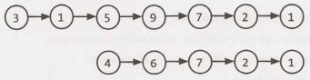

We should be careful here to not inadvertently draw a special case by making the linked lists the same length.

Let's first ask how we would determine if two linked lists intersect.

##### Determining if there's an intersection.

How would we detect if two linked lists intersect? One approach  would be to use a hash table and just throw all the linked lists nodes into there. We would need to be careful to reference the linked lists by their memory location, not by their value.

There's an easier way though. Observe that two intersecting linked lists will always have the same last node. Therefore, we can just traverse to the end of each linked list and compare the last nodes.

How do we find where the intersection is, though?

##### Finding  the intersecting node.

One thought is that we could traverse backwards through each linked list. When the linked lists"split'; that's the intersection. Of course, you can't really traverse backwards through a singly linked list.

If the linked lists were the same length, you could just traverse through them at the same time. When they collide, that's your intersection.


When  they're not  the same length, we'd like to just"chop off"-or ignore-those excess (gray) nodes.

How can we do this? Well, if we know the lengths of the two linked lists, then the  difference between those two linked  lists will tell us how much to chop off.

We can get the lengths at the same time as we get the tails of the linked lists (which we used in the first step to determine if there's an intersection).

##### Putting it all together.

We now have a multistep process.

1.  Run through each linked  list to get  the  lengths and  the  tails.

2.  Compare the  tails. If they are different (by reference, not  by value), return immediately. There is no inter- section.
3.  Set two pointers to the start  of each linked list.

4.  On the  longer linked  list, advance its pointer by the difference in lengths.
5.  Now, traverse on each linked  list until the  pointers are the  same. The implementation for this is below.

```java
1      LinkedlistNode findintersection(LinkedListNode  listl, LinkedListNode list2) {
2           if (listl ==  null  I   I      list2 == null) return null;
3 
4		/* Get   tail and  sizes. */
5		Result resultl    getTailAndSize(listl); 
6		Result result2  = getTailAndSize(list2);
7		
8		/* If different tail  nodes, then  there's no  intersection. */
9		if (resultl.tail !=  result2.tail) {
10		return null;
11		}
12		
13		/* Set pointers to the start  of  each linked  list. */
14		LinkedlistNode shorter =  resultl.size <   result2.size?   list1 :   list2; 
15		LinkedlistNode longer  =  resultl.size <   result2.size ?  list2 :    list1;
16		
17		/* Advance  the pointer for the longer linked list by  difference in lengths. */
18		longer = getKthNode(longer,  Math.abs(resultl.size -  result2.size));
19		
20		/* Move both pointers until  you  have  a  collision. */
21		while (shorter  !=  longer) { 
22		shorter =  shorter.next; 
23		longer = longer.next;
24		}
25		
26		/* Return either  one. */
27		return longer; 
28    }
29
30   class  Result {
31        public  LinkedlistNode tail;
32        public int  size;
33        public  Result(LinkedListNode tail,  int size) {
34             this.tail   tail;
35             this.size=  size;
36        }
37   }
38
39   Result  getTailAndSize(LinkedListNode list) {
40        if (list == null) return null;
41
42        int size = 1;
43        LinkedlistNode  current=  list;
44        while   (current.next != null) {
45             size++;
46             current = current.next;
47        }
48       return new Result(current,   size);
49    }
50
51   LinkedListNode   getKthNode(LinkedListNode  head,  int k)  {
52        LinkedListNode   current=  head;
53       while   (k  >   0 &&   current != null) {
54             current =  current.next;
55               k--;
56         }
57        return  current;
58    }
```

This algorithm takes O(A  +  B) time, where A and Bare the lengths of the two linked lists. It takes O( 1) additional space.


**2.8 	Loop Detection:** Given a circular linked list, implement an algorithm that returns the node at the beginning of the loop.

DEFINITION

Circular linked list: A (corrupt) linked list in which a node's next pointer points to an earlier node, so as to make a loop in the linked list.
```
EXAMPLE 
Input:  A   - > B   - > C   - > D   - > E   - > C [the same C as earlier] 
Output: C
```

SOLUTION
 
---
 
This is a modification of a classic interview problem: detect if a linked list has a loop. Let's apply the Pattern Matching approach.

##### Part  1 : Detect If Linked List Has A Loop

An easy way to detect  if a linked list has a loop is through  the FastRunner / SlowRunner  approach. FastRunner moves two steps at a time, while SlowRunner moves one step. Much like two cars racing around a track at different steps, they must eventually meet.

An astute reader  may  wonder   if FastRunner might  "hop  over"  SlowRunner completely,   without ever  colliding. That's  not  possible.  Suppose that  FastRunner did hop  over  SlowRunner, such  that SlowRunner is at spot  i and  FastRunner is at spot  i +   1. In the previous step, SlowRunner would be at spot i -   1 and FastRunner would at spot  ( ( i +  1)  -   2),  or spot i -   1. That is, they would have collided.

##### Part 2: When Do They Collide?

Let's assume  that the linked list has a "non-looped"part of size k.

If we apply our algorithm  from part  l, when  will FastRunner and SlowRunner collide?

We know that for every p steps that SlowRunner takes, FastRunner has taken 2p steps.Therefore, when SlowRunner enters the looped  portion  after k steps, FastRunner has taken 2k steps total and must be 2k   -   k steps, or k steps, into the looped portion. Since k might be much larger than the loop length, we should  actually write this as mod (k,  LOOP_SIZE) steps, which we will denote as K.

At each subsequent step, FastRunner and  SlowRunner get either one step  farther  away or one step closer, depending on your perspective. That is, because we are in a circle, when A moves q steps away from B, it is also moving q steps  closer to B.

So now we know the following facts:

1.  SlowRunner is O steps  into the loop.
2.  FastRunner is K steps  into the loop.
3.  SlowRunner is K steps behind FastRunner.
4.  FastRunner is LOOP_SIZE   -   K steps behind SlowRunner.
5.  FastRunner catches  up to SlowRunner at a rate of 1 step per unit of time.

So, when  do they  meet?  Well, if FastRunner is LOOP_SIZE           K  steps  behind  SlowRunner, and FastRunner catches  up at a rate of 1 step per unit of time, then they meet  after L OOP_SIZE   -   K steps. At this point, they will be K steps before the head of the loop. Let's call this point  Collisionspot.


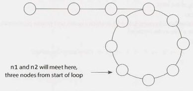


##### Part 3: How Do You Find The Start of the Loop?

We now know that CollisionSpot is K nodes before the start of the loop. Because K  =  mod (k,  LOOP_ SIZE) (or, in other  words, k =  K   +  M    *  LOOP_SIZE, for any integer M), it is also correct to say that it is k nodes from the loop start. For example, if node N is 2 nodes into a 5 node loop, it is also correct to say that it is 7, 12, or even 397 nodes into the loop.

Therefore, both  CollisionSpot and LinkedlistHead are k nodes from the start of the loop.

Now, if we keep one pointer at CollisionSpot and move the other one to LinkedListHead, they will each be k nodes from LoopStart. Moving the two pointers at the same speed will cause them to collide again-this time after k steps, at which point they will both be at LoopStart. All we have to do is return this node.

##### Part 4: Putting It All Together

To summarize, we move  FastPointer twice as fast as SlowPointer. When SlowPointer enters the  loop, after k nodes,  FastPointer is k nodes into the loop. This means that  FastPointer and SlowPointer are LOOP_SIZE  -  k nodes away from each other.

Next, if FastPointer moves two nodes for each node that SlowPointer moves, they move one node closer to each other on each turn. Therefore, they will meet after LOOP_SIZE  -   k turns. Both will be k nodes from the front of the loop.

The head of the linked list is also k nodes from the front of the loop. So, if we keep one pointer where it is, and move the other pointer to the head of the linked list, then they will meet at the front of the loop.

Our algorithm is derived directly from parts 1, 2 and 3.

1.   Create two pointers, FastPointer and SlowPointer.
2.  Move FastPointer at a rate of 2 steps and SlowPointer at a rate of 1 step.
3.  When they collide, move SlowPointer to LinkedListHead. Keep FastPointer where it is.
4.  Move SlowPointer and FastPointer at a rate of one step. Return the new collision point. 

The code below implements this algorithm.

```java
1     LinkedListNode FindBeginning(LinkedlistNode  head)  {
2          LinkedListNode slow      head;
3          LinkedlistNode fast  = head;
4
5        /*   Find  meeting   point. This  will be  LOOP_SIZE  -  k steps into the   linked list. */
6          while   (fast!=  null &&   fast.next!=  null) {
7               slow  =  slow.next;
8               fast =   fast.next.next;
9               if (slow   ==  fast) {//Collision
10                  break;
11              }
12        }
13
14      /*   Error check  -  no meeting  point,  and  therefore no  loop*/
15        if (fast == null  I   I      fast.next == null)  {
16             return null;
17        }
18
19     /*   Move  slow  to Head.  Keep fast at Meeting  Point. Each are   k steps from  the
20       *    Loop Start. If they   move at the   same pace,   they  must  meet  at Loop Start . */
21        slow  =  head;
22        while   (slow!=  fast) {
23             slow      slow.next;
24             fast= fast.next;
25         }
26
27      /* Both  now point to the   start of  the   loop. */
28        return fast;
29     }
```


Additional Questions:Trees and Graphs (#4.3),  Object-Oriented Design (#7.12),  System Design and Scal­ability (#9.5), Moderate Problems (#16.25), Hard Problems (#17.12).

Hints start on page 653.


## 3 Stacks and Queues

Questions on stacks and queues will be much easier to handle if you are comfortable with the ins and outs of the data structure. The problems can be quite tricky, though. While some problems may be
slight modifications on the original data structure, others have much more complex challenges.


### Implementing a Stack

The stack data structure is precisely what it sounds like: a stack of data. In certain types of problems, it can be favorable to store data in a stack rather than in an array.

A stack uses LIFO (last-in  first-out) ordering. That is, as in a stack of dinner plates, the most recent item added to the stack is the first item to be removed.

It uses the following operations:

- pop(): Remove the top item from the stack. 
- push(itern): Add an item to the top of the stack. 
- peek(): Return the top of the stack.
- is Empty(): Return true if and only if the stack is empty.

Unlike an array, a stack does not offer constant-time access to the ith item. However, it does allow constant­
time adds and removes, as it doesn't require shifting elements around.

We have provided simple sample code to implement a stack. Note that a stack can also be implemented using a linked list, if items were added and removed from the same side.

```java
1    public class MyStack<T> {
2          private static  class StackNode<T>   {
3              private T data;
4               private StackNode<T> next;
5
6               public StackNode(T  data)  {
7                    this.data = data;
8                 }
9             }
16
11        private StackNode<T> top;
12
13       public T  pop()   {
14             if (top == null) throw  new EmptystackException();
15             T item   =  top.data;
16				top=  top.next;
17				return item; 
18        }
19
20 		  public void  push(T  item) {
21 		  	StackNode<T> t=    new StackNode<T>(item);
22 		  	t.next=    top;
23 		  	top=  t;
24 		  }
25 
26		  public T  peek()  {
27		  	if (top==    null) throw  new EmptyStackException();
28		  	return top.data;
29		  }
30
31		public boolean   isEmpty()  {
32			return top==    null;
33		} 
34   }
```


One case where stacks are often useful is in certain recursive algorithms. Sometimes you need to push temporary data onto a stack as you recurse, but then remove them as you backtrack (for example, because the recursive check failed).  A stack offers an intuitive way to do this.

A stack can also be used to implement a recursive algorithm iteratively. (This is a good exercise! Take a simple recursive algorithm and implement it iteratively.)


### Implementing a Queue

A queue  implements  FIFO (first-in first-out) ordering. As in a line or queue  at a ticket stand, items are removed from the data structure in the same order that they are added.

It uses the operations:

- add(itern): Add an item to the end of the list. 
- remove(): Remove the first item in the list. 
- peek ( ) : Return the top of the queue.
- is Empty(): Return true if and only if the queue is empty.

A queue can also be implemented  with a linked list. In fact, they are essentially the same thing, as long as items are added and removed from opposite sides.

```java
1     public class MyQueue<T>   {
2          private static  class QueueNode<T>   {
3               private T  data;
4               private QueueNode<T>  next;
5
6                public QueueNode(T data) {
7                          this.data =  data;
8                 }
9          }
10
11        private QueueNode<T>  first;
12        private QueueNode<T>  last;
13
14           public void  add(T  item) {
15             QueueNode<T>  t =  new QueueNode<T>(item);
16             if (last !=          null) {
17             	last.next=  t;
18             }
19             last = t;
20             if (first== null) {
21             	first=    last;
22             } 
23        }
24
25		  public T remove()   { 
26		  	if (first==    null) throw  new NoSuchElementException(); 
27		  	T data=    first.data;  
28		  	first=    first.next;  
29		  	if (first == null) { 
30		  		last=    null; 
31		  	} 
32		  	return data; 
33		  } 
34		   
35		  public T peek()  { 
36		  	if (first==    null) throw  new NoSuchElementException(); 
37		  	return first.data; 
38		  } 
39		   
40		  public  boolean isEmpty() { 
41		  	return first==    null; 
42		  }  
43    }
```

It is especially easy to mess up the updating of the first and last nodes in a queue. Be sure to double check this.

One place where queues are often used is in breadth-first search or in implementing a cache.
In breadth-first search, for example, we used a queue to store a list of the nodes that we need to process. Each time we process a node, we add its adjacent nodes to the back of the queue. This allows us to process nodes in the order in which they are viewed.

---
Interview Questions
---

**3.1  Three in One:** Describe how you could use a single array to implement three stacks.


SOLUTION

---
 
Like many problems, this one somewhat  depends  on how well we'd like to support these stacks. If we're okay with simply allocating a fixed amount of space for each stack, we can do that. This may mean though that one stack runs out of space, while the others are nearly empty.

Alternatively, we can be flexible in our space allocation, but this significantly increases the complexity of the problem.

Approach 1: Fixed  Division

We can divide the array in three equal parts and allow the individual stack to grow in that limited space. Note: We will use the notation "[" to mean inclusive of an end point and "(" to mean exclusive of an end point.

- For stack 1, we will use [0,  n/3X).
- For stack 2, we will use [ n/3,  2n/3).
- For stack 3, we will use [ 2n/3 ,  n) .

The code for this solution is below.

```
1	class  FixedMultiStack {	
2	private int numberOfStacks	3;
3	private int stackCapacity;	
4	private int[]  values;	
5	private  int[] sizes;	
6		
7         public  FixedMultiStack(int stackSize) {
8               stackCapacity  = stackSize;
9               values  =  new int[stackSize *  numberOfStacks];
10             sizes  =  new int[numberOfStacks];
11        }
12
13       /* Push  value onto  stack.  */
14       public void  pus h(int stackNum,  int value) throws   FullStackException  {
15             /* Check that we have  space  for  the next  element */
16             if (isFull(stackNum)) {
17                  throw  new FullStackException();
18
19
20			/* Increment stack pointer and then update top value.*/
21			sizes[stackNum]++;
22			values[indexOfTop(stackNum)]   =  value;
23       }
24

}

 
25		/*  Pop item  from top  stack.  */
26		public   int  pop(int stackNum) {
27		if (isEmpty(stackNum))  {
28		throw new EmptyStackException();
29		}
30		
31		int toplndex  =  indexOfTop(stackNum);
32		int value  =  values[toplndex];  // Get top
33		values[topindex]  =  0;  // Clear 
34		sizes[stackNum]--;  // Shrink
35		return  value;
36		}
37
38		/*  Return  top  element.   */
39		public   int peek(int stackNum) {
40		if (isEmpty(stackNum))  {
41		throw new EmptyStackException();
42		}
43		return values[indexOfTop(stackNum)];
44		}
45		
46		/*  Return  if stack  is empty.  */
47		public  boolean  isEmpty(int stackNum) {
48		return sizes[stackNum]   ==  0;
49		}
50		
51		/*  Return  if stack  is full. */
52		public   boolean  isFull(int stackNum) {
53		return  sizes[stackNum] ==  stackCapacity;
54		}
55
56		/*  Returns  index  of  the  top  of  the  stack.  */
57		private  int  indexOfTop(int stackNum) { 
58			int offset =  stackNum * stackCapacity; 
59			int size =  sizes[stackNum];
60			return offset+  size -  1;
61		} 
62     }
```

If we had additional information about the expected usages of the stacks, then we could modify this algo­ rithm accordingly.  For example,  if we expected Stack  1  to have many more elements than Stack 2, we could allocate more space to Stack 1  and lessspace to Stack 2.

##### Approach 2: Flexible Divisions

A second approach is to allow the stack blocks to be flexible in size. When one stack exceeds its initial capacity, we grow the allowable capacity and shift elements as necessary.

We will also design our array to be circular, such that the final stack may start at the end of the array and wrap around to the beginning.

Please note that the code for this solution is far more complex than would be appropriate for an interview. You could be responsible for pseudocode, or perhaps the code of individual components, but the entire implementation would be far too much work.

```java
1    public class  MultiStack {
2         /*  Stackinfo is  a  simple  class that holds  a  set of  data  about  each  stack. It
3               * does not  hold  the  actual items  in  the  stack. We  could  have done this with
4           * just a  bunch of  individual variables,  but  that's messy and doesn't gain  us
5               * much.  */
6         private class  Stackinfo {
7              public int start,  size,  capacity;
8              public Stackinfo(int start,  int capacity) {
9                   this.start =start;
10                 this.capacity=    capacity;
11            }
12
13            /*  Check if an index  on the  full array   is within   the  stack boundaries. The
* stack can  wrap around  to  the  start of  the  array. */
15            public boolean  isWithinStackCapacity(int index)   {
16                 /*  If outside of  bounds of  array, return false.  */
17                 if (index< 0  I   I      index  >=values.length) {
18                      return false; 
19						}
20						
21						/*  If index  wraps around,  adjust it.  */
22						int  contiguousindex =index< start?  index  + values.length    index;
23						int end=  start +  capacity;
24						return start<=  contiguousindex  &&   contiguousindex< end; 
25              }
26
27            public int  lastCapacityindex() {
28                 return adjustindex(start + capacity  -  1);
29              }
30
31            public int  lastElementindex() {
32                 return adjustindex(start + size -  1);
33                }
34
35            public boolean  isFull() {  return size==    capacity;  }
36            public boolean  isEmpty()   {  return size==    0;  }
37          }
38
39       private  Stackinfo[J info;
40       private int[]  values;
41
42       public MultiStack(int numberOfStacks,  int defaultSize) {
43            /*  Create  metadata  for  all the  stacks.  */
44            info   =   new Stackinfo[numberOfStacks];
45            for  (int i=    0;  i< numberOfStacks; i++)  {
46                 info[i]  =   new Stackinfo(defaultSize * i,  defaultSize);
47                 }
48            values   =  new int[numberOfStacks * defaultSize];
49       }
50
51       /*  Push value  onto  stack num, shifting/expanding stacks as  necessary. Throws
52         * exception if  all  stacks are  full. */
53       public void  push(int stackNum, int value) throws  FullStackException {
54            if (allStacksAreFull()) {
55                 throw new FullStackException();
56              }
57
58            /* If this stack  is full, expand it. */
59            Stackinfo stack=  info[stackNum];
60            if (stack.isFull()) {
61                 expand(stackNum);
62               }
63
64 /* Find  the  index  of  the  top  element  in  the  array +  1,  and increment  the
65              * stack   pointer */
66            stack.size++;
67            values[stack.lastElementindex()]     value;
68         }
69
70       I*  Remove  value  from stack. *I
71       public   int pop(int stackNum) throws  Exception  {
72            Stackinfo stack=  info[stackNum];
73            if (stack.isEmpty())  {
74                 throw new EmptyStackException();
75               }
76
77            /*  Remove  last  element. */
78            int value=  values[stack.lastElementindex()];
79            values[stack.lastElementindex()] =  e; // Clear  item
80            stack.size--; II Shrink  size
81            return value;
82       }
83
84       /*  Get top  element  of  stack.*/
85       public   int peek(int stackNum) {
86            Stackinfo stack  =  info[stackNum];
87            return values[stack.lastElementindex()];
88         }
89       /*  Shift items  in  stack   over  by one element. If we  have available capacity, then
90         * we'll end up shrinking the  stack   by one element. If we  don't have available
91         * capacity,  then  we'll need to  shift the  next  stack   over  too. */
private void  shift(int stackNum) {
93            System.out.println("/// Shifting"  +  stackNum);
94            Stackinfo stack  =  info[stackNum];
95
96            I*  If this stack is at its  full capacity, then  you need to  move  the  next
97              * stack   over  by one element. This  stack   can now  claim  the  freed   index. */
98            if (stack.size >=  stack.capacity) {
99                 int nextStack=  (stackNum +  1)  %  info.length;
100               shift(nextStack);
101               stack.capacity++;  // claim  index  that next  stack   lost
102             }
103
104          /*  Shift all elements  in  stack over  by one.  */
105          int index=  stack.lastCapacityindex();
106          while  (stack.isWithinStackCapacity(index)) {
107               values[index]  =  values[previousindex(index)];
108               index=  previousindex(index);
109             }
110
111          /* Adjust  stack data. */
112          values[stack.start] =  0;  II  Clear  item
113          stack.start =  nextindex(stack.start);  II move start
114          stack.capacity--;  II  Shrink  capacity
115       }
116
117     /* Expand stack  by shifting over  other stacks */
118     private void  expand(int stackNum) {
119          shift((stackNum + 1)  %  info.length);
120          info[stackNum].capacity++;
121     }
122
123     /* Returns  the  number of  items  actually present in  stack.  */
124     public  int numberOfElements()  {
125          int size =  0;
126          for  (Stackinfo sd  :   info) {
127               size+= sd.size;
128          }
129          return size;
130      }
131
132     /* Returns  true   is all the  stacks are  full. */
133     public  boolean  allStacksAreFull() {
134          return numberOfElements()  ==  values.length;
135      }
136
137     /* Adjust  index  to  be within the  range  of  0 -> length -  1.  */
138     private int  adjustindex(int index) {
139          I* Java's mod  operator can  return neg values. For example,  (-11% 5)  will
140            * return -1,  not  4. We  actually want the  value  to  be 4 (since we're  wrapping
141            *  around  the  index). *I
142          int max =  values.length;
143          return ((index% max)+  max)% max;
144      }
145
146     /*  Get index  after this index,   adjusted for  wrap around.*/
147     private int nextindex(int index) {
148          return  adjustindex(index     1);
149     }
150
151     /* Get  index  before  this index,   adjusted for  wrap around.  */
152     private int  previouslndex(int index) {
153          return  adjustindex(index -  1);
154       }
155}
```

In problems like this, it's important to focus on writing clean, maintainable code. You should use additional classes, as we did with Stackinfo, and pull chunks of code into separate methods. Of course, this advice applies to the "real world" as well.

**3.2 	Stack Min:** How would you design a stack which, in addition to push and pop, has a function min which returns the minimum element? Push, pop and min should all operate in O(1) time. 


SOLUTION

---

The thing with minimums is that they don't change very often. They only change when a smaller element is added.

One solution is to have just a single int value, minValue, that's a member  of the Stack class. When minValue is popped from the stack, we search through the stack to find the new minimum. Unfortunately, this would break the constraint that push and pop operate in O(1) time.

To further understand this question, let's walk through it with a short example:

```
push(5);  // stack is {5},   min is 5 
push(6);   // stack is {6,  5},  min is 5 
push(3);  //  stack is {3,  6,  5},   min is 3 
push(7);  //  stack is {7,  3,  6,  5},   min is 3
pop();  // pops  7.  stack is {3,   6,   5},   min is 3 
pop();  // pops  3. stack   is {6,   5}.   min is 5.

```

Observe how once the stack goes back to a prior state ({ 6, 5}), the minimum also goes back to its prior state (5). This leads us to our second solution.

If we kept track of the minimum at each state, we would be able to easily know the minimum. We can do this by having each node record what the minimum beneath itself is. Then, to find the min, you just look at what the top element thinks is the min.

When you push an element onto the stack, the element is given the current minimum. It sets its "local min"to be the min.

```java
1     public class  StackWithMin extends Stack<NodeWithMin> {
2          public void  push(int   value)  {
3               int newMin  =  Math.min(value,  min());
4               super.push(new NodeWithMin(value,   newMin));
5          }
6
7          public int min()   {
8               if (this.isEmpty())  {
9                    return Integer.MAX_VALUE;  // Error  value
10             } else  {
11                  return peek().min;
12              }
13        }
14   }
15
16   class NodeWithMin  {
17        public int value;
18        public int min;
19        public NodeWithMin(int  v,  int min){
20             value   =  v;
21             this.min =  min;
22         }
23    }
```

There's just one issue with this: if we have a large stack, we waste a lot of space by keeping track of the min for every single element. Can we do better?

We can (maybe) do a bit better than this by using an additional stack which keeps  track of the mins.

```java
1      public class  StackWithMiN² extends  Stack<Integer>  {
2            Stack<Integer>  s2;
3            public  stackWithMiN²() {
4             s2 =  new Stack<Integer>();
5          }
6
7            public  void   push(int value){
8                  if (value  <=   min()) {
9                        s2.push(value);
10              }
11                super.push(value);
12          }
13
14          public Integer pop() {
15                int  value =  super.pop();
16                if (value  ==  min())  {
17                      s2.pop();
18             }
19                return  value;
20        }
21
22          public int min() {
23                if (s2.isEmpty()) {
24                      return  Integer.MAX_VALUE;
25                } else {
26                      return s2.peek();
27                }
28      }
29     }
```

Why might  this be more space efficient? Suppose we had a very large stack and the  first element inserted happened to be the minimum.  In the first solution,  we would be keeping n integers, where n is the size of the stack. In the second solution though, we store just a few pieces of data: a second stack with one element and the members within this stack.


**3.3      Stack of Plates:** Imagine  a  (literal)  stack  of  plates.  If  the  stack  gets  too  high,  it might  topple. Therefore, in real life, we would  likely start  a new  stack  when  the  previous  stack  exceeds some threshold. Implement a data  structure SetOfStacks that  mimics  this. SetOfStacks should  be composed of several stacks and should create a new stack once the previous one  exceeds capacity. SetOfStacks.push() and  SetOfStacks. pop() should  behave identically  to a single  stack (that is, pop()  should  return the same values as it would if there  were just  a single stack).

FOLLOW UP

Implement a function  popAt(int  index) which  performs  a pop  operation on a specific  sub­ stack.

SOLUTION

---

In this problem, we've been told what our data structure should look like:

```
1      class  SetOfStacks {
2            Arraylist<Stack>  stacks     new Arraylist<Stack>();
3            public  void    push(int  v)   {  ... }
4          public int  pop() {...  }
5      }
```

We know that push () should behave identically to a single stack, which means that we need push () to call push () on the last stack in the array of stacks. We have to be a bit careful here though: if the last stack is at capacity, we need to create a new stack. Our code should look something like this:

```
1     void  push(int v)  {
2          Stack  last= getlastStack();
3         if (last!= null &&    !last.isFull()) {//add  to last stack
4               last.push(v);
5          } else {//must  create new stack
6               Stack  stack=  new Stack(capacity);
7               stack.push(v);
8               stacks.add(stack);
9           }
10    }
```

What should pop() do? It should behave similarly to push () in that it should operate on the last stack. If the last stack is empty (after popping), then we should remove the stack from the list of stacks.

```
1     int pop() {
2          Stack  last= getlastStack();
3         if (last == null) throw  new EmptyStackException();
4          int v=  last.pop();
5         if (last.size== 0)  stacks.remove(stacks.size()  -  1);
6          return v;
7      }
```

##### Follow Up: Implement popAt(int index)

This is a bit trickier to implement, but we can imagine a "rollover" system. If we pop an element from stack
1, we need to remove the bottom of stack 2 and push it onto stack 1. We then need to rollover from stack 3 to stack 2, stack 4 to stack 3, etc.

You could make an argument  that, rather than "rolling over;' we should be okay with some stacks not being at full capacity. This would improve the time complexity (by a fair amount, with a large number  of elements), but it might get us into tricky situations later on if someone assumes that all stacks (other than the last) operate at full capacity. There's no "right answer" here; you should discuss this trade-off with your interviewer.

```java
1     public  class  SetOfStacks {
2          ArrayList<Stack> stacks  = new ArrayList<Stack>();
3         public int capacity;
4          public  SetOfStacks(int capacity)  {
5               this.capacity=  capacity;
6           }
7
8          public Stack  getLastStack() {
9               if (stacks.size()== 0)  return null;
10             return stacks.get(stacks.size()  -  1);
11          }
12
13        public void  push(int v)  {/*see  earlier code    */}
14       public int pop()   {/*see  earlier code    */}
15        public boolean   isEmpty() {
16             Stack  last =  getlastStack();
17             return last==  null I   I      last.isEmpty();
18       }
19
20       public int  popAt(int index)   {
21            return leftShift(index, true);
22         }
23
24       public   int leftShift(int index,   boolean  removeTop) {
25            Stack  stack   =  stacks.get(index);
26            int removed_item;
27            if (removeTop) removed_item= stack.pop();
28            else removed_item = stack.removeBottom();
29            if (stack.isEmpty()) {
30                 stacks.remove(index);
31            }  else if (stacks.size() >  index  +  1)  {
32                 int v=  leftShift(index + 1,  false);
33                 stack.push(v);
34            }
35            return removed_item;
36        }
37  }
38
39  public class Stack  {
40       private int  capacity;
41       public Node top,   bottom;
42       public int size =  0;
43
44       public Stack(int capacity) {this.capacity=  capacity;  }
45       public boolean  isFull() {return  capacity==  size;  }
46
47       public void  join(Node  above,  Node below)  {
48            if (below != null) below.above=  above;
49            if (above  != null) above.below  =   below;
50         }
51
52       public boolean  push(int v)  {
53            if (size >=  capacity) return false;
54            size++;
55            Node n =  new Node(v);
56            if (size== 1)  bottom = n;
57            join(n,  top);
58            top=  n;
59            return true;
60        }
61
62       public int pop()  {
63            Node t =  top;
64            top= top.below;
65            size--;
66            return t.value;
67       }
68
69       public boolean  isEmpty()   {
70            return size ==    0;
71        }
72
73       public int removeBottom() {
74            Node b   =  bottom;
75             bottom  =  bottom.above;
76            if (bottom  != null)  bottom.below = null;
77             size- -;
78             return b.value;
79         }
80    }
```

This problem is not conceptually that tough, but it requires a lot of code to implement it fully. Your inter­viewer would not ask you to implement the entire code.

A good strategy on problems like this is to separate code into other methods, like a leftShift method that popAt  can call. This will make your code cleaner and give you the opportunity to lay down the skel­ eton of the code before dealing with some of the details.


**3.4       Queue via Stacks:** Implement a MyQueue class which implements a queue using two stacks.

SOLUTION

---

Since the major difference between a queue and a stack is the order (first-in first-out vs. last-in first-out), we know that we need to modify peek() and pop() to go in reverse order. We can use our second stack to reverse the order of the elements (by popping sl and pushing the elements on to s2). In such an imple­ mentation, on each peek() and pop() operation, we would pop everything from sl onto s2, perform the peek/pop operation, and then push everything back.

This will work, but if two pop/peeks are performed back-to-back, we're needlessly moving elements. We can implement a"lazy" approach where we let the elements sit in s2 until we absolutely must reverse the elements.

In this approach,  stackNewest has the  newest  elements  on top  and stackOldest has the  oldest elements on top. When we dequeue  an element, we want to remove the oldest element first, and so we dequeue  from stackOldest. If stackOldest is empty, then  we want to transfer all elements  from stackNewest into this stack in reverse order. To insert an element, we push onto stackNewest, since it has the newest elements on top.

The code below implements this algorithm.

```java
1     public class MyQueue<T>   {
2          Stack<T> stackNewest, stackOldest;
3
4          public MyQueue() {
5               stackNewest     new Stack<T>();
6               stackOldest = new Stack<T>();
7             }
8
9          public int size()  {
19             return stackNewest.size() + stackOldest.size();
11         }
12
13        public void  add(T  value)  {
14            /*  Push  onto  stackNewest,  which  always  has  the   newest  elements on  top   */
15             stackNewest.push(value);
16        }

18       /*  Move elements  from  stackNewest into  stackOldest.  This  is usually done so  that
19          *      we can  do  operations on stackOldest. */
20			private  void shiftStacks()  {
21				if  (stackOldest.isEmpty()) {
22					while (!stackNewest.isEmpty())  {
23						stackOldest.push(stackNewest.pop());
24					}
25				}
26			}
27			
28			public T  peek() {
29				shiftStacks();  // Ensure stackOldest  has the  current  elements 
30				return  stackOldest.peek(); // retrieve the oldest item.
31			}
32			
33			public T  remove()  {
34				shiftStacks(); // Ensure stackOldest  has   the  current  elements 
35				return  stackOldest.pop(); // pop  the oldest item.
36			}
37    }
```

During  your actual interview, you may find that you forget the  exact API calls. Don't stress too  much if that happens to  you.  Most  interviewers are  okay  with  your  asking for them to  refresh your  memory on  little details. They're much more concerned with your big picture understanding.


**3.5 	Sort  Stack:** Write a program to sort a stack  such that the  smallest items are on the  top. You can use an additional temporary stack,  but  you may  not  copy  the  elements into  any  other data structure
(such as an array). The stack  supports the  following operations: push, pop, peek, and isEmpty. 


SOLUTION
 
---

One approach is to implement a rudimentary sorting algorithm. We search through the  entire stack  to find the  minimum element and then push that onto a new  stack. Then,  we find  the  new  minimum element and push that. This will actually require a total  of three stacks: s1 is the  original stack, s2 is the  final sorted stack,  and s3 acts  as a buffer  during our searching of sl. To search sl for each minimum, we need to pop elements from sl and push them onto the buffer, s3.

Unfortunately, this requires two  additional stacks, and we can only use one. Can we do better? Yes.

Rather  than searching for the  minimum repeatedly, we can sort  sl by inserting each element from sl in order into s2. How would this work?

Imagine we have the  following stacks,  where s2 is "sorted" and sl is not:

| s1 | s2 |
| -- | -- |
| 5	 | 8  |
| 10 | 3  |
| 7	 | 1  |

When we pop 5 from s1, we need to find the  right place in s2 to insert this number. In this case, the  correct place is on s2 just above 3. How do we get  it there? We can  do this by popping 5 from sl and holding it in a temporary variable.Then, we move 12 and 8 over to s1 (by popping them from s2 and pushing them onto sl) and then push 5 onto s2.

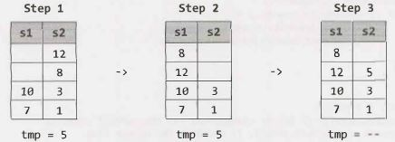

Note that 8 and 12 are still in sl-and that's okay!We just repeat the same steps for those two numbers as we did for 5, each time popping offthe top of sl and putting it into the "right place" on s2. (Of course, since 8 and 12 were moved from s2 to s1 precisely because they were larger than 5, the "right place" for these elements will be right on top of 5. We won't need to muck around with s2's other elements, and the inside of the below while loop will not be run when tmp is 8 or 12.)

```java
1     void  sort(Stack<Integer> s) {
2          Stack<Integer> r  =  new Stack<Integer>();
3         while(!s.isEmpty()) {
4               /*  Insert each  element   in s  in  sorted order into r.  */
5               int tmp =  s.pop();
6               while(!r.isEmpty() &&   r.peek() > tmp)  {
7                    s.push(r.pop());
8                 }
9               r.push(tmp);
10         }
11
12       /*   Copy the   elements   from r back  into s. */
13       while   (!r.isEmpty()) {
14             s.push(r.pop());
15           }
16   }
```

This algorithm is O ( N²) time and O ( N) space.

If we were allowed to use unlimited stacks, we could implement a modified quicksort or mergesort.

With the mergesort  solution, we would create two extra stacks and divide the stack into two parts. We would recursively sort each stack, and then merge them back together  in sorted order into the original stack. Note that this would require the creation of two additional stacks per level of recursion.

With the quicksort solution, we would create two additional stacks and divide the stack into the two stacks based on a pivot element. The two stacks would be recursively sorted, and then merged  back together into the original stack. Like the earlier solution, this one involves creating two additional stacks per level of recursion.


**3.6 		Animal Shelter:** An animal  shelter, which holds only dogs andcats, operates on a strictly"first in, first out"basis. People must adopt either the "oldest" (based on arrival time) ofall animals at the  shelter, or they  can  select whether they  would prefer  a dog or a cat  (and  will receive the  oldest animal  of that type). They cannot select which  specific animal  they would  like. Create the  data structures to maintain this system and implement operations such as enqueue, dequeueAny, dequeueDog, and  dequeueCat.You may use the built-in Linkedlist data structure.


SOLUTION

---

We could  explore a variety  of solutions to this problem. For instance, we  could maintain a single  queue. This would make dequeueAny easy, but dequeueDog and dequeueCat would require iteration through the  queue to find the  first dog or cat. This would increase the  complexity of the  solution and decrease the efficiency.

An alternative approach that is simple,  clean  and efficient is to simply  use  separate queues for dogs and cats, and to place them within a wrapper class calledAnimalQueue. We then store some sort of timestamp to mark when each animal was enqueued. When  we call dequeueAny, we peek at the  heads of both the dog and cat queue and return the oldest.

```java
1      abstract class Animal  {
2           private int  order;
3           protected String name;
4           public Animal(String n) {name  =  n;   }
5           public void setOrder(int  ord) {  order     ord;  }
6           public int  getOrder() { return order;  }
7
8           /* Compare   orders of animals to  return the older item. */
9           public  boolean isOlderThan(Animal a)  {
10               return this.order  <  a.getOrder();
11        }
12   }
13
14    class AnimalQueue  {
15         Linkedlist<Dog>  dogs     new  Linkedlist<Dog>();
16         Linkedlist<Cat> cats     new  Linkedlist<Cat>();
17         private int order =  0;   // acts  as  timestamp
18
19         public  void  enqueue(Animal a)  {
20               /*  Order is  used as a  sort  of timestamp, so   that we  can   compare the  insertion
21                 *  order of a  dog  to a  cat. */
22               a.setOrder(order);
23               order++;
24
25               if  (a instanceof Dog)  dogs.addlast((Dog) a);
26               else if (a instanceof Cat) cats.addlast((Cat)a);
27        }
28
29         public  Animal dequeueAny() {
30               /* Look  at tops of dog  and   cat  queues, and   pop  the  queue with the  oldest
31                 *  value.  */
32               if  (dogs.size()     0) {
33                     return  dequeueCats();
34               }  else if (cats.size()==    0) {
35                     return dequeueDogs();
36               }
37
38                Dog dog=   dogs.peek();
39                Cat   cat=  cats.peek();
40                if (dog.isOlderThan(cat))  {
41                       return  dequeueDogs();
42                } else {
43                       return  dequeueCats();
44                }
45          }
46
47          public Dog dequeueDogs()  {
48                return dogs.poll();
49         }
50
51          public  Cat   dequeueCats()  {
52                return cats.poll();
53        }
54   }
55
56    public class  Dog  extends  Animal   {
57          public  Dog(String n)   {  super(n); }
58   }
59
60    public class  Cat   extends  Animal   {
61          public Cat(String n) {  super(n);  }
62    }
```

It is important that Dog and Cat both inherit from an Animal class since dequeueAny() needs to be able to support returning both Dog and Cat objects.

If we wanted, order could be a true timestamp with the actual  date and time. The advantage of this is that we wouldn't have to set and maintain the numerical order. If we somehow wound up with two animals with
the same timestamp, then  (by definition)  we don't have an older animal and we could  return either one.

Additional Questions:  Linked Lists (#2.6), Moderate  Problems (#16.26), Hard Problems (#17.9). Hints start on page 653.


## 4 Trees and Graphs

Many interviewees find tree and graph problems to be some of the trickiest. Searching a tree is more complicated than searching in a linearly organized data structure such as an array or linked list. Addi­ tionally, the worst case and average case time may vary wildly, and we must evaluate both aspects of any algorithm. Fluency in implementing a tree or graph from scratch will prove essential.

Because most people are more familiar with trees than graphs (and they're a bit simpler), we'll discuss trees first. This is a bit out of order though, as a tree is actually a type of graph.


> Note: Some of the terms in this chapter can vary slightly across different textbooks and other sources.  If you're  used  to a different definition, that's fine. Make sure to clear up any ambiguity with your interviewer.


### Types of Trees

A nice way to understand a tree is with a recursive explanation. A tree is a data structure composed of nodes.

- Each tree has a root node. (Actually, this isn't strictly necessary in graph theory, but it's usually how we use trees in programming, and especially programming  interviews.)
- The root node has zero or more child nodes.
- Each child node has zero or more child nodes, and so on.

The tree cannot contain cycles. The nodes may or may not be in a particular order, they could have any data type as values, and they may or may not have links back to their parent nodes.

A very simple class definition for Node is:

```
1      class  Node {
2          publi c String  name;
3          public  Node[] children;
4     }
```

You might also have a Tree class to wrap this node. For the purposes of interview questions, we typically do not use a Tree class. You can if you feel it makes your code simpler or better, but it rarely does.

```
1     class  Tree {
2       public  Node root;
3       }
```

Tree and graph questions are rife with ambiguous details and incorrect assumptions. Be sure to watch out for the following issues and seek clarification when necessary.


##### Trees vs. Binary Trees

A binary tree is a tree in which each node has up to two children. Not all trees are binary trees. For example, this tree is not a binary tree. You could call it a ternary tree.

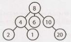

There are occasions when you might have a tree that is not a binary tree. For example, suppose you were using a tree to represent  a bunch  of phone  numbers.  In this case, you might  use a 10-ary tree, with each node  having  up to 10 children (one for each digit).

A node is called a"leaf" node if it has no children.


##### Binary Tree vs. Binary Search Tree

A binary search tree is a binary tree in which every node fits a specific ordering property: all left descendents  <= n < all right descendents. This must be true for each node n.


> The definition of a binary search tree can vary slightly with respect to equality. Under some defi­ nitions, the tree cannot have duplicate values. In others, the duplicate values will be on the right or can be on either side. All are valid definitions, but you should clarify this with your interviewer.


Note that this inequality must be true for all of a node's descendents, not just its immediate children. The following tree on the left below is a binary search tree. The tree on the right is not, since  12 is to the left of 8.


When given a tree question, many candidates assume the interviewer means a binary search  tree. Be sure to ask. A binary search tree imposes the condition  that, for each node, its left descendents are less than or equal to the current node, which is less than the right descendents.

##### Balanced vs. Unbalanced

While many trees are balanced, not all are. Ask your interviewer for clarification here. Note that balancing a tree does not mean the left and right subtrees are exactly the same size (like you see under"perfect binary trees" in the following diagram).

One way to think about it is that a "balanced" tree really means something more like "not terribly imbal­ anced:' It's balanced enough to ensure 0( log   n) times for insert and find, but it's not necessarily as balanced as it could be.

Two common types of balanced trees are red-black trees (pg 639) and AVL  trees (pg 637). These are discussed in more detail in the Advanced Topics section.


##### Complete Binary Trees

A complete binary tree is a binary tree in which every level of the tree is fully filled, except for perhaps the last level. To the extent that the last level is filled, it is filled left to right.

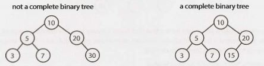


##### Full Binary Trees

A full binary tree is a binary tree in which every node has either zero or two children. That  is, no nodes have only one child.

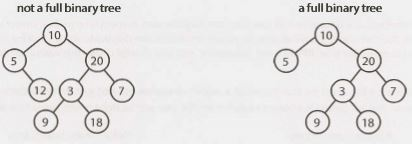


##### Perfect Binary Trees

A perfect binary tree is one that is both full and complete. All leaf  nodes will be at the same level, and this level has the maximum number of nodes.


Note that perfect trees are rare in interviews and in real life, as a perfect tree must have exactly 2^k -  1 nodes
(where k is the number of levels). In an interview, do not assume a binary tree is perfect.


### Binary Tree Traversal

Prior to your  interview, you  should be  comfortable implementing in-order, post-order, and pre-order traversal. The most common of these is in-order traversal.

In-Order Traversal

In-order traversal means to "visit" (often,  print)  the left branch, then the current node, and  finally, the right branch.

```java
1      void  inOrderTraversal(TreeNode  node) {
2           if (node!=  null) {
3                 inOrderTraversal(node.left);
4                 visit(node);
5                 inOrderTraversal(node.right);
6          }
7      }
```

When performed on a binary  search tree, it visits the nodes in ascending order (hence the name"in-order").


Pre-Order Traversal

Pre-order traversal visits the current node before its child nodes (hence the name "pre-order").

```java
1      void  preOrderTraversal(TreeNode  node)  {
2           if (node!=  null) {
3                 visit(node);
4                 preOrderTraversal(node.left);
5                 preOrderTraversal(node.right);
6            }
7       }
```

In a pre-order traversal, the root is always the first node visited.


Post-Order Traversal

Post-order traversal visits the current node after  its child nodes (hence the name"post-order").

```java
1      void  postOrderTraversal(TreeNode  node)  {
2           if (node!=  null) {
3                 postOrderTraversal(node.left);
4                 postOrderTraversal(node.right);
5                 visit(node);
6           }
7      }
```

In a post-order traversal, the root is always the last node visited.


### Binary Heaps (Min-Heaps and Max-Heaps)

We'll just discuss min-heaps here. Max-heaps are essentially equivalent, but the elements are in descending order rather than ascending order.

A min-heap is a complete binary  tree (that is, totally filled other than the rightmost elements on the last level) where each node is smaller than its children. The root, therefore, is the minimum element in the tree.


We have two key operations on a min-heap: insert and extract_min.

*Insert*

When we insert into a min-heap, we always start by inserting the element at the bottom. We insert at the rightmost spot so as to maintain the complete tree property.

Then, we "fix"the tree by swapping the new element with its parent, until we find an appropriate spot for the element. We essentially bubble up the minimum element.


This takes O( log n)  time, where n is the number of nodes in the heap.

*Extract Minimum Element*

Finding the minimum element of a min-heap is easy: it's always at the top. The trickier part is how to remove it. (In fact, this isn't that tricky.)

First, we remove the minimum element and swap it with the last element in the heap (the bottommost, rightmost element). Then, we bubble down this element, swapping it with one of its children until the min­ heap property is restored.

Do we swap it with the left child or the right child? That depends  on their values. There's no inherent ordering between  the left and right element, but you'll need to take the smaller one in order to maintain the min-heap ordering.
 


This algorithm will also take 0( log n)  time.


### Tries (Prefix Trees)

A trie (sometimes called a prefix tree) is a funny data structure. It comes up a lot in interview questions, but algorithm textbooks don't spend much time on this data structure.

A trie is a variant of an n-ary tree in which characters are stored at each node. Each path down the tree may represent a word.
The * nodes (sometimes called "null nodes") are often used to indicate complete words. For example, the fact that there is a * node under MANY indicates that MANY is a complete word. The existence of the MA path indicates there are words that start with MA.

The actual implementation of these * nodes might be a special type of child (such as a TerminatingTrieNode, which  inherits  from  TrieNode).  Or, we  could  use  just  a  boolean  flag terminates within the "parent" node.

A node in a trie could have anywhere from 1   through  ALPHABET_SIZE +   1 children (or, 0 through ALPHABET_SIZE if a boolean flag is used instead of a* node).


Very commonly, a trie is used to store the entire (English) language for quick prefix lookups. While a hash table can quickly look up whether a string is a valid word, it cannot tell us if a string is a prefix of any valid words. A trie can do this very quickly.


> How quickly? A trie can check if a string is a valid prefix in O(K) time, where K is the length of the string. This is actually the same runtime as a hash table will take. Although we often refer to hash table lookups as being O(1) time, this isn't entirely true. A hash table must read through all the characters in the input, which takes O(K) time in the case of a word lookup.


Many problems involving lists of valid words leverage a trie as an optimization. In situations when we search through the tree on related prefixes repeatedly (e.g., looking up M, then MA, then MAN, then MANY), we might pass around a reference to the current node in the tree. This will allow us to just check if Y is a child of MAN, rather than starting from the root each time.


### Graphs

A tree is actually a type of graph, but not all graphs are trees. Simply put, a tree is a connected graph without cycles.

A graph is simply a collection of nodes with edges between (some of) them.

- Graphs can be either directed (like the following graph) or undirected. While directed edges are like a one-way street, undirected edges are like a two-way street.
- The graph might consist of multiple isolated subgraphs. If there is a path between every pair of vertices, it is called a "connected graph:'
- The graph can also have cycles (or not). An "acyclic graph" is one without cycles. 

Visually, you could draw  a graph like this:


In terms of programming, there are two common ways to represent a graph.


##### Adjacency List

This is the  most common way to represent a graph. Every vertex  (or node) stores a list of adjacent vertices. In an undirected graph, an edge like (a,  b) would be stored twice: once in a's adjacent vertices and once in b's adjacent vertices.

A simple class definition for a graph node could look essentially the same as a tree node.

```java
1      class Graph   {
2           public  Node[]   nodes; 
3      }
4
5      class  Node  {
6           public String  name;
7           public  Node[] children;
8      }
```

The Graph class is used because, unlike in a tree, you can't necessarily reach all the nodes from a single node.

You don't necessarily need any  additional classes to  represent a graph. An array  (or a hash table) of lists (arrays, arraylists,  linked  lists, etc.) can store the adjacency list. The graph above could be represented as:

```
0:   1
1:   2
2:   0,  3
3:   2
4:   6
5:   4
6:   5
```

This is a bit more compact, but it isn't quite as clean. We tend to use node classes unless there's a compelling reason not  to.

##### Adjacency Matrices

An adjacency matrix  is an NxN boolean matrix  (where N is the  number of nodes), where a true value  at matrix[i][j] indicates an edge from node i to node j. (You can also use an integer matrix with Os and
1 s.)

In an undirected graph, an adjacency matrix will be symmetric. In a directed graph, it will not  (necessarily) be.


The same graph algorithms that are used on adjacency lists (breadth-first search, etc.) can be performed with adjacency matrices, but they may be somewhat less efficient. In the adjacency list representation, you can easily iterate through the neighbors of a node. In the adjacency matrix representation, you will need to iteratethrough all the nodes to identify a node's neighbors.


### Graph Search

The two most common ways to search a graph are depth-first search and breadth-first search.

In depth-first search (DFS), we start at the root (or another arbitrarily selected node) and explore each branch completely before moving on to the next branch. That is, we go deep first (hence the name depth­ first search) before we go wide.

In breadth-first search (BFS), we start at the root (or another arbitrarily selected node) and explore each neighbor before going on to any of their children. That is, we go wide (hence breadth-first search) before we go deep.

See the below depiction of a graph and its depth-first and breadth-first search (assuming neighbors are iterated in numerical order).

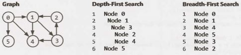

Breadth-first search and depth-first search tend to be used in different scenarios. DFS is often preferred if we want to visit every node in the graph. Both will work just fine, but depth-first search is a bit simpler.

However,  if we want to find the shortest path (or just any path) between two nodes, BFS is generally better. Consider representing all the friendships in the entire world in a graph and trying to find a path of friend­ ships between Ash andVanessa.

In depth-first search, we could take a path like Ash  ->  Brian  ->    Carleton   ->   Davis   ->   Eric
->  Farah  ->  Gayle   ->  Harry  ->  Isabella ->  John·->  Kari... and thenfind ourselves very far away. We could go through most of the world without realizing that, in fact,Vanessa is Ash's friend. We will still eventually find the path, but it may take a long time. It also won't find us the shortest path.

In breadth-first search, we would stay close to Ash for as long as possible. We might iterate through many of Ash's friends, but we wouldn't go to his more distant connections until absolutely necessary. lfVanessa is Ash's friend, or his friend-of-a-friend, we'll find this out relatively quickly.

*Depth-First Search (DFS)*

In DFS, we visit a node a and then iterate through each of a's neighbors. When visiting a node b that is a neighbor of a, we visit all of b's neighbors before going on to a's other neighbors. That is, a exhaustively searches b's branch before any of its other neighbors.

Note that pre-order and other forms of tree traversal are a form of DFS. The key difference is that when implementing this algorithm for a graph, we must check if the node has been visited. If we don't, we risk getting stuck in an infinite loop.

The pseudocode below implements DFS.

```java
1     void  search(Node  root) {
2          if  (root== null) return;
3          visit(root);
4          root.visited=    true;
5          for each  (Node n in root.adjacent) {
6               if (n.visited == false) {
7                    search(n);
8                  }
9            }
10   }
```

*Breadth-First Search (BFS)*

BFS is a bit less intuitive, and many interviewees struggle with the implementation unless they are already familiar with it. The main tripping point is the (false) assumption that  BFS is recursive. It's not. Instead, it uses a queue.

In BFS, node a visits each of a's neighbors before visiting any of their neighbors. You can think of this as searching level by level out from a. An iterative solution involving a queue usually works best.

```java
1     void  search(Node  root) {
2          Queue queue  =  new Queue();
3          root.marked=  true;
4          queue.enqueue(root);  // Add to the   end  of  queue
5
6          while   (!queue.isEmpty())  {
7               Node r=    queue.dequeue();  // Remove  from the   front of  the   queue
8               visit(r);
9               foreach (Node n in r.adjacent) {
10                  if (n.marked==    false) {
11                       n.marked=    true;
12                       queue.enqueue(n);
13                   }
14             }
15         }
16   }
```

If you are asked to implement BFS, the key thing to remember is the use of the queue. The rest of the algo­
rithm flows from this fact.

*Bidirectional Search*

Bidirectional search is used to find the shortest path between  a source and destination  node. It operates by essentially running two simultaneous breadth-first searches, one from each node. When their searches collide, we have found a path.


To see why this is faster, consider  a graph  where every node has at most  k adjacent nodes and the shortest path from node s to nodet has length d.

- In traditional breadth-first search, we would  search up to k nodes in the first "level" of the search. In the second level, we would  search up to k nodes for each of those first k nodes, so k2 nodes total (thus far). We would do this d times, so that's 0( kd) nodes.
- In bidirectional search, we have two searches that collide after approximately d/2 levels (the midpoint of the path). The search from s visits approximately k^(d/2), as does the search fromt.That's approximately 2 k^(d/2), or O(k^(d/2)), nodes total.

This might seem like a minor  difference,  but it's not. It's huge. Recall that tional search is actually faster by a factor of kd12.

Put another way: if our system could only support searching "friend of friend" paths in breadth-first search, it could now likely support "friend of friend of friend of friend" paths. We can support paths that are twice as long.

**Additional Reading:** Topological Sort (pg 632), Dijkstra's Algorithm  (pg 633), AVL Trees (pg 637), Red­ BlackTrees (pg 639).

---
Interview Questions
---

**4.1 	Route Between Nodes:** Given a directed graph, design an algorithm to find out whether there is a route between two nodes. 


SOLUTION

---
 
This problem can be solved by just simple graph traversal, such as depth-first search or breadth-first search. We start with one of the two nodes and, during traversal, check if the other node is found. We should mark any  node found in the course of the algorithm as  "already visited" to avoid cycles and repetition of the nodes.

The code below provides an iterative implementation of breadth-first search.

```java
1      enum  State {  Unvisited, Visited,  Visiting;  }
2
3      boolean  search(Graph g,  Node   start, Node   end) {
4         if (start ==  end) return true;
5
6            II operates  as Queue
7            LinkedList<Node>  q   =  new   Linkedlist<Node>();
8
9            for  (Node u   :  g.getNodes())  {
10                u.state =  State.Unvisited;
11        }
12          start.state =  State.Visiting;
13          q.add(start);
14          Node   u;
15          while (!q.isEmpty())  {
16                u  =  q.removeFirst();   II i.e., dequeue()
17                if (u !=   null) {
18                      for  (Node v   :   u.getAdjacent()) {
19                            if (v.state ==  State.Unvisited) {
20                                   if (v ==  end)  {
21                                         return true;
22                                   }  else {
23                                         v.state =  State.Visiting;
24                                         q.add(v);
25                              }
26                         }
27                        }
28                      u.state     State.Visited;
29            }
30        }
31       return false;
32    }
```

It may be worth discussing with your interviewer the tradeoffs between breadth-first search and depth-first search for this and other problems. For example, depth-first search is a bit simpler to implement since it can be done with simple recursion. Breadth-first search can also be useful to find the shortest path, whereas depth-first search may traverse one adjacent node very deeply before ever going onto the immediate neighbors.


**4.2 	Minimal  Tree:**  Given a sorted (increasing order) array with unique  integer elements, write an algorithm to create a binary search tree with minimal height.

SOLUTION

---

To create a tree of minimal height, we need to match the number of nodes in the left subtree to the number of nodes in the right subtree as much as possible. This means that we want the root to be the middle of the array, since this would  mean that half the elements  would  be less than the root and half would  be greater than it.

We proceed with constructing our tree in a similar fashion. The middle of each subsection of the array becomes the root of the node. The left half of the array will become our left subtree, and the right half of the array will become the right subtree.

One way to implement this is to use a simple root.insertNode(int  v) method which inserts the value v through a recursive process that starts with the root node. This will indeed construct a tree with minimal height but it will not do so very efficiently.  Each insertion  will require traversing the tree, giving a total cost ofO(N  log  N) to the tree.

Alternatively, we can cut out the extra traversals by recursively using the createMinimalBST method. This method is passed just a subsection of the array and returns the root of a minimal tree for that array.

The algorithm is as follows:

1.  Insert into the tree the middle  element of the array.
2.  Insert (into the left subtree) the left subarray elements.
3.  Insert (into the right subtree) the right subarray elements.
4.  Recurse.

The code below implements this algorithm.

```java
1     TreeNode   createMinimalBST(int array[])  {
2          return createMinimalBST(array,  0, array.length -  1);
3        }
4
5     TreeNode   createMinimalBST(int arr[],  int  start,  int  end) {
6         if (end< start)  {
7               return null;
8           }
9          int  mid= (start+ end)/  2;
10     TreeNode n = new   TreeNode(arr[mid]);
11       n.left =  createMinimalBST(arr,  start,  mid -  1);
12       n.right  =  createMinimalBST(arr,  mid+  1, end);
13       return n;
14   }
```

Although this code does not seem especially complex, it can be very easy to make little off-by-one errors. Be sure to test these parts of the code very thoroughly.


**4.3 	List of Depths:** Given a binary tree, design an algorithm which creates a linked list of all the nodes at each depth (e.g., if you have a tree with depth D, you'll have D linked lists).


SOLUTION

---

Though we might think at first glance that this problem requires a level-by-level traversal, this isn't actually necessary. We can traverse the graph any way that we'd like, provided we know which level we're on as we do so.

We can implement a simple modification of the pre-order traversal algorithm, where we pass in level +
1 to the next recursive call. The code below provides an implementation using depth-first search.

```java
1      void  createLevelLinkedList(TreeNode root,   ArrayList<LinkedList<TreeNode>>  lists,
2                                                        int level) {
3            if (root==    null) return; II base  case
4
5           LinkedList<TreeNode> list = null;
6         if (lists.size()==    level) {  II Level  not  contained in  list
7              list =  new LinkedList<TreeNode>();
8              /* Levels  are  always traversed in  order. So,  if this is the  first time  we've
9                *  visited level i,  we  must have seen  levels 0 through  i -  1.  We   can
10              *  therefore safely add the  level at the  end.  */
11            lists.add(list);
12       }  else {
13            list = lists.get(level); 
14		}
15		list.add(root);
16		createLevelLinkedList(root.left,  lists,  level+ 1);
17		createlevelLinkedList(root.right,  lists,  level+ 1); 
18   }
19
20  ArrayList<LinkedList<TreeNode>>  createLevelLinkedList(TreeNode root)  {
21       ArrayList<Linkedlist<TreeNode>>  lists = new ArrayList<LinkedList<TreeNode>>();
22       createlevellinkedlist(root,  lists, 0);
23       return lists;
24     }
```

Alternatively, we can also implement a modification of breadth-first search. With this implementation, we want to iterate through the root first, then level 2, then level 3, and so on.

With each level i, we will have already  fully visited all nodes on level i -  1. This means that to get which nodes are on level i, we can simply look at all children of the nodes of level i -  1.

The code below implements this algorithm.

```java
1    ArrayList<LinkedList<TreeNode>>  createLevelLinkedlist(TreeNode root)  {
2         ArrayList<LinkedList<TreeNode>>  result = new ArrayList<Linkedlist<TreeNode>>();
3         /*  "Visit" the  root   */
4         LinkedList<TreeNode> current=    new LinkedList<TreeNode>();
5            if (root != null) {
6              current.add(root);
7            }
8
9          while   (current.size() > 0)  {
10               result.add(current);//    Add previous level
11             Linkedlist<TreeNode> parents  =   current;//Go  to next  level
12               current =  new LinkedList<TreeNode>();
13               for (TreeNode  parent  :   parents) {
14                /*   Visit the   children*/
15                  if (parent.left !=  null)  {
16                       current.add(parent.left);
17                  }
18                  if (parent.right != null) {
19						current.add(parent.right);
20                     }
21             }
22        } 
23		return result; 
24   }
```
 

One might ask which of these solutions is more efficient. Both run in O(N) time, but what about the space efficiency? At first, we might want to claim that the second solution is more space efficient.

In a sense, that's correct. The first solution uses 0(log N) recursive calls (in a balanced tree), each of which adds a new level to the stack. The second solution, which is iterative, does not require this extra space.

However, both solutions require returning O(N) data. The extra 0(log N) space usage from the recursive implementation is dwarfed by the O(N) data that must be returned. So while the first solution may actually use more data, they are equally efficient when it comes to "big O:'


**4.4 	Check Balanced:** Implement a function to check if a binary tree is balanced. For the purposes of this question, a balanced tree is defined to be a tree such that the heights of the two subtrees of any node never differ by more than one.
pg 7 70

SOLUTION

---

In this question, we've been fortunate enough to be told exactly what balanced means: that for each node, the two subtrees differ in height by no more than one. We can implement a solution based on this defini­ tion. We can simply recurse through the entire tree, and for each node, compute the heights of each subtree.

```java
1     int  getHeight(TreeNode root) {
2          if (root == null) return -1;//    Base  case
3         return  Math.max(getHeight(root.left), getHeight(root.right)) + 1;
4     }
5
6     boolean   isBalanced(TreeNode  root) {
7          if (root == null) return true;//    Base  case
8
9          int heightDiff =   getHeight(root.left)  -  getHeight(root.right);
10        if (Math.abs(heightDiff) >   1)  {
11             return false;
12        } else {//Recurse
13             return isBalanced(root.left) &&  isBalanced(root.right);
14         }
15   }
```

Although this works. it's not very efficient. On each node. we recurse through its entire subtree. This means that getHeight is called repeatedly on the same nodes. The algorithm isO(N  log N) since each node is "touched" once per node above it.

We need to cut out some of the calls to getHeight.

If we inspect this method, we may notice that getHeight could actually check if the tree is balanced at the same time as it's checking heights. What do we do when we discover that the subtree isn' t balanced? Just return an error code.

This improved algorithm works by checking the height of each subtree as we recurse down from the root. On each node, we recursively get the heights of the left and right subtrees  through  the checkHeight method. If the subtree is balanced, then checkHeight will return the actual height of the subtree. If the subtree  is not balanced, then checkHeight will return an error code. We will immediately break and return an error code from the current call.


> What do we use for an error code? The height of a null tree is generally defined to be -1, so that's not a great idea for an error code. Instead, we' ll use Integer. MIN_VALUE.


The code below implements this algorithm.

```java
1     int checkHeight(TreeNode root)   {
2          if (root == null)  return -1;
3
4          int  leftHeight = checkHeight(root.left);
5         if (leftHeight   Integer.MIN_VALUE)  return Integer.MIN_VALUE;  // Pass  error  up
6
7          int rightHeight  checkHeight(root.right);
8          if (rightHeight == Integer.MIN_VALUE)  return Integer.MIN_VALUE;  // Pass  error  up
9
10       int  heightDiff =  leftHeight -  rightHeight;
11        if (Math.abs(heightDiff)  >   1)  {
12             return Integer.MIN_VALUE; // Found error -> pass  it back
13        } else {
14             return  Math.max(leftHeight, rightHeight)  + 1;
15        }
16   }
17
18   boolean   isBalanced(TreeNode root)   {
19        return  checkHeight(root) !=  Integer.MIN_VALUE;
20   }
```

This code runs in O(N) time and O(H) space, where H is the height of the tree.

 
**4.5        Validate BST:** Implement a function to check if a binary tree is a binary search tree.

SOLUTION

---

We can implement this solution in two different ways. The first leverages the in-order traversal, and the second builds off the property that left <=  c urrent  <  right.


##### Solution #1:  In-Order Traversal

Our first thought might be to do an in-order traversal, copy the elements to an array, and then check  to see if the array is sorted. This solution takes up a bit of extra memory, but it works-mostly.

The only problem  is that it can't handle duplicate values in the tree properly. For example,  the algorithm cannot distinguish between the two trees below (one of which is invalid) since they have the same in-order traversal.
 


However, if we assume that the tree cannot have duplicate values, then this approach works. The pseudo­code for this method looks something like:

```java
1     int   index =  0;
2     void copyBST(TreeNode  root,   int[] array)   {
3          if  (root ==  null)  return;
4          copyBST(root.left,   array);
5          array[index]   =  root.data;
6          index++;
7          copyBST(root.right,  array);
8     }
9
10   boolean checkBST(TreeNode  root) {
11        int[] array=  new  int[root.size];
12        copyBST(root,  array);
13        for  (int i=   1;  i <  array.length; i++)  {
14             if (array[i] <= array[i -  1])   return  false;
15        }
16        return  true;
17   }
```

Note that it is necessary  to keep track of the logical "end" of the array, since it would be allocated to hold all the elements.

When we examine this solution, we find that the array is not actually necessary. We never use it other than to compare an element to the previous element. So why notjust track the last element we saw and compare it as we go?

The code below implements this algorithm.

```java
1     Integer   last_printed =  null;
2     boolean checkBST(TreeNode  n)  {
3          if (n==    null) return  true;
4
5            II Check I recurse  left
6          if (!checkBST(n.left)) return  false;
7
8          II Check current
9          if  (last_printed !=  null  &&   n.data  <=        last_printed) {
10             return  false;
11         }
12        last_printed = n.data;
13
14       // Check / recurse  right
15        if (!checkBST(n.right)) return false;
16
17        return true;// All   good!
18    }
```

We've used an Integer instead of int so that we can know when last_printed has been set to a value.

If you don't  like the  use of static  variables, then  you can tweak  this code  to use a wrapper  class for the integer, as shown below.
```
1     class  Wraplnt {
2          public int  value;
3     }
```
Or, if you're implementing this in C++ or another language that  supports passing  integers by reference, then  you can simply do that.

##### Solution #2: The Min / Max Solution

In the second solution, we leverage the definition of the binary search tree.

What does it mean for a tree to be a binary search tree? We know that it must, of course, satisfy the condition left. data <=  c urrent. data <  right. data for each node, but this isn't quite sufficient. Consider the following small tree:

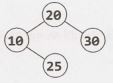


Although  each node is bigger than its left node  and smaller than its right node, this is clearly not a binary search tree since 25 is in the wrong place.

More precisely, the condition is that  a// left nodes must  be less than  or equal  to the current  node,  which must be less than all the right nodes.

Using this thought, we can approach the problem  by passing down the min and max values. As we iterate through the tree, we verify against  progressively  narrower ranges.

Consider the following sample tree:

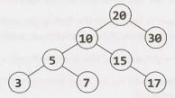

We start with a range of (min  =  NULL,  max  =  NULL), which the root obviously meets. (NULL indicates that there is no min or max.) We then  branch left, checking that these  nodes are within the range  (min  = NULL,  max   =  20). Then, we branch  right, checking  that the nodes are within the range  (min    =  20, max  =  NULL).

We proceed through the tree with this approach. When we branch  left, the  max gets  updated. When we branch right, the min gets updated. If anything fails these checks, we stop and return false.

The time complexity for this solution is O(N), where N is the number of nodes in the tree. We can prove that this is the best we can do, since any algorithm must touch all N nodes.

Due to the use of recursion, the space complexity is O(log  N) on a balanced tree. There are up to O(log
N) recursive calls on the stack since we may recurse up to the depth of the tree.

The recursive code for this is as follows:
```
1    boolean  checkBST(TreeNode  n)  {
2         return checkBST(n, null, null);
3      }
4
5      boolean  checkBST(TreeNode  n,  Integer min,  Integer max) {
6         if (n  == null) {
7              return true;
8          }
9         if ((min  != null &&   n.data <=  min)  I  I      (max != null &&   n.data >   max)) {
10            return false;
11        }
12
13       if (!checkBST(n.left,  min,  n.data)  I  I      !checkBST(n.right, n.data,  max)) {
14            return false;
15        }
16       return true;
17   }
```
Remember that in recursive algorithms, you should always make sure that your base cases, as well as your null cases, are well handled.


**4.6 	Successor:** Write an algorithm to find the "next" node (i.e., in-order successor) of a given node in a binary search tree. You may assume that each node has a link to its parent.

SOLUTION

---

Recall that an in-order traversal traverses the left subtree, then the current node, then the right subtree. To approach this problem, we need to think very, very carefully about what happens.

Let's suppose we have a hypothetical node. We know that the order goes left subtree, then current side, then right subtree. So, the next node we visit should be on the right side.

But which node on the right subtree? It should be the first node we'd visit if we were doing an in-order traversal of that subtree. This means that it should be the leftmost node on the right subtree. Easy enough!

But what if the node doesn't have a right subtree? This is where it gets a bit trickier.

If a node n doesn't have a right subtree, then we are done traversing n's subtree. We need to pick up where we left off with n's parent, which we'll call q.

If n was to the left of q, then the next node we should traverse should be q (again, since left - >  current
->  right).

If n were to the right of q, then we have fully traversed q's subtree as well. We need to traverse upwards from q until we find a node x that we have not fully traversed.  How do we know that we have not fully traversed a node x? We know we have hit this case when we move from a left node to its parent.The left node is fully traversed, but its parent is not.

The pseudocode looks like this:
```java
1    Node inorderSucc(Node  n)  {
2         if (n  has  a right subtree) {
3                  return leftmost child of  right subtree
4         }  else {
5                 while  (n  is a right child of  n.parent) {
6                   n =  n.parent; // Go  up
7                  }
8              return n.parent;  // Parent  has  not  been  traversed
9         }
10   }
```
But wait-what if we traverse all the way up the tree before finding a left child?This will happen only when we hit the very end of the in-order traversal. That is, if we're already on the far right of the tree, then there is no in-order successor. We should return null.

The code below implements this algorithm (and properly handles the null case).

```java
1     TreeNode inorderSucc(TreeNode  n)  {
2         if (n  ==  null) return null;
3
4         /*  Found right children -> return leftmost node of  right subtree. */
5           if (n.right != null) {
6              return leftMostChild(n.right);
7         }  else {
8              TreeNode q = n;
9              TreeNode x =  q.parent;
10            // Go  up until we're  on left  instead of  right
11            while  (x  != null &&   x.left != q)  {
12                 q     x;
13                 x =  x.parent;
14              }
return x;
16         }
17   }
18
19  TreeNode leftMostChild(TreeNode n)  {
20       if (n  ==  null) {
21            return null;
22        }
23       while  (n.left != null) {
24            n = n.left;
25          }
26       return  n;
27   }
```

This is not the most algorithmically complex problem in the world, but it can be tricky to code perfectly. In a problem like this, it's useful to sketch out pseudocode to carefully outline the different cases.


**4.7 	Build Order:** You are given a list of projects and a list of dependencies (which is a list of pairs of projects, where the secondproject is dependent on the first project). All of a project's dependencies must be built before the project is. Find a build order that will allow the projects to be built. If there is no valid build order, return an error.

EXAMPLE 

```
Input:
	projects:  a, b,   c,  d,   e, f
	dependencies: (a,  d),  (f,  b),  (b,   d),  (f,  a),  (d,   c) 

Output: f,  e, a, b,   d,   c
```

SOLUTION

---

Visualizing the information as a graph probably works best. Be careful  with the direction of the arrows. In the graph below, an arrow from d to g means that d must be compiled before g. You can also draw them in the opposite direction, but you need to consistent and clear about what you mean. Let's draw a fresh example.


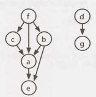


In drawing this example (which is not the example from the problem description), I looked for a few things.

- I wanted the nodes labeled somewhat randomly. If I had instead put a at the top, with b and c as chil­dren, then d and e, it could be misleading. The alphabetical order would match the compile order.
- I wanted a graph with multiple parts/components, since a connected graph is a bit of a special case.
- I wanted a graph where a node links to a node that cannot immediately follow it. For example,  f links to a but a cannot immediately follow it (since b and c must come before a and after f).
- I wanted a larger graph since I need to figure out the pattern.
- I wanted nodes with multiple dependencies.

Now that we have a good example, let's get started with an algorithm.

##### Solution#l

Where do we start? Are there any nodes that we can definitely compile immediately?

Yes. Nodes with no incoming edges can be built immediately since they don't depend on anything. Let's add all such nodes to the build order.  In the earlier example, this means we have an order of f, d (or d, f).

Once we've done that, it's irrelevant that some nodes are dependent on d and f since d and f have already been built. We can reflect this new state by removing d and f's outgoing edges.

build   order: f,  d


Next, we know that c, b, and g are free to build since they have no incoming edges. Let's build those and then remove their outgoing edges.

build  order: f,  d,  c,  b,  g


Project a can be built next, so let's do that and remove its outgoing edges. This leaves just e. We build that next, giving us a complete build order.

build  order:   f, d,  c,  b,  g,  a,  e

Did this algorithm work, or did we just get lucky? Let's think about the logic.

1.  We first added the nodes with no incoming edges. If the set of projects can be built, there must be some "first" project, and that project can't have any dependencies.  If a project has no dependencies (incoming edges), then we certainly can't break anything by building it first.
2.  We removed all outgoing edges from these roots. This is reasonable. Once those root projects were built, it doesn't matter if another project depends  on them.
3.  After that, we found the nodes that now have no incoming edges. Using the same logic from steps 1 and
2, it's okay if we build these. Now we just repeat the same steps: find the nodes with no dependencies, add them to the build order, remove their outgoing edges, and repeat.
4.  What if there are nodes remaining, but all have dependencies (incoming edges)? This means there's no way to build the system. We should return an error.

The implementation follows this approach very closely. 

Initialization and setup:

1.  Build a graph where each project is a node and its outgoing edges represent the projects that depend
on it. That is, if A has an edge to B (A-> B), it means B has a dependency  on A and therefore A must be built before B. Each node also tracks the number of incoming edges.

2.  Initialize a buildOrder array. Once we determine a project's build order, we add it to the array. We also continue to iterate through the array, using a toBeProcessed pointer to point to the next node to be fully processed.
3.   Find all the  nodes  with zero incoming edges  and  add  those  to  a  buildOrder array. Set a toBeProcessed pointer to the beginning of the array.

Repeat until toBeProcessed is at the end of the buildOrder:

1.  Read node at toBeProcessed.

	- If node is null, then all remaining nodes have a dependency and we have detected a cycle.

2.  For each child of node:

	- Decrement child. dependencies (the number of incoming edges).
	- If child. dependencies is zero, add child to end of buildOrder.

3.  Increment  toBeProcessed.

The code below implements this algorithm.

```java
1    /*  Find a correct build   order. */
2     Project[]  findBuildOrder(String[] projects, String[][] dependencies)  {
3            Graph graph= buildGraph(projects,  dependencies);
4         return orderProjects(graph.getNodes());
5      }
6
7     /*  Build  the  graph,  adding  the  edge (a,   b)  if b is dependent  on a. Assumes  a  pair
8      * is listed in  "build order". The pair (a,   b)  in  dependencies  indicates that b
9      * depends on a  and a must be built before  b. */
10  Graph buildGraph(String[] projects, String[][] dependencies) {
11       Graph graph= new Graph();
12       for  (String project  :   projects) {
13            graph.createNode(project);
}
15
16       for  (String[] dependency  :   dependencies)  {
17            String first= dependency[0];
18            String second=  dependency[l];
19            graph.addEdge(first,  second);
20         }
21
22       return  graph;
23    }
24
25  /*  Return  a list of  the  projects a correct build   order.*/
26   Project[]  orderProjects(Arraylist<Project> projects)  {
27       Project[] order  =  new Project[projects.size()];
28
29       /*  Add  "roots" to  the  build   order  first.*/
30       int endOfList= addNonDependent(order,  projects,  0);
31
32       int toBeProcessed= 0;
33       while  (toBeProcessed <  order.length) {
34            Project current= order[toBeProcessed];
35
36            /*  We  have a circular dependency since   there are  no remaining  projects with
37              *  zero  dependencies. */
38            if  (current== null) {
39                 return null;
40      }
41
42            /*  Remove  myself  as  a  dependency.  */
43            Arraylist<Project> children = current.getChildren();
44            for  (Project child :   children) {
45				child.decrementDependencies();
46             }
47
48            /*  Add children that have no one depending  on them.  */
49            endOfList=  addNonDependent(order,  children,  endOfList);
50            toBeProcessed++;
51        }
52
53       return order;
54    }
55
56  /*  A  helper  function to  insert projects with  zero  dependencies  into the  order
57    *  array, starting at index  offset. */
58  int addNonDependent(Project[]   order, Arraylist<Project> projects,  int  offset)  {
59       for  (Project project:  projects) {
60            if (project.getNumberDependencies() == 0)  {
61                 order[offset]  =  project;
62                 offset++;
63               }
64        }
65       return offset;
66   }
67
68  public class Graph {
69       private Arraylist<Project> nodes=  new Arraylist<Project>();
70       private HashMap<String, Project> map  =  new HashMap<String, Project>();
71
72       public   Project  getOrCreateNode(String name) {
73            if (!map.containsKey(name)) {
74                 Project node =  new Project(name);
75                 nodes.add(node);
76                 map.put(name,  node);
77            }
78
79            return map.get(name);
80       }
81
82       public   void  addEdge(String startName,   String endName)   {
83            Project start  = getOrCreateNode(startName);
84            Project end=  getOrCreateNode(endName);
85            start.addNeighbor(end);
86       }
87
88       public Arraylist<Project> getNodes()   {  return nodes;  }
89   }
90
91  public  class Project {
92       private Arraylist<Project> children = new Arraylist<Project>();
93       private HashMap<String, Project> map=  new HashMap<String, Project>();
94       private  String name;
95       private int dependencies      0;
96
97       public   Project(String n)  {  name    n;  }
98
99         public  void addNeighbor(Project node) {
100             if (!map.containsKey(node.getName()))  {
101                   children.add(node);
102                   map.put(node.getName(),  node);
103                   node.incrementDependencies();
104             }
105       }
106
107       public  void incrementDependencies()  {  dependencies++;  }
108       public  void decrementDependencies() {  dependencies--;  }
109
110       public String  getName()  {  return name;   }
111       public Arraylist<Project> getChildren()  {  return  children; }
112       public int  getNumberDependencies()  {  return  dependencies; }
113  }
```

This solution takes O ( P  +  D) time, where P is the number of projects and  D is the  number of dependency pairs.


> Note:  You might recognize this as the  topological sort algorithm on page 632. We've rederived this from scratch. Most people won't  know  this algorithm and  it's reasonable for an interviewer to expect you to be able to derive it.


##### Solution #2

Alternatively, we can use depth-first search (DFS) to find the build  path.


Suppose we picked an arbitrary node (say b) and  performed a depth-first search on it. When  we get  to the end of a path and  can't  go  any  further (which will happen at h and  e), we know  that those terminating
nodes can be the  last projects to be built.  No projects depend on them.
```
DFS(b)			// Step  1
	DFS(h)		// Step  2
		build order	= ... ,	h	// Step  3
	DFS(a)			// Step  4
		DFS(e)			// Step 5
			build  order     ... , e, h          // Step  6
		...				// Step 7+
	...
```

Now, consider what happens at node a when we return from  the  DFS of e. We know  a's children need to appear after  a in the  build  order.  So, once we return from searching a's children (and  therefore they have been added), we can choose to add  a to the  front of the  build order.


Once we return from a, and complete the DFS of b's other children, then everything that must appear after b is in the list. Add b to the front.

```
DFS(b) 					// Step  1
	DFS(h)					// Step  2
		build order = ... ,  h  // Step  3
	DFS(a)					// Step  4
		DFS(e)					// Step  5
			build order =   ..., e,  h  // Step  6
		build order =  ... , a,   e,   h  // Step  7
	DFS(e)  -> return					// Step  8
	build order =  ...,   b,   a,   e,   h  // Step  9
```

Let's mark these nodes as having been built too, just in case someone else needs to build them.


Now what? We can start with any old node again, doing a DFS on it and then adding the node to the front of the build queue when the DFS is completed.
```
DFS(d) 
	DFS(g)
		build  order =  ...,   g,  b,   a,   e,   h 
	build order =  ...,   d,   g,  b,   a,   e,   h
DFS(f) 
	DFS(c)
		build order =  ...,   c,   d,   g,  b,   a,   e,   h 
		build order= f,  c,   d,   g,  b,   a,   e,   h
```
In an algorithm like this, we should think about the issue of cycles. There is no possible build order if there is a cycle. But still, we don't want to get stuck in an infinite loop just because there's no possible solution.

A cycle will happen if, while doing a DFS on a node, we run back into the same path.What we need there­fore is a signal that indicates"I'm still processing this node, so if you see the node again, we have a problem:'

What we can do for this is to mark each node as a"partial"(or"is visiting") state just before we start the DFS on it. If we see any node whose state is partial, then we know we have a problem. When we're done with this node's DFS, we need to update the state.

We also need a state to indicate"I've already processed/built this node" so we don't re-build the node. Our state therefore can have three options: COMPLETED, PARTIAL, and BLANK.

The code below implements this algorithm.

```java
1     Stack<Project> findBuildOrder(String[]  projects, String[][]  dependencies) {
2         Graph  graph=  buildGraph(projects,  dependencies);
3          return orderProjects(graph.getNodes());
4     }
5
6    Stack<Project> orderProjects(ArrayList<Project>  projects){
7         Stack<Project> stack   =  new Stack<Project>();
8         for  (Project project:  projects){
9              if  (project.getState() ==  Project.State.BLANK){
10                 if (!doDFS(project,  stack)){
11                      return null;
12                   }
13              }
14       }
15		return stack;
16   }
17
18  boolean  doDFS(Project  project,   Stack<Project> stack){
19       if (project.getState() ==  Project.State.PARTIAL){
20            return false; //  Cycle
21         }
22
23       if  (project.getState() ==  Project.State.BLANK){
24            project.setState(Project.State.PARTIAL);
25            ArrayList<Project> children  =   project.getChildren();
26            for  (Project child :   children){
27                 if (!doDFS(child,  stack)){ 
28						return false; 
29                 }
30              }
31            project.setState(Project.State.COMPLETE);
32            stack.push(project);
33       }
34       return true;
35    }
36
37 /*    Same  as  before*/
38   Graph buildGraph(String[] projects, String[][] dependencies){...}
39  public class  Graph{}
40
41 /*    Essentially equivalent to earlier  solution,  with  state info  added and
42  *   dependency count  removed.*/
43  public class Project{
44	public enum  State{COMPLETE,  PARTIAL,   BLANK}; 
45  private State state  =  State.BLANK;
46  public  State getState(){  return state;  }
47  public void  setState(State st){  state =   st; }
48  /*    Duplicate code removed for  brevity*/ 
49    }
```

Like the earlier algorithm, this solution is O (P+D) time, where P is the number of projects and D is the number of dependency pairs.

By the way, this problem is called **topological sort:**  linearly ordering the vertices in a graph such that for every edge (a,  b), a appears before b in the linear order.

**4.8		First Common Ancestor:** Design an algorithm and write code to find the first common ancestor of two nodes in a binary tree. Avoid storing additional nodes in a data structure. NOTE: This is not
necessarily a binary search tree.

SOLUTION

---

If this were a binary search tree, we could modify the find operation for the two nodes and see where the paths diverge. Unfortunately, this is not a binary search tree, so we must try other approaches.

Let's assume we're looking for the common ancestor of nodes p and q. One question to ask here is if each node in our tree has a link to its parents.

##### Solution #1: With Links to Parents

If each node has a link to its parent, we could trace p and q's paths up until theyintersect.This is essentially the same problem as question 2.7 which find the intersection of two linked lists. The "linked list" in this case is the path from each node up to the root. (Review this solution on page 221.)

```java
1     TreeNode commonAncestor(TreeNode  p,  TreeNode q)  {
2          int delta=  depth(p) - depth(q); // get   difference in depths
3          TreeNode first = delta >   0? q  :   p;  // get   shallower node
4          TreeNode second=  delta  >  0? p  :   q;  // get   deeper   node
5         second=    goUpBy(second,  Math.abs(delta));  // move  deeper   node  up
6
7          /* Find  where  paths intersect. */
8          while  (first != second  &&   first != null &&   second   != null) {
9               first=    first.parent;
10             second=  second.parent;
11        } 
12        return first==    null  I   I       second
13   }
14
 
null?  null    first; 
15   TreeNode goUpBy(TreeNode node,  int delta) {
16        while   (delta>  0 &&   node  != null) {
17             node=    node.parent;
18             delta--;
19        }
20        return node;
21   }
22
23   int   depth(TreeNode node)  {
24        int depth=  0;
25        while   (node   != null) {
26             node  =  node.parent;
27             depth++;
28        }
29        return depth;
30    }
```

This approach will take O(d)  time, where d is the depth of the deeper node.

##### Solution #2: With Links to Parents (Better Worst-Case Runtime)

Similar to the  earlier approach, we could trace p's path  upwards and check if any of the nodes cover  q. The first node that covers q (we already know that every node on this path will cover p) must be the first common ancestor.

Observe that we don't need to re-check the entire subtree. As we move from a node x to its parent y, all the nodes under x have already been checked for q. Therefore, we only need to check the new nodes "uncov­ ered'; which will be the nodes under x's sibling.

For example, suppose we're looking for the first common ancestor of node   p  =  7 and node   q  =  17. When we go to p.parent  (5), we uncover the subtree  rooted at 3. We therefore need  to search this subtree for q.

Next, we go to node 10, uncovering the subtree rooted at 15. We check this subtree  for node 17 and­
voila-there it is.


To implement this, we can just traverse upwards from p, storing the parent and the sibling node in a variable. (The sibling node is always a child of parent and refers to the newly uncovered  subtree.) At each iteration, sibling gets set to the old parent's sibling node and parent gets set to parent. parent.

```java
1     TreeNode  commonAncestor(TreeNode root, TreeNode p,  TreeNode q)  {
2          /* Check if either node  is not  in  the   tree, or  if one  covers the   other. */
3          if  (!covers(root, p)   11  !covers(root, q)) {
4               return null;
5          }  else if  (covers(p,
6               return  p;
7          } else if  (covers(q, p)) {
8               return  q;
9          }
10
11       /*  Traverse upwards  until you find a  node  that  covers q. */
12        TreeNode sibling=    getSibling(p);
13        TreeNode parent=    p.parent;
14        while   (!covers(sibling, q)) {
15             sibling=    getSibling(parent);
16             parent=    parent.parent;
17        }
18        return parent;
19   }
20
21   boolean   covers(TreeNode root,   TreeNode p)  {
22        if (root==    null) return false;
23        if (root ==         p)  return true;
24        return covers(root.left,  p)  11   covers(root.right,  p);
25   }
26
27   TreeNode getSibling(TreeNode node)  {
28        if (node==    null  I   I     node.parent == null) {
29             return null;
30      }
31
32       TreeNode parent     node.parent;
33        return parent.left==  node?  parent.right  :   parent.left;
34   }
```

This algorithm takes O(t) time, wheretis the size of the subtree for the first common ancestor. In the worst case, this will be O(n), where n is the number of nodes in the tree. We can derive this runtime by noticing that each node in that subtree is searched once.

##### Solution #3: Without Links to Parents

Alternatively, you could follow a chain in which p and q are on the same side. That is, if p and q are both on the left of the node, branch left to look for the common ancestor. If they are both on the right, branch right to look for the common ancestor. When p and q are no longer on the same side, you must have found the first common ancestor.

The code below implements this approach.

```java
1     TreeNode  commonAncestor(TreeNode root,  TreeNode p,  TreeNode q)  {
2          /*  Error check  -  one  node  is not  in the   tree. */
3          if  (!covers(root, p)  11    covers(root,   q))   {
4               return null;
5          }
6          return  ancestorHelper(root, p,  q);
7     }
8
9     TreeNode ancestorHelper(TreeNode root,   TreeNode p,  TreeNode q)  {
10        if (root== null II root==    p  I I    root== q)  {
11             return root;
12        }
13
14        boolean  plsOnleft=    covers(root.left, p);
15        boolean   qlsOnLeft=     covers(root.left,  q);
16        if (plsOnLeft !=          qlsOnLeft)  {//Nodes  are   on  different side
17             return root;
18         }
19        TreeNode  childSide=    pisOnLeft?  root.left    root.right;
20       return  ancestorHelper(childSide, p,  q);
21   }
22
23   boolean   covers(TreeNode root,   TreeNode p)  {
24       if (root==    null) return false;
25        if (root==    p)  return true;
26       return covers(root.left,  p)   I   I      covers(root.right,   p);
27   }
```

This algorithm runs in O(n) time on a balanced tree. This is because covers is called on 2n nodes in the first call (n nodes for the left side, and n nodes for the right side). After that the algorithm branches left or right, at which point c overs will be called on  2n/2  nodes, then  2n/4, and so on. This results in a runtime of O(n).

We know at this point that we cannot do better than that in terms of the asymptotic runtime since we need to potentially look at every node in the tree. However, we may be able to improve it by a constant multiple.

##### Solution #4: Optimized

Although Solution #3 is optimal in its runtime, we may recognize that there is still some inefficiency in how it operates. Specifically, covers searches all nodes under root for p and q, including the nodes in each subtree (root. left and root.right). Then, it picks one of those subtrees and searches all of its nodes. Each subtree is searched over and over again.

We may recognize that we should only need to search the entire tree once to find p and q.We should then be able to "bubble up" the findings to earlier nodes in the stack. The basic logic is the same as the earlier solution.

We recurse through the entire tree with a function called commonAncestor(TreeNode    root, TreeNode  p,  TreeNode  q).This function returns values as follows:

- Returns p, if root's subtree includes p (and not q). 
- Returns q, if root's subtree includes q (and not p). 
- Returns null, if neither p nor q are in root's subtree. 
- Else, returns the common ancestor of p and q.

Finding the common ancestor of p and q in the final case is easy.When commonAncestor(n. left, p, q) and commonAncestor(n. right, p,  q) both return non-null values (indicating that p and q were found in different subtrees),then n will be the common ancestor.

The code below offers an initial solution, but it has a bug. Can you find it?

```java
1      /* The below code has a bug. */
2     TreeNode commonAncestor(TreeNode root,  TreeNode p, TreeNode q) {
3          if (root       null) return  null;
4        if (root  ==  p &&  root  ==  q) return  root;
5
6          TreeNode x  =  commonAncestor(root.left,  p, q);
7       if (x  != null  &&   x  !=  p &&   x  != q) {   II Already found ancestor
8               return  x;
9           }
Hi
11      TreeNode y =  commonAncestor(root.right, p, q);
12     if (y  !=  null  &&   y !=  p &&   y !=  q) {   II Already found ancestor
13          return  y;
14      }
15
16     if (x !=  null  &&   y !=  null) {   II p and q  found in  diff. subtrees
17          return  root;  II This  is the common  ancestor
18      }  else  if (root  ==  p I   I      root  ==  q) {
19          return  root;
20      }  else  {
21             return  x  == null?  y    x;   I* return  the non-null  value  *I
22         }
23    }
```

The problem with this code occurs in the case where a node is not contained in the tree. For example, look at the following tree:

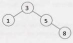


Suppose we call commonAncestor(node  3,  node  5,  node 7).0f course,node 7does not exist­ and that's where the issue will come in. The calling order looks like:

```
1    commonAnc(node  3, node 5, node 7)                      //-->  s
2        calls commonAnc(node  1, node 5, node 7)         //-->  null
3			calls commonAnc(node  5,  node 5,  node 7)	// -->  5
4				calls commonAnc(node  8,  node 5,  node 7)	// -->  null
```

In other words, when we call c ommonAncestor on the right subtree, the code will return node 5, just as it should. The problem is that in finding the common ancestor of pand q, the calling function can't distin­ guish between the two cases:

- Case 1: p is a child of q (or, q is a child of p)
- Case 2: p is in the tree and q is not (or, q is in the tree and pis not)

In either ofthese cases, c ommonAncestor will return p. In the firstcase, this is the correct return value, but in the second case, the return value should be null.

We somehow need to distinguish between these two cases, and this is what the code below does. This code solves the problem by returning two values: the node itself and a flag indicating whether this node is actually the common ancestor.

```java
1     class Result   {
2         public TreeNode node;
3         public boolean  isAncestor;
4         public Result(TreeNode  n,  boolean  isAnc)  {
5                  node =  n;
6              isAncestor =  isAnc;
7            }
8      }
9
10  TreeNode commonAncestor(TreeNode  root,  TreeNode p,  TreeNode q)  {
11       Result  r =  commonAncestorHelper(root,  p,  q);
12       if  (r.isAncestor) {
13            return r.node;
14       }
15       return null;
16    }
17
18   Result   commonAncHelper(TreeNode  root,  TreeNode p,  TreeNode q)  {
19       if (root     null) return new Result(null,  false);
20
21       if (root    p &&   root== q)  {
22            return new Result(root, true);
23         }
24
25       Result  rx  =  commonAncHelper(root.left,  p,  q);
26       if  (rx.isAncestor) {//Found  common  ancestor
27            return rx;
28       }
29
30       Result  ry  =  commonAncHelper(root.right,  p,  q);
31       if  (ry.isAncestor) {//Found  common  ancestor
32            return ry;
33       }
34
35       if (rx.node != null &&   ry.node   != null) {
36            return new Result(root, true);  // This  is the  common  ancestor
37       }  else if (root == p  I   I      root  ==  q)  {
38            /*  If we're  currently at  p or  q,  and we  also  found one of  those  nodes in  a
39              * subtree,  then  this is truly an ancestor and the  flag   should  be  true. */
40            boolean  isAncestor = rx.node != null || ry.node   != null;
41			  return new  Result(root,  isAncestor);
42         } else {
43				return new  Result(rx.node!=null? rx.node : ry.node,  false); 
44         }
45    }
```
 
Of course, as this issue only comes up when p or q is not actually in the tree, an alternative solution would be to first search through the  entire tree  to make sure  that both nodes exist.

**4.9	BST Sequences:** A binary  search tree  was created by traversing through an array from left to right and inserting each element. Given  a binary  search tree  with  distinct elements, print  all possible arrays that could have  led to this tree.

EXAMPLE

```
Input:
			2

		  /   \
		1		3

Output: {2,   1,   3}, {2,  3,  1}
```
 
SOLUTION

---

It's useful to kick off this question with a good example.

```
			50
		   /  \
		20		60
	   /  \    /  \
     10		25		70
   /   \   /   \   /   \
  5		15		65		80
```

We should also think  about the  ordering of items in a binary  search tree.  Given a node, all nodes on its left must be  less than all nodes on  its right.  Once  we reach a place  without a node, we insert the  new  value there.

What this means is that the  very first element in our array must have  been a 50 in order to create the  above tree.  If it were  anything else, then that value  would have  been the  root  instead.

What  else  can  we say? Some  people jump to the  conclusion that everything on the  left must have  been inserted before elements on the right, but that's not  actually true.  In fact, the reverse is true: the order of the left or right  items doesn't matter.

Once  the  50 is inserted, all items less than 50 will be routed to the  left and all items greater than 50 will be routed to the  right. The 60 or the  20 could be inserted first, and it wouldn't matter.

Let's think  about this problem recursively.  If we had all arrays  that could have  created the  subtree rooted at  20  (call this  arraySet20),  and all arrays  that could have  created the  subtree rooted at  60  (call this array5et60), how would that give us the full answer? We couldjust"weave"each array from array5et20 with each array from arraySet60-and then prepend each array with a 50.

Here's what we mean by weaving. We are merging two arrays in all possible ways, while keeping the elements within each array in the same relative order.
```
arrayl: {l,  2}
array2: {3,   4}
weaved: {l, 2,   3,  4},  {l, 3,  2,  4},  {1,   3,  4,  2},
		{3, 1,   2,  4},  {3, 1,  4,  2},  {3,   4,  1,  2}
```
Note that, as long as there  aren't any duplicates in the original array sets, we won't have to worry that weaving will create duplicates.

The last piece to talk about here is how the weaving works Let's think recursively about how to weave{1,
2,   3} and {4, S,  6}. What are the subproblems?

- Prepend al to all weaves of{2,  3}and{4,  5,   6}. 
- Prepend a4 to all weaves of{l,  2,   3}and{S,   6}.

To implement this, we'll store each as linked lists. This will make it easy to add and remove elements. When we recurse, we'll push the prefixed elements down the recursion When first or second are empty, we add the remainder to prefix and store the result.

It works something like this:
```
	weave(first,  second,   prefix):
		weave({l,   2},  {3,   4},  {})
			weave({2},   {3,   4},   {1})
				weave({},   {3,   4},   {l, 2})
					{1,   2,   3,  4}
				weave({2},   {4},  {1,   3})
					weave({},   {4},   {l,   3,  2})
						{l,   3,  2,  4}
					weave({2},   {},   {l, 3,  4})
						{l, 3,  4,   2}
			weave({l,  2},  {4},   {3})
				weave({2},  {4},   {3,   1})
					weave({},   {4},   {3,   1,   2})
						{3,   1,   2,  4}
					weave({2},   {},   {3,   1,   4})
						{3,   1,  4,   2}
				weave({l,  2},  {},   {3,   4})
					{3,   4,   1,   2}
```

Now, let's think through the implementation of removing, say,1 from{1,   2}and recursing. We need to be careful about modifying this list, since a later recursive call (e .g., weave({1,   2},   {4},   {3})) might need the 1  still in{1,  2}.

We could clone the list when we recurse, so that we only modify the recursive calls. Or, we could modify the list but then"revert"the changes after we're done with recursing.

We've chosen to implement it the latter way. Since we're keeping the same reference to first, second, and prefix the entire way down the recursive call stack, then we'll need to clone prefix just before we store the complete result.

```java
1     ArrayList<LinkedList<Integer>> allSequences(TreeNocte  node)  {
2          Arraylist<Linkedlist<Integer>> result = new Arraylist<Linkedlist<Integer>>();
3
4          if (node  == null)  {
5               result.add(new Linkedlist<Integer>());
6               return result;
7            }
8
9         Linkedlist<Integer> prefix     new Linkedlist<Integer>();
10       prefix.add(node.data);
11
12       /*   Recurse  on left and right subtrees. */
13       Arraylist<Linkedlist<Integer>> leftSeq  =  al1Sequences(node.left);
14       ArrayList<LinkedList<Integer>> rightSeq  =  al1Sequences(node.right);
15
16       /*  Weave  together each  list from the  left and right sides. */
17       for  (Linkedlist<Integer> left :   leftSeq) {
18            for  (LinkedList<Integer> right   :   rightSeq) {
19                 ArrayList<LinkedList<Integer>>  weaved=
20                      new Arraylist<Linkedlist<Integer>>();
21                 weavelists(left, right,  weaved, prefix);
22                 result.addAll(weaved);
23            }
24       }
25       return result;
26   }
27
28  /*  Weave  lists together in  all possible ways. This  algorithm works by removing the
29     * head from one list, recursing,  and then  doing  the  same thing   with  the  other
30    * list.  */
31  void  weaveLists(LinkedList<Integer> first, LinkedList<Integer>  second,
32                 ArrayList<LinkedList<Integer>> results, LinkedList<Integer> prefix)  {
33       /*  One list is empty.  Add  remainder  to  [a  cloned]   prefix and store result.  */
34       if (first.size()==    0 11 second.size() ==  0)  {
35            Linkedlist<Integer> result  =  (Linkedlist<Integer>) prefix.clone();
36            result.addAll(first);
37            result.addAll(second);
38            results.add(result);
39            return;
40       }
41
42       /*  Recurse with head of  first added to  the  prefix. Removing the  head will  damage
43         * first, so  we'll need to  put  it back where we  found it afterwards. */
44       int headfirst=  first.removeFirst();
45       prefix.addLast(headFirst);
46       weavelists(first, second,   results,  prefix);
47       prefix.removelast();
first.addFirst(headFirst);
49
50       /*  Do  the  same thing with  second,  damaging and then  restoring the  list.*/
51       int headSecond =  second.removeFirst();
52       prefix.addLast(headSecond);
53       weavelists(first, second,  results,  prefix);
54       prefix.removelast();
55       second.addFirst(headSecond);
56   }
```

Some people struggle with this problem because there are two different recursive algorithms that must be designed and implemented. They get confused with how the algorithms should interact with each other and they try to juggle both in their heads.

If this sounds like you, try this: trust and focus. Trust that one method does the right thing when imple­menting an independent method, and focus on the one thing that this independent method needs to do.

Look at weaveLists. It has a specific job: to weave two lists together and return a list of all possible weaves.The existence of allSequences is irrelevant. Focus on the task that weavelists has to do and design this algorithm.

As you're implementing allSequences (whether you do this before or after weavelists), trust that weavelists will do the right thing. Don't concern yourself with the particulars of how weaveLists operates while implementing something that is essentially independent. Focus on what you're doing while you're doing it.

In fact, this is good advice in general when you're confused during whiteboard coding. Have a good under­ standing of what a particular function should do ("okay, this function is going to return a list of \__"). You should verify that it's really doing what you think. But when you're not dealing with that function, focus on the one you are dealing with and trust that the others do the right thing. It's often too much to keep the implementations of multiple algorithms straight in your head.


**4.1O      Check Subtree:** Tl and T2 are two very large binary trees, withTl much bigger thanT2. Create an algorithm to determine ifT2 is a subtree ofTl.

A tree T2 is a subtree of Tl  if there exists a node n in Tl  such that the subtree of n is identical to T2.
That is, if you cut off the tree at node n, the two trees would be identical.

SOLUTION

---

In problems like this, it's useful to attempt to solve the problem assuming that there is just a small amount of data. This will give us a basic idea of an approach that might work.

###### The Simple Approach

In this smaller, simpler problem, we could consider comparing string representations of traversals of each tree. lfT2 is a subtree ofTl, thenT2's traversal should be a substring ofTl. ls the reverse true? If so,  should we use an in-order traversal or a pre-order traversal?

An in-order traversal will definitely not work. After all, consider a scenario in which we were using binary search  trees. A binary search tree's in-order traversal always prints out the values in sorted order.Therefore, two binary search trees with the same values will always have the same in-order traversals, even if their structure is different.

What about a pre-order traversal?This  is a bit more promising.  At least in this case we know certain things, like the first element in the pre-order traversal is the root node.The left and right elements will follow.

Unfortunately, trees with different structures could still have the same pre-order traversal.

```
		3		 3
	   /		  \
	  4				4
```
There's a simple  fix though.We can store NULL nodes in the pre-order traversal string as a special character, like an 'X'. (We'll  assume that the binary trees contain only integers.)The left tree would have the traversal { 3,   4,   X} and the right tree will have the traversal { 3,   X,  4}.

Observe that, as long as we represent the NULL nodes, the pre-order traversal of a tree is unique.That is, if two trees have the same pre-order traversal, then we know they are identical trees in values and structure.

To see this, consider reconstructing a tree from its pre-order  traversal (with NULL nodes indicated). For example: 1, 2, 4, X, X, X, 3, X, X.

The root is 1, and its left node, 2, follows it. 2.left must be 4. 4 must have two NULL nodes (since it is followed by two Xs). 4 is complete, so we move back up to its parent, 2. 2.right is another X (NULL). 1's left subtree is now complete, so we move to 1's right child. We place a 3 with two NULL children there.The tree is now complete.

```
			  1
		    /    \
		2			3
	  /   \       /   \
	4		x 	x 		x
   /  \
 x 		x
```

This whole process was deterministic, as it will be on any other tree. A pre-order traversal always starts at the root and, from there, the path we take is entirely defined by the traversal.Therefore, two trees are iden­ tical if they have the same pre-order traversal.

Now consider the subtree problem. lfT2's pre-order traversal is a substring of Tl's pre-order traversal, then T2's root element must be found inTl. If we do a pre-order traversal from this element in Tl, we will follow an identical path toT2's traversal. Therefore, T2 is a subtree of Tl.

Implementing this is quite straightforward. Wejust need to construct and compare the pre-order traversaIs.

```java
1     boolean  containsTree(TreeNode tl, TreeNode t2) {
2          StringBuilder stringl     new StringBuilder();
3         StringBuilder string2  = new StringBuilder();
4
5          getOrderString(tl,  stringl);
6          getOrderString(t2,  string2);
7
8          return stringl.indexOf(string2.toString())  != -1;
9      }
10
11   void  getOrderString(TreeNode node,   StringBuilder sb)   {
12        if (node  == null) {
13             sb. append("X");                            // Add null indicator
14             return;
15        }
16		  sb.append(node.data  +  "   ");  // Add root
17		  getOrderString(node.left, sb);   // Add left 
18		  getOrderString(node.right, sb);  // Add right
19   }
```

This approach takes O(n  +  m) time and O(n  +  m) space, where n and mare the number of nodes inTl and T2, respectively. Given millions of nodes, we might want to reduce the space complexity.

##### The Alternative Approach

An alternative approach is to search through the larger tree, Tl. Each time a node in Tl matches the root ofT2, call matchTree.The matchTree method will compare the two subtrees to see if they are identical.

Analyzing the runtime is somewhat complex. A naive answer would be to say that it is O(nm) time, where n is the number of nodes in Tl and mis the number of nodes in T2. While this is technically correct, a little more thought can produce a tighter bound.

We do not actually call matchTree on every node in Tl. Rather, we call it k times, where k is the number of occurrences ofT2's root inTl.The runtime is closer too(n   +  km).

In fact, even that overstates the runtime.  Even if the root were identical, we exit matchTree when we find a difference betweenTl andT2. We therefore probably do not actually look at m nodes  on each call of matchTree.

The code below implements this algorithm.

```java
1      boolean containsTree(TreeNode  tl, TreeNode  t2)  {
2        if (t2  ==   null) return  true;   //  The empty  tree  is always a  subtree
3             return  subTree(tl,   t2);
4    }
5
6     boolean  subTree(TreeNode   rl, TreeNode  r2)  {
7           if (rl ==   null)  {
8                return  false;   // big  tree  empty   &  subtree still not found.
9           }  else if (rl.data ==   r2.data  &&  matchTree(rl,  r2))  {
10              return  true;
11        }
12        return  subTree(rl.left,  r2)   ||  subTree(rl.right,  r2);
13    }
14
15   boolean  matchTree(TreeNode   rl, TreeNode  r2)  {
16        if (rl == null  &&  r2 ==  null) {
17              return  true;   II nothing left in  the  subtree
18         }  else if (rl == null   ||  r2  ==  null) {
19               return  false;   // exactly tree  is empty, therefore  trees  don't  match
20      }  else if (rl.data  != r2.data)   {
21              return  false;    // data doesn't  match
22      }  else {
23           return  matchTree(rl.left,  r2.left) &&  matchTree(rl.right,  r2.right);
24      }
25    }
```

When might the simple solution be better, and when might the alternative approach be better? This is a great conversation to have with your interviewer.  Here are a few thoughts on that matter:

1.  The simple solution  takes O(n + m) memory. The alternative solution takes O(log(n)  + log(m))
memory. Remember: memory usage can be a very big deal when it comes to scalability.
2.  The simple solution  is O(n   +  m) time and the alternative  solution  has a worst case time of O(nm).
However, the worst  case time can be deceiving; we need to look deeper than that.
3. A slightly tighter bound on the runtime, as explained  earlier, is O(n  +  km), where k is the number of occurrences ofT2's root inTl. Let's suppose the node data forTl andT2 were random numbers picked
between O and p.The value of k would be approximately n/p. Why? Because each of n nodes in Tl has a  1/p chance of equaling the root, so approximately  n/p nodes in Tl should equal T2. root. So, let's
say p =  1000, n =  1000000 and m =  100. We would  do somewhere  around  l,100,000 node checks (1100000 = 1000000 + (100 * 1000000)/100).
4.  More complex mathematics and assumptions could get us an even tighter  bound. We assumed in #3 above that if we call matchTree, we would end up traversing  all m nodes of T2. It's far more likely, though,  that we will find a difference  very early on in the tree and will then exit early.

In summary, the alternative approach is certainly more optimal in terms of space and is likely more optimal in terms of time  as well. It all depends on what assumptions you make and whether you prioritize reducing
 the average case runtime at the expense of the worst case runtime. This is an excellent point to make to your interviewer.

**4.11 	Random Node:** You are implementing a binary search tree class from scratch, which, in addition to insert, find, and delete, has a method getRandomNode()  which returns a random node from the tree. All nodes should be equally likely to be chosen. Design and implement an algorithm for getRandomNode,  and explain how you would implement the rest of the methods.

SOLUTION

---

Let's draw an example.
```
			20
		   /   \
		10		30
 	  /    \
	5		15
   /  \	   /   \
3		7		17
```

We're going to explore many solutions until we get to an optimal one that works.

One thing we should realize here is that the question was phrased in a very interesting way. The interviewer did not simply say, "Design an algorithm to return a random node from a binary tree:'We were told that this is a class that we're building from scratch. There is a reason the question was phrased that way.We probably need access to some part of the internals of the data structure.

##### Option #1  [Slow & Working]

One solution is to copy all the nodes to an array and return a random element in the array. This solution will take O(N)  time and O(N)  space, where N is the number of nodes in the tree.

We can guess our interviewer is probably looking for something more optimal, since this is a little too straightforward  (and should make us wonder why the interviewer gave us a binary tree, since we don't need that information).

We should keep in mind as we develop this solution that we probably need to know something about the internals of the tree. Otherwise, the question probably wouldn't specify that we're developing the tree class from scratch.

##### Option #2  [Slow & Working)

Returning  to our original  solution  of copying  the nodes to an array, we can explore  a solution  where  we maintain  an array at all times that lists all the nodes in the tree. The problem  is that we'll need to remove nodes from this array as we delete them from the tree, and that will take O(N) time.

##### Option #3  [Slow & Working]

We could label all the nodes with an index from 1  to N and label them in binary search tree order (that is, according to its inorder traversal). Then, when we call getRandomNode,  we generate a random index between 1  and N. If we apply the label correctly, we can use a binary search tree search to find this index.

However, this leads to a similar issue as earlier solutions. When we insert a node or a delete a node, all of the indices might need to be updated. This can take O(N) time.

##### Option #4 [Fast & Not Working]

What if we knew the depth of the tree? (Since we're building  our own class, we can ensure that we know this. It's an easy enough piece of data to track.)

We could pick a random depth, and then traverse left/right randomly until we go to that depth. This wouldn' t actually ensure that all nodes are equally likely to be chosen though.

First, the tree doesn't necessarily have an equal number of nodes at each level. This means that nodes on levels with fewer nodes might be more likely to be chosen than nodes on a level with more nodes.

Second, the random path we take might end up terminating before we get to the desired level. Then what? We could just return the last node we find, but that would mean unequal probabilities at each node.

##### Option #5 [Fast & Not Working]

We could try just a simple approach: traverse randomly down the tree. At each node:

- With  1/3 odds, we return the current node.
- With  1/3 odds, we traverse left.
- With  1/3 odds, we traverse right.

This solution, like some of the others, does not distribute the probabilities evenly across the nodes. The root has a X probability of being selected-the same as all the nodes in the left put together.

##### Option #6 [Fast & Working]

Rather than just continuing to brainstorm new solutions, let's see if we can fix some of the issues in the previous solutions. To do so, we must diagnose-deeply-the root problem in a solution.

Let's look at Option #5. It fails because the probabilities aren't evenly distributed across the options. Can we fix that while keeping the basic algorithm the same?

We can start with the root. With what probability should we return the root? Since we have N nodes, we must return the root node with 1/N probability. (In fact, we must return each node  with 1/N probability. After all, we have N nodes and each must have equal probability. The total must be 1 (100%), therefore each must have 1/N probability.)

We've resolved the issue with the root. Now what about the rest of the problem? With what probability should we traverse left versus right? It's not  50/50.  Even in a balanced tree, the number of nodes on each side might not be equal.  If we have more nodes on the left than the right, then we need to go left more often.

One way to think about it is that the odds of picking something-anything-from the left must be the sum of each individual probability. Since each node must have probability 1/N, the odds of picking something from the left must have probability LEFT_SIZE  *  1/N. This should therefore be the odds of going left.
Likewise, the odds of going right should be RIGHT_SIZE *   1/N.

This means that each node must know the size of the nodes on the left and the size of the nodes on the right. Fortunately, our interviewer has told us that we're building  this tree class from scratch. It's easy to keep track of this size information on inserts and deletes. We can just store a size variable in each node. Increment size on inserts and decrement it on deletes.

```java
1      class TreeNode {
2         private int data;
3            public  TreeNode left;
4         public  TreeNode right;
5            private int size =  0;
6
7             public  TreeNode(int  d)  {
8              data    =   d;
9              size =  1;
10      }
11
12       public  TreeNode getRandomNode()   {
13            int leftSize  =left    ==null?  0     left.size();
14             Random  random  =  new Random();
15            int index  =  random.nextint(size);
16            if (index   <  leftSize) {
17                 return  left.getRandomNode();
18          } else if (index    ==    leftSize) {
19                 return this;
20          } else {
21                 return  right.getRandomNode();
22          }
23      }
24
25          public   void  insertinOrder(int d)  {
26            if (d  <=  data) {
27                        if (left ==null) {
28                      left = new TreeNode(d);
29                } else {
30                      left.insertlnOrder(d);
31                }
32          } else {
33                 if (right == null) {
34                      right   =new  TreeNode(d);
35               } else {
36                      right.insertinOrder(d);
37               }
38          }
39            size++;
40      }
41
42       public  int size() {  return size;}
43       public  int data() {  return data;}
44
45       public   TreeNode find(int d)  {
46            if (d    ==data)  {
47                 return this;
48           } else if (d  <=  data) {
49                 return left  != null?  left.find(d) :   null;
50          } else if (d  >  data) {
51                 return right  != null ?  right.find(d) :  null;
52                }
53            return null;
54       }
55 }
```

In a balanced tree, this algorithm will be O(log N), where N is the number of nodes.

##### Option #7 [Fast & Working]

Random number calls can be expensive.  If we'd like, we can reduce the number of random number calls substantially.

*Imagine* we called getRandomNode on the tree below, and then traversed left.

```
			20
		   /   \
		10		30
 	  /    \	   \
	5		15		35
   /  \	   /   \
3		7		17
```

We traversed left because we picked a number between O and 5 (inclusive). When we traverse left, we again pick a random number between O and 5. Why re-pick? The first number will workjust fine.

But what if we went right instead? We have a number between 7 and 8 (inclusive) but we would need a number between O and 1  (inclusive). That's easy to fix:just subtract out LEFT_SIZE  +  1.

Another way to think about what we're doing is that the initial random number call indicates which node (i) to return, and then we're locating the ith node in an in-order traversal. Subtracting LEFT_SIZE  +  1 from i reflects that, when we go right, we skip over LEFT_SIZE  + 1 nodes in the in-order traversal.

```java
1     class  Tree {
2       TreeNode root=   null;
3 
4        public int size() { return  root == null?  0   root.size(); } 
5
6          public  TreeNode getRandomNode() {
7               if (root  ==  null) return  null;
8
9               Random random  =  new Random();
10          int i=   random.nextlnt(size());
11             return  root.getlthNode(i);
12      }
13
14      public  void insertinOrder(int value) {
15            if (root==  null) {
16                  root  = new   TreeNode(value);
17              }  else  {
18                 root.insertlnOrder(value);
19              }
20           }
21  }
22
23   class  TreeNode {
24     /* construc tor  and variables are the same. */
25
26        public  TreeNode  getlthNode(int i) {
27             int leftSize =left==   null?  0: left.size();
28             if (i <   leftSize) {
29              return  left.getithNode(i);
30          }  else  if (i ==  leftSize) {
31                 return  this;
32          }  else  {
33                    /*  Skipping over leftSize +  1  nodes, so subtract  them. */
34                    return right.getlthNode(i -  (leftSize +  1));
35            }
36        }
37 		 public void insertlnOrder(int  d) {/* same  */}
38		 public int size() { return size; }
39		 public  TreeNode find(int d) {/* same   */} 
40
41    }
```
 

Like the  previous algorithm, this algorithm takes  O( log  N) time  in a balanced tree. We can also describe the  runtime as O(D), whereDis the max depth of the  tree.  Note that O(D) is an accurate description of the runtime whether the  tree  is balanced or not.


**4.12 	Paths  with Sum:** You are given  a binary  tree  in which  each node contains an integer value (which might be  positive or negative). Design  an algorithm to count the  number of paths that sum  to a given  value. The path does not  need to start  or end at the  root  or a leaf, but  it must go downwards
(traveling only from parent nodes to child nodes).

SOLUTION

---

Let's pick a potential sum-say, 8-and then draw  a binary  tree  based on this. This tree  intentionally has a number of paths with this sum.

```
			10
		   /   \
		5		-3
 	  /    \	   \
	3		2		11
   /  \	   /  \
  3	    -2		1
```

##### Solution #1: Brute  Force

In the  brute force approach, we just  look at all possible paths. To do this, we traverse to each node.  At each node,  we recursively try all paths downwards, tracking the  sum  as we go. As soon  as we hit our target sum, we increment the  total.

```java
1      int countPathsWithSum(TreeNode  root,  int  targetSum) {
2           if (root ==  null)  return  0;
3
4           /*  Count paths with sum  starting from the root.   */
5           int pathsFromRoot =  countPathsWithSumFromNode(root, targetSum,   0);

7           /* Try   the  nodes on  the left  and  right. */
8           int  pathsOnleft =  countPathsWithSum(root.left,  targetSum);
9           int  pathsOnRight =  countPathsWithSum(root.right,  targetSum);
10
11         return pathsFromRoot +  pathsOnLeft +  pathsOnRight;
12    }
13
14   /*  Returns the  number of  paths  with this sum  starting from this  node. */
15 int countPathsWithSumFromNode(TreeNode  node, int targetSum,  int currentSum) {
16       if (node == null)  return 0;
17
18       currentSum += node.data;
19
20       int  totalPaths = 0;
21       if (currentSum ==  targetSum) {  II Found a path from the  root
22            totalPaths++;
23         }
24
25         totalPaths += countPathsWithSumFromNode(node.left,   targetSum,  currentSum);
26       totalPaths += countPathsWithSumFromNode(node.right,   targetSum,  currentSum);
27       return totalPaths;
28  }
```

What is the time complexity of this algorithm?

Consider that node at depth d will be "touched" (via countPathsWithSumFromNode)  by d nodes above it. 

In a balanced binary tree, d will be no more than approximately log   N. Therefore, we know that with N nodes in the tree, countPathsWithSumFromNode will be called O(N log  N) times.The runtime is O(N log N).

We can also approach this from the other direction. At the root node, we traverse to all N - 1 nodes beneath it (via countPathsWithSumFromNode). At the second level (where there are two nodes), we traverse to N   -  3 nodes. At the third level (where there are four nodes, plus three above those), we traverse to N   -   7 nodes. Following this pattern, the total work is roughly:
```
(N -  1)  + (N -  3) + (N  -  7)  +  (N  -  15)  +  (N -  31) + ••• +  (N  -  N)
```
To simplify this, notice that the left side of each term is always N and the right side is one less than a power of two. The number of terms is the depth of the tree, which is O(log  N). For the right side, we can ignore the fact that it's one less than a power  of two. Therefore, we really have this:
```
O(N   *  [number  of  terms]  -  [sum  of  powers  of  two from 1 through  N])
O(N  log  N   -  N)
O(N  log  N)
```
If the value of the sum of powers of two from 1 through N isn't obvious to you, think about what the powers of two look like in binary:
0001
```
+  0010
+  0100
+  1000
-------
=  1111
```
Therefore, the runtime  is O(N log N) in a balanced tree.

In an unbalanced tree, the runtime could be much worse. Consider a tree that is just a straight line down. At the root, we traverse to N  -  1 nodes. At the next level (withjust  a single node), we traverse to N -  2 nodes. At the third level, we traverse to N   -   3 nodes, and so on. This leads us to the sum of numbers between 1 and N, which is 0(N² ).

##### Solution #2: Optimized

In analyzing the last solution, we may realize that we repeat some work. For a path such as 10  ->  5   -> 3  ->   -2, we traverse this path (or parts of it) repeatedly. We do it when we start with node  10, then when we go to node 5 (looking at 5, then 3, then  -2), then  when  we go to node  3, and then  finally  when  we go to node -2. Ideally, we'd like to reuse this work.

```
			10
		   /   \
		5		-3
 	  /    \	   \
	3		1		11
   /  \	   /  \
  3	    -2	   2
```


Let's isolate a given path and treat it as just an array. Consider a (hypothetical, extended) path like:
```
10 -> 5   -> 1  -> 2  ->  -1  ->  -1  -> 7  -> 1  -> 2
```
What we're really saying then is: How many contiguous subsequences in this array sum to a target sum such as 8? In other words, for each y, we're trying to find the x values  below.  (Or, more accurately, the number of x values below.)

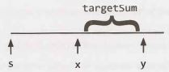

If each value knows its running sum (the sum of values from s through itself), then we can find this pretty easily. We just need to leverage this simple equation: runningSumx   =   runningSumY -  targetSum. 
We then look for the values of x where this is true.


Since we're just looking for the number of paths, we can use a hash table. As we iterate through the array, build a hash table that maps from a runningSum to the number of times we've seen that sum. Then, for
each y, look up runningSumY   -  targetSum in the hash table. The value in the hash table will tell you the number of paths with sum targetsum that end at y.

For example:
```
index:   0       1         2          3            4         5         6       7       8 
------------------------------------------------------------------------------------------
value:   10 ->   5  -> 1  -> 2 -> -1  ->  -1  -> 7  ->  1  ->  2 
sum:       10     15     16     18       17       16     23        24     26
```
The value of runningSum7 is 24. lf targetSum is 8, then we'd look up 16 in the hash table.This would have a value of 2 (originating from index 2 and index 5). As we can see above, indexes 3 through 7 and indexes
6 through 7 have sums of 8.

Now that we've settled the algorithm for an array, let's review this on a tree. We take a similar approach.

We traverse through the tree using depth-first search. As we visit each node:

1.  Track its runningSum. We'll take this in as a parameter and immediately increment it by node. value.
2.  Look up runningSum  -  targetSum in the hash table. The value there indicates the total number. Set totalPaths to this value.
3.   If runningSum  ==  targetSum, then there's one additional path that starts at the root. Increment totalPaths.
4.   Add runningSum to the hash table (incrementing the value if it's already  there).
5.   Recurse left and right, counting the number of paths with sum targetSum.
6.   After we're done recursing left and right, decrement the value of runningSum in the hash table. This is essentially backing out of our work; it reverses the changes to the hash table so that other nodes don't use it (since we're now done with node).

Despite the complexity of deriving this algorithm, the code to implement this is relatively simple.

```java
1     int countPathsWithSum(TreeNode root, int targetSum)   {
2         return  countPathsWithSum(root, targetSum,   0,  new HashMap<Integer, Integer>());
3     }
4
5    int countPathsWithSum(TreeNode  node,  int targetSum,   int runningSum,
6                                              HashMap<Integer, Integer> pathCount)  {
7         if (node  ==  null) return 0;  // Base case
8
9         /*  Count paths   with  sum ending  at the  current node.  */
10       runningSum +=  node.data;
11       int sum=  runningSum -  targetSum;
12       int totalPaths =  pathCount.getOrDefault(sum,  0);
13
14       /*  If runningSum equals   targetSum,   then  one additional path  starts at root.
15         * Add   in  this path.*/
16       if (runningSum == targetSum)  {
17            totalPaths++;
18       }
19
20       /*  Increment  pathCount,  recurse,  then  decrement  pathCount. */
21       incrementHashTable(pathCount,  runningSum,  1);  // Increment  pathCount
22       totalPaths += countPathsWithSum(node.left,  targetSum,   runningSum, pathCount);
23       totalPaths +=  countPathsWithSum(node.right,  targetSum,   runningSum, pathCount);
24       incrementHashTable(pathCount,  runningSum, -1);   // Decrement pathCount
25
26       return totalPaths;
27   }
28
29  void  incrementHashTable(HashMap<Integer,  Integer> hashTable,   int key,  int delta) {
30       int newCount   =  hashTable.getOrDefault(key,  0)  +  delta;
31       if (newCount == 0)  {//Remove  when zero  to  reduce  space  usage
32            hashTable.remove(key);
33       }  else   {
34            hashTable.put(key,  newCount);
35         }
36   }
```

The runtime for this algorithm is O(N), where N is the number of nodes in the tree. We know it is O(N) because we travel to each node just once, doing O(1) work each time. In a balanced tree, the space complexity is O( log   N) due to the hash table. The space complexity can grow to O(n) in an unbalanced tree.

Additional Questions:  Recursion (#8.10), System Design and Scalability (#9.2, #9.3), Sorting and Searching (#10.10), Hard Problems (#17.7, #17.12, #17.13, #17.14, #17.17, #17.20, #17.22, #17.25).

Hints start on page 653.


## 5 Bit Manipulation

Bit manipulation is used in a variety  of problems. Sometimes, the  question explicitly calls for bit manipu­lation.  Other times,  it's simply  a useful  technique to optimize your  code.  You should be  comfortable doing bit manipulation by hand, as well as with code.  Be careful;  it's easy to make little mistakes.


### Bit Manipulation By Hand

If you're rusty on bit manipulation, try the following exercises by hand. The items in the third column can be solved manually or with "tricks" (described below).  For simplicity,  assume that these are four-bit numbers.

If you get  confused, work them through as a base 1O number. You can  then apply the  same process to  a binary number. Remember that /\ indicates an XOR, and= is a NOT (negation).

| 0110 +  0010 | 0011 *  0101 | 0110 +  0110      |
| 0011 +  0010 | 0011 *  0011 | 0100 *  0011      |
| 0110 -  0011 | 1101 >> 2    | 1101 ^  (=1101)   |
| 1000 -  0110 | 1101 ^  0101 | 1011 &  (~0 << 2) |

Solutions: line 1 (1000, 1111, 1100); line 2 (0101, 1001, 1100); line  3 (0011, 0011, 1111); line 4 (0010, 1000, 1000).

The tricks in Column 3 are as follows:

1.   0110  +   0110 is equivalent to 0110  *  2, which  is equivalent to shifting 0110 left by 1.

2.   0100 equals 4, and multiplying by 4 is just left shifting by 2. So we shift  0011 left by 2 to get  1100.

3.  Think about this operation bit by bit. If you XOR a bit with its own negated value, you will always  get  1.
Therefore, the  solution to aA(=a) will be a sequence of 1s.

4.  ~0 is a sequence of 1s, so~0  << 2 is 1s followed by two Os. ANDing that with another value  will clear the  last two bits of the  value.

If you didn't see these tricks immediately, think about them logically.


### Bit Facts and Tricks

The following expressions are useful  in bit manipulation. Don't just  memorize them, though; think deeply about why each of these is true. We use "1s" and "Os" to indicate a sequence of 1s or Os, respectively. 

```
X  ^ 0s  =  X     X  &  0s    X  |  0s  =  X 
X  ^ 1s  =  ~X    X  &  1s    X  |  1s  =  1s 
X  ^ x   =  X     X  &  x     X  |  x   =  X 
```

To understand these expressions, recall that these operations occur bit-by-bit, with what's happening  on one bit never impacting the other bits. This means that if one of the above statements is true for a single bit, then it's true for a sequence of bits.


### Two's Complement and Negative Numbers

Computers typically store integers in two's complement representation. A positive number is represented as itself while a negative number is represented as the two's complement of its absolute value (with a 1 in its sign bit to indicate that a negative value). The two's complement of an N-bit number (where N is the number of bits used for the number, excluding the sign bit) is the complement of the number with respect to 2^N.

Let's look at the 4-bit integer -3 as an example. If it's a 4-bit number, we have one bit for the sign and three bits for the value. We want the complement with respect to 23,  which is 8. The complement of 3 (the abso­ lute value of -3) with respect to 8 is 5. 5 in binary is 101. Therefore, -3 in binary as a 4-bit number  is 1101, with the first bit being the sign bit.

In other words, the binary representation of-K (negative K) as a N-bit number is c one at ( 1,  2^(N-1)  -  K). 

Another way to look at this is that we invert the bits in the positive representation and then add 1. 3 is 011 in binary. Flip the bits to get 100, add 1 to get 101, then prepend the sign bit (1) to get 1101.

In a four-bit integer, this would look like the following.


Observe that the absolute values of the integers on the left and right always sum to 23, and that the binary values on the left and right sides are identical, other than the sign bit. Why is that?


### Arithmetic vs. Logical Right Shift

There are two types of right shift operators. The arithmetic right shift essentially divides by two. The logical right shift does what we would visually see as shifting the bits. This is best seen on a negative number.
In a logical right shift, we shift the bits and put a 0 in the most significant  bit. It is indicated with a »> operator. On an 8-bit integer  (where the sign bit is the most significant  bit), this would  look like the image below. The sign bit is indicated with a gray background.


In an arithmetic right shift, we shift values to the right but fill in the new bits with the value of the sign bit. This has the effect  of(roughly) dividing by two. It is indicated by a > > operator.


What do you think these functions would do on parameters x  =   -93242 and count  =  40?

```java
1    int repeatedArith  meticShift(int  x, int count) {
2            for (inti=   0; i <  count; i++) {
3                  x>>=1;   // Arith  metic   shift by1
4           }
5            return x;
6      }
7
8    int repeatedLogicalShift( int  x, int count) {
9            for (inti=   0; i <  count; i++) {
10                x>>>=1;   // Logical  shift by1
11         }
12          return x;
13    }
```

With the logical shift, we would get 0 because we are shifting a zero into the most significant bit repeatedly.

With the  arithmetic shift, we would  get  -1 because we  are  shifting  a one  into  the  most  significant bit repeatedly. A sequence of all ls in a (signed) integer represents -1.


### Common Bit Tasks: Getting and Setting

The following operations are very important to know, but do not simply memorize them. Memorizing leads to mistakes that  are impossible to recover  from. Rather, understand how to implement these methods, so that you can implement these,  and other, bit problems.


###### Get Bit

This method shifts 1 over by i bits, creating a value that looks like 00010000. By performing an AND with num, we clear all bits other  than the  bit at bit i. Finally, we compare that to 0. If that new value is not zero, then  bit i must have a 1. Otherwise,  biti is a 0.

```java
1      boolean  getBit(int num, inti) {
2            return (( num &  (1 << i)) != 0);
3      }
```

###### Set Bit

Set Bit shifts  1 over byi  bits, creating a value like 00010000. By performing an OR with num, only the value at bit i will change. All other  bits of the mask are zero and will not affect num.

```java
1    int setBit(int num, inti) {
2            return num | (  1  << i);
3      }
```

###### Clear Bit

This methodoperates in almost the reverse of setBit. First, we create a number like 11101111 by creating the reverse of it (00010000) and negating it. Then, we perform an AND with num. This will clear the ith bit and leave the remainder unchanged.

```java
1     int clearBit(int num, int i) {
2         int mask =  ~(1  << i);
3          return num &  mask;
4      }
```

To clear all bits from the most significant bit through i (inclusive), we create a mask with a 1 at the ith bit (1
<<  i). Then, we subtract 1 from it, giving us a sequence of 0s followed by i ls. We then AND our number with this mask to leavejust the last i bits.

```java
1     int  clearBitsMSBthroughI(int num, inti) {
2          int mask =  (1  << i) - 1;
3          return num &   mask;
4      }
```

To clear all bits from i through 0 (inclusive), we take a sequence of all ls (which is -1) and shift it left by i
+  1 bits. This gives us a sequence of 1 s (in the most significant bits) followed by i 0 bits.

```java
1     int  clearBitsithrough0(int num, int i) {
2         int mask =  (-1 << (i + 1));
3          return num &   mask;
4    }
```

###### Update Bit

To set the ith bit to a valuev, we first clear the bit at position i by using a mask that looks like 11101111. Then, we shift the intended  value,v, left by i bits. This will create a number with bit i equal tov and all other bits equal to 0. Finally, we OR these two numbers, updating the ith bit ifv is 1 and leaving it as 0 otherwise.

```java
1 int  updateBit(int num, int i, boolean  bitisl) {
2 	int  value =  bitisl?  1: 0;
3 	int mask =  ~(1  << i);
4 	return (num &   mask)  I     (value << i);
5 }
```

---
Interview Questions
---

5.1 Insertion:  You are  given  two  32-bit  numbers,   N   and  M,   and  two  bit  positions,  i and j. Write a  method  to  insert  M   into  N  such  that  M   starts  at  bit  j and  ends  at  bit  i. You can  assume   that   the   bits  j  through   i have  enough   space  to  fit  all  of  M.   That  is,  if M  = 10011,  you can assume that  there  are at least 5 bits between  j and i. You would not, for example, have j = 3 and i = 2, because M could not fully fit between bit 3 and bit 2.

EXAMPLE 

Input:    N  = 10000000000,  M = 10011,  i   2,  j = 6

Output: N   =  10001001100

Hints: #137, #769, #215
 

5.2 	Binary to String: Given a real number between O and 1 (e.g., 0.72) that is passed in as a double, print the binary representation. If the number cannot be represented accurately in binary with at most 32 characters, print "ERROR:'

Hints:#743,#767,#773,#269,#297


5.3 	Flip Bit to Win: You have an integer and you can flip exactly one bit from a 0 to a 1. Write code to find the length of the longest sequence of ls you could create.

EXAMPLE 

Input:         1775 (or:  11011101111) 

Output:       8
 
Hints:#759, #226, #374,#352


5.4 	Next  Number: Given a positive integer, print the next smallest and the next largest number that have the same number of 1 bits in their binary representation.

Hints:#747,#7 75, #242,#372,#339,#358,#375,#390

5.5       Debugger: Explain what the following code does: ((n  &   (n-1)) ==  0).

Hints:#757,#202,#267,#302,#346,#372,#383,#398..--·           pg 285

5.6 	Conversion: Write a function to determine the number of bits you would need to flip to convert integer A to integer B.

EXAMPLE

Input:         29   (or:  11101), 15   (or:  01111) 

Output:       2

Hints:#336,#369 ...........	pg286

5.7 	Pairwise Swap: Write a program to swap odd and even bits in an integer with as few instructions as possible (e.g., bit 0 and bit 1 are swapped, bit 2 and bit 3 are swapped, and so on).

Hints:#745,#248,#328,#355. .... . ...   pg 286

5.8		Draw Line: A monochrome screen is stored as a single array of bytes, allowing eight consecutive pixels to be stored in one byte. The screen has width w, where w is divisible by 8 (that is, no byte will be split across rows). The height of the screen, of course, can be derived from the length of the array and the width. Implement a function that draws a horizontal line from (xl, y) to ( x2,   y).

The method signature should look something like:

drawline(byte[] screen, int  width, int  xl,  int  x2,  int y)

Hints:#366,#387,#384,#397


Additional Questions: Arrays and Strings (#1.1, #1.4, #1.8), Math and Logic Puzzles  (#6.1O), Recursion (#8.4, #8.14), Sorting and Searching (#10.7, #10.8), C++ (#12.10), ModerateProblems (#16.1, #16.7), Hard Problems (#17.1).

Hints start on page 662.