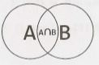
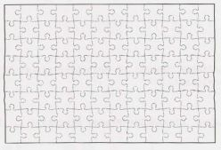
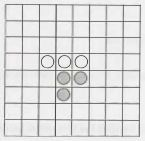
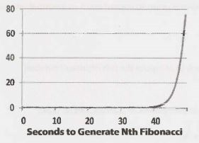
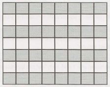
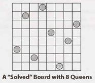
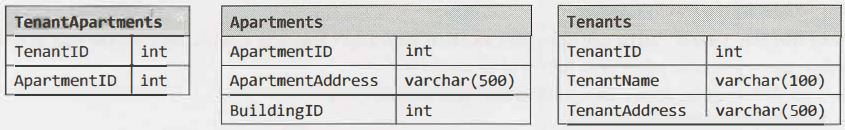

## 6 Math and Logic Puzzles

So-called "puzzles" (or brain teasers) are some of the most hotly debated questions, and many companies have policies banning them. Unfortunately, even when these questions are banned, you still may find yourself being asked one of them. Why? Because no one can agree on a definition of what a brainteaser is.

The good news is that if you are asked a puzzle or brainteaser, it's likely to be a reasonably fair one. It prob­ ably won't rely on a trick of wording, and it can almost always be logically deduced. Many have their foun­ dations in mathematics or computer science, and almost all have solutions that can be logically deduced.

We'll go through some common approaches for tackling these questions, as well as some of the essential knowledge.


### Prime Numbers

As you probably know, every positive integer can be decomposed into a product of primes. For example:
84  =   2²  * 3¹ * 5⁰ * 7¹ * 11⁰   *  13⁰    *  17⁰    *  ... 

Note that many of these primes have an exponent of zero.


###### Divisibility

The prime number law stated above means that, in order for a numberx to divide a number y (written x\y, or mod (y, x)  =  0), all primes inx's prime factorization must be in y's prime factorization. Or, more specifically:


lfx\y,then for alli,ji <=  ki.

In fact, the greatest common divisor ofxand y will be:

gcd (x, y) = 2^min(j0, k0) * 3^min(j1, k1) * 5^min(j2, k2) * ....

The least common multiple ofx and y will be:

lcm (x, y) = 2^max(j0,  k0) * 3^max(j1, k1) * 5^max(j2, k2) * ...

As a fun exercise, stop for a moment and think what would happen if you did gcd * lcm:

```
gcd * lcm = 2^min(j0, k0) * 2^max(j0, k0) * 3^min(j1, k1) * 3^max(j1,  k1) * ....

          = 2^min(j0, k0) + max(j0, k0) * 3^(min(j1,  k1) + max(j1, k1)) * ...
          = 2^(j0  +  k0) *  3(j1  +  k1) *  ... 
          = 2^j0 * 2k0 *  3(j1 * 3k1) *  ... 
          = xy
```

###### Checking for Primality

This question is so common that we feel the need to specifically cover it. The naive way is to simply iterate from 2 through n-1,  checking for divisibility on each iteration.

```java
1     boolean   primeNaive(int n){
2          if(n<2){
3                   return false;
4           }
5          for   (int i=    2;  i<    n;  i++)  {
6               if (n  %  i==    0){
7                    return false;
8               }
9          }
10        return true;
11   }
```

A small but important improvement is to iterate only up through the square root of n.

```java
1     boolean   primeSlightlyBetter(int n){
2          if (n<    2){
3               return false;
4           }
5         int sqrt=  (int) Math.sqrt(n);
6          for   (int i=2;   i<=  sqrt;  i++)  {
7               if (n  %  i==    0)  return false;
8          }
9          return true;
10   }
```

The √n is sufficient because, for every number a which divides n evenly, there is a complement b, where a * b = n. If a > √n, then b < √n (since (√n)² = n). We therefore don't need a to check n's primality, since we would have already checked with b.
 
Of course, in reality, all we really need to do is to check if n is divisible by a prime number. This is where the Sieve of Eratosthenes comes in.


###### Generating a List of Primes: The Sieve of Eratosthenes

The Sieve of Eratosthenes is a highly efficient way to generate a list of primes. It works by recognizing that all non-prime numbers are divisible by a prime number.

We start with a list of all the numbers up through some value max. First, we cross off all numbers divisible by
2. Then, we look for the next prime (the next non-crossed off number) and cross off all numbers divisible by it. By crossing off all numbers divisible by 2, 3, 5, 7, 11, and so on, we wind up with a list of prime numbers from 2 through max.

The code below implements the Sieve of Eratosthenes.

```java
1 	boolean[] sieveOfEratosthenes(int  max) {
2 		boolean[] flags=  new boolean[max  + 1];
3 		int count=    0;
4		
s 	         init(flags); // Set   all flags to  true other than  0  and 1
6 	         int prime  =  2;
7	         
8 	         while  (prime<=    Math.sqrt(max))  {
9 	         	/* Cross  off  remaining multiples  of  prime  */
10	         	crossOff(flags,  prime);
11	         	
12	         	/* Find  next   value  which  is true */
13	         	prime  =  getNextPrime(flags,  prime);
14	         }
15	         
16	         return flags;
17	     }
18	     
19	     void   crossOff(boolean[] flags,  int  prime)   {
20	       /* Cross  off  remaining multiples  of  prime. We   can  start with  (prime*prime),
21	          *  because  if we have  a  k  * prime,   where  k  <   prime,   this value  would  have
22	          *  already been  crossed off in a  prior iteration.  */
23	       for (int i= prime  *  prime;   i< flags.length; i += prime)   {
24	       	flags[i]  =  false;
25	       }
26	   }
27	   
28	   int  getNextPrime(boolean[] flags, int prime)   {
29	   	int next  = prime  + 1;
30	   	while   (next<  flags.length &&    !flags[next]) {
31	   		next++;
32	   	}
33	   	return  next;
34	   }
```

Of course, there are a number of optimizations that can be made to this. One simple one is to only use odd numbersin the array, which would allow us to reduce our space usage by half.


### Probability

Probability can be a complex topic, but it's based in a few basic laws that can be logically derived.

Let's look at a Venn diagram to visualize two eventsA and B. The areas of the two circles represent their rela­
tive probability, and the overlapping area is the event {A and   B}.


###### Probability of A and  B

Imagine you were throwing a dart at this Venn diagram. What is the probability that you would land in the intersection between A and B?  If you knew the odds of landing in A, and you also knew the percent of A that's also in B (that is, the odds of being in B given that you were in A), then you could express the prob­ability as:

P(A  and  B)  =  P(B given A)   P(A)

For example, imagine we were picking a number between  1 and 10 (inclusive). What's the probability of picking an even number and a number between  1 and 5? The odds of picking a numberbetween 1  and 5 is 50%, and the odds of a number between  1 and 5 being even is 40%. So, the odds of doing both are: 

```
= P(x   is even   and  x  <=  5)
= P(x  is  even given x <= 5) P(x <= 5) 
= (2/5) * (1/2)
= 1/5
```

Observe that  since P(A  and   B)   =  P(B given A)  P(A) = P(A  given  B)  P(B), you can express the probability of A given B in terms of the reverse:

P(A given B)   = P(B given A) P(A) / P(B) 

The above equation is called Bayes'Theorem.


###### Probability of A or B
 
Now, imagine  you wanted to know what the probability  of landing  in A or B is. If you knew the  odds  of landing  in each individually,and you also knew the odds  of landing  in their intersection,then you could express the probability as:

P(A or B)   = P(A)+ P(B)  -  P(A  and   B)

Logically, this makes sense. If we simply added their sizes, we would have double-counted their intersec­tion.We need to subtract this out.We can again visualize this through a Venn diagram:



For example,  imagine  we were picking a number between 1 and  10 (inclusive). What's the  probability  of picking an even number or a number between 1  and  5? We have a 50% probability  of picking an even number and a 50% probability  of picking a number between 1 and 5.The odds of doing both are 20%. So the odds are:

P(x is  even or x  <=5)
```
= P(x is even) + P(x <=  5) - P(x is  even and   x  <=  5)
= 1/2 + 1/2 - 1/5
= 4/5
```

From here,getting the special case rules for independent events and for mutually  exclusive events is easy.


###### Independence

If A and B are independent (that is, one happening tells you nothing about the other happening), then P(A and   B)   = P(A) P(B). This rule simply comes from recognizing thatP(B given  A)   = P(B), since A
indicates nothing about B.


###### Mutual Exclusivity

If A and B are mutually exclusive (that is, if one happens, then the other cannot happen),thenP(A   or B) = P(A)+  P(B).This is becauseP(A  and   B)   =   0, so this term is removed from the earlierP(A  or
B) equation.

Many people,  strangely,  mix up  the  concepts of independence and mutual  exclusivity. They are entirely different.  In fact,two events  cannot be both  independent and  mutually  exclusive (provided  both  have probabilities  greater than  0). Why? Because mutual  exclusivity means  that  if one  happens then  the other cannot. Independence, however, says that one event happening means absolutely nothing about the other event.Thus, as long as two events  have non-zero probabilities,they will never be both  mutually  exclusive and independent.

If one  or both events have  a probability of zero (that  is, it is impossible), then the  events are both indepen­ dent and  mutually exclusive.  This is provable through a simple application of the  definitions (that  is, the formulas) of independence and  mutual exclusivity.


### Start Talking

Don't panic when you get  a brainteaser. Like algorithm questions, interviewers want to see how you tackle a problem; they  don't  expect you to immediately know  the  answer. Start talking,  and show the  interviewer how you approach a problem.


### Develop Rules  and Patterns

In many cases,  you will find it useful  to write  down "rules" or patterns that you discover while  solving the problem. And yes, you really should write  these down-it will help you remember them as you solve the problem. Let's demonstrate this approach with an example.

You have  two ropes,  and each takes exactly one  hour to burn.  How would you use them to time  exactly  15 minutes? Note that the ropes are of uneven densities, so half the rope length-wise does not necessarily take half an hour to burn.

> Tip: Stop here and spend some time trying to solve this problem on your own. Ifyou absolutely must, read through this section for hints-but do so slowly. Every paragraph  will get you a bit closer to the solution.

From the  statement of the  problem, we  immediately know  that we can  time  one  hour. We can  also  time two hours,  by lighting one  rope,  waiting until  it is burnt, and  then lighting the  second. We can  generalize this into  a rule.

*Rule 1:*  Given  a rope that takes x minutes to  burn and  another that takes y minutes, we  can  time  x+y minutes.

What else can we do with the  rope? We can probably assume that lighting a rope in the middle (or anywhere other than the  ends) won't do us much good. The flames  would expand in both directions, and we have  no idea how long  it would take to burn.

However,  we can light a rope at both ends. The two flames  would meet after  30 minutes.

*Rule 2:* Given a rope that takes x minutes to burn,  we can time  Yi minutes.

We now  know  that we can  time  30 minutes using a single rope. This also means that we can  remove 30 minutes of burning time from the second rope, by lighting rope 1 on both ends and rope 2 onjust one end.

*Rule 3:* If rope 1 takes x minutes to burn and rope 2 takes y minutes, we can turn  rope 2 into a rope that takes (y-x) minutes or (y- x/2) minutes.

Now, let's piece all of these together. We can turn rope 2 into a rope with 30 minutes of burn time. If we then light rope 2 on the  other end (see rule 2), rope 2 will be done after  15 minutes.

From start  to end,  our approach is as follows:

1. Light rope 1 at both ends and  rope 2 at one  end.

2. When  the  two flames  on Rope 1 meet, 30 minutes will have  passed. Rope 2 has 30 minutes left of burn­ time.

3. At that point, light Rope 2 at the other end.

4. In exactly fifteen minutes, Rope 2 will be completely burnt.

Note how solving this problem is made easier by listing out what you've learned and what "rules" you've discovered.


### Worst Case Shifting

Many brainteasers are worst-case minimization problems, worded either in terms of minimizing an action or in doing something at most a specific number of times. A useful technique is to try to "balance"the worst case. That is, if an early decision results in a skewing of the worst case, we can sometimes change the deci­ sion to balance out the worst case. This will be clearest when explained with an example.

The "nine balls" question is a classic interview question. You have nine balls. Eight are of the same weight, and one is heavier. You are given a balance which tells you only whether the left side or the right side is heavier. Find the heavy ball in just two uses of the scale.

A first approach is to divide the balls in sets of four, with the ninth ball sitting off to the side. The heavy ball is in the heavier set. If they are the same weight, then we know that the ninth ball is the heavy one. Repli­ cating this approach for the remaining sets would result in a worst case of three weighings-one too many!

This is an imbalance in the worst case: the ninth ball takesjust one weighing to discover if it's heavy, whereas others take three. If we penalize the ninth ball by putting more balls off to the side, we can lighten the load on the others. This is an example of "worst case balancing:"

If we divide the balls into sets of three items each, we will know after just one weighing which set has the heavy one. We can even formalize this into a rule: given N balls,  where N is divisible by 3, one use of the scale will point us to a set of X balls with the heavy ball.

For the final set of three balls, we simply repeat this: put one ball off to the side and weigh two. Pick the heavier of the two. Or, if the balls are the same weight, pick the third one.


### Algorithm Approaches

If you're stuck, consider applying one of the approaches for solving algorithm questions (starting on page 67). Brainteasers are often nothing more than algorithm questions with the technical aspects removed. Base Case and Build and Do It Yourself (DIY) can be especially useful.

**Additional Reading:** Useful Math (pg 629).

---
Interview Questions
---

**6.1       The Heavy Pill:** You have 20 bottles ofpills. 19 bottles have 1.0 gram pills, but one has pills of weight 1.1 grams. Given a scale that provides an exact measurement, how would you find the heavy bottle? You can only use the scale once.

SOLUTION

---

Sometimes, tricky constraints can be a clue. This is the case with the constraint that we can only use the scale once.

Because we can only use the scale once, we know something interesting: we must weigh multiple pills at the same time. In fact, we know we must weigh pills from at least 19 bottles at the same time. Other­ wise, if we skipped two or more bottles entirely, how could we distinguish between those missed bottles? Remember that we only have one chance to use the scale.

So how can we weigh pills from more than one bottle and discover which bottle has the heavy pills? Let's suppose there were just two bottles, one of which had heavier pills. If we took one pill from each bottle, we would get a weight of 2.1 grams, but we wouldn't know which bottle contributed the extra 0.1 grams. We know we must treat the bottles differently somehow.

If we took one pill from Bottle #1 and two pills from Bottle #2, what would the scale show? It depends. If Bottle #1 were the heavy bottle, we would get 3.1 grams. If Bottle #2 were the heavy bottle, we would get
3.2 grams. And that is the trick to this problem.

We know the "expected" weight of a bunch of pills. The difference between the expected weight and the actual weight will indicate which bottle contributed the heavier pills, provided we select a different number of pills from each bottle.

We can generalize this to the full solution: take one pill from Bottle #1, two pills from Bottle #2, three pills from Bottle #3, and so on. Weigh this mix of pills. If all pills were one gram each, the scale would read 210 grams (1  +  2  +   •  •  •     +  20  =  20  *   21  / 2  =  210). Any "overage" must come from the extra 0.1 gram pills.

This formula will tell you the bottle number:
```
	weight - 210 grams
	------------------
		0.l grams
```

So, if the set of pills weighed 211.3 grams, then Bottle #13 would have the heavy pills.

**6.2        Basketball:** You have a basketball  hoop  and someone  says that  you can play one oftwo games.

Game 1: You get one shot to make the hoop.

Game 2: You get  three  shots and you have to make two of three shots.

If p is the probability  of making a particular shot, forwhich  values of p should you pick one game or the other?

SOLUTION

---

To solve this problem, we can apply straightforward  probability  laws by comparing the probabilities of winning each game.


##### Probability of winning Game  1:

The probability ofwinning Game  1 is p, by definition.


##### Probability of winning Game 2:

Lets ( k, n) be the probability ofmaking exactly k shots out ofn. The probability ofwinning Game 2is the probability of making exactly two shots out ofthree OR making all three shots. In other words:

P(winning)=  s(2, 3)+  s(3, 3) 

The probability  of making all three shots is:

s( 3, 3)   =    p^3

The probability of making exactly two shots is: 

```
P(making1 and  2,  and missing 3)
	+  P(making 1  and   3, and mis sing2)
	+  P(mis s ing1,  and making2and  3)
   = p *  p *  (1-p)  +  p  *  (1-p)  *  p +   (1-p)  *  p *  P
   = 3(1-p)p^2
```

Adding these together, we get:

```
   = p^3   +  3(1  -   p)p^2
   = p^3   +  3p^2   - 3p^3
   = 3p^2   - 2p^3
```

Which game should you play?

You should play Game 1  if P ( Game   1)  >   P (Game   2):
```
p >  3p^2   -  2p^3 •
1  >   3p   - 2p^2
2p^2   - 3p +  1   >  0 
(2p - l)(p -   1) >   0 
```
Both terms must be positive, or both must be negative. But we know p  <   1, so p  -  1  <  0. This means both terms must be negative.
```
2p-1  <   0
2p <   1
p <    .5
```
So, we should play Game 1 if0  <   p  <  .5 and  Game  2 if .5   <   p  <   1.

lf p  =  0,0.5,or 1, then P(Game  1)  = P(Game 2),so it doesn't matterwhichgame we play.


**6.3       Dominos:** There is an 8x8 chessboard in which two diagonally opposite corners have been cut off. You are given 31 dominos,  and a single domino can cover exactly two squares. Can you use the 31 dominos to cover the entire board? Prove your answer (by providing an example or showing why it's impossible).

SOLUTION

---

At first, it seems like this should be possible. It's an 8 x 8 board, which has 64 squares, but two have been cut off, so we're down to 62 squares. A set of 31 dominoes should be able to fit there, right?

When we try to lay down dominoes on row 1, which only has 7 squares, we may notice that one domino must stretch into the row 2. Then, when we try to lay down dominoes onto row 2, again we need to stretch a domino into row 3.


For each row we place, we'll always have one domino that needs to poke into the next row. No matter how many times and ways we try to solve this issue, we won't be able to successfully lay down all the dominoes.

There's a cleaner, more solid proof for why it won't work. The chessboard initially has 32 black and 32 white squares. By removing opposite corners (which must be the same color), we're left with 30 of one color and 32 of the other color. Let's say, for the sake of argument, that we have 30 black and 32 white squares.

Each domino we set on the board will always take up one white and one black square. Therefore,  31 dominos will take up 31 white squares and 31 black squares exactly. On this board, however, we must have 30 black squares and 32 white squares. Hence, it is impossible.


**6.4 	Ants on a Triangle:** There are three ants on different vertices of a triangle. What is the probability of collision (between any two or all of them) if they start walking on the sides of the triangle? Assume that each ant randomly picks a direction, with eitherdirection being equally likely to be chosen, and that they walk at the same speed.

Similarly, find the probability of collision with n ants on an n-vertex polygon.

SOLUTION

---

The ants will collide  if any of them are moving towards each other. So, the only way that they won't collide is if they are all moving in the same direction  (clockwise or counterclockwise). We can compute this prob­ ability and work backwards from there.

Since each ant can move in two directions, and there are three ants, the probability  is:

```
P (clockwise)= (1/2)^3
P (counter clockwise)= (1/2)^3
P (same direction)= (1/2)^3 + (1/2)^3 = 1/4
```
The probability of collision  is therefore the  probability of the  ants not moving in the  same direction:

```
P (collision)= 1-P (same direction)= 1-1/4 = 3/4
```
To generalize this to an n-vertex polygon: there are still only two ways in which the  ants can move to avoid a collision, but there are 2" ways they  can move in total. Therefore, in general, probability of collision  is:
```
P (clockwise)= (1/2)^n 
P (counter)= (1/2)^n
P (same direction)= 2 (1/2)^n = (1/2)^(n-1)
P (collision)= 1- P (same direction)= 1- (1/2)^(n-1)
```

**6.5 	Jugs of Water:** You have  a five-quart jug, a three-quart jug, and an unlimited supply of water (but no measuring cups).  How would you come up with  exactly  four quarts of water? Note that the jugs are oddly shaped, such that filling up exactly "half" of the jug would be impossible.

SOLUTION

---

If we just play with the jugs,  we'll find that we can pour water back and forth between them as follows:

| 5 Quart | 3 Quart | Action                                  |
| --      | --      | --                                      |
| 5       | 0       | Filled 5-quart jug.                     |
| 2       | 3       | Filled 3-quart with 5-quart's contents. |
| 2       | 0       | Dumped 3-quart.                         |
| 0       | 2       | Fill 3-quart with 5-quart's contents.   |
| 5       | 2       | Filled 5-quart.                         |
| 4       | 3       | Fill remainder of 3-quart with          |
| 4       |         | Done! We have  4 quarts.                |

This question, like many puzzle questions, has a math/computer science root.  If the  two jug  sizes are rela­tively prime, you can measure any value between one  and the  sum of the jug  sizes.


**6.6 	Blue-Eyed Island:** A bunch of people are living on an island, when a visitor comes with a strange order: all blue-eyed people must leave the island as soon as possible. There will be a flight out at 8:00pm every evening. Each person can see everyone else's eye color, but they do not know their own (nor is anyone allowed to tell them). Additionally, they do not know how many people have blue eyes, although they do know that at least one person does. How many days will it take the blue-eyed people to leave?
pg113

SOLUTION

---

Let's apply the Base Case and Build approach. Assume that there are n people on the island and c of them have blue eyes. We are explicitly told that c  >   0.


##### Case c = 1: Exactly one person has blue eyes.

Assuming all the people are intelligent, the blue-eyed person should look around and realize that no one else has blue eyes. Since he knows that at least one person has blue eyes, he must conclude that it is he who has blue eyes. Therefore, he would take the flight that evening.


##### Case c = 2: Exactly two people have blue eyes.

The two blue-eyed people see each other, but are unsure whether c is 1  or 2. They know, from the previous case, that if c = 1, the blue-eyed person would leave on the first night. Therefore, if the other blue-eyed person is still there, he must deduce that c = 2, which means that he himself has blue eyes. Both men would then leave on the second night.


##### Case c > 2: The  General Case.

As we increase  c, we can see that this logic continues to apply. If c = 3, then those three people will imme­ diately know that there are either 2 or 3 people with blue eyes.  If there were two people, then those two people would have left on the second night. So, when the others are still around after that night, each person would conclude that c = 3 and that they, therefore, have blue eyes too. They would leave that night.

This same pattern extends up through any value of c.Therefore, if c men have blue eyes, it will take c nights for the blue-eyed men to leave. All will leave on the same night.


**6.7 The  Apocalypse:** In the new post-apocalyptic world, the world queen is desperately concerned about the birth rate. Therefore, she decrees that all families should ensure that they have one girl or else they face massive fines. If all families abide by this policy-that is, they have continue to have children until they have one girl, at which point they immediately stop-what will the gender ratio of the new generation be? (Assume that the odds of someone having a boy or a girl on any given pregnancy  is equal.) Solve this out logically and then write a computer simulation of it. 


SOLUTION
 
---

If each family abides by this policy, then each family will have a sequence of zero or more boys followed by a single girl. That is, if "G" indicates a girl and "B" indicates a boy, the sequence of children will look like one of: G; BG; BBG; BBBG; BBBBG; and so on.

We can solve this problem multiple ways.

##### Mathematically

We can work out the probability for each gender sequence.

- P(G) = 1/2.T hat is, 50% of families  will have a girl first. The others will go on to have more children.
- P(BG) = 1/4. Of those who have a second child (which is 50%), 50% of them will have a girl the next time.
- P(BBG) = 1/8. Of those who have a third child (which  is 25%), 50% of them will have a girl the next time.

And so on.

We know  that every family has exactly one girl. How many  boys does each family have, on average? To compute this, we can look at the expected  value  of the number of boys. The expected value of the number of boys is the probability of each sequence multiplied by the number of boys in that sequence.

| Sequence | Number of Boys | Probablility | Number of Boys * Probablility |
| --       | --             | --           | --                            |
| G        | 0              | 1/2          | 0                             |
| BG       | 1              | 1/4          | 1/4                           |
| BBG      | 2              | 1/8          | 2/8                           |
| BBBG     | 3              | 1/16         | 3/16                          |
| BBBBG    | 4              | 1/32         | 4/32                          |
| BBBBBG   | 5              | 1/64         | 5/64                          |
| BBBBBBG  | 6              | 1/128        | 6/128                         |

Or in other words,  this is the sum of i to infinity of i divided  by 2^i.

Σ(i/2, i=0, ∞)

You probably won't know this off the top of your head, but we can try to estimate it. Let's try converting the above values to a common denominator of 128 (2^6). 

```
1/4 = 32/128			4/32 = 16/128
2/8 = 32/128			5/64 = 10/128
3/16 = 24/128			6/128 = 6/128

32 + 32 + 24 + 16 + 10 + 6   120
-------------------------- = ---
           128				 128
```

This looks like it's going  to inch closer to 12X28  (which  is of course  1). This "looks like" intuition is valuable, but it's not exactly a mathematical concept. It's a clue though and we can turn to logic here. Should it be 1?


##### Logically

If the earlier sum is 1, this would mean that the gender ratio is even. Families contribute exactly one girl and on average one boy. The birth policy  is therefore ineffective. Does this make sense?

At first glance. this seems wrong. The policy is clPsigned to favor girls as it ensures that all families have a girl.

On the other hand, the families that  keep having children contribute  (potentially) multiple boys to the population. This could offset the impact of the "one girl" policy.

One way to think about this is to imagine that we put all the gender sequence of each family into one giant string. So if family  1  has BG, family  2 has BBG, and family 3 has G, we would write BGBBGG.

In fact, we don't really care about the groupings of families because we're concerned about the population as a whole. As soon as a child is born, we can just append its gender (B or G) to the string.

What are the odds of the next character being a G? Well, if the odds of having a boy and girl is the same, then the odds of the next character being a G is 50%. Therefore, roughly half of the string should be Gs and half should be Bs, giving an even gender ratio.

This actually makes a lot of sense. Biology hasn't been changed. Half of newborn babies are girls and half are boys. Abiding by some rule about when to stop having children doesn't change this fact.

Therefore, the gender ratio is 50% girls and 50% boys.


Simulation

We'll write this in a simple way that directly corresponds to the problem.

```java
1     double  runNFamilies(int n)  {
2          int boys  = 0;
3         int girls =  0;
4          for (int i =  0;  i <   n;  i++)   {
5               int[] genders   = runOneFamily();
6               girls += genders[0);
7               boys  += genders[l];
8           }
9          return girls I (double) (boys  +  girls);
10   }
11
12   int[] runOneFamily()  {
13        Random  random = new Random();
14         int boys  =  0;
15        int girls = 0;
16        while  (girls == 0)  { II until we have  a  girl
17             if (random.nextBoolean())  { II girl
18                  girls += 1;
19             } else { II boy
20                  boys  += 1;
21             }
22        }
23        int[] genders   =  {girls,  boys};
24        return genders;
25   }
```

Sure enough, if you run this on large values of n, you should get something very close to 0.5.


**6.8 	The Egg Drop Problem:**  There is a building of 100 floors. If an egg drops from the Nth floor or above, it will break. If it's  dropped from any floor below, it will not break.You're given two eggs. Find N, while minimizing the number of drops for the worst case.

SOLUTION

---

We may observe that, regardless of how we drop Egg 1, Egg 2 must do a linear search (from lowest to highest) between the "breaking floor" and the next highest non-breaking floor. For example,  if Egg 1 is dropped from floors 5 and 10 without breaking, but it breaks when it's dropped from floor 15, then Egg 2 must be dropped, in the worst case, from floors 11, 12, 13, and 14.


##### The Approach

As a first try, suppose we drop an egg from the 10th floor, then the 20th, ...

- If Egg  1 breaks on the first drop (floor 10), then we have at most 10 drops total.
- If Egg  1 breaks on the last drop (floor 100), then we have at most 19 drops total (floors 10, 20, ...,90, 100, then 91 through 99).

That's pretty good, but all we've considered  is the absolute worst case.We should do some "load balancing" to make those two cases more even.

Our goal is to create a system for dropping Egg 1 such that the number of drops is as consistent as possible, whether Egg 1 breaks on the first drop or the last drop.

1. A perfectly load-balanced system would be one in which Drops ( Egg 1)  + Drops ( Egg 2) is always the same, regardless of where Egg 1 breaks.
2. For that to be the case, since each drop of Egg 1 takes one more step, Egg 2 is allowed one fewer step.
3. We  must,   therefore,  reduce   the   number   of   steps   potentially  required   by   Egg  2   by one  drop  each  time.  For example,  if   Egg  1  is  dropped   on  floor  20  and  then  floor  30, Egg 2 is potentially required to take 9 steps.When we drop Egg 1 again, we must reduce potential Egg 2 steps to only 8. That is, we must drop Egg 1 at floor 39.
4. Therefore, Egg 1 must start at floor X, then go up by X-1 floors, then X- 2, ..., until it gets to 100.

5. Solve for X.
```
X+(X  - l)+(X- 2)+...+1=100
X(X+l)/2 = 100
X ≈ 13.65
```
X clearly needs to be an integer.Should we round X up or down?

- If we round X up to 14, then we would go up by 14, then 13, then 12, and so on.The last increment would be 4, and it would happen on floor  99. If Egg 1 broke on any of the prior floors, we know we've balanced the eggs such that the number of drops of Egg 1 and Egg 2 always sum to the same thing: 14. If Egg
1 hasn't broken by floor 99, then we just need one more drop to determine if it will break at floor 100.
Either way, the number of drops is no more than 14.

- If we round X down to 13, then we would go up by 13, then 12, then 11, and so on.The last increment will be 1 and it will happen at floor 91. This is after 13 drops. Floors 92 through 100 have not been covered yet. We can't cover those floors in just omi drop (which would be necessary to merely tie the "round up" case).

Therefore, we should round X up to 14. That is, we go to floor 14, then 27, then 39, .... This takes 14 steps in the worse case.

As in many other maximizing/minimizing problems, the key in this problem is "worst case balancing:' 

The following code simulates this approach.

```
1     int  breakingPoint =  ...,
2     int countDrops=  0;
3
4     boolean  drop(int floor) {
5          countDrops++;
6         return floor >=  breakingPoint;
7     }
8
9     int  findBreakingPoint(int floors) {
10       int interval=  14;
11        int  previousFloor = 0;
12       int egg1=  interval;
13
14       /*  Drop egg1  at  decreasing intervals.  */
15       while  (!drop(egg1) &&  egg1  <=  floors) {
16             interval -=  1;
17             previousFloor = eggl;
18             egg1  += interval;
19        }
20
21       /*  Drop egg2  at 1 unit increments. */
22        int egg2  = previousFloor  + 1;
23       while   (egg2   <  egg1  &&   egg2  <=  floors &&    !drop(egg2)) {
24             egg2  += 1;
25        }
26
27       /* If it didn't  break, return  -1.   */
28       return egg2  >floors?  -1  :   egg2;
29   }
```

If we want to generalize this code for more building sizes, then we can solve for x in:
x(x+l)/2  =  number of floors

This will involve the quadratic formula.


**6.9         100 Lockers:** There are 100 closed lockers in a hallway.  A man begins by opening all 100 lockers.
Next, he closes every second locker. Then, on his third pass, he toggles every third locker (closes it if it is open or opens it if it is closed). This process continues for 100 passes, such that on each pass i, the man toggles every ith locker. After his 100th pass in the hallway, in which he toggles only locker #100, how many lockers are open?

SOLUTION

---

We can tackle this problem by thinking through what it means for a door to be toggled. This will help us deduce which doors at the very end will be left opened.

##### Question: For which rounds is a door toggled (open or closed)?

A door n is toggled once for each factor of n, including itself and 1. That is, door 15 is toggled on rounds 1,
3, 5, and 15.


##### Question: When would a door be left open?

A door is left open if the number of factors (which we will call x) is odd. You can think about this by pairing factors off as an open and a close. If there's one remaining, the door will be open.


##### Question: When would x be odd?

The value x is odd if n is a perfect square. Here's why: pair n's factors by their complements. For example, if n is 36, the factors are (1, 36), (2, 18), (3, 12), (4, 9), (6, 6). Note that (6, 6) only contributes one factor, thus giving n an odd number of factors.


Question: How many perfect squares are there?

There are 1O perfect squares. You could count them (1, 4, 9, 16, 25, 36, 49, 64, 81, 100), or you could simply realize that you can take the numbers 1   through 10 and square them:
```
1*1,  2*2,  3*3,  ...,   10*10
```

Therefore, there are 10 lockers open at the end of this process.


**6.10      Poison:** You have 1000 bottles of soda, and exactly one is poisoned. You have 10 test strips which can be used to detect poison. A single drop of poison will turn the test strip positive permanently. You can put any number of drops on a test strip at once and you can reuse a test strip as many times as you'd like (as long as the results are negative). However, you can only run tests once per day and it takes seven days to return a result. How would you figure out the poisoned bottle in as few days as possible?

Follow up:

Write code to simulate your approach.


SOLUTION

---

Observe the wording of the problem. Why seven days? Why not have the results just return immediately? 

The fact that there's such a lag between  starting a test and reading the results likely means that we'll be doing something else in the meantime (running additional tests). Let's hold on to that thought, but start off with a simple approach just to wrap our heads around the problem.

##### Naive Approach (28 days)

A simple approach is to divide the bottles across the 10 test strips, first in groups of 100. Then, we wait seven days. When the results come back, we look for a positive result across the test strips. We select the bottles associated with the positive test strip, "toss" (i.e., ignore) all the other bottles, and repeat the process. We perform this operation until there is only one bottle left in the test set.

1.  Divide hottlP<; across available test strips, one drop per test strip.
2.  After seven days, check the test strips for results.
3.  On the positive test strip: select the bottles associated with it into a new set of bottles. If this set size is 1,we have located the poisoned bottle. If it's greater than one, go to step 1.

To simulate  this, we'll build classes for Bottle and TestStrip that mirror the problem's functionality.
```
1     class Bottle {
2         private boolean  poisoned=  false;
3         private int id;
4
5            public   Bottle(int id)   {this.id= id;}
6         public   int get!d() {return  id;}
7         public   void  setAsPoisoned() {poisoned=  true;}
8         public   boolean  isPoisoned() {return  poisoned;}
9       }
10
11  class TestStrip {
12       public   static int DAYS_FOR_RESULT=  7;
13       private  Arraylist<Arraylist<Bottle>> dropsByDay
14            new ArrayList<ArrayList<Bottle>>();
15       private int id;
16
17       public   TestStrip(int id) {this.id      id;}
18       public   int getid() {return  id;}
19
20       /*  Resize  list of  days/drops to  be large enough.  */
21       private void  sizeDropsForDay(int day)  {
22            while  (dropsByDay.size()  <=  day)  {
23                 dropsByDay.add(new ArrayList<Bottle>());
24               }
25        }
26
27       /*  Add  drop  from bottle on specific day.  */
28       public   void  addDropOnDay(int day,  Bottle bottle)  {
29            sizeDropsForDay(day);
30            ArrayList<Bottle> drops  =  dropsByDay.get(day);
31            drops.add(bottle);
32      }
33
34       /*  Checks if any of  the  bottles in  the  set are  poisoned. */
35       private boolean  hasPoison(ArrayList<Bottle> bottles) {
36            for  (Bottle b  :   bottles) {
37                 if (b.isPoisoned()) {
38                      return true;
39                      }
40              }
41            return false;
42          }
43
44       /*  Gets  bottles used in  the  test DAYS_FOR_RESULT  days ago.  */
45       public   Arraylist<Bottle> getlastWeeksBottles(int  day)  {
46            if (day  <  DAYS_FOR_RESULT) {
47                 return null;
48               }
49            return dropsByDay.get(day  -  DAYS_FOR_RESULT);
50          }
51
52       /*  Checks for  poisoned  bottles since   before  DAYS_FOR_RESULT  */
53       public   boolean  isPositiveOnDay(int day)  {
54            int testDay  =  day  -  DAYS_FOR_RESULT;
55            if (testDay <  0  I    I       testDay  >= dropsByDay.size()) {
56                 return false;
57            }
58            for  (int d =  0;  d <=  testDay;   d++) {
59                 Arraylist<Bottle> bottles  =  dropsByDay.get(d);
60                 if (hasPoison(bottles)) {
61                      return true;
62                       }
63            }
64            return false;
55       }
66   }
```

This is just one way of simulating the behavior of the bottles and test strips, and each has its pros and cons. With this infrastructure built, we can now implement code to test our approach.

```
1     int  findPoisonedBottle(ArrayList<Bottle> bottles, ArrayList<TestStrip>    strips) {
2         int today= 0;
3
4         while  (bottles.size()    1 &&   strips.size()    0)  {
5              /*  Run tests. */
5                  runTestSet(bottles, strips,  today);
7
8                  /*  Wait for  results. */
9                  today+=  TestStrip.DAYS_FOR_RESULT;
10
11            /*  Check results. */
12            for  (TestStrip strip  :   strips) {
13                 if (strip.isPositiveOnDay(today)) {
14                      bottles =  strip.getLastWeeksBottles(today);
15                      strips.remove(strip);
16                      break;
17                      }
18              }
19        }
20
21       if (bottles.size()== 1)  {
22            return bottles.get(0).getid();
23	  }
24       return  -1;
25    }
26
27   /*  Distribute bottles across test  strips  evenly. */
28  void  runTestSet(ArrayList<Bottle>   bottles, ArrayList<TestStrip>    strips, int day)  {
29       int index= 0;
for  (Bottle bottle  :   bottles) {
31            TestStrip strip  =  strips.get(index);
32            strip.addDropOnDay(day,   bottle);
33            index  ; (index  +  1)  %  strips.size();
34         }
35   }
36
37  /*  The complete  code  can be found in  the  downloadable  code attachment. */
```

Note that this approach makes the assumption that there will always  be multiple test strips at each round. This assumption is valid for 1000 bottles and 10 test strips.

If we can't assume this, we can implement a fail-safe. If we have just one test strip remaining, we start doing one bottle at a time: test a bottle, wait a week, test another bottle. This approach will take at most 28 days.

##### Optimized Approach (10  days)

As noted in the beginning of the solution, it might be more optimal to run multiple tests at once.

If we divide the bottles up into 10 groups (with bottles O - 99 going to strip 0, bottles 100 - 199 going to strip 1, bottles 200 - 299 going to strip 2, and so on), then day 7 will reveal the first digit of the bottle number. A
positive result on strip i at day 7 shows that the first digit (1OO's digit) of the bottle number is i.

Dividing the bottles in a different way can reveal the second or third digit. We just need to run these tests on different days so that we don't confuse the results.

|         | Day 0 -> 7 | Day 1 -> 8 | Day 2 -> 9 |
| --      | --         | --         | --         |
| Strip 0 | 0xx        | x0x        | xx0        |
| Strip 1 | 1xx        | xlx        | xxl        |
| Strip 2 | 2xx        | x2x        | xx2        |
| Strip 3 | 3xx        | x3x        | xx3        |
| Strip 4 | 4xx        | x4x        | xx4        |
| Strip 5 | Sxx        | xSx        | xxS        |
| Strip 6 | 6xx        | x6x        | xx6        |
| Strip 7 | 7xx        | x7x        | xx7        |
| Strip 8 | 8xx        | x8x        | xx8        |
| Strip 9 | 9xx        | x9x        | xx9        |

For example, if day 7 showed a positive result on strip 4, day 8 showed a positive result on strip 3, and day 9 showed a positive result on strip 8, then this would map to bottle #438.

This mostly works, except for one edge case: what happens if the poisoned bottle has a duplicate digit? For example, bottle #882 or bottle #383.

In fact, these cases are quite different. If day 8 doesn't have any"new" positive results, then we can conclude that digit 2 equals digit 1.

The bigger issue is what happens if day 9 doesn't have any new positive results.  In this case, all we know is that digit 3 equals either digit 1 or digit 2. We could not distinguish between bottle #383 and bottle #388. They will both have the same pattern of test results.

We will need to run one additional test. We could run this at the end to clear up ambiguity, but we can also run it at day 3, just in case there's any ambiguity. All we need to do is shift the final digit so that it winds up in a different place than day 2's results.

 
|         | Day 0 -> 7 | Day 1 -> 8 | Day 2 -> 9 | Day 3 -> 10 |
| --      | --         | --         | --         | --          |
| Strip 0 | 0xx        | x0x        | xx0        | xx9         |
| Strip 1 | 1xx        | xlx        | xxl        | xx0         |
| Strip 2 | 2xx        | x2x        | xx2        | xx1         |
| Strip 3 | 3xx        | x3x        | xx3        | xx2         |
| Strip 4 | 4xx        | x4x        | xx4        | xx3         |
| Strip 5 | 5xx        | x5x        | xx5        | xx4         |
| Strip 6 | 6xx        | x6x        | xx6        | xx5         |
| Strip 7 | 7xx        | x7x        | xx7        | xx6         |
| Strip 8 | 8xx        | x8x        | xx8        | xx7         |
| Strip 9 | 9xx        | x9x        | xx9        | xx8         |

 

Now, bottle #383 will see (Day 7 = #3, Day  8 -> #8, Day 9-> [NONE], Day 10 -> #4), while bottle  #388 will see (Day 7 = #3, Day  8 -> #8, Day 9->  [NONE],  Day  10 -> #9). We can distinguish between these by "reversing" the shifting on day 1O's results.

What happens, though, if day 10 still doesn't see any new results? Could this happen? 

Actually, yes. Bottle #898 would  see (Day 7 = #8, Day 8 -> #9, Day  9->  [NONE],  Day  10 -> [N=ONE]). That's okay, though. Wejust need to distinguish bottle #898 from #899. Bottle #899 will see (Day 7 = #8, Day 9 -> [NONE],  Day  10->  #0).

The "ambiguous" bottles from day 9 will always map to different values on day 10. The logic is:

- If Day  3-> 1O's test reveals a new test result, "unshift" this value to derive the third digit.
- Otherwise, we know that the third digit equals either the first digit or the second digit and that the third digit, when shifted, still equals either the first digit or the second digit. Therefore, wejust need to figure out whether the first digit "shifts" into the second digit or the other way around. In the former  case, the third digit equals the first digit.  In the latter case, the third digit equals the second digit.

Implementing this requires some careful work to prevent bugs.

```java
1     int  findPoisonedBottle(ArrayList<Bottle> bottles,  ArrayList<TestStrip>  strips) {
2       if (bottles.size() >  1000 I  I     strips.size() <  10) return  -1;
3
4       int  tests  =  4; II three  digits, plus  one extra
5          int nTestStrips    =strips.size();
6
7          I* Run tests. *I
8          for  (int day= 0; day < tests;   day++)   {
9           runTestSet(bottles, strips,  day);
16          }
11
12       I* Get results. *I
13      HashSet<Integer> previousResults    =new  HashSet<Integer>();
14     int[] digits  =new  int[tests];
15        for  (int day= 0; day < tests;   day++)   {
16             int resultDay   =day+ TestStrip.DAYS_FOR_RESULT;
17          digits[day] =  getPositi veOnDay(strips,  resultDay,  previousResults);
18         previousResults.add(digits[day]);
19         }
20
21     I*  If day l's  results matched day 0's,  update the digit. *I
22      if (digits[l] ==-1)  {
23             digits[l]  =digits[0];
24          }
25
25     /* If day 2 matched  day 0 or day 1,  check day 3. Day 3 is  the  s ame  as day 2, but
27       *  in cremented  by 1. */
28      if (digits[2] ==   -1) {
29		if (digits[3] ==    -1)  {/*    Day 3 didn't give  new result*/
30		/*    Digit 2 equals digit  0 or  digit 1.  But,  digit 2,  when incremented  also
31		*   matches digit 0 or  digit 1. This  means that digit 0 incremented  matches
32		*   digit 1,  or  the  other   way  around.*/
33		digits[2]  =  ((digits[0] + 1)%  nTestStrips) ==  digits[l]  ?
34		digits[0] :   digits[l];
35		}  else   {
36                      digits[2]=    (digits[3] -  1 +  nTestStrips)% nTestStrips;
37                }
38       }
39
40       return digits[0] * 100+digits[!]*    10+digits[2];
41   }
42
43  /*    Run set of  tests for  this day.*/
44  void  runTestSet(Arraylist<Bottle> bottles,   ArrayList<TestStrip>  strips, int day)  {
45       if (day  >   3)  return;//    only  works for   3 days  (digits)+one  extra
46
47       for  (Bottle bottle :  bottles) {
48            int index  =  getTestStripindexForDay(bottle,  day,  strips.size());
49            TestStrip testStrip  =  strips.get(index);
50            testStrip.addDropOnDay(day,  bottle);
51       }
52   }
53
54 /*    Get strip that should  be used  on this bottle on this day.*/
55  int  getTestStripindexForDay(Bottle bottle, int day,  int nTestStrips) {
56       int id=    bottle.getid();
57       switch  (day)  {
58            case  0:  return id/100;
59                case  1:  return (id% 100)/    10;
60         case  2:  return id%  10;
61         case  3:  return (id% 10+1)%  nTestStrips;
62          default: return -1;
63     }
64    }

66  /*    Get results that are  positive for  a  particular day,  excluding   prior results.*/
67  int getPositiveOnDay(ArrayList<TestStrip>  testStrips,  int  day,
68                              HashSet<Integer>  previousResults)  {
69     for  (TestStrip testStrip  :   testStrips) {
70            int id  =  testStrip.getid();
71            if (testStrip.isPositiveOnDay(day)  &&    !previousResults.contains(id))  {
72                 return testStrip.getid();
73                  }
74       }
75       return -1;
76     }
```

It will take 10 days in the worst case to get a result with this approach.

##### Optimal Approach (7 days)

We can actually optimize this slightly more, to return a result in just seven days. This is  of course the minimum number of days possible.

Notice what each test strip really means. It's a binary indicator for poisoned or unpoisoned. Is it possible to map 1000 keys to 10 binary values such that each key is mapped to a unique configuration of values? Yes, of course. This is what a binary number is.

We can take each bottle number and look at its binary representation. If there's a 1 in the ith digit, then we will add a drop of this bottle's contents to test strip i. Observe that 210 is 1024, so 10 test strips will be enough to handle up to 1024 bottles.

We wait seven days, and then read the results.  If test strip i is positive, then set bit i of the result value. Reading all the test strips will give us the ID of the poisoned bottle.

```java
1     int  findPoisonedBottle(ArrayList<Bottle> bottles, ArrayList<TestStrip> strips) {
2         runTests(bottles,  strips);
3            Arraylist<Integer> positive  =  getPositiveOnDay(strips,  7);
4         return setBits(positive);
5      }
6
7    /*  Add  bottle  contents to  test strips */
8    void  runTests(Arraylist<Bottle> bottles,   ArrayList<TestStrip> testStrips) {
9         for  (Bottle bottle  :   bottles) {
10            int id=    bottle.getid();
11            int bitindex =  0;
12             while  (id > 0) {
13                 if ((id &   1)==   1)  {
14                      testStrips.get(bitindex).addDropOnDay(0,  bottle);
15                 }
16                 bitindex++;
17                 id  »=   1;
18             }
19       }
20    }
21
22  /*  Get test strips that are  positive on a  particular day.  */
23  Arraylist<Integer>  getPositiveOnDay(Arraylist<TestStrip> testStrips, int day)  {
24       Arraylist<Integer> positive  =  new Arraylist<Integer>();
25       for  (TestStrip testStrip  :    testStrips) {
26            int id=    testStrip.getid();
27             if (testStrip.isPositiveOnDay(day))  {
28                 positive.add(id);
29            }
30         }
31       return positive;
32    }
33
34  /*  Create  number by setting bits with  indices specified in  positive. */
35   int  setBits(ArrayList<Integer> positive)  {
36       int id=    0;
37       for  (Integer  bitindex  :   positive) {
38            id  I=            1 <<  bitindex;
39         }
40       return id;
41   }
```

This approach will work as long as 2T   >=  B, where T is the number of test strips and B is the number of bottles.


## 7 Object-Oriented  Design

Object-oriented design questions require a candidate to sketch out the classes and methods to imple­ ment technical problems or real-life objects. These problems give-or at least are believed to give­
an interviewer insight into your coding style.

These questions are not so much about regurgitating design patterns as they are about demonstrating that you understand how to create elegant, maintainable object-oriented code. Poor performance on this type of question may raise serious red flags.


### How to Approach

Regardless of whether the object is a physical item or a technical task, object-oriented design questions can be tackled in similar ways. The following approach will work well for many problems.


##### Step  1: Handle  Ambiguity

Object-oriented design (OOD) questions are often intentionally vague in order to test whether you'll make assumptions or if you'll ask clarifying questions.  After all, a developer who just codes something without understanding what she is expected to create wastes the company's time and money, and may create much more serious issues.

When being asked an object-oriented design question, you should inquire who is going to use it and how they are going to use it. Depending on the question, you may even want to go through the "six Ws": who, what, where, when, how, why.

For example,  suppose you were asked to describe the object-oriented design for a coffee maker. This seems straightforward enough, right? Not quite.

Your coffee maker might be an industrial machine designed to be used in a massive restaurant servicing hundreds of customers per hour and making ten different kinds of coffee products. Or it might be a very simple machine, designed to be used by the elderly for just simple black coffee. These use cases will signifi­ cantly impact your design.


##### Step 2: Define the Core Objects

Now that we understand what we're designing, we should consider what the "core objects" in a system are. For example, suppose we are asked to do the object-oriented design for a restaurant. Our core objects might be things like Table, Guest, Party, Order, Meal, Employee, Server, and Host.


##### Step 3: Analyze Relationships

Having more or less decided on our core objects, we now want to analyze the relationships between the objects. Which objects are members of which other objects? Do any objects inherit from any others? Are relationships many-to-many or one-to-many?

For example, in the restaurant question, we may come up with the following design: 

- Party should have an array of Guests.
- Server and Host inherit from Employee.
- Each Table has one Party, but each Party may have multiple Tables. 
- There is one Host for the Restaurant.

Be very careful here-you can often make incorrect assumptions. For example, a single Table may have multiple Parties (as is common in the trendy"communal tables" at some restaurants). You should talk to your interviewer about how general purpose your design should be.


##### Step 4: Investigate Actions

At this point, you should have the basic outline of your object-oriented design. What remains is to consider the key actions that the objects will take and how they relate to each other. You may find that you have forgotten some objects, and you will need to update your design.

For example,  a Party walks into the Restaurant, and a Guest requests a Table from the Host. The Host  looks up the Reservation and, if it exists, assigns the Party to a Table. Otherwise, the Party is added to the end of the list. When a Party leaves, the Table is freed and assigned to a new Party in the list.


### Design Patterns

Because interviewers are trying to test your capabilities and not your knowledge, design patterns are mostly beyond the scope of an interview. However, the Singleton and Factory Method design patterns are widely used in interviews, so we will cover them here.

There are far more design patterns than this book could possibly discuss. A great way to improve your soft­
ware engineering skills is to pick up a book that focuses on this area specifically.

Be careful  you don't fall into a trap of constantly trying to find the "right" design pattern for a particular problem.  You should create the design that works for that problem. In some cases it might be an estab­ lished pattern, but in many other cases it is not.


###### Singleton Class

The Singleton pattern ensures that a class has only one instance and ensures access to the instance through the application.  It can be useful in cases where you have a "global" object with exactly one instance. For example, we may want to implement Restaurant such that it has exactly one instance of Restaurant.

```java
1      public   class   Restaurant  {
2         private  static   Restaurant _instance =  null;
3            protected Restaurant()  {  ... }
4         public   static Restaurant  getlnstance()  {
5                  if  (_instance ==  null) {
6                   _instance =  new Restaurant();
7                    }
8               return _instance;
9          }
10     }
```

It should be noted that many people dislike the Singleton design pattern, even calling it an "anti-pattern:' One reason for this is that it can interfere with unit testing.


###### Factory Method

The Factory Method offers an interface for creating an instance of a class, with its subclasses deciding which class to instantiate. You might want to implement this with the creator class being abstract and not providing an implementation for the Factory method. Or, you could have the Creator class be a concrete class that provides an implementation for the Factory method. In this case, the Factory method would take a parameter representing which class to instantiate.

```java
1    public class CardGame {
2         public static  CardGame createCardGame(GameType type) {
3               if (type == GameType.Poker)  {
4                    return new PokerGame();
5               }  else if (type == GameType.BlackJack)   {
6                    return new BlackJackGame();
7                  }
8               return null;
9           }
10     }
```

---
Interview Questions
---

**7.1 	Deck of Cards:**  Design the data structures for a generic deck of cards. Explain how you would subclass the data structures to implement blackjack.

SOLUTION

---

First, we need to recognize that a "generic" deck of cards can mean many things. Generic could mean a standard deck of cards that can play a poker-like game, or it could even stretch to Uno or Baseball cards. It is important to ask your interviewer what she means by generic.

Let's assume that your interviewer clarifies that the deck is a standard 52-card set, like you might see used in a blackjack or poker game. If so,  the design might look like this:

```java
1    public   enum Suit   {
2            Club (0),  Diamond  (1),  Heart  (2), Spade (3);
3            private int value;
4         private Suit(int v)  {value  =  v;}
5           public   int  getValue() {return  value;  }
6         public   static Suit  getSuitFromValue(int value)  {... }
7    }
8
9    public   class Deck <T  extends   Card> {
10       private ArrayList<T>  cards;//   all cards,   dealt or  not
11          private int  dealtlndex =  0;  // marks first undealt card
12
13       public   void  setDeckOfCards(ArrayList<T>  deckOfCards) {... }
14
15       public   void  shuffle() {... }
16       public   int  remainingCards() {
17            return cards.size()  -  dealtlndex;
18      }
19       public   T[]  dealHand(int  number) {... }
20       public T  dealCard()  {... }
21  }
22
23  public   abstract class Card {
24       private boolean  available =  true;
25
26       /*  number or  face  that's on card  -  a number 2 through  10,  or  11 for  Jack,   12 for
27         *    Queen,  13 for   King,  or  1 for  Ace */
28       protected int faceValue;
29       protected Suit  suit;
30
31       public   Card(int c,  Suit  s) {
32            faceValue  =  c;
33            suit =  s;
34          }

36       public  abstract int value();
37       public   Suit  suit() {return  suit;}
38
39       /*  Checks if the  card  is available to  be given  out  to  someone */
40       public  boolean  isAvailable() {return  available;  }
41       public   void  markUnavailable() {available  =  false; }
42       public   void  markAvailable()  {available  =   true; }
43     }
44
45   public   class Hand <T  extends  Card> {
46       protected  Arraylist<T> cards  =  new Arraylist<T>();
47
48       public   int score() {
49            int score  =  0;
50            for  (T  card   :   cards) {
51                 score  += card.value();
52             }
53            return score;
54       }
55
56       public   void  addCard(T card)   {
57            cards.add(card);
58        }
59    }
```

In the above code, we have implemented Deck with generics but restricted the type of T to Card. We have also implemented Card as an abstract class, since methods like value() don't make much sense without a specific game attached to them. (You could make a compelling argument that they should be implemented anyway, by defaulting to standard poker rules.)

Now, let's say we're building a blackjack game, so we need to know the value of the cards. Face cards are 10 and an ace is 11 (most of the time, but that's the job of the Hand class, not the following class).

```java
1     public   class BlackJackHand extends  Hand<BlackJackCard>  {
2         /*  There are  multiple possible  scores for  a  blackjack hand,  since   aces  have
3               * multiple values.  Return  the  highest possible score  that's under  21,  or  the
4           * lowest  score  that's  over. */
5            public   int score() {
6              Arraylist<Integer> scores =  possibleScores();
7              int maxUnder  =   Integer.MIN_VALUE;
8              int minOver =   Integer.MAX_VALUE;
9              for  (int score   :   scores) {
10                 if (score > 21 &&   score  < minOver) { 
11						minOver =  score;
12						}  else if (score<= 21 &&   score>  maxUnder) {
13						maxUnder   =  score;
14						} 
15             }
16			return maxUnder == Integer.MIN_VALUE  ?  minOver  :  maxUnder; 
17        }
18
19			 /* return a  list of  all poss ible  scores   this hand could  have  (evaluating each
*  ace  as  both  1  and  11 */
private  Arraylist<Integer> pos sibleScores() { ... }
20			 /* return a  list of  all poss ible  scores   this hand could  have  (evaluating each *  ace  as  both  1  and  11 */
21 private  Arraylist<Integer> pos sibleScores() { ... }
22 
23 /* return a  list of  all poss ible  scores   this hand could  have  (evaluating each *  ace  as  both  1  and  11 */
private  Arraylist<Integer> pos sibleScores() { ... }
/* return a  list of  all poss ible  scores   this hand could  have  (evaluating each
*  ace  as  both  1  and  11 */
private  Arraylist<Integer> pos sibleScores() { ... }
23		public boolean  busted()  { return score()>  21;  } 
24		public boolean   is21() {  return s core()==    21;  } 
25		public boolean   isBlackJack() { ... } 
26   }
27
28   public  class  BlackJackCard extends   Card  {
29        public  BlackJackCard(int c,   Suit s)  {  super(c,   s);}
30        public int  value()  {
31             if (isAce()) return 1;
32             else if (faceValue >= 11  &&   faceValue  <=  13)  return 10;
33             else return faceValue;
34      }
35
36        public int minValue() {
37             if (isAce()) return 1;
38             else return  v alue();
39        }
40
41        public int maxValue()  {
42             if (isAce()) return 11;
43             else return value();
44          }
45
46        public boolean   isAce() {
47             return  faceValue == 1;
48      }
49
50        public boolean   isFaceCard()  {
51             return  faceValue >=         11  &&   faceValue  <= 13;
52      }
53 }
```

This is just one way of handling aces. We could, alternatively, create  a class of type Ace that  extends
BlackJackCard.

An executable, fully automated  version of blackjack is provided in the downloadable code attachment.


**7.2 	Call Center:** Imagine you have a call center with three levels of employees: respondent, manager, and director. An incoming telephone call must be first allocated to a respondent  who is free. If the respondent can't handle the call, he or she must escalate the call to a manager. If the manager is not free or not able to handle it, then the call should be escalated to a director. Design the classes and data structures for this problem. Implement a method  dispatchCall () which assigns a call to the first available employee.

SOLUTION

---

All three ranks of employees have different work to be done, so those specific functions are profile specific. We should keep these things within their respective class.

There are a few things which are common to them, like address,  name, job title, and age. These things can be kept in one class and can be extended or inherited by others.

Finally, there should be one CallHandler class which would route the calls to the correct person.

Note that on any object-oriented design question, there are many ways to design the objects. Discuss the trade-offs of different solutions with your interviewer.  You should usually design for long-term code flex­ ibility and maintenance.

We'll go through each of the classes below in detail.

CallHandler represents the body of the program, and all calls are funneled first through it.

```java
1      public class  CallHandler {
2         /*  3 levels of  employees:  respondents,  managers,  directors. */
3            private final int LEVELS=  3;
4
5           /*  Initialize 10 respondents,  4 managers,  and 2 directors. */
6         private final int NUM_RESPONDENTS = 10;
7         private final int NUM_MANAGERS = 4;
8         private final int NUM_DIRECTORS=  2;
9
10       /*  List of  employees,  by level.
11         * employeeLevels[0]      respondents
12         * employeeLevels[l]     managers
13         * employeeLevels[2]       directors
14         */
15       List<List<Employee>> employeeLevels;
16
17       /*  queues  for  each  call's rank  */
18       List<List<Call>> callQueues;
19
20       public CallHandler() {  ... }
21
22       /*  Gets  the  first available employee who  can handle  this call.*/
public Employee getHandlerForCall(Call call) {  ... }
24
25       /*  Routes  the  call to  an available employee,  or  saves  in  a  queue if no employee
26         * is available. */
27       public void  dispatchCall(Caller caller)  {
28            Call  call= new Call(caller);
29            dispatchCall(call);
30       }
31 
32		/*  Routes  the  call to  an available employee,  or  saves  in  a  queue if no employee
33		* is available. */
34		public void  dispatchCall(Call call)  {
35			/*  Try to  route the  call to  an employee with  minimal rank. */ 
36			Employee emp=  getHandlerForCall(call);
37			if (emp != null) {
38				emp.receiveCall(call);
39				call.setHandler(emp);
40			}  else {
41				/*  Place  the  call into   corresponding call  queue according  to  its rank.  */ 
42				call.reply("Please wait  for   free employee to  reply"); 
43				callQueues.get(call.getRank().getValue()).add(call);
44			}
45		}
46
47       /*An  employee got  free. Look for  a waiting   call that employee can serve.  Return
48       *true  if we  assigned a  call, false otherwise.*/
49       public boolean  assignCall(Employee emp) {... }
50   }
```

Call represents a call from a user. A call has a minimum rank and is assigned to the first employee who can handle it.

```java
1    public class  Call  {
2         /*Minimal rank of  employee who can handle  this call.*/
3           private Rank rank;
4
5            /*Person   who  is calling.*/
6         private Caller caller;
7
8         /*Employee who  is handling  call.*/
9         private Employee handler;
10
11       public Call(Caller  c)  {
12            rank  =  Rank.Responder;
13            caller =  c;
14      }
15
16       /*Set employee who  is handling  call.*/
17       public void  setHandler(Employee  e)  {handler      e; }
18 
19		public void  reply(String message)  {... }
20		public Rank getRank()  {return  rank;}
21		public void  setRank(Rank r)   {rank  =  r; }
22		public Rank incrementRank()  {... }
23		public void  disconnect()  {  ... } 
24   }
```

Employee is a super class for the Director, Manager, and Respondent classes. It is implemented as an abstract class since there should be no reason to instantiate an Employee type directly.

```java
1     abstract class Employee {
2         private Call  currentCall =  null;
3           protected Rank rank;
4
5           public  Employee(CallHandler  handler)   { ... }
6
7         /*Start the  conversation*/
8         public void  receiveCall(Call call)  {  ... }
9
10       /*the issue is  resolved, finish the  call*/
11       public void  callCompleted()  {  ... }
12
13       /*The issue has  not  been resolved. Escalate the  call, and assign a new call to
14       *the  employee.*/
15       public void  escalateAndReassign()  {    }
16
17       /*Assign  a new call to  an employee,  if the  employee is free.*/
18       public  boolean  assignNewCall()   {  ... }
19
20       /*Returns  whether  or  not  the  employee is free.*/
21       public boolean  isFree()  { return currentCall ==  null;  }
22
23       public Rank getRank()  {  return rank;}
24   }
25
```

The Respondent, Director, and Manager classes are now just simple extensions of the  Employee class.

```java
1     class  Director extends Employee {
2          public Director()  {
3               rank=  Rank.Director;
4           }
5      }
6
7     class Manager extends  Employee {
8          public Manager()  {
9               rank  =  Rank.Manager;
10        }
11    }
12
13   class Respondent  extends  Employee {
14       public  Respondent() {
15             rank  =  Rank.Responder;
16        }
17   }
```

This is just one way of designing this problem. Note that there are many other ways that are equally good.

This may seem like an awful lot of code to write in an interview, and it is. We've been much more thorough here than you would need. In a real interview, you would likely be much lighter on some of the details until you have time to fill them in.

 
**7.3  Jukebox:** Design a musical jukebox using object-oriented principles.


SOLUTION
 
---

In any object-oriented  design  question, you first want to start off with asking your interviewer some questions to clarify design constraints. Is this jukebox playing CDs? Records?  MP3s? Is it a simulation on a computer, or is it supposed to represent a physical jukebox? Does it take money, or is it free? And if it takes money, which currency? And does it deliver change?

Unfortunately, we don't have an interviewer here that we can have this dialogue with. Instead, we'll make some assumptions. We'll assume that the jukebox is a computer simulation that closely mirrors physical jukeboxes, and we'll assume that it's free.

Now that we have that out of the way, we'll outline the basic system components:

- Jukebox
- CD
- Song
- Artist
- Playlist
- Display (displays details on the screen)

Now, let's break this down further and think about the possible actions.

- Playlist  creation (includes add, delete, and shuffle)
- CD selector 
- Song selector 
- Queuing up a song
- Get next song from playlist

A user also can be introduced:

- Adding
- Deleting
- Credit information

Each of the main system components  translates  roughly to an object, and each action translates to a method. Let's walk through one potential design.

The Jukebox class represents the body of the problem. Many of the interactions between the components of the system, or between the system and the user, are channeled through here.

```java
1     public class Jukebox  {
2         private CDPlayer  cdPlayer;
3         private User  user;
4          private Set<CD> cdCollection;
5         private  SongSelector ts;
6
7          public Jukebox(CDPlayer  cdPlayer,  User  user,  Set<CD>  cdCollection,
8                                        SongSelector ts) {          }
9
10       public Song getCurrentSong()  {  return  ts.getCurrentSong(); }
11        public void  setUser(User  u)  {  this.user =  u;}
12 }
```

Like a real CD player, the CDP layer class supports storing just one CD at a time. The CDs that are not in play are stored in the jukebox.

```java
1     public class CDPlayer  {
2         private Playlist p;
3         private CD  c;
4
5         /*Constructors.*/
6          public CDPlayer(CD c,   Playlist p)  {  ...}
7          public CDPlayer(Playlist p)  {  this.p =  p;}
8          public CDPlayer(CD c)  {  this.c =  c;}
9
10       /*Play song*/
11        public void  playSong(Song s)  {  ... }
12
13        /*Getters and  setters*/
14       public Playlist  getPlaylist()  {  return p;}
15       public void  setPlaylist(Playlist p)  {  this.p    p;}
16
17       public CD   getCD()  {  return c; }
18        public void   setCD(CD c)  { this.c =  c; }
19   }
```

The Playlist manages the current and next songs to play. It is essentially a wrapper class for a queue and offers some additional methods for convenience.

```java
1      public class Playlist  {
2           private Song  song;
3           private Queue<Song>   queue;
4           public  Playlist(Song  song, Queue<Song>   queue) {
5
6            }
7           public Song   getNextSToPlay()  {
8                 return  queue.peek();
9         }
10         public  void queueUpSong(Song  s) {
11               queue.add(s);
12        }
13   }
```

The classes  for CD, Song, and  User are all fairly straightforward. They consist mainly  of member variables and  getters and  setters.

```java
1      public  class CD   {/*  data for id,  artist, songs, etc  */}
2
3      public  class Song   {/*  data for id,  CD  (could be  null), title,  length,  etc  */}
4
5      public  class  User {
6           private  String  name;
7           public String  getName() { return name;}
8           public  void setName(String name)   {   this.name  name;}
9           public long getID() { return ID;}
10         public  void setID(long  iD) {ID= iD;}
11         private  long ID;
12         public User(String name,   long iD) {  ... }
13         public User getUser() { return this;}
14         public static  User addUser(String  name,   long iD) {  ... }
15   }
```

This is by no means the  only "correct" implementation. The interviewer's responses to initial questions, as well as other constraints, will shape the design of thejukebox classes.

 
**7.4        Parking Lot:** Design a parking lot using object-oriented principles.


SOLUTION
 
---

The wording of this question is vague, just as it would be in an actual interview. This requires you to have a conversation with  your  interviewer about what types of vehicles it can support, whether the  parking lot has multiple levels, and  so on.

For our purposes right now, we'll make the  following assumptions. We made these specific assumptions to add a bit of complexity to the problem without adding too much. If you made different assumptions, that's totally fine.

- The parking lot has multiple levels. Each level has multiple rows of spots.
- The parking lot can park motorcycles, cars, and  buses.
- The parking lot has motorcycle spots, compact spots, and large spots.
- A motorcycle can park in any spot.
- A car can park in either a single compact spot or a single  large spot.
- A bus can park in five large spots that are consecutive and within the same row. It cannot park in small spots.

In the below implementation, we have created an abstract class Vehicle, from which Car, Bus, and Motorcycle inherit. To handle the different parking spot sizes, we have just one class ParkingSpot which has a member variable indicating the size. 

```java
1      public enum  VehicleSize {  Motorcycle,   Compact,
2
3     public abstract  class Vehicle  {
 
Large } 
4         protected  ArrayList<ParkingSpot> parkingSpots     new ArrayList<ParkingSpot>();
5         protected String licensePlate;
6         protected int  spotsNeeded;
7         protected  VehicleSize size;
8
9         public  int  getSpotsNeeded() {  return spotsNeeded;   }
10       public VehicleSize getSize()  {  return size;  }
11
12       /*  Park  vehicle in  this spot  (among others, potentially) */
public void  parkinSpot(ParkingSpot s)  {  parkingSpots.add(s);  } 
14
15		/*  Remove  car  from spot,  and notify spot  that it's gone */
16		public void  clearSpots() {  ... }
17		
18		/*  Checks if the  spot  is big  enough for  the  vehicle (and  is  available). This
19		* compares the  SIZE only. It does  not  check if it has  enough spots. */
20		public abstract boolean  canFitinSpot(ParkingSpot spot); 
21   }
22
23  public class  Bus extends  Vehicle  {
24       public Bus()  {
25            spotsNeeded  =  5;
26            size =  VehicleSize.Large;
27       }
28
29          /*  Checks if the  spot  is a  Large.  Doesn't  check num  of  spots  */ 
30		public boolean  canFitinSpot(ParkingSpot spot)  {             } 
31   }
32
33  public class Car extends  Vehicle  {
34       public Car()   {
35            spotsNeeded  =  1;
36            size =  VehicleSize.Compact; 
37			}
38			
39			/*  Checks if the  spot  is a Compact  or  a Large.  */
40			public boolean  canFitinSpot(ParkingSpot spot)  {  ... } 
41   }
42
43  public class Motorcycle  extends  Vehicle  {
44       public  Motorcycle() {
45            spotsNeeded  =  1;
46            size =  VehicleSize.Motorcycle;
47         }
48
49          public   boolean  canFitinSpot(ParkingSpot spot)  {  ... }
50  }
```

The ParkingLot class is essentially a wrapper class for an array of Levels. By implementing it this way, we are able to separate out logic that deals with actually finding free spots and parking cars out from the broader actions of the ParkingLot. If we didn't do it this way, we would need to hold parking spots in some sort of doublearray (or hash table which maps from a level number to the list of spots).  It's cleaner to just separate ParkingLot from Level.

```java
1    public class ParkingLot  {
2         private Level[]   levels;
3            private final int NUM_LEVELS        5;
4
5            public ParkingLot() {  ... }
6
7         /*  Park the  vehicle in  a  spot  (or   multiple spots).  Return  false if failed. */
8         public boolean  parkVehicle(Vehicle vehicle)  {  ... }
9      }
10
11  /*  Represents a  level   in  a parking  garage  */
12  public class  Level {
13       private int floor;
14       private  ParkingSpot[] spots;
15       private int  availableSpots =  0; // number of  free  spots
16       private static  final int SPOTS_PER_ROW       10;
17
18       public Level(int flr,  int  numberSpots)  {  ... }
19
20       public int availableSpots() {  return availableSpots;  }
21
22       /*  Find a  place   to  park  this vehicle. Return  false if  failed. */
23       public boolean  parkVehicle(Vehicle vehicle)  {  ... }
24
25       /*  Park  a  vehicle starting at the  spot  spotNumber, and continuing until
26         *  vehicle.spotsNeeded. */
27       private boolean  parkStartingAtSpot(int  num, Vehicle  v)  {  ... }
28
29       /*  Find  a  spot  to  park  this vehicle. Return  index  of  spot,  or  -1 on failure. */
30       private  int  findAvailableSpots(Vehicle vehicle)  {  ... }
31
32       /*  When  a  car  was removed from the  spot,  increment  availableSpots */
33       public void  spotFreed() {  availableSpots++;}
34   }
```

The ParkingSpot is implemented by having just a variable which represents the size of the spot. We could have implemented this by having classes for LargeSpot, CompactSpot, and MotorcycleSpot which inherit from ParkingSpot, but this is probably overkill. The spots probably do not have different behaviors, other than their sizes.

```java
1    public class  ParkingSpot  {
2         private Vehicle  vehicle;
3         private VehicleSize   spotSize;
4         private int row;
5            private int spotNumber;
6         private Level level;
7
8         public  ParkingSpot(Level lvl, int r,  int n,  VehicleSize   s) {...}
9
10       public boolean  isAvailable() {  return  vehicle == null; }
11
12         /* Check   if the spot is b ig  enough  and   is available */
13         public  boolean c anFitVehicle(Vehicle vehicle)  {  ... }
14
15         /* Park vehicle in this  spot. */
16         public  boolean park(Vehicle  v)   {           }
17
18       public int  getRow()  {  return row;   } 
19		public int  getSpotNumber()  {  return spotNumber;  }
20		
21		/* Remove  vehicle from   spot,  and   notify level that a  new  spot is available  */
22		public  void removeVehicle() {  ... } 
23    }
```

A full implementation of this  code,  including executable test  code,  is provided in the  downloadable code attachment.

 
**7.5         Online Book Reader:** Design the data structures for an online book reader system.


SOLUTION
 
---

Since the  problem doesn't describe much about the  functionality, let's assume we want to design a basic online reading system which  provides the following functionality:

- User membership creation and  extension.
- Searching the  database of books.
- Reading a book.
- Only one active  user  at a time
- Only one active  book by this user.

To implement these operations we may  require many other functions, like get, set, update, and  so on. The objects required would likely include User, Book,  and  Library.

The class OnlineReaderSystem represents the body of our program. We could implement the class such that it stores information about all the books, deals with user  management, and  refreshes the  display,  but that would make this class rather hefty.  Instead, we've chosen to tear off these components into  Library, UserManager, and  Display classes.

```java
1      public  class  OnlineReaderSystem {
2           private  Library library;
3           private UserManager userManager;
4           private  Display display;
5
6           private Book  activeBook;
7           private  User activeUser;
8
9           public  OnlineReaderSystem() {
10               userManager  =  new  UserManager();
11               library    new  Library();
12               display=  new  Display();
13        }
14
15         public  Library getLibrary()  {  return library; }
16         public   UserManager getUserManager()  {  return userManager;}
17       public Display  getDisplay() { return display; }
18
19       public Book getActiveBook() {  return  activeBook; }
20       public void  setActiveBook(Book book)  {
21            activeBook=  book;
22            display.displayBook(book);
23          }
24
25       public User getActiveUser() {  return activeUser; }
26       public void  setActiveUser(User user)  {
27            activeUser =  user;
28            display.displayuser(user);
29         }
30    }
```

We then implement separate classes to handle the user manager, the library, and the display components.

```java
1     public class  Library   {
2         private HashMap<Integer, Book>  books;
3
4         public Book addBook(int  id,   String details)  {
5              if (books.containsKey(id)) {
6                   return null;
7                }
8              Book book=  new Book(id,  details);
9              books.put(id,  book);
10            return  book;
11       }
12
13       public boolean  remove(Book b)  {  return remove(b.getID());}
14       public boolean  remove(int id)  {
15            if (!books.containsKey(id)) {
16                 return false;
17           }
18            books.remove(id);
19            return true;
20        }
21
22       public Book find(int id) {
23            return books.get(id);
24          }
25   }
26
27  public class UserManager {
28       private HashMap<Integer, User> users;
29
30       public User  addUser(int id,   String details, int accountType)  {
31            if (users.containsKey(id))  {
32                 return null;
33              }
34            User  user  =  new User(id, details,  accountType);
35            users.put(id,  user);
36            return user;
37       }
38
39       public User find(int id) {  return users.get(id); }
40       public boolean  remove(User u)  {  return remove(u.getID());}
41       public boolean  remove(int id)  {
42            if (!users.containsKey(id)) {
43                 return false;
44           }
users.remove(id);
46            return true;
47       }
48   }
49
50  public   class Display  {
51       private Book activeBook;
52       private User activeuser;
53		private int pageNumber   =  0;
54
55       public   void  displayUser(User user)  {
56            activeUser =  user;
57            refreshUsername();
58        }
59
60       public  void  displayBook(Book book) {
61            pageNumber   =  0;
62            activeBook  =  book;
63
64            refreshTitle();
65            refreshDetails();
66            refreshPage();
67			}
68
69       public  void  turnPageForward() {
70            pageNumber++;
71            refreshPage();
72          }
73
74       public   void  turnPageBackward()  {
75            pageNumber--;
76            refreshPage();
77       }
78
79       public   void  refreshUsername()  {/* updates  username display*/} 
80       public void  refreshTitle() {/*  updates  title display*/} 
81       public   void refreshDetails() {/*  updates  details  display*/ } 
82		public  void  refreshPage() {/*  updated  page display*/} 
83   }
```

The classes for User and Book simply hold data and provide little true functionality.

```java
1    public   class Book {
2         private int  bookid;
3         private String details;
4
5           public   Book(int  id,   String det) {
6              bookid  =  id;
7              details =  det;
8          }
9
10       public   int  getID() {return  bookld;}
11       public   void  setID(int id) {  bookld  =id;}
12       public   String getDetails()  {  return details;  }
13       public   void  setDetails(String d)  {details  =  d};
14   }
15
16   public class User   {
17         private int userid;
18         private String details;
19          private int  accountType;
20
21         public  void renewMembership()  {  }
22
23         public User(int id, String details,  int  accountType)  {
24               userid = id;
25               this.details =  details;
26               this.accountType =  accountType;
27        }
28
29         /* Getters and  setters */
30         public int getID() {  return userid;}
31         public void setID(int  id)  {  userid =id;}
32 			public String getDetails()  {
33               return details;
34       }
35
36		public void setDetails(String  details)  {
37               this.details =  details;
38      }
39         public int getAccountType()  {  return accountType;}
40         public  void setAccountType(int t) {  accountType  =t; }
41    }
```

The decision to tear offuser management, library, and display into their own classes, when this functionality could have been in the  general OnlineReaderSystem class, is an interesting one. On a very small system, making this decision could make the  system overly complex. However,  as the  system grows,  and more and more functionality gets added to OnlineReaderSystem, breaking off such components prevents this main class from getting overwhelmingly lengthy.

 
**7.6 	Jigsaw:** Implement an NxN jigsaw  puzzle.  Design  the  data  structures and  explain an algorithm to solve  the  puzzle.  You can  assume that you  have  a fitsWith method which, when passed two
puzzle edges, returns true if the  two edges belong together. 


SOLUTION
 
---

We have  a traditional jigsaw puzzle. The puzzle is grid-like, with rows and columns. Each piece is located in a single  row and column and has four edges. Each edge comes in one  of three types:  inner, outer, and  flat. A corner piece, for example, will have two flat edges and  two other edges, whichcould be inner  or outer.





As we solve the jigsaw puzzle (manually or algorithmically), we'll need to store the position of each piece. We could think about the position as absolute or relative:

- *Absolute Position:* "This piece is located at position (12, 23):'
- *Relative Position:* "I don't know where this piece is actually located, but I know it is next to this other piece:'

For our solution, we will use the absolute position.

We'll need classes to represent Puzzle, Piece, and Edge. Additionally, we'll want enums for the different shapes (inner, outer, flat) and the orientations of the edges (left, top, right, bottom).

Puzzle will start off with a list of the pieces. When we solve the puzzle, we'll fill in an NxN solution matrix of pieces.

Piece will have a hash table that maps from an orientation to the appropriate edge. Note that we might rotate the piece at some point, so the hash table could change. The orientation of the edges will be arbi­ trarily assigned at first.

Edge will have just its shape and a pointer back to its parent piece. It will not keep  its orientation. 

A potential object-oriented design looks like the following:

```java
1     public  enum  Orientation {
2          LEFT, TOP, RIGHT, BOTTOM;  //  Should stay in  this  order
3
4       public  Orientation getOpposite()  {
5                switch (this) {
6                    case LEFT: return  RIGHT;
7                    case RIGHT:  return  LEFT;
8                    case TOP:  return  BOTTOM;
9                    case BOTTOM:  return  TOP;
10              default:   return  null;
11          }
12         }
13    }

15  public  enum  Shape   {
16     INNER,  OUTER,  FLAT;
17
18     public  Shape getOpposite()  {
19          switch (this) {
20              case INNER:  return  OUTER;
21                  case OUTER:  return  INNER;
22                  default:  return  null;
23              }
24         }
25   }
26
27  public   class Puzzle  {
28       private  Linkedlist<Piece> pieces;  /*  Remaining pieces to  put  away. */
29       private Piece[][] solution;
30       private int size;
31
32       public   Puzzle(int  size,   Linkedlist<Piece> pieces)  {  ... }
33
34
35       /*  Put  piece  into the  solution,  turn  it appropriately,  and remove from list. */
36       private void  setEdgeinSolution(LinkedList<Piece> pieces,  Edge edge,  int row,
37            int column, Orientation orientation)  {
38            Piece  piece  =  edge.getParentPiece();
39            piece.setEdgeAsOrientation(edge,  orientation);
40            pieces.remove(piece);
41            solution[row][column]  =  piece;
42         }
43
44       /*  Find the  matching piece  in  piecesToSearch  and insert it at row,  column. */
45       private boolean  fitNextEdge(LinkedList<Piece> piecesToSearch,   int row,  int col);
46
/*  Solve  puzzle.  */
48       public  boolean  solve() {  ... }
49    }
50
51  public   class Piece  {
52       private HashMap<Orientation,  Edge> edges     new HashMap<Orientation,  Edge>();
53
54       public  Piece(Edge[J   edgelist) {  ... }
55
56       /*  Rotate  edges  by  "numberRotations". */
57       public   void rotateEdgesBy(int numberRotations)  {  ... }
58 
59		public   boolean  isCorner() {            }
60		public   boolean  isBorder() {            } 
61    }
62
63   public   class Edge {
64       private Shape shape;
65       private Piece  parentPiece;
66       public   Edge(Shape shape)  {  ... }
67       public   boolean  fitsWith(Edge edge)  {  ... }
68     }
```

##### Algorithm to Solve the  Puzzle

Just as a kid might in solving a puzzle, we'll start with grouping the pieces into corner pieces, border pieces, and inside pieces.

Once we've done that, we'll pick an arbitrary corner piece and put it in the top left corner. We will then walk through the puzzle in order, filling in piece by piece. At each location, we search through the correct group of pieces to find the matching piece. When we insert the piece into the puzzle, we need to rotate the piece to fit correctly.

The code below outlines this algorithm.

```java
1      /*Find  the  matching  piece  within   piecesToSearch  and insert it at row,  column.    */
2     boolean  fitNextEdge(LinkedList<Piece> piecesToSearch, int  row,  int column)  {
3         if (row == 0 &&   column == 0)  {//On top  left  corner, just put  in  a piece
4              Piece  p =  piecesToSearch.remove();
5              orientTopleftCorner(p);
6              solution[0][0] = p;
7         }  else {
8                /*Get  the  right edge and list to  match.    */
9              Piece  pieceToMatch =  column ==  0?  solution[row -  1][0]  :
10                                                                              solution[row][column  -  1];
11            Orientation  orientationToMatch    column == 0? Orientation.BOTTOM
12                                                                                                     Orientation.RIGHT;
13            Edge edgeToMatch   = pieceToMatch.getEdgeWithOrientation(orientationToMatch);
14
15              /*Get  matching  edge.    */
16            Edge edge =  getMatchingEdge(edgeToMatch, piecesToSearch);
17            if (edge  ==  null) return false;   //Can't  solve
18
19              /*Insert piece  and edge.    */
20            Orientation orientation  = orientationToMatch.getOpposite();
21            setEdgeinSolution(piecesToSearch,  edge,  row,  column,  orientation);

22	}	
23	return true;	
24	}	
25		
26	boolean  solve() {	
27	/*Group pieces.   */	
28	Linkedlist<Piece> cornerPieces	new  Linkedlist<Piece>();
29	Linkedlist<Piece> borderPieces	new  Linkedlist<Piece>();
30	Linkedlist<Piece> insidePieces	new  Linkedlist<Piece>();
31       groupPieces(cornerPieces,  borderPieces,  insidePieces);
32
33         /*Walk through  puzzle,   finding the  piece   that joins the  previous one.    */
solution = new  Piece[size][size];
35       for  (int row =  0;  row <  size;  row++) {
36            for  (int column =  0;  column <  size; column++) {
37                 Linkedlist<Piece> piecesToSearch  =  getPieceListToSearch(cornerPieces,
38                      borderPieces, insidePieces,  row,  column);
39                 if (!fitNextEdge(piecesToSearch,  row,  column))  {
40                      return false;
41                 }
42            }
}
44
45       return true;
46   }
```

The full code for this solution can be found in the downloadable code attachment.

**7.7         Chat  Server:** Explain how you would design a chat server. In particular, provide details about the various backend components, classes, and methods. What would be the hardest problems to solve?
pg  128

SOLUTION

---

Designing a chat server is a huge project, and it is certainly far beyond the scope of what could be completed in an interview. After all, teams of many people spend months or years creating a chat server. Part of your job, as a candidate, is to focus on an aspect of the problem that is reasonably broad, but focused enough that you could accomplish it during an interview. It need not match real life exactly, but it should be a fair representation  of an actual implementation.

For our purposes, we'll focus on the core user management and conversation  aspects: adding a user, creating a conversation, updating one's status, and so on. In the interest of time and space, we will not go into the networking aspects of the problem, or how the data actually gets pushed out to the clients.

We will assume that "friending" is mutual; I  am only your contact if you are mine. Our chat system will support both group chat and one-on-one  (private) chats. We will not worry about voice chat, video chat, or file transfer.


##### What specific actions does it need to support?

This is also something to discuss with your interviewer, but here are some ideas: 

- Signing online and offiine.
- Add requests (sending, accepting, and rejecting).
- Updating a status message. 
- Creating private and group chats.
- Adding new messages to private and group chats.

This is just a partial list.  If you have more time, you can add more actions.


##### What can we learn  about these requirements?

We must have a concept of users, add request status, online status, and messages.


##### What are  the  core  components of the system?

The system would likely consist of a database, a set of clients, and a set of servers. We won't include these parts in our object-oriented design, but we can discuss the overall view of the system.

The database will be used for more permanent storage, such as the user list or chat archives. A SQL database is a good bet, or, if we need more scalability, we could potentially use BigTable or a similar system.

For communication  between  the client and servers, using XML will work well. Although it's not the most compressed format (and you should point this out to your interviewer), it's nice because it's easy for both computers and humans to read. Using  XML will make your debugging  efforts easier-and that matters a lot.

The server will consist of a set of machines. Data will be split across machines, requiring us to potentially hop from machine to machine. When possible, we will try to replicate some data across machines to minimize the lookups. One major design constraint here is to prevent having a single point of failure. For instance, if one machine controlled all the  user  sign-ins,  then we'd  cut  off millions  of users  potentially if a single machine lost network connectivity.

##### What are the key objects  and methods?

The key objects of the  system will be a concept of users, conversations, and status messages. We've imple­ mented a UserManager class. If we were  looking more at the  networking aspects of the problem, or a different component, we might have instead dived into those objects.

```java
1      /*  UserManager serves as a  central place for core user actions. */
1     public class UserManager  {
2           private static UserManager  instance;
3           /* maps  from   a  user id to a  user */
4           private HashMap<Integer,  User>   usersByid;
5
6           /* maps  from   an  account name  to a  user */
7           private HashMap<String,  User>   usersByAccountName;
8
9           /* maps  from   the user id to an  online user */
10         private HashMap<Integer,  User>   onlineUsers;
11
12         public static  UserManager getinstance() {
13               if (instance == null) instance =  new  UserManager();
14               return instance;
15        }
16 
17		  public  void addUser(User fromUser, String  toAccountName)  {  ... }
18		  public void  approveAddRequest(AddRequest req) {  ... } 
19		  public  void rejectAddRequest(AddRequest req)  {   ... } 
20		  public  void userSignedOn(String accountName)  {  ... } 
21		  public  void userSignedOff(String  accountName)  {  ... } 
22   }
```

The  method receivedAddRequest,  in  the   User class,   notifies User  B that User  A has  requested to  add him.   User  B  approves  or  rejects the   request  (via  UserManager. approveAddRequest  or rejectAddRequest), and the UserManager takes care  of adding the  users  to each other's contact lists.

The method sentAddRequest in the  User class  is called by UserManager to add an AddRequest to User A's list of requests. So the flow is:

1.  User A clicks"add user" on the client and it gets sent to the server.
2.  User A calls requestAddUser(User B).
3.  This method calls UserManager. addUser.
4.  UserManager calls both User  A. sentAddRequest and
    User B.receivedAddRequest.

Again, this isjustone way ofdesigning these interactions. It is not the only way, oreven the only"good"way.

```java
1      public  class  User {
2           private int id;
3           private UserStatus status  =  null;
4
5           /* maps  from   the other participant's  user id to the chat */
6          private HashMap<Integer, PrivateChat>  privateChats;
7
8           /* list of group chats  */
9         private ArrayList<GroupChat> groupChats;
10
11       /*  maps from the  other person's user  id  to  the  add request */
12       private HashMap<Integer, AddRequest> receivedAddRequests;
13
14       /*  maps from the  other person's user  id  to  the  add request */
15       private HashMap<Integer, AddRequest>  sentAddRequests;
16
17       /*  maps from the  user  id  to  user  object */
18       private HashMap<Integer, User> contacts;
19
20       private String accountName;
21       private String fullName;
22
23       public User(int id,   String accountName, String fullName)  {  ... }
24       public boolean  sendMessageToUser(User to,   String content){  ... }
25       public boolean  sendMessageToGroupChat(int id,   String cnt){...}
26       public void  setStatus(UserStatus status)  {            }
27       public UserStatus getStatus()  {  ... }
28       public boolean  addContact(User   user)   {  ... }
29       public void  receivedAddRequest(AddRequest req)  {  ... }
30       public void  sentAddRequest(AddRequest req)  {  ... }
31       public void  removeAddRequest(AddRequest  req)   {  ... }
32       public void  requestAddUser(String accountName) {  ... }
33       public void  addConversation(PrivateChat conversation)  {         }
34       public void  addConversation(GroupChat  conversation) {   ... }
35       public   int getid() {  ... }
36       public String getAccountName() {   ... }
37       public String getFullName()  {  ... }
38   }
```

The Conversation class is implemented  as an abstract class, since all Conversations must be either a GroupChat or a PrivateChat, and since these two classes each have their own functionality.

```java
1    public abstract  class  Conversation {
2         protected  Arraylist<User> participants;
3           protected int id;
4         protected Arraylist<Message>   messages;
5
6         public Arraylist<Message>   getMessages()  {  ... }
7         public boolean  addMessage(Message m)  {  ... }
8         public int getid() {  ... }
9       }
10
11  public class GroupChat extends  Conversation {
12       public void  removeParticipant(User user)  {  ... }
13       public   void  addParticipant(User user)   {  ... }
14   }
15
16  public class  PrivateChat extends  Conversation   {
17       public PrivateChat(User userl,  User user2)   {   ...
18       public User getOtherParticipant(User primary)   {  ... }
19   }
20
21  public   class Message {
22       private  String content;
23       private Date date;
24       public  Message(String content,  Date date) {  ... }
25         public String  getContent() {  ... }
26         public  Date getDate()  {  ... }
27    }
```

AddRequest and UserStatus are simple classes with little functionality. Their main  purpose is to group data that other classes will act upon.

```java
1      public class AddRequest  {
2           private  User fromUser;
3           private  User toUser;
4        private Date date;
5           RequestStatus status;
6 
7		public  AddRequest(User from,  User to,   Date date)   {  ... }	
8		public RequestStatus getStatus()  {  ... }	
9		public  User getFromUser() {  ... } 	
10		public  User getToUser()  {  ... } 	
11		public  Date getDate()  {  ... } 	
12    }
13
14    public class  UserStatus {
15           private String message;
16           private UserStatusType  type;
17           public  UserStatus(UserStatusType type,  String  message) {  ... }
18           public  UserStatusType getStatusType()  {  ... }
19           public  String  getMessage() {  ... }
20    }
21
22    public enum  UserStatusType  {
23         Offline,  Away, Idle,  Available, Busy
24    }
25
26    public enum  RequestStatus {
27         Unread,  Read,   Accepted, Rejected
28   }
```

The downloadable code attachment provides a more detailed look at these methods, including implemen­tations for the methods shown above.

What problems would be  the hardest to solve (or  the most interesting)?

The following questions may be interesting to discuss with your interviewer further.

Q1: How do we know ifsomeone is online-1 mean, really, really know?

While we would like users to tell us when they  sign off, we can' t know for sure. A user's connection might have died,  for example. To make sure that we know  when a user has signed off, we  might try regularly pinging the client to make sure it's still there.

Q2: How do we deal with conflicting information?

We have some information stored in the  computer's memory and some in the  database. What happens if they get  out of sync?  Which one is"right"?

Q3: How do we make our server scale?

While we designed out chat server without worrying-too much- about scalability, in real life this would be a concern. We'd need to split our data across many servers, which would increase our concern about out-of-sync data.

Q4: How we dopreventdenial ofservice attacks?

Clients can push data to us-what if they try to DOS (denial of service) us? How do we prevent that?


**7.8        Othello:** Othello is played as follows: Each Othello piece is white on one side and black on the other.
When a piece is surrounded by its opponents on both the left and right sides, or both the top and bottom, it is said to be captured and its color is flipped. On your turn, you must capture at least one of your opponent's pieces. The game ends when either user has no more valid moves. The win is assigned to the person with the most pieces. Implement the object-oriented design for Othello.

SOLUTION

---

Let's start with an example. Suppose we have the following moves in an Othello game:

1.  Initialize the board with two black and two white pieces in the center. The black pieces are placed at the upper left hand and lower right hand corners.
2.  Play a black piece at (row 6, column 4). This flips the piece at (row 5, column 4) from white to black.

3. Play a white piece at (row 4, column 3). This flips the piece at (row 4, column 4) from black to white. 

This sequence of moves leads to the board below.




The core objects in Othello are probably the game, the board, the pieces (black or white), and the players. How do we represent these with elegant object-oriented design?


##### Should BlackPiece and WhitePiece  be classes?

At first, we might think we want to have a BlackPiece class and a WhitePiece class, which inherit from an abstract Piece.  However, this is probably not a great idea. Each piece may flip back and forth between colors frequently, so continuously destroying and creating what is really the same object is probably not wise. It may be better to just have a Piece class, with a flag in it representing the current color.


##### Do we need separate Board and Game classes?

Strictly speaking,  it may not be necessary to have both a Game object and a Board object. Keeping the objects separate allows us to have a logical separation between the board (which contains just logic involving placing pieces) and the game (which involves times, game flow, etc.). However, the drawback is that we are adding extra layers to our program. A function may call out to a method in Game, only to have it immediately call Board.  We have made the choice below to keep Game and Board separate, but you should discuss this with your interviewer.


##### Who keeps score?

We know we should probably have some sort of score keeping for the number of black and white pieces. But who should maintain this information? One could make a strong argument for either Game or Board maintaining this information, and possibly even for Piece (in static methods). We have implemented this with Board holding this information, since it can be logically grouped with the board. It is updated by Piece or Board calling the colorChanged and colorAdded methods within Board.


##### Should  Game  be a Singleton class?

Implementing Game as a singleton class has the advantage of making it easy for anyone to call a method within Game, without  having to pass around references to the Game object.

However, making Game a singleton means it can only be instantiated once. Can we make this assumption? You should discuss this with your interviewer.

One possible design for Othello is below.

```java
1     public enum  Direction  {
2          left, right,  up, down
3      }
4
5     public enum  Color {
6          White, Black
7     }
8
9     public  class Game  {
10       private Player[] players;
11       private static  Game  ins tance;
12       private Board board;
13        private final int  ROWS=  10;
14       private final int  COLUMNS=    10;
15
15       private Game()   {
17            board=   new Board(ROWS,   COLUMNS);
18            players=   new Player[2];
players[0]    new  Player(Color.Black);
20            players[l]=   new Player(Color.White);
21         }
22
23       public  static  Game  getinstance() {
24            if (instance==   null)  instance =  new Game();
25             return instance;
26         }
27
28       public  Board getBoard() {
29            return board;
30        }
31    }
```

The Board class manages the actual pieces themselves.  It does not handle much of the game play, leaving that up to the Game class.

```java
1     public class Board {
2         private int blackCount     0;
3            private int whiteCount     0;
4         private Piece[][]  board;
5
6		public Board(int rows,  int columns)  {
7			board= new Piece[rows][columns];
8		}
9		
10		public void  initialize() {
11			/*  initialize  center black  and white  pieces   */
12		}
13		
14		/*  Attempt to  place  a piece  of  color   color   at (row,  column).  Return  true if we
15		* were successful. */
16		public boolean  placeColor(int row,  int column, Color color)  {
17		
18		}
19
20		/*  Flips  pieces   starting at (row,  column) and proceeding  in  direction d. */
21		private int flipSection(int row,  int column,  Color  color,  Direction d)  {            }
22		
23		public  int  getScoreForColor(Color c)  {
24			if (c  ==  Color.Black) return  blackCount;
25			else  return whiteCount;
26		}
27		
28		/*  Update board  with  additional newPieces pieces   of  color   newColor. Decrease
29		* score  of  opposite color.  */
30		public void  updateScore(Color  newColor,  int newPieces)  {  ... } 
31   }
``` 

As described earlier, we implement the black and white pieces with the Piece class, which has a simple Color variable representing whether it is a black or white piece.

```java
1      public class   Piece  {
2         private Color  color;
3            public Piece(Color c)  {  color      c; }
4
5            public void  flip() {
6              if (color ==  Color.Black) color      Color.White;
7              else color   =  Color.Black;
8        }
9
10       public Color  getColor() {  return color; }
11 }
```

The Player holds only a very limited amount of information. It does not even hold its own score, but it does have a method one can call to get the score. Player.getScore() will call out to the Game object to retrieve this value.

```java
1	public  class Player  {	
2		
3	public  Player(Color c)  {  color	c;}
4		
5	public   int  getScore() {   ...  }	
6
7         public boolean   playPiece(int r,  int  c)  {
8              return  Game.getlnstance().getBoard().placeColor(r, c,   color);
9            }
10
11        public Color  getColor() { return  color; }
12    }
```

A fully functioning (automated) version of this code can be found in the downloadable code attachment.

Remember that in many problems, what you did is less important than why you did it. Your interviewer probably doesn't care much whether you chose to implement Game as a singleton or not, but she probably does care that you took the time to think about it and discuss the trade-offs.

**7.9 	Circular Array:** Implement a CircularArray class that supports an array-like data structure which can be efficiently rotated. If possible, the class should use a generic type (also called a template), and should support iteration via the standard for (Obj   o   :   circularArray) notation. 


SOLUTION
 
---

This problem really has two parts to it. First, we need to implement the CircularArray class. Second, we need to support iteration. We will address these parts separately.


##### Implementing the  CircularArray class

One way to implement  the CircularArray class is to actually shift the elements  each time we call rotate (int   shiftRight). Doing this is, of course, not very efficient.

Instead, we can just create a member variable head  which points to what should be conceptually viewed as the start of the circular array. Rather than shifting around the elements in the array, we just increment head  by shiftRight.

The code below implements this approach.

```java
1     public  class  CircularArray<T> {
2          private T[]  items;
3         private int head=  0;
4
5         public CircularArray(int size)  {
6               items = (T[]) new Object[size];
7          }
8
9          private int  convert(int index) {
10             if (index < 0)  {
11                  index+= items.length;
12             }
13             return (head+  index)% items.length;
14        }
15
16       public void   rotate(int  shiftRight) {
17             head=  convert(shiftRight);
18       }
19
20        public T  get(int i) {
21             if (i <   0  ||   i >=  items.length)  {
22                  throw  new java.lang.IndexOutOfBoundsException("  ...");
23              }
24             return items[convert(i)];
25          }
26
27        public  void  set(int i, Titem)  {
28             items[convert(i)] = item;
29        }
30   }
```

There are a number of things here which are easy to make mistakes on, such as:

- In Java, we cannot create an array of the generic type. Instead,we must either cast the array or define iterns to be of type List<T>. For simplicity, we have done the former.
- The % operator will return a negative value when we do negValue %  posVal. For example, -8  % 3 is -2. This is different from how mathematicians  would define the modulus function. We must add iterns.length to a negative index to get the correct positive result.
- We need to be sure to consistently convert the raw index to the rotated index. For this reason,we have implemented a convert function that is used by other methods.  Even the rotate function uses convert. This is a good example of code reuse.

Now that we have the basic code for CircularArray out of the way, we can focus on implementing an iterator.


##### Implementing the  Iterator Interface

The second part of this question asks us to implement the CircularArray class such that we can do the following:
```
1     CircularArray<String>  array= ...
2     for (Strings  :   array) {  ... }
```
Implementing this requires implementing  the Iterator interface. The details of this implementation apply to Java, but similar things can be implemented in other languages.

To implement the Iterator interface, we need to do the following:

- Modify the CircularArray<T> definition to add implements Iterable<T>. This will also require us to add an iterator() method to CircularArray<T>.
- Create a CircularArrayiterator<T> which implements  Iterator<T>. This will also require us to implement,in the CircularArrayiterator,the methods hasNext(),next(),and remove ().

Once we've done the above items,the for loop will "magically"work.

In the code below, we have removed the aspects of CircularArray which were identical to the earlier implementation.

```java
1     public  class  CircularArray<T> implements   Iterable<T>  {
2
3          public  Iterator<T> iterator() {
4               return new CircularArrayiterator<T>(this);
5             }
6
7          private class CircularArrayiterator<Tl> implements   Iterator<Tl>{
8               /*  current reflects  the   offset from  the  rotated head,   not   from  the   actual
9                 * start of  the   raw  array.  */
10             private int   current =   -1;
11				private TI[]   _items;
12				
13				public  CircularArrayiterator(CircularArray<TI>  array){
14					items   =  array.items;
15				}
16				
17				@Override
18				public  boolean hasNext() {
19					return _current<  items.length -  1;
20				}
21				
22				@Override
23				public TI  next() {
24					_current++;
25					TI  item  =  (TI) _items[convert(_current)];
26					return  item;
27				}
28
29				@Override
30				public  void  remove()   {
31					throw  new UnsupportedOperationException("...");
32				} 
33        }
34   }
```

In the above code, note that the first iteration of the for loop will call hasNext ()and then next (). Be very sure that your implementation  will return the correct values here.

When you get a problem like this one in an interview, there's a good chance you don't remember exactly what the various methods and interfaces are called. In this case, work through the problem as well as you can. If you can reason out what sorts of methods one might need, that alone will show a good degree of competency.


**7.10      Minesweeper:** Design and implement a text-based Minesweeper game. Minesweeper is the classic single-player computer game where an NxN grid has B mines (or bombs) hidden across the grid. The remaining cells are either blank or have a number behind them. The numbers reflect the number of bombs in the surrounding eight cells. The user then uncovers a cell.  If it is a bomb, the player loses. If it is a number, the number is exposed. If it is a blank cell, this cell and all adjacent blank cells (up to and including the surrounding numeric cells) are exposed. The player wins when all non-bomb cells are exposed. The player can also flag certain places as potential bombs. This doesn't affect game play, other than to block the user from accidentally clicking a cell that is thought  to have a bomb. (Tip for the reader: if you're not familiar with this game, please play a few rounds online first.) 


SOLUTION

---

Writing an entire game-even a text-based one-would take far longer than the allotted time you have in an interview. This doesn't mean that it's not fair game as a question. It just means that your interviewer's expectation will not be that you actually write all of this in an interview.  It also means that you need to focus on getting the key ideas-or structure-out.

Let's start with what the classes are. We certainly want a Cell class as well as a Board class. We also prob­ably want to have a Game class.
 
> We could potentially merge Board  and Game together, but it's probably best to keep them separate. Err towards more organization, not less. Board can hold the list of Ce11 objects and do some basic moves with flipping over cells. Game will hold the game state and handle user input.

##### Design: Cell

Cell will need to have knowledge of whether it's a bomb, a number, or a blank. We could potentially subclass Cell to hold this data, but I'm not sure that offers us much benefit.

We could also have an enum TYPE {BOMB,   NUMBER,   BLANK} to describe the type of cell. We've chosen not to do this because BLANK is really a type of NUMBER cell,  where the number is 0. It's sufficient to just have an isBomb flag.

It's okay to have made different choices here. These aren't the only good choices. Explain the choices you make and their tradeoffs with your interviewer.

We also need to store state for whether the cell is exposed or not. We probably do not want to subclass Cell for ExposedCell and UnexposedCell. This is a bad idea because Board holds a reference to the cells, and we'd have to change the reference when we flip a cell. And then what if other objects reference the instance of Cell?

It's better to just have a boolean flag for isExposed. We'll do a similar thing for isGuess.

```java
1      public   class Cell  {
2         private int row;
3           private int column;
4         private boolean  isBomb;
5            private int number;
6         private boolean  isExposed  =  false;
7         private boolean  isGuess  =  false;
8
9            public   Cell(int r, int c)  {  ... }
10
11        /*  Getters and setters for   above variables. */
12
13
14        public   boolean  flip() {
15              isExposed  =  true;
16              return  !isBomb;
17        }
18
19       public   boolean  toggleGuess()  {
20              if (!isExposed)  {
21                   isGuess  =  !isGuess;
22              }
23              return  isGuess;
24        }
25
26        /*  Full   code can be found  in  downloadable  code solutions.  */
27   }
```

##### Design: Board

Board will need to have an array of all the Cell objects.  A two-dimension array will work just fine.

We'll probably want Board to keep state of how many unexposed cells there are. We'll track this as we go, so we don't have to continuously count it.

Board will also handle some of the basic algorithms: 

- Initializing the board and laying out the bombs. 
- Flipping a cell.
- Expanding  blank areas.

It will receive the  game plays from  the  Game object and  carry them  out.  It will then  need  to  return  the result of the play, which could be any of {clicked a bomb and lost, clicked out of bounds, clicked an already exposed area,  clicked  a blank area  and still playing,  clicked  a blank area  and won, clicked  a number  and won}. This is really two different  items  that  need  to  be  returned:  successful (whether or not the  play was successfully made)  and  a game state (won, lost, playing).  We'll use  an  additional  GamePlayResult to return this data.

We'll also use a GamePlay class  to hold the  move  that  the  player  plays. We need  to use  a row, column, and then  a flag to indicate whether this was an actual flip or the user was just marking this as a "guess" at a possible bomb.

The basic skeleton of this class might  look something like this:

```java
1      public class  Board   {
2            private int nRows;
3            private int  nColumns;
4            private int nBombs  =  0;
5            private Cell[][] cells;
6            private Cell[]  bombs;
7            private int numUnexposedRemaining;
8
9          public Board(int r,  int  c,  int  b)   {        }
10
11          private void initializeBoard()   {  ...}
12          private  boolean flipCell(Cell cell)  { ... }
13          public  void expandBlank(Cell cell)  { ... }
14          public UserPlayResult playFlip(UserPlay play)  {  ...}
15          public int  getNumRemaining()   {  return numUnexposedRemaining;   }
16   }
17
18    public  class  UserPlay {
19          private int row;
20          private  int  column;
21          private  boolean isGuess;
22          /*  constructor, getters,  setters. */
23     }
24
25    public class  UserPlayResult {
26          private  boolean successful;
27          private Game.GameState  resultingState;
28          /*  constructor, getters, setters.  */
29     }
```

##### Design: Game

The Game class will store references to the  board and hold the game state.  It also takes  the user input and sends  it off to Board.

```java
1      public class  Game {
2            public  enum GameState {  WON,    LOST,  RUNNING}
3
4         private  Board   board;
5            private  int  rows;
6            private  int  columns;
7            private int   bombs;
8            private  GameState state;
9
10			public Game(int  r, int c,  int b)  {  ... }
11			
12			public  boolean initialize() {  ... }
13			public  boolean s tart()  {   ... }
14			private  boolean playGame()  { ... } // Loops until game is over. 
15   }
```

##### Algorithms

This is the basic object-oriented design in our code. Our interviewer might ask us now to implement a few of the most interesting algorithms.

In this case, the three interesting algorithms is the initialization (placing the bombs randomly), setting the values of the numbered cells, and expanding  the blank region.

*Placing the Bombs*

To place the bombs, we could randomly pick a cell and then place a bomb if it's still available, and otherwise pick a different location for it. The problem with this is that if there are a lot of bombs, it could get very slow. We could end up in a situation where we repeatedly pick cells with bombs.

To get around this, we could take an approach  similar to the card deck shuffling problem  (pg 531). We could place the K bombs in the first K cells and then shuffle all the cells around.

Shuffling an array operates  by iterating through the array from i = 0 through N-1. For each i, we pick a random indexbetween i and N-1 and swap it with that index.

To shuffle a grid, we do a very similar thing, just converting the index into a row and column location.

```java
1     void  shuffleBoard()  {
2          int nCells   =  nRows *  nColumns ;
3         Random  random =  new  Random();
4          for (int indexl =  0;  indexl <   nCells;  indexl++) {
5               int index2   =  indexl + random.nextint(nCells  -  indexl);
6               if (indexl != index2)  {
7                    /* Get  cell at  indexl.  */ 
8				int rowl  =  indexl / nColumns;
9				int columnl  =  (indexl -  rowl  *  nColumns)  %  nColumns; 
10				Cell   celll =  cells[rowl][columnl];
11				
12				/* Get  cell at  index2. */
13				int row2 =  index2   / nColumns;
14				int columN² =  (index2 -  row2 *  nColumns)  %  nColumns; 
15				Cell   cell2 =  cells[row2][columN²] ;
16				
17				/* Swap.  */ 
18				cells[rowl][columnl] =  cell2; 
19				cell2.setRowAndColumn(row1,   column!); 
20				cells[row2][columN²]   =  celll; 
21				cell1.setRowAndColumn(row2,   columN²);
22			  }
23        }
24   }
```

*Setting the Numbered  Cells*

Once the bombs have been placed, we need to set the values of the numbered cells. We could go through each cell and check how many bombs are around it. This would work, but it's actually a bit slower than is necessary.

Instead, we can go to each bomb and increment each cell around it. For example,  ceffs with 3 bombs wiff get incrementNumber called three times on them and will wind up with a number of 3.

```java
1     /*  Set  the  cells around the  bombs  to the  right number. Although the  bombs have
2       *  been shuffled,  the  reference in  the  bombs array  is still to  same object. */
3      void  setNumberedCells() {
4         int[][] deltas =  {  II Offsets of  8 surrounding cells
5                     {-1,  -1},  {-1,  0},   {-1,  1},
6                         {0,  -1},              {0,  1},
7                   {  1,  -1},   {  1,  0},  {  1,  1}
8         };
9         for  (Cell bomb:  bombs) {
10            int row =  bomb.getRow();
11            int col=  bomb.getColumn();
12            for  (int[] delta :   deltas) {
13                 int r= row+  delta[0];
14                 int c  =  col+  delta[1];
15                 if (inBounds(r,  c))   {
16                      cells[r][c].incrementNumber();
17                        }
18            }
19          }
20  }
```
*Expanding a Blank Region*

Expanding the blank region could be done either iteratively or recursively. We implemented it iteratively. 

You can think about this algorithm like this: each blank cell is surrounded by either blank cells or numbered cells (never a bomb). All need to be flipped. But, if you're flipping a blank cell, you also need to add the blank
cells to a queue, to flip their neighboring cells.

```java
1      void  expandBlank(Cell  cell) {
2         int[][]  deltas =  {
3                     {-1,  -1},  {-1,  0},   {-1,  1},
4                   {   0,  -1},                    {  0,  l},
5                        { 1,  -1},  { 1,  0},  {  1,  1}
6         };
7
8         Queue<Cell> toExplore     new Linkedlist<Cell>();
9         toExplore.add(cell);
10
11       while  (!toExplore.isEmpty()) {
12            Cell  current =  toExplore.remove();
13
14            for  (int[]  delta :   deltas) {
15                 int r    current.getRow() +  delta[0];
16                 int c=  current.getColumn()  + delta[l];
17
18                      if (inBounds(r,  c))   {
19                      Cell  neighbor  =  cells[r][c];
20                      if  (flipCell(neighbor) &&   neighbor.isBlank()) {
21                           toExplore.add(neighbor);
22                       }
23                  }
24                 }
25        }
26   }
```

You could instead implement this algorithm recursively. In this algorithm, rather than adding the cell to a queue, you would make a recursive call.

Your implementation of these algorithms could vary substantially depending  on your class design.


**7.11	File System:** Explain the data structures and algorithms that you would use to design an in-memory file system. Illustrate with an example in code where possible.

SOLUTION

---

Many candidates may see this problem and instantly panic. A file system seems so low level!

However, there's no need to panic. If we think through the components  of a file system, we can tackle this problem just like any other object-oriented design question.

A file system, in its most simplistic version, consists  of Files and Directories. Each Directory contains a set of Files and Directories. Since Files and Directories share so many characteris­ tics, we've implemented them such that they inherit from the same class, Entry.

```java
1     public abstract class  Entry  {
2         protected  Directory parent;
3         protected long  created;
4          protected long  lastUpdated;
5         protected long  lastAccessed;
6          protected String name;
7
8          public Entry(String n,   Directory p)  {
9               name =  n;
10             parent =  p;
11             created=  System.currentTimeMillis();
12            lastUpdated = System.currentTimeMillis();
13             lastAccessed =  System.currentTimeMillis();
14           }
15
15       public boolean   delete() {
17             if (parent == null) return false;
18             return parent.deleteEntry(this);
19        }
20
21       public abstract int size();
22
23        public String getFullPath()  {
24             if (parent == null) return name;
25             else return  parent. getFullPath()  + "/" + name;
26      }
27
28       /*  Getters and setters.  */
29       public long  getcreationTime()  {  return created; }
30          public long  getLastUpdatedTime()  { return lastUpdated;}
31       public  long getLastAccessedTime() { return lastAccessed; }
32       public void  changeName(String n)  {name  =  n;}
33       public String getName() {return  name;}
34    }
35
36  public class File   extends  Entry  {
37       private String content;
38       private int size;
39
40       public File(String  n,  Directory p,  int sz)  {
41            super(n,  p);
42            size =  sz;
43          }
44
45       public int size() {  return size; }
46       public String getContents() {return  content; }
47		public void  setContents(String c)  {content  =  c;}
48     }
49
50  public class  Directory extends  Entry  {
51       protected Arraylist<Entry> contents;
52
53       public Directory(String n,  Directory p)  {
54            super(n,  p);
55            contents =  new Arraylist<Entry>();
56          }
57
58       public int size() {
59            int size =  0;
60            for  (Entry  e  :   contents) {
61                 size +=  e.size();
62          }
63            return size;
64      }
65
66       public  int  numberOfFiles() {
67            int count  =  0;
68            for   (Entry  e  :   contents)  {
69                 if (e  instanceof Directory) {
70                      count++;  // Directory counts  as  a  file
71                      Directory d =  (Directory) e;
72                      count  +=  d. numberOfFiles();
73               } else if (e  instanceof File) {
74
75               }
76              }
77            return count;
78         }
79
80       public boolean  deleteEntry(Entry entry)  {
81            return contents.remove(entry);
82         }
83
84       public void  addEntry(Entry entry)  {
85            contents.add(entry);
86          }
87
88        protected  ArrayList<Entry> getContents()   {  return  contents; }
89   }
```

Alternatively, we could have implemented  Directory such that it contains separate  lists for files and subdirectories. This makes the nurnberOfFiles() method  a bit cleaner, since it doesn't need to use the instanceof operator, but it does prohibit us from cleanly sorting files and directories by dates or names.


**7.12	Hash  Table:**   Design and  implement  a hash table  which uses  chaining (linked lists) to handle collisions.
pg 129

SOLUTION

---

Suppose we are implementing a hash table that looks like Hash<K,   V>. That is, the hash table maps from objects of type K to objects of type V.

At first, we might think our data structure would look something like this:

```java
1     class Hash<K, V>  {
2          Linkedlist<V>[]  items;
3         public void  put(K  key,   V  value) { ... }
4          public V  get(K  key)  { ... }
5     }
```

Note that iterns is an array of linked lists, where iterns[ i] is a linked list of all objects with keys that map to index i (that is, all the objects that collided at i).

This would seem to work until we think more deeply about collisions. Suppose we have a very simple hash function that uses the string length.

```
1     int hashCodeOfKey(K key)  {
2         return key.to5tring().length()  %  items.length;
3      }
```

The keys jim and bob will map to the same index in the array, even though they are different keys. We need to search through the linked list to find the actual object that corresponds to these keys. But how would we do that? All we've stored in the linked list is the value, not the original key.

This is why we need to store both the value and the original key.

One way to do that is to create another object called Ce 11 which pairs keys and values. With this implemen­tation, our linked list is of type Cell.

The code below uses this implementation.

```java
1     public class  Hasher<K,  V>  {
2         /* Linked  list node  class. Used only  within hash  table. No  one  else  should get
3           *  access to  this. Implemented  as  doubly  linked list. */
4          private static  class LinkedlistNode<K,  V>  {
5               public LinkedListNode<K,   V>  next;
6               public  LinkedListNode<K,   V>  prev;
7               public K   key;
8               public V  value;
9               public  LinkedListNode(K k,  V  v)  {
10                  key=  k;
11                  value   =  v;
12             }
13        }
14
15       privateArrayList<LinkedListNode<K,  V>>  arr;
16       public Hasher(int capacity)  {
17            /*  Create  list of  linked   lists at a  particular size. Fill list  with  null
18              * values,  as  it's the  only  way to  make  the  array the  desired size. */
19            arr =   newArrayList<LinkedListNode<K,  V>>();
20            arr.ensureCapacity(capacity);  // Optional  optimization
21            for  (int i= 0;  i < capacity;  i++)  {
22                 arr.add(null);
23              }
24       }
25
26       /*  Insert key and value  into hash table. */
27       public void  put(K  key,  V   value) {
28            LinkedListNode<K, V>  node = getNodeForKey(key);
29            if (node  != null) {//Already  there
30                 node.value =   value;   // just update  the  value.
31                 return;
32              }
33
34            node =   new  LinkedListNode<K, V>(key, value);
35            int index = getindexForKey(key);
36            if (arr.get(index) != null) {
37                 node.next= arr.get(index);
38                 node.next.prev=  node;
39                }
40            arr.set(index,  node);
41        }
42
43       /*  Remove  node for  key.  */
44       public void  remove(K key)  {
45            LinkedListNode<K, V>  node =   getNodeForKey(key);
46            if (node.prev != null) {
47                 node.prev.next=  node.next;
48            }  else   {
/*  Removing  head  -  update. */
50                 int hashKey = getindexForKey(key);
51                 arr.set(hashKey,  node.next);
52            }

54            if (node.next != null) {
55                 node.next.prev =   node.prev;
56                }
57          }
58
59       /*  Get value  for  key.  */
60       public V  get(K  key)  {
61            LinkedListNode<K, V>  node =   getNodeForKey(key);
62            return node == null ?  null :   node.value;
63          }
64
65       /*  Get linked   list node associated with  a  given  key.  */
66       private LinkedListNode<K, V>  getNodeForKey(K key)  {
67            int index=  getindexForKey(key);
68            LinkedListNode<K, V>   current=  arr.get(index);
69            while  (current != null) {
70			if  (current.key== key)  {
71                       return current;
72                     }
73                  current=  current.next;
74              }
75             return null;
76          }
77
78       /* Really   naive   function to  map  a  key to an index. */
79        public   int   getindexForKey(K key)  {
80             return  Math.abs(key.hashCode() %   arr.size());
81        }
82   }
83
```

Alternatively, we could implement a similar data structure (a key->value lookup) with a binary search tree as the underlying data structure. Retrieving an element will no longer be O(1)  (although, technically, this implementation is not O(1) if there are many collisions), but it prevents us from creating an unnecessarily large array to hold items.

Additional Questions: Threads and Locks (#16.3) 

Hints start on page 662.


## 8 Recursion and  Dynamic Programming


While  there are a large number of recursive problems, many follow similar patterns. A good hint that a problem is recursive is that it can be built off of subproblems.

When you hear a problem beginning with the following statements, it's often (though not always) a good candidate for recursiC!n: "Design an algorithm to compute the nth ..","Write code to list the first n ..:; "Imple­ment a method to compute all..", and so on.

> Tip: In my experience  coaching  candidates, people  typically have about 50% accuracy in their "this sounds like a recursive problem" instinct. Use that instinct, since that 50% is valuable. But don't be afraid to look at the problem in a different way, even if you initially thought it seemed recursive. There's also a 50% chance that you were wrong.


Practice makes perfect! The more problems you do, the easier it will be to recognize recursive problems.


### How to Approach

Recursive solutions, by definition, are built off of solutions to subproblems. Many times, this will mean simply to compute f ( n) by adding something, removing something, or otherwise changing the solution for f ( n-1). In other cases, you might solve the problem  for the first half of the data set, then the second half, and then merge those results.

There are many ways you might divide a problem into subproblems. Three of the most common approaches to develop an algorithm are bottom-up, top-down, and half-and-half.


###### Bottom-Up Approach

The bottom-up approach is often the most intuitive. We start with knowing how to solve the problem for a simple case, like a list with only one element. Then we figure out how to solve the problem  for two elements, then for three elements, and so on. The key here is to think about how you can build the solution for one case off of the previous case (or multiple previous cases).

###### Top-Down  Approach

The top-down  approach  can be more complex since it's less concrete. But sometimes, it's the best way to think about the problem.

In these problems, we think about how we can divide the problem for case N into subproblems. Be careful of overlap between the cases.

###### Half-and-Half Approach

In addition to top-down and bottom-up approaches, it's often effective to divide the data set in half.

For example, binary search works with a "half-and-half" approach. When we look for an element in a sorted array, we first figure out which half of the array contains the value. Then we recurse and search for it in that half.

Merge sort is also a "half-and-half" approach. We sort each half of the array and then merge together the sorted halves.


### Recursive vs. Iterative Solutions

Recursive algorithms can be very space inefficient. Each recursive call adds a new layer to the stack, which means that if your algorithm recurses to a depth of n, it uses at least O ( n) memory.

For this reason, it's often better to implement  a recursive algorithm iteratively. All recursive algorithms can be implemented iteratively, although  sometimes the code to do so is much more complex. Before diving into recursive code, ask yourself how hard it would be to implement  it iteratively, and discuss the tradeoffs with your interviewer.


### Dynamic Programming & Memoization

Although people make a big deal about how scary dynamic programming  problems are, there's really no need to be afraid of them. In fact, once you get the hang of them, these can actually be very easy problems.

Dynamic programming is mostly just a matter of taking a recursive algorithm and finding the overlapping subproblems (that is, the repeated calls). You then cache those results for future recursive calls.

Alternatively, you can study the pattern of the recursive calls and implement something iterative. You still
"cache" previous work.

> A note on terminology: Some people call top-down dynamic programming "memoization" and only use "dynamic programming" to refer to bottom-up work. We do not make such a distinction here. We call both dynamic programming.


One of the simplest examples of dynamic programming is computing the nth Fibonacci number. A good way to approach such a problem is often to implement it as a normal recursive solution, and then add the caching part.


###### Fibonacci Numbers

Let's walk through an approach to compute the nth Fibonacci number.

*Recursive*

We will start with a recursive implementation. Sounds simple, right?

```java
1     int  fibonacci(int i) {
2          if (i ==    0) return 0;
3           if (i ==    1) return 1;
4         return fibonacci(i -  1) +  fibonacci(i -  2);
5        }
```

What  is the runtime of this function? Think for a second before you answer.

If you said O(n) or O(n²) (as many people do). think again. Study the code path that the code takes. Drawing the code paths as a tree (that is, the recursion tree) is useful on this and many recursive problems.


Observe that the leaves on the tree are all fib ( 1) and fib( 0). Those signify the base cases.

The total number of nodes in the tree will represent the runtime, since each call only does O(1) work outside of its recursive calls. Therefore, the number of calls is the runtime.

> Tip: Remember  this for future problems. Drawing the recursive calls as a tree is a great way to figure out the runtime of a recursive algorithm.


How many nodes are in the tree? Until we get down to the base cases (leaves), each node has two children. Each node branches out twice.

The root node has two children. Each of those children has two children (so four children total in the "grand­ children" level). Each of those grandchildren has two children, and so on. If we do this n times, we'll have roughly O(2") nodes. This gives us a runtime of roughly 0(2").


> Actually, it's slightly better thanO(2^n). If you look at the subtree, you might notice that (excluding the leaf nodes and those immediately above it) the right subtree of any node is always smaller than the left subtree. If they were the same size, we'd have an O(2^n) runtime. But since the right and left subtrees are not the same size, the true runtime is closer toO(1. 6^n). SayingO( 2^n") is still technically correct though as it describes an upper bound on the runtime (see "Big O, Big Theta, and Big Omega" on page 39). Either way, we still have an exponential runtime.


Indeed,  if we implemented this on a computer, we'd see the number of seconds increase exponentially.



We should look for a way to optimize this.


*Top-Down Dynamic Programming (or Memoization)*

Study the recursion tree. Where do you see identical nodes?

There are lots of identical nodes. For example, fib(3) appears twice and fib(2) appears three times. Why should we recompute  these from scratch each time?

In fact, when we call fib( n), we shouldn't have to do much more thanO(n) calls, since there's onlyO(n) possible values we can throw at fib. Each time we compute fib(i), we should just cache this result and use it later.

This is exactly what memoization is.

With just a small modification, we can tweak this function to run in 0(n) time. We simply cache the results offibonacci(i) between calls.

```java
1     int  fibonacci(int n)  {
2          return fibonacci(n, new int[n + 1]);
3      }
4
5     int  fibonacci(int i,  int[]  memo) {
6          if (i == 0  I   I     i ==  1)  return i;
7
8         if (memo[i]  ==  0)  {
9               memo[i]  =  fibonacci(i -  1,  memo)+  fibonacci(i -  2,  memo);
10       }
11        return memo[i];
12   }
```

While the first recursive function may take over a minute to generate  the 50th Fibonacci number  on a typical computer, the dynamic programming method  can generate the 1 O,OOOth Fibonacci number in just fractions of a millisecond. (Of course, with this exact code, the int would have overflowed very early on.)

Now, if we draw the recursion tree, it looks something like this (the black boxes represent cached calls that returned immediately): 


How many nodes are in this tree now? We might notice that the tree now just shoots straight down, to a depth of roughly n. Each node of those nodes has one other child, resulting in roughly 2n children in the tree. This gives us a runtime ofO(n).

Often it can be useful to picture the recursion tree as something like this: 


This is not actually how the recursion occurred. However, by expanding the further up nodes rather than the lower nodes, you have a tree that grows wide before it grows deep. (It's like doing this breadth-first rather than depth-first.) Sometimes this makes it easier to compute the number of nodes in the tree. All you're really doing is changing which nodes you expand and which ones return cached values. Try this if you're stuck on computing the runtime of a dynamic programming problem.

*Bottom-Up Dynamic Programming*

We can also take this approach and implement it with bottom-up dynamic programming.  Think about doing the same things as the recursive memoized approach, but in reverse.

First, we compute fib(1) and fib(0), which are already known from the base cases. Then we use those to compute fib(2). Then we use the prior answers to compute fib(3), then fib(4), and so on.

```java
1     int fibonacci(int n)  {
2         if (n  ==  0)  return 0;
3            else if (n  == 1)  return 1;
4
5            int[] memo      new   int[n];
6         memo[0]   =  0;
7         memo[l] =  1;
8         for  (int i= 2;  i <   n;  i++)  {
9              memo[i] =  memo[i -  1]  +  memo[i -   2];
10       }
11       return memo[n  -  1]  +  memo[n  -  2];
12    }
```

If you really think about how this works, you only use memo[ i] for memo[i+l] and memo[ i+2]. You don't need it after that. Therefore, we can get rid of the memo table and just store a few variables.

```java
1    int  fibonacci(int n)  {
2         if (n  == 0)  return 0;
3         int a  =  0;
4         int b=  1;
5         for  (int i =  2;  i <   n;  i++)  { 
6            int C   = a  +  b; 
7              a     b·,
8              b =  c;
9        }
10       return a + b;
11   }
```

This is basically storing the results from the last two Fibonacci values into a and b. At each iteration, we compute the next value (c   =  a  +  b) and then move (b,  c  =  a  +  b) into (a, b).

This explanation might seem like overkill for such a simple problem, but truly understanding this process will make more difficult problems much easier. Going through the problems in this chapter, many of which use dynamic programming, will help solidify your understanding.

**Additional Reading:** Proof by Induction (pg 631).

---
Interview Questions
---

**8.1 		Triple Step:** A child is running up a staircase with n steps and can hop either 1 step, 2 steps, or 3 steps at a time. Implement a method to count how many possible ways the child can run up the stairs.
pg134

SOLUTION

---

Let's think about this with the following question: What is the very last step that is done?

The very last hop the child makes-the one that lands her on the nth step-was either a 3-step hop, a
2-step hop, or a 1-step hop.

How many ways then are there to get up to the nth step? We don't know yet, but we can relate it to some subproblems.

If we thought  about all of the paths to the nth step, we could just build them off the paths to the three previous steps. We can get up to the nth step by any of the following:

- Going to the (n - l)st step and hopping 1 step.
- Going to the (n - 2)nd step and hopping 2 steps.
- Going to the (n - 3)rd step and hopping3  steps.

Therefore, we just need to add the number of these paths together.

Be very careful here. A lot of people want to multiply them. Multiplying one path with another would signify taking one path and then taking the other. That's not what's happening here.


##### Brute  Force  Solution

This is a fairly straightforward algorithm to implement recursively. We just need to follow logic like this:
```
countWays(n-1)   + countWays(n-2)   + countWays(n-3)
```
The one tricky bit is defining the base case. If we haveO steps to go (we're currently standing on the step), are there zero paths to that step or one path?

That is, what is countWays(0)? Is it 1  orO?

You could define it either way. There is no"right" answer here.

However, it's a lot easier to define it as 1. If you defined it as 0, then you would need some additional base cases (or else you'd just wind up with a series ofOs getting added).

A simple implementation of this code is below.

```java
1      int countWays(int n)  {
2           if (n <   0) {
3                 return 0;
4           }  else if  (n     0) {
5               return  1;
6           }  else {
7                 return countWays(n-1) +  countWays(n-2)+  countWays(n-3);
8           }
9      }
```

Like the  Fibonacci problem, the  runtime of this  algorithm is exponential (roughly O ( 3^n) ), since  each call branches out to three more calls.


##### Memoization Solution

The previous solution for countWays is called  many times for the  same values,  which  is unnecessary. We can fix this through memoization.

Essentially, if we've seen this value of n before, return the cached value. Each time we compute a fresh value, add  it to the cache.

Typically we use  a HashMap<Integer,   Integer> for a cache. In this case,  the  keys  will be  exactly  1 through n. It's more compact to use an integer array.

```java
1      int countWays(int n)  {
2           int[] memo =  new  int[n+ 1];
3           Arrays.fill(memo, -1);
4           return countWays(n,  memo);
5       }
6
7      int countWays(int n,  int[] memo)  {
8           if (n <   0) {
9                 return 0;
10         }  else if (n ==  0) {
11               return 1;
12         }  else if (memo[n]  >   -1) {
13               return memo[n];
14         }  else {
15		         memo[n]   =  countWays(n - 1,  memo)+  countWays(n -  2,  memo)+
16                                     countWays(n  -  3,   memo);
17               return memo[n];
18       }
19   }
```

Regardless of whether or not you use memoization, note that the number of ways will quickly overflow  the bounds of an integer. By the  time you get  to just  n   = 37, the  result has already overflowed. Using a long will delay, but not completely solve, this issue.

It is great to  communicate this  issue  to  your  interviewer. He probably won't ask you  to  work  around it (although you  could,  with  a Biginteger class). but  it's nice to demonstrate that you think about these
issues.

**8.2 Robot in a Grid:** Imagine a robot sitting on the upper left corner of grid with r rows and c columns. The robot can only move in two directions, right and down, but certain cells are "off limits" such that the robot cannot step on them. Design an algorithm to find a path for the robot from the top left to the bottom right.


SOLUTION

---
 

If we picture this grid, the only way to move to spot ( r, c) is by moving to one of the adjacent spots: ( r-1, c) or ( r, c-1). So, we need to find a path to either ( r-1, c) or ( r, c-1).

How do we find a path to those spots? To find a path to ( r-1, c) or ( r, c-1), we need to move to one of its adjacent cells. So, we need to find a path to a spot adjacent to ( r-1, c),  which are coordinates ( r-2, c) and ( r-1, c-1). or a spot adjacent to ( r, c -1).  which are soots ( r- L c -1) and ( r. c-2). Observe that we list the point ( r-1,c-1) twice; we'll discuss that issue later.


> Tip: A lot of people use the variable namesxandy when dealing with two-dimensional arrays. This can actually cause some bugs. People tend to think aboutx as the first coordinate in the matrix andy as the second coordinate (e.g., matrix[x] [y]). But, this isn't really correct. The first coordinate is usually thought of as the row number,  which is in fact they value (it goes verti­ cally!). You should write matrix[y] [x].  Or, just make your life easier by using r (row) and c (column) instead.


So then, to find a path from the origin, we just work backwards like this. Starting from the last cell, we try to find a path to each of its adjacent cells. The recursive code below implements this algorithm.

```java
1     Arraylist<Point> getPath(boolean[][] maze) {
2            if (maze ==  null  I   I     maze.length     ==0) return null;
3            ArrayList<Point> path  =  new Arraylist<Point>();
4         if (getPath(maze,  maze.length  -  1,  maze[0].length  -  1,  path)) {
5                  return path;
6            }
7         return null;
8     }
9
10   boolean  getPath(boolean[][] maze, int row,  int col,   Arraylist<Point> path)  {
11       /*  If out  of  bounds or  not  available,  return.*/
12       if (col  < 0 11 row < 0 11   !maze[row][col]) {
13            return false;
14        }
15
16       boolean  isAtOrigin   =(row  == 0)  &&   (col     ==0);
17
18       /*  If there's a path  from the  start to  here,   add my  location. */
19       if (isAtOrigin  I   I      getPath(maze,   row,  col  -  1,  path)  I   I
20               getPath(maze,   row -  1,  col,   path)) {
21            Point  p =  new Point(row,   col);
22            path.add(p);
23            return true;
24        }
25
26       return false;
27   }
```

This solution is O ( 2^(r+c)), since each path has r+c steps and there are two choices we can make at each step.

We should look for a faster way.

Often, we can optimize exponential algorithms by finding duplicate work. What work are we repeating?

If  we walk through  the algorithm, we'll see that we are visiting squares multiple times. In fact, we visit each square many, many times. After all, we have re squares but we're doing O(Y+c) work. If we were only visiting each square once, we would probably have an algorithm that was O(re) (unless we were somehow doing a lot of work during each visit).

How does our current algorithm work? To find a path to (r, c),  we look for a path to an adjacent coor­ dinate: (r-1, c) or (r, c-1). Of course, if one of those squares is off limits, we ignore it.  Then, we look at their adjacent coordinates: (r-2, c),  (r-1, c-1), (r-1, c-1), and (r, c-2). The spot (r -1, c-1) appears  twice, which means that we're duplicating effort. Ideally, we should remember  that we already visited (r-1, c-1) so that we don't waste our time.

This is what the dynamic programming algorithm below does.

```java
1     Arraylist<Point> getPath(boolean[][]  maze)  {
2         if (maze  ==null   I   I      maze.length==  0)  return null;
3          Arraylist<Point>  path=new  Arraylist<Point>();
4          HashSet<Point> failedPoints =  new HashSet<Point>();
5         if (getPath(maze,  maze.length  -  1,   maze[0].length  -  1,   path, failedPoints))  {
6               return path;
7            }
8          return null;
9      }
10
11   boolean  getPath(boolean[][] maze,  int row,  int  col,  Arraylist<Point> path,
12                                   HashSet<Point>  failedPoints) {
13        /* If out  of  bounds  or  not   available,  return.*/
14       if (col < 0  11  row < 0 11  !maze[row][col])  {
return false;
16        }
17
18        Point p =  new Point(row,  col);
19
20        /* If we've  already visited this  cell,  return. */
21       if  (failedPoints.contains(p)) {
22             return false;
23        }
24
25       boolean  isAtOrigin=(row==   0)  &&   (col==    0);
26
27        /* If there's a  path  from  start to my  current location,  add  my   location.*/
28       if  (isAtOrigin I   I      getPath(maze,  row,  col  -  1,  path, failedPoints)  I   I
29                getPath(maze,  row -  1,   col,  path, failedPoints))  {
30             path.add(p);
31             return true;
32        }
33
34        failedPoints.add(p);  // Cache result
35        return false;
36    }
```

This simple change will make our code run substantially faster. The algorithm will now take O(XY) time because we hit each cell just once.

**8.3      Magic Index:** A magic index in an array A[1.•.n-1]  is defined to be an index such that A[i] = i. Given a sorted array of distinct integers, write a method to find a magic index, if one exists, in array A.

FOLLOW UP

What if the values are not distinct?

SOLUTION

---

Immediately, the brute force solution should jump to mind-and there's no shame in mentioning it. We simply iterate through the array, looking for an element which matches this condition.

```java
1     int  magicSlow(int[] array)  {
2          for (int i=    0;  i <   array.length;  i++)  {
3               if (array[i] == i) {
4                    return i;
5                  }
6          }
7          return -1;
8     }
```

Given that the array is sorted, though, it's very likely that we're supposed  to use this condition.

We may recognize that this problem sounds a lot like the classic binary search problem. Leveraging the
Pattern Matching approach for generating algorithms, how might we apply binary search here?

In binary search, we find an element  k by comparing it to the middle element, x, and determining  if k would land on the left or the right side of x.

Building off this approach, is there a way that we can look at the middle element  to determine  where a magic index might be? Let's look at a sample array:

When we look at the middle elementA[5]  =  3, we know that the magic index must be on the right side, sinceA[mid]  <   mid.

Why couldn't the magic index be on the left side? Observe that when we move from i to i-1, the value at this index must decrease  by at least 1, if not more (since the array is sorted and all the elements  are distinct). So, if the middle element is already too small to be a magic index, then when we move to the left, subtracting k indexes and (at least) k values, all subsequent elements will also be too small.

We continue to apply this recursive algorithm, developing code that looks very much like binary search.

```java
1     int  magicFast(int[]  array)  {
2          return  magicFast(array, 0,  array.length -  1);
3       }
4
5     int  magicFast(int[] array, int start, int end)  {
6          if (end<  start) {
7               return -1;
8            }
9          int mid=  (start+ end)/  2;
10        if (array[mid] ==   mid)  {
11             return mid;
12        }  else if (array[mid]  >   mid){
13                return  magicFast(array,  start,  mid  -  1);
14          }  else {
15                return magicFast(array, mid+  1,  end);
16        }
17   }
```

##### Follow Up: What if the elements are not  distinct?

If the elements are not  distinct, then this algorithm fails. Consider the following  array:

|     |    |    |    |    |     |    |    |    |    |    |
| --  | -- | -- | -- | -- | --  | -- | -- | -- | -- | -- |
| -10 | -5 | 2  | 2  | 2  | *3* | 4  | 7  | 9  | 12 | 13 |
| 0   | 1  | 2  | 3  | 4  | *5* | 6  | 7  | 8  | 9  | 10 |

When  we see  that A[mid]    <   mid,  we cannot conclude which side the magic  index is on. It could  be on the right side, as before.  Or, it could be on the left side (as it, in fact, is).

Could it be anywhere on the left side? Not exactly. Since A[5]  =  3, we know that A[4] couldn't  be a magic index. A[4] would need to be 4 to be the magic  index,  but A[4] must be less than or equal  to A[5].

In fact, when we see that A[5] =   3, we'll need to recursively search the right side as before.  But, to search the left side, we can  skip a bunch of elements and only recursively search elements A[0] through A[3]. A[3]  is the first element that could be a magic  index.

The general pattern is that  we compare midIndex and midValue for equality  first. Then, if they are not equal, we recursively search the left and right sides as follows:

- Left side: search indices  start through Math. min(midlndex -  1,  midValue).
- Right side: search indices  Math. max(midlndex  +  1,   midValue) through end. 

The code  below implements this algorithm.

```java
1      int magicFast(int[]  array) {
2            return magicFast(array, 0,  array.length  -  1);
3      }
4
5      int  magicFast(int[] array, int start,  int end) {
6            if (end<   start)  return -1;
7
8            int  midindex =(start+  end)/2;
9            int midValue    =   array[midindex];
10          if (midValue    ==midindex)  {
11                return midindex;
12          }
13
14       /* Search  left */
15          int leftindex =  Math.min(midindex  -  1,  midValue);
16          int left   =magicFast(array,  start, leftindex);
17          if (left>=  0) {
18                return left;
19        }
20
21        /*  Search right */
22          int rightindex =   Math.max(midindex  +  1,  midValue);
23          int right =   magicFast(array, rightlndex,  end);
24
25          return right;
26    }
```

Note that in the above code,if the elements are all distinct,the method operates almost identically to the first solution.

 
**8.4       Power Set:** Write a method to return all subsets of a set.


SOLUTION

---
 
We should first have some reasonable expectations of our time and space complexity.

How many subsets of a set are there? When we generate a subset, each element has the "choice" of either being in there or not. That  is, for the first element, there are two choices: it is either in the set or it is not. For the second, there are two, etc. So, doing {2  *  2  *  . . .  } n times gives us 2^n subsets.

Assuming that we're going to be returning a list of subsets, then our best case time is actually the total number of elements across all of those subsets. There are 2^n subsets and each of the n elements will be contained in half of the subsets (which 2^(n-1) subsets).Therefore, the total number of elements across all of those subsets is n  *  2^(n -1).

We will not be able to beat O(n2^n) in space or time complexity.

The subsets of {a1,     a2,     ..., an} are also called the powersetP({a1,     a2,     ..., an}), or just P(n).

##### Solution #1: Recursion

This problem is a good candidate for the Base Case and Build approach. Imagine that we are trying to find all subsets of a set like S  =   {a1,    a2, • • • ,  an}. We can start with the Base Case. 

Base Case:n =  0.

There isjust one subset of the empty set: {}.

Case:n =   1.

There are two subsets of the set {a}: {}, {a1}.

Case:n =  2.

There are four subsets of the set {a1 ,  a2}: {} ,{a1}, {a2},{a1 ,  a2}.

Case:n =  3.

Now here's where things get interesting. We want to find a way of generating the solution for n = 3 based on the prior solutions.
 

What is the difference between the solution for n = 3 and the solution for n  =  2? Let's look at this more deeply:
```
P(2) = { } , {a1}, {a2}, {a1 , a2}
P(3) = { }, {a1}, {a2 }, {a3}, {a1, a2}, {a1, a3}, {a2, a3}, {a1, a2, a3}
```
The difference between these solutions  is thatP(2) is missing all the subsets containing a3•
```
P(3) - P(2) = {a3}, {a1, a3}, {a2, a3}, {a1, a2, a3}
```
How can we use P(2) to create P(3)? We can simply clone the subsets in P(2) and add a3  to them: 
```
P(2) = {}  , {a1},    {a2}, {a1,    a2} 
P(2)  +  a3 =  {a3},     {a1,     a3},     {a2,     a3), {a1,     a2,     a3}
```

When merged together, the lines above make P(3).

Case:n  >   0

Generating P(n)  for the general case is just a simple generalization of the above steps. We compute P (n-1), clone the results, and then add an to each of these cloned sets. 

The following code implements this algorithm:

```java
1      Arraylist<Arraylist<Integer>> getSubsets(Arraylist<Integer> set,  int  index) {
2         Arraylist<Arraylist<Integer>> allsubsets;
3            if (set.size()==    index) {//Base  case   -  add  empty set
4               allsubsets=  new Arraylist<Arraylist<Integer>>();
5               allsubsets.add(new Arraylist<Integer>());  // Empty set
6          }  else {
7               allsubsets=  getSubsets(set,  index+    1);
8               int item=  set.get(index);
9               Arraylist<Arraylist<Integer>> moresubsets
10                  new Arraylist<Arraylist<Integer>>();
11             for (Arraylist<Integer> subset :   allsubsets) {
12                  Arraylist<Integer>  newsubset =  new Arraylist<Integer>();
13                  newsubset.addAll(subset);  //
14                  newsubset.add(item);
15                  moresubsets.add(newsubset);
16              }
17             allsubsets.addAll(moresubsets);
18        }
19       return allsubsets;
20     }
```

This solution will be O(n2^n) in time and space, which is the best we can do. For a slight optimization, we could also implement this algorithm iteratively.

##### Solution #2: Combinatorics

While there's nothing wrong with the above solution, there's another way to approach it.

Recall that when we're generating a set, we have two choices for each element: (1) the element is in the set (the "yes" state) or (2) the element is not in the set (the "no" state). This means that each subset is a sequence of yeses I nos-e.g., "yes, yes, no, no, yes, no"

This gives us 2^n possible subsets. How can we iterate through all possible sequences of "yes" /"no" states for all elements? If each "yes" can be treated as a 1 and each "no" can be treated as a 0, then each subset can be represented as a binary string.

Generating all subsets, then, really just comes down to generating all binary numbers (that is, all integers). We iterate through  all numbers from 0 to 2^n (exclusive) and translate the binary representation  of the numbers into a set. Easy!

```java
1     Arraylist<Arraylist<Integer>>  getSubsets2(ArrayList<Integer> set)  {
2          ArrayList<ArrayList<Integer>> allsubsets=  new Arraylist<Arraylist<Integer>>();
3         int max=  1 << set.size();  /* Compute 2An */
4          for (int k  = 0;  k < max; k++   ) {
5               ArrayList<Integer> subset=  convertintToSet(k  , set);
6               allsubsets.add(subset);
7          }
8          return allsubsets;
9      }
10
11   Arraylist<Integer> convertlntToSet(int x, Arraylist<Integer> set) {
12       Arraylist<Integer> subset =  new  Arraylist<Integer>();
13       int  index =  0;
14     for  (int  k  = x; k  > 0;   k  >>= 1) {
15		if ((k & 1) ==   1) {
16		subs et.add(set.get(index));
17		}
18		index++;
19		}
20	    return subset;
21	}	
```

There's nothing  substantially better or worse about this solution compared  to the first one.


**8.5 	Recursive Multiply:**  Write a recursive function to multiply two positive integers without using the * operator  (or / operator). You can use addition, subtraction, and bit shifting, but you should minimize the number of those operations.

SOLUTION

---

Let's pause for a moment and think about what it means to do multiplication.

> This is a good approach for a lot of interview questions. It's often  useful  to think  about  what  it really means to do something, even when it's pretty obvious.


We can think about multiplying 8x7 as doing  8+8+8+8+8+8+8 (or adding  7 eight times). We can also think about it as the number of squares in an 8x7 grid.




##### Solution #1

How would we count the number of squares in this grid? We could just count each cell. That's pretty slow, though.

Alternatively, we could count half the squares and then double  it (by adding this count to itself). To count half the squares, we repeat the same process.

Of course, this "doubling" only works if the number is in fact even. When it's not even, we need to do the counting/summing from scratch.

```java
1     int  minProduct(int a, int  b) {
2     int  bigger =  a <  b? b: a;
3         int smaller =a< b? a: b;
4         return  minProductHelper(smaller, bigger);
5       }
6
7    int  minProductHelper(int smaller,  int  bigger)  {
8            if  (smaller ==  0) { //  0 x bigger  = 0
9              return 0;
10       }  else   if  (smaller ==  1)  {  // 1 x bigger      bigger
11            return  bigger;
12       }
1.3
14       /*  Compute  half. If uneven, compute other half. If  even,  double it. */
15       int s  =smaller  >>  1;  // Divide  by 2
16       int sidel =minProduct(s,  bigger);
17       int side2  =sidel;
18       if  (smaller% 2  ==1) {
19            side2  =minProductHelper(smaller  -  s,  bigger);
20          }
21
22       return sidel +  side2;
23   }
```

Can we do better? Yes.

##### Solution #2

If we observe how the recursion operates, we'll notice that we have duplicated work. Consider this example:
```
minProduct(17,  23)
	minProduct(8,   23)
		minProduct(4,   23)  * 2
			...
	+ minProduct(9,   23)
		minProduct(4,   23)
			...
		+  minProduct(S,  23)
```

The second call to minProduct (4,   23) is unaware of the prior call, and so it repeats the same work. We shouldcache these results.

```java
1    int  minProduct(int a,  int b)  {
2         int bigger    =  a< b? b:  a;
3            int  smaller =a<  b? a: b;
4
5            int memo[]=  new  int[smaller + 1];
6         return  minProduct(smaller, bigger,  memo);
7     }
8
9    int  minProduct(int smaller,  int  bigger, int[]   memo)  {
10       if  (smaller == 0)  {
11            return 0;
12       }  else  if (smaller == 1)  {
13            return bigger;
14       }  else  if (memo[smaller]  >  0)  {
15            return memo[smaller];
16       }
17
18       /*  Compute  half. If uneven, compute other half. If even,  double  it.  */
19         int s     =smaller  >>  1;   II Divide  by  2
20         int sidel  =minProduct(s,   bigger,  memo);   II Compute half
21         int  side2  =sidel;
22         if  (smaller% 2  ==1) {
23               side2 =minProduct(smaller   -  s,  bigger, memo);
24         }
25
26         I* Sum and  cache.*/
27         memo[smaller]  =  sidel +  side2;
28         return memo[smaller];
29     }
```

We can still make  this a bit faster.

##### Solution#3

One  thing we might notice when we look at this code is that  a call to minProduct on an even number is much faster than one on an odd  number. For example, if we call minProduct(30,    35), then we'll just do minProduct(15,  35) and double the result.  However,  if we do minProduct(31,   35), then we'll need to call minProduct(15,  35) and minProduct(16,   35).

This is unnecessary. Instead, we can do:
```
minProduct(31, 35) =  2  *  minProduct(15, 35) +  35
```
After all, since 31   =   2\*15+1, then 31x35  =  2\*15\*35+35.

The logic in this final solution is that, on even numbers, we just dividesmaller by 2 and double the result of the recursive call. On odd  numbers, we do the same,  but  then we also add  b igger to this result.

In doing so, we have  an unexpected "win:'  Our minProduct function just recurses straight downwards, with increasingly small  numbers each time.  It will never  repeat the  same call, so there's no need to cache any information.

```java
1      int  minProduct(int a,  int  b)   {
2           int  bigger =a< b? b:  a;
3           int  smaller  =a<   b? a   :   b;
4           return  minProductHelper(smaller, bigger);
5     }
6
7      int  minProductHelper(int smaller,  int  bigger) {
8           if (smaller ==0)  return  0;
9           else if (smaller  ==1)  return  bigger;
10
11         int s     =smaller  >>  1;   II Divide by  2
12         int halfProd  =minProductHelper(s,   bigger);
13
14			if  (smaller% 2     ==0)  {
15               return  halfProd +  halfProd;
16         }  else {
17               return  halfProd +  halfProd +  bigger;
18         }
19    }
```

This algorithm will run in O(log s) time,  wheres is the smaller of the  two numbers.


**8.6	Towers of Hanoi:** In the classic problem of the Towers of Hanoi, you have 3 towers and N disks of different sizes which can slide onto any tower. The puzzle starts with disks sorted in ascending order of size from top to bottom (i.e., each disk sits on top of an even larger one). You have the following constraints:

1. Only one disk can be moved at a time. 
2. A disk is slid off the top of one tower onto another tower. 
3. A disk cannot be placed on top of a smaller disk.

Write a program to move the disks from the first tower to the last using Stacks.


SOLUTION

---

This problem sounds like a good candidate for the Base Case and Build approach.


Let's start with the smallest possible example: n =  1.

Case n =  1. Can we move Disk 1 from Tower 1 to Tower 3? Yes.

1. We simply move Disk 1 from Tower 1 to Tower 3.

Case n =  2. Can we move Disk 1 and Disk 2 from Tower 1 to Tower 3? Yes.

1.  Move Disk 1  from Tower 1 to Tower 2

2. Move Disk 2 from Tower 1 to Tower 3

3.  Move Disk 1 from Tower 2 to Tower 3
 
Note how in the above steps, Tower 2 acts as a buffer, holding a disk while we move other disks to Tower 3. 

Case n =  3. Can we move Disk 1, 2, and  3 from Tower 1  to Tower 3? Yes.

1. We know we can move the top two disks from one tower to another (as shown  earlier), so let's assume we've already done that. But instead, let's move them to Tower 2.

2.  Move Disk 3 to Tower  3.

3.  Move Disk 1 and Disk 2 to Tower 3. We already know how to do this-just repeat what we did in Step 1. 

Case n =  4. Can we move Disk 1, 2, 3 and 4 from Tower 1 to Tower 3? Yes.

1.  Move  Disks 1, 2, and 3 to Tower 2. We know how to do that from the earlier examples.

2.  Move Disk 4 to Tower 3.

3.  Move  Disks 1, 2 and 3 back to Tower 3.

Remember that the labels of Tower 2 and Tower 3 aren't important. They're equivalent towers. So, moving disks to Tower 3 with Tower 2 serving as a buffer is equivalent to moving disks to Tower 2 with Tower 3 serving as a buffer.

This approach leadsto a natural recursive algorithm. In each part, we are doing the following steps, outlined below with pseudocode:

```java
1    moveDisks(int  n,  Tower origin,  Tower destination,  Tower buffer) {
2         /*  Base case  */
3            if (n  <=  0)  return;
4
5         /*  move  top  n - 1 disks from origin to buffer, using  destination as  a  buffer.  */
6         moveDisks(n -  1,  origin, buffer, destination);
7
8         /*  move  top  from origin to  destination*/
9         moveTop(origin,  destination);
10
11       /*  move  top  n  -  1  disks from buffer to  destination, using  origin as  a buffer. */
12       moveDisks(n -  1,  buffer, destination, origin);
13   }
```

The following code provides a more detailed implementation of this algorithm, using concepts of object­ oriented design.

```java
1    void  main(String[] args) {
2         int n =  3;
3         Tower[]  towers  =  new Tower[n];
4         for  (int i= 0;  i < 3;  i++)  {
5                  towers[i] =  new Tower(i);
6         }
7
8         for  (int i= n - 1;  i >=  0;  i--) {
9              towers[0].add(i);
10         }
11       towers[0].moveDisks(n, towers[2],  towers[l]);
12    }
13
14   class Tower {
1S         private  Stack<Integer> disks;
16       private int index;
17       public  Tower(int  i) {
18            disks    new Stack<Integer>();
19            index  =  i;
20          }
21
22       public   int index() {
23            return  index;
24       }
25
26       public   void  add(int d)  {
27            if (!disks.isEmpty() &&   disks.peek() <=  d)  {
28                 System.out.println("Error  placing disk" + d);
29            }  else {
30                 disks.push(d);
31              }
32        }
33
34       public   void  moveTopTo(Tower  t) {
35            int top=  disks.pop();
36              t.add(top);
37        }
38
39         public  void  moveDisks(int  n,  Tower destination,  Tower buffer) {
40             if (n  >  0)  {
41                  moveDisks(n  -  1,  buffer,  destination);
42                  moveTopTo(destination);
43                  buffer.moveDisks(n  - 1,  destination,  this);
44             }
45        }
46     }
```

Implementing the towers as their own objects is not strictly necessary, but it does help to make the code cleaner in some respects.

**8.7 	Permutations without Dups:** Write a method to compute all permutations of a string of unique characters.


SOLUTION

---

Like in many recursive problems, the Base Case and Build approach will be useful. Assume we have a string S represented by the characters a1a2...an.

##### Approach 1: Building from permutations of first n-1 characters.

*Base Case:* permutations offirst character substring

The only permutation of a1 is the string a1.So: 
```
P(a1 )  = a
```
*Case: permutations of* a1a2
```
P(a1a2)  = a1a2   and a2a1
```
*Case: permutations of* a1a2a
```
P(a1a2a3) =  a 1 a 2 a 3 , a 1 a 3 a 2 , a 2 a 1 a 3 , a 2 a 3 a 1 , a 3 a 1 a 2 , a 3 a 2 a 1 ,
```
*Case: permutations of* a1a2a3a4

This is the first interesting case. How can we generate permutations of a 1 a 2 a 3 a 4 from a 1 a 2 a ?

Each permutation of a 1 a 2 a 3 a 4 represents an ordering of a 1 a 2 a 3 . For example, a 2 a 4 a 1 a 3 represents the order a 2 a 1 a 3 .

Therefore, if we took all the permutations of a 1 a 2 a 3 and added a 4 into all possible locations, we would get all permutations of a 1 a 2 a 3 a 4 .

```

a 1 a 2 a 3 -> a 4 a 1 a 2 a 3, a1 a4 a 2 a 3 ,a 1 a 2 a 4 a 3,a 1 a 2 a 3 a 4
a 1 a 3 a 2 -> a 4 a 1 a 3 a 2, a1 a4 a 3 a 2 ,a 1 a 3 a 4 a 2 ,a 1 a 3 a z a 4
a 3 a 1 a 2 -> a 4 a 3 a 1 a 2, a3 a4 a 1 a 2 ,a 3 a 1 a 4 a 2,a 3 a 1 a 2 a 4
a 2 a 1 a 3 -> a 4 a 2 a 1 a 3, a 2 a 4 a 1 a3,a 2 a 1 a 4 a 3 ,a 2 a 1 a 3 a 4
a 2 a 3 a 1 -> a 4 a 2 a 3 a 1, a 2 a 4 a 3 a 1,a 2 a 3 a 4 a 1,a 2 a 3 a 1 a 4
a 3 a 2 a , -> a 4 a 3 a 2 a 1, a3 a4 a 2 a 1 ,a 3 a 2 a 4 a 1 ,a 3 a 2 a , a 4
```

We can now implement this algorithm recursively.

```java
1     Arraylist<String>  getPerms(String str) {
2          if (str == null) return null;
3
4          Arraylist<String>   permutations    new ArrayList<String>();
5          if (str.length() == 0)  {//base  case
6               permutations. add('"');
7                return  permutations;
8          }
9
10        char  first= str.charAt(0);  // get  the   first char
11        String remainder=  str.substring(l); // remove the   first char
12        Arraylist<String> words=  getPerms(remainder);
13        for (String word:   words)   {
14              for (int    =  0;       <= word.length();   ++)  {
15                   String s=  insertCharAt(word, first, j);
16                   permutations.add(s);
17              }
18        }
19        return permutations;
20   }
21
22   /* Insert char   c  at  index i in word.   */
23   String insertCharAt(String word,   char   c,   int i) {
24        String start=  word.substring(0,  i);
25        String end=  word.substring(i);
26        return start+ c  +  end;
27     }
```

##### Approach 2: Building from permutations of all n-1 character substrings.

*Base Case: single-character strings*

The onlypermutation of a1 is the string a1. So: 
```
P(a1 )  =  a1
```

*Case: two-character strings*
```
P(a1a)   =  a1a2   and  a2a1 .
P(a2a)  =  a2a3   and  a3a2 .
P(a1a3 ) =  a1 a3   and  a3a1 .
```
*Case: three-character strings*

Here is where the cases get more interesting.  How can we generate all permutations of three-character strings, such as a1 a2a3,  given the permutations of two-character strings?

Well, in essence, we just need to "try" each character as the first character and then append the permuta­tions.
```
P(a1 a2a3 ) =  {a1   +  P(a2a3 )}  +  a2   +  P(a1a3)}   +  {a3    +  P(a1a2 )}
	{a1   +  P(a2a3)}  ->   a1a2a3 ,  a1a3 a2
	{a2    + P(a1a)}   -> a2 a1 a3 ,  a2 a3a1
	{a3   +  P(a1a2)} -> a3 a1 a2 ,  a3 a2 a1
```
Now that we can generate all permutations of three-character strings, we can use this to generate permuta­tions of four-character strings.
```
P(a1a2a3a4)     = {a1+ P(a2a3a4)} + {a2+ P(a1a3,a4)}    +  {a3, +  P(a1a2a4)}+ {a4   +  P(a1a2a3)} 
```
This is now a fairly straightforward algorithm to implement.

```java
1     Arraylist<String>  getPerms(String  remainder)  {
2          int len   - remainder.length();
)       A1Tc1ylist<:Slrl11g>   r·e�ui-t  "'  new ArrayL1st<Str1ng>();
4
5          /* Base case.   */
6		if (len==    0)  {
	7		result.add(""); // Be  sure  to  return empty string!
	8		return result;
9		}
10		
11		
12		for   (int i=    0;  i < len;   i++)  {
13			/*  Remove  char  i and find  permutations of  remaining  chars.*/
14			String before=  remainder.substring(0,  i);
15			String after  =  remainder.substring(i + 1,  len); 
16			Arraylist<String> partials =  getPerms(before +  after);
17		
18			/*  Prepend  char  i to  each  permutation.*/
19			for  (String s  :   partials) {
20				result.add(remainder.charAt(i) + s);
21			}
22		}
23
24		return result; 
25    }
```

Alternatively, instead of passing the permutations back up the stack, we can push the prefix down the stack. When we get to the bottom (base case), prefix holds a full permutation.

```java
1    Arraylist<String>  getPerms(String str) {
2         Arraylist<String> result  =  new Arraylist<String>();
3            getPerms("",  str, result);
4         return result;
5       }
6
7    void  getPerms(String prefix,  String remainder,   Arraylist<String> result) {
8         if (remainder.length()==    0)  result.add(prefix);
9
10       int len  =  remainder.length();
11       for  (int i= 0;  i < len;   i++)  {
12            String before  =  remainder.substring(0,  i);
13            String after  =  remainder.substring(i +  1,  len);
14            char  c =  remainder.charAt(i);
15            getPerms(prefix +  c,  before  +  after, result);
16        }
17   }
```

For a discussion of the runtime of this algorithm, see Example 12 on page 51.


**8.8 	Permutations with  Duplicates:** Write a method to compute all permutations of a string whose characters are not necessarily unique. The list of permutations should not have duplicates. 


SOLUTION
 
---

This is very similar to the previous problem, except that now we could potentially have duplicate characters
in the word.

One simple way of handling this problem is to do the same work to check  if a permutation has been created before and then, if not, add it to the list. A simple  hash table will do the trick here. This solution will take O(n ! ) time in the worst case (and, in fact in all cases).

While it's true that we can't beat this worst case time, we should be able to design an algorithm to beat this in many cases. Consider a string with all duplicate characters, like aaaaaaaaaaaaaaa. This will take an extremely long time (since there are over 6 billion permutations of a 13-character string), even though there is only one unique permutation.

Ideally, we would like to only create the unique permutations, rather than creating every permutation and then ruling out the duplicates.

We can start with computing the count of each letter (easy enough to get this-just use a hash table). For a string such as aabbbbc, this would be:
```
a->2 I      b->4 I      c->1
```
Let's imagine generating a permutation of this string (now represented as a hash table). The first choice we make is whether to use an a, b, or c as the first character. After that, we have a subproblem to solve: find all permutations of the remaining characters, and append those to the already picked "prefix:'

```
P(a->2 |  b->4 |  c->1) ={a +  P(a->1 |      b->4 |      c->1)} +
						 {b +  P(a->2 |      b->3 |      c->1)} +
						 {c +  P(a->2 |      b->4 |      c->0)}
	P(a->1 | b->4 |  c->1) ={a +  P(a->0 |      b->4 |     c->l)} +
						    {b +  P(a->1 |      b->3 |     c->1)} +
							{c +  P(a->1 |      b->4 |     c->0)}
	P(a->2 | b->3 |  c->1) ={a +  P(a->1 |      b->3 |     c->l)} +
							{b +  P(a->2 |      b->2 |     c->1)} +
							{c +  P(a->2 |      b->3 |     c->0)}
	P(a->2 |  b->4 | c->0) ={a +  P(a->1 |      b->4 |     c->0)} +
					        {b +  P(a->2 |      b->3 |     c->0)}
```

Eventually, we'll get down to no more characters remaining.

The code below implements this algorithm.

```java
1     Arraylist<String> printPerms(String s) {
2          Arraylist<String> result  = new Arraylist<String>();
3         HashMap<Character,   Integer> map  =  buildFreqTable(s);
4       printPerms(map, '"',  s.length(), result);
5          return  result;
6      }
7
8    HashMap<Character,   Integer> buildFreqTable(String s) {
9         HashMap<Character,   Integer> map=  new HashMap<Character,   Integer>();
10     for  (char c  :   s.toCharArray()) {
11          if (!map.containsKey(c)) {
12              map.put(c, 0);
13              }
14          map.put(c, map.get(c) +  1);
15         }
16        return  map;
17   }
18
19  void printPerms(HashMap<Character,  Integer> map,  String  prefix, int remaining,
20                           ArrayList<String>  result) {
21     /* Base case. Permutation has been completed. */
22      if (remaining== 0) {
23          result.add(prefix);
24          return;
25          }
26
27     /* Try remaining letters for  next char,  and generate remaining permutations.  */
28         for  (Character c   :   map.keySet()) {
29               int count=  map.get(c);
39               if  (count >  0) {
31                     map.put(c,   count - 1);
32                    printPerms(map, prefix  +  c,  remaining - 1,   result);
33                     map.put(c,    count);
34               }
35          }
36    }
```

In situations where the  string has many duplicates, this algorithm will run a lot faster  than the  earlier  algo­rithm.

**8.9 	Parens:** Implement an algorithm to print  all valid (i.e., properly opened and  closed) combinations of n pairs of parentheses.

EXAMPLE 

Input: 3

Output: ((())),   (()()),   (())(),   ()(()),   ()()()

SOLUTION

---

Our first thought here might be  to  apply a recursive approach where we build  the  solution for f(n) by adding pairs of parentheses to f(n-1). That's certainly a good instinct.

Let's consider the  solution for n   =  3: 
```
(()())       ((()))      ()(())		(())()      () () () 
```
How might we build this from n   =  2?
```
(())      ()()
```

We can  do this by inserting a pair of parentheses inside  every existing pair of parentheses, as well as one at the  beginning of the  string.  Any other places that we could insert parentheses, such  as at the end  of the string, would reduce to the earlier cases.

So, we have the following:

```
(()) ->  (()()) I* inserted pair after  1st left  paren*/
     ->  ((())) /*inserted pair after  2nd  left paren*/
     ->  ()(()) /*inserted  pair  at  beginning of string*/ 
() ()->  (())() /*inserted pair after 1st left  paren*/ 
     ->  ()(()) /*inserted pair after  2nd  left paren*/ 
     ->  () () () /*inserted  pair  at  beginning of string*/ 
```
 
But wait-we have some duplicate pairs listed. The string ()(()) is listed twice.

If we're going to apply this approach, we'll need to check for duplicate values  before adding a string to our list.

```java
1      Set<String> generateParens(int  remaining) {
2           Set<String> set= new  HashSet<String>();
3           if (remaining==  0) {
4                 set.add("");
5           }  else {
6                 Set<String> prev =  generateParens(remaining - 1);
7                 for (String str  :   prev) {
8                       for (int i= 0;   i <   str.length();  i++) {
9                        if (str.charAt(i) ==   '(') {
10                           String s  =  insertlnside(str, i);
11                             /*Add  s  to set if it's not  already in  there. Note:    HashSet
12                               *automatically  checks for  duplicates before   adding,   so  an explicit
13                               *check is not  necessary.   */
14                           set.add(s);
15                      }
16                      }
17                 set.add("()" + str);
18             }
19       }
20       return set;
21       }
22
23  String insertlnside(String str,  int leftlndex) {
24       String left  =  str.substring(0,  leftlndex + 1);
25       String right  =  str.substring(leftindex + 1,  str.length());
26       return left  + "()" + right;
```

This works, but it's not very efficient. We waste a lot of time coming up with the duplicate strings.

We can avoid this duplicate string issue by building the string from scratch. Under this approach, we add left and right parens, as long as our expression stays valid.

On each recursive call, we have the index for a particular character in the string. We need to select either a left or a right paren. When can we use a left paren, and when can we use a right paren?

1. *Left Paren:* As long as we haven't used up all the left parentheses, we can always insert a left paren.

2. *Right Paren:* We can insert a right paren as long as it won't lead to a syntax error. When will we get a syntax  error? We will get a syntax error if there are more right parentheses than left.

So, we simply keep track of the number of left and right parentheses allowed. If there are left parens remaining,  we'll insert a left paren and recurse. If there are more right parens remaining than left (i.e., if there are more left parens in use than right parens), then we'll insert a right paren and recurse.

```java
1     void  addParen(Arraylist<String> list, int leftRem,  int rightRem,  char[] str,
2                               int index)   {
3         if (leftRem  < 0  I   I      rightRem < leftRem)  return;//invalid  state
4
5         if (leftRem  == 0 &&  rightRem ==  0)  {/*Out  of  left and right  parentheses  */
6              list.add(String.copyValueOf(str));
7         }  else {
8              str[index] =  '(';//Add  left and recurse
9              addParen(list,  leftRem  -  1,  rightRem,  str, index  + 1);
10
11            str[index] =  ')';//Add  right and recurse
12            addParen(list,  leftRem,   rightRem  -  1,  str, index  + 1);
13       }
14   }
15
16   ArrayList<String> generateParens(int  count)  {
17       char[] str  =  new char[count *2];
18       Arraylist<String> list =  new Arraylist<String>();
addParen(list,  count,   count,   str, 0);
20       return list;
21    }
```

Because we insert left and right parentheses at each index in the string, and we never repeat an index, each string is guaranteed to be unique.


**8.10    Paint  Fill:** Implement the "paint fill" function that one might see on many image editing programs.
That is, given a screen (represented by a two-dimensional array of colors), a point, and a new color, fill in the surrounding area until the color changes from the original color.
pg 136

SOLUTION

---

First, let's visualize how this method  works. When we call paintFill (i.e., "click" paint fill in the image editing application) on, say, a green pixel, we want to"bleed" outwards. Pixel by pixel, we expand outwards by calling paintFill on the surrounding pixel. When we hit a pixel that is not green, we stop.

We can implement this algorithm recursively:

```java
1     enum Color  {   Black,   White,   Red,  Yellow,  Green}
2
3     boolean   PaintFill(Color[][] screen, int  r,  int  c,  Color  ncolor) {
4          if (screen[r][c] == ncolor) return false;
5          return PaintFill(screen, r,  c,  screen[r][c],  ncolor);
6   }
7
8     boolean   PaintFill(Color[][] screen, int r,  int  c,  Color  ocolor,  Color  ncolor) {
9          if (r <   0  I I  r >=  screen.length  II   c  <   0  I I  c  >=  screen[0].length) {
10             return false;
11         }
12
13        if (screen[r][c] == ocolor) {
14              screen[r][c] = ncolor; 
15              PaintFill(screen, r -  1, c,  ocolor, ncolor); // up
16              PaintFill(screen, r + 1, c,  ocolor, ncolor); // down
17              PaintFill(screen, r, c - 1,   ocolor, ncolor); // left 
18				PaintFill(screen, r,  C   + 1,   ocolor, ncolor); // right 
19        }
20		return true; 
21   }
```

If you used the variable names x and y to implement this, be careful about the ordering of the variables in screen [y]  [x]. Because x represents the horizontal axis (that is, it's left to right), it actually corresponds to the column number, not the row number. The value of y equals the number of rows. This is a very easy place to make a mistake in an interview, as well as in your daily coding. It's typically clearer to userow and column  instead, as we've done here.

Does this algorithm seem familiar? It should! This is essentially depth-first search on a graph. At each pixel. we are searching outwards to each surrounding pixel. We stop once we've fully traversed all the surrounding pixels of this color.

We could alternatively implement this using breadth-first search.

**8.11 	Coins:** Given an infinite number  of quarters  (25 cents), dimes (1O  cents), nickels (5 cents), and pennies (1 cent), write code to calculate the number of ways of representing n cents.

SOLUTION

---

This is a recursive problem, so let's figure out how to computemakeChange(n) using prior solutions (i.e., subproblems).

Let's say n  =  100. We want to compute the number of ways of making change for 100 cents. What is the relationship between this problem and its subproblems?

We know that making change for 100 cents will involve either 0, 1, 2, 3, or 4 quarters. So:
```
makeChange(100)=  makeChange(100 using 0  quarters)+ 
				  makeChange(100 using 1  quarter) + 
				  makeChange(100 using 2 quarters)+ 
				  makeChange(100 using 3 quarters)+ 
				  makeChange(100 using 4  quarters)
```
Inspecting this further, we can see that some of these problems reduce. For example, makeChange(100 using 1  quarter) will equalmakeChange(75 using 0  quarters). This is because,if we must use exactly one quarter to make change for 100 cents, then our only remaining choices involve making change for the remaining 75 cents.

We can apply thesame logic tomakeChange(100 using  2  quarters),makeChange(100  using 3  quarters) andmakeChange(100 using  4  quarters). We have thus reduced the above state­ment to the following.
```
makeChange(100)=  makeChange(100 using 0  quarters)+ 
				  makeChange(75 using 0  quarters)+ 
				  makeChange(50 using 0  quarters)+ 
				  makeChange(25 using 0  quarters)+
1
```

Note that the final statement from above,makeChange(100  using 4   quarters), equals 1. We call this "fully reduced:'

Now what? We've used up all our quarters, so now we can start applying our next biggest denomination:
dimes.

Our approach for quarters applies to dimes as well, but we apply this for each of the four of five parts of the above statement. So, for the first part, we get the following statements:
```
makeChange(100 using 0  quarters)= makeChange(100 using 0  quarters,  0 dimes)+ 
								   makeChange(l00  using 0  quarters,  1  dime) + 
								   makeChange(100 using 0  quarters,  2 dimes)+
								   ...
								   makeChange(l00  using 0  quarters,  10 dimes)

makeChange(75 using 0  quarters) = makeChange(75 using 0  quarters,  0 dimes)+ 
								makeChange(75 using 0  quarters,  1  dime) + 
								makeChange(75 using 0  quarters,  2 dimes)+
								...
								makeChange(75 using 0  quarters,  7  dimes)

makeChange(50 using 0  quarters) = makeChange(50 using 0  quarters,  0 dimes)+ 
								makeChange(50 using 0  quarters,  1 dime) + 
								makeChange(50 using 0  quarters,  2  dimes)+ 
								...
								makeChange(50  using  0 quarters,  5 dimes)

make(hange(25 using  0 quarters)= makeChange(25  using  0 quarters,  0 dimes)+ 
								makeChange(25  using  0 quarters,  1 dime)  + 
								makeChange(25  using  0 quarters,  2 dimes)
```

Each one of these, in turn, expands out once we start applying nickels. We end up with a tree-like recursive structure where each call expands out to four or more calls.

The base case of our recursion is the fully reduced  statement. For example,  makeChange(50 using   0 quarters,  5  dimes) is fully reduced to 1, since 5 dimes equals 50 cents.

This leads to a recursive algorithm that looks like this:

```java
1      int makeChange(int  amount,  int[] denoms, int index)   {
2             if (index   >=  denoms.length   -  1)  return 1;    //last denom
3             int denomAmount  denoms[index];
4         int ways = 0;
5             for  (int i= 0;  i *  denomAmount   <=  amount; i++)  {
6              int amountRemaining  = amount -  i *  denomAmount;
7              ways+=  makeChange(amountRemaining,  denoms, index  +  1);
8         }
9             return ways;
10     }
11
12  int makeChange(int n)  {
13       int[] denoms = {25,  10,  5,  1};
14       return makeChange(n, denoms, 0);
15    }
```

This works, but it's not as optimal as it could be. The issue is that we will be recursively calling makeChange several times for the same values of amount and index.

We can resolve this issue by storing the previously computed values. We'll need to store a mapping from each pair (amount,   index) to the precomputed result.

```java
1    int makeChange(int n)  {
2         int[] denoms = {25,  10,  5,  l};
3             int[][] map  = new int[n+ l][denoms.length];   //precomputed  vals
4         return makeChange(n, denoms, 0,  map);
5       }
6
7    int makeChange(int amount,  int[] denoms, int index,   int[][] map) {
8             if (map[amount][index]   >  0)  {//retrieve  value
9              return map[amount][index];
10           }
11       if (index   >=  denoms.length   -  1)  return 1;    //one  denom  remaining
12       int denomAmount  denoms[index];
13       int ways =  0;
14       for  (int i =  0;  i *  denomAmount    <=  amount; i++)  {
15              //go  to  next  denom, assuming i coins  of  denomAmount
16            int amountRemaining  = amount -  i *  denomAmount;
17            ways += makeChange(amountRemaining,  denoms, index  +  1,  map);
18       }
19       map[amount][index]=  ways;
20       return ways;
21   }
```

Note that we've used a two-dimensional array of integers to store the previously computed values. This is simpler, but takes up a little extra space. Alternatively, we could use an actual hash table that maps from amount  to a new hash table, which then maps from denom to the precomputed value. There are other alternative data structures as well.


**8.12	Eight Queens:** Write an algorithm to print all ways of arranging eight queens on an 8x8 chess board so that none of them share the same row, column, or diagonal. In this case, "diagonal" means all diagonals, not just the two that bisect the board.

SOLUTION

---

We have eight queens which must be lined up on an 8x8 chess board such that none share the same row, column or diagonal. So, we know that each row and column (and diagonal) must be used exactly once.



Picture the queen that is placed last, which we'll assume is on row 8. (This is an okay assumption to make since the ordering of placing the queens is irrelevant.) On which cell in row 8 is this queen? There are eight possibilities, one for each column.

So if we want to know all the valid ways of arranging 8 queens on an 8x8 chess board, it would be:
```
ways to  arrange 8  queens  on an  8x8  board= 
	ways to  arrange 8  queens  on  an  8x8  board  with  queen  at (7,	0)  + 
	ways to  arrange 8  queens  on  an  8x8  board  with   queen  at (7, 1)  +
	ways to  arrange 8  queens  on  an  8x8  board  with  queen  at  (7, 2)  +
	ways to  arrange 8  queens  on  an  8x8  board  with  queen  at (7, 3)  +
	ways to arrange 8  queens  on  an  8x8  board  with  queen  at (7, 4)  + ways to arrange 8  queens  on  an  8x8  board  with  queen  at (7, 5)  + ways to arrange 8  queens  on  an 8x8  board  with   queen  at (7, 6)  +
	ways to arrange 8  queens  on  an  8x8  board  with   queen  at (7, 7)
```
We can compute each one of these using a very similar approach:
```
ways to  arrange 8  queens  on  an  8x8  board  with  queen  at (7,   3)
	ways to ... with  queens  at (7,   3)  and  (6,   0)  + 
	ways to ... with  queens  at (7,   3)  and  (6,   1)  + 
	ways to ... with  queens  at (7,   3)  and  (6,   2)  + 
	ways to ... with  queens  at (7,   3)  and  (6,   4)  + 
	ways to ... with  queens  at (7,   3)  and  (6,   5)  +
	ways to ... with  queens  at (7,   3)  and  (6,   6)  +
	ways to ... with  queens  at (7,   3)  and  (6,   7) 
```
Note that we don't need to consider combinations with queens at ( 7,  3) and ( 6, 3), since this is a violation of the requirement that every queen is in its own row, column and diagonal.

Implementing this is now reasonably straightforward.

```java
1      int GRID_SIZE   =  8;
2
3      void  placeQueens(int row,  Integer[] columns,  Arraylist<Integer[]> results)  {
4         if (row == GRID_SIZE)  {//Found  valid placement
5                  results.add(columns.clone());
6            }  else {
7                for   (int col= 0;  col< GRID_SIZE;  col++)  {
8                   if (checkValid(columns,  row,  col)) {
9                        columns[row]  = col;     // Place  queen
10                      placeQueens(row + 1,  columns,  results);
11                 }
12            }
13       }
14   }
15
16  /*  Check if (rowl,   column!)  is a  valid spot  for  a queen by checking  if  there is a
17    * queen in  the  same column or  diagonal. We  don't need to  check it for  queens in
18    * the  same row because  the  calling placeQueen only  attempts to  place  one queen at
19    * a  time.   We  know this row is empty. */
20  boolean  checkValid(Integer[]  columns,  int rowl,   int column1) {
21       for  (int row2 =  0;  row2 <   rowl;  row2++) {
22            int columN² =  columns[row2];
23            /*  Check if (row2,  columN²) invalidates (rowl,   columnl)  as  a
24              * queen spot.   */
25
26            /*  Check if rows have a  queen in  the  same column */
27            if (columnl  ==  columN²) {
28                 return false;
29            }
30
31            /*  Check diagonals: if  the  distance between the  columns equals  the  distance
32              * between the  rows,  then  they're in  the  same diagonal. */
33            int columnDistance  =  Math.abs(columN²  -  columnl);
34
35            /*  rowl  >   row2,  so  no need  for  abs  */
36            int rowDistance  =  rowl  -  row2;
37            if (columnDistance  ==  rowDistance)   {
38                 return false;
39            }
40       }
41       return true;
42   }
```

Observe that since each row can only have one queen, we don't need to store our board as a full 8x8 matrix. We only need a single array where column [ r]  =  c indicates that row r has a queen at column c.

**8.13 	Stack of Boxes:** You have a stack of n boxes, with widths w1, heights hi, and depths di. The boxes cannot be rotated and can only be stacked on top of one another if each box in the stack is strictly larger than the box above it in width, height, and depth. Implement a method to compute the
height of the tallest possible stack. The height of a stack is the sum of the heights of each box.

SOLUTION

---

To tackle this problem, we need to recognize the relationship between the different subproblems.

##### Solution#1

Imagine we had the following boxes: b1 ,   b2 ,   ••• ,   bn. The biggest stack that we can build with all the boxes equals the max of (biggest stack with bottom b1, biggest stack with bottom b2 ,   •••, biggest stack with bottom bn).That is, if we experimented with each box as a bottom and built the biggest stack possible with each, we would find the biggest stack possible.

But, how would we find the biggest stack with a particular bottom? Essentially the same way. We experi­ment with different boxes for the second level, and so on for each level.

Of course, we only experiment with valid boxes. If b5 is bigger than b1, then there's no point in trying to build a stack that looks like {b1 ,  b5   ,  ••• }. We already know b1 can't be below b5.

We can perform a small optimization here. The requirements of this problem stipulate that the lower boxes must be strictly greater than the higher boxes in all dimensions. Therefore, if we sort (descending order) the boxes on a dimension-any dimension-then we know we don't have to look backwards in the list. The box b1 cannot be on top of box b5, since its height (or whatever dimension we sorted on) is greater than b5's height.

The code below implements this algorithm recursively.

```java
1    int createStack(ArrayList<Box>  boxes)  {
2         /*  Sort  in  decending  order  by height. */
3            Collections.sort(boxes,  new BoxComparator());
4         int maxHeight =  0;
5         for  (int i= 0;  i <   boxes.size();  i++)  {
6              int height   =  createStack(boxes,  i);
7                  maxHeight =  Math.max(maxHeight, height);
8            }
9         return maxHeight;
10    }
11
12  int createStack(ArrayList<Box>  boxes,  int bottomindex)  {
13       Box bottom =  boxes.get(bottomindex);
14          int maxHeight =  0;
15          for  (inti =  bottomlndex  + 1; i <  boxes.size();  i++)  {
16                if (boxes.get(i).canBeAbove(bottom))  {
17                 int height=  createStack(boxes,  i);
18                 maxHeight =  Math.max(height,  maxHeight);
19                }
20        }
21       maxHeight +=  bottom.height;
22       return maxHeight;
23    }
24
25   class BoxComparator implements  Comparator<Box>  ,{
26       @Override
27       public int compare(Box x,   Box y){
28             return y.height -  x.height;
29        }
30     }
``` 

The problem in this code is that it gets very inefficient. We try to find the best solution that looks like { b 3 ,b 4 , ••• } even though we may have already found the best solution with b 4 at the bottom. Instead of generating these solutions from scratch, we can cache these results using memoization.

```java
1     int  createStack(ArrayList<Box> boxes)   {
2         Collections.sort(boxes,  new BoxComparator());
3         int maxHeight  =  0;
4          int[] stackMap  =  new int[boxes.size()];
5         for   (int i= 0;  i < boxes.size();  i++)   {
6               int height =  createStack(boxes,  i, stackMap);
7               maxHeight  =  Math.max(maxHeight,   height);
8           }
9         return maxHeight;
10   }
11
12   int createStack(ArrayList<Box>  boxes,   int  bottomindex, int[] stackMap)   {
13	 if (bottom!ndex  <   boxes.size() &&   stackMap[bottomindex]  >   0)  {
14             return stackMap[bottomindex];
15        }
16
17        Box bottom  =  boxes.get(bottomindex);
18       int maxHeight=  0;
19        for (int i=  bottomindex + 1;  i <   boxes.size();  i++)   {
20             if (boxes.get(i).canBeAbove(bottom)) {
21                  int  height=  createStack(boxes, i, stackMap);
22                  maxHeight  =  Math.max(height,  maxHeight);
23             }
24           }
25       maxHeight += bottom.height;
26        stackMap[bottomindex]  =  maxHeight;
27       return maxHeight;
28   }
```

Because we're only mapping from an index to a height, we canjust use an integer array for our "hash table:'

Be very careful here with what each spot in the hash table represents. In this code, stackMap [ i] repre­ sents the tallest stack with box i at the bottom. Before pulling the value from the hash table, you have to ensure that box i can be placed on top of the current bottom.

It helps to keep the line that recalls from the hash table symmetric with the one that inserts. For example, in this code, we recall from the hash table with bottomindex at the start of the method. We insert into the hash table with bottomindex at the end.

##### Solution #2

Alternatively, we can think about the recursive algorithm as making a choice, at each step, whether to put a particular box in the stack. (We will again sort our boxes in descending  order by a dimension, such as height.)

First, we choose whether or not to put box Oin the stack. Take one recursive path with box Oat the bottom and one recursive path without box 0. Return the better of the two options.

Then, we choose whether or not to put box 1 in the stack. Take one recursive path with box 1  at the bottom and one path without box 1. Return the better of the two options.

We will again use memoization to cache the height of the tallest stack with a particular bottom.

```java
1     int  createStack(ArrayList<Box> boxes)   {
2          Collections.sort(boxes,  new BoxComparator());
3            int[] stackMap=   new int[boxes.size()];
4          return createStack(boxes, null,  0,   stackMap);
5      }

7     int  createStack(ArrayList<Box> boxes,   Box bottom,   int offset, int[]  stackMap)   {
8          if (offset >= boxes.size()) return 0;  // Base case
9
10        /*height with  this bottom*/
11        Box newBottom =  boxes.get(offset);
12        int heightWithBottom = 0;
13        if (bottom==    null  I    I       newBottom .canBeAbove(bottom))  {
14             if (stackMap[offset] == 0)  {
15                  stackMap[offset]=    createStack(boxes,  newBottom,  offset+ 1,   stackMap);
16                  stackMap[offset] += newBottom.height;
17             }
18             heightWithBottom =  stackMap[offset];
19        }
20
21        /*without this  bottom*/
22        int  heightWithoutBottom createStack(boxes, bottom,   offset+ 1,   stackMap);
23 
24		/* Return  better of  two  options. */
25		return Math.max(heightWithBottom,  heightWithoutBottom); 
26   }
```

Again, pay close attention to when you recall and insert values into the hash table. It's typically best if these are symmetric, as they are in lines 15 and 16-18.


**8.14 	Boolean Evaluation:** Given a boolean expression consisting  of the symbols 0 (false), 1 (true), & (AND),  I    (OR), and /\ (XOR), and a desired boolean result value result, implement a function to count the number of ways of parenthesizing the expression such that it evaluates to result. The expressionshouldbe fully parenthesized (e.g., ( 0)^( 1)) but not extraneously (e.g., ( ( ( 0))^( 1))).

EXAMPLE
```
countEval("l^0|0|1",  false) ->  2 
countEval("0&0&0&1^l|0",   true)-> 10 
```

SOLUTION

---
 
As in other recursive problems, the key to this problem is to figure out the relationship between a problem and its subproblems.

##### Brute Force

Consider  an  expression  like 0"0&0"111  and  the  target  result  true. How can  we  break  down countEval(0^0&0^1|1,  true) into smaller problems?

We could just essentially iterate through each possible place to put a parenthesis.

```
countEval(0A0&0Alll,  true)=
     countEval(0^0&0^l|l  where paren  around  char  1,  true)
 +   countEval(0^0&0^l|l  where paren  around  char  3,  true)
 +   countEval(0^0&0^l|l  where paren  around  char  S,  true)
 +   countEval(0^0&0^l|l  where paren  around  char  7,  true)
```

Now what? Let's lookatjust one ofthose expressions-the paren aroundchar 3. This gives us (0^0)&(0^\1). 

In order to make that expression true, both the left and right sides must be true. So:
```
left= "0^0"
right =  "0^1|1"
countEval(left &  right, true)= countEval(left,  true)*  countEval(right,  true)
```
The reason we multiply the results of the left and right sides is that each result from the two sides can be paired up with each other to form a unique combination.

Each of those terms can now be decomposed into smaller problems in a similar process. 

What happens when we have an "|"(OR)? Or an "^"(XOR)?

If it's an OR, then either the left or the right side must be true-or both.

```
	countEval(left  |     right,  true) =  countEval(left, true) * countEval(right,  false)
										+   countEval(left,  false)* countEval(right,  true)
										+   countEval(left, true) * countEval(right,  true)
```
If it's an XOR, then the left or the right side can be true, but not both.
```
countEval(left ^   right, true)=    countEval(left,  true)*  countEval(right,  false)
							   +   countEval(left,  false)*  countEval(right,  true)
```
What if we were trying to make the result false instead? We can switch up the logic from above:
```
countEval(left &  right,  false) = countEval(left, true) * countEval(right,  false)
								 + countEval(left,  false)*  countEval(right,  true)
								 + countEval(left,  false)* countEval(right,  false) 
countEval(left | right, false) = countEval(left,  false)* countEval(right,  false)
countEval(left ^ right, false) = countEval(left,  false)* countEval(right,  false) 
							   +   countEval(left, true) * countEval(right,  true)
```

Alternatively, we can just use the same logic from above and subtract it out from the total number of ways of evaluating the expression.
```
totalEval(left) =  countEval(left,  true)+  countEval(left,  false) 
totalEval(right)=    countEval(right,  true)+    countEval(right,  false) totalEval(expression)  =  totalEval(left)* totalEval(right)
countEval(expression,  false)= totalEval(expression)  -  countEval(expression,  true)
```

This makes the code a bit more concise.

```java
1      int  countEval(String s,  boolean  result) {
2         if (s.length()   0)  return  0; 
3            if  (s.length()== 1)  return  stringToBool(s) == result ? 1 : 0;
4
5            int ways=  0;
6         for   (int i= 1;  i <   s.length();  i+=    2)  {
7              char  c=    s.charAt(i);
8              String left=    s.substring(0,  i);
9              String right= s.substring(i+    1,  s.length());
10
11            /* Evaluate  each side  for   each result. */
12            int leftTrue=    countEval(left,  true);
13            int leftFalse    countEval(left, false);
14            int rightTrue =  countEval(right,  true);
15            int  rightFalse =   countEval(right,  false);
16            int total=  (leftTrue + leftFalse) *  (rightTrue + rightFalse);
17
18            int  totalTrue =  0;
19            if (c  == '^')  { // required: one true  and one false
20                 totalTrue = leftTrue *  rightFalse + leftFalse * rightTrue;
21            }  else  if (c  == '&') {//required:  both true
22                 totalTrue  =   leftTrue *  rightTrue;
23            }  else  if (c  ==   '|') {  // required: anything  but  both  false
24                totalTrue  = leftTrue * rightTrue + leftFalse * rightTrue +
25                                       leftTrue *  rightFalse;
26            }
27
28            int subways=  result?  totalTrue   total  -  totalTrue;
29           ways+=  subways;
30           }
31
32       return ways;
33  }
34
35  boolean stringToBool(String  c)  {
36       return c.equals("l")  ?   true:  false;
37     }
```

Note that the tradeoff of computing the false results from the true ones, and of computing the {leftTrue,  rightTrue,  leftFalse,  and  rightFalse} values upfront, is a small amount of extra work in some cases. For example, if we're looking for the ways that an AND (&) can result in true, we never would have needed the leftFa1se and rightFa1se results. Likewise, if we're looking for the ways that an OR (|) can result in false, we never would have needed the leftTrue and rightTrue results.

Our current code is blind to what we do and don't actually need to do and instead just computes all of the values. This is probably a reasonable tradeoff to make (especially given the constraints of whiteboard coding) as it makes our code substantially shorter and less tedious to write. Whichever approach you make, you should discuss the tradeoffs with your interviewer.

That said, there are more important optimizations we can make.

##### Optimized Solutions

If we follow the recursive path, we'll note that we end up doing the same computation  repeatedly. Consider the expression 0/\0&0/\1 I 1 and these recursion paths:

- Add parens around char 1. (0)^(0&0^1 | 1)
    - Add parens around char 3. (0) ^((0)&(0^1|1))
- Add parens around char 3. (0^0)&(0^1|1)
    - Add parens around char 1. ((0)^(0))&(0^1|1)

Although these two expressions are different, they have a similar component: (0^1 | 1). We should reuse our effort on this.

We can do  this  by  using memoization,  or  a hash table. We just  need to  store the  result of countEval (expression, result) for each expression and result. If we see an expression that we've calculated before, wejust return it from the cache.

```java
1      int  countEval(String s,  boolean result,  HashMap<String, Integer>  memo)  {
2         if (s.length()      0)  return  0;
3            if (s.length() == 1)  return  stringToBool(s) ==result?  1   :   0;
4		if ( memo.containsKey(result  + s))  return memo.get(result   +   s);
5		
6		int ways       0;
7		
8		for  (inti= 1;  1  <  s.length();  i +=   2) {
9			char c  =  s.charAt(i);
10			String left =   s.substring(0,  i);
11			String right  =  s.substring(i  +  1,  s.length());
12			int  leftTrue =  countEval(left,   true,  memo); 
13			int   leftFalse =  countEval(left, false,  memo); 
14			int  rightTrue =  countEval(right, true,  memo); 
15			int  rightFalse =  countEval(right, false,   memo);
16			int total=   (leftTrue +  leftFalse) *   (rightTrue +  rightFalse);
17		
18			int  totalTrue =  0;
19			if ( C    ==   '^' ) {
20				totalTrue =  leftTrue *  rightFalse +  leftFalse *  rightTrue;
21			} else if  (c ==   '&')  {
22				totalTrue  =  leftTrue * rightTrue;
23			} else   if (c   ==   '|') {
24				totalTrue=   leftTrue * right True   +  leftFalse *  rightTrue  +
25				leftTrue  * rightFalse;
26			}
27		
28			int subways  =  result  ?  totalTrue    total  -  totalTrue;
29			ways  +=   subways;
30		}
31		
32		memo.put(result   +   s,  ways);
33		return ways; 
34   }
```

The added benefit of this is that we could actually end  up with the same substring in multiple parts of the expression. For example, an expression like 0"1"0&0"1"0 has  two instances of 0"1"0. By caching the result of the  substring  value  in a memoization table,  we'll get  to reuse the  result  for the  right part of the expression after computing it for the left.

There  is one further  optimization we can  make,  but  it's far beyond the  scope of  the  interview. There  is a closed form expression for the  number of ways of parenthesizing an expression, but  you wouldn't be expected to know it. It is given by the Catalan numbers,  where n is the number of operators:

```
Cn = (2n)!/((n + 1)!n!)
```

We could  use  this to compute the  total ways of evaluating the  expression. Then,  rather  than  computing leftTrue and  leftFalse, we just  compute one of those and  calculate the  other  using  the  Catalan numbers.  We would do the same thing for the right side.


Additional Questions: Linked Lists (#2.2, #2.5, #2.6), Stacks and Queues (#3.3), Trees and Graphs (#4.2, #4.3, #4.4, #4.5, #4.8, #4.10, #4.11, #4.12), Math and Logic Puzzles (#6.6), Sorting and Searching (#10.5, #10.9, #10.10), C++ (#12.8), Moderate Problems (#16.11), Hard Problems (#17.4, #17.6, #17.8, #17.12, #17.13, #17.15, #17.16, #17.24, #17.25). 

Hints start on page 662.


## 9 System Design and Scalability

Despite how intimidating they seem, scalabili�y questions can be among the ea:iest questions. There are no "gotchas;' no tricks, and no fancy algorithms-at least not usually. What tnps up many people is that they believe there's something "magic" to these problems-some hidden bit of knowledge.

It's not like that. These questions are simply designed to see how you would perform in the real world. If you were asked by your manager to design some system, what would you do?

That's why you should approach it just like this. Tackle the problem by doing it just like you would at work. Ask questions. Engage the interviewer. Discuss the tradeoffs.

We will touch on some key concepts  in this chapter, but recognize it's not really about memorizing these concepts. Yes, understanding some big components  of system design can be useful, but it's much more about the process you take. There are good solutions and bad solutions. There is no perfect solution.


### Handling the Questions

- **Communicate:** A key goal of system design questions is to evaluate your ability to communicate. Stay engaged with the interviewer. Ask them questions. Be open about the issues of your system.
- **Go broad first:** Don't dive straight into the algorithm part or get excessively focused on one part.
- **Use the whiteboard:** Using a whiteboard helps your interviewer follow your proposed design. Get up to the whiteboard in the very beginning and use it to draw a picture of what you're proposing.
- **Acknowledge interviewer concerns:** Your interviewer will likely jump in with concerns. Don't brush them off; validate them. Acknowledge the issues your interviewer points out and make changes accord­ ingly.
- **Be  careful about assumptions:** An incorrect assumption can dramatically change the problem. For example, if your system produces analytics / statistics for a dataset, it matters whether those analytics must be totally up to date.
- **State your assumptions explicitly:** When you do make assumptions, state them. This allows your inter­ viewer to correct you if you're mistaken, and shows that you at least know what assumptions you're making.
- **Estimate when necessary:** In many cases, you might not have the data you need. For example, if you're designing  a web crawler, you might need to estimate how much space it will take to store all the URLs. You can estimate this with other data you know.
- **Drive:**  As the candidate,  you should  stay in the driver's seat. This doesn't  mean  you don't  talk to your interviewer; in fact you must talk to your interviewer. However, you should be driving through the question. Ask questions. Be open about tradeoffs. Continue to go deeper. Continue to make improvements. 

These questions are largely about the process rather than the ultimate design.

### Design: Step-By-Step

If your manager asked you to design a system such asTinyURL, you probably wouldn't just say, "Okay'; then lock yourself in your office to design it by yourself. You would probably have a lot more questions before you do it.This is the way you should handle it in an interview.


###### Step 1: Scope the Problem

You can't design a system if you don't know what you're designing. Scoping the problem  is important because  you want to ensure that you're building what the interviewer wants and because this might be something that interviewer is specifically evaluating.

If you're asked something  such as "Design Tiny URL"; you'll want to understand  what exactly you need to implement. Will people be able to specify their own short URLs? Or will it all be auto-generated? Will you need to keep track of any stats on the clicks? Should the URLs stay alive forever, or do they have a timeout?

These are questions that must be answered before going further.

Make a list here as well of the major features or use cases. For example, forTinyURL, it might be:

- Shortening a URL to aTinyURL.
- Analytics  for a URL.
- Retrieving the URL associated with aTinyURL. 
- User accounts and link management.

###### Step 2: Make Reasonable Assumptions

It's okay to make some assumptions  (when necessary), but they should be reasonable. For example, it would not be reasonable to assume that your system only needs to process 100 users per day, or to assume that you have infinite memory available.

However, it might be reasonable to design for a max of one million new URLs per day. Making this assump­
tion can help you calculate how much data your system might need to store.

Some assumptions might take some "product sense" (which is not a bad thing). For example, is it okay for the data to be stale by a max of ten minutes? That all depends. If it takes 1O minutes for a just-entered URL to work, that's a deal-breaking issue. People usually want these URLs to be active immediately. However, if the statistics are ten minutes out of date, that might be okay.Talk to your interviewer about these sorts of assumptions.


###### Step  3: Draw the Major Components

Get up out of that chair and go to the whiteboard. Draw a diagram of the major components. You might have something  like a frontend server (or set of servers) that pull data from the backend's data store. You might have another  set of servers that crawl the internet  for some data, and another set that process analytics. Draw a picture of what this system might look like.

Walk through your system from end-to-end to provide a flow. A user enters a new URL.Then what?

It may help here to ignore major scalability challenges and just pretend that the simple, obvious approaches will be okay. You'll handle the big issues in Step 4.

###### Step  4: Identify  the  Key Issues

Once you have a basic design in mind, focus on the key issues. What will be the bottlenecks or major chal­lenges in the system?

For example, if you were designing TinyURL, one situation you might consider is that while some URLs will be infrequently accessed, others can suddenly peak. This might happen  if a URL is posted  on Reddit or another popular forum. You don't necessarily want to constantly hit the database.

Your interviewer might provide some guidance here. If so, take this guidance and use it.


###### Step  5: Redesign for the  Key Issues

Once you have identified the key issues, it's time to adjust your design for it. You might find that it involves a major redesign or just some minor tweaking (like using a cache).

Stay up at the whiteboard here and update your diagram as your design changes.

Be open about any limitations in your design. Your interviewer will likely be aware of them, so it's important to communicate that you're aware of them, too.


### Algorithms that Scale: Step-By-Step

In some cases, you're not being asked to design an entire system. You're just being asked to design a single feature or algorithm, but you have to do it in a scalable way. Or, there might be one algorithm part that is the "real"focus of a broader design question.

In these cases, try the following approach.


###### Step  1 : Ask Questions

As in the earlier approach, ask questions to make sure you really understand the question. There might be details the interviewer left out (intentionally or unintentionally). You can't solve a problem if you don't understand exactly what the problem is.


###### Step  2: Make Believe

Pretend that the data can all fit on one machine and there are no memory limitations. How would you solve the problem? The answer to this question will provide the general outline for your solution.


###### Step 3: Get Real

Now go back to the original problem. How much data can you fit on one machine, and what problems will occur when you split up the data? Common problems include figuring out how to logically divide the data up, and how one machine would identify where to look up a different piece of data.

###### Step 4: Solve Problems

Finally, think about how to solve the issues you identified in Step 2. Remember that the solution for each issue might be to actually remove the issue entirely, or it might be to simply mitigate the issue. Usually, you can continue using (with modifications) the approach you outlined in Step 1, but occasionally you will need to fundamentally alter the approach.

Note that an iterative approach is typically useful. That is, once you have solved the problems from Step 3, new problems may have emerged, and you must tackle those as well.

Your goal is not to re-architect a complex system that companies have spent millions of dollars building, but rather to demonstrate that you can analyze and solve problems. Poking holes in your own solution is a fantastic way to demonstrate this.


### Key Concepts

While system design questions aren't really tests of what you know, certain concepts can make things a lot easier. We will give a brief overview here. All of these are deep, complex topics, so we encourage you to use online resources for more research.


###### Horizontal vs. Vertical Scaling

A system can be scaled one of two ways.

- Vertical scaling means increasing the resources of a specific node. For example, you might add addi­
tional memory to a server to improve its ability to handle load changes.
- Horizontal scaling means increasing the number of nodes. For example, you might add additional servers, thus decreasing the load on any one server.

Vertical scaling is generally easier than horizontal scaling, but it's limited. You can only add so much memory or disk space.


###### Load Balancer

Typically, some frontend parts of a scalable website will be thrown behind  a load balancer. This allows a system to distribute the load evenly so that one server doesn't crash and take down the whole system. To do so, of course, you have to build out a network of cloned servers that all have essentially the same code and access to the same data.


###### Database Denormalization and  NoSQL

Joins in a relational database such as SQL can get very slow as the system grows bigger. For this reason, you would generally avoid them.

Denormalization is one part of this. Denormalization means adding redundant information into a database to speed up reads. For example, imagine a database describing projects and tasks (where a project can have multiple tasks). You might need to get the project name and the task information. Rather than doing a join across these tables, you can store the project name within the task table (in addition  to the project table).

Or, you can go with a NoSQL database. A NoSQL database does not support joins and might structure data in a different way. It is designed to scale better.

###### Database Partitioning (Sharding)

Sharding means splitting the data across multiple machines while ensuring you have a way of figuring out which data is on which machine.

A few common ways of partitioning include:

- **Vertical  Partitioning:** This is basically partitioning by feature. For example, if you were building a social network, you might have one partition for tables relating to profiles, another one for messages, and so on. One drawback of this is that if one of these tables gets very large, you might need to repartition that database (possibly using a different  partitioning  scheme).
- **Key-Based (or Hash-Based) Partitioning:** This uses some part of the data (for example an ID) to parti­ tion it. A very  simple way to do this is to allocate N servers and put the data on mod (key,  n). One issue with this is that the number of servers you have is effectively fixed. Adding additional servers means reallocating all the data-a very expensive task.
- **Directory-Based Partitioning:** In this scheme, you maintain a lookup table for where the data can be found. This makes it relatively easy to add additional servers, but it comes with two major drawbacks. First, the lookup table can be a single point of failure. Second, constantly accessing this table impacts performance.

Many architectures actually end up using multiple partitioning schemes.


###### Caching

An in-memory cache can deliver very rapid results. It is a simple key-value pairing and typically sits between your application layer and your data store.

When an application requests a piece of information, it first tries the cache. If the cache does not contain the key, it will then look up the data in the data store. (At this point, the data might-or might not-be stored in the data store.)

When you cache, you might cache a query and its results directly. Or, alternatively, you can cache the specific object (for example, a rendered version of a part of the website, or a list of the most recent blog posts).


###### Asynchronous Processing & Queues

Slow operations should ideally be done asynchronously. Otherwise, a user might get stuck waiting and waiting for a process to complete.

In some cases, we can do this in advance (i.e., we can pre-process). For example, we might have a queue of jobs to be done that update some part of the website. If we were running a forum, one of these jobs might be to re-render a page that lists the most popular posts and the number of comments. That list might end up being slightly out of date, but that's perhaps okay. It's better than a user stuck waiting on the website to load simply because someone added a new comment and invalidated the cached version of this page.

In other cases, we might tell the user to wait and notify them when the process is done. You've probably seen this on websites before. Perhaps you enabled some new part of a website and it says it needs a few minutes to import your data, but you'll get a notification when it's done.


###### Networking Metrics

Some of the most important metrics around networking include:

- **Bandwidth:** This is the maximum amount of data that can be transferred in a unit of time. It is typically expressed in bits per second (or some similar ways, such as gigabytes per second).
- **Throughput:** Whereas bandwidth  is the  maximum data  that  can be  transferred in a unit of time, throughput is the actual amount of data that is transferred.
- **Latency:** This is how long it takes data to go from one end to the other. That is, it is the delay between the sender sending information (even a very small chunk of data) and the receiver receiving it.

Imagine you have a conveyor belt that transfers items across a factory. Latency is the time it takes an item to go from one side to another.Throughput is the number of items that roll off the conveyor belt per second.

- Building a fatter conveyor belt will not change latency.  It will, however,  change throughput and band­
width.  You can get more items on the belt, thus transferring more in a given unit of time.
- Shortening the belt will decrease latency, since items spend less time in transit. It won't change the throughput or bandwidth. The same number of items will roll off the belt per unit of time.
- Making a faster conveyor belt will change all three. The time it takes an item to travel across the factory decreases. More items will also roll off the conveyor belt per unit of time.
- Bandwidth is the number of items that can be transferred per unit of time, in the best possible condi­tions. Throughput is the time it really takes, when the machines perhaps aren't operating smoothly.

Latency can be easy to disregard, but it can be very important in particular situations. For example,  if you're playing certain online games, latency can be a very big deal. How can you play a typical online sports game (like a two-player football game) if you aren't notified very quickly of your opponent's movement? Addition­ ally, unlike throughput where at least you have the option of speeding things up through data compres­ sion, there is often little you can do about latency.


###### MapReduce

MapReduce is often associated with Google, but it's used much more broadly than that. A MapReduce program is typically used to process large amounts of data.

As its name suggests, a MapReduce program requires you to write a Map step and a Reduce step. The rest is handled by the system.

- Map takes in some data and emits a < key, value > pair.
- Reduce takes a key and a set of associated values and "reduces"them in some way, emitting a new key and value. The results of this might be fed back into the Reduce program for more reducing.

MapReduce allows us to do a lot of processing in parallel, which makes processing huge amounts of data more scalable.

For more information, see "MapReduce" on page 642.


### Considerations

In addition to the earlier concepts to learn, you should consider the following issues when designing a system.

- **Failures:** Essentially any part of a system can fail. You'll need to plan for many or all of these failures.
- **Availability and Reliability:** Availability is a function of the percentage of time the system is opera­
tional. Reliability is a function of the probability that the system is operational for a certain unit of time.
- **Read-heavy vs. Write-heavy:** Whether an application will do a lot of reads or a lot of writes impacts the design. If it's write-heavy, you could consider queuing up the writes (but think about potential failure here!). If it's read-heavy, you might want to cache. Other design decisions could change as well.
- **Security:** Security threats can, of course, be devastating for a system. Think about the types of issues a system might face and design around those.

This is just to get you started with the potential issues for a system. Remember to be open in your interview about the tradeoffs.


### There is no "perfect" system.

There is no single design for TinyURL or Google Maps or any other system that works perfectly (although there are a great number  that would work terribly). There are always tradeoffs. Two people could have substantially different designs for a system, with both being excellent given different assumptions.

Your goal in these problems is to be able to understand use cases, scope a problem, make reasonable assumptions, create a solid design based on those assumptions, and be open about the weaknesses of your design. Do not expect something perfect.


### Example Problem

*Given a list ofmillions ofdocuments, how would you find all documents that contain a list ofwords?* The words can appear in any order, but they must be complete words. That is, "book" does not match "bookkeeper."

Before we start solving the problem, we need to understand whether this is a one time only operation, or if this findWords procedure will be called repeatedly. Let's assume that we will be calling findWords many times for the same set of documents, and, therefore, we can accept the burden of pre-processing.


###### Step 1

The first step is to pretend we just have a few dozen documents. How would we implement findWords in this case? (Tip: stop here and try to solve this yourself before reading on.)

One way to do this is to pre-process each document and create a hash table index. This hash table would map from a word to a list of the documents that contain that word.

```
"books"  ->  {doc2,  doc3,   doc6,   doc8}
"many"   ->  {docl,  doc3,   doc7,   doc8,   doc9}
```

To search for"many books;' we would simply do an intersection on the values for"books" and"many'; and return {doc3,  doc8}  as the result.


###### Step2

Now go back to the original problem. What problems are introduced  with millions of documents?  For starters, we probably need to divide up the documents across many machines. Also, depending on a variety of factors, such as the number of possible words and the repetition of words in a document, we may not be able to fit the full hash table on one machine. Let's assume that this is the case.

This division introduces the following key concerns:

1. How will we divide up our hash table? We could divide it up by keyword, such that a given machine contains the full document list for a given word. Or, we could divide by document, such that a machine contains the keyword mapping for only a subset of the documents.
2. Once we decide how to divide up the data, we may need to process a document on one machine and push the results off to other machines. What does this process look like? (Note:  if we divide the hash table by document this step may not be necessary.)
3. We will need a way of knowing which machine holds a piece of data. What does this lookup table look like, and where is it stored?

These are just three concerns. There may be many others.

###### Step3

In Step 3, we find solutions to each of these issues. One solution is to divide up the words alphabetically by keyword, such that each machine  controls a range of words (e.g., "after"through "apple").

We can implement a simple algorithm in which we iterate through the keywords alphabetically, storing as much data as possible on one machine. When that machine  is full, we can move to the next machine.

The advantage of this approach is that the lookup table is small and simple (since it must only specify a range of values), and each machine can store a copy of the lookup table. However, the disadvantage  is that if new documents or words are added, we may need to perform an expensive shift of keywords.

To find all the documents that match a list of strings, we would first sort the list and then send each machine a lookup request for the strings that the machine  owns. For example,  if our string is "after  builds boat amaze  banana", machine 1  would get a lookup request for {"after",   "amaze"}.

Machine 1  looks up the documents containing "after" and "amaze;' and performs an intersection on these document lists. Machine 3 does the same for{"banana", "boat", "builds"}, and intersects their lists.

In the final step, the initial machine would do an intersection  on the results from Machine 1  and Machine 3. The following diagram explains this process.


---
Interview Questions
---

These questions are designed to mirror a real interview, so they will not always be well defined. Think about what questions  you would ask your interviewer and then make reasonable  assumptions. You may make different assumptions than us, and that will lead you to a very different design. That's okay!

9.1 	Stock Data: Imagine you are building some sort of service that will be called by up to 1,000 client applications to get simple end-of-day stock price information (open, close, high,  low). You may assume that you already have the data, and you can store it in any format you wish. How would you design the client-facing service that provides the information to client applications?You are respon­ sible for the development, rollout, and ongoing monitoring and maintenance of the feed. Describe the different methods  you considered and why you would recommend your approach. Your service can use any technologies  you wish, and can distribute the information to the client applications in any mechanism you choose.

Hints: #385, #396


9.2 	Social Network: How would you design the data structures for a very large social network like Face­ book or LinkedIn? Describe how you would design an algorithm to show the shortest path between two people (e.g., Me -> Bob -> Susan -> Jason -> You).

Hints: #270, #285, #304, #321


9.3         Web Crawler: Ifyou were designing a web crawler, how would you avoid getting into infinite loops?

Hints: #334, #353, #365


9.4 	Duplicate URLs: You have 10 billion  URLs. How  do you detect the duplicate documents? In this case, assume "duplicate" means that the URLs are identical.

Hints: #326, #347..  ...  ... P9 380

9.5 	Cache: Imagine a web server for a simplified search engine. This system has 100 machines to respond to search queries, which may then call out using processSearch (string   query) to anothercluster of machines to actually get the result.The machine which responds to a given query is chosen at random, so you cannot guarantee that the same machine will always respond to the same request. The method processSearch is very expensive. Design a caching mechanism for the most recent queries. Be sure to explain how you would update the cache when data changes.

Hints: #259, #274, #293, #311


9.6 	Sales  Rank: A large eCommerce company wishes to list the best-selling products, overall and by category. For example, oneproductmight be the #1056th best-sellingproductoverall but the #13th best-selling product under "Sports Equipment" and the #24th best-selling product under "Safety." Describe how you would design this system.

Hints:#142, #158, #176, #189, #208, #223, #236, #244 ...... 385

9.7 		Personal Financial Manager: Explain how you would design a personal financial manager (like Mint.com). This system would connect to your bank accounts, analyze your spending habits, and make recommendations.

Hints:#762, #180, #199, #212, #247, #276

9.8 	Pastebin: Design a system like Pastebin, where a user can enter a piece of text and get a randomly generated URL to access it.

Hints:#165, #184, #206, #232 


Additional Questions: Object-Oriented Design (#7.7) 

Hints start on page 662.


## 10 Sorting and Searching

Understanding the common sorting and searching algorithms is incredibly valuable, as many sorting and searching problems are tweaks of the well-known algorithms. A good approach is therefore to run through the different sorting algorithms and see if one applies particularly well.

For example, suppose you are asked the following question: Given a very large array of Person  objects, sort the people in increasing order of age.

We're given two interesting bits of knowledge here:

1.  It's a large array, so efficiency is very important.
2.  We are sorting based on ages, so we know the values are in a small range.

By scanning  through the various sorting algorithms, we might notice that bucket sort (or radix sort) would be a perfect candidate for this algorithm.  In fact, we can make the buckets small ( just 1   year each) and get 0(n) running time.


### Common Sorting Algorithms

Learning (or re-learning) the common sorting algorithms is a great way to boost your performance.  Of the five algorithms  explained below, Merge Sort, Quick Sort and Bucket Sort are the most commonly used in interviews.

##### Bubble Sort | Runtime: 0(n²) average and worst case. Memory: 0( 1) .

In bubble sort, we start at the beginning of the array and swap the first two elements  if the first is greater than the second. Then, we go to the next pair, and so on, continuously making sweeps of the array until it is sorted. In doing so, the smaller items slowly"bubble" up to the beginning of the list.

##### Selection Sort | Runtime: 0(n²) average and worst case. Memory: 0( 1) .

Selection sort is the child's algorithm: simple, but inefficient.  Find the smallest element using a linear scan and move it to the front (swapping it with the front element). Then, find the second smallest and move it, again doing a linear scan. Continue doing this until all the elements are in place.

##### Merge Sort | Runtime: 0 ( n  log ( n)) average and worst case. Memory: Depends.

Merge sort divides the array in half, sorts each of those halves, and then merges them back together. Each of those halves has the same sorting algorithm applied to it. Eventually, you are merging  just two single­ element arrays. It is the "merge" part that does all the heavy lifting.

The merge method operates by copying all the elements from the target array segment into a helper array, keeping track of where the start of the left and right halves should be (helperleft and helperRight). We then iterate through helper, copying the smaller element from each half into the array. At the end, we copy any remaining elements into the target array.

```java
1      void  mergesort(int[]  array)  {
2         int[]  helper =  new int[array.length];
3            mergesort(array, helper,  0,  array.length -  1);
4       }
5
6      void  mergesort(int[] array, int[]  helper, int  low,  int high)  {
7            if (low<   high)  {
8                  int middle  =  (low  +  high)/    2;
9                  mergesort(array, helper,  low,  middle); //  Sort  left half
10                mergesort(array,  helper,  middle+l,   high); //  Sort  right half
11            merge(array, helper,  low,  middle,  high); //  Merge them
12       }
13   }
14
15   void  merge(int[] array, int[]  helper, int  low,  int middle,  int high)   {
16     /*    Copy both  halves  into a helper array*/
17       for  (int i= low;  i <=  high;   i++)  {
18            helper[i]=  array[i];
19        }
20
21       int helperleft =  low;
22       int helperRight=middle  +  l;
23       int current =  low;
24
25     /*    Iterate through  helper array.  Compare  the  left and  right half,  copying back
26       *   the  smaller element  from the  two halves  into the  original  array. */
27       while  (helperLeft<=middle  &&   helperRight<=high)  {
28            if  (helper[helperleft] <=  helper[helperRight]) {
29                 array[current] =  helper[helperleft];
30                 helperleft++;
31            }  else {//If right element  is smaller than  left element
32                 array[current]  =  helper[helperRight];
33                 helperRight++;
34               }
35            current++;
36         }
37
38     /*    Copy  the  rest of  the  left side  of  the  array into the  target array*/
39       int  remaining= middle  -  helperleft;
40       for  (int i= 0;  i<=  remaining;   i++)  {
41            array[current +  i]= helper[helperleft +  i];
42          }
43    }
```

You may notice that only the remaining elements from the left half of the helper array are copied into the target array. Why not the right half? The right half doesn't need to be copied because it's already there. 

Consider, for example, an array like [1,   4,  5 ||  2,   8,   9]  (the "11" indicates the partition point). Prior to merging the two halves, both the helper array and the target array segment will end with [ 8,   9]. Once we copy over four elements (1,  4,   5, and 2) into the target array, the [ 8,   9] will still be in place in both arrays. There's no need to copy them over.

The space complexity of merge sort is O(n) due to the auxiliary space used to merge parts of the array.


##### Quick Sort  I  Runtime: O(n  log(n)) average, O(N² ) worst case. Memory: O(log(n)).

In quick sort we pick a random element and partition the array, such that all numbers that are less than the partitioning element come before all elements that are greater than it. The partitioning can be performed efficiently through a series of swaps (see below).

If we repeatedly partition the array (and its sub-arrays) around an element, the array will eventually become sorted. However, as the partitioned element is not guaranteed to be the median (or anywhere near the median), our sorting could be very slow. This is the reason for the O(n²) worst case runtime.

```java
1    void  quickSort(int[] arr,  int left,  int right) {
2            int index  =  partition(arr, left,  right);
3            if (left< index  -  1)   { II Sort  left half
4              quickSort(arr, left,  index  - 1);
5            }
5         if (index< right) {  II Sort  right half
7                  quickSort(arr,  index,   right);
3         }
9       }
10
11    int partition(int[] arr, int left,  int right) {
12       int pivot   =  arr[(left + right) I 2];  II Pick  pivot  point
13      while  (left<= right) {
14            II Find element  on left that should  be on right
15            while  (arr[left]< pivot) left++;
16
17            II Find element  on right that should  be on left
18            while  (arr[right] >   pivot) right--;
19
20            II Swap  elements,   and move  left and right indices
21            if (left<= right) {
22                 swap(arr,   left,  right); II swaps elements
23                 left++;
24                      right--;
25              }
26       }
27       return left;
28   }
```

##### Radix Sort | Runtime: O(kn)  (see  below)

Radix sort is a sorting algorithm for integers (and some other data types) that takes advantage of the fact that integers have a finite number of bits. In radix sort, we iterate through each digit of the number, grouping numbers by each digit. For example,  if we have an array of integers, we might first sort by the first digit, so that the Os are grouped together. Then, we sort each of these groupings by the next digit. We repeat this process sorting by each subsequent digit, until finally the whole array is sorted.

Unlike comparison sorting algorithms, which cannot perform better than O(n   log(n)) in the average case, radix sort has a runtime of O(kn), where n is the number of elements and k is the number of passes of the sorting algorithm.


### Searching Algorithms

When we think of searching algorithms, we generally think of binary search. Indeed, this is a very useful algorithm to study.

In binary search, we look for an element xin a sorted array by first comparing xto the midpoint of the array. If xis less than the midpoint, then we search the left half of the array. If xis greater than the midpoint, then we search the right half of the array. We then repeat this process, treating the left and right halves as subar­ rays. Again, we compare xto the midpoint of this subarray and then search either its left or right side. We repeat this process until we either find x or the subarray has size 0.

Note that although the concept is fairly simple, getting all the details right is far more difficult than you might think. As you study the code below, pay attention to the plus ones and minus ones.

```java
1     int  binarySearch(int[] a,   int x)  {
2          int low  =  0;
3          int high= a.length -  1;
4          int mid;
5
6         while  (low  <=  high)   {
7               mid=  (low+ high)/    2;
8               if (a[mid]  <  x)  {
9                    low  =  mid+  1;
10             }  else if  (a[mid] >   x)  {
11                  high= mid  -  1;
12             }  else {
13                  return mid;
14             }
15        }
16       return -1; //  Error
17   }
18
19   int  binarySearchRecursive(int[] a,  int x,  int low,  int high)   {
20        if (low  >   high) return  -1; //  Error
21
22        int mid     (low  + high)/    2;
23        if  (a[mid] <   x) {
24             return  binarySearchRecursive(a, x,  mid+ 1,  high);
25        }  else if  (a[mid] >   x) {
26             return  binarySearchRecursive(a, x,  low,  mid -  1);
27        }  else {
28             return mid;
29        }
30   }
```

Potential ways to search a data structure extend beyond binary search, and you would do best not to limit yourself tojust this option. You might, for example, search for a node by leveraging a binary tree, or by using a hash table. Think beyond binary search!

---
Interview Questions
---

10.1	Sorted Merge: You are given two sorted arrays, A and B, where A has a large enough buffer at the end to hold B. Write a method to merge B into A in sorted order.

Hints:#332

10.2	Group  Anagrams: Write a method to sort an array of strings so that all the anagrams are next to each other.

Hints:#717, #182, #263, #342


10.3 	Search in Rotated Array: Given a sorted array of n  integers that has been rotated an unknown number  of times, write code to find an element  in the array. You may assume that the array was originally sorted in increasing order.

EXAMPLE

lnput: find 5 in {15, 16, 19, 20, 25, 1, 3, 4, 5, 7, 10, 14} 

Output: 8 (the index of 5 in the array)

Hints:#298, #370

10.4     Sorted Search, No  Size:  You are given an array-like data  structure  Listy which lacks a size method. It does, however, have an elementAt(i) method that returns the element at index i in O( 1) time. If i is beyond the bounds of the data structure, it returns -1. (For this reason, the data structure only supports positive integers.) Given a Listy which contains sorted, positive integers, find the index at which an element x occurs. If x occurs multiple times, you may return any index.

Hints: #320, #337, #348


10.5 		Sparse Search: Given a sorted array of strings that  is interspersed  with empty strings, write a method to find the location of a given string.

EXAMPLE 

Input: ball,{"at", "",  "",  "",  "ball",  "",  "",  "car",   "",  '"',  "dad",  "", "" }

Output:4

Hints:#256
 

10.6 	Sort  Big File:  Imagine you have a 20 GB file with one string per line. Explain how you would sort the file.

Hints:#207 ......... pg402

10.7		Missing  Int: Given an input file with four billion non-negative  integers, provide an algorithm to generate an integer that is not contained in the file. Assume you have 1   GB of memory available for this task.

FOLLOW UP

What if you have only 10 MB of memory? Assume that all the values are distinct and we now have no more than one billion non-negative integers.

Hints:#235, #254, #281.  ······-·----··  pg 403


10.8	Find Duplicates: You have an array with all the numbers from 1  to N, where  N is at most 32,000. The array may have duplicate entries and you do not know what N is. With only 4 kilobytes of memory available, how would you print all duplicate elements in the array?

Hints:#289, #315


10.9 	Sorted  Matrix Search: Given an M  x N matrix in which each row and each column is sorted in ascending order, write a method to find an element.

Hints:#193, #211, #229, #251, #266, #279, #288, #297, #303, #317, #330


10.10  Rank from Stream: Imagine you are reading in a stream ofintegers. Periodically, you wish to be able to look up the rank of a numberx (the number of values less than or equal tox). lmplement the data structures and algorithms to support these operations. That is, implement the method track(int x), which is called when each number is generated, and the method getRankOfNumber(int x), which returns the number of values less than or equal tox (not includingx itself).

EXAMPLE

Stream (in order of appearance): 5, 1, 4, 4, 5, 9, 7, 13, 3 

getRankOfNumber(l)  =  0

getRankOfNumber(3)  =  1 

getRankOfNumber(4)  =  3

Hints:#301, #376, #392


10.11  Peaks  and Valleys: In an array of integers, a "peak" is an element which is greater than or equal to the adjacent integers and a "valley" is an element which is less than or equal to the adjacent inte­ gers. For example, in the array {5, 8, 6, 2, 3, 4, 6}, {8, 6} are peaks and {5, 2} are valleys. Given an array of integers, sort the array into an alternating sequence of peaks and valleys.

EXAMPLE

Input: {5, 3, 1, 2, 3} 

Output: {5, 1, 3, 2, 3} 

Hints:#196,#219,#231,#253, #277, #292, #316


Additional Questions: Arrays and Strings  (#1.2), Recursion  (#8.3), Moderate (#16.1O, #16.16, #16.21, #16.24), Hard (#17.11, #17.26).

Hints start on page 662.


## 11 Testing

Before you flip past this chapter saying, "but I'm not a tester;' stop and think. Testing is an important task for a software engineer, and for this reason, testing questions may come up during your interview. Of course, if you are applying for Testing roles (or Software Engineer in Test), then that's all the more reason why you need to pay attention.

Testing problems  usually fall under  one of four categories: (1) Test a real world object (like a pen); (2) Test a piece of software; (3) Write test code for a function; (4) Troubleshoot an existing issue. We'll cover approaches for each of these four types.

Remember that all four types require you to not make an assumption that the input or the user will play nice. Expect abuse and plan for it.


### What the Interviewer Is Looking For

At their surface, testing questions seem like they're just about coming up with an extensive list of test cases. And to some extent, that's right. You do need to come up with a reasonable list of test cases.

But in addition, interviewers want to test the following:

- *Big Picture Understanding:* Are you a person who understands  what the software is really about? Can you prioritize test cases properly? For example, suppose you're asked to test an e-commerce system like Amazon. It's great to make sure that the product images appear in the right place, but it's even more important that payments work reliably, products are added to the shipment queue, and customers are never double charged.
- *Knowing How the Pieces Fit Together:* Do you understand  how software works, and how it might fit into a greater ecosystem? Suppose you're asked to test Google Spreadsheets. It's important  that you test opening, saving, and editing documents. But, Google Spreadsheets is part of a larger ecosystem. You need to test integration with Gmail, with plug-ins, and with other components.
- *Organization:* Do you approach the problem in a structured manner, or do you just spout off anything that comes to your head? Some candidates, when asked to come up with test cases for a camera, will just state anything and everything that comes to their head. A good candidate will break down the parts into categories like Taking Photos, Image Management, Settings, and so on. This structured approach will also help you to do a more thorough job creating the test cases.
- *Practicality:* Can you actually create reasonable testing plans? For example, if a user reports that the software crashes when they open a specific image, and you just tell them to reinstall the software, that's typically not very practical. Your testing plans need to be feasible and realistic for a company to imple­ ment.

Demonstrating these aspects will show that you will be a valuable member of the testing team.


### Testing a Real World Object

Some candidates are surprised to be asked questions like how to test a pen. After all, you should be testing software, right? Maybe, but these "real world" questions  are still very common.  Let's walk through this with an example.

Question: How would you test a paperclip?

###### Step 1: Who will use it? And why?

You need to discuss with your interviewer who is using the product and for what purpose. The answer may not be what you think. The answer could be"by teachers, to hold papers together;' or it could be"by artists, to bend into the shape of animal:' Or, it could be both. The answer to this question will shape how you handle the remaining questions.

###### Step 2: What are the use cases?

It will be useful for you to make a list of the use cases. In this case, the use case might be simply fastening paper together in a non-damaging (to the paper) way.

For other questions, there might be multiple use cases. It might be, for example, that the product needs to be able to send and receive content, or write and erase, and so on.

###### Step 3: What are the bounds of use?

The bounds of use might mean holding up to thirty sheets of paper in a single usage without permanent damage (e.g., bending), and thirty to fifty sheets with minimal permanent bending.

The bounds also extend to environmental factors as well. For example, should the paperclip work during very warm temperatures (90 - 110 degrees Fahrenheit)? What about extreme cold?

###### Step 4: What are the stress/ failure conditions?

No product is fail-proof, so analyzing failure conditions  needs to be part of your testing. A good discussion to have with your interviewer is about when it's acceptable (or even necessary) for the product  to fail, and what failure should mean.

For example, if you were testing a laundry machine, you might decide that the machine should be able to handle at least 30 shirts or pants. Loading 30 - 45 pieces of clothing may result in minor failure, such as the clothing being inadequately cleaned. At more than 45 pieces of clothing, extreme failure might be accept­ able. However, extreme failure in this case should probably mean the machine never turning on the water. It should certainly not mean a flood or a fire.

###### Step 5: How would you perform the testing?

In some cases, it might also be relevant to discuss the details of performing the testing. For example, if you need to make sure a chair can withstand normal usage for five years, you probably can't actually place it in a home and wait five years. Instead, you'd need to define what"normal" usage is (How many "sits" per year on the seat? What about the armrest?). Then, in addition to doing some manual testing, you would likely want a machine to automate some of the usage.


### Testing a Piece of Software

Testing a piece of software is actually very similar to testing a real world object. The major difference is that software testing generally places a greater emphasis on the details of performing testing.

Note that software testing has two core aspects to it:

- *Manual  vs. Automated Testing:* In an ideal world, we might love to automate everything, but that's rarely feasible. Some things are simply much better with manual testing because some features are too quali­ tative for a computer to effectively examine (such as if content represents pornography). Additionally, whereas a computer can generally recognize only issues that it's been told to look for, human observa­ tion may reveal new issues that haven't been specifically examined. Both humans and computers form an essential part of the testing process.
- *Black Box Testing vs. White Box Testing:* This distinction refers to the degree of access we have into the software. In black box testing, we're just given the software as-is and need to test it. With white box testing, we have additional  programmatic  access to test individual functions. We can also automate some black box testing, although it's certainly much harder.

Let's walk through an approach from start to end.

###### Step 1: Are we doing Black Box Testing or White Box Testing?

Though this question can often be delayed to a later step, I like to get it out of the way early on. Check with your interviewer as to whether you're doing black box testing or white box testing-or both.

###### Step 2: Who will  use it? And why?

Software typically has one or more target users, and  the features are designed  with this in mind. For example, if you're asked to test software for parental controls on a web browser, your target users include both parents (who are implementing the blocking) and children (who are the recipients of blocking). You may also have "guests" (people who should neither be implementing nor receiving blocking).

###### Step 3: What are the use cases?

In the software blocking scenario, the use cases of the parents include installing the software, updating controls, removing controls, and of course their own personal internet usage. For the children, the use cases include accessing legal content as well as "illegal" content.

Remember that it's not up to you to just magically decide the use cases. This is a conversation to have with your interviewer.

###### Step 4: What are  the bounds of use?

Now that we have the vague use cases defined, we need to figure out what exactly this means. What does it mean for a website to be blocked? Should just the "illegal" page be blocked, or the entire website? Is the application supposed to"learn" what is bad content, or is it based on a white list or black list? If it's supposed to learn what inappropriate content is, what degree of false positives or false negatives is acceptable?

###### Step 5: What are the stress conditions/ failure conditions?

When the software fails-which it inevitably will-what should the failure look like? Clearly, the software failure shouldn't crash the computer. Instead, it's likely that the software should just permit a blocked site, or ban an allowable site. In the latter  case, you might want to discuss the possibility  of a selective override with a password from the parents.

###### Step 6: What are the test cases? How would you perform the testing?

Here is where the distinctions between manual and automated testing, and between black box and white box testing, really come into play.

Steps 3 and 4 should have roughly defined the use cases. In step 6, we further define them and discuss how to perform the testing. What exact situations are you testing? Which of these steps can be automated? Which require human intervention?

Remember that while automation allows you to do some very powerful testing, it also has some significant drawbacks. Manual testing should usually be part of your test procedures.

When you go through this list, don't just rattle off every scenario you can think of. It's disorganized, and you're sure to miss major categories. Instead, approach this in a structured manner. Break down  your testing into the main components, and go from there. Not only will you give a more complete  list of test cases, but you'll also show that you're a structured, methodical person.


### Testing a Function

In many ways, testing a function  is the easiest type of testing. The conversation is typically briefer and less vague, as the testing is usually limited to validating input and output.

However, don't overlook the value of some conversation with your interviewer. You should discuss any assumptions with your interviewer, particularly with respect to how to handle specific situations.

Suppose you were asked to write code to test sort ( int [] array), which sorts an array of integers. You might proceed as follows.

###### Step  1: Define the test cases

In general, you should think about the following types of test cases:

- *The normal case:* Does it generate the correct output for typical inputs? Remember to think about poten­ tial issues here. For example, because sorting  often  requires some sort of partitioning, it's reasonable to think that the algorithm might fail on arrays with an odd number of elements, since they can't be evenly partitioned. Your test case should list both examples.
- *The extremes:* What happens  when you pass in an empty array? Or a very small (one element)  array? What if you pass in a very large one?
- *Nulls and "illegal" input:* It is worthwhile  to think about how the code should behave when given illegal input. For example, if you're testing a function to generate the nth Fibonacci number, your test cases should probably include t�e situation where n is negative.
- *Strange input:* A fourth kind of input sometimes comes up: strange input. What happens when you pass in an already sorted array? Or an array that's sorted in reverse order?

Generating these tests does require knowledge of the function you are writing. If you are unclear as to the constraints, you will need to ask your interviewer about this first.

###### Step 2: Define the expected result

Often, the expected result is obvious: the right output. However, in some cases, you might want to validate additional aspects. For instance, if the sort method returns a new sorted copy of the array, you should probably validate that the original array has not been touched.


###### Step  3: Write test code

Once you have the test cases and results defined, writing the code to implement the test cases should be fairly straightforward.Your code might look something like:

```java
1     void testAddThreeSorted() {
2          Mylist list  =  new   Mylist();
3           list.addThreeSorted(3,  1, 2); //  Adds 3 items  in  sorted order
4       assertEquals(list.getElement(0),  1);
5           as sertEquals(list.getElement(l), 2);
6          as sertEquals(list.getElement(2),  3);
7       }
```

### Troubleshooting Questions

A final type of question is explaining how you would debug or troubleshoot an existing issue. Many candi­ dates balk at a question like this, giving unrealistic answers like "reinstall the software:'You can approach these questions in a structured manner, like anything else.

Let's walk through this problem with an example: You're working on the Google Chrome team when you receive a bug report: Chrome crashes on launch. What would you do?

Reinstalling the browser might solve this user's problem, but it wouldn't help the other users who might be experiencing the same issue.Your goal is to understand what's really happening, so that the developers can fix it.


###### Step  1: Understand the  Scenario

The first thing you should do is ask questions to understand  as much about the situation as possible.

- How long has the user been experiencing this issue?
- What version of the browser is it? What operating system?
- Does the issue happen consistently, or how often does it happen? When does it happen? 
- Is there an error report that launches?

###### Step  2: Break Down the  Problem

Now that you understand the details of the scenario, you want to break down the problem into testable units. In this case, you can imagine the flow of the situation as follows:

1. Go to Windows Start menu.
2. Click on Chrome icon.
3.  Browser instance starts.
4.  Browser loads settings.
5.  Browser issues HTIP request for homepage.
6.  Browser gets HTIP response.
7.  Browser parses webpage.
8.  Browser displays content.

At some point in this process, something  fails and it causes the browser to crash. A strong tester would iterate through the elements of this scenario to diagnose the problem.

###### Step  3: Create Specific, Manageable Tests

Each of the above components should have realistic instructions-things that you can ask the user to do, or things that you can do yourself (such as replicating steps on your own machine). In the real world, you will be dealing with customers, and you can't give them instructions that they can't or won't do.

---
Interview Questions
---

11.1      Mistake: Find the mistake(s) in the following code:

```
unsigned int i;
for (i =  100;   i >=  0;  --i)
	printf("%d\n", i);
Hints: #257, #299, #362
```

11.2 	Random Crashes: You are given the source to an application which crashes when it is run. After running it ten times in a debugger, you find it never crashes in the same place. The application is single threaded, and uses only the C standard library. What programming errors could be causing this crash? How would you test each one?

Hints:#325


11.3 	ChessTest:We have the following method used in a chess game: boolean  canMoveTo(int x, int y). This method is part of the Piece class and returns whether or not the piece can move to position (x, y).  Explain how you would test this method.

Hints:#329,#401


11.4    No Test Tools: How would you load test a webpage without using any test tools?

Hints:#313, #345

11.5      Test a Pen: How would you test a pen?

Hints:#140, #164, #220-··-·····---·······  _    pg 420 

11.6    Test an ATM:  How would you test an ATM in a distributed banking system?

Hints:#210, #225, #268, #349, #393···---P9 421

Hints start on page 662.


## 12 C and C++

A good interviewer won't demand that you code in a language you don't profess to know. Hopefully, if you're asked to code in C++, it's listed on your resume. If you don't remember  all the APls, don't worry-most interviewers (though not all) don't care that much. We do recommend, however, studying up on basic C++ syntax so that you can approach these questions with ease.


### Classes and Inheritance

Though C++ classes have similar characteristics to those of other languages, we'll review some of the syntax below.

The code below demonstrates the implementation of a basic class with inheritance.

```C
1     #include <iostream>
2    using namespace  std;
3
4    #define NAME_SIZE  50 II Defines a macro
5
6    class  Person {
7          int id;  II all members  are private  by default
8          char name[NAME_SIZE];
9
10     public:
11      void aboutMe() {
12          cout << "I  am  a person.";
13        }
14    } ;
15
16  class  Student :    public  Person {
17     public:
18        void  aboutMe() {
19          cout <<  "I  am  a student.";
20      }
21   };
22
23  int main() {
24      Student *  p = new   Student();
25     p->aboutMe(); II prints  "I  am  a student."
26      delete  p; II Important! Make sure to delete  allocated  memory.
27     return  0;
28     }
```

All data members and  methods are  private by  default in C++. One  can  modify  this  by introducing the keyword public.


### Constructors and Destructors

The constructor of a class  is automatically called  upon an object's creation. If no constructor is defined, the compiler automatically generates one  called  the  Default  Constructor.  Alternatively, we can define our own constructor.

If you just need to initialize primitive types,  a simple way to do it is this:

```C
1      Person(int a) {
2           id =  a;
3       }
```

This works for primitive types,  but  you might instead want to do this:

```C
1      Person(int a)  :   id(a) {
2
3      }
```

The  data member id  is assigned before the  actual object is created and  before the  remainder of the constructor code is called. This approach is necessary when the  fields are constant or class types.

The destructor cleans up upon object deletion and  is automatically called  when an object is destroyed. It cannot take  an argument as we don't explicitly call a destructor.

```C
1     -Person() {
2           delete  obj;   //  free  any  memory   allocated  within  class 
3      }
```


### Virtual  Functions

In an earlier example, we defined p to be of type Student:

```
1      Student *  p  =  new  Student();
2      p->aboutMe();
```

What would happen if we defined p to be a Person\*, like so?

```
1      Person *  p  =  new  Student();
2      p->aboutMe();
```

In this case, "I   am  a  person" would be printed instead. This is because the function aboutMe is resolved at compile-time, in a mechanism known as static binding.

If we want to ensure that the  Student's implementation of aboutMe is called, we can define aboutMe in the  Person class to be virtual.

```C
1      class  Person {
2
3           virtual void  aboutMe() {
4                 cout <<  "I am a  person.";
5           }
6      };
7
8      class  Student :   public  Person {
9        public:
10         void  aboutMe() {
11               cout <<  "I am a  student.";
12       }
13   } ;
```

Another usage for virtual functions is when we can't (or don't want to) implement a method for the parent class. Imagine, for example, that we want Student and Teacher to inherit from Person so that we can implement a common method such as addCourse(string  s). Calling addCourse on Person, however, wouldn't make much sense since the implementation depends on whether the object is actually a Student or Teacher.

In this case, we might want addCourse to be a virtual function defined within Person, with the imple­
mentation being left to the subclass.

```C
1     class Person {
2         int  id;// all members  are private by default
3          char name[NAME_SIZE];
4      public:
5           virtual  void aboutMe() {
6              cout <<  "I  am a  person." <<  endl;
7          }
8          virtual  bool addCourse(string s) =  0;
9      };
10
11 class Student :    public Person {
12    public:
13        void aboutMe() {
14            cout <<  "I  am a  student." <<  endl;
15       }
16
17       bool addCourse(string s) {
18            cout <<  "Added course " <<  s <<  "to student." <<  endl;
19            return true;
20        }
21   };
22
23   int  main() { 
24		Person *  p  = new  Student();
25		p->aboutMe();  //  prints  "I am a  student." 
26		p->addCourse("History");
27		delete p; 
28    }
```

Note that by defining addCourse to be a "pure virtual function;· Person is now an abstract class and we cannot instantiate it.


### Virtual Destructor

The virtual function naturally introduces the concept of a "virtual destructor."Suppose we wanted to imple­
ment a destructor method for Person and Student. A naive solution might look like this:

```C
1   class  Person {
2       public:
3          ~Person() {
4           cout << "Deleting a person." << endl;
5            }
6     };
7
8     class Student    public Person   {
9       public:
10      ~student() {
11          cout << "Deleting  a student."  << endl;
12        }
13   } ;
14
15   int  main() {
16      Person *  p      new  Student();
17     delete  p; //  prints "Deleting  a person."
18  }
```

As in the earlier example, since p is a Person, the destructor for the Person class is called. This is problem­atic because the memory for Student may not be cleaned up.

To fix this, we simply define the destructor  for Person to be virtual.

```C
1    class  Person {
2     public:
3          virtual �Person() {
4            cout << "Deleting  a person."  << endl;
5           }
6    };
7
8     class  Student :  public  Person {
9       public:
10      ~student() {
11          cout << "Deleting  a student."  < <   endl;
12         }
13   } ;
14
15   int  main() {
16        Person *  p      new  Student();
17     delete  p;
18  }
```

This will output the following: 
```
Deleting  a student.
Deleting  a person.
```

### Default Values

Functions can specify default values, as shown below. Note that all default parameters must be on the right side of the function declaration,  as there would be no other way to specify how the parameters line up.

```
1   int func(int a, int b =  3) {
2             X  =  a;

3	y =  b;
4 return  a +  b;	
5	}	
6		
7	w = func(4);
8	z = func(4,  5);
```

### Operator Overloading

Operator overloading enables us to apply operators like + to objects that would otherwise not support these operations. For example, if we wanted to merge two BookShelves into one, we could overload the
+ operator as follows.

1      Bookshelf  BookShelf::operator+(BookShelf  &other)  {  ... }


### Pointers and References

A pointer holds the  address of a variable and  can  be used to perform any operation that could be directly done on the  variable,  such  as accessing and  modifying it.

Two pointers can  equal each other,  such  that changing one's  value  also changes the  other's value  (since they, in fact, point to the  same address).

```
1	int *  p = new  int;
2	*p  =  7;	
3	int *  q = p;
4	*p = 8	
5   cout << *q;  // prints  8
```

Note  that the  size of a pointer varies  depending on the  architecture: 32 bits on a 32-bit  machine and  64 bits on a 64-bit  machine. Pay attention to this difference, as it's common for interviewers to ask exactly  how much space a data structure takes  up.


##### References

A reference is another name (an alias) for a pre-existing object and  it does not have memory of its own. For example:

```
1     int a  =  s·,
2       int &    b =  a.,
3      b 
4      cout << a; // prints  7 
```

In line 2 above, b is a reference to a; modifying b will also modify  a.

You cannot create a reference without specifying where in memory it refers to. However, you can create a free-standing reference as shown below:
```
1  /* allocates  memory  to store 12  and  makes   b  a  reference to this
2   *  piece of memory.   *I
3    const int  &    b  =  12;
```
Unlike pointers, references cannot be null and  cannot be reassigned to another piece of memory.

##### Pointer Arithmetic

One  will often see programmers perform addition on a pointer, such  as what you see  below:

```
1      int *  p  =  new  int[2];
2      p[0] =   0;
3      p[l] =  1;
4      p++;
5      cout <<  *p;  // Outputs  1
```

Performing p++  will skip ahead by  sizeof(int) bytes,  such  that the  code outputs 1. Had p  been of different type, it would skip ahead as many  bytes as the  size of the  data structure.


### Templates

Templates are a way of reusing code to apply the same class to different data types. For example, we might have a list-like data structure which we would like to use for lists of various types. The code below imple­ ments this with the Shiftedlist class.

```C
1    template  <class T>class ShiftedList  {
2           T* array;
3            int  offset,  size;
4     public:
5            Shiftedlist(int sz)  :   offset(0),  size(sz) {
6              array=  new  T[size];
7            }
8
9         ~Shiftedlist()  {
10           delete  [] array;
11        }
12
13         void  shiftBy(int  n)  {
14           offset=  (offset+  n)%  size;
15          }
16
17          T  getAt(int i) {
18               return array[convertindex(i)];
19        }
20
21         void  setAt(T  item,  int i) {
22            array[convertindex(i)]  =  item;
23           }
24
25    private:
26         int  convertlndex(int i) {
27               int index  =  (i -  offset)%  size;
28           while  (index  <   0)  index  +=  size;
29               return  index;
30       }
31   };
```

---
Interview Questions
---
 
12.1    Last K Lines: Write a method to print the last Klines of an input file using C++.

Hints:#449, #459

12.2 	Reverse String: Implement a function void reverse( char* str) in C or C++ which reverses a null-terminated string.

Hints:#410, #452....... 423

12.3 	Hash Table vs. STL Map: Compare and contrast a hash table and an STL map.  How  is a hash table implemented? If the number of inputs is small, which data structure options can be used instead of a hash table?

Hints:#423 ....pg423

12.4    Virtual Functions: How do virtual functions work in C++?

Hints:#463

12.5	Shallow vs. Deep Copy: What is the difference between deep copy and shallow copy? Explain how you would use each.

Hints:#445


12.6    Volatile: What is the significance of the keyword"volatile"in C?

Hints:#456


12.7    Virtual Base Class: Why does a destructor in base class need to be declared virtual?

Hints:#421, #460 ··--·····------- --·--- ..........--P9 427

12.8 	Copy Node: Write a method that takes a pointer to a Node structure as a parameter and returns a complete copy of the passed in data structure. The Node data structure contains two pointers to other Nodes.

Hints:#427, #462

12.9 	Smart Pointer: Write a smart pointer class. A smart pointer is a data type, usually implemented with templates, that simulates a pointer while also providing automatic garbage collection. It automati­ cally counts the number of references to a SmartPointer<T\*> object and frees the object of type T when the reference count hits zero.

Hints: #402, #438, #453 ,..            pg428

12.10  Malloc: Write an aligned malloc and free function that supports allocating memory such that the memory address returned is divisible by a specific power of two.

EXAMPLE

align_malloc (1000, 128) will return a memory address that is a multiple of 128 and that points to memory of size 1000 bytes.

aligned_free () will free memory allocated by align_malloc.

Hints:#473, #432, #440 .......pg430

12.11 20 Alloc: Write a function in C called my2DA1loc  which allocates a two-dimensional array. Mini­ mize the number of calls to malloc and make sure that the memory is accessible by the notation arr[i][j].

Hints: #406, #478, #426

Additional Questions: Linked Lists (#2.6), Testing (#11.1), Java  (#13.4), Threads and Locks (#15.3). 

Hints start on page 676.


## 13 Java

While Java-related questions are found throughout this book,  this chapter deals with questions about the language and syntax. Such questions are more unusual at bigger companies, which believe more
in testing a candidate's aptitude than a candidate's knowledge (and  which  have the  time  and  resources to train  a candidate in a particular language). However,  at other companies, these pesky questions can be quite common.


### How to Approach

As these questions focus so much on knowledge, it may seem silly to talk about an approach to these prob­
lems. After all, isn't it just about knowing the  right  answer?

Yes and  no. Of course, the  best thing you can do to master these questions is to learn Java inside  and  out. But, if you do get  stumped, you can try to tackle it with the following approach:

1.  Create an example of the  scenario, and  ask yourself  how things should play out.

2.  Ask yourself  how other languages would handle this scenario.

3.  Consider how you would design this situation if you were the language designer. What would the impli- cations of each choice be?

Your interviewer may be equally-or more-impressed if you can derive the  answer than if you automati­ cally knew it. Don't try to bluff though. Tell the  interviewer, "I'm not  sure  I can recall the  answer,  but let me see if I can figure  it out. Suppose we have this code..."


### Overloading vs. Overriding

Overloading is a term used to describe when two  methods have the  same name but differ in the  type or number of arguments.

```
1      public  double computeArea(Circle c)   {   .•• }
2      public   double  computeArea(Square s)  {  •••  }
```

Overriding, however, occurs when a method shares the  same name and  function signature as another method in its super class.

```java
1      public  abstract  class  Shape {
2           public  void printMe()  {
3                 System.out.println("I am a  shape.");
4            }
5           public abstract  double  computeArea();
6     }
7
8     public   class Circle extends  Shape {
9         private double  rad=  5;
10       public   void  printMe()   {
11            System.out.println("I am  a  circle.");
12       }
13
14       public   double  computeArea()  {
15            return rad*  rad*3.15;
16       }
17   }
18
19   public   class Ambiguous extends  Shape {
20        private double  area=  10;
21       public   double  computeArea()  {
22            return area;
23           }
24   }
25
26  public   class  IntroductionOverriding {
27       public  static void  main(String[] args)  {
28            Shape[]  shapes  =  new Shape[2];
29            Circle circle  =  new Circle();
30            Ambiguous  ambiguous =  new Ambiguous();
31 
32            shapes[0] = circle;
33            shapes[l] = ambiguous;
34
35            for  (Shape  s  :   shapes)   {
36                 s.printMe();
37                 System.out.println(s.computeArea());
38            }
39          }
40   }
```

The above code will print:
```
1    I am  a  circle.
2    78. 75
3    I  am  a  shape.
4    10.0
```

Observe that Cire le overrode printMe(), whereas Ambiguous just left this method as-is.


### Collection Framework

Java's collection framework is incredibly useful, and you will see it used throughout this book. Here are some of the most useful items:

ArrayList: An ArrayList is a dynamically resizing array, which grows as you insert elements.
```
1    Arraylist<String> myArr =  new Arraylist<String>();
2    myArr. add("one");
3    myArr.add("two");
4    System.out.println(myArr.get(0));  /*   prints <one>*/
```
Vector: A vector is very similar to an Arraylist except that it is synchronized.  Its syntax is almost identical as well.

```
1	Vector<String>  myVect	new	Vector<String>();
2	myVect.add("one");		
3	myVect. add("two");		
4   system.out.printin(myVect.get(0));
```
LinkedList: Linkedlist is, of course, Java's built-in Linkedlist class. Though it rarely comes up in an interview, it's useful to study because it demonstrates some of the syntax for an iterator.
```
1     Linkedlist<String> mylinkedlist  = new Linkedlist<String>();
2     mylinkedlist. add("two");
3     myLinkedList.addFirst("one");
4     Iterator<String> iter  =  mylinkedlist.iterator();
5     while   (iter.hasNext()) {
6          System.out.println(iter.next());
7      }
```
HashMap:The HashMap collection is widely used, both in interviews and in the real world. We've provided a snippet of the syntax below.
```
1     HashMap<String,   String> map=  new HashMap<String,  String>();
2     map.put("one", "uno");
3     map.put("two",  "dos");
4     System .  out. println(map. get("one"));
```
Before your interview, make sure you're very comfortable with the above syntax. You'll need it.

---
Interview Questions
---

Please note that because virtually all the solutions in this book are implemented with Java, we have selected only a small number of questions for this chapter. Moreover, most of these questions deal with the"trivia" of the languages, since the rest of the book is filled with Java programming questions.

13.1      Private Constructor: In terms of inheritance, what is the effect of keeping a constructor private?

Hints:#404


13.2     Return from Finally:  In Java, does the finally block get executed if we insert a return state­
ment inside the try block of a try-catch-finally?

Hints:#409 


13.3    Final, etc.: What is the difference between final, finally, and finalize?

Hints:#412


13.4    Generics vs. Templates: Explain the difference between templates in C++ and generics in Java.

Hints:#416, #425


13.5    TreeMap, HashMap, LinkedHashMap: Explain the differences between TreeMap, HashMap, and
LinkedHashMap. Provide an example of when each one would be best.

Hints:#420, #424, #430, #454


 
13.6     Object Reflection: Explain what object reflection is in Java and why it is useful.

Hints:#435
 
13.7 		Lambda Expressions: There is a class Country that  has methods  getContinent()   and getPopulation(). Write a function int  getPopulation(List<Country> countries, String  continent) that computes the total population of a given continent, given a list of all countries and the name of a continent.

Hints:#448, #467, #464

13.8 		Lambda   Random:    Using   Lambda   expressions,   write   a    function    List<Integer> getRandomSubset(List<Integer>   list) that returns a random subset of arbitrary size. All subsets (including the empty set) should be equally likely to be chosen.

Hints:#443, #450, #457....                 pa 439

Additional Questions: Arrays and Strings (#1.3), Object-Oriented Design (#7.12), Threads and Locks (#15.3) 

Hints start on page 676.


## 14 Databases

If you  profess knowledge of databases, you  might be asked some questions on it. We'll review some of the key concepts and offer an overview of how to approach these problems. As you  read these queries, don't be surprised by minor variations in syntax. There are a variety of flavors of SQL, and you  might have worked with a slightly different one. The  examples in this  book have been tested against Microsoft SQL Server.


### SQL Syntax and Variations

Implicit and explicit joins are shown below. These two statements  are equivalent, and it's  a matter of personal preference which one youchoose. For consistency, we  will stick to the explicit join.


| Explicit Join                                    | Implicit Join                       |
| --                                               | --                                  |
| 1   SELECT CourseName,   TeacherName             | 1   SELECT CourseName,  TeacherName |
| 2   FROM  Courses INNER JOIN   Teachers          | 2   FROM   Courses,  Teachers       |
| 3   ON  Courses.TeacherID  =  Teachers.TeacherID | 3   WHERE  Courses.TeacherID =      |
|                                                  | 4          Teachers.TeacherID       |


### Denormalized vs. Normalized  Databases

Normalized databases are designed to minimize redundancy, while denormalized databases are designed to optimize read time.

In a traditional normalized database with data like Courses and Teachers, Courses might contain a column called TeacherID, which is a foreign key to Teacher. One benefit of this is that information about the teacher (name, address, etc.)  is only  stored once in the database. The  drawback is that many common queries will require expensive joins.

Instead, we  can denormalize the database by  storing redundant data. For example, if we  knew that we would have to repeat this  query often, we might store the teacher's name in the Courses table. Denormal­ ization is commonly used to create highly scalable systems.


### SQL Statements

Let's  wa(k through a review of basic SQL syntax, using as  an example the database that was  mentioned earlier. This  database has the following simple structure (* indicates a primary key):
```
Courses:   CourseID*,  CourseName, TeacherID 
Teachers:   TeacherID*,  TeacherName 
Students;   StudentID*,  StudentName
StudentCourses:  CourseID*,  StudentID*
```

Using the above table, implement the following queries.

###### Query 1: Student Enrollment

Implement a query to get a list of all students and how many courses each student is enrolled in. At first, we might try something like this:
```
1   /* Incorrect Code */
2   SELECTStudents.StudentName,   count(*)
3   FROM Students INNER JOIN StudentCourses
4   ON Students.StudentID =  StudentCourses.StudentID
5   GROUP  BY  Students.StudentID
```

This has three problems:

1.  We have excluded students who are not enrolled in any courses, since StudentCourses only includes enrolled students. We need to change this to a LEFT JOIN.
2.  Even if we changed it to a LEFT JOIN, the query is still not quite right. Doing count(\*) would return how many items there are in a given group of StudentIDs. Students enrolled in zero courses would still have one item in their group. We need to change this to count the number of CourseIDs in each group: count (StudentCourses.CourseID).
3.  We've grouped by Students. StudentID, but there are still multiple StudentNames in each group. How will the database know which StudentName to return? Sure, they may all have the same value, but the database doesn't understand that. We need to apply an aggregate function to this, such as first (Students.StudentName).

Fixing these issues gets us to this query:
```
1     /* Solution 1:  Wrap with another query*/
2     SELECT  StudentName,   Students.StudentID,  Cnt
3     FROM  (
4       SELECT Students.StudentID, count(StudentCourses.CourseID) as [Cnt]
5       FROM  Students LEFT JOIN StudentCourses
6       ON Students.StudentID =  StudentCourses.StudentID
7       GROUP BY  Students.StudentID
8     ) T INNER  JOIN Students on T.studentID =  Students.StudentID
```
Looking at this code, one might ask why we don't just select the student name on line 3 to avoid having to wrap lines 3 through 6 with another query. This (incorrect) solution is shown below.
```
1     /* Incorrect Code */
1     SELECTStudentName, Students.StudentID, count(StudentCourses.CourseID)  as [Cnt]
2     FROM Students LEFTJOIN StudentCourses
3     ON  Students.StudentID =  StudentCourses.StudentID
4     GROUP BY  Students.StudentID
```
The answer is that we can't do that - at least not exactly as shown. We can only select values that are in an aggregate function or in the GROUP BY clause.

Alternatively, we could resolve the above issues with either of the following statements:
```
1     /* Solution 2:  Add StudentName  to GROUP BY  clause. */
2     SELECT  StudentName,   Students.StudentID,  count(StudentCourses.CourseID)  as [Cnt]
3     FROM  Students LEFT JOIN StudentCourses
4     ON  Students.StudentID =  StudentCourses.StudentID
5     GROUP  BY  Students.StudentID, Students.StudentName
OR
1     /* Solution 3:  Wrap with   aggregate function.  */
2     SELECT     max(StudentName)   as  [StudentName],   Students.StudentID,
3                count(StudentCourses.CourseID)  as   [Count]
4     FROM  Students LEFT  JOIN StudentCourses
5     ON   Students.StudentID = StudentCourses.StudentID
6     GROUP BY  Students.StudentID
```
*Query 2: Teacher Class Size*

Implement a query to get a list ofall teachers and how many students they each teach. If a teacher teaches the same student in two courses, you should double count the student. Sort the list in descending order of the number of students a teacher teaches.

We can construct this query step by step. First, let's get a list of TeacherIDs and how many students are associated with each TeacherID. This is very similar to the earlier query.
```
1     SELECT  TeacherID,   count(StudentCourses.CourseID)  AS  [Number]
2     FROM  Courses   INNER   JOIN StudentCourses
3     ON   Courses.CourseID = StudentCourses.CourseID
4     GROUP   BY  Courses.TeacherID
```
Note that this INNER  JOIN will not select teachers who aren't teaching classes. We'll handle that in the below query when we join it with the list of all teachers.
```
1     SELECT  TeacherName,  isnull(StudentSize.Number,  0)
2     FROM   Teachers  LEFT  JOIN
3               (SELECT  TeacherID,   count(StudentCourses.CourseID)  AS  [Number]
4                 FROM  Courses   INNER  JOIN StudentCourses
5                 ON  Courses.CourseID =  StudentCourses.CourseID
6                 GROUP   BY  Courses.TeacherID)  StudentSize
7     ON  Teachers.TeacherID =  StudentSize.TeacherID
8     ORDER   BY  StudentSize.Number DESC
```
Note how we handled the NULL values in the SELECT statement to convert the NULL values to zeros.


### Small Database Design

Additionally, you might be asked to design your own database. We'll walk you through an approach  for this. You might notice the similarities between this approach and the approach for object-oriented design.


###### Step  1: Handle Ambiguity

Database questions often have some ambiguity, intentionally or unintentionally. Before you proceed with your design, you must understand exactly what you need to design.

Imagine you are asked to design a system to represent an apartment rental agency. You will need to know whether this agency has multiple locations or just one. You should also discuss with your interviewer how general you should be. For example, it would be extremely rare for a person to rent two apartments in the same building. But does that mean you shouldn't be able to handle that? Maybe, maybe not. Some very rare conditions might be best handled through a work around (like duplicating the person's contact information in the database).


*Step 2: Define the Core Objects*

Next, we should look at the core objects of our system. Each of these core objects typically translates into a table. In this case, our core objects might be Property, B uilding, Apartment, Tenant and Manager.


###### Step 3: Analyze Relationships

Outlining the core objects should give us a good sense of what the tables should be. How do these tables relate to each other? Are they many-to-many? One-to-many?

If Buildings has a one-to-many relationship with Apartments(oneBuilding has many Apartments), then we might represent this as follows:


Note that the Apartments table links back toBuildings with aBuildingID column.

If we want to allow for the possibility that one person rents more than one apartment, we might want to implement a many-to-many relationship as follows:



The TenantApartments table stores a relationship between Tenants and Apartments.


###### Step 4: Investigate Actions

Finally, we fill in the details. Walk through the common actions that will be taken and understand how to store and retrieve the relevant data. We'll need to handle lease terms, moving out, rent payments, etc. Each of these actions requires new tables and columns.


### Large Database Design

When designing a large, scalable database, joins (which are required in the above examples) are generally very slow. Thus, you must denormalize your data. Think carefully about how data will be used-you'll prob­ ably need to duplicate the data in multiple tables.

---
Interview Questions
---

Questions 1  through 3 refer to the database schema at the end of the chapter. Each apartment can have multiple tenants, and each tenant can have multiple apartments. Each apartment belongs to one building, and each building belongs to one complex.

14.1 	Multiple Apartments: Write a SOL query to get a list of tenants who are renting more than one apartment.

Hints:#408.............pg


14.2     Open Requests: Write a SQL query to get a list of all buildings and the number of open requests
(Requests in which status equals 'Open').

Hints: #411 .........pg 44.2

14.3 	Close All Requests: Building #11 is undergoing a major renovation. Implement a query to close all requests from apartments  in this building.

Hints:#431 ....... pg442

14.4 	Joins: What are the different types of joins? Please explain how they differ and why certain types are better in certain situations.

Hints: #451


14.5    Denormalization: What is denormalization? Explain the pros and cons.

Hints: #444, #455


14.6 	Entity-Relationship Diagram: Draw an entity-relationship diagram for a database with companies, people, and professionals (people who work for companies).

Hints:#436 .......             pg444

14.7    Design Grade Database: Imagine a simple database  storing information for students'  grades.
Design what this database might look like and provide a SQL query to return a list of the honor roll students  (top 10%), sorted by their grade point average.

Hints: #428, #442........... pg445

Additional Questions: Object-Oriented Design (#7.7), System Design and Scalability (#9.6) 

Hints start on page 676.

 


## 15 Threads and  Locks


In a Microsoft, Google or Amazon interview, it's not terribly common to be asked to implement an algo­rithm with threads  (unless you're working in a team for which this is a particularly important  skill). It is, however, relatively common for interviewers at any company to assess your general understanding  of threads, particularly your understanding of deadlocks.

This chapter will provide an introduction to this topic.


### Threads in Java

Every thread in Java is created and controlled by a unique object of the java.lang.Thread class. When a standalone application is run, a user thread is automatically created to execute the main() method. This thread is called the main thread.

In Java, we can implement threads in one of two ways:

- By implementing the java. lang.Runnable interface
- By extending the java. lang. Thread class

We will cover both of these below.


###### Implementing the Runnable Interface

The Runnable interface has the following very simple structure.
```java
1     public  interface  Runnable  {
2          void run();
3      }
```

To create and use a thread using this interface, we do the following:

1.  Create a class which implements the Runnable interface. An object of this class is a Runnable object.
2.  Create an object of type Thread by passing a Runnable object as argument to the Thread constructor.
The Thread object now has a Runnable object that implements the run() method.
3. The start() method is invoked on the Thread object created in the previous step. 

For example:
```java
1     public class  RunnableThreadExample  implements   Runnable  {
2          public int  count  =  0;

4        public void run()  {
5               System.out.println("RunnableThread  starting.");
6              try {
7                   while   (count<  5)  {
8                              Thread.sleep(500);
9                              count++;
10                     }
11            }  catch  (InterruptedException exc)  {
12                 System.out.println("RunnableThread  interrupted.");
13            }
14            system.out.println("RunnableThread terminating.");
15       }
16   }
17
18  public   static void  main(String[]  args)   {
19       RunnableThreadExample instance =  new RunnableThreadExample();
20       Thread thread=  new Thread(instance);
21       thread.start();
22
23       /*  waits  until above thread counts  to  5 (slowly)  */
24       while  (instance.count  != 5)   {
25            try   {
26                 Thread.sleep(250);
27            }  catch  (InterruptedException exc)  {
28                      exc.printStackTrace();
29            }
30        }
31  }
```

In the above code, observe that all we really needed to do is have our class implement the run() method (line 4). Another method can then pass an instance of the class to new  Thread(obj) (lines 19 - 20) and call start() on the thread (line 21 ).


###### Extending the Thread Class

Alternatively, we can create a thread by extending the Thread class. This will almost always mean that we override the run() method, and the subclass may also call the thread constructor explicitly in its constructor.

The below code provides an example of this.

```java
1    public   class ThreadExample extends   Thread {
2         int count  =  0;
3
4         public   void  run()   {
5              System.out.println("Thread  starting.");
6              try  {
7                   while  (count<  5)  {
8                        Thread.sleep(500);
9                        System.out.println("In Thread, count is " + count); 
10				         count++; 
11                     }
12            }  catch  (InterruptedException exc)  {
13                 System.out.println("Thread interrupted.");
14            }
15            System.out.println("Thread  terminating.");
16        }
17   }
18
19  public  class  ExampleB {
20      public  static void main(String args[])  {
21          ThreadExample instance  =  new   ThreadExample();
22          instance.start();
23
24          while  (instance.count   !=  5) {
25              try  {
26                  Thread.sleep(250);
27              }  catch (InterruptedException exc) {
28                  exc.printStackTrace();
29              }
30          }
31        }
32     }
```
This code is very similar to the first approach. The difference is that since we are extending the Thread class, rather than just implementing an interface, we can call start() on the instance of the class itself.


###### Extending the Thread Class vs. Implementing the  Runnable Interface

When creating threads, there are two reasons why implementing  the Runnable interface may be prefer­
able to extending the Thread class:

- Java does not support multiple inheritance. Therefore, extending the Thread class means that the subclass cannot extend any other class. A class implementing the Runnable interface will be able to extend another class.
- A class might only be interested in being runnable, and therefore, inheriting the full overhead of the
Thread class would be excessive.


### Synchronization and Locks

Threads within a given process share the same memory space, which is both a positive and a negative. It enables threads to share data, which can be valuable. However, it also creates the opportunity for issues when two threads modify a resource at the same time. Java provides synchronization  in order to control access to shared resources.

The keyword synchronized and the lock form the basis for implementing synchronized execution of code.


###### Synchronized Methods

Most commonly, we restrict access to shared resources through the use of the synchronized keyword.  It can be applied to methods and code blocks, and restricts multiple threads from executing the code simul­ taneously on the same object.

To clarify the last point, consider the following code:
```java
1     public  class  MyClass extends Thread  {
2         private  String  name;
3          private  MyObject  myObj;
4
5          public  MyClass(MyObject obj,  String  n) {
6            name   =  n;
7            myObj   = obj;
8            }
9
10       public void  run() {
11            myObj.foo(name);
12     }
13   }
14
15  public class  MyObject {
16       public synchronized void  foo(String name) {
17            try {
18                 System.out.println("Thread " + name + ".foo(): starting");
19                 Thread.sleep(3000);
20                 System.out.println("Thread " + name + ".foo():  ending");
21          } catch  (InterruptedException  exc)  {
22                 System.out.println("Thread  "  +  name +  ":  interrupted.");
23          }
24     }
25   }
```
Can two instances of MyClass call foo at the same time? It d epends. If they have the same instance of
MyObject, then no. But, if they hold different references, then the a nswer is yes.
```java
1    /*   Difference references  -  both  threads can  call  MyObject.foo() */
2   MyObject objl =  new MyObject();
3   MyObject obj2  =  new MyObject();
4   MyClass thread!    new MyClass(obj1,   "1");
5   MyClass thread2      new MyClass(obj2,  "2");
6   threadl.start();
7   thread2.start()
8
9   /* Same  reference to obj. Only one will be  allowed  to call foo,
10   *    and the  other will be forced to wait.   */
11  MyObject obj=  new MyObject();
12  MyClass thread!     new MyClass(obj,   "1");
13  MyClass thread2 =  new MyClass(obj,  "2");
14  threadl.start()
15  thread2.start()
```

Static methods synchronize on the class lock. The two threads above could not simultaneously execute synchronized static methods on thesame class, even if one is calling foo and the other is calling bar.

```java
1    public class MyClass extends Thread   {
2
3            public void  run() {
4              if (name.equals("!"))  MyObject.foo(name);
5                  else if (name.equals("2")) MyObject.bar(name);
6       }
7       }
8
9    public class MyObject {
10       public static  synchronized void  foo(String name) {/* same  as  before */}
11       public static  synchronized void bar(String name) {/* same as  foo  */}
12 }
```

If you run this code,  you  will see the following printed: 
```
Thread  1.foo(): starting
Thread  1.foo(): ending
Thread  2.bar(): starting
Thread  2.bar(): ending
```

###### Synchronized Blocks

Similarly, a block of code can be synchronized. This operates very similarly to synchronizing a method.

```java
1     public  class MyClass extends Thread  {
2			...
3          public  void run() {
4           myObj.foo(name);
5            }
6      }
7     public  class MyObject {
8          public  void foo(String  name)  {
9                    synchronized(this) {
10					....
11               }
12        }
13   }
```

Like synchronizing a method, only one thread per instance ofMyObj ect can execute the code within the synchronized block. That means that if threadl and thread2 have the same instance ofMyObject, only one will be allowed to execute the code block at a time.


###### Locks

For more granular control, we can utilize a lock. A lock (or monitor) is used to synchronize access to a shared resource by associating the resource with the lock. A thread gets access to a shared resource by first acquiring the lock associated with the resource. At any given time, at most one thread can hold the lock and, therefore, only one thread can access the shared resource.

A common use case for locks is when a resource is accessed from multiple places, but should be only accessed by one thread at a time. This case is demonstrated in the code below.

```java
1  public  class LockedATM   {
2  	private  Lock lock;
3  	private int  balance=  100;
4 	
5  	public  LockedATM() {
6  		lock= new  Reentrantlock();
7  	}
8 	
9  	public  int  withdraw(int value) {
10 		lock.lock();
11 		int  temp= balance;
12 		try {
13 			Thread.sleep(100);
14 			temp=  temp  -  value;
15 			Thread.sleep(100);
16 			balance =  temp;
17 		}   catch (InterruptedException              }
18 			lock.unlock();
19 			return temp;
20 		}
21 		
22 		public  int  deposit(int  value) {
23 			lock. lock();
24 			int  temp= balance;
25 			try {
26 				Thread.sleep(100);
27 				temp=  temp+  value; 
28 				Thread.sleep(300); 
29 				balance=  temp;
30 			} catch (InterruptedException e)  {          }
31 			lock.unlock();
32 			return  temp; 
33 		}
34 	}
```
 

Of course, we've added code to intentionally slow down the execution of withdraw and deposit, as it helps to illustrate the potential problems that can occur. You may not write code exactly like this, but the situation it mirrors is very, very real. Using a lock will help protect a shared resource from being modified in unexpected ways.


### Deadlocks and Deadlock Prevention

A deadlock is a situation where a thread is waiting for an object lock that another thread holds, and this second thread is waiting for an object lock that the first thread holds (or an equivalent situation with several threads). Since each thread is waiting for the other thread to relinquish a lock, they both remain waiting forever. The threads are said to be deadlocked.

In order for a deadlock to occur, you must have all four of the following conditions met:

1.   Mutual Exclusion: Only one process can access a resource at a given time. (Or, more accurately, there is limited access to a resource. A deadlock could also occur if a resource has limited quantity.)
2.  Hold and Wait: Processes already holding a resource can request additional resources, without relin­
quishing their current resources.
3.  No Preemption: One process cannot forcibly remove another process' resource.
4.  Circular Wait: Two or more processes form a circular chain where each process is waiting on another resource in the chain.

Deadlock prevention entails removing any of the above conditions, but it gets tricky because many of these conditions are difficult to satisfy. For instance, removing #1  is difficult because many resources can only be used by one process at a time (e.g., printers). Most deadlock prevention  algorithms focus on avoiding condition #4: circular wait.

---
Interview Questions
---
 
15.1     Thread vs. Process: What's the difference between a thread and a process?

Hints:#405


15.2     Context Switch:  How would you measure the time spent in a context switch?

Hints:#403, #407, #475, #447
 

15.3		Dining Philosophers:  In the famous dining philosophers problem, a bunch of philosophers are sitting around a circular table with one chopstick between each of them. A philosopher needs both chopsticks to eat, and always picks up the left chopstick before the right one. A deadlock could potentially occur if all the philosophers reached for the left chopstick at the same time. Using threads and locks, implement a simulation of the dining philosophers problem that prevents dead­ locks.

Hints:#419, #437

15.4     Deadlock-Free Class:  Design a class which provides a lock only if there are no possible deadlocks.

Hints: #422, #434


15.5    Call In Order:  Suppose we have the following code:

```java
public class  Foo {
public Foo()  {   ... }
public void  first() {  ... } public void  second()   {   ... } public void  third() {  ... }
}
```
The same instance of Foo will be passed to three different threads. ThreadA  will call first, threads will call second,  and thread( will call third. Design a mechanism to ensure that first is called before second and second is called before third.

Hints:#4 77, #433, #446


15.6 		Synchronized Methods: You are given a class with synchronized method A and a normal method B. If you have two threads in one instance of a program, can they both execute A at the same time? Can they execute A and B at the same time?

Hints:#429


15.7 	FizzBuzz: In the classic problem FizzBuzz, you are told to print the numbers from 1  to n. However, when the number is divisible by 3, print"Fizz''. When it is divisible by 5, print"Buzz''. When it is divis­ ible by 3 and 5, print "FizzBuzz''. In this problem, you are asked to do this in a multithreaded way. Implement a multithreaded version of FizzBuzz with four threads. One thread checks for divisibility of 3 and prints "Fizz''. Another thread is responsible for divisibility of 5 and prints"Buzz''. A third thread is responsible for divisibility of 3 and 5 and prints"FizzBuzz''. A fourth thread does the numbers.

Hints:#4 7 4, #439, #447, #458


Hints start on page 676.


## 16 Moderate

16.1      Number Swapper: Write a function to swap a number  in place (that is, without  temporary  vari­
ables).

Hints: #492, #716, #737


16.2	Word  Frequencies: Design a method to find the frequency of occurrences of any given word in a book. What if we were running this algorithm multiple times?

Hints:#489, #536


16.3 		Intersection: Given two straight line segments (represented as a start point and an end point), compute the point of intersection, if any.

Hints:#465, #472, #497, #517, #527


16.4    Tic Tac Win: Design an algorithm to figure out if someone has won a game of tic-tac-toe.

Hints:#710, #732

16.5     Factorial Zeros: Write an algorithm which computes the number of trailing zeros in n factorial.

Hints:#585, #711, #729, #733, #745


16.6	Smallest Difference: Given two arrays of integers, compute  the pair of values (one value in each array) with the smallest (non-negative) difference. Return the difference.

EXAMPLE

Input: {1, 3,  15,  11,  2}, {23,  127,235,  19, 8} 

Output: 3. That is, the pair  (11, 8).

Hints:#632, #670, #679

16.7		Number Max: Write a method that finds the maximum of two numbers. You should not use if-else or any other comparison operator.

Hints: #473, #513, #707, #728


16.8    English  Int: Given any integer, print an English phrase that describes the integer (e.g., "One Thou­
sand, Two Hundred Thirty Four").

Hints: #502, #588, #688


16.9     Operations: Write methods to implement the multiply, subtract, and divide operations for integers.
The results of all of these are integers. Use only the add operator.

Hints: #572, #600, #613, #648


16.10  Living  People: Given a list of people  with their birth and death  years, implement  a method  to compute the year with the most number of people alive. You may assume that all people were born between 1900 and 2000 (inclusive). If a person was alive during any portion of that year, they should be included in that year's count. For example, Person (birth= 1908, death= 1909) is included in the counts for both 1908 and 1909.

Hints: #476, #490, #507, #514, #523, #532, #541, #549,  #576


16.11  Diving Board: You are building a diving board by placing a bunch of planks of wood end-to-end.
There are two types of planks, one of length shorter and one of length longer. You must use exactly K planks of wood. Write a method to generate all possible lengths for the diving board.

Hints: #690, #700, #715, #722, #740, #747


16.12  XML Encoding: Since  XML is very verbose, you are given a way of encoding it where each tag gets mapped to a pre-defined integer value. The language/grammar is as follows:
```
Element       --> Tag Attributes  END  Children END 
Attribute  --> Tag Value
END                     -->  0
Tag              -->  some predefined mapping  to int
Value           -->   string value
```
For example, the following XML might be converted into the compressed string below (assuming a mapping of family  ->   1,   person  ->2,  firstName  ->   3,   lastName  ->  4,  state
->  5).
```xml
<family  lastName="McDowell"  state="CA">
<person  firstName="Gayle">Some  Message</person>
</family> Becomes:
```

1 4  McDowell SCA  0  2  3 Gayle  0  Some Message  0  0

Write code to print the encoded version of an XML element (passed in Element and Attribute objects).

Hints:#466

16.13   Bisect Squares: Given two squares on a two-dimensional plane, find a line that would cut these two squares in half. Assume that the top and the bottom sides of the square run parallel to the x-axis.

Hints: #468, #479, #528, #560


16.14  Best  Line:  Given a two-dimensional graph with points on it, find a line which passes the most number of points.

Hints:#491, #520, #529, #563


16.15   Master Mind: The Game of Master Mind is played as follows:
The computer has four slots, and each slot will contain a ball that is red (R). yellow (Y). green (G) or blue (B). For example, the computer might have RGGB (Slot #1 is red, Slots #2 and #3 are green, Slot #4 is blue).

You, the user, are trying to guess the solution. You might, for example, guess YRGB.

When you guess the correct color for the correct slot, you get a "hit:'  If you  guess a color that exists but is in the wrong slot, you get a "pseudo-hit:' Note that a slot that is a hit can never count as a pseudo-hit.

For example, if the actual solution is RGBY and you guess GGRR, you have one hit and one pseudo-hit. 

Write a method that, given a guess and a solution, returns the number of hits and pseudo-hits. 

Hints:#639, #730                  pg494

16.16  Sub Sort:  Given an array of integers, write a method to find indices m and n such that if you sorted elements m through n, the entire array would be sorted. Minimize n  -  m (that is, find the smallest such sequence).

EXAMPLE

lnput:1,   2,   4,  7,   10,   11,   7,   12,   6,   7,   16,   18,   19

Output: (3,  9)

Hints:#482, #553, #667, #708, #735, #746

16.17   Contiguous Sequence: You are given an array of integers (both positive and negative).  Find the contiguous sequence with the largest sum. Return the sum.

EXAMPLE

lnput:2,    -8,    3,   -2,  4,  -10

Output:5   ( i. e • , { 3,   -2,  4})

Hints:#537, #551, #567, #594, #614

16.18  Pattern Matching: You are given two strings, pattern and value. The pattern string consists of just the letters aand b, describing a pattern within a string. For example, the string catcatgocatgo matches the pattern aabab (where cat is a and go is b). It also matches patterns like a, ab, and b. Write a method to determine if value matches pattern.

Hints:#631, #643, #653, #663, #685, #718, #727


16.19  Pond Sizes: You have an integer matrix representing  a plot of land, where the value at that loca­ tion represents the height above sea level. A value of zero indicates water. A pond is a region of water connected  vertically, horizontally, or diagonally. The size of the pond is the total number of connected  water cells. Write a method to compute the sizes of all ponds in the matrix.

EXAMPLE

Input:
```
0	2	1  0
0	1	0  1
1	1	0  1
0	1	0  1
```
Output: 2, 4, 1 (in any order)

Hints:#674, #687, #706, #723


16.20  T9: On old cell phones, users typed on a numeric keypad and the phone would provide a list of words that matched these numbers. Each digit mapped to a set of O - 4 letters. Implement an algo­ rithm to return a list of matching words, given a sequence of digits. You are provided a list of valid words (provided in whatever data structure you'd like). The mapping is shown in the diagram below:


 
EXAMPLE 

Input: 8733

Output: tree,   used 

Hints:#477, #487, #654, #703, #726, #744


16.21  Sum Swap: Given two arrays of integers, find a pair of values (one value from each array) that you can swap to give the two arrays the same sum.

EXAMPLE

Input: {4, 1, 2, 1, 1, 2} and {3, 6, 3, 3} 

Output: {1, 3}

Hints:#545, #557, #564, #577,#583, #592, #602, #606, #635


16.22   Langton's Ant: An ant is sitting on an infinite grid of white and black squares. It initially faces right.
At each step, it does the following:

(1) At a white square, flip the color of the square, turn 90 degrees right (clockwise), and move forward one unit.

(2) At a black square, flip the color of the square, turn 90 degrees left (counter-clockwise), and move forward one unit.
Write a program to simulate the first  K moves that the ant makes and print the final board as a grid. Note that you are not provided with the data structure to represent the grid. This is something you must design yourself. The only input to your method is K. You should print the final grid and return nothing. The method signature might be something like void printKMoves(int  K).

Hints:#474, #481, #533, #540, #559, #570, #599, #616, #627


16.23  Rand7  from  Rands: Implement a method rand7() given rand5(). That is, given a method that generates a random number between O and 4 (inclusive), write a method that generates a random number between O and 6 (inclusive).

Hints:#505, #574, #637, #668, #697, #720

16.24  Pairs  with  Sum:  Design an algorithm to find all pairs of integers within an array which sum to a specified value.

Hints:#548, #597, #644, #673 ......pg520

16.25  LRU Cache: Design and build a "least recently used" cache, which evicts the least recently used item. The cache should map from keys to values (allowing you to insert and retrieve a value associ­ ated with a particular key) and be initialized with a max size. When it is full, it should evict the least recently used item.

Hints: #524, #630, #694........- pg521

16.26   Calculator: Given an arithmetic equation consisting of positive integers, +, -, * and / (no paren­theses), compute the result.

EXAMPLE 

Input: 2*3+5/6*3+15

Output: 23.5 
 
Hints:#521, #624, #665, #698
 

## 17 Hard


17.1    Add Without Plus: Write a function that adds two numbers. You should not use+ or any arithmetic operators.

Hints: #467, #544, #607, #628, #642, #664, #692, #772, #724


17.2    Shuffle: Write a method to shuffle a deck of cards. It must be a perfect shuffle-in other words, each of the  52! permutations of the  deck  has  to be equally likely. Assume that you  are given  a random number generator which is perfect.

Hints: #483, #579, #634


17.3     Random Set: Write a method to randomly generate a set of m integers from an array of size n. Each element must have  equal probability of being chosen.

Hints: #494, #596


17.4	Missing  Number: An array A contains all the  integers from  Oto n, except for one  number which is missing. In this  problem,  we  cannot access an  entire integer in A with  a single  operation. The elements of A are represented in binary, and the  only operation we can use to access them is "fetch the  jth bit of A[ i ],"which takes  constant time. Write code to find the  missing integer. Can you do it in O(n) time?

Hints: #670, #659, #683


17.5     Letters and Numbers: Given an array filled with letters and numbers, find the longest subarray with an equal number of letters and  numbers.

Hints: #485, #575, #679, #677, #773


17.6    Count  of 2s:  Write a method to count the  number of 2s that appear in all the  numbers between O
and  n (inclusive). 

EXAMPLE

Input:  25

Output: 9 (2,  12, 20, 21, 22, 23, 24 and 25. Note that 22 counts for two 2s.)

Hints: #573, #672, #641

17.7 	Baby  Names: Each year, the government releases a list of the 10000 most common baby names and their frequencies(the  number of babies with that name). The only problem  with this is that some names have multiple spellings. For example,"John" and ''.Jon" are essentially the same name but would be listed separately in the list. Given two lists, one of names/frequencies and the other of pairs of equivalent names, write an algorithm to print a new list of the true frequency of each name. Note that if John and Jon are synonyms,and Jon and Johnny are synonyms, then John and Johnny are synonyms.(It is both transitive and symmetric.) In the final list, any name can be used as the "real" name.

EXAMPLE 

Input:

- Names: John(15),Jon(12), Chris(13),Kris(4),Christopher(19) 
- Synonyms:(Jon,John),(John,Johnny),(Chris,Kris),(Chris, Christopher)

Output: John(27), Kris(36)

Hints:#478,#493,#512,#537,#586,#605,#655, #675, #704


17.8   Circus Tower: A circus is designing a tower routine consisting of people standing atop one anoth­ er's shoulders. For practical and aesthetic  reasons, each person must be both shorter and lighter than the person below him or her. Given the heights and weights of each person in the circus,write a method to compute the largest possible number of people in such a tower.

EXAMPLE

Input(ht,wt): (65,   100)  (70,  150)    (56,  90)    (75,  190)  (60,  95)    (68,  110) 

Output: The longest tower is length 6 and includes from top to bottom:
(56, 90)    (60,95)  (65,100)  (68,110)  (70,150)  (75,190)

Hints:#638,#657, #666, #682, #699

17.9    Kth Multiple: Design an algorithm to find the kth number such that the only prime factors are 3, 5, and 7. Note that 3, 5, and 7 do not have to be factors,but  it should not have any other prime factors. For example,the first several multiples would be(in order) 1,3,5,7,9,15, 21.

Hints:#488,#508,#550,#591,#622,#660,#686 

17.10  Majority Element: A majority element is an element that makes up more than half of the items in an array. Given a positive integers array, find the majority element. If there is no majority element, return-1. Do this inO(N) time and O(1) space.

EXAMPLE 

Input: 1  2  5  9  5  9  5  5  5

Output: 5 

Hints:#522, #566, #604,#620,#650
 
17.11   Word Distance: You have a large text file containing  words. Given any two words, find the shortest distance(in terms of number of words) between them in the file.  If the operation  will be repeated many times for the same file(but  different pairs of words),can  you optimize your solution? 

Hints: #486, #501, #538, #558, #633

17.12   BiNode: Consider a simple data structure called  BiNode, which  has pointers to two other nodes. 
```java
public class  BiNode   {
public  BiNode nodel,  node2;
public int data;
}
```
The data structure BiNode could be used to represent both a binary tree (where nodel is the  left node and  node2 is the  right  node) or a doubly linked  list (where nodel is the  previous node and node2 is the  next  node). Implement a method to convert a binary search tree  (implemented with BiNode) into  a doubly linked  list. The values should be kept in order and  the  operation should be performed in place (that  is, on the  original data structure).

Hints: #509, #608, #646, #680, #707, #779


17.13   Re-Space: Oh, no! You have accidentally removed all spaces, punctuation, and  capitalization in a lengthy document. A sentence like "I  reset  the computer. It still  didn't boot!" became"iresetthecomputeritstilldidntboot''. You'll deal  with the punctuation and  capi­ talization later; right now you need to re-insert the spaces. Most of the words are in a dictionary but a few are not.  Given a dictionary (a list of strings) and  the  document (a string),  design an algorithm to unconcatenate the  document in a way that minimizes the  number of unrecognized characters.

EXAMPLE:

Input:     jess looked just like tim her brother

Output: jess  looked just  like  tim her brother (7 unrecognized characters)

Hints: #496, #623, #656, #677, #739, #749


17.14  Smallest K: Design an algorithm to find the smallest K numbers in an array.

Hints: #470, #530, #552, #593, #625, #647, #661, #678


17.15  Longest Word: Given a list of words,  write a program to find the longest word  made of other words in the  list.

EXAMPLE

Input: cat,  banana,  dog,  nana,  walk,  walker,   dogwalker

Output: dogwalker

Hints: #475, #499, #543, #589


17.16  The  Masseuse: A popular masseuse receives a sequence of back-to-back appointment requests and  is debating which  ones to accept. She  needs a 15-minute break between appointments and therefore she  cannot accept any  adjacent requests. Given  a sequence of back-to-back appoint­ ment requests (all multiples of 15 minutes, none overlap, and none can be moved), find the optimal (highest total booked minutes) set the  masseuse can honor. Return  the  number of minutes. 

EXAMPLE

Input:    {30,  15,  60,  75,  45,  15,  15,  45} 

Output:180   minutes  ({30,  60,  45,  45}).

Hints: #495, #504, #576, #526, #542, #554, #562, #568, #578, #587, #607


17.17  Multi Search:  Given a string band an array of smaller strings T, design a method to search b for each small string in T.

Hints:#480,#582,#617,#743

17.18  Shortest Supersequence: You are given  two arrays, one shorter (with all distinct elements) and one longer. Find the shortest subarray in the longer array that contains all the elements in the shorter array. The items can appear in any order.

EXAMPLE

Input:{1, 5, 9}  | {7,  5, 9,  0,   2,  1, 3, 5, 7, 9. 1, 1, 5, 8,   8,   9,   7} 

Output: [7,  10]  (the underlined portion above)

Hints:#645, #652, #669, #687, #697, #725,#731, #741


17.19  Missing Two: You are given an array with all the numbers from 1   to N appearing exactly once, except for one number that is missing. How can you find the missing number in O(N) time and
O(1) space? What if there were two numbers missing?

Hints:#503, #590,#609, #626, #649, #672, #689, #696,#702,#717

17.20  Continuous Median:  Numbers are randomly generated and passed to a method. Write a program to find and maintain the median value as new values are generated.

Hints:#519, #546, #575,#709


17.21  Volume of Histogram: Imagine a histogram (bar graph). Design an algorithm to compute the volume of water it could hold if someone poured water across the top. You can assume that each histogram bar has width 1.

EXAMPLE (Black  bars are the histogram.  Gray is water.)

Input:{0, 0, 4,  0, 0, 6, 0,  0, 3, 0,  5, 0, 1, 0, 0, 0}

Output:26
 


Hints:#629,#640,#657,#658,#662,#676,#693,#734,#742
 

17.22  Word Transformer: Given two words of equal length that are in a dictionary, write a method to transform one word intoanother word by changing only one letter at a time. The new word you get in each step must be in the dictionary.

EXAMPLE

Input: DAMP,  LIKE

Output:DAMP-> LAMP-> LIMP-> LIME-> LIKE

Hints:#506, #535, #556, #580, #598, #618, #738


17.23  Max Black Square: Imagine you have a square matrix, where each cell (pixel) is either black or white Design an algorithm to find the maximum subsquare such that all four borders are filled with black pixels.

Hints: #684, #695, #705, #714, #721, #736


17.24  Max Submatrix: Given an NxN  matrix of positive and negative integers, write code to find the submatrix with the largest possible sum.

Hints: #469, #511, #525, #539, #565, #581, #595, #615, #621


17.25  Word Rectangle: Given a list of millions of words, design an algorithm to create the largest possible rectangle of letters such that every row forms a word (reading left to right) and every column forms a word (reading top to bottom). The words need not be chosen consecutively from the list but all rows must be the same length and all columns must be the same height.

Hints: #477, #500, #748


17.26  Sparse Similarity: The similarity of two documents  (each with distinct words) is defined to be the size of the intersection divided by the size of the union. For example, if the documents consist of integers, the similarity of { 1,  5,  3} and { 1, 7,  2,  3} is 0. 4, because the intersection has size 2 and the union has size 5.

We have a long list of documents (with distinct values and each with an associated ID) where  the similarity is believed to be "sparse:'That  is, any two arbitrarily selected documents are very likely to have similarity  0. Design an algorithm that returns a list of pairs of document  IDs and the associated similarity.

Print only the pairs with similarity greater than 0. Empty documents should not be printed at all. For simplicity, you may assume each document is represented as an array of distinct integers.

EXAMPLE 

Input:
```
13:   {14,   15,   100,   9,   3} 
16:	  {32, 1,   9,   3,   5}
19:   {15, 29,   2,   6,   8,   7} 
24:   {7,   10}
```
Output:
```
ID1,   ID2      SIMILARITY
13,   19          0.1
13,   16           0.25
19,   24           0.14285714285714285
```

Hints: #484, #498, #510, #518, #534, #547, #555, #561, #569, #577, #584, #603, #611, #636

