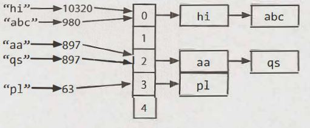
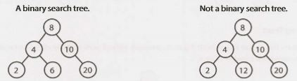
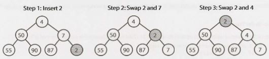
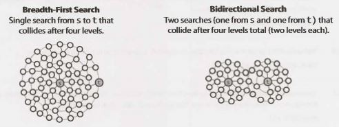
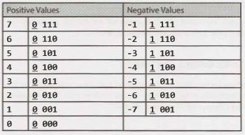
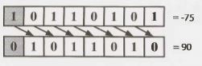
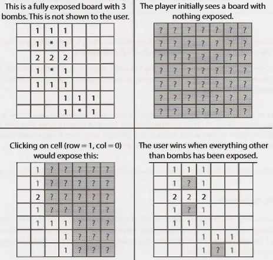
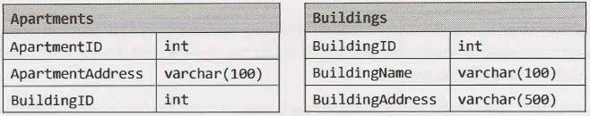

## VIII

### The Offer and  Beyond

Just when you thought  you could sit back and relax after your interviews, now you're faced with the post­ interview stress: Should you accept the offer?  Is it the right one? How do you decline an offer? What about deadlines? We'll handle a few of these issues here and go into more details about how to evaluate an offer, and how to negotiate it.


### Handling Offers and Rejection

Whether you're accepting an offer, declining an offer, or responding to a rejection, it matters what you do.


##### Offer Deadlines and Extensions

When companies extend an offer, there's almost always a deadline attached to it. Usually these deadlines are one to four weeks out. If you're still waiting to hear back from other companies, you can ask for an exten­ sion. Companies will usually try to accommodate this, if possible.


##### Declining  an Offer

Even if you aren't interested in working for this company right now, you might be interested in working for it in a few years. (Or, your contacts might one day move to a more exciting company.)  It's in your best interest to decline the offer on good terms and keep a line of communication open.

When you decline an offer, provide a reason that is non-offensive and inarguable. For example, if you were declining a big company for a startup, you could explain that you feel a startup is the right choice for you at this time. The big company can't suddenly "become" a startup, so they can't argue about your reasoning.


##### Handling Rejection

Getting rejected is unfortunate, but it doesn't mean that you're not a great engineer. Lots of great engineers do poorly, either because they don't "test well" on these sort of interviewers, or they just had an "off" day.

Fortunately, most companies understand that these interviews aren't perfect and many good engineers get rejected. For this reason, companies are often eager to re-interview previously rejected candidate. Some companies will even reach out to old candidates or expedite their application because of their prior perfor­ mance.

When you do get the unfortunate call, use this as an opportunity to build a bridge to re-apply. Thank your recruiter for his time, explain that you're disappointed but that you understand their position, and ask when you can reapply to the company.

You can also ask for feedback from the recruiter. In most cases, the big tech companies won't offer feed­ back, but there are some companies that will. It doesn't hurt to ask a question like, "Is there anything you'd suggest I work on for next time?"


### Evaluating the Offer

Congratulations! You got an offer! And-if you're lucky-you may have even gotten multiple offers. Your recruiter's job is now to do everything he can to encourage you to accept it. How do you know if the company is the right fit for you? We'll go through a few things you should consider in evaluating an offer.


##### The Financial  Package

Perhaps the biggest mistake that candidates make in evaluating an offer is looking too much at their salary. Candidates often look so much at this one number that they wind up accepting the offer that is worse finan­ cially. Salary is just one part of your financial compensation. You should also look at:

- Signing Bonus, Relocation, and Other One Time Perks: Many companies  offer a signing bonus and/or relo­ cation. When comparing offers, it's wise to amortize this cash over three years (or however long you expect to stay).
- Cost ofLiving Difference: Taxes and other cost of living differences can make a big difference in your take­
home pay. Silicon Valley, for example, is 30+% more expensive than Seattle.
- Annual  Bonus: Annual  bonuses at tech companies can range from anywhere from 3% to 30%. Your recruiter might reveal the average annual bonus, but if not, check with friends at the company.
- Stock Options and Grants: Equity compensation can form another big part of your annual compensation.
Like signing bonuses, stock compensation between companies can be compared by amortizing it over three years and then lumping that value into salary.

Remember, though, that what you learn and how a company advances your career often makes far more of a difference to your long term finances than the salary. Think very carefully about how much emphasis you really want to put on money right now.


##### Career Development

As thrilled  as you may be to receive this offer, odds are, in a few years, you'll start thinking about inter­ viewing again. Therefore, it's important that you think right now about how this offer would impact your career path. This means considering the following questions:

- How good does the company's name look on my resume? 
- How much will  I learn? Will  I learn relevant things?
- What is the promotion plan? How do the careers of developers progress?
- If I want to move into management, does this company offer a realistic plan? 
- Is the company or team growing?
- If I do want to leave the company, is it situated near other companies I'm interested in, or will  I need to move?

The final point is extremely important and usually overlooked. If you only have a few other companies to pick from in your city, your career options will be more restricted. Fewer options means that you're less likely to discover really great opportunities.


##### Company Stability

All else being equal, of course stability is a good thing. No one wants to be fired or laid off.

However, all else isn't actually equal. The more stable companies are also often growing more slowly.

How much emphasis you should put on company stability really depends on you and your values. For some candidates, stability should not be a large factor. Can you fairly quickly find a new job? If so, it might  be better to take the rapidly growing  company, even if it's unstable? If you have work visa restrictions or just aren't confident in your ability to find something new, stability might be more important.


##### The Happiness Factor

Last but not least, you should of course consider how happy you will be. Any of the following factors may impact that:

- *The Product:* Many people look heavily at what product they are building, and of course this matters a bit. However, for most engineers, there are more important factor, such as who you work with.
- *Manager and Teammates:* When people say that they love, or hate, their job, it's often because of their teammates and their manager. Have you met them? Did you enjoy talking with them?
- *Company Culture:* Culture is tied to everything from how decisions get made, to the social atmosphere, to how the company is organized. Ask your future teammates how they would describe the culture.
- *Hours:* Ask future teammates about how long they typically work, and figure out if that meshes with your lifestyle. Remember, though, that hours before major deadlines are typically much longer.

Additionally, note that if you are given the opportunity to switch teams easily (like you are at Google and
Facebook), you'll have an opportunity to find a team and product that matches you well.


### Negotiation

Years ago, I signed up for a negotiations class. On the first day, the instructor asked us to imagine a scenario where we wanted to buy a car. Dealership A sells the car for a fixed $20,000-no negotiating.  Dealership B allows us to negotiate. How much would the car have to be (after negotiating) for us to go to Dealership B? (Quick! Answer this for yourself!)

On average, the class said that the car would have to be $750 cheaper. In other words, students were willing to pay $750 just to avoid having to negotiate for an hour or so. Not surprisingly, in a class poll, most of these students also said they didn't  negotiate  their job offer. They just accepted whatever the company gave them.

Many of us can probably  sympathize with this position.  Negotiation  isn't fun for most of us. But still, the financial benefits of negotiation are usually worth it.

Do yourself a favor. Negotiate. Here are some tips to get you started.

- *Just Do It.* Yes,   I know it's scary; (almost) no one likes negotiating.  But it's so, so worth it. Recruiters will not revoke an offer because you negotiated, so you have little to lose. This is especially true if the offer is from a larger company. You probably won't be negotiating with your future teammates.
- *Have a Viable Alternative.* Fundamentally, recruiters negotiate  with you because they're concerned you may not join the company otherwise. If you have alternative options, that will make their concern much more real.
- *Have a Specific "Ask":* It's more effective to ask for an additional  $7000 in salary than to just ask for"more:'After all, if you just ask for more, the recruiter could throw in another $1000 and technically have satis­
fied your wishes.
- *Overshoot:*  In negotiations, people usually don't agree to whatever you demand. It's a back  and  forth conversation. Ask for a bit more than you're really hoping to get, since the company will probably meet you in the middle.
- *Think Beyond Salary:* Companies are often more willing to negotiate on non-salary components, since boosting your salary too much could mean that they're paying you more than your peers. Consider asking for more equity or a bigger signing bonus. Alternatively, you may be able to ask for your reloca­ tion benefits in cash, instead of having  the company  pay directly  for the moving  fees. This is a great avenue for many college students, whose actual moving expenses are fairly cheap.
- *Use Your BestMedium:* Many people will advise you to only negotiate over the phone. To a certain extent, they're right; it is better to negotiate over the phone. However, if you don't feel comfortable on a phone negotiation, do it via email. It's more important that you attempt to negotiate than that you do it via a specific medium.

Additionally, if you're negotiating with a big company, you should know that they often have "levels" for employees, where all employees at a particular level are paid around the same amount. Microsoft has a particularly well-defined system for this. You can negotiate within the salary range for your level, but going beyond that requires bumping up a level. If you're looking  for a big bump,  you'll need  to convince the recruiter and your future team that your experience matches this higher level-a difficult, but feasible, thing to do.


### On the Job

Navigating your career path doesn't end at the interview.  In fact, it's just getting started. Once you actually join a company, you need to start thinking about your career path. Where will you go from here, and how will you get there?

##### Set a Timeline

It's a common story: you join a company, and you're psyched. Everything is great. Five years later, you're still there. And it's then that you realize that these last three years didn't add much to your skill set or to your resume. Why didn't you just leave after two years?

When you're enjoying your job, it's very easy to get wrapped up in it and not realize that your career is not advancing. This is why you should outline your career path before starting a new job. Where do you want to be in ten years? And what are the steps necessary to get there? In addition, each year, think about what the next year of experience will bring you and how your career or your skill set advanced in the last year.

By outlining your path in advance and checking in on it regularly, you can avoid falling into this compla­
cency trap.


##### Build Strong Relationships

When you want to move on to something new, your network will be critical. After all, applying online is tricky; a personal  referral is much better, and your ability to do so hinges on your network.

At work, establish strong relationships with your manager and teammates. When employees leave, keep in touch with them. Just a friendly note a few weeks after their departure will help to bridge that connection from a work acquaintance to a personal acquaintance.

This same approach applies to your personal life. Your friends,  and your friends of friends, are valuable connections. Be open to helping others, and they'll be more likely to help you.


##### Ask for What You Want

While some managers may really try to grow your career, others will take a more hands-off approach. It's up to you to pursue the challenges that are right for your career.

Be (reasonably)  frank about your goals with your manager. If you want to take on more back-end coding projects, say so. If you'd  like to explore more leadership opportunities, discuss how you might be able to do so.

You need to be your best advocate, so that you can achieve goals according to your timeline.


##### Keep Interviewing

Set a goal of interviewing at least once a year, even if you aren't actively looking for a newjob. This will keep your interview  skills fresh, and also keep you in tune with what sorts of opportunities (and salaries) are out there.

If you get an offer, you don't have to take it. It will still build a connection with that company in case you want to join at a later date.


## IX Interview Questions

## 1

### Arrays and Strings


Hopefully, all readers of this book are familiar with arrays and strings, so we won't .bore you with such details. Instead, we'll focus on some of the more common techniques and issues with  these data struc­
tures.

Please note  that  array questions and string questions are often interchangeable.That is, a question that this book states using an array may be asked instead  as a string question, and vice versa.


### Hash Tables

A hash table is a data structure  that maps keys to values for highly efficient  lookup. There are a number of ways of implementing this. Here, we will describe a simple but common implementation.

In this simple implementation,  we use an array of linked lists and a hash code function.  To insert a key
(which might be a string or essentially any other data type) and value, we do the following:

1. First,  compute the key's hash code, which will usually be an int or long. Note that two different keys could  have the same hash code, as there may be an infinite  number of keys and a finite number of ints.

2. Then, map the hash code to an index in the array. This could be done with something like hash(key)%   array_length. Two different  hash codes could, of course, map to the same index.

3. At this index, there is a linked list of keys and values. Store the key and value in this index. We must use a linked list because of collisions: you could have two different keys with the same hash code, or two different hash codes that map to the same index.

To retrieve the value pair by its key, you repeat this process. Compute the hash code from the key, and then compute the index from the hash code. Then, search through  the linked list for the value with this key.

If the number of collisions is very high, the worst case runtime  is O(N), where  N is the number of keys. However, we generally assume a good implementation that keeps collisions to a minimum,  in which case the lookup time is O(1).



Alternatively, we can implement the hash table with a balanced binary search tree. This gives us an O(log N) lookup time. The advantage of this is potentially using less space, since we no longer allocate a large array. We can also iterate through the keys in order, which can be useful sometimes.


### Arraylist & Resizable Arrays

In some languages, arrays (often called lists in this case) are automatically resizable. The array or list will grow as you append items. In other languages, like Java, arrays are fixed length. The size is defined when you create the array.

When you need an array-like data structure that offers dynamic resizing, you would usually use an Arraylist. An Arraylist is an array that resizes itself as needed while still providing O(1) access. A typical implementa­ tion is that when the array is full, the array doubles in size. Each doubling takes 0(n) time, but happens so rarely that its amortized insertion time is still O(1).

```java
1     Arraylist<String>  merge(String[]  words,   String[] more)  {
2         Arraylist<String> sentence=  new Arraylist<String>();
3         for (String w  :   words)  sentence.add(w);
4         for (String w:  more)  sentence.add(w);
5         return sentence;
6        }
```

This is an essential data structure for interviews. Be sure you are comfortable with dynamically resizable arrays/lists in whatever language you will be working with. Note that the name of the data structure as well as the "resizing factor" (which is 2 in Java) can vary.

*Why is the amortized insertion runtime O(1)?*

Suppose you have an array of size N. We can work backwards to compute how many elements we copied at each capacity increase. Observe that when we increase the array to K elements, the array was previously
half that size. Therefore, we needed to copy '.Yi  elements.

```
final  capacity increase  :  n/2  elements to  copy
previous capacity increase:  n/4  elements to  copy
previous capacity increase:  n/8  elements to  copy 
previous capacity increase:  n/16  elements to  copy
....
second  capacity increase :  2 elements to  copy 
first capacity increase   :  1  element to  copy
```

> Therefore, the total number of copies to insert N elements is roughly N/2 + N/4 + N/8 + ... + 2 + 1, which is just less than N.


If the sum of this series isn't obvious to you, imagine this: Suppose you have a kilometer-long walk to the store. You walk 0.5 kilometers, and then 0.25 kilometers, and then 0.125 kilometers, and so on. You will never exceed one kilometer (although you'll get very close to it).


Therefore, inserting N elements takes O(N) work total. Each insertion is O(1) on average, even though some insertions take O(N) time in the worst case.


### StringBuilder

Imagine you were concatenating a list of strings, as shown below. What would the running time of this code be? For simplicity, assume that the strings are all the same length (call this x) and that there are n strings.

```java
1      String  joinWords(String[]  words) {
2           String sentence =  "";
3           for (String w:  words)  {
4                 sentence = sentence +  w;
5           }
6           return sentence;
7      }
```

On each concatenation,a new copy of the  string is created, and the  two strings are copied over,character by character. The first iteration requires us to copy  x characters. The second iteration requires copying 2x characters.T he third iteration requires 3x,and so on.The total time therefore isO(x   +  2x   +   . . . +  nx). This reduces toO(xN²).

> Why is itO(xN²)?Because1  +  2   +  ... +  n equals n(n+1)/2, or O(N² ).

StringBuilder can help  you avoid.this problem. StringBuilder simply creates a resizable array of all the  strings,  copying them back to a string only when necessary.

```java
1      String  joinWords(String[]  words) {
2           StringBuilder  sentence    new  StringBuilder();
3           for (String w   :   words)  {
4                 sentence.append(w);
5           }
6           return sentence.toString();
7      }
```

A good exercise to practice strings,arrays,and general data structures is to implement your own  version of StringBuilder, HashTable and ArrayList.

**Additional Reading:** HashTable Collision Resolution (pg 636), Rabin-Karp Substring Search (pg 636).

---
Interview Questions
---

1.1 Is Unique: Implement an algorithm to determine if a string has  all unique characters. What  if you cannot use additional data structures?

Hints:  #44, #7 7 7, #732

1.2 Check  Permutation: Given  two  strings,write a method to  decide if one  is a permutation of the other.
Hints: #7, #84, #722, #737


1.3 URLify: Write a method to replace all spaces in a string with '%20'. You may assume that the  string has  sufficient space at the  end to hold  the  additional characters,and that you are given  the  "true" length of the  string.  (Note:  If implementing in Java,please use  a character array  so that you can perform this operation in place.)

EXAMPLE

Input:           "Mr   John  Smith        ",   13

Output:     "Mr%20John%20Smith"

Hints: #53, #118

1.4 Palindrome Permutation: Given a string, write a function to check if it is a permutation  of a palin­ drome. A palindrome is a word or phrase that is the same forwards and backwards. A permutation is a rearrangement of letters. The palindrome does not need to be limited to just dictionary words.

EXAMPLE

Input:         Tact  Coa

Output:   True  (permutations:   "taco  cat", "atco  eta",   etc.)

Hints:#106, #121, #134, #136

 
1.5 One  Away:  There are three types of edits that can be performed on strings: insert a character, remove a character, or replace a character. Given two strings, write a function to check if they are one edit (or zero edits) away.

EXAMPLE

pale,    ple    ->  true 

pales,   pale  ->  true 

pale,    bale  ->  

true pale,    bake ->  false Hints:#23, #97, #130

1.6 String  Compression: Implement a method to perform basic string compression using the counts of repeated characters. For example, the string aabcccccaaa would become a2blc5a3. If the "compressed" string would not become smaller than the original string, your method should return the original string. You can assume the string has only uppercase and lowercase letters (a - z).

Hints: #92, #110 


1.7 Rotate Matrix: Given an image represented by an NxN  matrix, where each pixel in the image is 4 bytes, write a method to rotate the image by 90 degrees. Can you do this in place?

Hints:#51, #100


1.8 	Zero  Matrix: Write an algorithm such that if an element in an MxN matrix is 0, its entire row and column are set to 0.
Hints:#17, #74, #702


1.9 String Rotation:Assumeyou have a method isSubstringwhich checks if one word is a substring of another. Given two strings, sl and s2, write code to check if s2 is a rotation of sl using only one call to isSubstring(e.g.,"waterbottle"is a rotation of"erbottlewat").

Hints: #34, #88, # 704

Additional Questions: Object-Oriented Design (#7.12). Recursion (#8.3), Sorting and Searching (#10.9), C++ (#12.11), Moderate Problems (#16.8, #16.17, #16.22), Hard Problems (#17.4, #17.7, #17.13, #17.22, #17.26).

Hints start on page 653.


## 2 Linked  Lists

A linked list is a data structure that represents a sequence of nodes. In a singly linked list, each node points to the next node in the linked list. A doubly linked list gives each node pointers to both the next and the previous node.

The following diagram depicts a doubly linked list:


Unlike an array, a linked list does not provide constant time access to a particular "index" within the list. This means that if you'd like to find the Kth element in the list, you will need to iterate through K elements.

The benefit of a linked list is that you can add and remove items from the beginning of the list in constant time. For specific applications, this can be useful.


### Creating a Linked List

The code below implements a very basic singly linked list.

```java
1 	class Node {
2 		Node next=  null; 
3 		int data;
4 		
5 		public  Node(int d)  {
6 			data=  d;
7 		}
8		
9		void  appendToTail(int d)  { 
10			Node end=  new Node(d);
11			Node n  =  this;
12			while   (n.next  != null) {
13				n  =  n.next;
14			}
15			n.next=  end; 
16		}
17	}
``` 

In this implementation, we don't have a LinkedList data structure. We access the linked list through a reference to the head Node of the linked list. When you implement the linked list this way, you need to be a bit careful. What if multiple objects need a reference to the linked list, and then the head of the linked list changes? Some objects might still be pointing to the old head.

We could, if we chose, implement a LinkedList class that wraps the Node class. This would essentially just have a single member variable: the head Node. This would largely resolve the earlier issue.

Remember that when you're discussing a linked list in an interview, you must understand  whether it is a singly linked list or a doubly linked list.


### Deleting a Node from a Singly Linked List

Deleting a node from a linked list is fairly straightforward. Given a node n, we find the previous node prev and set prev.next equal to n. next. If the list is doubly linked, we must also update  n. next to set n. next. prev equal to n. prev. The important things to remember are (1) to check for the null pointer and (2) to update the head or tail pointer as necessary.

Additionally,  if you implement this code in C, C++ or another  language that requires the developer to do memory management, you should consider if the removed node should be deallocated.

```java
1     Node deleteNode(Node head,   int d)  {
2          Node n  =  head;
3
4          if (n.data == d)  {
5               return head.next; /*moved  head*/
6          }
7
8         while   (n.next  != null)  {
9               if  (n.next.data == d)  {
10                  n.next = n.next.next;
11                  return head;   /*   head  didn't change*/
12             }
13			   n = n.next;
14        }
15        return head;
16   }
```

### The "Runner"Technique

The "runner" (or second pointer) technique  is used in many linked list problems. The runner technique means that you iterate through the linked list with two pointers simultaneously, with one ahead of the other. The "fast" node might be ahead by a fixed amount, or it might be hopping multiple nodes for each one node that the"slow" node iterates through.

For example, suppose you had a linked list a1 - >a2 ->....->an -> b1 -> b2 ->...->bn  and you wanted to rearrange it into a1 ->b1 ->a2 - >b2 -> ...- >an - >bn. You do not know the length of the linked list (but you do know that the length is an even number).

You could have one pointer pl (the fast pointer) move  every two elements for every one move that p2 makes. When pl hits the end of the linked list, p2 will be at the midpoint. Then, move pl back to the front and begin"weaving" the elements. On each iteration, p2 selects an element and inserts it after pl.


### Recursive  Problems

A number of linked list problems rely on recursion. If you're having trouble solving a linked list problem, you should explore if a recursive approach will work. We won't go into depth on recursion here, since a later chapter is devoted to it.

However, you should remember that recursive algorithms take at least O (n)  space, where n is the depth of the recursive call. All recursive algorithms can be implemented iteratively, although they may be much more complex.

---
Interview Questions
---

2.1   Remove Dups! Write code to remove duplicates from an unsorted linked list.

FOLLOW UP
How would you solve this problem if a temporary  buffer is not allowed?
Hints: #9, #40
...................................................      pg208

2.2    Return Kth to Last:  Implement an algorithm to find the kth to last element of a singly linked list.

Hints:#8, #25, #41, #67, #126


2.3 Delete  Middle  Node:  Implement an algorithm to delete a node in the middle (i.e., any node  but the first and last node, not necessarily the exact middle) of a singly linked  list, given  only access to that node.

EXAMPLE

lnput:the node c from the linked lista->b->c->d->e->f

Result: nothing is returned, but the new linked list looks like a->b->d->e->f

Hints:#72

2.4 Partition: Write code to partition  a linked list around a value x, such that all nodes less than x come before all nodes greater than or equal to x. If x is contained within the list, the values of x only need to be after the elements less than x (see below). The partition element x can appear anywhere in the "right partition"; it does not need to appear between the left and right partitions.

EXAMPLE 

Input: 3->5->8->5->10->2->1 [partition = 5]

Output: 3->1->2->10->5->5->8

Hints: #3, #24

2.5 	Sum Lists: You have two numbers represented by a linked list, where each node contains a single digit.The digits are stored in reverse order, such that the 1 's digit is at the head of the list. Write a function that adds the two numbers and returns the sum as a linked list.

EXAMPLE

Input:(7->  1  -> 6) + (5 ->  9  ->  2).That is,617  +  295. Output: 2  ->  1  ->  9. That is, 912.

FOLLOW UP

Suppose the digits are stored in forward order. Repeat the above 
problem. 

EXAMPLE 

Input:(6  ->  1  ->  7)   + (2 ->  9  ->  5).That is,617  +  295. 

Output: 9  ->   1  ->  2. That is, 912.

Hints: #7, #30, #71, #95, #109


2.6     Palindrome: Implement a function to check if a linked list is a palindrome.

Hints:#5, #13, #29, #61, #101


2.7 Intersection: Given two (singly) linked lists, determine if the two lists intersect. Return the inter­ secting node. Note that the intersection is defined based on reference, not value.That is, if the kth node of the first linked list is the exact same node (by reference)  as the jth node of the second linked list, then they are intersecting.

Hints:#20, #45, #55, #65, #76, #93, #111, #120, #129


2.8	Loop  Detection: Given a circular linked list, implement an algorithm that returns the node at the beginning of the loop.

DEFINITION

Circular linked list: A (corrupt)  linked list in which  a node's next pointer points to an earlier node, so as to make a loop in the linked list.

EXAMPLE

Input:        A   ->  B   ->  C   ->  D   ->  E   ->  C [the same C as earlier] 

Output:      C

Hints: #50, #69, #83, #90


Additional Questions:Trees and Graphs (#4.3),  Object-Oriented Design (#7.12),  System Design and Scal­ability (#9.5), Moderate Problems (#16.25), Hard Problems (#17.12).

Hints start on page 653.


## 3 Stacks and Queues

Questions on stacks and queues will be much easier to handle if you are comfortable with the ins and outs of the data structure. The problems can be quite tricky, though. While some problems may be
slight modifications on the original data structure, others have much more complex challenges.


### Implementing a Stack

The stack data structure is precisely what it sounds like: a stack of data. In certain types of problems, it can be favorable to store data in a stack rather than in an array.

A stack uses LIFO (last-in  first-out) ordering. That is, as in a stack of dinner plates, the most recent item added to the stack is the first item to be removed.

It uses the following operations:

- pop(): Remove the top item from the stack. 
- push(itern): Add an item to the top of the stack. 
- peek(): Return the top of the stack.
- is Empty(): Return true if and only if the stack is empty.

Unlike an array, a stack does not offer constant-time access to the ith item. However, it does allow constant­
time adds and removes, as it doesn't require shifting elements around.

We have provided simple sample code to implement a stack. Note that a stack can also be implemented using a linked list, if items were added and removed from the same side.

```java
1    public class MyStack<T> {
2          private static  class StackNode<T>   {
3              private T data;
4               private StackNode<T> next;
5
6               public StackNode(T  data)  {
7                    this.data = data;
8                 }
9             }
16
11        private StackNode<T> top;
12
13       public T  pop()   {
14             if (top == null) throw  new EmptystackException();
15             T item   =  top.data;
16				top=  top.next;
17				return item; 
18        }
19
20 		  public void  push(T  item) {
21 		  	StackNode<T> t=    new StackNode<T>(item);
22 		  	t.next=    top;
23 		  	top=  t;
24 		  }
25 
26		  public T  peek()  {
27		  	if (top==    null) throw  new EmptyStackException();
28		  	return top.data;
29		  }
30
31		public boolean   isEmpty()  {
32			return top==    null;
33		} 
34   }
```


One case where stacks are often useful is in certain recursive algorithms. Sometimes you need to push temporary data onto a stack as you recurse, but then remove them as you backtrack (for example, because the recursive check failed).  A stack offers an intuitive way to do this.

A stack can also be used to implement a recursive algorithm iteratively. (This is a good exercise! Take a simple recursive algorithm and implement it iteratively.)


### Implementing a Queue

A queue  implements  FIFO (first-in first-out) ordering. As in a line or queue  at a ticket stand, items are removed from the data structure in the same order that they are added.

It uses the operations:

- add(itern): Add an item to the end of the list. 
- remove(): Remove the first item in the list. 
- peek ( ) : Return the top of the queue.
- is Empty(): Return true if and only if the queue is empty.

A queue can also be implemented  with a linked list. In fact, they are essentially the same thing, as long as items are added and removed from opposite sides.

```java
1     public class MyQueue<T>   {
2          private static  class QueueNode<T>   {
3               private T  data;
4               private QueueNode<T>  next;
5
6                public QueueNode(T data) {
7                          this.data =  data;
8                 }
9          }
10
11        private QueueNode<T>  first;
12        private QueueNode<T>  last;
13
14           public void  add(T  item) {
15             QueueNode<T>  t =  new QueueNode<T>(item);
16             if (last !=          null) {
17             	last.next=  t;
18             }
19             last = t;
20             if (first== null) {
21             	first=    last;
22             } 
23        }
24
25		  public T remove()   { 
26		  	if (first==    null) throw  new NoSuchElementException(); 
27		  	T data=    first.data;  
28		  	first=    first.next;  
29		  	if (first == null) { 
30		  		last=    null; 
31		  	} 
32		  	return data; 
33		  } 
34		   
35		  public T peek()  { 
36		  	if (first==    null) throw  new NoSuchElementException(); 
37		  	return first.data; 
38		  } 
39		   
40		  public  boolean isEmpty() { 
41		  	return first==    null; 
42		  }  
43    }
```

It is especially easy to mess up the updating of the first and last nodes in a queue. Be sure to double check this.

One place where queues are often used is in breadth-first search or in implementing a cache.
In breadth-first search, for example, we used a queue to store a list of the nodes that we need to process. Each time we process a node, we add its adjacent nodes to the back of the queue. This allows us to process nodes in the order in which they are viewed.

---
Interview Questions
---

3.1         Three in One:  Describe how you could use a single array to implement three stacks.

Hints: #2, #72, #38, #58


3.2 	Stack Min: How would you design a stack which, in addition to push and pop, has a function min which returns the minimum element? Push, pop and min should all operate in O(1) time.

Hints:#27, #59, #78


3.3         Stack of Plates: Imagine a (literal) stack of plates. If  the stack gets too high, it might topple.
Therefore, in real life, we would likely start a new stack when the previous stack exceeds some threshold. Implement a data strucutre SetOfStacks that mimics this. SetOfStacks should be composed of several stacks and should create a new stack once the previous one exceeds capacity. SetOfStacks. push() and SetOfStacks. pop() should behave identically to a single stack (that is, pop() should return the same values as it would  if there were just a single stack).

FOLLOW UP

Implement a function popAt(int  index) which performs a pop operation on a specific sub-stack.

Hints:#64, #81


3.4  Queue via  Stacks: Implement a MyQueue class which implements a queue using two stacks.

Hints: #98, #114........_  -·--· --·········-·-- -------  pg 236

3.5 	Sort Stack: Write a program to sort a stack such that the smallest items are on the top. You can use an additional temporary stack, but you may not copy the elements into any other data structure (such as an array). The stack supports the following operations: push, pop, peek, and isEmpty.

Hints:# 15, #32, #43 ..................P9 237

3.6 	Animal Shelter: An animal shelter, which holds only dogs and cats, operates on a strictly"first in, first out" basis. People must adopt either the"oldest" (based on arrival time) of all animals at the shelter, or they can select whether they would prefer a dog or a cat (and will receive  the oldest animal of that type). They cannot select which specific animal they would like. Create the data structures to maintain this system and implement operations such as enqueue, dequeueAny, dequeueDog, and dequeueCat. You may use the built-in Linkedlist data structure.

Hints:#22, #56, #63................                          pg 239

Additional Questions:  Linked Lists (#2.6), Moderate  Problems (#16.26), Hard Problems (#17.9). Hints start on page 653.


## 4 Trees and Graphs

Many interviewees find tree and graph problems to be some of the trickiest. Searching a tree is more complicated than searching in a linearly organized data structure such as an array or linked list. Addi­ tionally, the worst case and average case time may vary wildly, and we must evaluate both aspects of any algorithm. Fluency in implementing a tree or graph from scratch will prove essential.

Because most people are more familiar with trees than graphs (and they're a bit simpler), we'll discuss trees first. This is a bit out of order though, as a tree is actually a type of graph.


> Note: Some of the terms in this chapter can vary slightly across different textbooks and other sources.  If you're  used  to a different definition, that's fine. Make sure to clear up any ambiguity with your interviewer.


### Types of Trees

A nice way to understand a tree is with a recursive explanation. A tree is a data structure composed of nodes.

- Each tree has a root node. (Actually, this isn't strictly necessary in graph theory, but it's usually how we use trees in programming, and especially programming  interviews.)
- The root node has zero or more child nodes.
- Each child node has zero or more child nodes, and so on.

The tree cannot contain cycles. The nodes may or may not be in a particular order, they could have any data type as values, and they may or may not have links back to their parent nodes.

A very simple class definition for Node is:

```
1      class  Node {
2          publi c String  name;
3          public  Node[] children;
4     }
```

You might also have a Tree class to wrap this node. For the purposes of interview questions, we typically do not use a Tree class. You can if you feel it makes your code simpler or better, but it rarely does.

```
1     class  Tree {
2       public  Node root;
3       }
```

Tree and graph questions are rife with ambiguous details and incorrect assumptions. Be sure to watch out for the following issues and seek clarification when necessary.


##### Trees vs. Binary Trees

A binary tree is a tree in which each node has up to two children. Not all trees are binary trees. For example, this tree is not a binary tree. You could call it a ternary tree.


There are occasions when you might have a tree that is not a binary tree. For example, suppose you were using a tree to represent  a bunch  of phone  numbers.  In this case, you might  use a 10-ary tree, with each node  having  up to 10 children (one for each digit).

A node is called a"leaf" node if it has no children.


##### Binary Tree vs. Binary Search Tree

A binary search tree is a binary tree in which every node fits a specific ordering property: all left descendents  <= n < all right descendents. This must be true for each node n.


> The definition of a binary search tree can vary slightly with respect to equality. Under some defi­ nitions, the tree cannot have duplicate values. In others, the duplicate values will be on the right or can be on either side. All are valid definitions, but you should clarify this with your interviewer.


Note that this inequality must be true for all of a node's descendents, not just its immediate children. The following tree on the left below is a binary search tree. The tree on the right is not, since  12 is to the left of 8.



When given a tree question, many candidates assume the interviewer means a binary search  tree. Be sure to ask. A binary search tree imposes the condition  that, for each node, its left descendents are less than or equal to the current node, which is less than the right descendents.

##### Balanced vs. Unbalanced

While many trees are balanced, not all are. Ask your interviewer for clarification here. Note that balancing a tree does not mean the left and right subtrees are exactly the same size (like you see under"perfect binary trees" in the following diagram).

One way to think about it is that a "balanced" tree really means something more like "not terribly imbal­ anced:' It's balanced enough to ensure 0( log   n) times for insert and find, but it's not necessarily as balanced as it could be.

Two common types of balanced trees are red-black trees (pg 639) and AVL  trees (pg 637). These are discussed in more detail in the Advanced Topics section.


##### Complete Binary Trees

A complete binary tree is a binary tree in which every level of the tree is fully filled, except for perhaps the last level. To the extent that the last level is filled, it is filled left to right.


##### Full Binary Trees

A full binary tree is a binary tree in which every node has either zero or two children. That  is, no nodes have only one child.


##### Perfect Binary Trees

A perfect binary tree is one that is both full and complete. All leaf  nodes will be at the same level, and this level has the maximum number of nodes.


Note that perfect trees are rare in interviews and in real life, as a perfect tree must have exactly 2^k -  1 nodes
(where k is the number of levels). In an interview, do not assume a binary tree is perfect.


### Binary Tree Traversal

Prior to your  interview, you  should be  comfortable implementing in-order, post-order, and pre-order traversal. The most common of these is in-order traversal.

In-Order Traversal

In-order traversal means to "visit" (often,  print)  the left branch, then the current node, and  finally, the right branch.

```java
1      void  inOrderTraversal(TreeNode  node) {
2           if (node!=  null) {
3                 inOrderTraversal(node.left);
4                 visit(node);
5                 inOrderTraversal(node.right);
6          }
7      }
```

When performed on a binary  search tree, it visits the nodes in ascending order (hence the name"in-order").


Pre-Order Traversal

Pre-order traversal visits the current node before its child nodes (hence the name "pre-order").

```java
1      void  preOrderTraversal(TreeNode  node)  {
2           if (node!=  null) {
3                 visit(node);
4                 preOrderTraversal(node.left);
5                 preOrderTraversal(node.right);
6            }
7       }
```

In a pre-order traversal, the root is always the first node visited.


Post-Order Traversal

Post-order traversal visits the current node after  its child nodes (hence the name"post-order").

```java
1      void  postOrderTraversal(TreeNode  node)  {
2           if (node!=  null) {
3                 postOrderTraversal(node.left);
4                 postOrderTraversal(node.right);
5                 visit(node);
6           }
7      }
```

In a post-order traversal, the root is always the last node visited.


### Binary Heaps (Min-Heaps and Max-Heaps)

We'll just discuss min-heaps here. Max-heaps are essentially equivalent, but the elements are in descending order rather than ascending order.

A min-heap is a complete binary  tree (that is, totally filled other than the rightmost elements on the last level) where each node is smaller than its children. The root, therefore, is the minimum element in the tree.


We have two key operations on a min-heap: insert and extract_min.

*Insert*

When we insert into a min-heap, we always start by inserting the element at the bottom. We insert at the rightmost spot so as to maintain the complete tree property.

Then, we "fix"the tree by swapping the new element with its parent, until we find an appropriate spot for the element. We essentially bubble up the minimum element.



This takes O( log n)  time, where n is the number of nodes in the heap.

*Extract Minimum Element*

Finding the minimum element of a min-heap is easy: it's always at the top. The trickier part is how to remove it. (In fact, this isn't that tricky.)

First, we remove the minimum element and swap it with the last element in the heap (the bottommost, rightmost element). Then, we bubble down this element, swapping it with one of its children until the min­ heap property is restored.

Do we swap it with the left child or the right child? That depends  on their values. There's no inherent ordering between  the left and right element, but you'll need to take the smaller one in order to maintain the min-heap ordering.
 


This algorithm will also take 0( log n)  time.


### Tries (Prefix Trees)

A trie (sometimes called a prefix tree) is a funny data structure. It comes up a lot in interview questions, but algorithm textbooks don't spend much time on this data structure.

A trie is a variant of an n-ary tree in which characters are stored at each node. Each path down the tree may represent a word.
The * nodes (sometimes called "null nodes") are often used to indicate complete words. For example, the fact that there is a * node under MANY indicates that MANY is a complete word. The existence of the MA path indicates there are words that start with MA.

The actual implementation of these * nodes might be a special type of child (such as a TerminatingTrieNode, which  inherits  from  TrieNode).  Or, we  could  use  just  a  boolean  flag terminates within the "parent" node.

A node in a trie could have anywhere from 1   through  ALPHABET_SIZE +   1 children (or, 0 through ALPHABET_SIZE if a boolean flag is used instead of a* node).


Very commonly, a trie is used to store the entire (English) language for quick prefix lookups. While a hash table can quickly look up whether a string is a valid word, it cannot tell us if a string is a prefix of any valid words. A trie can do this very quickly.


> How quickly? A trie can check if a string is a valid prefix in O(K) time, where K is the length of the string. This is actually the same runtime as a hash table will take. Although we often refer to hash table lookups as being O(1) time, this isn't entirely true. A hash table must read through all the characters in the input, which takes O(K) time in the case of a word lookup.


Many problems involving lists of valid words leverage a trie as an optimization. In situations when we search through the tree on related prefixes repeatedly (e.g., looking up M, then MA, then MAN, then MANY), we might pass around a reference to the current node in the tree. This will allow us to just check if Y is a child of MAN, rather than starting from the root each time.


### Graphs

A tree is actually a type of graph, but not all graphs are trees. Simply put, a tree is a connected graph without cycles.

A graph is simply a collection of nodes with edges between (some of) them.

- Graphs can be either directed (like the following graph) or undirected. While directed edges are like a one-way street, undirected edges are like a two-way street.
- The graph might consist of multiple isolated subgraphs. If there is a path between every pair of vertices, it is called a "connected graph:'
- The graph can also have cycles (or not). An "acyclic graph" is one without cycles. 

Visually, you could draw  a graph like this:


In terms of programming, there are two common ways to represent a graph.


##### Adjacency List

This is the  most common way to represent a graph. Every vertex  (or node) stores a list of adjacent vertices. In an undirected graph, an edge like (a,  b) would be stored twice: once in a's adjacent vertices and once in b's adjacent vertices.

A simple class definition for a graph node could look essentially the same as a tree node.

```java
1      class Graph   {
2           public  Node[]   nodes; 
3      }
4
5      class  Node  {
6           public String  name;
7           public  Node[] children;
8      }
```

The Graph class is used because, unlike in a tree, you can't necessarily reach all the nodes from a single node.

You don't necessarily need any  additional classes to  represent a graph. An array  (or a hash table) of lists (arrays, arraylists,  linked  lists, etc.) can store the adjacency list. The graph above could be represented as:

```
0:   1
1:   2
2:   0,  3
3:   2
4:   6
5:   4
6:   5
```

This is a bit more compact, but it isn't quite as clean. We tend to use node classes unless there's a compelling reason not  to.

##### Adjacency Matrices

An adjacency matrix  is an NxN boolean matrix  (where N is the  number of nodes), where a true value  at matrix[i][j] indicates an edge from node i to node j. (You can also use an integer matrix with Os and
1 s.)

In an undirected graph, an adjacency matrix will be symmetric. In a directed graph, it will not  (necessarily) be.


The same graph algorithms that are used on adjacency lists (breadth-first search, etc.) can be performed with adjacency matrices, but they may be somewhat less efficient. In the adjacency list representation, you can easily iterate through the neighbors of a node. In the adjacency matrix representation, you will need to iteratethrough all the nodes to identify a node's neighbors.


### Graph Search

The two most common ways to search a graph are depth-first search and breadth-first search.

In depth-first search (DFS), we start at the root (or another arbitrarily selected node) and explore each branch completely before moving on to the next branch. That is, we go deep first (hence the name depth­ first search) before we go wide.

In breadth-first search (BFS), we start at the root (or another arbitrarily selected node) and explore each neighbor before going on to any of their children. That is, we go wide (hence breadth-first search) before we go deep.

See the below depiction of a graph and its depth-first and breadth-first search (assuming neighbors are iterated in numerical order).


Breadth-first search and depth-first search tend to be used in different scenarios. DFS is often preferred if we want to visit every node in the graph. Both will work just fine, but depth-first search is a bit simpler.

However,  if we want to find the shortest path (or just any path) between two nodes, BFS is generally better. Consider representing all the friendships in the entire world in a graph and trying to find a path of friend­ ships between Ash andVanessa.

In depth-first search, we could take a path like Ash  ->  Brian  ->    Carleton   ->   Davis   ->   Eric
->  Farah  ->  Gayle   ->  Harry  ->  Isabella ->  John·->  Kari... and thenfind ourselves very far away. We could go through most of the world without realizing that, in fact,Vanessa is Ash's friend. We will still eventually find the path, but it may take a long time. It also won't find us the shortest path.

In breadth-first search, we would stay close to Ash for as long as possible. We might iterate through many of Ash's friends, but we wouldn't go to his more distant connections until absolutely necessary. lfVanessa is Ash's friend, or his friend-of-a-friend, we'll find this out relatively quickly.

*Depth-First Search (DFS)*

In DFS, we visit a node a and then iterate through each of a's neighbors. When visiting a node b that is a neighbor of a, we visit all of b's neighbors before going on to a's other neighbors. That is, a exhaustively searches b's branch before any of its other neighbors.

Note that pre-order and other forms of tree traversal are a form of DFS. The key difference is that when implementing this algorithm for a graph, we must check if the node has been visited. If we don't, we risk getting stuck in an infinite loop.

The pseudocode below implements DFS.

```java
1     void  search(Node  root) {
2          if  (root== null) return;
3          visit(root);
4          root.visited=    true;
5          for each  (Node n in root.adjacent) {
6               if (n.visited == false) {
7                    search(n);
8                  }
9            }
10   }
```

*Breadth-First Search (BFS)*

BFS is a bit less intuitive, and many interviewees struggle with the implementation unless they are already familiar with it. The main tripping point is the (false) assumption that  BFS is recursive. It's not. Instead, it uses a queue.

In BFS, node a visits each of a's neighbors before visiting any of their neighbors. You can think of this as searching level by level out from a. An iterative solution involving a queue usually works best.

```java
1     void  search(Node  root) {
2          Queue queue  =  new Queue();
3          root.marked=  true;
4          queue.enqueue(root);  // Add to the   end  of  queue
5
6          while   (!queue.isEmpty())  {
7               Node r=    queue.dequeue();  // Remove  from the   front of  the   queue
8               visit(r);
9               foreach (Node n in r.adjacent) {
10                  if (n.marked==    false) {
11                       n.marked=    true;
12                       queue.enqueue(n);
13                   }
14             }
15         }
16   }
```

If you are asked to implement BFS, the key thing to remember is the use of the queue. The rest of the algo­
rithm flows from this fact.

*Bidirectional Search*

Bidirectional search is used to find the shortest path between  a source and destination  node. It operates by essentially running two simultaneous breadth-first searches, one from each node. When their searches collide, we have found a path.



To see why this is faster, consider  a graph  where every node has at most  k adjacent nodes and the shortest path from node s to nodet has length d.

- In traditional breadth-first search, we would  search up to k nodes in the first "level" of the search. In the second level, we would  search up to k nodes for each of those first k nodes, so k2 nodes total (thus far). We would do this d times, so that's 0( kd) nodes.
- In bidirectional search, we have two searches that collide after approximately d/2 levels (the midpoint of the path). The search from s visits approximately k^(d/2), as does the search fromt.That's approximately 2 k^(d/2), or O(k^(d/2)), nodes total.

This might seem like a minor  difference,  but it's not. It's huge. Recall that tional search is actually faster by a factor of kd12.

Put another way: if our system could only support searching "friend of friend" paths in breadth-first search, it could now likely support "friend of friend of friend of friend" paths. We can support paths that are twice as long.

**Additional Reading:** Topological Sort (pg 632), Dijkstra's Algorithm  (pg 633), AVL Trees (pg 637), Red­ BlackTrees (pg 639).

---
Interview Questions
---

4.1 	Route  Between Nodes:  Given a directed graph, design an algorithm to find out whether there is a route between two nodes.

Hints:#127-·-·-·--  _ ......      pg 241

4.2      Minimal Tree: Given a sorted (increasing order) array with unique integer elements, write an algo­
rithm to create a binary search tree with minimal height.

Hints: #79, #73, #776 _     pg242

4.3 List of Depths: Given a binary tree, design an algorithm which creates a linked list of all the nodes at each depth (e.g., if you have a tree with depth  D, you'll have D linked lists).

Hints: #107, #123, #135 ·······                          pg 243

4.4 	Check Balanced: Implement a function to check if a binary tree is balanced. For the purposes of this question, a balanced tree is defined to be a tree such that the heights of the two subtrees of any node never differ by more than one.

Hints:#21, #33, #49, #105, #124

 
4.5   Validate BST: Implement a function to check  if a binary tree is a binary search tree.

Hints: #35, #57, #86, #113, #128 ...     .... pg 

4.6 	Successor: Write an algorithm to find the "next" node (i.e., in-order successor) of a given node in a binary search tree. You may assume that each node has a link to its parent.

Hints: #79, #91 ..pg 248

4.7 	Build Order:  You are given a list of projects and a list of dependencies (which is a list of pairs of projects, where the second project is dependent on the first project). All of a project's dependencies must be built before the project  is. Find a build order that will allow the projects to be built. If there is no valid build order, return an error.

EXAMPLE Input:
   projects:  a, b,   c,  d,   e, f
   dependencies: (a,  d),  (f,  b),  (b,   d),  (f,  a),  (d,   c) 

Output: f,  e, a, b,   d,   c

Hints: #26, #47, #60, #85, #125, #133


4.8	First Common Ancestor: Design an algorithm and write code to find the first common ancestor of two nodes in a binary tree. Avoid storing additional nodes in a data structure. NOTE: This  is not necessarily a binary search tree.

Hints: #10, #16, #28, #36, #46, #70, #80, #96 ... .   p9 257

4.9	BST Sequences: A binary  search tree was created by traversing through an array from left to right and inserting each element. Given a binary search tree with distinct elements, print all possible arrays that could have led to this tree.

EXAMPLE 

Input:


Output: {2,   1,   3}, {2,   3,   1}

Hints: #39, #48, #66, #82

4.1O     Check Subtree: Tl and T2 are two very large binary trees, with Tl much bigger than T2. Create an algorithm to determine if T2 is a subtree of Tl.

A tree T2 is a subtree of Tl if there exists a node n in Tl such that the subtree of n is identical to T2. That is, if you cut off the tree at node n, the two trees would be identical.

Hints:#4, #11, #18, #31, #37     ......... 265

4.11 	Random Node:  You  are implementing a binary  tree class from scratch which,  in addition  to insert, find, and delete, has a method getRandomNode()  which returns a random node from  the  tree.  All nodes should be equally likely to be chosen. Design and implement an algorithm for getRandomNode,  and explain how you would implement the rest of the methods.

Hints: #42, #54, #62, #75, #89, #99, #112, #119


4.12 	Paths  with  Sum: You are given a binary tree in which each node contains an integer value (which might be positive or negative). Design an algorithm to count the number of paths that sum to a given value. The path does not need to start or end at the root or a leaf, but it must go downwards (traveling only from parent nodes to child nodes).

Hints:#6, #14, #52, #68, #77, #87, #94, #103, #108, #115

Additional Questions:  Recursion (#8.10), System Design and Scalability (#9.2, #9.3), Sorting and Searching (#10.10), Hard Problems (#17.7, #17.12, #17.13, #17.14, #17.17, #17.20, #17.22, #17.25).

Hints start on page 653.


## 5 Bit Manipulation

Bit manipulation is used in a variety  of problems. Sometimes, the  question explicitly calls for bit manipu­lation.  Other times,  it's simply  a useful  technique to optimize your  code.  You should be  comfortable doing bit manipulation by hand, as well as with code.  Be careful;  it's easy to make little mistakes.


### Bit Manipulation By Hand

If you're rusty on bit manipulation, try the following exercises by hand. The items in the third column can be solved manually or with "tricks" (described below).  For simplicity,  assume that these are four-bit numbers.

If you get  confused, work them through as a base 1O number. You can  then apply the  same process to  a binary number. Remember that /\ indicates an XOR, and= is a NOT (negation).

| 0110 +  0010 | 0011 *  0101 | 0110 +  0110      |
| 0011 +  0010 | 0011 *  0011 | 0100 *  0011      |
| 0110 -  0011 | 1101 >> 2    | 1101 ^  (=1101)   |
| 1000 -  0110 | 1101 ^  0101 | 1011 &  (~0 << 2) |

Solutions: line 1 (1000, 1111, 1100); line 2 (0101, 1001, 1100); line  3 (0011, 0011, 1111); line 4 (0010, 1000, 1000).

The tricks in Column 3 are as follows:

1.   0110  +   0110 is equivalent to 0110  *  2, which  is equivalent to shifting 0110 left by 1.

2.   0100 equals 4, and multiplying by 4 is just left shifting by 2. So we shift  0011 left by 2 to get  1100.

3.  Think about this operation bit by bit. If you XOR a bit with its own negated value, you will always  get  1.
Therefore, the  solution to aA(=a) will be a sequence of 1s.

4.  ~0 is a sequence of 1s, so~0  << 2 is 1s followed by two Os. ANDing that with another value  will clear the  last two bits of the  value.

If you didn't see these tricks immediately, think about them logically.


### Bit Facts and Tricks

The following expressions are useful  in bit manipulation. Don't just  memorize them, though; think deeply about why each of these is true. We use "1s" and "Os" to indicate a sequence of 1s or Os, respectively. 

```
X  ^ 0s  =  X     X  &  0s    X  |  0s  =  X 
X  ^ 1s  =  ~X    X  &  1s    X  |  1s  =  1s 
X  ^ x   =  X     X  &  x     X  |  x   =  X 
```

To understand these expressions, recall that these operations occur bit-by-bit, with what's happening  on one bit never impacting the other bits. This means that if one of the above statements is true for a single bit, then it's true for a sequence of bits.


### Two's Complement and Negative Numbers

Computers typically store integers in two's complement representation. A positive number is represented as itself while a negative number is represented as the two's complement of its absolute value (with a 1 in its sign bit to indicate that a negative value). The two's complement of an N-bit number (where N is the number of bits used for the number, excluding the sign bit) is the complement of the number with respect to 2^N.

Let's look at the 4-bit integer -3 as an example. If it's a 4-bit number, we have one bit for the sign and three bits for the value. We want the complement with respect to 23,  which is 8. The complement of 3 (the abso­ lute value of -3) with respect to 8 is 5. 5 in binary is 101. Therefore, -3 in binary as a 4-bit number  is 1101, with the first bit being the sign bit.

In other words, the binary representation of-K (negative K) as a N-bit number is c one at ( 1,  2^(N-1)  -  K). 

Another way to look at this is that we invert the bits in the positive representation and then add 1. 3 is 011 in binary. Flip the bits to get 100, add 1 to get 101, then prepend the sign bit (1) to get 1101.

In a four-bit integer, this would look like the following.




Observe that the absolute values of the integers on the left and right always sum to 23, and that the binary values on the left and right sides are identical, other than the sign bit. Why is that?


### Arithmetic vs. Logical Right Shift

There are two types of right shift operators. The arithmetic right shift essentially divides by two. The logical right shift does what we would visually see as shifting the bits. This is best seen on a negative number.
In a logical right shift, we shift the bits and put a 0 in the most significant  bit. It is indicated with a »> operator. On an 8-bit integer  (where the sign bit is the most significant  bit), this would  look like the image below. The sign bit is indicated with a gray background.



In an arithmetic right shift, we shift values to the right but fill in the new bits with the value of the sign bit. This has the effect  of(roughly) dividing by two. It is indicated by a > > operator.


What do you think these functions would do on parameters x  =   -93242 and count  =  40?

```java
1    int repeatedArith  meticShift(int  x, int count) {
2            for (inti=   0; i <  count; i++) {
3                  x>>=1;   // Arith  metic   shift by1
4           }
5            return x;
6      }
7
8    int repeatedLogicalShift( int  x, int count) {
9            for (inti=   0; i <  count; i++) {
10                x>>>=1;   // Logical  shift by1
11         }
12          return x;
13    }
```

With the logical shift, we would get 0 because we are shifting a zero into the most significant bit repeatedly.

With the  arithmetic shift, we would  get  -1 because we  are  shifting  a one  into  the  most  significant bit repeatedly. A sequence of all ls in a (signed) integer represents -1.


### Common Bit Tasks: Getting and Setting

The following operations are very important to know, but do not simply memorize them. Memorizing leads to mistakes that  are impossible to recover  from. Rather, understand how to implement these methods, so that you can implement these,  and other, bit problems.


###### Get Bit

This method shifts 1 over by i bits, creating a value that looks like 00010000. By performing an AND with num, we clear all bits other  than the  bit at bit i. Finally, we compare that to 0. If that new value is not zero, then  bit i must have a 1. Otherwise,  biti is a 0.

```java
1      boolean  getBit(int num, inti) {
2            return (( num &  (1 << i)) != 0);
3      }
```

###### Set Bit

Set Bit shifts  1 over byi  bits, creating a value like 00010000. By performing an OR with num, only the value at bit i will change. All other  bits of the mask are zero and will not affect num.

```java
1    int setBit(int num, inti) {
2            return num | (  1  << i);
3      }
```

###### Clear Bit

This methodoperates in almost the reverse of setBit. First, we create a number like 11101111 by creating the reverse of it (00010000) and negating it. Then, we perform an AND with num. This will clear the ith bit and leave the remainder unchanged.

```java
1     int clearBit(int num, int i) {
2         int mask =  ~(1  << i);
3          return num &  mask;
4      }
```

To clear all bits from the most significant bit through i (inclusive), we create a mask with a 1 at the ith bit (1
<<  i). Then, we subtract 1 from it, giving us a sequence of 0s followed by i ls. We then AND our number with this mask to leavejust the last i bits.

```java
1     int  clearBitsMSBthroughI(int num, inti) {
2          int mask =  (1  << i) - 1;
3          return num &   mask;
4      }
```

To clear all bits from i through 0 (inclusive), we take a sequence of all ls (which is -1) and shift it left by i
+  1 bits. This gives us a sequence of 1 s (in the most significant bits) followed by i 0 bits.

```java
1     int  clearBitsithrough0(int num, int i) {
2         int mask =  (-1 << (i + 1));
3          return num &   mask;
4    }
```

###### Update Bit

To set the ith bit to a valuev, we first clear the bit at position i by using a mask that looks like 11101111. Then, we shift the intended  value,v, left by i bits. This will create a number with bit i equal tov and all other bits equal to 0. Finally, we OR these two numbers, updating the ith bit ifv is 1 and leaving it as 0 otherwise.

```java
1 int  updateBit(int num, int i, boolean  bitisl) {
2 	int  value =  bitisl?  1: 0;
3 	int mask =  ~(1  << i);
4 	return (num &   mask)  I     (value << i);
5 }
```

---
Interview Questions
---

5.1 Insertion:  You are  given  two  32-bit  numbers,   N   and  M,   and  two  bit  positions,  i and j. Write a  method  to  insert  M   into  N  such  that  M   starts  at  bit  j and  ends  at  bit  i. You can  assume   that   the   bits  j  through   i have  enough   space  to  fit  all  of  M.   That  is,  if M  = 10011,  you can assume that  there  are at least 5 bits between  j and i. You would not, for example, have j = 3 and i = 2, because M could not fully fit between bit 3 and bit 2.

EXAMPLE 

Input:    N  = 10000000000,  M = 10011,  i   2,  j = 6

Output: N   =  10001001100

Hints: #137, #769, #215
 

5.2 	Binary to String: Given a real number between O and 1 (e.g., 0.72) that is passed in as a double, print the binary representation. If the number cannot be represented accurately in binary with at most 32 characters, print "ERROR:'

Hints:#743,#767,#773,#269,#297


5.3 	Flip Bit to Win: You have an integer and you can flip exactly one bit from a 0 to a 1. Write code to find the length of the longest sequence of ls you could create.

EXAMPLE 

Input:         1775 (or:  11011101111) 

Output:       8
 
Hints:#759, #226, #374,#352


5.4 	Next  Number: Given a positive integer, print the next smallest and the next largest number that have the same number of 1 bits in their binary representation.

Hints:#747,#7 75, #242,#372,#339,#358,#375,#390

5.5       Debugger: Explain what the following code does: ((n  &   (n-1)) ==  0).

Hints:#757,#202,#267,#302,#346,#372,#383,#398..--·           pg 285

5.6 	Conversion: Write a function to determine the number of bits you would need to flip to convert integer A to integer B.

EXAMPLE

Input:         29   (or:  11101), 15   (or:  01111) 

Output:       2

Hints:#336,#369 ...........	pg286

5.7 	Pairwise Swap: Write a program to swap odd and even bits in an integer with as few instructions as possible (e.g., bit 0 and bit 1 are swapped, bit 2 and bit 3 are swapped, and so on).

Hints:#745,#248,#328,#355. .... . ...   pg 286

5.8		Draw Line: A monochrome screen is stored as a single array of bytes, allowing eight consecutive pixels to be stored in one byte. The screen has width w, where w is divisible by 8 (that is, no byte will be split across rows). The height of the screen, of course, can be derived from the length of the array and the width. Implement a function that draws a horizontal line from (xl, y) to ( x2,   y).

The method signature should look something like:

drawline(byte[] screen, int  width, int  xl,  int  x2,  int y)

Hints:#366,#387,#384,#397


Additional Questions: Arrays and Strings (#1.1, #1.4, #1.8), Math and Logic Puzzles  (#6.1O), Recursion (#8.4, #8.14), Sorting and Searching (#10.7, #10.8), C++ (#12.10), ModerateProblems (#16.1, #16.7), Hard Problems (#17.1).

Hints start on page 662.


## 6 Math and Logic Puzzles

So-called "puzzles" (or brain teasers) are some of the most hotly debated questions, and many companies have policies banning them. Unfortunately, even when these questions are banned, you still may find yourself being asked one of them. Why? Because no one can agree on a definition of what a brainteaser is.

The good news is that if you are asked a puzzle or brainteaser, it's likely to be a reasonably fair one. It prob­ ably won't rely on a trick of wording, and it can almost always be logically deduced. Many have their foun­ dations in mathematics or computer science, and almost all have solutions that can be logically deduced.

We'll go through some common approaches for tackling these questions, as well as some of the essential knowledge.


### Prime Numbers

As you probably know, every positive integer can be decomposed into a product of primes. For example:
84  =   2²  * 3¹ * 5⁰ * 7¹ * 11⁰   *  13⁰    *  17⁰    *  ... 

Note that many of these primes have an exponent of zero.


###### Divisibility

The prime number law stated above means that, in order for a numberx to divide a number y (written x\y, or mod (y, x)  =  0), all primes inx's prime factorization must be in y's prime factorization. Or, more specifically:


lfx\y,then for alli,ji <=  ki.

In fact, the greatest common divisor ofxand y will be:

gcd (x, y) = 2^min(j0, k0) * 3^min(j1, k1) * 5^min(j2, k2) * ....

The least common multiple ofx and y will be:

lcm (x, y) = 2^max(j0,  k0) * 3^max(j1, k1) * 5^max(j2, k2) * ...

As a fun exercise, stop for a moment and think what would happen if you did gcd * lcm:

```
gcd * lcm = 2^min(j0, k0) * 2^max(j0, k0) * 3^min(j1, k1) * 3^max(j1,  k1) * ....

          = 2^min(j0, k0) + max(j0, k0) * 3^(min(j1,  k1) + max(j1, k1)) * ...
          = 2^(j0  +  k0) *  3(j1  +  k1) *  ... 
          = 2^j0 * 2k0 *  3(j1 * 3k1) *  ... 
          = xy
```

###### Checking for Primality

This question is so common that we feel the need to specifically cover it. The naive way is to simply iterate from 2 through n-1,  checking for divisibility on each iteration.

```java
1     boolean   primeNaive(int n){
2          if(n<2){
3                   return false;
4           }
5          for   (int i=    2;  i<    n;  i++)  {
6               if (n  %  i==    0){
7                    return false;
8               }
9          }
10        return true;
11   }
```

A small but important improvement is to iterate only up through the square root of n.

```java
1     boolean   primeSlightlyBetter(int n){
2          if (n<    2){
3               return false;
4           }
5         int sqrt=  (int) Math.sqrt(n);
6          for   (int i=2;   i<=  sqrt;  i++)  {
7               if (n  %  i==    0)  return false;
8          }
9          return true;
10   }
```

The √n is sufficient because, for every number a which divides n evenly, there is a complement b, where a * b = n. If a > √n, then b < √n (since (√n)² = n). We therefore don't need a to check n's primality, since we would have already checked with b.
 
Of course, in reality, all we really need to do is to check if n is divisible by a prime number. This is where the Sieve of Eratosthenes comes in.


###### Generating a List of Primes: The Sieve of Eratosthenes

The Sieve of Eratosthenes is a highly efficient way to generate a list of primes. It works by recognizing that all non-prime numbers are divisible by a prime number.

We start with a list of all the numbers up through some value max. First, we cross off all numbers divisible by
2. Then, we look for the next prime (the next non-crossed off number) and cross off all numbers divisible by it. By crossing off all numbers divisible by 2, 3, 5, 7, 11, and so on, we wind up with a list of prime numbers from 2 through max.

The code below implements the Sieve of Eratosthenes.

```java
1 	boolean[] sieveOfEratosthenes(int  max) {
2 		boolean[] flags=  new boolean[max  + 1];
3 		int count=    0;
4		
s 	         init(flags); // Set   all flags to  true other than  0  and 1
6 	         int prime  =  2;
7	         
8 	         while  (prime<=    Math.sqrt(max))  {
9 	         	/* Cross  off  remaining multiples  of  prime  */
10	         	crossOff(flags,  prime);
11	         	
12	         	/* Find  next   value  which  is true */
13	         	prime  =  getNextPrime(flags,  prime);
14	         }
15	         
16	         return flags;
17	     }
18	     
19	     void   crossOff(boolean[] flags,  int  prime)   {
20	       /* Cross  off  remaining multiples  of  prime. We   can  start with  (prime*prime),
21	          *  because  if we have  a  k  * prime,   where  k  <   prime,   this value  would  have
22	          *  already been  crossed off in a  prior iteration.  */
23	       for (int i= prime  *  prime;   i< flags.length; i += prime)   {
24	       	flags[i]  =  false;
25	       }
26	   }
27	   
28	   int  getNextPrime(boolean[] flags, int prime)   {
29	   	int next  = prime  + 1;
30	   	while   (next<  flags.length &&    !flags[next]) {
31	   		next++;
32	   	}
33	   	return  next;
34	   }
```

Of course, there are a number of optimizations that can be made to this. One simple one is to only use odd numbersin the array, which would allow us to reduce our space usage by half.


### Probability

Probability can be a complex topic, but it's based in a few basic laws that can be logically derived.

Let's look at a Venn diagram to visualize two eventsA and B. The areas of the two circles represent their rela­
tive probability, and the overlapping area is the event {A and   B}.


###### Probability of A and  B

Imagine you were throwing a dart at this Venn diagram. What is the probability that you would land in the intersection between A and B?  If you knew the odds of landing in A, and you also knew the percent of A that's also in B (that is, the odds of being in B given that you were in A), then you could express the prob­ability as:

P(A  and  B)  =  P(B given A)   P(A)

For example, imagine we were picking a number between  1 and 10 (inclusive). What's the probability of picking an even number and a number between  1 and 5? The odds of picking a numberbetween 1  and 5 is 50%, and the odds of a number between  1 and 5 being even is 40%. So, the odds of doing both are: 

```
= P(x   is even   and  x  <=  5)
= P(x  is  even given x <= 5) P(x <= 5) 
= (2/5) * (1/2)
= 1/5
```

Observe that  since P(A  and   B)   =  P(B given A)  P(A) = P(A  given  B)  P(B), you can express the probability of A given B in terms of the reverse:

P(A given B)   = P(B given A) P(A) / P(B) 

The above equation is called Bayes'Theorem.


###### Probability of A or B
 
Now, imagine  you wanted to know what the probability  of landing  in A or B is. If you knew the  odds  of landing  in each individually,and you also knew the odds  of landing  in their intersection,then you could express the probability as:

P(A or B)   = P(A)+ P(B)  -  P(A  and   B)

Logically, this makes sense. If we simply added their sizes, we would have double-counted their intersec­tion.We need to subtract this out.We can again visualize this through a Venn diagram:


For example,  imagine  we were picking a number between 1 and  10 (inclusive). What's the  probability  of picking an even number or a number between 1  and  5? We have a 50% probability  of picking an even number and a 50% probability  of picking a number between 1 and 5.The odds of doing both are 20%. So the odds are:

P(x is  even or x  <=5)
```
= P(x is even) + P(x <=  5) - P(x is  even and   x  <=  5)
= 1/2 + 1/2 - 1/5
= 4/5
```

From here,getting the special case rules for independent events and for mutually  exclusive events is easy.


###### Independence

If A and B are independent (that is, one happening tells you nothing about the other happening), then P(A and   B)   = P(A) P(B). This rule simply comes from recognizing thatP(B given  A)   = P(B), since A
indicates nothing about B.


###### Mutual Exclusivity

If A and B are mutually exclusive (that is, if one happens, then the other cannot happen),thenP(A   or B) = P(A)+  P(B).This is becauseP(A  and   B)   =   0, so this term is removed from the earlierP(A  or
B) equation.

Many people,  strangely,  mix up  the  concepts of independence and mutual  exclusivity. They are entirely different.  In fact,two events  cannot be both  independent and  mutually  exclusive (provided  both  have probabilities  greater than  0). Why? Because mutual  exclusivity means  that  if one  happens then  the other cannot. Independence, however, says that one event happening means absolutely nothing about the other event.Thus, as long as two events  have non-zero probabilities,they will never be both  mutually  exclusive and independent.

If one  or both events have  a probability of zero (that  is, it is impossible), then the  events are both indepen­ dent and  mutually exclusive.  This is provable through a simple application of the  definitions (that  is, the formulas) of independence and  mutual exclusivity.


### Start Talking

Don't panic when you get  a brainteaser. Like algorithm questions, interviewers want to see how you tackle a problem; they  don't  expect you to immediately know  the  answer. Start talking,  and show the  interviewer how you approach a problem.


### Develop Rules  and Patterns

In many cases,  you will find it useful  to write  down "rules" or patterns that you discover while  solving the problem. And yes, you really should write  these down-it will help you remember them as you solve the problem. Let's demonstrate this approach with an example.

You have  two ropes,  and each takes exactly one  hour to burn.  How would you use them to time  exactly  15 minutes? Note that the ropes are of uneven densities, so half the rope length-wise does not necessarily take half an hour to burn.

> Tip: Stop here and spend some time trying to solve this problem on your own. Ifyou absolutely must, read through this section for hints-but do so slowly. Every paragraph  will get you a bit closer to the solution.

From the  statement of the  problem, we  immediately know  that we can  time  one  hour. We can  also  time two hours,  by lighting one  rope,  waiting until  it is burnt, and  then lighting the  second. We can  generalize this into  a rule.

*Rule 1:*  Given  a rope that takes x minutes to  burn and  another that takes y minutes, we  can  time  x+y minutes.

What else can we do with the  rope? We can probably assume that lighting a rope in the middle (or anywhere other than the  ends) won't do us much good. The flames  would expand in both directions, and we have  no idea how long  it would take to burn.

However,  we can light a rope at both ends. The two flames  would meet after  30 minutes.

*Rule 2:* Given a rope that takes x minutes to burn,  we can time  Yi minutes.

We now  know  that we can  time  30 minutes using a single rope. This also means that we can  remove 30 minutes of burning time from the second rope, by lighting rope 1 on both ends and rope 2 onjust one end.

*Rule 3:* If rope 1 takes x minutes to burn and rope 2 takes y minutes, we can turn  rope 2 into a rope that takes (y-x) minutes or (y- x/2) minutes.

Now, let's piece all of these together. We can turn rope 2 into a rope with 30 minutes of burn time. If we then light rope 2 on the  other end (see rule 2), rope 2 will be done after  15 minutes.

From start  to end,  our approach is as follows:

1. Light rope 1 at both ends and  rope 2 at one  end.

2. When  the  two flames  on Rope 1 meet, 30 minutes will have  passed. Rope 2 has 30 minutes left of burn­ time.

3. At that point, light Rope 2 at the other end.

4. In exactly fifteen minutes, Rope 2 will be completely burnt.

Note how solving this problem is made easier by listing out what you've learned and what "rules" you've discovered.


### Worst Case Shifting

Many brainteasers are worst-case minimization problems, worded either in terms of minimizing an action or in doing something at most a specific number of times. A useful technique is to try to "balance"the worst case. That is, if an early decision results in a skewing of the worst case, we can sometimes change the deci­ sion to balance out the worst case. This will be clearest when explained with an example.

The "nine balls" question is a classic interview question. You have nine balls. Eight are of the same weight, and one is heavier. You are given a balance which tells you only whether the left side or the right side is heavier. Find the heavy ball in just two uses of the scale.

A first approach is to divide the balls in sets of four, with the ninth ball sitting off to the side. The heavy ball is in the heavier set. If they are the same weight, then we know that the ninth ball is the heavy one. Repli­ cating this approach for the remaining sets would result in a worst case of three weighings-one too many!

This is an imbalance in the worst case: the ninth ball takesjust one weighing to discover if it's heavy, whereas others take three. If we penalize the ninth ball by putting more balls off to the side, we can lighten the load on the others. This is an example of "worst case balancing:"

If we divide the balls into sets of three items each, we will know after just one weighing which set has the heavy one. We can even formalize this into a rule: given N balls,  where N is divisible by 3, one use of the scale will point us to a set of X balls with the heavy ball.

For the final set of three balls, we simply repeat this: put one ball off to the side and weigh two. Pick the heavier of the two. Or, if the balls are the same weight, pick the third one.


### Algorithm Approaches

If you're stuck, consider applying one of the approaches for solving algorithm questions (starting on page 67). Brainteasers are often nothing more than algorithm questions with the technical aspects removed. Base Case and Build and Do It Yourself (DIY) can be especially useful.

**Additional Reading:** Useful Math (pg 629).

---
Interview Questions
---

6.1 The Heavy Pill: You have 20 bottles of pills. 19 bottles have 1.0 gram pills, but one has pills of weight 1.1 grams. Given a scale that provides an exact measurement, how would you find the heavy bottle? You can only use the scale once.

Hints:#186, #252, #319, #387........................... . P9


6.2 Basketball: You have a basketball hoop and someone says that you can play one of two games.

Game 1: You get one shot to make the hoop.

Game 2: You get three shots and you have to make two of three shots.

If p is the probability of making a particular shot, for which values of p should you pick one game or the other?

Hints:#787, #239, #284, #323--------------- -P, 290

6.3 Dominos: There is an 8x8 chessboard in which two diagonally opposite corners have been cut off. You are given 31 dominos, and a single domino can cover exactly two squares. Can you use the 31 dominos to cover the entire board? Prove your answer (by providing an example or showing why it's impossible).

Hints:#367, #397

6.4	Ants on a Triangle: There are three ants on different vertices of a triangle. What is the probability of collision (between any two or all of them) if they start walking on the sides of the triangle? Assume that each ant randomly picks a direction, with either direction being equally likely to be chosen, and that they walk at the same speed.

Similarly, find the probability of collision with n ants on an n-vertex polygon.

Hints:#157, #195, #296

6.5 Jugs of Water: You have a five-quart jug, a three-quart jug, and an unlimited supply of water (but no measuring cups). How would you come up with exactly four quarts of water? Note that the jugs are oddly shaped, such that filling up exactly"half" of the jug would be impossible.

Hints:#149, #379, #400


6.6 Blue-Eyed Island:  A bunch of people are living on an island, when a visitor comes with a strange order: all blue-eyed people must leave the island as soon as possible. There will be a flight out at
8:00 pm every evening. Each person can see everyone else's eye color, but they do not know their own (nor is anyone allowed to tell them). Additionally, they do not know how many people have blue eyes, although they do know that at least one person does. How many days will it take the blue-eyed people to leave?

Hints:#278, #282, #341, #370........  293

6.7 The  Apocalypse: In the new post-apocalyptic world, the world queen  is desperately concerned about the birth rate. Therefore, she decrees that all families should ensure that they have one girl or else they face massive fines. If all families abide by this policy-that is, they have continue to have children until they have one girl, at which point they immediately stop-what will the gender ratio of the new generation be? (Assume that the odds of someone having a boy or a girl on any given pregnancy is equal.) Solve this out logically and then write a computer simulation of it.

Hints:#154, #760, #171, #788, #201

6.8 The Egg  Drop  Problem: There is a building of 100 floors. If an egg drops from the Nth floor or above, it will break. If it's dropped from any floor below, it will not break. You're given two eggs. Find N, while minimizing the number of drops for the worst case.

Hints:#756, #233, #294, #333, #357, #374, #395


6.9 100 Lockers: There are 100 closed lockers in a hallway.  A man begins by opening all 100 lockers.
Next, he closes every second locker. Then, on his third pass, he toggles every third locker (closes it if it is open or opens it if it is closed). This process continues for 100 passes, such that on each pass i, the man toggles every ith locker. After his 100th pass in the hallway, in which he toggles only locker #100, how many lockers are open?

Hints:#139, #172, #264, #306 .......297

6.10 Poison: You have 1000 bottles of soda, and exactly one is poisoned. You have 10 test strips which can be used to detect poison. A single drop of poison will turn the test strip positive permanently. You can put any number of drops on a test strip at once and you can reuse a test strip as many times as you'd like (as long as the results are negative). However, you can only run tests once per day and it takes seven days to return a result. How would you figure out the poisoned bottle in as few days as possible?

FOLLOW UP

Write code to simulate your approach.

Hlnts:#146, #163, #183, #191, #205, #221, #230, #241, #249 


Additional Problems: Moderate Problems (#16.5), Hard Problems (#17.19) 

Hints start on page 662.


## 7 Object-Oriented  Design

Object-oriented design questions require a candidate to sketch out the classes and methods to imple­ ment technical problems or real-life objects. These problems give-or at least are believed to give­
an interviewer insight into your coding style.

These questions are not so much about regurgitating design patterns as they are about demonstrating that you understand how to create elegant, maintainable object-oriented code. Poor performance on this type of question may raise serious red flags.


### How to Approach

Regardless of whether the object is a physical item or a technical task, object-oriented design questions can be tackled in similar ways. The following approach will work well for many problems.


##### Step  1: Handle  Ambiguity

Object-oriented design (OOD) questions are often intentionally vague in order to test whether you'll make assumptions or if you'll ask clarifying questions.  After all, a developer who just codes something without understanding what she is expected to create wastes the company's time and money, and may create much more serious issues.

When being asked an object-oriented design question, you should inquire who is going to use it and how they are going to use it. Depending on the question, you may even want to go through the "six Ws": who, what, where, when, how, why.

For example,  suppose you were asked to describe the object-oriented design for a coffee maker. This seems straightforward enough, right? Not quite.

Your coffee maker might be an industrial machine designed to be used in a massive restaurant servicing hundreds of customers per hour and making ten different kinds of coffee products. Or it might be a very simple machine, designed to be used by the elderly for just simple black coffee. These use cases will signifi­ cantly impact your design.


##### Step 2: Define the Core Objects

Now that we understand what we're designing, we should consider what the "core objects" in a system are. For example, suppose we are asked to do the object-oriented design for a restaurant. Our core objects might be things like Table, Guest, Party, Order, Meal, Employee, Server, and Host.


##### Step 3: Analyze Relationships

Having more or less decided on our core objects, we now want to analyze the relationships between the objects. Which objects are members of which other objects? Do any objects inherit from any others? Are relationships many-to-many or one-to-many?

For example, in the restaurant question, we may come up with the following design: 

- Party should have an array of Guests.
- Server and Host inherit from Employee.
- Each Table has one Party, but each Party may have multiple Tables. 
- There is one Host for the Restaurant.

Be very careful here-you can often make incorrect assumptions. For example, a single Table may have multiple Parties (as is common in the trendy"communal tables" at some restaurants). You should talk to your interviewer about how general purpose your design should be.


##### Step 4: Investigate Actions

At this point, you should have the basic outline of your object-oriented design. What remains is to consider the key actions that the objects will take and how they relate to each other. You may find that you have forgotten some objects, and you will need to update your design.

For example,  a Party walks into the Restaurant, and a Guest requests a Table from the Host. The Host  looks up the Reservation and, if it exists, assigns the Party to a Table. Otherwise, the Party is added to the end of the list. When a Party leaves, the Table is freed and assigned to a new Party in the list.


### Design Patterns

Because interviewers are trying to test your capabilities and not your knowledge, design patterns are mostly beyond the scope of an interview. However, the Singleton and Factory Method design patterns are widely used in interviews, so we will cover them here.

There are far more design patterns than this book could possibly discuss. A great way to improve your soft­
ware engineering skills is to pick up a book that focuses on this area specifically.

Be careful  you don't fall into a trap of constantly trying to find the "right" design pattern for a particular problem.  You should create the design that works for that problem. In some cases it might be an estab­ lished pattern, but in many other cases it is not.


###### Singleton Class

The Singleton pattern ensures that a class has only one instance and ensures access to the instance through the application.  It can be useful in cases where you have a "global" object with exactly one instance. For example, we may want to implement Restaurant such that it has exactly one instance of Restaurant.

```java
1      public   class   Restaurant  {
2         private  static   Restaurant _instance =  null;
3            protected Restaurant()  {  ... }
4         public   static Restaurant  getlnstance()  {
5                  if  (_instance ==  null) {
6                   _instance =  new Restaurant();
7                    }
8               return _instance;
9          }
10     }
```

It should be noted that many people dislike the Singleton design pattern, even calling it an "anti-pattern:' One reason for this is that it can interfere with unit testing.


###### Factory Method

The Factory Method offers an interface for creating an instance of a class, with its subclasses deciding which class to instantiate. You might want to implement this with the creator class being abstract and not providing an implementation for the Factory method. Or, you could have the Creator class be a concrete class that provides an implementation for the Factory method. In this case, the Factory method would take a parameter representing which class to instantiate.

```java
1    public class CardGame {
2         public static  CardGame createCardGame(GameType type) {
3               if (type == GameType.Poker)  {
4                    return new PokerGame();
5               }  else if (type == GameType.BlackJack)   {
6                    return new BlackJackGame();
7                  }
8               return null;
9           }
10     }
```

---
Interview Questions
---

7.1 Deck  of Cards: Design the data structures for a generic deck of cards. Explain how you would subclass the data structures to implement blackjack.

Hints:#753, #275


7.2 Call Center: Imagine you have a call center with three levels of employees: respondent, manager, and director. An incoming telephone call must be first allocated to a respondent who is free. If the respondent can't handle the call, he or she must escalate the call to a manager. If the manager is not free or not able to handle it, then the call should be escalated to a director. Design the classes and data structures for this problem. Implement a method  dispatchCall() which assigns a call to the first available employee.

Hints:#363

7.3 Jukebox: Design a musical jukebox using object-oriented principles.

Hints:#798 

7.4 Parking  Lot: Design a parking lot using object-oriented principles.

Hints:#258
 
7.5         Online Book  Reader: Design the data structures for an online book reader system.

Hints:#344
 
7.6 	Jigsaw:  Implement an NxN jigsaw puzzle. Design the  data structures and explain an algorithm  to solve the  puzzle. You can assume  that  you have  a fitsWith method which, when  passed  two puzzle edges, returns true if the two edges belong together.

Hints:# 192, #238, #283


7.7 	Chat Server:  Explain how you would design  a chat server. In particular, provide  details about the various backend  components, classes, and methods. What would be the hardest problems to solve?

Hints: #213, #245, #271


7.8        Othello: Othello is played as follows: Each Othello piece is white on one side and black on the other. When a piece is surrounded by its opponents on both  the left and right sides, or both  the top and bottom, it is said to be captured and its color is flipped. On your turn, you must capture at least one of your opponent's pieces. The game  ends  when  either  user has no more valid moves. The win is assigned to the person  with the most pieces. Implement the object-oriented design for Othello.

Hints:#179, #228


7.9 	Circular Array: Implement a CircularArray class that supports an array-like data structure which can be efficiently rotated. If possible, the class should use a generic type (also called a template), and should support iteration via the standard f or   (Obj  o   :   circularArray) notation.

Hints:#389


7.10     Minesweeper: Design and implement a text-based Minesweeper game. Minesweeper is the classic single-player computer game where an NxN grid has B mines (or bombs) hidden across the grid. The remaining cells are either blank or have a number behind them. The numbers reflect the number of bombs in the surrounding eight cells. The user then uncovers a cell.  If it is a bomb, the player loses. If it is a number, the number is exposed. If it is a blank cell, this cell and all adjacent blank cells (up to and including the surrounding numeric cells) are exposed.The player wins when all non-bomb cells are exposed. The player can also flag certain places as potential bombs. This doesn't affect game play, other than to block the user from accidentally clicking a cell that is thought to have a bomb. (Tip for the reader: if you're  not familiar with this game, please play a few rounds online first.)



Hints: #351, #361, #377, #386, #399


7.11	File System: Explain the data structures and algorithms that you would use to design an in-memory file system. Illustrate with an example in code where possible.

Hints:#141, #216

7.12    Hash Table:  Design and implement a hash table which uses chaining (linked lists) to handle colli­sions.

Hints:#287, #307

Additional Questions: Threads and Locks (#16.3) 

Hints start on page 662.


## 8 Recursion and  Dynamic Programming


While  there are a large number of recursive problems, many follow similar patterns. A good hint that a problem is recursive is that it can be built off of subproblems.

When you hear a problem beginning with the following statements, it's often (though not always) a good candidate for recursiC!n: "Design an algorithm to compute the nth ..","Write code to list the first n ..:; "Imple­ment a method to compute all..", and so on.

> Tip: In my experience  coaching  candidates, people  typically have about 50% accuracy in their "this sounds like a recursive problem" instinct. Use that instinct, since that 50% is valuable. But don't be afraid to look at the problem in a different way, even if you initially thought it seemed recursive. There's also a 50% chance that you were wrong.


Practice makes perfect! The more problems you do, the easier it will be to recognize recursive problems.


### How to Approach

Recursive solutions, by definition, are built off of solutions to subproblems. Many times, this will mean simply to compute f ( n) by adding something, removing something, or otherwise changing the solution for f ( n-1). In other cases, you might solve the problem  for the first half of the data set, then the second half, and then merge those results.

There are many ways you might divide a problem into subproblems. Three of the most common approaches to develop an algorithm are bottom-up, top-down, and half-and-half.


###### Bottom-Up Approach

The bottom-up approach is often the most intuitive. We start with knowing how to solve the problem for a simple case, like a list with only one element. Then we figure out how to solve the problem  for two elements, then for three elements, and so on. The key here is to think about how you can build the solution for one case off of the previous case (or multiple previous cases).

###### Top-Down  Approach

The top-down  approach  can be more complex since it's less concrete. But sometimes, it's the best way to think about the problem.

In these problems, we think about how we can divide the problem for case N into subproblems. Be careful of overlap between the cases.

###### Half-and-Half Approach

In addition to top-down and bottom-up approaches, it's often effective to divide the data set in half.

For example, binary search works with a "half-and-half" approach. When we look for an element in a sorted array, we first figure out which half of the array contains the value. Then we recurse and search for it in that half.

Merge sort is also a "half-and-half" approach. We sort each half of the array and then merge together the sorted halves.


### Recursive vs. Iterative Solutions

Recursive algorithms can be very space inefficient. Each recursive call adds a new layer to the stack, which means that if your algorithm recurses to a depth of n, it uses at least O ( n) memory.

For this reason, it's often better to implement  a recursive algorithm iteratively. All recursive algorithms can be implemented iteratively, although  sometimes the code to do so is much more complex. Before diving into recursive code, ask yourself how hard it would be to implement  it iteratively, and discuss the tradeoffs with your interviewer.


### Dynamic Programming & Memoization

Although people make a big deal about how scary dynamic programming  problems are, there's really no need to be afraid of them. In fact, once you get the hang of them, these can actually be very easy problems.

Dynamic programming is mostly just a matter of taking a recursive algorithm and finding the overlapping subproblems (that is, the repeated calls). You then cache those results for future recursive calls.

Alternatively, you can study the pattern of the recursive calls and implement something iterative. You still
"cache" previous work.

> A note on terminology: Some people call top-down dynamic programming "memoization" and only use "dynamic programming" to refer to bottom-up work. We do not make such a distinction here. We call both dynamic programming.


One of the simplest examples of dynamic programming is computing the nth Fibonacci number. A good way to approach such a problem is often to implement it as a normal recursive solution, and then add the caching part.


###### Fibonacci Numbers

Let's walk through an approach to compute the nth Fibonacci number.

*Recursive*

We will start with a recursive implementation. Sounds simple, right?

```java
1     int  fibonacci(int i) {
2          if (i ==    0) return 0;
3           if (i ==    1) return 1;
4         return fibonacci(i -  1) +  fibonacci(i -  2);
5        }
```

What  is the runtime of this function? Think for a second before you answer.

If you said O(n) or O(n²) (as many people do). think again. Study the code path that the code takes. Drawing the code paths as a tree (that is, the recursion tree) is useful on this and many recursive problems.


Observe that the leaves on the tree are all fib ( 1) and fib( 0). Those signify the base cases.

The total number of nodes in the tree will represent the runtime, since each call only does O(1) work outside of its recursive calls. Therefore, the number of calls is the runtime.

> Tip: Remember  this for future problems. Drawing the recursive calls as a tree is a great way to figure out the runtime of a recursive algorithm.


How many nodes are in the tree? Until we get down to the base cases (leaves), each node has two children. Each node branches out twice.

The root node has two children. Each of those children has two children (so four children total in the "grand­ children" level). Each of those grandchildren has two children, and so on. If we do this n times, we'll have roughly O(2") nodes. This gives us a runtime of roughly 0(2").


> Actually, it's slightly better thanO(2^n). If you look at the subtree, you might notice that (excluding the leaf nodes and those immediately above it) the right subtree of any node is always smaller than the left subtree. If they were the same size, we'd have an O(2^n) runtime. But since the right and left subtrees are not the same size, the true runtime is closer toO(1. 6^n). SayingO( 2^n") is still technically correct though as it describes an upper bound on the runtime (see "Big O, Big Theta, and Big Omega" on page 39). Either way, we still have an exponential runtime.


Indeed,  if we implemented this on a computer, we'd see the number of seconds increase exponentially.


We should look for a way to optimize this.


*Top-Down Dynamic Programming (or Memoization)*

Study the recursion tree. Where do you see identical nodes?

There are lots of identical nodes. For example, fib(3) appears twice and fib(2) appears three times. Why should we recompute  these from scratch each time?

In fact, when we call fib( n), we shouldn't have to do much more thanO(n) calls, since there's onlyO(n) possible values we can throw at fib. Each time we compute fib(i), we should just cache this result and use it later.

This is exactly what memoization is.

With just a small modification, we can tweak this function to run in 0(n) time. We simply cache the results offibonacci(i) between calls.

```java
1     int  fibonacci(int n)  {
2          return fibonacci(n, new int[n + 1]);
3      }
4
5     int  fibonacci(int i,  int[]  memo) {
6          if (i == 0  I   I     i ==  1)  return i;
7
8         if (memo[i]  ==  0)  {
9               memo[i]  =  fibonacci(i -  1,  memo)+  fibonacci(i -  2,  memo);
10       }
11        return memo[i];
12   }
```

While the first recursive function may take over a minute to generate  the 50th Fibonacci number  on a typical computer, the dynamic programming method  can generate the 1 O,OOOth Fibonacci number in just fractions of a millisecond. (Of course, with this exact code, the int would have overflowed very early on.)

Now, if we draw the recursion tree, it looks something like this (the black boxes represent cached calls that returned immediately): 


How many nodes are in this tree now? We might notice that the tree now just shoots straight down, to a depth of roughly n. Each node of those nodes has one other child, resulting in roughly 2n children in the tree. This gives us a runtime ofO(n).

Often it can be useful to picture the recursion tree as something like this: 


This is not actually how the recursion occurred. However, by expanding the further up nodes rather than the lower nodes, you have a tree that grows wide before it grows deep. (It's like doing this breadth-first rather than depth-first.) Sometimes this makes it easier to compute the number of nodes in the tree. All you're really doing is changing which nodes you expand and which ones return cached values. Try this if you're stuck on computing the runtime of a dynamic programming problem.

*Bottom-Up Dynamic Programming*

We can also take this approach and implement it with bottom-up dynamic programming.  Think about doing the same things as the recursive memoized approach, but in reverse.

First, we compute fib(1) and fib(0), which are already known from the base cases. Then we use those to compute fib(2). Then we use the prior answers to compute fib(3), then fib(4), and so on.

```java
1     int fibonacci(int n)  {
2         if (n  ==  0)  return 0;
3            else if (n  == 1)  return 1;
4
5            int[] memo      new   int[n];
6         memo[0]   =  0;
7         memo[l] =  1;
8         for  (int i= 2;  i <   n;  i++)  {
9              memo[i] =  memo[i -  1]  +  memo[i -   2];
10       }
11       return memo[n  -  1]  +  memo[n  -  2];
12    }
```

If you really think about how this works, you only use memo[ i] for memo[i+l] and memo[ i+2]. You don't need it after that. Therefore, we can get rid of the memo table and just store a few variables.

```java
1    int  fibonacci(int n)  {
2         if (n  == 0)  return 0;
3         int a  =  0;
4         int b=  1;
5         for  (int i =  2;  i <   n;  i++)  { 
6            int C   = a  +  b; 
7              a     b·,
8              b =  c;
9        }
10       return a + b;
11   }
```

This is basically storing the results from the last two Fibonacci values into a and b. At each iteration, we compute the next value (c   =  a  +  b) and then move (b,  c  =  a  +  b) into (a, b).

This explanation might seem like overkill for such a simple problem, but truly understanding this process will make more difficult problems much easier. Going through the problems in this chapter, many of which use dynamic programming, will help solidify your understanding.

**Additional Reading:** Proof by Induction (pg 631).

---
Interview Questions
---

8.1 	Triple Step:  A child is running up a staircase with n steps and can hop either 1   step, 2 steps, or 3 steps at a time. Implement a method to count how many possible ways the child can run up the stairs.

Hints: #152, #178, #217, #237, #262, #359

8.2       Robot in a Grid:  Imagine a robot sitting on the upper left corner of grid with r rows and c columns. The robot can only move in two directions, right and down, but certain cells are "off limits" such that the robot cannot step on them. Design an algorithm to find a path for the robot from the top left to the bottom right.

Hints:#331, #360, #388 ..... 344

8.3 	Magic  Index: A magic index in an array A[ 0••• n -1] is defined to be an index such that A[ i] = i. Given a sorted array of distinct  integers, write a method  to find a magic index, if one exists, in array A.

FOLLOW UP

What if the values are not distinct?

Hints:#770, #204, #240, #286, #340.........PQ 346 

8.4       Power Set:  Write a method to return all subsets of a set.

Hints: #273, #290, #338, #354, #373

8.5         Recursive Multiply:  Write a recursive function to multiply two positive integers without using the * operator. You can use addition, subtraction, and bit shifting, but you should minimize the number of those operations.

Hints: #166, #203, #227, #234, #246, #280

8.6 	Towers  of Hanoi:  In the classic problem of the Towers of Hanoi, you have 3 towers and N disks of different sizes which can slide onto any tower. The puzzle starts with disks sorted in ascending order of size from top to bottom (i.e., each disk sits on top of an even larger one).You have the following constraints:

(1) Only one disk can be moved at a time.

(2) A disk is slid off the top of one tower onto another tower. 

(3) A disk cannot be placed on top of a smaller disk.

Write a program to move the disks from the first tower to the last using stacks.

Hints: #744, #224, #250, #272, #318

8.7 	Permutations without Dups:  Write a method  to compute  all permutations of a string of unique characters.

Hints:#150, #185, #200, #267, #278, #309, #335, #356

8.8       Permutations with Dups: Write a method  to compute all permutations of a string whose charac­ters are not necessarily unique. The list of permutations should not have duplicates.

Hints:#761, #790, #222, #255

8.9 	Parens: Implement an algorithm to print all valid (e.g., properly opened and closed) combinations of n pairs of parentheses.

EXAMPLE 

Input: 3

Output: ((())),  (() ()), (()) (),  () (()),  () () ()

Hints: #138, #174,  #787, #209, #243, #265, #295


8.1O     Paint  Fill: Implement the "paint fill" function that one might see on many image editing programs. That is, given a screen (represented by a two-dimensional array of colors), a point, and a new color, fill in the surrounding area until the color changes from the original color.

Hints: #364, #382


8.11	Coins:  Given an infinite number  of quarters  (25 cents), dimes (10 cents), nickels (5 cents), and pennies (1 cent), write code to calculate the number of ways of representing n cents.

Hints: #300, #324, #343, #380, #394

8.12	Eight Queens: Write an algorithm to print all ways of arranging eight queens on an 8x8 chess board so that none of them share the same row, column, or diagonal. In this case, "diagonal" means all diagonals, not just the two that bisect the board.

Hints: #308, #350, #371


8.13 	Stack  of Boxes: You have a stack of n boxes, with widths wi, heights hi, and depths  di. The boxes cannot be rotated and can only be stacked on top of one another if each box in the stack is strictly
larger than the box above it in width, height, and depth.  Implement a method  to compute  the height of the tallest possible stack. The height of a stack is the sum of the heights of each box.

Hints:#755, #194,  #274, #260, #322, #368, #378


8.14 	Boolean Evaluation: Given a boolean expression consisting of the symbols 0 (false), 1 (true), & (AND),  I    (OR), and /\ (XOR), and a desired boolean result value result, implement a function to count the number of ways of parenthesizing the expression such that it evaluates to result.

EXAMPLE

countEval("l^0|0|1", false)  ->  2 

countEval("0&0&0&1^l|0",  true) ->  10

Hints: #748, #168, #197, #305, #327


Additional Questions: Linked Lists (#2.2, #2.5, #2.6), Stacks and Queues (#3.3), Trees and Graphs (#4.2, #4.3, #4.4, #4.5, #4.8, #4.10, #4.11, #4.12), Math and Logic Puzzles (#6.6), Sorting and Searching (#10.5, #10.9, #10.10), C++ (#12.8), Moderate Problems (#16.11), Hard Problems (#17.4, #17.6, #17.8, #17.12, #17.13, #17.15, #17.16, #17.24, #17.25). 

Hints start on page 662.


## 9 System Design and Scalability

Despite how intimidating they seem, scalabili�y questions can be among the ea:iest questions. There are no "gotchas;' no tricks, and no fancy algorithms-at least not usually. What tnps up many people is that they believe there's something "magic" to these problems-some hidden bit of knowledge.

It's not like that. These questions are simply designed to see how you would perform in the real world. If you were asked by your manager to design some system, what would you do?

That's why you should approach it just like this. Tackle the problem by doing it just like you would at work. Ask questions. Engage the interviewer. Discuss the tradeoffs.

We will touch on some key concepts  in this chapter, but recognize it's not really about memorizing these concepts. Yes, understanding some big components  of system design can be useful, but it's much more about the process you take. There are good solutions and bad solutions. There is no perfect solution.


### Handling the Questions

- **Communicate:** A key goal of system design questions is to evaluate your ability to communicate. Stay engaged with the interviewer. Ask them questions. Be open about the issues of your system.
- **Go broad first:** Don't dive straight into the algorithm part or get excessively focused on one part.
- **Use the whiteboard:** Using a whiteboard helps your interviewer follow your proposed design. Get up to the whiteboard in the very beginning and use it to draw a picture of what you're proposing.
- **Acknowledge interviewer concerns:** Your interviewer will likely jump in with concerns. Don't brush them off; validate them. Acknowledge the issues your interviewer points out and make changes accord­ ingly.
- **Be  careful about assumptions:** An incorrect assumption can dramatically change the problem. For example, if your system produces analytics / statistics for a dataset, it matters whether those analytics must be totally up to date.
- **State your assumptions explicitly:** When you do make assumptions, state them. This allows your inter­ viewer to correct you if you're mistaken, and shows that you at least know what assumptions you're making.
- **Estimate when necessary:** In many cases, you might not have the data you need. For example, if you're designing  a web crawler, you might need to estimate how much space it will take to store all the URLs. You can estimate this with other data you know.
- **Drive:**  As the candidate,  you should  stay in the driver's seat. This doesn't  mean  you don't  talk to your interviewer; in fact you must talk to your interviewer. However, you should be driving through the question. Ask questions. Be open about tradeoffs. Continue to go deeper. Continue to make improvements. 

These questions are largely about the process rather than the ultimate design.

### Design: Step-By-Step

If your manager asked you to design a system such asTinyURL, you probably wouldn't just say, "Okay'; then lock yourself in your office to design it by yourself. You would probably have a lot more questions before you do it.This is the way you should handle it in an interview.


###### Step 1: Scope the Problem

You can't design a system if you don't know what you're designing. Scoping the problem  is important because  you want to ensure that you're building what the interviewer wants and because this might be something that interviewer is specifically evaluating.

If you're asked something  such as "Design Tiny URL"; you'll want to understand  what exactly you need to implement. Will people be able to specify their own short URLs? Or will it all be auto-generated? Will you need to keep track of any stats on the clicks? Should the URLs stay alive forever, or do they have a timeout?

These are questions that must be answered before going further.

Make a list here as well of the major features or use cases. For example, forTinyURL, it might be:

- Shortening a URL to aTinyURL.
- Analytics  for a URL.
- Retrieving the URL associated with aTinyURL. 
- User accounts and link management.

###### Step 2: Make Reasonable Assumptions

It's okay to make some assumptions  (when necessary), but they should be reasonable. For example, it would not be reasonable to assume that your system only needs to process 100 users per day, or to assume that you have infinite memory available.

However, it might be reasonable to design for a max of one million new URLs per day. Making this assump­
tion can help you calculate how much data your system might need to store.

Some assumptions might take some "product sense" (which is not a bad thing). For example, is it okay for the data to be stale by a max of ten minutes? That all depends. If it takes 1O minutes for a just-entered URL to work, that's a deal-breaking issue. People usually want these URLs to be active immediately. However, if the statistics are ten minutes out of date, that might be okay.Talk to your interviewer about these sorts of assumptions.


###### Step  3: Draw the Major Components

Get up out of that chair and go to the whiteboard. Draw a diagram of the major components. You might have something  like a frontend server (or set of servers) that pull data from the backend's data store. You might have another  set of servers that crawl the internet  for some data, and another set that process analytics. Draw a picture of what this system might look like.

Walk through your system from end-to-end to provide a flow. A user enters a new URL.Then what?

It may help here to ignore major scalability challenges and just pretend that the simple, obvious approaches will be okay. You'll handle the big issues in Step 4.

###### Step  4: Identify  the  Key Issues

Once you have a basic design in mind, focus on the key issues. What will be the bottlenecks or major chal­lenges in the system?

For example, if you were designing TinyURL, one situation you might consider is that while some URLs will be infrequently accessed, others can suddenly peak. This might happen  if a URL is posted  on Reddit or another popular forum. You don't necessarily want to constantly hit the database.

Your interviewer might provide some guidance here. If so, take this guidance and use it.


###### Step  5: Redesign for the  Key Issues

Once you have identified the key issues, it's time to adjust your design for it. You might find that it involves a major redesign or just some minor tweaking (like using a cache).

Stay up at the whiteboard here and update your diagram as your design changes.

Be open about any limitations in your design. Your interviewer will likely be aware of them, so it's important to communicate that you're aware of them, too.


### Algorithms that Scale: Step-By-Step

In some cases, you're not being asked to design an entire system. You're just being asked to design a single feature or algorithm, but you have to do it in a scalable way. Or, there might be one algorithm part that is the "real"focus of a broader design question.

In these cases, try the following approach.


###### Step  1 : Ask Questions

As in the earlier approach, ask questions to make sure you really understand the question. There might be details the interviewer left out (intentionally or unintentionally). You can't solve a problem if you don't understand exactly what the problem is.


###### Step  2: Make Believe

Pretend that the data can all fit on one machine and there are no memory limitations. How would you solve the problem? The answer to this question will provide the general outline for your solution.


###### Step 3: Get Real

Now go back to the original problem. How much data can you fit on one machine, and what problems will occur when you split up the data? Common problems include figuring out how to logically divide the data up, and how one machine would identify where to look up a different piece of data.

###### Step 4: Solve Problems

Finally, think about how to solve the issues you identified in Step 2. Remember that the solution for each issue might be to actually remove the issue entirely, or it might be to simply mitigate the issue. Usually, you can continue using (with modifications) the approach you outlined in Step 1, but occasionally you will need to fundamentally alter the approach.

Note that an iterative approach is typically useful. That is, once you have solved the problems from Step 3, new problems may have emerged, and you must tackle those as well.

Your goal is not to re-architect a complex system that companies have spent millions of dollars building, but rather to demonstrate that you can analyze and solve problems. Poking holes in your own solution is a fantastic way to demonstrate this.


### Key Concepts

While system design questions aren't really tests of what you know, certain concepts can make things a lot easier. We will give a brief overview here. All of these are deep, complex topics, so we encourage you to use online resources for more research.


###### Horizontal vs. Vertical Scaling

A system can be scaled one of two ways.

- Vertical scaling means increasing the resources of a specific node. For example, you might add addi­
tional memory to a server to improve its ability to handle load changes.
- Horizontal scaling means increasing the number of nodes. For example, you might add additional servers, thus decreasing the load on any one server.

Vertical scaling is generally easier than horizontal scaling, but it's limited. You can only add so much memory or disk space.


###### Load Balancer

Typically, some frontend parts of a scalable website will be thrown behind  a load balancer. This allows a system to distribute the load evenly so that one server doesn't crash and take down the whole system. To do so, of course, you have to build out a network of cloned servers that all have essentially the same code and access to the same data.


###### Database Denormalization and  NoSQL

Joins in a relational database such as SQL can get very slow as the system grows bigger. For this reason, you would generally avoid them.

Denormalization is one part of this. Denormalization means adding redundant information into a database to speed up reads. For example, imagine a database describing projects and tasks (where a project can have multiple tasks). You might need to get the project name and the task information. Rather than doing a join across these tables, you can store the project name within the task table (in addition  to the project table).

Or, you can go with a NoSQL database. A NoSQL database does not support joins and might structure data in a different way. It is designed to scale better.

###### Database Partitioning (Sharding)

Sharding means splitting the data across multiple machines while ensuring you have a way of figuring out which data is on which machine.

A few common ways of partitioning include:

- **Vertical  Partitioning:** This is basically partitioning by feature. For example, if you were building a social network, you might have one partition for tables relating to profiles, another one for messages, and so on. One drawback of this is that if one of these tables gets very large, you might need to repartition that database (possibly using a different  partitioning  scheme).
- **Key-Based (or Hash-Based) Partitioning:** This uses some part of the data (for example an ID) to parti­ tion it. A very  simple way to do this is to allocate N servers and put the data on mod (key,  n). One issue with this is that the number of servers you have is effectively fixed. Adding additional servers means reallocating all the data-a very expensive task.
- **Directory-Based Partitioning:** In this scheme, you maintain a lookup table for where the data can be found. This makes it relatively easy to add additional servers, but it comes with two major drawbacks. First, the lookup table can be a single point of failure. Second, constantly accessing this table impacts performance.

Many architectures actually end up using multiple partitioning schemes.


###### Caching

An in-memory cache can deliver very rapid results. It is a simple key-value pairing and typically sits between your application layer and your data store.

When an application requests a piece of information, it first tries the cache. If the cache does not contain the key, it will then look up the data in the data store. (At this point, the data might-or might not-be stored in the data store.)

When you cache, you might cache a query and its results directly. Or, alternatively, you can cache the specific object (for example, a rendered version of a part of the website, or a list of the most recent blog posts).


###### Asynchronous Processing & Queues

Slow operations should ideally be done asynchronously. Otherwise, a user might get stuck waiting and waiting for a process to complete.

In some cases, we can do this in advance (i.e., we can pre-process). For example, we might have a queue of jobs to be done that update some part of the website. If we were running a forum, one of these jobs might be to re-render a page that lists the most popular posts and the number of comments. That list might end up being slightly out of date, but that's perhaps okay. It's better than a user stuck waiting on the website to load simply because someone added a new comment and invalidated the cached version of this page.

In other cases, we might tell the user to wait and notify them when the process is done. You've probably seen this on websites before. Perhaps you enabled some new part of a website and it says it needs a few minutes to import your data, but you'll get a notification when it's done.


###### Networking Metrics

Some of the most important metrics around networking include:

- **Bandwidth:** This is the maximum amount of data that can be transferred in a unit of time. It is typically expressed in bits per second (or some similar ways, such as gigabytes per second).
- **Throughput:** Whereas bandwidth  is the  maximum data  that  can be  transferred in a unit of time, throughput is the actual amount of data that is transferred.
- **Latency:** This is how long it takes data to go from one end to the other. That is, it is the delay between the sender sending information (even a very small chunk of data) and the receiver receiving it.

Imagine you have a conveyor belt that transfers items across a factory. Latency is the time it takes an item to go from one side to another.Throughput is the number of items that roll off the conveyor belt per second.

- Building a fatter conveyor belt will not change latency.  It will, however,  change throughput and band­
width.  You can get more items on the belt, thus transferring more in a given unit of time.
- Shortening the belt will decrease latency, since items spend less time in transit. It won't change the throughput or bandwidth. The same number of items will roll off the belt per unit of time.
- Making a faster conveyor belt will change all three. The time it takes an item to travel across the factory decreases. More items will also roll off the conveyor belt per unit of time.
- Bandwidth is the number of items that can be transferred per unit of time, in the best possible condi­tions. Throughput is the time it really takes, when the machines perhaps aren't operating smoothly.

Latency can be easy to disregard, but it can be very important in particular situations. For example,  if you're playing certain online games, latency can be a very big deal. How can you play a typical online sports game (like a two-player football game) if you aren't notified very quickly of your opponent's movement? Addition­ ally, unlike throughput where at least you have the option of speeding things up through data compres­ sion, there is often little you can do about latency.


###### MapReduce

MapReduce is often associated with Google, but it's used much more broadly than that. A MapReduce program is typically used to process large amounts of data.

As its name suggests, a MapReduce program requires you to write a Map step and a Reduce step. The rest is handled by the system.

- Map takes in some data and emits a < key, value > pair.
- Reduce takes a key and a set of associated values and "reduces"them in some way, emitting a new key and value. The results of this might be fed back into the Reduce program for more reducing.

MapReduce allows us to do a lot of processing in parallel, which makes processing huge amounts of data more scalable.

For more information, see "MapReduce" on page 642.


### Considerations

In addition to the earlier concepts to learn, you should consider the following issues when designing a system.

- **Failures:** Essentially any part of a system can fail. You'll need to plan for many or all of these failures.
- **Availability and Reliability:** Availability is a function of the percentage of time the system is opera­
tional. Reliability is a function of the probability that the system is operational for a certain unit of time.
- **Read-heavy vs. Write-heavy:** Whether an application will do a lot of reads or a lot of writes impacts the design. If it's write-heavy, you could consider queuing up the writes (but think about potential failure here!). If it's read-heavy, you might want to cache. Other design decisions could change as well.
- **Security:** Security threats can, of course, be devastating for a system. Think about the types of issues a system might face and design around those.

This is just to get you started with the potential issues for a system. Remember to be open in your interview about the tradeoffs.


### There is no "perfect" system.

There is no single design for TinyURL or Google Maps or any other system that works perfectly (although there are a great number  that would work terribly). There are always tradeoffs. Two people could have substantially different designs for a system, with both being excellent given different assumptions.

Your goal in these problems is to be able to understand use cases, scope a problem, make reasonable assumptions, create a solid design based on those assumptions, and be open about the weaknesses of your design. Do not expect something perfect.


### Example Problem

*Given a list ofmillions ofdocuments, how would you find all documents that contain a list ofwords?* The words can appear in any order, but they must be complete words. That is, "book" does not match "bookkeeper."

Before we start solving the problem, we need to understand whether this is a one time only operation, or if this findWords procedure will be called repeatedly. Let's assume that we will be calling findWords many times for the same set of documents, and, therefore, we can accept the burden of pre-processing.


###### Step 1

The first step is to pretend we just have a few dozen documents. How would we implement findWords in this case? (Tip: stop here and try to solve this yourself before reading on.)

One way to do this is to pre-process each document and create a hash table index. This hash table would map from a word to a list of the documents that contain that word.

```
"books"  ->  {doc2,  doc3,   doc6,   doc8}
"many"   ->  {docl,  doc3,   doc7,   doc8,   doc9}
```

To search for"many books;' we would simply do an intersection on the values for"books" and"many'; and return {doc3,  doc8}  as the result.


###### Step2

Now go back to the original problem. What problems are introduced  with millions of documents?  For starters, we probably need to divide up the documents across many machines. Also, depending on a variety of factors, such as the number of possible words and the repetition of words in a document, we may not be able to fit the full hash table on one machine. Let's assume that this is the case.

This division introduces the following key concerns:

1. How will we divide up our hash table? We could divide it up by keyword, such that a given machine contains the full document list for a given word. Or, we could divide by document, such that a machine contains the keyword mapping for only a subset of the documents.
2. Once we decide how to divide up the data, we may need to process a document on one machine and push the results off to other machines. What does this process look like? (Note:  if we divide the hash table by document this step may not be necessary.)
3. We will need a way of knowing which machine holds a piece of data. What does this lookup table look like, and where is it stored?

These are just three concerns. There may be many others.

###### Step3

In Step 3, we find solutions to each of these issues. One solution is to divide up the words alphabetically by keyword, such that each machine  controls a range of words (e.g., "after"through "apple").

We can implement a simple algorithm in which we iterate through the keywords alphabetically, storing as much data as possible on one machine. When that machine  is full, we can move to the next machine.

The advantage of this approach is that the lookup table is small and simple (since it must only specify a range of values), and each machine can store a copy of the lookup table. However, the disadvantage  is that if new documents or words are added, we may need to perform an expensive shift of keywords.

To find all the documents that match a list of strings, we would first sort the list and then send each machine a lookup request for the strings that the machine  owns. For example,  if our string is "after  builds boat amaze  banana", machine 1  would get a lookup request for {"after",   "amaze"}.

Machine 1  looks up the documents containing "after" and "amaze;' and performs an intersection on these document lists. Machine 3 does the same for{"banana", "boat", "builds"}, and intersects their lists.

In the final step, the initial machine would do an intersection  on the results from Machine 1  and Machine 3. The following diagram explains this process.


---
Interview Questions
---

These questions are designed to mirror a real interview, so they will not always be well defined. Think about what questions  you would ask your interviewer and then make reasonable  assumptions. You may make different assumptions than us, and that will lead you to a very different design. That's okay!

9.1 	Stock Data: Imagine you are building some sort of service that will be called by up to 1,000 client applications to get simple end-of-day stock price information (open, close, high,  low). You may assume that you already have the data, and you can store it in any format you wish. How would you design the client-facing service that provides the information to client applications?You are respon­ sible for the development, rollout, and ongoing monitoring and maintenance of the feed. Describe the different methods  you considered and why you would recommend your approach. Your service can use any technologies  you wish, and can distribute the information to the client applications in any mechanism you choose.

Hints: #385, #396


9.2 	Social Network: How would you design the data structures for a very large social network like Face­ book or LinkedIn? Describe how you would design an algorithm to show the shortest path between two people (e.g., Me -> Bob -> Susan -> Jason -> You).

Hints: #270, #285, #304, #321


9.3         Web Crawler: Ifyou were designing a web crawler, how would you avoid getting into infinite loops?

Hints: #334, #353, #365


9.4 	Duplicate URLs: You have 10 billion  URLs. How  do you detect the duplicate documents? In this case, assume "duplicate" means that the URLs are identical.

Hints: #326, #347..  ...  ... P9 380

9.5 	Cache: Imagine a web server for a simplified search engine. This system has 100 machines to respond to search queries, which may then call out using processSearch (string   query) to anothercluster of machines to actually get the result.The machine which responds to a given query is chosen at random, so you cannot guarantee that the same machine will always respond to the same request. The method processSearch is very expensive. Design a caching mechanism for the most recent queries. Be sure to explain how you would update the cache when data changes.

Hints: #259, #274, #293, #311


9.6 	Sales  Rank: A large eCommerce company wishes to list the best-selling products, overall and by category. For example, oneproductmight be the #1056th best-sellingproductoverall but the #13th best-selling product under "Sports Equipment" and the #24th best-selling product under "Safety." Describe how you would design this system.

Hints:#142, #158, #176, #189, #208, #223, #236, #244 ...... 385

9.7 		Personal Financial Manager: Explain how you would design a personal financial manager (like Mint.com). This system would connect to your bank accounts, analyze your spending habits, and make recommendations.

Hints:#762, #180, #199, #212, #247, #276

9.8 	Pastebin: Design a system like Pastebin, where a user can enter a piece of text and get a randomly generated URL to access it.

Hints:#165, #184, #206, #232 


Additional Questions: Object-Oriented Design (#7.7) 

Hints start on page 662.


## 10 Sorting and Searching

Understanding the common sorting and searching algorithms is incredibly valuable, as many sorting and searching problems are tweaks of the well-known algorithms. A good approach is therefore to run through the different sorting algorithms and see if one applies particularly well.

For example, suppose you are asked the following question: Given a very large array of Person  objects, sort the people in increasing order of age.

We're given two interesting bits of knowledge here:

1.  It's a large array, so efficiency is very important.
2.  We are sorting based on ages, so we know the values are in a small range.

By scanning  through the various sorting algorithms, we might notice that bucket sort (or radix sort) would be a perfect candidate for this algorithm.  In fact, we can make the buckets small ( just 1   year each) and get 0(n) running time.


### Common Sorting Algorithms

Learning (or re-learning) the common sorting algorithms is a great way to boost your performance.  Of the five algorithms  explained below, Merge Sort, Quick Sort and Bucket Sort are the most commonly used in interviews.

##### Bubble Sort | Runtime: 0(n²) average and worst case. Memory: 0( 1) .

In bubble sort, we start at the beginning of the array and swap the first two elements  if the first is greater than the second. Then, we go to the next pair, and so on, continuously making sweeps of the array until it is sorted. In doing so, the smaller items slowly"bubble" up to the beginning of the list.

##### Selection Sort | Runtime: 0(n²) average and worst case. Memory: 0( 1) .

Selection sort is the child's algorithm: simple, but inefficient.  Find the smallest element using a linear scan and move it to the front (swapping it with the front element). Then, find the second smallest and move it, again doing a linear scan. Continue doing this until all the elements are in place.

##### Merge Sort | Runtime: 0 ( n  log ( n)) average and worst case. Memory: Depends.

Merge sort divides the array in half, sorts each of those halves, and then merges them back together. Each of those halves has the same sorting algorithm applied to it. Eventually, you are merging  just two single­ element arrays. It is the "merge" part that does all the heavy lifting.

The merge method operates by copying all the elements from the target array segment into a helper array, keeping track of where the start of the left and right halves should be (helperleft and helperRight). We then iterate through helper, copying the smaller element from each half into the array. At the end, we copy any remaining elements into the target array.

```java
1      void  mergesort(int[]  array)  {
2         int[]  helper =  new int[array.length];
3            mergesort(array, helper,  0,  array.length -  1);
4       }
5
6      void  mergesort(int[] array, int[]  helper, int  low,  int high)  {
7            if (low<   high)  {
8                  int middle  =  (low  +  high)/    2;
9                  mergesort(array, helper,  low,  middle); //  Sort  left half
10                mergesort(array,  helper,  middle+l,   high); //  Sort  right half
11            merge(array, helper,  low,  middle,  high); //  Merge them
12       }
13   }
14
15   void  merge(int[] array, int[]  helper, int  low,  int middle,  int high)   {
16     /*    Copy both  halves  into a helper array*/
17       for  (int i= low;  i <=  high;   i++)  {
18            helper[i]=  array[i];
19        }
20
21       int helperleft =  low;
22       int helperRight=middle  +  l;
23       int current =  low;
24
25     /*    Iterate through  helper array.  Compare  the  left and  right half,  copying back
26       *   the  smaller element  from the  two halves  into the  original  array. */
27       while  (helperLeft<=middle  &&   helperRight<=high)  {
28            if  (helper[helperleft] <=  helper[helperRight]) {
29                 array[current] =  helper[helperleft];
30                 helperleft++;
31            }  else {//If right element  is smaller than  left element
32                 array[current]  =  helper[helperRight];
33                 helperRight++;
34               }
35            current++;
36         }
37
38     /*    Copy  the  rest of  the  left side  of  the  array into the  target array*/
39       int  remaining= middle  -  helperleft;
40       for  (int i= 0;  i<=  remaining;   i++)  {
41            array[current +  i]= helper[helperleft +  i];
42          }
43    }
```

You may notice that only the remaining elements from the left half of the helper array are copied into the target array. Why not the right half? The right half doesn't need to be copied because it's already there. 

Consider, for example, an array like [1,   4,  5 ||  2,   8,   9]  (the "11" indicates the partition point). Prior to merging the two halves, both the helper array and the target array segment will end with [ 8,   9]. Once we copy over four elements (1,  4,   5, and 2) into the target array, the [ 8,   9] will still be in place in both arrays. There's no need to copy them over.

The space complexity of merge sort is O(n) due to the auxiliary space used to merge parts of the array.


##### Quick Sort  I  Runtime: O(n  log(n)) average, O(N² ) worst case. Memory: O(log(n)).

In quick sort we pick a random element and partition the array, such that all numbers that are less than the partitioning element come before all elements that are greater than it. The partitioning can be performed efficiently through a series of swaps (see below).

If we repeatedly partition the array (and its sub-arrays) around an element, the array will eventually become sorted. However, as the partitioned element is not guaranteed to be the median (or anywhere near the median), our sorting could be very slow. This is the reason for the O(n²) worst case runtime.

```java
1    void  quickSort(int[] arr,  int left,  int right) {
2            int index  =  partition(arr, left,  right);
3            if (left< index  -  1)   { II Sort  left half
4              quickSort(arr, left,  index  - 1);
5            }
5         if (index< right) {  II Sort  right half
7                  quickSort(arr,  index,   right);
3         }
9       }
10
11    int partition(int[] arr, int left,  int right) {
12       int pivot   =  arr[(left + right) I 2];  II Pick  pivot  point
13      while  (left<= right) {
14            II Find element  on left that should  be on right
15            while  (arr[left]< pivot) left++;
16
17            II Find element  on right that should  be on left
18            while  (arr[right] >   pivot) right--;
19
20            II Swap  elements,   and move  left and right indices
21            if (left<= right) {
22                 swap(arr,   left,  right); II swaps elements
23                 left++;
24                      right--;
25              }
26       }
27       return left;
28   }
```

##### Radix Sort | Runtime: O(kn)  (see  below)

Radix sort is a sorting algorithm for integers (and some other data types) that takes advantage of the fact that integers have a finite number of bits. In radix sort, we iterate through each digit of the number, grouping numbers by each digit. For example,  if we have an array of integers, we might first sort by the first digit, so that the Os are grouped together. Then, we sort each of these groupings by the next digit. We repeat this process sorting by each subsequent digit, until finally the whole array is sorted.

Unlike comparison sorting algorithms, which cannot perform better than O(n   log(n)) in the average case, radix sort has a runtime of O(kn), where n is the number of elements and k is the number of passes of the sorting algorithm.


### Searching Algorithms

When we think of searching algorithms, we generally think of binary search. Indeed, this is a very useful algorithm to study.

In binary search, we look for an element xin a sorted array by first comparing xto the midpoint of the array. If xis less than the midpoint, then we search the left half of the array. If xis greater than the midpoint, then we search the right half of the array. We then repeat this process, treating the left and right halves as subar­ rays. Again, we compare xto the midpoint of this subarray and then search either its left or right side. We repeat this process until we either find x or the subarray has size 0.

Note that although the concept is fairly simple, getting all the details right is far more difficult than you might think. As you study the code below, pay attention to the plus ones and minus ones.

```java
1     int  binarySearch(int[] a,   int x)  {
2          int low  =  0;
3          int high= a.length -  1;
4          int mid;
5
6         while  (low  <=  high)   {
7               mid=  (low+ high)/    2;
8               if (a[mid]  <  x)  {
9                    low  =  mid+  1;
10             }  else if  (a[mid] >   x)  {
11                  high= mid  -  1;
12             }  else {
13                  return mid;
14             }
15        }
16       return -1; //  Error
17   }
18
19   int  binarySearchRecursive(int[] a,  int x,  int low,  int high)   {
20        if (low  >   high) return  -1; //  Error
21
22        int mid     (low  + high)/    2;
23        if  (a[mid] <   x) {
24             return  binarySearchRecursive(a, x,  mid+ 1,  high);
25        }  else if  (a[mid] >   x) {
26             return  binarySearchRecursive(a, x,  low,  mid -  1);
27        }  else {
28             return mid;
29        }
30   }
```

Potential ways to search a data structure extend beyond binary search, and you would do best not to limit yourself tojust this option. You might, for example, search for a node by leveraging a binary tree, or by using a hash table. Think beyond binary search!

---
Interview Questions
---

10.1	Sorted Merge: You are given two sorted arrays, A and B, where A has a large enough buffer at the end to hold B. Write a method to merge B into A in sorted order.

Hints:#332

10.2	Group  Anagrams: Write a method to sort an array of strings so that all the anagrams are next to each other.

Hints:#717, #182, #263, #342


10.3 	Search in Rotated Array: Given a sorted array of n  integers that has been rotated an unknown number  of times, write code to find an element  in the array. You may assume that the array was originally sorted in increasing order.

EXAMPLE

lnput: find 5 in {15, 16, 19, 20, 25, 1, 3, 4, 5, 7, 10, 14} 

Output: 8 (the index of 5 in the array)

Hints:#298, #370

10.4     Sorted Search, No  Size:  You are given an array-like data  structure  Listy which lacks a size method. It does, however, have an elementAt(i) method that returns the element at index i in O( 1) time. If i is beyond the bounds of the data structure, it returns -1. (For this reason, the data structure only supports positive integers.) Given a Listy which contains sorted, positive integers, find the index at which an element x occurs. If x occurs multiple times, you may return any index.

Hints: #320, #337, #348


10.5 		Sparse Search: Given a sorted array of strings that  is interspersed  with empty strings, write a method to find the location of a given string.

EXAMPLE 

Input: ball,{"at", "",  "",  "",  "ball",  "",  "",  "car",   "",  '"',  "dad",  "", "" }

Output:4

Hints:#256
 

10.6 	Sort  Big File:  Imagine you have a 20 GB file with one string per line. Explain how you would sort the file.

Hints:#207 ......... pg402

10.7		Missing  Int: Given an input file with four billion non-negative  integers, provide an algorithm to generate an integer that is not contained in the file. Assume you have 1   GB of memory available for this task.

FOLLOW UP

What if you have only 10 MB of memory? Assume that all the values are distinct and we now have no more than one billion non-negative integers.

Hints:#235, #254, #281.  ······-·----··  pg 403


10.8	Find Duplicates: You have an array with all the numbers from 1  to N, where  N is at most 32,000. The array may have duplicate entries and you do not know what N is. With only 4 kilobytes of memory available, how would you print all duplicate elements in the array?

Hints:#289, #315


10.9 	Sorted  Matrix Search: Given an M  x N matrix in which each row and each column is sorted in ascending order, write a method to find an element.

Hints:#193, #211, #229, #251, #266, #279, #288, #297, #303, #317, #330


10.10  Rank from Stream: Imagine you are reading in a stream ofintegers. Periodically, you wish to be able to look up the rank of a numberx (the number of values less than or equal tox). lmplement the data structures and algorithms to support these operations. That is, implement the method track(int x), which is called when each number is generated, and the method getRankOfNumber(int x), which returns the number of values less than or equal tox (not includingx itself).

EXAMPLE

Stream (in order of appearance): 5, 1, 4, 4, 5, 9, 7, 13, 3 

getRankOfNumber(l)  =  0

getRankOfNumber(3)  =  1 

getRankOfNumber(4)  =  3

Hints:#301, #376, #392


10.11  Peaks  and Valleys: In an array of integers, a "peak" is an element which is greater than or equal to the adjacent integers and a "valley" is an element which is less than or equal to the adjacent inte­ gers. For example, in the array {5, 8, 6, 2, 3, 4, 6}, {8, 6} are peaks and {5, 2} are valleys. Given an array of integers, sort the array into an alternating sequence of peaks and valleys.

EXAMPLE

Input: {5, 3, 1, 2, 3} 

Output: {5, 1, 3, 2, 3} 

Hints:#196,#219,#231,#253, #277, #292, #316


Additional Questions: Arrays and Strings  (#1.2), Recursion  (#8.3), Moderate (#16.1O, #16.16, #16.21, #16.24), Hard (#17.11, #17.26).

Hints start on page 662.


## 11 Testing

Before you flip past this chapter saying, "but I'm not a tester;' stop and think. Testing is an important task for a software engineer, and for this reason, testing questions may come up during your interview. Of course, if you are applying for Testing roles (or Software Engineer in Test), then that's all the more reason why you need to pay attention.

Testing problems  usually fall under  one of four categories: (1) Test a real world object (like a pen); (2) Test a piece of software; (3) Write test code for a function; (4) Troubleshoot an existing issue. We'll cover approaches for each of these four types.

Remember that all four types require you to not make an assumption that the input or the user will play nice. Expect abuse and plan for it.


### What the Interviewer Is Looking For

At their surface, testing questions seem like they're just about coming up with an extensive list of test cases. And to some extent, that's right. You do need to come up with a reasonable list of test cases.

But in addition, interviewers want to test the following:

- *Big Picture Understanding:* Are you a person who understands  what the software is really about? Can you prioritize test cases properly? For example, suppose you're asked to test an e-commerce system like Amazon. It's great to make sure that the product images appear in the right place, but it's even more important that payments work reliably, products are added to the shipment queue, and customers are never double charged.
- *Knowing How the Pieces Fit Together:* Do you understand  how software works, and how it might fit into a greater ecosystem? Suppose you're asked to test Google Spreadsheets. It's important  that you test opening, saving, and editing documents. But, Google Spreadsheets is part of a larger ecosystem. You need to test integration with Gmail, with plug-ins, and with other components.
- *Organization:* Do you approach the problem in a structured manner, or do you just spout off anything that comes to your head? Some candidates, when asked to come up with test cases for a camera, will just state anything and everything that comes to their head. A good candidate will break down the parts into categories like Taking Photos, Image Management, Settings, and so on. This structured approach will also help you to do a more thorough job creating the test cases.
- *Practicality:* Can you actually create reasonable testing plans? For example, if a user reports that the software crashes when they open a specific image, and you just tell them to reinstall the software, that's typically not very practical. Your testing plans need to be feasible and realistic for a company to imple­ ment.

Demonstrating these aspects will show that you will be a valuable member of the testing team.


### Testing a Real World Object

Some candidates are surprised to be asked questions like how to test a pen. After all, you should be testing software, right? Maybe, but these "real world" questions  are still very common.  Let's walk through this with an example.

Question: How would you test a paperclip?

###### Step 1: Who will use it? And why?

You need to discuss with your interviewer who is using the product and for what purpose. The answer may not be what you think. The answer could be"by teachers, to hold papers together;' or it could be"by artists, to bend into the shape of animal:' Or, it could be both. The answer to this question will shape how you handle the remaining questions.

###### Step 2: What are the use cases?

It will be useful for you to make a list of the use cases. In this case, the use case might be simply fastening paper together in a non-damaging (to the paper) way.

For other questions, there might be multiple use cases. It might be, for example, that the product needs to be able to send and receive content, or write and erase, and so on.

###### Step 3: What are the bounds of use?

The bounds of use might mean holding up to thirty sheets of paper in a single usage without permanent damage (e.g., bending), and thirty to fifty sheets with minimal permanent bending.

The bounds also extend to environmental factors as well. For example, should the paperclip work during very warm temperatures (90 - 110 degrees Fahrenheit)? What about extreme cold?

###### Step 4: What are the stress/ failure conditions?

No product is fail-proof, so analyzing failure conditions  needs to be part of your testing. A good discussion to have with your interviewer is about when it's acceptable (or even necessary) for the product  to fail, and what failure should mean.

For example, if you were testing a laundry machine, you might decide that the machine should be able to handle at least 30 shirts or pants. Loading 30 - 45 pieces of clothing may result in minor failure, such as the clothing being inadequately cleaned. At more than 45 pieces of clothing, extreme failure might be accept­ able. However, extreme failure in this case should probably mean the machine never turning on the water. It should certainly not mean a flood or a fire.

###### Step 5: How would you perform the testing?

In some cases, it might also be relevant to discuss the details of performing the testing. For example, if you need to make sure a chair can withstand normal usage for five years, you probably can't actually place it in a home and wait five years. Instead, you'd need to define what"normal" usage is (How many "sits" per year on the seat? What about the armrest?). Then, in addition to doing some manual testing, you would likely want a machine to automate some of the usage.


### Testing a Piece of Software

Testing a piece of software is actually very similar to testing a real world object. The major difference is that software testing generally places a greater emphasis on the details of performing testing.

Note that software testing has two core aspects to it:

- *Manual  vs. Automated Testing:* In an ideal world, we might love to automate everything, but that's rarely feasible. Some things are simply much better with manual testing because some features are too quali­ tative for a computer to effectively examine (such as if content represents pornography). Additionally, whereas a computer can generally recognize only issues that it's been told to look for, human observa­ tion may reveal new issues that haven't been specifically examined. Both humans and computers form an essential part of the testing process.
- *Black Box Testing vs. White Box Testing:* This distinction refers to the degree of access we have into the software. In black box testing, we're just given the software as-is and need to test it. With white box testing, we have additional  programmatic  access to test individual functions. We can also automate some black box testing, although it's certainly much harder.

Let's walk through an approach from start to end.

###### Step 1: Are we doing Black Box Testing or White Box Testing?

Though this question can often be delayed to a later step, I like to get it out of the way early on. Check with your interviewer as to whether you're doing black box testing or white box testing-or both.

###### Step 2: Who will  use it? And why?

Software typically has one or more target users, and  the features are designed  with this in mind. For example, if you're asked to test software for parental controls on a web browser, your target users include both parents (who are implementing the blocking) and children (who are the recipients of blocking). You may also have "guests" (people who should neither be implementing nor receiving blocking).

###### Step 3: What are the use cases?

In the software blocking scenario, the use cases of the parents include installing the software, updating controls, removing controls, and of course their own personal internet usage. For the children, the use cases include accessing legal content as well as "illegal" content.

Remember that it's not up to you to just magically decide the use cases. This is a conversation to have with your interviewer.

###### Step 4: What are  the bounds of use?

Now that we have the vague use cases defined, we need to figure out what exactly this means. What does it mean for a website to be blocked? Should just the "illegal" page be blocked, or the entire website? Is the application supposed to"learn" what is bad content, or is it based on a white list or black list? If it's supposed to learn what inappropriate content is, what degree of false positives or false negatives is acceptable?

###### Step 5: What are the stress conditions/ failure conditions?

When the software fails-which it inevitably will-what should the failure look like? Clearly, the software failure shouldn't crash the computer. Instead, it's likely that the software should just permit a blocked site, or ban an allowable site. In the latter  case, you might want to discuss the possibility  of a selective override with a password from the parents.

###### Step 6: What are the test cases? How would you perform the testing?

Here is where the distinctions between manual and automated testing, and between black box and white box testing, really come into play.

Steps 3 and 4 should have roughly defined the use cases. In step 6, we further define them and discuss how to perform the testing. What exact situations are you testing? Which of these steps can be automated? Which require human intervention?

Remember that while automation allows you to do some very powerful testing, it also has some significant drawbacks. Manual testing should usually be part of your test procedures.

When you go through this list, don't just rattle off every scenario you can think of. It's disorganized, and you're sure to miss major categories. Instead, approach this in a structured manner. Break down  your testing into the main components, and go from there. Not only will you give a more complete  list of test cases, but you'll also show that you're a structured, methodical person.


### Testing a Function

In many ways, testing a function  is the easiest type of testing. The conversation is typically briefer and less vague, as the testing is usually limited to validating input and output.

However, don't overlook the value of some conversation with your interviewer. You should discuss any assumptions with your interviewer, particularly with respect to how to handle specific situations.

Suppose you were asked to write code to test sort ( int [] array), which sorts an array of integers. You might proceed as follows.

###### Step  1: Define the test cases

In general, you should think about the following types of test cases:

- *The normal case:* Does it generate the correct output for typical inputs? Remember to think about poten­ tial issues here. For example, because sorting  often  requires some sort of partitioning, it's reasonable to think that the algorithm might fail on arrays with an odd number of elements, since they can't be evenly partitioned. Your test case should list both examples.
- *The extremes:* What happens  when you pass in an empty array? Or a very small (one element)  array? What if you pass in a very large one?
- *Nulls and "illegal" input:* It is worthwhile  to think about how the code should behave when given illegal input. For example, if you're testing a function to generate the nth Fibonacci number, your test cases should probably include t�e situation where n is negative.
- *Strange input:* A fourth kind of input sometimes comes up: strange input. What happens when you pass in an already sorted array? Or an array that's sorted in reverse order?

Generating these tests does require knowledge of the function you are writing. If you are unclear as to the constraints, you will need to ask your interviewer about this first.

###### Step 2: Define the expected result

Often, the expected result is obvious: the right output. However, in some cases, you might want to validate additional aspects. For instance, if the sort method returns a new sorted copy of the array, you should probably validate that the original array has not been touched.


###### Step  3: Write test code

Once you have the test cases and results defined, writing the code to implement the test cases should be fairly straightforward.Your code might look something like:

```java
1     void testAddThreeSorted() {
2          Mylist list  =  new   Mylist();
3           list.addThreeSorted(3,  1, 2); //  Adds 3 items  in  sorted order
4       assertEquals(list.getElement(0),  1);
5           as sertEquals(list.getElement(l), 2);
6          as sertEquals(list.getElement(2),  3);
7       }
```

### Troubleshooting Questions

A final type of question is explaining how you would debug or troubleshoot an existing issue. Many candi­ dates balk at a question like this, giving unrealistic answers like "reinstall the software:'You can approach these questions in a structured manner, like anything else.

Let's walk through this problem with an example: You're working on the Google Chrome team when you receive a bug report: Chrome crashes on launch. What would you do?

Reinstalling the browser might solve this user's problem, but it wouldn't help the other users who might be experiencing the same issue.Your goal is to understand what's really happening, so that the developers can fix it.


###### Step  1: Understand the  Scenario

The first thing you should do is ask questions to understand  as much about the situation as possible.

- How long has the user been experiencing this issue?
- What version of the browser is it? What operating system?
- Does the issue happen consistently, or how often does it happen? When does it happen? 
- Is there an error report that launches?

###### Step  2: Break Down the  Problem

Now that you understand the details of the scenario, you want to break down the problem into testable units. In this case, you can imagine the flow of the situation as follows:

1. Go to Windows Start menu.
2. Click on Chrome icon.
3.  Browser instance starts.
4.  Browser loads settings.
5.  Browser issues HTIP request for homepage.
6.  Browser gets HTIP response.
7.  Browser parses webpage.
8.  Browser displays content.

At some point in this process, something  fails and it causes the browser to crash. A strong tester would iterate through the elements of this scenario to diagnose the problem.

###### Step  3: Create Specific, Manageable Tests

Each of the above components should have realistic instructions-things that you can ask the user to do, or things that you can do yourself (such as replicating steps on your own machine). In the real world, you will be dealing with customers, and you can't give them instructions that they can't or won't do.

---
Interview Questions
---

11.1      Mistake: Find the mistake(s) in the following code:

```
unsigned int i;
for (i =  100;   i >=  0;  --i)
	printf("%d\n", i);
Hints: #257, #299, #362
```

11.2 	Random Crashes: You are given the source to an application which crashes when it is run. After running it ten times in a debugger, you find it never crashes in the same place. The application is single threaded, and uses only the C standard library. What programming errors could be causing this crash? How would you test each one?

Hints:#325


11.3 	ChessTest:We have the following method used in a chess game: boolean  canMoveTo(int x, int y). This method is part of the Piece class and returns whether or not the piece can move to position (x, y).  Explain how you would test this method.

Hints:#329,#401


11.4    No Test Tools: How would you load test a webpage without using any test tools?

Hints:#313, #345

11.5      Test a Pen: How would you test a pen?

Hints:#140, #164, #220-··-·····---·······  _    pg 420 

11.6    Test an ATM:  How would you test an ATM in a distributed banking system?

Hints:#210, #225, #268, #349, #393···---P9 421

Hints start on page 662.


## 12 C and C++

A good interviewer won't demand that you code in a language you don't profess to know. Hopefully, if you're asked to code in C++, it's listed on your resume. If you don't remember  all the APls, don't worry-most interviewers (though not all) don't care that much. We do recommend, however, studying up on basic C++ syntax so that you can approach these questions with ease.


### Classes and Inheritance

Though C++ classes have similar characteristics to those of other languages, we'll review some of the syntax below.

The code below demonstrates the implementation of a basic class with inheritance.

```C
1     #include <iostream>
2    using namespace  std;
3
4    #define NAME_SIZE  50 II Defines a macro
5
6    class  Person {
7          int id;  II all members  are private  by default
8          char name[NAME_SIZE];
9
10     public:
11      void aboutMe() {
12          cout << "I  am  a person.";
13        }
14    } ;
15
16  class  Student :    public  Person {
17     public:
18        void  aboutMe() {
19          cout <<  "I  am  a student.";
20      }
21   };
22
23  int main() {
24      Student *  p = new   Student();
25     p->aboutMe(); II prints  "I  am  a student."
26      delete  p; II Important! Make sure to delete  allocated  memory.
27     return  0;
28     }
```

All data members and  methods are  private by  default in C++. One  can  modify  this  by introducing the keyword public.


### Constructors and Destructors

The constructor of a class  is automatically called  upon an object's creation. If no constructor is defined, the compiler automatically generates one  called  the  Default  Constructor.  Alternatively, we can define our own constructor.

If you just need to initialize primitive types,  a simple way to do it is this:

```C
1      Person(int a) {
2           id =  a;
3       }
```

This works for primitive types,  but  you might instead want to do this:

```C
1      Person(int a)  :   id(a) {
2
3      }
```

The  data member id  is assigned before the  actual object is created and  before the  remainder of the constructor code is called. This approach is necessary when the  fields are constant or class types.

The destructor cleans up upon object deletion and  is automatically called  when an object is destroyed. It cannot take  an argument as we don't explicitly call a destructor.

```C
1     -Person() {
2           delete  obj;   //  free  any  memory   allocated  within  class 
3      }
```


### Virtual  Functions

In an earlier example, we defined p to be of type Student:

```
1      Student *  p  =  new  Student();
2      p->aboutMe();
```

What would happen if we defined p to be a Person\*, like so?

```
1      Person *  p  =  new  Student();
2      p->aboutMe();
```

In this case, "I   am  a  person" would be printed instead. This is because the function aboutMe is resolved at compile-time, in a mechanism known as static binding.

If we want to ensure that the  Student's implementation of aboutMe is called, we can define aboutMe in the  Person class to be virtual.

```C
1      class  Person {
2
3           virtual void  aboutMe() {
4                 cout <<  "I am a  person.";
5           }
6      };
7
8      class  Student :   public  Person {
9        public:
10         void  aboutMe() {
11               cout <<  "I am a  student.";
12       }
13   } ;
```

Another usage for virtual functions is when we can't (or don't want to) implement a method for the parent class. Imagine, for example, that we want Student and Teacher to inherit from Person so that we can implement a common method such as addCourse(string  s). Calling addCourse on Person, however, wouldn't make much sense since the implementation depends on whether the object is actually a Student or Teacher.

In this case, we might want addCourse to be a virtual function defined within Person, with the imple­
mentation being left to the subclass.

```C
1     class Person {
2         int  id;// all members  are private by default
3          char name[NAME_SIZE];
4      public:
5           virtual  void aboutMe() {
6              cout <<  "I  am a  person." <<  endl;
7          }
8          virtual  bool addCourse(string s) =  0;
9      };
10
11 class Student :    public Person {
12    public:
13        void aboutMe() {
14            cout <<  "I  am a  student." <<  endl;
15       }
16
17       bool addCourse(string s) {
18            cout <<  "Added course " <<  s <<  "to student." <<  endl;
19            return true;
20        }
21   };
22
23   int  main() { 
24		Person *  p  = new  Student();
25		p->aboutMe();  //  prints  "I am a  student." 
26		p->addCourse("History");
27		delete p; 
28    }
```

Note that by defining addCourse to be a "pure virtual function;· Person is now an abstract class and we cannot instantiate it.


### Virtual Destructor

The virtual function naturally introduces the concept of a "virtual destructor."Suppose we wanted to imple­
ment a destructor method for Person and Student. A naive solution might look like this:

```C
1   class  Person {
2       public:
3          ~Person() {
4           cout << "Deleting a person." << endl;
5            }
6     };
7
8     class Student    public Person   {
9       public:
10      ~student() {
11          cout << "Deleting  a student."  << endl;
12        }
13   } ;
14
15   int  main() {
16      Person *  p      new  Student();
17     delete  p; //  prints "Deleting  a person."
18  }
```

As in the earlier example, since p is a Person, the destructor for the Person class is called. This is problem­atic because the memory for Student may not be cleaned up.

To fix this, we simply define the destructor  for Person to be virtual.

```C
1    class  Person {
2     public:
3          virtual �Person() {
4            cout << "Deleting  a person."  << endl;
5           }
6    };
7
8     class  Student :  public  Person {
9       public:
10      ~student() {
11          cout << "Deleting  a student."  < <   endl;
12         }
13   } ;
14
15   int  main() {
16        Person *  p      new  Student();
17     delete  p;
18  }
```

This will output the following: 
```
Deleting  a student.
Deleting  a person.
```

### Default Values

Functions can specify default values, as shown below. Note that all default parameters must be on the right side of the function declaration,  as there would be no other way to specify how the parameters line up.

```
1   int func(int a, int b =  3) {
2             X  =  a;

3	y =  b;
4 return  a +  b;	
5	}	
6		
7	w = func(4);
8	z = func(4,  5);
```

### Operator Overloading

Operator overloading enables us to apply operators like + to objects that would otherwise not support these operations. For example, if we wanted to merge two BookShelves into one, we could overload the
+ operator as follows.

1      Bookshelf  BookShelf::operator+(BookShelf  &other)  {  ... }


### Pointers and References

A pointer holds the  address of a variable and  can  be used to perform any operation that could be directly done on the  variable,  such  as accessing and  modifying it.

Two pointers can  equal each other,  such  that changing one's  value  also changes the  other's value  (since they, in fact, point to the  same address).

```
1	int *  p = new  int;
2	*p  =  7;	
3	int *  q = p;
4	*p = 8	
5   cout << *q;  // prints  8
```

Note  that the  size of a pointer varies  depending on the  architecture: 32 bits on a 32-bit  machine and  64 bits on a 64-bit  machine. Pay attention to this difference, as it's common for interviewers to ask exactly  how much space a data structure takes  up.


##### References

A reference is another name (an alias) for a pre-existing object and  it does not have memory of its own. For example:

```
1     int a  =  s·,
2       int &    b =  a.,
3      b 
4      cout << a; // prints  7 
```

In line 2 above, b is a reference to a; modifying b will also modify  a.

You cannot create a reference without specifying where in memory it refers to. However, you can create a free-standing reference as shown below:
```
1  /* allocates  memory  to store 12  and  makes   b  a  reference to this
2   *  piece of memory.   *I
3    const int  &    b  =  12;
```
Unlike pointers, references cannot be null and  cannot be reassigned to another piece of memory.

##### Pointer Arithmetic

One  will often see programmers perform addition on a pointer, such  as what you see  below:

```
1      int *  p  =  new  int[2];
2      p[0] =   0;
3      p[l] =  1;
4      p++;
5      cout <<  *p;  // Outputs  1
```

Performing p++  will skip ahead by  sizeof(int) bytes,  such  that the  code outputs 1. Had p  been of different type, it would skip ahead as many  bytes as the  size of the  data structure.


### Templates

Templates are a way of reusing code to apply the same class to different data types. For example, we might have a list-like data structure which we would like to use for lists of various types. The code below imple­ ments this with the Shiftedlist class.

```C
1    template  <class T>class ShiftedList  {
2           T* array;
3            int  offset,  size;
4     public:
5            Shiftedlist(int sz)  :   offset(0),  size(sz) {
6              array=  new  T[size];
7            }
8
9         ~Shiftedlist()  {
10           delete  [] array;
11        }
12
13         void  shiftBy(int  n)  {
14           offset=  (offset+  n)%  size;
15          }
16
17          T  getAt(int i) {
18               return array[convertindex(i)];
19        }
20
21         void  setAt(T  item,  int i) {
22            array[convertindex(i)]  =  item;
23           }
24
25    private:
26         int  convertlndex(int i) {
27               int index  =  (i -  offset)%  size;
28           while  (index  <   0)  index  +=  size;
29               return  index;
30       }
31   };
```

---
Interview Questions
---
 
12.1    Last K Lines: Write a method to print the last Klines of an input file using C++.

Hints:#449, #459

12.2 	Reverse String: Implement a function void reverse( char* str) in C or C++ which reverses a null-terminated string.

Hints:#410, #452....... 423

12.3 	Hash Table vs. STL Map: Compare and contrast a hash table and an STL map.  How  is a hash table implemented? If the number of inputs is small, which data structure options can be used instead of a hash table?

Hints:#423 ....pg423

12.4    Virtual Functions: How do virtual functions work in C++?

Hints:#463

12.5	Shallow vs. Deep Copy: What is the difference between deep copy and shallow copy? Explain how you would use each.

Hints:#445


12.6    Volatile: What is the significance of the keyword"volatile"in C?

Hints:#456


12.7    Virtual Base Class: Why does a destructor in base class need to be declared virtual?

Hints:#421, #460 ··--·····------- --·--- ..........--P9 427

12.8 	Copy Node: Write a method that takes a pointer to a Node structure as a parameter and returns a complete copy of the passed in data structure. The Node data structure contains two pointers to other Nodes.

Hints:#427, #462

12.9 	Smart Pointer: Write a smart pointer class. A smart pointer is a data type, usually implemented with templates, that simulates a pointer while also providing automatic garbage collection. It automati­ cally counts the number of references to a SmartPointer<T\*> object and frees the object of type T when the reference count hits zero.

Hints: #402, #438, #453 ,..            pg428

12.10  Malloc: Write an aligned malloc and free function that supports allocating memory such that the memory address returned is divisible by a specific power of two.

EXAMPLE

align_malloc (1000, 128) will return a memory address that is a multiple of 128 and that points to memory of size 1000 bytes.

aligned_free () will free memory allocated by align_malloc.

Hints:#473, #432, #440 .......pg430

12.11 20 Alloc: Write a function in C called my2DA1loc  which allocates a two-dimensional array. Mini­ mize the number of calls to malloc and make sure that the memory is accessible by the notation arr[i][j].

Hints: #406, #478, #426

Additional Questions: Linked Lists (#2.6), Testing (#11.1), Java  (#13.4), Threads and Locks (#15.3). 

Hints start on page 676.


## 13 Java

While Java-related questions are found throughout this book,  this chapter deals with questions about the language and syntax. Such questions are more unusual at bigger companies, which believe more
in testing a candidate's aptitude than a candidate's knowledge (and  which  have the  time  and  resources to train  a candidate in a particular language). However,  at other companies, these pesky questions can be quite common.


### How to Approach

As these questions focus so much on knowledge, it may seem silly to talk about an approach to these prob­
lems. After all, isn't it just about knowing the  right  answer?

Yes and  no. Of course, the  best thing you can do to master these questions is to learn Java inside  and  out. But, if you do get  stumped, you can try to tackle it with the following approach:

1.  Create an example of the  scenario, and  ask yourself  how things should play out.

2.  Ask yourself  how other languages would handle this scenario.

3.  Consider how you would design this situation if you were the language designer. What would the impli- cations of each choice be?

Your interviewer may be equally-or more-impressed if you can derive the  answer than if you automati­ cally knew it. Don't try to bluff though. Tell the  interviewer, "I'm not  sure  I can recall the  answer,  but let me see if I can figure  it out. Suppose we have this code..."


### Overloading vs. Overriding

Overloading is a term used to describe when two  methods have the  same name but differ in the  type or number of arguments.

```
1      public  double computeArea(Circle c)   {   .•• }
2      public   double  computeArea(Square s)  {  •••  }
```

Overriding, however, occurs when a method shares the  same name and  function signature as another method in its super class.

```java
1      public  abstract  class  Shape {
2           public  void printMe()  {
3                 System.out.println("I am a  shape.");
4            }
5           public abstract  double  computeArea();
6     }
7
8     public   class Circle extends  Shape {
9         private double  rad=  5;
10       public   void  printMe()   {
11            System.out.println("I am  a  circle.");
12       }
13
14       public   double  computeArea()  {
15            return rad*  rad*3.15;
16       }
17   }
18
19   public   class Ambiguous extends  Shape {
20        private double  area=  10;
21       public   double  computeArea()  {
22            return area;
23           }
24   }
25
26  public   class  IntroductionOverriding {
27       public  static void  main(String[] args)  {
28            Shape[]  shapes  =  new Shape[2];
29            Circle circle  =  new Circle();
30            Ambiguous  ambiguous =  new Ambiguous();
31 
32            shapes[0] = circle;
33            shapes[l] = ambiguous;
34
35            for  (Shape  s  :   shapes)   {
36                 s.printMe();
37                 System.out.println(s.computeArea());
38            }
39          }
40   }
```

The above code will print:
```
1    I am  a  circle.
2    78. 75
3    I  am  a  shape.
4    10.0
```

Observe that Cire le overrode printMe(), whereas Ambiguous just left this method as-is.


### Collection Framework

Java's collection framework is incredibly useful, and you will see it used throughout this book. Here are some of the most useful items:

ArrayList: An ArrayList is a dynamically resizing array, which grows as you insert elements.
```
1    Arraylist<String> myArr =  new Arraylist<String>();
2    myArr. add("one");
3    myArr.add("two");
4    System.out.println(myArr.get(0));  /*   prints <one>*/
```
Vector: A vector is very similar to an Arraylist except that it is synchronized.  Its syntax is almost identical as well.

```
1	Vector<String>  myVect	new	Vector<String>();
2	myVect.add("one");		
3	myVect. add("two");		
4   system.out.printin(myVect.get(0));
```
LinkedList: Linkedlist is, of course, Java's built-in Linkedlist class. Though it rarely comes up in an interview, it's useful to study because it demonstrates some of the syntax for an iterator.
```
1     Linkedlist<String> mylinkedlist  = new Linkedlist<String>();
2     mylinkedlist. add("two");
3     myLinkedList.addFirst("one");
4     Iterator<String> iter  =  mylinkedlist.iterator();
5     while   (iter.hasNext()) {
6          System.out.println(iter.next());
7      }
```
HashMap:The HashMap collection is widely used, both in interviews and in the real world. We've provided a snippet of the syntax below.
```
1     HashMap<String,   String> map=  new HashMap<String,  String>();
2     map.put("one", "uno");
3     map.put("two",  "dos");
4     System .  out. println(map. get("one"));
```
Before your interview, make sure you're very comfortable with the above syntax. You'll need it.

---
Interview Questions
---

Please note that because virtually all the solutions in this book are implemented with Java, we have selected only a small number of questions for this chapter. Moreover, most of these questions deal with the"trivia" of the languages, since the rest of the book is filled with Java programming questions.

13.1      Private Constructor: In terms of inheritance, what is the effect of keeping a constructor private?

Hints:#404


13.2     Return from Finally:  In Java, does the finally block get executed if we insert a return state­
ment inside the try block of a try-catch-finally?

Hints:#409 


13.3    Final, etc.: What is the difference between final, finally, and finalize?

Hints:#412


13.4    Generics vs. Templates: Explain the difference between templates in C++ and generics in Java.

Hints:#416, #425


13.5    TreeMap, HashMap, LinkedHashMap: Explain the differences between TreeMap, HashMap, and
LinkedHashMap. Provide an example of when each one would be best.

Hints:#420, #424, #430, #454


 
13.6     Object Reflection: Explain what object reflection is in Java and why it is useful.

Hints:#435
 
13.7 		Lambda Expressions: There is a class Country that  has methods  getContinent()   and getPopulation(). Write a function int  getPopulation(List<Country> countries, String  continent) that computes the total population of a given continent, given a list of all countries and the name of a continent.

Hints:#448, #467, #464

13.8 		Lambda   Random:    Using   Lambda   expressions,   write   a    function    List<Integer> getRandomSubset(List<Integer>   list) that returns a random subset of arbitrary size. All subsets (including the empty set) should be equally likely to be chosen.

Hints:#443, #450, #457....                 pa 439

Additional Questions: Arrays and Strings (#1.3), Object-Oriented Design (#7.12), Threads and Locks (#15.3) 

Hints start on page 676.


## 14 Databases

If you  profess knowledge of databases, you  might be asked some questions on it. We'll review some of the key concepts and offer an overview of how to approach these problems. As you  read these queries, don't be surprised by minor variations in syntax. There are a variety of flavors of SQL, and you  might have worked with a slightly different one. The  examples in this  book have been tested against Microsoft SQL Server.


### SQL Syntax and Variations

Implicit and explicit joins are shown below. These two statements  are equivalent, and it's  a matter of personal preference which one youchoose. For consistency, we  will stick to the explicit join.


| Explicit Join                                    | Implicit Join                       |
| --                                               | --                                  |
| 1   SELECT CourseName,   TeacherName             | 1   SELECT CourseName,  TeacherName |
| 2   FROM  Courses INNER JOIN   Teachers          | 2   FROM   Courses,  Teachers       |
| 3   ON  Courses.TeacherID  =  Teachers.TeacherID | 3   WHERE  Courses.TeacherID =      |
|                                                  | 4          Teachers.TeacherID       |


### Denormalized vs. Normalized  Databases

Normalized databases are designed to minimize redundancy, while denormalized databases are designed to optimize read time.

In a traditional normalized database with data like Courses and Teachers, Courses might contain a column called TeacherID, which is a foreign key to Teacher. One benefit of this is that information about the teacher (name, address, etc.)  is only  stored once in the database. The  drawback is that many common queries will require expensive joins.

Instead, we  can denormalize the database by  storing redundant data. For example, if we  knew that we would have to repeat this  query often, we might store the teacher's name in the Courses table. Denormal­ ization is commonly used to create highly scalable systems.


### SQL Statements

Let's  wa(k through a review of basic SQL syntax, using as  an example the database that was  mentioned earlier. This  database has the following simple structure (* indicates a primary key):
```
Courses:   CourseID*,  CourseName, TeacherID 
Teachers:   TeacherID*,  TeacherName 
Students;   StudentID*,  StudentName
StudentCourses:  CourseID*,  StudentID*
```

Using the above table, implement the following queries.

###### Query 1: Student Enrollment

Implement a query to get a list of all students and how many courses each student is enrolled in. At first, we might try something like this:
```
1   /* Incorrect Code */
2   SELECTStudents.StudentName,   count(*)
3   FROM Students INNER JOIN StudentCourses
4   ON Students.StudentID =  StudentCourses.StudentID
5   GROUP  BY  Students.StudentID
```

This has three problems:

1.  We have excluded students who are not enrolled in any courses, since StudentCourses only includes enrolled students. We need to change this to a LEFT JOIN.
2.  Even if we changed it to a LEFT JOIN, the query is still not quite right. Doing count(\*) would return how many items there are in a given group of StudentIDs. Students enrolled in zero courses would still have one item in their group. We need to change this to count the number of CourseIDs in each group: count (StudentCourses.CourseID).
3.  We've grouped by Students. StudentID, but there are still multiple StudentNames in each group. How will the database know which StudentName to return? Sure, they may all have the same value, but the database doesn't understand that. We need to apply an aggregate function to this, such as first (Students.StudentName).

Fixing these issues gets us to this query:
```
1     /* Solution 1:  Wrap with another query*/
2     SELECT  StudentName,   Students.StudentID,  Cnt
3     FROM  (
4       SELECT Students.StudentID, count(StudentCourses.CourseID) as [Cnt]
5       FROM  Students LEFT JOIN StudentCourses
6       ON Students.StudentID =  StudentCourses.StudentID
7       GROUP BY  Students.StudentID
8     ) T INNER  JOIN Students on T.studentID =  Students.StudentID
```
Looking at this code, one might ask why we don't just select the student name on line 3 to avoid having to wrap lines 3 through 6 with another query. This (incorrect) solution is shown below.
```
1     /* Incorrect Code */
1     SELECTStudentName, Students.StudentID, count(StudentCourses.CourseID)  as [Cnt]
2     FROM Students LEFTJOIN StudentCourses
3     ON  Students.StudentID =  StudentCourses.StudentID
4     GROUP BY  Students.StudentID
```
The answer is that we can't do that - at least not exactly as shown. We can only select values that are in an aggregate function or in the GROUP BY clause.

Alternatively, we could resolve the above issues with either of the following statements:
```
1     /* Solution 2:  Add StudentName  to GROUP BY  clause. */
2     SELECT  StudentName,   Students.StudentID,  count(StudentCourses.CourseID)  as [Cnt]
3     FROM  Students LEFT JOIN StudentCourses
4     ON  Students.StudentID =  StudentCourses.StudentID
5     GROUP  BY  Students.StudentID, Students.StudentName
OR
1     /* Solution 3:  Wrap with   aggregate function.  */
2     SELECT     max(StudentName)   as  [StudentName],   Students.StudentID,
3                count(StudentCourses.CourseID)  as   [Count]
4     FROM  Students LEFT  JOIN StudentCourses
5     ON   Students.StudentID = StudentCourses.StudentID
6     GROUP BY  Students.StudentID
```
*Query 2: Teacher Class Size*

Implement a query to get a list ofall teachers and how many students they each teach. If a teacher teaches the same student in two courses, you should double count the student. Sort the list in descending order of the number of students a teacher teaches.

We can construct this query step by step. First, let's get a list of TeacherIDs and how many students are associated with each TeacherID. This is very similar to the earlier query.
```
1     SELECT  TeacherID,   count(StudentCourses.CourseID)  AS  [Number]
2     FROM  Courses   INNER   JOIN StudentCourses
3     ON   Courses.CourseID = StudentCourses.CourseID
4     GROUP   BY  Courses.TeacherID
```
Note that this INNER  JOIN will not select teachers who aren't teaching classes. We'll handle that in the below query when we join it with the list of all teachers.
```
1     SELECT  TeacherName,  isnull(StudentSize.Number,  0)
2     FROM   Teachers  LEFT  JOIN
3               (SELECT  TeacherID,   count(StudentCourses.CourseID)  AS  [Number]
4                 FROM  Courses   INNER  JOIN StudentCourses
5                 ON  Courses.CourseID =  StudentCourses.CourseID
6                 GROUP   BY  Courses.TeacherID)  StudentSize
7     ON  Teachers.TeacherID =  StudentSize.TeacherID
8     ORDER   BY  StudentSize.Number DESC
```
Note how we handled the NULL values in the SELECT statement to convert the NULL values to zeros.


### Small Database Design

Additionally, you might be asked to design your own database. We'll walk you through an approach  for this. You might notice the similarities between this approach and the approach for object-oriented design.


###### Step  1: Handle Ambiguity

Database questions often have some ambiguity, intentionally or unintentionally. Before you proceed with your design, you must understand exactly what you need to design.

Imagine you are asked to design a system to represent an apartment rental agency. You will need to know whether this agency has multiple locations or just one. You should also discuss with your interviewer how general you should be. For example, it would be extremely rare for a person to rent two apartments in the same building. But does that mean you shouldn't be able to handle that? Maybe, maybe not. Some very rare conditions might be best handled through a work around (like duplicating the person's contact information in the database).


*Step 2: Define the Core Objects*

Next, we should look at the core objects of our system. Each of these core objects typically translates into a table. In this case, our core objects might be Property, B uilding, Apartment, Tenant and Manager.


###### Step 3: Analyze Relationships

Outlining the core objects should give us a good sense of what the tables should be. How do these tables relate to each other? Are they many-to-many? One-to-many?

If Buildings has a one-to-many relationship with Apartments(oneBuilding has many Apartments), then we might represent this as follows:



Note that the Apartments table links back toBuildings with aBuildingID column.

If we want to allow for the possibility that one person rents more than one apartment, we might want to implement a many-to-many relationship as follows:


The TenantApartments table stores a relationship between Tenants and Apartments.


###### Step 4: Investigate Actions

Finally, we fill in the details. Walk through the common actions that will be taken and understand how to store and retrieve the relevant data. We'll need to handle lease terms, moving out, rent payments, etc. Each of these actions requires new tables and columns.


### Large Database Design

When designing a large, scalable database, joins (which are required in the above examples) are generally very slow. Thus, you must denormalize your data. Think carefully about how data will be used-you'll prob­ ably need to duplicate the data in multiple tables.

---
Interview Questions
---

Questions 1  through 3 refer to the database schema at the end of the chapter. Each apartment can have multiple tenants, and each tenant can have multiple apartments. Each apartment belongs to one building, and each building belongs to one complex.

14.1 	Multiple Apartments: Write a SOL query to get a list of tenants who are renting more than one apartment.

Hints:#408.............pg


14.2     Open Requests: Write a SQL query to get a list of all buildings and the number of open requests
(Requests in which status equals 'Open').

Hints: #411 .........pg 44.2

14.3 	Close All Requests: Building #11 is undergoing a major renovation. Implement a query to close all requests from apartments  in this building.

Hints:#431 ....... pg442

14.4 	Joins: What are the different types of joins? Please explain how they differ and why certain types are better in certain situations.

Hints: #451


14.5    Denormalization: What is denormalization? Explain the pros and cons.

Hints: #444, #455


14.6 	Entity-Relationship Diagram: Draw an entity-relationship diagram for a database with companies, people, and professionals (people who work for companies).

Hints:#436 .......             pg444

14.7    Design Grade Database: Imagine a simple database  storing information for students'  grades.
Design what this database might look like and provide a SQL query to return a list of the honor roll students  (top 10%), sorted by their grade point average.

Hints: #428, #442........... pg445

Additional Questions: Object-Oriented Design (#7.7), System Design and Scalability (#9.6) 

Hints start on page 676.

 


## 15 Threads and  Locks


In a Microsoft, Google or Amazon interview, it's not terribly common to be asked to implement an algo­rithm with threads  (unless you're working in a team for which this is a particularly important  skill). It is, however, relatively common for interviewers at any company to assess your general understanding  of threads, particularly your understanding of deadlocks.

This chapter will provide an introduction to this topic.


### Threads in Java

Every thread in Java is created and controlled by a unique object of the java.lang.Thread class. When a standalone application is run, a user thread is automatically created to execute the main() method. This thread is called the main thread.

In Java, we can implement threads in one of two ways:

- By implementing the java. lang.Runnable interface
- By extending the java. lang. Thread class

We will cover both of these below.


###### Implementing the Runnable Interface

The Runnable interface has the following very simple structure.
```java
1     public  interface  Runnable  {
2          void run();
3      }
```

To create and use a thread using this interface, we do the following:

1.  Create a class which implements the Runnable interface. An object of this class is a Runnable object.
2.  Create an object of type Thread by passing a Runnable object as argument to the Thread constructor.
The Thread object now has a Runnable object that implements the run() method.
3. The start() method is invoked on the Thread object created in the previous step. 

For example:
```java
1     public class  RunnableThreadExample  implements   Runnable  {
2          public int  count  =  0;

4        public void run()  {
5               System.out.println("RunnableThread  starting.");
6              try {
7                   while   (count<  5)  {
8                              Thread.sleep(500);
9                              count++;
10                     }
11            }  catch  (InterruptedException exc)  {
12                 System.out.println("RunnableThread  interrupted.");
13            }
14            system.out.println("RunnableThread terminating.");
15       }
16   }
17
18  public   static void  main(String[]  args)   {
19       RunnableThreadExample instance =  new RunnableThreadExample();
20       Thread thread=  new Thread(instance);
21       thread.start();
22
23       /*  waits  until above thread counts  to  5 (slowly)  */
24       while  (instance.count  != 5)   {
25            try   {
26                 Thread.sleep(250);
27            }  catch  (InterruptedException exc)  {
28                      exc.printStackTrace();
29            }
30        }
31  }
```

In the above code, observe that all we really needed to do is have our class implement the run() method (line 4). Another method can then pass an instance of the class to new  Thread(obj) (lines 19 - 20) and call start() on the thread (line 21 ).


###### Extending the Thread Class

Alternatively, we can create a thread by extending the Thread class. This will almost always mean that we override the run() method, and the subclass may also call the thread constructor explicitly in its constructor.

The below code provides an example of this.

```java
1    public   class ThreadExample extends   Thread {
2         int count  =  0;
3
4         public   void  run()   {
5              System.out.println("Thread  starting.");
6              try  {
7                   while  (count<  5)  {
8                        Thread.sleep(500);
9                        System.out.println("In Thread, count is " + count); 
10				         count++; 
11                     }
12            }  catch  (InterruptedException exc)  {
13                 System.out.println("Thread interrupted.");
14            }
15            System.out.println("Thread  terminating.");
16        }
17   }
18
19  public  class  ExampleB {
20      public  static void main(String args[])  {
21          ThreadExample instance  =  new   ThreadExample();
22          instance.start();
23
24          while  (instance.count   !=  5) {
25              try  {
26                  Thread.sleep(250);
27              }  catch (InterruptedException exc) {
28                  exc.printStackTrace();
29              }
30          }
31        }
32     }
```
This code is very similar to the first approach. The difference is that since we are extending the Thread class, rather than just implementing an interface, we can call start() on the instance of the class itself.


###### Extending the Thread Class vs. Implementing the  Runnable Interface

When creating threads, there are two reasons why implementing  the Runnable interface may be prefer­
able to extending the Thread class:

- Java does not support multiple inheritance. Therefore, extending the Thread class means that the subclass cannot extend any other class. A class implementing the Runnable interface will be able to extend another class.
- A class might only be interested in being runnable, and therefore, inheriting the full overhead of the
Thread class would be excessive.


### Synchronization and Locks

Threads within a given process share the same memory space, which is both a positive and a negative. It enables threads to share data, which can be valuable. However, it also creates the opportunity for issues when two threads modify a resource at the same time. Java provides synchronization  in order to control access to shared resources.

The keyword synchronized and the lock form the basis for implementing synchronized execution of code.


###### Synchronized Methods

Most commonly, we restrict access to shared resources through the use of the synchronized keyword.  It can be applied to methods and code blocks, and restricts multiple threads from executing the code simul­ taneously on the same object.

To clarify the last point, consider the following code:
```java
1     public  class  MyClass extends Thread  {
2         private  String  name;
3          private  MyObject  myObj;
4
5          public  MyClass(MyObject obj,  String  n) {
6            name   =  n;
7            myObj   = obj;
8            }
9
10       public void  run() {
11            myObj.foo(name);
12     }
13   }
14
15  public class  MyObject {
16       public synchronized void  foo(String name) {
17            try {
18                 System.out.println("Thread " + name + ".foo(): starting");
19                 Thread.sleep(3000);
20                 System.out.println("Thread " + name + ".foo():  ending");
21          } catch  (InterruptedException  exc)  {
22                 System.out.println("Thread  "  +  name +  ":  interrupted.");
23          }
24     }
25   }
```
Can two instances of MyClass call foo at the same time? It d epends. If they have the same instance of
MyObject, then no. But, if they hold different references, then the a nswer is yes.
```java
1    /*   Difference references  -  both  threads can  call  MyObject.foo() */
2   MyObject objl =  new MyObject();
3   MyObject obj2  =  new MyObject();
4   MyClass thread!    new MyClass(obj1,   "1");
5   MyClass thread2      new MyClass(obj2,  "2");
6   threadl.start();
7   thread2.start()
8
9   /* Same  reference to obj. Only one will be  allowed  to call foo,
10   *    and the  other will be forced to wait.   */
11  MyObject obj=  new MyObject();
12  MyClass thread!     new MyClass(obj,   "1");
13  MyClass thread2 =  new MyClass(obj,  "2");
14  threadl.start()
15  thread2.start()
```

Static methods synchronize on the class lock. The two threads above could not simultaneously execute synchronized static methods on thesame class, even if one is calling foo and the other is calling bar.

```java
1    public class MyClass extends Thread   {
2
3            public void  run() {
4              if (name.equals("!"))  MyObject.foo(name);
5                  else if (name.equals("2")) MyObject.bar(name);
6       }
7       }
8
9    public class MyObject {
10       public static  synchronized void  foo(String name) {/* same  as  before */}
11       public static  synchronized void bar(String name) {/* same as  foo  */}
12 }
```

If you run this code,  you  will see the following printed: 
```
Thread  1.foo(): starting
Thread  1.foo(): ending
Thread  2.bar(): starting
Thread  2.bar(): ending
```

###### Synchronized Blocks

Similarly, a block of code can be synchronized. This operates very similarly to synchronizing a method.

```java
1     public  class MyClass extends Thread  {
2			...
3          public  void run() {
4           myObj.foo(name);
5            }
6      }
7     public  class MyObject {
8          public  void foo(String  name)  {
9                    synchronized(this) {
10					....
11               }
12        }
13   }
```

Like synchronizing a method, only one thread per instance ofMyObj ect can execute the code within the synchronized block. That means that if threadl and thread2 have the same instance ofMyObject, only one will be allowed to execute the code block at a time.


###### Locks

For more granular control, we can utilize a lock. A lock (or monitor) is used to synchronize access to a shared resource by associating the resource with the lock. A thread gets access to a shared resource by first acquiring the lock associated with the resource. At any given time, at most one thread can hold the lock and, therefore, only one thread can access the shared resource.

A common use case for locks is when a resource is accessed from multiple places, but should be only accessed by one thread at a time. This case is demonstrated in the code below.

```java
1  public  class LockedATM   {
2  	private  Lock lock;
3  	private int  balance=  100;
4 	
5  	public  LockedATM() {
6  		lock= new  Reentrantlock();
7  	}
8 	
9  	public  int  withdraw(int value) {
10 		lock.lock();
11 		int  temp= balance;
12 		try {
13 			Thread.sleep(100);
14 			temp=  temp  -  value;
15 			Thread.sleep(100);
16 			balance =  temp;
17 		}   catch (InterruptedException              }
18 			lock.unlock();
19 			return temp;
20 		}
21 		
22 		public  int  deposit(int  value) {
23 			lock. lock();
24 			int  temp= balance;
25 			try {
26 				Thread.sleep(100);
27 				temp=  temp+  value; 
28 				Thread.sleep(300); 
29 				balance=  temp;
30 			} catch (InterruptedException e)  {          }
31 			lock.unlock();
32 			return  temp; 
33 		}
34 	}
```
 

Of course, we've added code to intentionally slow down the execution of withdraw and deposit, as it helps to illustrate the potential problems that can occur. You may not write code exactly like this, but the situation it mirrors is very, very real. Using a lock will help protect a shared resource from being modified in unexpected ways.


### Deadlocks and Deadlock Prevention

A deadlock is a situation where a thread is waiting for an object lock that another thread holds, and this second thread is waiting for an object lock that the first thread holds (or an equivalent situation with several threads). Since each thread is waiting for the other thread to relinquish a lock, they both remain waiting forever. The threads are said to be deadlocked.

In order for a deadlock to occur, you must have all four of the following conditions met:

1.   Mutual Exclusion: Only one process can access a resource at a given time. (Or, more accurately, there is limited access to a resource. A deadlock could also occur if a resource has limited quantity.)
2.  Hold and Wait: Processes already holding a resource can request additional resources, without relin­
quishing their current resources.
3.  No Preemption: One process cannot forcibly remove another process' resource.
4.  Circular Wait: Two or more processes form a circular chain where each process is waiting on another resource in the chain.

Deadlock prevention entails removing any of the above conditions, but it gets tricky because many of these conditions are difficult to satisfy. For instance, removing #1  is difficult because many resources can only be used by one process at a time (e.g., printers). Most deadlock prevention  algorithms focus on avoiding condition #4: circular wait.

---
Interview Questions
---
 
15.1     Thread vs. Process: What's the difference between a thread and a process?

Hints:#405


15.2     Context Switch:  How would you measure the time spent in a context switch?

Hints:#403, #407, #475, #447
 

15.3		Dining Philosophers:  In the famous dining philosophers problem, a bunch of philosophers are sitting around a circular table with one chopstick between each of them. A philosopher needs both chopsticks to eat, and always picks up the left chopstick before the right one. A deadlock could potentially occur if all the philosophers reached for the left chopstick at the same time. Using threads and locks, implement a simulation of the dining philosophers problem that prevents dead­ locks.

Hints:#419, #437

15.4     Deadlock-Free Class:  Design a class which provides a lock only if there are no possible deadlocks.

Hints: #422, #434


15.5    Call In Order:  Suppose we have the following code:

```java
public class  Foo {
public Foo()  {   ... }
public void  first() {  ... } public void  second()   {   ... } public void  third() {  ... }
}
```
The same instance of Foo will be passed to three different threads. ThreadA  will call first, threads will call second,  and thread( will call third. Design a mechanism to ensure that first is called before second and second is called before third.

Hints:#4 77, #433, #446


15.6 		Synchronized Methods: You are given a class with synchronized method A and a normal method B. If you have two threads in one instance of a program, can they both execute A at the same time? Can they execute A and B at the same time?

Hints:#429


15.7 	FizzBuzz: In the classic problem FizzBuzz, you are told to print the numbers from 1  to n. However, when the number is divisible by 3, print"Fizz''. When it is divisible by 5, print"Buzz''. When it is divis­ ible by 3 and 5, print "FizzBuzz''. In this problem, you are asked to do this in a multithreaded way. Implement a multithreaded version of FizzBuzz with four threads. One thread checks for divisibility of 3 and prints "Fizz''. Another thread is responsible for divisibility of 5 and prints"Buzz''. A third thread is responsible for divisibility of 3 and 5 and prints"FizzBuzz''. A fourth thread does the numbers.

Hints:#4 7 4, #439, #447, #458


Hints start on page 676.


## 16 Moderate

16.1      Number Swapper: Write a function to swap a number  in place (that is, without  temporary  vari­
ables).

Hints: #492, #716, #737


16.2	Word  Frequencies: Design a method to find the frequency of occurrences of any given word in a book. What if we were running this algorithm multiple times?

Hints:#489, #536


16.3 		Intersection: Given two straight line segments (represented as a start point and an end point), compute the point of intersection, if any.

Hints:#465, #472, #497, #517, #527


16.4    Tic Tac Win: Design an algorithm to figure out if someone has won a game of tic-tac-toe.

Hints:#710, #732

16.5     Factorial Zeros: Write an algorithm which computes the number of trailing zeros in n factorial.

Hints:#585, #711, #729, #733, #745


16.6	Smallest Difference: Given two arrays of integers, compute  the pair of values (one value in each array) with the smallest (non-negative) difference. Return the difference.

EXAMPLE

Input: {1, 3,  15,  11,  2}, {23,  127,235,  19, 8} 

Output: 3. That is, the pair  (11, 8).

Hints:#632, #670, #679

16.7		Number Max: Write a method that finds the maximum of two numbers. You should not use if-else or any other comparison operator.

Hints: #473, #513, #707, #728


16.8    English  Int: Given any integer, print an English phrase that describes the integer (e.g., "One Thou­
sand, Two Hundred Thirty Four").

Hints: #502, #588, #688


16.9     Operations: Write methods to implement the multiply, subtract, and divide operations for integers.
The results of all of these are integers. Use only the add operator.

Hints: #572, #600, #613, #648


16.10  Living  People: Given a list of people  with their birth and death  years, implement  a method  to compute the year with the most number of people alive. You may assume that all people were born between 1900 and 2000 (inclusive). If a person was alive during any portion of that year, they should be included in that year's count. For example, Person (birth= 1908, death= 1909) is included in the counts for both 1908 and 1909.

Hints: #476, #490, #507, #514, #523, #532, #541, #549,  #576


16.11  Diving Board: You are building a diving board by placing a bunch of planks of wood end-to-end.
There are two types of planks, one of length shorter and one of length longer. You must use exactly K planks of wood. Write a method to generate all possible lengths for the diving board.

Hints: #690, #700, #715, #722, #740, #747


16.12  XML Encoding: Since  XML is very verbose, you are given a way of encoding it where each tag gets mapped to a pre-defined integer value. The language/grammar is as follows:
```
Element       --> Tag Attributes  END  Children END 
Attribute  --> Tag Value
END                     -->  0
Tag              -->  some predefined mapping  to int
Value           -->   string value
```
For example, the following XML might be converted into the compressed string below (assuming a mapping of family  ->   1,   person  ->2,  firstName  ->   3,   lastName  ->  4,  state
->  5).
```xml
<family  lastName="McDowell"  state="CA">
<person  firstName="Gayle">Some  Message</person>
</family> Becomes:
```

1 4  McDowell SCA  0  2  3 Gayle  0  Some Message  0  0

Write code to print the encoded version of an XML element (passed in Element and Attribute objects).

Hints:#466

16.13   Bisect Squares: Given two squares on a two-dimensional plane, find a line that would cut these two squares in half. Assume that the top and the bottom sides of the square run parallel to the x-axis.

Hints: #468, #479, #528, #560


16.14  Best  Line:  Given a two-dimensional graph with points on it, find a line which passes the most number of points.

Hints:#491, #520, #529, #563


16.15   Master Mind: The Game of Master Mind is played as follows:
The computer has four slots, and each slot will contain a ball that is red (R). yellow (Y). green (G) or blue (B). For example, the computer might have RGGB (Slot #1 is red, Slots #2 and #3 are green, Slot #4 is blue).

You, the user, are trying to guess the solution. You might, for example, guess YRGB.

When you guess the correct color for the correct slot, you get a "hit:'  If you  guess a color that exists but is in the wrong slot, you get a "pseudo-hit:' Note that a slot that is a hit can never count as a pseudo-hit.

For example, if the actual solution is RGBY and you guess GGRR, you have one hit and one pseudo-hit. 

Write a method that, given a guess and a solution, returns the number of hits and pseudo-hits. 

Hints:#639, #730                  pg494

16.16  Sub Sort:  Given an array of integers, write a method to find indices m and n such that if you sorted elements m through n, the entire array would be sorted. Minimize n  -  m (that is, find the smallest such sequence).

EXAMPLE

lnput:1,   2,   4,  7,   10,   11,   7,   12,   6,   7,   16,   18,   19

Output: (3,  9)

Hints:#482, #553, #667, #708, #735, #746

16.17   Contiguous Sequence: You are given an array of integers (both positive and negative).  Find the contiguous sequence with the largest sum. Return the sum.

EXAMPLE

lnput:2,    -8,    3,   -2,  4,  -10

Output:5   ( i. e • , { 3,   -2,  4})

Hints:#537, #551, #567, #594, #614

16.18  Pattern Matching: You are given two strings, pattern and value. The pattern string consists of just the letters aand b, describing a pattern within a string. For example, the string catcatgocatgo matches the pattern aabab (where cat is a and go is b). It also matches patterns like a, ab, and b. Write a method to determine if value matches pattern.

Hints:#631, #643, #653, #663, #685, #718, #727


16.19  Pond Sizes: You have an integer matrix representing  a plot of land, where the value at that loca­ tion represents the height above sea level. A value of zero indicates water. A pond is a region of water connected  vertically, horizontally, or diagonally. The size of the pond is the total number of connected  water cells. Write a method to compute the sizes of all ponds in the matrix.

EXAMPLE

Input:
```
0	2	1  0
0	1	0  1
1	1	0  1
0	1	0  1
```
Output: 2, 4, 1 (in any order)

Hints:#674, #687, #706, #723


16.20  T9: On old cell phones, users typed on a numeric keypad and the phone would provide a list of words that matched these numbers. Each digit mapped to a set of O - 4 letters. Implement an algo­ rithm to return a list of matching words, given a sequence of digits. You are provided a list of valid words (provided in whatever data structure you'd like). The mapping is shown in the diagram below:


 
EXAMPLE 

Input: 8733

Output: tree,   used 

Hints:#477, #487, #654, #703, #726, #744


16.21  Sum Swap: Given two arrays of integers, find a pair of values (one value from each array) that you can swap to give the two arrays the same sum.

EXAMPLE

Input: {4, 1, 2, 1, 1, 2} and {3, 6, 3, 3} 

Output: {1, 3}

Hints:#545, #557, #564, #577,#583, #592, #602, #606, #635


16.22   Langton's Ant: An ant is sitting on an infinite grid of white and black squares. It initially faces right.
At each step, it does the following:

(1) At a white square, flip the color of the square, turn 90 degrees right (clockwise), and move forward one unit.

(2) At a black square, flip the color of the square, turn 90 degrees left (counter-clockwise), and move forward one unit.
Write a program to simulate the first  K moves that the ant makes and print the final board as a grid. Note that you are not provided with the data structure to represent the grid. This is something you must design yourself. The only input to your method is K. You should print the final grid and return nothing. The method signature might be something like void printKMoves(int  K).

Hints:#474, #481, #533, #540, #559, #570, #599, #616, #627


16.23  Rand7  from  Rands: Implement a method rand7() given rand5(). That is, given a method that generates a random number between O and 4 (inclusive), write a method that generates a random number between O and 6 (inclusive).

Hints:#505, #574, #637, #668, #697, #720

16.24  Pairs  with  Sum:  Design an algorithm to find all pairs of integers within an array which sum to a specified value.

Hints:#548, #597, #644, #673 ......pg520

16.25  LRU Cache: Design and build a "least recently used" cache, which evicts the least recently used item. The cache should map from keys to values (allowing you to insert and retrieve a value associ­ ated with a particular key) and be initialized with a max size. When it is full, it should evict the least recently used item.

Hints: #524, #630, #694........- pg521

16.26   Calculator: Given an arithmetic equation consisting of positive integers, +, -, * and / (no paren­theses), compute the result.

EXAMPLE 

Input: 2*3+5/6*3+15

Output: 23.5 
 
Hints:#521, #624, #665, #698
 

## 17 Hard


17.1    Add Without Plus: Write a function that adds two numbers. You should not use+ or any arithmetic operators.

Hints: #467, #544, #607, #628, #642, #664, #692, #772, #724


17.2    Shuffle: Write a method to shuffle a deck of cards. It must be a perfect shuffle-in other words, each of the  52! permutations of the  deck  has  to be equally likely. Assume that you  are given  a random number generator which is perfect.

Hints: #483, #579, #634


17.3     Random Set: Write a method to randomly generate a set of m integers from an array of size n. Each element must have  equal probability of being chosen.

Hints: #494, #596


17.4	Missing  Number: An array A contains all the  integers from  Oto n, except for one  number which is missing. In this  problem,  we  cannot access an  entire integer in A with  a single  operation. The elements of A are represented in binary, and the  only operation we can use to access them is "fetch the  jth bit of A[ i ],"which takes  constant time. Write code to find the  missing integer. Can you do it in O(n) time?

Hints: #670, #659, #683


17.5     Letters and Numbers: Given an array filled with letters and numbers, find the longest subarray with an equal number of letters and  numbers.

Hints: #485, #575, #679, #677, #773


17.6    Count  of 2s:  Write a method to count the  number of 2s that appear in all the  numbers between O
and  n (inclusive). 

EXAMPLE

Input:  25

Output: 9 (2,  12, 20, 21, 22, 23, 24 and 25. Note that 22 counts for two 2s.)

Hints: #573, #672, #641

17.7 	Baby  Names: Each year, the government releases a list of the 10000 most common baby names and their frequencies(the  number of babies with that name). The only problem  with this is that some names have multiple spellings. For example,"John" and ''.Jon" are essentially the same name but would be listed separately in the list. Given two lists, one of names/frequencies and the other of pairs of equivalent names, write an algorithm to print a new list of the true frequency of each name. Note that if John and Jon are synonyms,and Jon and Johnny are synonyms, then John and Johnny are synonyms.(It is both transitive and symmetric.) In the final list, any name can be used as the "real" name.

EXAMPLE 

Input:

- Names: John(15),Jon(12), Chris(13),Kris(4),Christopher(19) 
- Synonyms:(Jon,John),(John,Johnny),(Chris,Kris),(Chris, Christopher)

Output: John(27), Kris(36)

Hints:#478,#493,#512,#537,#586,#605,#655, #675, #704


17.8   Circus Tower: A circus is designing a tower routine consisting of people standing atop one anoth­ er's shoulders. For practical and aesthetic  reasons, each person must be both shorter and lighter than the person below him or her. Given the heights and weights of each person in the circus,write a method to compute the largest possible number of people in such a tower.

EXAMPLE

Input(ht,wt): (65,   100)  (70,  150)    (56,  90)    (75,  190)  (60,  95)    (68,  110) 

Output: The longest tower is length 6 and includes from top to bottom:
(56, 90)    (60,95)  (65,100)  (68,110)  (70,150)  (75,190)

Hints:#638,#657, #666, #682, #699

17.9    Kth Multiple: Design an algorithm to find the kth number such that the only prime factors are 3, 5, and 7. Note that 3, 5, and 7 do not have to be factors,but  it should not have any other prime factors. For example,the first several multiples would be(in order) 1,3,5,7,9,15, 21.

Hints:#488,#508,#550,#591,#622,#660,#686 

17.10  Majority Element: A majority element is an element that makes up more than half of the items in an array. Given a positive integers array, find the majority element. If there is no majority element, return-1. Do this inO(N) time and O(1) space.

EXAMPLE 

Input: 1  2  5  9  5  9  5  5  5

Output: 5 

Hints:#522, #566, #604,#620,#650
 
17.11   Word Distance: You have a large text file containing  words. Given any two words, find the shortest distance(in terms of number of words) between them in the file.  If the operation  will be repeated many times for the same file(but  different pairs of words),can  you optimize your solution? 

Hints: #486, #501, #538, #558, #633

17.12   BiNode: Consider a simple data structure called  BiNode, which  has pointers to two other nodes. 
```java
public class  BiNode   {
public  BiNode nodel,  node2;
public int data;
}
```
The data structure BiNode could be used to represent both a binary tree (where nodel is the  left node and  node2 is the  right  node) or a doubly linked  list (where nodel is the  previous node and node2 is the  next  node). Implement a method to convert a binary search tree  (implemented with BiNode) into  a doubly linked  list. The values should be kept in order and  the  operation should be performed in place (that  is, on the  original data structure).

Hints: #509, #608, #646, #680, #707, #779


17.13   Re-Space: Oh, no! You have accidentally removed all spaces, punctuation, and  capitalization in a lengthy document. A sentence like "I  reset  the computer. It still  didn't boot!" became"iresetthecomputeritstilldidntboot''. You'll deal  with the punctuation and  capi­ talization later; right now you need to re-insert the spaces. Most of the words are in a dictionary but a few are not.  Given a dictionary (a list of strings) and  the  document (a string),  design an algorithm to unconcatenate the  document in a way that minimizes the  number of unrecognized characters.

EXAMPLE:

Input:     jess looked just like tim her brother

Output: jess  looked just  like  tim her brother (7 unrecognized characters)

Hints: #496, #623, #656, #677, #739, #749


17.14  Smallest K: Design an algorithm to find the smallest K numbers in an array.

Hints: #470, #530, #552, #593, #625, #647, #661, #678


17.15  Longest Word: Given a list of words,  write a program to find the longest word  made of other words in the  list.

EXAMPLE

Input: cat,  banana,  dog,  nana,  walk,  walker,   dogwalker

Output: dogwalker

Hints: #475, #499, #543, #589


17.16  The  Masseuse: A popular masseuse receives a sequence of back-to-back appointment requests and  is debating which  ones to accept. She  needs a 15-minute break between appointments and therefore she  cannot accept any  adjacent requests. Given  a sequence of back-to-back appoint­ ment requests (all multiples of 15 minutes, none overlap, and none can be moved), find the optimal (highest total booked minutes) set the  masseuse can honor. Return  the  number of minutes. 

EXAMPLE

Input:    {30,  15,  60,  75,  45,  15,  15,  45} 

Output:180   minutes  ({30,  60,  45,  45}).

Hints: #495, #504, #576, #526, #542, #554, #562, #568, #578, #587, #607


17.17  Multi Search:  Given a string band an array of smaller strings T, design a method to search b for each small string in T.

Hints:#480,#582,#617,#743

17.18  Shortest Supersequence: You are given  two arrays, one shorter (with all distinct elements) and one longer. Find the shortest subarray in the longer array that contains all the elements in the shorter array. The items can appear in any order.

EXAMPLE

Input:{1, 5, 9}  | {7,  5, 9,  0,   2,  1, 3, 5, 7, 9. 1, 1, 5, 8,   8,   9,   7} 

Output: [7,  10]  (the underlined portion above)

Hints:#645, #652, #669, #687, #697, #725,#731, #741


17.19  Missing Two: You are given an array with all the numbers from 1   to N appearing exactly once, except for one number that is missing. How can you find the missing number in O(N) time and
O(1) space? What if there were two numbers missing?

Hints:#503, #590,#609, #626, #649, #672, #689, #696,#702,#717

17.20  Continuous Median:  Numbers are randomly generated and passed to a method. Write a program to find and maintain the median value as new values are generated.

Hints:#519, #546, #575,#709


17.21  Volume of Histogram: Imagine a histogram (bar graph). Design an algorithm to compute the volume of water it could hold if someone poured water across the top. You can assume that each histogram bar has width 1.

EXAMPLE (Black  bars are the histogram.  Gray is water.)

Input:{0, 0, 4,  0, 0, 6, 0,  0, 3, 0,  5, 0, 1, 0, 0, 0}

Output:26
 


Hints:#629,#640,#657,#658,#662,#676,#693,#734,#742
 

17.22  Word Transformer: Given two words of equal length that are in a dictionary, write a method to transform one word intoanother word by changing only one letter at a time. The new word you get in each step must be in the dictionary.

EXAMPLE

Input: DAMP,  LIKE

Output:DAMP-> LAMP-> LIMP-> LIME-> LIKE

Hints:#506, #535, #556, #580, #598, #618, #738


17.23  Max Black Square: Imagine you have a square matrix, where each cell (pixel) is either black or white Design an algorithm to find the maximum subsquare such that all four borders are filled with black pixels.

Hints: #684, #695, #705, #714, #721, #736


17.24  Max Submatrix: Given an NxN  matrix of positive and negative integers, write code to find the submatrix with the largest possible sum.

Hints: #469, #511, #525, #539, #565, #581, #595, #615, #621


17.25  Word Rectangle: Given a list of millions of words, design an algorithm to create the largest possible rectangle of letters such that every row forms a word (reading left to right) and every column forms a word (reading top to bottom). The words need not be chosen consecutively from the list but all rows must be the same length and all columns must be the same height.

Hints: #477, #500, #748


17.26  Sparse Similarity: The similarity of two documents  (each with distinct words) is defined to be the size of the intersection divided by the size of the union. For example, if the documents consist of integers, the similarity of { 1,  5,  3} and { 1, 7,  2,  3} is 0. 4, because the intersection has size 2 and the union has size 5.

We have a long list of documents (with distinct values and each with an associated ID) where  the similarity is believed to be "sparse:'That  is, any two arbitrarily selected documents are very likely to have similarity  0. Design an algorithm that returns a list of pairs of document  IDs and the associated similarity.

Print only the pairs with similarity greater than 0. Empty documents should not be printed at all. For simplicity, you may assume each document is represented as an array of distinct integers.

EXAMPLE 

Input:
```
13:   {14,   15,   100,   9,   3} 
16:	  {32, 1,   9,   3,   5}
19:   {15, 29,   2,   6,   8,   7} 
24:   {7,   10}
```
Output:
```
ID1,   ID2      SIMILARITY
13,   19          0.1
13,   16           0.25
19,   24           0.14285714285714285
```

Hints: #484, #498, #510, #518, #534, #547, #555, #561, #569, #577, #584, #603, #611, #636

