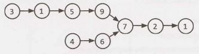
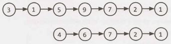
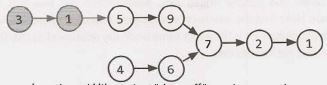
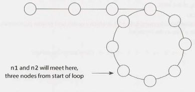

2 Linked  Lists
===============

A linked list is a data structure that represents a sequence of nodes. In a singly linked list, each node points to the next node in the linked list. A doubly linked list gives each node pointers to both the next and the previous node.

The following diagram depicts a doubly linked list:

```
+-----+        +-----+       +-----+      +-----+      +-----+       +-----+
|     +------->+     +------->     +------>     +----->+     +------>+     |
|  1  |        |  5  |       |  2  |      |  13 |      |  7  |       |  3  |
|     <--------+     +<------+     +<-----+     <------+     <-------+     |
+-----+        +-----+       +-----+      +-----+      +-----+       +-----+
```

Unlike an array, a linked list does not provide constant time access to a particular "index" within the list. This means that if you'd like to find the Kth element in the list, you will need to iterate through K elements.

The benefit of a linked list is that you can add and remove items from the beginning of the list in constant time. For specific applications, this can be useful.


### Creating a Linked List

The code below implements a very basic singly linked list.

```java
1   class Node {
2       Node next = null;
3       int data;
4   
5       public Node(int d) {
6           data = d;
7       }
8   
9       void appendToTail(int d) {
10          Node end = new Node(d);
11          Node n = this;
12          while (n.next != null) {
13              n = n.next;
14          }
15          n.next = end;
16      }
17  }
``` 

In this implementation, we don't have a LinkedList data structure. We access the linked list through a reference to the head Node of the linked list. When you implement the linked list this way, you need to be a bit careful. What if multiple objects need a reference to the linked list, and then the head of the linked list changes? Some objects might still be pointing to the old head.

We could, if we chose, implement a LinkedList class that wraps the Node class. This would essentially just have a single member variable: the head Node. This would largely resolve the earlier issue.

Remember that when you're discussing a linked list in an interview, you must understand  whether it is a singly linked list or a doubly linked list.


### Deleting a Node from a Singly Linked List

Deleting a node from a linked list is fairly straightforward. Given a node n, we find the previous node prev and set prev.next equal to n. next. If the list is doubly linked, we must also update  n. next to set n. next. prev equal to n. prev. The important things to remember are (1) to check for the null pointer and (2) to update the head or tail pointer as necessary.

Additionally,  if you implement this code in C, C++ or another  language that requires the developer to do memory management, you should consider if the removed node should be deallocated.

```java
1   Node deleteNode(Node head, int d) {
2       Node n = head;
3   
4       if (n.data == d) {
5           return head.next; /*moved head*/
6       }
7   
8       while (n.next != null) {
9           if (n.next.data == d) {
10              n.next = n.next.next;
11              return head; /* head didn't change*/
12          }
13          n = n.next;
14      }
15      return head;
16  }
```

### The "Runner" Technique

The "runner" (or second pointer) technique  is used in many linked list problems. The runner technique means that you iterate through the linked list with two pointers simultaneously, with one ahead of the other. The "fast" node might be ahead by a fixed amount, or it might be hopping multiple nodes for each one node that the "slow" node iterates through.

For example, suppose you had a linked list `a₁ ->a₂ ->....->aₙ -> b₁->b₂->...->bₙ`  and you wanted to rearrange it into `a₁ ->b₁ ->a₂ - >b₂ -> ...->aₙ ->bₙ`. You do not know the length of the linked list (but you do know that the length is an even number).

You could have one pointer p1 (the fast pointer) move  every two elements for every one move that p2 makes. When p1 hits the end of the linked list, p2 will be at the midpoint. Then, move pl back to the front and begin "weaving" the elements. On each iteration, p2 selects an element and inserts it after p1.


### Recursive Problems

A number of linked list problems rely on recursion. If you're having trouble solving a linked list problem, you should explore if a recursive approach will work. We won't go into depth on recursion here, since a later chapter is devoted to it.

However, you should remember that recursive algorithms take at least O(n) space, where n is the depth of the recursive call. All recursive algorithms can be implemented iteratively, although they may be much more complex.

---

Interview Questions

---

**2.1 Remove Dups:** Write code to remove duplicates from an unsorted linked list.

FOLLOW UP

How would you solve this problem if a temporary buffer is not allowed?

SOLUTION

---

In order to remove duplicates from a linked list, we need to be able to track duplicates. A simple hash table will work well here.

In the below solution, we simply iterate through the linked list, adding each element to a hash table. When we discover a duplicate element, we remove the element and continue iterating. We can do this all in one pass since we are using a linked list.

```java
1   void deleteDups(LinkedListNode n) {
2       HashSet<Integer> set = new HashSet<Integer>();
3       LinkedListNode previous = null;
4       while (n != null) {
5           if (set.contains(n.data)) {
6              previous.next = n.next;
7           } else {
8              set.add(n.data);
9              previous = n;
10          }
11          n = n.next;
12      }
13  }
```

The  above solution takes O(N) time, where N is the number of elements in the linked list.

**Follow  Up: No Buffer Allowed**

If we don't have a buffer, we can iterate with two pointers: current which iterates through the linked list, and runner which checks all subsequent nodes for duplicates.

```java
1   void deleteDups(LinkedListNode head) {
2       LinkedListNode current = head;
3       while (current != null) {
4           /* Remove all future nodes that have the same value */
5           LinkedListNode runner = current;
6           while (runner.next != null) {
7               if (runner.next.data == current.data) {
8                   runner.next = runner.next.next;
9               } else {
10                  runner = runner.next;
11              }
12          }
13          current = current.next;
14      }
15  }
```

This code runs in O(1) space, but O(N²) time.


**2.2       Return Kth to Last:**  Implement an algorithm to find the kth to last element of a singly linked list.

SOLUTION

---

We will approach this problem both recursively and non-recursively. Remember that recursive solutions are often cleaner but less optimal. For example, in this problem, the recursive implementation is about half the length of the iterative solution but also takes O(n) space, where n is the number of elements in the linked list.

Note that for this solution, we have defined k such that passing in k = 1 would return the last element, k = 2 would return to the second to last element, and so on. It is equally acceptable to define k such that k = 0 would return the last element.

**Solution #1: If linked list size is known**

If the size of the linked list is known, then the kth to last element is the (length  - k)th element. We can just iterate through the linked list to find this element. Because this solution is so trivial, we can almost be sure that this is not what the interviewer intended.

**Solution #2: Recursive**

This algorithm recurses through the linked list. When it hits the end, the method passes back a counter set to 0. Each parent call adds 1  to this counter. When the counter equals k, we know we have reached the kth to last element of the linked list.

Implementing this is short and sweet-provided we have a way of "passing back" an integer value through the stack. Unfortunately, we can't pass back a node and a counter using normal return statements. So how do we handle this?

*Approach A: Don't Return the Element.*

One way to do this is to change the problem to simply printing the kth to last element. Then, we can pass back the value of the counter simply through return values.

```java
1   int printKthToLast(LinkedListNode head, int k) {
2       if (head == null) {
3           return 0;
4       }
5       int index = printKthToLast(head.next, k) + 1;
6       if (index == k) {
7           System.out.println(k + "th to last node is " + head.data);
8       }
9       return index;
10  }
```

Of course, this is only a valid solution if the interviewer says it is valid.

*Approach B: Use C++.*

A second way to solve this is to use C++ and to pass values by reference. This allows us to return the node value, but also update the counter by passing a pointer to it.

```c++
1   node* nthToLast(node* head, int k, int& i) {
2       if (head == NULL) {
3           return NULL;
4       }
5       node* nd = nthToLast(head->next, k, i);
6       i = i + 1;
7       if (i == k) {
8           return head;
9       }
10      return nd;
11  }
12  
13  node* nthToLast(node* head, int k) {
14      int i = 0;
15      return nthToLast(head, k, i);
16  }
```

*Approach C: Create a Wrapper Class.*

We described earlier that the issue was that we couldn't simultaneously return a counter and an index. If we wrap the counter value with simple class (or even a single element  array), we can mimic passing by reference.

```java
1   class Index {
2       public int value = 0;
3   }
4   
5   LinkedListNode kthToLast(LinkedListNode head, int k) {
6       Index idx = new Index();
7       return kthToLast(head, k, idx);
8   }
9   
10  LinkedListNode kthToLast(LinkedListNode head, int k, Index idx) {
11      if (head == null) {
12          return null;
13      }
14      LinkedListNode node = kthToLast(head.next, k, idx);
15      idx.value = idx.value + 1;
16      if (idx.value == k) {
17          return head;
18      }
19      return node;
20  }
```

Each of these recursive solutions takes O(n) space due to the recursive calls.

There are a number of other solutions that we haven't addressed. We could store the counter in a static variable. Or, we could create a class that stores both the node and the counter, and return an instance of that class. Regardless of which solution we pick, we need a way to update both the node and the counter in a way that all levels of the recursive stack will see.


**Solution #3: Iterative**

A more optimal, but less straightforward, solution is to implement this iteratively. We can use two pointers, p1 and p2. We place them k nodes apart in the linked list by putting p2 at the beginning and moving p1 k nodes into the list. Then, when we move them at the same pace, p1 will hit the end of the linked list after LENGTH  - k steps. At that point, p2  will be LENGTH  - k nodes into the list, or k nodes from the end.

The code below implements this algorithm.

```java
1   LinkedListNode nthTolast(LinkedListNode head, int k) {
2       LinkedListNode p1 = head;
3       LinkedListNode p2 = head;
4   
5       /* Move p1 k nodes into the list.*/
6       for (int i = 0; i < k; i++) {
7           if (p1 == null) return null; // Out of bounds
8           p1 = p1.next;
9       }
10  
11      /* Move them at the same pace. When p1 hits the end, p2 will be at the right
12      * element. */
13      while (p1 != null) {
14          p1 = p1.next;
15          p2 = p2.next;
16      }
17      return p2;
18  }
```

This algorithm takes O(n) time and O(1) space.


**2.3   Delete Middle  Node:**  Implement an algorithm to delete a node in the middle (i.e., any node but the first and last node, not necessarily the exact middle) of a singly linked list, given only access to that node.
```
EXAMPLE
Input:  the node c from the linked list a->b->c->d->e->f
Result: nothing is returned, but the new linked list looks like a->b->d->e->f
```

SOLUTION

---

In this problem, you are not given access to the head of the linked list. You only have access to that node. The solution is simply to copy the data from the next node over to the current node, and then to delete the next node.

The code below implements this algorithm.

```java
1   boolean deleteNode(LinkedListNode n) {
2       if (n == null || n.next == null) {
3           return false; // Failure
4       }
5       LinkedListNode next = n.next;
6       n.data = next.data;
7       n.next = next.next;
8       return true;
9   }
```

Note that this problem cannot be solved if the node to be deleted is the last node in the linked list. That's okay-your interviewer wants you to point that out, and to discuss how to handle this case. You could, for example, consider marking the node as dummy.


**2.4 Partition:** Write code to partition a linked list around a value x, such that all nodes less than x come before all nodes greater than or equal to x. If x is contained within the list the values of x only need to be after the elements less than x (see below). The partition element x can appear anywhere in the "right partition"; it does not need to appear between the left and right partitions.

```
EXAMPLE 
Input:   3 -> 5 -> 8 -> 5  -> 10 -> 2 -> 1 [partition = 5] 
Output:  3 -> 1 -> 2 -> 10 -> 5  -> 5 -> 8 
```

SOLUTION

---

If this were an array, we would need to be careful about how we shifted elements. Array shifts are very expensive.

However, in a linked list, the situation is much easier. Rather than shifting and swapping elements, we can actually create two different linked lists: one for elements less than x, and one for elements greater than or equal to x.

We iterate through the linked list, inserting elements into our before list or our after list. Once we reach the end of the linked list and have completed this splitting, we merge the two lists.

This approach is mostly "stable" in that elements stay in their original order, other than the necessary movement around the partition. The code below implements this approach.

```java
1   /*Pass in the head of the linked list and the value to partition around*/
2   LinkedListNode partition(LinkedListNode node, int x) {
3       LinkedListNode beforeStart = null;
4       LinkedListNode beforeEnd = null;
5       LinkedListNode afterStart = null;
6       LinkedListNode afterEnd = null;
7   
8       /*Partition list*/
9       while (node != null) {
10          LinkedListNode next = node.next;
11          node.next = null;
12          if (node.data < x) {
13              /* Insert node into end of before list */
14              if (beforeStart == null) {
15                  beforeStart = node;
16                  beforeEnd = beforeStart;
17              } else {
18                  beforeEnd.next = node;
19                  beforeEnd = node;
20              }
21          } else {
22              /* Insert node into end of after list*/
23              if (afterStart == null) {
24                  afterStart = node;
25                  afterEnd = afterStart;
26              } else {
27                  afterEnd.next = node;
28                  afterEnd = node;
29              }
30          }
31          node = next;
32      }
34      if (beforeStart == null) {
35          return afterStart;
36      }
37  
38      /* Merge before list and after list */
39      beforeEnd.next = afterStart;
40      return beforeStart;
41  }
```

If it bugs you to keep around four different variables for tracking two  linked  lists, you're  not  alone.  We can make this code a bit shorter.

If we  don't care  about making the elements of the list "stable"  (which  there's no  obligation to, since  the interviewer hasn't specified that), then we can  instead rearrange the elements by growing the list at the head and  tail.

In this approach, we start a "new" list (using the existing nodes). Elements bigger than the pivot element are put  at the tail and  elements smaller are put  at the head. Each time we insert  an element, we update either the head or tail.

```java
1   LinkedListNode partition(LinkedListNode node, int x) {
2       LinkedListNode head = node;
3       LinkedListNode tail = node;
4   
5       while (node != null) {
6           LinkedListNode next = node.next;
7           if (node.data < x) {
8               /* Insert node at head. */
9               node.next = head;
10              head = node;
11          }  else {
12              /* Insert node at tail. */
13              tail.next = node;
14              tail = node;
15          }
16          node = next;
17      }
18      tail.next = null;
19  
20      // The head has changed, so we need to return it to the user.
21      return head;
22  }
```

There are many  equally optimal solutions to this problem. If you came up  with a different one, that's okay!


**2.5   Sum Lists:** You have two numbers represented by a linked list, where each node contains a single digit. The digits are stored in reverse order, such that the 1's digit  is at the head of the list. Write a function that adds the two numbers and returns the sum as a linked list.

```
EXAMPLE
Input: (7 -> 1 -> 6) + (5 -> 9 -> 2). That is, 617 +  295. 
Output: 2 -> 1 -> 9. That is, 912.
```

FOLLOW UP

Suppose the digits are stored in forward order. Repeat the above problem. 

```
Input: (6 -> 1 -> 7) +  (2 -> 9 -> 5). That is, 617 +  295.
Output: 9 -> 1 -> 2. That is, 912.
```

SOLUTION

---

It's useful  to remember in this problem how exactly addition works. Imagine the problem:

```
  6 1 7
+ 2 9 5
```

First, we add 7 and 5 to get 12. The digit 2 becomes the last digit of the number, and 1 gets carried over to the next step. Second,  we add 1, 1, and 9 to get 11. The 1 becomes the second digit, and the other 1 gets carried over the final step. Third and finally, we add 1,6 and 2 to get 9. So, our value becomes 912.

We can mimic this process recursively by adding node by node, carrying  over any "excess" data to the next node.  Let's walk through this for the below linked list:

```
     7 -> 1 -> 6
+    5 -> 9 -> 2
```

We do the following:

1.  We add 7 and 5 first, getting a result of 12. 2 becomes the first node in our linked list, and we "carry" the 1 to the next sum.
```
List: 2 -> ?
```
2.  We then  add 1 and 9, as well as the "carry", getting a result of 11.1 becomes the second element of our linked list, and we carry the 1 to the next sum.

```
List: 2 -> 1 -> ?
```

3.  Finally, we add 6, 2 and our "carry", to get 9. This becomes the final element of our linked list.
```
List: 2 -> 1 -> 9.
```

The code below implements this algorithm.

```java
l   LinkedListNode addLists(LinkedListNode l1, LinkedListNode l2, int carry) {
2       if (l1 == null && l2 == null && carry == 0) {
3           return null;
4       }
5   
6       LinkedListNode result = new LinkedListNode();
7       int value = carry;
8       if (l1 != null)  {
9           value += l1.data;
10      }
11      if (l2 != null) {
12          value += l2.data;
13      }
14  
15      result.data = value % 10; /* Second digit of number */
16  
17      /*Recurse */
18      if (l1 != null || l2 != null) {
19          LinkedListNode more = addLists(l1 == null ? null : l1.next,
20                                  l2 == null ? null : l2.next,
21                                  value >= 10 ? 1 : 0);
22          result.setNext(more);
23      }
24      return result;
25  }
```

In implementing this code, we must be careful to handle the condition when one linked list is shorter than another. We don't want to get a null pointer exception.

##### Follow Up

Part B is conceptually the same (recurse, carry the excess), but has some additional complications when it comes to implementation:

1. One list may be shorter than the other, and we cannot handle this "on the fly". For example, suppose we were adding `(1 -> 2 -> 3-> 4) and (5-> 6-> 7)`. We need to know that the 5 should be "matched" with the 2, not the 1. We can accomplish this by comparing the lengths of the lists in the beginning and padding the shorter list with zeros.
2. In the first part, successive results were added to the tail (i.e., passed forward). This meant that the recursive call would be passed the carry, and would return the result (which is then appended to the tail). In this case, however, results are added to the head (i.e., passed backward). The recursive call must return the result, as before, as well as the carry. This is not terribly challenging to implement, but it is more cumbersome. We can solve this issue by creating a wrapper class called Partial Sum.

The code below implements this algorithm.

```java
1   class PartialSum {
2       public LinkedListNode sum = null;
3       public int carry = 0;
4   }
5   
6   LinkedListNode addLists(LinkedListNode l1, LinkedListNode l2) {
7       int len1 = length(l1);
8       int len2 = length(l2);
9   
10      /* Pad the shorter list with zeros - see note (1) */
11      if (len1 < len2) {
12          l1 = padList(l1, len2 - len1);
13      } else {
14          l2 = padList(l2, len1 - len2);
15      }
16  
17      /* Add lists */
18      PartialSum sum = addListsHelper(l1, l2);
19  
20      /* If there was a carry value left over, insert this at the front of the list.st.
21      * Otherwise, just return the linked list. */
22      if (sum.carry == 0) {
23          return sum.sum;
24      } else {
25          LinkedListNode result = insertBefore(sum.sum, sum.carry);
26          return result;
27      }
28  }
29  
30  PartialSum addListsHelper(LinkedListNode l1, LinkedListNode l2) {
31      if (l1 == null && l2 == null) {
32          PartialSum sum = new PartialSum();
33          return sum;
34      }
35      /* Add smaller digits recursively*/
36      PartialSum sum = addListsHelper(l1.next, l2.next);
37  
38      /*  Add carry to current data*/
39      int val = sum.carry + l1.data + l2.data;
40  
41      /* Insert sum of current digits*/
42      LinkedListNode full_result = insertBefore(sum.sum, val % 10);
43  
44      /* Return sum so far, and the carry value*/
45      sum.sum = full_result;
46      sum.carry = val / 10;
47      return sum;
48  }
49  
50  /* Pad the list with zeros*/
51  LinkedListNode padList(LinkedListNode l, int padding) {
52      LinkedListNode head = l;
53      for (int i = 0; i < padding; i++) {
54          head = insertBefore(head, 0);
55      }
56      return head;
57  }
58  
59  /* Helper function to insert node in the front of a linked list*/
60  LinkedListNode insertBefore(LinkedListNode list, int data) {
61      LinkedListNode node = new LinkedListNode(data);
62      if (list != null) {
63          node.next = list;
64      }
55      return node;
66  }
```

Note how we have pulled insertBefore(), padList(), and length() (not listed) into their own methods. This makes the code cleaner and easier to read-a wise thing to do in your interviews!


**2.6       Palindrome:** Implement a function to check if a linked list is a palindrome.


SOLUTION
 
--- 

To approach this problem, we can picture a palindrome like 0  - >   1  - >   2  - >   1  - >  0. We know that, since it's a palindrome, the list must be the same backwards and forwards. This leads us to our first solution.


**Solution #1: Reverse and Compare**

Our first solution is to reverse the linked list and compare the reversed list to the original list. If they're the same, the lists are identical.

Note that when we compare the linked list to the reversed list, we only actually need to compare the first half of the list.  If the first half of the normal list matches the first half of the reversed list, then the second half of the normal list must match the second half of the reversed list.

```java
1   boolean isPalindrome(LinkedListNode head) {
2       LinkedListNode reversed = reverseAndClone(head);
3       return isEqual(head, reversed);
4   }
5   
6   LinkedListNode reverseAndClone(LinkedListNode node) {
7       LinkedListNode head = null;
8       while (node != null) {
9           LinkedListNode n = new LinkedListNode(node.data); // Clone
10          n.next = head;
11          head = n;
12          node = node.next;
13      }
14      return head;
15  }
16  
17  boolean isEqual(LinkedListNode one, LinkedListNode two) {
18      while (one != null && two != null) {
19          if (one.data != two.data) {
20              return false;
21          }
22          one = one.next;
23          two = two.next;
24      }
25      return one == null && two == null;
26  }
```

Observe that we've modularized this code into reverse and isEqual functions. We've also created a new class so that we can return both the head and the tail of this method. We could have also returned a two-element array, but that approach is less maintainable.

**Solution #2: Iterative Approach**

We want to detect linked lists where the front half of the list is the reverse of the second half. How would we do that? By reversing the front half of the list. A stack  can accomplish this.

We need to push the first half of the elements onto a stack. We can do this in two different ways, depending on whether or not we know the size of the linked list.

If we know the size of the linked list, we can iterate through the first half of the elements in a standard for loop, pushing each element onto a stack. We must be careful, of course, to handle the case where the length of the linked list is odd.

If we don't know the size of the linked list, we can iterate through the linked list, using the fast runner/ slow runner technique described in the beginning of the chapter.  At each step in the loop, we push the data from the slow runner onto a stack. When the fast runner hits the end of the list, the slow runner will have reached the middle of the linked  list. By this point, the stack will have all the elements from the front of the linked list, but in reverse order.


Now, we simply iterate through the rest of the linked list. At each iteration, we compare the node to the top of the stack. If we complete the iteration without finding a difference, then the linked list is a palindrome.

```java
1   boolean isPalindrome(LinkedListNode head) {
2       LinkedListNode fast = head;
3       LinkedListNode slow = head;
4   
5       Stack<Integer> stack = new Stack<Integer>();
6   
7       /* Push elements from first half of linked list onto stack. When fast runner
8       * (which is moving at 2x speed) reaches the end of the linked list, then we
9       * know we're at the middle */
10      while (fast != null && fast.next != null) {
11          stack.push(slow.data);
12          slow = slow.next;
13          fast = fast.next.next;
14      }
15  
16      /* Has odd number of elements, so skip the middle element*/
17      if (fast != null) {
18          slow = slow.next;
19      }
20  
21      while (slow != null) {
22          int top = stack.pop().intValue();
23  
24          /* If values are different, then it's not a palindrome*/
25          if (top != slow.data) {
26              return false;
27          }
28          slow = slow.next;
29      }
30      return true;
31  }
```

**Solution #3: Recursive Approach**

First, a word on notation: in this solution, when we use the notation node  Kx, the variable K indicates the value of the node data, and x (which is either for b) indicates whether we are referring to the front node with that value or the back node. For example, in the below linked list node   2b would refer to the second (back) node with value 2.

Now, like many linked list problems, you can approach this problem recursively. We may have some intuitive idea that we want to compare element 0 and element n  -   1, element 1 and element n - 2, element 2 and element n - 3,  and so on, until the middle element(s). For example:
```
0  (  1  (  2  (  3  )   2  )   1  )  0
```
In order to apply this approach, we first need to know when we've reached the middle element, as this will form our base case. We can do this by passing in length  -  2 for the length each time. When the length equals 0 or 1, we're at the center of the linked list. This is because the length is reduced by 2 each time. Once we've recursed N/2 times, length will be down to 0.

```java
1  recurse(Node n, int length) {
2       if (length == 0 || length == 1) {
3            return [something]; // At middle
4       }
5       recurse(n.next, length - 2);
6    ...
7  }
```

This method will form the outline of the isPalindrome method. The "meat" of the algorithm though is comparing node i to node n  -  i to check if the linked list is a palindrome. How do we do that?

Let's examine what the call stack looks like:

```
1   vl = isPalindrome: list = 0  (  1  (  2  (  3  )  2  )  1  )  0.length   =  7
2      v2 =  isPalindrome: list  = 1  (  2  (  3  )  2  )  1  )  0.length =  5
3         v3 =  isPalindrome: list =   2  (  3  )  2  )  1  )  0.length   =  3
4            v4 =  isPalindrome:   list  = 3  )  2  )  1  )  0.length =  1
5            returns v3
6         returns v2
7      returns v1
8   returns  ?
```

In the above call stack, each call wants to check  if the list is a palindrome by comparing its head node with the corresponding node from the back of the list. That is:

- Line 1 needs to compare node  0f with node   0b
- Line 2 needs to compare node  1f with node   1b
- Line 3 needs to compare node  2f with node   2b
- Line 4 needs to compare node  3f with node   3b.

If we rewind the stack, passing nodes back as described below, we can do just that:

- Line 4 sees that it is the middle node (since length =  1), and passes back head.next. The value head equals node 3, so head.next is node   2b.
- Line 3 compares its head, node   2f, to returned_node (the value from the previous recursive call), which is node 2b. If the values match, it passes a reference to node  1b (returned_node.next) up to line 2.
- Line 2 compares its head (node 1f) to returned_node (node 1b). If the values match, it passes a reference to node 0b (or, returned_node.next) up to line 1.
- Line 1 compares its head, node 0f, to returned_node, which is node 0b. If the values match, it returns true.

To generalize, each call compares its head to returned_node, and then passes returned_node. next up the stack. In this way, every node i gets compared to node n   -   i. If at any point the values do not match, we return false, and every call up the stack checks for that value.

But wait, you might ask, sometimes we said we'll return a boolean value, and sometimes we're returning a node. Which is it?

It's both. We create a simple class with two members, a boolean and a node, and return an instance of that class.

```java
1  class Result {
2      public LinkedListNode node;
3      public boolean result;
4  }
```

The example below illustrates the parameters and return values from this sample list.
```
1   isPalindrome:  list = 0  (  1  (  2  (  3  (  4  )  3  )  2  )  1  )  0.  len  =  9
2     isPalindrome:  list =  1  (  2  (  3  (  4  )  3  )  2  )  1  )  0.  len  =  7
3       isPalindrome:  list =   2  (  3  (  4  )  3  )  2  )  1  )  0.  len  =   5
4         isPalindrome:  list =   3  (  4  )  3  )  2  )  1  )  0,   len=    3
5           isPalindrome:  list =  4  )  3  )  2  )  1  )  0.  len  =   1
6           returns node 3b,  true
7         returns node 2b,  true
8       returns node 1b,   true
9     returns node 0b,  true
10  returns null,  true
```

Implementing this code is now just a matter of filling in the details.
```java
1   boolean isPalindrome(LinkedListNode head) {
2       int length = lengthOfList(head);
3       Result p = isPalindromeRecurse(head, length);
4       return p.result;
5   }
6   
7   Result isPalindromeRecurse(LinkedListNode head, int length) {
8       if (head == null || length <= 0) { // Even number of nodes
9           return new Result(head, true);
10      } else if (length == 1) { // Odd number of nodes
11          return new Result(head.next, true);
12      }
13  
14      /* Recurse on sublist. */
15      Result res = isPalindromeRecurse(head.next, length - 2);
16  
17      /* If child calls are not a palindrome, pass back up
18       * a failure.*/
19      if (!res.result || res.node == null) {
20          return res;
21      }
22  
23      /* Check if matches corresponding node on other side. */
24      res.result = (head.data == res.node.data);
25  
26      /* Return corresponding node. */
27      res.node = res.node.next;
28  
29      return res;
30  }
31  
32  int lengthOfList(LinkedListNode n) {
33      int size = 0;
34      while (n != null) {
35          size++;
36          n = n.next;
37      }
38      return size;
39  }
```

Some of you might be wondering why we went through all this effort to create a special Result class. Isn't there a better way? Not really-at least not in Java.

However, if we were implementing this in C or C++, we could have passed in a double pointer.

```c++
1   bool isPalindromeRecurse(Node head, int length, Node** next) {
2       ...
3   }
```

It's ugly, but it works.


**2.7       Intersection:**  Given two  (singly) linked lists, determine  if  the  two  lists intersect.  Return the intersecting node. Note that the intersection is defined based on reference, not value. That is, if the kth node of the first linked list is the exact same node (by reference) as the jth node of the second linked list, then they are intersecting. 


SOLUTION

---


Let's draw a picture of intersecting linked lists to get a better feel for what is going on. 

Here is a picture of intersecting linked lists:



And here is a picture of non-intersecting linked lists:
 


We should be careful here to not inadvertently draw a special case by making the linked lists the same length.

Let's first ask how we would determine if two linked lists intersect.

**Determining if there's an intersection.**

How would we detect if two linked lists intersect? One approach  would be to use a hash table and just throw all the linked lists nodes into there. We would need to be careful to reference the linked lists by their memory location, not by their value.

There's an easier way though. Observe that two intersecting linked lists will always have the same last node. Therefore, we can just traverse to the end of each linked list and compare the last nodes.

How do we find where the intersection is, though?

**Finding  the intersecting node.**

One thought is that we could traverse backwards through each linked list. When the linked lists "split"; that's the intersection. Of course, you can't really traverse backwards through a singly linked list.

If the linked lists were the same length, you could just traverse through them at the same time. When they collide, that's your intersection.




When  they're not  the same length, we'd like to just "chop off"-or ignore-those excess (gray) nodes.

How can we do this? Well, if we know the lengths of the two linked lists, then the  difference between those two linked  lists will tell us how much to chop off.

We can get the lengths at the same time as we get the tails of the linked lists (which we used in the first step to determine if there's an intersection).

**Putting it all together.**

We now have a multistep process.

1. Run through each linked  list to get  the  lengths and  the  tails.
2. Compare the  tails. If they are different (by reference, not  by value), return immediately. There is no inter- section.
3. Set two pointers to the start  of each linked list.
4. On the  longer linked  list, advance its pointer by the difference in lengths.
5. Now, traverse on each linked  list until the  pointers are the  same. The implementation for this is below.

```java
1   LinkedListNode findintersection(LinkedListNode list1, LinkedListNode list2) {
2       if (list1 == null || list2 == null) return null;
3   
4       /* Get tail and sizes. */
5       Result result1 = getTailAndSize(list1);
6       Result result2 = getTailAndSize(list2);
7   
8       /* If different tail nodes, then there's no intersection. */
9       if (result1.tail != result2.tail) {
10          return null;
11      }
12  
13      /* Set pointers to the start of each linked list. */
14      LinkedListNode shorter = result1.size < result2.size ? list1 : list2;
15      LinkedListNode longer  = result1.size < result2.size ? list2 : list1;
16  
17      /* Advance the pointer for the longer linked list by difference in lengths. */
18      longer = getKthNode(longer, Math.abs(result1.size - result2.size));
19  
20      /* Move both pointers until you have a collision. */
21      while (shorter != longer) {
22          shorter = shorter.next;
23          longer  = longer.next;
24      }
25  
26      /* Return either one. */
27      return longer;
28  }
29  
30  class Result {
31      public LinkedListNode tail;
32      public int size;
33      public Result(LinkedListNode tail, int size) {
34          this.tail = tail;
35          this.size = size;
36      }
37  }
38  
39  Result getTailAndSize(LinkedListNode list) {
40      if (list == null) return null;
41  
42      int size = 1;
43      LinkedListNode current = list;
44      while (current.next != null) {
45          size++;
46          current = current.next;
47      }
48      return new Result(current, size);
49  }
50  
51  LinkedListNode getKthNode(LinkedListNode head, int k) {
52      LinkedListNode current = head;
53      while (k > 0 && current != null) {
54          current = current.next;
55          k--;
56      }
57      return current;
58  }
```

This algorithm takes O(A  +  B) time, where A and Bare the lengths of the two linked lists. It takes O(1) additional space.


**2.8   Loop Detection:** Given a circular linked list, implement an algorithm that returns the node at the beginning of the loop.

DEFINITION

Circular linked list: A (corrupt) linked list in which a node's next pointer points to an earlier node, so as to make a loop in the linked list.
```
EXAMPLE 
Input:  A   - > B   - > C   - > D   - > E   - > C [the same C as earlier] 
Output: C
```

SOLUTION
 
---
 
This is a modification of a classic interview problem: detect if a linked list has a loop. Let's apply the Pattern Matching approach.

**Part  1 : Detect If Linked List Has A Loop**

An easy way to detect  if a linked list has a loop is through  the FastRunner / SlowRunner  approach. FastRunner moves two steps at a time, while SlowRunner moves one step. Much like two cars racing around a track at different steps, they must eventually meet.

An astute reader  may  wonder   if FastRunner might  "hop  over"  SlowRunner completely,   without ever  colliding. That's  not  possible.  Suppose that  FastRunner did hop  over  SlowRunner, such  that SlowRunner is at spot  i and  FastRunner is at spot  i +   1. In the previous step, SlowRunner would be at spot i -   1 and FastRunner would at spot  ( ( i +  1)  -   2),  or spot i -   1. That is, they would have collided.

**Part 2: When Do They Collide?**

Let's assume that the linked list has a "non-looped" part of size k.

If we apply our algorithm  from part  l, when  will FastRunner and SlowRunner collide?

We know that for every p steps that SlowRunner takes, FastRunner has taken 2p steps. Therefore, when SlowRunner enters the looped  portion  after k steps, FastRunner has taken 2k steps total and must be 2k   -   k steps, or k steps, into the looped portion. Since k might be much larger than the loop length, we should  actually write this as mod (k,  LOOP_SIZE) steps, which we will denote as K.

At each subsequent step, FastRunner and  SlowRunner get either one step  farther  away or one step closer, depending on your perspective. That is, because we are in a circle, when A moves q steps away from B, it is also moving q steps  closer to B.

So now we know the following facts:

1.  SlowRunner is 0 steps into the loop.
2.  FastRunner is K steps into the loop.
3.  SlowRunner is K steps behind FastRunner.
4.  FastRunner is LOOP_SIZE - K steps behind SlowRunner.
5.  FastRunner catches  up to SlowRunner at a rate of 1 step per unit of time.

So, when  do they  meet?  Well, if FastRunner is LOOP_SIZE - K  steps  behind  SlowRunner, and FastRunner catches  up at a rate of 1 step per unit of time, then they meet  after LOOP_SIZE = K steps. At this point, they will be K steps before the head of the loop. Let's call this point  Collisionspot.





**Part 3: How Do You Find The Start of the Loop?**

We now know that CollisionSpot is K nodes before the start of the loop. Because K  =  mod (k,  LOOP_ SIZE) (or, in other  words, k =  K   +  M *  LOOP_SIZE, for any integer M), it is also correct to say that it is k nodes from the loop start. For example, if node N is 2 nodes into a 5 node loop, it is also correct to say that it is 7, 12, or even 397 nodes into the loop.

Therefore, both  CollisionSpot and LinkedListHead are k nodes from the start of the loop.

Now, if we keep one pointer at CollisionSpot and move the other one to LinkedListHead, they will each be k nodes from LoopStart. Moving the two pointers at the same speed will cause them to collide again-this time after k steps, at which point they will both be at LoopStart. All we have to do is return this node.

**Part 4: Putting It All Together**

To summarize, we move  FastPointer twice as fast as SlowPointer. When SlowPointer enters the  loop, after k nodes,  FastPointer is k nodes into the loop. This means that  FastPointer and SlowPointer are LOOP_SIZE  -  k nodes away from each other.

Next, if FastPointer moves two nodes for each node that SlowPointer moves, they move one node closer to each other on each turn. Therefore, they will meet after LOOP_SIZE  -   k turns. Both will be k nodes from the front of the loop.

The head of the linked list is also k nodes from the front of the loop. So, if we keep one pointer where it is, and move the other pointer to the head of the linked list, then they will meet at the front of the loop.

Our algorithm is derived directly from parts 1, 2 and 3.

1. Create two pointers, FastPointer and SlowPointer.
2. Move FastPointer at a rate of 2 steps and SlowPointer at a rate of 1 step.
3. When they collide, move SlowPointer to LinkedListHead. Keep FastPointer where it is.
4. Move SlowPointer and FastPointer at a rate of one step. Return the new collision point. 

The code below implements this algorithm.

```java
1   LinkedListNode FindBeginning(LinkedListNode head) {
2       LinkedListNode slow = head;
3       LinkedListNode fast = head;
4   
5       /* Find meeting point. This will be LOOP_SIZE - k steps into the linked list. */
6       while (fast != null && fast.next != null) {
7           slow = slow.next;
8           fast = fast.next.next;
9           if (slow == fast) {//Collision
10              break;
11          }
12      }
13  
14      /* Error check - no meeting point, and therefore no loop*/
15      if (fast == null || fast.next == null) {
16          return null;
17      }
18  
19      /* Move slow to Head. Keep fast at Meeting Point. Each are k steps from the
20       * Loop Start. If they move at the same pace, they must meet at Loop Start . */
21      slow = head;
22      while (slow != fast) {
23          slow = slow.next;
24          fast = fast.next;
25      }
26  
27      /* Both now point to the start of the loop. */
28SS    return fast;
29  }
```


Additional Questions: Trees and Graphs (#4.3),  Object-Oriented Design (#7.12),  System Design and Scal­ability (#9.5), Moderate Problems (#16.25), Hard Problems (#17.12).


