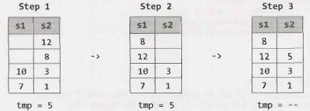

## 3 Stacks and Queues

Questions on stacks and queues will be much easier to handle if you are comfortable with the ins and outs of the data structure. The problems can be quite tricky, though. While some problems may be slight modifications on the original data structure, others have much more complex challenges.


### Implementing a Stack

The stack data structure is precisely what it sounds like: a stack of data. In certain types of problems, it can be favorable to store data in a stack rather than in an array.

A stack uses LIFO (last-in  first-out) ordering. That is, as in a stack of dinner plates, the most recent item added to the stack is the first item to be removed.

It uses the following operations:

- pop(): Remove the top item from the stack. 
- push(itern): Add an item to the top of the stack. 
- peek(): Return the top of the stack.
- is Empty(): Return true if and only if the stack is empty.

Unlike an array, a stack does not offer constant-time access to the ith item. However, it does allow constant-time adds and removes, as it doesn't require shifting elements around.

We have provided simple sample code to implement a stack. Note that a stack can also be implemented using a linked list, if items were added and removed from the same side.

```java
1 	public class MyStack<T> {
2 		private static  class StackNode<T>   {
3 			private T data;
4 			private StackNode<T> next;
5	
6 			public StackNode(T  data)  {
7 				this.data = data;
8 			}
9 		}
16	
11		private StackNode<T> top;
12	
13		public T  pop()   {
14			if (top == null) throw  new EmptystackException();
15			T item =  top.data;
16			top =  top.next;
17			return item;
18		}
19	
20		public void  push(T  item) {
21			StackNode<T> t = new StackNode<T>(item);
22			t.next = top;
23			top =  t;
24		}
25	
26		public T  peek()  {
27			if (top ==    null) throw  new EmptyStackException();
28			return top.data;
29		}
30	
31		public boolean   isEmpty()  {
32			return top ==    null;
33		}
34	}
```


One case where stacks are often useful is in certain recursive algorithms. Sometimes you need to push temporary data onto a stack as you recurse, but then remove them as you backtrack (for example, because the recursive check failed).  A stack offers an intuitive way to do this.

A stack can also be used to implement a recursive algorithm iteratively. (This is a good exercise! Take a simple recursive algorithm and implement it iteratively.)


### Implementing a Queue

A queue  implements  FIFO (first-in first-out) ordering. As in a line or queue  at a ticket stand, items are removed from the data structure in the same order that they are added.

It uses the operations:

- add(itern): Add an item to the end of the list. 
- remove(): Remove the first item in the list. 
- peek(): Return the top of the queue.
- isEmpty(): Return true if and only if the queue is empty.

A queue can also be implemented  with a linked list. In fact, they are essentially the same thing, as long as items are added and removed from opposite sides.

```java
1 	public class MyQueue<T>   {
2 		private static  class QueueNode<T>   {
3 			private T  data;
4 			private QueueNode<T>  next;
5	
6 			public QueueNode(T data) {
7 				this.data =  data;
8 			}
9 		}
10	
11		private QueueNode<T>  first;
12		private QueueNode<T>  last;
13	
14		public void  add(T  item) {
15			QueueNode<T>  t =  new QueueNode<T>(item);
16			if (last !=  null) {
17				last.next =  t;
18			}
19			last = t;
20			if (first == null) {
21				first = last;
22			}
23		}
24	
25		public T remove()   {
26			if (first ==    null) throw  new NoSuchElementException();
27			T data =  first.data;
28			first  =  first.next;
29			if (first == null) {
30				last = null;
31			}
32			return data;
33		}
34	
35		public T peek()  {
36			if (first == null) throw  new NoSuchElementException();
37			return first.data;
38		}
39	
40		public  boolean isEmpty() {
41			return first == null;
42		}
43	}
```

It is especially easy to mess up the updating of the first and last nodes in a queue. Be sure to double check this.

One place where queues are often used is in breadth-first search or in implementing a cache.

In breadth-first search, for example, we used a queue to store a list of the nodes that we need to process. Each time we process a node, we add its adjacent nodes to the back of the queue. This allows us to process nodes in the order in which they are viewed.

---

Interview Questions

---

**3.1  Three in One:** Describe how you could use a single array to implement three stacks.


SOLUTION

---
 
Like many problems, this one somewhat  depends  on how well we'd like to support these stacks. If we're okay with simply allocating a fixed amount of space for each stack, we can do that. This may mean though that one stack runs out of space, while the others are nearly empty.

Alternatively, we can be flexible in our space allocation, but this significantly increases the complexity of the problem.

**Approach 1: Fixed  Division**

We can divide the array in three equal parts and allow the individual stack to grow in that limited space. Note: We will use the notation "[" to mean inclusive of an end point and "(" to mean exclusive of an end point.

- For stack 1, we will use [0,  n/3).
- For stack 2, we will use [n/3,  2n/3).
- For stack 3, we will use [2n/3,  n) .

The code for this solution is below.

```java
1	class  FixedMultiStack {
2		private int numberOfStacks = 3;
3		private int stackCapacity;
4		private int[] values;
5		private int[] sizes;
6	
7 		public  FixedMultiStack(int stackSize) {
8 			stackCapacity  = stackSize;
9 			values =  new int[stackSize *  numberOfStacks];
10			sizes  =  new int[numberOfStacks];
11		}
12	
13		/* Push  value onto  stack.  */
14		public void  push(int stackNum,  int value) throws   FullStackException  {
15			/* Check that we have  space  for  the next  element */
16			if (isFull(stackNum)) {
17				throw  new FullStackException();
18			}
19	
20			/* Increment stack pointer and then update top value.*/
21			sizes[stackNum]++;
22			values[indexOfTop(stackNum)]   =  value;
23		}
24	
25		/*  Pop item  from top  stack.  */
26		public int  pop(int stackNum) {
27			if (isEmpty(stackNum))  {
28				throw new EmptyStackException();
29			}
30	
31			int toplndex  =  indexOfTop(stackNum);
32			int value  =  values[toplndex];  // Get top
33			values[topindex]  =  0;  // Clear
34			sizes[stackNum]--;  // Shrink
35			return  value;
36		}
37	
38		/*  Return  top  element.   */
39		public int peek(int stackNum) {
40			if (isEmpty(stackNum))  {
41				throw new EmptyStackException();
42			}
43			return values[indexOfTop(stackNum)];
44		}
45	
46		/*  Return  if stack  is empty.  */
47		public  boolean  isEmpty(int stackNum) {
48			return sizes[stackNum]   ==  0;
49		}
50	
51		/*  Return  if stack  is full. */
52		public   boolean  isFull(int stackNum) {
53			return  sizes[stackNum] ==  stackCapacity;
54		}
55	
56		/*  Returns  index  of  the  top  of  the  stack.  */
57		private  int  indexOfTop(int stackNum) {
58			int offset =  stackNum * stackCapacity;
59			int size =  sizes[stackNum];
60			return offset +  size -  1;
61		}
62	}
```

If we had additional information about the expected usages of the stacks, then we could modify this algo­rithm accordingly.  For example,  if we expected Stack  1  to have many more elements than Stack 2, we could allocate more space to Stack 1  and less space to Stack 2.

**Approach 2: Flexible Divisions**

A second approach is to allow the stack blocks to be flexible in size. When one stack exceeds its initial capacity, we grow the allowable capacity and shift elements as necessary.

We will also design our array to be circular, such that the final stack may start at the end of the array and wrap around to the beginning.

Please note that the code for this solution is far more complex than would be appropriate for an interview. You could be responsible for pseudocode, or perhaps the code of individual components, but the entire implementation would be far too much work.

```java
1  	public class MultiStack {
2  	    /*  StackInfo is  a  simple  class that holds  a  set of  data  about  each  ck.
3  	     * does not  hold  the  actual items  in  the  stack. We  could  have e
4  	     * just a  bunch of  individual variables,  but  that's messy and doesn't n  us
5  	     * much.  */
6  	    private class StackInfo {
7  	        public int start, size, capacity;
8  	        public StackInfo(int start, int capacity) {
9  	            this.start = start;
10 	            this.capacity = capacity;
11 	        }
12	
13	        /*  Check if an index  on the  full array   is within   the  stack boundaries.
14		         * stack can  wrap around  to  the  start of  the  array. */
15 	        public boolean isWithinStackCapacity(int index) {
16 	            /*  If outside of  bounds of  array, return false.  */
17 	            if (index < 0 || index >= values.length) {
18 	                return false;
19		        }
20		
21		            /*  If index  wraps around,  adjust it.  */
22		            int contiguousIndex = index < start ? index + values.length : index;
23		            int end = start + capacity;
24		            return start <= contiguousIndex && contiguousIndex < end;
25 	        }
26	
27	        public int lastCapacityIndex() {
28 	            return adjustIndex(start + capacity - 1);
29 	        }
30	
31	        public int lastElementIndex() {
32 	            return adjustIndex(start + size - 1);
33 	        }
34	
35	        public boolean isFull() { return size == capacity; }
36 	        public boolean isEmpty() { return size == 0; }
37 	    }
38	
39	    private StackInfo[] info;
40 	    private int[] values;
41	
42	    public MultiStack(int numberOfStacks, int defaultSize) {
43 	        /*  Create  metadata  for  all the  stacks.  */
44 	        info = new StackInfo[numberOfStacks];
45 	        for (int i = 0; i < numberOfStacks; i++) {
46 	            info[i] = new StackInfo(defaultSize * i, defaultSize);
47 	        }
48 	        values = new int[numberOfStacks * defaultSize];
49 	    }
50	
51	    /* Push value  onto  stack num, shifting/expanding stacks as  necessary. Throws
52 	     * exception if  all  stacks are  full. */
53 	    public void push(int stackNum, int value) throws FullStackException {
54 	        if (allStacksAreFull()) {
55 	            throw new FullStackException();
56 	        }
57	
58	        /* If this stack  is full, expand it. */
59 	        StackInfo stack = info[stackNum];
60 	        if (stack.isFull()) {
61 	            expand(stackNum);
62 	        }
63	
64	        /* Find  the  index  of  the  top  element  in  the  array +  1,  and increment  the
65 	         * stack   pointer */
66 	        stack.size++;
67 	        values[stack.lastElementIndex()] = value;
68 	    }
69	
70	    /*  Remove  value  from stack. */
71 	    public int pop(int stackNum) throws Exception {
72 	        StackInfo stack = info[stackNum];
73 	        if (stack.isEmpty()) {
74 	            throw new EmptyStackException();
75 	        }
76	
77	        /*  Remove  last  element. */
78 	        int value = values[stack.lastElementIndex()];
79 	        values[stack.lastElementIndex()] = e; // Clear  item
80 	        stack.size--; // Shrink  size
81 	        return value;
82 	    }
83	
84	    /*  Get top  element  of  stack. */
85 	    public int peek(int stackNum) {
86 	        StackInfo stack = info[stackNum];
87 	        return values[stack.lastElementIndex()];
88 	    }
89	    /*  Shift items  in  stack   over  by one element. If we  have available capacity,
90	     * we'll end up shrinking the  stack   by one element. If we  don't have available
91 	     * capacity,  then  we'll need to  shift the  next  stack   over  too. */
92	    private void shift(int stackNum) {
93 	        System.out.println("/// Shifting" + stackNum);
94 	        StackInfo stack = info[stackNum];
95	
96	        /*  If this stack is at its  full capacity, then  you need to  move  the  next
97	         * stack   over  by one element. This  stack   can now  claim  the  freed index */
98 	        if (stack.size >= stack.capacity) {
99 	            int nextStack = (stackNum + 1) % info.length;
100	            shift(nextStack);
101	            stack.capacity++;  // claim  index  that next  stack   lost
102	        }
103	
104	        /*  Shift all elements  in  stack over  by one.  */
105	        int index = stack.lastCapacityIndex();
106	        while (stack.isWithinStackCapacity(index)) {
107	            values[index] = values[previousIndex(index)];
108	            index = previousIndex(index);
109	        }
110	
111	        /* Adjust  stack data. */
112	        values[stack.start] = 0;  //  Clear  item
113	        stack.start = nextIndex(stack.start);  // move start
114	        stack.capacity--;  //  Shrink  capacity
115	    }
116	
117	    /* Expand stack  by shifting over  other stacks */
118	    private void expand(int stackNum) {
119	        shift((stackNum + 1) % info.length);
120	        info[stackNum].capacity++;
121	    }
122	
123	    /* Returns  the  number of  items  actually present in  stack.  */
124	    public int numberOfElements() {
125	        int size = 0;
126	        for (StackInfo sd : info) {
127	            size += sd.size;
128	        }
129	        return size;
130	    }
131	
132	    /* Returns  true   is all the  stacks are  full. */
133	    public boolean allStacksAreFull() {
134	        return numberOfElements() == values.length;
135	    }
136	
137	    /* Adjust  index  to  be within the  range  of  0 -> length -  1.  */
138	    private int adjustIndex(int index) {
139	        /* Java's mod  operator can  return neg values. For example,  (-11% 5)  l
140	         * return -1,  not  4. We  actually want the  value  to  be 4 (since re
141	         *  around  the  index). */
142	        int max = values.length;
143	        return ((index % max) + max) % max;
144	    }
145	
146	    /*  Get index  after this index,   adjusted for  wrap around. */
147	    private int nextIndex(int index) {
148	        return adjustIndex(index + 1);
149	    }
150	
151	    /* Get  index  before  this index,   adjusted for  wrap around.  */
152	    private int previousIndex(int index) {
153	        return adjustIndex(index - 1);
154	    }
155	}
```

In problems like this, it's important to focus on writing clean, maintainable code. You should use additional classes, as we did with StackInfo, and pull chunks of code into separate methods. Of course, this advice applies to the "real world" as well.

**3.2 	Stack Min:** How would you design a stack which, in addition to push and pop, has a function min which returns the minimum element? Push, pop and min should all operate in O(1) time. 


SOLUTION

---

The thing with minimums is that they don't change very often. They only change when a smaller element is added.

One solution is to have just a single int value, minValue, that's a member  of the Stack class. When minValue is popped from the stack, we search through the stack to find the new minimum. Unfortunately, this would break the constraint that push and pop operate in O(1) time.

To further understand this question, let's walk through it with a short example:

```
push(5);  // stack is {5},   min is 5 
push(6);  // stack is {6,  5},  min is 5 
push(3);  // stack is {3,  6,  5},   min is 3 
push(7);  // stack is {7,  3,  6,  5},   min is 3
pop();    // pops  7. stack is {3,   6,   5},   min is 3 
pop();    // pops  3. stack is {6,   5}.   min is 5.
```

Observe how once the stack goes back to a prior state ({6, 5}), the minimum also goes back to its prior state (5). This leads us to our second solution.

If we kept track of the minimum at each state, we would be able to easily know the minimum. We can do this by having each node record what the minimum beneath itself is. Then, to find the min, you just look at what the top element thinks is the min.

When you push an element onto the stack, the element is given the current minimum. It sets its "local min" to be the min.

```java
1 	public class  StackWithMin extends Stack<NodeWithMin> {
2 		public void  push(int   value)  {
3 			int newMin  =  Math.min(value,  min());
4 			super.push(new NodeWithMin(value,   newMin));
5 		}
6 	
7 		public int min()   {
8 			if (this.isEmpty())  {
9 				return Integer.MAX_VALUE;  // Error  value
10			} else  {
11				return peek().min;
12			}
13		}
14	}
15	
16	class NodeWithMin  {
17		public int value;
18		public int min;
19		public NodeWithMin(int  v,  int min) {
20			value =  v;
21			this.min =  min;
22		}
23	}
```

There's just one issue with this: if we have a large stack, we waste a lot of space by keeping track of the min for every single element. Can we do better?

We can (maybe) do a bit better than this by using an additional stack which keeps track of the mins.

```java
1 	public class  StackWithMin2 extends  Stack<Integer>  {
2 		Stack<Integer>  s2;
3 		public stackWithMiN2() {
4 			s2 =  new Stack<Integer>();
5 		}
6	
7 		public void push(int value) {
8 			if (value  <=   min()) {
9 				s2.push(value);
10			}
11			super.push(value);
12		}
13	
14		public Integer pop() {
15			int value =  super.pop();
16			if (value ==  min())  {
17				s2.pop();
18			}
19			return  value;
20		}
21	
22		public int min() {
23			if (s2.isEmpty()) {
24				return  Integer.MAX_VALUE;
25			} else {
26				return s2.peek();
27			}
28		}
29	}
```

Why might  this be more space efficient? Suppose we had a very large stack and the  first element inserted happened to be the minimum.  In the first solution,  we would be keeping n integers, where n is the size of the stack. In the second solution though, we store just a few pieces of data: a second stack with one element and the members within this stack.


**3.3      Stack of Plates:** Imagine  a  (literal)  stack  of  plates.  If  the  stack  gets  too  high,  it might  topple. Therefore, in real life, we would  likely start  a new  stack  when  the  previous  stack  exceeds some threshold. Implement a data  structure SetOfStacks that  mimics  this. SetOfStacks should  be composed of several stacks and should create a new stack once the previous one  exceeds capacity. SetOfStacks.push() and  SetOfStacks.pop() should  behave identically  to a single  stack (that is, pop()  should  return the same values as it would if there  were just  a single stack).

FOLLOW UP

Implement a function  popAt(int  index) which  performs  a pop  operation on a specific  sub-stack.

SOLUTION

---

In this problem, we've been told what our data structure should look like:

```java
1	class  SetOfStacks {
2		ArrayList<Stack>  stacks  =   new ArrayList<Stack>();
3		public void push(int  v)   {  ... }
4		public int  pop() {...  }
5	}
```

We know that push() should behave identically to a single stack, which means that we need push() to call push() on the last stack in the array of stacks. We have to be a bit careful here though: if the last stack is at capacity, we need to create a new stack. Our code should look something like this:

```java
1 	void  push(int v)  {
2 		Stack  last = getlastStack();
3 		if (last != null && !last.isFull()) { //add  to last stack
4 			last.push(v);
5 		} else {//must  create new stack
6 			Stack  stack =  new Stack(capacity);
7 			stack.push(v);
8 			stacks.add(stack);
9 		}
10	}
```

What should pop() do? It should behave similarly to push() in that it should operate on the last stack. If the last stack is empty (after popping), then we should remove the stack from the list of stacks.

```java
1	int pop() {
2		Stack  last = getlastStack();
3		if (last == null) throw  new EmptyStackException();
4		int v =  last.pop();
5		if (last.size == 0)  stacks.remove(stacks.size()  -  1);
6		return v;
7	}
```

##### Follow Up: Implement popAt(int index)

This is a bit trickier to implement, but we can imagine a "rollover" system. If we pop an element from stack 1, we need to remove the bottom of stack 2 and push it onto stack 1. We then need to rollover from stack 3 to stack 2, stack 4 to stack 3, etc.

You could make an argument  that, rather than "rolling over", we should be okay with some stacks not being at full capacity. This would improve the time complexity (by a fair amount, with a large number  of elements), but it might get us into tricky situations later on if someone assumes that all stacks (other than the last) operate at full capacity. There's no "right answer" here; you should discuss this trade-off with your interviewer.

```java
1 	public class SetOfStacks {
2 		ArrayList<Stack> stacks  = new ArrayList<Stack>();
3 		public int capacity;
4 		public  SetOfStacks(int capacity)  {
5 			this.capacity =  capacity;
6 		}
7	
8 		public Stack getLastStack() {
9 			if (stacks.size() == 0)  return null;
10			return stacks.get(stacks.size()  -  1);
11		}
12	
13		public void  push(int v)  {/*see  earlier code    */}
14		public int pop()   {/*see  earlier code    */}
15		public boolean isEmpty() {
16			Stack  last =  getlastStack();
17			return last ==  null ||   last.isEmpty();
18		}
19	
20		public int  popAt(int index)   {
21			return leftShift(index, true);
22		}
23	
24		public int leftShift(int index,   boolean  removeTop) {
25			Stack stack = stacks.get(index);
26			int removed_item;
27			if (removeTop) removed_item = stack.pop();
28			else removed_item = stack.removeBottom();
29			if (stack.isEmpty()) {
30				stacks.remove(index);
31			}  else if (stacks.size() >  index  +  1)  {
32				int v =  leftShift(index + 1,  false);
33				stack.push(v);
34			}
35			return removed_item;
36		}
37	}
38	
39	public class Stack  {
40		private int  capacity;
41		public Node top, bottom;
42		public int size =  0;
43	
44		public Stack(int capacity) {this.capacity =  capacity;  }
45		public boolean  isFull() {return  capacity ==  size;  }
46	
47		public void  join(Node  above,  Node below)  {
48			if (below != null) below.above =  above;
49			if (above != null) above.below =  below;
50		}
51	
52		public boolean  push(int v)  {
53			if (size >=  capacity) return false;
54			size++;
55			Node n =  new Node(v);
56			if (size == 1)  bottom = n;
57			join(n,  top);
58			top =  n;
59			return true;
60		}
61	
62		public int pop()  {
63			Node t =  top;
64			top = top.below;
65			size--;
66			return t.value;
67		}
68	
69		public boolean  isEmpty()   {
70			return size == 0;
71		}
72	
73		public int removeBottom() {
74			Node b =  bottom;
75			bottom =  bottom.above;
76			if (bottom  != null)  bottom.below = null;
77			size--;
78			return b.value;
79		}
80	}
```

This problem is not conceptually that tough, but it requires a lot of code to implement it fully. Your inter­viewer would not ask you to implement the entire code.

A good strategy on problems like this is to separate code into other methods, like a leftShift method that popAt  can call. This will make your code cleaner and give you the opportunity to lay down the skeleton of the code before dealing with some of the details.


**3.4       Queue via Stacks:** Implement a MyQueue class which implements a queue using two stacks.

SOLUTION

---

Since the major difference between a queue and a stack is the order (first-in first-out vs. last-in first-out), we know that we need to modify peek() and pop() to go in reverse order. We can use our second stack to reverse the order of the elements (by popping s1 and pushing the elements on to s2). In such an implementation, on each peek() and pop() operation, we would pop everything from s1 onto s2, perform the peek/pop operation, and then push everything back.

This will work, but if two pop/peeks are performed back-to-back, we're needlessly moving elements. We can implement a "lazy" approach where we let the elements sit in s2 until we absolutely must reverse the elements.

In this approach,  stackNewest has the  newest  elements  on top  and stackOldest has the  oldest elements on top. When we dequeue  an element, we want to remove the oldest element first, and so we dequeue  from stackOldest. If stackOldest is empty, then  we want to transfer all elements  from stackNewest into this stack in reverse order. To insert an element, we push onto stackNewest, since it has the newest elements on top.

The code below implements this algorithm.

```java
1   public class MyQueue<T>   {
2        Stack<T> stackNewest, stackOldest;
3
4        public MyQueue() {
5             stackNewest = new Stack<T>();
6             stackOldest = new Stack<T>();
7        }
8 
9        public int size()  {
19           return stackNewest.size() + stackOldest.size();
11       }
12 
13      public void  add(T  value)  {
14  	   /* Push onto stackNewest,  which  always  has  the   newest  elements on  top   */
15           stackNewest.push(value);
16      }
17  
18  /* Move elements from stackNewest into stackOldest. This is usually done so  that
19        * we can  do  operations on stackOldest. */
20 		private  void shiftStacks()  {
21 			if  (stackOldest.isEmpty()) {
22 				while (!stackNewest.isEmpty())  {
23 					stackOldest.push(stackNewest.pop());
24 				}
25 			}
26 		}
27 		
28 		public T  peek() {
29 			shiftStacks();  // Ensure stackOldest  has the  current  elements 
30 			return  stackOldest.peek(); // retrieve the oldest item.
31 		}
32 		
33 		public T  remove()  {
34 			shiftStacks(); // Ensure stackOldest  has   the  current  elements 
35 			return  stackOldest.pop(); // pop  the oldest item.
36 		}
37  }
```

During  your actual interview, you may find that you forget the  exact API calls. Don't stress too  much if that happens to  you.  Most  interviewers are  okay  with  your  asking for them to  refresh your  memory on  little details. They're much more concerned with your big picture understanding.


**3.5 	Sort  Stack:** Write a program to sort a stack  such that the  smallest items are on the  top. You can use an additional temporary stack,  but  you may  not  copy  the  elements into  any  other data structure (such as an array). The stack  supports the  following operations: push, pop, peek, and isEmpty.


SOLUTION
 
---

One approach is to implement a rudimentary sorting algorithm. We search through the  entire stack  to find the  minimum element and then push that onto a new  stack. Then,  we find  the  new  minimum element and push that. This will actually require a total  of three stacks: s1 is the  original stack, s2 is the  final sorted stack,  and s3 acts  as a buffer  during our searching of s1. To search s1 for each minimum, we need to pop elements from s1 and push them onto the buffer, s3.

Unfortunately, this requires two  additional stacks, and we can only use one. Can we do better? Yes.

Rather  than searching for the  minimum repeatedly, we can sort  s1 by inserting each element from s1 in order into s2. How would this work?

Imagine we have the  following stacks,  where s2 is "sorted" and s1 is not:

| s1 | s2 |
| -- | -- |
|    | 12 |
| 5	 | 8  |
| 10 | 3  |
| 7	 | 1  |

When we pop 5 from s1, we need to find the right place in s2 to insert this number. In this case, the  correct place is on s2 just above 3. How do we get  it there? We can  do this by popping 5 from s1 and holding it in a temporary variable. Then, we move 12 and 8 over to s1 (by popping them from s2 and pushing them onto s1) and then push 5 onto s2.



Note that 8 and 12 are still in s1-and that's okay! We just repeat the same steps for those two numbers as we did for 5, each time popping off the top of s1 and putting it into the "right place" on s2. (Of course, since 8 and 12 were moved from s2 to s1 precisely because they were larger than 5, the "right place" for these elements will be right on top of 5. We won't need to muck around with s2's other elements, and the inside of the below while loop will not be run when tmp is 8 or 12.)

```java
1 	void  sort(Stack<Integer> s) {
2 		Stack<Integer> r  =  new Stack<Integer>();
3 		while (!s.isEmpty()) {
4 			/*  Insert each  element in s  in  sorted order into r.  */
5 			int tmp =  s.pop();
6 			while (!r.isEmpty() && r.peek() > tmp)  {
7 				s.push(r.pop());
8 			}
9 			r.push(tmp);
10		}
11	
12		/*   Copy the   elements   from r back  into s. */
13		while (!r.isEmpty()) {
14			s.push(r.pop());
15		}
16	}
```

This algorithm is O(N²) time and O(N) space.

If we were allowed to use unlimited stacks, we could implement a modified quicksort or mergesort.

With the mergesort  solution, we would create two extra stacks and divide the stack into two parts. We would recursively sort each stack, and then merge them back together  in sorted order into the original stack. Note that this would require the creation of two additional stacks per level of recursion.

With the quicksort solution, we would create two additional stacks and divide the stack into the two stacks based on a pivot element. The two stacks would be recursively sorted, and then merged  back together into the original stack. Like the earlier solution, this one involves creating two additional stacks per level of recursion.


**3.6 		Animal Shelter:** An animal  shelter, which holds only dogs and cats, operates on a strictly "first in, first out" basis. People must adopt either the "oldest" (based on arrival time) of all animals at the  shelter, or they  can  select whether they  would prefer  a dog or a cat  (and  will receive the  oldest animal  of that type). They cannot select which  specific animal  they would  like. Create the  data structures to maintain this system and implement operations such as enqueue, dequeueAny, dequeueDog, and  dequeueCat.You may use the built-in LinkedList data structure.


SOLUTION

---

We could  explore a variety  of solutions to this problem. For instance, we  could maintain a single  queue. This would make dequeueAny easy, but dequeueDog and dequeueCat would require iteration through the  queue to find the  first dog or cat. This would increase the  complexity of the  solution and decrease the efficiency.

An alternative approach that is simple,  clean  and efficient is to simply  use  separate queues for dogs and cats, and to place them within a wrapper class calledAnimalQueue. We then store some sort of timestamp to mark when each animal was enqueued. When  we call dequeueAny, we peek at the  heads of both the dog and cat queue and return the oldest.

```java
1 	abstract class Animal  {
2 		private int  order;
3 		protected String name;
4 		public Animal(String n) {name  =  n;   }
5 		public void setOrder(int  ord) {  order =  ord;  }
6 		public int  getOrder() { return order;  }
7	
8 		/* Compare   orders of animals to  return the older item. */
9 		public  boolean isOlderThan(Animal a)  {
10			return this.order  <  a.getOrder();
11		}
12	}
13	
14	class AnimalQueue  {
15		LinkedList<Dog> dogs = new  LinkedList<Dog>();
16		LinkedList<Cat> cats = new  LinkedList<Cat>();
17		private int order =  0;   // acts  as  timestamp
18	
19		public  void  enqueue(Animal a)  {
20			/* Order is used as a  sort  of timestamp, so   that we  can   compare the  insertion
21			*  order of a  dog  to a  cat. */
22			a.setOrder(order);
23			order++;
24	
25			if (a instanceof Dog) dogs.addlast((Dog) a);
26			else if (a instanceof Cat) cats.addlast((Cat)a);
27		}
28	
29		public  Animal dequeueAny() {
30			/* Look  at tops of dog  and   cat  queues, and   pop  the  queue with the  oldest
31			*  value.  */
32			if (dogs.size() == 0) {
33				return  dequeueCats();
34			} else if (cats.size() == 0) {
35				return dequeueDogs();
36			}
37	
38			Dog dog =  dogs.peek();
39			Cat cat =  cats.peek();
40			if (dog.isOlderThan(cat))  {
41				return  dequeueDogs();
42			} else {
43				return  dequeueCats();
44			}
45		}
46	
47		public Dog dequeueDogs() {
48			return dogs.poll();
49		}
50	
51		public  Cat dequeueCats() {
52			return cats.poll();
53		}
54	}
55	
56	public class Dog extends Animal {
57		public  Dog(String n)   { super(n); }
58	}
59	
60	public class Cat extends  Animal   {
61		public Cat(String n) { super(n); }
62	}
```

It is important that Dog and Cat both inherit from an Animal class since dequeueAny() needs to be able to support returning both Dog and Cat objects.

If we wanted, order could be a true timestamp with the actual  date and time. The advantage of this is that we wouldn't have to set and maintain the numerical order. If we somehow wound up with two animals with
the same timestamp, then  (by definition)  we don't have an older animal and we could  return either one.

Additional Questions:  Linked Lists (#2.6), Moderate  Problems (#16.26), Hard Problems (#17.9). Hints start on page 653.


