4 Trees and Graphs
==================

Many interviewees find tree and graph problems to be some of the trickiest. Searching a tree is more complicated than searching in a linearly organized data structure such as an array or linked list. Additionally, the worst case and average case time may vary wildly, and we must evaluate both aspects of any algorithm. Fluency in implementing a tree or graph from scratch will prove essential.

Because most people are more familiar with trees than graphs (and they're a bit simpler), we'll discuss trees first. This is a bit out of order though, as a tree is actually a type of graph.


> Note: Some of the terms in this chapter can vary slightly across different textbooks and other sources.  If you're  used  to a different definition, that's fine. Make sure to clear up any ambiguity with your interviewer.


### Types of Trees

A nice way to understand a tree is with a recursive explanation. A tree is a data structure composed of nodes.

- Each tree has a root node. (Actually, this isn't strictly necessary in graph theory, but it's usually how we use trees in programming, and especially programming  interviews.)
- The root node has zero or more child nodes.
- Each child node has zero or more child nodes, and so on.

The tree cannot contain cycles. The nodes may or may not be in a particular order, they could have any data type as values, and they may or may not have links back to their parent nodes.

A very simple class definition for Node is:

```java
1   class Node {
2       public String name;
3       public Node[] children;
4   }
```

You might also have a Tree class to wrap this node. For the purposes of interview questions, we typically do not use a Tree class. You can if you feel it makes your code simpler or better, but it rarely does.

```java
1   class Tree {
2       public Node root;
3   }
```

Tree and graph questions are rife with ambiguous details and incorrect assumptions. Be sure to watch out for the following issues and seek clarification when necessary.


#### Trees vs. Binary Trees

A binary tree is a tree in which each node has up to two children. Not all trees are binary trees. For example, this tree is not a binary tree. You could call it a ternary tree.

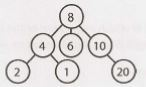

There are occasions when you might have a tree that is not a binary tree. For example, suppose you were using a tree to represent  a bunch  of phone  numbers.  In this case, you might  use a 10-ary tree, with each node  having  up to 10 children (one for each digit).

A node is called a "leaf" node if it has no children.


#### Binary Tree vs. Binary Search Tree

A binary search tree is a binary tree in which every node fits a specific ordering property: all left descendents  <= n < all right descendents. This must be true for each node n.


> The definition of a binary search tree can vary slightly with respect to equality. Under some definitions, the tree cannot have duplicate values. In others, the duplicate values will be on the right or can be on either side. All are valid definitions, but you should clarify this with your interviewer.


Note that this inequality must be true for all of a node's descendents, not just its immediate children. The following tree on the left below is a binary search tree. The tree on the right is not, since  12 is to the left of 8.

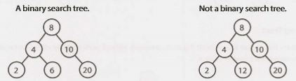

When given a tree question, many candidates assume the interviewer means a binary search  tree. Be sure to ask. A binary search tree imposes the condition  that, for each node, its left descendents are less than or equal to the current node, which is less than the right descendents.

#### Balanced vs. Unbalanced

While many trees are balanced, not all are. Ask your interviewer for clarification here. Note that balancing a tree does not mean the left and right subtrees are exactly the same size (like you see under "perfect binary trees" in the following diagram).

One way to think about it is that a "balanced" tree really means something more like "not terribly imbalanced". It's balanced enough to ensure O(log n) times for insert and find, but it's not necessarily as balanced as it could be.

Two common types of balanced trees are red-black trees (pg 639) and AVL  trees (pg 637). These are discussed in more detail in the Advanced Topics section.


#### Complete Binary Trees

A complete binary tree is a binary tree in which every level of the tree is fully filled, except for perhaps the last level. To the extent that the last level is filled, it is filled left to right.

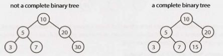


#### Full Binary Trees

A full binary tree is a binary tree in which every node has either zero or two children. That  is, no nodes have only one child.


#### Perfect Binary Trees

A perfect binary tree is one that is both full and complete. All leaf  nodes will be at the same level, and this level has the maximum number of nodes.

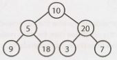


Note that perfect trees are rare in interviews and in real life, as a perfect tree must have exactly 2ᵏ - 1 nodes (where k is the number of levels). In an interview, do not assume a binary tree is perfect.


### Binary Tree Traversal

Prior to your  interview, you  should be  comfortable implementing in-order, post-order, and pre-order traversal. The most common of these is in-order traversal.

#### In-Order Traversal

In-order traversal means to "visit" (often,  print)  the left branch, then the current node, and  finally, the right branch.

```java
1  void inOrderTraversal(TreeNode node) {
2       if (node != null) {
3           inOrderTraversal(node.left);
4           visit(node);
5           inOrderTraversal(node.right);
6      }
7  }
```

When performed on a binary  search tree, it visits the nodes in ascending order (hence the name "in-order").


#### Pre-Order Traversal

Pre-order traversal visits the current node before its child nodes (hence the name "pre-order").

```java
1  void preOrderTraversal(TreeNode node) {
2        if (node != null) {
3             visit(node);
4             preOrderTraversal(node.left);
5             preOrderTraversal(node.right);
6        }
7   }
```

In a pre-order traversal, the root is always the first node visited.


#### Post-Order Traversal

Post-order traversal visits the current node after  its child nodes (hence the name "post-order").

```java
1  void postOrderTraversal(TreeNode node) {
2       if (node != null) {
3             postOrderTraversal(node.left);
4             postOrderTraversal(node.right);
5             visit(node);
6       }
7  }
```

In a post-order traversal, the root is always the last node visited.


### Binary Heaps (Min-Heaps and Max-Heaps)

We'll just discuss min-heaps here. Max-heaps are essentially equivalent, but the elements are in descending order rather than ascending order.

A min-heap is a complete binary  tree (that is, totally filled other than the rightmost elements on the last level) where each node is smaller than its children. The root, therefore, is the minimum element in the tree.


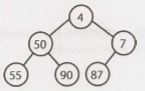

We have two key operations on a min-heap: insert and extract_min.

*Insert*

When we insert into a min-heap, we always start by inserting the element at the bottom. We insert at the rightmost spot so as to maintain the complete tree property.

Then, we "fix" the tree by swapping the new element with its parent, until we find an appropriate spot for the element. We essentially bubble up the minimum element.

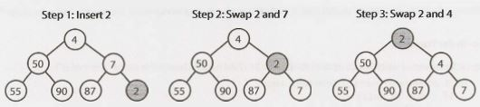

This takes O(log n)  time, where n is the number of nodes in the heap.

*Extract Minimum Element*

Finding the minimum element of a min-heap is easy: it's always at the top. The trickier part is how to remove it. (In fact, this isn't that tricky.)

First, we remove the minimum element and swap it with the last element in the heap (the bottommost, rightmost element). Then, we bubble down this element, swapping it with one of its children until the min-heap property is restored.

Do we swap it with the left child or the right child? That depends  on their values. There's no inherent ordering between  the left and right element, but you'll need to take the smaller one in order to maintain the min-heap ordering.
 
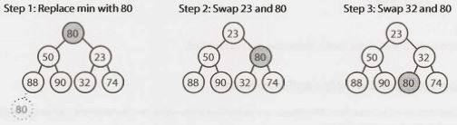

This algorithm will also take O(log n)  time.


### Tries (Prefix Trees)

A trie (sometimes called a prefix tree) is a funny data structure. It comes up a lot in interview questions, but algorithm textbooks don't spend much time on this data structure.

A trie is a variant of an n-ary tree in which characters are stored at each node. Each path down the tree may represent a word.

The * nodes (sometimes called "null nodes") are often used to indicate complete words. For example, the fact that there is a * node under MANY indicates that MANY is a complete word. The existence of the MA path indicates there are words that start with MA.

The actual implementation of these * nodes might be a special type of child (such as a TerminatingTrieNode, which  inherits  from  TrieNode).  Or, we  could  use  just  a  boolean  flag terminates within the "parent" node.

A node in a trie could have anywhere from 1   through  ALPHABET_SIZE +   1 children (or, 0 through ALPHABET_SIZE if a boolean flag is used instead of a* node).


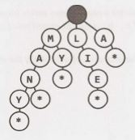


Very commonly, a trie is used to store the entire (English) language for quick prefix lookups. While a hash table can quickly look up whether a string is a valid word, it cannot tell us if a string is a prefix of any valid words. A trie can do this very quickly.


> How quickly? A trie can check if a string is a valid prefix in O(K) time, where K is the length of the string. This is actually the same runtime as a hash table will take. Although we often refer to hash table lookups as being O(1) time, this isn't entirely true. A hash table must read through all the characters in the input, which takes O(K) time in the case of a word lookup.


Many problems involving lists of valid words leverage a trie as an optimization. In situations when we search through the tree on related prefixes repeatedly (e.g., looking up M, then MA, then MAN, then MANY), we might pass around a reference to the current node in the tree. This will allow us to just check if Y is a child of MAN, rather than starting from the root each time.


### Graphs

A tree is actually a type of graph, but not all graphs are trees. Simply put, a tree is a connected graph without cycles.

A graph is simply a collection of nodes with edges between (some of) them.

- Graphs can be either directed (like the following graph) or undirected. While directed edges are like a one-way street, undirected edges are like a two-way street.
- The graph might consist of multiple isolated subgraphs. If there is a path between every pair of vertices, it is called a "connected graph".
- The graph can also have cycles (or not). An "acyclic graph" is one without cycles. 

Visually, you could draw  a graph like this:

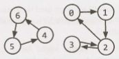

In terms of programming, there are two common ways to represent a graph.


#### Adjacency List

This is the  most common way to represent a graph. Every vertex  (or node) stores a list of adjacent vertices. In an undirected graph, an edge like (a,  b) would be stored twice: once in a's adjacent vertices and once in b's adjacent vertices.

A simple class definition for a graph node could look essentially the same as a tree node.

```java
1   class Graph {
2        public Node[] nodes; 
3   }
4
5   class Node {
6        public String name;
7        public Node[] children;
8   }
```

The Graph class is used because, unlike in a tree, you can't necessarily reach all the nodes from a single node.

You don't necessarily need any  additional classes to  represent a graph. An array  (or a hash table) of lists (arrays, arraylists,  linked  lists, etc.) can store the adjacency list. The graph above could be represented as:

```
0:   1
1:   2
2:   0,  3
3:   2
4:   6
5:   4
6:   5
```

This is a bit more compact, but it isn't quite as clean. We tend to use node classes unless there's a compelling reason not  to.

#### Adjacency Matrices

An adjacency matrix  is an NxN boolean matrix (where N is the  number of nodes), where a true value  at matrix[i][j] indicates an edge from node i to node j. (You can also use an integer matrix with 0s and
1s.)

In an undirected graph, an adjacency matrix will be symmetric. In a directed graph, it will not  (necessarily) be.

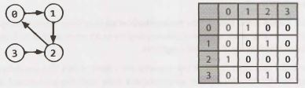

The same graph algorithms that are used on adjacency lists (breadth-first search, etc.) can be performed with adjacency matrices, but they may be somewhat less efficient. In the adjacency list representation, you can easily iterate through the neighbors of a node. In the adjacency matrix representation, you will need to iterate through all the nodes to identify a node's neighbors.


### Graph Search

The two most common ways to search a graph are depth-first search and breadth-first search.

In depth-first search (DFS), we start at the root (or another arbitrarily selected node) and explore each branch completely before moving on to the next branch. That is, we go deep first (hence the name depth-first search) before we go wide.

In breadth-first search (BFS), we start at the root (or another arbitrarily selected node) and explore each neighbor before going on to any of their children. That is, we go wide (hence breadth-first search) before we go deep.

See the below depiction of a graph and its depth-first and breadth-first search (assuming neighbors are iterated in numerical order).

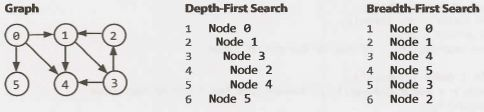

Breadth-first search and depth-first search tend to be used in different scenarios. DFS is often preferred if we want to visit every node in the graph. Both will work just fine, but depth-first search is a bit simpler.

However,  if we want to find the shortest path (or just any path) between two nodes, BFS is generally better. Consider representing all the friendships in the entire world in a graph and trying to find a path of friendships between Ash and Vanessa.

In depth-first search, we could take a path like `Ash -> Brian -> Carleton -> Davis -> Eric -> Farah -> Gayle -> Harry -> Isabella -> John ->  Kari...` and then find ourselves very far away. We could go through most of the world without realizing that, in fact, Vanessa is Ash's friend. We will still eventually find the path, but it may take a long time. It also won't find us the shortest path.

In breadth-first search, we would stay close to Ash for as long as possible. We might iterate through many of Ash's friends, but we wouldn't go to his more distant connections until absolutely necessary. If Vanessa is Ash's friend, or his friend-of-a-friend, we'll find this out relatively quickly.

*Depth-First Search (DFS)*

In DFS, we visit a node a and then iterate through each of a's neighbors. When visiting a node b that is a neighbor of a, we visit all of b's neighbors before going on to a's other neighbors. That is, a exhaustively searches b's branch before any of its other neighbors.

Note that pre-order and other forms of tree traversal are a form of DFS. The key difference is that when implementing this algorithm for a graph, we must check if the node has been visited. If we don't, we risk getting stuck in an infinite loop.

The pseudocode below implements DFS.

```java
1    void search(Node root) {
2       if (root == null) return;
3       visit(root);
4       root.visited = true;
5       for each (Node n in root.adjacent) {
6            if (n.visited == false) {
7                 search(n);
8            }
9       }
10   }
```

*Breadth-First Search (BFS)*

BFS is a bit less intuitive, and many interviewees struggle with the implementation unless they are already familiar with it. The main tripping point is the (false) assumption that  BFS is recursive. It's not. Instead, it uses a queue.

In BFS, node a visits each of a's neighbors before visiting any of their neighbors. You can think of this as searching level by level out from a. An iterative solution involving a queue usually works best.

```java
1   void search(Node root) {
2       Queue queue = new Queue();
3       root.marked = true;
4       queue.enqueue(root); // Add to the end of queue
5  
6       while (!queue.isEmpty()) {
7           Node r = queue.dequeue(); // Remove from the front of the queue
8           visit(r);
9           foreach (Node n in r.adjacent) {
10              if (n.marked == false) {
11                  n.marked = true;
12                  queue.enqueue(n);
13              }
14          }
15      }
16  }
```

If you are asked to implement BFS, the key thing to remember is the use of the queue. The rest of the algorithm flows from this fact.

*Bidirectional Search*

Bidirectional search is used to find the shortest path between  a source and destination  node. It operates by essentially running two simultaneous breadth-first searches, one from each node. When their searches collide, we have found a path.

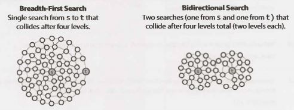

To see why this is faster, consider  a graph  where every node has at most  k adjacent nodes and the shortest path from node s to node t has length d.

- In traditional breadth-first search, we would  search up to k nodes in the first "level" of the search. In the second level, we would  search up to k nodes for each of those first k nodes, so k2 nodes total (thus far). We would do this d times, so that's O(kᵈ) nodes.
- In bidirectional search, we have two searches that collide after approximately d/2 levels (the midpoint of the path). The search from s visits approximately k⁽ᵈ/²⁾ , as does the search from t. That's approximately 2k⁽ᵈ/²⁾, or O(k⁽ᵈ/²⁾), nodes total.

This might seem like a minor  difference,  but it's not. It's huge.  Recall that (kᵈ/²) * (kᵈ/²) = kᵈ. The bidirectional search is actually faster by a factor of kᵈ/².

Put another way: if our system could only support searching "friend of friend" paths in breadth-first search, it could now likely support "friend of friend of friend of friend" paths. We can support paths that are twice as long.

**Additional Reading:** Topological Sort (pg 632), Dijkstra's Algorithm  (pg 633), AVL Trees (pg 637), RedBlackTrees (pg 639).

---

Interview Questions

---

**4.1   Route Between Nodes:** Given a directed graph, design an algorithm to find out whether there is a route between two nodes. 


SOLUTION

---
 
This problem can be solved by just simple graph traversal, such as depth-first search or breadth-first search. We start with one of the two nodes and, during traversal, check if the other node is found. We should mark any  node found in the course of the algorithm as  "already visited" to avoid cycles and repetition of the nodes.

The code below provides an iterative implementation of breadth-first search.

```java
1   enum State { Unvisited, Visited, Visiting; }
2  
3   boolean search(Graph g, Node start, Node end) {
4       if (start == end) return true;
5  
6       // operates as Queue
7       LinkedList<Node> q = new LinkedList<Node>();
8  
9       for (Node u : g.getNodes()) {
10          u.state = State.Unvisited;
11      }
12      start.state = State.Visiting;
13      q.add(start);
14      Node u;
15      while (!q.isEmpty()) {
16          u = q.removeFirst(); // i.e., dequeue()
17          if (u != null) {
18              for (Node v : u.getAdjacent()) {
19                  if (v.state == State.Unvisited) {
20                      if (v == end) {
21                          return true;
22                      } else {
23                          v.state = State.Visiting;
24                          q.add(v);
25                      }
26                  }
27              }
28              u.state = State.Visited;
29          }
30      }
31      return false;
32  }
```

It may be worth discussing with your interviewer the tradeoffs between breadth-first search and depth-first search for this and other problems. For example, depth-first search is a bit simpler to implement since it can be done with simple recursion. Breadth-first search can also be useful to find the shortest path, whereas depth-first search may traverse one adjacent node very deeply before ever going onto the immediate neighbors.


**4.2   Minimal  Tree:**  Given a sorted (increasing order) array with unique  integer elements, write an algorithm to create a binary search tree with minimal height.

SOLUTION

---

To create a tree of minimal height, we need to match the number of nodes in the left subtree to the number of nodes in the right subtree as much as possible. This means that we want the root to be the middle of the array, since this would  mean that half the elements  would  be less than the root and half would  be greater than it.

We proceed with constructing our tree in a similar fashion. The middle of each subsection of the array becomes the root of the node. The left half of the array will become our left subtree, and the right half of the array will become the right subtree.

One way to implement this is to use a simple `root.insertNode(int v)` method which inserts the value v through a recursive process that starts with the root node. This will indeed construct a tree with minimal height but it will not do so very efficiently.  Each insertion  will require traversing the tree, giving a total cost of O(N log N) to the tree.

Alternatively, we can cut out the extra traversals by recursively using the createMinimalBST method. This method is passed just a subsection of the array and returns the root of a minimal tree for that array.

The algorithm is as follows:

1.  Insert into the tree the middle  element of the array.
2.  Insert (into the left subtree) the left subarray elements.
3.  Insert (into the right subtree) the right subarray elements.
4.  Recurse.

The code below implements this algorithm.

```java
1   TreeNode createMinimalBST(int array[]) {
2       return createMinimalBST(array, 0, array.length - 1);
3   }
4  
5   TreeNode createMinimalBST(int arr[], int start, int end) {
6       if (end < start) {
7           return null;
8       }
9       int mid = (start + end) / 2;
10      TreeNode n = new TreeNode(arr[mid]);
11      n.left  = createMinimalBST(arr, start, mid - 1);
12      n.right = createMinimalBST(arr, mid + 1, end);
13      return n;
14  }
```

Although this code does not seem especially complex, it can be very easy to make little off-by-one errors. Be sure to test these parts of the code very thoroughly.


**4.3   List of Depths:** Given a binary tree, design an algorithm which creates a linked list of all the nodes at each depth (e.g., if you have a tree with depth D, you'll have D linked lists).


SOLUTION

---

Though we might think at first glance that this problem requires a level-by-level traversal, this isn't actually necessary. We can traverse the graph any way that we'd like, provided we know which level we're on as we do so.

We can implement a simple modification of the pre-order traversal algorithm, where we pass in level + 1 to the next recursive call. The code below provides an implementation using depth-first search.

```java
1   void createLevelLinkedList(TreeNode root, ArrayList<LinkedList<TreeNode>> lists,
2                               int level) {
3       if (root == null) return; // base case
4  
5       LinkedList<TreeNode> list = null;
6       if (lists.size() == level) { // Level not contained in list
7           list = new LinkedList<TreeNode>();
8           /* Levels are always traversed in order. So, if this is the first time we've
9            * visited level i, we must have seen levels 0 through i - 1. We can
10           * therefore safely add the level at the end. */
11          lists.add(list);
12      } else {
13          list = lists.get(level);
14      }
15      list.add(root);
16      createLevelLinkedList(root.left, lists, level + 1);
17      createLevelLinkedList(root.right, lists, level + 1);
18  }
19  
20  ArrayList<LinkedList<TreeNode>> createLevelLinkedList(TreeNode root) {
21      ArrayList<LinkedList<TreeNode>> lists = new ArrayList<LinkedList<TreeNode>>();
22      createLevelLinkedList(root, lists, 0);
23      return lists;
24  }
```

Alternatively, we can also implement a modification of breadth-first search. With this implementation, we want to iterate through the root first, then level 2, then level 3, and so on.

With each level i, we will have already  fully visited all nodes on level `i -  1`. This means that to get which nodes are on level i, we can simply look at all children of the nodes of level `i - 1`.

The code below implements this algorithm.

```java
1   ArrayList<LinkedList<TreeNode>> createLevelLinkedList(TreeNode root) {
2       ArrayList<LinkedList<TreeNode>> result = new ArrayList<LinkedList<TreeNode>>();
3       /* "Visit" the root */
4       LinkedList<TreeNode> current = new LinkedList<TreeNode>();
5       if (root != null) {
6           current.add(root);
7       }
8  
9       while (current.size() > 0) {
10          result.add(current); // Add previous level
11          LinkedList<TreeNode> parents = current; // Go to next level
12          current = new LinkedList<TreeNode>();
13          for (TreeNode parent : parents) {
14              /* Visit the children*/
15              if (parent.left != null) {
16                  current.add(parent.left);
17              }
18              if (parent.right != null) {
19                  current.add(parent.right);
20              }
21          }
22      }
23      return result;
24  }
```
 

One might ask which of these solutions is more efficient. Both run in O(N) time, but what about the space efficiency? At first, we might want to claim that the second solution is more space efficient.

In a sense, that's correct. The first solution uses O(log N) recursive calls (in a balanced tree), each of which adds a new level to the stack. The second solution, which is iterative, does not require this extra space.

However, both solutions require returning O(N) data. The extra O(log N) space usage from the recursive implementation is dwarfed by the O(N) data that must be returned. So while the first solution may actually use more data, they are equally efficient when it comes to "big O".


**4.4   Check Balanced:** Implement a function to check if a binary tree is balanced. For the purposes of this question, a balanced tree is defined to be a tree such that the heights of the two subtrees of any node never differ by more than one.

SOLUTION

---

In this question, we've been fortunate enough to be told exactly what balanced means: that for each node, the two subtrees differ in height by no more than one. We can implement a solution based on this definition. We can simply recurse through the entire tree, and for each node, compute the heights of each subtree.

```java
1   int getHeight(TreeNode root) {
2       if (root == null) return -1; // Base case
3       return Math.max(getHeight(root.left), getHeight(root.right)) + 1;
4   }
5  
6   boolean isBalanced(TreeNode root) {
7       if (root == null) return true; // Base case
8  
9       int heightDiff = getHeight(root.left) - getHeight(root.right);
10      if (Math.abs(heightDiff) > 1) {
11          return false;
12      } else { // Recurse
13          return isBalanced(root.left) && isBalanced(root.right);
14      }
15  }
```

Although this works. it's not very efficient. On each node. we recurse through its entire subtree. This means that getHeight is called repeatedly on the same nodes. The algorithm is O(N log N) since each node is "touched" once per node above it.

We need to cut out some of the calls to getHeight.

If we inspect this method, we may notice that getHeight could actually check if the tree is balanced at the same time as it's checking heights. What do we do when we discover that the subtree isn't balanced? Just return an error code.

This improved algorithm works by checking the height of each subtree as we recurse down from the root. On each node, we recursively get the heights of the left and right subtrees  through  the checkHeight method. If the subtree is balanced, then checkHeight will return the actual height of the subtree. If the subtree  is not balanced, then checkHeight will return an error code. We will immediately break and return an error code from the current call.


> What do we use for an error code? The height of a null tree is generally defined to be -1, so that's not a great idea for an error code. Instead, we'll use Integer.MIN_VALUE.


The code below implements this algorithm.

```java
1   int checkHeight(TreeNode root) {
2       if (root == null) return -1;
3  
4       int leftHeight = checkHeight(root.left);
5       if (leftHeight == Integer.MIN_VALUE) return Integer.MIN_VALUE; // Pass error up
6  
7       int rightHeight = checkHeight(root.right);
8       if (rightHeight == Integer.MIN_VALUE) return Integer.MIN_VALUE; // Pass error up
9  
10      int heightDiff = leftHeight - rightHeight;
11      if (Math.abs(heightDiff) > 1) {
12          return Integer.MIN_VALUE; // Found error -> pass it back
13      } else {
14          return Math.max(leftHeight, rightHeight) + 1;
15      }
16  }
17  
18  boolean isBalanced(TreeNode root) {
19      return checkHeight(root) != Integer.MIN_VALUE;
20  }
```

This code runs in O(N) time and O(H) space, where H is the height of the tree.

 
**4.5        Validate BST:** Implement a function to check if a binary tree is a binary search tree.

SOLUTION

---

We can implement this solution in two different ways. The first leverages the in-order traversal, and the second builds off the property that left <=  current  <  right.


**Solution #1:  In-Order Traversal**

Our first thought might be to do an in-order traversal, copy the elements to an array, and then check  to see if the array is sorted. This solution takes up a bit of extra memory, but it works-mostly.

The only problem  is that it can't handle duplicate values in the tree properly. For example,  the algorithm cannot distinguish between the two trees below (one of which is invalid) since they have the same in-order traversal.
 
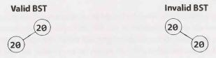

However, if we assume that the tree cannot have duplicate values, then this approach works. The pseudocode for this method looks something like:

```java
1   int index = 0;
2   void copyBST(TreeNode root, int[] array) {
3       if (root == null) return;
4       copyBST(root.left, array);
5       array[index] = root.data;
6       index++;
7       copyBST(root.right, array);
8   }
9  
10  boolean checkBST(TreeNode root) {
11      int[] array = new int[root.size];
12      copyBST(root, array);
13      for (int i = 1; i < array.length; i++) {
14          if (array[i] <= array[i - 1]) return false;
15      }
16      return true;
17  }
```

Note that it is necessary to keep track of the logical "end" of the array, since it would be allocated to hold all the elements.

When we examine this solution, we find that the array is not actually necessary. We never use it other than to compare an element to the previous element. So why not just track the last element we saw and compare it as we go?

The code below implements this algorithm.

```java
1   Integer last_printed = null;
2   boolean checkBST(TreeNode n) {
3       if (n == null) return true;
4  
5       // Check / recurse left
6       if (!checkBST(n.left)) return false;
7  
8       // Check current
9       if (last_printed != null && n.data <= last_printed) {
10          return false;
11      }
12      last_printed = n.data;
13  
14      // Check / recurse right
15      if (!checkBST(n.right)) return false;
16  
17      return true; // All good!
18  }
```

We've used an Integer instead of int so that we can know when last_printed has been set to a value.

If you don't  like the  use of static  variables, then  you can tweak  this code  to use a wrapper  class for the integer, as shown below.
```java
1   class WrapInt {
2        public int value;
3   }
```
Or, if you're implementing this in C++ or another language that  supports passing  integers by reference, then  you can simply do that.

**Solution #2: The Min / Max Solution**

In the second solution, we leverage the definition of the binary search tree.

What does it mean for a tree to be a binary search tree? We know that it must, of course, satisfy the condition `left.data <=  current.data <  right.data` for each node, but this isn't quite sufficient. Consider the following small tree:

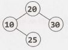


Although  each node is bigger than its left node  and smaller than its right node, this is clearly not a binary search tree since 25 is in the wrong place.

More precisely, the condition is that  all left nodes must  be less than  or equal  to the current  node,  which must be less than all the right nodes.

Using this thought, we can approach the problem  by passing down the min and max values. As we iterate through the tree, we verify against  progressively  narrower ranges.

Consider the following sample tree:

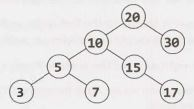

We start with a range of (min  =  NULL,  max  =  NULL), which the root obviously meets. (NULL indicates that there is no min or max.) We then  branch left, checking that these  nodes are within the range  (min  = NULL,  max   =  20). Then, we branch  right, checking  that the nodes are within the range  (min    =  20, max  =  NULL).

We proceed through the tree with this approach. When we branch  left, the  max gets  updated. When we branch right, the min gets updated. If anything fails these checks, we stop and return false.

The time complexity for this solution is O(N), where N is the number of nodes in the tree. We can prove that this is the best we can do, since any algorithm must touch all N nodes.

Due to the use of recursion, the space complexity is O(log  N) on a balanced tree. There are up to O(log N) recursive calls on the stack since we may recurse up to the depth of the tree.

The recursive code for this is as follows:
```java
1   boolean checkBST(TreeNode n) {
2       return checkBST(n, null, null);
3   }
4  
5   boolean checkBST(TreeNode n, Integer min, Integer max) {
6       if (n == null) {
7           return true;
8       }
9       if ((min != null && n.data <= min) || (max != null && n.data > max)) {
10          return false;
11      }
12  
13      if (!checkBST(n.left, min, n.data) || !checkBST(n.right, n.data, max)) {
14          return false;
15      }
16      return true;
17  }
```
Remember that in recursive algorithms, you should always make sure that your base cases, as well as your null cases, are well handled.


**4.6   Successor:** Write an algorithm to find the "next" node (i.e., in-order successor) of a given node in a binary search tree. You may assume that each node has a link to its parent.

SOLUTION

---

Recall that an in-order traversal traverses the left subtree, then the current node, then the right subtree. To approach this problem, we need to think very, very carefully about what happens.

Let's suppose we have a hypothetical node. We know that the order goes left subtree, then current side, then right subtree. So, the next node we visit should be on the right side.

But which node on the right subtree? It should be the first node we'd visit if we were doing an in-order traversal of that subtree. This means that it should be the leftmost node on the right subtree. Easy enough!

But what if the node doesn't have a right subtree? This is where it gets a bit trickier.

If a node n doesn't have a right subtree, then we are done traversing n's subtree. We need to pick up where we left off with n's parent, which we'll call q.

If n was to the left of q, then the next node we should traverse should be q (again, since `left ->  current ->  right`).

If n were to the right of q, then we have fully traversed q's subtree as well. We need to traverse upwards from q until we find a node x that we have not fully traversed.  How do we know that we have not fully traversed a node x? We know we have hit this case when we move from a left node to its parent. The left node is fully traversed, but its parent is not.

The pseudocode looks like this:
```
1   Node inorderSucc(Node n) {
2       if (n has a right subtree) {
3           return leftmost child of right subtree
4       } else {
5           while (n is a right child of n.parent) {
6               n = n.parent; // Go up
7           }
8           return n.parent; // Parent has not been traversed
9       }
10  }
```
But wait-what if we traverse all the way up the tree before finding a left child? This will happen only when we hit the very end of the in-order traversal. That is, if we're already on the far right of the tree, then there is no in-order successor. We should return null.

The code below implements this algorithm (and properly handles the null case).

```java
1   TreeNode inorderSucc(TreeNode n) {
2       if (n == null) return null;
3  
4       /* Found right children -> return leftmost node of right subtree. */
5       if (n.right != null) {
6           return leftMostChild(n.right);
7       } else {
8           TreeNode q = n;
9           TreeNode x = q.parent;
10          // Go up until we're on left instead of right
11          while (x != null && x.left != q) {
12              q = x;
13              x = x.parent;
14          }
15          return x;
16      }
17  }
18  
19  TreeNode leftMostChild(TreeNode n) {
20      if (n == null) {
21          return null;
22      }
23      while (n.left != null) {
24          n = n.left;
25      }
26      return n;
27  }
```

This is not the most algorithmically complex problem in the world, but it can be tricky to code perfectly. In a problem like this, it's useful to sketch out pseudocode to carefully outline the different cases.


**4.7   Build Order:** You are given a list of projects and a list of dependencies (which is a list of pairs of projects, where the second project is dependent on the first project). All of a project's dependencies must be built before the project is. Find a build order that will allow the projects to be built. If there is no valid build order, return an error.

EXAMPLE 

```
Input:
    projects:  a, b, c, d, e, f
    dependencies: (a, d), (f, b), (b, d), (f, a), (d, c) 

Output: f, e, a, b, d, c
```

SOLUTION

---

Visualizing the information as a graph probably works best. Be careful  with the direction of the arrows. In the graph below, an arrow from d to g means that d must be compiled before g. You can also draw them in the opposite direction, but you need to consistent and clear about what you mean. Let's draw a fresh example.


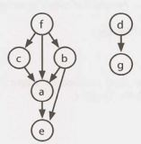


In drawing this example (which is not the example from the problem description), I looked for a few things.

- I wanted the nodes labeled somewhat randomly. If I had instead put a at the top, with b and c as children, then d and e, it could be misleading. The alphabetical order would match the compile order.
- I wanted a graph with multiple parts/components, since a connected graph is a bit of a special case.
- I wanted a graph where a node links to a node that cannot immediately follow it. For example,  f links to a but a cannot immediately follow it (since b and c must come before a and after f).
- I wanted a larger graph since I need to figure out the pattern.
- I wanted nodes with multiple dependencies.

Now that we have a good example, let's get started with an algorithm.

**Solution#1**

Where do we start? Are there any nodes that we can definitely compile immediately?

Yes. Nodes with no incoming edges can be built immediately since they don't depend on anything. Let's add all such nodes to the build order.  In the earlier example, this means we have an order of f, d (or d, f).

Once we've done that, it's irrelevant that some nodes are dependent on d and f since d and f have already been built. We can reflect this new state by removing d and f's outgoing edges.

    build   order: f,  d

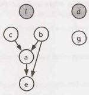


Next, we know that c, b, and g are free to build since they have no incoming edges. Let's build those and then remove their outgoing edges.

    build  order: f,  d,  c,  b,  g

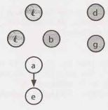


Project a can be built next, so let's do that and remove its outgoing edges. This leaves just e. We build that next, giving us a complete build order.

    build  order:   f,  d,  c,  b,  g,  a,  e

Did this algorithm work, or did we just get lucky? Let's think about the logic.

1. We first added the nodes with no incoming edges. If the set of projects can be built, there must be some "first" project, and that project can't have any dependencies.  If a project has no dependencies (incoming edges), then we certainly can't break anything by building it first.
2. We removed all outgoing edges from these roots. This is reasonable. Once those root projects were built, it doesn't matter if another project depends  on them.
3. After that, we found the nodes that now have no incoming edges. Using the same logic from steps 1 and 2, it's okay if we build these. Now we just repeat the same steps: find the nodes with no dependencies, add them to the build order, remove their outgoing edges, and repeat.
4. What if there are nodes remaining, but all have dependencies (incoming edges)? This means there's no way to build the system. We should return an error.

The implementation follows this approach very closely. 

Initialization and setup:

1. Build a graph where each project is a node and its outgoing edges represent the projects that depend on it. That is, if A has an edge to B (A-> B), it means B has a dependency  on A and therefore A must be built before B. Each node also tracks the number of incoming edges.
2. Initialize a buildOrder array. Once we determine a project's build order, we add it to the array. We also continue to iterate through the array, using a toBeProcessed pointer to point to the next node to be fully processed.
3. Find all the  nodes  with zero incoming edges  and  add  those  to  a  buildOrder array. Set a toBeProcessed pointer to the beginning of the array.

Repeat until toBeProcessed is at the end of the buildOrder:

1.  Read node at toBeProcessed.

    - If node is null, then all remaining nodes have a dependency and we have detected a cycle.

2.  For each child of node:

    - Decrement child.dependencies (the number of incoming edges).
    - If child.dependencies is zero, add child to end of buildOrder.

3.  Increment toBeProcessed.

The code below implements this algorithm.

```java
1    /* Find a correct build order. */
2    Project[] findBuildOrder(String[] projects, String[][] dependencies) {
3       Graph graph = buildGraph(projects, dependencies);
4       return orderProjects(graph.getNodes());
5    }
6  
7    /* Build the graph, adding the edge (a, b) if b is dependent on a. Assumes a pair
8     * is listed in "build order". The pair (a, b) in dependencies indicates that b
9     * depends on a and a must be built before b. */
10   Graph buildGraph(String[] projects, String[][] dependencies) {
11      Graph graph = new Graph();
12      for (String project : projects) {
13          graph.createNode(project);
14      }
15      
16      for (String[] dependency : dependencies) {
17          String first  = dependency[0];
18          String second = dependency[1];
19          graph.addEdge(first, second);
20      }
21      
22      return graph;
23   }
24  
25   /* Return a list of the projects a correct build order. */
26   Project[] orderProjects(ArrayList<Project> projects) {
27      Project[] order = new Project[projects.size()];
28  
29      /* Add "roots" to the build order first. */
30      int endOfList = addNonDependent(order, projects, 0);
31  
32      int toBeProcessed = 0;
33      while (toBeProcessed < order.length) {
34          Project current = order[toBeProcessed];
35  
36          /* We have a circular dependency since there are no remaining projects with
37           * zero dependencies. */
38          if (current == null) {
39              return null;
40          }
41  
42          /* Remove myself as a dependency. */
43          ArrayList<Project> children = current.getChildren();
44          for (Project child : children) {
45              child.decrementDependencies();
46          }
47  
48          /* Add children that have no one depending on them. */
49          endOfList = addNonDependent(order, children, endOfList);
50          toBeProcessed++;
51      }
52  
53      return order;
54   }
55  
56   /* A helper function to insert projects with zero dependencies into the order
57    * array, starting at index offset. */
58   int addNonDependent(Project[] order, ArrayList<Project> projects, int offset) {
59      for (Project project : projects) {
60          if (project.getNumberDependencies() == 0) {
61              order[offset] = project;
62              offset++;
63              }
64          }
65      return offset;
66   }
67  
68   public class Graph {
69      private ArrayList<Project> nodes = new ArrayList<Project>();
70      private HashMap<String, Project> map = new HashMap<String, Project>();
71      
72      public Project getOrCreateNode(String name) {
73          if (!map.containsKey(name)) {
74              Project node = new Project(name);
75              nodes.add(node);
76              map.put(name, node);
77          }
78          
79          return map.get(name);
80      }
81      
82      public void addEdge(String startName, String endName) {
83          Project start = getOrCreateNode(startName);
84          Project end   = getOrCreateNode(endName);
85          start.addNeighbor(end);
86      }
87      
88      public ArrayList<Project> getNodes() { return nodes; }
89   }
90  
91   public class Project {
92      private ArrayList<Project> children = new ArrayList<Project>();
93      private HashMap<String, Project> map = new HashMap<String, Project>();
94      private String name;
95      private int dependencies = 0;
96      
97      public Project(String n) { name = n; }
98      
99      public void addNeighbor(Project node) {
100         if (!map.containsKey(node.getName())) {
101             children.add(node);
102             map.put(node.getName(), node);
103             node.incrementDependencies();
104         }
105     }
106     
107     public void incrementDependencies() { dependencies++; }
108     public void decrementDependencies() { dependencies--; }
109     
110     public String getName() { return name; }
111     public ArrayList<Project> getChildren() { return children; }
112     public int getNumberDependencies() { return dependencies; }
113  }
```

This solution takes O(P + D) time, where P is the number of projects and  D is the  number of dependency pairs.


> Note:  You might recognize this as the  topological sort algorithm on page 632. We've rederived this from scratch. Most people won't  know  this algorithm and  it's reasonable for an interviewer to expect you to be able to derive it.


**Solution #2**

Alternatively, we can use depth-first search (DFS) to find the build  path.


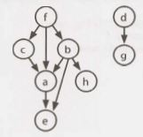

Suppose we picked an arbitrary node (say b) and  performed a depth-first search on it. When  we get  to the end of a path and  can't  go  any  further (which will happen at h and  e), we know  that those terminating nodes can be the  last projects to be built.  No projects depend on them.
```
DFS(b)                               // Step  1
    DFS(h)                           // Step  2
        build order = ...,  h        // Step  3
    DFS(a)                           // Step  4
        DFS(e)                       // Step  5
            build order = ..., e, h  // Step  6
        ...                          // Step  7+
    ...
```

Now, consider what happens at node a when we return from  the  DFS of e. We know  a's children need to appear after  a in the  build  order.  So, once we return from searching a's children (and  therefore they have been added), we can choose to add  a to the  front of the  build order.

Once we return from a, and complete the DFS of b's other children, then everything that must appear after b is in the list. Add b to the front.

```
DFS(b)                                  // Step  1
    DFS(h)                              // Step  2
        build order = ... ,  h          // Step  3
    DFS(a)                              // Step  4
        DFS(e)                          // Step  5
            build order =   ..., e, h   // Step  6
        build order =  ..., a,   e, h   // Step  7
    DFS(e)  -> return                   // Step  8
    build order =  ...,   b, a, e, h    // Step  9
```

Let's mark these nodes as having been built too, just in case someone else needs to build them.


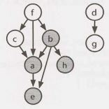


Now what? We can start with any old node again, doing a DFS on it and then adding the node to the front of the build queue when the DFS is completed.
```
DFS(d) 
    DFS(g)
        build order =  ...,  g,  b,  a,  e,  h 
    build order =  ...,   d,  g,  b,  a,  e,  h
DFS(f) 
    DFS(c)
        build order =  ...,   c,  d,  g,  b,  a,  e,  h 
        build order = f,  c,  d,  g,  b,  a,  e,  h
```
In an algorithm like this, we should think about the issue of cycles. There is no possible build order if there is a cycle. But still, we don't want to get stuck in an infinite loop just because there's no possible solution.

A cycle will happen if, while doing a DFS on a node, we run back into the same path. What we need therefore is a signal that indicates "I'm still processing this node, so if you see the node again, we have a problem."

What we can do for this is to mark each node as a "partial" (or "is visiting") state just before we start the DFS on it. If we see any node whose state is partial, then we know we have a problem. When we're done with this node's DFS, we need to update the state.

We also need a state to indicate "I've already processed/built this node" so we don't re-build the node. Our state therefore can have three options: COMPLETED, PARTIAL, and BLANK.

The code below implements this algorithm.

```java
1   Stack<Project> findBuildOrder(String[] projects, String[][] dependencies) {
2       Graph graph = buildGraph(projects, dependencies);
3       return orderProjects(graph.getNodes());
4   }
5  
6   Stack<Project> orderProjects(ArrayList<Project> projects) {
7       Stack<Project> stack = new Stack<Project>();
8       for (Project project : projects) {
9           if (project.getState() == Project.State.BLANK) {
10              if (!doDFS(project, stack)) {
11                  return null;
12              }
13          }
14      }
15      return stack;
16  }
17  
18  boolean doDFS(Project project, Stack<Project> stack) {
19      if (project.getState() == Project.State.PARTIAL) {
20          return false; // Cycle
21      }
22  
23      if (project.getState() == Project.State.BLANK) {
24          project.setState(Project.State.PARTIAL);
25          ArrayList<Project> children = project.getChildren();
26          for (Project child : children) {
27              if (!doDFS(child, stack)) {
28                  return false;
29              }
30          }
31          project.setState(Project.State.COMPLETE);
32          stack.push(project);
33      }
34      return true;
35  }
36  
37  /* Same as before*/
38  Graph buildGraph(String[] projects, String[][] dependencies) {...}
39  public class Graph {}
40  
41  /* Essentially equivalent to earlier solution, with state info added and
42   * dependency count removed. */
43  public class Project {
44      public enum State {COMPLETE, PARTIAL, BLANK};
45      private State state = State.BLANK;
46      public State getState() { return state; }
47      public void setState(State st) { state = st; }
48      /* Duplicate code removed for brevity */
49  }
```

Like the earlier algorithm, this solution is O(P+D) time, where P is the number of projects and D is the number of dependency pairs.

By the way, this problem is called **topological sort:**  linearly ordering the vertices in a graph such that for every edge (a, b), a appears before b in the linear order.

**4.8       First Common Ancestor:** Design an algorithm and write code to find the first common ancestor of two nodes in a binary tree. Avoid storing additional nodes in a data structure. NOTE: This is not necessarily a binary search tree.

SOLUTION

---

If this were a binary search tree, we could modify the find operation for the two nodes and see where the paths diverge. Unfortunately, this is not a binary search tree, so we must try other approaches.

Let's assume we're looking for the common ancestor of nodes p and q. One question to ask here is if each node in our tree has a link to its parents.

**Solution #1: With Links to Parents**

If each node has a link to its parent, we could trace p and q's paths up until they intersect. This is essentially the same problem as question 2.7 which find the intersection of two linked lists. The "linked list" in this case is the path from each node up to the root. (Review this solution on page 221.)

```java
1   TreeNode commonAncestor(TreeNode p, TreeNode q) {
2       int delta = depth(p) - depth(q); // get difference in depths
3       TreeNode first  = delta > 0 ? q : p; // get shallower node
4       TreeNode second = delta > 0 ? p : q; // get deeper node
5       second = goUpBy(second, Math.abs(delta)); // move deeper node up
6  
7       /* Find where paths intersect. */
8       while (first != second && first != null && second != null) {
9           first  = first.parent;
10          second = second.parent;
11      }
12      return first == null || second null ? null : first;
13  }
14  
15  TreeNode goUpBy(TreeNode node, int delta) {
16      while (delta > 0 && node != null) {
17          node = node.parent;
18          delta--;
19      }
20      return node;
21  }
22  
23  int depth(TreeNode node) {
24      int depth = 0;
25      while (node != null) {
26          node = node.parent;
27          depth++;
28      }
29      return depth;
30  }
```

This approach will take O(d)  time, where d is the depth of the deeper node.

**Solution #2: With Links to Parents (Better Worst-Case Runtime)**

Similar to the  earlier approach, we could trace p's path  upwards and check if any of the nodes cover  q. The first node that covers q (we already know that every node on this path will cover p) must be the first common ancestor.

Observe that we don't need to re-check the entire subtree. As we move from a node x to its parent y, all the nodes under x have already been checked for q. Therefore, we only need to check the new nodes "uncovered", which will be the nodes under x's sibling.

For example, suppose we're looking for the first common ancestor of node p = 7 and node  q = 17. When we go to p.parent(5), we uncover the subtree  rooted at 3. We therefore need  to search this subtree for q.

Next, we go to node 10, uncovering the subtree rooted at 15. We check this subtree  for node 17 and-voila-there it is.

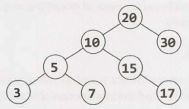


To implement this, we can just traverse upwards from p, storing the parent and the sibling node in a variable. (The sibling node is always a child of parent and refers to the newly uncovered  subtree.) At each iteration, sibling gets set to the old parent's sibling node and parent gets set to `parent.parent`.

```java
1   TreeNode commonAncestor(TreeNode root, TreeNode p, TreeNode q) {
2       /* Check if either node is not in the  tree, or if one covers the  other. */
3       if (!covers(root, p) || !covers(root, q)) {
4           return null;
5       } else if (covers(p, q)) {
6           return p;
7       } else if (covers(q, p)) {
8           return q;
9       }
10  
11      /* Traverse upwards until you find a node that covers q. */
12      TreeNode sibling = getSibling(p);
13      TreeNode parent  = p.parent;
14      while (!covers(sibling, q)) {
15          sibling = getSibling(parent);
16          parent = parent.parent;
17      }
18      return parent;
19  }
20  
21  boolean covers(TreeNode root, TreeNode p) {
22      if (root == null) return false;
23      if (root == p) return true;
24      return covers(root.left, p) || covers(root.right, p);
25  }
26  
27  TreeNode getSibling(TreeNode node) {
28      if (node == null || node.parent == null) {
29          return null;
30      }
31  
32      TreeNode parent = node.parent;
33      return parent.left == node ? parent.right : parent.left;
34  }
```

This algorithm takes O(t) time, where t is the size of the subtree for the first common ancestor. In the worst case, this will be O(n), where n is the number of nodes in the tree. We can derive this runtime by noticing that each node in that subtree is searched once.

**Solution #3: Without Links to Parents**

Alternatively, you could follow a chain in which p and q are on the same side. That is, if p and q are both on the left of the node, branch left to look for the common ancestor. If they are both on the right, branch right to look for the common ancestor. When p and q are no longer on the same side, you must have found the first common ancestor.

The code below implements this approach.

```java
1   TreeNode commonAncestor(TreeNode root, TreeNode p, TreeNode q) {
2       /* Error check - one node is not in the tree. */
3       if (!covers(root, p) || covers(root, q)) {
4           return null;
5       }
6       return ancestorHelper(root, p, q);
7   }
8   
9   TreeNode ancestorHelper(TreeNode root, TreeNode p, TreeNode q) {
10      if (root == null || root == p || root == q) {
11          return root;
12      }
13  
14      boolean pIsOnleft = covers(root.left, p);
15      boolean qIsOnLeft = covers(root.left, q);
16      if (pIsOnLeft != qIsOnLeft) {//Nodes are on different side
17          return root;
18      }
19      TreeNode childSide = pIsOnLeft ? root.left : root.right;
20      return ancestorHelper(childSide, p, q);
21  }
22  
23  boolean covers(TreeNode root, TreeNode p) {
24      if (root == null) return false;
25      if (root == p) return true;
26      return covers(root.left, p) || covers(root.right, p);
27  }
```

This algorithm runs in O(n) time on a balanced tree. This is because covers is called on 2n nodes in the first call (n nodes for the left side, and n nodes for the right side). After that the algorithm branches left or right, at which point covers will be called on  ²ⁿ/₂  nodes, then  ²ⁿ/₄, and so on. This results in a runtime of O(n).

We know at this point that we cannot do better than that in terms of the asymptotic runtime since we need to potentially look at every node in the tree. However, we may be able to improve it by a constant multiple.

**Solution #4: Optimized**

Although Solution #3 is optimal in its runtime, we may recognize that there is still some inefficiency in how it operates. Specifically, covers searches all nodes under root for p and q, including the nodes in each subtree (root. left and root.right). Then, it picks one of those subtrees and searches all of its nodes. Each subtree is searched over and over again.

We may recognize that we should only need to search the entire tree once to find p and q. We should then be able to "bubble up" the findings to earlier nodes in the stack. The basic logic is the same as the earlier solution.

We recurse through the entire tree with a function called `commonAncestor(TreeNode root, TreeNode p, TreeNode q)`. This function returns values as follows:

- Returns p, if root's subtree includes p (and not q). 
- Returns q, if root's subtree includes q (and not p). 
- Returns null, if neither p nor q are in root's subtree. 
- Else, returns the common ancestor of p and q.

Finding the common ancestor of p and q in the final case is easy. When commonAncestor(n.left, p, q) and commonAncestor(n.right, p,  q) both return non-null values (indicating that p and q were found in different subtrees), then n will be the common ancestor.

The code below offers an initial solution, but it has a bug. Can you find it?

```java
1   /* The below code has a bug. */
2   TreeNode commonAncestor(TreeNode root, TreeNode p, TreeNode q) {
3       if (root == null) return null;
4       if (root == p && root == q) return root;
5  
6       TreeNode x = commonAncestor(root.left, p, q);
7       if (x != null && x != p && x != q) { // Already found ancestor
8           return x;
9       }
10  
11      TreeNode y = commonAncestor(root.right, p, q);
12      if (y != null && y != p && y != q) { // Already found ancestor
13          return y;
14      }
15  
16      if (x != null && y != null) { // p and q found in diff. subtrees
17          return root; // This is the common ancestor
18      } else if (root == p || root == q) {
19          return root;
20      } else {
21          return x == null ? y : x; /* return the non-null value */
22      }
23  }
```

The problem with this code occurs in the case where a node is not contained in the tree. For example, look at the following tree:

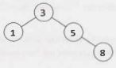


Suppose we call commonAncestor(node  3,  node  5,  node 7). Of course, node 7 does not exist and that's where the issue will come in. The calling order looks like:

```
1    commonAnc(node  3, node 5, node 7)                     //--> 5
2        calls commonAnc(node  1, node 5, node 7)           //--> null
3           calls commonAnc(node  5,  node 5,  node 7)      //--> 5
4               calls commonAnc(node  8,  node 5,  node 7)  //--> null
```

In other words, when we call commonAncestor on the right subtree, the code will return node 5, just as it should. The problem is that in finding the common ancestor of p and q, the calling function can't distinguish between the two cases:

- Case 1: p is a child of q (or, q is a child of p)
- Case 2: p is in the tree and q is not (or, q is in the tree and p is not)

In either of these cases, commonAncestor will return p. In the first case, this is the correct return value, but in the second case, the return value should be null.

We somehow need to distinguish between these two cases, and this is what the code below does. This code solves the problem by returning two values: the node itself and a flag indicating whether this node is actually the common ancestor.

```java
1   class Result {
2       public TreeNode node;
3       public boolean isAncestor;
4       public Result(TreeNode n, boolean isAnc) {
5           node = n;
6           isAncestor = isAnc;
7       }
8   }
9  
10  TreeNode commonAncestor(TreeNode root, TreeNode p, TreeNode q) {
11      Result r = commonAncestorHelper(root, p, q);
12      if  (r.isAncestor) {
13          return r.node;
14      }
15      return null;
16  }
17  
18  Result commonAncHelper(TreeNode root, TreeNode p, TreeNode q) {
19      if (root == null) return new Result(null, false);
20  
21      if (root == p && root == q) {
22          return new Result(root, true);
23      }
24  
25      Result rx = commonAncHelper(root.left, p, q);
26      if (rx.isAncestor) { // Found common ancestor
27          return rx;
28      }
29  
30      Result ry = commonAncHelper(root.right, p, q);
31      if (ry.isAncestor) { // Found common ancestor
32          return ry;
33      }
34  
35      if (rx.node != null && ry.node != null) {
36          return new Result(root, true); // This is the common ancestor
37      } else if (root == p || root == q) {
38          /* If we're currently at p or q, and we also found one of those nodes in a
39           * subtree, then this is truly an ancestor and the flag should be true. */
40          boolean isAncestor = rx.node != null || ry.node != null;
41          return new Result(root, isAncestor);
42      } else {
43          return new Result(rx.node != null ? rx.node : ry.node, false);
44      }
45  }
```
 
Of course, as this issue only comes up when p or q is not actually in the tree, an alternative solution would be to first search through the  entire tree  to make sure  that both nodes exist.

**4.9   BST Sequences:** A binary  search tree  was created by traversing through an array from left to right and inserting each element. Given  a binary  search tree  with  distinct elements, print  all possible arrays that could have  led to this tree.

EXAMPLE

```
Input:
            2
          /   \
        1       3

Output: {2,   1,   3}, {2,  3,  1}
```
 
SOLUTION

---

It's useful to kick off this question with a good example.

```
            50
          /    \
        20      60
       /  \    /  \
     10     25      70
   /   \   /   \   /   \
  5     15      65      80
```

We should also think  about the  ordering of items in a binary  search tree.  Given a node, all nodes on its left must be  less than all nodes on  its right.  Once  we reach a place  without a node, we insert the  new  value there.

What this means is that the  very first element in our array must have  been a 50 in order to create the  above tree.  If it were  anything else, then that value  would have  been the  root  instead.

What  else  can  we say? Some  people jump to the  conclusion that everything on the  left must have  been inserted before elements on the right, but that's not  actually true.  In fact, the reverse is true: the order of the left or right  items doesn't matter.

Once  the  50 is inserted, all items less than 50 will be routed to the  left and all items greater than 50 will be routed to the  right. The 60 or the  20 could be inserted first, and it wouldn't matter.

Let's think  about this problem recursively.  If we had all arrays  that could have  created the  subtree rooted at  20  (call this  arraySet20),  and all arrays  that could have  created the  subtree rooted at 60 (call this arraySet60), how would that give us the full answer? We could just "weave" each array from array5et20 with each array from arraySet60-and then prepend each array with a 50.

Here's what we mean by weaving. We are merging two arrays in all possible ways, while keeping the elements within each array in the same relative order.
```
arrayl: {1, 2}
array2: {3, 4}
weaved: {1, 2, 3, 4}, {1, 3, 2, 4}, {1, 3, 4, 2},
        {3, 1, 2, 4}, {3, 1, 4, 2}, {3, 4, 1, 2}
```
Note that, as long as there  aren't any duplicates in the original array sets, we won't have to worry that weaving will create duplicates.

The last piece to talk about here is how the weaving works Let's think recursively about how to weave {1, 2, 3} and {4, 5,  6}. What are the subproblems?

- Prepend a 1 to all weaves of {2,  3} and {4,  5,   6}. 
- Prepend a 4 to all weaves of {1,  2,  3} and {5,   6}.

To implement this, we'll store each as linked lists. This will make it easy to add and remove elements. When we recurse, we'll push the prefixed elements down the recursion When first or second are empty, we add the remainder to prefix and store the result.

It works something like this:
```
weave(first,  second,   prefix):
    weave({1,   2},  {3,   4},  {})
        weave({2},   {3,   4},   {1})
            weave({},   {3,   4},   {1, 2})
                {1,   2,   3,  4}
            weave({2},   {4},  {1,   3})
                weave({},   {4},   {1,   3,  2})
                    {1,   3,  2,  4}
                weave({2},   {},   {1, 3,  4})
                    {1, 3,  4,   2}
        weave({l,  2},  {4},   {3})
            weave({2},  {4},   {3,   1})
                weave({},   {4},   {3,   1,   2})
                    {3,   1,   2,  4}
                weave({2},   {},   {3,   1,   4})
                    {3,   1,  4,   2}
            weave({1,  2},  {},   {3,   4})
                {3,   4,   1,   2}
```

Now, let's think through the implementation of removing, say, 1 from {1,   2} and recursing. We need to be careful about modifying this list, since a later recursive call (e.g., weave({1, 2}, {4}, {3})) might need the 1 still in {1,  2}.

We could clone the list when we recurse, so that we only modify the recursive calls. Or, we could modify the list but then "revert" the changes after we're done with recursing.

We've chosen to implement it the latter way. Since we're keeping the same reference to first, second, and prefix the entire way down the recursive call stack, then we'll need to clone prefix just before we store the complete result.

```java
1   ArrayList<LinkedList<Integer>> allSequences(TreeNocte node) {
2       ArrayList<LinkedList<Integer>> result = new ArrayList<LinkedList<Integer>>();
3   
4       if (node == null) {
5           result.add(new LinkedList<Integer>());
6           return result;
7       }
8   
9       LinkedList<Integer> prefix = new LinkedList<Integer>();
10      prefix.add(node.data);
11  
12      /* Recurse on left and right subtrees. */
13      ArrayList<LinkedList<Integer>> leftSeq  = allSequences(node.left);
14      ArrayList<LinkedList<Integer>> rightSeq = allSequences(node.right);
15  
16      /* Weave together each list from the left and right sides. */
17      for (LinkedList<Integer> left : leftSeq) {
18          for (LinkedList<Integer> right : rightSeq) {
19              ArrayList<LinkedList<Integer>> weaved =
20                          new ArrayList<LinkedList<Integer>>();
21              weaveLists(left, right, weaved, prefix);
22              result.addAll(weaved);
23          }
24      }
25      return result;
26  }
27  
28  /* Weave lists together in all possible ways. This algorithm works by removing the
29   * head from one list, recursing, and then doing the same thing with the other
30   * list. */
31  void weaveLists(LinkedList<Integer> first, LinkedList<Integer> second,
32      ArrayList<LinkedList<Integer>> results, LinkedList<Integer> prefix) {
33      /* One list is empty. Add remainder to [a cloned] prefix and store result. */
34      if (first.size() == 0 || second.size() == 0) {
35          LinkedList<Integer> result = (LinkedList<Integer>) prefix.clone();
36          result.addAll(first);
37          result.addAll(second);
38          results.add(result);
39          return;
40      }
41      
42      /* Recurse with head of first added to the prefix. Removing the head will damage
43       * first, so we'll need to put it back where we found it afterwards. */
44      int headFirst = first.removeFirst();
45      prefix.addLast(headFirst);
46      weaveLists(first, second, results, prefix);
47      prefix.removeLast();
48      first.addFirst(headFirst);
49      
50      /* Do the same thing with second, damaging and then restoring the list.*/
51      int headSecond = second.removeFirst();
52      prefix.addLast(headSecond);
53      weaveLists(first, second, results, prefix);
54      prefix.removeLast();
55      second.addFirst(headSecond);
56  }
```

Some people struggle with this problem because there are two different recursive algorithms that must be designed and implemented. They get confused with how the algorithms should interact with each other and they try to juggle both in their heads.

If this sounds like you, try this: trust and focus. Trust that one method does the right thing when implementing an independent method, and focus on the one thing that this independent method needs to do.

Look at weaveLists. It has a specific job: to weave two lists together and return a list of all possible weaves. The existence of allSequences is irrelevant. Focus on the task that weaveLists has to do and design this algorithm.

As you're implementing allSequences (whether you do this before or after weaveLists), trust that weaveLists will do the right thing. Don't concern yourself with the particulars of how weaveLists operates while implementing something that is essentially independent. Focus on what you're doing while you're doing it.

In fact, this is good advice in general when you're confused during whiteboard coding. Have a good understanding of what a particular function should do ("okay, this function is going to return a list of \__"). You should verify that it's really doing what you think. But when you're not dealing with that function, focus on the one you are dealing with and trust that the others do the right thing. It's often too much to keep the implementations of multiple algorithms straight in your head.


**4.10      Check Subtree:** T1 and T2 are two very large binary trees, with T1 much bigger than T2. Create an algorithm to determine if T2 is a subtree of T1.

A tree T2 is a subtree of T1  if there exists a node n in T1  such that the subtree of n is identical to T2. 

That is, if you cut off the tree at node n, the two trees would be identical.

SOLUTION

---

In problems like this, it's useful to attempt to solve the problem assuming that there is just a small amount of data. This will give us a basic idea of an approach that might work.

**The Simple Approach**

In this smaller, simpler problem, we could consider comparing string representations of traversals of each tree. if T2 is a subtree of T1, then T2's traversal should be a substring of T1. Is the reverse true? If so,  should we use an in-order traversal or a pre-order traversal?

An in-order traversal will definitely not work. After all, consider a scenario in which we were using binary search  trees. A binary search tree's in-order traversal always prints out the values in sorted order. Therefore, two binary search trees with the same values will always have the same in-order traversals, even if their structure is different.

What about a pre-order traversal? This  is a bit more promising.  At least in this case we know certain things, like the first element in the pre-order traversal is the root node. The left and right elements will follow.

Unfortunately, trees with different structures could still have the same pre-order traversal.

```
    3        3
   /          \
  4            4
```
There's a simple  fix though. We can store NULL nodes in the pre-order traversal string as a special character, like an 'X'. (We'll  assume that the binary trees contain only integers.)The left tree would have the traversal { 3,   4,   X} and the right tree will have the traversal {3, X, 4}.

Observe that, as long as we represent the NULL nodes, the pre-order traversal of a tree is unique. That is, if two trees have the same pre-order traversal, then we know they are identical trees in values and structure.

To see this, consider reconstructing a tree from its pre-order  traversal (with NULL nodes indicated). For example: 1, 2, 4, X, X, X, 3, X, X.

The root is 1, and its left node, 2, follows it. 2.left must be 4. 4 must have two NULL nodes (since it is followed by two Xs). 4 is complete, so we move back up to its parent, 2. 2.right is another X (NULL). 1's left subtree is now complete, so we move to 1's right child. We place a 3 with two NULL children there. The tree is now complete.

```
             1
          /     \
        2         3
      /   \     /   \
     4     x   x     x
   /  \
 x      x
```

This whole process was deterministic, as it will be on any other tree. A pre-order traversal always starts at the root and, from there, the path we take is entirely defined by the traversal. Therefore, two trees are identical if they have the same pre-order traversal.

Now consider the subtree problem. If T2's pre-order traversal is a substring of T1's pre-order traversal, then T2's root element must be found in T1. If we do a pre-order traversal from this element in T1, we will follow an identical path toT2's traversal. Therefore, T2 is a subtree of T1.

Implementing this is quite straightforward. We just need to construct and compare the pre-order traversals.

```java
1   boolean containsTree(TreeNode t1, TreeNode t2) {
2       StringBuilder string1 = new StringBuilder();
3       StringBuilder string2 = new StringBuilder();
4  
5       getOrderString(t1, string1);
6       getOrderString(t2, string2);
7  
8       return string1.indexOf(string2.toString()) != -1;
9   }
10  
11  void getOrderString(TreeNode node, StringBuilder sb) {
12      if (node == null) {
13          sb.append("X"); // Add null indicator
14          return;
15      }
16      sb.append(node.data + " "); 	// Add root
17      getOrderString(node.left, sb); 	// Add left
18      getOrderString(node.right, sb); // Add right
19  }
```

This approach takes O(n  +  m) time and O(n  +  m) space, where n and mare the number of nodes in T1 and T2, respectively. Given millions of nodes, we might want to reduce the space complexity.

**The Alternative Approach**

An alternative approach is to search through the larger tree, T1. Each time a node in T1 matches the root of T2, call matchTree.The matchTree method will compare the two subtrees to see if they are identical.

Analyzing the runtime is somewhat complex. A naive answer would be to say that it is O(nm) time, where n is the number of nodes in T1 and mis the number of nodes in T2. While this is technically correct, a little more thought can produce a tighter bound.

We do not actually call matchTree on every node in T1. Rather, we call it k times, where k is the number of occurrences of T2's root in T1. The runtime is closer to O(n + km).

In fact, even that overstates the runtime.  Even if the root were identical, we exit matchTree when we find a difference between T1 andT2. We therefore probably do not actually look at m nodes  on each call of matchTree.

The code below implements this algorithm.

```java
1   boolean containsTree(TreeNode t1, TreeNode t2) {
2       if (t2 == null) return true; // The empty tree is always a subtree
3       return subTree(t1, t2);
4   }
5  
6   boolean subTree(TreeNode r1, TreeNode r2) {
7       if (r1 == null) {
8           return false; // big tree empty & subtree still not found.
9       } else if (r1.data == r2.data && matchTree(r1, r2)) {
10          return true;
11      }
12      return subTree(r1.left, r2) || subTree(r1.right, r2);
13  }
14  
15  boolean matchTree(TreeNode r1, TreeNode r2) {
16      if (r1 == null && r2 == null) {
17          return true;  // nothing left in the subtree
18      } else if (r1 == null || r2 == null) {
19          return false; // exactly tree is empty, therefore trees don't match
20      } else if (r1.data != r2.data)  {
21          return false; // data doesn't match
22      } else {
23          return matchTree(r1.left, r2.left) && matchTree(r1.right, r2.right);
24      }
25  }
```

When might the simple solution be better, and when might the alternative approach be better? This is a great conversation to have with your interviewer.  Here are a few thoughts on that matter:

1.  The simple solution takes O(n + m) memory. The alternative solution takes O(log(n)  + log(m)) memory. Remember: memory usage can be a very big deal when it comes to scalability.
2.  The simple solution is O(n +  m) time and the alternative  solution  has a worst case time of O(nm). However, the worst  case time can be deceiving; we need to look deeper than that.
3. A slightly tighter bound on the runtime, as explained  earlier, is O(n  +  km), where k is the number of occurrences of T2's root in T1. Let's suppose the node data for T1 and T2 were random numbers picked between O and p. The value of k would be approximately n/p. Why? Because each of n nodes in T1 has a  1/p chance of equaling the root, so approximately  n/p nodes in T1 should equal T2. root. So, let's say p =  1000, n =  1000000 and m =  100. We would  do somewhere  around 1,100,000 node checks (1100000 = 1000000 + (100 * 1000000)/100).
4.  More complex mathematics and assumptions could get us an even tighter  bound. We assumed in #3 above that if we call matchTree, we would end up traversing  all m nodes of T2. It's far more likely, though,  that we will find a difference  very early on in the tree and will then exit early.

In summary, the alternative approach is certainly more optimal in terms of space and is likely more optimal in terms of time  as well. It all depends on what assumptions you make and whether you prioritize reducing the average case runtime at the expense of the worst case runtime. This is an excellent point to make to your interviewer.

**4.11  Random Node:** You are implementing a binary search tree class from scratch, which, in addition to insert, find, and delete, has a method getRandomNode()  which returns a random node from the tree. All nodes should be equally likely to be chosen. Design and implement an algorithm for getRandomNode,  and explain how you would implement the rest of the methods.

SOLUTION

---

Let's draw an example.
```
          20
         /  \
       10    30
      /  \
     5    15
    / \    \
   3   7    17
```

We're going to explore many solutions until we get to an optimal one that works.

One thing we should realize here is that the question was phrased in a very interesting way. The interviewer did not simply say, "Design an algorithm to return a random node from a binary tree". We were told that this is a class that we're building from scratch. There is a reason the question was phrased that way.We probably need access to some part of the internals of the data structure.

**Option #1  [Slow & Working]**

One solution is to copy all the nodes to an array and return a random element in the array. This solution will take O(N) time and O(N) space, where N is the number of nodes in the tree.

We can guess our interviewer is probably looking for something more optimal, since this is a little too straightforward (and should make us wonder why the interviewer gave us a binary tree, since we don't need that information).

We should keep in mind as we develop this solution that we probably need to know something about the internals of the tree. Otherwise, the question probably wouldn't specify that we're developing the tree class from scratch.

**Option #2  [Slow & Working)**

Returning  to our original  solution  of copying  the nodes to an array, we can explore  a solution  where  we maintain  an array at all times that lists all the nodes in the tree. The problem  is that we'll need to remove nodes from this array as we delete them from the tree, and that will take O(N) time.

**Option #3  [Slow & Working]**

We could label all the nodes with an index from 1  to N and label them in binary search tree order (that is, according to its inorder traversal). Then, when we call getRandomNode,  we generate a random index between 1  and N. If we apply the label correctly, we can use a binary search tree search to find this index.

However, this leads to a similar issue as earlier solutions. When we insert a node or a delete a node, all of the indices might need to be updated. This can take O(N) time.

**Option #4 [Fast & Not Working]**

What if we knew the depth of the tree? (Since we're building  our own class, we can ensure that we know this. It's an easy enough piece of data to track.)

We could pick a random depth, and then traverse left/right randomly until we go to that depth. This wouldn' t actually ensure that all nodes are equally likely to be chosen though.

First, the tree doesn't necessarily have an equal number of nodes at each level. This means that nodes on levels with fewer nodes might be more likely to be chosen than nodes on a level with more nodes.

Second, the random path we take might end up terminating before we get to the desired level. Then what? We could just return the last node we find, but that would mean unequal probabilities at each node.

**Option #5 [Fast & Not Working]**

We could try just a simple approach: traverse randomly down the tree. At each node:

- With  1/3 odds, we return the current node.
- With  1/3 odds, we traverse left.
- With  1/3 odds, we traverse right.

This solution, like some of the others, does not distribute the probabilities evenly across the nodes. The root has a X probability of being selected-the same as all the nodes in the left put together.

**Option #6 [Fast & Working]**

Rather than just continuing to brainstorm new solutions, let's see if we can fix some of the issues in the previous solutions. To do so, we must diagnose-deeply-the root problem in a solution.

Let's look at Option #5. It fails because the probabilities aren't evenly distributed across the options. Can we fix that while keeping the basic algorithm the same?

We can start with the root. With what probability should we return the root? Since we have N nodes, we must return the root node with 1/N probability. (In fact, we must return each node  with 1/N probability. After all, we have N nodes and each must have equal probability. The total must be 1 (100%), therefore each must have 1/N probability.)

We've resolved the issue with the root. Now what about the rest of the problem? With what probability should we traverse left versus right? It's not  50/50.  Even in a balanced tree, the number of nodes on each side might not be equal.  If we have more nodes on the left than the right, then we need to go left more often.

One way to think about it is that the odds of picking something-anything-from the left must be the sum of each individual probability. Since each node must have probability 1/N, the odds of picking something from the left must have probability LEFT_SIZE  *  1/N. This should therefore be the odds of going left.

Likewise, the odds of going right should be RIGHT_SIZE * 1/N.

This means that each node must know the size of the nodes on the left and the size of the nodes on the right. Fortunately, our interviewer has told us that we're building  this tree class from scratch. It's easy to keep track of this size information on inserts and deletes. We can just store a size variable in each node. Increment size on inserts and decrement it on deletes.

```java
1   class TreeNode {
2       private int data;
3       public TreeNode left;
4       public TreeNode right;
5       private int size = 0;
6  
7       public TreeNode(int d) {
8           data = d;
9           size = 1;
10      }
11  
12      public TreeNode getRandomNode() {
13          int leftSize  = left == null ? 0 : left.size();
14          Random random = new Random();
15          int index = random.nextInt(size);
16          if (index < leftSize) {
17              return left.getRandomNode();
18          } else if (index == leftSize) {
19              return this;
20          } else {
21              return right.getRandomNode();
22          }
23      }
24  
25      public void insertInOrder(int d) {
26          if (d <= data) {
27              if (left == null) {
28                  left = new TreeNode(d);
29              } else {
30                  left.insertInOrder(d);
31              }
32          } else {
33              if (right == null) {
34                  right = new TreeNode(d);
35              } else {
36                  right.insertInOrder(d);
37              }
38          }
39          size++;
40      }
41  
42      public int size() { return size; }
43      public int data() { return data; }
44  
45      public TreeNode find(int d) {
46          if (d == data) {
47              return this;
48          } else if (d <= data) {
49              return left != null ? left.find(d) : null;
50          } else if (d > data) {
51              return right != null ? right.find(d) : null;
52          }
53          return null;
54      }
55  }
```

In a balanced tree, this algorithm will be O(log N), where N is the number of nodes.

**Option #7 [Fast & Working]**

Random number calls can be expensive.  If we'd like, we can reduce the number of random number calls substantially.

*Imagine* we called *getRandomNode* on the tree below, and then traversed left.

```
         20
       /    \
      10     30
     /   \     \
    5    15     35
   / \     \
  3   7     17
```

We traversed left because we picked a number between 0 and 5 (inclusive). When we traverse left, we again pick a random number between 0 and 5. Why re-pick? The first number will work just fine.

But what if we went right instead? We have a number between 7 and 8 (inclusive) but we would need a number between 0 and 1  (inclusive). That's easy to fix: just subtract out LEFT_SIZE  +  1.

Another way to think about what we're doing is that the initial random number call indicates which node(i) to return, and then we're locating the ith node in an in-order traversal. Subtracting LEFT_SIZE  +  1 from i reflects that, when we go right, we skip over LEFT_SIZE  + 1 nodes in the in-order traversal.

```java
1   class Tree {
2       TreeNode root = null;
3   
4       public int size() { return root == null ? 0 : root.size(); }
5  
6       public TreeNode getRandomNode() {
7           if (root == null) return null;
8  
9           Random random = new Random();
10          int i = random.nextInt(size());
11          return root.getIthNode(i);
12      }
13  
14      public void insertInOrder(int value) {
15          if (root == null) {
16              root = new TreeNode(value);
17          } else {
18              root.insertInOrder(value);
19          }
20      }
21  }
22  
23  class TreeNode {
24      /* construc tor and variables are the same. */
25  
26      public TreeNode getIthNode(int i) {
27          int leftSize = left == null ? 0 : left.size();
28          if (i < leftSize) {
29              return left.getIthNode(i);
30          } else if (i == leftSize) {
31              return this;
32          } else {
33              /* Skipping over leftSize + 1 nodes, so subtract them. */
34              return right.getIthNode(i - (leftSize + 1));
35          }
36      }
37      public void insertInOrder(int d) {/* same */}
38      public int size() { return size; }
39      public TreeNode find(int d) {/* same */}
40  
41  }
```
 

Like the  previous algorithm, this algorithm takes  O(log N) time  in a balanced tree. We can also describe the  runtime as O(D), where D is the max depth of the  tree.  Note that O(D) is an accurate description of the runtime whether the  tree  is balanced or not.


**4.12  Paths  with Sum:** You are given  a binary  tree  in which  each node contains an integer value (which might be  positive or negative). Design  an algorithm to count the  number of paths that sum  to a given  value. The path does not  need to start  or end at the  root  or a leaf, but  it must go downwards (traveling only from parent nodes to child nodes).

SOLUTION

---

Let's pick a potential sum-say, 8-and then draw  a binary  tree  based on this. This tree  intentionally has a number of paths with this sum.

```
          10
        /    \
       5      -3
     /   \      \
    3     2      11
   /  \    \
  3   -2    1
```

One option is the brute force approach. 


**Solution #1: Brute  Force**

In the  brute force approach, we just  look at all possible paths. To do this, we traverse to each node.  At each node,  we recursively try all paths downwards, tracking the  sum  as we go. As soon  as we hit our target sum, we increment the  total.

```java
1   int countPathsWithSum(TreeNode root, int targetSum) {
2       if (root == null) return 0;
3  
4       /* Count paths with sum starting from the root. */
5       int pathsFromRoot = countPathsWithSumFromNode(root, targetSum, 0);
6   
7       /* Try the nodes on the left and right. */
8       int pathsOnLeft  = countPathsWithSum(root.left, targetSum);
9       int pathsOnRight = countPathsWithSum(root.right, targetSum);
10  
11      return pathsFromRoot +  pathsOnLeft +  pathsOnRight;
12  }
13  
14  /* Returns the number of paths with this sum starting from this node. */
15  int countPathsWithSumFromNode(TreeNode node, int targetSum, int currentSum) {
16      if (node == null) return 0;
17  
18      currentSum += node.data;
19  
20      int totalPaths = 0;
21      if (currentSum == targetSum) { // Found a path from the root
22          totalPaths++;
23      }
24  
25      totalPaths += countPathsWithSumFromNode(node.left, targetSum, currentSum);
26      totalPaths += countPathsWithSumFromNode(node.right, targetSum, currentSum);
27      return totalPaths;
28  }
```

What is the time complexity of this algorithm?

Consider that node at depth d will be "touched" (via countPathsWithSumFromNode)  by d nodes above it. 

In a balanced binary tree, d will be no more than approximately `log N`. Therefore, we know that with N nodes in the tree, countPathsWithSumFromNode will be called `O(N log N)` times. The runtime is `O(N log N)`.

We can also approach this from the other direction. At the root node, we traverse to all N - 1 nodes beneath it (via countPathsWithSumFromNode). At the second level (where there are two nodes), we traverse to N   -  3 nodes. At the third level (where there are four nodes, plus three above those), we traverse to N   -   7 nodes. Following this pattern, the total work is roughly:
```
(N  -  1)  + (N  -  3) + (N  -  7)  +  (N  -  15)  +  (N  -  31) + ••• +  (N  -  N)
```
To simplify this, notice that the left side of each term is always N and the right side is one less than a power of two. The number of terms is the depth of the tree, which is O(log  N). For the right side, we can ignore the fact that it's one less than a power  of two. Therefore, we really have this:
```
O(N   *  [number  of  terms]  -  [sum  of  powers  of  two from 1 through  N])
O(N  log  N - N)
O(N  log  N)
```
If the value of the sum of powers of two from 1 through N isn't obvious to you, think about what the powers of two look like in binary:
```
   0001
+  0010
+  0100
+  1000
-------
=  1111
```
Therefore, the runtime  is `O(N log N)` in a balanced tree.

In an unbalanced tree, the runtime could be much worse. Consider a tree that is just a straight line down. At the root, we traverse to N  -  1 nodes. At the next level (with just  a single node), we traverse to N -  2 nodes. At the third level, we traverse to N - 3 nodes, and so on. This leads us to the sum of numbers between 1 and N, which is O(N²).

##### Solution #2: Optimized

In analyzing the last solution, we may realize that we repeat some work. For a path such as `10  ->  5  -> 3  ->  -2`, we traverse this path (or parts of it) repeatedly. We do it when we start with node  10, then when we go to node 5 (looking at 5, then 3, then  -2), then  when  we go to node  3, and then  finally  when  we go to node -2. Ideally, we'd like to reuse this work.

```
           10
         /   \
        5     -3
      /   \     \
     3     1     11
   /  \     \
  3   -2     2
```


Let's isolate a given path and treat it as just an array. Consider a (hypothetical, extended) path like:
```
10  ->  5  ->  1  ->  2  ->  -1  ->  -1  ->  7  ->  1  ->  2
```
What we're really saying then is: How many contiguous subsequences in this array sum to a target sum such as 8? In other words, for each y, we're trying to find the x values  below.  (Or, more accurately, the number of x values below.)

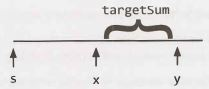

If each value knows its running sum (the sum of values from s through itself), then we can find this pretty easily. We just need to leverage this simple equation: runningSumₓ = runningSumᵧ - targetSum. We then look for the values of x where this is true.

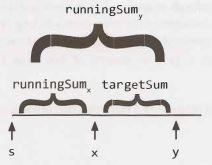

Since we're just looking for the number of paths, we can use a hash table. As we iterate through the array, build a hash table that maps from a runningSum to the number of times we've seen that sum. Then, for each y, look up runningSumᵧ - targetSum in the hash table. The value in the hash table will tell you the number of paths with sum targetSum that end at y.

For example:
```
index:   0       1     2     3     4       5     6      7      8 
------------------------------------------------------------------------------------------
value:   10 ->   5  -> 1  -> 2 -> -1  ->  -1  -> 7  ->  1  ->  2 
sum:     10     15    16    18    17      16    23     24     26
```
The value of runningSum₇  is 24. If targetSum is 8, then we'd look up 16 in the hash table. This would have a value of 2 (originating from index 2 and index 5). As we can see above, indexes 3 through 7 and indexes 6 through 7 have sums of 8.

Now that we've settled the algorithm for an array, let's review this on a tree. We take a similar approach.

We traverse through the tree using depth-first search. As we visit each node:

1. Track its runningSum. We'll take this in as a parameter and immediately increment it by node. value.
2. Look up runningSum - targetSum in the hash table. The value there indicates the total number. Set totalPaths to this value.
3. If runningSum  ==  targetSum, then there's one additional path that starts at the root. Increment totalPaths.
4. Add runningSum to the hash table (incrementing the value if it's already  there).
5. Recurse left and right, counting the number of paths with sum targetSum.
6. After we're done recursing left and right, decrement the value of runningSum in the hash table. This is essentially backing out of our work; it reverses the changes to the hash table so that other nodes don't use it (since we're now done with node).

Despite the complexity of deriving this algorithm, the code to implement this is relatively simple.

```java
1   int countPathsWithSum(TreeNode root, int targetSum) {
2       return countPathsWithSum(root, targetSum, 0, new HashMap<Integer, Integer>());
3   }
4  
5   int countPathsWithSum(TreeNode node, int targetSum, int runningSum,
6                   HashMap<Integer, Integer> pathCount) {
7       if (node == null) return 0; // Base case
8  
9       /* Count paths with sum ending at the current node. */
10      runningSum += node.data;
11      int sum = runningSum - targetSum;
12      int totalPaths = pathCount.getOrDefault(sum, 0);
13  
14      /* If runningSum equals targetSum, then one additional path starts at root.
15       * Add in this path. */
16      if (runningSum == targetSum) {
17          totalPaths++;
18      }
19  
20      /* Increment pathCount, recurse, then decrement pathCount. */
21      incrementHashTable(pathCount, runningSum, 1); // Increment pathCount
22      totalPaths += countPathsWithSum(node.left, targetSum, runningSum, pathCount);
23      totalPaths += countPathsWithSum(node.right, targetSum, runningSum, pathCount);
24      incrementHashTable(pathCount, runningSum, -1); // Decrement pathCount
25  
26      return totalPaths;
27  }
28  
29  void incrementHashTable(HashMap<Integer, Integer> hashTable, int key, int delta) {
30      int newCount = hashTable.getOrDefault(key, 0) + delta;
31      if (newCount == 0) { //Remove when zero to reduce space usage
32          hashTable.remove(key);
33      } else {
34          hashTable.put(key, newCount);
35      }
36  }
```

The runtime for this algorithm is O(N), where N is the number of nodes in the tree. We know it is O(N) because we travel to each node just once, doing O(1) work each time. In a balanced tree, the space complexity is O(log   N) due to the hash table. The space complexity can grow to O(n) in an unbalanced tree.


