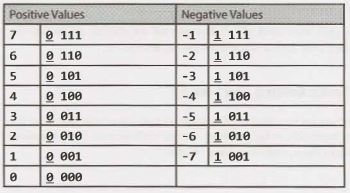
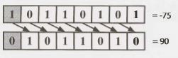
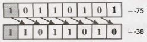
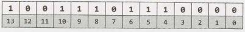

5 Bit Manipulation
==================

Bit manipulation is used in a variety  of problems. Sometimes, the  question explicitly calls for bit manipulation.  Other times,  it's simply  a useful  technique to optimize your  code.  You should be  comfortable doing bit manipulation by hand, as well as with code.  Be careful;  it's easy to make little mistakes.


### Bit Manipulation By Hand

If you're rusty on bit manipulation, try the following exercises by hand. The items in the third column can be solved manually or with "tricks" (described below).  For simplicity,  assume that these are four-bit numbers.

If you get  confused, work them through as a base 10 number. You can  then apply the  same process to  a binary number. Remember that ^ indicates an XOR, and ~ is a NOT (negation).

|              |              |                   |
| --           | --           | --                |
| 0110 +  0010 | 0011 *  0101 | 0110 +  0110      |
| 0011 +  0010 | 0011 *  0011 | 0100 *  0011      |
| 0110 -  0011 | 1101 >> 2    | 1101 ^  (=1101)   |
| 1000 -  0110 | 1101 ^  0101 | 1011 &  (~0 << 2) |

Solutions: line 1 (1000, 1111, 1100); line 2 (0101, 1001, 1100); line  3 (0011, 0011, 1111); line 4 (0010, 1000, 1000).

The tricks in Column 3 are as follows:

1. 0110 + 0110 is equivalent to 0110 * 2, which is equivalent to shifting 0110 left by 1.

2. 0100 equals 4, and multiplying by 4 is just left shifting by 2. So we shift  0011 left by 2 to get  1100.

3. Think about this operation bit by bit. If you XOR a bit with its own negated value, you will always  get  1. Therefore, the  solution to a^(\~a) will be a sequence of 1s.

4. \~0 is a sequence of 1s, so \~0 << 2 is 1s followed by two 0s. ANDing that with another value  will clear the  last two bits of the  value.

If you didn't see these tricks immediately, think about them logically.


### Bit Facts and Tricks

The following expressions are useful  in bit manipulation. Don't just  memorize them, though; think deeply about why each of these is true. We use "1s" and "0s" to indicate a sequence of 1s or 0s, respectively. 

```
X  ^  0s  =  X       X  &  0s  =  X      x  |  0s  =  X 
X  ^  1s  =  ~X      X  &  1s  =  X      x  |  1s  =  1s 
X  ^  x   =  X       X  &  x   =  X      x  |  x   =  X 
```

To understand these expressions, recall that these operations occur bit-by-bit, with what's happening  on one bit never impacting the other bits. This means that if one of the above statements is true for a single bit, then it's true for a sequence of bits.


### Two's Complement and Negative Numbers

Computers typically store integers in two's complement representation. A positive number is represented as itself while a negative number is represented as the two's complement of its absolute value (with a 1 in its sign bit to indicate that a negative value). The two's complement of an N-bit number (where N is the number of bits used for the number, excluding the sign bit) is the complement of the number with respect to 2ᴺ.

Let's look at the 4-bit integer -3 as an example. If it's a 4-bit number, we have one bit for the sign and three bits for the value. We want the complement with respect to 2³,  which is 8. The complement of 3 (the absolute value of -3) with respect to 8 is 5. 5 in binary is 101. Therefore, -3 in binary as a 4-bit number  is 1101, with the first bit being the sign bit.

In other words, the binary representation of -K (negative K) as a N-bit number is concat ( 1,  2ᴺ⁻¹  -  K). 

Another way to look at this is that we invert the bits in the positive representation and then add 1. 3 is 011 in binary. Flip the bits to get 100, add 1 to get 101, then prepend the sign bit (1) to get 1101.

In a four-bit integer, this would look like the following.




Observe that the absolute values of the integers on the left and right always sum to 2³, and that the binary values on the left and right sides are identical, other than the sign bit. Why is that?


### Arithmetic vs. Logical Right Shift

There are two types of right shift operators. The arithmetic right shift essentially divides by two. The logical right shift does what we would visually see as shifting the bits. This is best seen on a negative number.

In a logical right shift, we shift the bits and put a 0 in the most significant  bit. It is indicated with a >>> operator. On an 8-bit integer  (where the sign bit is the most significant  bit), this would  look like the image below. The sign bit is indicated with a gray background.



In an arithmetic right shift, we shift values to the right but fill in the new bits with the value of the sign bit. This has the effect  of (roughly) dividing by two. It is indicated by a >> operator.



What do you think these functions would do on parameters x = -93242 and count = 40?

```java
1   int repeatedArithmeticShift(int x, int count) {
2       for (int i = 0; i < count; i++) {
3           x >>= 1; // Arithmetic shift by 1
4       }
5       return x;
6   }
7   
8   int repeatedLogicalShift(int x, int count) {
9       for (int i = 0; i < count; i++) {
10          x >>>= 1; // Logical shift by 1
11      }
12      return x;
13  }
```

With the logical shift, we would get 0 because we are shifting a zero into the most significant bit repeatedly.

With the  arithmetic shift, we would  get  -1 because we  are  shifting  a one  into  the  most  significant bit repeatedly. A sequence of all 1s in a (signed) integer represents -1.


### Common Bit Tasks: Getting and Setting

The following operations are very important to know, but do not simply memorize them. Memorizing leads to mistakes that  are impossible to recover  from. Rather, understand how to implement these methods, so that you can implement these,  and other, bit problems.


#### Get Bit

This method shifts 1 over by i bits, creating a value that looks like 00010000. By performing an AND with num, we clear all bits other  than the  bit at bit i. Finally, we compare that to 0. If that new value is not zero, then  bit i must have a 1. Otherwise,  bit i is a 0.

```java
1   boolean getBit(int num, int i) {
2       return (( num & (1 << i)) != 0);
3   }
```

#### Set Bit

Set Bit shifts  1 over by i  bits, creating a value like 00010000. By performing an OR with num, only the value at bit i will change. All other  bits of the mask are zero and will not affect num.

```java
1   int setBit(int num, int i) {
2       return num | ( 1 << i);
3   }
```

#### Clear Bit

This method operates in almost the reverse of setBit. First, we create a number like 11101111 by creating the reverse of it (00010000) and negating it. Then, we perform an AND with num. This will clear the ith bit and leave the remainder unchanged.

```java
1   int clearBit(int num, int i) {
2       int mask = ~(1 << i);
3       return num & mask;
4   }
```

To clear all bits from the most significant bit through i (inclusive), we create a mask with a 1 at the ith bit (1 << i). Then, we subtract 1 from it, giving us a sequence of 0s followed by i 1s. We then AND our number with this mask to leave just the last i bits.

```java
1   int clearBitsMSBthroughI(int num, int i) {
2       int mask = (1 << i) - 1;
3       return num & mask;
4   }
```

To clear all bits from i through 0 (inclusive), we take a sequence of all 1s (which is -1) and shift it left by i + 1 bits. This gives us a sequence of 1s (in the most significant bits) followed by i 0 bits.

```java
1   int clearBitsIthrough0(int num, int i) {
2       int mask = (-1 << (i + 1));
3       return num & mask;
4   }
```

#### Update Bit

To set the ith bit to a value v, we first clear the bit at position i by using a mask that looks like 11101111. Then, we shift the intended  value, v, left by i bits. This will create a number with bit i equal to v and all other bits equal to 0. Finally, we OR these two numbers, updating the ith bit if v is 1 and leaving it as 0 otherwise.

```java
1   int updateBit(int num, int i, boolean bitIs1) {
2       int value = bitIs1 ? 1 : 0;
3       int mask  = ~(1 << i);
4       return (num & mask) | (value << i);
5   }
```

---

Interview Questions

---

Additional Questions: Arrays and Strings (#1.1, #1.4, #1.8), Math and Logic Puzzles  (#6.10), Recursion (#8.4, #8.14), Sorting and Searching (#10.7, #10.8), C++ (#12.10), ModerateProblems (#16.1, #16.7), Hard Problems (#17.1).


**5.1     Insertion:** You are given two 32-bit numbers, N and M, and two bit positions, i and j. Write a method to insert  M into N such  that M starts at bit j and  ends at bit i. You can assume that the bits j through i have enough space to fit all of M. That  is, if M = 10011, you can assume that  there are at least  5 bits between j and  i. You would not, for example, have j = 3and i= 2, because M could  not  fully fit between bit 3 and  bit 2.

EXAMPLE 

Input:  N = 10000000000,  M = 10011,  i = 2,  j = 6

Output: N = 10001001100


SOLUTION

This problem can be approached in three key steps:

1. Clear the bits j through i in N
2. Shift M so that  it lines up with  bits j through i
3. Merge M and N.

The trickiest part is Step  1. How do we clear the  bits in N? We can do this with a mask. This mask will have all 1s, except for 0s in the  bits j through i. We create this mask  by creating the  left half of the  mask first, and then the  right half.
```java
1   int updateBits(int n, int m, int i, int j) {
2       /* Create a mask to clear bits i through j in n. EXAMPLE: i = 2, j = 4. Result
3        * should be 11100011. For simplicity, we'll use just 8 bits for the example. */
4       int allOnes = -0; // will equal sequence of all 1s
5   
6       // 1s before position j, then 0s. left = 11100000
7       int left = allOnes << (j + 1);
8   
9       // 1's after position i. right = 00000011
10      int right = ((1 << i) - 1);
11  
12      // All 1s, except for 0s between i and j. mask 11100011
13      int mask = left | right;
14  
15      /* Clear bits j through i then put min there */
16      int n_cleared = n & mask; // Clear bits j through i.
17      int m_shifted = m << i; // Move m into correct position.
18  
19      return n_cleared | m_shifted; // OR them, and we're done!
20  }
```
In a problem like this (and many bit manipulation problems), you should make sure to thoroughly test your code. It's extremely easy to wind up with off-by-one errors.


**5.2   Binary to String:** Given a real number between 0 and 1 (e.g., 0.72) that is passed in as a double, print the binary representation. If the number cannot be represented accurately in binary with at most 32 characters, print "ERROR".


SOLUTION

---
 
NOTE: When otherwise ambiguous, we'll use the subscripts x₂ and x₁₀ to indicate whether x is in base 2 or base 10.
 
First, let's start off by asking ourselves what a non-integer number in binary looks like. By analogy to a decimal number, the binary number 0.101₂ would look like:

    0.101₂ = 1 * 1/2¹ + 0 * 1/2² + 1 * 1/2³
 
To print the decimal part, we can multiply by 2 and check if 2n is greater than or equal to 1. This is essentially "shifting" the fractional sum. That is:
```
r = 2₁₀ * n
  = 2₁₀ * 0.101₂
  = 1 * 1/2⁰ + 0 * 1/2¹ + 1 * 1/2²
  = 1.01₂
```
If r  >= 1, then we know that n had a 1 right after the decimal point. By doing this continuously, we can check every digit.
```java
1   String printBinary(double num) {
2       if (num >= 1 || num <= 0) {
3           return "ERROR";
4       }
5   
6       StringBuilder binary = new StringBuilder();
7       binary.append(".");
8       while (num > 0) {
9           /* Setting a limit on length: 32 characters */
10          if (binary.length() >= 32) {
11              return "ERROR";
12          }
13  
14          double r = num * 2;
15          if (r >= 1) {
16              binary.append(l);
17              num = r - 1;
18          } else {
19              binary.append(0);
20              num = r;
21          }
22      }
23      return binary.toString();
24  }
```

Alternatively, rather than multiplying the number  by two and comparing it to 1, we can compare  the number to .5, then .25, and so on. The code below demonstrates this approach.
```java
1   String printBinary2(double num) {
2       if (num >= 1 || num <= 0) {
3           return "ERROR";
4       }
5   
6       StringBuilder binary = new StringBuilder();
7       double frac = 0.5;
8       binary.append(".");
9       while (num > 0) {
10          /* Setting a limit on length: 32 characters */
11          if (binary.length() > 32) {
12              return "ERROR";
13          }
14          if (num >= frac) {
15              binary.append(1);
15              num -= frac;
17          } else {
18              binary.append(0);
19          }
20          frac /= 2;
21      }
22      return binary.toString();
23  }
```
Both approaches are equally good; choose the one you feel most comfortable with.

Either way, you should make sure to prepare thorough  test cases for this problem-and to actually run through them in your interview.


**5.3       Flip Bit to Win:** You have an integer and you can flip exactly one bit from a 0 to a 1. Write code to find the length of the longest sequence of 1s you could create.

EXAMPLE 
    
Input:        1775 (or:   11011101111)

Output:       8


SOLUTION

---

We can think about each integer as being an alternating sequence of 0s and 1s. Whenever a 0s sequence has length one, we can potentially merge the adjacent 1s sequences.

**Brute Force**

One approach is to convert an integer into an array that reflects the lengths of the 0s and 1s sequences. For example, 11011101111 would be (reading from right to left) [0₀, 4₁, 1₀, 3₁, 2₁, 21₀]. The subscript reflects whether the integer corresponds to a 0s sequence or a 1s sequence, but the actual solution doesn't need this. It's a strictly alternating sequence, always starting with the 0s sequence.

Once we have this, we just walk through the array. At each 0s sequence, then we consider merging the adjacent 1s sequences if the 0s sequence has length 1.
```java
1   int longestSequence(int n) {
2       if (n == -1) return Integer.BYTES * 8;
3       ArrayList<Integer> sequences = getAlternatingSequences(n);
4       return findLongestSequence(sequences);
5   }
6   
7   /* Return a list of the sizes of the sequences. The sequence starts off with the
8    * number of 0s (which might be 0) and then alternates with the counts of each
9    * value. */
10  ArrayList<Integer> getAlternatingSequences(int n) {
11      ArrayList<Integer> sequences = new ArrayList<Integer>();
12      
13      int searchingFor = 0;
14      int counter = 0;
15      
16      for (int i = 0; i < Integer.BYTES * 8; i++) {
17          if ((n & 1) != searchingFor) {
18              sequences.add(counter);
19              searchingFor = n & 1; // Flip 1 to 0 or 0 to 1
20              counter = 0;
21          }
22          counter++;
23          n >>>= 1;
24      }
25      sequences.add(counter);
26      
27      return sequences;
28  }
29  
30  /* Given the lengths of alternating sequences of 0s and 1s, find the longest one
31   * we can build. */
32  int findlongestSequence(ArrayList<Integer> seq) {
33      int maxSeq = 1;
34      
35      for (int i = 0; i < seq.size(); i += 2) {
36          int zerosSeq = seq.get(i);
37          int onesSeqRight = i - 1 >= 0 ? seq.get(i - 1) : 0;
38          int onesSeqLeft = i + 1 < seq.size() ? seq.get(i + 1) : 0;
39          
40          int thisSeq = 0;
41          if (zerosSeq == 1) {//Can merge
42              thisSeq = onesSeqLeft + 1 + onesSeqRight;
43          } if (zerosSeq > 1) {//Just add a zero to either side
44              thisSeq = 1 + Math.max(onesSeqRight, onesSeqLeft);
45          } else if (zerosSeq == 0) {//No zero, but take either side
46              thisSeq = Math.max(onesSeqRight, onesSeqLeft);
47          }
48          maxSeq = Math.max(thisSeq, maxSeq);
49      }
50      
51      return maxSeq;
52  }
```

This is pretty good. It's O(b) time and O(b) memory, where b is the length of the sequence.


> Be careful  with how you express the runtime. For example, if you say the runtime is O(n), what is n? It is not correct to say that this algorithm is O(value of the integer). This algorithm is O(number of bits). For this reason, when you have potential ambiguity in what n might mean, it's best just to not use n. Then neither you nor your interviewer will be confused. Pick a different variable name. We used "b", for the number of bits. Something logical works well.


Can we do better? Recall the concept of Best Conceivable Runtime. The B.C.R. for this algorithm is O(b) (since we'll always have to read through the sequence), so we know we can't optimize the time. We can, however, reduce the memory usage.

**Optimal Algorithm**

To reduce the space usage, note that we don't need to hang on to the length of each sequence the entire time. We only need it long enough to compare each 1s sequence to the immediately preceding 1s sequence.

Therefore, we can just walk through the integer doing this, tracking the current 1s sequence length and the previous 1s sequence length. When we see a zero, update previousLength:

- If the next bit is a 1, previousLength  should be set to currentLength.
- If the next bit is a 0, then we can't merge these sequences together. So, set previousLength to 0.

Update maxLength  as we go.
```java
1   int flipBit(int a) {
2       /* If all 1s, this is already the longest sequence. */
3       if (~a == 0) return Integer.BYTES * 8;
4   
5       int currentLength  = 0;
6       int previousLength = 0;
7       int maxLength = 1; // We can always have a sequence of at least one 1
8       while (a != 0) {
9           if ((a & 1) == 1) { // Current bit is a 1
10              currentLength++;
11          } else if ((a & 1) == 0) { // Current bit is a 0
12              /* Update to 0 (if next bit is 0) or currentLength (if next bit is 1). */
13              previousLength = (a & 2) == 0 ? 0 : currentLength;
14              currentLength = 0;
15          }
16          maxLength = Math.max(previousLength + currentLength + 1, maxLength);
17          a >>>= 1;
18      }
19      return maxLength;
20  }
```
The runtime of this algorithm is still O(b), but we use only O(1) additional memory.


**5.4   Next  Number:** Given a positive integer, print the next smallest and the next largest number that have the same number of 1 bits in their binary representation.

SOLUTION

---

There are a number of ways to approach this problem, including using brute force, using bit manipulation, and using clever arithmetic. Note that the arithmetic approach builds on the bit manipulation approach. You'll want to understand the bit manipulation approach before going on to the arithmetic one.

> The terminology can be confusing for this problem. We'll call getNext the bigger number and getPrev the smaller number.


**The Brute  Force Approach**

An easy approach is simply brute force: count the number of 1s in n, and then increment (or decrement) until you find a number with the same number of 1s. Easy-but not terribly interesting. Can we do something a bit more optimal? Yes!

Let's start with the code for getNext, and then move on to getPrev.


**Bit Manipulation Approach for Get Next  Number**

If we think about what the next number should be, we can observe the following. Given the number 13948, the binary representation looks like:

|    |    |    |    |    |    |    |    |    |    |    |    |    |    |
| -- | -- | -- | -- | -- | -- | -- | -- | -- | -- | -- | -- | -- | -- |
| 1  | 1  | 0  | 1  | 1  | 0  | 0  | 1  | 1  | 1  | 1  | 1  | 0  | 0  |
| 13 | 12 | 11 | 10 | 9  | 8  | 7  | 6  | 5  | 4  | 3  | 2  | 1  | 0  |

We want to make this number bigger (but not too big). We also need to keep the same number of ones. 

Observation: Given a number n and two bit locations i and j, suppose we flip bit i from a 1 to a 0, and bit j from a 0 to a 1. If i >   j, then n will have decreased. If i < j, then n will have increased. 

We know the following:

1. If we flip a zero to a one, we must flip a one to a zero.
2. When we do that, the number will be bigger if and only if the zero-to-one bit was to the left of the one-to-zero bit.
3. We want to make the number bigger, but not unnecessarily bigger. Therefore, we need to flip the right- most zero which has ones on the right of it.

To put this in a different way, we are flipping the rightmost non-trailing zero. That is, using the above example, the trailing zeros are in the 0th and 1st spot. The rightmost non-trailing zero is at bit 7. Let's call this position p.

*Step 1: Flip rightmost non-trailing zero*

|    |    |    |    |    |    |    |    |    |    |    |    |    |    |
| -- | -- | -- | -- | -- | -- | -- | -- | -- | -- | -- | -- | -- | -- |
| 1  | 1  | 0  | 1  | 1  | 0  | 1  | 1  | 1  | 1  | 1  | 1  | 0  | 0  |
| 13 | 12 | 11 | 10 | 9  | 8  | 7  | 6  | 5  | 4  | 3  | 2  | 1  | 0  |


With this change, we have increased the size of n. But, we also have one too many ones, and one too few zeros. We'll need to shrink the size of our number as much as possible while keeping that in mind.

We can shrink the number by rearranging all the bits to the right of bit p such that the 0s are on the left and the 1s are on the right. As we do this, we want to replace one of the 1s with a 0.

A relatively easy way of doing this is to count how many ones are to the right of p, clear all the bits from 0 until p, and then add back in c1-1 ones. Let c1 be the number of ones to the right of p and c0 be the number of zeros to the right of p.

Let's walk through this with an example.

*Step2: Clear bits to the right of p. From before, c0 = 2. c1 = 5. p = 7.*

|    |    |    |    |    |    |    |    |    |    |    |    |    |    |
| -- | -- | -- | -- | -- | -- | -- | -- | -- | -- | -- | -- | -- | -- |
| 1  | 1  | 0  | 1  | 1  | 0  | 1  | 0  | 0  | 0  | 0  | 0  | 0  | 0  |
| 13 | 12 | 11 | 10 | 9  | 8  | 7  | 6  | 5  | 4  | 3  | 2  | 1  | 0  |


To clear these bits, we need to create a mask that  is a sequence  of ones, followed by p zeros. We can do this as follows: 
```
a  =  1  << p;  // all zeros except for  a  1  at  position  p.
b  =  a  - 1;   // all zeros, followed by p ones.
mask  =  ~b;    // all ones, followed by p zeros. 
n  =  n & mask; // clears rightmost p bits. 
```
Or, more concisely, we do:
```
n &=  ~((1 << p) - 1).
```

*Step 3:Add in c1   -  1 ones.*

|    |    |    |    |    |    |    |    |    |    |    |    |    |    |
| -- | -- | -- | -- | -- | -- | -- | -- | -- | -- | -- | -- | -- | -- |
| 1  | 1  | 0  | 1  | 1  | 0  | 1  | 0  | 0  | 0  | 1  | 1  | 1  | 1  |
| 13 | 12 | 11 | 10 | 9  | 8  | 7  | 6  | 5  | 4  | 3  | 2  | 1  | 0  |


To insert  c1 -  1 ones on the right, we do the following:
```
a = 1 << (c1 -  1); // 0s with  a  1  at  position  c1 -  1
b = a - 1;          // 0S with 1s at  positions  0 through c1 - 1 
n = n | b;          // inserts 1s at  positions  0 through c1 - 1
```
Or, more concisely:
```
n |= (1 << (c1 - 1)) - 1;
```
We have now arrived at the smallest number  bigger than n with the same number  of ones. 

The code for getNext is below.
```java
1   int getNext(int n) {
2       /* Compute c0 and c1 */
3       int c  = n;
4       int c0 = 0;
5       int c1 = 0;
6       while (((c & 1) == 0) && (c != 0)) {
7           c0++;
8           c >>= l;
9       }
10  
11      while ((c & 1) == 1) {
12          c1++;
13          c >>= 1;
14      }
15  
16      /* Error: if n == 11..1100...00, then there is no bigger number with the same
17       * number of 1s. */
18      if (c0 + c1 == 31 || c0 + c1 == 0) {
19          return -1;
20      }
21  
22      int p = c0 + c1; // position of rightmost non - trailing zero
23  
24      n |= (1 << p); // Flip rightmost non-trailing zero
25      n &= ~((1 << p) - 1); // clear all bits to the right of p
26      n |= (1 << (c1 - 1)) - 1; // Insert (c1-1) ones on the right.
27      return n;
28  }
```

**Bit Manipulation Approach for Get Previous Number**

To implement getPrev, we follow a very similar approach.

1. Compute c0 and c1. Note that c1 is the number of trailing ones, and c0 is the size of the block of zeros immediately to the left of the trailing ones.
2. Flip the rightmost non-trailing one to a zero. This will be at position p = c1 + c0.
3. Clear all bits to the right of bit p.
4. Insert c1 + 1 ones immediately to the right of position p.

Note that Step 2 sets bit p to a zero and Step 3 sets bits 0 through p-1 to a zero. We can merge these steps.

Let's walk through this with an example.

*Step 1: Initial Number.  p = 7. c1 = 2.  c0 = 5.*

|    |    |    |    |    |    |    |    |    |    |    |    |    |    |
| -- | -- | -- | -- | -- | -- | -- | -- | -- | -- | -- | -- | -- | -- |
| 1  | 0  | 0  | 1  | 1  | 1  | 1  | 0  | 0  | 0  | 0  | 0  | 1  | 1  |
| 13 | 12 | 11 | 10 | 9  | 8  | 7  | 6  | 5  | 4  | 3  | 2  | 1  | 0  |


*Steps 2 & 3: Clear bits 0 through p.*

|    |    |    |    |    |    |    |    |    |    |    |    |    |    |
| -- | -- | -- | -- | -- | -- | -- | -- | -- | -- | -- | -- | -- | -- |
| 1  | 0  | 0  | 1  | 1  | 1  | 0  | 0  | 0  | 0  | 0  | 0  | 0  | 0  |
| 13 | 12 | 11 | 10 | 9  | 8  | 7  | 6  | 5  | 4  | 3  | 2  | 1  | 0  |

We can do this as follows:

```
int a = ~0;           // Sequence of 1s 
int b = a << (p + 1); // Sequence of 1s  followed by  p + 1  zeros.
n &= b;               // Clears bits 0 through p. 
``` 

*Steps 4: Insert c1 + 1 ones immediately to the right of position p.*



Note that since p = c1 + c0, the (c1 + l) ones will be followed by (c0 - 1) zeros. 

We can do this as follows:
```
int a =  1 <<   (c1 + 1);    // 0S with 1  at position (c1 +  1)
int b =  a  -  1;            // 0s  followed by c1 + 1 ones
int c =  b <<   (c0  -  1);  // c1+1 ones  followed  by  c0-1  zeros.
n  |=  c;
```
The code to implement this is below.
```java
1   int getPrev(int n) {
2       int temp = n;
3       int c0 = 0;
4       int c1 = 0;
5       while (temp & 1 == 1) {
6           c1++;
7           temp >>= 1;
8       }
9   
10      if (temp == 0) return -1;
11  
12      while (((temp & 1) == 0) &&  (temp != 0)) {
13          c0++;
14          temp >>= 1;
15      }
16  
17      int p = c0 + c1; // position of rightmost non-trailing one
18      n &= ((~0) << (p + 1)); // clears from bit p onwards
19  
20      int mask = (1 << (c1 + 1)) - 1; // Sequence of (c1+1) ones
21      n |= mask << (c0 - 1);
22  
23      return n;
24  }
```

**Arithmetic Approach to Get Next Number**

If c0 is the  number of trailing  zeros, c1 is the  size of the  one  block immediately following, and p = c0  + c1, we can word  our solution from earlier as follows:

1.  Set the pth bit to 1.
2.  Set all bits following p to 0.
3.  Set bits 0 through c1 - 2 to 1. This will be  c1 - 1 total bits.

A quick and dirty way to perform steps 1  and  2 is to set the trailing zeros  to 1 (giving us p trailing ones),  and then add 1. Adding one will flip all trailing ones, so we wind up with a 1 at bit p followed by p zeros. We can perform this arithmetically. 

```
n  +=  2ᶜ⁰ - 1  // Sets trailing  0s to 1, giving us p trailing 1s
n  +=  1;       // Flips first p  1s to 0s, and  puts a 1 at bit  p. 
```

Now, to perform Step  3 arithmetically, we just  do:
```
n  +=  2ᶜ¹⁻¹ - 1; // Sets trailing  c1 -  1  zeros to ones.
```
This math reduces to:
```
next =  n  +  (2ᶜ⁰ - 1) + 1 + (2ᶜ¹⁻¹ - 1)
     =  n  +  2ᶜ⁰ +  2ᶜ¹⁻¹  -  1
```
The best part  is that,  using a little bit manipulation, it's simple to code.
```java
1   int getNextArith(int n) {
2        /* ... same calculation for c0 and c1 as before */
3        return n + (1 << c0) + (1 << (c1 - 1)) - 1;
4   }
```

**Arithmetic Approach to Get Previous Number**

If c₁ is the number of trailing ones,  c₀  is the size of the zero block immediately following,  and p  =  c₀ +  c₁, we can word the initial getPrev solution as follows:

1.  Set the pth bit to 0
2.  Set all bits following p to 1
3.  Set bits 0 through c₀ - 1 to 0.

We can implement this arithmetically as follows. For clarity in the example, we will assume n = 10000011. This makes c₁ = 2 and c₀ =  5.

```
n -=  2ᶜ¹   -  1;   // Removes  trailing 1s. n  is now 10000000.
n -=  1;            // Flips trailing  0s.   n  is now 01111111.
n -=  2ᶜ⁰⁻¹ -  1;   // Flips last  (c0-1) 0s.   n  is now 01110000.
``` 
 
This reduces mathematically to:
```
next =  n  -  (2ᶜ¹  -  1) -  1  -  (2ᶜ⁰⁻¹ -  1).
     =  n  -  2ᶜ¹ -  2ᶜ⁰⁻¹  + 1
```
Again, this is very easy to implement.
```java
1   int getPrevArith(int n) {
2       /* ... same calculation for c0 and c1 as before ... */
3       return n - (1 << c1) - (1 << (c0 - 1)) + 1;
4   }
```
Whew! Don't worry, you wouldn't be expected to get all this in an interview-at least not without a lot of help from the interviewer.

 
**5.5         Debugger:** Explain what the following code does: ((n & (n-1)) == 0).


SOLUTION

---

We can work backwards to solve this question.
 

**What does it mean if A & B == 0?**

It means that A and B never have a 1 bit in the same place. So if n & (n -1) ==  0, then n and n-1 never share a 1.


**What does n-1 look like (as compared with n}?**

Try doing subtraction by hand (in base 2 or 10). What happens?
```
  1101011000  [base   2]             593100  [base  10]
-          1                       -      1
= 1101010111  [base   2]           = 593099  [base  10] 
```
When you subtract 1 from a number, you look at the least significant bit. If it's a 1 you change it to 0, and you are done. If it's a zero, you must "borrow" from a larger bit. So, you go to increasingly larger bits, changing each bit from a 0 to a 1, until you find a 1. You flip that 1 to a 0 and you are done.

Thus, n-1  will look like n, except that n's initial 0s will be 1s in n -1, and n's least significant 1 will be a 0 in n-1. That is:
```
if      n  =  abcde1000 
then  n-1  =  abcde0111
```

**So what  does n & (n-1)  === 0 indicate?**

n and n -1 must have no 1s in common. Given that they look like this:
```
if     n   =  abcde1000
then n-1   =  abcde0111
```
abcde must be all 0s, which means that n must look like this: 00001000. The value n is therefore a power of two.

So, we have our answer: ((n  &  (n -1)) == 0) checks  if n is a power of 2 (or if n is 0).


**5.6   Conversion:** Write a function to determine the number of bits you would need to flip to convert integer A to integer B.

EXAMPLE 

Input: 29  (or:  11101),  15  (or:  01111)

Output: 2


SOLUTION
 
---

This seemingly complex problem is actually rather straightforward. To approach this, ask yourself how you would figure out which bits in two numbers are different. Simple: with an XOR.

Each 1 in the XOR represents a bit that is different between A and B. Therefore, to check the number of bits that are different between A and B, we simply  need to count the number of bits in A^B that are 1.
```java
1   int bitSwapRequired(int a, int b) {
2       int count = 0;
3       for (int c = a ^ b; c != 0; c = c >> 1) {
4           count += c & 1;
5       }
6       return count;
7   }
```
This code is good, but we can make it a bit better. Rather than simply shifting c repeatedly while checking the least significant bit, we can continuously  flip the least significant bit and count how long it takes c to reach 0. The operation c =  c & (c -  1) will clear the least significant bit in c. 

The code below utilizes this approach.
```java
1   int bitSwapRequired(int a, int b) {
2       int count = 0;
3       for (int c = a ^ b; c != 0; c = c & (c - 1)) {
4           count++;
5       }
6       return count;
7   }
```
The above code is one of those bit manipulation problems that comes up sometimes in interviews. Though it'd be hard to come up with it on the spot if you've  never seen it before, it is useful to remember the trick for your interviews.


**5.7   Pairwise Swap:** Write a program to swap odd and even bits in an integer with as few instructions as possible  (e.g., bit 0 and bit 1 are swapped, bit 2 and bit 3 are swapped, and so on).


SOLUTION

---

Like many  of the previous problems, it's useful to think about this problem in a different way. Operating on individual pairs of bits would be difficult, and probably not that efficient either. So how else can we think about this problem?

We can approach this as operating on the odds bits first, and then the even bits. Can we take a number n and move the odd bits over by 1? Sure. We can mask all odd bits with 10101010 in binary (which is 0xAA), then shift them right by 1  to put them in the even spots. For the even bits, we do an equivalent operation. Finally, we merge these two values.

This takes a total of five instructions. The code below implements this approach.
```java
1  int swapOddEvenBits(int x) {
2     return ( ((x & 0xaaaaaaaa) >>> 1) | ((x & 0x55555555) << 1) );
3  }
```
Note that we use the logical right shift, instead of the arithmetic right shift. This is because we want the sign bit to be filled with a zero.

We've implemented the code above for 32-bit integers in Java. If you were working with 64-bit integers, you would need to change the mask. The logic, however, would remain the same.


**5.8   Draw Line:**  A monochrome screen is stored as a single array of bytes, allowing eight consecutive pixels to be stored in one byte. The screen has width w, where w is divisible by 8 (that is, no byte will be split across rows). The height of the screen, of course, can be derived from the length of the array and the width. Implement a function that draws a horizontal line from (x1, y) to (x2, y).

The method signature should look something like:

`drawLine(byte[] screen, int width, int x1, int x2, int y)`


SOLUTION

---

A naive solution to the problem is straightforward: iterate in a for loop from x1 to x2, setting each pixel along the way. But that's hardly any fun, is it? (Nor is it very efficient.)

A better solution is to recognize that if x1 and x2 are far away from each other, several full bytes will be contained between them. These full bytes can be set one at a time by doing screen[byte_pos] = 0xFF. The residual start and end of the line can be set using masks.
```java
1   void drawLine(byte[] screen, int width, int x1, int x2, int y) {
2       int start_offset = x1 % 8;
3       int first_full_byte = x1 / 8;
4       if (start_offset != 0) {
5           first_full_byte++;
6       }
7       
8       int end_offset = x2 % 8;
9       int last_full_byte = x2 / 8;
10      if (end_offset != 7) {
11          last_full_byte--;
12      }
13      
14      // Set full bytes
15      for (int b = first_full_byte; b <= last_full_byte; b++) {
16          screen[(width / 8) * y + b] = (byte) 0xFF;
17      }
18      
19      // Create masks for start and end of line
20      byte start_mask = (byte) (0xFF >> start_offset);
21      byte end_mask   = (byte) ~(0xFF >> (end_offset + 1));
22      
23      // Set start and end of line
24      if ((x1 / 8) == (x2 / 8)) { // x1 and x2 are in the same byte
25          byte mask = (byte) (start_mask & end_mask);
26          screen[(width / 8) * y + (x1 / 8)] |= mask;
27      } else {
28          if (start_offset != 0) {
29              int byte_number = (width / 8) * y + first_full_byte - 1;
30              screen[byte_number] |= start_mask;
31          }
32          if (end_offset != 7) {
33              int byte_number = (width / 8) * y + last_full_byte + 1;
34              screen[byte_number] |= end_mask;
35          }
36      }
37  }
```
Be careful on this problem; there are a lot of "gotchas" and special cases. For example,  you need  to consider the case where x1 and x2 are in the same byte. Only the most careful candidates can implement this code bug-free.


