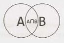
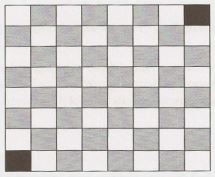

6 Math and Logic Puzzles
========================

So-called "puzzles" (or brain teasers) are some of the most hotly debated questions, and many companies have policies banning them. Unfortunately, even when these questions are banned, you still may find yourself being asked one of them. Why? Because no one can agree on a definition of what a brainteaser is.

The good news is that if you are asked a puzzle or brainteaser, it's likely to be a reasonably fair one. It probably won't rely on a trick of wording, and it can almost always be logically deduced. Many have their foundations in mathematics or computer science, and almost all have solutions that can be logically deduced.

We'll go through some common approaches for tackling these questions, as well as some of the essential knowledge.


### Prime Numbers

As you probably know, every positive integer can be decomposed into a product of primes. For example:

    84  =  2² * 3¹ * 5⁰ * 7¹ * 11⁰ * 13⁰ * 17⁰ * ... 

Note that many of these primes have an exponent of zero.


#### Divisibility

The prime number law stated above means that, in order for a number x to divide a number y (written x\y, or mod (y, x)  =  0), all primes in x's prime factorization must be in y's prime factorization. Or, more specifically:

```
Let X = 2ʲ⁰ * 3ʲ¹ * 5ʲ² * 7ʲ³ * 11ʲ⁴ * ...
Let y = 2ᵏ⁰ * 3ᵏ¹ * 5ᵏ² * 7ᵏ³ * 11ᵏ⁴ * ...
```

If x\y, then for all i, ji <=  ki.

In fact, the greatest common divisor of x and y will be:

gcd (x, y) = 2ᵐⁱⁿ⁽ʲ⁰, ᵏ⁰⁾ * 3ᵐⁱⁿ⁽ʲ¹, ᵏ¹⁾ * 5ᵐⁱⁿ⁽ʲ², ᵏ²⁾ * ....

The least common multiple of x and y will be:

lcm (x, y) = 2ᵐᵃˣ⁽ʲ⁰, ᵏ⁰⁾ * 3ᵐᵃˣ⁽ʲ¹, ᵏ¹⁾ * 5ᵐᵃˣ⁽ʲ², ᵏ²⁾ * ...

As a fun exercise, stop for a moment and think what would happen if you did gcd * lcm:

```
gcd * lcm = 2ᵐⁱⁿ⁽ʲ⁰, ᵏ⁰⁾ * 2ᵐᵃˣ⁽ʲ⁰, ᵏ⁰⁾ * 3ᵐⁱⁿ⁽ʲ¹, ᵏ¹⁾ * 3ᵐᵃˣ⁽ʲ¹, ᵏ¹⁾ * ....
          = 2ᵐⁱⁿ⁽ʲ⁰, ᵏ⁰⁾ ⁺ ᵐᵃˣ⁽ʲ⁰, ᵏ⁰⁾ * 3ᵐⁱⁿ⁽ʲ¹, ᵏ¹⁾ ⁺ ᵐᵃˣ⁽ʲ¹, ᵏ¹⁾ * ...
          = 2ʲ⁰ ⁺ ᵏ⁰  *  3ʲ¹ ⁺ ᵏ¹ * ... 
          = 2ʲ⁰ * 2ᵏ⁰ *  3ʲ¹ * 3ᵏ¹ * ... 
          = xy
```

#### Checking for Primality

This question is so common that we feel the need to specifically cover it. The naive way is to simply iterate from 2 through n-1,  checking for divisibility on each iteration.

```java
1   boolean primeNaive(int n) {
2       if (n < 2) {
3           return false;
4       }
5       for (int i = 2; i < n; i++) {
6           if (n % i == 0) {
7               return false;
8           }
9       }
10      return true;
11  }
```

A small but important improvement is to iterate only up through the square root of n.

```java
1   boolean primeSlightlyBetter(int n) {
2       if (n < 2) {
3           return false;
4       }
5       int sqrt = (int) Math.sqrt(n);
6       for (int i = 2; i <= sqrt; i++) {
7           if (n % i == 0) return false;
8       }
9       return true;
10  }
```

The √n is sufficient because, for every number a which divides n evenly, there is a complement b, where a * b = n. If a > √n, then b < √n (since (√n)² = n). We therefore don't need a to check n's primality, since we would have already checked with b.
 
Of course, in reality, all we really need to do is to check if n is divisible by a prime number. This is where the Sieve of Eratosthenes comes in.


#### Generating a List of Primes: The Sieve of Eratosthenes

The Sieve of Eratosthenes is a highly efficient way to generate a list of primes. It works by recognizing that all non-prime numbers are divisible by a prime number.

We start with a list of all the numbers up through some value max. First, we cross off all numbers divisible by 2. Then, we look for the next prime (the next non-crossed off number) and cross off all numbers divisible by it. By crossing off all numbers divisible by 2, 3, 5, 7, 11, and so on, we wind up with a list of prime numbers from 2 through max.

The code below implements the Sieve of Eratosthenes.

```java
1   boolean[] sieveOfEratosthenes(int max) {
2       boolean[] flags = new boolean[max + 1];
3       int count = 0;
4   
5       init(flags); // Set all flags to true other than 0 and 1
6       int prime = 2;
7   
8       while (prime <= Math.sqrt(max)) {
9           /* Cross off remaining multiples of prime */
10          crossOff(flags, prime);
11  
12          /* Find next value which is true */
13          prime = getNextPrime(flags, prime);
14      }
15  
16      return flags;
17  }
18  
19  void crossOff(boolean[] flags, int prime) {
20      /* Cross off remaining multiples of prime. We can start with (prime*prime),
21       * because if we have a k * prime, where k < prime, this value would have
22       * already been crossed off in a prior iteration. */
23      for (int i = prime * prime; i < flags.length; i += prime) {
24          flags[i] = false;
25      }
26  }
27  
28  int getNextPrime(boolean[] flags, int prime) {
29      int next = prime + 1;
30      while (next < flags.length && !flags[next]) {
31          next++;
32      }
33      return next;
34  }
```

Of course, there are a number of optimizations that can be made to this. One simple one is to only use odd numbersin the array, which would allow us to reduce our space usage by half.


### Probability

Probability can be a complex topic, but it's based in a few basic laws that can be logically derived.

Let's look at a Venn diagram to visualize two events A and B. The areas of the two circles represent their relative probability, and the overlapping area is the event {A and   B}.





#### Probability of A and  B

Imagine you were throwing a dart at this Venn diagram. What is the probability that you would land in the intersection between A and B?  If you knew the odds of landing in A, and you also knew the percent of A that's also in B (that is, the odds of being in B given that you were in A), then you could express the probability as:

    P(A and B)  =  P(B given A)  P(A)

For example, imagine we were picking a number between  1 and 10 (inclusive). What's the probability of picking an even number and a number between  1 and 5? The odds of picking a number between 1  and 5 is 50%, and the odds of a number between  1 and 5 being even is 40%. So, the odds of doing both are: 

```
= P(x is even and  x  <= 5)
= P(x is even given x <= 5) P(x <= 5) 
= (2/5) * (1/2)
= 1/5
```

Observe that  since P(A and B) =  P(B given A)  P(A) = P(A given B)  P(B), you can express the probability of A given B in terms of the reverse:

    P(A given B) = P(B given A) P(A) / P(B) 

The above equation is called Bayes' Theorem.


#### Probability of A or B
 
Now, imagine  you wanted to know what the probability  of landing  in A or B is. If you knew the  odds  of landing  in each individually, and you also knew the odds  of landing  in their intersection, then you could express the probability as:

    P(A or B) = P(A) + P(B) - P(A and B)

Logically, this makes sense. If we simply added their sizes, we would have double-counted their intersection. We need to subtract this out. We can again visualize this through a Venn diagram:


For example,  imagine  we were picking a number between 1 and  10 (inclusive). What's the  probability  of picking an even number or a number between 1  and  5? We have a 50% probability  of picking an even number and a 50% probability  of picking a number between 1 and 5. The odds of doing both are 20%. So the odds are:

P(x is  even or x  <=5)
```
= P(x is even) + P(x <= 5) - P(x is even and x <= 5)
= 1/2 + 1/2 - 1/5
= 4/5
```

From here, getting the special case rules for independent events and for mutually  exclusive events is easy.


#### Independence

If A and B are independent (that is, one happening tells you nothing about the other happening), then P(A and B) = P(A) P(B). This rule simply comes from recognizing that P(B given  A) = P(B), since A indicates nothing about B.


#### Mutual Exclusivity

If A and B are mutually exclusive (that is, if one happens, then the other cannot happen), then P(A or B) = P(A) + P(B).This is because P(A  and   B) = 0, so this term is removed from the earlier P(A or B) equation.

Many people,  strangely,  mix up  the  concepts of independence and mutual  exclusivity. They are entirely different.  In fact, two events  cannot be both  independent and  mutually  exclusive (provided  both  have probabilities  greater than  0). Why? Because mutual  exclusivity means  that  if one  happens then  the other cannot. Independence, however, says that one event happening means absolutely nothing about the other event. Thus, as long as two events  have non-zero probabilities, they will never be both  mutually  exclusive and independent.

If one  or both events have  a probability of zero (that  is, it is impossible), then the  events are both independent and  mutually exclusive.  This is provable through a simple application of the  definitions (that  is, the formulas) of independence and  mutual exclusivity.


### Start Talking

Don't panic when you get  a brainteaser. Like algorithm questions, interviewers want to see how you tackle a problem; they  don't  expect you to immediately know  the  answer. Start talking,  and show the  interviewer how you approach a problem.


### Develop Rules and Patterns

In many cases,  you will find it useful  to write  down "rules" or patterns that you discover while  solving the problem. And yes, you really should write  these down-it will help you remember them as you solve the problem. Let's demonstrate this approach with an example.

You have  two ropes,  and each takes exactly one  hour to burn.  How would you use them to time  exactly  15 minutes? Note that the ropes are of uneven densities, so half the rope length-wise does not necessarily take half an hour to burn.

> Tip: Stop here and spend some time trying to solve this problem on your own. If you absolutely must, read through this section for hints-but do so slowly. Every paragraph  will get you a bit closer to the solution.

From the  statement of the  problem, we  immediately know  that we can  time  one  hour. We can  also  time two hours,  by lighting one  rope,  waiting until  it is burnt, and  then lighting the  second. We can  generalize this into  a rule.

*Rule 1:*  Given  a rope that takes x minutes to  burn and  another that takes y minutes, we  can  time  x+y minutes.

What else can we do with the  rope? We can probably assume that lighting a rope in the middle (or anywhere other than the  ends) won't do us much good. The flames  would expand in both directions, and we have  no idea how long  it would take to burn.

However,  we can light a rope at both ends. The two flames  would meet after  30 minutes.

*Rule 2:* Given a rope that takes x minutes to burn,  we can time x/2 minutes.

We now  know  that we can  time  30 minutes using a single rope. This also means that we can  remove 30 minutes of burning time from the second rope, by lighting rope 1 on both ends and rope 2 on just one end.

*Rule 3:* If rope 1 takes x minutes to burn and rope 2 takes y minutes, we can turn  rope 2 into a rope that takes (y - x) minutes or (y - x/2) minutes.

Now, let's piece all of these together. We can turn rope 2 into a rope with 30 minutes of burn time. If we then light rope 2 on the  other end (see rule 2), rope 2 will be done after  15 minutes.

From start  to end,  our approach is as follows:

1. Light rope 1 at both ends and  rope 2 at one  end.
2. When  the  two flames  on Rope 1 meet, 30 minutes will have  passed. Rope 2 has 30 minutes left of burntime.
3. At that point, light Rope 2 at the other end.
4. In exactly fifteen minutes, Rope 2 will be completely burnt.

Note how solving this problem is made easier by listing out what you've learned and what "rules" you've discovered.


### Worst Case Shifting

Many brainteasers are worst-case minimization problems, worded either in terms of minimizing an action or in doing something at most a specific number of times. A useful technique is to try to "balance" the worst case. That is, if an early decision results in a skewing of the worst case, we can sometimes change the decision to balance out the worst case. This will be clearest when explained with an example.

The "nine balls" question is a classic interview question. You have nine balls. Eight are of the same weight, and one is heavier. You are given a balance which tells you only whether the left side or the right side is heavier. Find the heavy ball in just two uses of the scale.

A first approach is to divide the balls in sets of four, with the ninth ball sitting off to the side. The heavy ball is in the heavier set. If they are the same weight, then we know that the ninth ball is the heavy one. Replicating this approach for the remaining sets would result in a worst case of three weighings-one too many!

This is an imbalance in the worst case: the ninth ball takes just one weighing to discover if it's heavy, whereas others take three. If we penalize the ninth ball by putting more balls off to the side, we can lighten the load on the others. This is an example of "worst case balancing:"

If we divide the balls into sets of three items each, we will know after just one weighing which set has the heavy one. We can even formalize this into a rule: given N balls,  where N is divisible by 3, one use of the scale will point us to a set of x/3 balls with the heavy ball.

For the final set of three balls, we simply repeat this: put one ball off to the side and weigh two. Pick the heavier of the two. Or, if the balls are the same weight, pick the third one.


### Algorithm Approaches

If you're stuck, consider applying one of the approaches for solving algorithm questions (starting on page 67). Brainteasers are often nothing more than algorithm questions with the technical aspects removed. Base Case and Build and Do It Yourself (DIY) can be especially useful.

**Additional Reading:** Useful Math (pg 629).

---

Interview Questions

---

**6.1       The Heavy Pill:** You have 20 bottles of pills. 19 bottles have 1.0 gram pills, but one has pills of weight 1.1 grams. Given a scale that provides an exact measurement, how would you find the heavy bottle? You can only use the scale once.

SOLUTION

---

Sometimes, tricky constraints can be a clue. This is the case with the constraint that we can only use the scale once.

Because we can only use the scale once, we know something interesting: we must weigh multiple pills at the same time. In fact, we know we must weigh pills from at least 19 bottles at the same time. Otherwise, if we skipped two or more bottles entirely, how could we distinguish between those missed bottles? Remember that we only have one chance to use the scale.

So how can we weigh pills from more than one bottle and discover which bottle has the heavy pills? Let's suppose there were just two bottles, one of which had heavier pills. If we took one pill from each bottle, we would get a weight of 2.1 grams, but we wouldn't know which bottle contributed the extra 0.1 grams. We know we must treat the bottles differently somehow.

If we took one pill from Bottle #1 and two pills from Bottle #2, what would the scale show? It depends. If Bottle #1 were the heavy bottle, we would get 3.1 grams. If Bottle #2 were the heavy bottle, we would get 3.2 grams. And that is the trick to this problem.

We know the "expected" weight of a bunch of pills. The difference between the expected weight and the actual weight will indicate which bottle contributed the heavier pills, provided we select a different number of pills from each bottle.

We can generalize this to the full solution: take one pill from Bottle #1, two pills from Bottle #2, three pills from Bottle #3, and so on. Weigh this mix of pills. If all pills were one gram each, the scale would read 210 grams `(1  +  2  +  •  •  •  +  20  =  20  *  21  / 2  =  210)`. Any "overage" must come from the extra 0.1 gram pills.

This formula will tell you the bottle number:
```
weight - 210 grams
------------------
    0.1 grams
```

So, if the set of pills weighed 211.3 grams, then Bottle #13 would have the heavy pills.

**6.2        Basketball:** You have a basketball  hoop  and someone  says that  you can play one of two games.

Game 1: You get one shot to make the hoop.

Game 2: You get  three  shots and you have to make two of three shots.

If p is the probability  of making a particular shot, for which  values of p should you pick one game or the other?

SOLUTION

---

To solve this problem, we can apply straightforward  probability  laws by comparing the probabilities of winning each game.


**Probability of winning Game  1:**

The probability of winning Game  1 is p, by definition.


**Probability of winning Game 2:**

Let s(k, n) be the probability of making exactly k shots out of n. The probability of winning Game 2 is the probability of making exactly two shots out of three OR making all three shots. In other words:
```
P(winning) = s(2,3) + s(3,3) 
```
The probability  of making all three shots is:
```
s(3,3) = p³
```
The probability of making exactly two shots is: 

```
P(making 1 and 2, and missing 3)
      +  P(making 1 and 3, and missing 2)
      +  P(missing 1, and making 2 and 3)
   = p * p * (1 - p) + p * (1 - p) * p + (1 - p) * p * P
   = 3 (1 - p) p²
```

Adding these together, we get:

```
   = p³  + 3(1 - p)p²  
   = p³  + 3p² - 3p³
   = 3p² - 2p³
```

Which game should you play?

You should play Game 1  if P (Game  1)  >  P (Game  2):
```
p  >  3p² - 2p³.
1  >  3p  - 2p²
2p² - 3p +  1  >  0 
(2p - 1)(p -  1) > 0 
```
Both terms must be positive, or both must be negative. But we know p  <   1, so p  -  1  <  0. This means both terms must be negative.
```
2p - 1  <  0
2p < 1
p  < .5
```
So, we should play Game 1 if 0 < p < .5 and  Game  2 if .5   <   p  <   1.

If p  =  0, 0.5, or 1, then P(Game  1)  = P(Game 2), so it doesn't matter which game we play.


**6.3       Dominos:** There is an 8x8 chessboard in which two diagonally opposite corners have been cut off. You are given 31 dominos,  and a single domino can cover exactly two squares. Can you use the 31 dominos to cover the entire board? Prove your answer (by providing an example or showing why it's impossible).

SOLUTION

---

At first, it seems like this should be possible. It's an 8 x 8 board, which has 64 squares, but two have been cut off, so we're down to 62 squares. A set of 31 dominoes should be able to fit there, right?

When we try to lay down dominoes on row 1, which only has 7 squares, we may notice that one domino must stretch into the row 2. Then, when we try to lay down dominoes onto row 2, again we need to stretch a domino into row 3.



For each row we place, we'll always have one domino that needs to poke into the next row. No matter how many times and ways we try to solve this issue, we won't be able to successfully lay down all the dominoes.

There's a cleaner, more solid proof for why it won't work. The chessboard initially has 32 black and 32 white squares. By removing opposite corners (which must be the same color), we're left with 30 of one color and 32 of the other color. Let's say, for the sake of argument, that we have 30 black and 32 white squares.

Each domino we set on the board will always take up one white and one black square. Therefore,  31 dominos will take up 31 white squares and 31 black squares exactly. On this board, however, we must have 30 black squares and 32 white squares. Hence, it is impossible.


**6.4   Ants on a Triangle:** There are three ants on different vertices of a triangle. What is the probability of collision (between any two or all of them) if they start walking on the sides of the triangle? Assume that each ant randomly picks a direction, with either direction being equally likely to be chosen, and that they walk at the same speed.

Similarly, find the probability of collision with n ants on an n-vertex polygon.

SOLUTION

---

The ants will collide  if any of them are moving towards each other. So, the only way that they won't collide is if they are all moving in the same direction  (clockwise or counterclockwise). We can compute this probability and work backwards from there.

Since each ant can move in two directions, and there are three ants, the probability  is:

```
P (clockwise) = (1/2)³
P (counter clockwise) = (1/2)³
P (same direction) = (1/2)³ + (1/2)³ = 1/4
```
The probability of collision  is therefore the  probability of the  ants not moving in the  same direction:

```
P (collision) = 1 - P (same direction) = 1 - 1/4 = 3/4
```
To generalize this to an n-vertex polygon: there are still only two ways in which the  ants can move to avoid a collision, but there are 2ⁿ ways they  can move in total. Therefore, in general, probability of collision  is:
```
P (clockwise) = (1/2)ⁿ 
P (counter) = (1/2)ⁿ
P (same direction) = 2 (1/2)ⁿ = (1/2)⁽ⁿ⁻¹⁾
P (collision) = 1 - P (same direction)= 1 - (1/2)⁽ⁿ⁻¹⁾
```

**6.5   Jugs of Water:** You have  a five-quart jug, a three-quart jug, and an unlimited supply of water (but no measuring cups).  How would you come up with  exactly  four quarts of water? Note that the jugs are oddly shaped, such that filling up exactly "half" of the jug would be impossible.

SOLUTION

---

If we just play with the jugs,  we'll find that we can pour water back and forth between them as follows:

| 5 Quart | 3 Quart | Action                                  |
| --      | --      | --                                      |
| 5       | 0       | Filled 5-quart jug.                     |
| 2       | 3       | Filled 3-quart with 5-quart's contents. |
| 2       | 0       | Dumped 3-quart.                         |
| 0       | 2       | Fill 3-quart with 5-quart's contents.   |
| 5       | 2       | Filled 5-quart.                         |
| 4       | 3       | Fill remainder of 3-quart with 5-quart  |
| 4       |         | Done! We have  4 quarts.                |

This question, like many puzzle questions, has a math/computer science root.  If the  two jug  sizes are relatively prime, you can measure any value between one  and the  sum of the jug  sizes.


**6.6   Blue-Eyed Island:** A bunch of people are living on an island, when a visitor comes with a strange order: all blue-eyed people must leave the island as soon as possible. There will be a flight out at 8:00pm every evening. Each person can see everyone else's eye color, but they do not know their own (nor is anyone allowed to tell them). Additionally, they do not know how many people have blue eyes, although they do know that at least one person does. How many days will it take the blue-eyed people to leave?

SOLUTION

---

Let's apply the Base Case and Build approach. Assume that there are n people on the island and c of them have blue eyes. We are explicitly told that c  >   0.


**Case c = 1: Exactly one person has blue eyes.**

Assuming all the people are intelligent, the blue-eyed person should look around and realize that no one else has blue eyes. Since he knows that at least one person has blue eyes, he must conclude that it is he who has blue eyes. Therefore, he would take the flight that evening.


**Case c = 2: Exactly two people have blue eyes.**

The two blue-eyed people see each other, but are unsure whether c is 1  or 2. They know, from the previous case, that if c = 1, the blue-eyed person would leave on the first night. Therefore, if the other blue-eyed person is still there, he must deduce that c = 2, which means that he himself has blue eyes. Both men would then leave on the second night.


**Case c > 2: The  General Case.**

As we increase c, we can see that this logic continues to apply. If c = 3, then those three people will immediately know that there are either 2 or 3 people with blue eyes.  If there were two people, then those two people would have left on the second night. So, when the others are still around after that night, each person would conclude that c = 3 and that they, therefore, have blue eyes too. They would leave that night.

This same pattern extends up through any value of c. Therefore, if c men have blue eyes, it will take c nights for the blue-eyed men to leave. All will leave on the same night.


**6.7 The  Apocalypse:** In the new post-apocalyptic world, the world queen is desperately concerned about the birth rate. Therefore, she decrees that all families should ensure that they have one girl or else they face massive fines. If all families abide by this policy-that is, they have continue to have children until they have one girl, at which point they immediately stop-what will the gender ratio of the new generation be? (Assume that the odds of someone having a boy or a girl on any given pregnancy  is equal.) Solve this out logically and then write a computer simulation of it. 


SOLUTION
 
---

If each family abides by this policy, then each family will have a sequence of zero or more boys followed by a single girl. That is, if "G" indicates a girl and "B" indicates a boy, the sequence of children will look like one of: G; BG; BBG; BBBG; BBBBG; and so on.

We can solve this problem multiple ways.

**Mathematically**

We can work out the probability for each gender sequence.

- P(G) = 1/2. That is, 50% of families  will have a girl first. The others will go on to have more children.
- P(BG) = 1/4. Of those who have a second child (which is 50%), 50% of them will have a girl the next time.
- P(BBG) = 1/8. Of those who have a third child (which is 25%), 50% of them will have a girl the next time.

And so on.

We know  that every family has exactly one girl. How many  boys does each family have, on average? To compute this, we can look at the expected  value  of the number of boys. The expected value of the number of boys is the probability of each sequence multiplied by the number of boys in that sequence.

| Sequence | Number of Boys | Probablility | Number of Boys * Probablility |
| --       | --             | --           | --                            |
| G        | 0              | 1/2          | 0                             |
| BG       | 1              | 1/4          | 1/4                           |
| BBG      | 2              | 1/8          | 2/8                           |
| BBBG     | 3              | 1/16         | 3/16                          |
| BBBBG    | 4              | 1/32         | 4/32                          |
| BBBBBG   | 5              | 1/64         | 5/64                          |
| BBBBBBG  | 6              | 1/128        | 6/128                         |

Or in other words,  this is the sum of i to infinity of i divided by 2¹.

Σ(i/2ⁱ, i=0, ∞)

You probably won't know this off the top of your head, but we can try to estimate it. Let's try converting the above values to a common denominator of 128 (2⁶). 

```
 1/4 = 32/128            4/32 = 16/128
 2/8 = 32/128            5/64 = 10/128
3/16 = 24/128           6/128 =  6/128

32 + 32 + 24 + 16 + 10 + 6  120
-------------------------- = ---
           128               128
```

This looks like it's going  to inch closer to 128/128  (which is of course 1). This "looks like" intuition is valuable, but it's not exactly a mathematical concept. It's a clue though and we can turn to logic here. Should it be 1?


**Logically**

If the earlier sum is 1, this would mean that the gender ratio is even. Families contribute exactly one girl and on average one boy. The birth policy  is therefore ineffective. Does this make sense?

At first glance. this seems wrong. The policy is designed to favor girls as it ensures that all families have a girl.

On the other hand, the families that  keep having children contribute  (potentially) multiple boys to the population. This could offset the impact of the "one girl" policy.

One way to think about this is to imagine that we put all the gender sequence of each family into one giant string. So if family  1  has BG, family  2 has BBG, and family 3 has G, we would write BGBBGG.

In fact, we don't really care about the groupings of families because we're concerned about the population as a whole. As soon as a child is born, we can just append its gender (B or G) to the string.

What are the odds of the next character being a G? Well, if the odds of having a boy and girl is the same, then the odds of the next character being a G is 50%. Therefore, roughly half of the string should be Gs and half should be Bs, giving an even gender ratio.

This actually makes a lot of sense. Biology hasn't been changed. Half of newborn babies are girls and half are boys. Abiding by some rule about when to stop having children doesn't change this fact.

Therefore, the gender ratio is 50% girls and 50% boys.


**Simulation**

We'll write this in a simple way that directly corresponds to the problem.

```java
1   double runNFamilies(int n) {
2       int boys  = 0;
3       int girls = 0;
4       for (int i = 0; i < n; i++) {
5           int[] genders = runOneFamily();
6           girls += genders[0];
7           boys  += genders[1];
8       }
9       return girls / (double) (boys + girls);
10  }
11  
12  int[] runOneFamily() {
13      Random random = new Random();
14      int boys  = 0;
15      int girls = 0;
16      while (girls == 0) { // until we have a girl
17          if (random.nextBoolean()) { // girl
18              girls += 1;
19          } else { // boy
20              boys += 1;
21          }
22      }
23      int[] genders = {girls, boys};
24      return genders;
25  }
```

Sure enough, if you run this on large values of n, you should get something very close to 0.5.


**6.8   The Egg Drop Problem:**  There is a building of 100 floors. If an egg drops from the Nth floor or above, it will break. If it's  dropped from any floor below, it will not break. You're given two eggs. Find N, while minimizing the number of drops for the worst case.

SOLUTION

---

We may observe that, regardless of how we drop Egg 1, Egg 2 must do a linear search (from lowest to highest) between the "breaking floor" and the next highest non-breaking floor. For example,  if Egg 1 is dropped from floors 5 and 10 without breaking, but it breaks when it's dropped from floor 15, then Egg 2 must be dropped, in the worst case, from floors 11, 12, 13, and 14.


**The Approach**

As a first try, suppose we drop an egg from the 10th floor, then the 20th, ...

- If Egg 1 breaks on the first drop (floor 10), then we have at most 10 drops total.
- If Egg 1 breaks on the last drop (floor 100), then we have at most 19 drops total (floors 10, 20,...,90, 100, then 91 through 99).

That's pretty good, but all we've considered  is the absolute worst case. We should do some "load balancing" to make those two cases more even.

Our goal is to create a system for dropping Egg 1 such that the number of drops is as consistent as possible, whether Egg 1 breaks on the first drop or the last drop.

1. A perfectly load-balanced system would be one in which Drops (Egg 1)  + Drops (Egg 2) is always the same, regardless of where Egg 1 breaks.
2. For that to be the case, since each drop of Egg 1 takes one more step, Egg 2 is allowed one fewer step.
3. We  must, therefore, reduce the number of steps potentially  required by Egg 2 by one  drop  each  time. For example, if Egg 1 is  dropped on  floor 20 and then  floor  30, Egg 2 is potentially required to take 9 steps.When we drop Egg 1 again, we must reduce potential Egg 2 steps to only 8. That is, we must drop Egg 1 at floor 39.
4. Therefore, Egg 1 must start at floor X, then go up by X-1 floors, then X- 2, ..., until it gets to 100.
5. Solve for X.
```
X + (X - 1) + (X - 2) + ... + 1 = 100
X(X + 1)/2 = 100
X ≈ 13.65
```
X clearly needs to be an integer. Should we round X up or down?

- If we round X up to 14, then we would go up by 14, then 13, then 12, and so on. The last increment would be 4, and it would happen on floor  99. If Egg 1 broke on any of the prior floors, we know we've balanced the eggs such that the number of drops of Egg 1 and Egg 2 always sum to the same thing: 14. If Egg 1 hasn't broken by floor 99, then we just need one more drop to determine if it will break at floor 100. Either way, the number of drops is no more than 14.

- If we round X down to 13, then we would go up by 13, then 12, then 11, and so on. The last increment will be 1 and it will happen at floor 91. This is after 13 drops. Floors 92 through 100 have not been covered yet. We can't cover those floors in just one drop (which would be necessary to merely tie the "round up" case).

Therefore, we should round X up to 14. That is, we go to floor 14, then 27, then 39,.... This takes 14 steps in the worse case.

As in many other maximizing/minimizing problems, the key in this problem is "worst case balancing". 

The following code simulates this approach.

```java
1   int breakingPoint = ...,
2   int countDrops = 0;
3   
4   boolean drop(int floor) {
5       countDrops++;
6       return floor >= breakingPoint;
7   }
8   
9   int findBreakingPoint(int floors) {
10      int interval = 14;
11      int previousFloor = 0;
12      int egg1 = interval;
13  
14      /* Drop egg1 at decreasing intervals. */
15      while (!drop(egg1) && egg1 <= floors) {
16          interval -= 1;
17          previousFloor = egg1;
18          egg1 += interval;
19      }
20  
21      /* Drop egg2 at 1 unit increments. */
22      int egg2 = previousFloor + 1;
23      while (egg2 < egg1 && egg2 <= floors && !drop(egg2)) {
24          egg2 += 1;
25      }
26  
27      /* If it didn't break, return -1. */
28      return egg2 > floors ? -1 : egg2;
29  }
```

If we want to generalize this code for more building sizes, then we can solve for x in:

    x(x+1)/2  =  number of floors

This will involve the quadratic formula.


**6.9         100 Lockers:** There are 100 closed lockers in a hallway.  A man begins by opening all 100 lockers. Next, he closes every second locker. Then, on his third pass, he toggles every third locker (closes it if it is open or opens it if it is closed). This process continues for 100 passes, such that on each pass i, the man toggles every ith locker. After his 100th pass in the hallway, in which he toggles only locker #100, how many lockers are open?

SOLUTION

---

We can tackle this problem by thinking through what it means for a door to be toggled. This will help us deduce which doors at the very end will be left opened.

**Question: For which rounds is a door toggled (open or closed)?**

A door n is toggled once for each factor of n, including itself and 1. That is, door 15 is toggled on rounds 1, 3, 5, and 15.


**Question: When would a door be left open?**

A door is left open if the number of factors (which we will call x) is odd. You can think about this by pairing factors off as an open and a close. If there's one remaining, the door will be open.


**Question: When would x be odd?**

The value x is odd if n is a perfect square. Here's why: pair n's factors by their complements. For example, if n is 36, the factors are (1, 36), (2, 18), (3, 12), (4, 9), (6, 6). Note that (6, 6) only contributes one factor, thus giving n an odd number of factors.


Question: How many perfect squares are there?

There are 10 perfect squares. You could count them (1, 4, 9, 16, 25, 36, 49, 64, 81, 100), or you could simply realize that you can take the numbers 1 through 10 and square them:
```
1*1,  2*2,  3*3,  ...,  10*10
```

Therefore, there are 10 lockers open at the end of this process.


**6.10      Poison:** You have 1000 bottles of soda, and exactly one is poisoned. You have 10 test strips which can be used to detect poison. A single drop of poison will turn the test strip positive permanently. You can put any number of drops on a test strip at once and you can reuse a test strip as many times as you'd like (as long as the results are negative). However, you can only run tests once per day and it takes seven days to return a result. How would you figure out the poisoned bottle in as few days as possible?

Follow up: Write code to simulate your approach.


SOLUTION

---

Observe the wording of the problem. Why seven days? Why not have the results just return immediately? 

The fact that there's such a lag between  starting a test and reading the results likely means that we'll be doing something else in the meantime (running additional tests). Let's hold on to that thought, but start off with a simple approach just to wrap our heads around the problem.

**Naive Approach (28 days)**

A simple approach is to divide the bottles across the 10 test strips, first in groups of 100. Then, we wait seven days. When the results come back, we look for a positive result across the test strips. We select the bottles associated with the positive test strip, "toss" (i.e., ignore) all the other bottles, and repeat the process. We perform this operation until there is only one bottle left in the test set.

1.  Divide bottles across available test strips, one drop per test strip.
2.  After seven days, check the test strips for results.
3.  On the positive test strip: select the bottles associated with it into a new set of bottles. If this set size is 1, we have located the poisoned bottle. If it's greater than one, go to step 1.

To simulate  this, we'll build classes for Bottle and TestStrip that mirror the problem's functionality.
```java
1   class Bottle {
2       private boolean poisoned = false;
3       private int id;
4   
5       public Bottle(int id) {this.id = id;}
6       public int getId() {return id;}
7       public void setAsPoisoned() {poisoned = true;}
8       public boolean isPoisoned() {return poisoned;}
9   }
10  
11  class TestStrip {
12      public static int DAYS_FOR_RESULT = 7;
13      private ArrayList<ArrayList<Bottle>> dropsByDay = 
14                      new ArrayList<ArrayList<Bottle>>();
15      private int id;
16  
17      public TestStrip(int id) {this.id = id;}
18      public int getId() {return id;}
19  
20      /* Resize list of days/drops to be large enough. */
21      private void sizeDropsForDay(int day) {
22          while (dropsByDay.size() <= day) {
23              dropsByDay.add(new ArrayList<Bottle>());
24          }
25      }
26  
27      /* Add drop from bottle on specific day. */
28      public void addDropOnDay(int day, Bottle bottle) {
29          sizeDropsForDay(day);
30          ArrayList<Bottle> drops = dropsByDay.get(day);
31          drops.add(bottle);
32      }
33  
34      /* Checks if any of the bottles in the set are poisoned. */
35      private boolean hasPoison(ArrayList<Bottle> bottles) {
36          for (Bottle b : bottles) {
37              if (b.isPoisoned()) {
38                  return true;
39              }
40          }
41          return false;
42      }
43  
44      /* Gets bottles used in the test DAYS_FOR_RESULT days ago. */
45      public ArrayList<Bottle> getLastWeeksBottles(int day) {
46          if (day < DAYS_FOR_RESULT) {
47              return null;
48          }
49          return dropsByDay.get(day - DAYS_FOR_RESULT);
50      }
51  
52      /* Checks for poisoned bottles since before DAYS_FOR_RESULT */
53      public boolean isPositiveOnDay(int day) {
54          int testDay = day - DAYS_FOR_RESULT;
55          if (testDay < 0 || testDay >= dropsByDay.size()) {
56              return false;
57          }
58          for (int d = 0; d <= testDay; d++) {
59              ArrayList<Bottle> bottles = dropsByDay.get(d);
60              if (hasPoison(bottles)) {
61                  return true;
62              }
63          }
64          return false;
55      }
66  }
```

This is just one way of simulating the behavior of the bottles and test strips, and each has its pros and cons. With this infrastructure built, we can now implement code to test our approach.

```java
1   int findPoisonedBottle(ArrayList<Bottle> bottles, ArrayList<TestStrip> strips) {
2       int today = 0;
3   
4       while (bottles.size() > 1 && strips.size() > 0) {
5           /* Run tests. */
5           runTestSet(bottles, strips, today);
7   
8           /* Wait for results. */
9           today += TestStrip.DAYS_FOR_RESULT;
10  
11          /* Check results. */
12          for (TestStrip strip : strips) {
13              if (strip.isPositiveOnDay(today)) {
14                  bottles = strip.getLastWeeksBottles(today);
15                  strips.remove(strip);
16                  break;
17              }
18          }
19      }
20  
21      if (bottles.size() == 1) {
22          return bottles.get(0).getid();
23      }
24      return -1;
25  }
26  
27  /* Distribute bottles across test strips evenly. */
28  void runTestSet(ArrayList<Bottle> bottles, ArrayList<TestStrip> strips, int day) {
29      int index = 0;
30      for (Bottle bottle : bottles) {
31          TestStrip strip = strips.get(index);
32          strip.addDropOnDay(day, bottle);
33          index = (index + 1) % strips.size();
34      }
35  }
36  
37  /* The complete code can be found in the downloadable code attachment. */
```

Note that this approach makes the assumption that there will always  be multiple test strips at each round. This assumption is valid for 1000 bottles and 10 test strips.

If we can't assume this, we can implement a fail-safe. If we have just one test strip remaining, we start doing one bottle at a time: test a bottle, wait a week, test another bottle. This approach will take at most 28 days.

**Optimized Approach (10  days)**

As noted in the beginning of the solution, it might be more optimal to run multiple tests at once.

If we divide the bottles up into 10 groups (with bottles 0 - 99 going to strip 0, bottles 100 - 199 going to strip 1, bottles 200 - 299 going to strip 2, and so on), then day 7 will reveal the first digit of the bottle number. A positive result on strip i at day 7 shows that the first digit (100's digit) of the bottle number is i.

Dividing the bottles in a different way can reveal the second or third digit. We just need to run these tests on different days so that we don't confuse the results.

|         | Day 0 -> 7 | Day 1 -> 8 | Day 2 -> 9 |
| :--:    | :--:       | :--:       | :--:       |
| Strip 0 | 0xx        | x0x        | xx0        |
| Strip 1 | 1xx        | x1x        | xx1        |
| Strip 2 | 2xx        | x2x        | xx2        |
| Strip 3 | 3xx        | x3x        | xx3        |
| Strip 4 | 4xx        | x4x        | xx4        |
| Strip 5 | Sxx        | xSx        | xxS        |
| Strip 6 | 6xx        | x6x        | xx6        |
| Strip 7 | 7xx        | x7x        | xx7        |
| Strip 8 | 8xx        | x8x        | xx8        |
| Strip 9 | 9xx        | x9x        | xx9        |

For example, if day 7 showed a positive result on strip 4, day 8 showed a positive result on strip 3, and day 9 showed a positive result on strip 8, then this would map to bottle #438.

This mostly works, except for one edge case: what happens if the poisoned bottle has a duplicate digit? For example, bottle #882 or bottle #383.

In fact, these cases are quite different. If day 8 doesn't have any "new" positive results, then we can conclude that digit 2 equals digit 1.

The bigger issue is what happens if day 9 doesn't have any new positive results.  In this case, all we know is that digit 3 equals either digit 1 or digit 2. We could not distinguish between bottle #383 and bottle #388. They will both have the same pattern of test results.

We will need to run one additional test. We could run this at the end to clear up ambiguity, but we can also run it at day 3, just in case there's any ambiguity. All we need to do is shift the final digit so that it winds up in a different place than day 2's results.

 
|         | Day 0 -> 7 | Day 1 -> 8 | Day 2 -> 9 | Day 3 -> 10 |
| :--:    | :--:       | :--:       | :--:       | :--:        |
| Strip 0 | 0xx        | x0x        | xx0        | xx9         |
| Strip 1 | 1xx        | x1x        | xx1        | xx0         |
| Strip 2 | 2xx        | x2x        | xx2        | xx1         |
| Strip 3 | 3xx        | x3x        | xx3        | xx2         |
| Strip 4 | 4xx        | x4x        | xx4        | xx3         |
| Strip 5 | 5xx        | x5x        | xx5        | xx4         |
| Strip 6 | 6xx        | x6x        | xx6        | xx5         |
| Strip 7 | 7xx        | x7x        | xx7        | xx6         |
| Strip 8 | 8xx        | x8x        | xx8        | xx7         |
| Strip 9 | 9xx        | x9x        | xx9        | xx8         |

 

Now, bottle #383 will see (Day 7 = #3, Day  8 -> #8, Day 9-> [NONE], Day 10 -> #4), while bottle  #388 will see (Day 7 = #3, Day  8 -> #8, Day 9->  [NONE],  Day  10 -> #9). We can distinguish between these by "reversing" the shifting on day 10's results.

What happens, though, if day 10 still doesn't see any new results? Could this happen? 

Actually, yes. Bottle #898 would  see (Day 7 = #8, Day 8 -> #9, Day  9->  [NONE],  Day  10 -> [NONE]). That's okay, though. We just need to distinguish bottle #898 from #899. Bottle #899 will see (Day 7 = #8, Day 9 -> [NONE],  Day  10->  #0).

The "ambiguous" bottles from day 9 will always map to different values on day 10. The logic is:

- If Day  3-> 10's test reveals a new test result, "unshift" this value to derive the third digit.
- Otherwise, we know that the third digit equals either the first digit or the second digit and that the third digit, when shifted, still equals either the first digit or the second digit. Therefore, we just need to figure out whether the first digit "shifts" into the second digit or the other way around. In the former  case, the third digit equals the first digit.  In the latter case, the third digit equals the second digit.

Implementing this requires some careful work to prevent bugs.

```java
1   int findPoisonedBottle(ArrayList<Bottle> bottles, ArrayList<TestStrip> strips) {
2       if (bottles.size() > 1000 || strips.size() < 10) return -1;
3   
4       int tests = 4; // three digits, plus one extra
5       int nTestStrips = strips.size();
6   
7       /* Run tests. */
8       for (int day = 0; day < tests; day++) {
9           runTestSet(bottles, strips, day);
16      }
11  
12      /* Get results. */
13      HashSet<Integer> previousResults = new HashSet<Integer>();
14      int[] digits = new int[tests];
15      for (int day = 0; day < tests; day++) {
16          int resultDay = day + TestStrip.DAYS_FOR_RESULT;
17          digits[day] = getPositiveOnDay(strips, resultDay, previousResults);
18          previousResults.add(digits[day]);
19      }
20  
21      /* If day 1's results matched day 0's, update the digit. */
22      if (digits[1] == -1) {
23          digits[1] = digits[0];
24      }
25  
25      /* If day 2 matched day 0 or day 1, check day 3. Day 3 is the same as day 2, but
27       * in cremented by 1. */
28      if (digits[2] == -1) {
29          if (digits[3] == -1) {/* Day 3 didn't give new result*/
30              /* Digit 2 equals digit 0 or digit 1. But, digit 2, when incremented also
31               * matches digit 0 or digit 1. This means that digit 0 incremented matches
32               * digit 1, or the other way around. */
33              digits[2] = ((digits[0] + 1) % nTestStrips) == digits[1] ?
34                          digits[0] : digits[1];
35          } else {
36              digits[2] = (digits[3] - 1 + nTestStrips) % nTestStrips;
37          }
38      }
39  
40      return digits[0] * 100 + digits[1] * 10 + digits[2];
41  }
42  
43  /* Run set of tests for this day. */
44  void runTestSet(ArrayList<Bottle> bottles, ArrayList<TestStrip> strips, int day) {
45      if (day > 3) return; // only works for 3 days (digits)+one extra
46  
47      for (Bottle bottle : bottles) {
48          int index = getTestStripindexForDay(bottle, day, strips.size());
49          TestStrip testStrip = strips.get(index);
50          testStrip.addDropOnDay(day, bottle);
51      }
52  }
53  
54  /* Get strip that should be used on this bottle on this day. */
55  int getTestStripindexForDay(Bottle bottle, int day, int nTestStrips) {
56      int id = bottle.getid();
57      switch (day) {
58      case 0: return id / 100;
59      case 1: return (id % 100) / 10;
60      case 2: return id % 10;
61      case 3: return (id % 10 + 1) % nTestStrips;
62      default: return -1;
63      }
64  }
65  
66  /* Get results that are positive for a particular day, excluding prior results. */
67  int getPositiveOnDay(ArrayList<TestStrip> testStrips, int day,
68                                  HashSet<Integer> previousResults) {
69      for (TestStrip testStrip : testStrips) {
70          int id = testStrip.getid();
71          if (testStrip.isPositiveOnDay(day) && !previousResults.contains(id)) {
72              return testStrip.getid();
73          }
74      }
75      return -1;
76  }
```

It will take 10 days in the worst case to get a result with this approach.

**Optimal Approach (7 days)**

We can actually optimize this slightly more, to return a result in just seven days. This is  of course the minimum number of days possible.

Notice what each test strip really means. It's a binary indicator for poisoned or unpoisoned. Is it possible to map 1000 keys to 10 binary values such that each key is mapped to a unique configuration of values? Yes, of course. This is what a binary number is.

We can take each bottle number and look at its binary representation. If there's a 1 in the ith digit, then we will add a drop of this bottle's contents to test strip i. Observe that 210 is 1024, so 10 test strips will be enough to handle up to 1024 bottles.

We wait seven days, and then read the results.  If test strip i is positive, then set bit i of the result value. Reading all the test strips will give us the ID of the poisoned bottle.

```java
1   int findPoisonedBottle(ArrayList<Bottle> bottles, ArrayList<TestStrip> strips) {
2       runTests(bottles, strips);
3       ArrayList<Integer> positive = getPositiveOnDay(strips, 7);
4       return setBits(positive);
5   }
6   
7   /* Add bottle contents to test strips */
8   void runTests(ArrayList<Bottle> bottles, ArrayList<TestStrip> testStrips) {
9       for (Bottle bottle : bottles) {
10          int id = bottle.getId();
11          int bitIndex = 0;
12          while (id > 0) {
13              if ((id & 1) == 1) {
14                  testStrips.get(bitIndex).addDropOnDay(0, bottle);
15              }
16              bitIndex++;
17              id »= 1;
18          }
19      }
20  }
21  
22  /* Get test strips that are positive on a particular day. */
23  ArrayList<Integer> getPositiveOnDay(ArrayList<TestStrip> testStrips, int day) {
24      ArrayList<Integer> positive = new ArrayList<Integer>();
25      for  (TestStrip testStrip : testStrips) {
26          int id = testStrip.getid();
27          if (testStrip.isPositiveOnDay(day)) {
28              positive.add(id);
29          }
30      }
31      return positive;
32  }
33  
34  /* Create number by setting bits with indices specified in positive. */
35  int setBits(ArrayList<Integer> positive) {
36      int id = 0;
37      for (Integer bitIndex : positive) {
38          id |= 1 << bitIndex;
39      }
40      return id;
41  }
```

This approach will work as long as 2ᵀ >= B, where T is the number of test strips and B is the number of bottles.


