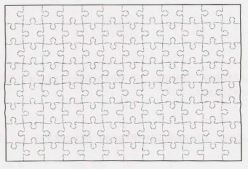
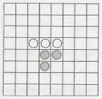
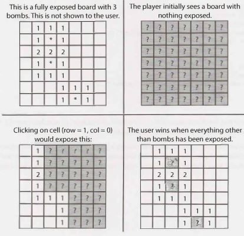

## 7 Object-Oriented Design

Object-oriented design questions require a candidate to sketch out the classes and methods to imple­ ment technical problems or real-life objects. These problems give-or at least are believed to give­
an interviewer insight into your coding style.

These questions are not so much about regurgitating design patterns as they are about demonstrating that you understand how to create elegant, maintainable object-oriented code. Poor performance on this type of question may raise serious red flags.


### How to Approach

Regardless of whether the object is a physical item or a technical task, object-oriented design questions can be tackled in similar ways. The following approach will work well for many problems.


**Step  1: Handle  Ambiguity**

Object-oriented design (OOD) questions are often intentionally vague in order to test whether you'll make assumptions or if you'll ask clarifying questions.  After all, a developer who just codes something without understanding what she is expected to create wastes the company's time and money, and may create much more serious issues.

When being asked an object-oriented design question, you should inquire who is going to use it and how they are going to use it. Depending on the question, you may even want to go through the "six Ws": who, what, where, when, how, why.

For example,  suppose you were asked to describe the object-oriented design for a coffee maker. This seems straightforward enough, right? Not quite.

Your coffee maker might be an industrial machine designed to be used in a massive restaurant servicing hundreds of customers per hour and making ten different kinds of coffee products. Or it might be a very simple machine, designed to be used by the elderly for just simple black coffee. These use cases will signifi­ cantly impact your design.


**Step 2: Define the Core Objects**

Now that we understand what we're designing, we should consider what the "core objects" in a system are. For example, suppose we are asked to do the object-oriented design for a restaurant. Our core objects might be things like Table, Guest, Party, Order, Meal, Employee, Server, and Host.


**Step 3: Analyze Relationships**

Having more or less decided on our core objects, we now want to analyze the relationships between the objects. Which objects are members of which other objects? Do any objects inherit from any others? Are relationships many-to-many or one-to-many?

For example, in the restaurant question, we may come up with the following design: 

- Party should have an array of Guests.
- Server and Host inherit from Employee.
- Each Table has one Party, but each Party may have multiple Tables. 
- There is one Host for the Restaurant.

Be very careful here-you can often make incorrect assumptions. For example, a single Table may have multiple Parties (as is common in the trendy "communal tables" at some restaurants). You should talk to your interviewer about how general purpose your design should be.


**Step 4: Investigate Actions**

At this point, you should have the basic outline of your object-oriented design. What remains is to consider the key actions that the objects will take and how they relate to each other. You may find that you have forgotten some objects, and you will need to update your design.

For example,  a Party walks into the Restaurant, and a Guest requests a Table from the Host. The Host  looks up the Reservation and, if it exists, assigns the Party to a Table. Otherwise, the Party is added to the end of the list. When a Party leaves, the Table is freed and assigned to a new Party in the list.


### Design Patterns

Because interviewers are trying to test your capabilities and not your knowledge, design patterns are mostly beyond the scope of an interview. However, the Singleton and Factory Method design patterns are widely used in interviews, so we will cover them here.

There are far more design patterns than this book could possibly discuss. A great way to improve your soft­
ware engineering skills is to pick up a book that focuses on this area specifically.

Be careful  you don't fall into a trap of constantly trying to find the "right" design pattern for a particular problem.  You should create the design that works for that problem. In some cases it might be an estab­ lished pattern, but in many other cases it is not.


 **Singleton Class**

The Singleton pattern ensures that a class has only one instance and ensures access to the instance through the application.  It can be useful in cases where you have a "global" object with exactly one instance. For example, we may want to implement Restaurant such that it has exactly one instance of Restaurant.

```java
1   public class Restaurant  {
2       private static Restaurant _instance =  null;
3       protected Restaurant()  {  ... }
4       public static Restaurant  getlnstance()  {
5           if (_instance ==  null) {
6               _instance =  new Restaurant();
7           }
8           return _instance;
9       }
10  }
```

It should be noted that many people dislike the Singleton design pattern, even calling it an "anti-pattern". One reason for this is that it can interfere with unit testing.


**Factory Method**

The Factory Method offers an interface for creating an instance of a class, with its subclasses deciding which class to instantiate. You might want to implement this with the creator class being abstract and not providing an implementation for the Factory method. Or, you could have the Creator class be a concrete class that provides an implementation for the Factory method. In this case, the Factory method would take a parameter representing which class to instantiate.

```java
1   public class CardGame {
2       public static  CardGame createCardGame(GameType type) {
3           if (type == GameType.Poker)  {
4               return new PokerGame();
5           }  else if (type == GameType.BlackJack)   {
6               return new BlackJackGame();
7           }
8           return null;
9       }
10  }
```

---

Interview Questions

---

**7.1   Deck of Cards:**  Design the data structures for a generic deck of cards. Explain how you would subclass the data structures to implement blackjack.

SOLUTION

---

First, we need to recognize that a "generic" deck of cards can mean many things. Generic could mean a standard deck of cards that can play a poker-like game, or it could even stretch to Uno or Baseball cards. It is important to ask your interviewer what she means by generic.

Let's assume that your interviewer clarifies that the deck is a standard 52-card set, like you might see used in a blackjack or poker game. If so,  the design might look like this:

```java
1   public   enum Suit   {
2       Club (0),  Diamond  (1),  Heart (2), Spade (3);
3       private int value;
4       private Suit(int v)  { value  =  v; }
5       public  int  getValue() { return  value; }
6       public  static Suit  getSuitFromValue(int value)  {... }
7   }
8   
9   public   class Deck <T  extends   Card> {
10      private ArrayList<T>  cards;//   all cards,   dealt or  not
11      private int  dealtlndex =  0;  // marks first undealt card
12  
13      public void setDeckOfCards(ArrayList<T>  deckOfCards) {... }
14  
15      public void shuffle() {... }
16      public int remainingCards() {
17          return cards.size()  -  dealtlndex;
18      }
19      public T[]  dealHand(int  number) {... }
20      public T  dealCard()  {... }
21  }
22  
23  public abstract class Card {
24      private boolean  available =  true;
25  
26      /* number or  face  that's on card  -  a number 2 through  10,  or  11 for  Jack,   12 for
27       * Queen,  13 for   King,  or  1 for  Ace */
28      protected int faceValue;
29      protected Suit suit;
30  
31      public Card(int c,  Suit  s) {
32          faceValue  =  c;
33          suit =  s;
34      }
35  
36      public  abstract int value();
37      public   Suit  suit() {return  suit;}
38  
39      /*  Checks if the  card  is available to  be given  out  to  someone */
40      public boolean  isAvailable() {return  available;  }
41      public void  markUnavailable() {available  =  false; }
42      public void  markAvailable()  {available  =   true; }
43  }
44  
45  public class Hand <T  extends  Card> {
46      protected  ArrayList<T> cards  =  new ArrayList<T>();
47  
48      public int score() {
49          int score  =  0;
50          for  (T  card   :   cards) {
51              score  += card.value();
52          }
53          return score;
54      }
55  
56      public void  addCard(T card)   {
57          cards.add(card);
58      }
59  }
```

In the above code, we have implemented Deck with generics but restricted the type of T to Card. We have also implemented Card as an abstract class, since methods like value() don't make much sense without a specific game attached to them. (You could make a compelling argument that they should be implemented anyway, by defaulting to standard poker rules.)

Now, let's say we're building a blackjack game, so we need to know the value of the cards. Face cards are 10 and an ace is 11 (most of the time, but that's the job of the Hand class, not the following class).

```java
1   public class BlackJackHand extends  Hand<BlackJackCard>  {
2       /* There are  multiple possible  scores for  a  blackjack hand,  since   aces  have
3       * multiple values.  Return  the  highest possible score  that's under  21,  or  the
4       * lowest  score  that's  over. */
5       public int score() {
6           ArrayList<Integer> scores =  possibleScores();
7           int maxUnder =  Integer.MIN_VALUE;
8           int minOver =   Integer.MAX_VALUE;
9           for  (int score   :   scores) {
10              if (score > 21 &&   score  < minOver) {
11                  minOver =  score;
12              }  else if (score <= 21 &&   score >  maxUnder) {
13                  maxUnder   =  score;
14              }
15          }
16          return maxUnder == Integer.MIN_VALUE  ?  minOver  :  maxUnder;
17      }
18  
19      /* return a  list of  all poss ible  scores   this hand could  have  (evaluating each
20      *  ace  as  both  1  and  11 */
21      private  ArrayList<Integer> possibleScores() { ... }

22  
23      public boolean  busted()  { return score() >  21;  }
24      public boolean  is21() {  return score() ==    21;  }
25      public boolean  isBlackJack() { ... }
26  }
27  
28  public  class  BlackJackCard extends   Card  {
29      public BlackJackCard(int c,   Suit s)  {  super(c,   s);}
30      public int  value()  {
31          if (isAce()) return 1;
32          else if (faceValue >= 11  &&   faceValue  <=  13)  return 10;
33          else return faceValue;
34      }
35  
36      public int minValue() {
37          if (isAce()) return 1;
38          else return  v alue();
39      }
40      
41      public int maxValue()  {
42          if (isAce()) return 11;
43          else return value();
44      }
45      
46      public boolean isAce() {
47          return  faceValue == 1;
48      }
49      
50      public boolean isFaceCard()  {
51          return  faceValue >= 11  &&   faceValue  <= 13;
52      }
53 }
```

This is just one way of handling aces. We could, alternatively, create  a class of type Ace that  extends
BlackJackCard.

An executable, fully automated  version of blackjack is provided in the downloadable code attachment.


**7.2   Call Center:** Imagine you have a call center with three levels of employees: respondent, manager, and director. An incoming telephone call must be first allocated to a respondent  who is free. If the respondent can't handle the call, he or she must escalate the call to a manager. If the manager is not free or not able to handle it, then the call should be escalated to a director. Design the classes and data structures for this problem. Implement a method  dispatchCall () which assigns a call to the first available employee.

SOLUTION

---

All three ranks of employees have different work to be done, so those specific functions are profile specific. We should keep these things within their respective class.

There are a few things which are common to them, like address,  name, job title, and age. These things can be kept in one class and can be extended or inherited by others.

Finally, there should be one CallHandler class which would route the calls to the correct person.

Note that on any object-oriented design question, there are many ways to design the objects. Discuss the trade-offs of different solutions with your interviewer.  You should usually design for long-term code flex­ ibility and maintenance.

We'll go through each of the classes below in detail.

CallHandler represents the body of the program, and all calls are funneled first through it.

```java
1   public class  CallHandler {
2       /*  3 levels of  employees:  respondents,  managers,  directors. */
3       private final int LEVELS =  3;
4   
5       /*  Initialize 10 respondents,  4 managers,  and 2 directors. */
6       private final int NUM_RESPONDENTS = 10;
7       private final int NUM_MANAGERS = 4;
8       private final int NUM_DIRECTORS =  2;
9   
10      /* List of  employees,  by level.
11       * employeeLevels[0] = respondents
12       * employeeLevels[1] = managers
13       * employeeLevels[2] = directors
14       */
15      List<List<Employee>> employeeLevels;
16  
17      /*  queues  for  each  call's rank  */
18      List<List<Call>> callQueues;
19  
20      public CallHandler() {  ... }
21  
22      /*  Gets  the  first available employee who  can handle  this call.*/
23      public Employee getHandlerForCall(Call call) {  ... }
24  
25      /*  Routes  the  call to  an available employee,  or  saves  in  a  queue if no employee
26      * is available. */
27      public void  dispatchCall(Caller caller)  {
28          Call  call = new Call(caller);
29          dispatchCall(call);
30      }
31  
32      /*  Routes  the  call to  an available employee,  or  saves  in  a  queue if no employee
33      * is available. */
34      public void  dispatchCall(Call call)  {
35          /*  Try to  route the  call to  an employee with  minimal rank. */
36          Employee emp =  getHandlerForCall(call);
37          if (emp != null) {
38              emp.receiveCall(call);
39              call.setHandler(emp);
40          }  else {
41              /*  Place  the  call into   corresponding call  queue according  to  its rank.  */
42              call.reply("Please wait  for   free employee to  reply");
43              callQueues.get(call.getRank().getValue()).add(call);
44          }
45      }
46  
47      /*An  employee got  free. Look for  a waiting   call that employee can serve.  Return
48      * true  if we  assigned a  call, false otherwise. */
49      public boolean  assignCall(Employee emp) {... }
50  }
```

Call represents a call from a user. A call has a minimum rank and is assigned to the first employee who can handle it.

```java
1   public class  Call  {
2       /*Minimal rank of  employee who can handle  this call.*/
3       private Rank rank;
4   
5       /*Person   who  is calling.*/
6       private Caller caller;
7   
8       /*Employee who  is handling  call.*/
9       private Employee handler;
10  
11      public Call(Caller  c)  {
12          rank  =  Rank.Responder;
13          caller =  c;
14      }
15  
16      /*Set employee who  is handling  call.*/
17      public void  setHandler(Employee  e)  {handler      e; }
18  
19      public void reply(String message)  {... }
20      public Rank getRank()  {return  rank;}
21      public void setRank(Rank r)   {rank  =  r; }
22      public Rank incrementRank()  {... }
23      public void disconnect()  {  ... }
24  }
```

Employee is a super class for the Director, Manager, and Respondent classes. It is implemented as an abstract class since there should be no reason to instantiate an Employee type directly.

```java
1   abstract class Employee {
2       private Call  currentCall =  null;
3       protected Rank rank;
4   
5       public Employee(CallHandler  handler)   { ... }
6   
7       /*Start the  conversation*/
8       public void receiveCall(Call call)  {  ... }
9   
10      /*the issue is  resolved, finish the  call*/
11      public void callCompleted()  {  ... }
12  
13      /*The issue has  not  been resolved. Escalate the  call, and assign a new call to
14      * the  employee. */
15      public void  escalateAndReassign()  {    }
16  
17      /*Assign  a new call to  an employee,  if the  employee is free.*/
18      public boolean assignNewCall()   {  ... }
19  
20      /*Returns  whether  or  not  the  employee is free.*/
21      public boolean isFree()  { return currentCall ==  null;  }
22  
23      public Rank getRank()  {  return rank;}
24  }
25
```

The Respondent, Director, and Manager classes are now just simple extensions of the  Employee class.

```java
1   class  Director extends Employee {
2       public Director()  {
3           rank =  Rank.Director;
4       }
5   }
6   
7   class Manager extends  Employee {
8       public Manager()  {
9           rank  =  Rank.Manager;
10      }
11  }
12  
13  class Respondent  extends  Employee {
14      public  Respondent() {
15          rank  =  Rank.Responder;
16      }
17  }
```

This is just one way of designing this problem. Note that there are many other ways that are equally good.

This may seem like an awful lot of code to write in an interview, and it is. We've been much more thorough here than you would need. In a real interview, you would likely be much lighter on some of the details until you have time to fill them in.

 
**7.3  Jukebox:** Design a musical jukebox using object-oriented principles.


SOLUTION
 
---

In any object-oriented  design  question, you first want to start off with asking your interviewer some questions to clarify design constraints. Is this jukebox playing CDs? Records?  MP3s? Is it a simulation on a computer, or is it supposed to represent a physical jukebox? Does it take money, or is it free? And if it takes money, which currency? And does it deliver change?

Unfortunately, we don't have an interviewer here that we can have this dialogue with. Instead, we'll make some assumptions. We'll assume that the jukebox is a computer simulation that closely mirrors physical jukeboxes, and we'll assume that it's free.

Now that we have that out of the way, we'll outline the basic system components:

- Jukebox
- CD
- Song
- Artist
- Playlist
- Display (displays details on the screen)

Now, let's break this down further and think about the possible actions.

- Playlist  creation (includes add, delete, and shuffle)
- CD selector 
- Song selector 
- Queuing up a song
- Get next song from playlist

A user also can be introduced:

- Adding
- Deleting
- Credit information

Each of the main system components  translates  roughly to an object, and each action translates to a method. Let's walk through one potential design.

The Jukebox class represents the body of the problem. Many of the interactions between the components of the system, or between the system and the user, are channeled through here.

```java
1   public class Jukebox  {
2       private CDPlayer  cdPlayer;
3       private User  user;
4       private Set<CD> cdCollection;
5       private SongSelector ts;
6   
7       public Jukebox(CDPlayer  cdPlayer,  User  user,  Set<CD>  cdCollection,
8                   SongSelector ts) {  ....   }
9   
10      public Song getCurrentSong()  {  return  ts.getCurrentSong(); }
11      public void  setUser(User  u)  {  this.user =  u;}
12  }
```

Like a real CD player, the CDP layer class supports storing just one CD at a time. The CDs that are not in play are stored in the jukebox.

```java
1   public class CDPlayer  {
2       private Playlist p;
3       private CD  c;
4   
5       /*Constructors.*/
6       public CDPlayer(CD c,   Playlist p)  {...}
7       public CDPlayer(Playlist p)  {  this.p =  p;}
8       public CDPlayer(CD c)  {  this.c =  c;}
9   
10      /*Play song*/
11      public void  playSong(Song s)  {  ... }
12  
13      /*Getters and  setters*/
14      public Playlist  getPlaylist()  { return p;}
15      public void  setPlaylist(Playlist p)  {  this.p =  p;}
16  
17      public CD   getCD()  {  return c; }
18      public void setCD(CD c)  { this.c =  c; }
19  }
```

The Playlist manages the current and next songs to play. It is essentially a wrapper class for a queue and offers some additional methods for convenience.

```java
1   public class Playlist  {
2       private Song  song;
3       private Queue<Song> queue;
4       public  Playlist(Song  song, Queue<Song>   queue) {
5   
6       }
7       public Song getNextSToPlay()  {
8           return  queue.peek();
9       }
10      public  void queueUpSong(Song  s) {
11          queue.add(s);
12      }
13  }
```

The classes  for CD, Song, and  User are all fairly straightforward. They consist mainly  of member variables and  getters and  setters.

```java
1   public  class CD   {/*  data for id,  artist, songs, etc  */}
2   
3   public  class Song   {/*  data for id,  CD  (could be  null), title,  length,  etc  */}
4   
5   public  class  User {
6       private String  name;
7       public String  getName() { return name;}
8       public void setName(String name)   {   this.name = name;}
9       public long getID() { return ID;}
10      public void setID(long  iD) {ID = iD;}
11      private long ID;
12      public User(String name,   long iD) {  ... }
13      public User getUser() { return this;}
14      public static  User addUser(String  name,   long iD) {  ... }
15  }
```

This is by no means the  only "correct" implementation. The interviewer's responses to initial questions, as well as other constraints, will shape the design of thejukebox classes.

 
**7.4        Parking Lot:** Design a parking lot using object-oriented principles.


SOLUTION
 
---

The wording of this question is vague, just as it would be in an actual interview. This requires you to have a conversation with  your  interviewer about what types of vehicles it can support, whether the  parking lot has multiple levels, and  so on.

For our purposes right now, we'll make the  following assumptions. We made these specific assumptions to add a bit of complexity to the problem without adding too much. If you made different assumptions, that's totally fine.

- The parking lot has multiple levels. Each level has multiple rows of spots.
- The parking lot can park motorcycles, cars, and  buses.
- The parking lot has motorcycle spots, compact spots, and large spots.
- A motorcycle can park in any spot.
- A car can park in either a single compact spot or a single  large spot.
- A bus can park in five large spots that are consecutive and within the same row. It cannot park in small spots.

In the below implementation, we have created an abstract class Vehicle, from which Car, Bus, and Motorcycle inherit. To handle the different parking spot sizes, we have just one class ParkingSpot which has a member variable indicating the size. 

```java
1   public enum  VehicleSize {  Motorcycle,   Compact, Large }
2   
3   public abstract class Vehicle  {
4       protected ArrayList<ParkingSpot> parkingSpots  = new ArrayList<ParkingSpot>();
5       protected String licensePlate;
6       protected int spotsNeeded;
7       protected VehicleSize size;
8   
9       public int getSpotsNeeded() {  return spotsNeeded;   }
10      public VehicleSize getSize()  {  return size;  }
11  
12      /*  Park  vehicle in  this spot  (among others, potentially) */
13      public void parkinSpot(ParkingSpot s)  {  parkingSpots.add(s);  }
14  
15      /*  Remove  car  from spot,  and notify spot  that it's gone */
16      public void clearSpots() {  ... }
17  
18      /* Checks if the  spot  is big  enough for  the  vehicle (and  is  available). This
19      * compares the  SIZE only. It does  not  check if it has  enough spots. */
20      public abstract boolean canFitInSpot(ParkingSpot spot);
21  }
22  
23      public class  Bus extends  Vehicle  {
24          public Bus()  {
25          spotsNeeded  =  5;
26          size =  VehicleSize.Large;
27      }
28  
29      /*  Checks if the  spot  is a  Large.  Doesn't  check num  of  spots  */
30      public boolean  canFitInSpot(ParkingSpot spot)  {             }
31  }
32  
33  public class Car extends  Vehicle  {
34      public Car()   {
35          spotsNeeded  =  1;
36          size =  VehicleSize.Compact;
37      }
38  
39      /*  Checks if the  spot  is a Compact  or  a Large.  */
40      public boolean  canFitInSpot(ParkingSpot spot)  {  ... }
41  }
42  
43  public class Motorcycle  extends  Vehicle  {
44      public  Motorcycle() {
45          spotsNeeded  =  1;
46          size =  VehicleSize.Motorcycle;
47      }
48  
49      public   boolean  canFitInSpot(ParkingSpot spot)  {  ... }
50  }
```

The ParkingLot class is essentially a wrapper class for an array of Levels. By implementing it this way, we are able to separate out logic that deals with actually finding free spots and parking cars out from the broader actions of the ParkingLot. If we didn't do it this way, we would need to hold parking spots in some sort of doublearray (or hash table which maps from a level number to the list of spots).  It's cleaner to just separate ParkingLot from Level.

```java
1   public class ParkingLot  {
2       private Level[]   levels;
3       private final int NUM_LEVELS  =  5;
4   
5       public ParkingLot() {  ... }
6   
7       /*  Park the  vehicle in  a  spot  (or   multiple spots).  Return  false if failed. */
8       public boolean  parkVehicle(Vehicle vehicle)  {  ... }
9   }
10  
11  /*  Represents a  level   in  a parking  garage  */
12  public class  Level {
13      private int floor;
14      private  ParkingSpot[] spots;
15      private int  availableSpots =  0; // number of  free  spots
16      private static  final int SPOTS_PER_ROW  =   10;
17  
18      public Level(int flr,  int  numberSpots)  { ... }
19  
20      public int availableSpots() {  return availableSpots;  }
21  
22      /*  Find a  place   to  park  this vehicle. Return  false if  failed. */
23      public boolean  parkVehicle(Vehicle vehicle)  { ... }
24  
25      /*  Park  a  vehicle starting at the  spot  spotNumber, and continuing until
26      *  vehicle.spotsNeeded. */
27      private boolean  parkStartingAtSpot(int  num, Vehicle  v)  { ... }
28  
29      /*  Find  a  spot  to  park  this vehicle. Return  index  of  spot,  or  -1 on failure. */
30      private  int  findAvailableSpots(Vehicle vehicle)  { ... }
31  
32      /*  When  a  car  was removed from the  spot,  increment  availableSpots */
33      public void  spotFreed() {  availableSpots++; }
34  }
```

The ParkingSpot is implemented by having just a variable which represents the size of the spot. We could have implemented this by having classes for LargeSpot, CompactSpot, and MotorcycleSpot which inherit from ParkingSpot, but this is probably overkill. The spots probably do not have different behaviors, other than their sizes.

```java
1   public class  ParkingSpot  {
2       private Vehicle  vehicle;
3       private VehicleSize spotSize;
4       private int row;
5       private int spotNumber;
6       private Level level;
7   
8       public  ParkingSpot(Level lvl, int r,  int n,  VehicleSize   s) {...}
9   
10      public boolean  isAvailable() {  return  vehicle == null; }
11  
12      /* Check   if the spot is b ig  enough  and   is available */
13      public boolean c anFitVehicle(Vehicle vehicle)  {  ... }
14  
15      /* Park vehicle in this  spot. */
16      public boolean park(Vehicle  v)   {           }
17  
18      public int  getRow()  {  return row;   }
19      public int  getSpotNumber()  {  return spotNumber;  }
20  
21      /* Remove  vehicle from   spot,  and   notify level that a  new  spot is available  */
22      public  void removeVehicle() {  ... }
23  }
```

A full implementation of this  code,  including executable test  code,  is provided in the  downloadable code attachment.

 
**7.5         Online Book Reader:** Design the data structures for an online book reader system.


SOLUTION
 
---

Since the  problem doesn't describe much about the  functionality, let's assume we want to design a basic online reading system which  provides the following functionality:

- User membership creation and  extension.
- Searching the  database of books.
- Reading a book.
- Only one active  user  at a time
- Only one active  book by this user.

To implement these operations we may  require many other functions, like get, set, update, and  so on. The objects required would likely include User, Book,  and  Library.

The class OnlineReaderSystem represents the body of our program. We could implement the class such that it stores information about all the books, deals with user  management, and  refreshes the  display,  but that would make this class rather hefty.  Instead, we've chosen to tear off these components into  Library, UserManager, and  Display classes.

```java
1   public  class  OnlineReaderSystem {
2       private Library library;
3       private UserManager userManager;
4       private Display display;
5   
6       private Book activeBook;
7       private User activeUser;
8   
9       public  OnlineReaderSystem() {
10          userManager  =  new  UserManager();
11          library =  new  Library();
12          display =  new  Display();
13      }
14  
15      public Library getLibrary()  {  return library; }
16      public UserManager getUserManager()  {  return userManager;}
17      public Display  getDisplay() { return display; }
18  
19      public Book getActiveBook() {  return  activeBook; }
20      public void setActiveBook(Book book)  {
21          activeBook =  book;
22          display.displayBook(book);
23      }
24  
25      public User getActiveUser() {  return activeUser; }
26      public void  setActiveUser(User user)  {
27          activeUser =  user;
28          display.displayuser(user);
29      }
30  }
```

We then implement separate classes to handle the user manager, the library, and the display components.

```java
1   public class  Library   {
2       private HashMap<Integer, Book>  books;
3   
4       public Book addBook(int  id,   String details)  {
5           if (books.containsKey(id)) {
6               return null;
7           }
8           Book book =  new Book(id,  details);
9           books.put(id,  book);
10          return  book;
11      }
12  
13      public boolean  remove(Book b)  {  return remove(b.getID());}
14      public boolean  remove(int id)  {
15          if (!books.containsKey(id)) {
16              return false;
17          }
18          books.remove(id);
19          return true;
20      }
21  
22      public Book find(int id) {
23          return books.get(id);
24      }
25  }
26  
27  public class UserManager {
28      private HashMap<Integer, User> users;
29  
30      public User  addUser(int id,   String details, int accountType)  {
31          if (users.containsKey(id))  {
32              return null;
33          }
34          User  user  =  new User(id, details,  accountType);
35          users.put(id,  user);
36          return user;
37      }
38  
39      public User find(int id) {  return users.get(id); }
40      public boolean  remove(User u)  {  return remove(u.getID());}
41      public boolean  remove(int id)  {
42          if (!users.containsKey(id)) {
43              return false;
44          }
45          users.remove(id);
46          return true;
47      }
48  }
49  
50  public   class Display  {
51      private Book activeBook;
52      private User activeuser;
53      private int pageNumber   =  0;
54  
55      public   void  displayUser(User user)  {
56          activeUser =  user;
57          refreshUsername();
58      }
59  
60      public  void  displayBook(Book book) {
61          pageNumber  =  0;
62          activeBook  =  book;
63  
64          refreshTitle();
65          refreshDetails();
66          refreshPage();
67      }
68  
69      public  void  turnPageForward() {
70          pageNumber++;
71          refreshPage();
72      }
73  
74      public   void  turnPageBackward()  {
75          pageNumber--;
76          refreshPage();
77      }
78  
79      public void  refreshUsername()  {/* updates  username display*/}
80      public void  refreshTitle() {/*  updates  title display*/}
81      public void  refreshDetails() {/*  updates  details  display*/ }
82      public void  refreshPage() {/*  updated  page display*/}
83  }
```

The classes for User and Book simply hold data and provide little true functionality.

```java
1   public   class Book {
2       private int  bookid;
3       private String details;
4   
5       public   Book(int  id,   String det) {
6           bookid  =  id;
7           details =  det;
8       }
9   
10      public  int  getID() {return  bookld;}
11      public  void  setID(int id) {  bookld  = id;}
12      public  String getDetails()  {  return details;  }
13      public  void  setDetails(String d)  {details  =  d};
14  }
15  
16  public class User   {
17      private int userid;
18      private String details;
19      private int accountType;
20  
21      public  void renewMembership()  {  }
22  
23      public User(int id, String details,  int  accountType)  {
24          userid = id;
25          this.details =  details;
26          this.accountType =  accountType;
27      }
28  
29      /* Getters and  setters */
30      public int getID() {  return userid; }
31      public void setID(int  id)  { userid = id; }
32      public String getDetails()  {
33          return details;
34      }
35  
36      public void setDetails(String  details)  {
37          this.details =  details;
38      }
39      public int getAccountType()  {  return accountType }
40      public  void setAccountType(int t) {  accountType  = t; }
41  }
```

The decision to tear offuser management, library, and display into their own classes, when this functionality could have been in the  general OnlineReaderSystem class, is an interesting one. On a very small system, making this decision could make the  system overly complex. However,  as the  system grows,  and more and more functionality gets added to OnlineReaderSystem, breaking off such components prevents this main class from getting overwhelmingly lengthy.

 
**7.6   Jigsaw:** Implement an NxN jigsaw  puzzle.  Design  the  data  structures and  explain an algorithm to solve  the  puzzle.  You can  assume that you  have  a fitsWith method which, when passed two
puzzle edges, returns true if the  two edges belong together. 


SOLUTION
 
---

We have  a traditional jigsaw puzzle. The puzzle is grid-like, with rows and columns. Each piece is located in a single  row and column and has four edges. Each edge comes in one  of three types:  inner, outer, and  flat. A corner piece, for example, will have two flat edges and  two other edges, whichcould be inner  or outer.





As we solve the jigsaw puzzle (manually or algorithmically), we'll need to store the position of each piece. We could think about the position as absolute or relative:

- *Absolute Position:* "This piece is located at position (12, 23)".
- *Relative Position:* "I don't know where this piece is actually located, but I know it is next to this other piece".

For our solution, we will use the absolute position.

We'll need classes to represent Puzzle, Piece, and Edge. Additionally, we'll want enums for the different shapes (inner, outer, flat) and the orientations of the edges (left, top, right, bottom).

Puzzle will start off with a list of the pieces. When we solve the puzzle, we'll fill in an NxN solution matrix of pieces.

Piece will have a hash table that maps from an orientation to the appropriate edge. Note that we might rotate the piece at some point, so the hash table could change. The orientation of the edges will be arbi­ trarily assigned at first.

Edge will have just its shape and a pointer back to its parent piece. It will not keep  its orientation. 

A potential object-oriented design looks like the following:

```java
1   public  enum  Orientation {
2       LEFT, TOP, RIGHT, BOTTOM;  //  Should stay in  this  order
3   
4       public  Orientation getOpposite()  {
5           switch (this) {
6           case LEFT: return  RIGHT;
7           case RIGHT:  return  LEFT;
8           case TOP:  return  BOTTOM;
9           case BOTTOM:  return  TOP;
10          default:   return  null;
11          }
12      }
13  }
14  
15  public  enum  Shape   {
16      INNER,  OUTER,  FLAT;
17  
18      public  Shape getOpposite()  {
19          switch (this) {
20          case INNER:  return  OUTER;
21          case OUTER:  return  INNER;
22          default:  return  null;
23          }
24      }
25  }
26  
27  public   class Puzzle  {
28      private  LinkedList<Piece> pieces;  /*  Remaining pieces to  put  away. */
29      private Piece[][] solution;
30      private int size;
31  
32      public   Puzzle(int  size,   LinkedList<Piece> pieces)  {  ... }
33  
34  
35      /*  Put  piece  into the  solution,  turn  it appropriately,  and remove from list. */
36      private void  setEdgeinSolution(LinkedList<Piece> pieces,  Edge edge,  int row,
37      		int column, Orientation orientation)  {
38          Piece  piece  =  edge.getParentPiece();
39          piece.setEdgeAsOrientation(edge,  orientation);
40          pieces.remove(piece);
41          solution[row][column]  =  piece;
42      }
43  
44      /*  Find the  matching piece  in  piecesToSearch  and insert it at row,  column. */
45      private boolean  fitNextEdge(LinkedList<Piece> piecesToSearch,   int row,  int col);
46  
48      /*  Solve  puzzle.  */
48      public  boolean  solve() {  ... }
49  }
50  
51  public   class Piece  {
52      private HashMap<Orientation,  Edge> edges     new HashMap<Orientation,  Edge>();
53  
54      public  Piece(Edge[]   edgelist) {  ... }
55  
56      /*  Rotate  edges  by  "numberRotations". */
57      public   void rotateEdgesBy(int numberRotations)  {  ... }
58  
59      public   boolean  isCorner() {            }
60      public   boolean  isBorder() {            }
61  }
62  
63  public   class Edge {
64      private Shape shape;
65      private Piece parentPiece;
66      public  Edge(Shape shape)  {  ... }
67      public  boolean  fitsWith(Edge edge)  {  ... }
68  }
```

##### Algorithm to Solve the  Puzzle

Just as a kid might in solving a puzzle, we'll start with grouping the pieces into corner pieces, border pieces, and inside pieces.

Once we've done that, we'll pick an arbitrary corner piece and put it in the top left corner. We will then walk through the puzzle in order, filling in piece by piece. At each location, we search through the correct group of pieces to find the matching piece. When we insert the piece into the puzzle, we need to rotate the piece to fit correctly.

The code below outlines this algorithm.

```java
1   /*Find  the  matching  piece  within   piecesToSearch  and insert it at row,  column. */
2   boolean  fitNextEdge(LinkedList<Piece> piecesToSearch, int  row,  int column)  {
3       if (row == 0 &&   column == 0)  {//On top  left  corner, just put  in  a piece
4           Piece  p =  piecesToSearch.remove();
5           orientTopleftCorner(p);
6           solution[0][0] = p;
7       }  else {
8           /*Get  the  right edge and list to  match.    */
9           Piece  pieceToMatch =  column ==  0 ?  solution[row -  1][0]  :
10                                   solution[row][column  -  1];
11          Orientation  orientationToMatch    column == 0 ? Orientation.BOTTOM : 
12                                                           Orientation.RIGHT;
13          Edge edgeToMatch = pieceToMatch.getEdgeWithOrientation(orientationToMatch);
14  
15          /*Get  matching  edge.    */
16          Edge edge =  getMatchingEdge(edgeToMatch, piecesToSearch);
17          if (edge  ==  null) return false;   //Can't  solve
18  
19          /*Insert piece  and edge.    */
20          Orientation orientation  = orientationToMatch.getOpposite();
21          setEdgeinSolution(piecesToSearch,  edge,  row,  column,  orientation);
22      }
23      return true;
24  }
25  
26  boolean  solve() {
27      /*Group pieces.   */
28      LinkedList<Piece> cornerPieces = new  LinkedList<Piece>();
29      LinkedList<Piece> borderPieces = new  LinkedList<Piece>();
30      LinkedList<Piece> insidePieces = new  LinkedList<Piece>();
31      groupPieces(cornerPieces,  borderPieces,  insidePieces);
32  
33      /*Walk through  puzzle,   finding the  piece   that joins the  previous one.    */
34      solution = new  Piece[size][size];
35      for  (int row =  0;  row <  size;  row++) {
36          for  (int column =  0;  column <  size; column++) {
37              LinkedList<Piece> piecesToSearch  =  getPieceListToSearch(cornerPieces,
38                  borderPieces, insidePieces,  row,  column);
39              if (!fitNextEdge(piecesToSearch,  row,  column))  {
40                  return false;
41              }
42          }
43      }
44  
45      return true;
46  }
```

The full code for this solution can be found in the downloadable code attachment.

**7.7         Chat  Server:** Explain how you would design a chat server. In particular, provide details about the various backend components, classes, and methods. What would be the hardest problems to solve?

SOLUTION

---

Designing a chat server is a huge project, and it is certainly far beyond the scope of what could be completed in an interview. After all, teams of many people spend months or years creating a chat server. Part of your job, as a candidate, is to focus on an aspect of the problem that is reasonably broad, but focused enough that you could accomplish it during an interview. It need not match real life exactly, but it should be a fair representation  of an actual implementation.

For our purposes, we'll focus on the core user management and conversation  aspects: adding a user, creating a conversation, updating one's status, and so on. In the interest of time and space, we will not go into the networking aspects of the problem, or how the data actually gets pushed out to the clients.

We will assume that "friending" is mutual; I  am only your contact if you are mine. Our chat system will support both group chat and one-on-one  (private) chats. We will not worry about voice chat, video chat, or file transfer.


**What specific actions does it need to support?**

This is also something to discuss with your interviewer, but here are some ideas: 

- Signing online and offiine.
- Add requests (sending, accepting, and rejecting).
- Updating a status message. 
- Creating private and group chats.
- Adding new messages to private and group chats.

This is just a partial list. If you have more time, you can add more actions.


**What can we learn  about these requirements?**

We must have a concept of users, add request status, online status, and messages.


**What are  the  core  components of the system?**

The system would likely consist of a database, a set of clients, and a set of servers. We won't include these parts in our object-oriented design, but we can discuss the overall view of the system.

The database will be used for more permanent storage, such as the user list or chat archives. A SQL database is a good bet, or, if we need more scalability, we could potentially use BigTable or a similar system.

For communication  between  the client and servers, using XML will work well. Although it's not the most compressed format (and you should point this out to your interviewer), it's nice because it's easy for both computers and humans to read. Using  XML will make your debugging  efforts easier-and that matters a lot.

The server will consist of a set of machines. Data will be split across machines, requiring us to potentially hop from machine to machine. When possible, we will try to replicate some data across machines to minimize the lookups. One major design constraint here is to prevent having a single point of failure. For instance, if one machine controlled all the  user  sign-ins,  then we'd  cut  off millions  of users  potentially if a single machine lost network connectivity.

**What are the key objects  and methods?**

The key objects of the  system will be a concept of users, conversations, and status messages. We've imple­ mented a UserManager class. If we were  looking more at the  networking aspects of the problem, or a different component, we might have instead dived into those objects.

```java
1   /*  UserManager serves as a  central place for core user actions. */
1   public class UserManager  {
2       private static UserManager  instance;
3       /* maps  from   a  user id to a  user */
4       private HashMap<Integer,  User>   usersByid;
5   
6       /* maps  from   an  account name  to a  user */
7       private HashMap<String,  User>   usersByAccountName;
8   
9       /* maps  from   the user id to an  online user */
10      private HashMap<Integer,  User>   onlineUsers;
11  
12      public static  UserManager getinstance() {
13          if (instance == null) instance =  new  UserManager();
14          return instance;
15      }
16  
17      public  void addUser(User fromUser, String  toAccountName)  {  ... }
18      public  void approveAddRequest(AddRequest req) {  ... }
19      public  void rejectAddRequest(AddRequest req)  {   ... }
20      public  void userSignedOn(String accountName)  {  ... }
21      public  void userSignedOff(String  accountName)  {  ... }
22  }
```

The  method receivedAddRequest,  in  the   User class,   notifies User  B that User  A has  requested to  add him.   User  B  approves  or  rejects the   request  (via  UserManager. approveAddRequest  or rejectAddRequest), and the UserManager takes care  of adding the  users  to each other's contact lists.

The method sentAddRequest in the  User class  is called by UserManager to add an AddRequest to User A's list of requests. So the flow is:

1.  User A clicks "add user" on the client and it gets sent to the server.
2.  User A calls requestAddUser(User B).
3.  This method calls UserManager. addUser.
4.  UserManager calls both User  A. sentAddRequest and
    User B.receivedAddRequest.

Again, this is just one way of designing these interactions. It is not the only way, or even the only "good" way.

```java
1   public  class  User {
2       private int id;
3       private UserStatus status  =  null;
4   
5       /* maps  from   the other participant's  user id to the chat */
6       private HashMap<Integer, PrivateChat>  privateChats;
7   
8       /* list of group chats  */
9       private ArrayList<GroupChat> groupChats;
10  
11      /*  maps from the  other person's user  id  to  the  add request */
12      private HashMap<Integer, AddRequest> receivedAddRequests;
13  
14      /*  maps from the  other person's user  id  to  the  add request */
15      private HashMap<Integer, AddRequest>  sentAddRequests;
16  
17      /*  maps from the  user  id  to  user  object */
18      private HashMap<Integer, User> contacts;
19  
20      private String accountName;
21      private String fullName;
22  
23      public User(int id,   String accountName, String fullName)  {  ... }
24      public boolean  sendMessageToUser(User to,   String content) {  ... }
25      public boolean  sendMessageToGroupChat(int id,   String cnt) {...}
26      public void  setStatus(UserStatus status)  {            }
27      public UserStatus getStatus()  {  ... }
28      public boolean  addContact(User   user)   {  ... }
29      public void  receivedAddRequest(AddRequest req)  {  ... }
30      public void  sentAddRequest(AddRequest req)  {  ... }
31      public void  removeAddRequest(AddRequest  req)   {  ... }
32      public void  requestAddUser(String accountName) {  ... }
33      public void  addConversation(PrivateChat conversation)  {         }
34      public void  addConversation(GroupChat  conversation) {   ... }
35      public int getid() {  ... }
36      public String getAccountName() {   ... }
37      public String getFullName()  {  ... }
38  }
```

The Conversation class is implemented  as an abstract class, since all Conversations must be either a GroupChat or a PrivateChat, and since these two classes each have their own functionality.

```java
1   public abstract  class  Conversation {
2       protected ArrayList<User> participants;
3       protected int id;
4       protected ArrayList<Message>   messages;
5   
6       public ArrayList<Message>   getMessages()  {  ... }
7       public boolean  addMessage(Message m)  {  ... }
8       public int getid() {  ... }
9   }
10  
11  public class GroupChat extends  Conversation {
12      public void  removeParticipant(User user)  {  ... }
13      public void  addParticipant(User user)   {  ... }
14  }
15  
16  public class  PrivateChat extends  Conversation   {
17      public PrivateChat(User userl,  User user2)   {...
18      public User getOtherParticipant(User primary)   {  ... }
19  }
20  
21  public   class Message {
22      private String content;
23      private Date date;
24      public  Message(String content,  Date date) {  ... }
25      public  String  getContent() {  ... }
26      public  Date getDate()  {  ... }
27  }
```

AddRequest and UserStatus are simple classes with little functionality. Their main  purpose is to group data that other classes will act upon.

```java
1   public class AddRequest  {
2       private  User fromUser;
3       private  User toUser;
4       private  Date date;
5       RequestStatus status;
6   
7       public  AddRequest(User from,  User to,   Date date)   {  ... }
8       public  RequestStatus getStatus()  {  ... }
9       public  User getFromUser() {  ... }
10      public  User getToUser()  {  ... }
11      public  Date getDate()  {  ... }
12  }
13  
14  public class  UserStatus {
15      private String message;
16      private UserStatusType  type;
17      public  UserStatus(UserStatusType type,  String  message) {  ... }
18      public  UserStatusType getStatusType()  {  ... }
19      public  String  getMessage() {  ... }
20  }
21  
22  public enum  UserStatusType  {
23      Offline,  Away, Idle,  Available, Busy
24  }
25  
26  public enum  RequestStatus {
27      Unread,  Read,   Accepted, Rejected
28  }
```

The downloadable code attachment provides a more detailed look at these methods, including implemen­tations for the methods shown above.

**What problems would be  the hardest to solve (or  the most interesting)?**

The following questions may be interesting to discuss with your interviewer further.

*Q1: How do we know ifsomeone is online-1 mean, really, really know?*

While we would like users to tell us when they  sign off, we can' t know for sure. A user's connection might have died,  for example. To make sure that we know  when a user has signed off, we  might try regularly pinging the client to make sure it's still there.

*Q2: How do we deal with conflicting information?*

We have some information stored in the  computer's memory and some in the  database. What happens if they get  out of sync?  Which one is "right"?

*Q3: How do we make our server scale?*

While we designed out chat server without worrying-too much- about scalability, in real life this would be a concern. We'd need to split our data across many servers, which would increase our concern about out-of-sync data.

*Q4: How we dopreventdenial ofservice attacks?*

Clients can push data to us-what if they try to DOS (denial of service) us? How do we prevent that?


**7.8        Othello:** Othello is played as follows: Each Othello piece is white on one side and black on the other. When a piece is surrounded by its opponents on both the left and right sides, or both the top and bottom, it is said to be captured and its color is flipped. On your turn, you must capture at least one of your opponent's pieces. The game ends when either user has no more valid moves. The win is assigned to the person with the most pieces. Implement the object-oriented design for Othello.

SOLUTION

---

Let's start with an example. Suppose we have the following moves in an Othello game:

1. Initialize the board with two black and two white pieces in the center. The black pieces are placed at the upper left hand and lower right hand corners.
2. Play a black piece at (row 6, column 4). This flips the piece at (row 5, column 4) from white to black.
3. Play a white piece at (row 4, column 3). This flips the piece at (row 4, column 4) from black to white. 

This sequence of moves leads to the board below.




The core objects in Othello are probably the game, the board, the pieces (black or white), and the players. How do we represent these with elegant object-oriented design?


**Should BlackPiece and WhitePiece  be classes?**

At first, we might think we want to have a BlackPiece class and a WhitePiece class, which inherit from an abstract Piece.  However, this is probably not a great idea. Each piece may flip back and forth between colors frequently, so continuously destroying and creating what is really the same object is probably not wise. It may be better to just have a Piece class, with a flag in it representing the current color.


**Do we need separate Board and Game classes?**

Strictly speaking,  it may not be necessary to have both a Game object and a Board object. Keeping the objects separate allows us to have a logical separation between the board (which contains just logic involving placing pieces) and the game (which involves times, game flow, etc.). However, the drawback is that we are adding extra layers to our program. A function may call out to a method in Game, only to have it immediately call Board.  We have made the choice below to keep Game and Board separate, but you should discuss this with your interviewer.


**Who keeps score?**

We know we should probably have some sort of score keeping for the number of black and white pieces. But who should maintain this information? One could make a strong argument for either Game or Board maintaining this information, and possibly even for Piece (in static methods). We have implemented this with Board holding this information, since it can be logically grouped with the board. It is updated by Piece or Board calling the colorChanged and colorAdded methods within Board.


**Should  Game  be a Singleton class?**

Implementing Game as a singleton class has the advantage of making it easy for anyone to call a method within Game, without  having to pass around references to the Game object.

However, making Game a singleton means it can only be instantiated once. Can we make this assumption? You should discuss this with your interviewer.

One possible design for Othello is below.

```java
1   public enum  Direction  {
2       left, right,  up, down
3   }
4  
5   public enum  Color {
6       White, Black
7   }
8  
9   public  class Game  {
10      private Player[] players;
11      private static  Game  ins tance;
12      private Board board;
13      private final int  ROWS = 10;
14      private final int  COLUMNS = 10;
15 
15      private Game()   {
17          board =   new Board(ROWS,   COLUMNS);
18          players = new Player[2];
19          players[0] =   new  Player(Color.Black);
20          players[1] =   new  Player(Color.White);
21      }
22 
23      public  static  Game  getinstance() {
24          if (instance ==   null)  instance =  new Game();
25          return instance;
26      }
27 
28      public  Board getBoard() {
29          return board;
30      }
31  }
```

The Board class manages the actual pieces themselves.  It does not handle much of the game play, leaving that up to the Game class.

```java
1   public class Board {
2       private int blackCount =   0;
3       private int whiteCount =   0;
4       private Piece[][]  board;
5
6       public Board(int rows,  int columns)  {
7           board = new Piece[rows][columns];
8       }
9 
10      public void  initialize() {
11          /*  initialize  center black  and white  pieces   */
12      }
13
14      /*  Attempt to  place  a piece  of  color   color   at (row,  column).  Return  true if we
15       * were successful. */
16      public boolean  placeColor(int row,  int column, Color color)  {
17          ...
18      }
19
20      /*  Flips  pieces   starting at (row,  column) and proceeding  in  direction d. */
21      private int flipSection(int row,  int column,  Color  color,  Direction d)  { ...  }
22
23      public  int  getScoreForColor(Color c)  {
24          if (c  ==  Color.Black) return  blackCount;
25          else  return whiteCount;
26      }
27
28      /* Update board  with  additional newPieces pieces   of  color   newColor. Decrease
29       * score  of  opposite color.  */
30      public void  updateScore(Color  newColor,  int newPieces)  { ... }
31  }
``` 

As described earlier, we implement the black and white pieces with the Piece class, which has a simple Color variable representing whether it is a black or white piece.

```java
1   public class   Piece  {
2       private Color  color;
3       public Piece(Color c)  {  color  = c; }
4   
5       public void  flip() {
6           if (color ==  Color.Black) color  =  Color.White;
7           else color =  Color.Black;
8       }
9   
10      public Color  getColor() {  return color; }
11  }
```

The Player holds only a very limited amount of information. It does not even hold its own score, but it does have a method one can call to get the score. Player.getScore() will call out to the Game object to retrieve this value.

```java
1   public  class Player  {
2   
3       public  Player(Color c)  {  color =  c;}
4   
5       public  int  getScore() {   ...  }
6   
7       public boolean  playPiece(int r,  int  c)  {
8           return  Game.getlnstance().getBoard().placeColor(r, c,   color);
9       }
10  
11      public Color  getColor() { return  color; }
12  }
```

A fully functioning (automated) version of this code can be found in the downloadable code attachment.

Remember that in many problems, what you did is less important than why you did it. Your interviewer probably doesn't care much whether you chose to implement Game as a singleton or not, but she probably does care that you took the time to think about it and discuss the trade-offs.

**7.9   Circular Array:** Implement a CircularArray class that supports an array-like data structure which can be efficiently rotated. If possible, the class should use a generic type (also called a template), and should support iteration via the standard for (Obj   o   :   circularArray) notation. 


SOLUTION
 
---

This problem really has two parts to it. First, we need to implement the CircularArray class. Second, we need to support iteration. We will address these parts separately.


**Implementing the  CircularArray class**

One way to implement  the CircularArray class is to actually shift the elements  each time we call rotate (int   shiftRight). Doing this is, of course, not very efficient.

Instead, we can just create a member variable head  which points to what should be conceptually viewed as the start of the circular array. Rather than shifting around the elements in the array, we just increment head  by shiftRight.

The code below implements this approach.

```java
1   public  class  CircularArray<T> {
2       private T[]  items;
3       private int head =  0;
4   
5       public CircularArray(int size)  {
6           items = (T[]) new Object[size];
7       }
8   
9       private int  convert(int index) {
10          if (index < 0)  {
11              index += items.length;
12          }
13          return (head +  index) % items.length;
14      }
15  
16      public void   rotate(int  shiftRight) {
17          head =  convert(shiftRight);
18      }
19  
20      public T  get(int i) {
21          if (i < 0  ||   i >=  items.length)  {
22              throw  new java.lang.IndexOutOfBoundsException("  ...");
23          }
24          return items[convert(i)];
25      }
26  
27      public  void  set(int i, Titem)  {
28          items[convert(i)] = item;
29      }
30  }
```

There are a number of things here which are easy to make mistakes on, such as:

- In Java, we cannot create an array of the generic type. Instead, we must either cast the array or define iterns to be of type List<T>. For simplicity, we have done the former.
- The % operator will return a negative value when we do negValue %  posVal. For example, -8  % 3 is -2. This is different from how mathematicians  would define the modulus function. We must add iterns.length to a negative index to get the correct positive result.
- We need to be sure to consistently convert the raw index to the rotated index. For this reason, we have implemented a convert function that is used by other methods.  Even the rotate function uses convert. This is a good example of code reuse.

Now that we have the basic code for CircularArray out of the way, we can focus on implementing an iterator.


**Implementing the  Iterator Interface**

The second part of this question asks us to implement the CircularArray class such that we can do the following:
```
1     CircularArray<String>  array = ...
2     for (Strings  :   array) {  ... }
```
Implementing this requires implementing  the Iterator interface. The details of this implementation apply to Java, but similar things can be implemented in other languages.

To implement the Iterator interface, we need to do the following:

- Modify the CircularArray<T> definition to add implements Iterable<T>. This will also require us to add an iterator() method to CircularArray<T>.
- Create a CircularArrayiterator<T> which implements  Iterator<T>. This will also require us to implement, in the CircularArrayiterator, the methods hasNext(), next(), and remove ().

Once we've done the above items, the for loop will "magically" work.

In the code below, we have removed the aspects of CircularArray which were identical to the earlier implementation.

```java
1   public  class  CircularArray<T> implements   Iterable<T>  {
2       ...
3       public  Iterator<T> iterator() {
4           return new CircularArrayiterator<T>(this);
5       }
6   
7       private class CircularArrayiterator<TI> implements   Iterator<TI> {
8           /* current reflects  the   offset from  the  rotated head,   not   from  the   actual
9            * start of  the   raw  array.  */
10          private int current =   -1;
11          private TI[] _items;
12  
13          public  CircularArrayiterator(CircularArray<TI>  array) {
14              items   =  array.items;
15          }
16  
17          @Override
18          public  boolean hasNext() {
19              return _current <  items.length -  1;
20          }
21  
22          @Override
23          public TI  next() {
24              _current++;
25              TI  item  =  (TI) _items[convert(_current)];
26              return  item;
27          }
28  
29          @Override
30          public  void  remove()   {
31              throw  new UnsupportedOperationException("...");
32          }
33      }
34  }
```

In the above code, note that the first iteration of the for loop will call hasNext ()and then next (). Be very sure that your implementation  will return the correct values here.

When you get a problem like this one in an interview, there's a good chance you don't remember exactly what the various methods and interfaces are called. In this case, work through the problem as well as you can. If you can reason out what sorts of methods one might need, that alone will show a good degree of competency.


**7.10      Minesweeper:** Design and implement a text-based Minesweeper game. Minesweeper is the classic single-player computer game where an NxN grid has B mines (or bombs) hidden across the grid. The remaining cells are either blank or have a number behind them. The numbers reflect the number of bombs in the surrounding eight cells. The user then uncovers a cell.  If it is a bomb, the player loses. If it is a number, the number is exposed. If it is a blank cell, this cell and all adjacent blank cells (up to and including the surrounding numeric cells) are exposed. The player wins when all non-bomb cells are exposed. The player can also flag certain places as potential bombs. This doesn't affect game play, other than to block the user from accidentally clicking a cell that is thought  to have a bomb. (Tip for the reader: if you're not familiar with this game, please play a few rounds online first.) 



SOLUTION

---

Writing an entire game-even a text-based one-would take far longer than the allotted time you have in an interview. This doesn't mean that it's not fair game as a question. It just means that your interviewer's expectation will not be that you actually write all of this in an interview.  It also means that you need to focus on getting the key ideas-or structure-out.

Let's start with what the classes are. We certainly want a Cell class as well as a Board class. We also prob­ably want to have a Game class.
 
> We could potentially merge Board  and Game together, but it's probably best to keep them separate. Err towards more organization, not less. Board can hold the list of Ce11 objects and do some basic moves with flipping over cells. Game will hold the game state and handle user input.

**Design: Cell**

Cell will need to have knowledge of whether it's a bomb, a number, or a blank. We could potentially subclass Cell to hold this data, but I'm not sure that offers us much benefit.

We could also have an enum TYPE {BOMB,   NUMBER,   BLANK} to describe the type of cell. We've chosen not to do this because BLANK is really a type of NUMBER cell,  where the number is 0. It's sufficient to just have an isBomb flag.

It's okay to have made different choices here. These aren't the only good choices. Explain the choices you make and their tradeoffs with your interviewer.

We also need to store state for whether the cell is exposed or not. We probably do not want to subclass Cell for ExposedCell and UnexposedCell. This is a bad idea because Board holds a reference to the cells, and we'd have to change the reference when we flip a cell. And then what if other objects reference the instance of Cell?

It's better to just have a boolean flag for isExposed. We'll do a similar thing for isGuess.

```java
1   public class Cell  {
2       private int row;
3       private int column;
4       private boolean  isBomb;
5       private int number;
6       private boolean  isExposed  =  false;
7       private boolean  isGuess  =  false;
8   
9       public   Cell(int r, int c)  {  ... }
10  
11      /*  Getters and setters for   above variables. */
12  
13  
14      public   boolean  flip() {
15          isExposed  =  true;
16          return  !isBomb;
17      }
18  
19      public   boolean  toggleGuess()  {
20          if (!isExposed)  {
21              isGuess  =  !isGuess;
22          }
23          return  isGuess;
24      }
25  
26      /*  Full   code can be found  in  downloadable  code solutions.  */
27  }
```

**Design: Board**

Board will need to have an array of all the Cell objects.  A two-dimension array will work just fine.

We'll probably want Board to keep state of how many unexposed cells there are. We'll track this as we go, so we don't have to continuously count it.

Board will also handle some of the basic algorithms: 

- Initializing the board and laying out the bombs. 
- Flipping a cell.
- Expanding  blank areas.

It will receive the  game plays from  the  Game object and  carry them  out.  It will then  need  to  return  the result of the play, which could be any of {clicked a bomb and lost, clicked out of bounds, clicked an already exposed area,  clicked  a blank area  and still playing,  clicked  a blank area  and won, clicked  a number  and won}. This is really two different  items  that  need  to  be  returned:  successful (whether or not the  play was successfully made)  and  a game state (won, lost, playing).  We'll use  an  additional  GamePlayResult to return this data.

We'll also use a GamePlay class  to hold the  move  that  the  player  plays. We need  to use  a row, column, and then  a flag to indicate whether this was an actual flip or the user was just marking this as a "guess" at a possible bomb.

The basic skeleton of this class might  look something like this:

```java
1   public class  Board   {
2       private int nRows;
3       private int nColumns;
4       private int nBombs  =  0;
5       private Cell[][] cells;
6       private Cell[]  bombs;
7       private int numUnexposedRemaining;
8   
9       public Board(int r,  int  c,  int  b)   { ... }
10  
11      private void initializeBoard()   {  ...}
12      private boolean flipCell(Cell cell)  { ... }
13      public void expandBlank(Cell cell)  { ... }
14      public UserPlayResult playFlip(UserPlay play)  { ...}
15      public int  getNumRemaining()   {  return numUnexposedRemaining;   }
16  }
17  
18  public  class  UserPlay {
19      private int row;
20      private  int  column;
21      private  boolean isGuess;
22      /*  constructor, getters,  setters. */
23  }
24  
25  public class  UserPlayResult {
26      private  boolean successful;
27      private Game.GameState  resultingState;
28      /*  constructor, getters, setters.  */
29  }
```

**Design: Game**

The Game class will store references to the  board and hold the game state.  It also takes  the user input and sends  it off to Board.

```java
1   public class  Game {
2       public  enum GameState {  WON,    LOST,  RUNNING}
3   
4       private  Board board;
5       private  int   rows;
6       private  int   columns;
7       private  int   bombs;
8       private  GameState state;
9   
10      public Game(int  r, int c,  int b)  {  ... }
11  
12      public  boolean initialize() {  ... }
13      public  boolean start()  {   ... }
14      private boolean playGame()  { ... } // Loops until game is over.
15  }
```

**Algorithms**

This is the basic object-oriented design in our code. Our interviewer might ask us now to implement a few of the most interesting algorithms.

In this case, the three interesting algorithms is the initialization (placing the bombs randomly), setting the values of the numbered cells, and expanding  the blank region.

*Placing the Bombs*

To place the bombs, we could randomly pick a cell and then place a bomb if it's still available, and otherwise pick a different location for it. The problem with this is that if there are a lot of bombs, it could get very slow. We could end up in a situation where we repeatedly pick cells with bombs.

To get around this, we could take an approach  similar to the card deck shuffling problem  (pg 531). We could place the K bombs in the first K cells and then shuffle all the cells around.

Shuffling an array operates  by iterating through the array from i = 0 through N-1. For each i, we pick a random indexbetween i and N-1 and swap it with that index.

To shuffle a grid, we do a very similar thing, just converting the index into a row and column location.

```java
1   void  shuffleBoard()  {
2       int nCells   =  nRows *  nColumns ;
3       Random  random =  new  Random();
4       for (int index1 =  0;  index1 <   nCells;  index1++) {
5           int index2   =  index1 + random.nextint(nCells  -  index1);
6           if (index1 != index2)  {
7               /* Get  cell at  index1.  */
8               int row1  =  index1 / nColumns;
9               int column1  =  (index1 -  row1  *  nColumns)  %  nColumns;
10              Cell   celll =  cells[row1][column1];
11  
12              /* Get  cell at  index2. */
13              int row2 =  index2   / nColumns;
14              int column2 =  (index2 -  row2 *  nColumns)  %  nColumns;
15              Cell cell2 =  cells[row2][column2] ;
16  
17              /* Swap.  */
18              cells[row1][column1] =  cell2;
19              cell2.setRowAndColumn(row1,   column1);
20              cells[row2][column2]   =  celll;
21              cell1.setRowAndColumn(row2,   column2);
22          }
23      }
24  }
```

*Setting the Numbered  Cells*

Once the bombs have been placed, we need to set the values of the numbered cells. We could go through each cell and check how many bombs are around it. This would work, but it's actually a bit slower than is necessary.

Instead, we can go to each bomb and increment each cell around it. For example,  ceffs with 3 bombs wiff get incrementNumber called three times on them and will wind up with a number of 3.

```java
1   /* Set  the  cells around the  bombs  to the  right number. Although the  bombs have
2   * been shuffled,  the  reference in  the  bombs array  is still to  same object. */
3   void  setNumberedCells() {
4       int[][] deltas =  {  // Offsets of  8 surrounding cells
5           {-1,  -1},  { -1,  0},   {-1,  1},
6           { 0,  -1},               { 0,  1},
7           { 1,  -1},  {  1,  0},   { 1,  1}
8       };
9       for  (Cell bomb :  bombs) {
10          int row =  bomb.getRow();
11          int col =  bomb.getColumn();
12          for  (int[] delta :   deltas) {
13              int r = row +  delta[0];
14              int c  =  col +  delta[1];
15              if (inBounds(r,  c))   {
16                  cells[r][c].incrementNumber();
17              }
18          }
19      }
20  }
```
*Expanding a Blank Region*

Expanding the blank region could be done either iteratively or recursively. We implemented it iteratively. 

You can think about this algorithm like this: each blank cell is surrounded by either blank cells or numbered cells (never a bomb). All need to be flipped. But, if you're flipping a blank cell, you also need to add the blank
cells to a queue, to flip their neighboring cells.

```java
1   void  expandBlank(Cell  cell) {
2       int[][]  deltas =  {
3           {-1,  -1},  { -1, 0},  { -1,  1},
4           { 0,  -1},             {  0,  1},
5           { 1,  -1},  { 1,  0},  {  1,  1}
6       };
7   
8       Queue<Cell> toExplore  =  new LinkedList<Cell>();
9       toExplore.add(cell);
10  
11      while  (!toExplore.isEmpty()) {
12          Cell  current =  toExplore.remove();
13  
14          for  (int[]  delta :   deltas) {
15              int r =  current.getRow() +  delta[0];
16              int c =  current.getColumn()  + delta[1];
17  
18              if (inBounds(r,  c))   {
19                  Cell  neighbor  =  cells[r][c];
20                  if  (flipCell(neighbor) &&   neighbor.isBlank()) {
21                      toExplore.add(neighbor);
22                  }
23              }
24          }
25      }
26  }
```

You could instead implement this algorithm recursively. In this algorithm, rather than adding the cell to a queue, you would make a recursive call.

Your implementation of these algorithms could vary substantially depending  on your class design.


**7.11  File System:** Explain the data structures and algorithms that you would use to design an in-memory file system. Illustrate with an example in code where possible.

SOLUTION

---

Many candidates may see this problem and instantly panic. A file system seems so low level!

However, there's no need to panic. If we think through the components  of a file system, we can tackle this problem just like any other object-oriented design question.

A file system, in its most simplistic version, consists  of Files and Directories. Each Directory contains a set of Files and Directories. Since Files and Directories share so many characteris­ tics, we've implemented them such that they inherit from the same class, Entry.

```java
1   public abstract class  Entry  {
2       protected Directory parent;
3       protected long  created;
4       protected long  lastUpdated;
5       protected long  lastAccessed;
6       protected String name;
7   
8       public Entry(String n,   Directory p)  {
9           name =  n;
10          parent =  p;
11          created =  System.currentTimeMillis();
12          lastUpdated = System.currentTimeMillis();
13          lastAccessed =  System.currentTimeMillis();
14      }
15  
15      public boolean   delete() {
17          if (parent == null) return false;
18          return parent.deleteEntry(this);
19      }
20  
21      public abstract int size();
22  
23      public String getFullPath()  {
24          if (parent == null) return name;
25          else return  parent. getFullPath()  + "/" + name;
26      }
27  
28      /*  Getters and setters.  */
29      public long  getcreationTime()  {  return created; }
30      public long  getLastUpdatedTime()  { return lastUpdated;}
31      public long  getLastAccessedTime() { return lastAccessed; }
32      public void  changeName(String n)  {name  =  n;}
33      public String getName() {return  name;}
34  }
35  
36  public class File   extends  Entry  {
37      private String content;
38      private int size;
39  
40      public File(String  n,  Directory p,  int sz)  {
41          super(n,  p);
42          size =  sz;
43      }
44  
45      public int size() {  return size; }
46      public String getContents() {return  content; }
47      public void  setContents(String c)  {content  =  c;}
48  }
49  
50  public class  Directory extends  Entry  {
51      protected ArrayList<Entry> contents;
52  
53      public Directory(String n,  Directory p)  {
54          super(n,  p);
55          contents =  new ArrayList<Entry>();
56      }
57  
58      public int size() {
59          int size =  0;
60          for  (Entry  e  :   contents) {
61              size +=  e.size();
62          }
63          return size;
64      }
65  
66      public  int  numberOfFiles() {
67          int count  =  0;
68          for   (Entry  e  :   contents)  {
69              if (e  instanceof Directory) {
70                  count++;  // Directory counts  as  a  file
71                  Directory d =  (Directory) e;
72                  count  +=  d. numberOfFiles();
73              } else if (e  instanceof File) {
74  
75              }
76          }
77          return count;
78      }
79  
80      public boolean  deleteEntry(Entry entry)  {
81          return contents.remove(entry);
82      }
83  
84      public void  addEntry(Entry entry)  {
85          contents.add(entry);
86      }
87  
88      protected  ArrayList<Entry> getContents()   {  return  contents; }
89  }
```

Alternatively, we could have implemented  Directory such that it contains separate  lists for files and subdirectories. This makes the nurnberOfFiles() method  a bit cleaner, since it doesn't need to use the instanceof operator, but it does prohibit us from cleanly sorting files and directories by dates or names.


**7.12  Hash  Table:**   Design and  implement  a hash table  which uses  chaining (linked lists) to handle collisions.

SOLUTION

---

Suppose we are implementing a hash table that looks like Hash<K,   V>. That is, the hash table maps from objects of type K to objects of type V.

At first, we might think our data structure would look something like this:

```java
1   class Hash<K, V>  {
2        LinkedList<V>[]  items;
3        public void  put(K  key,   V  value) { ... }
4        public V  get(K  key)  { ... }
5   }
```

Note that iterns is an array of linked lists, where iterns[i] is a linked list of all objects with keys that map to index i (that is, all the objects that collided at i).

This would seem to work until we think more deeply about collisions. Suppose we have a very simple hash function that uses the string length.

```java
1    int hashCodeOfKey(K key)  {
2        return key.to5tring().length()  %  items.length;
3    }
```

The keys jim and bob will map to the same index in the array, even though they are different keys. We need to search through the linked list to find the actual object that corresponds to these keys. But how would we do that? All we've stored in the linked list is the value, not the original key.

This is why we need to store both the value and the original key.

One way to do that is to create another object called Ce 11 which pairs keys and values. With this implemen­tation, our linked list is of type Cell.

The code below uses this implementation.

```java
1   public class Hasher<K, V> {
2       /* Linked  list node  class. Used only  within hash  table. No  one  else  should get
3        *  access to  this. Implemented  as  doubly  linked list. */
4       private static class LinkedListNode<K, V> {
5           public LinkedListNode<K, V> next;
6           public LinkedListNode<K, V> prev;
7           public K key;
8           public V value;
9   
10          public LinkedListNode(K k, V v) {
11              key = k;
12              value = v;
13          }
14      }
15  
16      private ArrayList<LinkedListNode<K, V>> arr;
17      public Hasher(int capacity) {
18          /*  Create  list of  linked   lists at a  particular size. Fill list  with  null
19           * values,  as  it's the  only  way to  make  the  array the  desired size. */
20          arr = newArrayList < LinkedListNode <K, V>> ();
21          arr.ensureCapacity(capacity);  // Optional  optimization
22          for (int i = 0; i < capacity; i++) {
23              arr.add(null);
24          }
25      }
26  
27      /*  Insert key and value  into hash table. */
28      public void put(K key, V value) {
29          LinkedListNode<K, V> node = getNodeForKey(key);
30          if (node != null) {//Already  there
31              node.value = value;   // just update  the  value.
32              return;
33          }
34  
35          node = new LinkedListNode<K, V>(key, value);
36          int index = getindexForKey(key);
37          if (arr.get(index) != null) {
38              node.next = arr.get(index);
39              node.next.prev = node;
40          }
41          arr.set(index, node);
42      }
43  
44      /*  Remove  node for  key.  */
45      public void remove(K key) {
46          LinkedListNode<K, V> node = getNodeForKey(key);
47          if (node.prev != null) {
48              node.prev.next = node.next;
49          } else {
50              /*  Removing  head  -  update. */
51              int hashKey = getindexForKey(key);
52              arr.set(hashKey, node.next);
53          }
54  
55          if (node.next != null) {
56              node.next.prev = node.prev;
57          }
58      }
59  
60      /*  Get value  for  key.  */
61      public V get(K key) {
62          LinkedListNode<K, V> node = getNodeForKey(key);
63          return node == null ? null : node.value;
64      }
65  
66      /*  Get linked   list node associated with  a  given  key.  */
67      private LinkedListNode<K, V> getNodeForKey(K key) {
68          int index = getindexForKey(key);
69          LinkedListNode<K, V> current = arr.get(index);
70          while (current != null) {
71              if (current.key == key) {
72                  return current;
73              }
74              current = current.next;
75          }
76          return null;
77      }
78  
79      /* Really   naive   function to  map  a  key to an index. */
80      public int getindexForKey(K key) {
81          return Math.abs(key.hashCode() % arr.size());
82      }
83  }
```

Alternatively, we could implement a similar data structure (a key->value lookup) with a binary search tree as the underlying data structure. Retrieving an element will no longer be O(1)  (although, technically, this implementation is not O(1) if there are many collisions), but it prevents us from creating an unnecessarily large array to hold items.

Additional Questions: Threads and Locks (#16.3) 

Hints start on page 662.


