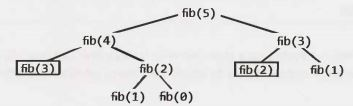

8 Recursion and  Dynamic Programming
====================================


While  there are a large number of recursive problems, many follow similar patterns. A good hint that a problem is recursive is that it can be built off of subproblems.

When you hear a problem beginning with the following statements, it's often (though not always) a good candidate for recursion: "Design an algorithm to compute the nth ...", "Write code to list the first n...; "Implement a method to compute all...", and so on.

> Tip: In my experience  coaching  candidates, people  typically have about 50% accuracy in their "this sounds like a recursive problem" instinct. Use that instinct, since that 50% is valuable. But don't be afraid to look at the problem in a different way, even if you initially thought it seemed recursive. There's also a 50% chance that you were wrong.

Practice makes perfect! The more problems you do, the easier it will be to recognize recursive problems.


### How to Approach

Recursive solutions, by definition, are built off of solutions to subproblems. Many times, this will mean simply to compute f(n) by adding something, removing something, or otherwise changing the solution for f(n-1). In other cases, you might solve the problem  for the first half of the data set, then the second half, and then merge those results.

There are many ways you might divide a problem into subproblems. Three of the most common approaches to develop an algorithm are bottom-up, top-down, and half-and-half.


#### Bottom-Up Approach

The bottom-up approach is often the most intuitive. We start with knowing how to solve the problem for a simple case, like a list with only one element. Then we figure out how to solve the problem  for two elements, then for three elements, and so on. The key here is to think about how you can build the solution for one case off of the previous case (or multiple previous cases).

#### Top-Down  Approach

The top-down  approach  can be more complex since it's less concrete. But sometimes, it's the best way to think about the problem.

In these problems, we think about how we can divide the problem for case N into subproblems. 

Be careful of overlap between the cases.

#### Half-and-Half Approach

In addition to top-down and bottom-up approaches, it's often effective to divide the data set in half.

For example, binary search works with a "half-and-half" approach. When we look for an element in a sorted array, we first figure out which half of the array contains the value. Then we recurse and search for it in that half.

Merge sort is also a "half-and-half" approach. We sort each half of the array and then merge together the sorted halves.


### Recursive vs. Iterative Solutions

Recursive algorithms can be very space inefficient. Each recursive call adds a new layer to the stack, which means that if your algorithm recurses to a depth of n, it uses at least O(n) memory.

For this reason, it's often better to implement  a recursive algorithm iteratively. *All* recursive algorithms can be implemented iteratively, although  sometimes the code to do so is much more complex. Before diving into recursive code, ask yourself how hard it would be to implement  it iteratively, and discuss the tradeoffs with your interviewer.


### Dynamic Programming & Memoization

Although people make a big deal about how scary dynamic programming  problems are, there's really no need to be afraid of them. In fact, once you get the hang of them, these can actually be very easy problems.

Dynamic programming is mostly just a matter of taking a recursive algorithm and finding the overlapping subproblems (that is, the repeated calls). You then cache those results for future recursive calls.

Alternatively, you can study the pattern of the recursive calls and implement something iterative. You still "cache" previous work.

> A note on terminology: Some people call top-down dynamic programming "memoization" and only use "dynamic programming" to refer to bottom-up work. We do not make such a distinction here. We call both dynamic programming.


One of the simplest examples of dynamic programming is computing the nth Fibonacci number. A good way to approach such a problem is often to implement it as a normal recursive solution, and then add the caching part.


#### Fibonacci Numbers

Let's walk through an approach to compute the nth Fibonacci number.

*Recursive*

We will start with a recursive implementation. Sounds simple, right?

```java
1 int fibonacci(int i) {
2   if (i == 0) return 0;
3   if (i == 1) return 1;
4   return fibonacci(i - 1) + fibonacci(i - 2);
5 }
```

What  is the runtime of this function? Think for a second before you answer.

If you said O(n) or O(n²) (as many people do), think again. Study the code path that the code takes. Drawing the code paths as a tree (that is, the recursion tree) is useful on this and many recursive problems.

```
                         ----------fib(5)------
                        /                      \
                       /                        \
                      /                          \
               fib(4)                             fib(3)     
              /      \                          /   \     
        fib(3)        fib(2)                fib(2)   fib(1)
         /   \        /     \               /  \
    fib(2)   fib(1)  fib(1)  fib(0)    fib(1)  fib(0)
     /  \
fib(1)  fib(0)
```

Observe that the leaves on the tree are all fib(1) and fib(0). Those signify the base cases.

The total number of nodes in the tree will represent the runtime, since each call only does O(1) work outside of its recursive calls. Therefore, the number of calls is the runtime.

> Tip: Remember  this for future problems. Drawing the recursive calls as a tree is a great way to figure out the runtime of a recursive algorithm.


How many nodes are in the tree? Until we get down to the base cases (leaves), each node has two children. Each node branches out twice.

The root node has two children. Each of those children has two children (so four children total in the "grand-children" level). Each of those grandchildren has two children, and so on. If we do this n times, we'll have roughly O(2ⁿ) nodes. This gives us a runtime of roughly O(2ⁿ).


> Actually, it's slightly better than O(2ⁿ). If you look at the subtree, you might notice that (excluding the leaf nodes and those immediately above it) the right subtree of any node is always smaller than the left subtree. If they were the same size, we'd have an O(2ⁿ) runtime. But since the right and left subtrees are not the same size, the true runtime is closer to O(1.6ⁿ). Saying O(2ⁿ) is still technically correct though as it describes an upper bound on the runtime (see "Big O, Big Theta, and Big Omega" on page 39). Either way, we still have an exponential runtime.


Indeed,  if we implemented this on a computer, we'd see the number of seconds increase exponentially.


We should look for a way to optimize this.


*Top-Down Dynamic Programming (or Memoization)*

Study the recursion tree. Where do you see identical nodes?

There are lots of identical nodes. For example, fib(3) appears twice and fib(2) appears three times. Why should we recompute  these from scratch each time?

In fact, when we call fib(n), we shouldn't have to do much more than O(n) calls, since there's only O(n) possible values we can throw at fib. Each time we compute fib(i), we should just cache this result and use it later.

This is exactly what memoization is.

With just a small modification, we can tweak this function to run in O(n) time. We simply cache the results of fibonacci(i) between calls.

```java
1   int fibonacci(int n) {
2     return fibonacci(n, new int[n + 1]);
3   }
4 
5   int fibonacci(int i, int[] memo) {
6     if (i == 0 || i == 1) return i;
7 
8     if (memo[i] == 0) {
9       memo[i] = fibonacci(i - 1, memo) + fibonacci(i - 2, memo);
10    }
11    return memo[i];
12  }
```

While the first recursive function may take over a minute to generate  the 50th Fibonacci number  on a typical computer, the dynamic programming method  can generate the 10,000th Fibonacci number in just fractions of a millisecond. (Of course, with this exact code, the int would have overflowed very early on.)

Now, if we draw the recursion tree, it looks something like this (the black boxes represent cached calls that returned immediately): 


How many nodes are in this tree now? We might notice that the tree now just shoots straight down, to a depth of roughly n. Each node of those nodes has one other child, resulting in roughly 2n children in the tree. This gives us a runtime of O(n).

Often it can be useful to picture the recursion tree as something like this: 




This is not actually how the recursion occurred. However, by expanding the further up nodes rather than the lower nodes, you have a tree that grows wide before it grows deep. (It's like doing this breadth-first rather than depth-first.) Sometimes this makes it easier to compute the number of nodes in the tree. All you're really doing is changing which nodes you expand and which ones return cached values. Try this if you're stuck on computing the runtime of a dynamic programming problem.

*Bottom-Up Dynamic Programming*

We can also take this approach and implement it with bottom-up dynamic programming. Think about doing the same things as the recursive memoized approach, but in reverse.

First, we compute fib(1) and fib(0), which are already known from the base cases. Then we use those to compute fib(2). Then we use the prior answers to compute fib(3), then fib(4), and so on.

```java
1   int fibonacci(int n) {
2     if (n == 0) return 0;
3     else if (n == 1) return 1;
4 
5     int[] memo = new int[n];
6     memo[0] = 0;
7     memo[1] = 1;
8     for (int i = 2; i < n; i++) {
9       memo[i] = memo[i - 1] + memo[i - 2];
10    }
11    return memo[n - 1] + memo[n - 2];
12  }
```

If you really think about how this works, you only use memo[i] for memo[i+l] and memo[i+2]. You don't need it after that. Therefore, we can get rid of the memo table and just store a few variables.

```java
1   int fibonacci(int n) {
2     if (n == 0) return 0;
3     int a = 0;
4     int b = 1;
5     for (int i = 2; i < n; i++) {
6       int c = a + b;
7       a = b;
8       b = c;
9     }
10    return a + b;
11  }
```

This is basically storing the results from the last two Fibonacci values into a and b. At each iteration, we compute the next value (c = a + b) and then move (b,  c  = a + b) into (a, b).

This explanation might seem like overkill for such a simple problem, but truly understanding this process will make more difficult problems much easier. Going through the problems in this chapter, many of which use dynamic programming, will help solidify your understanding.

**Additional Reading:** Proof by Induction (pg 631).

---

Interview Questions

---

**8.1     Triple Step:** A child is running up a staircase with n steps and can hop either 1 step, 2 steps, or 3 steps at a time. Implement a method to count how many possible ways the child can run up the stairs.

SOLUTION

---

Let's think about this with the following question: What is the very last step that is done?

The very last hop the child makes-the one that lands her on the nth step-was either a 3-step hop, a 2-step hop, or a 1-step hop.

How many ways then are there to get up to the nth step? We don't know yet, but we can relate it to some subproblems.

If we thought  about all of the paths to the nth step, we could just build them off the paths to the three previous steps. We can get up to the nth step by any of the following:

- Going to the (n - 1)st step and hopping 1 step.
- Going to the (n - 2)nd step and hopping 2 steps.
- Going to the (n - 3)rd step and hopping 3 steps.

Therefore, we just need to add the number of these paths together.

Be very careful here. A lot of people want to multiply them. Multiplying one path with another would signify taking one path and then taking the other. That's not what's happening here.


**Brute  Force  Solution**

This is a fairly straightforward algorithm to implement recursively. We just need to follow logic like this:
```
countWays(n-1) + countWays(n-2) + countWays(n-3)
```
The one tricky bit is defining the base case. If we have 0 steps to go (we're currently standing on the step), are there zero paths to that step or one path?

That is, what is countWays(0)? Is it 1 or 0?

You could define it either way. There is no "right" answer here.

However, it's a lot easier to define it as 1. If you defined it as 0, then you would need some additional base cases (or else you'd just wind up with a series of 0s getting added).

A simple implementation of this code is below.

```java
1   int countWays(int n) {
2     if (n < 0) {
3       return 0;
4     }  else if (n == 0) {
5       return 1;
6     }  else {
7       return countWays(n - 1) + countWays(n - 2) + countWays(n - 3);
8     }
9   }
```

Like the  Fibonacci problem, the  runtime of this  algorithm is exponential (roughly O(3ⁿ)), since  each call branches out to three more calls.


**Memoization Solution**

The previous solution for countWays is called  many times for the  same values,  which  is unnecessary. We can fix this through memoization.

Essentially, if we've seen this value of n before, return the cached value. Each time we compute a fresh value, add  it to the cache.

Typically we use  a HashMap\<Integer, Integer> for a cache. In this case,  the  keys  will be  exactly  1 through n. It's more compact to use an integer array.

```java
1   int countWays(int n) {
2     int[] memo = new int[n + 1];
3     Arrays.fill(memo, -1);
4     return countWays(n, memo);
5   }
6 
7   int countWays(int n, int[] memo) {
8     if (n < 0) {
9       return 0;
10    }  else if (n == 0) {
11      return 1;
12    }  else if (memo[n] > -1) {
13      return memo[n];
14    }  else {
15      memo[n] = countWays(n - 1, memo) + countWays(n - 2, memo) +
16                            countWays(n - 3, memo);
17      return memo[n];
18    }
19  }
```

Regardless of whether or not you use memoization, note that the number of ways will quickly overflow  the bounds of an integer. By the  time you get  to just  n = 37, the  result has already overflowed. Using a long will delay, but not completely solve, this issue.

It is great to  communicate this  issue  to  your  interviewer. He probably won't ask you  to  work  around it (although you  could,  with  a BigInteger class). but  it's nice to demonstrate that you think about these issues.

**8.2 Robot in a Grid:** Imagine a robot sitting on the upper left corner of grid with r rows and c columns. The robot can only move in two directions, right and down, but certain cells are "off limits" such that the robot cannot step on them. Design an algorithm to find a path for the robot from the top left to the bottom right.


SOLUTION

---

If we picture this grid, the only way to move to spot (r, c) is by moving to one of the adjacent spots: (r-1, c) or (r, c-1). So, we need to find a path to either (r-1, c) or (r, c-1).

How do we find a path to those spots? To find a path to (r-1, c) or (r, c-1), we need to move to one of its adjacent cells. So, we need to find a path to a spot adjacent to (r-1, c), which are coordinates (r-2, c) and (r-1, c-1). or a spot adjacent to (r, c-1), which are spots (r-1, c-1) and ( r.c-2). Observe that we list the point (r-1, c-1) twice; we'll discuss that issue later.


> Tip: A lot of people use the variable names x and y when dealing with two-dimensional arrays. This can actually cause some bugs. People tend to think about x as the first coordinate in the matrix and y as the second coordinate (e.g., matrix[x][y]). But, this isn't really correct. The first coordinate is usually thought of as the row number, which is in fact they value (it goes vertically!). You should write matrix[y][x]. Or, just make your life easier by using r (row) and c (column) instead.


So then, to find a path from the origin, we just work backwards like this. Starting from the last cell, we try to find a path to each of its adjacent cells. The recursive code below implements this algorithm.

```java
1   ArrayList<Point> getPath(boolean[][] maze) {
2     if (maze == null || maze.length == 0) return null;
3     ArrayList<Point> path = new ArrayList<Point>();
4     if (getPath(maze, maze.length - 1, maze[0].length - 1, path)) {
5       return path;
6     }
7     return null;
8   }
9 
10  boolean getPath(boolean[][] maze, int row, int col, ArrayList<Point> path) {
11    /* If out of bounds or not available, return.*/
12    if (col < 0 || row < 0 || !maze[row][col]) {
13      return false;
14    }
15  
16    boolean isAtOrigin = (row == 0) && (col == 0);
17  
18    /* If there's a path from the start to here, add my location. */
19    if (isAtOrigin || getPath(maze, row, col - 1, path) ||
20            getPath(maze, row - 1, col, path)) {
21      Point p = new Point(row, col);
22      path.add(p);
23      return true;
24    }
25  
26    return false;
27  }
```

This solution is O(2⁽ʳ⁺ᶜ⁾), since each path has r+c steps and there are two choices we can make at each step.

We should look for a faster way.

Often, we can optimize exponential algorithms by finding duplicate work. What work are we repeating?

If  we walk through  the algorithm, we'll see that we are visiting squares multiple times. In fact, we visit each square many, many times. After all, we have re squares but we're doing O(2ʳ⁺ᶜ) work. If we were only visiting each square once, we would probably have an algorithm that was O(rc) (unless we were somehow doing a lot of work during each visit).

How does our current algorithm work? To find a path to (r, c),  we look for a path to an adjacent coordinate: (r-1, c) or (r, c-1). Of course, if one of those squares is off limits, we ignore it.  Then, we look at their adjacent coordinates: (r-2, c),  (r-1, c-1), (r-1, c-1), and (r, c-2). The spot (r -1, c-1) appears  twice, which means that we're duplicating effort. Ideally, we should remember  that we already visited (r-1, c-1) so that we don't waste our time.

This is what the dynamic programming algorithm below does.

```java
1   ArrayList<Point> getPath(boolean[][] maze) {
2     if (maze == null || maze.length == 0) return null;
3     ArrayList<Point> path = new ArrayList<Point>();
4     HashSet<Point> failedPoints = new HashSet<Point>();
5     if (getPath(maze, maze.length - 1, maze[0].length - 1, path, failedPoints)) {
6       return path;
7     }
8     return null;
9   }
10  
11  boolean getPath(boolean[][] maze, int row, int col, ArrayList<Point> path,
12                HashSet<Point> failedPoints) {
13    /* If out of bounds or not available, return.*/
14    if (col < 0 || row < 0 || !maze[row][col]) {
15      return false;
16    }
17  
18    Point p = new Point(row, col);
19  
20    /* If we've already visited this cell, return. */
21    if (failedPoints.contains(p)) {
22      return false;
23    }
24  
25    boolean isAtOrigin = (row == 0) && (col == 0);
26  
27    /* If there's a path from start to my current location, add my location.*/
28    if (isAtOrigin || getPath(maze, row, col - 1, path, failedPoints) ||
29                      getPath(maze, row - 1, col, path, failedPoints)) {
30      path.add(p);
31      return true;
32    }
33  
34    failedPoints.add(p); // Cache result
35    return false;
36  }
```

This simple change will make our code run substantially faster. The algorithm will now take O(XY) time because we hit each cell just once.

**8.3      Magic Index:** A magic index in an array A[1...n-1]  is defined to be an index such that A[i] = i. Given a sorted array of distinct integers, write a method to find a magic index, if one exists, in array A.

FOLLOW UP

What if the values are not distinct?

SOLUTION

---

Immediately, the brute force solution should jump to mind-and there's no shame in mentioning it. We simply iterate through the array, looking for an element which matches this condition.

```java
1   int magicSlow(int[] array) {
2     for (int i = 0; i < array.length; i++) {
3       if (array[i] == i) {
4         return i;
5       }
6     }
7     return -1;
8   }
```

Given that the array is sorted, though, it's very likely that we're supposed  to use this condition.

We may recognize that this problem sounds a lot like the classic binary search problem. Leveraging the Pattern Matching approach for generating algorithms, how might we apply binary search here?

In binary search, we find an element  k by comparing it to the middle element, x, and determining  if k would land on the left or the right side of x.

Building off this approach, is there a way that we can look at the middle element  to determine  where a magic index might be? Let's look at a sample array:

|     |     |    |    |    |     |    |    |    |    |    |
| --  | --  | -- | -- | -- | --  | -- | -- | -- | -- | -- |
| -40 | -20 | -1 | 1  | 2  | *3* | 5  | 7  | 9  | 12 | 13 |
| 0   | 1   | 2  | 3  | 4  | *5* | 6  | 7  | 8  | 9  | 10 |

When we look at the middle element A[5]  =  3, we know that the magic index must be on the right side, since A[mid]  <   mid.

Why couldn't the magic index be on the left side? Observe that when we move from i to i-1, the value at this index must decrease  by at least 1, if not more (since the array is sorted and all the elements  are distinct). So, if the middle element is already too small to be a magic index, then when we move to the left, subtracting k indexes and (at least) k values, all subsequent elements will also be too small.

We continue to apply this recursive algorithm, developing code that looks very much like binary search.

```java
1   int magicFast(int[] array) {
2     return magicFast(array, 0, array.length - 1);
3   }
4   
5   int magicFast(int[] array, int start, int end) {
6     if (end < start) {
7       return -1;
8     }
9     int mid = (start + end) / 2;
10    if (array[mid] == mid) {
11      return mid;
12    }  else if (array[mid] > mid) {
13      return magicFast(array, start, mid - 1);
14    }  else {
15      return magicFast(array, mid + 1, end);
16    }
17  }
```

**Follow Up: What if the elements are not  distinct?**

If the elements are not  distinct, then this algorithm fails. Consider the following  array:

|     |    |    |    |    |     |    |    |    |    |    |
| --  | -- | -- | -- | -- | --  | -- | -- | -- | -- | -- |
| -10 | -5 | 2  | 2  | 2  | *3* | 4  | 7  | 9  | 12 | 13 |
| 0   | 1  | 2  | 3  | 4  | *5* | 6  | 7  | 8  | 9  | 10 |

When  we see  that A[mid] < mid,  we cannot conclude which side the magic  index is on. It could  be on the right side, as before.  Or, it could be on the left side (as it, in fact, is).

Could it be anywhere on the left side? Not exactly. Since A[5]  =  3, we know that A[4] couldn't  be a magic index. A[4] would need to be 4 to be the magic  index,  but A[4] must be less than or equal  to A[5].

In fact, when we see that A[5] = 3, we'll need to recursively search the right side as before.  But, to search the left side, we can  skip a bunch of elements and only recursively search elements A[0] through A[3]. A[3]  is the first element that could be a magic  index.

The general pattern is that  we compare midIndex and midValue for equality  first. Then, if they are not equal, we recursively search the left and right sides as follows:

- Left side: search indices  start through Math.min(midIndex -  1,  midValue).
- Right side: search indices  Math.max(midIndex  +  1,   midValue) through end. 

The code  below implements this algorithm.

```java
1   int magicFast(int[] array) {
2     return magicFast(array, 0, array.length - 1);
3   }
4 
5   int magicFast(int[] array, int start, int end) {
6     if (end < start) return -1;
7 
8     int midIndex = (start + end) / 2;
9     int midValue = array[midindex];
10    if (midValue == midindex) {
11      return midindex;
12    }
13  
14    /* Search left */
15    int leftIndex = Math.min(midIndex - 1, midValue);
16    int left = magicFast(array, start, leftIndex);
17    if (left >= 0) {
18      return left;
19    }
20  
21    /* Search right */
22    int rightIndex = Math.max(midIndex + 1, midValue);
23    int right = magicFast(array, rightIndex, end);
24  
25    return right;
26  }
```

Note that in the above code, if the elements are all distinct, the method operates almost identically to the first solution.

 
**8.4       Power Set:** Write a method to return all subsets of a set.


SOLUTION

---
 
We should first have some reasonable expectations of our time and space complexity.

How many subsets of a set are there? When we generate a subset, each element has the "choice" of either being in there or not. That  is, for the first element, there are two choices: it is either in the set or it is not. For the second, there are two, etc. So, doing {2  *  2  *  . . .  } n times gives us 2ⁿ subsets.

Assuming that we're going to be returning a list of subsets, then our best case time is actually the total number of elements across all of those subsets. There are 2ⁿ subsets and each of the n elements will be contained in half of the subsets (which 2⁽ⁿ⁻¹⁾ subsets). Therefore, the total number of elements across all of those subsets is n * 2⁽ⁿ⁻¹⁾.

We will not be able to beat O(n2ⁿ) in space or time complexity.

The subsets of {a₁, a₂, ..., aₙ} are also called the powerset, P({a₁, a₂, ..., aₙ}), or just P(n).

**Solution #1: Recursion**

This problem is a good candidate for the Base Case and Build approach. Imagine that we are trying to find all subsets of a set like S = {a₁, a₂, ..., aₙ}. We can start with the Base Case. 

*Base Case*: n = 0.

There is just one subset of the empty set: {}.

*Case*: n = 1.

There are two subsets of the set {a₁}:{}, {a₁}.

*Case*: n = 2.

There are four subsets of the set {a₁, a₂}: {} ,{a₁}, {a₂},{a₁, a₂}.

*Case*: n = 3.

Now here's where things get interesting. We want to find a way of generating the solution for n = 3 based on the prior solutions.
 
What is the difference between the solution for n = 3 and the solution for n = 2? Let's look at this more deeply:
```
P(2) = { }, {a₁}, {a₂}, {a₁, a₂}
P(3) = { }, {a₁}, {a₂}, {a₃}, {a₁, a₂}, {a₁, a₃}, {a₂, a₃}, {a₁, a₂, a₃}
```
The difference between these solutions is that P(2) is missing all the subsets containing a3.
```
P(3) - P(2) = {a₃}, {a₁, a₃}, {a₂, a₃}, {a₁, a₂, a₃}
```
How can we use P(2) to create P(3)? We can simply clone the subsets in P(2) and add a₃  to them: 
```
P(2)      = {} , {a₁}, {a₂}, {a₁, a₂} 
P(2) + a₃ = {a₃}, {a₁, a₃}, {a₂, a₃), {a₁, a₂, a₃}
```

When merged together, the lines above make P(3).

*Case*: n  >   0

Generating P(n) for the general case is just a simple generalization of the above steps. We compute P(n-1), clone the results, and then add aₙ to each of these cloned sets. 

The following code implements this algorithm:

```java
1   ArrayList<ArrayList<Integer>> getSubsets(ArrayList<Integer> set, int index) {
2     ArrayList<ArrayList<Integer>> allsubsets;
3     if (set.size() == index) { //Base case - add empty set
4       allsubsets = new ArrayList<ArrayList<Integer>>();
5       allsubsets.add(new ArrayList<Integer>()); // Empty set
6     }  else {
7       allsubsets = getSubsets(set, index + 1);
8       int item = set.get(index);
9       ArrayList<ArrayList<Integer>> moresubsets = 
10        new ArrayList<ArrayList<Integer>>();
11      for (ArrayList<Integer> subset : allsubsets) {
12        ArrayList<Integer> newsubset = new ArrayList<Integer>();
13        newsubset.addAll(subset); //
14        newsubset.add(item);
15        moresubsets.add(newsubset);
16      }
17      allsubsets.addAll(moresubsets);
18    }
19    return allsubsets;
20  }
```

This solution will be O(n2ⁿ) in time and space, which is the best we can do. For a slight optimization, we could also implement this algorithm iteratively.

**Solution #2: Combinatorics**

While there's nothing wrong with the above solution, there's another way to approach it.

Recall that when we're generating a set, we have two choices for each element: (1) the element is in the set (the "yes" state) or (2) the element is not in the set (the "no" state). This means that each subset is a sequence of yeses/nos - e.g., "yes, yes, no, no, yes, no"

This gives us 2ⁿ possible subsets. How can we iterate through all possible sequences of "yes"/"no" states for all elements? If each "yes" can be treated as a 1 and each "no" can be treated as a 0, then each subset can be represented as a binary string.

Generating all subsets, then, really just comes down to generating all binary numbers (that is, all integers). We iterate through  all numbers from 0 to 2ⁿ (exclusive) and translate the binary representation  of the numbers into a set. Easy!

```java
1   ArrayList<ArrayList<Integer>> getSubsets2(ArrayList<Integer> set) {
2     ArrayList<ArrayList<Integer>> allsubsets = new ArrayList<ArrayList<Integer>>();
3     int max = 1 << set.size(); /* Compute 2^n */
4     for (int k = 0; k < max; k++) {
5       ArrayList<Integer> subset = convertintToSet(k, set);
6       allsubsets.add(subset);
7     }
8     return allsubsets;
9   }
10  
11  ArrayList<Integer> convertlntToSet(int x, ArrayList<Integer> set) {
12    ArrayList<Integer> subset = new ArrayList<Integer>();
13    int index = 0;
14    for (int k = x; k > 0; k >>= 1) {
15      if ((k & 1) == 1) {
16        subs et.add(set.get(index));
17      }
18      index++;
19    }
20    return subset;
21  }
```

There's nothing  substantially better or worse about this solution compared  to the first one.


**8.5   Recursive Multiply:**  Write a recursive function to multiply two positive integers without using the * operator  (or / operator). You can use addition, subtraction, and bit shifting, but you should minimize the number of those operations.

SOLUTION

---

Let's pause for a moment and think about what it means to do multiplication.

> This is a good approach for a lot of interview questions. It's often  useful  to think  about  what  it really means to do something, even when it's pretty obvious.


We can think about multiplying 8x7 as doing  8+8+8+8+8+8+8 (or adding  7 eight times). We can also think about it as the number of squares in an 8x7 grid.


**Solution #1**

How would we count the number of squares in this grid? We could just count each cell. That's pretty slow, though.

Alternatively, we could count half the squares and then double  it (by adding this count to itself). To count half the squares, we repeat the same process.

Of course, this "doubling" only works if the number is in fact even. When it's not even, we need to do the counting/summing from scratch.

```java
1   int minProduct(int a, int b) {
2     int bigger  = a < b ? b : a;
3     int smaller = a < b ? a : b;
4     return minProductHelper(smaller, bigger);
5   }
6 
7   int minProductHelper(int smaller, int bigger) {
8     if (smaller == 0) { // 0 x bigger = 0
9       return 0;
10    }  else if (smaller == 1) { // 1 x bigger bigger
11      return bigger;
12    }
13  
14    /* Compute half. If uneven, compute other half. If even, double it. */
15    int s = smaller >> 1; // Divide by 2
16    int side1 = minProduct(s, bigger);
17    int side2 = side1;
18    if (smaller % 2 == 1) {
19      side2 = minProductHelper(smaller - s, bigger);
20    }
21  
22    return side1 + side2;
23  }
```

Can we do better? Yes.

**Solution #2**

If we observe how the recursion operates, we'll notice that we have duplicated work. Consider this example:
```
minProduct(17, 23)
    minProduct(8, 23)
       minProduct(4, 23) * 2
          ...
  + minProduct(9, 23)
       minProduct(4, 23)
          ...
     + minProduct(5, 23)
          ...
```

The second call to minProduct(4, 23) is unaware of the prior call, and so it repeats the same work. We should cache these results.

```java
1   int minProduct(int a, int b) {
2     int bigger  = a < b ? b : a;
3     int smaller = a < b ? a : b;
4 
5     int memo[] = new int[smaller + 1];
6     return minProduct(smaller, bigger, memo);
7   }
8 
9   int minProduct(int smaller, int bigger, int[] memo) {
10    if (smaller == 0) {
11      return 0;
12    }  else if (smaller == 1) {
13      return bigger;
14    }  else if (memo[smaller] > 0) {
15      return memo[smaller];
16    }
17  
18    /* Compute half. If uneven, compute other half. If even, double it. */
19    int s = smaller >> 1; // Divide by 2
20    int side1 = minProduct(s, bigger, memo); // Compute half
21    int side2 = side1;
22    if (smaller % 2 == 1) {
23      side2 = minProduct(smaller - s, bigger, memo);
24    }
25  
26    /* Sum and cache. */
27    memo[smaller] = side1 + side2;
28    return memo[smaller];
29  }
```

We can still make  this a bit faster.

**Solution#3**

One  thing we might notice when we look at this code is that  a call to minProduct on an even number is much faster than one on an odd  number. For example, if we call minProduct(30, 35), then we'll just do minProduct(15, 35) and double the result.  However,  if we do minProduct(31, 35), then we'll need to call minProduct(15, 35) and minProduct(16, 35).

This is unnecessary. Instead, we can do:
```
minProduct(31, 35) =  2  *  minProduct(15, 35) + 35
```
After all, since 31 = 2\*15+1, then 31x35 = 2\*15\*35+35.

The logic in this final solution is that, on even numbers, we just divide smaller by 2 and double the result of the recursive call. On odd  numbers, we do the same,  but  then we also add  bigger to this result.

In doing so, we have  an unexpected "win". Our minProduct function just recurses straight downwards, with increasingly small  numbers each time.  It will never  repeat the  same call, so there's no need to cache any information.

```java
1   int minProduct(int a, int b) {
2     int bigger = a < b ? b : a;
3     int smaller = a < b ? a : b;
4     return minProductHelper(smaller, bigger);
5   }
6 
7   int minProductHelper(int smaller, int bigger) {
8     if (smaller == 0) return 0;
9     else if (smaller == 1) return bigger;
10  
11    int s = smaller >> 1; // Divide by 2
12    int halfProd = minProductHelper(s, bigger);
13  
14    if (smaller % 2 == 0) {
15      return halfProd + halfProd;
16    }  else {
17      return halfProd + halfProd + bigger;
18    }
19  }
```

This algorithm will run in O(log s) time,  where s is the smaller of the  two numbers.


**8.6 Towers of Hanoi:** In the classic problem of the Towers of Hanoi, you have 3 towers and N disks of different sizes which can slide onto any tower. The puzzle starts with disks sorted in ascending order of size from top to bottom (i.e., each disk sits on top of an even larger one). You have the following constraints:

1. Only one disk can be moved at a time. 
2. A disk is slid off the top of one tower onto another tower. 
3. A disk cannot be placed on top of a smaller disk.

Write a program to move the disks from the first tower to the last using Stacks.


SOLUTION

---

This problem sounds like a good candidate for the Base Case and Build approach.

```
                  +                          +                          +
                  |                          |                          |
                +-++                         |                          |
                |  |                         |                          |
             +--+--+--+                      |                          |
             |        |                      |                          |
           +-+--------+-+                    |                          |
           |            |                    |                          |
        +--+------------+--+                 |                          |
        |                  |                 |                          |
     +--+------------------+-+               |                          |
     |                       |               |                          |
+----+-----------------------+---------------+--------------------------+--------------+
```

Let's start with the smallest possible example: n = 1.

Case n =  1. Can we move Disk 1 from Tower 1 to Tower 3? Yes.

1. We simply move Disk 1 from Tower 1 to Tower 3.

Case n =  2. Can we move Disk 1 and Disk 2 from Tower 1 to Tower 3? Yes.

1. Move Disk 1 from Tower 1 to Tower 2
2. Move Disk 2 from Tower 1 to Tower 3
3. Move Disk 1 from Tower 2 to Tower 3
 
Note how in the above steps, Tower 2 acts as a buffer, holding a disk while we move other disks to Tower 3. 

Case n = 3. Can we move Disk 1, 2, and  3 from Tower 1 to Tower 3? Yes.

1. We know we can move the top two disks from one tower to another (as shown  earlier), so let's assume we've already done that. But instead, let's move them to Tower 2.
2. Move Disk 3 to Tower  3.
3. Move Disk 1 and Disk 2 to Tower 3. We already know how to do this-just repeat what we did in Step 1. 

Case n = 4. Can we move Disk 1, 2, 3 and 4 from Tower 1 to Tower 3? Yes.

1. Move Disks 1, 2, and 3 to Tower 2. We know how to do that from the earlier examples.
2. Move Disk 4 to Tower 3.
3. Move Disks 1, 2 and 3 back to Tower 3.

Remember that the labels of Tower 2 and Tower 3 aren't important. They're equivalent towers. So, moving disks to Tower 3 with Tower 2 serving as a buffer is equivalent to moving disks to Tower 2 with Tower 3 serving as a buffer.

This approach leads to a natural recursive algorithm. In each part, we are doing the following steps, outlined below with pseudocode:

```java
1   moveDisks(int n, Tower origin, Tower destination, Tower buffer) {
2     /* Base case */
3     if (n <= 0) return;
4 
5     /* move top n - 1 disks from origin to buffer, using destination as a buffer. */
6     moveDisks(n - 1, origin, buffer, destination);
7 
8     /* move top from origin to destination*/
9     moveTop(origin, destination);
10  
11    /* move top n - 1 disks from buffer to destination, using origin as a buffer. */
12    moveDisks(n - 1, buffer, destination, origin);
13  }
```

The following code provides a more detailed implementation of this algorithm, using concepts of object-oriented design.

```java
1   void main(String[] args) {
2     int n = 3;
3     Tower[] towers = new Tower[n];
4     for (int i = 0; i < 3; i++) {
5       towers[i] = new Tower(i);
6     }
7 
8     for (int i = n - 1; i >= 0; i--) {
9       towers[0].add(i);
10    }
11    towers[0].moveDisks(n, towers[2], towers[1]);
12  }
13  
14  class Tower {
15    private Stack<Integer> disks;
16    private int index;
17    public Tower(int i) {
18      disks = new Stack<Integer>();
19      index = i;
20    }
21  
22    public int index() {
23      return index;
24    }
25  
26    public void add(int d) {
27      if (!disks.isEmpty() && disks.peek() <= d) {
28        System.out.println("Error placing disk" + d);
29      }  else {
30        disks.push(d);
31      }
32    }
33  
34    public void moveTopTo(Tower t) {
35     int top = disks.pop();
36      t.add(top);
37    }
38  
39    public void moveDisks(int n, Tower destination, Tower buffer) {
40      if (n > 0) {
41        moveDisks(n - 1, buffer, destination);
42        moveTopTo(destination);
43        buffer.moveDisks(n - 1, destination, this);
44      }
45    }
46  }
```

Implementing the towers as their own objects is not strictly necessary, but it does help to make the code cleaner in some respects.

**8.7   Permutations without Dups:** Write a method to compute all permutations of a string of unique characters.


SOLUTION

---

Like in many recursive problems, the Base Case and Build approach will be useful. Assume we have a string S represented by the characters a₁a₂...aₙ.

**Approach 1: Building from permutations of first n-1 characters.**

*Base Case:* permutations of first character substring

The only permutation of a₁ is the string a₁. So: 
```
P(a₁) = a₁
```
*Case: permutations of* a₁a₂
```
P(a₁a₂) = a₁a₂ and a₂a₁
```
*Case: permutations of* a₁a₂a₃
```
P(a₁a₂a₃) = a₁a₂a₃, a₁a₃a₂, a₂a₁a₃, a₂a₃a₁, a₃a₁a₂, a₃a₂a₁,
```
*Case: permutations of* a₁a₂a₃a₄

This is the first interesting case. How can we generate permutations of a₁a₂a₃a₄ from a₁a₂a₃?

Each permutation of a₁a₂a₃a₄ represents an ordering of a₁a₂a₃. For example, a₂a₄a₁a₃ represents the order a₂a₁a₃ .

Therefore, if we took all the permutations of a₁a₂a₃ and added a₄ into all possible locations, we would get all permutations of a₁a₂a₃a₄.

```
a₁a₂a₃ -> a₄a₁a₂a₃, a₁a₄a₂a₃, a₁a₂a₄a₃, a₁a₂a₃a₄
a₁a₃a₂ -> a₄a₁a₃a₂, a₁a₄a₃a₂, a₁a₃a₄a₂, a₁a₃a₂a₄
a₃a₁a₂ -> a₄a₃a₁a₂, a₃a₄a₁a₂, a₃a₁a₄a₂, a₃a₁a₂a₄
a₂a₁a₃ -> a₄a₂a₁a₃, a₂a₄a₁a₃, a₂a₁a₄a₃, a₂a₁a₃a₄
a₂a₃a₁ -> a₄a₂a₃a₁, a₂a₄a₃a₁, a₂a₃a₄a₁, a₂a₃a₁a₄
a₃a₂a₁ -> a₄a₃a₂a₁, a₃a₄a₂a₁, a₃a₂a₄a₁, a₃a₂a₁a₄
```

We can now implement this algorithm recursively.

```java
1   ArrayList<String> getPerms(String str) {
2     if (str == null) return null;
3 
4     ArrayList<String> permutations = new ArrayList<String>();
5     if (str.length() == 0) { //base case
6       permutations.add('"');
7       return permutations;
8     }
9   
10    char first = str.charAt(0); // get the first char
11    String remainder = str.substring(1); // remove the first char
12    ArrayList<String> words = getPerms(remainder);
13    for (String word : words) {
14      for (int j = 0; j <= word.length(); j++) {
15        String s = insertCharAt(word, first, j);
16        permutations.add(s);
17      }
18    }
19    return permutations;
20  }
21  
22  /* Insert char c at index i in word. */
23  String insertCharAt(String word, char c, int i) {
24    String start = word.substring(0, i);
25    String end = word.substring(i);
26    return start + c + end;
27  }
```

**Approach 2: Building from permutations of all n-1 character substrings.**

*Base Case: single-character strings*

The only permutation of a₁ is the string a₁. So: 
```
P(a₁)  =  a₁
```

*Case: two-character strings*
```
P(a₁a₂)  =  a₁a₂  and  a₂a₁.
P(a₂a₃)  =  a₂a₃  and  a₃a₂.
P(a₁a₃)  =  a₁a₃  and  a₃a₁.
```
*Case: three-character strings*

Here is where the cases get more interesting. How can we generate all permutations of three-character strings, such as a₁a₂a₃, given the permutations of two-character strings?

Well, in essence, we just need to "try" each character as the first character and then append the permuta­tions.
```
P(a₁a₂a₃) = {a₁ + P(a₂a₃)} + {a₂ + P(a₁a₃)} + {a₃ + P(a₁a₂)}
  {a₁ + P(a₂a₃)} -> a₁a₂a₃, a₁a₃a₂
  {a₂ + P(a₁a₃)} -> a₂a₁a₃, a₂a₃a₁
  {a₃ + P(a₁a₂)} -> a₃a₁a₂, a₃a₂a₁
```
Now that we can generate all permutations of three-character strings, we can use this to generate permuta­tions of four-character strings.
```
P(a₁a₂a₃a₄) = {a₁ + P(a₂a₃a₄)} + {a₂+ P(a₁a₃a₄)} + {a₃ + P(a₁a₂a₄)} + {a₄ + P(a₁a₂a₃)} 
```
This is now a fairly straightforward algorithm to implement.

```java
1   ArrayList<String> getPerms(String remainder) {
2     int len = remainder.length();
3     ArrayList<String> result = new ArrayList<Str1ng>();
4 
5     /* Base case. */
6     if (len == 0) {
7       result.add(""); // Be sure to return empty string!
8       return result;
9     }
10  
11  
12    for (int i = 0; i < len; i++) {
13      /* Remove char i and find permutations of remaining chars.*/
14      String before = remainder.substring(0, i);
15      String after = remainder.substring(i + 1, len);
16      ArrayList<String> partials = getPerms(before + after);
17  
18      /* Prepend char i to each permutation.*/
19      for (String s : partials) {
20        result.add(remainder.charAt(i) + s);
21      }
22    }
23  
24    return result;
25  }
```

Alternatively, instead of passing the permutations back up the stack, we can push the prefix down the stack. When we get to the bottom (base case), prefix holds a full permutation.

```java
1   ArrayList<String> getPerms(String str) {
2     ArrayList<String> result = new ArrayList<String>();
3     getPerms("", str, result);
4     return result;
5   }
6 
7   void getPerms(String prefix, String remainder, ArrayList<String> result) {
8     if (remainder.length() == 0) result.add(prefix);
9 
10    int len = remainder.length();
11    for (int i = 0; i < len; i++) {
12      String before = remainder.substring(0, i);
13      String after = remainder.substring(i + 1, len);
14      char c = remainder.charAt(i);
15      getPerms(prefix + c, before + after, result);
16    }
17  }
```

For a discussion of the runtime of this algorithm, see Example 12 on page 51.


**8.8   Permutations with  Duplicates:** Write a method to compute all permutations of a string whose characters are not necessarily unique. The list of permutations should not have duplicates. 


SOLUTION
 
---

This is very similar to the previous problem, except that now we could potentially have duplicate characters in the word.

One simple way of handling this problem is to do the same work to check  if a permutation has been created before and then, if not, add it to the list. A simple  hash table will do the trick here. This solution will take O(n!) time in the worst case (and, in fact in all cases).

While it's true that we can't beat this worst case time, we should be able to design an algorithm to beat this in many cases. Consider a string with all duplicate characters, like aaaaaaaaaaaaaaa. This will take an extremely long time (since there are over 6 billion permutations of a 13-character string), even though there is only one unique permutation.

Ideally, we would like to only create the unique permutations, rather than creating every permutation and then ruling out the duplicates.

We can start with computing the count of each letter (easy enough to get this-just use a hash table). For a string such as aabbbbc, this would be:
```
a->2 | b->4 | c->1
```
Let's imagine generating a permutation of this string (now represented as a hash table). The first choice we make is whether to use an a, b, or c as the first character. After that, we have a subproblem to solve: find all permutations of the remaining characters, and append those to the already picked "prefix".

```
P(a->2 |  b->4 |  c->1) = {a + P(a->1 | b->4 | c->1)} +
                          {b + P(a->2 | b->3 | c->1)} +
                          {c + P(a->2 | b->4 | c->0)}
  P(a->1 | b->4 |  c->1) = {a + P(a->0 | b->4 | c->l)} +
                           {b + P(a->1 | b->3 | c->1)} +
                           {c + P(a->1 | b->4 | c->0)}
  P(a->2 | b->3 |  c->1) = {a + P(a->1 | b->3 | c->l)} +
                           {b + P(a->2 | b->2 | c->1)} +
                           {c + P(a->2 | b->3 | c->0)}
  P(a->2 | b->4 |  c->0) = {a + P(a->1 | b->4 | c->0)} +
                           {b + P(a->2 | b->3 | c->0)}
```

Eventually, we'll get down to no more characters remaining.

The code below implements this algorithm.

```java
1   ArrayList<String> printPerms(String s) {
2     ArrayList<String> result = new ArrayList<String>();
3     HashMap<Character, Integer> map = buildFreqTable(s);
4     printPerms(map, "", s.length(), result);
5     return result;
6   }
7   
8   HashMap<Character, Integer> buildFreqTable(String s) {
9     HashMap<Character, Integer> map = new HashMap<Character, Integer>();
10    for (char c : s.toCharArray()) {
11      if (!map.containsKey(c)) {
12        map.put(c, 0);
13      }
14      map.put(c, map.get(c) + 1);
15    }
16    return map;
17  }
18  
19  void printPerms(HashMap<Character, Integer> map, String prefix, int remaining,
20    ArrayList<String> result) {
21    /* Base case. Permutation has been completed. */
22    if (remaining == 0) {
23      result.add(prefix);
24      return;
25    }
26  
27    /* Try remaining letters for next char, and generate remaining permutations. */
28    for (Character c : map.keySet()) {
29      int count = map.get(c);
39      if (count > 0) {
31        map.put(c, count - 1);
32        printPerms(map, prefix + c, remaining - 1, result);
33        map.put(c, count);
34      }
35    }
36  }
```

In situations where the  string has many duplicates, this algorithm will run a lot faster  than the  earlier  algorithm.

**8.9   Parens:** Implement an algorithm to print  all valid (i.e., properly opened and  closed) combinations of n pairs of parentheses.

EXAMPLE 

Input: 3

Output: ((())),   (()()),   (())(),   ()(()),   ()()()

SOLUTION

---

Our first thought here might be  to  apply a recursive approach where we build  the  solution for f(n) by adding pairs of parentheses to f(n-1). That's certainly a good instinct.

Let's consider the  solution for n   =  3: 
```
(()())       ((()))      ()(())   (())()      () () () 
```
How might we build this from n   =  2?
```
(())      ()()
```

We can  do this by inserting a pair of parentheses inside  every existing pair of parentheses, as well as one at the  beginning of the  string.  Any other places that we could insert parentheses, such  as at the end  of the string, would reduce to the earlier cases.

So, we have the following:

```
(()) ->  (()()) /* inserted pair after 1st left paren */
     ->  ((())) /* inserted pair after 2nd left paren */
     ->  ()(()) /* inserted pair at beginning of string */ 
()() ->  (())() /* inserted pair after 1st left paren */ 
     ->  ()(()) /* inserted pair after 2nd left paren */ 
     ->  ()()() /* inserted pair at beginning of string */ 
```
 
But wait-we have some duplicate pairs listed. The string ()(()) is listed twice.

If we're going to apply this approach, we'll need to check for duplicate values  before adding a string to our list.

```java
1   Set<String> generateParens(int remaining) {
2     Set<String> set = new HashSet<String>();
3     if (remaining == 0) {
4       set.add("");
5     }  else {
6       Set<String> prev = generateParens(remaining - 1);
7       for (String str : prev) {
8         for (int i = 0; i < str.length(); i++) {
9           if (str.charAt(i) == '(') {
10            String s = insertInside(str, i);
11            /* Add s to set if it's not already in there. Note: HashSet
12             * automatically checks for duplicates before adding, so an explicit
13             * check is not necessary. */
14            set.add(s);
15          }
16         }
17         set.add("()" + str);
18       }
19     }
20     return set;
21  }
22  
23  String insertInside(String str, int leftIndex) {
24    String left = str.substring(0, leftIndex + 1);
25    String right = str.substring(leftindex + 1, str.length());
26    return left + "()" + right;
27  }
```

This works, but it's not very efficient. We waste a lot of time coming up with the duplicate strings.

We can avoid this duplicate string issue by building the string from scratch. Under this approach, we add left and right parens, as long as our expression stays valid.

On each recursive call, we have the index for a particular character in the string. We need to select either a left or a right paren. When can we use a left paren, and when can we use a right paren?

1. *Left Paren:* As long as we haven't used up all the left parentheses, we can always insert a left paren.

2. *Right Paren:* We can insert a right paren as long as it won't lead to a syntax error. When will we get a syntax  error? We will get a syntax error if there are more right parentheses than left.

So, we simply keep track of the number of left and right parentheses allowed. If there are left parens remaining,  we'll insert a left paren and recurse. If there are more right parens remaining than left (i.e., if there are more left parens in use than right parens), then we'll insert a right paren and recurse.

```java
1   void addParen(ArrayList<String> list, int leftRem, int rightRem, char[] str,
2                 int index) { 
3     if (leftRem < 0 || rightRem < leftRem) return;//invalid state
4   
5     if (leftRem == 0 && rightRem == 0) {/*Out of left and right parentheses */
6       list.add(String.copyValueOf(str));
7     }  else {
8       str[index] = '(';//Add left and recurse 
9       addParen(list, leftRem - 1, rightRem, str, index + 1);
10  
11      str[index] = ')';//Add right and recurse
12      addParen(list, leftRem, rightRem - 1, str, index + 1);
13    }
14  }
15  
16  ArrayList<String> generateParens(int count) {
17    char[] str = new char[count * 2];
18    ArrayList<String> list = new ArrayList<String>();
19    addParen(list, count, count, str, 0);
20    return list;
21  }
```

Because we insert left and right parentheses at each index in the string, and we never repeat an index, each string is guaranteed to be unique.


**8.10    Paint  Fill:** Implement the "paint fill" function that one might see on many image editing programs. That is, given a screen (represented by a two-dimensional array of colors), a point, and a new color, fill in the surrounding area until the color changes from the original color.

SOLUTION

---

First, let's visualize how this method  works. When we call paintFill (i.e., "click" paint fill in the image editing application) on, say, a green pixel, we want to "bleed" outwards. Pixel by pixel, we expand outwards by calling paintFill on the surrounding pixel. When we hit a pixel that is not green, we stop.

We can implement this algorithm recursively:

```java
1   enum Color { Black, White, Red, Yellow, Green }
2   
3   boolean PaintFill(Color[][] screen, int r, int c, Color ncolor) {
4     if (screen[r][c] == ncolor) return false;
5     return PaintFill(screen, r, c, screen[r][c], ncolor);
6   }
7   
8   boolean PaintFill(Color[][] screen, int r, int c, Color ocolor, Color ncolor) {
9     if (r < 0 || r >= screen.length || c < 0 || c >= screen[0].length) {
10      return false;
11    }
12  
13    if (screen[r][c] == ocolor) {
14      screen[r][c] = ncolor;
15      PaintFill(screen, r - 1, c, ocolor, ncolor); // up
16      PaintFill(screen, r + 1, c, ocolor, ncolor); // down
17      PaintFill(screen, r, c - 1, ocolor, ncolor); // left
18      PaintFill(screen, r, c + 1, ocolor, ncolor); // right
19    }
20    return true;
21  }
```

If you used the variable names x and y to implement this, be careful about the ordering of the variables in screen[y][x]. Because x represents the horizontal axis (that is, it's left to right), it actually corresponds to the column number, not the row number. The value of y equals the number of rows. This is a very easy place to make a mistake in an interview, as well as in your daily coding. It's typically clearer to use row and column instead, as we've done here.

Does this algorithm seem familiar? It should! This is essentially depth-first search on a graph. At each pixel. we are searching outwards to each surrounding pixel. We stop once we've fully traversed all the surrounding pixels of this color.

We could alternatively implement this using breadth-first search.

**8.11  Coins:** Given an infinite number  of quarters  (25 cents), dimes (10  cents), nickels (5 cents), and pennies (1 cent), write code to calculate the number of ways of representing n cents.

SOLUTION

---

This is a recursive problem, so let's figure out how to computemakeChange(n) using prior solutions (i.e., subproblems).

Let's say n  =  100. We want to compute the number of ways of making change for 100 cents. What is the relationship between this problem and its subproblems?

We know that making change for 100 cents will involve either 0, 1, 2, 3, or 4 quarters. So:
```
makeChange(100) = makeChange(100 using 0 quarters) + 
                  makeChange(100 using 1 quarter)  + 
                  makeChange(100 using 2 quarters) + 
                  makeChange(100 using 3 quarters) + 
                  makeChange(100 using 4 quarters)
```
Inspecting this further, we can see that some of these problems reduce. For example, makeChange(100 using 1  quarter) will equalmakeChange(75 using 0  quarters). This is because, if we must use exactly one quarter to make change for 100 cents, then our only remaining choices involve making change for the remaining 75 cents.

We can apply the same logic tomakeChange(100 using  2  quarters), makeChange(100  using 3  quarters) andmakeChange(100 using  4  quarters). We have thus reduced the above state­ment to the following.
```
makeChange(100) = makeChange(100 using 0 quarters) + 
                  makeChange(75 using 0 quarters) + 
                  makeChange(50 using 0 quarters) + 
                  makeChange(25 using 0 quarters) +
                  1
```

Note that the final statement from above, makeChange(100  using 4   quarters), equals 1. We call this "fully reduced".

Now what? We've used up all our quarters, so now we can start applying our next biggest denomination:
dimes.

Our approach for quarters applies to dimes as well, but we apply this for each of the four of five parts of the above statement. So, for the first part, we get the following statements:
```
makeChange(100 using 0 quarters) = makeChange(100 using 0 quarters, 0 dimes) + 
                                   makeChange(l00 using 0 quarters, 1  dime) + 
                                   makeChange(100 using 0 quarters, 2 dimes) +
                                   ...
                                   makeChange(l00 using 0 quarters, 10 dimes)

makeChange(75 using 0 quarters) = makeChange(75 using 0 quarters, 0 dimes) + 
                                  makeChange(75 using 0 quarters, 1  dime) + 
                                  makeChange(75 using 0 quarters, 2 dimes) +
                                  ...
                                  makeChange(75 using 0 quarters, 7 dimes)

makeChange(50 using 0 quarters) = makeChange(50 using 0 quarters, 0 dimes) + 
                                  makeChange(50 using 0 quarters, 1  dime) + 
                                  makeChange(50 using 0 quarters, 2 dimes) + 
                                  ...
                                  makeChange(50 using 0 quarters, 5 dimes)

make(hange(25 using 0 quarters) = makeChange(25 using 0 quarters, 0 dimes) + 
                                   makeChange(25 using 0 quarters, 1 dime) + 
                                   makeChange(25 using 0 quarters, 2 dimes)
```

Each one of these, in turn, expands out once we start applying nickels. We end up with a tree-like recursive structure where each call expands out to four or more calls.

The base case of our recursion is the fully reduced  statement. For example,  `makeChange(50 using 0 quarters 5 dimes)` is fully reduced to 1, since 5 dimes equals 50 cents.

This leads to a recursive algorithm that looks like this:

```java
1   int makeChange(int amount, int[] denoms, int index) {
2     if (index >= denoms.length - 1) return 1; //last denom
3     int denomAmount = denoms[index];
4     int ways = 0;
5     for (int i = 0; i * denomAmount <= amount; i++) {
6       int amountRemaining = amount - i * denomAmount;
7       ways += makeChange(amountRemaining, denoms, index + 1);
8     }
9     return ways;
10  }
11  
12  int makeChange(int n) {
13    int[] denoms = {25, 10, 5, 1};
14    return makeChange(n, denoms, 0);
15  }
```

This works, but it's not as optimal as it could be. The issue is that we will be recursively calling makeChange several times for the same values of amount and index.

We can resolve this issue by storing the previously computed values. We'll need to store a mapping from each pair (amount, index) to the precomputed result.

```java
1   int makeChange(int n) {
2     int[] denoms = {2, 510, 5, 1};
3     int[][] map = new int[n + 1][denoms.length]; //precomputed vals
4     return makeChange(n, denoms, 0, map);
5   }
6 
7   int makeChange(int amount, int[] denoms, int index, int[][] map) {
8     if (map[amount][index] > 0) { // retrieve value
9       return map[amount][index];
10    }
11    if (index >= denoms.length - 1) return 1; // one denom remaining
12    int denomAmount = denoms[index];
13    int ways = 0;
14    for (int i = 0; i * denomAmount <= amount; i++) {
15      // go to next denom, assuming i coins of denomAmount
16      int amountRemaining = amount - i * denomAmount;
17      ways += makeChange(amountRemaining, denoms, index + 1, map);
18    }
19    map[amount][index] = ways;
20    return ways;
21  }
```

Note that we've used a two-dimensional array of integers to store the previously computed values. This is simpler, but takes up a little extra space. Alternatively, we could use an actual hash table that maps from amount  to a new hash table, which then maps from denom to the precomputed value. There are other alternative data structures as well.


**8.12  Eight Queens:** Write an algorithm to print all ways of arranging eight queens on an 8x8 chess board so that none of them share the same row, column, or diagonal. In this case, "diagonal" means all diagonals, not just the two that bisect the board.

SOLUTION

---

We have eight queens which must be lined up on an 8x8 chess board such that none share the same row, column or diagonal. So, we know that each row and column (and diagonal) must be used exactly once.


Picture the queen that is placed last, which we'll assume is on row 8. (This is an okay assumption to make since the ordering of placing the queens is irrelevant.) On which cell in row 8 is this queen? There are eight possibilities, one for each column.

So if we want to know all the valid ways of arranging 8 queens on an 8x8 chess board, it would be:
```
ways to arrange 8 queens on an 8x8 board= 
  ways to arrange 8 queens on an 8x8 board with queen at (7, 0) + 
  ways to arrange 8 queens on an 8x8 board with queen at (7, 1) +
  ways to arrange 8 queens on an 8x8 board with queen at (7, 2) +
  ways to arrange 8 queens on an 8x8 board with queen at (7, 3) +
  ways to arrange 8 queens on an 8x8 board with queen at (7, 4) + 
  ways to arrange 8 queens on an 8x8 board with queen at (7, 5) + 
  ways to arrange 8 queens on an 8x8 board with queen at (7, 6) +
  ways to arrange 8 queens on an 8x8 board with queen at (7, 7)
```
We can compute each one of these using a very similar approach:
```
ways to  arrange 8  queens  on  an  8x8  board  with  queen  at (7, 3) = 
  ways to ... with queens at (7, 3) and (6, 0) + 
  ways to ... with queens at (7, 3) and (6, 1) + 
  ways to ... with queens at (7, 3) and (6, 2) + 
  ways to ... with queens at (7, 3) and (6, 4) + 
  ways to ... with queens at (7, 3) and (6, 5) +
  ways to ... with queens at (7, 3) and (6, 6) +
  ways to ... with queens at (7, 3) and (6, 7) 
```
Note that we don't need to consider combinations with queens at (7,  3) and (6, 3), since this is a violation of the requirement that every queen is in its own row, column and diagonal.

Implementing this is now reasonably straightforward.

```java
1   int GRID_SIZE = 8;
2 
3   void placeQueens(int row, Integer[] columns, ArrayList<Integer[]> results) {
4     if (row == GRID_SIZE) { //Found valid placement
5       results.add(columns.clone());
6     }  else {
7       for (int col = 0; col < GRID_SIZE; col++) {
8         if (checkValid(columns, row, col)) {
9           columns[row] = col; // Place queen
10          placeQueens(row + 1, columns, results);
11        }
12      }
13    }
14  }
15  
16  /* Check if (row1, column1) is a valid spot for a queen by checking if there is a
17   * queen in the same column or diagonal. We don't need to check it for queens in
18   * the same row because the calling placeQueen only attempts to place one queen at
19   * a time. We know this row is empty. */
20  boolean checkValid(Integer[] columns, int row1, int column1) {
21    for (int row2 = 0; row2 < row1; row2++) {
22      int column2 = columns[row2];
23      /* Check if (row2, column2) invalidates (row1, column1) as a
24       * queen spot. */
25      
26      /* Check if rows have a queen in the same column */
27      if (column1 == column2) {
28        return false;
29      }
30      
31      /* Check diagonals: if the distance between the columns equals the distance
32       * between the rows, then they're in the same diagonal. */
33      int columnDistance = Math.abs(column2 - column1);
34      
35      /* row1 > row2, so no need for abs */
36      int rowDistance = row1 - row2;
37      if (columnDistance == rowDistance) {
38        return false;
39      }
40    }
41    return true;
42  }
```

Observe that since each row can only have one queen, we don't need to store our board as a full 8x8 matrix. We only need a single array where column[r]  =  c indicates that row r has a queen at column c.

**8.13  Stack of Boxes:** You have a stack of n boxes, with widths wᵢ, heights hᵢ, and depths dᵢ. The boxes cannot be rotated and can only be stacked on top of one another if each box in the stack is strictly larger than the box above it in width, height, and depth. Implement a method to compute the height of the tallest possible stack. The height of a stack is the sum of the heights of each box.

SOLUTION

---

To tackle this problem, we need to recognize the relationship between the different subproblems.

**Solution#1**

Imagine we had the following boxes: b₁, b₂,••• , bₙ. The biggest stack that we can build with all the boxes equals the max of (biggest stack with bottom b₁, biggest stack with bottom b₂ ,   •••, biggest stack with bottom bₙ). That is, if we experimented with each box as a bottom and built the biggest stack possible with each, we would find the biggest stack possible.

But, how would we find the biggest stack with a particular bottom? Essentially the same way. We experi­ment with different boxes for the second level, and so on for each level.

Of course, we only experiment with valid boxes. If b₅ is bigger than b₁, then there's no point in trying to build a stack that looks like {b₁,  b₅, ...}. We already know b₁ can't be below b₅.

We can perform a small optimization here. The requirements of this problem stipulate that the lower boxes must be strictly greater than the higher boxes in all dimensions. Therefore, if we sort (descending order) the boxes on a dimension-any dimension-then we know we don't have to look backwards in the list. The box b1 cannot be on top of box b₅, since its height (or whatever dimension we sorted on) is greater than b₅'s height.

The code below implements this algorithm recursively.

```java
1   int createStack(ArrayList<Box> boxes) {
2     /* Sort in decending order by height. */
3     Collections.sort(boxes, new BoxComparator());
4     int maxHeight = 0;
5     for (int i = 0; i < boxes.size(); i++) {
6       int height = createStack(boxes, i);
7       maxHeight = Math.max(maxHeight, height);
8     }
9     return maxHeight;
10  }
11  
12  int createStack(ArrayList<Box> boxes, int bottomIndex) {
13    Box bottom = boxes.get(bottomIndex);
14    int maxHeight = 0;
15    for (inti = bottomIndex + 1; i < boxes.size(); i++) {
16      if (boxes.get(i).canBeAbove(bottom)) {
17        int height = createStack(boxes, i);
18        maxHeight = Math.max(height, maxHeight);
19      }
20    }
21    maxHeight += bottom.height;
22    return maxHeight;
23  }
24  
25  class BoxComparator implements Comparator<Box> {
26    @Override
27    public int compare(Box x, Box y) {
28      return y.height - x.height;
29    }
30  }
``` 

The problem in this code is that it gets very inefficient. We try to find the best solution that looks like {b₃, b₄, ••• } even though we may have already found the best solution with b₄ at the bottom. Instead of generating these solutions from scratch, we can cache these results using memoization.

```java
1   int createStack(ArrayList<Box> boxes) {
2     Collections.sort(boxes, new BoxComparator());
3     int maxHeight = 0;
4     int[] stackMap = new int[boxes.size()];
5     for (int i = 0; i < boxes.size(); i++) {
6       int height = createStack(boxes, i, stackMap);
7       maxHeight = Math.max(maxHeight, height);
8     }
9     return maxHeight;
10  }
11  
12  int createStack(ArrayList<Box> boxes, int bottomIndex, int[] stackMap) {
13    if (bottomIndex < boxes.size() && stackMap[bottomIndex] > 0) {
14      return stackMap[bottomIndex];
15    }
16  
17    Box bottom = boxes.get(bottomIndex);
18    int maxHeight = 0;
19    for (int i = bottomIndex + 1; i < boxes.size(); i++) {
20      if (boxes.get(i).canBeAbove(bottom)) {
21        int height = createStack(boxes, i, stackMap);
22        maxHeight  = Math.max(height, maxHeight);
23      }
24    }
25    maxHeight += bottom.height;
26    stackMap[bottomIndex] = maxHeight;
27    return maxHeight;
28  }
```

Because we're only mapping from an index to a height, we can just use an integer array for our "hash table".

Be very careful here with what each spot in the hash table represents. In this code, stackMap[i] represents the tallest stack with box i at the bottom. Before pulling the value from the hash table, you have to ensure that box i can be placed on top of the current bottom.

It helps to keep the line that recalls from the hash table symmetric with the one that inserts. For example, in this code, we recall from the hash table with bottomIndex at the start of the method. We insert into the hash table with bottomIndex at the end.

**Solution #2**

Alternatively, we can think about the recursive algorithm as making a choice, at each step, whether to put a particular box in the stack. (We will again sort our boxes in descending  order by a dimension, such as height.)

First, we choose whether or not to put box 0 in the stack. Take one recursive path with box Oat the bottom and one recursive path without box 0. Return the better of the two options.

Then, we choose whether or not to put box 1 in the stack. Take one recursive path with box 1  at the bottom and one path without box 1. Return the better of the two options.

We will again use memoization to cache the height of the tallest stack with a particular bottom.

```java
1   int createStack(ArrayList<Box> boxes) {
2     Collections.sort(boxes, new BoxComparator());
3     int[] stackMap = new int[boxes.size()];
4     return createStack(boxes, null, 0, stackMap);
5   }
6   
7   int createStack(ArrayList<Box> boxes, Box bottom, int offset, int[] stackMap) {
8     if (offset >= boxes.size()) return 0; // Base case
9   
10    /*height with this bottom*/
11    Box newBottom = boxes.get(offset);
12    int heightWithBottom = 0;
13    if (bottom == null || newBottom.canBeAbove(bottom)) {
14      if (stackMap[offset] == 0) {
15        stackMap[offset] = createStack(boxes, newBottom, offset + 1, stackMap);
16        stackMap[offset] += newBottom.height;
17      }
18      heightWithBottom = stackMap[offset];
19    }
20  
21    /*without this bottom*/
22    int heightWithoutBottom createStack(boxes, bottom, offset + 1, stackMap);
23  
24    /* Return better of two options. */
25    return Math.max(heightWithBottom, heightWithoutBottom);
26  }
```

Again, pay close attention to when you recall and insert values into the hash table. It's typically best if these are symmetric, as they are in lines 15 and 16-18.


**8.14  Boolean Evaluation:** Given a boolean expression consisting  of the symbols 0 (false), 1 (true), & (AND), | (OR), and ^ (XOR), and a desired boolean result value result, implement a function to count the number of ways of parenthesizing the expression such that it evaluates to result. The expression should be fully parenthesized (e.g., (0)^(1)) but not extraneously (e.g., `(((0))^(1)))`.

EXAMPLE

```
countEval("1^0|0|1", false) -> 2 
countEval("0&0&0&1^1|0", true)-> 10 
```

SOLUTION

---
 
As in other recursive problems, the key to this problem is to figure out the relationship between a problem and its subproblems.

**Brute Force**

Consider  an  expression  like 0^0&0^111  and  the  target  result  true. How can  we  break  down countEval(0^0&0^1|1,  true) into smaller problems?

We could just essentially iterate through each possible place to put a parenthesis.

```
countEval(0^0&0^1|1, true) =
    countEval(0^0&0^1|1 where paren around char 1, true)
 +  countEval(0^0&0^1|1 where paren around char 3, true)
 +  countEval(0^0&0^1|1 where paren around char S, true)
 +  countEval(0^0&0^1|1 where paren around char 7, true)
```

Now what? Let's look at just one of those expressions-the paren aroundchar 3. This gives us (0^0)&(0^1). 

In order to make that expression true, both the left and right sides must be true. So:
```
left = "0^0"
right =  "0^1|1"
countEval(left & right, true) = countEval(left, true) * countEval(right, true)
```
The reason we multiply the results of the left and right sides is that each result from the two sides can be paired up with each other to form a unique combination.

Each of those terms can now be decomposed into smaller problems in a similar process. 

What happens when we have an "|"(OR)? Or an "^"(XOR)?

If it's an OR, then either the left or the right side must be true-or both.

```
  countEval(left | right,  true) =  countEval(left, true)  * countEval(right, false)
                                 +  countEval(left, false) * countEval(right, true)
                                 +  countEval(left, true)  * countEval(right, true)
```
If it's an XOR, then the left or the right side can be true, but not both.
```
countEval(left ^   right, true) =   countEval(left, true)  * countEval(right, false)
                                +   countEval(left, false) * countEval(right, true)
```
What if we were trying to make the result false instead? We can switch up the logic from above:
```
countEval(left &  right,  false) = countEval(left, true)  * countEval(right, false)
                                 + countEval(left, false) * countEval(right, true)
                                 + countEval(left, false) * countEval(right, false) 
countEval(left | right, false) = countEval(left, false)   * countEval(right, false)
countEval(left ^ right, false) = countEval(left, false)   * countEval(right, false) 
                               + countEval(left, true)    * countEval(right, true)
```

Alternatively, we can just use the same logic from above and subtract it out from the total number of ways of evaluating the expression.
```
totalEval(left) =  countEval(left,  true) + countEval(left,  false) 
totalEval(right) = countEval(right, true) + countEval(right, false) 
totalEval(expression) =  totalEval(left)* totalEval(right)
countEval(expression,  false) = totalEval(expression)  -  countEval(expression,  true)
```

This makes the code a bit more concise.

```java
1   int countEval(String s, boolean result) {
2     if (s.length() == 0) return 0;
3     if (s.length() == 1) return stringToBool(s) == result ? 1 : 0;
4   
5     int ways = 0;
6     for (int i = 1; i < s.length(); i += 2) {
7       char c = s.charAt(i);
8       String left  = s.substring(0, i);
9       String right = s.substring(i + 1, s.length());
10  
11      /* Evaluate each side for each result. */
12      int leftTrue   = countEval(left, true);
13      int leftFalse  = countEval(left, false);
14      int rightTrue  = countEval(right, true);
15      int rightFalse = countEval(right, false);
16      int total = (leftTrue + leftFalse) * (rightTrue + rightFalse);
17  
18      int totalTrue = 0;
19      if (c == '^') { // required: one true and one false
20        totalTrue = leftTrue * rightFalse + leftFalse * rightTrue;
21      }  else if (c == '&') {//required: both true
22        totalTrue = leftTrue * rightTrue;
23      }  else if (c == '|') { // required: anything but both false
24        totalTrue = leftTrue * rightTrue + leftFalse * rightTrue +
25          leftTrue * rightFalse;
26      }
27  
28      int subways = result ? totalTrue : total - totalTrue;
29      ways += subways;
30    }
31  
32    return ways;
33  }
34  
35  boolean stringToBool(String c) {
36    return c.equals("1") ? true : false;
37  }
```

Note that the tradeoff of computing the false results from the true ones, and of computing the `{leftTrue,  rightTrue,  leftFalse,  and  rightFalse}` values upfront, is a small amount of extra work in some cases. For example, if we're looking for the ways that an AND (&) can result in true, we never would have needed the leftFalse and rightFalse results. Likewise, if we're looking for the ways that an OR (|) can result in false, we never would have needed the leftTrue and rightTrue results.

Our current code is blind to what we do and don't actually need to do and instead just computes all of the values. This is probably a reasonable tradeoff to make (especially given the constraints of whiteboard coding) as it makes our code substantially shorter and less tedious to write. Whichever approach you make, you should discuss the tradeoffs with your interviewer.

That said, there are more important optimizations we can make.

**Optimized Solutions**

If we follow the recursive path, we'll note that we end up doing the same computation  repeatedly. 

Consider the expression 0^0&0^1|1 and these recursion paths:

- Add parens around char 1. (0)^(0&0^1|1)
   - Add parens around char 3. (0)^((0)&(0^1|1))
- Add parens around char 3. (0^0)&(0^1|1)
   - Add parens around char 1. ((0)^(0))&(0^1|1)

Although these two expressions are different, they have a similar component: (0^1 | 1). We should reuse our effort on this.

We can do  this  by  using memoization,  or  a hash table. We just  need to  store the  result of countEval (expression, result) for each expression and result. If we see an expression that we've calculated before, we just return it from the cache.

```java
1   int countEval(String s, boolean result, HashMap<String, Integer> memo) {
2     if (s.length() == 0) return 0;
3     if (s.length() == 1) return stringToBool(s) == result ? 1 : 0;
4     if (memo.containsKey(result + s)) return memo.get(result + s);
5   
6     int ways = 0;
7   
8     for (int i = 1; i < s.length(); i += 2) {
9       char c = s.charAt(i);
10      String left      = s.substring(0, i);
11      String right     = s.substring(i + 1, s.length());
12      int   leftTrue   = countEval(left, true, memo);
13      int   leftFalse  = countEval(left, false, memo);
14      int   rightTrue  = countEval(right, true, memo);
15      int   rightFalse = countEval(right, false, memo);
16      int   total = (leftTrue + leftFalse) * (rightTrue + rightFalse);
17  
18      int totalTrue = 0;
19      if (c == '^') {
20        totalTrue = leftTrue * rightFalse + leftFalse * rightTrue;
21      } else if (c == '&') {
22        totalTrue = leftTrue * rightTrue;
23      } else if (c == '|') {
24        totalTrue = leftTrue * rightTrue + leftFalse * rightTrue +
25                    leftTrue * rightFalse;
26      }
27  
28      int subways = result ? totalTrue : total - totalTrue;
29      ways += subways;
30    }
31  
32    memo.put(result + s, ways);
33    return ways;
34  }
```

The added benefit of this is that we could actually end  up with the same substring in multiple parts of the expression. For example, an expression like 0"1"0&0"1"0 has  two instances of 0"1"0. By caching the result of the  substring  value  in a memoization table,  we'll get  to reuse the  result  for the  right part of the expression after computing it for the left.

There  is one further  optimization we can  make,  but  it's far beyond the  scope of  the  interview. There  is a closed form expression for the  number of ways of parenthesizing an expression, but  you wouldn't be expected to know it. It is given by the Catalan numbers,  where n is the number of operators:

```
Cₙ =    (2n)!
      ----------
     ((n + 1)!n!)
```

We could  use  this to compute the  total ways of evaluating the  expression. Then,  rather  than  computing leftTrue and leftFalse, we just  compute one of those and  calculate the  other  using  the  Catalan numbers.  We would do the same thing for the right side.


