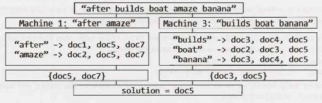
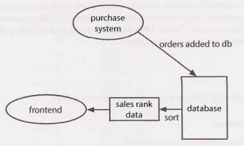
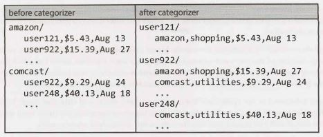

9 System Design and Scalability
===============================

Despite how intimidating they seem, scalability questions can be among the easiest questions. There are no "gotchas", no tricks, and no fancy algorithms-at least not usually. What trips up many people is that they believe there's something "magic" to these problems-some hidden bit of knowledge.

It's not like that. These questions are simply designed to see how you would perform in the real world. If you were asked by your manager to design some system, what would you do?

That's why you should approach it just like this. Tackle the problem by doing it just like you would at work. Ask questions. Engage the interviewer. Discuss the tradeoffs.

We will touch on some key concepts  in this chapter, but recognize it's not really about memorizing these concepts. Yes, understanding some big components  of system design can be useful, but it's much more about the process you take. There are good solutions and bad solutions. There is no perfect solution.


### Handling the Questions

- **Communicate:** A key goal of system design questions is to evaluate your ability to communicate. Stay engaged with the interviewer. Ask them questions. Be open about the issues of your system.
- **Go broad first:** Don't dive straight into the algorithm part or get excessively focused on one part.
- **Use the whiteboard:** Using a whiteboard helps your interviewer follow your proposed design. Get up to the whiteboard in the very beginning and use it to draw a picture of what you're proposing.
- **Acknowledge interviewer concerns:** Your interviewer will likely jump in with concerns. Don't brush them off; validate them. Acknowledge the issues your interviewer points out and make changes accordingly.
- **Be careful about assumptions:** An incorrect assumption can dramatically change the problem. For example, if your system produces analytics / statistics for a dataset, it matters whether those analytics must be totally up to date.
- **State your assumptions explicitly:** When you do make assumptions, state them. This allows your interviewer to correct you if you're mistaken, and shows that you at least know what assumptions you're making.
- **Estimate when necessary:** In many cases, you might not have the data you need. For example, if you're designing  a web crawler, you might need to estimate how much space it will take to store all the URLs. You can estimate this with other data you know.
- **Drive:**  As the candidate,  you should  stay in the driver's seat. This doesn't  mean  you don't  talk to your interviewer; in fact you must talk to your interviewer. However, you should be driving through the question. Ask questions. Be open about tradeoffs. Continue to go deeper. Continue to make improvements. 

These questions are largely about the process rather than the ultimate design.

### Design: Step-By-Step

If your manager asked you to design a system such as TinyURL, you probably wouldn't just say, "Okay", then lock yourself in your office to design it by yourself. You would probably have a lot more questions before you do it. This is the way you should handle it in an interview.


#### Step 1: Scope the Problem

You can't design a system if you don't know what you're designing. Scoping the problem  is important because  you want to ensure that you're building what the interviewer wants and because this might be something that interviewer is specifically evaluating.

If you're asked something  such as "Design Tiny URL"; you'll want to understand  what exactly you need to implement. Will people be able to specify their own short URLs? Or will it all be auto-generated? Will you need to keep track of any stats on the clicks? Should the URLs stay alive forever, or do they have a timeout?

These are questions that must be answered before going further.

Make a list here as well of the major features or use cases. For example, for TinyURL, it might be:

- Shortening a URL to a TinyURL.
- Analytics  for a URL.
- Retrieving the URL associated with a TinyURL. 
- User accounts and link management.

#### Step 2: Make Reasonable Assumptions

It's okay to make some assumptions  (when necessary), but they should be reasonable. For example, it would not be reasonable to assume that your system only needs to process 100 users per day, or to assume that you have infinite memory available.

However, it might be reasonable to design for a max of one million new URLs per day. Making this assump­tion can help you calculate how much data your system might need to store.

Some assumptions might take some "product sense" (which is not a bad thing). For example, is it okay for the data to be stale by a max of ten minutes? That all depends. If it takes 1O minutes for a just-entered URL to work, that's a deal-breaking issue. People usually want these URLs to be active immediately. However, if the statistics are ten minutes out of date, that might be okay. Talk to your interviewer about these sorts of assumptions.


#### Step  3: Draw the Major Components

Get up out of that chair and go to the whiteboard. Draw a diagram of the major components. You might have something  like a frontend server (or set of servers) that pull data from the backend's data store. You might have another  set of servers that crawl the internet  for some data, and another set that process analytics. Draw a picture of what this system might look like.

Walk through your system from end-to-end to provide a flow. A user enters a new URL. Then what?

It may help here to ignore major scalability challenges and just pretend that the simple, obvious approaches will be okay. You'll handle the big issues in Step 4.

#### Step  4: Identify  the  Key Issues

Once you have a basic design in mind, focus on the key issues. What will be the bottlenecks or major chal­lenges in the system?

For example, if you were designing TinyURL, one situation you might consider is that while some URLs will be infrequently accessed, others can suddenly peak. This might happen if a URL is posted  on Reddit or another popular forum. You don't necessarily want to constantly hit the database.

Your interviewer might provide some guidance here. If so, take this guidance and use it.


#### Step  5: Redesign for the  Key Issues

Once you have identified the key issues, it's time to adjust your design for it. You might find that it involves a major redesign or just some minor tweaking (like using a cache).

Stay up at the whiteboard here and update your diagram as your design changes.

Be open about any limitations in your design. Your interviewer will likely be aware of them, so it's important to communicate that you're aware of them, too.


### Algorithms that Scale: Step-By-Step

In some cases, you're not being asked to design an entire system. You're just being asked to design a single feature or algorithm, but you have to do it in a scalable way. Or, there might be one algorithm part that is the "real" focus of a broader design question.

In these cases, try the following approach.


#### Step  1 : Ask Questions

As in the earlier approach, ask questions to make sure you really understand the question. There might be details the interviewer left out (intentionally or unintentionally). You can't solve a problem if you don't understand exactly what the problem is.


#### Step  2: Make Believe

Pretend that the data can all fit on one machine and there are no memory limitations. How would you solve the problem? The answer to this question will provide the general outline for your solution.


#### Step 3: Get Real

Now go back to the original problem. How much data can you fit on one machine, and what problems will occur when you split up the data? Common problems include figuring out how to logically divide the data up, and how one machine would identify where to look up a different piece of data.

#### Step 4: Solve Problems

Finally, think about how to solve the issues you identified in Step 2. Remember that the solution for each issue might be to actually remove the issue entirely, or it might be to simply mitigate the issue. Usually, you can continue using (with modifications) the approach you outlined in Step 1, but occasionally you will need to fundamentally alter the approach.

Note that an iterative approach is typically useful. That is, once you have solved the problems from Step 3, new problems may have emerged, and you must tackle those as well.

Your goal is not to re-architect a complex system that companies have spent millions of dollars building, but rather to demonstrate that you can analyze and solve problems. Poking holes in your own solution is a fantastic way to demonstrate this.


### Key Concepts

While system design questions aren't really tests of what you know, certain concepts can make things a lot easier. We will give a brief overview here. All of these are deep, complex topics, so we encourage you to use online resources for more research.


#### Horizontal vs. Vertical Scaling

A system can be scaled one of two ways.

- Vertical scaling means increasing the resources of a specific node. For example, you might add addi­tional memory to a server to improve its ability to handle load changes.
- Horizontal scaling means increasing the number of nodes. For example, you might add additional servers, thus decreasing the load on any one server.

Vertical scaling is generally easier than horizontal scaling, but it's limited. You can only add so much memory or disk space.


#### Load Balancer

Typically, some frontend parts of a scalable website will be thrown behind  a load balancer. This allows a system to distribute the load evenly so that one server doesn't crash and take down the whole system. To do so, of course, you have to build out a network of cloned servers that all have essentially the same code and access to the same data.


#### Database Denormalization and  NoSQL

Joins in a relational database such as SQL can get very slow as the system grows bigger. For this reason, you would generally avoid them.

Denormalization is one part of this. Denormalization means adding redundant information into a database to speed up reads. For example, imagine a database describing projects and tasks (where a project can have multiple tasks). You might need to get the project name and the task information. Rather than doing a join across these tables, you can store the project name within the task table (in addition  to the project table).

Or, you can go with a NoSQL database. A NoSQL database does not support joins and might structure data in a different way. It is designed to scale better.

#### Database Partitioning (Sharding)

Sharding means splitting the data across multiple machines while ensuring you have a way of figuring out which data is on which machine.

A few common ways of partitioning include:

- **Vertical  Partitioning:** This is basically partitioning by feature. For example, if you were building a social network, you might have one partition for tables relating to profiles, another one for messages, and so on. One drawback of this is that if one of these tables gets very large, you might need to repartition that database (possibly using a different  partitioning  scheme).
- **Key-Based (or Hash-Based) Partitioning:** This uses some part of the data (for example an ID) to partition it. A very  simple way to do this is to allocate N servers and put the data on mod (key,  n). One issue with this is that the number of servers you have is effectively fixed. Adding additional servers means reallocating all the data-a very expensive task.
- **Directory-Based Partitioning:** In this scheme, you maintain a lookup table for where the data can be found. This makes it relatively easy to add additional servers, but it comes with two major drawbacks. First, the lookup table can be a single point of failure. Second, constantly accessing this table impacts performance.

Many architectures actually end up using multiple partitioning schemes.


#### Caching

An in-memory cache can deliver very rapid results. It is a simple key-value pairing and typically sits between your application layer and your data store.

When an application requests a piece of information, it first tries the cache. If the cache does not contain the key, it will then look up the data in the data store. (At this point, the data might-or might not-be stored in the data store.)

When you cache, you might cache a query and its results directly. Or, alternatively, you can cache the specific object (for example, a rendered version of a part of the website, or a list of the most recent blog posts).


#### Asynchronous Processing & Queues

Slow operations should ideally be done asynchronously. Otherwise, a user might get stuck waiting and waiting for a process to complete.

In some cases, we can do this in advance (i.e., we can pre-process). For example, we might have a queue of jobs to be done that update some part of the website. If we were running a forum, one of these jobs might be to re-render a page that lists the most popular posts and the number of comments. That list might end up being slightly out of date, but that's perhaps okay. It's better than a user stuck waiting on the website to load simply because someone added a new comment and invalidated the cached version of this page.

In other cases, we might tell the user to wait and notify them when the process is done. You've probably seen this on websites before. Perhaps you enabled some new part of a website and it says it needs a few minutes to import your data, but you'll get a notification when it's done.


#### Networking Metrics

Some of the most important metrics around networking include:

- **Bandwidth:** This is the maximum amount of data that can be transferred in a unit of time. It is typically expressed in bits per second (or some similar ways, such as gigabytes per second).
- **Throughput:** Whereas bandwidth  is the  maximum data  that  can be  transferred in a unit of time, throughput is the actual amount of data that is transferred.
- **Latency:** This is how long it takes data to go from one end to the other. That is, it is the delay between the sender sending information (even a very small chunk of data) and the receiver receiving it.

Imagine you have a conveyor belt that transfers items across a factory. Latency is the time it takes an item to go from one side to another. Throughput is the number of items that roll off the conveyor belt per second.

- Building a fatter conveyor belt will not change latency.  It will, however,  change throughput and band­width. You can get more items on the belt, thus transferring more in a given unit of time.
- Shortening the belt will decrease latency, since items spend less time in transit. It won't change the throughput or bandwidth. The same number of items will roll off the belt per unit of time.
- Making a faster conveyor belt will change all three. The time it takes an item to travel across the factory decreases. More items will also roll off the conveyor belt per unit of time.
- Bandwidth is the number of items that can be transferred per unit of time, in the best possible condi­tions. Throughput is the time it really takes, when the machines perhaps aren't operating smoothly.

Latency can be easy to disregard, but it can be very important in particular situations. For example,  if you're playing certain online games, latency can be a very big deal. How can you play a typical online sports game (like a two-player football game) if you aren't notified very quickly of your opponent's movement? Additionally, unlike throughput where at least you have the option of speeding things up through data compression, there is often little you can do about latency.


#### MapReduce

MapReduce is often associated with Google, but it's used much more broadly than that. A MapReduce program is typically used to process large amounts of data.

As its name suggests, a MapReduce program requires you to write a Map step and a Reduce step. The rest is handled by the system.

- Map takes in some data and emits a \<key, value> pair.
- Reduce takes a key and a set of associated values and "reduces" them in some way, emitting a new key and value. The results of this might be fed back into the Reduce program for more reducing.

MapReduce allows us to do a lot of processing in parallel, which makes processing huge amounts of data more scalable.

For more information, see "MapReduce" on page 642.


### Considerations

In addition to the earlier concepts to learn, you should consider the following issues when designing a system.

- **Failures:** Essentially any part of a system can fail. You'll need to plan for many or all of these failures.
- **Availability and Reliability:** Availability is a function of the percentage of time the system is opera­tional. Reliability is a function of the probability that the system is operational for a certain unit of time.
- **Read-heavy vs. Write-heavy:** Whether an application will do a lot of reads or a lot of writes impacts the design. If it's write-heavy, you could consider queuing up the writes (but think about potential failure here!). If it's read-heavy, you might want to cache. Other design decisions could change as well.
- **Security:** Security threats can, of course, be devastating for a system. Think about the types of issues a system might face and design around those.

This is just to get you started with the potential issues for a system. Remember to be open in your interview about the tradeoffs.


### There is no "perfect" system.

There is no single design for TinyURL or Google Maps or any other system that works perfectly (although there are a great number  that would work terribly). There are always tradeoffs. Two people could have substantially different designs for a system, with both being excellent given different assumptions.

Your goal in these problems is to be able to understand use cases, scope a problem, make reasonable assumptions, create a solid design based on those assumptions, and be open about the weaknesses of your design. Do not expect something perfect.


### Example Problem

*Given a list of millions of documents, how would you find all documents that contain a list of words?* The words can appear in any order, but they must be complete words. That is, "book" does not match "bookkeeper."

Before we start solving the problem, we need to understand whether this is a one time only operation, or if this findWords procedure will be called repeatedly. Let's assume that we will be calling findWords many times for the same set of documents, and, therefore, we can accept the burden of pre-processing.


#### Step 1

The first step is to pretend we just have a few dozen documents. How would we implement findWords in this case? (Tip: stop here and try to solve this yourself before reading on.)

One way to do this is to pre-process each document and create a hash table index. This hash table would map from a word to a list of the documents that contain that word.

```
"books"  ->  {doc2,  doc3,   doc6,   doc8}
"many"   ->  {doc1,  doc3,   doc7,   doc8,   doc9}
```

To search for "many books", we would simply do an intesection on the values for "books" and "many", and return {doc3, doc8}  as the result.


#### Step2

Now go back to the original problem. What problems are introduced  with millions of documents?  For starters, we probably need to divide up the documents across many machines. Also, depending on a variety of factors, such as the number of possible words and the repetition of words in a document, we may not be able to fit the full hash table on one machine. Let's assume that this is the case.

This division introduces the following key concerns:

1. How will we divide up our hash table? We could divide it up by keyword, such that a given machine contains the full document list for a given word. Or, we could divide by document, such that a machine contains the keyword mapping for only a subset of the documents.
2. Once we decide how to divide up the data, we may need to process a document on one machine and push the results off to other machines. What does this process look like? (Note:  if we divide the hash table by document this step may not be necessary.)
3. We will need a way of knowing which machine holds a piece of data. What does this lookup table look like, and where is it stored?

These are just three concerns. There may be many others.

#### Step3

In Step 3, we find solutions to each of these issues. One solution is to divide up the words alphabetically by keyword, such that each machine  controls a range of words (e.g., "after" through "apple").

We can implement a simple algorithm in which we iterate through the keywords alphabetically, storing as much data as possible on one machine. When that machine  is full, we can move to the next machine.

The advantage of this approach is that the lookup table is small and simple (since it must only specify a range of values), and each machine can store a copy of the lookup table. However, the disadvantage  is that if new documents or words are added, we may need to perform an expensive shift of keywords.

To find all the documents that match a list of strings, we would first sort the list and then send each machine a lookup request for the strings that the machine  owns. For example,  if our string is "after  builds boat amaze  banana", machine 1  would get a lookup request for {"after",   "amaze"}.

Machine 1  looks up the documents containing "after" and "amaze", and performs an intersection on these document lists. Machine 3 does the same for {"banana", "boat", "builds"}, and intersects their lists.

In the final step, the initial machine would do an intersection  on the results from Machine 1  and Machine 3. The following diagram explains this process.



---

Interview Questions

---

These questions are designed to mirror a real interview, so they will not always be well defined. Think about what questions  you would ask your interviewer and then make reasonable  assumptions. You may make different assumptions than us, and that will lead you to a very different design. That's okay!

**9.1 	Stock Data:**  Imagine you are building some sort of service that will be called by up to 1,000 client applications to get simple end-of-day stock price information (open, close, high, low). You may assume that you already have the data, and you can store it in any format you wish. How would you design the client-facing service that provides the information to client applications? You are responsible for the development,  rollout, and ongoing monitoring and maintenance  of the feed. Describe the different methods  you considered and why you would recommend  your approach. Your service can use any technologies you wish, and can distribute the information to the client applications in any mechanism you choose. 


SOLUTION
 
---

From the statement of the problem, we want to focus on how we actually distribute the information to clients. We can assume that we have some scripts that magically collect the information.

We want to start off by thinking about what the different aspects we should consider in a given proposal are:

- *Client Ease of Use:* We want the service to be easy for the clients to implement and useful for them.
- *Ease for Ourselves:*This service should be as easy as possible for us to implement, as we shouldn't impose unnecessary work on ourselves. We need to consider in this not only the cost of implementing, but also the cost of maintenance.
- *Flexibility for Future Demands:* This problem is stated  in a "what would you do in the real world" way, so we should think like we would in a real-world problem. Ideally, we do not want to overly constrain ourselves in the implementation, such that we can't be flexible if the requirements or demands change.
- *Scalability and Efficiency:* We should be mindful of the efficiency of our solution, so as not to overly burden our service.

With this framework in mind, we can consider various proposals.


**Proposal #1**

One option is that we could keep the data in simple text files and let clients download the data through some sort of FTP server. This would be easy to maintain in some sense, since files can be easily viewed and backed up, but it would require more complex parsing to do any sort of query. And, if additional data were added to our text file, it might break the clients' parsing mechanism.


**Proposal #2**

We could use a standard SQL database,  and let the clients plug directly into that. This would provide the following benefits:

- Facilitates an easy way for the clients to do query processing over the data, in case there are additional features we need to support. For example, we could easily and efficiently perform a query such as "return all stocks having an open price greater than N and a closing price less than M".
- Rolling  back, backing up data, and security could be provided using standard  database  features. We don't have to "reinvent the wheel", so it's easy for us to implement.
- Reasonably easy for the clients to integrate  into existing applications. SQL integration is a standard feature in software development environments.

What are the disadvantages of using a SQL database?

- It's much heavier weight than we really need. We don't necessarily need all the complexity of a SQL backend to support a feed of a few bits of information.
- It's difficult for humans to be able to read it, so we'll likely need to implement an additional layer to view and maintain the data. This increases our implementation costs.
- Security:  While a SQL database  offers pretty well defined security levels, we would still need to be very careful to not give clients access that  they shouldn't  have. Additionally, even if clients aren't doing anything "malicious", they might perform expensive and inefficient queries, and our servers would bear the costs of that.

These disadvantages don't mean that we shouldn't provide SQL access. Rather, they mean that we should be aware of the disadvantages.


**Proposal #3**

XML is another  great option for distributing the information. Our data  has fixed format and fixed size:
company_name, open, high, low, closing price. The XML could look like this:

```xml
l   <root>
2          <date value="2008-10-12">
3               <company name="foo">
4                    <open>l26.23</open>
5                    <high>130.27</high>
6                    <low>122.83</low>
7                    <closingPrice>127.30</closingPrice>
8               </company>
9               <company name="bar">
10                  <open>52.73</open>
11                  <high>60.27</high>
12                  <low>50.29</low>
13                  <closingPrice>54.91</closingPrice>
14             </company>
15        </date>
16        <date  value="2008-10-11">  .  .  . </date>
17   </root>
```

The advantages  of this approach include the following:

- It's very easy to distribute, and it can also be easily read by both machines and humans. This is one reason that XML is a standard data model to share and distribute data.
- Most languages have a library to perform XML parsing, so it's reasonably easy for clients to implement.
- We can add new data to the XML file by adding additional nodes. This would not break the client's parser (provided they have implemented their parser in a reasonable way).
- Since  the data is being stored as XML files, we can use existing tools for backing up the data. We don't need to implement our own backup tool.

The disadvantages may include:

- This solution  sends the clients all the information, even if they only want part of it. It is inefficient in that way.
- Performing any queries on the data requires parsing the entire file.

Regardless of which solution we use for data storage, we could provide a web service  (e.g., SOAP) for client data access. This adds a layer to our work, but it can provide additional security, and it may even make it easier for clients to integrate the system.

However-and this is a pro and a con-clients will be limited to grabbing the data only how we expect or want them to. By contrast, in a pure SQL implementation, clients could query for the highest stock price, even if this wasn't a procedure we "expected" them to need.

So which one of these would we use? There's no clear answer. The pure text file solution is probably a bad choice, but you can make a compelling argument for the SQL or XML solution, with or without a web service.

The goal of a question like this is not to see if you get the "correct" answer (there is no single correct answer). Rather, it's to see how you design a system, and how you evaluate trade-offs.


**9.2 	Social Network:** How would you design the data structures for a very large social network like Facebook or Linkedln? Describe how you would design an algorithm to show the shortest path between two people (e.g., Me-> Bob-> Susan-> Jason-> You).

SOLUTION

---

A good way to approach this problem is to remove some of the constraints and solve it for that situation first.


**Step  1: Simplify the  Problem-Forget About the  Millions of Users**

First, let's forget  that we're dealing with millions of users. Design this for the simple case.

We can construct a graph by treating each person as a node and letting an edge between two nodes indi­cate that the two users are friends.

If I wanted to find the path between two people, I could start with one person and do a simple breadth-first search.

Why wouldn't a depth-first search work well? First, depth-first search would just find a path. It wouldn't necessarily find the shortest path. Second, even if we just needed any path, it would be very inefficient. Two users might be only one degree of separation apart, but I  could search millions of nodes in their "subtrees" before finding this relatively immediate connection.

Alternatively, I  could do what's called a bidirectional breadth-first search. This means doing two breadth-first searches, one from the source and one from the destination. When the searches collide, we know we've found a path.

In the implementation, we'll use two classes to help us. BFSData holds the data we need for a breadth-first search, such as the isVisited hash table and the toVisit queue. PathNode will represent the path as we're searching it, storing each Person and the previousNode we visited in this path.

```java
1  	LinkedList<Person> findPathBiBFS(HashMap<Integer,  Person> people,   int source,
2  									int destination) {
3  		BFSData sourceData =  new BFSData(people.get(source));
4  		BFSData destData   =  new BFSData(people.get(destination));
5	
6  		while (!sourceData.isFinished() && !destData.isFinished()) {
7  			/*Search  out  from source.*/
8  			Person  collision =  searchLevel(people,  sourceData,   destData);
9  			if (collision != null) {
10 				return  mergePaths(sourceData, destData,  collision.getID());
11 			}
12	
13 			/*Search  out  from destination.*/
14 			collision =  searchLevel(people,  destData,  sourceData);
15 			if (collision != null) {
16 				return  mergePaths(sourceData, destData,  collision.getID());
17 			}
18 		}
19 		return null;
20 	}
21	
22 	/*Search   one level and return collision, if any.*/
23 	Person  searchLevel(HashMap<Integer,  Person> people,   BFSData  primary,
24 						BFSData secondary) {
25 		/*We  only  want to  search  one level at a time. Count how  many  nodes  are
26 		* currently  in  the  primary's level and only  do that many  nodes.  We'll  continue
27 		* to  add nodes to  the  end. */
28 		int count  = primary.toVisit.size();
29 		for  (int i =  0;  i < count;   i++)  {
30 			/*Pull out  first node.*/
31 			PathNode pathNode =  primary.toVisit.poll();
32 			int  personld = pathNode.getPerson().getID();
33	
34 			/* Check if it's already been visited. */
35 			if (secondary.visited.containsKey(personid)) {
36 				return  pathNode.getPerson();
37 			}
38	
39 			/*   Add friends to  queue.  */
40 			Person  person  =  pathNode.getPerson();
41 			ArrayList<Integer> friends = person.getFriends();
42 			for  (int friendid : friends) {
43 				if (!primary.visited.containsKey(friendid)) {
44 					Person  friend =  people.get(friendld);
45 					PathNode next  =  new PathNode(friend,  pathNode);
46 					primary.visited.put(friendld, next);
47 					primary.toVisit.add(next);
48 				}
49 			}
50 		}
51 		return null;
52 	}
53	
54 	/* Merge paths  where searches met at connection. */
55 	LinkedList<Person> mergePaths(BFSData bfs1, BFSData bfs2, int  connection) {
56 		PathNode end1 = bfs1.visited.get(connection); // endl  -> source
57 		PathNode end2 = bfs2.visited.get(connection);  // end2 -> dest
58 		LinkedList<Person> pathOne =  end1.collapse(false);
59 		LinkedList<Person> pathTwo =  end2.collapse(true);  // reverse
60 		pathTwo.removeFirst();  // remove connection
61 		pathOne.addAll(pathTwo);  // add second  path
62 		return pathOne;
63 	}
64	
65 	class PathNode {
66 		private Person  person  =  null;
67 		private PathNode previousNode  =  null;
68 		public PathNode(Person  p,  PathNode previous) {
69 			person  =  p;
70 			previousNode = previous;
71 		}
72		
73 		public Person  getPerson() {  return person;  }
74		
75 		public  LinkedList<Person> collapse(boolean  startsWithRoot) {
76 			LinkedList<Person> path =  new LinkedList<Person>();
77 			PathNode node = this;
78 			while  (node  != null) {
79 				if (startsWithRoot) {
80 					path.addlast(node.person);
81 				}  else {
82 					path.addFirst(node.person);
83 				}
84 				node = node.previousNode;
85 			}
86 			return path;
87 		}
88 	}
89	
90 	class BFSData   {
91 		public Queue<PathNode> toVisit =  new LinkedList<PathNode>();
92 		public HashMap<Integer, PathNode> visited = 
93 						new HashMap<Integer,  PathNode>();
94		
95 		public BFSData(Person root) {
96 			PathNode sourcePath =  new PathNode(root,  null);
97 			toVisit.add(sourcePath);
98 			visited.put(root.getID(),   sourcePath);
99 		}
100		
101		public boolean  isFinished() {
102			return toVisit.isEmpty();
103		}
104	}
```

Many people are surprised that this is faster. Some quick math can explain why.

Suppose every person has k friends, and node S and node D have a friend C in common.

- Traditional breadth-first search from S to D: We  go through roughly k+k\*k nodes: each of S's k friends, and then each of their k friends.
- Bidirectional breadth-first search: We go through 2k nodes: each of S's k friends and each of D's k friends. 

Of course, 2k is much less than k+k\*k.

Generalizing this to a path of length q, we have this:

- BFS: O(k^q )
- Bidirectional BFS: O(k^q/2 + k^q/2), which is just O(k^q/2)

If you imagine a path like A -> B -> C -> D -> E where each person has 100 friends, this is a big difference. BFS will require looking at 100 million (100⁴) nodes. A bidirectional BFS will require looking at only 20,000 nodes (2  x  100²).

A bidirectional  BFS will generally be faster than the traditional BFS. However, it requires actually having access to both the source node and the destination nodes, which is not always the case.


**Step 2: Handle the Millions of Users**

When we deal with a service the size of Linkedln or Facebook, we cannot possibly keep all of our data on one machine. That means that our simple Person  data structure from above doesn't quite work-our friends may not live on the same machine as we do. Instead, we can replace our list of friends with a list of their IDs, and traverse as follows:

1. For each friend  ID: int machine_index =  getMachineIDForUser(personID);

2. Go to machine #machine_index

3. On that machine, do: Person friend =  getPersonWithID(person_id);

The code below outlines this process. We've defined a class Server, which holds a list of all the machines, and a class Machine, which represents a single machine. Both classes have hash tables to efficiently lookup data.

```java
1 	class  Server {
2 		HashMap<Integer, Machine>  machines =  new HashMap<Integer,   Machine>();
3 		HashMap<Integer, Integer> personToMachineMap =  new HashMap<Integer,   Integer>();
4	
5 		public  Machine getMachineWithid(int machineID) {
6 			return  machines.get(machineID);
7 		}
8	
9 		public  int getMachineIDForUser(int  personID) {
10			Integer  machineID  =  personToMachineMap.get(personID);
11			return  machineID  == null ?  -1 : machineID;
12		}
13	
14		public  Person getPersonWithID(int  personID) {
15			Integer  machineID =  personToMachineMap.get(personID);
16			if (machineID ==  null) return  null;
17	
18			Machine machine =  getMachineWithid(machineID);
19			if (machine ==  null) return  null;
20	
21			return  machine.getPersonWithID(personID);
22		}
23	}
24	
25	class  Person {
26		private ArrayList<Integer> friends =  new ArrayList<Integer>();
27		private int personID;
28		private String info;
29	
30		public Person(int id)  { this.personID = id; }
31		public String getinfo()  {  return  info;  }
32		public void setinfo(String info) {this.info  =  info; }
33		public ArrayList<Integer> getFriends()  {return  friends; }
34		public int getID() {return  personID;}
35		public void addFriend(int id)  {friends.add(id); }
36	}
```

There are more optimizations and follow-up questions here than we could possibly discuss, but here are just a few possibilities.

**Optimization: Reduce machine jumps**

Jumping from one machine to another is expensive. Instead of randomly jumping from machine to machine with each friend, try to batch these jumps-e.g., if five of my friends live on one machine, I should look them up all at once.


**Optimization: Smart division of people and machines**

People are much more likely to be friends with people who live in the same country as they do. Rather than randomly dividing people across machines, try to divide them by country, city, state, and so on. This will reduce the number of jumps.


**Question: Breadth-first search usually requires "marking" a node as visited. How do you  do that in this case?**

Usually, in BFS, we mark a node as visited by setting a visited flag in its node class. Here, we don't want to do that. There could be multiple searches going on at the same time, so it's a bad idea to just edit our data.

Instead, we could mimic the marking of nodes  with a hash table to look up a node  id and determine whether it's been visited.


**Other Follow-Up Questions:**

- In the real world, servers fail. How does this affect you? 
- How could you take advantage  of caching?
- Do you search until the end of the graph (infinite)? How do you decide when to give up?
- In real life, some people have more friends of friends than others, and are therefore more likely to make a path between you and someone else. How could you use this data to pick where to start traversing?

These are just a few of the follow-up questions you or the interviewer could raise. There are many others.


**9.3       Web Crawler:** If you were designing a web crawler, how would you avoid getting into infinite loops?

SOLUTION

---

The first thing to ask ourselves in this problem is how an infinite loop might occur. The simplest answer is that, if we picture the web as a graph of links, an infinite loop will occur when a cycle occurs.

To prevent infinite loops, we just need to detect cycles. One way to do this is to create a hash table where we set hash[v] to true after we visit page v.

We can crawl the web using breadth-first search. Each time we visit a page, we gather all its links and insert them at the end of a queue. If we've already visited a page, we ignore it.

This is great-but what does it mean to visit page v? Is page v defined based on its content or its URL?

If it's defined based  on its URL,  we must recognize that  URL parameters  might indicate a completely different page. For example, the  page www.careercup.com/page?pid=microsoft-interview-questions is totally different from the page www.careercup.com/page?pid=google-interview-questions. But, we can also append  URL parameters  arbitrarily to any URL without truly changing the page, provided it's not a parameter  that the web application recognizes and handles. The  page www.careercup.com?foobar=hello is the same as www.careercup.com.

"Okay, then", you might say, "let's define it based on its content". That sounds good too, at first, but it also doesn't quite work. Suppose I have some randomly generated content on the careercup.com home page. Is it a different page each time you visit it? Not really.

The reality is that there is probably no perfect way to define a "different" page, and this is where this problem gets tricky.

One way to tackle this is to have some sort of estimation for degree of similarity. If, based on the content and the URL, a page is deemed to be sufficiently similar to other pages, we deprioritize crawling its children. For each page, we would come up with some sort of signature based on snippets of the content and the page's URL.

Let's see how this would work.

We have a database which stores a list of items we need to crawl. On each iteration, we select the highest priority page to crawl. We then do the following:

1.  Open up the page and create a signature of the page based on specific subsections of the page and its URL.
2.  Query the database to see whether anything with this signature has been crawled recently.
3.  If something with this signature has been recently crawled, insert this page back into the database at a low priority.
4.  If not, crawl the page and insert its links into the database.

Under the above implementation, we never "complete" crawling the web, but we will avoid getting stuck in a loop of pages. If we want to allow for the possibility of "finishing" crawling the web (which would clearly happen only if the "web" were actually a smaller system, like an intranet), then we can set a minimum priority that a page must have to be crawled.

This is just one, simplistic solution, and there are many others that are equally valid. A problem like this will more likely resemble a conversation with your interviewer which could take any number of paths. In fact, the discussion of this problem could have taken the path of the very next problem.


**9.4 		Duplicate URLs:** You have 10 billion URLs. How do you detect  the duplicate documents? In this case, assume "duplicate" means that the URLs are identical.

SOLUTION

---

Just how much space do 10 billion URLs take up? If each URL is an average of 100 characters, and each character is 4 bytes, then this list of 10 billion URLs will take up about 4 terabytes. We are probably not going to hold that much data in memory.

But, let's just pretend for a moment that we were miraculously holding this data in memory, since it's useful to first construct a solution for the simple version. Under this version of the problem, we would just create a hash table where each URL maps to true if it's already been found elsewhere in the list. (As an alternative solution, we could sort the list and look for the duplicate values that way. That will take a bunch of extra time and offers few advantages.)

Now that we have a solution for the simple version, what happens when we have all 4000 gigabytes of data and we can't store it all in memory? We could solve this either by storing some of the data on disk or by splitting up the data across machines.


**Solution #1: Disk Storage**

If we stored all the data on one machine, we would do two passes of the document. The first pass would split the list of URLs into 4000 chunks of 1 GB each. An easy way to do that might be to store each URL u in a file named\<x>. txt where x  =  hash(u)   %  4000.That is, we divide up the URLs based on their hash value (modulo the number of chunks). This way, all URLs with the same hash value would be in the same file.

In the second pass, we would essentially implement the simple solution we came up with earlier: load each file into memory, create a hash table of the URLs, and look for duplicates.


**Solution #2: Multiple  Machines**

The other solution is to perform essentially the same procedure, but to use multiple machines. In this solu­tion, rather than storing the data in file\<x>. txt, we would send the URL to machine x. 

Using multiple machines has pros and cons.

The main pro is that we can parallelize the operation, such that all 4000 chunks are processed simultaneously. For large amounts of data, this might result in a faster solution.

The disadvantage though is that we are now relying on 4000 different machines to operate perfectly. That may not be realistic (particularly with more data and more machines), and we'll need to start considering how to handle failure. Additionally, we have increased the complexity of the system simply by involving so many machines.

Both are good solutions, though, and both should be discussed with your interviewer.


**9.5 		Cache:** Imagine a web server for a simplified search engine. This system has  100 machines to respond to search queries, which may then call out using processSearch(string  query) to another cluster of machines to actually get the result. The machine which responds to a given query is chosen at random, so you cannot guarantee that the same machine will always respond to the same request. The method  processSearch is very expensive. Design a caching mechanism to cache the results of the most recent queries. Be sure to explain how you would update the cache when data changes.

SOLUTION

---

Before getting into the design of this system, we first have to understand what the question means. Many of the details are somewhat ambiguous, as is expected in questions like this. We will make reasonable assumptions for the purposes of this solution, but you should discuss these details-in depth-with your inter- viewer.


**Assumptions**

Here are a few of the assumptions we make for this solution. Depending on the design of your system and how you approach the problem, you may make other assumptions. Remember that while some approaches are better than others, there is no one "correct" approach.

- Other than calling out to processSearch as necessary, all query processing happens  on the initial machine that was called.
- The number of queries we wish to cache is large (millions).
- Calling  between machines is relatively quick.
- The result for a given query is an ordered list of URLs, each of which has an associated 50 character title and 200 character summary.
- The most popular queries are extremely popular, such that they would always appear in the cache. Again, these aren't the only valid assumptions. This is just one reasonable set of assumptions.

**System Requirements**

When designing the cache, we know we'll need to support two primary functions: 

- Efficient lookups given a key.
- Expiration of old data so that it can be replaced with new data.

In addition, we must also handle updating  or clearing the cache when the results for a query change. Because some queries are very common and may permanently reside in the cache, we cannot just wait for the cache to naturally expire.

**Step  1: Design  a Cache for a Single System**

A good way to approach this problem is to start by designing it for a single machine. So, how would you create a data structure that enables you to easily purge old data and also efficiently look up a value based on a key?

- A linked list would allow easy purging of old data, by moving "fresh" items to the front. We could imple­ment it to remove the last element of the linked list when the list exceeds a certain size.
- A hash table allows efficient lookups of data, but it wouldn't ordinarily allow easy data purging. 

How can we get the best of both worlds? By merging the two data structures. Here's how this works:

Just as before, we create a linked list where a node is moved to the front every time it's accessed. This way, the end of the linked list will always contain the stalest information.

In addition, we have a hash table that maps from a query to the corresponding node in the linked list. This allows us to not only efficiently return the cached results, but also to move the appropriate node to the front of the list, thereby updating its "freshness."

For illustrative  purposes, abbreviated code for the cache is below. The code attachment provides the full code for this part. Note that in your interview, it is unlikely that you would be asked to write the full code for this as well as perform the design for the larger system.

```java
1 	public class Cache {
2 		public static int MAX   SIZE =  10;
3 		public Node head,  tail;
4 		public HashMap<String, Node>  map;
5 		public int size =  0;
6	
7 		public Cache()  {
8 			map =  new HashMap<String, Node>();
9 		}
10	
11		/*Moves node to  front of  linked   list  */
12		public void  moveToFront(Node node)  {...  }
13		public void  moveToFront(String  query)  {...   }
14	
15		/*Removes node from linked list  */
16		public void  removeFromlinkedList(Node node)  {...  }
17	
18		/*   Gets  results from cache,  and updates  linked list  */
19		public String[]  getResults(String query)  {
20			if (!map.containsKey(query))  return null;
21	
22			Node node =  map.get(query);
23			moveToFront(node);   //update  freshness
24			return node.results;
25		}
26	
27		/* Inserts results  into linked list and hash   */
28		public void insertResults(String query, String[] results)  {
29			if (map.containsKey(query))  {//update  values
30				Node node =  map.get(query);
31				node.results =  results;
32				moveToFront(node);    //update  freshness
33				return;
34			}
35	
36			Node node =  new Node(query,  results);
37			moveToFront(node);
38			map.put(query,  node);
39	
40			if (size > MAX_SIZE)  {
41				map.remove(tail.query);
42				removeFromLinkedList(tail);
43			}
44		}
45	}
```

**Step  2: Expand to Many Machines**

Now that we understand  how to design this for a single machine, we need to understand how we would design this when queries could be sent to many different machines. Recall from the problem statement that there's no guarantee that a particular query will be consistently sent to the same machine.

The first thing we need to decide is to what extent the cache is shared across machines. We have several options to consider.

*Option 1: Each machine has its own cache.*

A simple option is to give each machine its own cache. This means that if "foo" is sent to machine 1  twice in a short amount of time, the result would be recalled from the cache on the second time. But, if "foo" is sent first to machine 1 and then to machine 2, it would be treated as a totally fresh query both times.

This has the advantage  of being relatively quick, since no machine-to-machine  calls are used. The cache, unfortunately, is somewhat less effective as an optimization tool as many repeat queries would be treated as fresh queries.

*Option 2: Each machine has a copy of the cache.*

On the other extreme, we could give each machine a complete copy of the cache. When new items are added to the cache, they are sent to all machines. The entire data structure-linked list and hash table-would be duplicated.

This design means that common queries would nearly always be in the cache, as the cache is the same everywhere. The major drawback however is that updating  the cache means firing off data to N different machines, where N is the size of the response cluster. Additionally, because each item effectively takes up N times as much space, our cache would hold much less data.

*Option  3: Each machine stores a segment of the cache.*

A third option is to divide up the cache, such that each machine holds a different part of it. Then, when machine i needs to look up the results for a query, machine i would figure out which machine holds this value, and then ask this other machine (machine j) to look up the query in j's cache.

But how would machine i know which machine holds this part of the hash table?

One option is to assign queries based on the formula hash (query) % N. Then, machine i only needs to apply this formula to know that machine j should store the results for this query.

So, when a new query comes in to machine i, this machine would apply the formula and call out to machine j. Machine j would then return the value from its cache or call processSearch(query) to get the results. Machine j would update its cache and return the results back to i.

Alternatively, you could design the system such that machine j just returns null if it doesn't have the query in its current cache. This would require machine  i to call processSearch and then  forward the results to machine j for storage. This implementation  actually increases the number of machine-to-machine calls, with few advantages.


**Step  3: Updating results when  contents change**

Recall that some queries may be so popular that, with a sufficiently large cache, they would permanently be cached. We need some sort of mechanism to allow cached results to be refreshed, either periodically or "on-demand" when certain content changes.

To answer this question, we need to consider when results would change (and you need to discuss this with your interviewer). The primary times would be when:

1. The content at a URL changes (or the page at that URL is removed).
2. The ordering of results change in response to the rank of a page changing.
3. New pages appear related to a particular query.

To handle situations #1  and #2, we could create a separate hash table that would tell us which cached queries are tied to a specific URL. This could be handled completely separately from the other caches, and reside on different machines.  However, this solution may require a lot of data.

Alternatively, if the data doesn't require instant refreshing (which it probably doesn't), we could periodically crawl through the cache stored on each machine to purge queries tied to the updated URLs.

Situation #3 is substantially  more difficult to handle. We could update single word queries by parsing the content at the new URL and purging these one-word queries from the caches.  But, this will only handle the one-word queries.

A good way to handle Situation #3 (and likely something we'd want to do anyway) is to implement an "automatic time-out" on the cache. That is, we'd impose  a time out where no query, regardless of how popular it is, can sit in the cache for more than x minutes. This will ensure that all data is periodically refreshed.


**Step 4: Further Enhancements**

There are a number of improvements and tweaks you could make to this design depending on the assump­tions you make and the situations you optimize for.

One such optimization is to better support the situation where some queries are very popular.  For example, suppose (as an extreme example) a particular string constitutes 1 % of all queries. Rather than machine i forwarding the request to machine j every time, machine i could forward the request just once to j, and then i could store the results in its own cache as well.

Alternatively, there may also be some possibility of doing some sort of re-architecture of the system to assign queries to machines based on their hash value (and therefore the location of the cache), rather than randomly. However, this decision may come with its own set of trade-offs.

Another optimization we could make is to the "automatic time out" mechanism. As initially described,  this mechanism purges any data after X minutes. However, we may want to update some data (like current news) much more frequently than other data (like historical  stock prices). We could implement timeouts based on topic or based on URLs. In the latter situation, each URL would have a time out value based on how frequently the page has been updated in the past. The time out for the query would be the minimum of the time outs for each URL.

These are just a few of the enhancements we can make. Remember that in questions like this, there is no single correct way to solve the problem. These questions are about having a discussion with your interviewer about design criteria and demonstrating your general approach and methodology.


**9.6		Sales  Rank:** A large eCommerce company wishes to list the best-selling products, overall and by category. For example, one product might be the #1056th best-selling product overall but the #13th best-selling product under "Sports Equipment" and the #24th best-selling product under "Safety:· Describe how you would design this system.

SOLUTION

---

Let's first start off by making some assumptions to define the problem.


**Step  1: Scope the  Problem**

First, we need to define what exactly we're building.

- We'll assume that we're only being asked to design the components relevant to this question, and not the entire eCommerce system. In this case, we might touch the design of the frontend and purchase components, but only as it impacts the sales rank.
- We should also define what the sales rank means. Is it total sales over all time? Sales in the last month? Last week? Or some more complicated function (such as one involving some sort of exponential decay of sales data)? This would be something to discuss with your interviewer. We will assume that it is simply the total sales over the past week.
- We will assume that each product can be in multiple categories, and that there is no concept of "subcategories".

This part just gives us a good idea of what the problem, or scope of features, is.


**Step  2: Make Reasonable Assumptions**

These are the sorts of things you'd want to discuss with your interviewer. Because we don't have an inter­viewer in front of us, we'll have to make some assumptions.

- We will assume that the stats do not need to be 100% up-to-date. Data can be up to an hour old for the most popular items (for example,  top 100 in each category), and up to one day old for the less popular items. That is, few people would care if the #2,809,132th best-selling item should have actually been listed as #2,789,158th instead.
- Precision is important for the most popular items, but a small degree of error is okay for the less popular items.
- We will assume that the data should be updated every hour (for the most popular items), but the time range for this data does not need to be precisely the last seven days (168 hours). If it's  sometimes more like 150 hours, that's okay.
- We will assume that the categorizations are based strictly on the origin of the transaction (i.e., the seller's name), not the price or date.

The important thing is not so much which decision you made at each possible issue, but whether it occurred to you that these are assumptions. We should get out as many of these assumptions as possible in the beginning. It's possible  you will need to make other assumptions along the way.


**Step  3: Draw the Major Components**

We should now design just a basic, naive system that describes the major components. This is where you would go up to a whiteboard.



In this simple design, we store every order as soon as it comes into the database. Every hour or so, we pull sales data from the database by category, compute the total sales, sort it, and store it in some sort of sales rank data cache (which is probably held in memory). The frontend just pulls the sales rank from this table, rather than hitting the standard database and doing its own analytics.


**Step  4: Identify the  Key Issues**

*Analytics are Expensive*

In the naive system, we periodically query the database  for the number of sales in the past week for each product. This will be fairly expensive. That's running a query over all sales for all time.

Our database just needs to track the total sales. We'll assume (as noted in the beginning of the solution) that the general storage for purchase history is taken care of in other parts of the system, and we just need to focus on the sales data analytics.

Instead of listing every purchase in our database,  we'll store just the total sales from the last week. Each purchase will just update the total weekly sales.

Tracking the total sales takes a bit of thought. If we just use a single column to track the total sales over the past week, then we'll need to re-compute  the total sales every day (since the specific days covered in the last seven days change with each day). That is unnecessarily expensive.

Instead, we'll just use a table like this.

| Prod ID | Total | Sun | Mon | Tues | Wed | Thrus | Fri | Sat |
| --      | --    | --  | --  | --   | --  | --    | --  | --  |
|         |       |     |     |      |     |       |     |     |
|         |       |     |     |      |     |       |     |     |


This is essentially like a circular array. Each day, we clear out the corresponding day of the week. On each purchase, we update  the total sales count for that product on that day of the week, as well as the total count.

We will also need a separate table to store the associations of product IDs and categories.

| Prod ID | Category ID |
| --      | --          |
|         |             |

To get the sales rank per category, we'll need to join these tables.

*Database Writes are Very Frequent*

Even with this change, we'll still be hitting the database very frequently. With the amount of purchases that could come in every second, we'll probably want to batch up the database writes.

Instead of immediately committing each purchase to the database, we could store purchases in some sort of in-memory cache (as well as to a log file as a backup). Periodically, we'll process the log / cache data, gather the totals, and update the database.


> We should quickly think about whether or not it's feasible to hold this in memory. If there are 10 million products in the system, can we store each (along with a count) in a hash table? Yes. If each product ID is four bytes (which is big enough to hold up to 4 billion unique IDs) and each count is four bytes (more than enough), then such a hash table would only take about 40 megabytes. Even with some additional overhead and substantial system growth, we would still be able to fit this all in memory.


*After updating the database, we can re-run the sales rank data.*

We need to be a bit careful here, though. If we process one product's logs before another's, and re-run the stats in between, we could create a bias in the data (since we're including a larger timespan for one product than its "competing" product).

We can resolve this by either ensuring that the sales rank doesn't run until all the stored data is processed (difficult to do when more and more purchases are coming in), or by dividing up the in-memory cache by some time period. If we update the database for all the stored data up to a particular moment in time, this ensures that the database will not have biases.

*Joins are Expensive*

We have potentially tens of thousands of product categories.  For each category, we'll need to first pull the data for its items (possibly through an expensive join) and then sort those.

Alternatively, we could just do one join of products and categories, such that each product will be listed once per category. Then,  if we sorted that on category and then product ID, we could just walk the results to get the sales rank for each category.

| Prod ID | Category | Total | Sun | Mon | Tues | Wed | Thrus | Fri | Sat |
| --      | --       | --    | --  | --  | --   | --  | --    | --  | --  |
| 1423    | sportseq | 13    | 4   | 1   | 4    | 19  | 322   | 32  | 232 |
| 1423    | safety   | 13    | 4   | 1   | 4    | 19  | 322   | 32  | 232 |


Rather than running thousands of queries (one for each category), we could sort the data on the category first and then the sales volume. Then, if we walked those results, we would get the sales rank for each category. We would also need to do one sort of the entire table on just sales number, to get the overall rank.

We could also just keep the data in a table like this from the beginning, rather than doing joins. This would require us to update multiple rows for each product.

*Database Queries Might Still Be Expensive*

Alternatively, if the queries and writes get very expensive, we could consider forgoing a database entirely and just using log files. This would allow us to take advantage of something like MapReduce.

Under this system, we would write a purchase to a simple text file with the product ID and time stamp. Each category has its own directory, and each purchase gets written to all the categories associated with that product.

We would run frequent jobs to merge files together  by product ID and time ranges, so that eventually all purchases in a given day (or possibly hour) were grouped together.

```
/sportsequipment
	1423,Dec 13  08:23-Dec  13  08:23,1
	4221,Dec 13  15:22-Dec  15  15:45,5

/safety
	1423,Dec 13  08:23-Dec  13  08:23,1
	5221,Dec 12  03:19-Dec  12  03:28,19
...
```

To get the best-selling products within each category, we just need to sort each directory. How do we get the overall ranking? There are two good approaches:

- We could treat the general category as just another directory, and write every purchase to that directory. That would mean a lot of files in this directory.
- Or, since we'll already have the products sorted by sales volume order for each category, we can also do an N-way merge to get the overall rank.

Alternatively, we can take advantage of the fact that the data doesn't need (as we assumed earlier) to be 100% up-to-date. We just need the most popular items to be up-to-date.

We can merge the most popular items from each category in a pairwise fashion. So, two categories get paired together and we merge the most popular items (the first 100 or so). After we have 100 items in this sorted order, we stop merging this pair and move onto the next pair.

To get the ranking for all products, we can be much lazier and only run this work once a day.

One of the advantages of this is that it scales nicely. We can easily divide up the files across multiple servers, as they aren't dependent on each other.


**Follow Up Questions**

The interviewer could push this design in any number of directions.

- Where do you think you'd hit the next bottlenecks? What would you do about that?
- What if there were subcategories  as well? So items could be listed under "Sports" and "Sports Equipment" (or even "Sports"> "Sports Equipment"> "Tennis"> "Rackets")?
- What if data needed  to be more accurate? What if it needed  to be accurate within 30 minutes for all products?

Think through your design carefully and analyze it for the tradeoffs. You might also be asked to go into more detail on any specific aspect of the product.

**9.7 	Personal Financial Manager:** Explain how you would design a personal financial manager  (like Mint.com). This system would connect to your bank accounts, analyze your spending habits, and make recommendations. 

SOLUTION

---

The first thing we need to do is define what it is exactly that we are building.


**Step 1: Scope the Problem**

Ordinarily, you would clarify this system with your interviewer. We'll scope the problem as follows:

- You create an account and add your bank accounts. You can add multiple bank accounts. You can also add them at a later point in time.
- It pulls in all your financial history, or as much of it as your bank will allow.
- This financial history includes outgoing money (things you bought or paid for), incoming money (salary and other payments), and your current money (what's in your bank account and investments).
- Each payment transaction has a "category" associated with it (food, travel, clothing, etc.).
- There is some sort of data source provided that tells the system, with some reliability, which category a transaction is associated with. The user might, in some cases, override the category when it's improperly assigned (e.g., eating at the cafe of a department store getting assigned to "clothing" rather than "food").
- Users will use the system to get recommendations on their spending. These recommendations will come from a mix of "typical" users ("people generally shouldn't spend more than Xo/o of their income on clothing"), but can be overridden with custom budgets. This will not be a primary focus right now.
- We assume this is just a website for now, although we could potentially talk about a mobile app as well.
- We probably want email notifications either on a regular basis, or on certain conditions (spending over a certain threshold, hitting a budget  max, etc.).
- We'll assume that there's no concept of user-specified rules for assigning categories to transactions. This gives us a basic goal for what we want to build.

**Step 2: Make Reasonable Assumptions**

Now that we have the basic goal for the system, we should define some further assumptions  about  the characteristics of the system.

- Adding or removing bank accounts is relatively unusual.
- The system is write-heavy. A typical user may make several new transactions daily, although  few users would access the website more than once a week. In fact, for many users, their primary interaction might be through email alerts.
- Once a transaction is assigned to a category, it will only be changed if the user asks to change it. The system will never reassign a transaction to a different category "behind the scenes", even if the rules change. This means that two otherwise identical transactions could be assigned to different categories if the rules changed in between each transaction's date. We do this because it may confuse users if their spending per category changes with no action on their part.
- The banks probably won't push data to our system. Instead, we will need to pull data from the banks. 
- Alerts on users exceeding budgets probably do not need to be sent instantaneously. (That wouldn't be realistic anyway, since we won't get the transaction data instantaneously.) It's probably pretty safe for them to be up to 24 hours delayed.

It's okay to make different assumptions here, but you should explicitly state them to your interviewer.

**Step  3: Draw the Major Components**

The most naive system would be one that pulls bank data on each login, categorizes all the data, and then analyzes the user's budget. This wouldn't quite fit the requirements, though, as we want email notifications on particular events.

```
+------------+
|bank data   |
|synchronizer|
+------------+
      |
      |
      |
+-----v---------+           +-----------+
|raw transaction+---------> |categorizer|
|data           |           +-----------+
+---------------+                |
      |                          |
      |                          |
      |                          |
+-----v----+                +----v--------+
| frontend +<-------------->+categorized  |
+-----^----+                |transactions |
      |                     --------------+
      | 
      | 
      | 
+-----V------+              +----------+
| budget data|<-------------+budget    |
+------------+              |analyzer  |
                            +----------+
```

With this basic architecture, the bank data is pulled at periodic times (hourly or daily). The frequency may depend on the behavior of the users. Less active users may have their accounts checked less frequently.

Once new data arrives, it is stored in some list of raw, unprocessed transactions. This data is then pushed to the categorizer, which assigns each transaction to a category and stores these categorized transactions in another datastore.

The budget  analyzer pulls in the categorized transactions, updates each user's budget  per category, and stores the user's budget.

The frontend pulls data from both the categorized transactions datastore as well as from the budget datastore. Additionally, a user could also interact with the frontend by changing the budget or the categorization of their transactions.


**Step 4: Identify the Key Issues**

We should now reflect on what the major issues here might be.

This will be a very data-heavy system. We want it to feel snappy and responsive, though, so we'll want as much processing as possible to be asynchronous.

We will almost certainly want at least one task queue, where we can queue up work that needs to be done. This work will include tasks such as pulling in new bank data, re-analyzing budgets, and categorizing new bank data. It would also include re-trying tasks that failed.

These tasks will likely have some sort of priority associated with them, as some need to be performed more ohen  than others. We want to build a task queue system that can prioritize some task types over others, while still ensuring that all tasks will be performed eventually. That is, we wouldn't want a low priority task to essentially "starve" because there are always higher priority tasks.

One important part of the system that we haven't yet addressed  will be the email system. We could use a task to regularly crawl user's data to check if they're exceeding their budget, but that means checking every single user daily. Instead, we'll want to queue a task whenever a transaction occurs that potentially exceeds a budget. We can store the current budget totals by category to make it easy to understand if a new transaction exceeds the budget.

We should also consider incorporating the knowledge (or assumption) that a system like this will probably have a large number of inactive users-users who signed up once and then haven't touched the system since. We may want to either remove them from the system entirely or deprioritize their accounts. We'll want some system to track their account activity and associate priority with their accounts.

The biggest bottleneck in our system will likely be the massive amount  of data that needs to be pulled and analyzed. We should be able to fetch the bank data asynchronously and run these tasks across many servers. We should drill a bit deeper into how the categorizer and budget analyzer work.

*Categorizer and Budget Analyzer*

One thing to note is that transactions are not dependent on each other. As soon as we get a transaction for a user, we can categorize it and integrate this data. It might be inefficient to do so, but it won't cause any inaccuracies.

Should we use a standard database for this? With lots of transactions coming in at once, that might not be very efficient. We certainly don't want to do a bunch of joins.

It may be better instead to just store the transactions to a set of flat text files. We assumed earlier that the categorizations are based on the seller's name alone. If we're assuming a lot of users, then there will be a lot of duplicates across the sellers. If we group the transaction files by seller's name, we can take advantage of these duplicates.

The categorizer can do something like this:
 
```
+-----------------------+     +-----------------+        +-------------------+
| raw transaction data, |     |categorized data,|        | update categorized|
| grouped by seller     +----->grouped by user  +------> | transactions      |
+-----------------------+     +------+----------+        +-------------------+
                                     |
                                     |
                                     |
                                     |
                              +------v----------+
                              |merge & group by |
                              |user & category  |
                              +------+----------+
                                     |
                                     |
                                     |
                                     |
                              +------v--------+
                              |update budgets |
                              +---------------+
```


It first gets the raw transaction data, grouped by seller. It picks the appropriate category for the seller (which might be stored in a cache for the most common sellers), and then applies that category to all those transactions.

After applying the category, it re-groups all the transactions by user. Then, those transactions are inserted into the datastore for this user.



Then, the budget  analyzer comes in. It takes the data grouped  by user, merges it across categories (so all Shopping tasks for this user in this timespan are merged), and then updates the budget.

Most of these tasks will be handled in simple log files. Only the final data (the categorized transactions and the budget analysis) will be stored in a database. This minimizes writing and reading from the database.

*User Changing Categories*

The user might selectively override particular transactions to assign them to a different category. In this case, we would update the datastore for the categorized transactions. It would also signal a quick recomputation of the budget to decrement the item from the old category and increment the item in the other category.

We could also just recompute the budget from scratch. The budget analyzer is fairly quick as it just needs to look over the past few weeks of transactions for a single user.

**Follow Up Questions**

- How would this change if you also needed to support a mobile app?
- How would you design the component  which assigns items to each category? 
- How would you design the recommended  budgets feature?
- How would you. change this if the user could develop rules to categorize all transactions from a partic­ular seller differently than the default?


**9.8 		Pastebin:** Design a system like Pastebin, where a user can enter a piece of text and get a randomly generated URL for public access. 


SOLUTION

---

We can start with clarifying the specifics of this system.
 
**Step  1: Scope the  Problem**

- The system does not support user accounts or editing documents.
- The system tracks analytics of how many times each page is accessed.
- Old documents get deleted after not being accessed for a sufficiently long period of time.
- While there isn't true authentication on accessing documents, users should not be able to "guess" document URLs easily.
- The system has a frontend as well as an AP\.
- The analytics for each URL can be accessed through a "stats" link on each page. It is not shown by default, though.

**Step 2: Make Reasonable Assumptions**

- The system gets heavy traffic and contains many millions of documents.
- Traffic is not equally distributed across documents. Some documents get much more access than others.

**Step 3: Draw the  Major Components**

We can sketch out a simple design. We'll need to keep track of URLs and the files associated with them, as well as analytics for how often the files have been accessed.

How should we store the documents? We have two options: we can store them in a database  or we can store them on a file. Since the documents  can be large and it's unlikely we need searching capabilities, storing them on a file is probably the better choice.

A simple design like this might work well:

``` 
   +---------------> server with files
    |
    |
    |
    |
    |
    |
    +
URL to File            server with files
Database    +------->
    +
    |
    |
    |
    |
    +--------------->  server with files
```

Here, we have a simple database that looks up the location (server and path) of each file. When we have a request for a URL, we look up the location of the URL within the datastore and then access the file.

Additionally, we will need a database that tracks analytics. We can do this with a simple datastore that adds each visit (including timestamp, IP address, and location) as a row in a database. When we need to access the stats of each visit, we pull the relevant data in from this database.


**Step 4: Identify the  Key Issues**

The first issue that comes to mind is that some documents  will be accessed much more frequently than others. Reading data from the filesystem is relatively slow compared with reading from data in memory. Therefore, we probably want to use a cache to store the most recently accessed documents. This will ensure that items accessed very frequently (or very recently) will be quickly accessible. Since documents cannot be edited,  we will not need to worry about invalidating this cache.

We should also potentially consider sharding the database. We can shard it using some mapping from the URL (for example, the URL's hash code modulo some integer), which will allow us to quickly locate the database which contains this file.

In fact, we could even take this a step further. We could skip the database entirely and just let a hash of the URL indicate which server contains the document. The URL itself could reflect the location of the document. One potential issue from this is that if we need to add servers, it could be difficult to redistribute the documents.

*Generating URLs*

We have not yet discussed how to actually generate the URLs. We probably do not want a monotonically increasing integer value, as this would be easy for a user to "guess". We want URLs to be difficult to access without being provided the link.

One simple path is to generate  a random GUID (e.g., 5d50e8ac-57cb-4a0d-8661-bcdee2548979). This is a 128-bit value that while not strictly guaranteed to be unique, has low enough odds of a collision that we can treat it as unique. The drawback of this plan is that such a URL is not very "pretty" to the user. We could hash it to a smaller value, but then that increases the odds of collision.

We could do something  very similar, though. We could just generate  a 10-character sequence  of letters and numbers, which gives us 3610 possible strings. Even with a billion URLs, the odds of a collision on any specific URL are very low.

> This is not to say that the odds of a collision over the whole system are low. They are not. Any one specific URL is unlikely to collide. However, after storing a billion URLs, we are very likely to have a collision at some point.


Assuming that we aren't okay with periodic (even if unusual) data loss, we'll need to handle these collisions. We can either check the datastore to see if the URL exists yet or, if the URL maps to a specific server, just detect whether a file already exists at the destination.

When a collision occurs, we can just generate a new URL. With  3610 possible URLs, collisions would be rare enough that the lazy approach here (detect collisions and retry) is sufficient.

*Analytics*

The final component to discuss is the analytics piece. We probably want to display the number of visits, and possibly break this down by location or time.

We have two options here:

- Store the raw data from each visit.
- Store just the data we know we'll use (number of visits, etc.).

You can discuss this with your interviewer, but it probably makes sense to store the raw data. We never know what features we'll add to the analytics down the road. The raw data allows us flexibility.

This does not mean that the raw data needs to be easily searchable or even accessible. We can just store a log of each visit in a file, and back this up to other servers.

One issue here is that this amount of data could be substantial. We could potentially reduce the space usage considerably by storing data only probabilistically. Each URL would have a storage_probability associated with it. As the popularity of a site goes up, the storage_probability goes down. For example, a popular document might have data logged only one out of every ten times, at random. When we look up the number of visits for the site, we'll need to adjust the value based on the probability (for example, by multiplying it by 10). This will of course lead to a small inaccuracy, but that may be acceptable.

The log files are not designed to be used frequently. We will want to also store this precomputed data in a datastore. If the analytics Just displays the number of visits plus a graph over time, this could be kept in a separate database.


| URL        | Month and Year | Visits |
| --         | --             | --     |
| 12ab31b92p | December  2013 | 242119 |
| 12ab31b92p | January 2014   | 429918 |
| ...        | ...            | ...    |


Every time a URL is visited, we can increment the appropriate row and column. This datastore can also be sharded by the URL.

As the stats are not listed on the regular pages and would generally be of less interest, it should not face as heavy of a load. We could still cache the generated HTML on the frontend servers, so that we don't continuously reaccess the data for the most popular URLs.


**Follow-Up Questions**

- How would you support user accounts?
- How would you add a new piece of analytics (e.g., referral source) to the stats page? 
- How would your design change if the stats were shown with each document?


