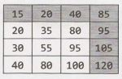
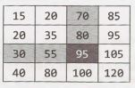
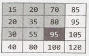
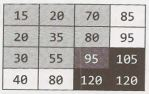
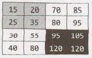

## 10 Sorting and Searching

Understanding the common sorting and searching algorithms is incredibly valuable, as many sorting and searching problems are tweaks of the well-known algorithms. A good approach is therefore to run through the different sorting algorithms and see if one applies particularly well.

For example, suppose you are asked the following question: Given a very large array of Person  objects, sort the people in increasing order of age.

We're given two interesting bits of knowledge here:

1.  It's a large array, so efficiency is very important.
2.  We are sorting based on ages, so we know the values are in a small range.

By scanning  through the various sorting algorithms, we might notice that bucket sort (or radix sort) would be a perfect candidate for this algorithm.  In fact, we can make the buckets small ( just 1   year each) and get O(n) running time.


### Common Sorting Algorithms

Learning (or re-learning) the common sorting algorithms is a great way to boost your performance.  Of the five algorithms  explained below, Merge Sort, Quick Sort and Bucket Sort are the most commonly used in interviews.

**Bubble Sort | Runtime: O(n²) average and worst case. Memory: O(1) .**

In bubble sort, we start at the beginning of the array and swap the first two elements  if the first is greater than the second. Then, we go to the next pair, and so on, continuously making sweeps of the array until it is sorted. In doing so, the smaller items slowly "bubble" up to the beginning of the list.

**Selection Sort | Runtime: O(n²) average and worst case. Memory: O(1) .**

Selection sort is the child's algorithm: simple, but inefficient.  Find the smallest element using a linear scan and move it to the front (swapping it with the front element). Then, find the second smallest and move it, again doing a linear scan. Continue doing this until all the elements are in place.

**Merge Sort | Runtime: O(n log (n)) average and worst case. Memory: Depends.**

Merge sort divides the array in half, sorts each of those halves, and then merges them back together. Each of those halves has the same sorting algorithm applied to it. Eventually, you are merging  just two single­ element arrays. It is the "merge" part that does all the heavy lifting.

The merge method operates by copying all the elements from the target array segment into a helper array, keeping track of where the start of the left and right halves should be (helperleft and helperRight). We then iterate through helper, copying the smaller element from each half into the array. At the end, we copy any remaining elements into the target array.

```java
1   void  mergesort(int[]  array)  {
2       int[]  helper =  new int[array.length];
3       mergesort(array, helper,  0,  array.length -  1);
4   }
5   
6   void  mergesort(int[] array, int[]  helper, int  low,  int high)  {
7       if (low <   high)  {
8           int middle  =  (low  +  high) /    2;
9           mergesort(array, helper,  low,  middle); //  Sort  left half
10          mergesort(array,  helper,  middle + l,   high); //  Sort  right half
11          merge(array, helper,  low,  middle,  high); //  Merge them
12      }
13  }
14  
15  void  merge(int[] array, int[]  helper, int  low,  int middle,  int high)   {
16      /*    Copy both  halves  into a helper array*/
17      for  (int i = low;  i <=  high;   i++)  {
18          helper[i] =  array[i];
19      }
20  
21      int helperleft =  low;
22      int helperRight = middle  +  l;
23      int current =  low;
24  
25      /* Iterate through  helper array.  Compare  the  left and  right half,  copying back
26      * the  smaller element  from the  two halves  into the  original  array. */
27      while  (helperLeft <= middle  &&   helperRight <= high)  {
28          if  (helper[helperleft] <=  helper[helperRight]) {
29              array[current] =  helper[helperleft];
30              helperleft++;
31          }  else {//If right element  is smaller than  left element
32              array[current]  =  helper[helperRight];
33              helperRight++;
34          }
35          current++;
36      }
37  
38      /* Copy  the  rest of  the  left side  of  the  array into the  target array */
39      int  remaining = middle  -  helperleft;
40      for  (int i = 0;  i <=  remaining;   i++)  {
41          array[current +  i] = helper[helperleft +  i];
42      }
43  }
```

You may notice that only the remaining elements from the left half of the helper array are copied into the target array. Why not the right half? The right half doesn't need to be copied because it's already there. 

Consider, for example, an array like [1,   4,  5 ||  2,   8,   9]  (the "||" indicates the partition point). Prior to merging the two halves, both the helper array and the target array segment will end with [ 8,   9]. Once we copy over four elements (1,  4,   5, and 2) into the target array, the [ 8,   9] will still be in place in both arrays. There's no need to copy them over.

The space complexity of merge sort is O(n) due to the auxiliary space used to merge parts of the array.


**Quick Sort | Runtime:** O(n  log(n)) **average**, O(n² ) **worst case. Memory:** O(log(n)).

In quick sort we pick a random element and partition the array, such that all numbers that are less than the partitioning element come before all elements that are greater than it. The partitioning can be performed efficiently through a series of swaps (see below).

If we repeatedly partition the array (and its sub-arrays) around an element, the array will eventually become sorted. However, as the partitioned element is not guaranteed to be the median (or anywhere near the median), our sorting could be very slow. This is the reason for the O(n²) worst case runtime.

```java
1   void  quickSort(int[] arr,  int left,  int right) {
2       int index  =  partition(arr, left,  right);
3       if (left < index  -  1)   { // Sort  left half
4           quickSort(arr, left,  index  - 1);
5       }
5       if (index < right) { // Sort  right half
7           quickSort(arr,  index,   right);
3       }
9   }
10  
11  int partition(int[] arr, int left,  int right) {
12      int pivot   =  arr[(left + right) I 2];  // Pick  pivot  point
13      while  (left <= right) {
14          // Find element  on left that should  be on right
15          while  (arr[left] < pivot) left++;
16  
17          // Find element  on right that should  be on left
18          while  (arr[right] >   pivot) right--;
19  
20          // Swap  elements,   and move  left and right indices
21          if (left <= right) {
22              swap(arr,   left,  right); // swaps elements
23              left++;
24              right--;
25          }
26      }
27      return left;
28  }
```

**Radix Sort | Runtime:** O(kn)  **(see  below)**

Radix sort is a sorting algorithm for integers (and some other data types) that takes advantage of the fact that integers have a finite number of bits. In radix sort, we iterate through each digit of the number, grouping numbers by each digit. For example,  if we have an array of integers, we might first sort by the first digit, so that the Os are grouped together. Then, we sort each of these groupings by the next digit. We repeat this process sorting by each subsequent digit, until finally the whole array is sorted.

Unlike comparison sorting algorithms, which cannot perform better than O(n log(n)) in the average case, radix sort has a runtime of O(kn), where n is the number of elements and k is the number of passes of the sorting algorithm.


### Searching Algorithms

When we think of searching algorithms, we generally think of binary search. Indeed, this is a very useful algorithm to study.

In binary search, we look for an element xin a sorted array by first comparing xto the midpoint of the array. If xis less than the midpoint, then we search the left half of the array. If xis greater than the midpoint, then we search the right half of the array. We then repeat this process, treating the left and right halves as subar­ rays. Again, we compare xto the midpoint of this subarray and then search either its left or right side. We repeat this process until we either find x or the subarray has size O.

Note that although the concept is fairly simple, getting all the details right is far more difficult than you might think. As you study the code below, pay attention to the plus ones and minus ones.

```java
1   int  binarySearch(int[] a,   int x)  {
2       int low  =  0;
3       int high = a.length -  1;
4       int mid;
5   
6       while  (low  <=  high)   {
7           mid =  (low + high) /    2;
8           if (a[mid]  <  x)  {
9               low  =  mid +  1;
10          }  else if  (a[mid] >   x)  {
11              high = mid  -  1;
12          }  else {
13              return mid;
14          }
15      }
16      return -1; //  Error
17  }
18  
19  int  binarySearchRecursive(int[] a,  int x,  int low,  int high)   {
20      if (low  >   high) return  -1; //  Error
21  
22      int mid     (low  + high) /    2;
23      if  (a[mid] <   x) {
24          return  binarySearchRecursive(a, x,  mid + 1,  high);
25      }  else if  (a[mid] >   x) {
26          return  binarySearchRecursive(a, x,  low,  mid -  1);
27      }  else {
28          return mid;
29      }
30  }
```

Potential ways to search a data structure extend beyond binary search, and you would do best not to limit yourself tojust this option. You might, for example, search for a node by leveraging a binary tree, or by using a hash table. Think beyond binary search!

---

Interview Questions

---


**10.1  Sorted Merge:** You are given two sorted arrays, A and B, where A has a large enough buffer at the end to hold B. Write a method to merge B into A in sorted order.
pg149

SOLUTION

---

Since we know that A has enough  buffer at the end, we won't need to allocate additional space. Our logic should involve simply comparing elements of A and B and inserting them in order, until we've exhausted all elements in A and in B.

The only issue with this is that if we insert an element into the front of A, then we'll have to shift the existing elements  backwards to make room for it. It's better to insert elements  into the back of the array, where there's empty space.

The code below does just that. It works from the back of A and B, moving the largest elements to the back of A.

```java
1   void  merge(int[]  a,   int[] b,  int  lastA, int lastB) {
2       int indexA  = lastA - 1; /*   Index  of  last  element in array a*/
3       int indexB  = lastB - 1; /*   Index  of  last element in  array b*/
4       int indexMerged  = lastB + lastA - 1; /*   end  of  merged array*/
5   
6       /*   Merge a  and  b,  starting from  the  last element in each*/
7       while   (indexB  >=  0)  {
8           /*   end  of  a  is >  than  end  of  b*/
9           if (indexA  >=  0 &&   a[indexA]  >   b[indexB])  {
10              a[indexMerged] = a[indexA];//    copy  element
11              indexA - -;
12          }  else {
13              a[indexMerged] = b[indexB]; //  copy  element
14              indexB--;
15          }
16          indexMerged--; //  move indices
17      }
18  }
```

Note that you don't need to copy the contents of A after running out of elements in B. They are already in place.


10.2    Group  Anagrams: Write a method to sort an array ot strings so that all tne anagrnms are next to each other.

SOLUTION

---

This problem asks us to group the strings in an array such that the anagrams appear next to each other. Note that no specific ordering of the words is required, other than this.

We need a quick and easy way of determining if two strings are anagrams of each other. What defines if two words are anagrams of each other? Well, anagrams are words that have the same characters but in different orders. It follows then that if we can put the characters in the same order, we can easily check if the new words are identical.

One way to do this is to just apply any standard sorting algorithm, like merge sort or quick sort, and modify the comparator. This comparator will be used to indicate that two strings which are anagrams of each other are equivalent.

What's the easiest way of checking if two words are anagrams? We could count the occurrences of the distinct characters in each string and return true if they match. Or, we could just sort the string. After all, two words which are anagrams will look the same once they're sorted.

The code below implements the comparator.

```java
1   class AnagramComparator implements  Comparator<String>  {
2       public String sortChars(String s)  {
3           char[]  content =  s.toCharArray();
4           Arrays.sort(content);
5           return new String(content);
6       }
7   
8       public  int  compare(String s1,  String s2)   {
9           return sortChars(s1).compareTo(sortChars(s2));
10      }
11  }
```

Now, just sort the arrays using this compareTo method instead of the usual one.
```
12   Arrays.sort(array, new AnagramComparator()); This algorithm will take O(n   log(n)) time.
```
This may be the best we can do for a general sorting algorithm, but we don't actually need to fully sort the array. We only need to group the strings in the array by anagram.

We can do this by using a hash table which maps from the sorted version of a word to a list of its anagrams. So, for example, acre will map to the list {acre,  race,  care}. Once we've grouped all the words into these lists by anagram, we can then put them back into the array.

The code below implements this algorithm.

```java
1   void  sort(String[]  array) {
2       HashMaplist<String, String>  m aplist =  new HashMaplist<String,  String>();
3   
4       /*  Group words by   anagram  */
5       for  (String s  :   array) {
6           String key =  sortChars(s);
7           maplist.put(key,   s);
8       }
9   
10      /*Convert hash table  to array*/
11      int  index =  0;
12      for (String key :   maplist.keySet()) {
13          ArrayList<String> list = maplist.get(key);
14          for (String t :  list) {
15              array[index] =  t;
16              index++;
17          }
18      }
19  }
20  
21  String  sortChars(String  s)  {
22      char[]  content =  s.toCharArray();
23      Arrays.sort(content);
24      return new  String(content);
25  }
26  
27  /*HashMapList<String, Integer>  is  a  HashMap  that maps  from  Strings to
28  * ArrayList<Integer>.  See   appendix for  implementation. * /
```

You may notice that the  algorithm above is a modification of bucket sort.

**10.3  Search  in Rotated  Array:** Given  a sorted array  of n integers that has  been rotated an unknown number of times,  write  code to find an element in the  array. You may  assume that the  array  was originally sorted in increasing order.

EXAMPLE
```
Input: find 5 in {15, 16,  19,  20,  25,  1,  3,  4,  5,  7,  10,  14} 
Output: 8 (the index of 5 in the  array)
```

SOLUTION

---

If this problem smells  like binary search to you, you're  right!

In classic binary search, we compare x with  the  midpoint to figure  out  if x belongs on the  left or the right side. The  complication here is that the  array  is rotated and may  have  an  inflection point. Consider, for example, the  following two arrays:
```
Arrayl:  {10, 15,  20,      0,   5} 
Array2:  {50,      5,  20,    30,   40}
```

Note  that both arrays have a midpoint of 20, but5appears on the  left side of one and on the  right  side of the  other. Therefore, comparing x with the midpoint is insufficient.

However,  if we  look  a bit  deeper, we  can  see  that one half  of the  array  must be  ordered  normally (in increasing order).  We can  therefore look  at  the  normally ordered half  to  determine whether we  should search the  left or right half.

For example, if we are searching for 5 in Array1, we can look at the  left element (1O) and middle element (20). Since  10 < 20, the  left half must be ordered normally. And, since  5 is not between those, we know  that we must search the  right half.


In Array2,  we can see that since 50 > 20, the right half must be ordered normally. We turn to the middle (20) and right (40) element to check if 5 would fall between them. The value 5 would not; therefore, we search the left half.

The tricky condition is if the left and the middle are identical, as in the example array { 2,   2,   2,   3, 4, 2}. In this case, we can check if the rightmost element is different. If it is, we can searchjust the right side.
Otherwise, we have no choice but to search both halves.

```java
1   int search(int a[], int left,  int right, int x)  {
2       int mid =  (left + right) /    2;
3       if (x  == a[mid])   {//Found  element
4           return mid;
5       }
6       if (right < left) {
7           return -1;
8       }
9   
10      /* Either  the  left or  right half must be normally  ordered.   Find  out  which side
11      * is normally  ordered,   and then  use  the  normally  ordered  half to  figure out
12      * which side   to  search  to  find x. */
13      if (a[left] <  a[mid])   {//Left is normally  ordered.
14          if (x  >=  a[left] &&  x <  a[mid])   {
15              return search(a, left,  mid -  1,  x); //  Search  left
16          }  else {
17              return search(a, mid +  1,  right, x); //  Search  right
18          }
19      }  else if (a[mid] <  a[left]) { //Right  is normally  ordered.
20          if (x  >  a[mid]  &&   x <=  a[right]) {
21              return search(a, mid +  1,  right, x); //  Search  right
22          }  else   {
23              return search(a, left,  mid -  1,  x); //  Search  left
24          }
25      }  else if (a[left] ==  a[mid])   {//Left or  right half is all  repeats
26          if (a[mid]   != a[right]) {//If right is different, search  it
27              return search(a, mid +  1,  right,  x); //  search   right
28          }  else {//Else,  we  have  to  search  both  halves
29              int result =  search(a, left,  mid -  1,  x); //  Search  left
30              if (result == -1)  {
31                  return search(a, mid +  1,  right, x); //  Search  right
32              }  else {
33                  return result;
34              }
35          }
36      }
37      return -1;
38  }
```

This code will run in O(log  n) if all the elements are unique. However, with many duplicates, the algo­ rithm is actually O( n). This is because with many duplicates, we will often have to search both the left and right sides of the array (or subarrays).

Note that while this problem is not conceptually very complex, it is actually very difficult to implement flaw­ lessly. Don't feel bad if you had trouble implementing it without a few bugs. Because of the ease of making off-by-one and other minor errors, you should make sure to test your code very thoroughly.


**10.4  Sorted Search, No Size:**  You are given an array-like data structure Listy which lacks a size method. It does, however, have an elementAt(i) method that returns the element at index i in O(1)  time. If i is beyond the bounds of the data structure,  it returns -1. (For this reason, the data structure only supports positive integers.) Given a Listy which contains sorted, positive integers, find the index at which an element x occurs. If x occurs multiple times, you may return any index.


SOLUTION

---

Our first thought here should be binary search. The problem is that binary search requires us knowing the length of the list, so that we can compare it to the midpoint. We don't have that here.

Could we compute the length? Yes!

We know that elementAt will return -1 when i is too large. We can therefore just try bigger and bigger values until we exceed the size of the list.

But how much bigger? If we just went through the list linearly-1, then 2, then 3, then 4, and so on-we'd wind up with a linear time algorithm. We probably  want something faster than this. Otherwise, why would the interviewer have specified the list is sorted?

It's better to back off exponentially. Try 1, then 2, then 4, then 8, then 16, and so on. This ensures that, if the list has length n, we'll find the length in at most O(log  n) time.


> Why O(log  n)? Imagine we start with pointer q at q   =  1. At each iteration, this pointer q doubles, until q is bigger than the length n. How many times can q double in size before it's bigger than n?Or, in other words, for what value of k does 2   = n?This expression is equal when k  = log n, as this is precisely what log means. Therefore, it will take O(log n) steps to find the length.


Once we find the length, we just perform a (mostly) normal binary search. I say "mostly" because we need to make one small tweak. If the mid point is -1, we need to treat this as a "too big" value and search left. This is on line 16 below.

There's one more little tweak. Recall that the way we figure out the length is by calling elementAt and comparing it to -1. If, in the process, the element is bigger than the value x (the one we're searching for), we'll jump over to the binary search part early.

```java
1   int  search(Listy list, int value)   {
2       int index =  1;
3       while  (list.elementAt(index)  != -1 &&   list.elementAt(index)  <   value)   {
4           index  *= 2;
5       }
6       return  binarySearch(list, value,   index / 2,  index);
7   }
8   
9   int  binarySearch(Listy list,  int value,   int low,  int high)   {
10      int mid;
11  
12      while  (low <= high)   {
13          mid =  (low + high) /  2;
14          int middle  =  list.elementAt(mid);
15          if (middle  >   value  ||  middle  ==   -1)  {
16              high  =  mid - 1;
17          }  else if (middle  <   value)   {
18              low =  mid +  1;
19          }  else {
20              return mid;
21          }
22      }
23      return -1;
24  }
```

It turns out that not knowing the length didn't impact the runtime of the search algorithm. We find the length in O(log n) time and then do the search in O(log n) time. Ouroverall runtime is O(log n),just as it would be in a normal array.


**10.5  Sparse Search:** Given a sorted  array of strings that is interspersed  with empty  strings, write a method to find the location of a given string.

```
EXAMPLE 
Input: ball, {"at", "", "", "", "ball", "", "","car", "", "", "dad", "", ""}
Output: 4
```

SOLUTION

---

If it weren't for the empty strings, we could simply use binary search. We would compare the string to be found, str, with the midpoint of the array, and go from there.

With empty strings interspersed, we can implement a simple modification of binary search. All we need to do is fix the comparison against mid, in case mid is an empty string. We simply move mid to the closest non-empty string.

The recursive code below to solve this problem can easily be modified to be iterative. We provide such an implementation in the code attachment.

```java
1   int  search(String[] strings,  String str, int first,  int last) {
2       if (first > last) return  -1;
3       /* Move  mid to the   middle  */
4       int mid =  (last + first) / 2;
5   
6       /* If mid is empty,  find closest non-empty  string. */
7       if (strings[mid].isEmpty())  {
8           int left = mid -  1;
9           int right = mid +  1;
10          while  (true) {
11              if (left < first &&   right > last) {
12                  return -1;
13              }  else if (right <= last &&  !strings[right].isEmpty()) {
14                  mid =  right;
15                  break;
16              }  else if (left >= first &&  !strings[left].isEmpty()) {
17                  mid =  left;
18                  break;
19              }
20              right++;
21              left - - ;
22          }
23      }
24  
25      /*   Check for   string,  and recurse if necessary*/
26      if (str.equals(strings[mid])) {//Found  it!
27          return mid;
28      }  else if (strings[mid].compareTo(str) <  0)  {//Search  right
29          return search(strings, str,  mid + 1,   last);
30      }  else {//Search  left
31          return search(strings,  str, first, mid -  1);
32      }
33  }
34  
35  int  search(String[] strings,  String str)  {
36      if (strings == null  ||  str == null  || str == "") {
37          return -1;
38      }
39      return search(strings, str,  0,  strings.length -  1);
40  }
```
The worst-case runtime for this algorithm is O(n).  In fact, it's impossible to have an algorithm for this problem that is better than O(n) in the worst case. After all, you could have an array of all empty strings except for one non-empty  string. There is no "smart" way to find this non-empty  string. In the worst case, you will need to look at every element in the array.

Careful consideration should be given to the situation when someone searches for the empty string. Should we find the location (which is an O(n) operation)? Or should we handle this as an error?

There's no correct answer here. This is an issue you should raise with your interviewer. Simply asking this question will demonstrate that you are a careful coder.


**10.6  Sort  Big File:** Imagine you have a 20 GB file with one string per line. Explain how you would sort the file.


SOLUTION

---

When an interviewer gives a size limit of 20 gigabytes, it should tell you something. In this case, it suggests that they don't want you to bring all the data into memory.

So what do we do? We only bring part of the data into memory.

We'll divide the file into chunks, which are x megabytes  each, where x is the amount of memory we have available. Each chunk is sorted separately and then saved back to the file system.

Once all the chunks are sorted, we merge the chunks, one by one. At the end, we have a fully sorted file. This algorithm is known as external sort.


**10.7  Missing Int:** Given an input file with four billion non-negative integers, provide an algorithm to generate an integer that is not contained in the file. Assume you have 1 GB of memory available for this task.

FOLLOW UP

What if you have only 1O MB of memory? Assume that all the values are distinct and we now have no more than one billion non-negative integers. 


SOLUTION

---

There are a total of 2³², or 4 billion, distinct integers possible and 231 non-negative integers. Therefore, we know the input file (assuming it is ints rather than longs) contains some duplicates.

We have 1 GB of memory, or 8 billion bits. Thus, with 8 billion bits, we can map all possible integers to a distinct bit with the available memory. The logic is as follows:

1.  Create a bit vector (BV) with 4 billion bits. Recall that a bit vector is an array that compactly stores boolean values by using an array of ints (or another data type). Each int represents 32 boolean values.
2.  Initialize BV with all 0s.
3.  Scan all numbers (num) from the file and call BV. set (num, 1) .
4.  Now scan again BV from the 0th index.
5.  Return the first index which has a value of 0. 

The following code demonstrates  our algorithm.

```java
1   long  numberOflnts   =  ((long) Integer.MAX_VALUE)  + 1;
2   byte[] bitfield  = new byte   [(int) (numberOfints / 8)];
3   String  filename = .....
4   
5   void  findOpenNumber() throws FileNotFoundException  {
6       Scanner  in =  new Scanner(new  FileReader(filename));
7       while  (in.hasNextint()) {
8           int n  =  in.nextlnt ();
9           /* Finds   the   corresponding number in the   bitfield by using  the   OR  operator to
10           *  set  the   nth  bit of  a  byte   (e.g., 10  would  correspond to  the   2nd bit of
11           *  index   2 in the  byte   array). */
12          bitfield [n  / 8]   |= 1  << (n  %  8);
13      }
14  
15      for (int i =  0;  i <   bitfield.length;  i++)   {
16          for (int j = 0;  j <   8;  j++)   {
17              /* Retrieves the  individual bits  of  each  byte. When  0 bit is found,   print
18               *  the   corresponding value.  */
19              if ((bitfield[i] &  (1  << j)) ==  0)  {
20                  System.out.println (i *  8 + j);
21                  return;
22              }
23          }
24      }
25  }
```

**Follow Up: What if we have only 10 MB memory?**

It's possible to find a missing integer with two passes of the data set. We can divide up the integers into blocks of some size (we'll discuss how to decide on a size later). Let's just assume that we divide up the integers into blocks of 1000. So, block O represents the numbers O through 999, block 1 represents numbers 1000 - 1999, and so on.

Since all the values are distinct, we know how many values we should find in each block. So, we search through  the file and count how many values are between  O and 999, how many are between  1000 and 1999, and so on. If we count only 999 values in a particular range, then we know that a missing int must be in that range.

In the second pass, we'll actually look for which number  in that range is missing. We use the bit vector approach from the first part of this problem. We can ignore any number outside of this specific range.

The question, now, is what is the appropriate block size? Let's define some variables as follows: 

- Let rangeSize be the size of the ranges that each block in the first pass represents. 
- Let arrayS1ze represent the number of blocks in the first pass. Note that arraySize = 2³¹/rangesize since there are 2³¹ non-negative integers.

We need to select a value for rangeSize such that the memory from the first pass (the array) and the second pass (the bit vector) fit.

*First Pass: The Array*

The array in the first pass can fit in 10 megabytes, or roughly 223 bytes, of memory. Since each element in the array is an int, and an int is 4 bytes, we can hold an array of at most about 221 elements. So, we can deduce the following:

``` 
arraySize = 2³¹/rangeS1ze <= 2²¹
rangeSize >= 2³¹/2²¹
rangeSize >= 2¹⁰
```

*Second Pass: The Bit Vector*

We need to have enough space to store rangeSize bits. Since we can fit 2²³ bytes in memory, we can fit 2²⁶ bits in memory.Therefore, we can conclude the following:
```
2¹¹ <=  rangeSize  <=  2²⁶
```
These conditions give us a good amount of "wiggle room;" but the nearer to the middle that we pick, the less memory will be used at any given time.

The below code provides one implementation for this algorithm.
```java
1   int  findOpenNumber(String filename)  throws   FileNotFoundException  {
2       int  rangeSize =   (1  << 20);   // 2A20 bits (2A17  bytes)
3   
4       /*  Get  count   of  number of  values within each  block.  */
5       int[]  blocks = getCountPerBlock(filename,  rangeSize);
6   
7       /*   Find  a  block   with  a  missing value.  */
8       int  blocklndex    findBlockWithMissing(blocks, rangeSize);
9       if (blocklndex  <   0)  return  -1;
10  
11      /*  Create  bit vector for  items  within  this range. */
12      byte[] bitVector =  getBitVectorForRange(filename, blockindex,  rangeSize);
13  
14      /*  Find  a zero  in  the  bit vector */
15      int offset    findZero(bitVector);
16      if (offset < 0)  return -1;
17  
18      /*  Compute  missing  value. */
19      return blockindex   *  rangeSize + offset;
20  }
21  
22  /*  Get count  of  items  within  each range. */
23  int[] getCountPerBlock(String filename,  int  rangeSize)
24  throws  FileNotFoundException  {
25      int arraySize =  Integer.MAX_VALUE  / rangeSize + 1;
26      int[] blocks  =  new int[arraySize];
27  
28      Scanner in =  new Scanner  (new FileReader(filename));
29      while  (in.hasNextint()) {
30          int value    =   in.nextint();
31          blocks[value / rangeSize]++;
32      }
33      in.close();
34      return blocks;
35  }
36  
37  /*  Find a block  whose count  is low.  */
38  int  findBlockWithMissing(int[] blocks,   int  rangeSize) {
39      for  (int i = 0;  i <  blocks.length;  i++)  {
40          if (blocks[i] < rangeSize) {
41              return i;
42          }
43      }
44      return -1;
45  }
46  
47  /*  Create  a bit vector for  the  values  within  a  specific range. */
48  byte[]  getBitVectorForRange(String filename,  int  blockindex, int rangeSize)
49  throws  FileNotFoundException  {
50      int  startRange = blockindex   * rangeSize;
51      int endRange  =  startRange + rangeSize;
52      byte[] bitVector  =  new byte[rangeSize / Byte.SIZE];
53  
54      Scanner  in  = new Scanner(new FileReader(filename));
55      while  (in.hasNextint()) {
56          int value  =  in.nextint();
57          /*  If the  number is inside the  block  that's missing  numbers,  we  record   it */
58          if  (startRange <=     value  &&   value  < endRange) {
59              int offset =  value  -  startRange;
60              int mask  =  (1  << (offset %  Byte.SIZE));
61              bitVector[offset / Byte.SIZE]  |= mask;
62          }
63      }
64      in.close();
65      return bitVector;
66  }
67  
68  /*Find  bit index that  is  0 within  byte.   */
69  int findZero(byte  b) {
70      for  (int i = 0; i <  Byte.SIZE; i++) {
71          int mask = 1  <<  i;
72          if ((b & mask) ==  0) {
73              return  i;
74          }
75      }
76      return  -1;
77  }
78  
79  /*Find a zero within  the bit vector  and return  the index.   */
80  int findZero(byte[]  bitVector) {
81      for  (int  i = 0; i <   bitVector.length; i++) {
82          if (bitVector[i] != ~0) {//If not all ls
83              int bitindex = findZero(bitVector[i]);
84              return  i * Byte.SIZE + bitindex;
85          }
86      }
87      return  -1;
88  }
```

What if, as a follow up question, you are asked to solve the problem with even less memory? In this case, we can do repeated passes using the approach from the first step. We'd first check to see how many integers are found within each sequence of a million elements. Then, in the second pass, we'd check how many inte­ gers are found in each sequence  of a thousand elements. Finally, in the third pass, we'd apply the bit vector.


**10.8  Find Duplicates:** You have an array with all the numbers from 1 to N, where  N is at most 32,000. The array may have duplicate entries and you do not know what N is. With only 4 kilobytes of memory
available, how would you print all duplicate elements in the array?


SOLUTION

---

We have 4 kilobytes of memory which means we can address up to 8 *  4 * 2¹⁰ bits. Note that 32 * 2¹⁰ bits is greater than 32000. We can create a bit vector with 32000 bits, where each bit represents one integer.

Using this bit vector, we can then iterate through the array, flagging  each element  v by setting bit v to 1.

When we come across a duplicate element, we print it.
```java
1   void checkDuplicates(int[]   array)  {
2       BitSet  bs = new   BitSet(32000);
3       for  (int i = 0; i <  array.length;   i++) {
4           int num  = array[i];
5           int num0 = num  -  1;   //bitset starts  at 0, numbers  start  at 1
6           if (bs.get(num0)) {
7               System.out.println(num);
8           }  else  {
9               bs.sgt(num0);
10          }
11      }
12  }
13  
14  class  BitSet {
15      int[] bitset;
16  
17      public BitSet(int  size)  {
18          bitset =  new  int[(size >>  5)   +  1); // divide by  32
19      }
20  
21      boolean get(int  pos) {
22          int wordNumber  =  (pos >>  5);  // divide by  32
23          int bitNumber =  (pos &  0x1F);  // mod 32
24          return (bitset[wordNumber]  &   (1 <<  bitNumber))  !=  0;
25      }
26  
27      void set(int  pos)  {
28          int wordNumber  =  (pos >>  5);  // divide by  32
29          int bitNumber =  (pos &  0x1F);  // mod 32
30          bitset[wordNumber]   |=  1  <<  bitNumber;
31      }
32  }
```

Note that while this isn't an especially difficult problem, it's important to implement this cleanly. This is why we defined our own bit vector class to hold a large  bit vector. If our interviewer lets us (she may or may not), we could have of course used Java's  built in BitSet class.


**10.9  Sorted  Matrix Search:**  Given an M  x  N matrix  in which  each row and  each column is sorted in ascending order, write a method to find an element.


SOLUTION

---

We can approach this in two  ways: a more naive  solution that only takes advantage of part  of the  sorting, and  a more optimal way that takes advantage of both parts of the  sorting.

**Solution #1: Naive Solution**

As a first approach, we can  do binary  search on every  row to find the  element. This algorithm will be O(M log( N)), since there are M rows and  it takes O( log( N)) time to search each one. This is a good approach to mention to your interviewer before you proceed with generating a better algorithm.

To develop an algorithm, let's start  with a simple example.

|    |    |     |     |
| -- | -- | --  | --  |
| 15 | 20 | 40  | 85  |
| 20 | 35 | 80  | 95  |
| 30 | 55 | 105 | 105 |
| 40 | 80 | 100 | 120 |

Suppose we are searching for the  element 55. How can we identify where it is?

If we look at the  start  of a row or the  start  of a column, we can start to deduce the  location. If the  start  of a column is greater than 55, we know  that 55 can't  be in that column, since  the  start  of the  column is always the  minimum element. Additionally, we know  that 55 can't be in any columns on the  right,  since  the  first element of each column must increase in size  from  left  to  right.  Therefore, if the  start of the  column is greater than the element x that we are searching for, we know  that we need to move further to the  left.

For rows, we use identical logic. If the  start of a row is bigger than x, we know  we need to move upwards.

Observe that we can also make a similar conclusion by looking at the ends of columns or rows. If the  end of a column  or row is less than x, then we know that we must move down  (for rows) or to the right (for columns) to find x. Thisis because the end is always the maximum element.

We can bring these observations together into a solution.1he observations are the following:

- If the start of a column is greater than x, then xis to the left of the column. 
- If the end of a column is less than x, then x is to the right of the column.
- If the start of a row is greater than x, then x is above that row. 
- If the end of a row is less than x, then x is below that row.

We can begin in any number  of places, but let's begin  with looking  at the starts of columns.

We need to start with the greatest column and work our way to the left. This means that our first element for comparison is array[0][c-1], where c is the number of columns. By comparing the start of columns to x (which is 55), we'll find that x must be in columns 0, 1, or 2. We will have stopped at array[0][2].

This element may not be the end of a row in the full matrix, but it is an end of a row of a submatrix. The same conditions apply. The value at array[0][2], which  is 40, is less than 55, so we know we can move downwards.

We now have a submatrix to consider that looks like the following  (the gray squares have been eliminated).



We can repeatedly apply these conditions to search for 55. Note that the only conditions we actually use are conditions 1  and 4.

The code below implements this elimination algorithm.

```java
1   boolean findElement(int[][] matrix, int elem) {
2       int row =  0;
3       int col =  matrix[0].length - 1;
4       while (row <   matrix.length &&   col >= 0)  {
5           if (matrix[row][col] ==  elem) {
6               return true;
7           } else if (matrix[row][col] >   elem) {
8               col--;
9           } else {
10              row++;
11          }
12      }
13      return false;
14  }
```

Alternatively, we can apply a solution that more directly looks like binary search. The code is considerably more complicated, but it applies many of the same learnings.


**Solution #2: Binary Search**

Let's again look at a simple example.

|    |    |     |     |
| -- | -- | --  | --  |
| 15 | 20 | 70  | 85  |
| 20 | 35 | 80  | 95  |
| 30 | 55 | 95  | 105 |
| 40 | 80 | 100 | 120 |

We want to be able to leverage the sorting  property  to more efficiently  find an element. So, we might ask ourselves, what does the unique ordering property of this matrix imply about where an element might be located?

We are told that every row and column is sorted. This means that element a[i][j] will be greater than the elements in row i between columns O and j -  1 and the elements in column j between rows O and i - 1.

Or, in other words:
```
a[i][0]  <=  a[i][1]  <=  ... <=  a[i][j-1]  <=  a[i][j]
a[0][j]  <=  a[1][j]  <=  ... <=  a[i-l][j]  <=  a[i][j]
```
Looking at this visually, the dark gray element below is bigger than all the light gray elements.



The light gray elements also have an ordering to them: each is bigger than the elements to the left of it, as well as the elements above it. So, by transitivity, the dark gray element is bigger than the entire square.



This means that for any rectangle we draw in the matrix, the bottom right hand corner will always be the biggest.

Likewise, the top left hand corner will always be the smallest. The colors below indicate what we know about the ordering of elements (light gray< dark gray  < black):



Let's return to the original problem: suppose we were searching for the value 85. If we look along the diag­onal, we'll find the elements 35 and 95. What does this tell us about the location of 85?




85 can't be in the black area, since 95 is in the upper left hand corner and is therefore the smallest element in that square.

85 can't be in the light gray area either, since 35 is in the lower right hand corner ofthat square.

85 must be in one of the two white areas.

So, we partition our grid into four quadrants and recursively search the lower left quadrant and the upper right quadrant. These, too, will get divided into quadrants and searched.

Observe that since the diagonal is sorted, we can efficiently search it using binary search. 

The code below implements this algorithm.

```java
1   Coordinate   findElement(int[][]  matrix, Coordinate  origin,  Coordinate  dest, int x) {
2       if  (!origin. inbounds(matrix) ||  ! dest.inbounds(matrix))  {
3           return null;
4       }
5       if (matrix[origin.row][origin.column] == x) {
6           return origin;
7       }  else if  (!origin.isBefore(dest)) {
8           return null;
9       }
10  
11      /* Set  start to  start of  diagonal and end to  the  end of  the  diagonal. Since  the
12      * grid   may  not  be square,   the  end of  the  diagonal may  not  equal  dest. */
13      Coordinate  start = (Coordinate) origin.clone();
14      int  diagDist =  Math.min(dest.row  -  origin.row,  dest.column   -  origin.column);
15      Coordinate  end =  new Coordinate(start.row +  diagDist,  start.column + diagDist);
16      Coordinate  p =  new Coordinate(0,  0);
17      
18      /* Do  binary  search  on the  diagonal,  looking  for  the  first element>  x */
19      while  (start.isBefore(end)) {
20          p.setToAverage(start,  end);
21          if (x > matrix[p.row][p.column]) {
22              start.row =  p.row  + 1;
23              start.column =  p.column + 1;
24          }  else {
25              end.row  =  p.row  -  1;
26              end.column  =  p.column  -  1;
27          }
28      }
29      
30      /* Split the  grid   into quadrants. Search  the  bottom left and the  top  right. */
31      return partitionAndSearch(matrix, origin,  dest,  start, x);
32   }
33  
34   Coordinate  partitionAndSearch(int[][]  matrix, Coordinate   origin, Coordinate  dest,
35   Coordinate   pivot, int x)  {
36       Coordinate  lowerLeftOrigin =  new Coordinate(pivot.row, origin.column);
37       Coordinate  lowerLeftDest =  new Coordinate(dest.row,  pivot.column -  1);
38       Coordinate   upperRightOrigin  =  new Coordinate(origin.row,  pivot.column);
39       coordinate upperRightDest   =  new Coordinate(pivot.row -  1,  dest.column);
40   
41       Coordinate   lowerLeft =  findElement(matrix,  lowerLeftOrigin,  lowerLeftDest, x);
42       if  (lowerleft ==  null) {
43           return  findElement(matrix,  upperRightOrigin, upperRightDest, x);
44       }
45       return lowerleft;
46   }
47   
48   Coordinate   findElement(int[][] matrix,   int x)  {
49       Coordinate  origin =  new Coordinate(0,  0);
50       coordinate dest   =  new Coordinate(matrix.length  -  1,  matrix[0].length  -  1);
51       return  findElement(matrix, origin,  dest,  x);
52   }
53   
54   public class Coordinate  implements  Cloneable  {
55       public int row,  column;
56       public  Coordinate(int r,  int  c)  {
57           row =  r;
58           column =  c;
59       }
60   
61       public   boolean  inbounds(int[][]  matrix) {
62           return  row >=  0 &&   column >=  0 &&
63           row <  matrix.length &&   column <  matrix[0].length;
64       }
65   
66       public boolean  isBefore(Coordinate p)  {
67           return row <=  p.row  &&   column <=  p.column;
68       }
69   
70       public Object  clone() {
71           return new Coordinate(row,  column);
72       }
73   
74       public   void  setToAverage(Coordinate  min,  Coordinate  max) {
75           row =  (min.row  + max.row) /  2;
76           column =  (min.column + max.column) /  2;
77       }
78   }
```

If you read all this code and thought, "there's no way I  could do all this in an interview!" you're probably right. You couldn't.  But, your performance on any problem is evaluated compared to other candidates on the same problem. So while you couldn't implement all this, neither could they. You are at no disadvantage when you get a tricky problem like this.

You help  yourself out a  bit by separating code  out  into other methods. For  example, by pulling partitionAndSearch out into its own method, you will have an easier time outlining key aspects of the code. You can then come back to fill in the body for partitionAndSearch if you have time.


**10.10  Rank from  Stream:**   Imagine you are reading in a stream of integers. Periodically,  you wish to be able to look up the rank of a number x (the  number of values less than or equal to x). Implement the data structures and algorithms to support these operations. That is, implement the method track(int x), which is called when each number is generated, and the method getRankOfNumber(int  x), which returns the number of values less than or equal to x (not including x itself).
```
EXAMPLE
Stream(in order of appearance):5,    1,   4,   4,  5,  9,   7,   13,   3 
getRankOfNumber(l) =  0
getRankOfNumber(3) =  1
getRankOfNumber(4) =  3
```

SOLUTION

---

A relatively  easy way to implement this would be to have an array that holds all the elements in sorted order. When a new element comes in, we would need to shift the other elements to make room. Imple­ menting getRankOfNumber  would be quite efficient, though. We would simply perform a binary search for n, and return the index.

However, this is very inefficient for inserting elements (that is, the track(int  x) function). We need a data structure which is good at keeping relative ordering, as well as updating when we insert new elements. A binary  search tree can dojust that.

Instead of inserting elements into an array, we insert elements into a binary search tree. The method track(int  x) will run in O(log  n) time, where n is the size of the tree (provided, of course, that the tree is balanced).

To find the rank of a number, we could do an in-order traversal, keeping a counter as we traverse. The goal is that, by the time we find x, counter will equal the number of elements less than x.

As long as we're moving left during searching for x, the counter won't change. Why? Because all the values we're skipping on the right side are greater than x. After all, the very smallest element (with rank of 1) is the leftmost node.

When we move to the right though, we skip over a bunch of elements on the left. All of these elements are less than x, so we'll need to increment counter by the number of elements in the left subtree.

Rather than counting the size of the left subtree(which would be inefficient), we can track this information as we add new elements to the tree.

Let's walk through an example on the following tree. In the below example, the value in parentheses indi­cates the number of nodes in the left subtree (or, in other words, the rank of the node relative to its subtree).

```
                  20(4)
                 /     \
           15(3)        25(2)
         /       \     /
    10(1)         23(0)
    /    \      /      \
5(0)      13(0)        24(0)
```

Suppose we want to find the rank of 24 in the tree above. We would compare 24 with the root 20, and find that 24 must reside on the right. The root has 4 nodes in its left subtree, and when we include the root itself, this gives us five total nodes smaller than 24. We set counter to 5.

Then, we compare 24 with node 25 and find that 24 must be on the left. The value of counter does not update, since we're not"passing over"any smaller nodes. The value of c ounter is still 5.

Next, we compare 24 with node 23, and find that 24 must be on the right. Counter gets incremented by just 1   (to 6), since 23 has no left nodes.

Finally, we find 24 and we return c ounter: 6. 

Recursively, the algorithm is the following:
```java
1   int getRank(Node  node,  int x)  {
2       if x is  node.data, return node.leftSize()
3       if x is  on  left of  node,   return  getRank(node.left,  x)
4       if x is  on  right of  node,   return node.leftSize() + 1 + getRank(node.right,  x)
5   }
```
The full code for this is below.
```java
1   RankNode root =  null;
2   
3   void  track(int number)  {
4       if (root == null) {
5           root =  new RankNode(number);
6       }  else {
7           root.insert(number);
8       }
9   }
10  
11  int getRankOfNumber(int   number)  {
12      return root.getRank(number);
13  }
14  
15  
16  public  class RankNode {
17      public int left_size  =  0;
18      public RankNode  left,  right;
19      public int  data   =  0;
20      public RankNode(int   d)  {
21          data   =  d;
22      }
23  
24      public void  insert(int d)  {
25          if (d  <=  data) {
26              if (left !=  null)  left.insert(d);
27              else left = new RankNode(d);
28              left_size++;
29          }  else {
30              if (right  !=  null)  right.insert(d);
31              else right  = new  RankNode(d);
32          }
33      }
34  
35      public int getRank(int ct)  {
36          if (d ==  data) {
37              return left_size;
38          }  else if (d <   data) {
39              if (left ==  null)  return -1;
40              else return left.getRank(d);
41          }  else {
42              int  right_rank =  right  ==  null ?  -1 :    right.getRank(d);
43              if (right_rank ==  -1) return -1;
44              else return left_size +  1 +  right_rank;
45          }
46      }
47  }
```

The track  method and the getRankOfNumber method will both operate in O(log N) on a balanced tree and O(N) on an unbalanced tree.

Note how we've handled the case in which d is not found in the tree. We check for the -1 return  value, and, when we find  it, return -1 up the tree. It is important that you handle cases like this.


**10.11   Peaks and  Valleys:**  In an array of integers, a "peak" is an element which is greater than or equal to the adjacent integers and a "valley" is an element which is less than or equal to the adjacent integers. For example, in the array {5, 8, 6, 2, 3, 4, 6}, {8, 6} are peaks and {5, 2} are valleys. Given an array of integers, sort the array into an alternating sequence  of peaks and valleys.
```
EXAMPLE
Input:  {5, 3, 1, 2, 3} 
Output: {5, 1, 3, 2, 3}
```

SOLUTION

---

Since this problem asks us to sort the array in a particular way, one thing we can try is doing a normal sort and then "fixing" the array into an alternating sequence of peaks and valleys.

**Suboptimal Solution**

Imagine we were given an unsorted array and then sort it to become the following:
```
0      1      4      7      8      9
```

We now have an ascending list of integers.

How can we rearrange this into a proper alternating sequence  of peaks and valleys? Let's walk through  it and try to do that.

- The 0 is okay.
- The 1 is in the wrong place. We can swap it with either the 0 or 4. Let's swap it with the 0.
```
1     0     4     7     8     9
```
- The 4 is okay.
- The 7 is in the wrong place. We can swap it with either the 4 or the 8. Let's swap it with the 4.
```
1       0     7     4     8     9
```
- The 9 is in the wrong place. Let's swap it with the 8.
```
1     0     7     4     9     8
```

Observe that there's nothing special about the array having these values. The relative order of the elements matters, but all sorted arrays will have the same relative order. Therefore, we can take this same approach on any sorted array.

Before coding, we should clarify the exact algorithm, though.

- Sort the array in ascending order.
- Iterate through the elements, starting from index 1  (not 0) and jumping two elements at a time.
- At each element, swap it with the previous element. Since every three elements appear in the order small <=  medium  <=  large, swapping these elements will always put medium as a peak: medium <=  small <=  large.

This approach will ensure that the peaks are in the right place: indexes 1, 3, 5, and so on. As long as the odd­ numbered  elements (the peaks) are bigger than the adjacent elements, then the even-numbered elements (the valleys) must be smaller than the adjacent elements.

The code to implement this is below.

```java
1   void  sortValleyPeak(int[] array) {
2       Arrays.sort(array);
3       for (int i = 1;  i <  array.length;  i += 2)  {
4           swap(array,  i -  1,   i);
5       }
6   }
7   
8   void  swap(int[] array, int left, int right) {
9       int temp =  array[left];
10      array[left] = array[right];
11      array[right] =  temp;
12  }
```

This algorithm runs in O(n log n)  time.

**Optimal Solution**

To optimize past the prior solution, we need to cut out the sorting step. The algorithm must operate on an unsorted array.

Let's revisit an example.
```
9      1      0      4      8      7
```
For each element,  we'll look at the adjacent  elements. Let's imagine some sequences. We'll just use the numbers 0, 1  and 2. The specific values don't matter.
```
0   1   2
0   2   1   //peak
1   0   2
1   2   0   //peak
2   1   0
2   0   1
```

If the center element needs to be a peak, then two of those sequences work. Can we fix the other ones to make the center element a peak?

Yes. We can fix this sequence by swapping the center element with the largest adjacent element.
```
0   1   2   -> 0    2   1           
0   2   1       // peak 
1   0   2   -> 1      2     0
1   2   0       // peak
2   1   0   -> 1    2   0
2   0   1   -> 0    2   1
```
As we noted before, if we make sure the peaks are in the right place then we know the valleys are in the right place.


> We should be a little cautious here. Is it possible that one of these swaps could "break" an earlier part of the sequence  that we'd already processed? This is a good thing to worry about, but it's not an issue here. If we're swapping middle with left, then left is currently a valley. Middle is smaller than left, so we're putting an even smaller element as a valley. Nothing will break. All is good!


The code to implement this is below.
```java
1   void  sortValleyPeak(int[] array) {
2       for (int i =    1;  i <   array.length;  i += 2)  {
3           int  biggestindex = maxindex(array,  i -  1,   i, i + 1);
4           if (i != biggestindex) {
5               swap(array,  i,  biggestindex);
6           }
7       }
8   }
9   
10  int  maxindex(int[] array, int  a,   int b,  int c)  {
11      int len = array.length;
12      int aValue = a >= 0  &&   a  <   len ?  array[a] : Integer.MIN_VALUE;
13      int bValue = b >=  0 &&   b  <   len ?  array[b] : Integer.MIN_VALUE;
14      int cValue = c >=  0 &&   c  <   len ?  array[c] : Integer.MIN_VALUE;
15  
16      int max =  Math.max(aValue,   Math.max(bValue,   cValue));
17      if (aValue ==  max) return a;
18      else if (bValue == max) return b;
19      else return c;
20  }
```

This algorithm takes O(n) time.


