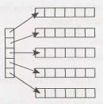

12 C and C++
============

A good interviewer won't demand that you code in a language you don't profess to know. Hopefully, if you're asked to code in C++, it's listed on your resume. If you don't remember  all the APls, don't worry-most interviewers (though not all) don't care that much. We do recommend, however, studying up on basic C++ syntax so that you can approach these questions with ease.


### Classes and Inheritance

Though C++ classes have similar characteristics to those of other languages, we'll review some of the syntax below.

The code below demonstrates the implementation of a basic class with inheritance.

```c++
1   #include <iostream>
2   using namespace  std;
3   
4   #define NAME_SIZE  50 // Defines a macro
5   
6   class Person {
7   int id;  // all members  are private  by default
8       char name[NAME_SIZE];
9   
10  public:
11      void aboutMe() {
12          cout << "I  am  a person.";
13      }
14  } ;
15  
16  class  Student : public  Person {
17  public:
18      void aboutMe() {
19          cout <<  "I  am  a student.";
20      }
21  };
22  
23  int main() {
24      Student *  p = new   Student();
25      p->aboutMe(); // prints  "I  am  a student."
26      delete  p; // Important! Make sure to delete  allocated  memory.
27      return  0;
28  }
```

All data members and  methods are  private by  default in C++. One  can  modify  this  by introducing the keyword public.


### Constructors and Destructors

The constructor of a class  is automatically called  upon an object's creation. If no constructor is defined, the compiler automatically generates one  called  the  Default  Constructor.  Alternatively, we can define our own constructor.

If you just need to initialize primitive types,  a simple way to do it is this:

```C
1   Person(int a) {
2        id =  a;
3   }
```

This works for primitive types,  but  you might instead want to do this:

```C
1   Person(int a) : id(a) {
2   ...
3   }
```

The  data member id  is assigned before the  actual object is created and  before the  remainder of the constructor code is called. This approach is necessary when the  fields are constant or class types.

The destructor cleans up upon object deletion and  is automatically called  when an object is destroyed. It cannot take  an argument as we don't explicitly call a destructor.

```C
1   ~Person() {
2        delete  obj;   //  free  any  memory   allocated  within  class 
3   }
```


### Virtual  Functions

In an earlier example, we defined p to be of type Student:

```c++
1   Student *  p  =  new  Student();
2   p->aboutMe();
```

What would happen if we defined p to be a Person\*, like so?

```c++
1   Person *  p  =  new  Student();
2   p->aboutMe();
```

In this case, "I   am  a  person" would be printed instead. This is because the function aboutMe is resolved at compile-time, in a mechanism known as static binding.

If we want to ensure that the  Student's implementation of about Me is called, we can define aboutMe in the  Person class to be virtual.

```c++
1   class  Person {
2       ...
3       virtual void  aboutMe() {
4           cout <<  "I am a  person.";
5       }
6   };
7   
8   class  Student :   public  Person {
9   public:
10      void  aboutMe() {
11          cout <<  "I am a  student.";
12      }
13  } ;
```

Another usage for virtual functions is when we can't (or don't want to) implement a method for the parent class. Imagine, for example, that we want Student and Teacher to inherit from Person so that we can implement a common method such as addCourse(string  s). Calling addCourse on Person, however, wouldn't make much sense since the implementation depends on whether the object is actually a Student or Teacher.

In this case, we might want addCourse to be a virtual function defined within Person, with the imple­mentation being left to the subclass.

```c++
1   class Person {
2       int  id;// all members  are private by default
3       char name[NAME_SIZE];
4   public:
5       virtual  void aboutMe() {
6           cout <<  "I  am a  person." <<  endl;
7       }
8       virtual  bool addCourse(string s) =  0;
9   };
10  
11  class Student : public Person {
12  public:
13      void aboutMe() {
14          cout <<  "I  am a  student." <<  endl;
15      }
16  
17      bool addCourse(string s) {
18          cout <<  "Added course " << s <<  "to student." <<  endl;
19          return true;
20      }
21  };
22  
23  int  main() {
24      Person *  p  = new  Student();
25      p->aboutMe();  //  prints  "I am a  student."
26      p->addCourse("History");
27      delete p;
28  }
```

Note that by defining addCourse to be a "pure virtual function;· Person is now an abstract class and we cannot instantiate it.


### Virtual Destructor

The virtual function naturally introduces the concept of a "virtual destructor". Suppose we wanted to imple­ment a destructor method for Person and Student. A naive solution might look like this:

```c++
1   class  Person {
2   public:
3       ~Person() {
4           cout << "Deleting a person." << endl;
5       }
6   };
7   
8   class Student  :  public Person   {
9   public:
10      ~student() {
11          cout << "Deleting  a student."  << endl;
12      }
13  } ;
14  
15  int  main() {
16      Person *  p   =  new  Student();
17      delete  p; //  prints "Deleting  a person."
18  }
```

As in the earlier example, since p is a Person, the destructor for the Person class is called. This is problem­atic because the memory for Student may not be cleaned up.

To fix this, we simply define the destructor  for Person to be virtual.

```c++
1   class  Person {
2   public:
3       virtual ~Person() {
4           cout << "Deleting  a person."  << endl;
5       }
6   };
7   
8   class  Student :  public  Person {
9   public:
10      ~student() {
11          cout << "Deleting  a student."  < <   endl;
12      }
13  } ;
14  
15  int  main() {
16      Person *  p  =  new  Student();
17      delete  p;
18  }
```

This will output the following: 
```
Deleting  a student.
Deleting  a person.
```

### Default Values

Functions can specify default values, as shown below. Note that all default parameters must be on the right side of the function declaration,  as there would be no other way to specify how the parameters line up.

```c++
1   int func(int a, int b =  3) {
2       X =  a;
3       y =  b;
4       return  a +  b;
5   }
6   
7   w = func(4);
8   z = func(4,  5);
```

### Operator Overloading

Operator overloading enables us to apply operators like + to objects that would otherwise not support these operations. For example, if we wanted to merge two BookShelves into one, we could overload the + operator as follows.

    1      Bookshelf  BookShelf::operator+(BookShelf  &other)  {  ... }


### Pointers and References

A pointer holds the  address of a variable and  can  be used to perform any operation that could be directly done on the  variable,  such  as accessing and  modifying it.

Two pointers can  equal each other,  such  that changing one's  value  also changes the  other's value  (since they, in fact, point to the  same address).

```
1   int *  p = new  int;
2   *p  =  7;   
3   int *  q = p;
4   *p = 8  
5   cout << *q;  // prints  8
```

Note  that the  size of a pointer varies  depending on the  architecture: 32 bits on a 32-bit  machine and  64 bits on a 64-bit  machine. Pay attention to this difference, as it's common for interviewers to ask exactly  how much space a data structure takes  up.


#### References

A reference is another name (an alias) for a pre-existing object and  it does not have memory of its own. For example:

```
1     int a  =  5;
2     int & b =  a;
3     b = 7;
4     cout << a; // prints  7 
```

In line 2 above, b is a reference to a; modifying b will also modify  a.

You cannot create a reference without specifying where in memory it refers to. However, you can create a free-standing reference as shown below:
```
1  /* allocates  memory  to store 12  and  makes   b  a  reference to this
2   * piece of memory.   */
3  const int & b  =  12;
```
Unlike pointers, references cannot be null and  cannot be reassigned to another piece of memory.

#### Pointer Arithmetic

One  will often see programmers perform addition on a pointer, such  as what you see  below:

```
1      int *  p  =  new  int[2];
2      p[0] =   0;
3      p[1] =  1;
4      p++;
5      cout <<  *p;  // Outputs  1
```

Performing p++ will skip ahead by  sizeof(int) bytes, such  that the  code outputs 1. Had p  been of different type, it would skip ahead as many  bytes as the  size of the  data structure.


### Templates

Templates are a way of reusing code to apply the same class to different data types. For example, we might have a list-like data structure which we would like to use for lists of various types. The code below implements this with the ShiftedList class.

```c++
1   template  <class T>class ShiftedList  {
2       T* array;
3       int  offset,  size;
4   public:
5       ShiftedList(int sz)  :   offset(0),  size(sz) {
6           array =  new  T[size];
7       }
8   
9       ~ShiftedList()  {
10          delete  [] array;
11      }
12  
13      void  shiftBy(int  n)  {
14          offset =  (offset +  n) %  size;
15      }
16  
17      T  getAt(int i) {
18          return array[convertIndex(i)];
19      }
20  
21      void  setAt(T  item,  int i) {
22          array[convertIndex(i)]  =  item;
23      }
24  
25  private:
26      int  convertIndex(int i) {
27          int index  =  (i -  offset) %  size;
28          while  (index  <   0)  index  +=  size;
29          return  index;
30      }
31  };
```

---

Interview Questions

---
 
**12.1    Last K Lines:** Write a method to print the last K lines of an input file using C++.

SOLUTION

---

One brute force way could be to count the number of lines (N) and  then print from N-K to Nth line. But this requires two reads of the file, which is unnecessarily costly. We need a solution which allows us to read just once and be able to print the last K lines.

We can allocate an array for all K lines and the last K lines we've read in the array. , and so on. Each time that we read a new line, we purge the oldest line from the array.

But-you might ask-wouldn't this require shifting elements in the array, which is also very expensive?  No, not if we do it correctly. Instead of shifting the array each time, we will use a circular array.

With a circular array, we always replace  the oldest item when we read a new line. The oldest item is tracked in a separate variable, which adjusts as we add new items.

The following is an example of a circular array: 
```
step  1 (initially): array    {a,   b,  c,   d,  e, f}. p = 0
step  2 (insert g):  array    {g,   b,  c,   d,  e, f}. p = 1    
step  3 (insert h):  array    {g,   h,  c,   d,  e, f}. p = 2 
step  4 (insert i):  array    {g,   h,  i,   d,  e, f}. p = 3
```

The code below implements this algorithm.
 
```c++
1   void  printlast10Lines(char*  fileName)  {
2       const int K =  10;
3       ifstream  file (fileName);
4       string L[K];
5       int size   = 0;
6   
7       /* read file  line by   line into circular array  */
8       /* peek()  so an EOF   following  a line ending is not  considered a  separate  line */
9       while (file.peek()  !=  EOF) {
10          getline(file,   L[size % K]);
11          size++;
12      }
13  
14      /* compute  start of  circular array,   and the  size  of  it */
15      int start =  size >  K ?   (size %  K)  :   0;
16      int count =  min(K, size);
17  
18      /* print  elements in the order they were   read */
19      for (int i =  0;  i <  count;  i++)  {
20          cout <<  L[(start +  i) %   K]  <<  endl;
21      }
22  }
```

*This solution will require reading in the whole file, but only ten lines will be in memory at any given point.*

**12.2     Reverse String:** Implement a function void  reverse(char* str) in C or C++ which reverses a null-terminated string.

SOLUTION

---

This is a classic interview question. The only "gotcha" is to try to do it in place,  and to be careful for the  null character.

We will implement this in C.

```c++
1   void reverse(char *str)  {
2       char* end =  str;
3       char tmp;
4       if (str) {
5           while (*end)  {/*  find end   of the string*/
6               ++end;
7           }
8           --end; /* set one   char back, since last  char is  null  */
9   
10          /* swap  characters from   start  of string with the end   of the string, until the
11          *  pointers meet   in middle. */
12          while (str <  end)  {
13              tmp =  *str;
14              *str++ =  *end;
15              *end-- =  tmp;
16          }
17      }
18  }
```

This is just one  of many  ways to implement this solution. We could even implement this code recursively (but we wouldn't recommend it).


**12.3  Hash Table vs STL Map:**  Compare and contrast a hash table and an STL map.  How is a hash table implemented? If the number of inputs is small, which data structure options can be used instead of
a hash table?

SOLUTION

---

In a hash  table, a value  is stored by calling  a hash  function on a key. Values are not  stored in sorted order. Additionally, since  hash tables use  the  key to find  the  index that will store the  value,  an insert  or lookup can be done in amortized O(1) time (assuming few collisions  in the  hash table).  In a hash table, one must also handle potential collisions. This is often done by chaining, which means to create a linked list of all the values  whose keys map  to a particular index.

An STL map inserts the key/value pairs into a binary search tree based on the keys. There is no need to handle collisions, and, since the tree is balanced, the insert and lookup time is guaranteed to be O(log N).

**How is a hash table implemented?**

A hash table is traditionally implemented with an array of linked lists. When we want to insert a key/value pair, we map the key to an index in the array using a hash function. The value is then inserted into the linked list at that position.

Note that the elements in a linked list at a particular index of the array do not have the same key. Rather, hashFunction(key) is the same for these values. Therefore, in order to retrieve the value for a specific key, we need to store in each node both the exact key and the value.

To summarize, the hash table will be implemented with an array of linked lists, where each node in the linked list holds two pieces of data: the value and the original key. In addition, we will want to note the following design criteria:

1. We want to use a good hash function to ensure that the keys are well distributed. If they are not well distributed, then we would get a lot of collisions and the speed to find an element would decline.

2. No matter how good our hash function is, we will still have collisions, so we need a method for handling them. This often means chaining via a linked list, but it's not the only way.

3. We may also wish to implement  methods  to dynamically increase or decrease  the  hash table  size depending on capacity. For example, when the ratio of the number of elements to the table size exceeds a certain threshold, we may wish to increase the hash table size. This would mean creating a new hash table and transferring the entries from the old table to the new table. Because this is an expensive operation, we want to be careful to not do it too often.

**What  can be used instead of a hash table, if the number of inputs  is small?**

You can use an STL map or a binary tree. Although this takes O(log (n)) time, the number of inputs may be small enough to make this time negligible.

 
**12.4    Virtual Functions:** How do virtual functions work in C++?

SOLUTION

---

A virtual function depends on a "vtable" or "Virtual Table". If any function of a class is declared to be virtual, a vtable is constructed which stores addresses of the virtual functions of this class. The compiler also adds a hidden vptr variable in all such classes which points to the vtable of that class. If a virtual function is not overridden in the derived class, the vtable of the derived class stores the address of the function in its parent class. The vtable is used to resolve the address of the function when the virtual function is called. Dynamic binding in C++ is performed through the vtable mechanism.

Thus, when we assign the derived class object to the base class pointer, the vptr variable points to the vtable of the derived class. This assignment ensures that the most derived virtual function gets called.

Consider the following code.

```c++
1   class Shape  {
2   public:
3       int edge_length;
4       virtual int circumference()   {
5           cout <<  "Circumference of  Base   Class\n";
6           return  0;
7       }
8   };
9   
10  class  Triangle:  public Shape   {
11  public:
12      int  circumference() {
13          cout << "Circumference of Triangle  Class\n";
14          return 3  *  edge_length;
15      }
16  };
17  
18  void main()  {
19      Shape * x  = new  Shape();
20      x->circumference();  // "Circumference of  Base   Class"
21      Shape * y  = new  Triangle();
22      y->circumference();  // "Circumference of Triangle  Class"
23  }
```

In the  previous example, circumference is a virtual  function in the  Shape class, so it becomes virtual in each of the  derived classes (Triangle, etc). C++ non-virtual function calls are resolved at compile time with static binding, while virtual function calls are resolved at runtime with dynamic binding.


**12.5  Shallow vs Deep Copy:** What is the  difference between deep copy  and  shallow copy?  Explain how you would use each.

SOLUTION

---

A shallow copy copies all the  member values from one  object to another. A deep copy does all this and also deep copies any pointer objects.

An example of shallow and  deep copy is below.

```c++
1   struct  Test {
2       char * ptr;
3   };
4   
5   void  shallow_copy(Test &  src,  Test &  dest) {
6       dest.ptr = src.ptr;
7   }
8   
9   void deep_copy(Test &  src,  Test &  dest) {
10      dest.ptr =  (char*)malloc(strlen(src.ptr) +  1);
11      strcpy(dest.ptr, src.ptr);
12  }
```

Note that shallow_copy may cause a lot of programming runtime errors, especially with the creation and deletion of objects. Shallow copy  should be used very carefully  and  only when a programmer really understands what he wants to do. In most cases,  shallow copy  is used when there is a need to pass  information about a complex structure without actual duplication of data.  One must also be careful with destruction of objects in a shallow copy.

In real life, shallow copy is rarely used.  Deep copy  should be used in most cases, especially when the  size of the  copied structure is small.

**12.6     Volatile:** What is the significance of the keyword "volatile" in C?

SOLUTION

---
 
The keyword volatile informs the compiler that the value of variable it is applied to can change from the outside, without any update done by the code. This may be done by the operating system, the hardware, or another thread. Because the value can change unexpectedly, the compiler will therefore reload the value each time from memory.

A volatile integer can be declared by either of the following statements:
```
    int volatile x;
    volatile int x;
```
To declare a pointer to a volatile integer, we do the following:
```
volatile int *  x;
int volatile *  x;
```
A volatile pointer to non-volatile data is rare, but can be done. 
```
int *  volatile x;
```
If you wanted to declare a volatile variable pointer for volatile memory (both pointer address and memory contained are volatile), you would do the following:
```
int volatile *  volatile  x;
```
Volatile variables are not optimized, which can be very useful. Imagine this function:
```c++
1   int opt  =  1;
2   void  Fn(void)   {
3       start:
4             if (opt == 1)  goto start;
5             else  break;
6   }
```
At first glance, our code appears to loop infinitely. The compiler may try to optimize it to:
```c++
1  void  Fn(void)   {
2       start:
3            int opt  =  1;
4            if (true)
5            goto start;
6   }
```
This becomes an infinite loop. However, an external operation might write 'O' to the location of variable opt, thus breaking the loop.

To prevent the compiler from performing such optimization, we want to signal that another element of the system could change the variable. We do this using the volatile keyword, as shown below.
```c++
1   volatile int opt  =  1;
2   void  Fn(void)   {
3        start:
4             if (opt == 1)  goto   start;
5             else break;
6   }
```
Volatile variables are also useful when multi-threaded  programs have global variables and any thread can modify these shared variables. We may not want optimization on these variables.


**12.7   Virtual Base Class:** Why does a destructor in base class need to be declared virtual?

SOLUTION
 
---

Let's think about why we have virtual methods to start with. Suppose we have the following code:

```c++
1   class Foo {
2   public:
3       void f();
4   };
5   
6   class Bar : public  Foo {
7   public:
8       void f();
9   }
10  
11  Foo * p = new   Bar();
12  p->f();
```

Calling `p->f()` will result in a call to `Foo::f()`. This is because p is a pointer to Foo, and f() is not virtual.

To ensure that `p->f()` will invoke the most derived implementation of f(), we need to declare f() to be a virtual function.

Now, let's go back to our destructor. Destructors are used to clean up memory  and resources. If Foo's destructor were not virtual, then Foo's destructor would be called, even when p is really of type Bar.

This is why we declare destructors to be virtual; we want to ensure that the destructor for the most derived class is called.


**12.8  Copy Node:** Write a method that takes a pointer to a Node structure as a parameter and returns a complete copy of the passed in data structure. The Node  data structure contains two pointers to other Nodes. 


SOLUTION

---

The algorithm will maintain a mapping from a node address in the original structure to the corresponding node in the new structure. This mapping will allow us to discover previously copied nodes during a traditional depth-first traversal of the structure. Traversals often mark visited nodes-the mark can take many forms and does not necessarily need to be stored in the node.

Thus, we have a simple recursive algorithm:
```c++
1   typedef map<Node*,  Node*> NodeMap;
2   
3   Node * copy_recursive(Node * cur, NodeMap  & nodeMap)   {
4       if (cur == NULL)   {
5           return NULL;
6       }
7   
8       NodeMap::iterator  i =  nodeMap.find(cur);
9       if (i !=  nodeMap.end()) {
10          // we've been here before, return the copy
11          return i->second;
12      }
13  
14      Node*  node =  new Node;
15      nodeMap[cur] =  node; // map current before   traversing links
16      node->ptr1 =  copy_recursive(cur->ptr1,  nodeMap);
17      node->ptr2  =  copy_recursive(cur->ptr2,  nodeMap);
18      return node;
19  }
20  
21  Node*  copy_structure(Node* root)  {
22      NodeMap  nodeMap; //  we  will need an empty map
23      return  copy_recursive(root, nodeMap);
24  }
```

**12.9  Smart Pointer:** Write a smart pointer class. A smart pointer is a data type, usually implemented with templates, that simulates a pointer while also providing automatic garbage collection.  It automatically counts the number of references to a *SmartPointer\<T\*>* object and frees the object of type T when the reference count hits zero.

SOLUTION

---

A smart pointer is the same as a normal pointer, but it provides safety via automatic memory management. It avoids issues like dangling pointers, memory leaks and allocation failures. The smart pointer must maintain a single reference count for all references to a given object.

This is one of those problems that seems at first glance pretty overwhelming, especially if you're  not a C++ expert. One useful way to approach the problem is to divide the problem into two parts: (1) outline  the pseudocode and approach and then (2) implement the detailed code.

In terms of the approach, we need a reference count variable that is incremented when we add a new reference to the object and decremented when we remove a reference. The code should look something like the below pseudocode:

```c++
1   template   <class  T>  class SmartPointer {
2       /* The smart  pointer class needs  pointers to  both  the  object itself and to  the
3       *  ref count. These must be  pointers, rather than  the  actual object or  ref count
4       *  value,   since  the  goal  of  a  smart  pointer is that the  reference count  is
5       *  tracked across  multiple smart  pointers to  one object. */
6       T*   obj;
7       unsigned*   ref_count;
8   }
```
We know we need constructors and a single destructor for this class, so let's add those first.
```c++
1       SmartPointer(T *  object)  {
2           /* We want to set the value of T* obj, and set  the  reference  counter  to  1. */
3       }
4   
5       SmartPointer(SmartPointer<T>& sptr)  {
6          /* This  constructor creates a new smart  pointer that  points to  an existing
7           * object. We will need to  first set  obj  and ref_count to  pointer to  sptr's  obj
8           * and ref_count. Then, because we created a new reference to  obj, we  need to
9           * increment  ref_count. */
10      }
11  
12      ~SmartPointer(SmartPointer<T> sptr)   {
13         /* We   are  destroying a reference to  the  object.  Decrement ref_count.  If
14          * ref count  is 0,  then  free the  memory  created by the  integer and destroy the
15          * object.  */
16      }
```
There's one additional way that reference scan be created: by setting one SmartPointer equal to another. We'll want to override the equal operator to handle this, but for now, let's sketch the code like this.
```c++
1   onSetEquals(SmartPoint<T>  ptrl, SmartPoint<T> ptr2) {
2      /*  If ptrl has  an existing value,   decrement  its  reference count.   Then,  copy the
3       * pointers to  obj  and ref_count over.  Finally,  since   we  created a  new
4       * reference,  we  need to  increment  ref_count. */
5    }
```
Getting just the approach, even without filling in the complicated C++ syntax, would count for a lot. Finishing out the code is now just a matter of filling the details.
```c++
1   template <class  T>  class  SmartPointer {
2       public:
3           SmartPointer(T * ptr) {
4               ref = ptr;
5               ref_count = (unsigned*)malloc(sizeof(unsigned));
6               *ref_count =  1;
7           }
8       
9           SmartPointer(SmartPointer<T>  &  sptr) {
10              ref = sptr.ref;
11              ref_count = sptr.ref_count;
12              ++(*ref_count);
13          }
14      
15          /* Override  the  equal  operator,  so  that when you set one smart  pointer equal  to
16           * another the  old  smart  pointer has  its  reference count  decremented  and the  new
17           * smart  pointer has  its  reference count  incrememented. */
18          SmartPointer<T> &  operator=(SmartPointer<T>  & sptr) {
19              if (this == &sptr)  return *this;
20      
21              /*  If already assigned to  an object,  remove one reference. */
22              if (*ref_count  >   0)  {
23                  remove();
24              }
25      
26              ref = sptr.ref;
27              ref_count =  sptr.ref_count;
28              ++(*ref_count);
29              return *this;
30          }
31      
32          ~SmartPointer() {
33              remove();//  Remove  one reference to  object.
34          }
35      
36          T  getValue() {
37              return *ref;
38          }
39      
40      protected:
41          void  remove()  {
42              --(*ref_count);
43              if (*ref_count == 0)  {
44                  delete ref;
45                  free(ref_count);
46                  ref = NULL;
47                  ref_count = NULL;
48              }
49          }
50      
51          T  *  ref;
52          unsigned *  ref_count;
53  } ;
```
The code for this problem is complicated, and you probably wouldn't be expected to complete it flawlessly.


**12.10   Malloc:** Write an aligned malloc and free function that supports allocating memory such that the memory address returned is divisible by a specific power of two.
```
EXAMPLE
align_malloc(1000, 128) will return a memory address that is a multiple of 128 and that points to memory of size 1000 bytes.
aligned_free() will free memory allocated by align_malloc.
```

SOLUTION

---

Typically, with malloc, we do not have control over where the memory is allocated within the heap. We just get a pointer to a block of memory which could start at any memory address within the heap.

We need  to work with these  constraints by requesting  enough  memory that we can return a memory address which is divisible by the desired value.

Suppose we are requesting  a 100-byte chunk of memory, and we want it to start at a memory address that is a multiple of 16. How much extra memory would we need to allocate to ensure that we can do so? We would need to allocate an extra 15 bytes. With these  15 bytes, plus another  100 bytes right after that sequence, we know that we would have a memory address divisible by 16 with space for 100 bytes.

We could then do something like:
```c++
1   void*  aligned_malloc(size_t required_bytes,  size_t  alignment) {
2       int offset =  alignment  -  1;
3       void*  p =  (void*)  malloc(required_bytes + offset);
4       void*  q = (void*) (((size_t)(p)  + offset) &  = (alignment  -  1));
5       return q;
6   }
```
Line 4 is a bit tricky, so let's discuss it. Suppose alignment is 16. We know that one of the first 16 memory address in the block at p must be divisible by 16. With (p +  15)   &  11.  .. 10000 we advance as need to this address. ANDing the last four bits of p  +  15 with 0000 guarantees  that this new value will be divisible by 16 (either at the original p or in one of the following 15 addresses).

This solution is almost perfect except for one big issue: how do we free the memory?

We've allocated an extra 15 bytes, in the above example, and we need to free them when we free the "real" memory.

We can do this by storing, in this "extra" memory, the address of where the full memory block begins. We will store this immediately before the aligned memory block. Of course, this means that we now need to allocate even more extra memory to ensure that we have enough space to store this pointer.

Therefore, to guarantee both an aligned address and space for this pointer, we will need to allocate an addi­tional alignment  -  1  +  sizeof(void\*) bytes.

The code below implements this approach.
```c++
1   void*  aligned_malloc(size_t required_bytes, size  t alignment)  {
2       void*  p1;  //  initial block
3       void*  p2;  // aligned block  inside initial  block
4       int offset =  alignment -  1  + sizeof(void*);
5       if ((p1 = (void*)malloc(required_bytes  + offset))      NULL)  {
6           return NULL;
7       }
8       p2 =  (void*)(((size_t)(p1) + offset) &  = (alignment  -  1));
9       ((void  **)p2)[-1]  =  p1;
10      return p2;
11  }
12
13  void  aligned_free(void *p2)  {
14      /* for   consistency,  we  use  the  same names as  aligned_malloc*/
15      void*  p1  =  ((void**)p2)[-1];
16      free(p1);
17  }
```

Let's look at the pointer arithmetic in lines 9 and 15.  If we treat p2 as a void** (or an array of void\*'s), we can just look at the index -  1 to retrieve p1.

In aligned_free, we take p2 as the same p2 returned  from aligned_malloc. As before, we know that the value of p1 (which points to the beginning of the full memory block) was stored just before p2. By freeing pl, we deallocate the whole memory block.


**12.11 2D Alloc:**  Write a function in C  called my2DA1loc which allocates a two-dimensional  array. Minimize the number  of calls to malloc and make sure that  the memory is accessible by the notation arr[i][j].

SOLUTION

---

As you may know, a two-dimensional array is essentially an array of arrays. Since we use pointers with arrays, we can use double pointers to create a double array.

The basic idea is to create a one-dimensional array of pointers. Then, for each array index, we create a new one-dimensional array. This gives us a two-dimensional array that can be accessed via array indices.

The code below implements this.
```c++
l   int** my2DAlloc(int  rows,   int cols) {
2       int**  rowptr;
3       int i;
4       rowptr =  (int**) malloc(rows  * sizeof(int*));
5       for (i =  0;  i <   rows;   i++)    {
5           rowptr[i]  =  (int*)  malloc(cols * sizeof(int));
7       }
8       return rowptr;
9   }
```

Observe how, in the above code, we've told rowptr where exactly each index should point. The following diagram represents how this memory is allocated.



To free this memory, we cannot simply  call free on rowptr. We need to make sure  to free not  only the memory from the  first malloc call, but  also each subsequent call.
```c++
1   void  my2DDealloc(int** rowptr,   int  rows) {
2       for (i =  0; i < rows; i++)  {
3           free(rowptr[i]);
4       }
5       free(rowptr);
6   }
```
Rather  than allocating the  memory in many different blocks  (one  block  for each row, plus  one block  to specify where each row is located), we can allocate this in a consecutive block of memory. Conceptually, for a two-dimensional array with five rows and  six columns, this would look like the  following.


If it seems strange to view the  2D array like this (and it probably does),  remember that this is fundamentally no different than the  first diagram. The only difference is that the  memory is in a contiguous block, so our first five (in this example) elements point elsewhere in the  same block of memory.

To implement this solution, we do the following.
```c++
1   int** my2DAlloc(int rows,  int cols) {
2       int i;
3       int  header =  rows * sizeof(int*);
4       int  data = rows * cols * sizeof(int);
5       int**  rowptr =  (int**)malloc(header +  data);
6       if (rowptr ==  NULL) return NULL;
7
8       int* buf =  (int*)  (rowptr +  rows);
9       for (i =  0; i < rows; i++)  {
10          rowptr[i]  =  buf +  i *  cols;
11      }
12      return rowptr;
13  }
```
You should carefully  observe what is happening on lines 11 through 13. If there are five rows of six columns each,  array[0] will point to array[S], array[1] will point to array[11], and  so on.

Then,  when we  actually call array[1][3], the  computer looks  up  array[1], which is a  pointer to another spot in memory-specifically, a pointer to array[5]. This element is treated as its own array, and we then get  the  third  (zero-indexed) element from it.

Constructing the  array  in a single call to malloc has the  added benefit of allowing disposal of the  array with a single free call rather than using a special function to free the  remaining data blocks.


