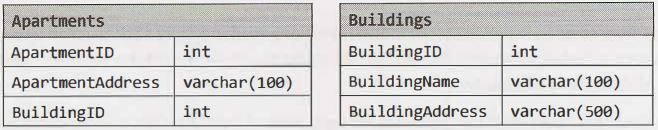
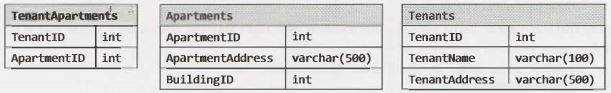
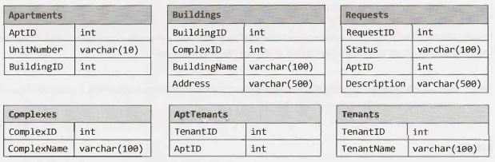
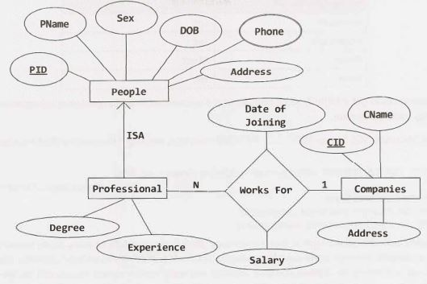

14 Databases
============

If you  profess knowledge of databases, you  might be asked some questions on it. We'll review some of the key concepts and offer an overview of how to approach these problems. As you  read these queries, don't be surprised by minor variations in syntax. There are a variety of flavors of SQL, and you  might have worked with a slightly different one. The  examples in this  book have been tested against Microsoft SQL Server.


### SQL Syntax and Variations

Implicit and explicit joins are shown below. These two statements  are equivalent, and it's  a matter of personal preference which one you choose. For consistency, we  will stick to the explicit join.


| Explicit Join                                    | Implicit Join                       |
| --                                               | --                                  |
| 1   SELECT CourseName,   TeacherName             | 1   SELECT CourseName,  TeacherName |
| 2   FROM  Courses INNER JOIN   Teachers          | 2   FROM   Courses,  Teachers       |
| 3   ON  Courses.TeacherID  =  Teachers.TeacherID | 3   WHERE  Courses.TeacherID =      |
|                                                  | 4          Teachers.TeacherID       |


### Denormalized vs. Normalized  Databases

Normalized databases are designed to minimize redundancy, while denormalized databases are designed to optimize read time.

In a traditional normalized database with data like Courses and Teachers, Courses might contain a column called TeacherID, which is a foreign key to Teacher. One benefit of this is that information about the teacher (name, address, etc.)  is only  stored once in the database. The  drawback is that many common queries will require expensive joins.

Instead, we can denormalize the database by  storing redundant data. For example, if we  knew that we would have to repeat this  query often, we might store the teacher's name in the Courses table. Denormalization is commonly used to create highly scalable systems.


### SQL Statements

Let's  walk through a review of basic SQL syntax, using as  an example the database that was  mentioned earlier. This  database has the following simple structure (* indicates a primary key):
```
Courses:   CourseID*,  CourseName, TeacherID 
Teachers:   TeacherID*,  TeacherName 
Students:   StudentID*,  StudentName
StudentCourses:  CourseID*,  StudentID*
```

Using the above table, implement the following queries.

#### Query 1: Student Enrollment

Implement a query to get a list of all students and how many courses each student is enrolled in. At first, we might try something like this:
```
1   /* Incorrect Code */
2   SELECTStudents.StudentName,   count(*)
3   FROM Students INNER JOIN StudentCourses
4   ON Students.StudentID =  StudentCourses.StudentID
5   GROUP  BY  Students.StudentID
```

This has three problems:

1.  We have excluded students who are not enrolled in any courses, since StudentCourses only includes enrolled students. We need to change this to a LEFT JOIN.
2.  Even if we changed it to a LEFT JOIN, the query is still not quite right. Doing count(\*) would return how many items there are in a given group of StudentIDs. Students enrolled in zero courses would still have one item in their group. We need to change this to count the number of CourseIDs in each group: count (StudentCourses.CourseID).
3.  We've grouped by Students. StudentID, but there are still multiple StudentNames in each group. How will the database know which StudentName to return? Sure, they may all have the same value, but the database doesn't understand that. We need to apply an aggregate function to this, such as first (Students.StudentName).

Fixing these issues gets us to this query:
```sql
1   /* Solution 1:  Wrap with another query*/
2   SELECT  StudentName,   Students.StudentID,  Cnt
3   FROM  (
4     SELECT Students.StudentID, count(StudentCourses.CourseID) as [Cnt]
5     FROM  Students LEFT JOIN StudentCourses
6     ON Students.StudentID =  StudentCourses.StudentID
7     GROUP BY  Students.StudentID
8   ) T INNER  JOIN Students on T.studentID =  Students.StudentID
```
Looking at this code, one might ask why we don't just select the student name on line 3 to avoid having to wrap lines 3 through 6 with another query. This (incorrect) solution is shown below.
```sql
1  /* Incorrect Code */
1  SELECTStudentName, Students.StudentID, count(StudentCourses.CourseID)  as [Cnt]
2  FROM Students LEFTJOIN StudentCourses
3  ON  Students.StudentID =  StudentCourses.StudentID
4  GROUP BY  Students.StudentID
```
The answer is that we can't do that - at least not exactly as shown. We can only select values that are in an aggregate function or in the GROUP BY clause.

Alternatively, we could resolve the above issues with either of the following statements:
```sql
1  /* Solution 2:  Add StudentName  to GROUP BY  clause. */
2  SELECT  StudentName,   Students.StudentID,  count(StudentCourses.CourseID)  as [Cnt]
3  FROM  Students LEFT JOIN StudentCourses
4  ON  Students.StudentID =  StudentCourses.StudentID
5  GROUP  BY  Students.StudentID, Students.StudentName
```
OR
```sql
1  /* Solution 3:  Wrap with   aggregate function.  */
2  SELECT max(StudentName)   as  [StudentName],   Students.StudentID,
3             count(StudentCourses.CourseID)  as   [Count]
4  FROM Students LEFT  JOIN StudentCourses
5  ON Students.StudentID = StudentCourses.StudentID
6  GROUP BY  Students.StudentID
```
*Query 2: Teacher Class Size*

Implement a query to get a list ofall teachers and how many students they each teach. If a teacher teaches the same student in two courses, you should double count the student. Sort the list in descending order of the number of students a teacher teaches.

We can construct this query step by step. First, let's get a list of TeacherIDs and how many students are associated with each TeacherID. This is very similar to the earlier query.
```
1  SELECT  TeacherID,   count(StudentCourses.CourseID)  AS  [Number]
2  FROM  Courses   INNER   JOIN StudentCourses
3  ON   Courses.CourseID = StudentCourses.CourseID
4  GROUP   BY  Courses.TeacherID
```
Note that this INNER  JOIN will not select teachers who aren't teaching classes. We'll handle that in the below query when we join it with the list of all teachers.
```sql
1  SELECT  TeacherName,  isnull(StudentSize.Number,  0)
2  FROM   Teachers  LEFT  JOIN
3            (SELECT  TeacherID,   count(StudentCourses.CourseID)  AS  [Number]
4              FROM  Courses   INNER  JOIN StudentCourses
5              ON  Courses.CourseID =  StudentCourses.CourseID
6              GROUP   BY  Courses.TeacherID)  StudentSize
7  ON  Teachers.TeacherID =  StudentSize.TeacherID
8  ORDER   BY  StudentSize.Number DESC
```
Note how we handled the NULL values in the SELECT statement to convert the NULL values to zeros.


### Small Database Design

Additionally, you might be asked to design your own database. We'll walk you through an approach  for this. You might notice the similarities between this approach and the approach for object-oriented design.


#### Step  1: Handle Ambiguity

Database questions often have some ambiguity, intentionally or unintentionally. Before you proceed with your design, you must understand exactly what you need to design.

Imagine you are asked to design a system to represent an apartment rental agency. You will need to know whether this agency has multiple locations or just one. You should also discuss with your interviewer how general you should be. For example, it would be extremely rare for a person to rent two apartments in the same building. But does that mean you shouldn't be able to handle that? Maybe, maybe not. Some very rare conditions might be best handled through a work around (like duplicating the person's contact information in the database).


#### Step 2: Define the Core Objects

Next, we should look at the core objects of our system. Each of these core objects typically translates into a table. In this case, our core objects might be Property, Building, Apartment, Tenant and Manager.


#### Step 3: Analyze Relationships

Outlining the core objects should give us a good sense of what the tables should be. How do these tables relate to each other? Are they many-to-many? One-to-many?

If Buildings has a one-to-many relationship with Apartments (oneBuilding has many Apartments), then we might represent this as follows:



Note that the Apartments table links back to Buildings with a BuildingID column.

If we want to allow for the possibility that one person rents more than one apartment, we might want to implement a many-to-many relationship as follows:



The TenantApartments table stores a relationship between Tenants and Apartments.


#### Step 4: Investigate Actions

Finally, we fill in the details. Walk through the common actions that will be taken and understand how to store and retrieve the relevant data. We'll need to handle lease terms, moving out, rent payments, etc. Each of these actions requires new tables and columns.


### Large Database Design

When designing a large, scalable database, joins (which are required in the above examples) are generally very slow. Thus, you must denormalize your data. Think carefully about how data will be used-you'll probably need to duplicate the data in multiple tables.

---

Interview Questions

---

Questions 1  through 3 refer to the following database schema:



Note that each apartment can have multiple tenants, and each tenant can have multiple apartments. Each apartment belongs to one building, and each building belongs to one complex.


**14.1 	Multiple Apartments:** Write a SQL query to get a list of tenants who are renting more than  one apartment.	

SOLUTION

---

To implement this, we can use the HAVING and GROUP   BY clauses and then perform an INNER  JOIN with Tenants.
```sql
1  SELECT  TenantName
2  FROM   Tenants
3  INNER  JOIN
4        (SELECT  TenantID  FROM  AptTenants  GROUP   BY  TenantID  HAVING  count(*)   >   1)  C
5  ON   Tenants.TenantID = C.TenantID
```

Whenever  you write a GROUP BY clause in an interview  (or in real life), make sure that  anything in the SELECT clause is either an aggregate function or contained within the GROUP BY clause.


**14.2    Open  Requests:** Write a SQL query to get a list of all buildings and the number of open requests (Requests in which status equals 'Open'). 


SOLUTION

---
 
This problem uses a straightforward join of Requests and Apartments to get a list of building IDs and the number of open requests. Once we have this list, we join it again with the Buildings table.
```sql
1  SELECT  BuildingName,   ISNULL(Count,  0)  as  'Count'
2  FROM  Buildings
3    LEFT  JOIN
4       (SELECT  Apartments.BuildingID,  count(*)  as   'Count'
5         FROM  Requests   INNER  JOIN Apartments
6         ON  Requests.AptID  =  Apartments.AptID
7         WHERE  Requests.Status  =   'Open'
8         GROUP  BY  Apartments.BuildingID)  ReqCounts
9  ON  ReqCounts.BuildingID =  Buildings.BuildingID
```
Queries like this that utilize sub-queries should be thoroughly tested, even when coding by hand. It may be useful to test the inner part of the query first, and then test the outer part.


**14.3 	Close All Requests:** Building #11 is undergoing a major renovation. Implement a query to close all requests from apartments in this building. 


SOLUTION

---
 
UPDATE queries, like SELECT queries, can have WHERE clauses. To implement this query, we get a list of all apartment IDs within building #11 and the list of update requests from those apartments.
```sql
1  UPDATE  Requests
2  SET  Status = 'Closed'
3  WHERE  AptID  IN (SELECT  AptID  FROM   Apartments   WHERE  BuildingID =  11)
```


**14.4 	Joins:** What are the different types of joins? Please explain how they differ and why certain types are better in certain situations. 

SOLUTION

---
 
JOIN is used to combine the results of two tables. To perform a JOIN, each of the tables must have at least one field that will be used to find matching records from the other table. The join type defines which records will go into the result set.

Let's take for example two tables: one table lists the "regular" beverages, and another lists the calorie-free beverages. Each table has two fields: the beverage name and its product code. The "code" field will be used to perform the record matching.

Regular Beverages:

| Name      | Code      |
| --        | --        |
| Budweiser | BUDWEISER |
| Coca-Cola | COCACOLA  |


| Name  | Code  |
| --    | --    |
| Pepsi | PEPSI |

Calorie-Free Beverages:

| Name           | Code     |
| --             | --       |
| Diet Coca-Cola | COCACOLA |
| Fresca         | FRESCA   |
| Diet Pepsi     | PEPSI    |
| Pepsi Light    | PEPSI    |
| Purified Water | Water    |

If we wanted to join Beverage with Calorie-Free Beverages, we would have many options. These are discussed below.

- INNER JOIN: The result set would contain only the data where the criteria match. In our example, we would get three records: one with a COCACOLA code and two with PEPSI codes.
- OUTER JOIN: An OUTER  JOIN will always contain the results of INNER JOIN, but it may also contain some records that have no matching record in the other table. OUTER     JOINs are divided into the following subtypes:
	- LEFT OUTER JOIN, or simply LEFT JOIN: The result will contain all records from the left table.
	If no matching records were found in the right table, then its fields will contain the NULL values. In our example, we would get four records. In addition to INNER JOIN results, BUDWEISER would be listed, because it was in the left table.
	- RIGHT OUTER JOIN, or simply RIGHT JOIN: This type of join is the opposite of LEFT  JOIN. It will contain every record from the right table; the missing fields from the left table will be NULL. Note that if we have two tables, A and B, then we can say that the statement A  LEFT JOIN  B is equivalent to the statement B  RIGHT JOIN  A. In our example above, we will get five records. In addition to INNER JOIN results, FRESCA and WATER records will be listed.
	- FULL OUTER JOIN: This type of join combines the results of the LEFT and RIGHT  JOINS. All records from both tables will be included in the result set, regardless of whether or not a matching record exists in the other table. If no matching record was found, then the corresponding result fields will have a NULL value. In our example, we will get six records.


**14.5     Denormalization:** What is denormalization? Explain the pros and cons.
 
SOLUTION
 
--- 

Denormalization is a database  optimization technique  in which we add redundant  data to one or more tables. This can help us avoid costly joins in a relational database.

By contrast, in a traditional normalized database, we store data in separate logical tables and attempt  to minimize redundant data. We may strive to have only one copy of each piece of data in the database.

For example, in a normalized database, we might have a Courses table and a Teachers table. Each entry in Courses would store the teacherID for a Course but not the teacherName. When we need to retrieve a list of all Courses with the Teacher name, we would do a join between  these two tables.

In some ways, this  is great; if a teacher changes his or her name, we only have to update the  name in one place.

The drawback, however, is that if the tables are large, we may spend an unnecessarily long time doing joins on tables.

Denormalization, then, strikes  a different compromise. Under denormalization, we decide that we're  okay with  some redundancy and  some extra  effort  to update the  database in order to get  the  efficiency  advan­tages of fewer joins.


| Cons of Denomaralization                                                         | Pros of Denomaralization                                                                                                   |
| --                                                                               | --                                                                                                                         |
| Updates and inserts are more expensive.                                          | Retrieving data is faster  since  we do fewer joins.                                                                       |
| Denormalization can make update and  insert code harder to write.                | Queries to  retrieve can  be  simpler (and  therefore less likely to have bugs),  since  we need to look at fewer  tables. |
| Data  may  be  inconsistent. Which  is the  "correct" value for a piece of data? |                                                                                                                            |
| Data redundancy necessitates  more storage.                                      |                                                                                                                            |

In a system that demands scalability,  like that of any major tech companies, we almost always use elements of both normalized and denormalized databases.


**14.6 		Entity-Relationship Diagram:** Draw an entity-relationship diagram for a database with companies, people, and  professionals (people who work for companies). 


SOLUTION
 
---

People who  work for Companies are  Professionals. So, there is an ISA  ("is a") relationship between People and  Professionals (or we could say that a Professional is derived from People).

Each Professional has additional information such  as degree and  work experiences in addition to the properties derived from People.

A Professional works for one company at a time  (probably-you might want to validate this assumption),  but  Companies can  hire many Professionals. So, there is a many-to-one relationship between Professionals and  Companies. This "Works  For" relationship can store attributes such as an employee's start date and salary. These attributes are defined only when we relate a Professional with a Company.

A Person can have multiple phone numbers, which is why Phone is a multi-valued attribute.



**14.7    Design  Grade  Database:** Imagine a  simple database  storing information for  students' grades. Design what this database might look like and  provide a SQL query to return a list of the  honor roll students (top  10%), sorted by their  grade point average.  pg 173

SOLUTION

---

In a simplistic database, we'll have at least  three objects: Students, Courses, and  CourseEnrollment. Students will have  at  least  a student name and   ID and  will likely have other personal information. Courses will contain the course name and  ID and  will likely contain the course description, professor, and other information. CourseEnrollment will pair Students and Courses and  will also contain a field for CourseGrade.

| Students    |              |
| --          | --           |
| StudentID   | int          |
| StudentName | varchar(100) |
| Address     | varchar(S00) |
 
| Courses     |              |
| --          | --           |
| CourseID    | int          |
| CourseName  | varchar(100) |
| ProfessorID | int          |
 
| CourseEnrollment |       |
| --               | --    |
| CourseID         | int   |
| StudentID        | int   |
| Grade            | float |
| Term             | int   |

This database could get arbitrarily more complicated if we wanted to add in professor information, billing information, and other data.

Using the Microsoft SQL Server TOP ..... PERCENT function, we might (incorrectly) first try a query like this:
```sql
1  SELECT   TOP  10 PERCENT  AVG(CourseEnrollment.Grade) AS  GPA,
2                    CourseEnrollment.StudentID
3  FROM  CourseEnrollment
4  GROUP   BY  CourseEnrollment.StudentID
5  ORDER   BY  AVG(CourseEnrollment.Grade)
```
The problem with the above code is that it will return literally the top 10% of rows, when sorted by GPA. Imagine a scenario in which there are 100 students, and the top 15 students all have 4.0 GPAs. The above function will only return 1O of those students, which is not really what we want. In case of a tie, we want to include the students who tied for the top 10% -- even if this means that our honor roll includes more than 10% of the class.

To correct this issue, we can build something similar to this query, but instead first get the GPA cut off.
```sql
1  DECLARE  @GPACutOff  float;
2  SET @GPACutOff  = (SELECT  min(GPA) as  'GPAMin' FROM  (
3                SELECT   TOP  10 PERCENT  AVG(CourseEnrollment.Grade) AS  GPA
4            FROM  CourseEnrollment
5            GROUP   BY  CourseEnrollment.StudentID
6            ORDER  BY  GPA   desc)  Grades);
```
Then, once we have @GPACutOff defined, selecting the students  with at least this GPA is reasonably straightforward.
```sql
1  SELECT  StudentName,  GPA
2  FROM (SELECT   AVG(CourseEnrollment.Grade) AS  GPA,   CourseEnrollment.StudentID
3              FROM  CourseEnrollment
4              GROUP   BY  CourseEnrollment.StudentID
5              HAVING  AVG(CourseEnrollment.Grade)  >= @GPACutOff)   Honors
6  INNER  JOIN Students  ON   Honors.StudentID  =  Student.StudentID
```
Be very careful about what implicit assumptions you make. If you look at the above database description, what potentially incorrect assumption  do you see? One is that each course can only be taught  by one professor. At some schools, courses may be taught by multiple professors.

However, you will need to make some assumptions, or you'd drive yourself crazy. Which assumptions you make is less important than just recognizing that you made assumptions. Incorrect assumptions, both in the real world and in an interview, can be dealt with as long as they are acknowledged.

Remember, additionally, that there's a trade-off between flexibility and complexity. Creating a system in which a course can have multiple professors does increase the database's flexibility, but it also increases its complexity. If we tried to make our database  flexible to every possible situation, we'd wind up with something hopelessly complex.

Make your design reasonably flexible, and state any other assumptions or constraints. This goes for not just database design, but object-oriented design and programming in general.


