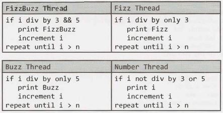

15 Threads and  Locks
=====================


In a Microsoft, Google or Amazon interview, it's not terribly common to be asked to implement an algo­rithm with threads  (unless you're working in a team for which this is a particularly important  skill). It is, however, relatively common for interviewers at any company to assess your general understanding  of threads, particularly your understanding of deadlocks.

This chapter will provide an introduction to this topic.


### Threads in Java

Every thread in Java is created and controlled by a unique object of the java.lang.Thread class. When a standalone application is run, a user thread is automatically created to execute the main() method. This thread is called the main thread.

In Java, we can implement threads in one of two ways:

- By implementing the java. lang.Runnable interface
- By extending the java. lang. Thread class

We will cover both of these below.


#### Implementing the Runnable Interface

The Runnable interface has the following very simple structure.
```java
1   public  interface  Runnable  {
2       void run();
3   }
```

To create and use a thread using this interface, we do the following:

1. Create a class which implements the Runnable interface. An object of this class is a Runnable object.
2. Create an object of type Thread by passing a Runnable object as argument to the Thread constructor. The Thread object now has a Runnable object that implements the run() method.
3. The start() method is invoked on the Thread object created in the previous step. 

For example:
```java
1   public class  RunnableThreadExample  implements   Runnable  {
2       public int  count  =  0;
3   
4       public void run()  {
5           System.out.println("RunnableThread  starting.");
6           try {
7               while (count <  5)  {
8                   Thread.sleep(500);
9                   count++;
10              }
11          }  catch  (InterruptedException exc)  {
12              System.out.println("RunnableThread  interrupted.");
13          }
14          system.out.println("RunnableThread terminating.");
15      }
16  }
17  
18  public static void  main(String[]  args)   {
19      RunnableThreadExample instance =  new RunnableThreadExample();
20      Thread thread =  new Thread(instance);
21      thread.start();
22  
23      /*  waits  until above thread counts  to  5 (slowly)  */
24      while (instance.count  != 5)   {
25          try {
26              Thread.sleep(250);
27          }  catch  (InterruptedException exc)  {
28              exc.printStackTrace();
29          }
30      }
31  }
```

In the above code, observe that all we really needed to do is have our class implement the run() method (line 4). Another method can then pass an instance of the class to new  Thread(obj) (lines 19 - 20) and call start() on the thread (line 21 ).


#### Extending the Thread Class

Alternatively, we can create a thread by extending the Thread class. This will almost always mean that we override the run() method, and the subclass may also call the thread constructor explicitly in its constructor.

The below code provides an example of this.

```java
1   public class ThreadExample extends Thread {
2       int count  =  0;
3   
4       public void run()   {
5           System.out.println("Thread  starting.");
6           try  {
7               while (count <  5)  {
8                   Thread.sleep(500);
9                   System.out.println("In Thread, count is " + count);
10                  count++;
11              }
12          }  catch (InterruptedException exc)  {
13              System.out.println("Thread interrupted.");
14          }
15          System.out.println("Thread  terminating.");
16      }
17  }
18  
19  public  class  ExampleB {
20      public static void main(String args[])  {
21          ThreadExample instance  =  new ThreadExample();
22          instance.start();
23  
24          while (instance.count !=  5) {
25              try  {
26                  Thread.sleep(250);
27              }  catch (InterruptedException exc) {
28                  exc.printStackTrace();
29              }
30          }
31      }
32  }
```
This code is very similar to the first approach. The difference is that since we are extending the Thread class, rather than just implementing an interface, we can call start() on the instance of the class itself.


#### Extending the Thread Class vs. Implementing the  Runnable Interface

When creating threads, there are two reasons why implementing  the Runnable interface may be prefer­able to extending the Thread class:

- Java does not support multiple inheritance. Therefore, extending the Thread class means that the subclass cannot extend any other class. A class implementing the Runnable interface will be able to extend another class.
- A class might only be interested in being runnable, and therefore, inheriting the full overhead of the Thread class would be excessive.


### Synchronization and Locks

Threads within a given process share the same memory space, which is both a positive and a negative. It enables threads to share data, which can be valuable. However, it also creates the opportunity for issues when two threads modify a resource at the same time. Java provides synchronization  in order to control access to shared resources.

The keyword synchronized and the lock form the basis for implementing synchronized execution of code.


#### Synchronized Methods

Most commonly, we restrict access to shared resources through the use of the synchronized keyword.  It can be applied to methods and code blocks, and restricts multiple threads from executing the code simultaneously on the same object.

To clarify the last point, consider the following code:
```java
1   public  class  MyClass extends Thread  {
2       private  String  name;
3       private  MyObject  myObj;
4   
5       public  MyClass(MyObject obj,  String  n) {
6           name   =  n;
7           myObj  =  obj;
8       }
9   
10      public void  run() {
11          myObj.foo(name);
12      }
13  }
14  
15  public class  MyObject {
16      public synchronized void  foo(String name) {
17          try {
18              System.out.println("Thread " + name + ".foo(): starting");
19              Thread.sleep(3000);
20              System.out.println("Thread " + name + ".foo():  ending");
21          } catch  (InterruptedException  exc)  {
22              System.out.println("Thread " + name + ":  interrupted.");
23          }
24      }
25  }
```
Can two instances of MyClass call foo at the same time? It depends. If they have the same instance of MyObject, then no. But, if they hold different references, then the answer is yes.
```java
1    /*   Difference references  -  both  threads can  call  MyObject.foo() */
2   MyObject objl  =  new MyObject();
3   MyObject obj2  =  new MyObject();
4   MyClass thread1 =  new MyClass(obj1,  "1");
5   MyClass thread2 =  new MyClass(obj2,  "2");
6   thread1.start();
7   thread2.start()
8
9   /* Same  reference to obj. Only one will be  allowed  to call foo,
10   *    and the  other will be forced to wait.   */
11  MyObject obj =  new MyObject();
12  MyClass thread1 =  new MyClass(obj,  "1");
13  MyClass thread2 =  new MyClass(obj,  "2");
14  thread1.start()
15  thread2.start()
```

Static methods synchronize on the class lock. The two threads above could not simultaneously execute synchronized static methods on the same class, even if one is calling foo and the other is calling bar.

```java
1   public class MyClass extends Thread   {
2       ...
3       public void  run() {
4           if (name.equals("1"))  MyObject.foo(name);
5           else if (name.equals("2")) MyObject.bar(name);
6       }
7   }
8   
9   public class MyObject {
10      public static  synchronized void foo(String name) {/* same  as  before */}
11      public static  synchronized void bar(String name) {/* same as  foo  */}
12  }
```

If you run this code,  you  will see the following printed: 
```
Thread  1.foo(): starting
Thread  1.foo(): ending
Thread  2.bar(): starting
Thread  2.bar(): ending
```

#### Synchronized Blocks

Similarly, a block of code can be synchronized. This operates very similarly to synchronizing a method.

```java
1   public  class MyClass extends Thread  {
2       ...
3       public  void run() {
4           myObj.foo(name);
5       }
6   }
7   public  class MyObject {
8       public  void foo(String  name)  {
9           synchronized (this) {
10              ....
11          }
12      }
13  }
```

Like synchronizing a method, only one thread per instance of MyObject can execute the code within the synchronized block. That means that if thread1 and thread2 have the same instance of MyObject, only one will be allowed to execute the code block at a time.


#### Locks

For more granular control, we can utilize a lock. A lock (or monitor) is used to synchronize access to a shared resource by associating the resource with the lock. A thread gets access to a shared resource by first acquiring the lock associated with the resource. At any given time, at most one thread can hold the lock and, therefore, only one thread can access the shared resource.

A common use case for locks is when a resource is accessed from multiple places, but should be only accessed by one thread at a time. This case is demonstrated in the code below.

```java
1   public  class LockedATM   {
2       private Lock lock;
3       private int  balance =  100;
4   
5       public  LockedATM() {
6           lock = new  Reentrantlock();
7       }
8   
9       public  int  withdraw(int value) {
10          lock.lock();
11          int  temp = balance;
12          try {
13              Thread.sleep(100);
14              temp =  temp  -  value;
15              Thread.sleep(100);
16              balance =  temp;
17          }   catch (InterruptedException e) { }
18          lock.unlock();
19          return temp;
20      }
21  
22      public  int  deposit(int  value) {
23          lock. lock();
24          int  temp = balance;
25          try {
26              Thread.sleep(100);
27              temp =  temp +  value;
28              Thread.sleep(300);
29              balance =  temp;
30          } catch (InterruptedException e)  {          }
31          lock.unlock();
32          return  temp;
33      }
34  }
```

Of course, we've added code to intentionally slow down the execution of withdraw and deposit, as it helps to illustrate the potential problems that can occur. You may not write code exactly like this, but the situation it mirrors is very, very real. Using a lock will help protect a shared resource from being modified in unexpected ways.


### Deadlocks and Deadlock Prevention

A deadlock is a situation where a thread is waiting for an object lock that another thread holds, and this second thread is waiting for an object lock that the first thread holds (or an equivalent situation with several threads). Since each thread is waiting for the other thread to relinquish a lock, they both remain waiting forever. The threads are said to be deadlocked.

In order for a deadlock to occur, you must have all four of the following conditions met:

1. *Mutual Exclusion:* Only one process can access a resource at a given time. (Or, more accurately, there is limited access to a resource. A deadlock could also occur if a resource has limited quantity.)
2. *Hold and Wait:* Processes already holding a resource can request additional resources, without relin­quishing their current resources.
3. *No Preemption:* One process cannot forcibly remove another process' resource.
4. *Circular Wait:* Two or more processes form a circular chain where each process is waiting on another resource in the chain.

Deadlock prevention entails removing any of the above conditions, but it gets tricky because many of these conditions are difficult to satisfy. For instance, removing #1  is difficult because many resources can only be used by one process at a time (e.g., printers). Most deadlock prevention  algorithms focus on avoiding condition #4: circular wait.

---

Interview Questions

---
 

**15.1     Thread vs. Process:** What's the difference between a thread and a process?


SOLUTION

---
 
Processes and threads are related to each other but are fundamentally different.

A process can be thought of as an instance of a program in execution. A process is an independent entity to which system resources (e.g., CPU time and memory) are allocated. Each process is executed in a separate address space, and one process cannot access the variables and data structures of another  process. If a process wishes to access another process' resources, inter-process communications have to be used. These include pipes, files, sockets, and other forms.

A thread  exists within a process and shares the process' resources (including its heap  space). Multiple threads within the same process will share the same heap space. This is very different from processes, which cannot directly access the memory of another process. Each thread still has its own registers and its own stack, but other threads can read and write the heap memory.

A thread is a particular execution path of a process. When one thread  modifies a process resource, the change is immediately visible to sibling threads.

 
**15.2     Context Switch:** How would you measure the time spent in a context switch?


SOLUTION

---
 

This is a tricky question, but let's start with a possible solution.

A context switch is the time spent switching between  two processes (i.e., bringing a waiting process into execution and sending an executing process into waiting/terminated state). This happens in multitasking. The operating  system must bring the state information of waiting processes into memory and save the state information of the currently running process.

In order to solve this problem, we would like to record the timestamps of the last and first instruction of the swapping processes. The context switch time is the difference in the timestamps  between  the two processes.

Let's take an easy example: Assume there are only two processes, P₁ and P₂.

P₁ is executing and P₂ is waiting for execution. At some point, the operating system must swap P₁ and P₂- let's assume it happens  at the Nth instruction of P₁. If tₓ,ₖ  indicates the timestamp in microseconds of the kth instruction of process x, then the context switch would take t₂,₁  -  t₁,ₙ microseconds.

The tricky part is this: how do we know when this swapping occurs? We cannot, of course, record the timestamp of every instruction in the process.

Another issue is that  swapping  is governed  by the scheduling algorithm of the operating  system and there may be many kernel level threads which are also doing context switches. Other processes could be contending  for the CPU or the kernel handling interrupts. The user does not have any control over these extraneous context switches. For instance, if at time t₁,ₙ the kernel decides to handle an interrupt, then the context switch time would be overstated.

In order to overcome these obstacles, we must first construct an environment such that after P₁ executes, the task scheduler immediately selects P₂ to run. This may be accomplished by constructing a data channel, such as a pipe, between  P₁ and P₂ and having the two processes play a game of ping-pong  with a data token.

That is, let's allow P₁ to be the initial sender and P₂ to be the receiver. Initially, P₂ is blocked (sleeping) as it awaits the data token. When P₁ executes, it delivers the token over the data channel to P₂ and immediately attempts to read a response token. However, since P₂ has not yet had a chance to run, no such token is avail­able for P₁ and the process is blocked. This relinquishes the CPU. 

A context switch results and the task scheduler must select another process to run. Since P₂ is now in a ready-to-run state, it is a desirable candidate to be selected by the task scheduler for execution. When P₂ runs, the roles of P₁ and P₂ are swapped. P₂ is now acting as the sender and P₁ as the blocked receiver. The game ends when P₂ returns the token to P₁.

To summarize, an iteration of the game is played with the following steps:

1. P₂ blocks awaiting data from P₁.
2. P₁ marks the start time.
3. P₁ sends token to P₂.
4. P₁ attempts to read a response token from P₂. This induces a context switch.
5. P₂ is scheduled and receives the token.
6. P₂ sends a response token to P₁.
7. P₂ attempts read a response token from P₁. This induces a context switch.
8. P₁ is scheduled and receives the token.
9. P₁ marks the end time.

The key is that the delivery of a data token induces a context switch. Let Tₔ  and Tᵣ be the time it takes to deliver and receive a data token, respectively, and let Tc be the amount of time spent in a context switch. At step 2, P₁ records the timestamp of the delivery of the token, and at step 9, it records the timestamp of the response. The amount of time elapsed, T, between these events may be expressed by:

    T =  2  *  (Tₔ   + T꜀   + Tᵣ )

This formula arises because of the following events: P₁ sends a token (3), the CPU context switches (4), P₂ receives it (5).  P₂ then sends the response token (6), the CPU context switches (7), and finally P₁ receives it (8). 

P₁ will be able to easily compute T, since this is just the time between events 3 and 8. So, to solve for T꜀, we must first determine the value of Tₔ + Tᵣ.

How can we do this? We can do this by measuring the length of time it takes P₁ to send and receive a token to itself. This will not induce a context switch since P₁ is running on the CPU at the time it sent the token and will not block to receive it.

The game is played a number of iterations to average out any variability in the elapsed time between steps 2 and 9 that may result from unexpected kernel interrupts and additional kernel threads contending for the CPU. We select the smallest observed context switch time as our final answer.

However, all we can ultimately say that this is an approximation which depends on the underlying system. For example, we make the assumption  that P₂  is selected to run once a data token becomes available. However, this is dependent on the implementation  of the task scheduler and we cannot make any guar­antees.

That's okay; it's important in an interview to recognize when your solution might not be perfect.


**15.3      Dining  Philosophers:** In the famous dining philosophers problem, a bunch of philosophers are sitting around a circular table with one chopstick between each of them. A philosopher needs both chopsticks to eat, and always picks up the left chopstick before the right one. A deadlock could potentially occur if all the philosophers reached for the left chopstick at the same time. Using threads and locks, implement a simulation of the dining philosophers problem that prevents deadlocks.

SOLUTION

---

First, let's implement a simple simulation of the dining philosophers problem in which we don't concern ourselves with deadlocks. We can implement this solution by having Philosopher extend Thread, and Chopstick call lock. lock() when it is picked up and lock. unlock() when it is put down.
```java
1   class  Chopstick {
2       private Lock lock;
3   
4       public Chopstick()  {
5           lock  =  new Reentrantlock();
6       }
7   
8       public void  pickUp() {
9           void  lock.lock();
10      }
11  
12      public void  putDown()  {
13          lock.unlock();
14      }
15  }
16  
17  class  Philosopher extends Thread  {
18      private int bites =  10;
19      private Chopstick left, right;
20  
21      public  Philosopher(Chopstick left, Chopstick right)  {
22          this.left  = left;
23          this.right = right;
24      }
25  
26      public void  eat() {
27          pickup();
28          chew();
29          putDown();
30      }
31  
32      public void pickUp()  {
33          left.pickup();
34          right.pickUp();
35      }
36  
37      public void chew()  {}
38  
39      public void putDown() {
40          right.putDown();
41          left.putDown();
42      }
43  
44      public void  run() {
45          for (int i = 0;  i < bites; i++)  {
46              eat();
47          }
48      }
49  }
```


Running the above code may lead to a deadlock if all the philosophers have a left chopstick and are waiting for the right one.

**Solution #1: All or Nothing**

To prevent deadlocks, we can implement a strategy where a philosopher will put down his left chopstick if he is unable to obtain the right one.
```java
1   public class Chopstick  {
2       /*  same as  before   */
3   
4       public boolean  pickUp()  {
5           return lock.trylock();
6       }
7   }
8   
9   public class  Philosopher extends.Thread {
10      /*  same as  before  */
11  
12      public void  eat() {
13          if (pickUp()) {
14              chew();
15              putDown();
16          }
17      }
18  
19      public boolean  pickUp()  {
20          /*  attempt  to pick  up */
21          if (!left.pickup()) {
22              return false;
23          }
24          if (!right.pickup()) {
25              left.putDown();
26              return false;
27          }
28          return true;
29      }
30  }
```

In the above code,  we need to be sure to release the  left chopstick if we can't  pick up the right one-and to not  call putDown() on the  chopsticks if we never had them in the  first place.

One issue  with  this is that if all the  philosophers were  perfectly synchronized, they  could simultaneously pick up their left chopstick, be unable to pick up the  right one, and then put back down the  left one-only to have the process repeated again.

**Solution #2: Prioritized Chopsticks**

Alternatively, we can label  the  chopsticks with a number from  0 to N - 1. Each philosopher attempts to pick up the  lower numbered chopstick first. This essentially means that each philosopher goes for the  left chopstick before right one  (assuming that's the  way you labeled it), except for the  last philosopher who does this in reverse. This will break the cycle.
```java
1   public class  Philosopher  extends Thread {
2       private int bites =  10;
3       private Chopstick lower, higher;
4       private int index;
5       public Philosopher(int  i, Chopstick left, Chopstick right) {
6           index =  i;
7           if (left.getNumber() <   right.getNumber()) {
8               this.lower = left;
9               this.higher =  right;
10          } else {
11              this.lower =  right;
12              this.higher =  left;
13          }
14      }
15  
16      public void eat()  {
17          pickup();
18          chew();
19          putDown();
20      }
21  
22      public void pickUp() {
23          lower.pickup();
24          higher.pickup();
25      }
26  
27      public void chew() {  ... }
28  
29      public void putDown() {
30          higher.putDown();
31          lower.putDown();
32      }
33  
34      public void run()  {
35          for (int i = 0;   i <   bites;  i++) {
36              eat();
37          }
38      }
39  }
40  
41  public class Chopstick {
42      private Lock lock;
43      private int  number;
44  
45      public Chopstick(int  n)  {
46          lock =  new Reentrantlock();
47          this.number =  n;
48      }
49  
50      public void pickup() {
51          lock.lock();
52      }
53  
54      public void putDown()  {
55          lock.unlock();
56      }
57  
58      public int getNumber()   {
59          return number;
60      }
61  }
```

With this solution, a philosopher can never hold the larger chopstick without holding the smaller one. This prevents the ability to have a cycle, since a cycle means that a higher chopstick would "point" to a lower one.


**15.4      Deadlock-Free Class:** Design a class which provides a lock only if there are no possible deadlocks.

SOLUTION

---

There are several common ways to prevent deadlocks. One of the popular ways is to require a process to declare upfront what locks it will need. We can then verify if a deadlock would be created by issuing these locks, and we can fail if so.

With these constraints in mind, let's investigate how we can detect deadlocks. Suppose this was the order of locks requested:
```
A = {1,  2,  3,  4}
B = {1,  3,  5}
C = {7,  5,  9,  2}
```
This may create a deadlock because we could have the following scenario: 
```
A locks 2,  waits on  3
B locks 3,  waits on  5
C locks 5,  waits on  2
```
We can think about this as a graph, where 2 is connected  to 3, 3 is connected  to 5, and 5 is connected to 2. A deadlock is represented  by a cycle. An edge  (w, v) exists in the graph if a process declares that it will request lock v immediately after lock w. For the earlier example, the following edges would exist in the graph: (1, 2),  (2, 3),  (3, 4),  (1, 3),  (3, 5),  (7, 5),  (5, 9),  (9,  2).The "owner" of the edge does not matter.

This class will need a declare method, which threads and processes will use to declare what order they will request resources in. This declare method  will iterate through the declare order, adding each contiguous pair of elements (v, w) to the graph. Afterwards, it will check to see if any cycles have been created. If any cycles have been created, it will backtrack, removing these edges from the graph, and then exit.

We have one final component to discuss: how do we detect  a cycle? We can detect a cycle by doing a depth-first search through each connected component  (i.e., each connected  part of the graph). Complex algorithms exist to find all the connected  components  of a graph, but our work in this problem does not require this degree of complexity.

We know that if a cycle was created, one of our new edges must be to blame. Thus, as long as our depth-first search touches all of these edges at some point, then we know that we have fully searched for a cycle.

The pseudocode for this special case cycle detection looks like this:
```
1   boolean checkForCycle(locks[] locks)  {
2       touchedNodes  = hash  table(lock  ->  boolean)
3       initialize  touchedNodes  to false for each  lock   in locks
4       for each  (lock x in  process.locks)  {
5           if (touchedNodes[x] == false) {
6               if (hasCycle(x, touchedNodes)) {
7                   return true;
8               }
9           }
10      }
11      return false;
12  }
13  
14  boolean hasCycle(node x,  touchedNodes)   {
15      touchedNodes[r]  =  true;
16      if (x.state == VISITING) {
17          return true;
18      } else if (x.state == FRESH)   {
19          ... (see full code  below)
20      }
21  }
```
In the above code, note that we may do several depth-first searches, but touchedNodes is only initialized once. We iterate until all the values in touchedNodes are false.

The code below provides further details. For simplicity, we assume that all locks and processes (owners) are ordered sequentially.
```java
    class LockFactory {
        private static LockFactory instance;
    
        private int numberOfLocks = 5;   /*default  */
        private LockNode[] locks;
        /*  Maps from  a  process or  owner to the   order that  the   owner  claimed   it would
         * call the   locks in */
        private HashMap<Integer, LinkedList<LockNode>> lockOrder;
    
        private LockFactory(int count) { ...}
        public static LockFactory getinstance() { return instance; }
    
        public static synchronized LockFactory initialize(int count) {
            if (instance == null) instance = new LockFactory(count);
            return instance;
        }
    
        public boolean hasCycle(HashMap<Integer, Boolean> touchedNodes,
                                int[] resourcesinOrder) {
            /*check  for  a  cycle*/
            for (int resource : resourcesinOrder) {
                if (touchedNodes.get(resource) == false) {
                    LockNode n = locks[resource];
                    if (n.hasCycle(touchedNodes)) {
                        return true;
                    }
                }
            }
            return false;
        }
    
        /*To prevent  deadlocks, force  the  processes to  declare  upfront what order  they
         * will  need the  locks  in. Verify  that this order  does  not  create a  deadlock  (a
         * cycle  in  a  directed graph) */
        public boolean declare(int ownerId, int[] resourcesinOrder) {
            HashMap<Integer, Boolean> touchedNodes = new HashMap<Integer, Boolean>();
    
            /*add  nodes to  graph*/
            int index = 1;
            touchedNodes.put(resourcesinOrder[0], false);
            for (index = 1; index < resourcesinOrder.length; index++) {
                LockNode prev = locks[resourcesinOrder[index - 1]];
                LockNode curr = locks[resourcesinOrder[index]];
                prev.joinTo(curr);
                touchedNodes.put(resourcesinOrder[index], false);
            }
    
            /*if we  created a  cycle,  destroy this  resource list and return false*/
            if (hasCycle(touchedNodes, resourcesinOrder)) {
                for (int j = 1; j < resourcesinOrder.length; j++) {
                    LockNode p = locks[resourcesinOrder[j - 1]];
                    LockNode c = locks[resourcesinOrder[j]];
                    p.remove(c);
                }
                return false;
            }
    
            /* No  cycles detected.  Save the  order   that was declared,  so  that we  can
             * verify that the  process  is really calling the  locks  in  the  order  it said
             * it  would. */
            LinkedList<LockNode> list = new LinkedList<LockNode>();
            for (int i = 0; i < resourcesinOrder.length; i++) {
                LockNode resource = locks[resourcesinOrder[i]];
                list.add(resource);
            }
            lockOrder.put(ownerId, list);
    
            return true;
        }
    
        /*  Get the  lock,   verifying first that the  process   is really calling the  locks  in
         * the  order  it said   it would. */
        public Lock getLock(int ownerId, int resourceID) {
            LinkedList<LockNode> list = lockOrder.get(ownerId);
            if (list == null) return null;
    
            LockNode head = list.getFirst();
            if (head.getid() == resourceID) {
                list.removeFirst();
                return head.getLock();
            }
            return null;
        }
    }
    
    public class LockNode {
        public enum VisitState {FRESH, VISITING, VISITED};
    
        private ArrayList<LockNode> children;
        private int lockId;
        private Lock lock;
        private int maxLocks;
    
        public LockNode(int id, int max) {  ...}
    
        /*  Join  "this" to  "node",  checking  that it doesn't create a  cycle  */
        public void joinTo(LockNode node) { children.add(node); }
        public void remove(LockNode node) { children.remove(node); }
    
        /*  Check for  a  cycle  by doing  a  depth-first-search. */
        public boolean hasCycle(HashMap<Integer, Boolean> touchedNodes) {
            VisitState[] visited = new VisitState[maxLocks];
            for (int i = 0; i < maxlocks; i++) {
                visited[i] = VisitState.FRESH;
            }
            return hasCycle(visited, touchedNodes);
        }
    
        private boolean hasCycle(VisitState[] visited,
                                 HashMap<Integer, Boolean> touchedNodes) {
            if (touchedNodes.containsKey(lockId)) {
                touchedNodes.put(lockId, true);
            }
    
            if (visited[lockId] == VisitState.VISITING) {
                /* We  looped  back to  this node while  still visiting it,  so  we  know  there's
                 * a  cycle. */
                return true;
            } else if (visited[lockId] == VisitState.FRESH) {
                visited[lockId] = VisitState.VISITING;
                for (LockNode n : children) {
                    if (n.hasCycle(visited, touchedNodes)) {
                        return true;
                    }
                }
                visited[lockId] VisitState.VISITED;
            }
            return false;
        }
    
        public Lock getlock() {
            if (lock == null) lock = new Reentrantlock();
            return lock;
        }
    
        public int getld() { return lockId; }
    } 
```

As always, when you see code this complicated  and lengthy, you wouldn't be expected to write all of it. More likely, you would be asked to sketch out pseudocode and possibly implement one of these methods.


15.5    Call In Order: Suppose we have the following code:
```java
public  class  Foo {
    public  Foo() {   ... }
    public  void first() {  ... }
    public  void second() {   ... }
    public  void third() {   ... }
}
```
The same instance of Foo will be passed to three different threads. ThreadA will call first threadB will call second, and threadC will call third. Design a mechanism to ensure that first is called before second and second is called before third.

SOLUTION

---

The general logic is to check if first() has completed before executing second(), and if second() has completed before calling third(). Because  we need to be very careful about  thread safety, simple boolean flags won't do the job.

What about using a lock to do something like the below code?
```java
1   public  class  FooBad   {
2       public  int  pauseTime =  1000;
3       public  Reentrantlock lock1,  lock2;
4   
5       public  FooBad() {
6           try {
7               lock1 = new Reentrantlock();
8               lock2 = new Reentrantlock();
9   
10              lock1.lock();
11              lock2.lock();
12          }  catch (...) {  ... }
13      }
14  
15      public void first() {
16          try  {
17              ...
18              lock1.unlock();  //  mark finished  with first()
19          }  catch ( ...) {   . . . }
20      }
21  
22      public   void  second()  {
23          try {
24              lock1.lock();  // wait  until finished with  first()
25              lock1.unlock();
26              ...
27  
28              lock2.unlock();  // mark finished with  second()
29          }  catch  (...)  {  ... }
30      }
31  
32      public void  third() {
33          try {
34              lock2.lock();  // wait  until finished with  third()
35              lock2.unlock();
36  
37          }  catch  (...)  {  ... }
38      }
39  }
``` 


This code won't actually quite work due to the concept of lock ownership. One thread is actually performing the lock (in the FooBad constructor), but different threads attempt to unlock the locks. This is not allowed, and your code will raise an exception. A lock in Java is owned by the same thread which locked it.

Instead, we can replicate this behavior with semaphores. The logic is identical.
```java
1   public class Foo {
2       public Semaphore sem1,  sem2;
3   
4       public Foo()  {
5           try {
6               sem1  = new  Semaphore(l);
7               sem2  = new  Semaphore(l);
8               
9               sem1.acquire();
10              sem2.acquire();
11          } catch  (...)  {  ... }
12      }
13  
14      public   void  first() {
15          try {
16              ...
17              sem1.release();
18          }  catch  (...)  {  ... }
19      }
20  
21      public void  second() {
22          try {
23              sem1.acquire();
24              sem1.release();
25              ...
26              sem2.release();
27          }  catch  (...)  {  ... }
28      }
29  
30      public void  third() {
31          try {
32              sem2.acquire();
33              sem2.release();
34              ...
35          }   catch  (...) {  ...   }
36      }
37  }
```

**15.6  Synchronized Methods:** You are given a class with synchronized method A and a normal method B. If you have two threads in one instance of a program, can they both execute A at the same time? Can they execute A and B at the same time?

SOLUTION

---

By applying the word synchronized to a method, we ensure that two threads cannot execute synchro­nized methods on the same object instance at the same time.

So, the answer to the first part really depends. If the two threads have the same instance of the object, then no, they cannot simultaneously execute method A. However,  if they have different instances of the object, then they can.

Conceptually, you can see this by considering  locks. A synchronized method applies a "lock" on all synchronized methods in that instance of the object. This blocks other threads from executing synchronized methods within that instance.

In the second part, we're asked if  thread1 can execute synchronized method  A while thread2 is executing non-synchronized method B. Since  B is not synchronized, there is nothing to block thread1 from executing A while  thread2 is executing B. This is true regardless of whether thread1 and thread2 have the same instance of the object.

Ultimately, the key concept to remember is that only one synchronized method can be in execution per instance of that object. Other threads can execute non-synchronized methods on that instance, or they can execute any method on a different instance of the object.


**15.7  FizzBuzz:**  In the classic problem FizzBuzz, you are told to print the numbers from 1  to n. However, when the number is divisible by 3, print "Fizz". When it is divisible by 5, print "Buzz". When it is divisible by 3 and 5, print "FizzBuzz". In this problem, you are asked to do this in a multithreaded way. Implement a multithreaded version  of FizzBuzz with four threads. One thread checks for divisibility of 3 and prints "Fizz". Another thread is responsible for divisibility of 5 and prints "Buzz". A third thread is responsible for divisibility of 3 and 5 and prints "FizzBuzz".  A fourth thread does the numbers.


SOLUTION

---

Let's start off with implementing a single threaded version of FizzBuzz.

**Single Threaded**

Although this problem (in the single threaded version) shouldn't be hard, a lot of candidates overcomplicate it. They look for something "beautiful" that reuses the fact that the divisible by 3 and 5 case ("FizzBuzz") seems to resemble the individual cases ("Fizz" and "Buzz").

In actuality, the best way to do it, considering readability and efficiency, is just the straightforward way.
```java
1   void  fizzbuzz(int n)  {
2       for (int i =  1;   i <=  n;  i++)  {
3           if (i % 3  == 0  && i % 5  ==  0) {
4               System.out.println("FizzBuzz");
5           }  else if (i % 3  ==  0)  {
6               System.out.println("Fizz");
7           }  else if (i % 5  ==  0) {
8               System.out.println("Buzz");
9           }  else {
10              System.out.println(i);
11          }
12      }
13  }
```

The primary thing to be careful of here is the  order of the  statements. If you put the check for divisibility by 3 before the check for divisibility by 3 and 5, it won't print the right thing.

**Multithreaded**

To do this multithreaded, we want a structure that looks something like this:
 


The code for this will look something like:
```java
1	while (true)  {
2		if (current >  max)   {
3			return;
4		}
5		if (/*  divisibility test */) {
6			System.out.println(/* print something*/);
7			current++;
8		}
9	}
```
We'll need to  add some synchronization in the  loop.  Otherwise, the  value  of current could change between lines 2 - 4 and lines 5 - 8, and we can inadvertently exceed the  intended bounds of the  loop. Additionally, incrementing is not  thread-safe.

To actually implement this concept, there are  many possibilities. One  possibility is to have four  entirely separate thread classes that share a reference to the current variable (which can be wrapped in an object).

The  loop  for each thread is substantially similar. They just have different target values for the  divisibility checks, and different print values.

|                  | FizzBuzz | Fizz  | Buzz  | Number  |
| --               | --       | --    | --    | --      |
| current % 3 == 0 | true     | true  | false | false   |
| current % 5 == 0 | true     | false | true  | false   |
| to print         | FizzBuzz | Fizz  | Buzz  | current |

For the most part, this can be handled by taking in "target" parameters and the value to print. The output for the Number thread needs to be overwritten, though, as it's not a simple, fixed string.

We can implement a FizzBuzzThread class which handles most of this. A NumberThread  class can extend FizzBuzzThread and override the print method.
```java
1   Thread[] threads =  {new FizzBuzzThread(true, true, n, "FizzBuzz"),
2                   new FizzBuzzThread(true, false, n, "Fizz"),
3                   new FizzBuzzThread(false, true, n, "Buzz"),
4                   new NumberThread(false, false, n)};
5   for  (Thread  thread : threads) {
6       thread.start();
7   }
8   
9   public class FizzBuzzThread extends  Thread {
10      private static Object lock = new Object();
11      protected static int current =  1;
12      private int max;
13      private boolean div3, div5;
14      private String toPrint;
15  
16      public  FizzBuzzThread(boolean div3, boolean  div5, int max, String toPrint)  {
17          this.div3 =  div3;
18          this.div5 =  div5;
19          this.max  =  max;
20          this.toPrint =  toPrint;
21      }
22  
23      public void print() {
24          System.out.println(toPrint);
25      }
26  
27      public void run() {
28          while (true) {
29              synchronized (lock)  {
30                  if (current > max) {
31                      return;
32                  }
33  
34                  if ((current %  3  ==  0) == div3  &&
35                  	(current %  5  ==  0) == div5) {
36                      print();
37                      current++;
38                  }
39              }
40          }
41      }
42  }
43  
44  public class NumberThread extends FizzBuzzThread  {
45      public NumberThread(boolean div3,   boolean  div5,   int max) {
46          super(div3, div5,  max, null);
47      }
48  
49      public void print() {
S0          System.out.println(current);
51      }
52  }
```

Observe that we need to put the comparison of current and max before the if statement, to ensure the value will only get printed when current is less than or equal to max.

Alternatively, if we're working in a language which supports this (Java 8 and many other languages do), we can pass in a validate method and a print method as parameters. 
```java
1   int n =  100;
2   Thread[] threads = {
3       new FBThread(i -> i %  3 == 0 && i % 5 == 0, i -> "FizzBuzz", n),
4       new FBThread(i -> i %  3 == 0 && i % 5 != 0, i -> "Fizz", n),
5       new FBThread(i -> i %  3 != 0 && i % 5 == 0, i -> "Buzz", n),
6       new FBThread(i -> i %  3 != 0 && i % 5 != 0, i -> Integer.toString(i), n)};
7   for  (Thread thread : threads) {
8       thread.start();
9   }
10  
11  public class FBThread extends Thread {
12      private static Object lock  =  new Object();
13      protected static int current =  1;
14      private int max;
15      private  Predicate<Integer> validate;
16      private  Function<Integer, String>   printer;
17      int X = 1;
18  
19      public FBThread(Predicate<Integer> validate,
20                      Function<Integer,  String>   printer, int max) {
21          this.validate =  validate;
22          this.printer = printer;
23          this.max  =   max;
24      }
25  
26      public void run() {
27          while (true) {
28              synchronized (lock) {
29                  if (current >  max) {
30                      return;
31                  }
32                  if (validate.test(current)) {
33                      System.out.println(printer.apply(current));
34                      current++;
35                  }
36              }
37          }
38      }
39  }
```

There are of course many other ways of implementing this as well.


