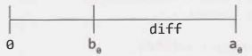
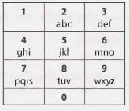
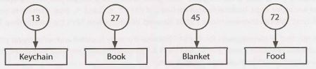
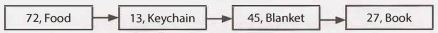
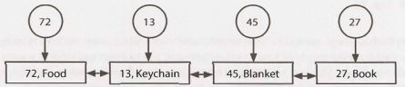
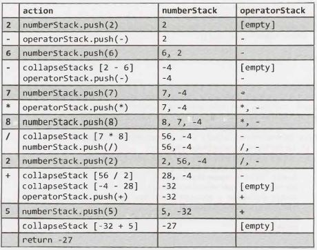

16 Moderate
===========

**16.1      Number Swapper:** Write a function to swap a number in place (that is, without temporary variables).


SOLUTION

---

This is a classic interview problem, and it's a reasonably straightforward one. We'll walk through this using a0 to indicate the original value of a and b0 to indicate the original value of b. We'll also use diff to indicate the value of a₀  - b₀

Let's picture these on a number line for the case where a > b.




First, we briefly set a to diff, which is the right side of the above  number line. Then, when we add b and diff (and store that value in b), we get a₀.  We now have b = a₀ and a = diff. All that's left to do is to set a equal to a₀ - diff, which is just b - a.

The code below implements this.
```
1   //Example  for a  = 9,  b  = 4 
2   a = a - b; // a = 9  -  4 = 5
3   b = a + b; // b = 5  +  4 = 9
4   a = b - a; // a = 9  -  5
```
We can implement a similar solution  with bit manipulation. The benefit of this solution  is that  it works for more data types than just integers.
```
1   //Example  for a  = 101  (in  binary) and  b  = 110
2   a = a^b; // a = 101^110 = 011
3   b = a^b; // b = 011^110 = 101
4   a = a^b; // a = 011^101 = 110
```
This code works by using XORs. The easiest  way to see how this works is by focusing on a specific bit. If we can correctly swap two bits, then we know the entire operation works correctly.

Let's take two bits, x and y, and walk through this line by line.

1.  x  =  x ^ y

This line essentially checks if x and y have different values. It will result in 1  if and only if x !=  y.

2.  y  =  x ^ y
```
Or:y = {0 if originally same, 1  if different} ^ {original y}
```
Observe that XORing a bit with 1  always flips the bit, whereas XORing with 0 will never change it. 

Therefore, if we do y = 1 ^ {original y} when x != y, then y will be flipped and therefore have x's original value.

Otherwise, if x == y, then we do y =  0  ^ {original y} and the value of y does not change. 

Either way, y will be equal to the original value of x.

3.  x  =  x ^ y
```
Or:x = {0  if originally same, 1  if different} ^ {original x}
```
At this point, y is equal to the original value of x. This line is essentially equivalent to the line above it, but for different variables.

If we do x = 1 ^ {original x} when the values are different, x will be flipped.

If we do x = 0 ^ {original x} when the values are the same, x will not be changed. 

This operation happens for each bit. Since it correctly swaps each bit, it will correctly swap the entire number.


**16.2  Word Frequencies:** Design a method to find the frequency of occurrences of any given word in a book. What if we were running this algorithm multiple times? 


SOLUTION

---

Let's start with the simple case.
 

**Solution: Single Query**

In this case, we simply go through the book, word by word, and count the number of times that a word appears. This will take O(n) time. We know we can't do better than that since we must look at every word in the book.
```java
1   int  getFrequency(String[] book,  String word)  {
2       word =  word.trim().tolowerCase();
3       int count =  0;
4       for (String w : book)  {
5           if (w.trim().toLowerCas e().equals(word)) {
5               count++;
7           }
8       }
9       return  count;
10  }
```
We have also converted the string to lowercase and trimmed it. You can discuss with your interviewer if this is necessary (or even desired).

**Solution: Repetitive Queries**

If we're doing the operation repeatedly, then we can probably afford to take some time and extra memory to do pre-processing on the book. We can create a hash table which maps from a word to its frequency. The frequency of any word can be easily looked up in O(1) time. The code for this is below.
```java
1   HashMap<String, Integer> setupDictionary(String[] book)  {
2       HashMap<String,  Integer> table  =
3               new HashMap<String,  Integer>();
4       for (String word : book)  {
5           word =  word.toLowerCase();
6           if (word.trim() != "") {
7               if (!table.containsKey(word)) {
8                   table.put(word,  0);
9               }
10              table.put(word,  table.get(word)  + 1);
11          }
12      }
13      return table;
14  }
15  
16  int getFrequency(HashMap<String, Integer>  table,  String word)  {
17      if (table == null || word == null)  return  -1;
18      word =  word.tolowerCase();
19      if (table.containsKey(word))  {
20          return table.get(word);
21      }
22      return 0;
23  }
```
Note that a problem like this is actually relatively easy. Thus, the interviewer is going to be looking heavily at how careful you are. Did you check for error conditions?


**16.3  Intersection:** Given two straight line segments  (represented  as a start point and an end point), compute the point of intersection, if any.

SOLUTION

---

We first need to think about what it means for two line segments to intersect.

For two infinite lines to intersect, they only have to have different slopes. If they have the same slope, then they must be the exact same line (same y-intercept). That is:
```
slope 1 != slope 2
OR
slope 1  == slope 2 AND intersect 1  == intersect  2
```
For two straight lines to intersect, the condition above must be true, plus the point of intersection must be within the ranges of each line segment.
```
extended infinite segments intersect
AND
intersection is within line segment 1  (x and y coordinates) 
AND 
intersection is within line segment 2 and y coordinates) 
```
What if the two segments represent the same infinite line? In this case, we have to ensure that some portion of their segments  overlap. If we order the line segments by their x locations (start is before end, point 1  is before point 2), then an intersection occurs only if:

```
Assume:
    start1.x < start2.x && start1.x < end1.x && start2.x < end2.x
Then intersection  occurs if:
    start2 is between start1 and end1
```
We can now go ahead and implement this algorithm.

```java
1   Point  intersection(Point start1, Point end1, Point  start2, Point end2)  {
2       /* Rearranging  these so  that, in order of x values: start  is before end and
3        * point 1 is before point 2. This  will make some of the later logic simpler. */
4       if (start1.x >  end1.x) swap(start1, end1);
5       if (start2.x >  end2.x) swap(start2, end2);
6       if (start1.x >  start2.x) {
7           swap(start1, start2);
8           swap(end1, end2);
9       }
10  
11      /*  Compute  lines (including slope  and y-intercept). */
12      Line line1  = new Line(start1, end1);
13      Line line2  = new Line(start2, end2);
14  
15      /* If the  lines are  parallel, they  intercept only  if they  have the  same y
16       * intercept and start 2 is on line 1. */
17      if (line1.slope == line2.slope) {
18          if (line1.yintercept == line2.yintercept &&
19                  isBetween(start1, start2,  end1)) {
20              return start2;
21          }
22          return null;
23      }
24  
25      /*  Get intersection coordinate. */
26      double x  = (line2.yintercept - line1.yintercept) / (line1.slope -  line2.slope);
27      double y  = x * line1.slope + line1.yintercept;
28      Point intersection = new Point(x,  y);
29  
30      /*  Check if within  line segment range. */
31      if (isBetween(start1, intersection, end1) &&
32      isBetween(start2, intersection,  end2))  {
33          return intersection;
34      }
35      return null;
36  }
37  
38  /*  Checks if middle  is between start and end.  */
39  boolean  isBetween(double start, double  middle,  double  end)  {
40      if (start > end)  {
41          return end <= middle && middle <= start;
42      }  else {
43          return start <= middle && middle <= end;
44      }
45  }
46  
47  /*  Checks if middle is between start and end.  */
48  boolean  isBetween(Point start, Point middle, Point end)  {
49      return  isBetween(start.x, middle.x, end.x) &&
50              isBetween(start.y, middle.y, end.y);
51  }
52  
53  /*  Swap coordinates of point one and two.  */
54  void  swap(Point one, Point two)  {
55      double  x =  one.x;
56      double  y =  one.y;
57      one.setLocation(two.x, two.y);
58      two.setLocation(x,  y);
59  }
60  
61  public class  Line  {
62      public double slope,  yintercept;
63  
64      public Line(Point start,  Point end)  {
65          double deltaY  = end.y - start.y;
66          double deltaX  = end.x - start.x;
67          slope =  deltaY / deltaX; // Will be Infinity (not exception) when deltaX = 
68          yintercept = end.y - slope * end.x;
69      }
70  
71      public class Point {
72          public double x,  y;
73          public Point(double x,  double y)  {
74              this.x = x;
75              this.y = y;
76          }
77  
78          public void setLocation(double x, double y)  {
79              this.x = x;
80              this.y = y;
81          }
82      }
83  }
```
For simplicity and compactness (it really makes the code easier to read), we've chosen to make the variables within Point and Line public. You can discuss with your interviewer the advantages and disadvantages of this choice.

 
**16.4    Tic Tac Win:** Design an algorithm to figure out if someone has won a game of tic-tac-toe.

SOLUTION
 
---

At first glance, this problem seems really straightforward. We're just checking a tic-tac-toe board; how hard could it be? It turns out that the problem is a bit more complex, and there is no single "perfect" answer. The optimal solution depends on your preferences.

There are a few major design decisions to consider:

1. Will hasWon be called just once or many times (for instance, as part of a tic-tac-toe website)? If the latter is the case, we may want to add pre-processing time to optimize the runtime of hasWon.
2. Do we know the last move that was made?
3. Tic-tac-toe is usually on a 3x3 board. Do we want to design for just that, or do we want to implement it as an `NxN` solution?
4. In general, how much do we prioritize compactness  of code versus speed of execution vs. clarity of code? Remember: The most efficient code may not always be the best. Your ability to understand and maintain the code matters, too.


**Solution #1: If hasWon is called many times**

There are only 3⁹ or about 20,000, tic-tac-toe boards (assuming a 3x3 board). Therefore, we can represent our tic-tac-toe board as an int, with each digit representing a piece (0 means Empty, 1  means Red, 2 means Blue). We set up a hash table or array in advance with all possible boards as keys and the value indicating who has won. Our function then is simply this:
```java
1   Piece hasWon(int board) {
2       return  winnerHashtable[board];
3   }
```
To convert a board (represented by a char array) to an int, we can use what is essentially a "base 3" repre­sentation. Each board is represented as 3°v₀ + 3¹v₁ + 3²v₂ + ... + 3⁸v₈ , where v₁ is a 0 if the space is empty, a 1 if it's a "blue spot" and a 2 if it's a "red spot".
```java
1   enum Piece { Empty,  Red,  Blue };
2   
3   int  convertBoardToint(Piece[][] board) {
4       int sum =  0;
5       for (int i =  0;  i < board.length;  i++) {
6           for (int j = 0;  j < board[i].length; j++) {
7               /* Each value in enum has  an  integer  associated with  it. We
8                * can  just use  that.  */
9               int value  =  board[i][j].ordinal();
10              sum = sum *  3 + value;
11          }
12      }
13      return sum;
14  }
```
Now looking up the winner of a board is just a matter of looking it up in a hash table.

Of course, if we need to convert a board into this format every time we want to check for a winner, we haven't saved ourselves any time compared with the other solutions. But, if we can store the board this way from the very beginning, then the lookup process will be very efficient.


**Solution #2:  If we know the  last move**

If we know the very last move that was made (and we've been checking for a winner up until now), then we only need to check the row, column, and diagonal that overlaps with this position.
```java
1   Piece hasWon(Piece[][] board, int  row,  int column)  {
2       if  (board.length != board[0].length) return Piece.Empty;
3   
4       Piece piece = board[row][column];
5   
6       if (piece == Piece.Empty) return  Piece.Empty;
7   
8       if (hasWonRow(board,  row)  || hasWonColumn(board,  column)) {
9           return piece;
10      }
11  
12      if (row  == column && haswonDiagonal(board,  1)) {
13          return  piece;
14      }
15  
16      if (row == (board.length - column - 1)  && hasWonDiagonal(board, -1)) {
17          return piece;
18      }
19  
20      return  Piece.Empty;
21  }
22  
23  boolean hasWonRow(Piece[][] board,  int row)  {
24      for (int c = 1; c < board[row].length; c++)  {
25          if (board[row][c] != board[row][0]) {
26              return false;
27          }
28      }
29      return true;
30  }
31  
32  boolean hasWonColumn(Piece[][] board,  int column) {
33      for (int r =  1;  r < board.length;  r++)  {
34          if (board[r][column] != board[0][column])  {
35              return false;
36          }
37      }
38      return true;
39  }
40  
41  boolean  hasWonDiagonal(Piece[][]  board, int direction) {
42      int row =  0;
43      int column =  direction == 1 ? 0 : board.length  -  1;
44      Piece first = board[0][column];
45      for  (int i = 0;  i < board.length;  i++)  {
46          if (board[row][column] != first) {
47              return false;
48          }
49          row +=  1;
50          column +=  direction;
51      }
52      return true;
53  }
```

There is actually a way to clean up thiscode to remove some of the duplicated code. We'll see this approach in a later function.


**Solution #3: Designing for just a 3x3 board**

If we really only want to implement a solution for a 3x3 board, the code is relatively short and simple. The only complex part is trying to be clean and organized, without writing too much duplicated code.

The code below checks each row, column, and diagonal to see if there is a winner.
```java
1   Piece  hasWon(Piece[][]  board)  {
2       for  (int i = 0;  i < board.length;  i++)  {
3           /*  Check Rows  */
4           if (hasWinner(board[i][0],  board[i][1],  board[i][2])) {
5               return board[i][0];
6           }
7
8           /*  Check Columns */
9           if (hasWinner(board[0][i], board[1][i], board[2][i])) {
10              return board[0][i];
11          }
12      }
13
14      /*  Check Diagonal  */
15      if (hasWinner(board[0][0],  board[1][1],  board[2][2])) {
16           return board[0][0];
17      }
18
19      if (hasWinner(board[0][2],  board[1][1],  board[2][0])) {
26           return board[0][2];
21      }
22
23      return  Piece.Empty;
24   }
25
26   boolean  hasWinner(Piece p1, Piece p2, Piece p3)  {
27      if (p1 == Piece.Empty)  {
28            return  false;
29      }
30      return p1 == p2 && p2 == p3;
31   }
```
This is an okay solution in that it's relatively easy to understand what is going on. The problem is that the values are hard coded. It's easy to accidentally type the wrong indices.

Additionally, it won't be easy to scale this to an NxN board.


**Solution #4: Designing for an NxN board**

There are a number of ways to implement this on an NxN board.

*Nested For-Loops*

The most obvious way is through a series of nested for-loops.
```java
1   Piece hasWon(Piece[][] board)  {
2       int size =  board.length;
3       if (board[0].length != size) return  Piece.Empty;
4       Piece  first;
5
6       /*  Check rows.  */
7       for (int i = 0;  i < size;  i++)  {
8           first =  board[i][0];
9           if (first == Piece.Empty)  continue;
10          for (int j =  1; j < size; j++)  {
11              if (board[i][j] != first) {
12                  break;
13              }  else if (j == size -  1)  { //Last element
14                  return first;
15              }
16          }
17      }
18
19      /*  Check columns.  */
20      for (int i = 0;  i < size; i++)  {
21          first - board[0][i];
22          if (first == Piece.Empty)  continue;
23          for  (int j = 1; j < size;  j++)  {
24              if (board[j][i] != first) {
25                  break;
26              }  else if (j == size -  1)  {//Last  element
27                  return first;
28              }
29          }
30      }
31
32      /*  Check diagonals. */
33      first = board[0][0];
34      if (first != Piece.Empty)  {
35          for  (int i = 1;  i < size; i++)  {
36              if (board[i][i] != first) {
37                  break;
38              }  else if (i == size -  1)  {//Last  element
39                  return first;
40              }
41          }
42      }
43
44      first = board[0][size -  1];
45      if (first != Piece.Empty)  {
46          for  (int i = 1;  i < size; i++)  {
47              if (board[i][size -  i -  1]  != first) {
48                  break;
49              }  else if (i == size -  1)  { //Last element
50                  return first;
51              }
52          }
53      }
54
55      return Piece.Empty;
56  }
```

This is, to the say the least, pretty ugly. We're doing nearly the same work each time. We should look for a way of reusing the code.

*Increment and Decrement Function*

One way that we can reuse the code better is to just pass in the values to another function that increments/ decrements the rows and columns. The hasWon function now just needs the starting position and the amount to increment the row and column by.
```java
1   class Check {
2       public int row,  column;
3       private int rowIncrement,   columnIncrement;
4       public Check(int row,  int column, int rowI,  int colI) {
5           this.row = row;
6           this.column = column;
7           this.rowIncrement = rowI;
8           this.columnIncrement =  colI;
9       }
10
11      public void increment()  {
12          row +=  rowIncrement;
13          column +=  columnIncrement;
14      }
15
16      public boolean  inBounds(int size)  {
17          return row >=  0 &&  column >=  0 &&  row <  size &&   column <  size;
18      }
19  }
20
21  Piece  hasWon(Piece[][]   board)  {
22      if (board.length != board[0].length)  return Piece.Empty;
23      int size =  board.length;
24
25      /*  Create  list of  things to  check.  */
26      ArrayList<Check> instructions =  new ArrayList<Check>();
27      for  (int i = 0;  i <  board.length;  i++)  {
28          instructions.add(new Check(0,  i, 1,  0));
29          instructions.add(new Check(i,  0, 0,  1));
30      }
31      instructions.add(new Check(0,  0,  1,  1));
32      instructions.add(new Check(0,  size -  1,  1,   -1));
33
34      /*  Check them. */
35      for  (Check instr : instructions) {
36          Piece  winner =  hasWon(board, instr);
37          if (winner != Piece.Empty)  {
38              return winner;
39          }
40      }
41      return  Piece.Empty;
42  }
43
44  Piece  hasWon(Piece[][] board,  Check instr) {
45      Piece first =  board[instr.row][instr.column];
46      while (instr.inBounds(board.length))  {
47          if (board[instr.row][instr.column]  != first) {
48              return  Piece.Empty;
49          }
50          instr.increment();
51      }
52      return first;
53  }
```
The Cheek function is essentially  operating as an iterator.

*Iterator*

Another way of doing it is, of course,  to actually build an iterator.
```java
1   Piece  hasWon(Piece[][] board)  {
2       if (board.length != board[0].length)  return  Piece.Empty;
3       int size =  board.length;
4
5       ArrayList<Positionlterator> instructions =  new ArrayList<Positionlterator>();
6       for  (int i = 0;  i <  board.length;  i++)  {
7           instructions.add(new Positionlterator(new  Position(0, i), 1,  0, size));
8           instructions.add(new Positionlterator(new Position(i, 0), 0, 1, size));
9       }
10      instructions.add(new Positioniterator(new Position(0, 0), 1, 1, size));
11      instructions.add(new Positionlterator(new Position(0, size - 1), 1, -1, size));
12
13      for  (Positionlterator iterator  :   instructions) {
14          Piece  winner = hasWon(board,  iterator);
15          if (winner != Piece.Empty)  {
16              return winner;
17          }
18      }
19      return  Piece.Empty;
20  }
21
22  Piece  hasWon(Piece[][]  board,   Positioniterator iterator)  {
23      Position firstPosition  =  iterator.next();
24      Piece first =  board[firstPosition.row][firstPosition.column];
25      while (iterator.hasNext()) {
26          Position position =  iterator.next();
27          if (board[position.row][position.column] != first) {
28              return Piece.Empty;
29          }
30      }
31      return first;
32  }
33
34  class Positioniterator implements Iterator<Position>  {
35      private int rowincrement, colIncrement, size;
36      private Position current;
37
38      public Positioniterator(Position p, int rowincrement,
39              int colIncrement, int size) {
40          this.rowincrement = rowincrement;
41          this.colIncrement = colIncrement;
42          this.size = size;
43          current = new Position(p.row - rowIncrement, p.column  -  colIncrement);
44      }
45
46      @Override
47      public boolean  hasNext()   {
48          return current.row +  rowincrement  <   size &&
49                 current.column +  colIncrement  <   size;
50      }
51
52      @Override
53      public Position next() {
54          current =  new Position(current.row + rowincrement,
55                                  current.column +  colIncrement);
56          return current;
57      }
58  }
59
60  public class Position {
61      public int row, column;
62      public Position(int row,  int column) {
63          this.row = row;
64          this.column =  column;
65      }
66  }
```
All of this is potentially  overkill, but it's worth discussing the options with your interviewer. The point of this problem is to assess your understanding of how to code in a clean and maintainable way.


**16.5     Factorial zeros:** Write an algorithm which computes the number of trailing zeros in n factorial.

SOLUTION

---

A simple approach  is to compute  the factorial, and then count the number of trailing zeros by continuously dividing by ten. The problem with this though is that the bounds of an int would be exceeded very quickly. To avoid this issue, we can look at this problem mathematically.

Consider a factorial like 19! :
```
19!  =  1*2*3*4*5*6*7*8*9*10*11*12*13*14*15*16*17*18*19
```
A trailing zero is created with multiples of 10, and multiples of 10 are created with pairs of 5-multiples and 2-multiples.

For example, in 19!, the following terms create the trailing zeros:
```
19! = 2  * ... *  5 * ... * 10  * ... * 15 *  16  * ...
```
Therefore, to count the number of zeros, we only need to count the pairs of multiples of 5 and 2. There will always be more multiples of 2 than 5, though, so simply counting the number of multiples of 5 is sufficient.

One "gotcha" here is 15 contributes a multiple of 5 (and therefore one trailing zero), while 25 contributes two (because 25  =  5  *  5).

There are two different ways to write this code.

The first way is to iterate through all the numbers from 2 through n, counting the number of times that 5 goes into each number.
```java
1    /* If the   number is a  5 of  five,  return which  power of  5. For  example:  5  ->  1,
2     * 25->  2,   etc.  */
3    int factors0f5(int i)  {
4       int count = 0;
5       while (i % 5 == 0)  {
6           count++;
7           i /= 5;
8       }
9       return  count;
10   }
11
12   int  countFactZeros(int num) {
13      int count = 0;
14      for (int i =  2;  i <=  num; i++)  {
15          count += factorsOfS(i);
16      }
17      return  count;
18   }
```
This isn't bad, but we can make it a little more efficient by directly counting the factors of 5. Using this approach,  we would first count the number of multiples of 5 between 1 and n (which is n/5), then the number of multiples of 25 (n/25), then 125, and so on .

To count how many multiples of mare in n, we can just divide n by m.
```java
1   int  countFactZeros(int num) {
2       lnt count = 0;
3       if (num < 0)  {
4           return  -1;
5       }
6       for  (int i = 5;  num / i >  0;  i *= 5)  {
7           count += num / i;
8       }
9       return  count;
10  }
```
This problem is a bit of a brainteaser, but it can be approached  logically (as shown above). By thinking through what exactly will contribute a zero, you can come up with a solution. You should be very clear in your rules upfront so that you can implement it correctly.


**16.6  Smallest Difference:** Given two arrays of integers, compute the pair of values (one value in each array) with the smallest (non-negative) difference. Return the difference.
```
EXAMPLE
Input: {l, 3, 15, 11, 2}, {23, 127,  235, 19, 8} 
Output: 3. That is, the pair (11, 8).
```

SOLUTION

---

Let's start first with a brute force solution.


**Brute Force**

The simple brute force way is to just iterate through all pairs, compute the difference, and compare it to the current minimum difference.
```java
1   int findSmallestDifference(int[] array1,  int[]  array2) {
2       if (array1.length == 0 || array2.length ==  0)  return  -1;
3
4       int min = Integer.MAX_VALUE;
5       for (inti = 0;  i <   array1.length; i++)  {
6           for (int j = 0;  j < array2.length;  j++)   {
7               if (Math.abs(array1[i] -  array2[j]) <   min)  {
8                   min = Math.abs(array1[i] -  array2[j]);
9               }
10          }
11      }
12      return min;
13  }
```
One minor optimization we could perform from here is to return immediately if we find a difference of zero, since this is the smallest difference possible. However, depending  on the input, this might actually be slower.

This will only be faster if there's a pair with difference zero early in the list of pairs. But to add this optimization, we need to execute an additional line of code each time. There's a tradeoff here; it's faster for some inputs and slower for others. Given that it adds complexity in reading the code, it may be best to leave it out.

With or without this "optimization", the algorithm will take O(AB) time.


**Optimal**

A more optimal approach is to sort the arrays. Once the arrays are sorted, we can find the minimum difference by iterating through the array.

Consider the following two arrays: 
```
A:  {l,  2,  11,  15}
B:  {4,  12, 19,  23,  127,  235}
```
Try the following approach:

1.  Suppose a pointer a points to the beginning of A and a pointer b points to the beginning of B. The current difference between a and b is 3. Store this as the min.
2.  How can we (potentially) make this difference smaller? Well, the value at b is bigger than the value at a, so moving b will only make the difference larger. Therefore, we want to move a.
3.  Now a points to 2 and b (still) points to 4. This difference  is 2, so we should update min. Move a, since it is smaller.
4.  Now a points to 11 and b points to 4. Move b.
5.  Now a points to 11 and b points to 12. Update min to 1. Move b. 

And so on.
```java
1   int  findSmallestDifference(int[] array1,  int[]  array2) {
2       Arrays.sort(array1);
3       Arrays.sort(array2);
4       int a  =  0;
5       int b  =  0;
6       int difference =  Integer.MAX_VALUE;
7       while  (a  <   array1.length &&   b <   array2.length) {
8           if (Math.abs(array1[a]  -  array2[b]) <   difference) {
9               difference =  Math.abs(array1[a]  -  array2[b]);
10          }
11
12          /*  Move  smaller value. */
13          if (array1[a] < array2[b]) {
14              a++;
15          } else {
16              b++;
17          }
18      }
19      return difference;
20  }
```
This algorithm takes O(A log A + B log B) time to sort and O(A +  B) time to find the minimum difference. Therefore, the overall runtime is O(A log A + B log B).


**16.7      Number Max:** Write a method that finds the maximum of two numbers. You should  not use if-else or any other comparison operator. 


SOLUTION
 
---

A common  way of implementing a max function is to look at the sign of a -  b. In this case, we can't use a comparison operator on this sign, but we can use multiplication. 

Let k equal the sign of a - b such that if a - b >= 0, then k is 1. Else, k = 0. Let q be the inverse of k.

We can then implement the code as follows:
```java
1   /*  Flips   a  1  to  a  0  and a  0  to  a  1  */
2   int flip(int bit) {
3       return 1^bit;
4   }
5
6   /* Returns   1  if a  is positive, and 0 if a  is  negative */
7   int sign(int a) {
8       return flip((a >> 31)  &  0x1);
9   }
10
11  int  getMaxNaive(int a,   int b)  {
12      int k  =  sign(a -  b);
13      int q  =  flip(k);
14      return a *  k + b  *  q;
15  }
```
This code almost works. It fails, unfortunately, when a - b overflows. Suppose, for example, that a is INT_MAX - 2 and b is -15. In this case, a - b will be greater than INT_MAX and will overflow, resulting in a negative value.

We can implement a solution to this problem by using the same approach. Our goal is to maintain the condition where k is1 when a >  b. We will need to use more complex logic to accomplish this.

When does a - b overflow? It will overflow only when a is positive and b is negative, or the other way around. It may be difficult to specially detect the overflow condition, but we can detect when a and b have different signs. Note that if a and b have different signs, then we want k to equal sign (a).

The logic looks like:
```
1   if a  and  b have  different signs:
2       // if a > 0, then b < 0, and  k  =  1.
3       // if a < 0, then b > 0, and  k  =  0.
4       // so either way,  k  = sign(a)
5       let k = sign(a)
6   else
7       let k = sign(a  -  b)  // overflow is  impossible
```
The code below implements this, using multiplication instead of if-statements.
```java
1   int  getMax(int a,   int b)  {
2       int c  =  a  -  b;
3 
4       int sa  =  sign(a);  // if a>=0, then  1  else 0
5       int sb  =  sign(b);  // if b>=0, then  1  else 0
6       int sc  =  sign(c);  //  depends  on  whether or  not   a  -  b  overflows
7 
8       /* Goal: define a value k  which  is 1  if a > b  and  0 if a < b.
9        * (if a = b,  it doesn't  matter what  value   k is) */
10
11      // If a and b have different  signs, then k = sign(a)
12      int use_sign_of_a  =  sa ^ sb;
13
14      // If a  and  b  have  the   same sign,  then k = sign(a -  b)
15      int  use_sign_of_c =   flip(sa ^  sb);
16
17      int k = use_sign_of_a *  sa  + use_sign_of_c  *  sc;
18      int q = flip(k); // opposite of  k
19
20      return a  *  k + b  *  q;
21  }
```


Note that for clarity, we split up the code into many different methods and variables. This is certainly not the most compact or efficient way to write it, but it does make what we're doing much cleaner.


**16.8    English   Int:**  Given any integer, print an English phrase that  describes the integer (e.g., "One Thousand, Two Hundred Thirty Four").

SOLUTION

---

This is not an especially challenging problem, but it is a somewhat tedious one. The key is to be organized in how you approach the problem-and to make sure you have good test cases.

We can think about converting a number like 19,323,984 as converting each of three 3-digit segments of the number, and inserting "thousands" and "millions" in between as appropriate. That is,
```
convert(19,323,984)  = convert(19)  + "  million  " +  convert(323)  + "  thousand  " +  
                       convert(984)
```
The code below implements this algorithm.
```java
1   String[] smalls  = {"Zero", "One",  "Two", "Three", "Four",   "Five",  "Six",  "Seven",
2       "Eight", "Nine",  "Ten",  "Eleven", "Twelve",  "Thirteen", "Fourteen", "Fifteen",
3       "Sixteen",  "Seventeen", "Eighteen",  "Nineteen"};
4   String[] tens  = {"", "",   "Twenty",  "Thirty", "Forty", "Fifty",  "Sixty", "Seventy",
5       "Eighty",  "Ninety"};
6   String[] bigs  = {"", "Thousand",  "Million", "Billion"};
7   String hundred =  "Hundred";
8   String negative = "Negative";
9
10  String convert(int num) {
11      if (num ==  0) {
12          return smalls[0];
13      }  else if (num < 0) {
14          return negative + " " +  convert( -1 *  num);
15      }
16
17      LinkedList<String> parts = new  LinkedList<String>();
18      int chunkCount = 0;
19
20      while  (num > 0) {
21          if (num % 1000 != 0) {
22              String chunk =  convertChunk(num % 1000)  + " " + bigs[chunkCount];
23              parts.addFirst(chunk);
24          }
25          num  /= 1000;  // shift chunk
26          chunkCount++;
27      }
28
29      return listToString(parts);
30  }
31
32  String  convertChunk(int number) {
33      LinkedList<String> parts  =  new LinkedList<String>();
34
35      /*  Convert  hundreds  place  */
36      if (number >= 100)  {
37          parts.addlast(smalls[number / 100]);
38          parts.addLast(hundred);
39          number %= 100;
40      }
41
42      /*  Convert  tens   place  */
43      if (number >=  10 &&   number <=  19)  {
44          parts.addlast(smalls[number]);
45      }  else  if (number >= 20)  {
46          parts.addlast(tens[number / 10]);
47          number %= 10;
48      }
49
50      /*  Convert  ones  place  */
51      if (number >= 1 &&   number <=  9)  {
52          parts.addlast(smalls[number]);
53      }
54
55      return listToString(parts);
56  }
57  /*  Convert  a linked  list of  strings to a  string,  dividing it up with  spaces.  */
58  String listToString(LinkedList<String> parts) {
59      StringBuilder  sb =  new StringBuilder();
60      while (parts.size() >  1)  {
61          sb.append(parts.pop());
62          sb.append(" ");
63      }
64      sb.append(parts.pop());
65      return sb.toString();
66  }
```
The key in a problem like this is to make sure you consider all the special cases. There are a lot of them.


**16.9     Operations:** Write methods to implement the multiply, subtract, and divide operations for integers. The results of all of these are integers. Use only the add operator.

SOLUTION

---

The only operation we have to work with is the add operator. In each of these problems, it's useful to think in depth about what these operations really do or how to phrase them in terms of other operations (either add or operations we've already completed).


**Subtraction**

How can we phrase subtraction in terms of addition? This one is pretty straightforward. The operation a - b is the same thing as a + (-1) *  b. However, because we are not allowed to use the * (multiply) operator, we must implement a negate function.
```java
1   /*  Flip  a positive  sign  to negative  or  negative sign  to pos.  */
2   int negate(int  a)  {
3       int neg =  0;
4       int newSign = a < 0 ? 1 : - 1;
5       while (a != 0)  {
6           neg +=  newSign;
7           a  = +  newSign;
8       }
9       return neg;
10  }
11
12  /*   Subtract two  numbers  by negating b  and  adding  them*/
13  int minus(int a,  int b)  {
14      return a + negate(b);
15  }
```
The negation of the value k is implemented by adding -1 k times. Observe that this will take O(k) time.

If optimizing is something  we value here, we can try to get a to zero faster. (For this explanation, we'll assume that a is positive.) To do this, we can first reduce a by 1, then 2, then 4, then 8, and so on. We'll call this value de1ta. We want a to reach exactly zero. When reducing a by the next de1ta would change the sign of a, we reset delta back to 1 and repeat the process.

For example:
```
a:        29     28     26     22     14     13     11       7       6       4       0 
delta:     -1      -2     -4      -8      -1     -2     -4      -1     -2      -4
```
The code below implements this algorithm.
```java
1   int negate(int a)  {
2       int neg = 0;
3       int newSign = a <  0 ? 1 : -1;
4       int delta = newSign;
5       while(a  != 0) {
6           boolean differentSigns = (a + delta > 0)  != (a > 0);
7           if (a + delta != 0  && differentSigns) { // If delta is too  big, reset it.
8               delta = newSign;
9           }
10          neg += delta;
11          a += delta;
12          delta += delta; // Double  the   delta
13      }
14      return neg;
15  }
```
Figuring out the runtime here takes a bit of calculation.

Observe that reducing a by half takes O(log a) work. Why? For each round of "reduce a by half", the abso­lute values of a and delta always add up to the same number. The values of delta and a will converge at a/2. Since delta is being doubled each time, it will take O(log a) steps to reach half of a.

We do O(log a) rounds.

1.  Reducing a to ᵃ/₂ takes O(log a) time.
2.  Reducing ᵃ/₂ to ᵃ/₄ takes O(log ᵃ/₂) time.
3.  Reducing ᵃ/₄ to ᵃ/₈ takes O(log ᵃ/₄) time.

... As so on , for O(log a) rounds.

The runtime therefore is O(log a + log(ᵃ/₂) + log(ᵃ/₄) + ... ), with O(log a) terms in the expression.

Recall two rules of logs:

- log(xy)  = log x + log y
- log(x/y) = log x - log y.


If we apply this to the above expression, we get:

1. O(log  a + log(ᵃ/₂)  +  log(ᵃ/₄) + ...)
2. O(log  a + (log a - log 2) + (log a - log 4) + (log a - log 8) +...
3. O((log a) * (log a) - (log 2 + log 4 + log 8 + ... + log a))  //O(log  a) terms
4. O((log a) * (log a) - (1 + 2 + 3 + ... + log a))  //computing the values of logs
5. O((log a) * (log a) - ((log a)(1 + log a))/2  //apply equation for sum of 1 through k
6. O((log a)²)  //drop second term from step 5

Therefore, the runtime is O((log a)²).

This math is considerably more complicated than most people would be able to do (or expected to do) in an interview. You could make a simplification: You do O(log a) rounds and the longest round takes O(log a) work. Therefore, as an upper bound, negate takes O((log a)²) time. In this case, the upper bound happens to be the true time.

There are some faster solutions too. For example, rather than resetting delta to 1  at each round, we could change delta to its previous value. This would have the effect of delta "counting up" by multiples of two, and then "counting down" by multiples of two. The runtime of this approach would be O(log a). However, this implementation would require a stack, division, or bit shifting-any of which might violate the spirit of the problem. You could certainly discuss those implementations  with your interviewer though.


**Multiplication**

The connection between addition and multiplication is equally straightforward. To multiply a by b, we just add a to itself b times.
```java
1   /* Multiply a by b by adding  a to  itself b times */
2   int  multiply(int  a,  int  b)  {
3       if (a < b)  {
4           return multiply(b,  a);  // algorithm is faster if b <  a
5       }
6       int  sum =  0;
7       for (int i = abs(b); i >  0; i = minus(i, 1))  {
8           sum +=  a;
9       }
10      if (b <  0) {
11          sum =  negate(sum);
12      }
13      return sum;
14  }
15
16  /* Return absolute value */
17  int  abs(int  a)  {
18      if (a < 0)  {
19          return negate(a);
20      }  else  {
21          return  a;
22      }
23  }
```
The one thing we need to be careful of in the above code is to properly handle multiplication of negative numbers. If b is negative, we need to flip the value of sum. So, what this code really does is:

    multiply(a, b) <-- abs(b) * a * (-1 if b < 0).


*We also implemented a simple abs  function  to help.*


**Division**

Of the three operations, division is certainly the hardest. The good thing is that we can use the multiply, subtract, and negate methods now to implement divide.

We are trying to compute x where  X = a/b. Or, to put this another way, find x where a = bx. We've now changed the problem into one that can be stated with something we know how to do: *multiplication*.

We could implement this by multiplying b by progressively  higher values, until we reach a. That would be fairly inefficient, particularly given that our implementation of multiply involves a lot of adding.

Alternatively, we can look at the  equation a = xb  to see that  we can compute x by adding  b to itself repeatedly until we reach a. The number of times we need to do that will equal x.

Of course, a might  not be evenly divisible by b, and that's okay. Integer division, which is what we've been asked to implement, is supposed to truncate the result.

The code below implements this algorithm.
```java
1   int divide(int a, int b) throws java.lang.ArithmeticException {
2       if (b == 0)   {
3           throw new java.lang.ArithmeticException("ERROR");
4       }
5       int absa = abs(a);
6       int absb = abs(b);
7
8       int  product = 0;
9       int X  =   0;
10      while (product  +  absb   <= absa) {/*don't  go  past a  */
11          product += absb;
12          x++;
13      }
14
15      if ((a <  0  &&  b  <  0) || (a > 0  && b > 0)) {
16          return  x;
17      }  else {
18          return negate(x);
19      }
20  }
```

In tackling this problem,  you should be aware of the following:

- A logical  approach of going  back  to  what  exactly  multiplication and  division do  comes  in handy. Remember that. All (good) interview problems can be approached in a logical, methodical way!
- The interviewer is looking for this sort of logical work-your-way-through-it approach. - This is a great problem to demonstrate your ability to write clean code-specifically, to show your ability to reuse code. For example, if you were writing this solution  and didn't put negate in its own method, you should move it into its own method once you see that you'll use it multiple times.
- Be careful about making assumptions while coding.  Don't assume that  the numbers are all positive or that a is bigger than b.


**16.10  Living  People:** Given  a list of people with  their  birth  and  death years,  implement a method to compute the year with the most number of people alive. You may assume that all people were born between 1900 and  2000 (inclusive). If a person was alive during any portion of that year, they should be included in that year's count. For example, Person (birth = 1908, death = 1909) is included in the counts for both 1908 and 1909.


SOLUTION

---

The first thing we should do is outline what this solution will look like. The interview question hasn't specified the  exact form  of input. In a real interview, we could  ask the  interviewer how the input is structured. Alternatively, you can explicitly state your (reasonable) assumptions.

Here, we'll need to make our  own  assumptions. We will assume that we have an array  of simple Person objects:
```java
1   public  class  Person {
2       public int  birth;
3       public int  death;
4       public Person(int birthYear, int  deathYear) {
5           birth =  birthYear;
6           death =  deathYear;
7       }
8   }
```
We could  have also  given  Person a getBirthVear() and  getDeathYear() objects. Some  would argue that's better style, but for compactness and  clarity, we'll just keep the  variables public.

The important thing here is to actually use  a Person object. This shows better style  than, say, having an integer array for birth years and  an integer array for death years (with an implicit association of births[i] and  deaths[i] being associated with  the  same person). You don't get  a lot of chances to demonstrate great coding style, so it's valuable to take the  ones you get.

With that in mind, let's start with a bruteforce algorithm.

**Brute Force**

The brute force algorithm falls directly out  from the  wording of the problem. We need to find the year with the most number of people alive. Therefore, we go through each year and  check how many people are alive in that year.
```java
1   int maxAliveYear(Person[] people,  int min,   int max)   {
2       int maxAlive = 0;
3       int maxAliveYear =  min;
4
5       for (int year =  min;   year <= max;   year++)  {
6           int alive =  0;
7           for  (Person person :   people)  {
8               if (person.birth <= year &&   year <= person.death) {
9                   alive++;
10              }
11          }
12          if (alive >   maxAlive)  {
13              maxAlive  =  alive;
14              maxAliveYear =  year;
15          }
16      }
17
18      return maxAliveYear;
19  }
```
Note that we have passed in the values for the min year(l 900) and max year (2000). We shouldn't hard code these values.

The runtime of this is O(RP), where R is the range of years (100 in this case) and P is the number of people.

**Slightly Better Brute Force**

A slightly  better way of doing this is to create an array where we track the number of people born in each year. Then, we iterate through the list of people and increment the array for each year they are alive.
```java
1   int maxAliveYear(Person[] people,  int  min,  int max) {
2       int[]  years =  createYearMap(people,  min,  max);
3       int best = getMaxIndex(years);
4       return best + min;
5   }
6
7   /* Add  each  person's  years to  a  year   map. */
8   int[] createYearMap(Person[] people,  int min,  int max) {
9       int[]  years = new int[max -  min + 1];
10      for  (Person person :   people) {
11          incrementRange(years,  person.birth -  min,  person.death  - min);
12      }
13      return years;
14  }
15
16  /*  Increment array for  each  value   between  left and right. */
17  void  incrementRange(int[] values,  int left,  int right) {
18      for (int i = left; i <= right; i++)   {
19          values[i]++;
20      }
21  }
22
23  /* Get  index   of  largest  element in array. */
24  int  getMaxIndex(int[] values) {
25      int max = 0;
26      for (int i =  1;  i < values.length;  i++)   {
27          if (values[i] > values[max]) {
28              max =  i;
29          }
30      }
31      return max;
32  }
```
Be careful on the size of the array in line 9. If the range of years is 1900 to 2000 inclusive, then that's 101 years, not 100. That is why the array has size max  -  min  +  1.

Let's think about the runtime by breaking this into parts.

- We create an R-sized array, where R is the min and max years.
- Then, for P people, we iterate through the years (Y) that the person is alive. 
- Then, we iterate through the R-sized array again.

The total runtime is O(PY + R). In the worst case, Y is R and we have done no better than we did in the first algorithm.

**More Optimal**

Let's create an example. (In fact, an example is really helpful in almost all problems. Ideally, you've already done this.) Each column below is matched, so that the items correspond to the same person. For compactness, we'll just write the last two digits of the year.
```
birth:  12   20   10   01    10   23    13   90   83   75 
death:  15   90   98   72    98   82    98   98   99   94
```
It's worth noting that it doesn't really matter whether these years are matched up. Every birth adds a person and every death removes a person.

Since we don't actually need to match up the births and deaths, let's sort both. A sorted version of the years might help us solve the problem.
```
birth:  01   10   10   12   13    20   23   75   83   90 
death:  15   72   82   90   94    98   98   98   98   99
```
We can try walking through the years.

- At year 0, no one is alive.
- At year 1, we see one birth.
- At years 2 through 9, nothing happens.
- Let's skip ahead until year 10, when we have two births. We now have three people alive. 
- At year 15, one person dies. We are now down to two people alive.
- And so on.

If we walk through the two arrays like this, we can track the number of people alive at each point.
```java
1   int  maxAliveYear(Person[] people,  int  min,  int max) {
2       int[] births = getSortedYears(people, true);
3       int[] deaths = getSortedYears(people, false);
4
5       int birthIndex = 0;
6       int deathIndex = 0;
7       int currentlyAlive = 0·,
8       int maxAlive = 0;
9       int maxAliveYear  =  min;
10
11      /* Walk through  arrays. */
12      while (birthIndex  <  births.length) {
13          if  (births[birthIndex] <=  deaths[deathIndex])  {
14              currentlyAlive++;  // include birth
15              if (currentlyAlive > maxAlive)  {
16                  maxAlive  = currentlyAlive;
17                  maxAliveYear  = births[birthIndex];
18              }
19              birthIndex++;  // move birth  index
20          }  else if (births[birthIndex] > deaths[deathIndex]) {
21              currentlyAlive--;  // include death
22              deathIndex++;  // move death index
23          }
24      }
25
26      return maxAliveYear;
27  }
28
29  /* Copy birth  years or  death years   (depending on the  value of  copyBirthVear  into
30   * integer  array,  then   sort array. */
31  int[] getSortedYears(Person[1  people,  boolean copyBirthYear) {
32      int[] years = new int[people.length];
33      for (int i =  0;  i <   people.length;  i++)  {
34          years[i] = copyBirthYear ?  people[i].birth : people[i].death;
35      }
36      Arrays.sort(years);
37      return years;
38  }
```
There are some very easy things to mess up here.

On line 13, we need to think carefully about whether this should be a less than(<) or a less than or equals (<=). The scenario we need to worry about is that you see a birth and death in the same year.(It doesn't matter whether the birth and death is from the same person.)

When we see a birth and death from the same year, we want to include the birth before we include the death, so that we count this person as alive for that year. That is why we use a <= on line 13.

We also need to be careful about where we put the updating of maxAlive and maxAliveYear. It needs to be after the currentAlive++, so that it takes into account the updated total. But it needs to be before birthIndex++, or we won't have the right year.

This algorithm will take O(P log P) time, where P is the number of people.

**More Optimal (Maybe)**

Can we optimize this further? To optimize this, we'd need to get rid of the sorting step. We're back to dealing with unsorted values:
```
birth:  12    20   10   01    10   23   13   90   83   75 
death:  15    90   98   72    98   82   98   98   99   94
```
Earlier, we had logic that said that a birth is just adding a person and a death is just subtracting a person. Therefore, let's represent the data using the logic:
```
01: +1   10: +1   10: +1    12: +1    13: +1
15: -1   20: +1   23: +1    72: -1    75: +1
82: -1   83: +1   90: +1    90: -1    94: -1
98: -1   98: -1   98: -1    98: -1    99: -1
```
We can create an array of the years, where the value at array[year] indicates how the population changed in that year. To create this array, we walk through the list of people and increment when they're born and decrement when they die.

Once we have this array, we can walk through each of the years, tracking the current population as we go (adding the value at array[year] each time).

This logic is reasonably good, but we should think about it more. Does it really work?

One edge case we should consider is when a person dies the same year that they're born. The increment and decrement  operations will cancel out to give O population change. According to the wording of the problem, this person should be counted as living in that year.

In fact, the "bug" in our algorithm is broader than that. This same issue applies to all people. People who die in 1908 shouldn't be removed from the population count until 1909.

There's a simple fix:  instead  of decrementing array[deathYear], we should decrement array[deathYear +  1].
```java
1   int  maxAliveYear(Person[] people,  int  min,  int max) {
2       /* Build  population delta array. */
3       int[] populationDeltas =  getPopulationDeltas(people,  min,  max);
4       int maxAliveYear  =  getMaxAliveYear(populationDeltas);
5       return maxAliveYear  + min;
5   }
7
8   /*  Add  birth and  death years to deltas  array.  */
9   int[] getPopulationDeltas(Person[] people, int  min,  int max) {
10      int[] populationDeltas =  new int[max  -  min + 2];
11      for (Person person : people) {
12          int birth = person.birth - min;
13          populationDeltas[birth]++;
14
15          int death =  person.death - min;
16          populationDeltas[death + 1]--;
17      }
18      return populationDeltas;
19  }
20
21  /* Compute running sums and  return index   with  max. */
22  int  getMaxAliveYear(int[] deltas) {
23      int maxAliveYear =  0;
24      int maxAlive  = 0;
25      int  currentlyAlive =  0;
26      for (int year  =  0;  year < deltas.length;  year++)   {
27          currentlyAlive += deltas[year];
28          if (currentlyAlive >   maxAlive)  {
29              maxAliveYear  =  year;
30              maxAlive = currentlyAlive;
31          }
32      }
33
34      return maxAliveYear;
35  }
```
This algorithm takes O(R + P) time, where R is the range of years and P is the number of people. Although O(R + P)  might be faster than O(P log P) for many expected inputs, you cannot directly compare the speeds to say that one is faster than the other.


**16.11    Diving Board:** You are building a diving board by placing a bunch of planks of wood end-to-end. There are two types of planks, one of length shorter and one of length longer. You must use exactly K planks of wood. Write a method to generate all possible lengths for the diving board.


SOLUTION

---

One way to approach this is to think about the choices we make as we're building a diving board. This leads us to a recursive algorithm.

**Recursive Solution**

For a recursive solution, we can imagine ourselves building a diving board. We make K decisions, each time choosing which plank we will put on next. Once we've put on K planks, we have a complete diving board and we can add this to the list (assuming we haven't seen this length before).

We can follow this logic to write recursive code. Note that we don't need to track the sequence of planks. All we need to know is the current length and the number of planks remaining.
```java
1   HashSet<Integer>  alllengths(int k,  int shorter, int longer) {
2       HashSet<Integer>  lengths =  new HashSet<Integer>();
3       getAlllengths(k,  0,  shorter,  longer, lengths);
4       return lengths;
5   }
6
7   void  getAlllengths(int k,  int total,  int shorter, int longer,
8                       HashSet<Integer>  lengths) {
9       if (k  ==  0)  {
10          lengths.add(total);
11          return;
12      }
13      getAlllengths(k - 1,  total +  shorter, shorter, longer, lengths);
14      getAllLengths(k - 1,  total +  longer, shorter, longer, lengths);
15  }
```
We've added each length to a hash set. This will automatically prevent adding duplicates.

This algorithm takes O(2ᴷ) time, since there are two choices at each recursive call and we recurse to a depth of K.

**Memoization Solution**

As in many recursive algorithms (especially those with exponential runtimes), we can optimize this through memorization (a form of dynamic programming).

Observe that some of the recursive calls will be essentially equivalent. For example, picking plank 1 and then plank 2 is equivalent to picking plank 2 and then plank 1.

Therefore, if we've seen this (total,  plank  count) pair before then we stop this recursive path. We can do this using a HashSet with a key of (total, plank count).

> Many candidates will make a mistake here. Rather than stopping only when they've seen (total, plank count), they'll stop whenever they've seen just total before. This is incorrect. Seeing two planks of length 1 is not the same thing as one plank of length 2, because there are different numbers of planks remaining. In memoization problems, be very careful about what you choose for your key.

The code for this approach is very similar to the earlier approach.
```java
1   HashSet<Integer>  alllengths(int k,  int shorter, int longer) {
2       HashSet<Integer> lengths =  new HashSet<Integer>();
3       HashSet<String>  visited =  new HashSet<String>();
4       getAlllengths(k,  0,  shorter, longer, lengths, visited);
5       return lengths;
6   }
7
8   void  getAllLengths(int k,  int total,  int shorter, int longer,
9               HashSet<Integer>  lengths,  HashSet<String>  visited) {
10      if (k  ==  0)  {
11          lengths.add(total);
12          return;
13      }
14      String key =   k + "   " +  total;
15      if (visited.contains(key)) {
16          return;
17      }
18      getAllLengths(k - 1, total + shorter, shorter, longer, lengths,  visited);
19      getAllLengths(k - 1, total + longer, shorter, longer, lengths,  visited);
20      visited.add(key);
21  }
```
For simplicity, we've set the key to be a string representation of total and the current plank count. Some people may argue it's better to use a data structure to represent this pair. There are benefits to this, but there are drawbacks as well. It's worth discussing this tradeoff with your interviewer.

The runtime of this algorithm is a bit tricky to figure out.

One way we can think about the runtime is by understanding that we're basically filling in a table of SUMS x  PLANK  COUNTS. The biggest possible sum is K * LONGER and the biggest possible plank count is K. Therefore, the runtime will be no worse than O(K² *  LONGER).

Of course, a bunch of those sums will never actually be reached. How many unique sums can we get? Observe that any path with the same number of each type of planks will have the same sum. Since we can have at most K planks of each type, there are only K different sums we can make. Therefore, the table is really KxK, and the runtime is O(K²).

**Optimal Solution**

If you re-read the prior paragraph, you might notice something interesting. There are only K distinct sums we can get. Isn't that the whole point of the problem-to find all possible sums?

We don't actually need to go through all arrangements of planks. We just need to go through all unique sets of K planks (sets, not orders!). There are only K ways of picking K planks if we only have two possible types: {O of type A, K of type B}, {1 of type A, K-1 of type B}, {2 of type A, K-2 of type B}, ...

This can be done in just a simple for loop. At each "sequence", we just compute the sum.
```java
1   HashSet<Integer>  alllengths(int k,  int  shorter, int longer) {
2       HashSet<Integer> lengths  = new HashSet<Integer>();
3       for (int nShorter = 0;  nShorter <=  k; nShorter++)  {
4           int nLonger =  k  -  nShorter;
5           int length =  nShorter *  shorter +  nLonger * longer;
6           lengths.add(length);
7       }
8       return lengths;
9   }
```
We've used a HashSet here for consistency with the prior solutions. This isn't really necessary though, since we shouldn't get any duplicates. We could instead use an ArrayList. If we do this, though, we just need to handle an edge case where the two types of planks are the same length. In this case, we would just return an ArrayList of size 1.


**16.12  XML Encoding:** Since XML is very verbose, you are given a way of encoding it where each tag gets mapped to a pre-defined integer value. The language/grammar is as follows:
```
Element    -->   Tag Attributes END  Children END 
Attribute  -->   Tag Value
END        -->   0
Tag        -->   some  predefined  mapping to int
Value      -->   string value
```
For example, the following XML might be converted into the compressed string below (assuming a mapping of `family -> 1, person -> 2, firstName -> 3, lastName -> 4, state ->  5`).
```xml
<family lastName="McDowell"  state="CA">
    <person firstName="Gayle">Some  Message</person>
</family>
```
Becomes:

    1 4  McDowell 5 CA  0  2   3   Gayle  0  Some Message  0  0

Write code to print the encoded version of an XML element (passed in Element and Attribute objects).


SOLUTION

---

Since we know the element  will be passed in as an Element and Attribute, our code is reasonably simple. We can implement this by applying a tree-like approach.

We repeatedly call encode() on parts of the XML structure, handling the code in slightly different ways depending on the type of the XML element.
```java
1   void  encode(Element root,  StringBuilder sb) {
2       encode(root.getNameCode(),  sb);
3       for (Attribute a : root.attributes)  {
4           encode(a,  sb);
5       }
6       encode("0",  sb);
7       if (root.value != null && root.value  != "") {
8           encode(root.value,  sb);
9       }  else {
10          for (Element e  : root.children) {
11              encode(e,  sb);
12          }
13      }
14      encode("0",  sb);
15  }
16
17  void  encode(String v,  StringBuilder sb)   {
18      sb.append(v);
19      sb.append(" ");
20  }
21
22  void  encode(Attribute attr, StringBuilder sb)   {
23      encode(attr.getTagCode(),  sb);
24      encode(attr.value, sb);
25  }
26
27  String  encodeToString(Element root) {
28      StringBuilder sb =  new StringBuilder();
29      encode(root,  sb);
30      return sb.toString();
31  }
```
Observe in line 17, the use of the very simple encode method for a string. This is somewhat unnecessary; all it does is insert the string and a space following it. However, using this method is a nice touch as it ensures that every element will be inserted with a space surrounding it. Otherwise, it might be easy to break the encoding by forgetting to append the empty string.


**16.13   Bisect Squares:** Given two squares on a two-dimensional plane, find a line that would cut these two squares in half. Assume that the top and the bottom sides of the square run parallel to the x-axis.

SOLUTION

---

Before we start, we should think about what exactly this problem means by a "line". Is a line defined by a slope and a y-intercept? Or by any two points on the line? Or, should the line be really a line segment, which starts and ends at the edges of the squares?

We will assume, since it makes the problem a bit more interesting, that we mean the third option: that the line should end at the edges of the squares. In an interview situation, you should discuss this with your interviewer.

This line that cuts two squares in half must connect  the two middles. We can easily calculate the slope, knowing that  slope =  (y1 - y2)/(x1 - x2).  Once we calculate the slope using the two middles, we can use the same equation to calculate the start and end points of the line segment.

In the below code, we will assume the origin (0,  0) is in the upper left-hand corner.
```java
1   public  class Square   {
2       .....
3       public  Point middle() {
4           return new Point((this.left + this.right) / 2.0,
5                   (this.top + this.bottom) / 2.0);
6       }
7
8       /* Return  the   point where  the   line segment  connecting mid1  and mid2 intercepts
9       * the   edge  of  square 1.  That  is, draw a  line from  mid2 to  mid1,   and  continue it
10      * out   until the   edge  of  the   square. */
11      public Point extend(Point mid1,   Point mid2,  double   size)  {
12          /* Find  what  direction the   line mid2  ->  mid1  goes. */
13          double  xdir =  mid1.x <   mid2.x ?  -1 : 1;
14          double  ydir =  mid1.y <   mid2.y ?  -1 : 1;
15
16          /* If mid1  and mid2 have  the  same  x  value,  then   the   slope calculation  will
17          * throw  a  divide by 0 exception. So,  we compute  this  specially. */
18          if  (mid1.x == mid2.x)   {
19              return new Point(mid1.x,  mid1.y + ydir  *  size / 2.0);
20          }
21
22          double  slope  =  (mid1.y  -  mid2.y) / (mid1.x  -  mid2.x);
23          double  x1  =  0;
24          double  y1  =  0;
25
26          /* Calculate slope  using  the  equation (y1   -  y2)/(x1  -  x2).
27          * Note:  if the  slope  is "steep" ( > 1)  then  the  end of  the  line segment will
28          * hit size / 2  units away from the  middle  on the  y axis. If the  slope  is
29          * "shallow"   ( < 1)  the  end of  the  line segment will   hit size / 2  units away
30          * from the  middle  on the  x axis. */
31          if (Math.abs(slope) ==  1)  {
32              x1  =  mid1.x  +  xdir  * size / 2.0;
33              y1  =  mid1.y  +  ydir  *  size / 2.0;
34          }  else if (Math.abs(slope) <  1)  {//shallow  slope
35              x1  =  mid1.x  +  xdir  *  size / 2.0;
36              y1  =  slope   *  (x1 -  mid1.x) + mid1.y;
37          } else {//steep  slope
38              y1  =  mid1.y  +  ydir     *  size / 2.0;
39              x1  =  (y1 -  mid1.y) / slope  + mid1.x;
40          }
41          return new Point(x1, y1);
42      }
43
44      public Line cut(Square other)  {
45          /*  Calculate where a  line between each middle  would collide with  the  edges  of
46          *  the  squares   */
47          Point  p1 = extend(this.middle(),  other.middle(),  this.size);
48          Point  p2 = extend(this.middle(),  other.middle(),  -1 * this.size);
49          Point  p3 = extend(other.middle(), this.middle(),  other.size);
50          Point  p4 = extend(other.middle(), this.middle(),  -1 * other.size);
51
52          /*  Of above points,  find  start and end of  lines. Start is farthest left (with
53          * top    most as  a  tie  breaker) and end is farthest right (with  bottom most as
54          *  a  tie  breaker.  */
55          Point  start =  p1;
56          Point  end =  p1;
57
58          for  (int i = 0;  i <  points.length;  i++)  {
59              if (points[i].x <  start.x ||
60                  (points[i].x ==  start.x && points[i].y < start.y)) {
61                  start =  points[i];
62              } else if (points[i].x >  end.x  ||
63                          (points[i].x ==  end.x  && points[i].y >  end.y)) {
64                  end =  points[i];
65              }
66          }
67
68      return new Line(start,   end);
69  }
```
The main goal of this problem is to see how careful you are about coding.  It's easy to glance over the special cases (e.g., the two squares having the same middle). You should make a list of these special cases before you start the problem and make sure to handle them appropriately. This is a question that requires careful and thorough testing.


**16.14  Best  Line:**  Given a two-dimensional graph with points on it, find a line which passes the most number of points.

SOLUTION

---

This solution seems quite straightforward at first. And it is-sort of.

We just "draw" an infinite line (that is, not a line segment) between every two points and, using a hash table, track which line is the most common. This will take O(N²) time, since there are N² line segments.

We will represent a line as a slope and y-intercept (as opposed to a pair of points), which allows us to easily check to see if the line from  (x1,  y1) to (x2, y2) is equivalent to the line from (x3, y3) to (x4, y4).

To find the most common line then, we just iterate through all lines segments, using a hash table to count the number of times we've seen each line. Easy enough!

However, there's one little complication. We're defining two lines to be equal if the lines have the same slope and y-intercept. We are then, furthermore, hashing the lines based on these values (specifically, based on the slope). The problem is that floating point numbers cannot always be represented  accurately in binary. We resolve this by checking if two floating point numbers are within an epsilon value of each other.

What does this mean for our hash table? It means that two lines with "equal" slopes may not be hashed to the same value. To solve this, we will round the slope down to the next epsilon and use this flooredSlope as the hash key. Then, to retrieve all lines that are potentially equal, we will search the hash table at three spots:flooredSlope, flooredSlope - epsilon, and flooredSlope + epsilon. This will ensure that we've checked out all lines that might be equal.
```java
1   /* Find  line that goes  through most  number of  points. */
2   Line  findBestLine(GraphPoint[] points)  {
3       HashMapList<Double,  Line>  linesBySlope =  getListOfLines(points);
4       return  getBestLine(linesBySlope);
5   }
6
7   /* Add each  pair   of  points as  a  line to the   list. */
8   HashMapList<Double,  Line>  getListOfLines(GraphPoint[] points)  {
9       HashMapList<Double,  Line>  linesBySlope =  new HashMapList<Double,  Line>();
10      for  (int i = 0;  i < points.length;  i++)   {
11          for  (int j =  i +  1;  j < points.length; j++)  {
12              Line  line = new Line(points[i], points[j]);
13              double  key =  Line.floorToNearestEpsilon(line.slope);
14              linesBySlope.put(key,  line);
15          }
16      }
17      return  linesBySlope;
18  }
19
20  /* Return  the   line with  the   most  equivalent other lines.  */
21  Line  getBestLine(HashMapList<Double,   Line>  linesBySlope) {
22      Line bestLine =  null;
23      int bestCount =  0;
24
25      Set<Double>  slopes =  linesBySlope.keySet();
26
27      for (double slope : slopes)  {
28          ArrayList<Line>  lines = linesBySlope.get(slope);
29          for (Line  line :   lines) {
30              /* count  lines that are  equivalent to  current line */
31              int count  =  countEquivalentLines(linesBySlope,  line);
32
33              /* if better than  current line,  replace it */
34              if (count >  bestCount) {
35                  bestLine = line;
36                  bestCount = count;
37                  bestLine.Print();
38                  System.out.println(bestCount);
39              }
40          }
41      }
42      return bestLine;
43  }
44
45  /* Check hashmap for  lines that are  equivalent. Note that we  need to  check  one
46   * epsilon above and below the  actual slope  since we're  defining two lines as
47   * equivalent if they're within   an epsilon of  each  other. */
48  int countEquivalentLines(HashMapList<Double,  Line> linesBySlope,  Line  line) {
49      double  key =  Line.floorToNearestEpsilon(line.slope);
50      int count  =  countEquivalentLines(linesBySlope.get(key),  line);
51      count += countEquivalentLines(linesBySlope.get(key - Line.epsilon), line);
52      count += countEquivalentLines(linesBySlope.get(key + Line.epsilon), line);
53      return  count;
54  }
55
56  /* Count lines within  an array of  lines which are "equivalent" (slope and
57   * y - intercept are  within   an epsilon value) to  a given  line */
58  int  countEquivalentLines(ArrayList<Line> lines, Line line) {
59      if (lines == null) return 0;
60
61      int count  = 0;
62      for (Line  parallelLine  : lines) {
63          if (parallelLine.isEquivalent(line)) {
64              count++;
65          }
66      }
67      return  count;
68  }
69
70  public class Line  {
71      public static  double  epsilon =  .0001;
72      public double  slope, intercept;
73      private boolean  infinite_slope =  false;
74
75      public Line(GraphPoint  p,  GraphPoint  q)  {
76          if (Math.abs(p.x  -  q.x)  >  epsilon) {   // if x's are  different
77              slope = (p.y  -  q.y)  / (p.x  - q.x); // compute slope
78              intercept =  p.y  -  slope   *  p.x;   //  y intercept from y=mx+b
79          }  else {
80              infinite_slope =  true;
81              intercept =  p.x;   //  x-intercept,  since slope  is infinite
82          }
83      }
84
85      public static double floorToNearestEpsilon(double  d)  {
86          int r =  (int) (d  / epsilon);
87          return ((double) r) *  epsilon;
88      }
89
90      public  boolean isEquivalent(double  a,   double  b)  {
91          return  (Math.abs(a -  b) < epsilon);
92      }
93
94      public  boolean isEquivalent(Object  o)   {
95          Line  l = (Line) o;
96          if  (isEquivalent(l.slope, slope) &&   isEquivalent(l.intercept,  intercept) &&
97              (infinite_slope == l.infinite_slope)) {
98              return true;
99          }
100         return false;
101     }
102 }
103
104 /*  HashMapList<String, Integer>  is  a  HashMap  that maps from  Strings to
105  *  ArrayList<Integer>.  See  appendix  for  implementation. */
```
We need to be careful about the calculation of the slope of a line. The line might be completely vertical, which means that it doesn't have a y-intercept and its slope is infinite. We can keep track of this in a separate flag (infinite_slope). We need to check this condition in the equals method.


**16.15  Master Mind:** The Game of Master Mind is played as follows:

The computer has four slots, and each slot will contain a ball that is red (R), yellow (Y), green (G) or blue (B). For example, the computer might have RGGB (Slot #1 is red, Slots #2 and #3 are green, Slot#4 is blue).

You, the user, are trying to guess the solution. You might, for example, guess YRGB.

When you guess the correct color for the correct slot, you get a "hit". If you guess a color that exists but is in the wrong slot, you get a "pseudo-hit". Note that a slot that is a hit can never count as a pseudo-hit.

For example, if the actual solution is RGBY and you guess GGRR, you have one hit and one pseudo­-hit

Write a method that, given a guess and a solution, returns the number of hits and pseudo-hits.


SOLUTION

---

This problem is straightforward, but it's surprisingly easy to make little mistakes. You should check your code extremely thoroughly, on a variety of test cases.

We'll implement this code by first creating a frequency array which stores how many times each character occurs in solution, excluding times when the slot is a "hit". Then, we iterate through guess to count the number of pseudo-hits.

The code below implements this algorithm.
```java
1   class  Result {
2       public int hits =  0;
3       public int pseudoHits  =  0;
4
5       public String toString()  {
6           return "("  + hits + ", "  + pseudoHits  + ")";
7       }
8   }
9
10  int  code(char c)  {
11      switch (c)  {
12      case 'B':
13          return 0;
14      case 'G':
15          return 1;
16      case 'R':
17          return 2;
18      case 'Y':
19          return 3;
20      default:
21          return -1;
22      }
23  }
24
25  int MAX_COLORS =  4;
26
27  Result estimate(String guess,   String solution)  {
28      if (guess.length() != solution.length())  return null;
29
30      Result res  =  new Result();
31      int[]  frequencies =  new int[MAX_COLORS];
32
33      /*  Compute  hits and build   frequency  table */
34      for (int i =  0;  i < guess.length();  i++)  {
35          if  (guess.charAt(i) ==  solution.charAt(i)) {
36              res.hits++;
37          }  else {
38              /* Only increment  the  frequency  table (which  will be used  for  pseudo-hits)
39               * if it's not  a  hit. If it's a  hit, the  slot has  already   been "used." */
40              int code =  code(solution.charAt(i));
41              frequencies[code]++;
42          }
43      }
44
45      /*  Compute  pseudo-hits */
46      for (int i = 0;  i <  guess.length();  i++)  {
47          int code  =  code(guess.charAt(i));
48          if (code  >=  0 && frequencies[code]  >  0 &&
49                  guess.charAt(i)  != solution.charAt(i)) {
50              res.pseudoHits++;
51              frequencies[code]--;
52          }
53      }
54      return res;
55  }
```
Note that the easier the algorithm for a problem is, the more important it is to write clean and correct code. In this case, we've pulled code (char  c) into its own method, and we've created a Result class to hold the result, rather than just printing it.


**16.16  Sub Sort:** Given an array of integers, write  a method to find indices m and n such that if you sorted elements m through n, the  entire array would be sorted. Minimize n - m (that is, find the  smallest such sequence).

```
EXAMPLE

Input: 1,  2,  4,  7,  10,  11,  7,  12,  6,  7,  16,  18,  19
Output: (3,  9)
```


SOLUTION

---

Before we begin, let's make sure  we understand what our answer will look like. If we're looking for just two indices,  this  indicates that some middle section of the  array  will be  sorted, with  the  start and  end of the array already being in order.

Now, let's approach this problem by looking at an example.

    1,  2,  4,  7,  10,   11,   8,   12,   5,   6,   16,   18,   19

Our first thought might be to just find the longest increasing subsequence at the beginning and the longest increasing subsequence at the  end.

    left:   1,   2,  4,  7,  10,   11 
    middle: 8,   12
    right:  5,   6,  16,   18,   19

These subsequences are easy to generate. We just start from the  left and the right sides, and work our way inward. When  an element is out  of order,  then we have  found the  end of our increasing/decreasing subsequence.

In order to solve our problem, though, we would need to be able to sort the middle part of the  array and, by doing just that, get all the  elements in the  array in order. Specifically, the following would have to be true:

    /* all  items on  left are smaller than all  items in middle */
    min(middle) > end(left)

    /* all items in  middle are  smaller than all  items in right */
    max(middle) < start(right) 

Or, in other words, for all elements:
    
    left < middle < right

In fact,  this condition will never be  met.  The middle section is, by definition, the  elements that were  out of order. That is, it is always the  case that `left.end > middle.start and  middle.end > right.start`. Thus, you cannot sort the  middle to make the  entire array sorted.

But, what we can do is shrink the  left and  right subsequences until  the  earlier conditions are met. We need the left part to be smaller than all the  elements in the  middle and right side, and the  right part to be bigger than all the  elements on the  left and right side.

Let min  equal min(middle and right side) and  max equal max(middle  and  left side). Observe that since  the  right and  left sides  are already in sorted order,  we only actually need to check their start or end point.

On the  left side, we start with the  end of the  subsequence (value 11, at element 5) and move to the  left. The value  min  equals 5. Once  we find an element i such that array[i] <  min, we know that we could sort the  middle and  have that part of the  array appear in order.

Then, we do a similar thing on the right side. The value max equals 12. So, we begin with the start of the right subsequence (value 6) and move to the right. We compare the max of 12 to 6, then 7, then 16. When reach 16, we know that no elements smaller than 12 could be after it (since it's an increasing subsequence). Thus, the middle of the array could now be sorted to make the entire array sorted.

The following code implements this algorithm.
```java
1   void findUnsortedSequence(int[]  array)  {
2       // find   left subsequence
3       int end left = findEndOfleftSubsequence(array);
4       if  (end_left >=  array.length - 1)  return; // Already  sorted
5
6       // find  right subsequence
7       int start_right =  findStartOfRightSubsequence(array);
8
9       // get  min and max
10      int max_index =  end_left;  // max  of  left side
11      int min_index =  start_right; // min of  right side
12      for  (int i = end_left +  1;  i <   start_right; i++)  {
13          if (array[i] <  array[min_index]) min index =  i;
14          if (array[i] >  array[max_index]) max_index =  i;
15      }
16
17      // slide left until less than  array[min_index]
18      int left_index =  shrinkLeft(array,  min_index,  end_left);
19
20      // slide right until greater than  array[max_index]
21      int right_index =  shrinkRight(array,  max_index, start_right);
22
23      System.out.println(left_index  +  " " +  right_index);
24  }
25
26  int  findEndOfLeftSubsequence(int[] array)  {
27      for (int i = 1;  i < array.length; i++)  {
28          if (array[i] < array[i - 1])  return i - 1;
29      }
30      return array.length - 1;
31  }
32
33  int  findStartOfRightSubsequence(int[] array)  {
34      for (int i =  array.length - 2;  i >=  0;  i--) {
35          if (array[i] >  array[i + 1])  return i + 1;
36      }
37      return 0;
38  }
39
40  int shrinkleft(int[] array, int min_index,  int start) {
41      int comp =  array[min_index];
42      for (inti =  start - 1;  i >=  0;  i--) {
43          if (array[i] <=  comp) return i + 1;
44      }
45      return  0;
46  }
47
48  int shrinkRight(int[] array, int max_index, int start) {
49      int comp = array[max_index];
50      for (int i = start; i <   array.length; i++)  {
51          if (array(i1 >= comp) return i - 1);
52      }
53      return array.length -  1;
54  }
```
Note the use of other methods in this solution. Although we could have jammed it all into one method, it would have made the code a lot harder to understand, maintain, and test. In your interview coding, you should prioritize these aspects.


**16.17   Contiguous Sequence:** You are given an array of integers (both positive and negative). Find the contiguous sequence with the largest sum. Return the sum.
```
EXAMPLE
Input:  2, -8, 3, -2, 4, -10
Output: 5 (i.e., {3, -2, 4})
```

SOLUTION

---

This is a challenging problem, but an extremely common one. Let's approach this by looking at an example:
    
    2        3       -8     -1       2         4       -2          3

If we think about our array as having alternating  sequences  of positive and negative numbers, we can observe that we would never include only part of a negative subsequence or part of a positive sequence. Why would we? Including part of a negative subsequence would make things unnecessarily negative, and we should just instead not include that negative sequence at all. Likewise, including only part of a positive subsequence would be strange, since the sum would be even bigger if we included the whole thing.

For the purposes of coming up with our algorithm, we can think about our array as being a sequence  of alternating negative and positive numbers. Each number corresponds to the sum of a subsequence of positive numbers of a subsequence of negative numbers. For the array above, our new reduced array would be:

    5        -9       6      -2       3

This doesn't give away a great algorithm immediately, but it does help us to better understand what we're working with.

Consider the array above. Would it ever make sense to have {5, -9} in a subsequence? No. These numbers sum to -4, so we're better off not including either number, or possibly just having the sequence  be just {5}).

When would we want negative numbers included in a subsequence? Only if it allows us to join two positive subsequences, each of which have a sum greater than the negative value.

We can approach this in a step-wise manner, starting with the first element in the array.

When we look at 5, this is the biggest sum we've seen so far. We set maxSum to 5, and sum to 5. Then, we consider-9. If we added it to sum, we'd get a negative value. There's no sense in extending the subsequence from 5 to -9 (which "reduces" to a sequence of just -4), so we just reset the value of sum.

Now, we consider 6. This subsequence is greater than 5, so we update both maxSum and sum.

Next, we look at -2. Adding this to 6 will set sum to 4. Since this is still a "value add" (when adjoined to another, bigger sequence), we might want {6, -2}  in our max subsequence. We'll update  sum, but not maxSum.

Finally, we look at 3. Adding 3 to sum(4) gives us 7, so we update maxSum. The max subsequence is there­fore the sequence {6, -2,  3}.

When we look at this in the fully expanded  array, our logic is identical. The code below implements this algorithm.
```java
1   int getMaxSum(int[] a)  {
2       int maxsum  =  0;
3       int sum =  0;
4       for (int i =  0;  i < a.length;  i++)   {
5           sum += a[i];
6           if (maxsum < sum)  {
7               maxsum = sum;
8           } else if (sum < 0)  {
9               sum =  0;
10          }
11      }
12      return maxsum;
13  }
```
If the array is all negative numbers, what is the correct behavior? Consider this simple array: {-3,  -10, - 5}. You could make a good argument that the maximum sum is either:

1. -3 (if you assume the subsequence can't be empty)
2. 0 (the subsequence has length 0)
3. MINIMUM_INT (essentially,  the error case).

We went with option #2 (maxSum =  0), but there's no "correct" answer. This is a great thing to discuss with your interviewer; it will show how detail-oriented you are.


**16.18  Pattern Matching:** You are given two strings, pattern and value. The pattern string consists of just the letters a and b, describing a pattern within a string. For example, the string catcatgocatgo matches the pattern aabab (where cat is a and go is b). It also matches patterns like a, ab, and b. Write a method to determine if value matches pattern.


SOLUTION

---

As always, we can start with a simple brute force approach.

**Brute Force**

A brute force algorithm is to just try all possible values for a and b and then check if this works.

We could do this by iterating through all substrings for a and all possible substrings for b. There are O(N²) substrings in a string of length n, so this will actually take O(n⁴) time. But then, for each value of a and b, we need to build the new string of this length and compare it for equality. This building/comparison step takes O(n) time, giving an overall runtime of O(n⁵).
```
1     for each  possible  substring  a
2          for each  possible substring b
3               candidate  =  buildFromPattern(pattern,  a,   b)
4               if candidate equals  value
5                    return true
```
Ouch.

One  easy  optimization is to  notice that if the  pattern starts  with 'a'. then the  a string  must start  at  the beginning of value. (Otherwise, the b string must start at the beginning ofvalue.) Therefore, there aren't O(n²) possible values for a; there are O(n).

The algorithm then is to check  if the  pattern starts with a or b. If it starts  with b, we can "invert" it (flipping each 'a' to a 'b' and  each 'b' to an 'a') so that it starts  with 'a'. Then, iterate through all possible substrings for a (each  of which  must begin at index 0) and  all possible substrings for b (each  of which must begin at some character after the end of a). As before, we then compare the  string for this pattern with the  original string.

This algorithm now  takes  O(n⁴) time.

There's one more minor (optional) optimization we can make. We don't actually need to do this "inversion" if the  string starts  with 'b' instead of 'a'. The buildFromPattern method can take care of this. We can think about the first character in the pattern as the "main" item and the  other character as the alternate character. The buildFromPattern method can build  the  appropriate string  based on whether 'a' is the  main  character or alternate character.
```java
1   boolean  doesMatch(String pattern,  String value) {
2       if (pattern.length() == 0) return value.length() ==  0;
3
4       int size =  value.length();
5       for (int mainSize =  0;   mainSize  <  size;  mainSize++) {
6           String main =  value.substring(0,  mainSize);
7           for (int  altStart =  mainSize;  altStart <= size;  altStart++)  {
8               for (int altEnd =  altStart;  altEnd <= size;   altEnd++) {
9                   String alt = value.substring(altStart,  altEnd);
10                  String cand = buildFromPattern(pattern,  main, alt);
11                  if (cand.equals(value)) {
12                      return true;
13                  }
14              }
15          }
16      }
17      return false;
18  }
19
20  String buildFromPattern(String pattern, String  main, String  alt) {
21      StringBuffer  sb =  new  StringBuffer();
22      char  first =  pattern.charAt(0);
23      for (char c : pattern.toCharArray())  {
24          if (c ==  first) {
25              sb.append(main);
26          }  else {
27              sb.append(alt);
28          }
29      }
30      return sb.toString();
31  }
```
We should look for a more optimal algorithm.

**Optimized**

Let's think  through our  current algorithm. Searching through all values for the  main  string is fairly fast  (it takes O(n)  time).  It's the  alternate string  that is so slow: O(n²) time. We should study how to optimize that.

Suppose we have a pattem like aabab and we're comparing it to the string catcatgocatgo. Once we've picked "cat" as the value for a to try, then the a strings are going to take up nine characters (three a strings with length three each). Therefore, the b strings must take up the remaining four characters, with each having length two. Moreover, we actually know exactly where they must occur, too. If a is cat, and the pattern is aabab, then b must be go.

In other words, once we've picked a, we've picked b too. There's no need to iterate. Gathering some basic stats on pattern (number of as, number of bs, first occurrence of each) and iterating through values for a (or whichever the main string is) will be sufficient.
```java
1   boolean  doesMatch(String pattern,  String value)   {
2       if (pattern.length() == 0) return value.length() == 0;
3
4       char mainChar = pattern.charAt(0);
5       char altChar =  mainChar == 'a' ? 'b' : 'a';
6       int size = value.length();
7
8       int countOfMain = countOf(pattern, mainChar);
9       int countOfAlt = pattern.length() -  countOfMain;
10      int firstAlt =  pattern.indexOf(altChar);
11      int maxMainSize = size / coµntOfMain;
12
13      for (int mainSize =  0;  mainSize <= maxMainSize; mainSize++)  {
14          int remaininglength = size -  mainSize  *  countOfMain;
15          String first = value.substring(0, mainSize);
16          if (countOfAlt == 0  || remainingLength % countOfAlt == 0)  {
17              int altIndex = firstAlt *  mainSize;
18              int altSize = countOfAlt  ==  0 ? 0  : remaininglength / countOfAlt;
19              String second = countOfAlt == 0  ?   ""  :
20                      value.substring(altIndex, altSize +  altIndex);
21
22              String cand =  buildFromPattern(pattern, first, second);
23              if (cand.equals(value))  {
24                  return true;
25              }
26          }
27      }
28      return false;
29  }
30
31  int  countOf(String pattern, char  c)  {
32      int count  =  0;
33      for   (int i = 0;  i <  pattern.length();  i++)  {
34          if (pattern.charAt(i) ==    c)  {
35              count++;
36          }
37      }
38      return count;
39  }
40
41  String buildFromPattern(...)  {  /* same as  before   */}
```

This algorithm takes O(n²), since we iterate through O(n) possibilities for the main string and do O(n) work to build and compare the strings.

Observe that we've also cut down the possibilities for the main string that we try. If there are three instances of the main string, then its length cannot be any more than one third of value.


**Optimized (Alternate)**

If you don't like the work of building a string only to compare it (and then destroy it), we can eliminate this. 

Instead, we can iterate through the values for a and b as before. But this time, to check if the string matches the pattern (given those values for a and b), we walk through value, comparing each substring to the first instance of the a and b strings.
```java
1   boolean  doesMatch(String pattern,  String value) {
2       if (pattern.length() == 0)  return value.length() ==  0;
3
4       char mainChar = pattern.charAt(0);
5       char altChar = mainChar == 'a' ? 'b' : 'a';
6       int size = value.length();
7
8        int countOfMain = countOf(pattern,  mainChar);
9        int countOfAlt = pattern.length() -  countOfMain;
10       int firstAlt =  pattern.indexOf(altChar);
11       int maxMainSize = size / countOfMain;
12
13       for  (int mainSize =  0;  mainSize  <=  maxMainSize; mainSize++)  {
14           int remainingLength = size -  mainSize * countOfMain;
15           if (countOfAlt == 0  || remainingLength %  countOfAlt  ==  0)  {
16               int altIndex =  firstAlt  *  mainSize;
17               int altSize =  countOfAlt  == 0 ? 0  : remainingLength / countOfAlt;
18               if (matches(pattern,  value,   mainSize,  altSize,  altIndex)) {
19                   return true;
20               }
21           }
22       }
23       return false;
24   }
25
26   /* Iterates through  pattern and value. At each  character within   pattern, checks  if
27   * this is the  main string or  the  alternate string. Then checks  if the  next  set of
28   * characters in  value  match the  original set of  those  characters (either  the  main
29   * or  the  alternate. */
30   boolean  matches(String pattern, String value, int mainSize, int altSize,
31                 int firstAlt) {
32       int stringIndex = mainSize;
33       for  (int i = 1;  i <   pattern.length();  i++)  {
34           int size =  pattern.charAt(i) == pattern.charAt(0) ?  mainSize  :   altSize;
35           int offset = pattern.charAt(i) ==  pattern.charAt(0) ?  0  :   firstAlt;
36           if (!isEqual(value, offset,  stringIndex, size))  {
37              return false;
38           }
39           stringindex +=  size;
40       }
41       return true;
42   }
43
44   /* Checks if two substrings are  equal,   starting at given  offsets and continuing to
45   * size. */
46   boolean  isEqual(String s1, int offset1, int offset2, int size) {
47     for  (int i = 0;  i <   size;  i++)  {
48         if (s1.charAt(offset1 +  i) != s1.charAt(offset2 + i)) {
49            return false;
50         }
51     }
52     return true;
53   }
```
This algorithm will still take  O(N²) time,  but the  benefit is that it can short circuit when matches fail early (which they  usually  will). The previous algorithm must go through all the  work to build  the string  before it can learn that it has failed.


**16.19   Pond Sizes:** You have an integer matrix representing a plot of land, where the value at that location represents the  height above sea  level. A value  of zero  indicates water.  A pond is a region of water connected vertically,  horizontally, or  diagonally. The  size  of  the   pond is the   total number of connected water cells. Write a method to compute the sizes of all ponds in the  matrix.

EXAMPLE

Input:

    0   2   1   0
    0   1   0   1
    1   1   0   1
    0   1   0   1
 
Output: 2, 4, 1  (in any order)


SOLUTION

--- 

The first thing we can try is just walking through the  array. It's easy enough to find water:  when it's a zero, that's water.

Given a water cell, how can we compute the  amount of water nearby? If the  cell is not  adjacent to any zero cells, then the  size of this pond is 1. If it is, then we need to add in the  adjacent cells, plus  any water cells adjacent to those cells. We need to, of course, be careful to not recount any cells. We can do this with a modified breadth-first or depth-first search. Once  we visit a cell, we permanently mark it as visited.

For each cell, we need to check  eight adjacent cells. We could do this by writing in lines to check up, down, left, right, and  each of the  four diagonal cells. It's even easier,  though, to do this with a loop.
```java
1   ArrayList<Integer>  computePondSizes(int[][]   land) {
2       ArrayList<Integer>  pondSizes =  new  ArrayList<Integer>();
3       for (int r =  0; r < land.length;   r++) {
4           for (int c  =  0; c < land[r].length;  c++)   {
5               if (land[r][c] ==  0) {//Optional.   Would  return anyway.
6                   int  size =  computeSize(land,  r,  c);
7                   pondSizes.add(size);
8               }
9           }
10      }
11      return pondSizes;
12  }
13
14  int  computeSize(int[][] land, int  row, int col) {
15      /* If out  of  bounds or already visited.  */
16      if (row < 0 || col < 0 || row  >= land.length || col >=  land[row].length ||
17                  land[row][col]  !=  0) {//visited  or not water
18          return 0;
19      }
20      int size =  1;
21      land[row][col] =  -1;  // Mark  visited
22      for (int  dr =  -1;  dr <=  1;   dr++)  {
23          for (int dc  =  -1;  dc  <=  1;   dc++)  {
24              size +=  computeSize(land, row + dr, col + dc);
25          }
26      }
27      return size;
28  }
```
In this  case,  we  marked a cell as  visited  by  setting its  value  to  -1. This allows  us  to  check,  in one line `(land[row][col] != 0)`, if the  value  is valid dry land  or visited. In either case, the  value will be zero.

You might also  notice that the  for loop iterates through nine  cells, not  eight. It includes the  current cell. We could add  a line in there to not  recurse if dr == 0 and dc ==  0. This really doesn't save  us much. We'll execute this if-statement in eight cells unnecessarily, just to avoid one recursive call. The recursive call returns immediately since the  cell is marked as visited.

If you don't like modifying the  input matrix, you can create a secondary visited matrix.
```java
1   ArrayList<Integer>  computePondSizes(int[][] land)  {
2       boolean[][] visited =  new  boolean[land.length][land[0].length];
3       ArrayList<Integer>  pondSizes =  new  ArrayList<Integer>();
4       for (int r =  0; r <  land.length;  r++) {
5           for (int  c  =  0;   c  <  land[r].length;  c++) {
6               int size = computeSize(land,  visited, r,  c);
7               if (size > 0) {
8                   pondSizes.add(size);
9               }
10          }
11      }
12      return pondSizes;
13  }
14
15  int  computeSize(int[][] land, boolean[][] visited,  int  row, int  col)  {
16      /*  If  out of  bounds or already visited.  */
17      if  (row <  0 || col <  0 || row  >=  land.length || col >= land[row].length  ||
18          visited[row][col] || land[row][col]  !=  0) {
19          return 0;
20      }
21      int  size =  1;
22      visited[row][col]  =  true;
23      for (int  dr =  -1;  dr <=  1;   dr++)  {
24          for (int dc  =  -1;  dc  <= 1;   dc++)  {
25              size +=  computeSize(land,  visited,  row  +  dr,  col +  dc);
26          }
27      }
28      return size;
29  }
```
Both implementations are O(WH), where W is the  width of the  matrix  and  His the  height.
 
> Note:  Many people say "O(N)" or "O(N²)", as though N has some inherent meaning. It doesn't. Suppose this were  a square matrix. You could describe the  runtime as O(N) or O(N²). Both are correct, depending on what you mean by N. The runtime is O(N²), where N is the length of one side. Or, if N is the  number of cells, it is O(N). Be careful  by what you mean by N. In fact, it might be safer to just  not  use  Nat all when there's any ambiguity as to what it could mean.

Some people will miscompute the runtime to be O(N⁴), reasoning that the computeSize method could take as long as O(N²) time and you might call it as much as O(N²) times (and apparently assuming an NxN matrix, too). While those are both basically correct statements, you can't just multiply them together. That's because as a single call to computeSize gets more expensive, the number of times it is called goes down.

For example, suppose the very first call to computeSize goes through the entire matrix. That might take O(N²) time, but then we never call computeSize again.

Another way to compute this is to think about how many times each cell is "touched" by either call. Each cell will be touched once by the computePondSizes function. Additionally, a cell might be touched once by each of its adjacent cells. This is still a constant number of touches per cell. Therefore, the overall runtime is O(N²) on an NxN matrix or, more generally, O(WH).


**16.20  T9:** On old cell phones, users typed on a numeric keypad and the phone would provide a list of words that matched these numbers. Each digit mapped to a set of 0 - 4 letters.  Implement an algorithm to return a list of matching  words, given a sequence  of digits. You are provided a list of valid words (provided in whatever data structure you'd like). The mapping is shown  in the diagram below: 





EXAMPLE 

Input:   8733

Output:  tree, used


**SOLUTION**

---

We could approach this in a couple of ways. Let's start with a brute force algorithm.

**Brute Force**

Imagine how you would solve the problem if you had to do it by hand. You'd probably try every possible value for each digit with all other possible values.

This is exactly what we do algorithmically. We take the first digit and run through all the characters that map to that digit. For each character, we add it to a prefix variable and recurse, passing the prefix downward. Once we run out of characters, we print prefix (which now contains the full word) if the string is a valid word.

We will assume the list of words is passed in as a HashSet. A HashSet operates similarly to a hash table, but rather than offering key->value lookups, it can tell us if a word is contained  in the set in O(1) time.
```java
1    ArrayList<String> getValidT9Words(String number, HashSet<String>  wordList) {
2        ArrayList<String> results  =  new   ArrayList<String>();
3        getValidWords(number,  0, "",  wordList, results);
4        return results;
5    }
6
7    void  getValidWords(String number,  int index,   String prefix,
8           HashSet<String>  wordSet,   ArrayList<String>  results) {
9        /* If it's  a  complete   word,  print it. */
10       if (index == number.length() && wordSet.contains(prefix)) {
11           results.add(prefix);
12           return;
13       }
14
15       /* Get  characters that match  this digit. */
16       char digit = number.charAt(index);
17       char[] letters =  getT9Chars(digit);
18
19       /* Go  through all  remaining options.  */
20       if (letters != null) {
21           for (char letter : letters) {
22               getValidWords(number,  index  + 1,  prefix + letter, wordSet, results);
23           }
24       }
25   }
26
27   /* Return   array of  characters that map to this digit.  */
28   char[] getT9Chars(char digit) {
29       if (!Character.isDigit(digit)) {
30           return null;
31       }
32       int  dig =  Character.getNumericValue(digit) -  Character.getNumericValue('0');
33       return t9Letters[dig];
34   }
35
36    /* Mapping of  digits to letters.  */
37   char[][] t9Letters =  {null, null,  {'a', 'b', 'c'}, {'d', 'e', 'f'},
38      {'g',  'h', 'i'}, {'j', 'k', 'l'},   {'m', 'n', 'o'},  {'p', 'q', 'r', 's'},
39      {'t',  'u', 'v'}, {'w',   'x',  'y',  'z'}
40   };
```
 

This algorithm runs in O(4ᴺ) time, where N is the length of the string. This is because we recursively branch four times for each call to getValidWords, and we recurse until a call stack depth  of N.

This is very, very slow on large strings.

**Optimized**

Let's return to thinking about how you would do this, if you were doing it by hand. Imagine the example of 33835676368 (which corresponds to development). If you were doing this by hand, I bet you'd skip over solutions thatstart with fftf [3383], as no valid words start with those characters.

Ideally, we'd like our program to make the same sort of optimization: stop recursing down paths which will obviously fail. Specifically, if there are no words in the dictionary that start with prefix, stop recursing.

The Trie data structure (see "Tries (Prefix Trees)" on page  105) can do this for us. Whenever we reach a string which is not a valid prefix, we exit.
```java
1    ArrayList<String> getValidT9Words(String  number,  Trie   trie) {
2        ArrayList<String> results  =  new ArrayList<String>();
3        getValidWords(number,  0,  "", trie.getRoot(),  results);
4        return results;
5    }
6
7    void  getValidWords(String number,  int  index, String prefix, TrieNode  trieNode,
8           ArrayList<String> results)  {
9         /*If  it's a  complete  word,  print it.  */
10        if (index ==  number.length()) {
11            if (trieNode.terminates()) {//Is complete   word
12                results.add(prefix);
13            }
14            return;
15        }
16
17        /* Get  characters that match this digit */
18        char  digit = number.charAt(index);
19        char[] letters  =  getT9Chars(digit);
20
21        /* Go through all  remaining options.  */
22        if (letters != null) {
23            for (char letter  :   letters) {
24                TrieNode  child =  trieNode.getChild(letter);
25                /* If there are  words  that start with   prefix + letter,
26                 * then continue recursing. */
27                if (child != null) {
28                  getValidWords(number, index + 1, prefix + letter,  child, results);
29                }
30            }
31         }
32   }
```

It's difficult to describe the runtime of this algorithm since it depends  on what the language  looks like. However, this "short-circuiting" will make it run much, much faster in practice.

**Most Optimal**

Believe or not, we can actually make it run even faster. We just need to do a little bit of preprocessing. That's not a big deal though. We were doing that to build the trie anyway.

This problem is asking us to list all the words represented  by a particular number in T9. Instead of trying to do this "on the fly" (and going through a lot of possibilities, many of which won't actually work), we can just do this in advance.

Our algorithm now has a few steps:

**Pre-Computation:**

1. Create a hash table that maps from a sequence of digits to a list of strings.

2. Go through each word in the dictionary and convert it to its T9 representation (e.g., `APPLE -> 27753`). Store each of these in the above hash table. For example, 8733 would map to {used, tree}.

**Word Lookup:**

1. Just look up the entry in the hash table and return the list. 

That's it!
```java
1   /* WORD LOOKUP   */
2   ArrayList<String>  getValidT9Words(String numbers,
3             HashMapList<String,  String> dictionary)  {
4       return dictionary.get(numbers);
5   }
6
7   /* PRECOMPUTATION */
8
9   /* Create a hash  table that maps from a number to  all words that have this
10  * numerical representation. */
11  HashMapList<String,  String>  initializeDictionary(String[] words)  {
12      /*  Create a hash  table that maps from a letter to  the  digit */
13      HashMap<Character, Character> letterToNumberMap = createletterToNumberMap();
14
15      /*  Create  word ->  number map. */
16      HashMapList<String, String> wordsToNumbers = new HashMapList<String,  String>();
17      for (String word : words)  {
18          String numbers =  convertToT9(word,  letterToNumberMap);
19          wordsToNumbers.put(numbers, word);
20      }
21      return wordsToNumbers;
22  }
23
24  /*  Convert  mapping of  number->letters into  letter->number. */
25  HashMap<Character, Character> createletterToNumberMap() {
26      HashMap<Character, Character> letterToNumberMap = 
27              new HashMap<Character, Character>();
28      for  (int i = 0;  i <  t9Letters.length; i++)  {
29          char[] letters  =  t9Letters[i];
30          if (letters != null) {
31              for  (char letter  :   letters) {
32                  char  c = Character.forDigit(i,   10);
33                  letterToNumberMap.put(letter,  c);
34              }
35          }
36      }
37      return letterToNumberMap;
38  }
39
40  /*  Convert  from a  string to  its T9 representation. */
41  String  convertToT9(String word, HashMap<Character, Character>  letterToNumberMap) {
42      StringBuilder sb =  new StringBuilder();
43      for (char c : word.toCharArray()) {
44          if (letterToNumberMap.containsKey(c)) {
45              char digit = letterToNumberMap.get(c);
46              sb.append(digit);
47          }
48      }
49      return sb.toString();
50  }
51
52  char[][] t9Letters =/*  Same as  before   */
53
54  /*  HashMapList<String,  Integer>  is a HashMap  that maps from Strings to
55   *  ArrayList<Integer>.  See appendix for  implementation.  */
```
Getting the words that map to this number will run in O(N) time, where N is the number of digits. The O(N) comes in during the hash table look up (we need to convert the number to a hash table). If you know the words are never longer than a certain max size, then you could also describe the runtime as O(1).

Note that it's easy to think, "Oh, linear-that's not that fast". But it depends what it's linear on. Linear on the length of the word is extremely fast. Linear on the length of the dictionary is not so fast.

**16.21   Sum Swap:** Given two  arrays of integers, find a pair of values (one value  from  each array) that you can swap to give the  two arrays the  same sum.

EXAMPLE

Input: {4,   1,  2,  1,  1,  2} and {3,   6,  3,  3} 

Output: {1,   3}


SOLUTION

---

We should start  by trying  to understand what exactly  we're looking for.

We have  two arrays and  their  sums.  Although we likely aren't given  their  sums  upfront, we can just  act like we are for now. After all, computing the sum is an O(N) operation and we know  we can't  beat O(N) anyway. Computing the sum, therefore, won't impact the  runtime.

When  we move a (positive) value  a from array A to array B, then the  sum  of A drops by a and  the  sum of B increases by a.

We are looking for two  values,  a and  b, such  that:

    sumA -  a  +  b  =  sumB  -  b  +  a

Doing some quick math:
    
    2a -  2b  =  sumA -  sumB
    a  -  b  = (sumA  -  sumB)  / 2

Therefore, we're looking for two values  that have  a specific  target difference: (sumA - sumB) / 2.

Observe that because that the target must be an integer (after all, you can't swap two integers to get  a non-integer difference), we can conclude that the  difference between the sums must be even to have  a valid pair.

**Brute Force**

A brute force  algorithm is simple enough. We just  iterate through the  arrays and  check all pairs of values. We can either do this the "naive" way (compare the  new  sums)  or by looking for a pair with that difference.

Naive approach:

```java
1    int[] findSwapValues(int[] array1,  int[]  array2) {
2        int sum1  =  sum(array1);
3        int sum2  =  sum(array2);
4 
5        for (int one : array1) {
6            for (int two : array2) {
7                int newSum1 =  sum1  -  one  +  two;
8                int newSum2 =  sum2  -  two  +  one;
9                if (newSum1  ==  newSum2)   {
10                   int[]  values =  { one,  two};
11                   return values;
12               }
13           }
14       }
15
16       return null;
17   }
```

Target approach:

```java
1    int[] findSwapValues(int[] array1,  int[]  array2) {
2        Integer target =  getTarget(array1,  array2);
3        if (target == null) return null;
4
5        for (int one  : array1) {
6            for (int two : array2) {
7                if (one - two == target) {
8                    int[] values = {one,  two};
9                    return  values;
13               }
11           }
12       }
13
14       return null;
15   }
16
17   Integer getTarget(int[] array1, int[]  array2) {
18       int sum1 =  sum(array1);
19       int sum1 =  sum(array2);
20
21       if ((sum1 - sum2) % 2 != 0)  return null;
22       return (sum1 - sum2) / 2;
23   }
```

We've used an Integer (a boxed data type) as the return value for getTarget. This allows us to distinguish an "error" case.

This algorithm takes O(AB) time.

**Optimal Solution**

This problem reduces to finding a pair of values that have a particular difference. With that in mind, let's revisit what the brute force does.

In the brute force, we're looping through A and then, for each element, looking for an element in B which gives us the "right" difference. If the value in A is 5 and the target is 3, then we must be looking for the value 2. That's the only value that could fulfill the goal. 

That is, rather than writing one - two ==  target, we could have written two == one - target. How can we more quickly find an element in B that equals one - target?
 
We can do this very quickly with a hash table. We just throw all the elements in B into a hash table. Then, iterate through A and look for the appropriate element in B.
```java
1    int[] findSwapValues(int[]  array1, int[]  array2) {
2        Integer target = getTarget(array1,  array2);
3        if (target == null) return null;
4        return  findDifference(array1,  array2,  target);
5    }
6
7    /* Find  a  pair of  values with  a  specific  difference.  */
8    int[] findDifference(int[] array1,  int[]  array2, int  target)  {
9        HashSet<Integer> contents2  =  getContents(array2);
10       for (int one : array1) {
11           int two = one  -  target;
12           if (contents2.contains(two)) {
13               int[]  values =  {one,  two};
14               return values;
15           }
16       }
17
18       return null;
19   }
20
21   /*  Put  contents of  array   into  hash  set. */
22   HashSet<Integer>  getContents(int[] array) {
23       HashSet<Integer>  set = new HashSet<Integer>();
24       for  (int a  : array) {
25           set.add(a);
26       }
27       return set;
28   }
```
This solution will take O(A+B) time. This is the Best Conceivable Runtime (BCR), since we have to at least touch every element in the two arrays.

**Alternate Solution**

If the arrays are sorted, we can iterate through them to find an appropriate pair. This will require less space.
```java
1   int[] findSwapValues(int[] array1,  int[]  array2) {
2       Integer target =  getTarget(array1,  array2);
3       if (target ==  null) return null;
4       return  findDifference(array1,  array2, target);
5   }
6
7   int[]  findDifference(int[] array1,  int[]  array2, int  target) {
8       int a =  0;
9       int b =  0;
10
11      while  (a < array1.length && b < array2.length) {
12          int  difference =  array1[a] -  array2[b];
13          /* Compare  difference to  target.  If difference is too  small,   then  make it
14           * bigger  by moving a to  a  bigger  value. If it is too  big,   then  make it
15           * smaller by moving b to  a  bigger  value. If it's just right, return this
16           * pair. */
17          if  (difference ==  target) {
18              int[] values  = {array1[a],  array2[b]};
19              return  values;
20          } else if (difference < target) {
21              a++;
22          }  else {
23              b++;
24          }
25      }
26
27      return null;
28   }
```
This algorithm takes O(A  +  B) time but requires the arrays to be sorted. If the arrays aren't sorted, we can still apply this algorithm but we'd have to sort the arrays first. The overall runtime would be O(A log A  + B log B).


**16.22   Langton's Ant:** An ant is sitting on an infinite grid of white and black squares. It initially faces right. At each step, it does the following:

1. At a white square, flip the color of the square, turn 90 degrees right (clockwise), and move forward one unit.
2. At a black square, flip the color of the square, turn 90 degrees left (counter-clockwise), and move forward one unit.

Write a program to simulate the first K moves that the ant makes and print the final board as a grid. Note that you are not provided with the data structure to represent the grid. This is something you must design yourself. The only input to your method is K. You  should print the final grid and return nothing. The method signature might be something like void  printKMoves(int  K).


SOLUTION

---

At first glance, this problem seems very straightforward:  create a grid, remember the ant's position and orientation, flip the cells, turn, and move. The interesting part comes in how to handle an infinite grid.

**Solution #1: Fixed Array**

Technically, since we're only running the first K moves,  we do have a max size for the grid. The ant cannot move more than K moves in either direction. If we create a grid that has width 2K and height 2K (and place the ant at the center), we know it will be big enough.

The problem with this is that it's not very extensible. If you run K moves and then want to run another K moves, you might be out of luck.

Additionally, this solution wastes a good amount of space. The max might be K moves in a particular dimen­sion, but the ant is probably going in circles a bit. You probably won't need all this space.

**Solution #2: Resizable Array**

One thought is to use a resizable array, such as Java's ArrayList class. This allows us to grow an array as necessary, while still offering O(1) amortized insertion.

The problem is that our grid needs to grow in two dimensions, but the ArrayList is only a single array. Additionally, we need to grow "backward" into negative values. The ArrayList class doesn't support this.

However, we take a similar approach by building our own resizable grid. Each time the ant hits an edge, we double the size of the grid in that dimension.

What about the negative expansions? While conceptually we can talk about something being at negative positions, we cannot actually access array indices with negative values.

One way we can handle this is to create "fake indices:" Let us treat the ant as being at coordinates (-3, -10), but track some sort of offset or delta to translate these coordinates into array indices.

This is actually unnecessary, though. The ant's location does not need to be publicly exposed or consistent (unless, of course, indicated by the interviewer). When the ant travels into negative coordinates, we can double the size of the array and just move the ant and all cells into the positive coordinates. Essentially, we are relabeling all the indices.

This relabeling will not impact the big O time since we have to create a new matrix anyway.
```java
1   public class Grid  {
2       private boolean[][] grid;
3       private Ant ant =  new Ant();
4
5       public Grid()   {
6           grid =  new boolean[1][1];
7       }
8
9       /*  Copy old  values   into new array,  with  an offset/shift applied to  the  row and
10       *  columns. */
11      private void  copyWithShift(boolean[][] oldGrid, boolean[][]  newGrid,
12                            int shiftRow,  int  shiftColumn) {
13            for (int r = 0;  r < oldGrid.length;  r++)  {
14                for (int c =  0; c  < oldGrid[0].length;  c++) {
15                    newGrid[r + shiftRow][c +  shiftColumn] =  oldGrid[r][c];
16                }
17            }
18        }
19
20      /*  Ensure  that the  given  position will   fit on the  array.  If  necessary, double
21       *  the  size of  the  matrix,  copy the  old  values  over,   and adjust the  ant's
22       *  position so  that it's  in  a  positive range. */
23      private void  ensureFit(Position position)  {
24          int shiftRow =  0;
25          int shiftColumn =  0;
26
27          /*  Calculate new number of  rows.  */
28          int numRows =  grid.length;
29          if (position.row  <   0)  {
30              shiftRow  =  numRows;
31              numRows  *= 2;
32          }  else if (position.row >=  numRows)   {
33              numRows  *= 2;
34          }
35
36          /*  Calculate new number of  columns.  */
37          int numColumns =  grid[0].length;
38          if (position.column < 0)  {
39              shiftColumn =  numColumns;
40              numColumns *= 2;
41          }  else if (position.column >= numColumns)   {
42              numColumns *= 2;
43          }
44
45          /*  Grow  array, if necessary. Shift ant's  position too. */
46          if (numRows != grid.length  ||  numColumns  != grid[0].length) {
47              boolean[][]  newGrid =  new boolean[numRows][numColumns];
48              copyWithShift(grid,  newGrid, shiftRow, shiftColumn);
49              ant.adjustPosition(shiftRow,  shiftColumn);
50              grid =  newGrid;
51          }
52      }
53
54      /*  Flip  color of  cells.  */
55      private void  flip(Position  position) {
56          int row =  position.row;
57          int column =  position.column;
58          grid[row][column] =  grid[row][column]  ?  false : true;
59      }
60
61      /*  Move ant. */
62      public void  move() {
63          ant.turn(grid[ant.position.row][ant.position.column]);
64          flip(ant.position);
65          ant.move();
66          ensureFit(ant.position); // grow
67      }
68
69      /*  Print board. */
70      public String toString()  {
71          StringBuilder sb  =  new StringBuilder();
72          for  (int r = 0;  r < grid.length;  r++)  {
73              for  (int c = 0;  c < grid[0].length;  c++) {
74                  if (r == ant.position.row &&   c  ==  ant.position.column)  {
75                      sb.append(ant.orientation);
76                  }  else if (grid[r][c]) {
77                      sb.append("X");
78                  }  else {
79                      sb.append("_");
80                  }
81              }
82              sb.append("\n");
83          }
84          sb.append("Ant:  "  +  ant.orientation + ". \n");
85          return sb.toString();
86      }
87  }
```

We pulled the Ant code into a separate class. The nice thing about this is that if we need to have multiple ants for some reason, we can easily extend the code to support this.
```java
1   public class Ant {
2       public Position position  =  new Position(0,  0);
3       public Orientation orientation  = Orientation.right;
4
5       public void  turn(boolean clockwise) {
6           orientation =  orientation.getTurn(clockwise);
7       }
8
9       public void  move() {
10          if (orientation == Orientation.left) {
11              position.column--;
12          }  else if (orientation == Orientation.right) {
13              position.column++;
14          }  else if (orientation ==  Orientation.up) {
15              position.row--;
16          }  else if (orientation == Orientation.down) {
17              position.row++;
18          }
19      }
20
21      public void  adjustPosition(int shiftRow, int  shiftColumn) {
22          position.row += shiftRow;
23          position.column +=  shiftColumn;
24      }
25  }
```
Orientation is also its own enum, with a few useful functions.
```java
1    public enum  Orientation {
2        left, up, right, down;
3
4        public  Orientation  getTurn(boolean clockwise) {
5            if (this == left) {
6                return clockwise ?  up : down;
7            }  else if (this == up)   {
8                return clockwise ?  right : left;
9            }  else if (this == right)  {
10               return clockwise ?  down : up;
11           }  else {//down
12               return clockwise ?  left : right;
13           }
14       }
15
16       @Override
17       public String toString()  {
18           if (this == left) {
19               return  "\u2190";
20           }  else if (this == up)   {
21               return  "\u2191";
22           }  else if (this == right) {
23               return "\u2192";
24           }  else {//down
25               return "\u2193";
26           }
27       }
28   }
```
We've also put  Position into its own simple class. We could just  as easily track the  row and  column separately.
```java
1    public class  Position {
2        public int row;
3        public int column;
4
5        public Position(int  row, int column)  {
6            this.row =  row;
7            this.column =  column;
8        }
9    }
```
This works, but it's actually more complicated than is necessary.

**Solution #3: HashSet**

Although it may seem "obvious" that we would  use a matrix to represent a grid, it's actually easier not to do that.  All we actually need is a list of the white squares (as well as the ant's location and  orientation).

We can  do this by using a HashSet of the  white squares. If a position is in the  hash set, then the  square is white.  Otherwise, it is black.

The one tricky bit is how to print the  board. Where  do we start printing? Where  do we end?

Since we will need to print  a grid, we can track what should be top-left and  bottom-right corner of the grid. Each time  the  ant  moves,  we compare the  ant's  position to the  most top-left position and  most bottom-right position, updating them if necessary.


```java
1   public class  Board {
2       private HashSet<Position>  whites  =  new HashSet<Position>();
3       private Ant ant  =  new Ant();
4       private Position topLeftCorner =  new Position(0,  0);
5       private Position bottomRightCorner = new Position(0,  0);
6
7       public Board()  {}
8
9       /*  Move  ant. */
10      public void  move() {
11          ant.turn(isWhite(ant.position)); // Turn
12          flip(ant.position); // flip
13          ant.move();  // move
14          ensureFit(ant.position);
15      }
16
17      /*  Flip  color of  cells. */
18      private void  flip(Position position) {
19          if (whites.contains(position)) {
20              whites.remove(position);
21          } else {
22              whites.add(position.clone());
23          }
24      }
25
26      /*  Grow  grid   by tracking the  most top-left and bottom-right positions.*/
27      private void  ensureFit(Position position)  {
28          int row =  position.row;
29          int column =  position.column;
30
31          topLeftCorner.row =  Math.min(topLeftCorner.row,  row);
32          topLeftCorner.column  =  Math.min(topLeftCorner.column,  column);
33
34          bottomRightCorner.row   =  Math.max(bottomRightCorner.row,   row);
35          bottomRightCorner.column  =  Math.max(bottomRightCorner.column,  column);
36      }
37
38      /*  Check if cell is white. */
39      public boolean isWhite(Position p)  {
40          return whites.contains(p);
41      }
42
43      /*  Check if cell is white. */
44      public boolean isWhite(int row,  int column) {
45          return  whites.contains(new Position(row,  column));
46      }
47
48      /*  Print board.  */
49      public String toString()  {
50          5tringBuilder sb  =  new StringBuilder();
51          int rowMin = topLeftCorner.row;
52          int rowMax = bottomRightCorner.row;
53          int colMin = topLeftCorner.column;
54          int colMax = bottomRightCorner.column;
55          for (int r  =  rowMin; r <=  rowMax;   r++)  {
56              for (int c  =  colMin;  c <=  colMax; c++)  {
57                  if (r ==  ant.position.row &&   c  ==  ant.position.column)  {
58                      sb.append(ant.orientation);
59                  } else if  (isWhite(r, c)) {
60                      sb.append("X");
61                  } else {
62                      sb.append("_");
63                  }
64              }
65              sb.append("\n");
66          }
67          sb.append("Ant:  "  + ant.orientation + ".  \n");
68          return sb.toString();
69      }
```
The implementation of Ant and Orientation is the same.

The implementation of Position gets updated slightly, in order to support the HashSet functionality. The position will be the key, so we need to implement a hashCode() function.
```java
1   public   class Position {
2       public int row;
3       public int column;
4
5       public Position(int  row, int column)  {
6           this.row =  row;
7           this.column =  column;
8       }
9 
10      @Override
11      public boolean  equals(Object o)  {
12          if (o  instanceof Position)  {
13              Position p =  (Position) o;
14              return p.row  ==  row && p.column == column;
15          }
16          return false;
17      }
18
19      @Override
20      public int hashCode()  {
21          /*  There  are  many  options for  hash  functions.  This  is one.  */
22          return (row * 31) ^ column;
23      }
24
25      public Position clone() {
26          return new Position(row, column);
27      }
28  }
```
The nice thing about this implementation is that if we do need to access a particular cell elsewhere, we have consistent row and column labeling.


**16.23   Rand7 from  Rand5:** Implement a method rand7() given rand5(). That is, given a method that generates a random number between 0 and 4 (inclusive), write a method that generates a random number between 0 and 6 (inclusive).

SOLUTION

---

To implement this function correctly, we must have each of the values between 0 and 6 returned with 1/7th probability.


**First Attempt (Fixed  Number of Calls)**

As a first attempt, we might try generating all numbers between 0 and 9, and then mod the resulting value by 7. Our code for it might look something like this:
```java
1   int rand7() {
2      int v =  rand5() + rand5();
3         return v % 7;
4   }
```
Unfortunately, the above code will not generate the values with equal probability. We can see this by looking at the results of each call to rand5() an d the return result of the rand7() function.

| **1st Call** | **2nd  Call** | **Result** | ----- | **1st Call** | **2nd  Call** | **Result** |
| --           | --            | --         | --    | --           | --            | --         |
| 0            | 0             | 0          | ----- | 2            | 3             | 5          |
| 0            | 1             | 1          | ----- | 2            | 4             | 6          |
| 0            | 2             | 2          | ----- | 3            | 0             | 3          |
| 0            | 3             | 3          | ----- | 3            | 1             | 4          |
| 0            | 4             | 4          | ----- | 3            | 2             | 5          |
| 1            | 0             | 1          | ----- | 3            | 3             | 6          |
| 1            | 1             | 2          | ----- | 3            | 4             | 0          |
| 1            | 2             | 3          | ----- | 4            | 0             | 4          |
| 1            | 3             | 4          | ----- | 4            | 1             | 5          |
| 1            | 4             | 5          | ----- | 4            | 2             | 6          |
| 2            | 0             | 2          | ----- | 4            | 3             | 0          |
| 2            | 1             | 3          | ----- | 4            | 4             | 1          |
| 2            | 2             | 4          | ----- | 4            |               |            |

Each individual row has a 1  in 25 chance of occurring, since there are two calls to rand5() and each distrib­utes its results with ¹/₅th probability. If you count up the number of times each number occurs, you'll note that this rand7() function will return 4 with ⁵/₂₅th probability but return 0 with just ³/₂₅th probability. This means that our function has failed; the results do not have probability 1/7th.

Now, imagine we modify our function to add an if-statement, to change the constant multiplier, or to insert a new call to rand5(). We will still wind up with a similar looking table, and the probability of getting any one of those rows will be ¹/₅ᵏ, where k is the number of calls to rand5() in that row. Different rows may have different number of calls.

The probability of winding up with the result of the rand7() function being, say, 6 would be the sum of the probabilities  of all rows that result in 6. That is:

    P(rand7() = 6)  = 1/5ⁱ +1/5ʲ + .... + 1/5ᵐ


We know that, in order for our function to be correct, this probability must equal ¹/₇. This is impossible *though. Because 5 and 7 are relatively prime, no series of reciprocal powers of 5 will result in ¹/₇.*

Does this mean the problem is impossible?  Not exactly. Strictly speaking,  it means that, as long as we can list out the combinations of rand5() results that will result in a particular value of rand7(), the function will not give well distributed results.

We can still solve this problem. We just have to use a while loop, and realize that there's no telling just how many turns will be required to return a result.


**Second Attempt (Nondeterministic Number of Calls)**

As soon as we've allowed for a while loop, our work gets much easier. We just need to generate a range of values where each value is equally likely (and where the range has at least seven elements). If we can do this, then we can discard the elements greater than the previous multiple of 7, and mod the rest of them by 7. This will get us a value within the range of Oto 6, with each value being equally likely.

In the below code, we generate the range 0 through 24  by doing 5 * rand5() + rand5(). Then, we discard the values between 21  and 24, since they would otherwise make rand7() unfairly weighted towards 0 through 3. Finally, we mod by 7 to give us the values in the range 0 to 6 with equal probability.

Note that because we discard values in this approach, we have no guarantee on the number of rand5() calls it may take to return a value. This is what is meant by a nondeterministic number of calls.
```java
1  int rand7() {
2      while  (true) {
3          int num = 5 * rand5()  + rand5();
4          if (num < 21)  {
5              return num   %  7;
6          }
7      }
8  }
```
Observe that doing 5 * rand5() + rand5() gives us exactly one way of getting each number in its range (0 to 24). This ensures that each value is equally probable.

Could we instead do 2 * rand5() + rand5()? No, because the values wouldn't be equally distributed. For example, there would be three ways of getting a 6(6 =  2  *  1  +  4, 6  =  2  *  2  +  2, and 6  =  2 *  3  +  0) but only one way of getting a O(0=2\*0+0). The values in the range are not equally probable.

There is a way that we can use 2  *  rand5() and still get an identically distributed range, but it's much more complicated. See below.
```java
1   int rand7() {
2       while (true) {
3           int r1 =  2 * rand5(); /*evens  between 0 and 9*/
4           int r2 = rand5();  /*used  later to  generate a 0  or  1*/
5           if (r2 != 4)  { /*r2   has  extra   even  num-discard  the  extra*/
6               int rand1 =  r2  %  2;  /*Generate 0 or  1*/
7               int num  =  r1 +  rand1; /*will be in  the  range  0 to  9*/
8               if (num < 7)   {
9                  return num;
10              }
11          }
12      }
13  }
```

In fact, there is an infinite number of ranges we can use. The key is to make sure that the range is big enough and that all values are equally likely.


**16.24 Pairs with Sum:** Design an algorithm to find all pairs of integers within an array which sum to a specified value. 


**SOLUTION**

---
 
Let's start with a definition. If we're trying to find a pair of numbers that sums to z, the complement of x will be z  -  x (that is, the number  that can be added to x to make z). For example, if we're trying to find a pair of numbers that sums to 12, the complement of -5 would be 17.


**Brute Force**

A brute force solution is to just iterate through all pairs and print the pair if its sum matches the target sum.
```java
1    ArrayList<Pair> printPairSums(int[] array,  int sum) {
2        ArrayList<Pair>  result = new ArrayList<Pair>();
3        for (int  i = 0 ; i <  array.length; i++) {
4            for (int j =  i +  1; j <  array.length;  j++) {
5                if (array[i] +  array[j] == sum) {
6                    result.add(new  Pair(array[i],  array[j]));
7                }
8            }
9        }
10       return  result;
11   }
```
If there are duplicates in the array (e.g., {5,  6,  5}), it might print the same sum twice. You should discuss this with your interviewer.

**Optimized Solution**

We can optimize this with a hash map, where the value in the hash map reflects the number of "unpaired" instances of a key. We walk through  the array. At each element x, check how many unpaired instances of x's complement preceded it in the array. If the count is at least one, then there is an unpaired instance of x's complement. We add this pair and decrement x's complement to signify that this element has been paired. If the count is zero, then increment the value of x in the hash table to signify that x is unpaired.
```java
1   ArrayList<Pair> printPairSums(int[] array,  int sum) {
2       ArrayList<Pair> result = new ArrayList<Pair>();
3       HashMap<Integer, Integer> unpairedCount =  new HashMap<Integer,   Integer>();
4       for (int x : array)  {
5           int complement = sum - x;
6           if (unpairedCount.getOrDefault(complement, 0) >  0) {
7               result.add(new  Pair(x, complement));
8               adjustCounterBy(unpairedCount, complement,  -1); //  decrement complement
9           }  else  {
10              adjustCounterBy(unpairedCount, x,  1); //  increment count
11          }
12      }
13 
14  }
15 
16  void  adjustCounterBy(HashMap<Integer, Integer>  counter, int key, int delta) {
17      counter.put(key,  counter.getOrDefault(key, 0) + delta);
18  }
```

This solution will print duplicate pairs, but will not reuse the same instance of an element. It will take O(N) time and O(N) space.


**Alternate Solution**

Alternatively, we can sort the array and then find the pairs in a single pass. Consider this array:

    {-2,   -1,   0,   3,   5,  6,  7,  9,  13,   14}.

Let first point to the head of the array and last point to the end of the array. To find the complement of first, we just move last backwards until we find it. If first +  last <  sum, then there is no complement for first. We can therefore move first forward. We stop when first is greater than last.

Why must this find all complements for first? Because the array is sorted and we're trying progressively smaller numbers. When the sum of first and last is less than the sum, we know that trying even smaller numbers (as last) won't help us find a complement.

Why must this find all complements for last? Because all pairs must be made up of a first and a last. We've found all complements for first, therefore we've found all complements of last.
```java
1   void  printPairSums(int[] array, int  sum)  {
2       Arrays.sort(array);
3       int first =  0;
4       int last = array.length -  1;
5       while (first <  last) {
6           int s =  array[first] + array[last];
7           if (s == sum)  {
8               System.out.println(array[first] + " " +  array[last]);
9               first++;
10              last--;
11          } else {
12              if (s <  sum) first++;
13              else last--;
14          }
15      }
16  }
```
This algorithm takes O(N log N) time to sort and O(N) time to find the pairs.

Note that since the array is presumably unsorted, it would be equally fast in terms of big O to  just do a binary search at each element for its complement. This would give us a two-step algorithm, where each step is O(N log N).


**16.25  LRU Cache:** Design and build a "least recently used" cache, which evicts the least recently used item. The cache should map from keys to values (allowing you to insert and retrieve a value associated with a particular key) and be initialized with a max size. When it is full, it should evict the least recently used item. You can assume the keys are integers and the values are strings. 


**SOLUTION**

---

We should start off by defining the scope of the problem. What exactly do we need to achieve?

- **Inserting Key, Value Pair:** We need to be able to insert a (key, value) pair.
- **Retrieving Value by Key:** We need to be able to retrieve the value using the key.
- **Finding Least  Recently  Used:** We need to know the least recently used item (and, likely, the usage ordering of all items).
- **Updating Most Recently Used:** When we retrieve a value by key, we need to update the order to be the most recently used item.
- **Eviction:** The cache should have a max capacity and should remove the least recently used item when it hits capacity.

The (key, value) mapping suggests a hash table. This would make it easy to look up the value associated with a particular key.



Unfortunately, a hash table usually would not offer a quick way to remove the most recently used item. We could mark each item with a timestamp and iterate through the hash table to remove the item with the lowest timestamp, but that can get quite slow (O(N) for insertions).

Instead, we could use a linked list, ordered by the most recently used. This would make it easy to mark an item as the most recently used (just put it in the front of the list) or to remove the least recently used item (remove the end).



Unfortunately, this does not offer a quick way to look up an item by its key. We could iterate through the linked list and find the item by key. But this could get very slow (O(N) for retrieval).

Each approach does half of the problem (different halves) very well, but neither approach does both parts well.

Can we get the best parts of each? Yes. By using both!

The linked list looks as it did in the earlier example, but now it's a doubly linked list. This allows us to easily remove an element from the middle of the linked list. The hash table now maps to each linked list node rather than the value.



The algorithms now operate as follows:

- **Inserting Key, Value Pair:** Create a linked list node with key, value. Insert into head of linked list. Insert key-> node mapping into hash table.
- **Retrieving Value by Key:** Look up node in hash table and return value. Update most recently used item (see below).
- **Finding Least Recently Used:** Least recently used item will be found at the end of the linked list.
- **Updating Most Recently Used:** Move node to front of linked list. Hash table does not need to be updated.
- **Eviction:** Remove tail of linked list. Get key from linked list node and remove key from hash table. The code below implements  these classes and algorithms.
```java
1  public  class Cache  {
2      private int maxCacheSize;
3      private HashMap <Integer,  LinkedListNode>  map = 
4                 new HashMap < Integer, LinkedListNode>();
5      private  LinkedListNode listHead  =  nullf
6      public  LinkedListNode listTail =  null;
7
8      public  Cache(int maxSize)  {
9          maxCacheSize = maxSize;
10     }
11
12     /* Get value for  key and mark as most recently used. */
13     public String getValue(int  key)  {
14         LinkedListNode item = map.get(key);
15         if (item == null) return  null;
16
17         /* Move  to  front of  list to  mark  as most  recently  used. */
18         if (item != listHead)  {
19             removeFromLinkedList(item);
20             insertAtFrontOfLinkedList(item);
21         }
22         return  item.value;
23     }
24
25     /* Remove node  from linked  list. */
26     private  void  removeFromLinkedList(LinkedListNode  node) {
27         if (node == null)  return;
28
29         if (node.prev != null) node.prev.next = node.next;
30         if (node.next != null) node.next.prev = node.prev;
31         if (node  ==  listTail) listTail  = node.prev;
32         if (node  ==  listHead) listHead  = node.next;
33     }
34
35     /* Insert node  at  front of  linked  list. */
36     private  void insertAtFrontOflinkedList(LinkedListNode node) {
37         if (listHead == null)  {
38             listHead = node;
39             listTail = node;
40         }  else  {
41             listHead.prev  =  node;
42             node.next = listHead;
43             listHead  = node;
44         }
45     }
46
47     /* Remove  key/value pair  from cache, deleting  from hashtable and linked  list. */
48     public  boolean removeKey(int  key) {
49         LinkedListNode  node   =  map.get(key);
50         removeFromLinkedList(node);
51         map.remove(key);
52         return true;
53     }
54
55     /* Put key, value pair  in  cache. Removes  old value for  key   if necessary.  Inserts
56      * pair into linked list and  hash table. */
57     public  void setKeyValue(int key, String  value)  {
58         /* Remove  if already there.  */
59         removeKey(key);
60
61         /* If full,  remove  least  recently used item from   cache. */
62         if (map.size() >=  maxCacheSize  &&   listTail !=  null) {
63             removeKey(listTail.key);
64         }
65
66         /* Insert new  node. */
67         LinkedListNode node   =  new  LinkedListNode(key,  value);
68         insertAtFrontOfLinkedList(node);
69         map.put(key,  node);
70     }
71
72     private static  class  LinkedListNode {
73         private LinkedListNode next,  prev;
74         public int  key;
75         public String value;
76         public LinkedListNode(int  k, String v) {
77             key =  k;
78             value =  v;
79         }
80     }
81 }
```

Note that we've chosen to make LinkedListNode an inner class of Cache, since no other classes should need access to this class and really should only exist within the scope of Cache.


**16.26  Calculator:** Given an arithmetic equation consisting of positive integers,+,-,* and/ (no parentheses), compute the result.

EXAMPLE 

Input: 2\*3+5/6\*3+15

Output: 23.5


SOLUTION

---

The first thing we should realize  is that the dumb thing-just applying each operator left to right-won't work. Multiplication and division are considered "higher priority" operations, which  means that they have to happen before addition.

For example, if you have the simple expression 3+6\*2, the multiplication must be performed first, and then the addition. If you just  processed the equation left to  right,  you  would end up  with  the incorrect result, 18, rather than the correct one,  15. You know  all of this, of course, but  it's worth really spelling out  what it means.


**Solution #1**

We can still process the equation from left to right; we just have to be a little smarter about how we do it. Multiplication and division need to be grouped together such that whenever we see those operations, we perform them immediately on the surrounding terms.

For example, suppose we have this expression:
    
    2 - 6 - 7*8/2  +  5

It's fine to compute 2-6 immediately and store it into a result variable. But, when we see 7* (something), we know we need to fully process that term before adding it to the result.

We can do this by reading left to right and maintaining two variables.

- The first is processing, which maintains the result of the current cluster of terms (both the operator and the value). In the case of addition and subtraction, the cluster will be just the current term. In the case of multiplication and division, it will be the full sequence (until you get to the next addition or subtraction).
- The second is the result variable. If the next term is an addition or subtraction (or there is no next term), then processing is applied to result.

On the above example, we would do the following:

1.  Read +2. Apply it to processing. Apply processing to result. Clear processing. 
    
        processing = {+,   2} -->  null
        result = 0            -->  2

2.  Read -6. Apply it to processing. Apply processing  to result. Clear processing. 

        processing = {-,  6} -->  null
        result = 2           -->  -4

3.  Read -7. Apply it to processing. Observe next sign is a\*. Continue.
        
        processing = {-,  7}
        result =  -4

4.  Read \*8. Apply it to processing. Observe next sign is a/. Continue.    
        
        processing = {-,  56}
        result = -4

5.  Read /2. Apply it to processing. Observe next sign is a+, which terminates this multiplication and division cluster. Apply processing  to result. Clear processing.
    
        processing = {-,  28} -->  null 
        result = -4           --> -32

6.  Read +5. Apply it to processing. Apply processing to result. Clear processing. 

        processing = {+,   5} -->  null
        result = -32          -->  -27

The code below implements this algorithm.
```java
1    /* Compute the  result of  the  arithmetic sequence. This  works by reading left  to
2     * right and applying each term  to  a result. When  we see  a multiplication  or
3     * division,  we  instead apply  this sequence to  a temporary  variable. */
4    double  compute(String sequence) {
5        ArrayList<Term>  terms  =   Term.parseTermSequen ce(sequen ce);
6        if (terms  ==  null) return  Integer.MIN_VALUE;
7 
8        double  result =  0;
9        Term processing =   null;
10       for (int i = 0;  i < terms.size(); i++)  {
11           Term current = terms.get(i);
12           Term next =  i + 1 <   terms.size() ? terms.get(i + 1) : null;
13
14           /* Apply the  current term  to  "processing". */
15           processing = collapseTerm(processing, current);
16
17           /* If next  term  is + or  -,  then  this cluster is done and we  should  apply
18           *  "processing" to  "result".  */
19           if (next == null  || next.getOperator() == Operator.ADD
20                     ||  next.getOperator() == Operator.SUBTRACT)   {
21              result = applyOp(result, processing.getOperator(),  processing.getNumber());
22              processing = null;
23           }
24       }
25
26       return result;
27    }
28
29    /* Collapse  two terms  together using  the  operator in  secondary  and the  numbers
30     * from each.  */
31    Term collapseTerm(Term  primary,   Term secondary) {
32         if (primary == null) return secondary;
33         if (secondary == null) return primary;
34
35         double  value = applyOp(primary.getNumber(),  secondary.getOperator(),
36                          secondary.getNumber());
37         primary.setNumber(value);
38         return primary;
39    }
40
41    double  applyOp(double  left, Operator  op,  double  right) {
42       if (op == Operator.ADD) return left + right;
43       else if (op ==  Operator.SUBTRACT)  return left  -  right;
44       else if (op ==  Operator.MULTIPLY) return left *  right;
45       else if (op ==  Operator.DIVIDE) return left /  right;
46       else return right;
47    }
48
49   public class Term {
50       public enum  Operator  {
51         ADD,  SUBTRACT,  MULTIPLY,   DIVIDE,    BLANK
52       }
53
54       private double  value;
55       private Operator  operator = Operator.BLANK;
56
57       public Term(double v,  Operator  op)  {
58          value = v;
59          operator = op;
60       }
61
62       public double  getNumber() {return  value;}
63       public Operator  getOperator() {return  operator;}
64       public void  setNumber(double  v)  {value = v;}
65
66       /* Parses arithmetic sequence into a list of Terms. For example,  3-5*6 becomes
67        * something  like:  [{BLANK, 3},    {SUBTRACT, 5},  {MULTIPLY,   6}].
68        * If improperly   formatted, returns  null.  */
69       public   static ArrayList<Term> parseTermSequence(String sequence)  {
70       /*  Code can be found  in  downloadable solutions.  */
71      }
72   }
```

This takes O(N) time, where N is the length of the initial string.

**Solution #2**

Alternatively, we can solve this problem using two stacks: one for numbers and one for operators.

    2 -  6  -  7 * 8 / 2 + 5

The processing works as follows:

- Each time we see a number, it gets pushed onto numberStack.
- Operators get pushed onto operatorStack-as long as the operator has higher priority than the current top of the stack. If priority(currentOperator) <= priority(operatorStack. top()), then we "collapse" the top of the stacks:
  - Collapsing:  pop two elements off numberStack, pop an operator off operatorStack, apply the operator, and push the result onto numberStack.
  - Priority: addition  and subtraction have equal priority, which is lower than the priority of multipli­cation and division (also equal priority).

This collapsing continues until the above inequality is broken, at which point currentOperator is pushed onto operatorStack.

- At the very end, we collapse the stack.

Let's see this with an example: 2 -  6  -  7 * 8 / 2 +  5
 


The code below implements this algorithm.
```java
1   public enum  Operator  {
2       ADD,  SUBTRACT,  MULTIPLY,   DIVIDE,    BLANK
3   }
4   
5   double  compute(String  sequence)  {
6       Stack<Double> numberStack = new Stack<Double>();
7       Stack<Operator> operatorStack = new Stack<Operator>();
8   
9       for  (int i = 0;  i < sequence.length();  i++)  {
10          try   {
11              /*  Get number and push.  */
12              int value = parseNextNumber(sequence,  i);
13              numberStack.push((double) value);
14  
15              /*  Move  to  the  operator. */
16              i +=  Integer.toString(value).length();
17              if (i >= sequence.length()) {
18                  break;
19              }
20  
21              /*  Get operator,  collapse top  as  needed,  push operator. */
22              Operator  op = parseNextOperator(sequence,  i);
23              collapseTop(op,  numberStack,  operatorStack);
24              operatorStack.push(op);
25          }  catch  (NumberFormatException ex)  {
26              return Integer.MIN_VALUE;
27          }
28      }
29  
30      /*  Do  final  collapse. */
31      collapseTop(Operator.BLANK,  numberStack,  operatorStack);
32      if (numberStack.size() == 1 &&   operatorStack.size() == 0)  {
33          return  numberStack.pop();
34      }
35      return 0;
36  }
37  
38  /*  Collapse  top  until  priority(futureTop) > priority(top). Collapsing means to  pop
39   *  the  top  2 numbers and apply  the  operator popped from the  top  of  the  operator
40   *  stack,  and then  push that onto  the  numbers stack. */
41  void  collapseTop(Operator futureTop,   Stack<Double>   numberStack,
42                      Stack<Operator> operatorStack)  {
43      while  (operatorStack.size() >= 1 &&   numberStack.size() >= 2)  {
44          if (priorityOfOperator(futureTop)  <=
45              priorityOfOperator(operatorStack.peek()))  {
46              double second = numberStack.pop();
47              double first = numberStack.pop();
48              Operator op = operatorStack.pop();
49              double collapsed =  applyOp(first, op,  second);
50              numberStack.push(collapsed);
51          }  else {
52              break;
53          }
54      }
55  }
56  
57  /* Return  priority of  operator.  Mapped  so  that:
58   * addition == subtraction < multiplication == division. */
59  int  priorityOfOperator(Operator op)  {
60      switch  (op)  {
61          case  ADD:       return 1;
62          case  SUBTRACT:  return 1;
63          case  MULTIPLY:  return 2;
64          case  DIVIDE:    return 2;
65          case  BLANK:     return 0;
66      }
67      return 0;
68  }
69  
70  /*  Apply operator: left  [op]  right. */
71  double  applyOp(double  left, Operator  op,  double  right) {
72      if (op ==   Operator.ADD) return left +  right;
73      else if (op == Operator.SUBTRACT) return left  -  right;
74      else if (op == Operator.MULTIPLY) return left  *  right;
75      else if (op == Operator.DIVIDE) return left / right;
76      else return right;
77  }
78  
79  /*  Return  the  number that starts at offset. */
80  int parseNextNumber(String  seq,   int offset) {
81      StringBuilder sb  =  new StringBuilder();
82      while (offset < seq.length() &&   Character.isDigit(seq.charAt(offset))) {
83          sb.append(seq.charAt(offset));
84          offset++;
85      }
86      return Integer.parseint(sb.toString());
87  }
88  
89  /*  Return  the  operator that occurs  as  offset. */
90  Operator  parseNextOperator(String sequence,   int offset) {
91      if (offset < sequence.length()) {
92          char  op =   sequence.charAt(offset);
93          switch (op) {
94              case '+': return Operator.ADD;
95              case '-': return Operator.SUBTRACT;
96              case '*': return Operator.MULTIPLY;
97              case '/': return Operator.DIVIDE;
98          }
99      }
100     return Operator.BLANK;
101 }
```

This code also takes O(N) time, where N is the length of the string.

This solution involves a lot of annoying string parsing code. Remember that getting all these details out is not that important in an interview.  In fact, your interviewer might even let you assume the expression is passed in pre-parsed into some sort of data structure.

Focus on modularizing your code from the beginning and "farming out" tedious or less interesting parts of the code to other functions. You want  to focus on getting the core compute function working. The rest of the details can wait!


