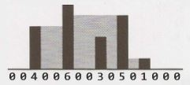

## 17 Hard


17.10  Majority Element: A majority element is an element that makes up more than half of the items in an array. Given a positive integers array, find the majority element. If there is no majority element, return-1. Do this inO(N) time and O(1) space.

EXAMPLE 

Input: 1  2  5  9  5  9  5  5  5

Output: 5 

Hints:#522, #566, #604,#620,#650
 
17.11   Word Distance: You have a large text file containing  words. Given any two words, find the shortest distance(in terms of number of words) between them in the file.  If the operation  will be repeated many times for the same file(but  different pairs of words),can  you optimize your solution? 

Hints: #486, #501, #538, #558, #633

17.12   BiNode: Consider a simple data structure called  BiNode, which  has pointers to two other nodes. 
```java
public class  BiNode   {
public  BiNode nodel,  node2;
public int data;
}
```
The data structure BiNode could be used to represent both a binary tree (where nodel is the  left node and  node2 is the  right  node) or a doubly linked  list (where nodel is the  previous node and node2 is the  next  node). Implement a method to convert a binary search tree  (implemented with BiNode) into  a doubly linked  list. The values should be kept in order and  the  operation should be performed in place (that  is, on the  original data structure).

Hints: #509, #608, #646, #680, #707, #779


17.13   Re-Space: Oh, no! You have accidentally removed all spaces, punctuation, and  capitalization in a lengthy document. A sentence like "I  reset  the computer. It still  didn't boot!" became"iresetthecomputeritstilldidntboot''. You'll deal  with the punctuation and  capi­ talization later; right now you need to re-insert the spaces. Most of the words are in a dictionary but a few are not.  Given a dictionary (a list of strings) and  the  document (a string),  design an algorithm to unconcatenate the  document in a way that minimizes the  number of unrecognized characters.

EXAMPLE:

Input:     jess looked just like tim her brother

Output: jess  looked just  like  tim her brother (7 unrecognized characters)

Hints: #496, #623, #656, #677, #739, #749


17.14  Smallest K: Design an algorithm to find the smallest K numbers in an array.

Hints: #470, #530, #552, #593, #625, #647, #661, #678


17.15  Longest Word: Given a list of words,  write a program to find the longest word  made of other words in the  list.

EXAMPLE

Input: cat,  banana,  dog,  nana,  walk,  walker,   dogwalker

Output: dogwalker

Hints: #475, #499, #543, #589


17.16  The  Masseuse: A popular masseuse receives a sequence of back-to-back appointment requests and  is debating which  ones to accept. She  needs a 15-minute break between appointments and therefore she  cannot accept any  adjacent requests. Given  a sequence of back-to-back appoint­ ment requests (all multiples of 15 minutes, none overlap, and none can be moved), find the optimal (highest total booked minutes) set the  masseuse can honor. Return  the  number of minutes. 

EXAMPLE

Input:    {30,  15,  60,  75,  45,  15,  15,  45} 

Output:180   minutes  ({30,  60,  45,  45}).

Hints: #495, #504, #576, #526, #542, #554, #562, #568, #578, #587, #607


17.17  Multi Search:  Given a string band an array of smaller strings T, design a method to search b for each small string in T.

Hints:#480,#582,#617,#743

17.18  Shortest Supersequence: You are given  two arrays, one shorter (with all distinct elements) and one longer. Find the shortest subarray in the longer array that contains all the elements in the shorter array. The items can appear in any order.

EXAMPLE

Input:{1, 5, 9}  | {7,  5, 9,  0,   2,  1, 3, 5, 7, 9. 1, 1, 5, 8,   8,   9,   7} 

Output: [7,  10]  (the underlined portion above)

Hints:#645, #652, #669, #687, #697, #725,#731, #741


17.19  Missing Two: You are given an array with all the numbers from 1   to N appearing exactly once, except for one number that is missing. How can you find the missing number in O(N) time and
O(1) space? What if there were two numbers missing?

Hints:#503, #590,#609, #626, #649, #672, #689, #696,#702,#717

17.20  Continuous Median:  Numbers are randomly generated and passed to a method. Write a program to find and maintain the median value as new values are generated.

Hints:#519, #546, #575,#709


17.21  Volume of Histogram: Imagine a histogram (bar graph). Design an algorithm to compute the volume of water it could hold if someone poured water across the top. You can assume that each histogram bar has width 1.

EXAMPLE (Black  bars are the histogram.  Gray is water.)

Input:{0, 0, 4,  0, 0, 6, 0,  0, 3, 0,  5, 0, 1, 0, 0, 0}

Output:26
 


Hints:#629,#640,#657,#658,#662,#676,#693,#734,#742
 

17.22  Word Transformer: Given two words of equal length that are in a dictionary, write a method to transform one word intoanother word by changing only one letter at a time. The new word you get in each step must be in the dictionary.

EXAMPLE

Input: DAMP,  LIKE

Output:DAMP-> LAMP-> LIMP-> LIME-> LIKE

Hints:#506, #535, #556, #580, #598, #618, #738


17.23  Max Black Square: Imagine you have a square matrix, where each cell (pixel) is either black or white Design an algorithm to find the maximum subsquare such that all four borders are filled with black pixels.

Hints: #684, #695, #705, #714, #721, #736


17.24  Max Submatrix: Given an NxN  matrix of positive and negative integers, write code to find the submatrix with the largest possible sum.

Hints: #469, #511, #525, #539, #565, #581, #595, #615, #621


17.25  Word Rectangle: Given a list of millions of words, design an algorithm to create the largest possible rectangle of letters such that every row forms a word (reading left to right) and every column forms a word (reading top to bottom). The words need not be chosen consecutively from the list but all rows must be the same length and all columns must be the same height.

Hints: #477, #500, #748


17.26  Sparse Similarity: The similarity of two documents  (each with distinct words) is defined to be the size of the intersection divided by the size of the union. For example, if the documents consist of integers, the similarity of { 1,  5,  3} and { 1, 7,  2,  3} is 0. 4, because the intersection has size 2 and the union has size 5.

We have a long list of documents (with distinct values and each with an associated ID) where  the similarity is believed to be "sparse:'That  is, any two arbitrarily selected documents are very likely to have similarity  0. Design an algorithm that returns a list of pairs of document  IDs and the associated similarity.

Print only the pairs with similarity greater than 0. Empty documents should not be printed at all. For simplicity, you may assume each document is represented as an array of distinct integers.

EXAMPLE 

Input:
```
13:   {14,   15,   100,   9,   3} 
16:	  {32, 1,   9,   3,   5}
19:   {15, 29,   2,   6,   8,   7} 
24:   {7,   10}
```
Output:
```
ID1,   ID2      SIMILARITY
13,   19          0.1
13,   16           0.25
19,   24           0.14285714285714285
```

Hints: #484, #498, #510, #518, #534, #547, #555, #561, #569, #577, #584, #603, #611, #636

