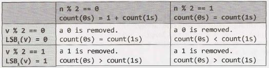
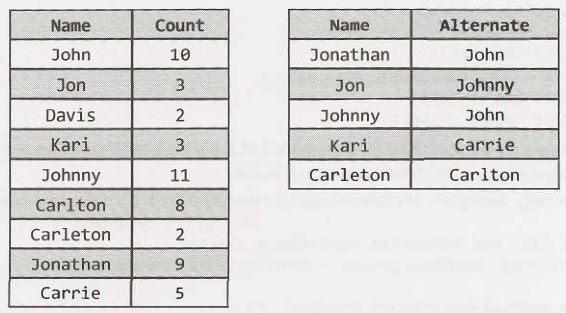
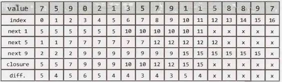
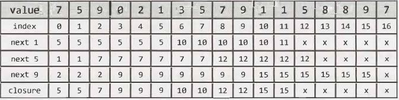

## 17 Hard

Our first instinct in problems like these should be that we're going to have to work with bits. Why? Because when you take away the+ sign, what other choice do we have? Plus, that's how computers do it!

Our next thought should be to deeply understand how addition works. We can walk through an addition problem to see if we can understand something new-some pattern-and then see if we can replicate that with code.

So let's do just that-let's walk through an addition problem. We'll work in base 10 so that it's easier to see. 

To add 759 + 674, I  would usually add digit [0] from each number, carry the one, add digit [1] from each number, carry the one, and so on. You could take the same approach in binary: add each digit, and carry the one as necessary.

Can we make this a little easier? Yes! Imagine I decided to split apart the "addition" and "carry" steps. That is, I do the following:

1. Add 759 + 674, but"forget"  to carry. I then get 323.

2. Add 759 + 674 but only do the carrying, rather than the addition of each digit. I then get 1110.

3. Add the result of the first two operations (recursively, using the same process described in step 1 and 2): 1110 + 323 = 1433.

Now, how would we do this in binary?

1.  If I add two binary numbers  together, but forget to carry, the ith bit in the sum will be 0 only if a and b have the same ith bit (both 0 or both 1). This is essentially an XOR.
2.  If I add two numbers together but only carry, I will have a 1 in the ith bit of the sum only if bits i - 1 of a and b are both ls. This is an AND, shifted.
3.  Now, recurse until there's nothing to carry.

The following code implements this algorithm.

```java
1	int  add(int  a,  int  b) {
2		if (b ==  0) return  a;
3		int  sum   =  a Ab;// add without  carrying
4		int  carry =   (a & b) <<  1; //  carry,  but don't  add
5		return add(sum,   carry); //  recurse with  sum + carry
6	}
```
Alternatively, you can implement this iteratively.
```java
1	int add(int a,   int b)  {
2		while   (b   != 0)  {
3			int sum =  a  Ab; // add  without carrying
4			int carry =  (a &   b)  <<  1; // carry, but don't add
5			a  = sum;
6			b  = carry;
7		}
8		return  a;
9	}
```
Problems requiring us to implement core operations like addition and subtraction are relatively common. The key in all of these problems is to dig into how these operations are usually implemented, so that we can re-implement them with the constraints of the given problem.


**17.2    Shuffle:** Write a method to shuffle a deck of cards. It must be a perfect shuffle-in other words, each of the 52! permutations  of the deck has to be equally likely. Assume that you are given a random number generator which is perfect.

SOLUTION

---

This is a very well known interview question, and a well known algorithm. If you aren't one of the lucky few to already know this algorithm, read on.

Let's imagine our n-element array. Suppose it looks like this: 

	[l] [2]  [3]  [4]  [5]

Using our BaseCase and Buildapproach,wecan askthisquestion:suppose we had a method shuffle ( ...) that worked on n  -   1 elements. Could we use this to shuffle n elements?

Sure. In fact, that's quite easy. We would first shuffle the first n - 1   elements. Then, we would take the nth element and randomly swap it with an element in the array. That's it!

Recursively, that algorithm looks like this:
```java
1 	/*   Random  number between  lower  and  higher,  inclusive*/
2 	int rand(int lower,   int higher) {
3 		return lower  + (int)(Math.random() *    (higher  -  lower  + l));
4 	}
5	
6 	int[]   shuffleArrayRecursively(int[]  cards, int i) {
7 		if (i == 0)  return  cards;
8	
9 		shuffleArrayRecursively(cards,  i -  1);//    Shuffle earlier  part
10		int k = rand(0,  i);//  Pick  random index  to swap with
11	
12		/*   Swap element k  and  i */
13		int temp =  cards[k];
14		cards(k]      cards(i];
15		cards[i)  =  temp;
16	
17		/* Return   shuffled array*/
18		return cards;
19	}
```

What would this algorithm look like iteratively? Let's think  about it. All it does is moving through the  array and, for each element i. swapping array[i] with a random element between 0 and i, inclusive.

This is actually a very clean  algorithm to implement iteratively:
```java
1	void shuffleArrayiteratively(int[]  cards) {
2		for (inti = 0; i <  cards.length;   i++) {
3			int k  =  rand(0,  i);
4			int temp = cards[k];
5			cards[k]  =  cards[i];
6			cards[i] = temp;
7		}
8	}
```
The iterative approach is usually  how we see this algorithm written.


**17.3  Random Set:** Write a method to randomly generate a set of m integers from an array of size n. Each element must have  equal probability of being chosen.

SOLUTION

---

Like the  prior problem which was similar, (problem 17.2 on page 531), we can  look at this problem recur­sively using the  Base Case and Build approach.

Suppose we have an algorithm that can pull a random set of m elements from an array of size n - 1. How can we use this algorithm to pull a random set of m elements from  an array of size n?

We can  first pull a random set  of size m from  the  first n    -   1 elements. Then,  we just need to decide if array[ n] should be inserted into  our subset (which  would require pulling out  a random element from it). An easy way to do this is to pick a random number k from 0 through n. If k  <  m, then insert array[ n] into  subset[ k]. This will both "fairly" (i.e., with proportional probability) insert  array[n] into the  subset and "fairly" remove a random element from the  subset.

The pseudocode for this recursive algorithm would look like this:
```java
1 	int[] pickMRecursively(int[]  original, int m,  int i) {
2	if (i +  1  ==  m)  { // Base   case
3 			/*  return first  m   elements of original  */
4 		}  else if (i +  1  >   m)  {
5 			int[]  subset = pickMRecursively(original,  m,  i -  1);
6 			int k  =    random   value  between 0  and   i, inclusive
7 			if (k <   m)  {
8 				subset[k]  =  original[i];
9 			}
10			return subset;
11		}
12		return null;
13	}
```
This is even cleaner to  write  iteratively. In this  approach, we  initialize  an  array  subset to  be  the  first m elements in original. Then,  we iterate through the  array, starting at element m, inserting array[ i] into the subset at (random) position k whenever k   <  m.
```java
1    int[] pickMiteratively(int[] original,  int  m)  {
2    	int[]  subset =  new  int[m];
3   
4   	/* Fill  in subset array   with  first  part of  original array */
5   	for (int i =  0;  i <  m  ;   i++)   {
6   		subset[i] =  original[i];
7   	}
8   
9   	/* Go  through rest  of  original  array.  */
10   	for (int i = m;   i <   original.length;  i++)  {
11   		int k  =  rand(0, i);  //Random#  between  0 and  i, inclusive
12   		if (k  <  m)   {
13   			subset[k] =  original[i];
14   		}
15   	}
16   
17   	return  subset;
18   }
```

Both solutions are, not surprisingly, very similar to the algorithm to shuffle an array.


**17.4    Missing  Number:** An array A contains all the integers from O to n, except for one number which is missing. In this problem, we cannot access an entire integer in A with a single operation. The elements of A are represented in binary, and the only operation we can use to access them is "fetch the jth bit of A[i]," which takes constant time. Write code to find the missing integer. Can you do it in O(n) time?

SOLUTION

---

You may have seen a very similar sounding  problem: Given a list of numbers from O to n, with exactly one number removed, find the missing number. This problem can be solved by simply adding the list of numbers and comparing it to the actual sum of O through n, which is n(n+1)/2. The difference will be the missing number.

We could solve this by computing the value of each number, based on its binary representation, and calcu­lating the sum.

The runtime of this solution is n * length(n), when length is the number of bits in n. Note that length(n) = log2(n). So, the runtime is actually O(n log(n) ).  Not quite good enough!

So how else can we approach it?

We can actually use a similar approach, but leverage the bit values more directly. Picture a list of binary numbers (the - - - - - indicates the value that was removed):

```
00000	00100	01000	01100
00001	00101	01001	01101
00010	00110	01010	
-----	00111	01011	
```
Removing the number above creates an imbalance of ls and Os in the least significant bit, which we'll call LSB₁. In a list of numbers from Oto n, we would expect there to be the same number of Os as 1 s (if n is odd), or an additional O if n is even. That is:

	if n %   2 == 1 then  count(0s)  =  count(1s)
	if n %   2 == 0 then  count(0s)  =  1 + count(1s)

Note that this means that count(0s) is always greater than or equal to count (1s).

When we remove  a valuevfrom the  list,we'll know immediately  ifvis even or odd just by looking at the least significant bits of all the other  values in the list.



So,if c ount(0s) <=  c ount(1s),thenvis even. If count(0s) > count(1s), then v is odd. 

We can now remove all the evens and focus on the odds,or remove all the odds  and focus on the evens.

Okay, but how do we figure out what the next bit in v is? If v were contained in our (now smaller) list,then we should expect to find the following (where c ount2 indicates  the number of Os or 1 s in the second least significant bit):

	count₂(0s)  = count₂(ls)  OR count₂(0s) =  1 + count₂(1s)

As in the earlier example,we can deduce the value of the second least significant bit (LSB₂) of v.


Again, we have the same conclusion:

- If count₂(0s)  <=  count₂(1s), then LSB₂(v) = 0. 
- If count₂(0s)  > count₂(1s), then LSB₂(v) = 1.

We can repeat this process for each bit. On each iteration,we count the number of Osand 1s in bit i to check if LSBi(v) is O or 1. Then,we discard the numbers where LSBᵢ(x) != LSBᵢ(v). That is, if v is even, we discard the odd numbers, and so on.

By the end of this process, we will have computed all bits inv.In each successive iteration, we look at n, then n/2, then n/4, and so on, bits. This results in a runtime of O(N).

If it helps,we can also move through this more visually. In the first iteration, we start with all the numbers:
```
00000	00100	01000	01100
00001	00101	01001	01101
00010	00110	01010	
-----	00111	01011	
```
Since count₁(0s)  >  count₁(1s), we know that LSB₁(v)  =   1. Now, discard all numbers x where LSB₁(x)  != LSB₁(v).
```
~00000~	~00100~	~01000~	~01100~
00001	00101	01001	01101
~00010~	~00110~ ~01010~
-----   00111   01011	
```
Now, count₂(0s) > count₂(1s), so we know that LSB₂(v) = 1. Now, discard all numbers x where LSB₂(x)  != LSB₂(v).

```
~00000~	~00100~	~01000~	~01100~
00001	~00101~	~01001~	~01101~
~00010~	~00110~ ~01010~
-----   00111   01011	
```
This time, count₃(0)s <= count₃(1s), we know that LSB₃(v) = 0. Now discard all numbers x where LSB₃(x) != LSB₃(v).
 
```
~00000~	~00100~	~01000~	~01100~
~00001~	~00101~	~01001~	~01101~
~00010~	~00110~ ~01010~
-----   ~00111~   01011	
```

We're down to just one number. In this case, count₄(0s) <= count₄(1s),  so LSB₄(v) = 0.

When we discard all numbers where LSB₄(x) != 0, we'll wind up with an empty list. Once the list is empty, then count₁(0s) <= count₁(1s), so LSBᵢ(v) = 0. In other words, once we have an empty list, we can fill in the rest of the bits of v with 0.

This process will compute that, for the example above, v  =  00011.

The code below implements this algorithm. We've implemented the discarding aspect by partitioning the array by bit value as we go.

```java
1 	int  findMissing(Arraylist<Bitinteger> array) {
2 		/*  Start from the  least significant bit,  and work our  way  up */
3 		return  findMissing(array, 0);
4 	}
5	
6 	int  findMissing(Arraylist<Bitinteger> input,  int  column) {
7 		if (column >=  Bitinteger.INTEGER_SIZE) {//We're  done!
8 			return 0;
9 		}
10		Arraylist<Bitlnteger> oneBits   =  new  Arraylist<Bitlnteger>(input.size() / 2);
11		Arraylist<Bitlnteger> zeroBits  =  new  ArrayList<Bitlnteger>(input.size() / 2);
12	
13		for  (Bitinteger t :   input) {
14			if (t.fetch(column) ==  0)  {
15				zeroBits.add(t);
16			}  else {
17				oneBits.add(t);
18			}
19		}
20		if (zeroBits.size() <=  oneBits.size()) {
21			int v =  findMissing(zeroBits,  column +  1);
22			return (v  << 1)  | 0;
23		}  else {
24			int v =  findMissing(oneBits,  column +  1);
25			return (v  << 1)  | 1;
26		}
27	}
```

In lines 24 and 27, we recursively calculate the other bits of v.Then, we insert either a O or 1, depending on whether or not count₁(0s) <= count₁(1s).


**17.5	Letters and Numbers:** Given an array filled with letters and numbers, find the longest subarray with an equal number of letters and numbers.

SOLUTION

---

In the introduction, we discussed the importance of creating a really good, general-purpose example. That's absolutely true. It's also important, though, to understand what matters.

In this case, we just want an equal number of letters and numbers. All letters are treated identically and all numbers are treated identically. Therefore, we can use an example with a single letter and a single number-or, for that matter, As and Bs, Os and 1s, or Thingls and Thing2s.

With that said, let's start with an example:

	[A, B, A, A, A,  B, B, B, A,  B, A, A,  B, B, A, A, A, A, A, A]

We're looking for the smallest subarray where count (A,  subarray) =   count(B,  subarray).

**Brute Force**

Let's start with the obvious solution. Just go through all subarrays, count the number ofAs and Bs (or letters and numbers), and find the longest one that is equal.

We can make one small optimization to this. We can start with the longest subarray and, as soon as we find one which fits this equality condition, return it.
```java
1 	/* Return the largest  subarray with  equal number of  0s and ls. Look at  each
2 	* subarray,  starting from the longest. As soon as we  find  one that's equal,  we
3 	*  return. */
4 	char[]  findLongestSubarray(char[]  array)  {
5 		for  (int len = array.length; len  >   1; len--)  {
6 			for  (int i = 0; i <=  array.length -  len;  i++) {
7 				if (hasEquallettersNumbers(array, i,  i +  len  - 1)) {
8 					return extractSubarray(array, i,  i +  len  - 1);
9 				}
10			}
11		}
12		return  null;
13	}
14	
15	/* Check if subarray has equal number of  letters and numbers. */
16	boolean hasEqualLettersNumbers(char[] array,  int start, int end) {
17		int counter =  0;
18		for  (int i = start;   i <=  end; i++) {
19			if (Character.isletter(array[i])) {
20				counter++;
21			}  else  if (Character.isDigit(array[i])) {
22				counter--;
23			}
24		}
25		return  counter  ==   0
26	}
27	
28	/* Return subarray of  array between start and end (inclusive). */
29	char[]  extractSubarray(char[] array,  int start, int end) {
30		char[]  subarray =  new   char[end -  start +  1];
31		for  (int i = start;   i <=  end; i++) {
32			subarray[i  - start] = array[i];
33		}
34		return subarray;
35	}
```
Despite the one optimization we made, this algorithm is still O(N²), where N is the length of the array.

**Optimal Solution**

What we're trying to do is find a subarray where the count of letters equals the count of numbers. What if we just started from the beginning, counting the number of letters and numbers?

|    |    |    |    |    |    |    |    |    |    |    |    |    |    |    |    |    |    |    |    |    |
| -- | -- | -- | -- | -- | -- | -- | -- | -- | -- | -- | -- | -- | -- | -- | -- | -- | -- | -- | -- | -- |
|    | a  | a  | a  | a  | 1  | 1  | a  | 1  | 1  | a  | a  | 1  | a  | a  | 1  | a  | a  | a  | a  | a  |
| #a | 1  | 2  | 3  | 4  | 4  | 4  | 5  | 5  | 5  | 6  | 7  | 7  | 8  | 9  | 9  | 10 | 11 | 12 | 13 | 14 |
| #1 | 0  | 0  | 0  | 0  | 1  | 2  | 2  | 3  | 4  | 4  | 4  | 5  | 5  | 5  | 6  | 6  | 6  | 6  | 6  | 6  |

Certainly, whenever the number of letters equals the number of numbers, we can say that from index Oto that index is an "equal" subarray.

That will only tell us equal subarrays that start at index 0. How can we identify all equal subarrays?

Let's picture this. Suppose we inserted an equal subarray (like a11a1a) after an array (like a1aaa1). How would that impact the counts?

|    | a  | 1  | a  | a  | a  | 1  | I  | a  | 1  | 1  | a  | 1  | a  |
| -- | -- | -- | -- | -- | -- | -- | -- | -- | -- | -- | -- | -- | -- |
| #a | 1  | 1  | 2  | 3  | 4  | 4  | I  | 5  | 5  | 5  | 6  | 6  | 7  |
| #1 | 0  | 1  | 1  | 1  | 1  | 2  | I  | 2  | 3  | 4  | 4  | 5  | 5  |

Study the numbers before the subarray (4, 2) and the end (7, 5). You might notice that, while the values aren't the same, the differences are: 4   -   2  =    7   -   5. This makes sense. Since they've added the same number of letters and numbers, they should maintain the same difference.

> Observe that when the difference is the same, the subarray starts one after the initial matching index and continues through the final matching index. This explains line 10 in the code below.


Let's update the earlier array with the differences.
|    |    |    |    |    |    |    |    |    |    |    |    |    |    |    |    |    |    |    |    |    |
| -- | -- | -- | -- | -- | -- | -- | -- | -- | -- | -- | -- | -- | -- | -- | -- | -- | -- | -- | -- | -- |
|    | a  | a  | a  | a  | 1  | 1  | a  | 1  | 1  | a  | a  | 1  | a  | a  | 1  | a  | a  | a  | a  | a  |
| #a | 1  | 2  | 3  | 4  | 4  | 4  | 5  | 5  | 5  | 6  | 7  | 7  | 8  | 9  | 9  | 10 | 11 | 12 | 13 | 14 |
| #1 | 0  | 0  | 0  | 0  | 1  | 2  | 2  | 3  | 4  | 4  | 4  | 5  | 5  | 5  | 6  | 6  | 6  | 6  | 6  | 6  |
| -  | 1  | 2  | 3  | 4  | 3  | 2  | 3  | 2  | 1  | 2  | 3  | 2  | 3  | 4  | 3  | 4  | 5  | 6  | 7  | 8  |

Whenever we return the same difference, then  we know we have found an equal subarray. To find the biggest subarray, we just have to find the two indices farthest apart with the same value.

To do so, we use a hash table to store the first time we see a particular difference.Then, each time we see the same difference, we see if this subarray (from first occurrence of this index to current index) is bigger than the current max. If so, we update the max.
```java
1 	char[]  findLongestSubarray(char[] array)  {
2 		/* Compute deltas between  count  of  numbers  and  count  of  letters.*/
3 		int[]  deltas =  computeDeltaArray(array);
4	
5 		/* Find  pair in deltas with  matching  values  and  largest span.   */
6 		int[] match =  findlongestMatch(deltas);
7	
8 		/* Return  the subarray. Note  that it starts one  *after* the   initial occurence  of
9 		* this delta. */
10		return extract(array,  match[0]  + 1,  match[l]);
11	}
12	
13	/*   Compute  the  difference between the  number of  letters and numbers between the
14	 * beginning  of  the  array and each  index. */
15	int[] computeDeltaArray(char[] array)  {
16		int[]  deltas =  new  int[array.length];
17		int delta =  0;
18		for   (int i = 0;  i <   array.length;  i++)  {
19			if (Character.isletter(array[i])) {
20				delta++;
21			} else if (Character.isDigit(array[i])) {
22				delta--;
23			}
24			deltas[i] = delta;
25		}
26		return deltas;
27	}
28	
29	/* Find  the  matching  pair of  values   in  the  deltas array with  the  largest
30	 * difference in  indices. */
31	int[] findlongestMatch(int[] deltas)  {
32		HashMap<Integer, Integer> map =  new HashMap<Integer, Integer>();
33		map.put(0, -1);
34		int[] max =  new int[2];
35		for  (int i = 0;  i < deltas.length;  i++)  {
36			if (!map.containsKey(deltas[i])) {
37				map.put(deltas[i],   i);
38				} else {
39					int match =  map.get(deltas[i]);
40					int distance =  i -  match;
41					int longest =  max[l]  - max[0];
42				if  (distance >  longest) {
43					max[l]  =  i;
44					max[0] =  match;
45				}
46			}
47		}
48		return max;
49	}
50	
51	char[] extract(char[] array, int start,  int end)  {/* same */}
```

This solution takes 0(N) time, where N is size of the array.

 
**17.6    Count  of 2s:** Write a method to count the  number of 2s that appear in all the  numbers between O and  n (inclusive). 


SOLUTION
 
---

Our first approach to this problem can be-and probably should be-a brute force solution. Remember that interviewers want to see how you're approaching a problem. Offering a brute force solution is a great way to start.
```java
1 	/*Counts  the  number of  '2'  digits between 0 and n   */
2 	int numberOf2sinRange(int  n)  {
3 		int count =  0;
4 		for  (int i = 2;  i <= n;  i++)  { //Might  as  well  start at 2
5 			count  += number0f2s(i);
6 		}
7 		return count;
8 	}
9	
10	/*  Counts  the   number of   '2'  digits in a  single number */
11	int  number0f2s(int n)  {
12		int count  =  0;
13		while   (n  >   0)  {
14			if (n  %  10 == 2)  {
15				count++;
16			}
17			n  = n  / 10;
18		}
19		return count;
20	}
```

The only interesting part is that it's probably cleaner to separate out number0f2s into a separate method. This demonstrates an eye for code cleanliness.

**Improved Solution**

Rather than looking at the problem by ranges of numbers, we can look at the problem digit by digit. Picture a sequence of numbers:
```
  0    1   2   3   4   5   6   7   8   9
 10   11  12  13  14  15  16  17  18  19
 20   21  22  23  24  25  26  27  28  29
 ...
110  111 112 113 114 115 116 117 118 119
```
We know that roughly one tenth of the time, the last digit will be a 2 since it happens once in any sequence of ten numbers. In fact, any digit is a 2 roughly one tenth of the time.

We say "roughly" because there are (very common) boundary conditions. For example, between 1 and 100, the 1O's digit is a 2 exactly 1/10ᵗʰ of the time. However, between  1   and 37, the 1O's digit is a 2 much more than 1/10ᵗʰ of the time.

We can work out what exactly the ratio is by looking at the three cases individually: digit < 2, digit =  2, and digit >   2.

*Case digit< 2*

Consider the value x  =  61523  and d  =  3, and observe that x [ d]   =  1 (that is, the dth digit of x is 1 ). There are 2s at the 3rd digit in the ranges 2000   -  2999, 12000  -  12999, 22000  -  22999, 32000  - 32999, 42000  -  42999,  and 52000  -  52999. We will not yet have hit the range 62000  -  62999, so there are 6000 2s total in the 3rd digit. This is the same amount as if we were just counting all the 2s in the 3rd digit between  1  and 60000.

In other words, we can round down to the nearest 10ᵈ⁺¹, and then divide by 10, to compute the number of 2s in the dth digit.

```
if x[d] < 2: count2sinRangeAtDigit(x, d) = 
	let y  =  round  down to nearest 10⁽ᵈ⁺¹⁾
	return y  / 10
```
*Case digit> 2*

Now, let's look at the case where dth digit of xis greater than 2(x[d] > 2). We can apply almost the exact same logic to see that there are the same number of 2s in the 3rd digit in the range 0 - 63525 as there as in the range 0 - 70000. So, rather than rounding down,  we round up.
```
if  x[d] >  2:   count2slnRangeAtDigit(x,  d)=
	let y  =  round up  to nearest 10a+i
	return y  / 10
```
*Case digit= 2*

The final case may be the trickiest,  but it follows from the earlier logic. Consider x =  62523 and d =  3. We know that there are the same ranges of2s from before (that is, the ranges 2000  -  2999, 12000  -  12999, ..., 52000  -   52999). How many  appear in the  3rd digit  in the final, partial range from 62000  -   62523? Well, that should be pretty easy. It's just 524 (62000,  62001,  ...,   62523).
```
if  x[d]  =  2:   count2sinRangeAtDigit(x, d) =
	let y =  round down  to nearest 10⁽ᵈ⁺¹⁾
	let z =  right  side of x  (i.e., x % 10ᵈ)
	return y / 10 + z + 1
```
Now, all you  need is to iterate through each digit  in the  number. Implementing this  code is reasonably straightforward.
```java
1 	int count2sInRangeAtDigit(int  number, int  d) {
2 		int powerOf10 =  (int) Math.pow(10,  d);
3 		int nextPowerOf10  =  power0f10  *  10;
4 		int right =  number % power0f10;
5	
6 		int roundDown   =  number   -  number % nextPowerOf10;
7 		int  roundup =  roundDown +  nextPowerOf10;
8	
9 		int digit =  (number / power0f10) % 10;
10		if (digit < 2) { // if  the digit in spot digit is
11			return roundDown   / 10;
12		}  else if (digit == 2) {
13			return roundDown   / 10 +  right +  1;
14		}  else {
15			return  roundup / 10;
16		}
17	}
18	
19	int count2sInRange(int  number) {
20		int count =  0;
21		int len =  String.valueOf(number).length();
22		for (int digit = 0;   digit <  len; digi + t + )  {
23			count +=  count2sInRangeAtDigit(number, digit);
24		}
25		return count;
26	}
```
This question requires very careful  testing. Make sure  to generate a list of test  cases,  and  to work through each of them.


**17.7	Baby Names:** Each year, the government  releases a list of the 10,000 most common baby names and their frequencies (the number of babies with that name). The only problem with this is that some names have multiple spellings. For example, "John" and "Jon" are essentially the same name but would be listed separately in the list. Given two lists, one of names/frequencies  and the other of pairs of equivalent names, write an algorithm to print a new list of the true frequency of each name. Note that if John and Jon are synonyms, and Jon and Johnny are synonyms, then John and Johnny are synonyms. (It is both transitive and symmetric.) In the final list, any name can be used as the "real" name.

EXAMPLE 

Input:
```
	Names: John (15), Jon (12), Chris  (13), Kris (4), Christopher (19)
	Synonyms: (Jon, John), (John, Johnny), (Chris,  Kris), (Chris,  Christopher) 
```
Output: John (27), Kris (36)


**SOLUTION**

---

Let's start off with a good example. We want an example with some names with multiple synonyms and some with none. Additionally, we want the synonym list to be diverse in which name is on the left side and which is on the right. For example, we wouldn't want Johnny to always be the name on the left side as we're creating the group of (John, Jonathan, Jon, and Johnny).



The final list should be something like: John (33), Kari (8), Davis(2), Carleton(10).

**Solution #1**

Let's assume our baby names list is given to us as a hash table. (If not, it's easy enough to build one.)

We can start reading pairs in from the synonyms list. As we read the pair (Jonathan, John), we can merge the counts for Jonathan and John together. We'll need to remember, though, that we saw this pair, because, in the future, we could discover that Jonathan is equivalent to something else.

We can use a hash table (L1) that maps from a name to its "true" name. We'll also need to know, given a "true" name, all the names equivalent to it. This will be stored in a hash table L2. Note that L2 acts as a reverse lookup of L1.

	READ   (Jonathan,  John)
		Li.ADD  Jonathan  -> John
		L2.ADD  John  -> Jonathan
	READ   (Jon,   Johnny)
		Li.ADD  Jon  -> Johnny
		LZ.ADD   Johnny ->  Jon
	READ   (Johnny,   John)
		LI.ADD  Johnny -> John
		Li.UPDATE  Jon  -> John
		LZ.UPDATE  John  -> Jonathan,   Johnny,  Jon

If we later find that John is equivalent to, say, Jonny, we'll need to look up the names in L1 and L2 and merge together all the names that are equivalent to them.

This will work, but it's unnecessarily complicated to keep track of these two lists.

Instead, we can think of these names as"equivalenceclasses:'When we find a pair (Jonathan, John), we put these in the same set (or equivalence classes). Each name maps to its equivalence  class. All items in the set map to the same instance of the set.

If we need to merge two sets, then we copy one set into the other and update the hash table to point to the new set.
	
	READ   (Jonathan,  John)
		CREATE  Setl =  Jonathan,   John
		L1.ADD  Jonathan  -> Set1
		L1.ADD  John  -> Set1
	READ   (Jon,   Johnny)
		CREATE  Set2  =  Jon,  Johnny
		L1.ADD  Jon  -> Set2
		L1.ADD   Johnny -> Set2
	READ   (Johnny,   John)
		COPY  Set2  into Set1.
			Setl =  Jonathan,   John,  Jon,  Johnny
		L1.UPDATE  Jon  -> Set1
		L1.UPDATE   Johnny -> Set1

In the last step above, we iterated through all items in S et2 and updated the reference to point to Setl. As we do this, we keep track of the total frequency of names.
```java 
1 	HashMap<String, Integer>  trulyMostPopular(HashMap<String, Integer> names,
2 	String[][] synonyms) {
3 		/*  Parse  list and initialize equivalence  classes.*/
4 		HashMap<String, NameSet>  groups  =  constructGroups(names);
5	
6 		/*  Merge equivalence classes  together.  */
7 		mergeClasses(groups,  synonyms);
8	
9 		/*  Convert  back to  hash  map. */
10		return convertToMap(groups);
11	}
12	
13	/* This  is the  core  of  the  algorithm. Read through  each  pair. Merge their
14	 * equivalence classes  and update  the  mapping of  the  secondary  class to  point to
15	 * the  first set. */
16	void  mergeClasses(HashMap<String,  NameSet>  groups,  String[][] synonyms) {
17		for  (String[] entry :  synonyms) {
18			String namel =  entry[e];
19			String name2 = entry[l];
20			NameSet  setl =   groups.get(namel);
21			NameSet set2 =  groups.get(name2);
22			if (setl != set2) {
23				/*  Always merge the  smaller set into the  bigger  one.  */
24				NameSet  smaller =  set2.size() <  setl.size() ?  set2 :   setl;
25				NameSet bigger   =  set2.size() <  setl.size() ?  setl :   set2;
26				
27				/*  Merge lists*/
28				Set<String> otherNames =  smaller.getNames();
29				int frequency = smaller.getFrequency();
30				bigger.copyNamesWithFrequency(otherNames,  frequency);
31				
32				/*  Update mapping*/
33				for  (String name :   otherNames)  {
34					groups.put(name, bigger);
35				}
36			}
37		}
38	}
39	
40	/* Read through  (name,  frequency) pairs  and initialize a mapping of  names to
41	 * NameSets (equivalence classes). */
42	HashMap<String, NameSet>  constructGroups(HashMap<String, Integer>  names) {
43		HashMap<String, NameSet>  groups  =  new HashMap<String, NameSet>();
44		for  (Entry<String,  Integer> entry  :   names.entrySet()) {
45			String name =  entry.getKey();
46			int frequency =  entry.getValue();
47			NameSet group =  new NameSet(name, frequency);
48			groups.put(name,    group);
49		}
50		return groups;
51	}
52	
53	HashMap<String, Integer>   convertToMap(HashMap<String, NameSet>  groups)   {
54		HashMap<String, Integer> list =  new HashMap<String, Integer>();
55		for  (NameSet group :  groups.values()) {
56			list.put(group.getRootName(),  group.getFrequency());
57		}
58		return list;
59	}
60	
61	public class NameSet   {
62		private  Set<String> names = new HashSet<String>();
63		private int frequency =  0;
64		private String rootName;
65		
66		public   NameSet(String  name, int freq) {
67			names.add(name);
68			frequency =  freq;
69			rootName =  name;
70		}
71		
72		public   void  copyNamesWithFrequency(Set<String> more,  int freq) {
73			names.addAll(more);
74			frequency += freq;
75		}
76		
77		public   Set<String>   getNames()  {  return names;  }
78		public   String getRootName() {  return rootName; }
79		public   int  getFrequency() {  return frequency;  }
80		public   int size() {  return names.size();}
81	}
```

The runtime of the algorithm is a bit tricky to figure out. One way to think about it is to think about what the worst case is.

For this algorithm, the worst case is where all names are equivalent-and we have to constantly merge sets together. Also, for the worst case, the merging should come in the worst possible way: repeated pairwise merging of sets. Each merging requires copying the set's elements into an existing set and updating the pointers from those items. It's slowest  when the sets are larger.

If you notice the parallel with merge sort (where you have to merge single-element arrays into two-element arrays, and then two-element arrays into four-element arrays, until finally having a full array), you might guess it's O(N log N). That is correct.

If you don't notice that parallel, here's another way to think about it.

Imagine we had the names (a, b, c, d, ..., z). In our worst case, we'd first pair up the items into equivalence classes: (a, b), (c, d), (e, f), ..., (y, z). Then, we'd merge pairs of those: (a, b, c, d), (e, f, g, h), ..., (w, x, y, z). We'd continue doing this until we wind up with just one class.

At each "sweep" through the list where we merge sets together, half of the items get moved into a new set. This takes O(N) work per sweep. (There are fewer sets to merge, but each set has grown larger.)

How many sweeps do we do? At each sweep, we have half as many sets as we did before. Therefore, we do O(log N) sweeps.

Since we're doing O(log N) sweeps and O(N) work per sweep, the total runtime  is O(N log N).

This is pretty good, but let's see if we can make it even faster.

**Optimized Solution**

To optimize the old solution, we should think about what exactly makes it slow. Essentially, it's the merging and updating of pointers.

So what if we just didn't do that? What if we marked that there was an equivalence relationship between two names, but didn't actually do anything with the information yet?

In this case, we'd be building essentially a graph.


Now what? Visually, it seems easy enough. Each component is an equivalent set of names. We just need to group the names by their component, sum up their frequencies, and return a list with one arbitrarily chosen name from each group.

In practice, how does this work? We could pick a name and do a depth-first (or breadth-first) search to sum the frequencies of all the names in one component. We would have to make sure that we hit each compo­ nent exactly once. That's easy enough to achieve: mark a node as visited after it's discovered in the graph search, and only start the search for nodes where visited is false.
```java
1   HashMap<String, Integer> trulyMostPopular(HashMap<String, Integer>  names,
2   String[][] synonyms) {
3   	/* Create  data. */
4   	Graph graph = constructGraph(names);
s   	connectEdges(graph,  synonyms);
6  
7   	/*  Find components.  */
8   	HashMap<String, Integer> rootNames    getTrueFrequencies(graph);
9   	return rootNames;
10  }
11  
12  /*  Add all names to  graph  as  nodes.   */
13  Graph constructGraph(HashMap<String, Integer>  names) {
14  	Graph graph =  new Graph();
1S  	for  (Entry<String,  Integer> entry   :   names.entrySet()) {
16  		String name =  entry.getKey();
17  		int frequency =  entry.getValue();
18  		graph.createNode(name,  frequency);
19  	}
20  	return graph;
21  }
22  
23  /*  Connect synonymous spellings. */
24  void  connectEdges(Graph  graph,  String[][] synonyms) {
25  	for  (String[]  entry :   synonyms) {
26  		String namel = entry[0];
27  		String name2 =  entry[l];
28  		graph.addEdge(name1,    name2);
29  	}
30  }
31  
32  /* Do DFS of each component. If a node has  been visited before, then  its component
33  * has  already been computed. */
34  HashMap<String, Integer>  getTrueFrequencies(Graph graph)  {
35  	HashMap<String, Integer>  rootNames =  new HashMap<String, Integer>();
36  	for  (GraphNode node  :   graph.getNodes()) {
37  		if  (!node.isVisited()) {	// Already  visited this component
38  			int frequency =  getComponentFrequency(node);
39  			String name =  node.getName();
40  			rootNames.put(name,  frequency);
41  		}
42  	}
43  	return rootNames;
44  }
45  
46  /* Do  depth-first search  to  find  the  total frequency  of  this component, and mark
47  * each node as  visited. */
48  int getcomponentFrequency(GraphNode node)  {
49  	if (node.isVisited()) return 0;  // Already  visited
50  	
51  	node.setisVisited(true);
52  	int sum =  node.getFrequency();
53  	for (GraphNode  child  :  node.getNeighbors()) {
54  		sum += getComponentFrequency(child);
55  	}
56  	return sum;
57  }
58  
59  /* Code for GraphNode and Graph  is  fairly  self-explanatory, but  can  be  found  in
60     * the   downloadable   code  solutions.*/
```
To analyze the efficiency, we can think about the efficiency of each part of the algorithm.

- Reading in the data is linear with respect to the size of the data, so it takesO(B  + P) time, where B is the number of baby names and P is the number of pairs of synonyms. This is because we only do a constant amount of work per piece of input data.
- To compute the frequencies, each edge gets "touched" exactly once across all of the graph searches and each node gets touched exactly once to check if it's been visited. The time of this part is O(B   +  P).

Therefore, the total time of the algorithm is 0(B   +  P). We know we cannot do better than this since we must at least read in the B  +  P pieces of data.


**17.8	Circus Tower:** A circus is designing a tower routine consisting of people standing atop one another's shoulders. For practical and aesthetic reasons, each person must be both shorter and lighter than the person below him or her. Given the heights and weights of each person in the circus, write a method to compute the largest possible number of people in such a tower.

EXAMPLE
```
Input(ht,wt): (65,   100)  (70,  150)    (56,  90)    (75,  190)  (60,  95)    (68,  110) 

Output: The longest tower is length 6 and includes from top to bottom:
(56, 90)    (60,95)  (65,100)  (68,110)  (70,150)  (75,190)
```
SOLUTION
---

When we cut out all the "fluff" to this problem, we can understand that the problem is really the following.

*We have a list ofpairs ofitems. Find the longest sequence such that both the first and second items are in non­-decreasing order.*

One thing we might first try is sorting the items on an attribute. This is useful actually, but it won't get us all the way there.

By sorting the items by height, we have a relative order the items must appear in. We still need to find the longest increasing subsequence of weight though.


**Solution 1: Recursive**

One approach is to essentially try all possibilities. After sorting by height, we iterate through the array. At each element, we branch into two choices: add this element to the subsequence (if it's valid)  or do not.
```java
1 	Arraylist<Htwt> longestincreasingSeq(ArrayList<Htwt> items)  {
2 		Collections.sort(items);
3 		return  bestSeqAtindex(items, new Arraylist<Htwt>(), 0);
4 	}
5	
6 	Arraylist<Htwt> bestSeqAtindex(ArrayList<Htwt> array, Arraylist<Htwt> sequence,
7 	int index) {
8 		if  (index >=  array.size())  return sequence;
9	
10		HtWt value   = array.get(index);
11	
12		Arraylist<Htwt>   bestWith  =  null;
13		if (canAppend(sequence,  value))  {
14			ArrayList<HtWt> sequenceWith = (ArrayList<HtWt>) sequence.clone();
15			sequenceWitn.add(value);
16			bestWith = bestSeqAtIndex(array, sequenceWith, index + 1);
17		}
18	
19		ArrayList<Htwt>  bestWitnout = bestSeqAtlndex(array, sequence, index  + 1);
20	
21		if (bestWith ==  null || bestWithout.size() > bestWith.size()) {
22			return  bestWithout;
23		}  else {
24			return  bestWith;
25		}
26	}
27	
28	boolean  canAppend(ArrayList<HtWt>  solution, Htwt value)   {
29		if (solution == null) return false;
30		if (solution.size() == 0)  return true;
31	
32		HtWt last = solution.get(solution.size() -  1);
33		return last.isBefore(value);
34	}
35	
36	Arraylist<HtWt>  max(ArrayList<HtWt> seql,  ArrayList<Htwt>  seq2)  {
37		if (seql == null) {
38			return  seq2;
39		}  else if (seq2  == null) {
40			return seql;
41		}
42		return seql.size()  >   seq2.size()  ?  seql   :   seq2;
43	}
44	
45	public   class Htwt implements Comparable<HtWt>  {
46		private int height;
47		private int weight;
48		public   HtWt(int  h,  int w) {height  =  h;  weight      w;   }
49	
50		public int compareTo(HtWt second)  {
51			if (this.height != second.height) {
52				return ((Integer)this.height).compareTo(second.height);
53			}  else {
54				return ((Integer)this.weight).compareTo(second.weight);
55			}
56		}
57	
58		/* Returns true if "this" should  be  lined up before   "other". Note that it's
59		* possible that this.isBefore(other) and other.isBefore(this) are  both  false.
60		* This  is different from the  compareTo  method,  where if a < b then  b >  a. */
61		public   boolean  isBefore(Htwt other)  {
62			if (height < other.height &&  weight  < other.weight) {
63				return true;
64			}  else {
65				return false;
66			}
67		}
68	}
```
This algorithm will take O(2ⁿ) time. We can optimize it using memoization (that is,  caching the best sequences).

There's a cleaner way to do this though.


**Solution #2: Iterative**

Imagine we had the longest subsequence that terminates with each element, A[ 0] through A[3]. Could we use this to find the longest subsequence that terminates with A[4]?

	Array:  13,  14,  10,  11,  12
	Longest(ending  with  A[0]):   13
	Longest(ending with  A[l]):  13,   14
	Longest(ending  with  A[2]):   10
	Longest(ending with  A[3]):   10,  11
	Longest(ending  with  A[4]):   10,  11,  12

Sure. We just append A[4] on to the longest subsequence that it can be appended to. 

This is now fairly straightforward to implement.
```java
1 	Arraylist<Htwt> longestincreasingSeq(Arraylist<Htwt> array)  {
2 		Collections.sort(array);
3 	
4 		Arraylist<Arraylist<HtWt>> solutions = new Arraylist<Arraylist<Htwt>>();
5 		Arraylist<Htwt> bestSequence =  null;
6	
7 		/*  Find the  longest subsequence  that terminates with  each  element. Track the
8 		* longest overall subsequence  as  we  go. */
9 		for  (int i = 0;  i <  array.size(); i++)  {
10			Arraylist<HtWt>  longestAtindex =  bestSeqAtindex(array, solutions,  i);
11			solutions.add(i,  longestAtindex);
12			bestSequence  =  max(bestSequence,  longestAtindex);
13		}
14	
15		return  bestSequence;
16	}
17	
18	/*  Find the  longest subsequence  which terminates with  this element.   */
19	Arraylist<Htwt> bestSeqAtindex(ArrayList<HtWt>  array,
20	Arraylist<Arraylist<Htwt>> solutions, int index) {
21		HtWt  value  =  array.get(index);
22	
23		Arraylist<Htwt> bestSequence  =  new Arraylist<HtWt>();
24	
25		/*  Find the  longest subsequence  that we  can  append this element  to. */
26		for  (int i = 0;  i <  index;  i++)  {
27			Arraylist<HtWt>  solution =  solutions.get(i);
28			if (canAppend(solution, value))  {
29				bestSequence  =  max(solution,  bestSequence);
30			}
31		}
32	
33		/*  Append  element. */
34		ArrayList<HtWt> best = (Arraylist<Htwt>) bestSequence.clone();
35		best.add(value);
36	
37		return best;
38	}
```
This algorithm operates in O(n²) time. An O(n log(n)) algorithm does exist, but it is considerably  more complicated and it is highly unlikely that you would derive this in an interview-even with some help. However, if you are interested in exploring this solution, a quick internet search will turn up a number of explanations of this solution.


**17.9    Kth Multiple:** Design an algorithm to find the kth number such that the only prime factors are 3, 5, and 7. Note that 3, 5, and 7 do not have to be factors, but it should not have any other prime factors. For example, the first several multiples would be (in order) 1, 3, 5, 7, 9, 15, 21.

SOLUTION
---

Let's first understand what this problem is asking for. It's asking for the kth smallest number that is in the form 3ᵃ * 5ᵇ * 7ᶜ, Let's start with a brute force way of finding this.


**Brute Force**

We know that biggest this kth number could be is 3ᵏ * 5ᵏ * 7ᵏ. So, the "stupid" way of doing this is to compute 3ᵃ * 5ᵇ * 7ᶜ for all values of a, b, and c between 0 and k. We can throw them all into a list, sort the list, and then pick the kth smallest value.
```java
1   int getKthMagicNumber(int k)  {
2   	Arraylist<Integer> possibilities  =  allPossibleKFactors(k);
3   	Collections.sort(possibilities);
4   	return possibilities.get(k);
5   }
6  
7   ArrayList<Integer> allPossibleKFactors(int   k)  {
8   	Arraylist<Integer> values   =  new Arraylist<Integer>();
9   	for  (int a  =  0;  a <=  k;  a++)  {//loop  3
10  		int powA  = (int) Math.pow(3,   a);
11  		for  (int b = 0;  b <= k;  b++) {//loop  5
12  			int powB  = (int) Math.pow(S,   b);
13  			for  (int c  = 0;  c <= k;  c++) {//loop  7
14  				int powc  =   (int) Math.pow( ?,  c);
15  				int value  =  powA  * powB  * powC;
16  
17  				/*   Check for  overflow. */
18  				if  (value < 0  ||    powA  ==  Integer.MAX_VALUE  ||
19  				powB ==  Integer.MAX_VALUE    ||
20  				powC ==  Integer.MAX_VALUE)   {
21  					value  =  Integer.MAX_VALUE;
22  				}
23  				values.add(value);
24  			}
25  		}
26  	}
27  	return values;
28  }
```


What is the runtime of this approach? We have nested for loops, each of which runs for k iterations. The runtime of the allPossibleKFactors isO(k3). Then, we sort the k3   results in D(k3   log  (k3)) time (which is equivalent  toO(k3    log   k)  . This gives us a runtime ofO(k3   log   k).

There are a number of optimizations you could make to this (and better ways of handling the integer over­
flow), but honestly this algorithm is fairly slow. We should instead focus on reworking the algorithm.


**Improved**

Let's picture what our results will look like.

	1        -     3⁰  *  5⁰  *  7⁰
	3        3     3¹  *  5⁰  *  7⁰
	5        5     3⁰  *  5¹  *  7⁰
	7        7     3⁰  *  5⁰  *  7¹
	9       3*3    3²  *  5⁰  *  7⁰
	15      3*5    3¹  *  5¹  *  7⁰
	21      3*7    3¹  *  5⁰  *  7¹
	25      5*5    3⁰  *  5²  *  7⁰
	27      3*9    3³  *  5⁰  *  7⁰
	35      5*7    3⁰  *  5¹  *  7¹
	45      5*9    3²  *  5¹  *  7⁰
	49      7*7    3⁰  *  5⁰  *  7² 
	63     3*21    3²  *  5⁰  *  7¹ 

The question is: what is the next value in the list? The next value will be one of these:

- 3 * (some previous number in list)
- 5 * (some previous  number in list)
- 7 * (some previous number in list)

If this  doesn't immediately jump out at you, think about it this way: whatever the next value (let's call it nv) is, divide it by 3. Will that number have already appeared? As long as nv has factors of 3 in it. yes. The same can be said for dividing it by 5 and 7.

So, we know Aₖ can be expressed as (3,  5  or  7) * (some value in {A₁,..., Aₖ₋₁). We also know that Aₖ is, by definition, the next number in the list. Therefore, Aᵏ will be the smallest"new" number (a number that it's already in {A₁,   •••, Aₖ₋₁}) that can be formed by multiplying each value in the list by 3, 5 or 7.

How would we find Aₖ? Well, we could actually multiply each number in the list by 3, 5, and 7 and find the smallest element that has not yet been added to our list. This solution is O(k²). Not bad, but I think we can do better.

Rather than Aₖ trying to"pull" from a previous element in the list (by multiplying  all of them by 3, 5 and 7), we can think about each previous value in the list as "pushing" out three subsequent values in the list. That is, each number Aᵢ will eventually  be used later in the list in the following forms:


- 3 * Aᵢ
- 5 * Aᵢ
- 7 * Aᵢ

We can use this thought  to plan in advance. Each time we add a number Ai  to the list, we hold on to the values 3Aᵢ, 5Aᵢ, and 7Aᵢ in some sort of temporary list. To generate Aᵢ₊₁' we search through this temporary list to find the smallest value.

Our code looks like this:
```java
1 	int removeMin(Queue<Integer>   q)  {
2 		int min = q.peek();
3 		for   (Integer v  :  q)  {
4 			if (min  >   v)  {
5 				min =  v;
6 			}
7 		}
8 		while  (q.contains(min)) {
9 			q.remove(min);
10		}
11		return min;
12	}
13
14	void  addProducts(Queue<Integer>  q,  int v)  {
15		q.add(v *  3);
16		q.add(v *  5);
17		q.add(v *  7);
18	}
19
20	int getKthMagicNumber(int   k)  {
21		if (k  <   0)  return 0;
22
23		int val =  l;
24		Queue<Integer> q  =  new Linkedlist<Integer>();
25		addProducts(q,  1);
26		for   (int i = 0;  i < k;  i++)  {
27			val = removeMin(q);
28			addProducts(q,  val);
29		}
30		return val;
31	}
```
This algorithm is certainly much, much better than our first algorithm, but it's still not quite perfect.


**Optimal Algorithm**

To generate a new element Ai, we are searching through a linked list where each element looks like one of:

- 3 * previous element
- 5 * previous element
- 7 * previous element

Where is there unnecessary work that we might be able to optimize out? Let's imagine our list looks like:

	q6   =  {7A₁,     SA₂,    7A₂,    7A₃,     3A₄,     SA₄,    7A₄,     SA₅,  7A₅}

When we search this list for the min, we check if 7A₁   <   min, and then later we check if 7A₅   <   min. That seems sort of silly, doesn't it? Since we know that A1   <   As, we should only need to check 7A1

If we separated the list from the beginning by the constant factors, then we'd only need to check the first of the multiples of 3, 5 and 7. All subsequent elements would be bigger.


That is, our list above would look like:
Q36 =  {3A₄}
Q56 =  {5A₂, 5A₄, 5A₅}
Q76 =  {7A₁, 7A₂, 7A₃, 7A₄, 7A₅}

To get the min, we only need to look at the fronts of each queue:

	y  = min(Q3.head(),  Q5.head(),  Q7.head())

Once we compute y, we need to insert 3y into Q3, Sy into QS, and 7y into Q7. But, we only want to insert these elements if they aren't already in another list.

Why might for example, 3y already be somewhere in the holding queues? Well, if y was pulled from Q7, then that means that y  = 7x, for some smaller x. If 7x is the smallest value, we must have already seen 3x. And what did we do when we saw 3x? We inserted 7  * 3x into Q7. Note that 7  *  3x  =  3  *  7x  =  3y.

To put this another way, if we pull an element from Q7, it will look like 7  * suffix, and we know we have already handled 3  *  suffix and 5  *  suffix. In handling 3  *  suffix, we inserted 7  *  3  *  suffix into a Q7. And in handling 5  *  suffix, we know we inserted 7  * 5  *  suffix in Q7. The only value we haven't seen yet is 7 * 7 * suffix, so we just insert 7  *  7  *  suffix into Q7.

Let's walk through this with an example to make it really clear. 

	initialize:
		Q3 = 3
		Q5 = 5
		Q7 = 7
	remove min =  3. insert 3*3 in Q3,  5*3 into Q5, 7*3 into Q7.
		Q3 = 3*3
		Q5 = 5, 5*3
		Q7 = 7, 7*3
	remove min =  5. 3*5 is a  dup,  since we already  did  5*3.  insert 5*5 into Q5, 7*5
	into Q7.
		Q3 = 3 * 3
		Q5 = 5*3,   5*5
		Q7 = 7,  7*3, 7*5
	remove min =  7. 3*7 and  5*7 are  dups,   since we already  did  7*3 and  7*5.  insert 7*7
	into Q7.
		Q3 = 3*3
		Q5 = 5*3, 5*5
		Q7 = 7*3, 7*5, 7*7
	remove min =  3*3 =  9. insert 3*3*3 in Q3,  3*3*5 into Q5, 3*3*7 into Q7.
		Q3 = 3*3*3
		Q5 = 5*3, 5*5, 5*3*3
		Q7 = 7*3, 7*5, 7*7, 7*3*3
	remove min =  5*3  =  15.  3*(5*3)   is a  dup,  since we already  did  5*(3*3). insert
	5*5*3 in Q5,  7*5*3 into Q7.
	3*3*3
		Q3 = 3*3*3
		Q5 = 5*5, 5*3*3, 5*5*3
		Q7 = 7*3, 7*5, 7*7, 7*3*3, 7*5*3
	remove min =  7*3  =  21.  3*(7*3)   and  5*(7*3)   are  dups,   since we already  did  7*(3*3)
	and  7*(5*3). insert  7*7*3 into Q7.
		Q3 = 3*3*3
		Q5 = 5*5, 5*3*3, 5*5*3
		Q7 = 7*5, 7*7, 7*3*3, 7*5*3, 7*7*3

Our pseudocode for this problem is as follows:

1.  Initialize array and queues Q3, Q5, and Q7
2.  Insert 1  into array.
3.  Insert 1*3, 1 *5 and 1*7 into Q3, Q5, and Q7 respectively.
4.  Let x be the minimum element in Q3, Q5, and Q7. Append x to magic.
5.  If x was found in:

		Q3 -> append x*3, x*5 and x*7 to Q3, QS, and Q7. Remove x from Q3. 
		Q5 -> append x*5 and x*7 to Q5 and Q7. Remove x from Q5.
		Q7 -> only append x*7 to Q7. Remove x from Q7.

6.  Repeat steps 4- 6  until we've found k elements. 

The code below implements this algorithm.
```java
1 	int getKthMagicNumber(int  k)  {
2 		if (k  <   0)  {
3 			return  0;
4		}
5		int val = 0;
6		Queue<Integer>  queue3 = new Linkedlist<Integer>();
7		Queue<Integer>  queue5 = new Linkedlist<Integer>();
8		Queue<Integer>  queue7 = new Linkedlist<Integer>();
9		queue3.add(l);
10
11		/*  Include  0th  through kth  iteration  */
12		for (int i = 0; i <= k; i++)  {
13			int v3  = queue3.size() > 0 ? queue3.peek() : Integer.MAX_VALUE;
14			int v5  = queue5.size() > 0 ? queue5.peek() : Integer.MAX_VALUE;
15			int v7  = queue7.size() > 0 ? queue7.peek() : Integer.MAX_VALUE;
16			val = Math.min(v3,   Math.min(v5,   v7));
17			if (val == v3)  { // enqueue  into queue  3,   5 and  7
18				queue3.remove();
19				queue3.add(3 * val);
20				queue5.add(5 * val);
21			}  else if (val == v5)  { // enqueue  into queue  5 and  7
22				queue5.remove();
23				queue5.add(5  *   val);
24			}  else if (val == v7)  { // enqueue  into Q7
25				queue7.remove();
26			}
27			queue7.add(7 * val);// Always enqueue  into Q7
28		}
29		return val;
30	}
```

When you get this question, do your best to solve it-even though it's really difficult. You can start with a brute force approach  (challenging, but not quite as tricky), and then you can start trying to optimize it. Or, try to find a pattern in the numbers.

Chances are that your interviewer will help you along when you get stuck. W hatever you do, don't give up! Think out loud, wonder out loud, and explain your thought process.  Your interviewer will probably jump in to guide you.

Remember, perfection on this problem is not expected. Your performance is evaluated  in comparison to other candidates. Everyone struggles on a tricky problem.


17.10  Majority Element: A majority element is an element that makes up more than half of the items in an array. Given a positive integers array, find the majority element. If there is no majority element, return -1. Do this in O(N) time and O(1) space.
```
Input:     1  2  5  9  5  9  5  5  5
Output:    5
```

SOLUTION

---

Let's start off with an example:

	3 1 7 1 3 7 3 7 1 7 7

One thing we can notice here is that if the majority element (in this case 7) appears less often in the begin­ning, it must appear much more often toward the end. That's a good observation to make.

This interview question specifically requires us to do this in O(N) time and O(1) space. Nonetheless, some­ times it can be useful to relax one of those requirements and develop an algorithm. Let's try relaxing the time requirement but staying firm on the O(1) space requirement.

**Solution #1  (Slow)**

One simple way to do this is to just iterate through the array and check each element for whether it's the majority element. This takes O(N²) time and O(1)  space.

```java
1 	int  findMajorityElement(int[] array) {
2 		for (int x :  array) {
3 			if  (validate(array, x)) {
4 				return x;
5 			}
6 		}
7 		return  -1;
8 	}
9
10	boolean   validate(int[]  array, int majority) {
11		int count  = 0;
12		for (int n :  array) {
13			if (n  == majority) {
14				count++;
15			}
16		}
17
18		return count >  array.length /  2;
19	}
```
This does not fit the time requirements of the problem, but it is potentially a starting point. We can think about optimizing this.

**Solution #2 (Optimal)**

Let's think about what that algorithm did on a particular example. Is there anything we can get rid of?


In the very first validation pass, we select 3 and validate it as the majority element. Several elements later, we've still counted just one 3 and several non-3 elements. Do we need to continue checking for 3?

On one hand, yes. 3 could redeem itself and  be the  majority element, if there are a bunch of 3s later  in the array.

On the other hand, not really. If 3 does redeem itself, then we'll encounter those 3s later on, in a subsequent validation step. We could terminate this validate(3) step.

That  logic  is fine  for the  first element, but  what  about the  next  one?  We would  immediately terminate validate(1), validate(7), and so on.

Since the logic  was okay for the  first  element, what if we treated all subsequent elements like they're the first element of some new  subarray? This would  mean that we  start  validate(array[l]) at  index  1, validate(array[2]) at index 2, and  so on.

What would  this look like?

	validate(3)
		sees 3  ->  countYes  =  1,   countNo  =  0 
		sees 1  ->  countYes  =  1,   countNo  =  1
		TERMINATE.   3  is  not majority thus far. 
	validate(l)
		sees 1  ->  countYes  =  0,   countNo  =  0
		sees 7  ->  countYes  =  1,   countNo  =  1
		TERMINATE.   1  is not majority thus far. 
	validate(7)
		sees 7  ->  countYes  =  1,   countNo  =  0
		sees 1  ->  countYes  =  1,   countNo  =  1
		TERMINATE.   7  is  not majority thus far. 
	validate(1)
		sees 1  ->  countYes  =  1,   countNo  =  0
		sees 1  ->  countYes  =  2,   countNo  =  0 
		sees 7  ->  countYes  =  2,   countNo  =  1 
		sees 7  ->  countYes  =  2,   countNo  =  1
		TERMINATE.   1  is not majority thus far. 
	validate(1)
		sees 1  ->  countYes  =  1,   countNo  =  0
		sees 7  ->  countYes  =  1,   countNo  =  1
		TERMINATE.   1  is not majority thus far. 
	validate(7)
		sees 7  ->  countYes  =  1,   countNo  =  0
		sees 7  ->  countYes  =  2,   countNo  =  0 
		sees 3  ->  countYes  =  2,   countNo  =  1  
		sees 7  ->  countYes  =  3,   countNo  =  1 
		sees 7  ->  countYes  =  4,   countNo  =  1 
		sees 7  ->  countYes  =  5,   countNo  =  1 
 
Do we know  at this  point that 7 is the  majority element? Not necessarily. We have eliminated everything before that 7, and  everything after  it. But there could  be no majority element. A quick validate(7) pass that  starts from the beginning can confirm if? is actually  the  majority element. This validate step will be O(N) time,  which  is also our  Best Conceivable Runtime. Therefore, this final validate step won't impact our total  runtime.

This is pretty good, but  let's see  if we can  make this a bit faster. We should notice that some elements are being "inspected" repeatedly. Can we get rid of this?

Lookat the first validate(3). This fails after the subarray[3, 1], because 3 was not the majority element. But because validate fails the instant an element is not  the majority element, it also means nothing else in that subarray was the  majority element. By our earlier  logic,  we  don't  need to call validate(1). We know  that 1 did not  appear more than half the  time.  If it is the majority element, it'll pop up later.

Let's try this again and see if it works out. 

	validate(3)
		sees 3  ->  countYes  =  1,   countNo  =  0
		sees 1  ->  countYes  =  1,   countNo  =  1
		TERMINATE.   3 is not   majority thus   far. skip 1
	validate(7)
		sees 7  ->  countYes  = 1,    countNo  =  0 
		sees 1  ->  countYes  = 1,    countNo  =  1
		TERMINATE.   7 is not   majority thus   far.
	skip 1 
	validate(1)
		sees 1  ->  countYes  =  1,   countNo  = 0
		sees 7  ->  countYes  =  1,   countNo  = 1
		TERMINATE.   1  is not   majority thus   far.
	skip 7 
	validate(7)
		sees 7  ->  countYes  =  1,   countNo  = 0
		sees 3  ->  countYes  =  1,   countNo  = 1
		TERMINATE.   7 is not   majority thus   far. 
	skip 3
	validate(7)
		sees 7  ->  countYes  =  1,   countNo  = 0
		sees 7  ->  countYes  =  2,   countNo  = 0
		sees 7  ->  countYes  =  3,   countNo  = 0

Good! We got the right answer. But did we just get lucky?

We should pause for a moment to think what this algorithm is doing.

1. We start off with [3] and we expand the subarray until 3 is no longer the majority element. We fail at
[3, 1]. At the moment we fail, the subarray can have no majority element.

2.  Then we go to [7] and expand until [7, 1]. Again, we terminate and nothing could be the majority element in that subarray.

3.  We move to [1] and expand to [1, 7]. We terminate. Nothing there could be the majority element.

4.  We go to [7] and expand to [7, 3]. We terminate. Nothing there could be the majority element.
5.  We go to [7] and expand until the end of the array: [ 7,  7,  7]. We have found the majority element
(and now we must validate that).

Each time we terminate the validate step, the subarray has no majority element. This means that there are at least as many non-7s as there are 7s. Although we're essentially removing this subarray from the original array, the majority element will still be found in the rest of the array-and will still have majority status. Therefore, at some point, we will discover the majority element.

Our algorithm can now be run in two passes: one to find the possible majority element and another to vali­ date it. Rather than using two variables to count (countYes and countNo), we'll just use a single count variable that increments and decrements.
```java
1	int  findMajorityElement(int[] array) {
2		int  candidate =  getCandidate(array);
3		return  validate(array,  candidate) ?   candidate :	-1;
4	}
5
6	int  getCandidate(int[] array) {
7		int majority = 0;
8 		int  count =  0;
9 		for (int n   :    array) {
10			if (count ==   0)  { // No majority element in previous set.
11				majority =  n;
12			}
13			if  (n == majority) {
14				count++;
15			}  else {
16				count - -;
17			}
18		}
19		return majority;
20	}
21
22	boolean  validate(int[]  array, int  majority) {
23		int  count =  0;
24		for (int n   :  array)  {
25			if (n ==  majority) {
26				count++;
27			}
28		}
29
30		return count >   array.length  / 2;
31	}
```
This algorithm runs in O(N)  time and O(1) space.


**17.11  Word Distance:** You have a large  text file containing words. Given any two  words, find the shortest distance (in terms of number of words) between them in the file. If the operation will be repeated many times for the same file (but different pairs of words), can you optimize your solution?

SOLUTION

---

We will assume for this question that it doesn't matter whether wordl or word2 appears first. This is a ques­tion you should ask your interviewer.

To solve  this  problem, we  can  traverse the  file just  once.  We remember throughout our  traversal where we've  last  seen wordl and  word2, storing the locations in locationl and  locatioN². If the current locations are better than our best known location, we update the best locations.

The code below implements this algorithm.

```java
1 	LocationPair  findClosest(String[]  words, String wordl, String word2)  {
2 		LocationPair best  =  new  LocationPair(-1,   -1);
3 		LocationPair  current =    new  LocationPair(-1,  -1);
4 		for (int  i =  0;   i <   words.length;  i++) {
5 			String word =  words[i];
6 			if (word.equals(wordl))  {
7 				current.locationl =  i;
8 				best.updateWithMin(current);
9 			}  else if (word.equals(word2)) {
10				current.locatioN² =  i;
11				best.updateWithMin(current); // If  shorter,  update values
12			}
13		}
14		return best;
15	}
16
17	public class  LocationPair {
18		public int locationl,  location2;
19		public LocationPair(int  first, int second)  {
20			setLocations(first, second);
21		}
22
23		public void  setLocations(int first,  int second) {
24			this.locationl = first;
25			this.locatioN² = second;
26		}
27
28		public void  setLocations(LocationPair loc)  {
29			setLocations(loc.locationl, loc.location2);
30		}
31
32		public int  distance() {
33			return  Math.abs(locationl -  location2);
34		}
35
36		public boolean isValid()  {
37			return locationl >=  0  &&  location2 >=  0;
38		}
39
40		public void  updateWithMin(LocationPair loc)  {
41			if (!isValid() ||     loc.distance() <   distance()) {
42				setlocations(loc);
43			}
44		}
45	}
```
If we need to repeat the operation for other pairs of words, we can create a hash table that maps from each word to the locations where it occurs. We'll only need  to read through  the list of words once. After that point, we can do a very similar algorithm but just iterate through the locations directly.

Consider the following lists of locations. 

	listA:  {l,  2,  9,   15,  25}
	listB:  {4,   10,   19}

Picture pointers pA and pB that point to the beginning of each list. Our goal is to make pA and pB point to values as close together as possible.

The first potential pair is (1,  4).

What is the next pair we can find? If we moved pB, then the distance would definitely get larger. If we moved pA, though, we might get a better pair. Let's do that.

The second potential pair is (2, 4). This is better than the previous pair, so let's record this as the best pair. 

We move pA again and get (9,  4). This is worse than we had before.

Now, since the value at pA is bigger than the one at pB, we move pB. We get (9,  10). Next we get (15,  10), then (15,  19), then (25,  19).

We can implement this algorithm as shown below.

```java
1 	LocationPair findClosest(String  wordl,   String word2,
2 	                     HashMaplist<String, Integer>  locations) {
3 		Arraylist<Integer> locationsl =  locations.get(wordl);
4 		Arraylist<Integer> locations2 =  locations.get(word2);
5 		return findMinDistancePair(locationsl, locations2);
6 	}
7
8 	LocationPair findMinDistancePair(Arraylist<Integer>  arrayl,
9 	Arraylist<Integer> array2) {
10		if (arrayl ==  null  ||    array2  ==  null  ||     arrayl.size() ==  0 ||
11		array2.size() ==  0)  {
12			return null;
13		}
14
15		int indexl =  0;
16		int index2  =  0;
17		LocationPair  best  =  new  LocationPair(array1.get(0),  array2.get(0));
18		LocationPair current  =  new  LocationPair(arrayl.get(0), array2.get(0));
19
20		while  (indexl <  arrayl.size() &&   index2  <  array2.size()) {
21			current.setlocations(arrayl.get(indexl),  array2.get(index2));
22			best.updateWithMin(current);  // If shorter, update  values
23			if (current.location! <  current.location2) {
24				indexl++;
25			}  else {
26				index2++;
27			}
28		}
29
30		return best;
31  }
32
33	/*  Precomputation. */
34	HashMaplist<String,  Integer>   getWordlocations(String[]  words)  {
35		HashMaplist<String, Integer> locations =  new  HashMaplist<String,  Integer>();
36		for  (int i = 0;  i <  words.length;  i++)  {
37			locations.put(words[i],  i);
38		}
39		return locations;
40	}
41
42	/*  HashMaplist<String, Integer> is  a  HashMap  that maps from Strings to
43	* Arraylist<Integer>.  See appendix  for  implementation.  * /
```

The precomputation step of this algorithm will take O(N) time, where N is the number of words in the string.

Finding the closest pair of locations will take O(A + B) time, where A is the number of occurrences of the first word and B is the number of occurrences of the second word.


**17.12   BiNode:** Consider a simple data structure called BiNode, which has pointers to two other nodes. The data structure BiNode could be used to represent both a binary tree (where node1 is the left node and node2 is the right node) or a doubly linked list (where node1 is the previous node and node2 is the next node). Implement a method to convert a binary search tree (implemented with BiNode) into a doubly linked list. The values should be kept in order and the operation should be performed in place (that is, on the original data structure).

SOLUTION

---

This seemingly complex problem can be implemented quite elegantly using recursion.  You will need to understand recursion very well to solve it.

Picture a simple binary search tree:


The convert method should transform it into the below doubly linked list:

	0  <->  1  <->  2  <->  3  <->  4  <->  5  <->  6

Let's approach this recursively, starting with the root (node 4).

We know that the left and right halves of the tree form their own "sub-parts" of the linked list (that is, they appear consecutively in the linked list). So, if we recursively converted the left and right subtrees to a doubly linked list, could we build the final linked list from those parts?

Yes! We would simply merge the different parts. The pseudocode looks something like:
```java
1	BiNode convert(BiNode  node)  {
2		BiNode left =  convert(node.left);
3		BiNode right = convert(node.right);
4		mergelists(left,  node,  right);
5		return left;// front of  left
6	}
```
To actually implement the nitty-gritty details of this, we'll need to get the head and tail of each linked list. We can do this several different ways.


**Solution #1: Additional Data  Structure**

The first, and easier, approach is to create a new data structure called NodePair which holds just the head and tail of a linked list. The convert method can then return something of type NodePair.

The code below implements this approach.
```java
1 	private class NodePair {
2 		BiNode head,  tail;
3
4 		public   NodePair(BiNode head,  BiNode tail)  {
5 			this.head =  head;
6 			this.tail =  tail;
7 		}
8 	}
9
10	public NodePair convert(BiNode  root) {
11		if (root ==  null) return null;

12
13		NodePair  part1  = convert(root.node1);
14		NodePair  part2  = convert(root.node2);
15
16		if (part1 != null) {
17			concat(part1.tail,  root);
18		}
19
20		if (part2 != null) {
21			concat(root,  part2.head);
22		}
23
24		return new NodePair(part1 ==    null ?  root : part1. head,
25		part2 ==  null ?  root : part2.tail);
26	}
27
28	public static  void  concat(BiNode  x,  BiNode y)  {
29		x.node2  =  y;
30		y.node1  =  x;
31	}
```
The above code still converts the BiNode data structure in place. We're just using NodePair as a way to return additional data. We could have alternatively used a two-element BiNode array to fulfill the same purposes, but it looks a bit messier (and we like clean code, especially in an interview).

It'd be nice, though, if we could do this without these extra data structures-and we can.


**Solution #2: Retrieving the Tail**

Instead of returning the head and tail of the linked list with NodePair, we can return just the head, and then we can use the head to find the tail of the linked list.
```java
1 	BiNode convert(BiNode  root) {
2 		if (root ==    null) return null;
3 
4 		BiNode partl = convert(root.nodel);
5 		BiNode part2 = convert(root.node2);
6
7 		if (partl != null) {
8 			concat(getTail(partl),  root);
9 		}
10
11		if (part2 != null) {
12			concat(root,  part2);
13		}
14
15		return partl == null ?  root  :  partl;
16	}
17
18	public   static BiNode getTail(BiNode   node)  {
19		if (node  ==  null) return null;
20		while  (node.node2   != null) {
21			node =  node.node2;
22		}
23		return node;
24	}
```
Other than a call to getTail, this code is almost identical to the first solution.  It is not, however, very effi­ cient. A leaf node at depth d will be "touched" by the getTail method d times (one for each node above it), leading to an 0( N² ) overall runtime, where N is the number of nodes in the tree.


**Solution #3: Building a Circular Linked List**

We can build our third and final approach off of the second one.

This approach requires returning the head and tail of the linked list with BiNode. We can do this by returning each list as the head of a circular linked list. To get the tail, then, we simply call head. node1.
```java
1 	BiNode convertToCircular(BiNode root)  {
2 		if (root ==  null) return null;
3 
4 		BiNode partl = convertToCircular(root.node1);
5 		BiNode part3 = convertToCircular(root.node2);
6
7 		if (partl ==  null &&   part3  == null) {
8 			root.node1 =  root;
9 			root.node2 =  root;
10			return root;
11		}
12		BiNode tail3 =  (part3 null) ?  null  : part3.node1;
13
14		/*join  left to  root*/
15		if (partl ==  null) {
16			concat(part3.node1,  root);
17		}  else  {
18			concat(partl.node1,  root);
19		}
20
21		/*join right to  root*/
22		if (part3 ==  null) {
23			concat(root,  partl);
24		}  else   {
25			concat(root,  part3);
26		}
27
28		/*join right to  left*/
29		if (partl != null &&   part3   != null) {
30			concat(tail3,  partl);
31		}
32
33		return partl  ==  null ?  root  :  partl;
34	}
35
36	/*Convert   list to  a circular linked   list, then  break  the  circular connection.*/
37	BiNode convert(BiNode  root) {
38		BiNode  head =  convertToCircular(root);
39		head.node1.node2   =  null;
40		head.node1  =  null;
41		return head;
42	}
```
Observe that we have moved the main parts of the code into c onvertToCircular. The c onvert method calls this method to get the head of the circular linked list, and then breaks the circular connection.

The approach takes O(N) time, since each node is only touched an average of once (or, more accurately,
O(1) times).


**17.13   Re-Space:** Oh, no! You have accidentally removed all spaces, punctuation, and capitalization in a lengthy document. A sentence like "I  reset the  c omputer.  It still didn't boot!" became "iresetthec omputeritstilldidntboot''. You'll deal with the punctuation and capi­ talization later; right now you need to re-insert the spaces. Most of the words are in a dictionary but a few are not. Given a dictionary (a list of strings) and the document (a string), design  an algorithm to unconcatenate the document in a way that minimizes the number of unrecognized characters.

```
EXAMPLE
Input  jesslookedjustliketimherbrother
Output: **jess** looked  just like **tim**  her  brother (7 unrecognized characters)
```

SOLUTION

---

Some interviewers like to cut to the chase and give you the specific problems. Others, though, like to give you a lot of unnecessary context, like this problem has. It's useful in such cases to boil down the problem to what it's really all about.

In this case, the problem  is really about finding a way to break up a string into separate words such that as few characters as possible are "left out" of the parsing.

Note that we do not attempt to "understand" the string. We could just as well parse "this is awesome" to be "this is a we some" as we could "this  is awesome:"

**Brute Force**

The key to this problem is finding a way to define the solution (that is, parsed string) in terms of its sub prob­lems. One way to do this is recursing through the string.

The very first choice we make is where to insert the first space. After the first character? Second character? Third character?

Let's imagine this in terms of a string like thisismikesfavoritefood. What is the first space we insert?

- If we insert a space after t, this gives us one invalid character.
- After th is two invalid characters.
- After thi is three invalid characters.
- At this we have a complete word. This is zero invalid characters.
- At thisi is five invalid characters.
- ... and so on.

After we choose the first space, we can recursively pick the second space, then the third space, and so on, until we are done with the string.

We take the best (fewest invalid characters)  out of all thesechoices and return.

What should the function return? We need both the number of invalid characters in the recursive path as well as the actual parsing. Therefore, we just return both by using a custom-built ParseResult class.
```java
1 	String bestSplit(HashSet<String> dictionary,  String  sentence) {
2 		ParseResult r = split(dictionary,  sentence, 0);
3 		return r ==  null ?  null :  r.parsed;
4 	}
5
6 	ParseResult split(HashSet<String> dictionary,   String  sentence,  int start) {
7 		if (start >=  sentence.length()) {
8 			return new ParseResult(0,  "");
9 		}
10
11		int bestinvalid = Integer.MAX_VALUE;
12		String bestParsing =  null;
13		String partial = "";
14		int index  =  start;
15		while  (index  <  sentence.length()) {
16			char  c = sentence.charAt(index);
17			partial +=  c;
18			int invalid =  dictionary.contains(partial)  ?  0 : partial.length();
19			if (invalid <  bestinvalid) {//Short  circuit
20				/*   Recurse,  putting a space  after this character. If this is better than
21				*  the  current best option, replace the  best option. */
22				ParseResult result = split(dictionary,  sentence, index  + 1);
23				if (invalid +  result.invalid <  bestinvalid) {
24					bestinvalid = invalid +  result.invalid;
25					bestParsing =  partial +  "  " +  result.parsed;
26					if  (bestlnvalid == 0)  break; //Short  circuit
27				}
28			}
29
30			index++;
31		}
32		return new ParseResult(bestinvalid,  bestParsing);
33	}
34
35	public class  ParseResult {
36		public int invalid = Integer.MAX_VALUE;
37		public String parsed = "  ";
38		public ParseResult(int  inv,   String p)  {
39			invalid =  inv;
40			parsed = p;
41		}
42	}
```
We've applied two short circuits here.

- Line 22: If the number of current invalid characters exceeds the best known one, then we know this recursive path will not be ideal. There's no point in even taking it.
- Line 30: If we have a path with zero invalid characters, then we know we can't do better than this. We might as well accept this path.

What's the runtime of this? It's difficult to truly describe in practice as it depends on the (English) language. 

One way of looking at it is to imagine a bizarre language where essentially all paths in the recursion are
taken. In this case, we are making both choices at each character. If there are n characters, this is an O(2ⁿ)runtime.

**Optimized**

Commonly, when we have exponential runtimes for a recursive algorithm, we optimize them  through memoization (that is, caching results). To do so, we need to find the common subproblems.

Where do recursive paths overlap? That is, where are the common subproblems?

Let's again imagine the string thisismikesfavori tefood. Again, imagine that everything is a valid word.

In this case, we attempt to insert the first space after t as well as after th (and many other choices). Think about what the next choice is.

	split(thisismikesfavoritefood)  ->
			t  + split(hisismikesfavoritefood)
		OR   th+ split(isismikesfavoritefood) 
		OR  ...
	
	split(hisismikesfavoritefood) ->
			h +  split(isismikesfavoritefood)
		OR  ...

	...

Adding a space after t and h leads to the same recursive path as inserting a space after th.There's no sense in computing split(isismikesfavoritefood) twice when it will lead to the same result.

We should instead cache the result. We do this using a hash table which maps from the current substring to the ParseResult object.

We don't actually need tomake the currentsubstring akey.Thestartindexin the stringsufficientlyrepresents the substring. After all, if we were to use the substring, we'd really be using sentence.substring(start, sentence. length). This hash table will map from a start index to the best parsing from that index to the end of the string.

And, since the start index is the key, we don't need  a true hash  table at all. We can just use an array of ParseResult objects. This will also serve the purpose of mapping from an index to an object.

The code is essentially identical to the earlier function, but now takes in a memo table (a cache). We look up when we first call the function and set it when we return.
```java
1 	String  bestSplit(HashSet<String> dictionary,  String sentence) {
2 		ParseResult[] memo  =  new ParseResult[sentence.length()];
3 		ParseResult r  =  split(dictionary,   sentence, 0,   memo);
4 		return r == null ?  null :   r.parsed;
5 	}
6
7 	ParseResult split(HashSet<String> dictionary,  String  sentence,  int start,
8 	ParseResult [] memo)  {
9 		if (start >= sentence.length()) {
10			return new ParseResult(0,  "");
11		}  if (memo[start]  != null)  {
12			return memo[start];
13		}
14
15		int bestinvalid =    Integer.MAX_VALUE;
16		String bestParsing =  null;
17		String partial = "";
18		int  index  =   start;
19		while (index   <  sentence.length())  {
20			char c = sentence.charAt(index  );
21			partial += c;
22			int invalid =  dictionary.contains(partial)  ?  0 : partial.length();
23			if (invalid < bestinvalid) { // Short circuit
24				/*  Recurse, putting  a  space after this  character. If this  is better than
25				*  the current best option, replace the best option. */
26				ParseResult result  =   split(dictionary,  sentence, index +    1,   memo);
27				if (invalid +    result.invalid < bestinvalid) {
28					bestinvalid = invalid +  result.invalid;
29					bestParsing = partial +  " " +  result.parsed;
30					if (bestinvalid ==  0) break; // Short circuit
31				}
32			}
33
34			index++ ;
35		}
36		memo[start]  =  new  ParseResult(bestinvalid,  bestParsing);
37		return  memo[start];
38	}
```
 
Understanding the  runtime of this  is even trickier than in the  prior  solution. Again,  let's imagine the  truly bizarre case,  where essentially everything looks like a valid word.

One  way we can  approach it is to realize thatsplit(i) will only be computed once for each value of i. What  happens when we callsplit(i), assuming we've already calledsplit(i+l) through split(n -  1)?

```
split(i) ->  calls: 
	split(i + 1) 
	split(i + 2) 
	split(i + 3) 
	split(i + 4)
	...
	split(n - 1)
```

Each of the  recursive calls has already been computed,so they just  return immediately. Doing n  i calls at O(1) time each takes O(n  -   i) time. This means thatsplit(i) takes O(i) time at most.

We can  now  apply the  same logic  to split(i    -    1), split(i  -    2), and so on. If we make 1  call to compute split(n  -   1),2calls to compute split(n -   2),3 calls to compute split(n   -  3),...,n calls to compute split(o), how many calls total do we do? This is basically the  sum of the  numbers from
1  through n, which is O(n²).

Therefore,the runtime of this function is O(n²).


**17.14  Smallest K:** Design an algorithm to find the smallest K numbers in an array.
 
SOLUTION

---

There are a number of ways to approach this problem. We will go through three of them: sorting, max heap, and selection rank.

Some of these algorithms require modifying the array. This is something you should discuss with your inter­ viewer. Note, though, that even if modifying the original array is not acceptable, you can always clone the array and modify the clone instead. This will not impact the overall big O time of any algorithm.


**Solution 1: Sorting**

We can sort the elements in ascending order and then take the first million numbers from that.
```java
1 	int[]  smallestK(int[] array, int k)  {
2 		if (k  <=  0  ||   k  >   array.length) {
3 			throw  new IllegalArgumentException();
4 		}
5
6 		/* Sort array. */
7 		Arrays.sort(array);
8
9 		/* Copy first k elements. */
10		int[] smallest = new int[k];
11		for (int i = 0;  i <  k;  i++)   {
12			smallest[i] = array[i];
13		}
14		return smallest;
15	}
```
The time complexity is O(n log(n)).


**Solution 2: Max Heap**

We can use a max heap to solve this problem. We first create a max heap (largest element at the top) for the first million numbers.

Then, we traverse through the list. On each element, if it's smaller than the root, we insert it into the heap and delete the largest element (which will be the root).

At the end ofthe traversal, we will have a heap containing the smallest one million numbers. This algorithm is O(n   log(m) ), where mis the number of values we are looking for.
```java
1 	int[]  smallestK(int[] array, int k)  {
2 		if (k  <= 0  ||    k >   array.length) {
3 			throw  new IllegalArgumentException();
4 		}
5
6 		PriorityQueue<Integer> heap =  getKMaxHeap(array,   k);
7 		return heapTointArray(heap);
8 	}
9
10	/*  Create   max heap  of  smallest k elements.  */
11	PriorityQueue<Integer>  getKMaxHeap(int[] array,   int k)  {
12		PriorityQueue<Integer>  heap  =
13				new PriorityQueue<Integer>(k,  new MaxHeapComparator());
14		for (int a  :   array)  {
15			if  (heap.size() < k)  {//If space  remaining
16				heap.add(a);
17			} else if (a < heap.peek()) {//If full and  top  is small
18				heap.poll();//remove  highest
19				heap.add(a);//insert  new element
20			}
21		}
22		return heap;
23	}
24
25	/*Convert heap  to int array.  */
26	int[] heapTointArray(PriorityQueue<Integer> heap)   {
27		int[] array =  new int[heap.size()];
28		while   (!heap.isEmpty())  {
29			array[heap.size() -  1]  =  heap.poll();
30		}
31		return array;
32	}
33
34	class MaxHeapComparator implements  Comparator<Integer>  {
35		public int  compare(Integer x,  Integer y)  {
36			return y  -  x;
37		}
38	}
```
Java's uses the PriorityQueue class to offer heap-like functionality. By default, it operates as a min heap, with the smallest element  on the top. To switch it to the biggest element  on the top, we can pass in a different comparator.


**Approach 3: Selection Rank Algorithm (if elements are unique)**

Selection Rank is a well-known algorithm in computer science to find the ith smallest (or largest) element in an array in linear time.

If the elements are unique, you can find the ith smallest element in expected 0(n) time. The basic algo­
rithm operates like this:

1.  Pick a random element in the array and use it as a "pivot:' Partition elements around the pivot, keeping track of the number of elements on the left side of the partition.

2.  If there are exactly i elements on the left, then you just return the biggest element on the left.

3.  If the left side is bigger than i, repeat the algorithm on just the left part of the array.

4.  If the left side is smaller than i, repeat the algorithm on the right, but look for the element with rank i - leftSize.

Once you have found the ith smallest element, you know that all elements smaller than this will be to the left of this (since you've partitioned the array accordingly). You can now just return the first i elements.

The code below implements this algorithm.

```java
1 		int[]  smallestK(int[] array, int  k)  {
2 			if (k  <= 0 ||    k  >   array.length)  {
3 				throw new IllegalArgumentException();
4 			}
5	
6 			int threshold =  rank(array,  k - 1);
7 			int[]  smallest =  new int[k];
8 			int count  =  0;
9 			for  (int a : array) {
10				if  (a <= threshold) {
11					smallest[count] = a;
12					count++;
13				}
14			}
15			return smallest;
16		}
17	
18		/*  Get element  with  rank. */
19		int rank(int[] array, int rank)  {
20			return rank(array, 0,  array.length - 1,  rank);
21		}
22	
23		/*  Get element  with  rank  between left and right indices. */
24		int rank(int[] array, int left,  int right, int rank)  {
25			int pivot   =  array[randomintinRange(left,  right)];
26			int leftEnd  =  partition(array, left,  right, pivot);
27			int leftSize =    leftEnd - left  + 1;
28			if (rank   ==  leftSize - 1)  {
29				return max(array,   left,  leftEnd);
30			}  else if (rank < leftSize) {
31				return rank(array, left,  leftEnd, rank);
32			}  else {
33				return  rank(array,  leftEnd + 1,  right, rank  -  leftSize);
34			}
35		}
36	
37		/*  Partition array   around  pivot  such  that all elements  <=  pivot   come before  all
38		* elements  >   pivot.  */
39		int partition(int[] array, int left,  int right, int pivot) {
40         while  (left <= right) {
41             if (array[left] >   pivot) {
42      	   	/*  Left  is bigger  than  pivot.  Swap  it to  the  right side, where we  know  it
43      	   	* should  be.  */
44      	   	swap(array,  left, right);
45      	   	right--;
46      	   }  else if (array[right] <= pivot) {
47      	   	/*  Right  is smaller   than  the  pivot.  Swap  it to  the  left side, where we  know
48      	   	*  it should  be.  */
49      	   	swap(array,  left,  right);
50      	   	left++;
51      	   }  else {
52      	   	/*  Left  and right are  in  correct places.  Expand both  sides. */
53      	   	left++;
54      	   	right--;
55      	   }
56      	}
57      	return left  -  1;
58	    }
59	
60		/*  Get random integer within  range,   inclusive. */
61		int  randomintinRange(int min,  int max) {
62			Random  rand =  new Random();
63			return  rand.nextint(max + 1  -  min) +  min;
64		}
65	
66		/*  Swap  values  at index  i and j. */
67		void swap(int[] array,  int i, int j) {
68			int t = array[i];
69			array[i] = array[j];
70			array[j] =  t;
71		}
72	
73		/*  Get largest element  in  array between left and right indices. */
74		int  max(int[] array, int left,  int right) {
75			int max =  Integer.MIN_VALUE;
76			for (int i = left; i <=  right;  i++)  {
77				max =  Math.max(array[i],  max);
78			}
79			return max;
80		}
```

If the elements are not unique, we can tweak this algorithm slightly to accommodate this.


**Approach 4: Selection Rank Algorithm (if elements are not unique)**

The major change that needs to be made is to the partition function. When we partition the arrayaround a pivot element, we now partition it into three chunks: less than pivat, equal to pivat, and greater than pivot.

This requires minor tweaks to rankaswell. We now compare the size of left and middle partitions to rank.
```java
1 	class PartitionResult {
2 		int leftSize, middleSize;
3 		public   PartitionResult(int left,  int middle)  {
4 			this.leftSize =  left;
5 			this.middleSize = middle;
6 		}
7 	}
8
9 	int[]  smallestK(int[] array, int  k)  {
10		if (k  <=  0 ||   k  >   array.length) {
11			throw new IllegalArgumentException();
12		}
13
14		/*  Get item  with  rank  k  -  1.  */
15		int threshold =  rank(array,  k  -  1);
16
17		/*  Copy elements   smaller than  the  threshold  element. */
18		int[]  smallest =  new int[k];
19		int count =  0;
20		for  (int a  :   array) {
21			if (a  <  threshold) {
22				smallest[count] =  a;
23				count++;
24			}
25		}
26
27		/* If there's still  room left,  this must be for  elements  equal  to  the  threshold
28		 * element.   Copy those  in. */
29		while  (count < k)  {
30			smallest[count] =  threshold;
31			count++;
32		}
33
34		return smallest;
35	}
36
37	/*Find  value  with  rank  k in  array. */
38	int rank(int[] array, int k)  {
39		if (k  >=  array.length) {
40			throw new IllegalArgumentException();
41		}
42		return rank(array, k,  0,  array.length - 1);
43	}
44
45	/*Find  value  with  rank  k in  sub  array between start and end.    */
46	int rank(int[] array, int k,  int start, int end)  {
47		/*   Partition  array around  an arbitrary pivot.   */
48		int pivot   =   array[randomintinRange(start, end)];
49		PartitionResult partition  =   partition(array, start,  end,  pivot);
50		int leftSize =   partition.leftSize;
51		int middleSize  =  partition.middleSize;
52
53		/*Search  portion of  array.   */
54		if (k < leftSize) { //Rank  k is on left half
55			return rank(array, k,  start, start + leftSize -  l);
56		}  else if (k < leftSize +  middleSize) { //Rank  k is in  middle
57			return pivot;   //middle  is all pivot values
58		}  else {//Rank  k is on right
59			return rank(array, k - leftSize -  middleSize,   start +  leftSize +  middleSize,
60			end);
61		}
62	}
63
64	/*Partition result into< pivot,  equal  to  pivot  -> bigger  than  pivot.   */
65	PartitionResult partition(int[] array, int start,  int end,  int pivot) {
66		int left =  start;    /*Stays at (right)  edge  of  left side.  */
67		int right =   end;      /*Stays at (left) edge of  right side.   */
68		int middle  =  start;    /*Stays at (right) edge of  middle.    */
69		while  (middle <= right)  {
70			if (array[middle]  <   pivot) {
71				/*Middle  is smaller than  the  pivot. Left  is either smaller or  equal  to
72				* the  pivot. Either way, swap them.  Then middle  and left should  move  by
73				* one. */
74				swap(array,  middle,  left);
75				middle++;
76				left++;
77			}  else if (array[middle]  > pivot) {
78				/*Middle  is bigger   than  the  pivot. Right  could  have any value.   Swap  them,
79				*  then  we  know  that the  new right is bigger   than  the  pivot. Move  right by
80				* one. */
81				swap(array,  middle,  right);
82				right--;
83			}  else if (array[middle]  ==  pivot) {
84				/*  Middle is  equal to  the  pivot.  Move by  one. */
85				middle++;
86			}
87		}
88
89		/* Return sizes of left and   middle. */
90		return new  PartitionResult(left   -  start, right -  left +  1);
91	}
```
Notice the change made to s mallestK too.We can't simply copy all elements less than orequal tothreshold into the array. Since we have duplicates, there could be many more thank elements that are less than or equal to threshold. (We also can't just  say "okay, only copyk elements over:' We could  inadvertently fill up the array early on with"equal" elements, and not leave enough space for the  smaller ones.)

The solution for this is fairly simple: only copy over the smaller  elements first, then fill up the  array with equal elements at the end.


**17.15  Longest Word:** Given a list of words,  write a program to find the longest word made of other words in the list.'


SOLUTION

---

This problem seems complex, so let's simplify it. What if we just  wanted to know  the  longest word made of two other words  in the  list?

We could solve this by iterating through the list, from the longest word to the shortest word. For each word, we would  split it into all possible pairs and check  if both the  left and right  side are contained in the  list.

The pseudocode for this would  look like the following:
```java
1 	String  getlongestWord(String[] list) {
2 		String[] array =  list.SortByLength();
3 		/* Create map for easy   lookup */
4 		HashMap<String,  Boolean>  map =  new  HashMap<String, Boolean>;
5 
6		for (String str  :   array) {
7			map.put(str,  true);
8		}
9
10		for (String s   :  array) {
11			// Divide into  every poss ible  pair
12			for (int i = l; i <  s.length();  i++) {
13				String left = s.substring(0,  i);
14				String right = s.substring(i);
15				// Check  if  both sides are in the array
16				if  (map[left] ==  true &&  map[right]  ==  true) {
17					return s;
18				}
19			}
20		}
21		return str;
22	}
```


This works great for when we just  want  to know  composites of two  words.  But what  if a word could be formed by any number of other words?

In this case, we could apply a very similar approach, with one modification: rather than simply looking up if the r ight side is in the array, we would recursively see if we can build the right side from the other elements in the array.

The code below implements this algorithm:
```java
1 	String  printLongestWord(String arr[]) {
2 		HashMap<String,   Boolean>  map =  new HashMap<String,   Boolean>();
3 		for (String str  :   arr) {
4 			map.put(str,  true);
5 		}
6 		Arrays.sort(arr,   new LengthComparator());  // Sort   by length
7 		for (String s  :   arr) {
8 			if (canBuildWord(s,   true,  map))  {
9 				Syst em.out.println(s);
10				return s;
11			}
12
13			return "";
14		}
15
16		boolean canBuildWord(String  str,   boolean isOriginalWord,
17		HashMap<String,   Boolean>  map) {
18			if (map.containsKey(str)  &&    !isOriginalWord)  {
19				return map.get(str);
20			}
21			for (int i = 1;  i < str.length(); i++)   {
22				String left  =  str.substring(0, i);
23				String right = str.substring(i);
24				if (map.containsKey(left)  &&   map.get(left) == true &&
25				canBuildWord(right,   false,  map))  {
26					return true;
27				}
28			}
29			map.put(str,  false);
30			return false;
31		}
```
Note that  in this solution we have performed a small optimization. We use a dynamic programming/ memoization approach to cache theresultsbetween calls.This way, if we repeatedly need to check if there's any way to build "testingtester;' we'll only have to compute it once.

Abooleanflag isOriginalWordisusedto complete theaboveoptimization.Themethod canBuildWord is called for the original word and for each substring, and its first step is to check the cache for a previously calculated result. However, for the original words, we have a problem: map is initialized to true for them, but we don' t want to return true (since a word cannot  be composed solely of itself). Therefore, for the original word, we simply bypass thischeck using the isOriginalWord flag.

**17.16  The  Masseuse:** A popular masseuse  receives a sequence  of back-to-back appointment requests and is debating  which ones to accept. She needs a 15-minute break between  appointments and therefore  she cannot  accept  any adjacent  requests. Given a sequence  of back-to-back appoint­ ment requests (all multiples of 15 minutes, none overlap, and none can be moved), find the optimal (highest total booked minutes) set the masseuse can honor. Return the number of minutes.

```
EXAMPLE
Input:   {30,  15,   60,   75,   45,    15,   15,   45} 
Output: 180 minutes  ({30,  60,   45,   45}).
```

SOLUTION

---

Let's start with an example. We'll draw it visually to get a better feel for the problem. Each number indicates the number of minutes in the appointment.

|         |          |          |         |         |          |
| --      | --       | --       | --      | --      | --       |
| r₀ = 75 | r₁ = 105 | r₂ = 120 | r₃ = 75 | r₄ = 90 | r₅ = 135 |

Alternatively, we could have also divided all the values (including the break) by 15 minutes, to give us the array {5,    7,  8,  5,   6,  9}. This would be equivalent, but now we would want a 1-minute break.

The best set of appointments for this problem has 330 minutes total, formed with {r₀ = 75, r₂ = 120,
r₅ = 135}. Note that we've intentionally chosen an example in which the best sequence of appointments was not formed through a strictly alternating sequence.

We should also recognize that choosing the longest appointment first (the "greedy" strategy) would not necessarily be optimal. For example, a sequence  like {45,   60,     45,    15} would not have 60 in the optimal set.

**Solution #1: Recursion**

The first thing that may come to mind is a recursive solution. We have essentially a sequence of choices as we walk down the list of appointments:  Do we use this appointment or do we not? If we use appointment i, we must skip appointment i + 1 as we can't take back-to-back appointments.  Appointment i +  2 is a possibility (but not necessarily the best choice).
```java
1 	int  maxMinutes(int[] massages)   {
2 		return  maxMinutes(massages,  0);
3 	}
4
5 	int  maxMinutes(int[] massages,   int  index) {
6 		if  (index >= massages.length) { //Out  of  bounds
7 			return 0;
8 		}
9 
10		/*  Best  with   this  reservation. */
11		int bestWith   = massages[index]  +  maxMinutes(massages,   index +  2);
12
13		/*  Best  without this  reservation. */
14		int  bestWithout =    maxMinutes(massages,  index +  l);
15
16		/*  Return  best of  this  subarray, starting  from  index.  */
17		return  Math.max(bestWith, bestWithout);
18	}
```

The runtime of this solution  is O(2ⁿ) because at each element we're making two choices and we do this n times (where n is the number of massages).

The space complexity is O(n)  due to the recursive call stack.

We can also depict this through a recursive call tree on an array of length 5. The number in each node repre­sents the index value in a call to maxMinutes. Observe that, for example, maxMinutes(massages,
0) calls maxMinutes(massages, 1) and maxMinutes(massages,   2).


As with many recursive problems, we should evaluate if there's a possibility to memoize repeated subprob­
lems. Indeed, there is.

**Solution #2: Recursion + Memoization**

We will repeatedly call maxMinutes on the same inputs. For example,  we'll call it on index 2 when we're deciding whether to take appointment 0. We'll also call it on index 2 when we're deciding whether to take appointment 1. We should memoize this.

Our memo table is just a mapping from index to the max minutes. Therefore, a simple array will suffice.
```java
1 		int  maxMinutes(int[] massages)  {
2 			int[] memo = new int[massages.length];
3 			return maxMinutes(massages,  0,  memo);
4 		}
5
6 		int  maxMinutes(int[] massages,  int index,   int[] memo)  {
7 			if (index >=  massages.length) {
8 				return 0;
9 			}
10
11			if (memo[index] ==  0)  {
12				int bestWith  =   massages[index] +  maxMinutes(massages, index + 2,  memo);
13				int bestWithout  =  maxMinutes(massages, index + 1,  memo);
14				memo[index] =  Math.max(bestWith, bestWithout);
15			}
16
17			return memo[index];
18		}
```
To determine the runtime, we'll draw the same recursive call tree as before but gray-out the calls that will return immediately. The calls that will never  happen will be deleted entirely.


If we drew a bigger tree,we'd see a similar pattern. The tree looks very linear,with one branch down to the left. This gives us an O(n) runtime and O(n) space. The space usage comes from the recursive call stack as well as from the memo table.

**Solution #3: Iterative**

Can we do better?We certainly can't beat the time complexity since we have to look at each appointment. However,we might be able to beat the space complexity. This would mean not solving the problem recur­ sively.

Let's look at our first example again.

|         |         |         |         |         |         |         |         |
| --      | --      | --      | --      | --      | --      | --      | --      |
| r₀ = 30 | r₁ = 15 | r₂ = 60 | r₃ = 75 | r₄ = 45 | r₅ = 15 | r₆ = 15 | r₇ = 45 |

As we noted in the problem statement. we cannot take adjacent appointments.

There's another observation,though,that we can make: We should never skip three consecutive appoint­ ments. That is, we might skip r₁  and r₂ if we wanted to take r₀ and r₃.  But we would never skip r₁, r₂, and r₃.   This would be suboptimal since we could always improve our set by grabbing that middle element.

This means that if we take r₀  we know we'll definitely skip r₁ and definitely take either r₂ or r₃. This substan­tially limits the options we need to evaluate and opens the door to an iterative solution.

Let's think about  our recursive + memoization solution and try to reverse the logic; that is, let's try to approach it iteratively.

A useful way to do this is to approach it from the back and move toward the start of the array. At each point, we find the solution for the subarray. 

- best(7): What's the best option for {r₇ = 45}? We can get45 min. if we take r₇, so best(7) = 45
- best(6): What's the best option for {r₆ = 15, ...}? Still 45 min., so best(6) =  45. 
- best(5): What's the best option for {r₅ = 15, ...}? We can either:
	- take r₅    =  15 and mergeit with best(7) =  45,or:
	- take best(6) =  45.

The first gives us 60 minutes, best(5)  =  60.

- best(4): What's the best option for {r₄  =  45, ...}?We can either:
	- take r₄  =  45 and merge it with best(6) =  45, or:
	- take best(5) = 60.

The first gives us 90 minutes, best(4) =  90.

- best(3): What's the best option for {r3    =  75,    ...}? We can either:
	- take r₃ =  7S and merge it with best ( 5)   =  60, or:
	- take best(4) =  90.

The first gives us 135 minutes, best(3)  =  135. 

- best(2):What's the best option for {r₂ =  60,   ...}? We can either: 
	- take r₂    =  60 and merge it with best(4) =  90, or:
	- take best(3) =  135.

Thefirst gives us150minutes,best(2)  =  150. 

- best(1): What's the best option for { r₁ =  15,   ...}? We can either: 
	- take r₁    =   15 and merge it with best(3) =   135,or:
	- take best(2) = 150. 

Either way, best(l)    150.

- best(0):What's the best option for {r₀   =  30,   ...}? We can either:
	- take r₀   =  30 and merge it with best(2) =  150,or:
	- take best(l) =  150.

The first gives us 180minutes, best(0)     180. 

Therefore,we return 180minutes.

The code below implements this algorithm.
```java
1  	int  maxMinutes(int[] massages) {
2  		/* Al locating two extra slots  in the   array so  we don't have  to do bounds
3  		*  checking on  lines 7  and  8. */
4  		int[] memo  =  new int[massages.length + 2];
5  		memo[massages.length]  =  0;
6  		memo[massages.length  + 1]  =  0;
7  		for (int i =  massages.length  -  1;  i >= 0;  i--) {
8  			int  bestWith =  massages[i] + memo[i + 2];
9  			int  bestWithout =  memo[i + 1];
10 			memo[i]  =  Math.max(bestWith,  bestWithout);
11 		}
12 		return memo[0];
13 	}
```
The runtime of this solution is O(n) and the space complexity is also O(n).

It's nice in some ways that it's iterative, but we haven't actually"won" anything here. The recursive solution had the same time and space complexity.

**Solution #4: Iterative with Optimal Time and  Space**

In reviewing the last solution,we can recogpize that we only use the values in the memo table for a short amount of time. Once we are several elements past an index, we never use that element's index again.

In fact, at any given index i, we only need to know the best value from i +  1 and i +  2. Therefore, we can get rid of the memo table and just use two integers.
```java
1   int  maxMinutes(int[] massages)   {
2   	int oneAway =  0;
3   	int twoAway =  0;
4   	for (int i =  massages.length  -  1;  i >=  0;  i--) {
5   		int  bestWith =  massages[i] + twoAway;
6   		int bestWithout =  oneAway;
7   		int current =  Math.max(bestWith,  bestWithout);
8   		twoAway =  oneAway;
9   		oneAway =  current;
10  	}
11  	return oneAway;
12  }
```
This gives us the most optimal time and space possible: O(n) time and O(1) space.

Why did we look backward? It's a common technique in many problems to walk backward through an array. 

However, we can walk forward if we want. This is easier for some people to think about, and harder for
others. In this case, rather than asking "What's the best set that starts with a[i]?"; we would ask "What's the best set that ends with a[i]?"


**17.17  Multi Search:**  Given a string band an array of smaller strings T, design a method to search bfor each small string in T.

SOLUTION

---

Let's start with an example:

	T =  {"is",  "ppi",  "hi",  "sis",  "i",  "ssippi"}
	b =  "mississippi"

Note that in our example, we made sure to have some strings (like "is") that appear multiple times in b.

**Solution#1**

The naive solution is reasonably straightforward. Just search through the bigger string for each instance of the smaller string.
```java
1 	HashMaplist<String, Integer> searchAll(String  big,   String[]  smalls) {
2 		HashMapList<String,   Integer> lookup =
3 					new HashMapList<String,   Integer>();
4 		for  (String small :  smalls) {
5 			ArrayList<Integer> locations  =  search(big,  small);
5 			lookup.put(small,  locations);
7 		}
8 		return  lookup;
9 	}
10
11	/*  Find  all  locations of  the  smaller string  within the  bigger  string. */
12	Arraylist<Integer> search(String big,   String small)  {
13		Arraylist<Integer> locations =  new Arraylist<Integer>();
14		for  (int i = 0;  i <  big.length() -  small.length() +  1;  i++)  {
15			if (isSubstringAtLocation(big,  small,   i)) {
16				locations.add(i);
17			}
18		}
19		return locations;
20	}
21
22	/*  Check if small  appears  at index  offset within big. */
23	boolean  isSubstringAtLocation(String  big,   String small,   int offset) {
24		for  (inti = 0;  i <   small.length();  i++)  {
25			if (big.charAt(offset +  i)  != small.charAt(i)) {
26				return  false;
27			}
28		}
29		return true;
30	}
31
32	/*  HashMaplist<String, Integer>  is a  HashMap  that maps from Strings to
33	*  Arraylist<Integer>. See  appendix for   implementation.  * /
```
We could have also used a substring and equals function, instead of writing isAtLocation. This is slightly faster (though not in terms of big 0) because it doesn't require creating a bunch of substrings.

This will take 0( kbt) time, where k is the length of the longest string in T, b is the length of the bigger string, and t is the number of smaller strings within T.

**Solution #2**

To optimize this, we should think about how we can tackle all the elements in T at once, or somehow re-use work.

One way is to create a trie-like data structure using each suffix in the bigger string.For the string bibs, the suffix list would be: bibs, ibs, bs, s.

The tree for this is below.


Then, all you need to do is search in the suffix tree for each string in T. Note that if "B" were a word, you would come up with two locations.
```java
1  	HashMaplist<String, Integer>  searchAll(String   big,   String[]  smalls) {
2  		HashMapList<String, Integer> lookup =  new  HashMapList<String,   Integer>();
3  		Trie tree  =  createTrieFromString(big);
4  		for   (String s  :  smalls) {
5  			/* Get  terminating location  of  each  occurrence.*/
6  			Arraylist<Integer> locations =  tree.search(s);
7
8  			/* Adjust  to  starting  location.  */
9  			subtractValue(locations,  s.length());
10
11 			/*  Insert. */
12 			lookup .put(s,  locations);
13 		}
14 		return  lookup;
15 	}
17 	Trie  createTrieFromString(String s)  {
18 		Trie  trie = new Trie();
19 		for  (int i = 0;  i <  s.length(); i++)  {
20 			String suffix =  s.substring(i);
21 			trie.insertString(suffix, i);
22 		}
23 		return trie;
24 	}
25
26 	void  subtractValue(ArrayList<Integer> locations,   int  delta)  {
27 		if  (locations ==  null) return;
28 		for  (int i = 0;  i <  locations.size(); i++)  {
29 			locations.set(i,  locations.get(i) -  delta);
30 		}
31 	}
32
33 	public class Trie  {
34 		private TrieNode root  = new TrieNode();
35
36 		public Trie(String s) {  insertString(s, 0);   }
37 		public Trie() {}
38
39 		public   Arraylist<Integer> search(String s)  {
40 			return root.search(s);
41 		}
42
43 		public void  insertString(String str,  int location) {
44 			root.insertString(str,  location);
45 		}
46
47 		public TrieNode getRoot() {
48 			return root;
49 		}
50 	}
51
52 	public class TrieNode {
53 		private HashMap<Character, TrieNode> children;
54 		private  Arraylist<Integer> indexes;
55 		private char  value;
56
57 		public  TrieNode()  {
58 			children =  new HashMap<Character, TrieNode>();
59 			indexes  =  new Arraylist<Integer>();
60 		}
61
62 		public void  insertString(String s,  int index)   {
63 			indexes.add(index);
64 			if (s != null &&   s.length() > 0)  {
65 				value  =  s.charAt(0);
66 				TrieNode child =  null;
67 				if (children.containsKey(value)) {
68 					child =  children.get(value);
69 				}  else {
70 					child =  new TrieNode();
71 					children.put(value, child);
72				}
73				String remainder  =  s.substring(l);
74				child.insertString(remainder, index  + 1);
75			}  else {
76				children.put('\0',  null); // Terminating  character
77			}
78		}
79
80 		public   Arraylist<Integer> search(String s)  {
81 			if (s ==  null  ||  s.length() ==  0)  {
82 				return  indexes;
83			}  else {
84				char  first =  s.charAt(0);
85				if  (children.containsKey(first)) {
86					String remainder  =  s.substring(l);
87					return children.get(first).search(remainder);
88				}
89			}
90			return null;
91		}
92
93 		public   boolean  terminates() {
94 			return children.containsKey('\0');
95 		}
96
97 		public  TrieNode getChild(char c)  {
98 			return children.get(c);
99 		}
100	}
101
102	/*  HashMapList<String,   Integer>   is a HashMap  that maps from Strings to
103	* Arraylist<Integer>. See appendix  for  implementation. * /
```
It takes O(b²) time to create the tree and O(kt) time to search for the locations.


> Reminder: k is the length of the longest string in T, b is the length of the bigger string, and t is the number of smaller strings within T.


The total runtime is O(b² + kt).

Without some additional knowledge of the expected input, you cannot directly compare O(bkt), which was the runtime of the prior solution, to O(b² +  kt). If b is very large, then O(bkt) is preferable. But if you have a lot of smaller strings, then O(b² + kt) might be better.

**Solution #3**

Alternatively, we can add all the smaller strings into a trie. For example,  the strings { i,  is, pp, ms} would look like the trie below. The asterisk(\*) hanging from a node indicates that this node completes a word.


Now, when we want to find all words in mississippi, we search through this trie starting with each word. 

- m: We would first look up in the trie starting with m, the first letter in mississippi. As soon as we go
to mi, we terminate.
- i: Then, we go to i, the second character in mississippi. We see that i is a complete word, so we add it to the list. We also keep going with i over to is. The string is is also a complete word, so we add that to the list. This node has no more children, so we move onto the next character in mississippi.
- s: We now go to s. There is no upper-level node for s, so we go onto the next character. s: Another s. Go on to the next character.
- i: We see another i. We go to the i node in the trie. We see that i is a complete word, so we add it to the list. We also keep going  with i over to is. The string is is also a complete word, so we add that to the list. This node has no more children, so we move onto the next character in mississippi.
- s: We go to s. There is no upper-level node for s. s: Another s. Go on to the next character.
- i: We go to the i node. We see that i is a complete word, so we add it to the trie. The next character in
mississippi is a p. There is no node p, so we break here. p: We see a p. There is no node p.
- p: Another  p.
- i: We go to the i node. We see that i is a complete word, so we add it to the trie. There are no more characters left in mississippi, so we are done.

Each time we find a complete "small" word, we add it to a list along with the location in the bigger word
(mississippi) where we found the small word. The code below implements this algorithm.
```java
1 	HashMaplist<String, Integer> searchAll(String  big,   String[]  smalls) {
2 		HashMapList<String,  Integer> lookup = new HashMapList<String,   Integer>();
3 		int maxlen =  big.length();
4 		TrieNode root   =  createTreeFromStrings(smalls,  maxLen).getRoot();
5 
6 		for  (inti = 0;  i <   big.length(); i++)  {
7 			Arraylist<String> strings  =  findStringsAtloc(root,  big,   i);
8 			insertintoHashMap(strings,  lookup,  i);
9 		}
10
11		return  lookup;
12	}
13
14	/*  Insert each  string into  trie (provided  string is not  longer   than  maxLen). */
15	Trie  createTreeFromStrings(String[] smalls,  int  maxLen) {
16		Trie  tree =  new Trie("");
17		for  (String s  :   smalls) {
18			if (s.length() <=   maxlen)  {
19				tree.insertString(s,   0);
26			}
21		}
22		return tree;
23	}
24
25	/* Find strings in  trie that start at index  "start" within   big.   */
26	Arraylist<String>  findStringsAtLoc(TrieNode root,  String  big,   int start) {
27		Arraylist<String> strings = new Arraylist<String>();
28		int index = start;
29		while  (index  < big.length()) {
30			root =  root.getChild(big.charAt(index));
31			if (root ==    null) break;
32			if  (root.terminates()) { // Is  complete  string,  add to  list
33				strings.add(big.substring(start,  index + 1));
34			}
35			index++;
36		}
37		return strings;
38	}
39
40	/*  HashMapList<String,  Integer> is  a  HashMap  that maps from Strings to
41	* Arraylist<Integer>. See appendix  for  implementation. */
```
This algorithm  takes O(kt) time to create the trie and O( bk) time to search for all the strings.


> Reminder: k is the length of the longest string in T, b is the length of the bigger string, and t is the number of smaller strings withinT.


The total time to solve the question is O(kt + bk).

Solution #1 was O(kbt). We know that O(kt + bk)  will be faster than O(kbt).

Solution #2 was O(b₂ +  kt). Since b will always  be bigger than k (or if it's not, then we know this really long string k cannot be found in b), we know Solution #3 is also faster than Solution #2.


**17.18   Shortest Supersequence:** You are given two arrays, one shorter (with all distinct elements) and one longer. Find the shortest subarray in the longer array that contains all the elements in the shorter array. The items can appear in any order.
```
EXAMPLE
Input:
{1,   5,   9}
{7,    5,   9,  0,  2,   1,   3,  5, 7, 9. 1,   1,   5,   8,   8,   9,  7}
                                  ----------
Output:[7,   10]    (the  underlined portion  above)
```

SOLUTIONS

---

As usual, a brute force approach is a good way to start. Try thinking about it as if you were doing it by hand. How would you do it?

Let's use the example from the problem to walk through this. We'll call the smaller array smallArray and the bigger array bigArray.

**Brute  Force**

The slow, "easy" way to do this is to iterate through bigArray and do repeated small passes through it.

At each index in bigArray, scan forward to find the next occurrence of each element in smallArray.The largest of these next occurrences will tell us the shortest subarray that starts at that index. (We'll call this concept"closure:'That is, the closure is the element that "closes" a complete subarray starting at that index. For example, the closure of index 3-which has value 0-in the example is index 9.)

By finding the closures for each index in the array, we can find the shortest subarray overall.
```java
1 	Range shortestSupersequence(int[] bigArray, int[]  smallArray) {
2 		int bestStart =  -1;
3 		int bestEnd = -1;
4 		for (int i =  0;  i <   bigArray.length;  i++)   {
5 			int end =   findClosure(bigArray,  smallArray,  i);
6 			if (end == -1)   break;
7 			if (bestStart ==    -1   ||   end  -  i < bestEnd   -  bestStart) {
8 				bestStart =  i;
9 				bestEnd =    end;
10			}
11		}
12		return new Range(bestStart,  bestEnd);
13	}
14
15	/* Given  an  index, find the   closure (i.e., the   element which terminates a  complete
16	*  subarray containing all  elements in smallArray). This  will be  the   max of  the
17	*  next   locations of  each  element in  smallArray. */
18	int  findClosure(int[]  bigArray, int[]   smallArray, int  index) {
19	 	int max =  -1;
20	 	for (int i = 0;  i < smallArray.length;  i++)   {
21	 		int next =    findNextinstance(bigArray, smallArray[i],  index);
22	 		if (next == -1)   {
23	 			return -1;
24	 		}
25	 		max =  Math.max(next, max);
26	 	}
27	 	return max;
28	 }
29
30	/*  Find next  instance  of element starting  from index. */
31	int  findNextinstance(int[] array, int  element, int  index) {
32		for (inti =  index; i <   array.length;   i++) {
33			if (array[i] ==  element)  {
34				return  i;
35			}
36		}
37		return -1;
38	}
39
40	public class  Range   {
41		private int start;
42		private int end;
43		public Range(int s,  int  e)   {
44			start =  s;
45			end =  e;
46		}
47
48		public int  length() {  return end   -  start +  1;}
49		public int getStart() {  return start;}
50		public int  getEnd() {  return end;}
51
52		public boolean shorterThan(Range other)  {
53			return length()  <   other.length();
54		}
55	}
```
This algorithm will potentially take  O(SB²)  time, where B  is the  length of bigString and  Sis the  length of smal1String.This is because at each of the  B  characters, we potentially do O(SB) work: Sscans of the rest of the  string, which has potentially B  characters.

**Optimized**

Let's think about how we can optimize this. The core reason why it's slow is the  repeated searches. Is there a faster  way that we can find, given an index,  the  next  occurrence of a particular character?

Let's think about it with an example. Given the  array below,  is there a way we could  quickly find the  next  5 from each location?

	7,   5,  9,   0,   2,   1,   3,   s,  7,   9,   1,   1,   5,  8,   8,   9,   7

Yes. Because we're going to have to do this repeatedly, we can precompute this information in just  a single (backwards) sweep. Iterate through the  array backwards, tracking the  last (most recent) occurrence of 5.


Doing this for each of { 1,  5,  9}  takes just  3 backwards sweeps.

Some people want to merge this into one backwards sweep that handles all three values. It feels faster-but it's not  really. Doing it in one  backwards sweep means doing three comparisons at each iteration. N moves through the  list with  three comparisons at each move is no better than 3N moves and  one comparison at each move. You might as well keep the  code clean  by doing it in separate sweeps.


The findNextinstance function can now just use this table to find the next occurrence, rather than
doing a search.

But, actually, we can make it a bit simpler. Using the table above, we can quickly compute the closure of each index. It'sjust the max of the column. If a column has an x in it, then there is no closure, at this indicates that there's no next occurrence of that character.

The difference between the index and the closure is the smallest subarray starting at that index. 
 


Now, all we have to do is to find the minimum distance in this table.
```java
1 	Range shortestSupersequence(int[]big, int[] small) {
2 		int[][ ] nextElements  = getNextElementsMulti(big,   small);
3 		int[] closures = getClosures(  nextElements);
4 		return  getShortestClosure( closures);
5 	}
6
7 	/*  Create  tba  le of  next  occurrences. */
8 	int[][] getNextElementsMulti(int[] big, int[] small) {
9 		int[ ][] nextElements =  newint[  small.length][big.length];
10		for  (inti =  0; i <   small.length; i++)  {
11			nextElements[i]  = getNextElement(big,  small[i]);
12		}
13		return  nextElements;
14	}
15
16	/* Dob  ackwards sweep to  get  a list  of  the  next  occurrence  of  value  from each
17	* index. */
18	int[] getNextElement(int[]bigArray, int value)   {
19		int next =  -1;
20		int[] nexts  = newint[bigArray.length];
21		for  (inti = bigArray.length  - 1; i >=  0; i--) {
22			if (bigArray[i]  ==  value) {
23				next  = i;
24			}
25			nexts[i] =  next;
26		}
27		return nexts;
28	}
29
30	/*  Get  closure for  eachindex. */
31	int[]  getClosures(int[][] nextElements)  {
32		int[] maxNextElement = new int[nextElements[0].length];
33		for (inti = 0; i < nextElements[0].length; i++) {
34			maxNextElement[i] = getClosureForindex(nextElements, i);
35		}
36		return maxNextElement;
37	}
38
39	/*  Given an index  and the  table of  next  elements,  find   the  closure for  this index
40	* (which  will be the  min of  this column). */
41	int  getClosureForindex(int[][] nextElements,   int index)   {
42		int max =    -1;
43		for  (int i =    0;  i <   nextElements.length;  i++)  {
44			if (nextElements[i][index] ==  -1)  {
45				return  -1;
46			}
47			max =  Math.max(max, nextElements[i][index]);
48		}
49		return max;
50	}
51
52	/*  Get shortest closure. */
53	Range getShortestClosure(int[]  closures) {
54		int bestStart = -1;
55		int bestEnd  =  -1;
56		for  (int i = 0;  i <   closures.length;  i++)  {
57			if (closures[i] ==    -1)  {
58				break;
59			}
60			int current =  closures[i] -  i;
61			if (bestStart == -1  ||   current <  bestEnd  -  bestStart) {
62				bestStart =  i;
63				bestEnd =  closures[i];
64			}
65		}
66		return new Range(bestStart,  bestEnd);
67	}
```
This algorithm  will potentially take O(SB) time, where Bis the length of bigString andSis the length of smal1String. This is because we doSsweeps through the array to build up the next occurrences table and each sweep takes 0(B) time.

It uses O(SB) space.

**More Optimized**

While our solution  is fairly optimal, we can reduce the space usage. Remember the table we created:




In actuality, all we need is the closure row, which is the minimum of all the other rows. We don't need to store all the other next occurrence information the entire time.

Instead, as we do each sweep, wejust update the closure row with the minimums. The rest of the algorithm works essentially the same way.

```java
1 	Range shortestSupersequence(int[] big, int[] small) {
2 		int[] closures =    getClosures(big,  small);
3 		return  getShortestClosure( closures);
4 	}
5
6 	/*  Get closure for  eachindex. */
7 	int[] getClosures(int[]big, int[  ] small)   {
8 		int[ ] closure =  newintb[ig.length];
9 		for  (inti = 0; i <   small.length; i++) {
10			sweepForClosure(big, closure,  small[i]);
11		}
12		return closure;
13	}
14
15	/*  Do  backwards sweep and update  the  closures list  with the  next  occurrence  of
16	* value, ifit's  later than  the  current closure. */
17	void sweepForClosure(int[]big, int[] closures, int  value) {
18		int next =  -1;
19		for  (inti = big.length -  1; i >= 0; i-- ) {
20			if (big[i] ==  value) {
21				next = i;
22			}
23			if ((  next == -1 ||      closures[i] <   next) &&
24			   (closures[i]  != -1)) {
25				closures[i] =  next;
26			}
27		}
28	}
29
30	/*  Get shortest closure. */
31	Range getShortestClosure(int[ ] closures) {
32		Range shortest =  new Range(0,  closures[0]);
33		for  (inti = 1; i <   closures.length; i++) {
34			if (closures[i] ==  -1)  {
35				b reak;
36			}
37			Range range =  new Range(i,   closures[i]);
38			if (!shortest.shorterThan(  range)) {
39				shortest =  range;
40			}
41		}
42		return shortest;
43	}
```
This still runs in O(SB) time, but it now only takes O(B) additional memory.

**Alternative & More Optimal Solution**

There's a totally different way to approach it. Let's suppose we had a list of the occurrences of each element in smallArray.

|       |    |    |    |    |    |    |    |    |    |    |    |    |    |    |    |    |    |
| --    | -- | -- | -- | -- | -- | -- | -- | -- | -- | -- | -- | -- | -- | -- | -- | -- | -- |
| value | 7  | 5  | 9  | 9  | 2  | 1  | 3  | 5  | 7  | 9  | 1  | 1  | 5  | 8  | 8  | 9  | 7  |
| index | 0  | 1  | 2  | 3  | 4  | 5  | 6  | 7  | 8  | 9  | 10 | 11 | 12 | 13 | 14 | 15 | 16 |

	1  ->  {5, 10, 11}
	5  ->  {1, 7, 12}
	9  ->  {2, 3, 9, 15}

What is the very first valid subsequence  (which contains 1, 5, and 9)? We can just look at the heads of each list to tell us this. The minimum of the heads is the start of the range and the max of the heads is the end of the range.  In this case, the first range is [l, 5]. This is currently our "best" subsequence.

How can we find the next one? Well, the next one will not include index 1, so let's remove that from the list.

	1 ->  {5, 10, 11}
	5 ->  {7, 12}
	9 ->  {2, 3,  9, 15}

The next subsequence is [2, 7]. This is worse than the earlier best, so we can toss it.

Now, what's the next subsequence? We can remove the min from earlier (2) and find out.

	1 ->  {5, 10, 11}
	5 ->  {7, 12}
	9 ->  {3, 9, 15}
	
The next subsequence is [3, 7], which is no better or worse than our current best.

We can continue down this path each time, repeating this process. We will end up iterating through all
"minimal" subsequences that start from a given point.

1. Current subsequence is [min of heads, max of heads]. Compare to best subsequence and update if necessary.
2. Remove  the minimum head.
3. Repeat.

This will give us an O(SB) time complexity. This is because for each of B elements, we are doing a compar­
ison to the S other list heads to find the minimum.

This is pretty good, but let's see if we can make that minimum computation faster.

What we're doing in these repeated minimum calls is taking a bunch of elements, finding and removing the minimum, adding in one more element, and then finding the minimum again.

We can make this faster by using a min-heap.  First, put each of the heads in a min-heap. Remove the minimum. Look up the list that this minimum came from and add back the new head. Repeat.

To get the list that the minimum element came from, we'll need to use a HeapNode  class that stores both the locationWithinlist (the index) and the listId. This way, when we remove the minimum, we can jump back to the correct list and add its new head to the heap.

```java
1 	Range shortestSupersequence(int[]  array,  int[]   elements) {
2 		Arraylist<Queue<Integer>>  locations =  getLocationsForElements(array,  elements);
3 		if (locations ==  null) return  null;
4 		return  getShortestClosure(locations);
5 	}
6
7 	/* Get list of  queues (linked  lists) storing  the indices  at which each element in
8 	*  smallArray appears in  bigArray. */
9 	Arraylist<Queue<Integer>> getlocationsForElements(int[]  big,  int[] small)  {
10		/* Initialize hash map  from item value to  locations. */
11		HashMap<Integer,   Queue<Integer>> itemlocations =
12				new HashMap<Integer,  Queue<Integer>>();
13		for  (int s  :   small)   {
14			Queue<Integer> queue = new Linkedlist<Integer>();
15			itemlocations.put(s,  queue);
15		}
17
18		/*Walk through  big  array,  adding  the  item  locations to  hash  map*/
19		for  (int i = 0;  i < big.length;  i++)  {
20			Queue<Integer>  queue =  itemlocations.get(big[i]);
21			if (queue  != null) {
22				queue.add(i);
23			}
24		}
25
26		Arraylist<Queue<Integer>> alllocations =  new Arraylist<Queue<Integer>>();
27		allLocations.addAll(itemLocations.values());
28		return alllocations;
29	}
30
31	Range getShortestClosure(ArrayList<Queue<Integer>>  lists) {
32		PriorityQueue<HeapNode> minHeap =  new PriorityQueue<HeapNode>();
33		int max =  Integer.MIN_VALUE;
34
35		/*Insert min element  from each  list.*/
36		for  (int i = 0;  i < lists.size(); i++)  {
37			int head =  lists.get(i).remove();
38			minHeap.add(new HeapNode(head, i));
39			max  =   Math.max(max, head);
40		}
41
42		int min =  minHeap.peek().locationWithinList;
43		int bestRangeMin     min;
44		int bestRangeMax = max;
45
46		while  (true) {
47			/*Remove min node.*/
48			HeapNode  n = minHeap.poll();
49			Queue<Integer>  list = lists.get(n.listid);
50
51			/*Compare range  to  best  range.*/
52			min =  n.locationWithinList;
53			if (max -  min < bestRangeMax -  bestRangeMin)  {
54				bestRangeMax    max;
55				bestRangeMin =   min;
56			}
57
58			/*If there are  no more elements,  then  there's no more subsequences  and we
59			* can  break. */
60			if (list.size() == 0)  {
61				break;
62			}
63
64			/*Add  new head of  list to  heap. */
65			n.locationWithinlist =  list.remove();
66			minHeap.add(n);
67			max = Math.max(max, n.locationWithinList);
68		}
69
70		return new Range(bestRangeMin,   bestRangeMax);
71	}
```
We're going through B elements in getShortestClosure, and each time pass in the for loop will take O(log S) time (the time to insert/remove from the heap). This algorithm will therefore take O(B log S) time in the worst case.


**17.19  Missing  Two:**  You are given an array with all the numbers from 1 to N appearing  exactly once, except for one number that is missing. How can you find the missing number in O(N) time and
O(1) space?What if there were two numbers missing?

SOLUTIONS

---

Let's start with the first part: find a missing number in O(N) time and O(1) space.

**Part 1: Find One Missing Number**

We have a very constrained problem here. We can't store all the values (that would take O(N) space) and yet, somehow, we need to have a "record" of them such that we can identify the missing number.

This suggests that we need to do some sort of computation  with the values. What characteristics does this computation  need to have?

- **Unique.**   If  this computation  gives the  same result on two arrays (which fit the  description in the problem), then those arrays must be equivalent (same missing number). That is, the result of the compu­ tation must uniquely correspond to the specific array and missing number.
- **Reversible.** We need some way of getting from the result of the calculation to the missing number.
- **Constant Time:** The calculation can be slow, but it must be constant time per element in the array.
- **Constant Space:** The calculation can require additional memory, but it must be O(1) memory.

The "unique" requirement  is the most interesting-and the most challenging. What calculations can be performed on a set of numbers such that the missing number will be discoverable?

There are actually a number of possibilities.

We could do something  with prime numbers.  For example, for each value x in the array, we multiply result by the xth prime. We would then get some value that is indeed unique (since two different sets of primes can't have the same product).

Is this reversible? Yes. We could take result and divide it by each prime number: 2, 3, 5, 7, and so on. When we get a non-integer for the ith prime, then we know i was missing from our array.

Is it constant time and space, though? Only if we had a way of getting the ith prime number in O(1) time and O(1) space. We don't have that.

What other calculations could we do? We don't even need to do all this prime number stuff. Why not just multiply all the numbers together?

- **Unique?** Yes. Picture 1*2*3*•••*n. Now, imagine crossing off one number. This will give us a different result than if we crossed off any other number.
- **Constant time**  and space? Yes.
- **Reversible?** Let's think about this. If  we compare what our product is to what it would have been without a number removed, can we find the missing number? Sure. We just divide full_product by actual_product.This will tell us which number was missing from actual_product.

There'sjust one issue: this product is really, really, really big. Ifn is 20, the product will be somewhere around 2,000,000,000,000,000,000.

We can still approach it this way, but we'll need to use the Biglnteger class.
```java
1   int  missingOne(int[] array) {
2   	Biginteger fullProduct  =  productToN(array.length +  1);
3
4   	Biginteger actualProduct =  new   Biginteger("l");
5   	for  (int i = 0;  i <  array.length;  i++)  {
6   		Biginteger value  =  new  Biginteger(array[i]  +  "");
7   		actualProduct = actualProduct.multiply(value);
8   	}
9
10  	Biginteger  missingNumber  = fullProduct.divide(actualProduct);
11  	return Integer.parseint(missingNumber.toString());
12  }
13
14  Biginteger  productToN(int n)  {
15  	Biginteger fullProduct =  new  Biginteger("l");
16  	for  (int i = 2;  i <=  n;  i++)  {
17  		fullProduct =  fullProduct.multiply(new Biginteger(i  +  ""));
18  	}
19  	return fullProduct;
20  }
```
There's no need for all of this, though. We can use the sum instead. It too will be unique.

Doing the sum has another benefit: there is already a closed form expression to compute the sum of
numbers between 1 and n. This is n(n+1)/2.

> Most candidates probably won't remember the expression for the sum of numbers between 1 and n, and that's okay. Your interviewer might, however, ask you to derive it. Here's how to think about that: you can pair up the low and high values in the sequence of 0 +  1 + 2 +  3 +  ... + n to get: (0, n)  + (1, n-1) + (2, n-3), and so on. Each of those pairs has a sum of n and there are (n+1)/2 pairs. But what if n is even, such that (n+1)/2 is not an integer? In this case, pair up low and high values to get n/2 pairs with sum n+l. Either way, the math works out to n(n+l)/2.

Switching to a sum will delay the overflow issue substantially, but it won't wholly prevent it. You should discuss the issue with your interviewer to see how he/she would like you to handle it. Just mentioning it is plenty sufficient for many interviewers.

**Part 2: Find Two Missing Numbers**

This is substantially more difficult. Let's start with what our earlier approaches will tell us when we have two missing numbers.
- Sum: Using this approach will give us the sum of the two values that are missing.
- Product: Using this approach will give us the product of the two values that are missing.

Unfortunately, knowing the sum isn't enough. If, for example, the sum is 10, that could correspond to (1, 9), (2, 8), and a handful of other pairs.The same could be said for the product.

We're again at the same point we were in the first part of the problem. We need a calculation that can be applied such that the result is unique across all potential pairs of missing numbers.

Perhaps there is such a calculation (the prime one would work, but it's not constant time), but your inter­
viewer probably doesn't expect you to know such math.

What else can we do? Let's go back to what we can do. We can get x  +  y and we can also get x * y. Each result leaves us with a number  of possibilities. But using both  of them narrows it down to the specific numbers. 

	X + y = sum         -> y  = sum - x
	X * y = product     -> x(sum - x)  =  product
						x*sum -  x²  = product 
						x*sum -  x²   -  product = 0
						-x²   + x*sum -  product = 0 

At this point, we can apply the quadratic formula to solve for x. Once we have x, we can then compute y.

There are actually a number of other calculations you can perform. In fact, almost any other calculation
(other than "linear" calculations) will give us values for x and y. 

For this part, let's use a different calculation. Instead of using the product of 1  * 2  * . . .   * n, we can use the sum of the squares: 1²   +  2²   +   . . .  +  n². This will make the Biginteger usage a little less critical, as the code will at least run on small values of n. We can discuss with our interviewer whether or not this is important. 


	X   + y  = s -> y =  s  -  X
	xz  + y² = t -> x²  + (s-x)² =  t
					2x² - 2sx  + s² - t = 0 


Recall the quadratic formula:

	x  =  [-b +-   sqrt(b² - 4ac)] / 2a

where, in this case:

	a = 2
	b = -2s
	c = s²-t

Implementing this is now somewhat straightforward.

```java
1 	int[] missingTwo(int[] array)  {
2 		intmax_value  = array.length +  2;
3 		intrem_square  =  squareSumToN(max_value,  2);
4 		intrem_one  = max_value  *  (max_value   + 1)  / 2;
5
6 		for (inti =  0;  i <   array.length; i++)   {
7 			rem_square   -=  array[i]  *  array [i];
8 			rem_one -=  array[i];
9 		}
10
11		return  solveEquation(rem_one,  rem_square);
12	}
13
14	intsquareSumToN(intn,   intpower)  {
15		intsum  = 0;
16		for (inti = 1;  i <= n;  i++)   {
17			sum += (int) Math.pow(i, power);
18		}
19		return  sum;
20	}
21
22	int[] solveEquation(int  rl,  int r2) {
23		/* ax^2 + bx + c
24		*  -- >
25		*  x  =   [-b  + -  sqrt(b^2 - 4ac)]   / 2a
26		*  In  this case,   it has  to  be  a + not  a  -  */
27		int  a = 2;
28		int  b = -2  *  rl;
29		int  C = rl * rl - r2;
30
31		double  partl =  -1  *  b;
32		double  part2 =  Math.sqrt(b * b - 4  *  a  *  c);
33		double  part3 =  2 *  a;
34
35		int  solutionX =  (int) ((partl + part2) / part3);
36		int  solutionY =  rl -  solutionX;
37
38		int[] solution =  {solutionX,  solutionY};
39		return solution;
40	}
```

You might notice that the quadratic formula usually gives us two answers (see the+ or - part),yet in our code,we only use the (+) result. We never checked the (-) answer. Why is that?

The existence of the "alternate" solution doesn't mean that one is the correct solution and one is "fake:' It means that there are exactly two values forx which will correctly fulfill our equation: 2x² - 2sx  + (s² -t) = 0.

That's true. There are. What's the other one? The other value is y!

If this doesn't immediately make sense to you,remember thatx and y are interchangeable. Had we solved for y earlier instead ofx,we would have wound up with an identical equation: 2y² - 2sy + (s² - t) = 0. So of course y could fulfillx's equation andx could fulfill y's equation. They have the exact same equa­ tion. Sincex and y are both solutions to equations that look like2 [something]² - 2s [something]  + s² - t =  0, then the other something that fulfills that equation must be y.

Still notconvinced? Okay,we can do some math. Let's say we tookthe alternate value forx: [ -b  - sqrt(b²
- 4ac)] / 2a. What's y?
```
	X  +  y  =  r1
		  y  =  r1  -  X
			 =  r1  - [-b - sqrt(b² - 4ac)]/2a
		     = [2a*r₁ + b + sqrt(b² - 4ac)]/2a 
```
Partially plug in values for a and b, but keep the rest of the equation as-is:
``` 
	= [2(2)*r₁   + (-2r₁) + sqrt(b² - 4ac)]/2a 
	= [2r₁   + sqrt(b² - 4ac)]/2a
```
 
Recall that b = -2r₁. Now,we wind up with this equation:
```
	=  [-b + sqrt(b² - 4ac)]/2a
```

Therefore, if we use x = (partl +  part2) / part3, then we'll get (partl  - part2) / part3 for the value for y.

We don't carewhich one we callx and which one we cally, so we can use either one. It'll work out the same in the end.


**17.20 Continuous  Median:** Numbers are randomly generated and passed to a method. Write a program to find and maintain the median value as new values are generated. 


SOLUTIONS

---
 
One solution is to use two priority heaps: a max heap for the values below the median, and a min heap for the values above the median. This will divide the elements roughly in half, with the middle two elements as the top of the two heaps.This makes it trivial to find the median.

What do we mean by "roughly in half;' though? "Roughly" means that, if we have an odd number of values, one heap will have an extra value. Observe that the following is true:

- If maxHeap.size()  > minHeap.size(), maxHeap.top() will be the median.
- If maxHeap.size() == minHeap.size(), then the average of maxHeap.top() and minHeap.top() will be the median.

By the way in which we rebalance the heaps, we will ensure that it is always maxHeap with extra element.

The algorithm works as follows. When a new value arrives, it is placed in the maxHeap if the value is less than or equal to the median, otherwise it is placed into the minHeap. The heap sizes can be equal, or the maxHeap may have one extra element. This constraint can easily be restored by shifting an element from one heap to the other. The median is available in constant time, by looking at the top element(s). Updates take O(log(n)) time.

```java
1 	Comparator<Integer>  maxHeapComparator,  minHeapComparator;
2 	PriorityQueue<Integer> maxHeap, minHeap;
3
4 	void  addNewNumber(int randomNumber) {
5 		/* Note: addNewNumber  maintains a  condition that
6 		*  maxHeap.size() >= minHeap.size() */
7 		if (maxHeap.size() == minHeap.size()) {
8 			if ((minHeap.peek()  != null) &&
9 				randomNumber   >  minHeap.peek()) {
10				maxHeap.offer(minHeap.poll());
11				minHeap.offer(randomNumber);
12			} else {
13				maxHeap.offer(randomNumber);
14			}
15		}  else {
16			if (randomNumber  < maxHeap.peek())  {
17				minHeap.offer(maxHeap.poll());
18				maxHeap.offer(randomNumber);
19			}
20			else {
21				minHeap.offer(randomNumber);
22			}
23		}
24	}
25
26	double getMedian()  {
27		/* maxHeap  is always  at least as  big  as  minHeap.  So if maxHeap  is empty,  then
28		*  minHeap is also. */
29		if (maxHeap.isEmpty())  {
30			return 0;
31		}
32		if (maxHeap.size()  == minHeap.size())  {
33			return ((double)minHeap.peek() + (double)maxHeap.peek())  /  2;
34		} else {
35			/* If maxHeap and  minHeap are  of  different  sizes, then   maxHeap  must  have  one
36			 * extra element. Return maxHeap's top element. */
37			return maxHeap.peek();
38		}
39	}
```

**17.21  Volume  of  Histogram:** Imagine a histogram  (bar graph). Design an algorithm to compute  the volume of water it could hold if someone poured water across the top. You can assume that each histogram bar has width 1.
```
EXAMPLE
Input: {0, 0, 4, 0, 0, 6, 0, 0, 3, 0, 5, 0, 1, 0, 0, 0} 
  (Black bars are the  histogram. Gray   is water.)
```

 
	Output:26

SOLUTION

---
 
This is a difficult problem, so let's come up with a good example to help us solve it.


We should study this example to see what we can learn from it. What exactly dictates how big those gray areas are?

**Solution #1**

Let's look at the tallest bar, which has size 8. What role does that bar play? It plays an important  role for being the highest, but it actually wouldn't matter if that bar instead had height 100. It wouldn't affect the volume.

The tallest bar forms a barrier for water on its left and right. But the volume of water is actually controlled by the next highest bar on the left and right.
- **Water on immediate left of tallest bar:** The next tallest bar on the left has height 6. We can fill up the area in between with water, but we have to deduct the height of each histogram between the tallest and next tallest.This gives a volume on the immediate left of: (6-0) +  (6-0) +  (6-3) +  (6-0) = 21.
- **Water on immediate right of tallest bar:**  The next tallest bar on the right has height 5. We can now compute the volume: (5-0)  +  (5-2)  +  (5-0)     13.

This just tells us part of the volume.


What about the rest?

We have essentially two subgraphs, one on the left and one on the right. To find the volume there, we repeat a very similar process.

1.   Find the max. (Actually, this is given to us. The highest on the left subgraph is the right border (6) and the highest on the right subgraph is the left border (5).)
2.   Find the second tallest in each subgraph. In the left subgraph, this is 4. In the right subgraph, this is 3.
3.  Compute  the volume between the tallest and the second tallest.
4.  Recurse on the edge of the graph.

The code below implements this algorithm.

```java
1 	int computeHistogramVolume(int[]  histogram)   {
2 		int start =  0;
3 		int end histogram.length - 1;
4 
5 		int max findindexOfMax(histogram, start, end);
6 		int leftVolume = subgraphVolume(histogram, start, max, true);
7 		int rightVolume = subgraphVolume(histogram, max, end, false);
8 
9 		return leftVolume + rightVolume;
10	}
11
12	/* Compute  the  volume of  a  subgraph  of  the  histogram.  One max  is at either start
13	 * or  end (depending   on isleft). Find second  tallest, then  compute volume between
14	 * tallest and second  tallest.  Then compute volume of  subgraph. */
15	int subgraphVolume(int[] histogram,  int start, int end,  boolean  isleft) {
16			if (start >= end)  return 0;
17			int sum  =  0;
18			if (isleft) {
19				int max   =   findindexOfMax(histogram,  start, end  -  1);
20				sum  +=  borderedVolume(histogram,  max, end);
21				sum += subgraphVolume(histogram,   start, max, isleft);
22			}  else {
23				int max  =  findindexOfMax(histogram,  start + 1,  end);
24				sum  +=  borderedVolume(histogram,  start, max);
25				sum  += subgraphVolume(histogram,   max, end,  isleft);
26			}
27
28		return sum;
29	}
30
31	/*  Find tallest bar in  histogram between start and  end. */
32	int findindexOfMax(int[]  histogram,  int start,  int end) {
33		int indexOfMax =  start;
34		for (int i =  start + 1;   i <= end;  i++)  {
35			if (histogram[i] >   histogram[indexOfMax])  {
36				indexOfMax  =  i;
37			}
38		}
39		return indexOfMax;
40	}
41
42	/* Compute   volume   between start and  end.  Assumes that tallest  bar is at start and
43	 *  second  tallest is at end. */
44	int borderedVolume(int[] histogram,  int  start,  int end) {
45		if (start >=  end) return 0;
46
47		int min =  Math.min(histogram[start],  histogram[end]);
48		int sum  =  0;
49		for (int i =  start +     1;   i <   end; i++ )  {
50			sum  +=  min  -  histogram[i];
51		}
52		return sum;
53	}
```
This algorithm takes O(N²) time in the worst  case, where N is the number of bars  in the histogram. This is because we have to repeatedly scan the histogram to find the max height.

**Solution #2 (Optimized)**

To optimize the previous algorithm, let's think  about the exact cause of the inefficiency of the prior algo­ rithm. The root  cause is the perpetual calls to findindexOfMax. This suggests that it should be our focus for optimizing.

One thing we should notice is that we don't pass  in arbitrary ranges into the findindexOfMax function. It's actually  always  finding the max  from  one point to an edge (either the right  edge or the left edge). Is there a quicker way we could know what the max height is from a given point to each edge?

Yes. We could precompute this information in O(N) time.

In two  sweeps through the histogram (one  moving right to left and the other moving left to right),  we can create a table that tells us, from any index i, the location of the max index on the right  and the max index on the left.


The rest of the algorithm precedes essentially the same way.

We've chosen to use a HistogramData object to store this extra information, but we could also use a two-dimensional array.

```java
1 	int computeHistogramVolume(int[]  histogram) {
2 		int start =  0;
3 		int end =  histogram.length -  1;
4
5 		HistogramData[]   data  =  createHistogramData(histogram);
6
7 		int max =  data[0].getRightMaxindex(); // Get overall max
8 		int leftVolume  =    subgraphVolume(data,  start, max, true);
9 		int rightVolume =  subgraphVolume(data,  max, end,  false);
10
11		return leftVolume +  rightVolume;
12	}
13
14	HistogramData[]   createHistogramData(int[] histo)  {
15		HistogramData[]  histogram =  new HistogramData[histo.length];
16		for  (int i = 0;  i <  histo.length; i++)  {
17			histogram[i] =  new HistogramData(histo[i]);
18		}
19
20		/*  Set  left max  index. */
21		int maxlndex =  0;
22		for  (int i = 0;  i <  histo.length; i++) {
23			if (histo[maxlndex]  <   histo[i]) {
24				maxlndex =  i;
25			}
26			histogram[i].setLeftMaxindex(maxindex);
27		}
28
29		/*  Set  right max  index. */
30		maxlndex =  histogram.length -  1;
31		for  (int i = histogram.length -  1;  i >=  0;  i--) {
32			if (histo[maxindex]  <   histo[i]) {
33				maxindex =  i;
34			}
35			histogram[i].setRightMaxindex(maxindex);
36		}
37
38		return  histogram;
39	}
40
41	/*  Compute  the  volume of  a  subgraph  of  the  histogram. One max  is at either start
42	* or  end (depending  on isleft). Find second  tallest, then  compute volume between
43	* tallest and second tallest. Then compute volume of  subgraph. */
44	int subgraphVolume(HistogramData[] histogram,  int start, int end,
45				boolean  isleft) {
46		if (start >= end)  return 0;
47		int sum =  0;
48		if (isleft) {
49			int max =  histogram[end  -  1].getLeftMaxindex();
50			sum  +=  borderedVolume(histogram,   max, end);
51			sum  +=  subgraphVolume(histogram,  start, max, isLeft);
52		}  else {
53			int max =  histogram[start + 1].getRightMaxindex();
54			sum  +=  borderedVolume(histogram,   start, max);
55			sum += subgraphVolume(histogram,  max, end,  isleft);
56		}
57
58		return sum;
59	}
60
61	/*  Compute  volume between start and end.  Assumes that tallest bar  is at start and
62	* second tallest is at end. */
63	int borderedVolume(HistogramData[]  data, int start,  int end)  {
64		if (start >= end)  return 0;
65
66		int min =  Math.min(data[start].getHeight(),  data[end].getHeight());
67		int sum =  0;
68		for   (int i = start + 1;  i <   end;  i++)  {
69			sum +=  min -  data[i].getHeight();
70		}
71		return sum;
72	}
73
74	public   class HistogramData {
75		private int height;
76		private int leftMaxlndex   =   -1;
77		private int rightMaxindex  =   -1;
78
79		public HistogramData(int v)  {height  =  v;  }
80		public int  getHeight() {return  height;  }
81		public int  getLeftMaxlndex() {  return  leftMaxIndex; }
82		public void setLeftMaxindex(int idx)  {leftMaxlndex = idx;   };
83		public int  getRightMaxlndex() {  return  rightMaxindex; }
84		public void setRightMaxindex(int idx)  {  rightMaxindex  = idx;   };
85	}
```
 

This algorithm takes 0( N) time. Since we have to look at every bar, we cannot do better than this.

Solution #3 (Optimized & Simplified)

While we can't make the solution faster in terms of big 0, we can make it much, much simpler. Let's look at an example again in light of what we've just learned about potential algorithms.


As we've seen, the volume of water in a particular area is determined by the tallest bar to the left and to the right (specifically, by the shorter of the two tallest bars on the left and the tallest bar on the right). For example, water fills in the area between the bar with height 6 and the bar with height 8, up to a height of 6. It's the second tallest, therefore, that determines the height.

The total volume of water is the volume of water above each histogram bar. Can we efficiently compute how much water is above each histogram bar?

Yes. In Solution #2, we were able to precompute  the height of the tallest bar on the left and right of each index. The minimums of these will indicate the "water level"at a bar. The difference between the water level and the height of this bar will be the volume of water.


Our algorithm now runs in a few simple steps:

1.  Sweep left to right, tracking the max height you've seen and setting left max.
2.  Sweep right to left, tracking the max height you've seen and setting right max.
3.  Sweep across the histogram, computing the minimum of the left max and right max for each index.
4.  Sweep across the histogram, computing  the delta between  each minimum and the bar. Sum these deltas.

In the actual implementation, we don't need to keep so much data around. Steps 2, 3, and 4 can be merged into the same sweep. First, compute the left maxes in one sweep. Then sweep through in reverse, tracking the right max as you go. At each element, calculate the min of the left and right max and then the delta between that (the "min of maxes") and the bar height. Add this to the sum.

```java
1 	/* Go  through each  bar  and  compute the   volume of  water   above  it.
2 	* Volume of  water   at a  bar  =
3 	*     height -  min(tallest bar  on left, tallest bar  on right)
4 	*     [where  above  equation is positive]
5 	* Compute the   left max in the   first sweep,  then   sweep again   to compute the   right
6 	* max, minimum  of  the   bar  heights,  and  the   delta.  */
7 	int computeHistogramVolume(int[] histo) {
8 		/* Get  left max */
9 		int[] leftMaxes =  new int[histo.length];
10		int leftMax   =  histo[0];
11		for (int i =  0;  i <   histo.length; i++)   {
12			leftMax   =  Math.max(leftMax,  histo[i]);
13			leftMaxes[i] =  leftMax;
14		}
15
16		int sum =  0;
17
18		/* Get  right max */
19		int rightMax  = histo[histo.length -  1];
20		for (int i =  histo.length -  1;  i >=  0;  i--) {
21			rightMax =  Math.max(rightMax,  histo[i]);
22			int  secondTallest =  Math.min(rightMax,  leftMaxes[i]);
23
24			/*  If there are   taller  things on the   left and  right side, then   there is  water
25			*  above  this bar. Compute the   volume and  add  to the   sum.  */
26			if (secondTallest  >  histo[i]) {
27				sum += secondTallest - histo[i];
28			}
29		}
30
31		return sum;
32	}
```
Yes,this really is the entire code! It is still O(N) time,but it's a lot simpler to read and write.


**17.22  Word  Transformer:** Given two words of equal length that are in a dictionary, write a method  to transform one word into another word by changing only one letter at a time. The new word you get in each step must be in the dictionary.
```
EXAMPLE
Input: DAMP,   LIKE
Output:  DAMP-> LAMP->  LIMP-> LIME-> LIKE
```

SOLUTION

---

Let's start with a naive solution and then work our way to a more optimal solution.

**Brute Force**

One way of solving this problem  is to just transform the words in every possible way (of course checking at each step to ensure each is a valid word), and then see if we can reach the final word.

So, for example, the word bold would be transformed into:


- aold,bold,...,zold
- bald,bbld,...,bzld
- boad,bobd,...,bozd
- bola,bolb,...,bolz


We will terminate (not pursue this path) if the string is not a valid word or if we've already visited this word. 

This is essentially a depth-first  search where there is an "edge" between two words if they are only one edit apart. This means that this algorithm will not find the shortest path. It will only find a path.

If we wanted to find the shortest path, we would want to use breadth-first search.

```java
1 	Linkedlist<String> transform(String start,  String stop,   String[] words)  {
2 		HashSet<String>  diet = setupDictionary(words);
3 		HashSet<String>  visited =  new HashSet<String>();
4 		return transform(visited, start,  stop,   diet);
5 	}
5
7 	HashSet<String>  setupDictionary(String[]  words)  {
8 		HashSet<String>  hash =  new HashSet<String>();
9 		for  (String word :   words)  {
10			hash.add(word.toLowerCase());
11		}
12		return  hash;
13	}
14
15	Linkedlist<String>  transform(HashSet<String> visited,  String startWord,
16	String stopWord,   Set<String> dictionary)  {
17		if (startword.equals(stopWord)) {
18			Linkedlist<String> path =  new Linkedlist<String>();
19			path.add(startWord);
20			return path;
21		} else if  (visited.contains(startWord) ||  !dictionary.contains(startWord)) {
22			return null;
23		}
24
25		visited.add(startWord);
26		ArrayList<String> words  =  wordsOneAway(startWord);
27
28		for (String word :   words)  {
29			Linkedlist<String> path =  transform(visited,  word,  stopWord,   dictionary);
30			if (path != null) {
31				path.addFirst(startWord);
32				return path;
33			}
34		}
35
36		return null;
37	}
38
39	Arraylist<String> wordsOneAway(String  word)  {
40		Arraylist<String> words  =  new Arraylist<String>();
41		for (int i  =  0;  i < word.length();  i++)  {
42			for (char c  =   'a'; c  <= 'z'; c++)  {
43				String w  =  word.substring(0,  i) + c  +  word.substring(i +  1);
44				words.add(w);
45			}
46		}
47		return  words;
48	}
```

One major inefficiency in this algorithm is finding all strings that are one edit away. Right now, we're finding the strings that are one edit away and then eliminating the invalid ones.

Ideally, we want to only go to the ones that are valid.

**Optimized Solution**

To travel to only valid words, we clearly need a way of going from each word to a list of all the valid related words.

What makes two words"related" (one edit away)?They are one edit away if all but one character is the same. For example, ball and bill are one edit away, because they are both in the form b_ll. Therefore, one approach  is to group all words that look like b_ll together.

We can do this for the whole dictionary by creating a mapping from a"wildcard word" (like b_ll) to a list of all words in this form. For example, for a very small dictionary like {all, ill,  ail, ape, ale} the mapping might look like this: 

	il  -> ail 
	_le -> ale 
	_ll -> all, ill 
	_pe -> ape
	a_e -> ape, ale
	a_l -> all, ail 
	i_l -> ill
	ai_ -> ail 
	al_ -> all, ale
	ap_ -> ape 
	il_ -> ill 

Now, when we wantto know the wordsthat are one edit away from a word like ale, we look up \_le, a_e, and al_ in the hash table.

The algorithm is otherwise essentially the same.
```java
1 	Linkedlist<String> transform(String  start,  String stop,   String[] words)  {
2 		HashMapList<String,  String>  wildcardToWordList  =  createWildcardToWordMap(words);
3 		HashSet<String>  visited =  new HashSet<String>();
4 		return transform(visited, start,  stop, wildcardToWordList);
5 	}
6
7 	/* Do  a depth-first search  from startWord  to  stopWord, traveling through  each word
8 	 * that is one edit away. */
9 	Linkedlist<String>  transform(HashSet<String> visited,  String start,  String stop,
10	HashMapList<String,  String>   wildcardToWordList)   {
11		if (start.equals(stop)) {
12			Linkedlist<String> path =  new Linkedlist<String>();
13			path.add(start);
14			return path;
15		}  else if  (visited.contains(start)) {
16			return null;
17		}
18
19		visited.add(start);
20		Arraylist<String> words  =  getValidLinkedWords(start,  wildcardToWordlist);
21	
22		for  (String word :  words)  {
23			Linkedlist<String> path =  transform(visited,  word,  stop,   wildcardToWordList);
24			if (path != null) {
25				path.addFirst(start);
26				return path;
27			}
28		}
29
30		return null;
31	}
32
33	/*  Insert words in  dictionary into mapping from wildcard form  -> word.  */
34	HashMapList<String,  String>   createWildcardToWordMap(String[]   words)  {
35		HashMapList<String,  String>  wildcardToWords = new HashMaplist<String,  String>();
36		for  (String word :   words)  {
37			Arraylist<String> linked =  getWildcardRoots(word);
38			for  (String linkedWord  :   linked) {
39				wildcardToWords.put(linkedWord,  word);
40			}
41		}
42		return wildcardToWords;
43	}
44
45	/*  Get  list of  wildcards associated  with  word.  */
46	ArrayList<String> getWildcardRoots(String  w) {
47		ArrayList<String>  words =  new Arraylist<String>();
48		for   (inti = 0;  i <   w.length();  i++)   {
49			String word =  w.substring(0,  i) + "_"  + w.substring(i + 1);
50			words.add(word);
51		}
S2		return words;
53	}
54
55	/* Return  words that are  one  edit away.  */
56	Arraylist<String>  getValidLinkedWords(String  word,
57			HashMaplist<String,   String>  wildcardToWords)  {
58		ArrayList<String> wildcards =  getWildcardRoots(word);
59		Arraylist<String> linkedWords  =  new Arraylist<String>();
60		for (String  wildcard :   wildcards)  {
61			ArrayList<String> words  =  wildcardToWords.get(wildcard);
62			for   (String linkedWord   :   words)  {
63				if (!linkedWord.equals(word))  {
64					linkedWords.add(linkedWord);
65				}
66			}
67		}
68		return linkedWords;
69	}
70
71	/*  HashMaplist<String, String> is a  HashMap  that maps from  Strings to
72	* Arraylist<String>. See appendix   for  implementation. * /
```
This will work, but we can still make it faster.

One optimization is to switch from depth-first search to breadth-first search. If there are zero paths or one path, the algorithms are equivalent speeds. However, if there are multiple paths, breadth-first search may run faster.

Breadth-first search finds the shortest path between two nodes, whereas depth-first search finds any path. This means that depth-first search might take a very long, windy path in order to find a connection when, in fact, the nodes were quite close.

**Optimal Solution**

As noted earlier, we can optimize this using breadth-first search. Is this as fast as we can make it? Not quite. Imagine that the path between two nodes has length 4. With breadth-first search, we will visit about  15⁴ nodes to find them.

Breadth-first search spans out very quickly.

Instead, what if we searched out from the source and destination nodes simultaneously? In this case, the breadth-first searches would collide after each had done about two levels each.

- Nodes travelled to from source: 15²
- Nodes travelled to from destination: 15²
- Total nodes: 15² + 15²

This is much better than the traditional breadth-first search.

We will need to track the path that we've travelled at each node.

To implement this approach, we've used an additional class BFSData. BFSData helps us keep things a bit clearer, and allows us to keep a similar framework for the two simultaneous breadth-first searches. The alternative is to keep passing around a bunch of separate variables.

```java
1  	Linkedlist<String> transform(String  startWord, String  stopWord, String[]  words)  {
2  		HashMaplist<String,  String>   wildcardToWordList =  getWildcardToWordlist(words);
3 
4  		BFSData  sourceData  =  new BFSData(startWord);
5  		BFSData   destData   =  new BFSData(stopWord);
6 
7  		while  (!sourceData.isFinished() &&   !destData.isFinished())  {
8  			/*  Search  out  from source. */
9  			String collision =  searchLevel(wildcardToWordList, sourceData,  destData);
10 			if (collision !=  null) {
11 				return  mergePaths(sourceData, destData,  collision);
12 			}
13 
14 			/*  Search  out  from destination. */
15 			collision = searchlevel(wildcardToWordList, destData,  sourceData);
16 			if (collision != null) {
17 				return  mergePaths(sourceData, destData,  collision);
18 			}
19 		}
20 
21 		return null;
22 	}
23 
24 	/*  Search  one level and return collision, if any.  */
25 	String  searchLevel(HashMapList<String, String>   wildcardToWordList,
26 	BFSData  primary,   BFSData secondary) {
27 		/*  We  only  want to  search  one level at a time. Count how  many  nodes are
28 		* currently in  the  primary's level and only  do that many  nodes.  We'll  continue
29 		*  to add   nodes to  the  end. */
30 		int count =  primary.toVisit.size();
31 			for  (int i = 0;  i <  count;   i++)  {
32 			/*  Pull  out  first node.  */
33 			PathNode pathNode =  primary.toVisit.poll();
34 			String word =  pathNode.getWord();
35 
36 			/*  Check if it's already been visited. */
37 			if (secondary.visited.containsKey(word))  {
38 				return pathNode.getWord();
39 			}
40 
41 			/*  Add friends to  queue.  */
42 			Arraylist<String> words =  getValidLinkedWords(word,  wildcardToWordList);
43 			for  (String w   :   words)  {
44 				if (!primary.visited.containsKey(w))  {
45 					PathNode next =  new PathNode(w, pathNode);
46 					primary.visited.put(w, next);
47 					primary.toVisit.add(next);
48 				}
49 			}
50 		}
51 		return null;
52 }
53 
54 Linkedlist<String> mergePaths(BFSData bfsl, BFSData bfs2, String connection) {
55 		PathNode endl = bfsl.visited.get(connection); // endl -> source
56  	PathNode end2 = bfs2.visited.get(connection); // end2 -> dest
57  	Linkedlist<String> pathOne =  endl.collapse(false);  // forward
58  	LinkedList<String> pathTwo =  end2.collapse(true);  // reverse
59  	pathTwo.removeFirst();  // remove connection
60  	pathOne.addAll(pathTwo);   // add second  path
61  	return pathOne;
62  }
63 
64  /* Methods getWildcardRoots, getWildcardToWordlist, and getValidlinkedWords are
65   * the same as in the earlier solution. */
66 
67  public class BFSData   {
68  	public Queue<PathNode>  toVisit =  new LinkedList<PathNode>();
69  	public HashMap<String, PathNode> visited =  new HashMap<String, PathNode>();
70 
71  	public BFSData(String  root) {
72  		PathNode sourcePath =  new PathNode(root,  null);
73  		toVisit.add(sourcePath);
74  		visited.put(root,   sourcePath);
75  	}
76 
77  	public boolean  isFinished() {
78  		return toVisit.isEmpty();
79  	}
80  }
81 
82  public class PathNode {
83  	private  String word =  null;
84  	private PathNode previousNode  =  null;
85  	public  PathNode(String word, PathNode previous) {
86  		this.word =  word;
87  		previousNode  =  previous;
88  	}
89  
90 	public   String getWord()  {
91 		return word;
92 	}
93 
94 	/*  Traverse  path  and return linked list of  nodes.  */
95 	public  Linkedlist<String> collapse(boolean startsWithRoot) {
96 		Linkedlist<String>  path  =  new Linkedlist<String>();
97 		PathNode node = this;
98 		while  (node  != null) {
99 			if (startsWithRoot)  {
100 				path.addlast(node.word);
101 			}  else {
102 				path.addFirst(node.word);
103 			}
104 			node =  node.previousNode;
105 		}
106 		return path;
107 	}
108 }
109 
110 /* HashMaplist<String, Integer> is a  HashMap  that maps from  Strings to
111 * Arraylist<Integer>.  See  appendix  for  implementation. * /
```
This algorithm's runtime is a bit harder to describe since it depends on what the language looks like, as well as the actual source and destination words. One way of expressing it is that if each word has E words that are one edit away and the source and destination are distance D, the runtime is 0( E012). This is how much work each breadth-first search does.

Of course, this is a lot of code to implement  in an interview. It just wouldn't be possible.   More real­ istically, you'd leave out a lot of the details. You might write just the skeleton code of transform and searchLevel, but leave out the rest.


**17.23  Max Square Matrix:** Imagine you have a square matrix, where each cell (pixel) is either black or white. Design an algorithm to find the maximum subsquare such that all four borders are filled with black pixels.

SOLUTION

---

Like many problems, there's an easy way and a hard way to solve this. We'll go through both solutions.


**The "Simple" Solution: O(N⁴)**

We know that the biggest possible square has a length of size N, and there is only one possible square of size NxN. We can easily check for that square and return if we find it.

If we do not find a square of size NxN, we can try the next best thing: (N-1) x  ( N-1). We iterate through all squares of this size and return the first one we find. We then do the same for N-2, N-3, and so on. Since we are searching progressively smaller squares, we know that the first square we find is the biggest.

Our code works as follows:
```java
1 	Subsquare findSquare(int[][]  matrix) {
2 		for (int i = matrix.length;  i >=  1;  i--) {
3 			Subsquare   square = findSquareWithSize(matrix,  i);
4 			if (square != null) return square;
5 		}
6 		return null;
7 	}
8
9 	Subsquare findSquareWithSize(int[][] matrix, int  squareSize) {
10		/* On  an  edge  of  length N, there are   (N  -  sz + 1)  squares of  length sz. */
11		int count =  matrix.length  -  squareSize + 1;
12
13		/* Iterate  through all  squares with  side  length squareSize. */
14		for (int row = 0;  row <   count;  row++)  {
15			for (int  col = 0;   col <  count;  col++)   {
16				if (isSquare(matrix,  row,  col,  squareSize)) {
17					return new Subsquare(row, col,  squareSize);
18				}
19			}
20		}
21		return null;
22	}
23
24	boolean isSquare(int[][]  matrix, int row,  int col, int  size) {
25		// Check  top and  bottom border.
26		for (int j = 0; j < size;  j++) {
27			if (matrix[row][col + j] == 1) {
28				return false;
29			}
30			if (matrix[row + size - l][col + j]) {
31				return false;
32			}
33		}
34
35		// Check   left and  right border.
36		for (int i = 1;   i <   size -  1;   i++) {
37			if (matrix[row + i][col] == 1) {
38				return false;
39			}
40			if (matrix[row + i][col + size - 1]  == 1) {
41				return false;
42			}
43		}
44		return true;
45	}
```

**Pre-Processing Solution: O(N³)**

A large part of the slowness of the"simple"solution above is due  to the fact we have to do O(N) work each time  we  want to check a potential square. By doing some pre-processing, we can  cut  down the  time  of isSquare to O(1). The time of the  whole algorithm is reduced to O(N³).

If we analyze what isSquare does,  we  realize  that all it ever  needs to know  is if the  next squareSize items, on the  right  of as well as below particular cells, are zeros. We can pre-compute this data in a straight­ forward, iterative fashion.

We iterate from right to left, bottom to top. At each cell, we do the following computation:

	if A[r][c] is white, zeros right and   zeros  below are  0 
	else A[r][c].zerosRight = A[r][c + 1].zerosRight +  1
		 A[r][c].zerosBelow = A[r + l][c].zerosBelow +  1

Below is an example of these values for a potential matrix.


Now, instead of iterating through O(N) elements, the isSquare method just needs to check zerosRight and zerosBelow for the corners.

Our code for this  algorithm is below.  Note that findSquare and findSquareWithSize is equivalent, other than a call to processMatrix and working with a new  data type  thereafter.

```java
1 	public  class  SquareCell {
2 		public int  zerosRight =  0;
3 		public int zerosBelow =  0;
4 		/*  declaration, getters,  setters */
5 	}
6
7 	Subsquare  findSquare(int[][]  matrix) {
8 		SquareCell[][] processed =  processSquare(matrix);
9 		for  (int i = matrix.length;  i >=  1;  i--) {
10			Subsquare  square  =  findSquareWithSize(processed,  i);
11			if  (square != null)  return square;
12		}
13		return null;
14	}
15
16	Subsquare findSquareWithSize(SquareCell[][] processed, int  size)  {
17		/*  equivalent to  first algorithm */
18	}
19
20	boolean isSquare(SquareCell[][] matrix,   int row,  int col,   int sz)  {
21		SquareCell  topleft = matrix[row][col];
22		SquareCell  topRight  =  matrix[row][col +  sz  - 1];
23		SquareCell  bottomleft =  matrix[row +  sz  - l][col];
24
25		/*  Check top,   left,  right, and bottom edges,   respectively. */
26		if (topLeft.zerosRight < sz  ||  topLeft.zerosBelow <   sz  ||
27			topRight.zerosBelow  <   sz  ||  bottomLeft.zerosRight <   sz)   {
28			return false;
29		}
30		return true;
31	}
32
33	SquareCell[][] processSquare(int[][]  matrix) {
34		SquareCell[][] processed =
35			new  SquareCell[matrix.length][matrix.length];
36
37		for (int r =  matrix.length - 1;  r >=  0;  r--) {
38			for (int c  =  matrix.length  -  1;  c  >=  0;  c--) {
39				int  rightZeros =  0;
40				int belowzeros =  0;
41				// only  need to  process  if it's a  black  cell
42				if (matrix[r][c] == 0)  {
43					rightzeros++;
44					belowZeros++;
45					// next  column over  is on same row
46					if (c + 1 <   matrix.length) {
47						SquareCell  previous =  processed[r][c + 1];
48						rightZeros +=  previous.zerosRight;
49					}
50					if (r + 1 <   matrix.length)  {
51						SquareCell  previous =  processed[r + l][c];
52						belowzeros  +=  previous.zerosBelow;
53					}
54				}
55				processed[r][c] = new SquareCell(rightZeros,  belowZeros);
56			}
57		}
58		return processed;
59	}
```

**17.24  Max Submatrix:** Given an NxN matrix of positive and negative integers, write code to find the submatrix with the largest possible sum.

SOLUTION

---

This problem can be approached in a variety of ways. We'll start with the brute force solution and then optimize the solution from there.


**Brute  Force Solution: O(N⁶)**

Like many "maximizing" problems,  this problem has a straightforward brute force solution. This solution simply iterates through all possible submatrices, computes the sum, and finds the largest.

To iterate through all possible submatrices (with no duplicates), we simply need to iterate through all ordered pairs of rows, and then all ordered pairs of columns.

This solution is  O(N⁶), since we iterate through O(N⁴) submatrices and it takes O(N²) time to compute the area of each.

```java
1 	SubMatrix getMaxMatrix(int[][] matrix) {
2 		int rowCount =  matrix.length;
3 		int columnCount = matrix[0].length;
4 		SubMatrix best   =  null;
5 		for  (int rowl = 0;  rowl  <   rowCount; rowl++)  {
6 			for  (int row2 =  rowl;  row2 <   rowCount; row2++) {
7 				for  (int coll =  0;  coll < columnCount; coll++) {
8 					for  (int col2   =   coll; col2 < columnCount; col2++)  {
9 						int sum = sum(matrix,  rowl,  coll, row2, col2);
10						if (best ==  null   ||    best.getSum()  <   sum) {
11							best  = new SubMatrix(rowl,   coll, row2, col2,   sum);
12						}
13					}
14				}
15			}
16		}
17		return best;
18	}
19
20	int sum(int[][] matrix,   int rowl,  int coll, int row2,  int col2) {
21		int sum = 0;
22		for  (int r =  rowl;  r <= row2;  r++)  {
23			for  (int c  =   coll; c  <=  col2;   c++) {
24				sum +=  matrix[r][c];
25			}
26		}
27		return sum;
28	}
29
30	public  class SubMatrix {
31		private int rowl,  row2,  coll, col2,   sum;
32		public   SubMatrix(int rl,  int cl, int r2,   int c2,  int sm) {
33			rowl =  rl;
34			coll =  cl;
35			row2 =  r2;
36			col2 =  c2;
37			sum  =  sm;
38		}
39
40		public int getSum()   {
41			return sum;
42		}
43	}
```
It is good practice to pull the sum code into its own function since it's a fairly distinct set of code.

**Dynamic  Programming Solution: O(N⁴)**

Notice that the earlier solution is made slower by a factor of O(N²) simply because computing the sum of a matrix is so slow. Can we reduce the time to compute the area? Yes! In fact  we can reduce the time of c omputeSum to O(1).

Consider the following rectangle:


Suppose we knew the following values: 

	ValD = area(point(0, 0) -> point(x2, y2))
	ValC = area(point(0, 0) -> point(x2, yl))
	ValB = area(point(0, 0) -> point(xl, y2))
	ValA = area(point(0, 0) -> point(xl, yl))

Each Val* starts at the origin and ends at the bottom right corner of a subrectangle.

With these values, we know the following:

	area(D) =  ValD -  area(A   union  C) - area(A   union  B) + area(A). 

Or, written another way:

	area(D) =  ValD - ValB -  ValC  + ValA

We can efficiently compute these values for all points in the matrix by using similar logic:

	Val(x,  y)  = Val(x-1,  y)  + Val(y-1,   x)  -  Val(x-1,  y-1)   +  M[x][y]

We can precompute all such values and then efficiently find the maximum submatrix.

The following code implements this algorithm.
```java
1 	SubMatrix  getMaxMatrix(int[][]  matrix) {
2 		SubMatrix  best =  null;
3 		int rowCount  =  matrix.length;
4 		int columnCount  =  matrix[0].length;
5 		int[][] sumThrough = precomputeSums(matrix);
6 
7 		for (int rowl  = 0;  rowl < rowcount;  rowl++)   {
8 			for (int row2 =  rowl;   row2 <  rowCount;  row2++) {
9 				for (int  coll =  0;  coll  <   columnCount;   coll++)  {
10					for (int col2   = coll;  col2   <   columnCount;  col2++)   {
11						int sum =  sum(sumThrough, rowl,   coll, row2,  col2);
12						if (best ==    null  ||   best.getSum()  <   sum) {
13							best   =  new SubMatrix(rowl,   coll, row2,  col2,   sum);
14						}
15					}
16				}
17			}
18		}
19		return best;
20	}
21
22	int[][] precomputeSums(int[][]  matrix)   {
23		int[][] sumThrough = new  int[matrix.length][matrix[0].length];
24		for   (int r = 0;  r <   matrix.length;  r++)  {
25			for  (int c =  0;  c  <   matrix[0].length;  c++) {
26				int left = c >  0 ? sumThrough[r][c  -  1]  :   0;
27				int top = r >  0 ? sumThrough[r -  l][c] :   0;
28				int overlap =  r > 0 &&   c >  0 ? sumThrough[r - l][c - 1]  :   0;
29				sumThrough[r][c] = left  +  top  -  overlap  + matrix[r][c];
30			}
31		}
32		return sumThrough;
33	}
34
35	int sum(int[][] sumThrough, int rl,  int cl, int r2,   int c2)  {
36		int topAndLeft = rl >  0 &&   cl >  0 ?  sumThrough[rl - l][cl - 1] 0;
37		int left =    cl > 0 ? sumThrough[r2][cl -  1]  :   0;
38		int top =    rl > 0 ? sumThrough[rl  - l][c2] :   0;
39		int full = sumThrough[r2][c2];
40		return full -  left -  top + topAndLeft;
41	}
```
This algorithm  takes O(N⁴) time, since it goes through each pair of rows and each pair of columns.

**Optimized Solution: O(N³)**

Believe it or not, an even more optimal solution exists. If we have R rows and C columns,  we can solve it in O(R²C) time.

Recall the solution to the maximum subarray problem: "Given an array of integers, find the subarray with the largest sum:'We can find the maximum subarray in O(N) time. We will leverage this solution for this problem.

Every submatrix can be represented by a contiguous sequence of rows and a contiguous sequence of columns. If we were to iterate through every contiguous sequence of rows, we would thenjust need to find, for each of those, the set of columns that gives us the highest sum. That is:

```java
1	maxSum =    0
2	foreach  rowStart in  rows
3		foreach  rowEnd  in  rows
4		/*  We   have many  possible  submatrices with  rowStart and rowEnd  as  the  top  and
5		*  bottom edges  of  the  matrix. Find the  colStart and colEnd edges  that give
6		* the  highest sum. */
7		maxSum  =  max(runningMaxSum,    maxsum)
8	return maxSum
```
Now the question is, how do we efficiently find the "best" co1Start and colEnd? 

Picture a submatrix:


Given a rowStart and rowEnd, we want to find the colStart and colEnd  that give us the highest
possible  sum. To do this, we can sum up each column and then apply the maximumSubArray function explained at the beginning  of this problem.

For the earlier example, the maximum  subarray is the first through fourth columns. This means that the maximum submatrix is (rowStart, first column) through (rowEnd, fourth  column).

We now have pseudocode that looks like the following.
```
1   maxSum  =  0
2   foreach  rowStart  in  rows
3       foreach  rowEnd  in  rows
4           foreach  col  in  columns
5                partialSum[col]=  sum  of  matrix[rowStart,  col]  through matrix[rowEnd, col]
6           runningMaxSum   =  max5ubArray(partia1Sum)
7           maxSum = max(runningMaxSum,   maxSum)
8   return maxSum
```
The sum in lines 5 and 6 takes  R\*C time to compute  (since it iterates through rowStart through rowEnd), so this gives us a runtime of O(R³C). We're not quite done yet.

In lines 5 and 6, we're basically adding up a [ 0] ••. a [ i] from scratch, even though in the previous itera­tion of the outer for loop, we already added up a[ 0] •••a [ i-1]. Let's cut out this duplicated effort.
```
1   maxSum  =  0
2   foreach  rowStart  in  rows
3         clear   array  partialSum
4      foreach  rowEnd  in  rows
5               foreach  col  in  columns
6               partia1Sum[col]   +=  matrix[rowEnd, col]
7          runningMaxSum   = maxSubArray(partialSum)
8      maxSum  =  max(runningMaxSum,  maxSum)
9   return maxSum
```
Our full code looks like this:
```java
1 	SubMatrix getMaxMatrix(int[][] matrix)  {
2 		int rowCount =  matrix.length;
3 		int colCount =  matrix[0].length;
4 		SubMatrix best =  null;
5
6 		for  (int rowStart  =  0;  rowStart  <   rowCount; rowStart++) {
7 			int[] partia1Sum =  new  int[colCount];
8
9 			for  (int rowEnd  =  rowStart;  rowEnd  <   rowCount; rowEnd++)    {
18				/*  Add  values  at  row rowEnd.  */
11				for  (int i = 0;  i <   colCount;  i++)  {
12					partialSum[i]  +=  matrix[rowEnd][i];
13				}
14
15				Range bestRange  =  maxSubArray(partialSum,  colCount);
16				if (best ==  null  || best.getSum()  <   bestRange.sum)  {
17					best = new SubMatrix(rowStart,  bestRange.start,  rowEnd,
18					bestRange.end,  bestRange.sum);
19				}
20			}
21		}
22		return best;
23	}
24
25	Range maxSubArray(int[]  array, int N)   {
26		Range best =    null;
27		int start = 0;
28		int sum =  0;
29
30		for  (int i = 0;  i <   N;    i++) {
31			sum += array[i];
32			if (best == null ||   sum >  best.sum) {
33				best = new Range(start, i,  sum);
34			}
35
36			/*  If running_sum is <   0 no  point   in  trying to  continue   the  series.  Reset. */
37			if (sum < 0)  {
38				start =  i + 1;
39				sum =  0;
40			}
41		}
42		return  best;
43	}
44
45	public   class Range {
46		public  int start, end,  sum;
47		public  Range(int start, int end,  int sum) {
48			this.start =  start;
49			this.end    end;
50			this.sum =  sum;
51		}
52	}
```
This was an extremely complex problem. You would not be expected to figure out this entire problem in an interview without a lot of help from your interviewer.


**17.25 Word Rectangle:** Given a list of millions of words, design an algorithm to create the largest possible rectangle of letters such that every row forms a word (reading left to right) and every column forms a word (reading top to bottom). The words need not be chosen consecutively from the list, but all rows must be the same length and all columns must be the same height. 


SOLUTION

---

Many problems involving a dictionary can be solved by doing some pre-processing. Where can we do pre­
processing?

Well, if we're going  to create a rectangle of words, we know that  each  row must be the same length and each column must be the same length. So let's group the words of the dictionary  based  on their sizes. Let's call this grouping D, where D[ i] contains the list of words of length  i.

Next, observe that  we're looking  for the  largest  rectangle. What  is the  largest  rectangle that  could  be formed? It's length ( largest word)².
```java
1  int  maxRectangle =  longestWord  *  longestWord;
2  for z  = maxRectangle to  1  {
3       for each   pair of numbers  (i, j) where  i*j =  z  {
4             /* attempt  to make rectangle. return if  success ful. */
s        }
6   }
```
By iterating from the biggest possible  rectangle to the smallest, we ensure  that the first valid rectangle we find will be the largest possible one.

Now, for the hard part: makeRectangle(int l, int h).This method attempts to build a rectangle of words which has length  1 and height h.

One way to do this is to iterate through all (ordered) sets of h words and then check if the columns are also valid words. This will work, but it's rather inefficient.

Imagine that we are trying to build a 6x5 rectangle and the first few rows are:

	there 
	queen 
	pizza 
	.....

At this point, we know that the first column starts with tqp.We know-or should know-that no dictionary word starts with tqp. Why do we bother continuing to build a rectangle when we know we'll fail to create a valid one in the end?

This leads us to a more optimal solution. We can build a trie to easily look up if a substring is a prefix of a word in the dictionary. Then, when we build our rectangle, row by row, we check to see if the columns  are all valid prefixes. If not, we fail immediately, rather than continue to try to build this rectangle.

The code below implements this algorithm.  It is long and complex, so we will go through it step by step. 

First, we do some pre-processing to group  words by their lengths. We create an array of tries (one for each word length), but hold off on building the tries until we need them.


	1     WordGroup[]   grouplist = WordGroup.createWordGroups(list);
	2     int maxWordlength   = grouplist.length;
	3     Trie trielist[]  = new Trie[maxWordlength];

The maxRectangle method is the "main" part  of our code. It starts  with the  biggest possible  rectangle area (which is maxWordLength²) and tries to build a rectangle of that size. If it fails, it subtracts one from the area and attempts this new, smaller size. The first rectangle that can be successfully built is guaranteed to be the biggest.

```java
1  Rectangle maxRectangle() {
2  	int maxSize = maxWordLength * maxWordLength;
3  	for (int z = maxSize; z > 0; z--) {// start from biggest area
4  		for (int i = 1; i <= maxWordLength; i TT) {
s  			if (z % i == 0) {
6  				int j = z / i;
7  				if (j <= maxWordLength) {
8  					/* Create rectangle of length i and height j. Note that i * j z. */
9  					Rectangle rectangle = makeRectangle(i, j);
10 					if (rectangle != null) return rectangle;
11 				}
12 			}
13 		}
14 	}
15 	return null;
16 }
```
The makeRectangle method is called by maxRectangle and tries to build a rectangle of a specific length and height.
```java
1 	Rectangle  makeRectangle(int length,  int  height)  {
2 		if (grouplist[length - 1] ==  null  ||   grouplist[height - 1]) {
3 			return null;
4 		}
5
6 		/*    Create  trie for  word length if  we  haven't yet*/
7 		if (trielist[height - 1] ==   null) {
8 			LinkedList<String>  words =  grouplist[height - 1].getWords();
9 			trielist[height - 1]  =  new Trie(words);
10		}
11
12		return  makePartialRectangle(length, height,  new Rectangle(length));
13	}
```
The makePartialRectangle method is where the action happens. It is passed in the intended, final length and height, and a partially formed rectangle. If the rectangle is already of the final height, then we just check to see if the columns form valid, complete words, and return.

Otherwise, we check to see if the columns form valid prefixes.  If they do not, then we immediately break since there is no way to build a valid rectangle offof this partial one.

But, if everything is okay so far, and all the columns are valid prefixes of words, then we search through all the words of the right length, append each to the current rectangle, and recursively try to build a rectangle offof{current rectangle  with new word  appended}.

```java
1 	Rectangle  makePartialRectangle(int 1,  int h,  Rectangle  rectangle) {
2 		if (rectangle.height == h)  { //    Check if complete  rectangle
3 			if (rectangle.isComplete(l,  h,  grouplist[h -  1])) {
4 				return rectangle;
5 			}
6 			return null;
7 		}
8
9 		/*    Compare columns to  trie to  see  if  potentially valid rect*/
10		if (!rectangle.isPartialOK(l,  trielist[h -  1])) {
11			return null;
12		}
13
14		/*    Go  through  all words of  the  right length. Add each  one to  the  current partial
15		*   rectangle,  and attempt  to  build  a rectangle recursively. */
16		for  (int i =    0;  i <  grouplist[l - 1].length(); i++)  {
17			/*    Create  a new rectangle which is this rect + new word.  */
18			Rectangle  orgPlus  =  rectangle.append(groupList[l - 1].getWord(i));
19
20			/*    Try to  build   a rectangle with  this new, partial rect*/
21			Rectangle  rect = makePartialRectangle(l,  h,  orgPlus);
22			if (rect != null) {
23				return rect;
24			}
25		}
26		return null;
27	}
```
The Rectangle class representsa partially orfullyformed rectangle ofwords. The method isPartialOk can be called to check  if the rectangle is, thusfar, a valid one (that is, all the columns are prefixes of words). The method isComplete serves a similar function, but checks if each of the columns makes a full word.
```java
1 	public class  Rectangle  {
2 		public int height, length;
3 		public char[][]  matrix;
4
5 		/*Construct an "empty" rectangule. Length is fixed, but  height varies as  we  add
6 		* words. */
7 		public Rectangle(int l)  {
8 			height = 0;
9 			length = l;
10		}
11
12		/*Construct a rectangular array  of  letters of  the  specified length and height,
13		* and  backed by the  specified matrix  of  letters. (It is assumed that the  length
14		* and  height specified as  arguments  are  consistent with  the  array   argument's
15		* dimensions.) */
16		public Rectangle(int length, int  height, char[][] letters)  {
17			this.height =  letters.length;
18			this.length =  letters[0].length;
19			matrix  = letters;
20		}
21
22		public char  getletter (int i, int j) {  return matrix[i][j];   }
23		public String getColumn(int   i) {  ... }
24
25		/*Check if all columns are  valid. All  rows are  already known  to  be  valid since
26		* they  were added directly from dictionary. */
27		public boolean  isComplete(int l,  int h,  WordGroup  grouplist) {
28				if (height == h)  {
29				/*Check if each  column is a word in  the  dictionary. */
30				for  (int i = 0;  i <   l; i++)  {
31					String col = getColumn(i);
32					if (!groupList.containsWord(col))  {
33						return false;
34					}
35				}
36				return true;
37			}
38			return false;
39		}
40
41		public boolean  isPartialOK(int l,  Trie  trie) {
42			if (height ==  0)  return true;
43			for  (inti = 0;  i <   l; i++ ) {
44				String col = getColumn(i);
45				if (!trie.contains(col)) {
46					return false;
47				}
48			}
49			return true;
50		}
51
52	/*Create a  new Rectangle  by taking the  rows of  the  current rectangle and
53	* appending s. */
54	public   Rectangle  append(String s)  {   ... }
55	}
```
The WordGroup class is a simple container for all words of a specific length. For easy lookup, we store the words in a hash table as well as in an ArrayList.

The lists in WordGroup are created through a static method called createWordGroups.
```java
1 	public   class WordGroup   {
2 		private HashMap<String, Boolean> lookup =  new HashMap<String, Boolean>();
3 		private Arraylist<String> group =   new Arraylist<String>();
4 		public  boolean  containsWord(String s)  {  return  lookup.containsKey(s); }
5 		public  int length() {  return group.size();  }
6 		public  String getWord(int  i) {  return group.get(i);  }
7 		public  Arraylist<String> getWords()  {  return group;  }
8
9 		public   void  addWord  (String s) {
10			group.add(s);
11			lookup.put(s,  true);
12		}
13
14		public   static WordGroup[] createWordGroups(String[]  list) {
15			WordGroup[] grouplist;
16			int maxWordlength = 0;
17			/*Find  the  length of  the  longest word*/
18			for  (int i = 0;  i <   list.length; i++)  {
19				if (list[i].length() > maxWordLength)  {
20					maxWordLength =  list[i].length();
21				}
22			}
23
24			/*Group the  words in  the  dictionary into lists of  words of  same length.
25			* grouplist[i]  will contain a  list of  words,  each  of  length (i + l). */
26			grouplist =    new WordGroup[maxWordlength];
27			for  (int i = 0;  i <  list.length; i++)  {
28				/*We  do wordlength  -  1  instead of  just wordlength  since   this is used as
29				* an  index  and no words are  of  length 0 */
30				int wordLength =  list[i].length() -  1;
31				if (groupList[wordLength] ==   null) {
32					grouplist[wordlength] =  new WordGroup();
33				}
34				groupList[wordLength].addWord(list[i]);
35			}
36			return grouplist;
37		}
38	}
```
The full code for this problem, including the code for Trie and T rieNode, can be found in the code attachment. Note that in a problem as complex as this, you'd most likely only need to write the pseudocode. Writing the entire code would be nearly impossible in such a short amount of time.


**17.26  Sparse Similarity:** The similarity of two documents (each with distinct words) is defined to be the size of the intersection divided by the size of the union. For example,  if the documents consist of integers, the similarity of {1,   5,   3} and {1,   7,   2,   3} is 0. 4, because the intersection has size
2 and the union has size 5.

We have a long list of documents (with distinct values and each with an associated ID) where the similarity is believed to be "sparse:'That is, any two arbitrarily selected documents are very likely to have similarity O. Design an algorithm that returns a list of pairs of document IDs and the associated similarity.
Print only the pairs with similarity greater than 0. Empty documents should not be printed at all. For simplicity, you may assume each document is represented as an array of distinct integers.

```
EXAMPLE 

Input:
	13:   {14,   15,   100,   9,   3}
	16:   {32,   1,   9,   3,   5}
	19:   {15,   29,   2,   6,   8,   7}
	24:   {7,   10}
Output: 
	ID1,   ID2 : SIMILARITY
	13,   19 : 0.1
	13,   16 : 0.25
	19,   24 : 0.14285714285714285
``` 

SOLUTION

---

This sounds like quite a tricky problem, so let's start off with a brute force algorithm. If nothing else, it will help wrap our heads around the problem.

Remember that each document is an array of distinct "words'; and each is just an integer.

**Brute Force**

A brute force algorithm is as simple as just comparing all arrays to all other arrays. At each comparison, we compute the size of the intersection and size of the union of the two arrays.

Note that we only want to print this  pair  if the similarity is greater than 0. The union of two arrays can never be zero (unless both arrays are empty, in which case we don't want them printed anyway). Therefore, we are really just printing the similarity if the intersection  is greater than 0.

How do we compute the size of the intersection and the union?

The intersection means the number of elements in common. Therefore, we can just iterate through the first array (A) and check if each element is in the second array (B). If it is, increment an intersection variable.

To compute the union, we need to be sure that we don't double count elements that are in both. One way to do this is to count up all the elements in A that are not in B. Then, add in all the elements in B. This will avoid double counting as the duplicate elements are only counted with B.

Alternatively, we can think about it this way. If we did double count elements, it would mean that elements in the intersection (in both A and B) were counted twice. Therefore, the easy fix is to just remove these duplicate elements.

	union(A, B) = A+ B  -  intersection(A,  B)

This means that all we really need to do is compute the intersection. We can derive the union, and therefore similarity, from that immediately.

This gives us an O(AB) algorithm,just to compare two arrays (or documents).

However, we need to do this for all pairs ofD documents. If we assume each document has at most W words then the runtime is O(D²  W² ).

**Slightly Better Brute Force**

As a quick win, we can optimize the computation for the similarity of two arrays. Specifically, we need to optimize the intersection computation.

We need to know the number of elements  in common between  the two arrays. We can throw all of A's elements into a hash table. Then we iterate through B, incrementing intersection every time we find an element in A.

This takes O(A  +  B) time. If each array has size Wand we do this for D arrays, then this takes O(D2 W). 

Before implementing this, let's first think about the classes we'll need.

We'll need to return a list of document  pairs and their similarities.  We'll use a DocPair class for this. The exact return type will be a hash table that maps from DocPair to a double representing the similarity.
```java
1 	public class  DocPair  {
2 		public int  docl,   doc2;
3
4 		public DocPair(int dl,  int  d2)  {
5 			docl  = dl;
6 			doc2  = d2;
7 		}
8 
9 		@Override
10		public  boolean equals(Object  o)  {
11			if (o  instanceof DocPair)   {
12				DocPair  p =  (DocPair)  o;
13				return  p.docl == docl  &&   p.doc2 == doc2;
14			}
15			return false;
16		}
17
18		@Override
19		public int hashCode()   { return (docl *  31)  ^  doc2; }
20	}
```
It will also be useful to have a class that represents the documents.
```java
1  	public class  Document {
2  		private Arraylist<Integer> words;
3  		private int  docid;
4
5  		public  Document(int id,  Arraylist<Integer> w) {
6  			docid  =  id;
7  			words  =  w;
8  		}
9
10 		public  Arraylist<Integer>   getWords() {  return words;}
11 		public int getid()  { return docid;  }
12 		public int size()  {  return  words == null  ?  0 : words.size();  }
13 	}
```
Strictly speaking, we don't need any of this. However,  readability is important, and it's a lot easier to read ArrayList<Document>than Arraylist<Arraylist<Integer>>.

Doing this sort  of thing not only shows good coding style, it also makes your life in an interview a lot easier. You have to write a lot less. (You probably would not define the entire Document class, unless you had  extra time  or your interviewer asked you to.)
```java
1 	HashMap<DocPair, Double>  computeSimilarities(ArrayList<Document>  documents) {
2 		HashMap<DocPair,  Double>  similarities =  new  HashMap<DocPair,  Double>();
3 		for (int i =  0;   i <  documents.size();  i++) {
4 			for (int j =  i +  1;   j <  documents.size();   j++) {
5 				Document   docl =  documents.get(i);
6 				Document   doc2 =  documents.get(j);
7 				double sim   =  computeSimilarity(docl,  doc2);
8 				if  (sim >  0) {
9 					DocPair pair  =  new  DocPair(docl.getid(), doc2.getld());
10					similarities.put(pair,  sim);
11				}
12			}
13		}
14		return similarities;
15	}
16
17	double  computeSimilarity(Document docl,   Document   doc2)  {
18		int intersection  =  0;
19		HashSet<Integer>  setl  =  new  HashSet<Integer>();
20		setl.addAll(docl.getWords());
21
22		for (int word   :   doc2.getWords())  {
23			if  (setl.contains(word)) {
24				intersection++;
25			}
26		}
27
28		double union =  docl.size() +  doc2.size() -  intersection;
29		return intersection /  union;
30	}
```
Observe what's happening on line 28. Why did we make union a double, when it's obviously an integer?

We did this to avoid  an  integer division  bug.  If we  didn't do  this, the  division  would "round" down to an integer. This would mean that the similarity would almost always return 0. Oops!

**Slightly Better Brute  Force (Alternate)**

If the  documents were  sorted, you  could compute the  intersection between two  documents by walking through them in sorted order,  much like you would when doing a sorted merge of two arrays.

This would take O(A   +   B) time. This is the  same time  as our current algorithm, but less space.  Doing this on D documents with W words each would take O(D²  W) time.

Since we don't know that the arrays are sorted, we could first sort them.This would takeO(D  *  W   log W)
time.Thefullruntimethen is O(D   * W   log W   +  D² W).

We cannot necessarily assume that the second part "dominates" the first one, because it doesn't neces­ sarily. It depends on the relative size of D and log   W. Therefore, we need to keep both terms in our runtime expression.

**Optimized (Somewhat)**

It is useful  to create a larger example to really understand the problem.

	13:  {14,  15,  100,  9,  3}
	16:  {32,  1,   9,  3,  5}
	19:  {15,  29,  2,  6,  8,  7}
	24:  {7,  10,  3}

At first, we might try various techniques that allow us to more quickly eliminate potential comparisons. For example, could we compute the min and max values in each array?  If we did that, then we'd know that arrays with no overlap in ranges don't need to be compared.

The problem is that this doesn't really fix our runtime issue. Our best runtime thus far is O(D² W). With this change,  we're still going to be comparing all O(D²)  pairs, but the O(W) part might go to  O(1) sometimes. That O(D²) part is going to be a really big problem when D gets large.

Therefore, let's focus on reducing that O(D²)  factor. That is the"bottleneck" in our solution. Specifically, this means that, given a document docA, we want to find all documents with some similarity-and we want to do this without "talking" to each document.

What would make a document similar to docA? That is, what characteristics define the documents with similarity > O?

Suppose docA is {14,  15,  100,  9,  3}. For a document to have similarity > 0, it needs to have a 14, a 15, a 100, a 9, or a 3. How can we quickly gather a list of all documents with one of those elements?

The slow (and, really, only way) is to read every single word from every single document to find the docu­
ments that contain a 14, a 15, a 100, a 9, or a 3. That  will take O(DW) time. Not good.

However, note that we're doing this repeatedly. We can reuse the work from one call to the next.

If we build a hash table that maps from a word to all documents that contain that word, we can very quickly know the documents that overlap with docA.
```
1  -> 16
2  -> 19 
3  -> 13, 16, 24
5  -> 16
6  -> 19
7  -> 19, 24 
8  -> 19
9  -> 13, 24
...
```
When we want to know all the documents that overlap with docA, we just look up each of docA's items in this hash table. We'll then get a list of all documents with some overlap. Now, all we have to do is compare docA to each of those documents.

If there are P pairs with similarity > 0, and each document has W words, then this will takeO(PW) time (plus O(DW) time to create and read this hash table). Since we expect P to be much less than D², this is much better than before.


**Optimized (Better)**

Let's think about our previous algorithm. Is there any way we can make it more optimal?

If we consider the runtime -O(PW +  DW)- we probably can't get rid of the O(DW) factor. We have to touch each word at least once, and there areO(DW) words. Therefore, if there's an optimization to be made, it's probably in the 0( PW) term.

It would be difficult to eliminate the P part in O(PW) because we have to at least print all P pairs (which takesO(P) time). The best place to focus, then, is on the W part. ls there some way we can do less thanO(W) work for each pair of similar documents?

One way to tackle this is to analyze what information the hash table gives us. Consider this list of docu- ments:

	12:  {1,  5,  9}
	13:  {5,  3,  1,  8}
	14:  {4,   3,  2}
	15:  {1,  5,  9,  8}
	17:  {1,  6}

If we look up document 12's elements in a hash table for this document, we'll get:

	1  -> {12,  13,  15,  17}
	5  -> {12,  13,  15}
	9  ->  {12,  15}

This tells us that documents 13, 15, and 17 have some similarity. Under our current algorithm, we would now need to compare document 12 to documents 13, 15, and 17 to see the number of elements document
12 has in common with each (that is, the size of the intersection). The union can be computed from the
document sizes and the intersection, as we did before.

Observe, though, that document 13 appeared twice in the hash table, document 15 appeared three times, and document 17 appeared once. We discarded that information.  But can we use it instead? What does it indicate that some documents appeared multiple times and others didn't?

Document 13 appeared twice because it has two elements (1 and 5) in common. Document 17 appeared once because it has only one element (1) in common. Document 15 appeared three times because it has three elements (1, 5, and 9) in common. This information  can actually directly give us the size of the inter­ section.

We could go through each document, look up the items in the hash table, and then count how many times each document appears in each item's lists. There's a more direct way to do it.

1. As before,  build a hash table for a list of documents.

2. Create a new hash table that maps from a document pair to an integer (which will indicate the size of the intersection).

3.  Read the first hash table by iterating through each list of documents.

4.  For each list of documents, iterate through the pairs in that list. Increment  the intersection count for each pair.

Comparing this runtime to the previous one is a bit tricky. One way we can look at it is to realize that before we were doing O(W) work for each similar pair. That's because once we noticed that two documents were similar, we touched every single word in each document. With this algorithm, we're only touching the words that actually overlap. The worst cases are still the same, but for many inputs this algorithm will be faster.

```java
1 	HashMap<DocPair,  Double>
2 	computeSimilarities(HashMap<Integer,   Document>  documents)  {
3 		HashMapList<Integer,   Integer> wordToDocs   =  groupWords(documents);
4 		HashMap<DocPair,  Double> similarities =  computeintersections(wordToDocs);
5 		adjustToSimilarities(documents,  similarities);
6 		return similarities;
7 	}
8
9 	/*  create hash  table from each  word to  where it appears. */
10	HashMapList<Integer,   Integer> groupWords(HashMap<Integer, Document> documents)  {
11		HashMapList<Integer,  Integer> wordToDocs =  new HashMapList<Integer,  Integer>();
12
13		for  (Document doc  :   documents.values()) {
14			Arraylist<Integer> words =  doc.getWords();
15			for  (int word :  words)  {
16				wordToDocs.put(word,  doc.getid());
17			}
18		}
19
20		return wordToDocs;
21	}
22
23	/*  Compute intersections of  documents.  Iterate through  each  list of  documents and
24	* then  each  pair within  that list,  incrementing the  intersection of  each  page. */
25	HashMap<DocPair,  Double> computeintersections(
26				HashMapList<Integer,   Integer> wordToDocs ) {
27		HashMap<DocPair,  Double> similarities =  new HashMap<DocPair,  Double>();
28		Set<Integer> words =  wordToDocs.keySet();
29		for  (int word :   words)  {
30			Arraylist<Integer> docs =  wordToDocs.get(word);
31			Collections.sort(docs);
32			for  (int i = 0;  i <  docs.size();  i++)  {
33				for  (int j =  i + 1;  j <   docs.size();  j++)  {
34					increment(similarities, docs.get(i), docs.get(j));
35				}
36			}
37		}
38
39		return similarities;
40	}
41
42	/*  Increment  the  intersection size of  each  document pair. */
43	void  increment(HashMap<DocPair, Double> similarities, int docl,   int doc2)  {
44		DocPair pair = new DocPair(docl,  doc2);
45		if (!similarities.containsKey(pair)) {
46			similarities.put(pair, 1.0);
47		}  else {
48			similarities.put(pair,  similarities.get(pair) + 1);
49		}
50	}
51
52	/*  Adjust  the  intersection value  to  become the  similarity. */
53	void  adjustToSimilarities(HashMap<Integer,  Document>  documents,
54					HashMap<DocPair,  Double> similarities) {
55		for  (Entry<DocPair,  Double> entry  :   similarities.entrySet())  {
56			DocPair  pair =  entry.getKey();
57			Double intersection =  entry.getValue();
58			Document  docl  =  documents.get(pair.docl);
59			Document  doc2 =    documents.get(pair.doc2);
60			double  union =    (double) docl.size()  +  doc2.size() -  intersection;
61			entry.setValue(intersection / union);
62		}
63	}
64
65	/*  HashMapList<Integer,   Integer> is  a HashMap  that maps from Integer to
66	* Arraylist<Integer>. See appendix for  implementation. * /
```
For a set of documents with sparse similarity, this will run much faster than the original naive algorithm, which compares all pairs of documents directly.

**Optimized (Alternative)**

There's an alternative algorithm that some candidates might come up with. It's slightly slower, but still quite good.

Recall our earlier algorithm that computed the similarity between two documents by sorting them. We can extend this approach to multiple documents.

Imagine we took all of the words, tagged them by their original document, and then sorted them. The prior list of documents would look like this:

	1₁₂, 1₁₃, 1₁₅, 1₁₆, 2₁₄, 3₁₃, 3₁₄, 4₁₄, 5₁₂, 5₁₅, 6₁₆, 8₁₃, 8₁₅, 9₁₂, 9₁₅

Now we have essentially the same approach as before. We iterate through this list of elements. For each sequence of identical elements, we increment the intersection counts for the corresponding pair of docu­ ments.

We will use an Element class to group together documents and words. When we sort the list, we will sort first on the word but break ties on the document ID.

```java
1 	class Element implements Comparable<Element>   {
2 		public int  word,  document;
3 		public  Element(int w,   int d)  {
4 			word =  w;
5 			document =      d;
6 		}
7
8 		/*  When  we  sort the  words,  this function will   be used  to  compare the  words.  */
9 		public int compareTo(Element e)  {
10			if (word ==    e.word)  {
11				return document -  e.document;
12			}
13			return word -  e.word;
14		}
15	}
16
17	HashMap<DocPair,  Double> computeSimilarities(
18			HashMap<Integer, Document>  documents)  {
19		Arraylist<Element>  elements =    sortWords(documents);
20		HashMap<DocPair,  Double> similarities =  computeintersections(elements);
21		adjustToSimilarities(documents,  similarities);
22		return similarities;
23	}
24
25	/*  Throw all words into one list,  sorting by the  word and then  the  document. */
26	Arraylist<Element>  sortWords(HashMap<Integer,  Document>  docs)  {
27		Arraylist<Element> elements  =  new Arraylist<Element>();
28		for  (Document doc  :   docs.values()) {
29			Arraylist<Integer> words =  doc.getWords();
30			for  (int word :   words)  {
31				elements.add(new   Element(word,  doc.get!d()));
32			}
33		}
34		Collections.sort(elements);
35		return  elements;
36	}
37
38	/*  Increment  the  intersection size of  each  document pair. */
39	void  increment(HashMap<DocPair, Double> similarities, int doc1,  int doc2)  {
40		DocPair pair =  new DocPair(docl,  doc2);
41		if (!similarities.containsKey(pair)) {
42			similarities.put(pair, 1.0);
43		}  else {
44			similarities.put(pair, similarities.get(pair) +  1);
45		}
46	}
47
48	/*  Adjust  the  intersection value  to  become the  similarity. */
49	HashMap<DocPair,  Double> computeintersections(ArrayList<Element> elements)  {
50		HashMap<DocPair,  Double> similarities =  new HashMap<DocPair,  Double>();
51
52		for  (int i = 0;  i <  elements.size();  i++)  {
53			Element left =  elements.get(i);
54			for  (int j =  i +  1;  j < elements.size();  j++)  {
55				Element right =  elements.get(j);
56				if  (left.word !=  right.word) {
57
58				}
59				increment(similarities,  left.document, right.document);
60			}
61		}
62		return similarities;
63	}
64
65	/*  Adjust  the  intersection value  to  become the  similarity. */
66	void  adjustToSimilarities(HashMap<Integer,  Document>  documents,
67	HashMap<DocPair,  Double> similarities) {
68		for  (Entry<DocPair,   Double> entry  :   similarities.entrySet()) {
69			DocPair pair =  entry.getKey();
70			Double intersection =  entry.getValue();
71			Document docl  =  documents.get(pair.doc1);
72			Document  doc2 =  documents.get(pair.doc2);
73			double  union  =  (double) docl.size()  +  doc2.size() -  intersection;
74			entry.setValue(intersection / union);
75		}
76	}
```
The first step of this algorithm is slower than that of the prior algorithm, since it has to sort rather than just add to a list. The second step is essentially equivalent.

Both will run much faster than the original naive algorithm.


