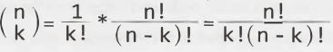
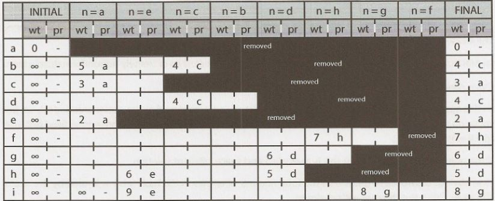

## XI   

This section includes topics that are mostly beyond the scope of interviews but can come up on occasion. Interviewers shouldn't be surprised if you don't know these topics well. Feel free to dive into these topics if you want to. If you're pressed for time, they're low priority.

Advanced Topics
===============


When writing the 6th edition, I had a number of debates about what should and shouldn't be included. Red-black trees? Dijkstra's algorithm? Topological sort?

On one hand, I'd had a number of requests to include these topics. Some people insisted that these topics are asked "all the time" (in which case, they have a very different idea of what this phrase means!). There  was clearly a desire-at least  from some people-to include them. And learning more can't hurt, right?

On the  other hand, I know  these topics to be rarely asked. It happens, of course. Interviewers are individuals and  might have their  own ideas of what is "fair game" or "relevant" for an interview. But it's rare. When it does come up, if you don't know  the  topic, it's unlikely  to be a big red flag.

> Admittedly, as an interviewer, I have asked candidates questions where the  solution was essentially an application of one of these algorithms. On the  rare occasions that a candidate already knew the algorithm, they  did not  benefit from this knowledge (nor were  they  hurt  by it). I want to  evaluate your ability  to  solve  a problem you  haven't seen before. So,  I'll take  into  account whether you know  the  underlying algorithm in advance.

I believe in giving people a fair expectation of the  interview, not  scaring people into  excess studying. I also have no interest in making the  book more "advanced" so as to help book sales, at the  expense of your time and  energy. That's not  fair or right to do to you.

(Additionally,  I didn't want to give interviewers-who I know  to be reading this-the impression that they can  or should be covering these more advanced topics. Interviewers: If you ask about these topics, you're testing knowledge of algorithms. You're just going to wind  up eliminating a lot of perfectly smart people.)

But there are many borderline "important" topics. They're  not  often asked, but sometimes they are.

Ultimately, I decided to leave the  decision in your hands. After all, you know better than I do how  thorough you  want to  be  in your  preparation. If you  want to  do  an  extra  thorough job,  read  this.  If you  just  love learning data structures and  algorithms, read  this.  If you want to see  new  ways of approaching problems, read  this.

But if you're  pressed for time, this studying isn't a super high priority.


### Useful Math

Here's  some math that can  be  useful  in some questions. There  are  more formal  proofs that you can  look up online,  but we'll focus  here on giving  you the  intuition behind them. You can think  of these as informal proofs.


*Sum of Integers 1 through N*

What is 1 + 2 + ... + n? Let's figure it out by pairing up low values with high values.

If n is even, we pair 1  with n, 2 with n  -  1, and so on. We will have ⁿ/₂ pairs each with sum n  +  1. 

If n is odd, we pair 0 with n, 1  with n  -  1, and so on. We will have ⁽ⁿ⁺¹⁾/₂ pairs with sum n. 


In either case, the sum is ⁿ⁽ⁿ⁺¹⁾/₂.

This reasoning comes up a lot in nested loops. For example, consider the following code:
```java
1   for (int i = 0; i < n; i++) {
2      for (int j = i + 1; j < n; j++) {
3          System.out.println(i + j);
4      }
5   }
```
On the first iteration of the outer for loop, the inner for loop iterates n - 1  times. On the second iteration of the outer for loop, the inner for loop iterates n - 2 times. Next, n - 3, then n - 4, and so on. There are ⁿ⁽ⁿ⁻¹⁾/₂ total iterations of the inner for loop. Therefore, this code takes O(n²) time. 

*Sum of Powers of 2*

Consider this sequence: 2° + 2¹  + 2² + ... + 2ⁿ. What is its result? 

A nice way to see this is by looking at these values in binary.

|      | Power  | Binary | Decimal     |
| :--: | :--:   | :--:   | :--:        |
|      | 2⁰     | 00001  | 1           |
|      | 2¹     | 00010  | 2           |
|      | 2²     | 00100  | 4           |
|      | 2³     | 01000  | 8           |
|      | 2⁴     | 10000  | 16          |
| sum: | 2⁵ - 1 | 11111  | 32 - 1 = 31 |

Therefore, the sum of 2° + 2¹  + 2² + ... + 2ⁿ would, in base 2, be a sequence of (n + 1) 1s. This  is 2ⁿ⁺¹ -  1.

**Takeaway:** The sum of a sequence of powers of two is roughly equal to the next value in the sequence.

*Bases of Logs*

Suppose we have something in log₂ (log base 2). How do we convert that to log₁₀? That is, what's the relationship between logᵦk and logₓk?


Let's do some math. Assume c = logᵦk and y = logₓk.

    logᵦk = c -- >  bᶜ = k   // This  is the  definition of  log. 
    logₓ(bᶜ) = logₓk         // Take log  of  both sides  of  bᶜ =  k.
    c logₓb =  logₓk         // Rules of  logs.  You can move  out  the  exponents.
    c = logbk = logₓk/logₓb  // Dividing above expression  and substituting c.

Therefore, if we want to convert log₂p  to log₁₀, we just do this:

    log₁₀p = log₂p/log₂10

**Takeaway:** Logs of different  bases are only off by a constant factor. For this reason, we largely ignore  what the base of a log within a big O expression. It doesn't matter since we drop constants anyway.

*Permutations*

How many ways are there of rearranging a string  of n unique characters? Well, you have n options for what to put in the first characters, then n - 1  options for what to put in the second slot (one option  is taken), then n - 2 options for what to put in the third slot, and so on. Therefore, the total number of strings is n!.

    n!  =  n * n-1 * n-2 * n-3 * .... * 1

What if you were forming a k-length string (with all unique characters) from n total unique  characters? You can follow similar logic, but you'd just stop your selection/multiplication earlier.

    n!/(n-k)! = n * n-1 * n-2 * n-3 * ... * n-k+1

*Combinations*

Suppose you have a set of n distinct characters. How many ways are there of selecting k characters into a new set (where order doesn't matter)? That is,  how many k-sized subsets are there out of n distinct elements? This is what the expression n-choose-k means, which is often written (ⁿₖ).

Imagine we made a list of all the sets by first writing all k-length substrings and then taking out the duplicates.

From the above *Permutations* section, we'd have n!/(n-k)!  k-length substrings.

Since each k-sized subset can be rearranged k! unique  ways into a string, each subset will be duplicated k! times in this list of substrings. Therefore, we need to divide by k! to take out these duplicates. 



*Proof by Induction*
 
Induction  is a way of proving something to be true. It is closely related to recursion. It takes the following form.

Task: Prove statement P(k) is true for all k  >= b.

- Base Case: Prove the statement is true for P(b). This is usually just a matter of plugging in numbers. 
- Assumption: Assume the statement  is true for P(n).
- Inductive  Step: Prove that if the statement is true for P(n), then it's true for P(n+1).

This is like dominoes. If the first domino falls, and one domino always knocks over the next one, then all the dominoes must fall.

Let's use this to prove that there are 2ⁿ subsets of an n-element set.

- Definitions: let S  =   {a₁ ,  a₂ ,  a₃ ,  •  •  •  ,  aₙ} be the n-element set.
- Base case: Prove there are 2° subsets of {}. This is true, since the only subset of {} is {}.
- Assume that there are 2ⁿ subsets of {a₁ ,  a₂ ,  a₃ ,  •  •  •  ,  aₙ}.
- Prove that there are 2ⁿ⁺¹  subsets of {a₁ ,  a₂ ,  a₃ ,  •  •  •  ,  aₙ₊₁} .

Consider the subsets of {a₁ ,  a₂ ,  a₃ ,  •  •  •  ,  aₙ₊₁}. Exactly half will contain aₙ₊₁ and half will not.

The subsets that do not contain aₙ₊ᵢ are just the subsets of {a₁ ,  a₂ ,  a₃ ,  •  •  •  ,  aₙ}. We assumed there are 2ⁿ of those.

Since we have the same number of subsets with x as without x, there are 2ⁿ subsets with aₙ₊₁· Therefore, we have 2ⁿ  +  2ⁿ subsets, which is 2ⁿ⁺¹.

Many recursive algorithms can be proved valid with induction.


### Topological Sort

A topological sort of a directed graph is a way of ordering the list of nodes such that if (a,  b)  is an edge in the graph then a will appear before b in the list.  If a graph has cycles or is not directed, then there is no topological sort.

There are a number of applications for this. For example, suppose the graph represents parts on an assembly line. The edge (Handle, Door) indicates that you need to assemble the handle before the door. The topological sort would offer a valid ordering for the assembly line.

We can construct a topological sort with the following approach.

1.  Identify all nodes with no incoming edges and add those nodes to our topological sort.
    - We know those nodes are safe to add first since they have nothing that needs to come before them. Might as well get them over with!
    - We know that such a node must exist if there's no cycle. After all, if we picked an arbitrary node we could just walk edges backwards arbitrarily. We'll either stop at some point (in which case we've found a node with no incoming edges) or we'll return to a prior node (in which case there is a cycle).
2.  When we do the above, remove each node's outbound edges from the graph.
    - Those nodes have already been added to the topological sort, so they're basically irrelevant. We can't violate those edges anymore.
3.  Repeat the above, adding nodes with no incoming edges and removing their outbound edges. When all the nodes have been added to the topological sort, then we are done.

More formally, the algorithm is this:

1.  Create a queue order, which will eventually store the valid topological sort. It is currently empty.
2.  Create a queue processNext. This queue will store the next nodes to process.
3.  Count the number of incoming edges of each node and set a class variable node. inbound. Nodes typically only store their outgoing edges. However, you can count the inbound edges by walking through each node n and, for each of its outgoing edges (n,  x),  incrementing x. inbound.
4.  Walk through the nodes again and add to processNext any node where x. inbound == 0.
5.  While processNext is not empty, do the following:
    - Remove first node n from processNext.
    - For each edge (n,  x), decrement x.inbound. If x.inbound == 0, append x to processNext.
    - Append  n to order.
6.  If order contains all the nodes, then it has succeeded. Otherwise, the topological sort has failed due to a cycle.

This algorithm does sometimes come up in interview questions. Your interviewer probably wouldn't expect you to know it offhand. However, it would be reasonable to have you derive it even if you've  never seen it before.


### Dijkstra's Algorithm

In some graphs, we might want to have edges with weights. If the graph represented cities, each edge might represent a road and its weight might represent the travel time. In this case, we might want to ask, just as your GPS mapping system does, what's the shortest path from your current location to another point p? This is where Dijksta's algorithm comes in.

Dijkstra's algorithm  is a way to find the shortest path between two points in a weighted directed graph (which might have cycles). All edges must have positive values.

Rather than just stating what Dijkstra's algorithm is, let's try to derive it. Consider the earlier described graph. We could find the shortest path from s tot by literally taking all possible routes using actual time. (Oh, and we'll need a machine to clone ourselves.)

1. Start off at s.
2. For each of s's outbound edges, clone ourselves and start walking. If the edge (s, x) has weight 5, we should actually take 5 minutes to get there.
3. Each time we get to a node, check if anyone's been there before. If so, then just stop. We're automatically not as fast as another path since someone beat us here from s. If no one has been here before, then clone ourselves and head out in all possible directions.
4. The first one to get to t wins.

This works just fine. But, of course, in the real algorithm we don't want to literally use a timer to find the shortest path.

Imagine that each clone could jump immediately from one node to its adjacent nodes (regardless of the edge weight), but it kept a time_so_far log of how long its path would have taken if it did walk at the "true" speed. Additionally, only one person moves at a time, and it's always the one with the lowest time_ so_far. This is sort of how Dijkstra's algorithm  works.

Dijkstra's algorithm finds the minimum weight path from a start node s to every node on the graph. 

Consider the following graph.


Assume we are trying to find the shortest path from a to i. We'll use Dijkstra's algorithm to find the shortest path from a to all other nodes, from which we will clearly have the shortest path from a to i.

We first initialize several variables:

- path_weight[node]: maps from each node to the total weight of the shortest path. All values are initialized to infinity, except for path_weight[a] which is initialized to 0.
- previous[node]: maps from each node to the previous node in the (current) shortest path. 
- remaining: a priority queue of all nodes in the graph, where each node's priority is defined by its path_weight.

Once we've initialized these values, we can start adjusting the values of path_weight.


> A (min) **priority queue** is an abstract data type that-at least in this case-supports insertion of an object and key, removing  the object with the minimum key, and decreasing a key. (Think of it like a typical queue, except that, instead of removing the oldest item, it removes the item with the lowest or highest priority.) It is an abstract data type because it is defined by its behavior (its operations). Its underlying implementation can vary. You could  implement a priority queue with an array or a min (or max) heap (or many other data structures).


We iterate through the nodes in remaining (until remaining is empty), doing the following:

1. Select the node in remaining with the lowest value in path_weight. Call this node n.
2. For each adjacent node, compare path_weight[x]  (which is the weight of the current shortest path from a tox) to path_weight[n] + edge_weight[(n, x)]. That is.could we get a path from a to x with lower weight by going through n instead of our current path? If so, update path_weight and previous.
3. Remove n from remaining.

When remaining is empty, then path_weight stores the weight of the current shortest path from a to each node. We can reconstruct this path by tracing through previous.

Let's walk through this on the above graph.

1. The first value of n is a. We look at its adjacent nodes (b, c, and e), update the values of path_weight (to 5, 3, and 2) and previous (to a) and then remove a from remaining.
2. Then, we go to the next smallest node, which is e. We previously updated path_weight[e] to be 2. Its adjacent nodes are h and i, so we update path_weight (to 6 and 9) and previous for both of those. Observe that 6 is path_weight[e]  (which is 2) + the weight of the edge (e,  h) (which is 4).
3. The next smallest node is c, which has path_weight 3. Its adjacent nodes are b and d. The value of path_weight[d] is infinity, so we update it to 4 (which is path_weight[c] + weight(edge c, d). The value of path_weight[b] has been previously set to 5. However, since path_weight[c] +  weight(edge c,  b) (which is 3 + 1  = 4) is less than 5, we update path_weight[b] to 4 and previous to c. This indicates that we would improve the path from a to b by going through c.

We continue doing this until remaining is empty. The following diagram shows the changes to the path_ weight (left) and previous (right) at each step. The topmost row shows the current value for n (the node we are removing from remaining). We black out a row after it has been removed from remaining.



Once we're done, we can follow this chart backwards, starting at i to find the actual path. In this case, the smallest weight path has weight 8 and is `a  ->  c  ->  d  ->  g  ->  i`.

*Priority Queue and Runtime*

As mentioned earlier, our algorithm used a priority queue, but this data structure can be implemented in different ways.

The runtime of this algorithm depends heavily on the implementation of the priority queue. Assume you have v vertices and e nodes.

- If you implemented the priority queue with an array, then you would call remove_min up to v times. Each operation would take O(v) time, so you'd spend O(v²) time in the remove_min calls. Additionally, you would update the values of path_weight and previous at most once per edge, so that's O(e) time doing those updates. Observe that e must be less than of equal to v² since you can't have more edges than there are pairs of vertices. Therefore, the total runtime is O(v²).

- If you implemented the priority queue with a min heap, then the remove_min calls will each take O(log v) time (as will inserting and updating a key). We will do one remove_min call for each vertex, so that's O(v log v) (v vertices at O(log v) time each). Additionally, on each edge, we might call one update key or insert operation, so that's O(e log v). The total runtime  is O((v  +  e) log v).

Which one is better? Well, that depends. If the graph has a lot of edges, then v²  will be close toe. In this case, you might be better off with the array implementation, as O(v²)  is better than O((v + v²) log v). However,  if the graph is sparse, then e is much less than v².  In this case, the min heap implementation may be better.


### Hash Table Collision  Resolution

Essentially any hash table can have collisions. There are a number of ways of handling this.

*Chaining with Linked Lists*

With this approach (which is the most common), the hash table's array maps to a linked list of items. We just add items to this linked  list. As long as the number of collisions  is fairly small, this will be quite efficient.

In the worst case, lookup is O(n),  where n is the number of elements in the hash table. This would only happen with either some very strange data or a very poor hash function (or both).

*Chaining with Binary Search Trees*

Rather than storing collisions in a linked list, we could store collisions in a binary search tree. This will bring the worst-case runtime to O(log n).

In practice, we would rarely take this approach unless we expected an extremely nonuniform distribution.

*Open Addressing with Linear Probing*

In this approach, when a collision occurs (there is already an item stored at the designated index), we just move on to the next index in the array until we find an open spot. (Or, sometimes, some other fixed distance, like the index  +  5.)

If the number of collisions is low, this is a very fast and space-efficient solution.

One obvious drawback of this is that the total number of entries in the hash table is limited by the size of the array. This is not the case with chaining.

There's another issue here. Consider a hash table with an underlying array of size 100 where indexes 20 through 29 are filled (and nothing else).What are the odds of the next insertion going to index 30? The odds are 10% because an item mapped to any index between 20 and 30 will wind up at index 30. This causes an issue called clustering.

*Quadratic Probing and Double Hashing*

The distance between probes does not need to be linear. You could, for example, increase the probe distance quadratically. Or, you could  use a second hash function to determine the probe distance.


### Rabin-Karp  Substring  Search

The brute force way to search for a substring S in a larger string B takes O(s(b- s)) time, where s is the length of S and b is the length of B. We do this by searching through the first b - s + 1 characters in B and, for each, checking if the next s characters match S.

The Rabin-Karp algorithm optimizes this with a little trick: if two strings are the same, they must have the same hash value. (The converse, however, is not true. Two different strings can have the same hash value.)

Therefore, if we efficiently precompute a hash value for each sequence of s characters within B, we can  find the locations of S in O(b) time. We then just need to validate that those locations really do match S.

For example, imagine  our hash function was simply the sum of each character (where space = 0, a = 1, b = 2, and so on). If S is ear and B = doe are hearing me, we'd then just be looking for sequences where the sum is 24 (e + a + r). This happens three times. For each of those locations,  we'd check if the string really is ear.


If we computed these sums by doing hash('doe'), then hash ('oe '), then hash('e a'), and soon, we would still be at O(s(b-s)) time.

Instead, we compute the hash values by recognizing that hash ('oe') = hash('doe') - code('d') +  code('   '). This takes O(b) time to compute all the hashes.

You might argue that, still, in the worst case this will take O(s(b-s)) time since many of the hash values could match. That's absolutely true-for this hash function.

In practice,  we would use a better rolling hash function, such as the Rabin fingerprint. This essentially treats a string like doe as a base 128 (or however many characters are in our alphabet) number.

    hash('doe')  =  code('d')  *  128²  +  code('o')  *  128¹  +  code('e')  *  128⁰

This hash function  will allow us to remove the d, shift the o and e, and then add in the space. 
    
    hash('oe   ')  =  (hash('doe')  -  code('d')  *  128²)    *  128 +  code('   ')

This will considerably cut down on the number of false matches. Using a good hash function like this will give us expected time complexity of O(s + b), although the worst case is O(sb).

Usage of this algorithm comes up fairly frequently in interviews, so it's useful to know that you can identify substrings in linear time.


### AVL Trees

An AVL tree is one of two common ways to implement tree balancing. We will only discuss insertions  here, but you can look up deletions separately  if you're interested.


**Properties**

An AVL tree stores in each node the height of the subtrees rooted at this node. Then, for any node, we can check if it is height balanced: that the height of the left subtree and the height of the right subtree differ by no more than one. This prevents situations where the tree gets too lopsided.

    balance(n) = n.left.height - n.right.height
                -1 <= balance(n) <= 1

**Inserts**

When you insert a node, the balance of some nodes might change to -2 or 2. Therefore, when we "unwind" the recursive stack, we check and fix the balance at each node. We do this through a series of rotations.

Rotations can be either left or right rotations. The right rotation is an inverse of the left rotation.


Depending on the balance and where the imbalance occurs, we fix it in a different way.

- *Case 1: Balance is 2.*
    In this case, the left's height is two bigger than the right's height. If the left side is larger, the left subtree's extra nodes must be hanging to the left (as in LEFT LEFT SHAPE)  or hanging to the right (as in LEFT RIGHT SHAPE).  If it looks like the LEFT RIGHT SHAPE,  transform it with the rotations below into the LEFT LEFT SHAPE then into BALANCED. If it looks like the LEFT LEFT SHAPE already, just transform it into BALANCED. 


- *Case 2: Balance is -2.*
    This case is the mirror image of the prior case. The tree will look like either the RIGHT LEFT SHAPE  or the RIGHT RIGHT SHAPE. Perform the rotations below to transform it into BALANCED. 


In both cases, "balanced" just means that the balance of the tree is between  -1 and 1. It does not mean that the balance is O.

We recurse up the tree, fixing any imbalances. If we ever achieve a balance of 0 on a subtree, then we know that we have completed all the balances. This portion of the tree will not cause another, higher subtree to have a balance of -2 or 2. If we were doing this non-recursively, then we could break from the loop.


### Red-Black Trees

Red-black trees (a type of self-balancing binary search tree) do not ensure quite as strict balancing, but the balancing is still good enough to ensure O(log  N) insertions, deletions, and retrievals. They require a bit less memory and can rebalance faster (which means faster insertions and removals), so they are often used in situations where the tree will be modified frequently.

Red-black trees  operate  by enforcing a quasi-alternating  red and black coloring (under certain rules, described below) and then requiring every path from a node to its leaves to have the same number of black nodes. Doing so leads to a reasonably balanced tree.

The tree below is a red-black tree (where the red nodes are indicated with gray):


**Properties**

1. Every node is either red or black.
2. The root is black.
3. The leaves, which are NULL nodes, are considered black.
4. Every red node must have two black children. That is, a red node cannot have red children (although a black node can have black children).
5. Every path from a node to its leaves must have the same number of black children.


**Why It Balances**

Property #4 means that two red nodes cannot be adjacent in a path (e.g., parent and child). Therefore, no more than half the nodes in a path can be red.

Consider two paths from a node  (say, the root) to its leaves. The paths must have the same number of black nodes (property #5), so let's assume that their red node counts are as different as possible: one path contains the minimum number of red nodes and the other one contains the maximum number.

- Path 1 (Min Red): The minimum number of red nodes is zero. Therefore, path 1 has b nodes total.

- Path 2 (Max Red): The maximum number of red nodes is b, since red nodes must have black children and there are b black nodes. Therefore, path 2 has 2b nodes total.

Therefore, even in the most extreme case, the lengths of paths cannot differ by more than a factor of two. That's good enough to ensure an O(log N) find and insert runtime.

If we can maintain these  properties,  we'll have a (sufficiently) balanced tree-good enough  to ensure O(log N) insert and find, anyway. The question then is how to maintain these properties efficiently. We'll only discuss insertion here, but you can look up deletion on your own.

**Insertion**

Inserting a new node into a red-black tree starts off with a typical binary search tree insertion.

- New nodes are inserted at a leaf, which  means that they replace a black node. 
- New nodes are always colored red and are given two black leaf (NULL) nodes.

Once we've done that, we fix any resulting red-black property violations. We have two possible violations: 

- Red violations: A red node has a red child  (or the root is red).
- Black violations: One path has more blacks than another path.

The node inserted is red. We didn't change the number of black nodes on any path to a leaf, so we know that we won't have a black violation. However, we might have a red violation.

In the special case that where the root is red, we can always just turn it black to satisfy property 2, without violating the other constraints.

Otherwise, if there's a red violation, then this means that we have a red node under another red node. Oops! 

Let's call N the current node. P is N's parent. G is N's grandparent. U is N's uncle and P's sibling. We know that:

- N is red and P is red, since we have a red violation.
- G is definitely black, since we didn't *previously* have a red violation. 

The unknown parts are:

- U could be either red or black.
- U could be either a left or right child. 
- N could be either a left or right child.

By simple combinatorics,  that's eight cases to consider. Fortunately some of these cases will be equivalent.

- **Case 1 : U is red.**

It doesn't matter whether U is a left or right child, nor whether P is a left or right child. We can merge four of our eight cases into one.

If U is red, we can just toggle the colors of P, U, and G. Flip G from black to red. Flip P and U from red to black. We haven't changed the number of black nodes in any path.


However, by making G red, we might have created a red violation with G's parent.  If so, we recursively apply the full logic to handle a red violation, where this G becomes the new N.

Note that in the general recursive case, N, P, and U may also have subtrees in place of each black NULL (the leaves  shown).  In Case  1, these subtrees stay attached to the same parents, as the tree structure remains unchanged.

- **Case 2: U is black.**

We'll need to consider the configurations (left vs. right child) of N and U. In each case, our goal is to fix up the red violation (red on top of red) without:
    
   - Messing up the ordering of the binary search tree.
   - Introducing a black violation (more black nodes on one path than another).

If we can do this, we're good. In each of the cases below, the red violation is fixed with rotations that maintain the node ordering.

Further, the below rotations maintain the exact number of black nodes in each path through the affected portion of the tree that were in place beforehand. The children of the rotating section are either NULL leaves or subtrees that remain internally unchanged.

*Case A: N and P are both left children.*

We resolve the red violation with the rotation of N, P, and G and the associated recoloring shown below. If you picture the in-order traversal, you can see the rotation maintains the node ordering (a <= N <= b <= P <= c <= G <= U). The tree maintains the same, equal number of black nodes in the path down to each subtree a, b, c, and U (which may all be NULL).


*Case 8: P is a left child, and N is a right child.*

The rotations in Case B resolve the red violation and maintain the in-order property: a <= P <= b <= N <= c <= G <= U. Again,  the count of the black nodes remains constant in each path down to the leaves (or subtrees).


*Case C: N and P are both right children.*

This is a mirror image of case A.


*Case D: N is a left child, and P is a right child.*

This is a mirror image of case B.


In each of Case 2's subcases, the middle  element  by value of N, P, and G is rotated to become the root of what was G's subtree, and that element and G swap colors.

That said, do not try to just memorize these cases. Rather, study why they work. How does each one ensure no red violations, no black violations, and no violations of the binary search tree property?


### MapReduce

MapReduce is used widely in system design to process large amounts of data. As its name suggests, a MapReduce program requires you to write a Map step and a Reduce step. The rest is handled by the system.

1. The system splits up the data across different machines.
2. Each machine starts running the user-provided Map program.
3. The Map program takes some data and emits a \<key, value> pair.
4. The system-provided Shuffle process  reorganizes  the data so that all \<key, value> pairs associated with a given key go to the same machine, to be processed by Reduce.
5. The user-provided Reduce  program takes a key and a set of associated values and "reduces" them in some way, emitting a new key and value. The results of this might be fed back into the Reduce program for more reducing.

The typical example of using MapReduce-basically  the "Hello World" of MapReduce-is counting the frequency of words within a set of documents.

Of course, you could write this as a single function that reads in all the data, counts the number of times each word appears via a hash table, and then outputs the result.

MapReduce allows you to process the document in parallel. The Map function reads in a document and emits just each individual word and the count (which is always 1). The Reduce function reads in keys (words) and associated values (counts). It emits the sum of the counts. This sum could possibly wind up as input for another call to Reduce on the same key (as shown in the diagram).

```java
1   void map(String name, String document):
2       for each word w in document :
3           emit(w, 1)
4   
5   void reduce(String word, Iterator partialCounts):
6       int sum = 0
7       for each count in partialCounts :
8           sum += count
9       emit(word, sum)
```
The diagram below shows how this might work on this example.


Here's another example: You have a list of data in the form {City, Temperature, Date}. Calculate the average temperature in each city every year. For example {(2012, Philadelphia, 58.2), (2011, Philadelphia, 56.6), (2012, Seattle, 45.1)}.

- **Map:** The Map step  outputs  a key value pair where the  key is City_Year and the value is (Temperature, 1). The '1' reflects that this is the average temperature out of one data point. This will be important for the Reduce step.
- **Reduce:** The Reduce step will be given a list of temperatures that correspond with a particular city and year. It must use these to compute the average temperature for this input. You cannot simply add up the temperatures and divide by the number of values.

To see this, imagine we have five data points for a particular city and year: 25,100,75,85, 50. The Reduce step might only get some of this data at once. If you averaged {75, 85} you would get 80. This might end up being input for another Reduce step with 50, and it would be a mistake to just naively average 80 and 50. The 80 has more weight.

Therefore, our Reduce step instead takes in {(80, 2),(50,1}}, then sums the weighted temperatures. So it does 80 * 2 + 50 * 1 and then divides by (2 + 1) to get an average temperature of 70. It then emits (70, 3).

Another Reduce step might reduce {(25, 1),(100, 1)} to get (62.5, 2). If we reduce this with (70, 3) we get the final answer: (67, 5). In other words, the average temperature in this city for this year was 67 degrees.

We could do this in other ways, too. We could have just the city as the key, and the value be (Year, Temperature, Count). The Reduce step would do essentially the same thing, but would have to group by Year itself.

In many cases, it's useful to think about what the Reduce step should do first, and then design the Map step around that. What data does Reduce need to have to do its job?


### Additional Studying

So, you've mastered this material and you want to learn even more?  Okay. Here are some topics to get you started:

- **Bellman-Ford Algorithm:** Finds the shortest paths from a single node in a weighted directed graph with positive and negative edges.
- **Floyd-Warshall Algorithm:**  Finds the shortest paths in a weighted graph with positive or negative weight edges (but no negative weight cycles).
- **Minimum  Spanning Trees:** In a weighted, connected, undirected graph, a spanning tree is a tree that connects all the vertices. The minimum spanning tree is the spanning tree with minimum weight. There are various algorithms to do this.
- **B-Trees:**  A self-balancing search tree (not a binary search tree) that is commonly used on disks or other storage devices. It is similar to a red-black tree, but uses fewer I/O operations.
- **A\*:** Find the least-cost path between a source node and a goal node (or one of several goal nodes). It extends Dijkstra's algorithm and achieves better performance by using heuristics.
- **Interval Trees:** An extension of a balanced binary search tree, but storing intervals (low -> high ranges) instead of simple values. A hotel could use this to store a list of all reservations and then efficiently detect who is staying at the hotel at a particular time.
- **Graph  coloring:** A way of coloring the nodes in a graph such that no two adjacent vertices have the same color. There are various algorithms to do things like determine if a graph can be colored with only K colors.
- **P, NP, and  NP-Complete:** P.  NP. and NP-Complete refer to classes of problems.  P problems are problems that can be quickly solved (where "quickly" means polynomial time). NP problems are those where, given a solution, the solution can be quickly verified. NP-Complete problems are a subset of NP problems that can all be reduced to each other (that is, if you found a solution to one problem, you could tweak the solution to solve other problems in the set in polynomial time).

It is an open (and very famous) question whether P = NP, but the answer is generally believed to be no.

- **Combinatorics and  Probability:** There are various things you can learn about here, such as random variables, expected value, and n-choose-k.
- **Bipartite Graph:**  A bipartite graph is a graph where you can divide its nodes into two sets such that every edge stretches across the two sets (that is, there is never an edge between two nodes in the same set). There is an algorithm to check if a graph is a bipartite graph. Note that a bipartite graph is equivalent to a graph that can be colored with two colors.
- **Regular Expressions:** You should know that regular expressions exist and what they can be used for (roughly). You can also learn about how an algorithm to match regular expressions would work. Some of the basic syntax behind regular expressions could be useful as well.

There is of course a great deal more to data structures and algorithms. If you're interested in exploring these topics more deeply, I recommend picking up the hefty *Introduction to Algorithms* ("CLRS" by Carmen, Leiserson, Rivest and Stein) or *The Algorithm Design Manual* (by Steven Skiena).


## XII

Code  Library
=============


Certain patterns came up while implementing the code for this book. We've  tried to generally include the full code for a solution with the solution, but in some cases it got quite redundant.

This appendix provides the code for a few bf the most useful chunks of code.

All code for the book can be downloaded from CrackingTheCodinglnterview.com.


### HashMapList\<T, E>

The HashMapList class is essentially shorthand for HashMap\<T, ArrayList\<E>>. It allows us to map from an item of type of T to an ArrayList of type E.

For example, we might want a data structure that maps from an integer to a list of strings. Ordinarily, we'd have to write something like this:

```java
1   HashMap<Integer, ArrayList<String>> mapList =
2           new HashMap<Integer, ArrayList<String>>();
3   for (String s : strings) {
4       int key = computeValue(s);
5       if (!mapList.containsKey(key)) {
6           mapList.put(key, new ArrayList<String>());
7       }
8       mapList.get(key).add(s);
9   }
```
Now, we can just write this:
```java
1  HashMapList<Integer, String> mapList = new HashMapList<Integer, String>();
2  for (String s : strings) {
3       int key = computeValue(s);
4       mapList.put(key, s);
5  }
```
It's not a big change, but it makes our code a bit simpler.
```java
1   public class HashMapList<T, E> {
2       private HashMap<T, ArrayList<E>> map = new HashMap<T, ArrayList<E>>();
3       
4       /* Insert item into list at key. */
5       public void put(T key, E item) {
6           if (!map.containsKey(key)) {
7               map.put(key, new ArrayList<E>());
8           }
9           map.get(key).add(item);
10      }
11      
12      /* Insert list of items at key. */
13      public void put(T key, ArrayList<E> items) {
14          map.put(key, items);
15      }
16      
17      /* Get list of items at key. */
18      public ArrayList<E> get(T key) {
19          return map.get(key);
20      }
21      
22      /* Check if hashmaplist contains key. */
23      public boolean containsKey(T key) {
24          return map.containsKey(key);
25      }
26      
27      /* Check if list at key contains value. */
28      public boolean containsKeyValue(T key, E value) {
29          ArrayList<E> list = get(key);
30          if (list == null) return false;
31          return list.contains(value);
32      }
33      
34      /* Get the list of keys. */
35      public Set<T> keySet() {
36          return map.keySet();
37      }
38      
39      @Override
40      public String toString() {
41          return map.toString();
42      }
43  }
```


### TreeNode (Binary Search Tree)

While it's perfectly fine-even good-to use the built-in binary tree class when possible, it's not always possible. In many questions, we needed access to the internals of the node or tree class (or needed to tweak these) and thus couldn't use the built-in libraries.

The TreeNode  class supports a variety of functionality, much of which we wouldn't necessarily want for every question/solution. For example,  the TreeNode class tracks the parent of the node, even though we often don't use it (or specifically ban using it).

For simplicity, we'd implemented this tree as storing integers for data.
```java
1   public class TreeNode {
2       public int data;
3       public TreeNode left, right, parent;
4       private int size = 0;
5       
6       public TreeNode(int d) {
7           data = d;
8           size = 1;
9       }
10      
11      public void insertInOrder(int d) {
12          if (d <= data) {
13              if (left == null) {
14                  setLeftChild(new TreeNode(d));
15              } else {
16                  left.insertInOrder(d);
17              }
18          } else {
19              if (right == null) {
20                  setRightChild(new TreeNode(d));
21              } else {
22                  right.insertInOrder(d);
23              }
24          }
25          size++;
26      }
27      
28      public int size() {
29          return size;
30      }
31      
32      public TreeNode find(int d) {
33          if (d == data) {
34              return this;
35          } else if (d <= data) {
36              return left != null ? left.find(d) : null;
37          } else if (d > data) {
38              return right != null ? right.find(d) : null;
39          }
40          return null;
41      }
42      
43      public void setLeftChild(TreeNode left) {
44          this.left = left;
45          if (left != null) {
46              left.parent = this;
47          }
48      }
49      
50      public void setRightChild(TreeNode right) {
51          this.right = right;
52          if (right != null) {
53              right.parent = this;
54          }
55      }
56  
57  }
```
This tree is implemented to be a binary search tree. However, you can use it for other purposes. You would just need to use the setLeftChild/setRightChild methods, or the left and right child variables. For this reason, we have kept these methods and variables public. We need this sort of access for many problems.


### LinkedListNode (Linked List)

Like the  TreeNode class, we often needed access to the  internals of a linked  list in a way that the  built-in linked  list class  wouldn't support. For this  reason, we  implemented our  own  class  and used it for many problems.
```java
1   public class LinkedListNode {
2       public LinkedListNode next, prev, last;
3       public int data;
4       public LinkedListNode(int d, LinkedListNode n, LinkedListNode p) {
5           data = d;
6           setNext(n);
7           setPrevious(p);
8       }
9       
10      public LinkedListNode(int d) {
11          data = d;
12      }
13      
14      public LinkedListNode() {}
15      
16      public void setNext(LinkedListNode n) {
17          next = n;
18          if (this == last) {
19              last = n;
20          }
21          if (n != null && n.prev != this) {
22              n.setPrevious(this);
23          }
24      }
25      
26      public void setPrevious(LinkedListNode p) {
27          prev = p;
28          if (p != null && p.next != this) {
29              p.setNext(this);
30          }
31      }
32      
33      public LinkedListNode clone() {
34          LinkedListNode next2 = null;
35          if (next != null) {
36              next2 = next.clone();
37          }
38          LinkedListNode head2 = new LinkedListNode(data, next2, null);
39          return head2;
40      }
41  }
```

Again, we've  kept the  methods and variables public  because we often needed this access. This would allow the  user  to "destroy" the  linked list, but we actually needed this sort of functionality for our purposes.


### Trie & TrieNode

The trie data structure is used in a few problems to make  it easier to look up if a word is a prefix of any other words in a dictionary (or list of valid words). This is often used when we're recursively building words so that we can short circuit when the word is not valid.

```java
1   public class Trie {
2       // The root of this trie.
3       private TrieNode root;
4       
5       /* Takes a list of strings as an argument, and constructs a trie that stores
6        * these strings. */
7       public Trie(ArrayList<String> list) {
8           root = new TrieNode();
9           for (String word : list) {
10              root.addWord(word);
11          }
12      }
13      
14      
15      /* Takes a list of strings as an argument, and constructs a trie that stores
16       * these strings. */
17      public Trie(String[] list) {
18          root = new TrieNode();
19          for (String word : list) {
20              root.addWord(word);
21          }
22      }
23      
24      /* Checks whether this trie contains a string with the prefix passed in as
25       * argument. */
26      public boolean contains(String prefix, boolean exact) {
27          TrieNode lastNode = root;
28          int i = 0;
29          for (i = 0; i < prefix.length(); i++) {
30              lastNode = lastNode.getChild(prefix.charAt(i));
31              if (lastNode == null) {
32                  return false;
33              }
34          }
35          return !exact || lastNode.terminates();
36      }
37      
38      public boolean contains(String prefix) {
39          return contains(prefix, false);
40      }
41      
42      public TrieNode getRoot() {
43          return root;
44      }
45  }
```
The Trie class uses the TrieNode class, which is implemented below.

```java
1   public class TrieNode {
2       /* The children of this node in the trie.*/
3       private HashMap<Character, TrieNode> children;
4       private boolean terminates = false;
5       
6       /* The character stored in this node as data.*/
7       private char character;
8       
9       /* Constructs an empty trie node and initializes the list of its children to an
10       * empty hash map. Used only to construct the root node of the trie. */
11      public TrieNode() {
12          children = new HashMap<Character, TrieNode>();
13      }
14      
15      /* Constructs a trie node and stores this character as the node's value.
16       * Initializes the list of child nodes of this node to an empty hash map. */
17      public TrieNode(char character) {
18          this();
19          this.character = character;
20      }
21      
22      /* Returns the character data stored in this node. */
23      public char getChar() {
24          return character;
25      }
26      
27      /* Add this word to the trie, and recursively create the child
28       * nodes. */
29      public void addWord(String word) {
30          if (word == null || word.isEmpty()) {
31              return;
32          }
33          
34          char firstChar = word.charAt(0);
35          
36          TrieNode child = getChild(firstChar);
37          if (child == null) {
38              child = new TrieNode(firstChar);
39              children.put(firstChar, child);
40          }
41          
42          if (word.length() > 1) {
43              child.addWord(word.substring(l));
44          } else {
45              child.setTerminates(true);
46          }
47      }
48      
49      /* Find a child node of this node that has the char argument as its data. Return
50       * null if no such child node is present in the trie. */
51      public TrieNode getChild(char c) {
52          return children.get(c);
53      }
54      
55      /* Returns whether this node represents the end of a complete word. */
56      public boolean terminates() {
57          return terminates;
58      }
59      
60      /* Set whether this node is the end of a complete word.*/
61      public void setTerminates(boolean t) {
62          terminates = t;
63      }
64  }
```


