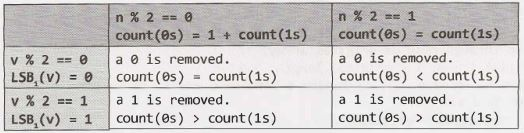
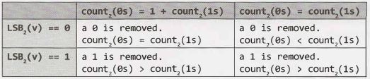
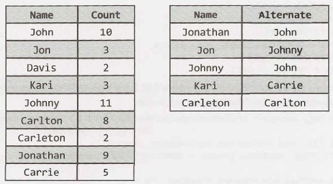
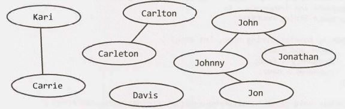

## 17 Solutions to Hard


**17.1      Add Without Plus:** Write a function that adds two numbers. You should not use+ or any arithmetic operators.
pg 786

SOLUTION

---

Our first instinct in problems like these should be that we're going to have to work with bits. Why? Because when you take away the+ sign, what other choice do we have? Plus, that's how computers do it!

Our next thought should be to deeply understand how addition works. We can walk through an addition problem to see if we can understand something new-some pattern-and then see if we can replicate that with code.

So let's do just that-let's walk through an addition problem. We'll work in base 10 so that it's easier to see. 

To add 759 + 674, I  would usually add digit [0] from each number, carry the one, add digit [1] from each number, carry the one, and so on. You could take the same approach in binary: add each digit, and carry the one as necessary.

Can we make this a little easier? Yes! Imagine I decided to split apart the "addition" and "carry" steps. That is, I do the following:

1. Add 759+ 674, but"forget"  to carry. I then get 323.

2. Add 759+ 674 but only do the carrying, rather than the addition of each digit. I then get 1110.

3. Add the result of the first two operations (recursively, using the same process described in step 1 and 2): 1110+ 323 = 1433.

Now, how would we do this in binary?

1.  If I add two binary numbers  together, but forget to carry, the ith bit in the sum will be 0 only if a and b have the same ith bit (both 0 or both 1). This is essentially an XOR.
2.  If I add two numbers together but only carry, I will have a 1 in the ith bit of the sum only if bits i - 1 of a and b are both ls. This is an AND, shifted.
3.  Now, recurse until there's nothing to carry.

The following code implements this algorithm.

```java
1     int  add(int  a,  int  b) {
2          if (b ==  0) return  a;
3           int  sum   =  a Ab;// add without  carrying
4       int  carry=   (a & b) <<  1; //  carry,  but don't  add
5             return add(sum,   carry); //  recurse with  sum + carry
6     }
```
Alternatively, you can implement this iteratively.
```java
1     int add(int a,   int b)  {
2          while   (b   != 0)  {
3               int sum =  a  Ab; /I add  without carrying
4               int carry=  (a &   b)  <<  1;  // carry, but  don't add
5               a  = sum;
6               b  = carry;
7          }
8          return  a;
9     }
```
Problems requiring us to implement core operations like addition and subtraction are relatively common. The key in all of these problems is to dig into how these operations are usually implemented, so that we can re-implement them with the constraints of the given problem.


**17.2    Shuffle:** Write a method to shuffle a deck of cards. It must be a perfect shuffle-in other words, each of the 52! permutations  of the deck has to be equally likely. Assume that you are given a random number generator which is perfect.

SOLUTION

---

This is a very well known interview question, and a well known algorithm. If you aren't one of the lucky few to already know this algorithm, read on.

Let's imagine our n-element array. Suppose it looks like this: 

	[l] [2]  [3]  [4]  [5]

Using our BaseCase and Buildapproach,wecan askthisquestion:suppose we had a method shuffle ( ...) that worked on n  -   1 elements. Could we use this to shuffle n elements?

Sure. In fact, that's quite easy. We would first shuffle the first n - 1   elements. Then, we would take the nth element and randomly swap it with an element in the array. That's it!

Recursively, that algorithm looks like this:
```java
1   /*   Random  number between  lower  and  higher,  inclusive*/
2     int rand(int lower,   int higher) {
3         return lower  + (int)(Math.random() *    (higher  -  lower  + l));
4      }
s
6     int[]   shuffleArrayRecursively(int[]  cards, int i) {
7          if (i == 0)  return  cards;
8
9          shuffleArrayRecursively(cards,  i -  1);//    Shuffle earlier  part
10        int k = rand(0,  i);//  Pick  random index  to swap with
11
12      /*   Swap element k  and  i */
13        int temp=  cards[k];
14        cards(k]      cards(i];
15        cards[i)  =  temp;
16
17       /* Return   shuffled array*/
18       return cards;
19   }
```

What would this algorithm look like iteratively? Let's think  about it. All it does is moving through the  array and, for each element i. swapping array [ i] with a random element between 0 and i, inclusive.

This is actually a very clean  algorithm to implement iteratively:
```java
1      void shuffleArrayiteratively(int[]  cards) {
2           for (inti= 0; i <  cards.length;   i++) {
3                 int k  =  rand(0,  i);
4                 int temp= cards[k];
5                 cards[k]  =  cards[i];
6                 cards[i] = temp;
7           }
8     }
```
The iterative approach is usually  how we see this algorithm written.


**17.3     Random Set:** Write a method to randomly generate a set of m integers from an array of size n. Each element must have  equal probability of being chosen.

SOLUTION

---

Like the  prior problem which was similar, (problem 17.2 on page 531), we can  look at this problem recur­
sively using the  Base Case and Build approach.

Suppose we have an algorithm that can pull a random set of m elements from an array of size n   -  1. How can we use this algorithm to pull a random set of m elements from  an array of size n?

We can  first pull a random set  of size m from  the  first n    -   1 elements. Then,  we just need to decide if array[ n] should be inserted into  our subset (which  would require pulling out  a random element from it). An easy way to do this is to pick a random number k from 0 through n. If k  <  m, then insert array[ n] into  subset[ k]. This will both "fairly" (i.e., with proportional probability) insert  array[n] into the  subset and "fairly" remove a random element from the  subset.

The pseudocode for this recursive algorithm would look like this:
```java
1      int[] pickMRecursively(int[]  original, int m,  int i) {
2           if (i +  1  ==  m)  {  II Base   case
3                 I*  return first  m   elements of original  *I
4            }  else if (i +  1  >   m)  {
5                 int[]  subset = pickMRecursively(original,  m,  i -  1);
6                 int k  =    random   value  between 0  and   i, inclusive
7                 if (k <   m)  {
8                       subset[k]  =  original[i];
9                 }
10               return subset;
11         }
12         return null;
13    }
```
This is even cleaner to  write  iteratively. In this  approach, we  initialize  an  array  subset to  be  the  first m elements in original. Then,  we iterate through the  array, starting at element m, inserting array[ i] into the subset at (random) position k whenever k   <  m.
```java
1     int[] pickMiteratively(int[] original,  int  m)  {
2           int[]  subset =  new  int[m];
3
4			/* Fill  in subset array   with  first  part of  original array*/
5			for (int i=  0;  i <  m  ;   i++)   {
6				subset[i]=  original[i];
7			}
8			
9			/* Go  through rest  of  original  array.  */
10			for (int i= m;   i <   original.length;  i++)  {
11				int k  =  rand(0, i);  //Random#  between  0 and  i, inclusive 
12				if (k  <  m)   {
13					subset[k] =  original[i];
14				}
15			}
16			
17			return  subset; 
18   }
```

Both solutions are, not surprisingly, very similar to the algorithm to shuffle an array.


17.4    Missing  Number: An array A contains all the integers from O to n, except for one number which is missing. In this problem, we cannot access an entire integer in A with a single operation. The elements of A are represented in binary, and the only operation we can use to access them is "fetch the jth bit of A[i];' which takes constant time. Write code to find the missing integer. Can you do it in O(n) time?

SOLUTION

---

You may have seen a very similar sounding  problem: Given a list of numbers from O to n, with exactly one number removed, find the missing number. This problem can be solved by simply adding the list of numbers and comparing it to the actual sum of O through n, which is n(n+1,Vi. The difference will be the missing number.

We could solve this by computing the value of each number, based on its binary representation,  and calcu­lating the sum.

The runtime of this solution is n * length(n), when length is the number of bits in n. Note that length(n) = log2(n). So, the runtime is actually O(n log(n) ).  Not quite good enough!

So how else can we approach it?

We can actually use a similar approach, but leverage the bit values more directly. Picture a list of binary numbers (the - - - - - indicates the value that was removed):

```
00000	00100	01000	01100
00001	00101	01001	01101
00010	00110	01010	
-----	00111	01011	
```
Removing the number above creates an imbalance of ls and Os in the least significant bit, which we'll call LSB1 •   In a list of numbers from Oto n, we would expect there to be the same number of Os as 1 s (if n is odd), or an additional O if n is even. That is:

	if n %   2 == 1 then  count(0s)  =  count(1s)
	if n %   2 == 0 then  count(0s)  =  1 + count(1s)

Note that this means that count(0s) is always greater than or equal to count (1s).

When we remove  a valuevfrom the  list,we'll know immediately  ifvis even or odd just by looking at the least significant bits of all the other  values in the list.



So,if c ount(0s) <=  c ount(1s),thenvis even. If count(0s) >  count(1s), then v is odd. 

We can now remove all the evens and focus on the odds,or remove all the odds  and focus on the evens.

Okay, but how do we figure out what the next bit in v is? If v were contained in our (now smaller) list,then we should expect to find the following (where c ount2 indicates  the number of Os or 1 s in the second least significant bit):

	count2(0s)  = count2(ls)  OR count2(0s) =  1 + count2(1s)

As in the earlier example,we can deduce the value of the second least significant bit (LSB) ofv.



Again, we have the same conclusion:

- If count2(0s)  <=  count2(1s), then LSB2(v) = 0. 
- If count2(0s)  > count2(1s), then LSB2(v) = 1.

We can repeat this process for each bit. On each iteration,we count the number of Osand 1s in bit i to check if LSBi(v) is O or 1. Then,we discard the numbers whereLSBi (x !=  LSBi(v). That is, if v is even, we
discard the odd numbers, and so on.

By the end of this process, we will have computed all bits inv.In each successive iteration,we look at n, then n/2, then n/4, and so on, bits. This results in a runtime of O(N).

If it helps,we can also move through this more visually. In the first iteration, we start with all the numbers:
```
00000	00100	01000	01100
00001	00101	01001	01101
00010	00110	01010	
-----	00111	01011	
```
Since count1(0s)  >  count1(1s), we know that LSB1(v)  =   1. Now, discard all numbers x where LSB1 (x)  != LSB1 (v).
```
~00000~	~00100~	~01000~	~01100~
00001	00101	01001	01101
~00010~	~00110~ ~01010~
-----   00111   01011	
```
Now, count2(0s) > count2(1s), so we know that LSB2(v) = 1. Now, discard all numbers x where LSB2(x)  != LSB2(v).

```
~00000~	~00100~	~01000~	~01100~
00001	~00101~	~01001~	~01101~
~00010~	~00110~ ~01010~
-----   00111   01011	
```
This time, count3(0)s <= count3(1s), we know that LSB3(v) = 0. Now discard all numbers x where LSB3(x) != LSB3(v).
 
```
~00000~	~00100~	~01000~	~01100~
~00001~	~00101~	~01001~	~01101~
~00010~	~00110~ ~01010~
-----   ~00111~   01011	
```

We're down to just one number. In this case, count4(0s) <= count4(1s),  so LSB4(v) =   0.

When we discard all numbers where LSB4(x) != 0, we'll wind up with an empty list. Once the list is empty, then count1(0s) <= count1(1s), so LSBi(v) = 0. In other words, once we have an empty list, we can fill in the rest of the bits of v with 0.

This process will compute that, for the example above, v  =  00011.

The code below implements this algorithm. We've implemented the discarding aspect by partitioning the array by bit value as we go.

```java
1    int  findMissing(Arraylist<Bitinteger> array) {
2         /*  Start from the  least significant bit,  and work our  way  up */
3            return  findMissing(array, 0);
4       }
5
6    int  findMissing(Arraylist<Bitinteger> input,  int  column) {
7         if (column >=  Bitinteger.INTEGER_SIZE) {//We're  done!
8              return 0;
9            }
10       Arraylist<Bitlnteger> oneBits   =  new  Arraylist<Bitlnteger>(input.size()/2);
11       Arraylist<Bitlnteger>  zeroBits  =  new  ArrayList<Bitlnteger>(input.size()/2);
12
13       for  (Bitinteger t :   input) {
14            if (t.fetch(column) ==  0)  {
15                 zeroBits.add(t);
16            }  else {
17                 oneBits.add(t);
18            }
19        }
20       if (zeroBits.size() <=  oneBits.size()) {
21            int v =  findMissing(zeroBits,  column+  1);
22            return (v  << 1)  I      0;
23       }  else {
24            int v =  findMissing(oneBits,  column+  1);
25            return (v  << 1)  I     1;
26       }
27   }
```

In lines 24 and 27, we recursively calculate the other bits of v.Then, we insert either a O or 1, depending on whether or not count1(0s) <= count1(1s).


**17.5	Letters and Numbers:** Given an array filled with letters and numbers, find the longest subarray with an equal number of letters and numbers.

SOLUTION

---

In the introduction, we discussed the importance of creating a really good, general-purpose example. That's absolutely true. It's also important, though, to understand what matters.

In this case, we just want an equal number of letters and numbers. All letters are treated identically and all numbers are treated identically. Therefore, we can use an example with a single letter and a single number-or, for that matter, As and Bs, Os and 1 s, or Thingls and Thing2s.
With that said, let's start with an example:

	[A, B, A, A, A,  B, B, B, A,  B, A, A,  B, B, A, A, A, A, A, A]

We're looking for the smallest subarray where count (A,  subarray) =   count(B,  subarray).

**Brute Force**

Let's start with the obvious solution. Just go through all subarrays, count the number ofAs and Bs (or letters and numbers), and find the longest one that is equal.

We can make one small optimization to this. We can start with the longest subarray and, as soon as we find one which fits this equality condition, return it.
```java
1     /* Return the largest  subarray with  equal number of  0s and ls. Look at  each
2     * subarray,  starting from the longest. As soon as we  find  one that's equal,  we
3     *  return.*/
4    char[]  findLongestSubarray(char[]  array)  {
5          for  (int len= array.length; len  >   1; len--)  {
6               for  (int i= 0; i <=  array.length -  len;  i++) {
7                    if (hasEquallettersNumbers(array,  i,  i +  len  -  1)) {
8                         return  extractSubarray(array,   i,  i +  len  - 1);
9                }
10          }
11      }
12     return  null;
13  }
14
15   /* Check if subarray has equal number of  letters and numbers. */
16  boolean hasEqualLettersNumbers(char[] array,  int start, int end) {
17      int counter =  0;
18      for  (int i= start;   i <=  end; i++) {
19          if (Character.isletter(array[i])) {
20              counter++;
21          }  else  if (Character.isDigit(array[i])) { 
22				counter--;
23              }
24      }
25      return  counter  ==   0
26  }
27
28  /* Return subarray of  array between start and end (inclusive). */
29  char[]  extractSubarray(char[] array,  int start, int end) {
30     char[]  subarray =  new   char[end -  start +  1];
31     for  (int i= start;   i <=  end; i++) {
32          subarray[i  - start]= array[i];
33        }
34        return subarray;
35   }
```
Despite the one optimization we made, this algorithm is still O ( N² ), where N is the length of the array.

**Optimal Solution**

What we're trying to do is find a subarray where the count of letters equals the count of numbers. What if we just started from the beginning, counting the number of letters and numbers?

|    |    |    |    |    |    |    |    |    |    |    |    |    |    |    |    |    |    |    |    |    |
| -- | -- | -- | -- | -- | -- | -- | -- | -- | -- | -- | -- | -- | -- | -- | -- | -- | -- | -- | -- | -- |
|    | a  | a  | a  | a  | 1  | 1  | a  | 1  | 1  | a  | a  | 1  | a  | a  | 1  | a  | a  | a  | a  | a  |
| #a | 1  | 2  | 3  | 4  | 4  | 4  | 5  | 5  | 5  | 6  | 7  | 7  | 8  | 9  | 9  | 10 | 11 | 12 | 13 | 14 |
| #1 | 0  | 0  | 0  | 0  | 1  | 2  | 2  | 3  | 4  | 4  | 4  | 5  | 5  | 5  | 6  | 6  | 6  | 6  | 6  | 6  |

Certainly, whenever the number of letters equals the number of numbers, we can say that from index Oto that index is an "equal" subarray.

That will only tell us equal subarrays that start at index 0. How can we identify all equal subarrays?

Let's picture this. Suppose we inserted an equal subarray (like a11a1a) after an array (like a1aaa1). How would that impact the counts?

|    | a  | 1  | a  | a  | a  | 1  | I  | a  | 1  | 1  | a  | 1  | a  |
| -- | -- | -- | -- | -- | -- | -- | -- | -- | -- | -- | -- | -- | -- |
| #a | 1  | 1  | 2  | 3  | 4  | 4  | I  | 5  | 5  | 5  | 6  | 6  | 7  |
| #1 | 0  | 1  | 1  | 1  | 1  | 2  | I  | 2  | 3  | 4  | 4  | 5  | 5  |

Study the numbers before the subarray (4, 2) and the end (7, 5). You might notice that, while the values aren't the same, the differences are: 4   -   2  =    7   -   5. This makes sense. Since they've added the same number of letters and numbers, they should maintain the same difference.

> Observe that when the difference is the same, the subarray starts one after the initial matching index and continues through the final matching index. This explains line 10 in the code below.


Let's update the earlier array with the differences.
|    |    |    |    |    |    |    |    |    |    |    |    |    |    |    |    |    |    |    |    |    |
| -- | -- | -- | -- | -- | -- | -- | -- | -- | -- | -- | -- | -- | -- | -- | -- | -- | -- | -- | -- | -- |
|    | a  | a  | a  | a  | 1  | 1  | a  | 1  | 1  | a  | a  | 1  | a  | a  | 1  | a  | a  | a  | a  | a  |
| #a | 1  | 2  | 3  | 4  | 4  | 4  | 5  | 5  | 5  | 6  | 7  | 7  | 8  | 9  | 9  | 10 | 11 | 12 | 13 | 14 |
| #1 | 0  | 0  | 0  | 0  | 1  | 2  | 2  | 3  | 4  | 4  | 4  | 5  | 5  | 5  | 6  | 6  | 6  | 6  | 6  | 6  |
| -  | 1  | 2  | 3  | 4  | 3  | 2  | 3  | 2  | 1  | 2  | 3  | 2  | 3  | 4  | 3  | 4  | 5  | 6  | 7  | 8  |

Whenever we return the same difference, then  we know we have found an equal subarray. To find the biggest subarray, we just have to find the two indices farthest apart with the same value.

To do so, we use a hash table to store the first time we see a particular difference.Then, each time we see the same difference, we see if this subarray (from first occurrence of this index to current index) is bigger than the current max. If so, we update the max.
```java
1     char[]  findLongestSubarray(char[] array)  {
2          /* Compute deltas between  count  of  numbers  and  count  of  letters.*/
3         int[]  deltas =  computeDeltaArray(array);
4
5          /* Find  pair in deltas with  matching  values  and  largest span.   */
6          int[] match =  findlongestMatch(deltas);
7
8          /* Return  the subarray. Note  that it starts one  *after* the   initial occurence  of
9            * this delta.*/
10        return extract(array,  match[0]   + 1,  match[l]);
11     }
12
13    /*   Compute  the  difference between the  number of  letters and numbers between the
14      *beginning  of  the  array and each  index.     */
15  int[] computeDeltaArray(char[] array)  {
16       int[]  deltas =  new  int[array.length];
17       int delta =  0;
18       for   (int i= 0;  i <   array.length;  i++)  {
19            if (Character.isletter(array[i])) {
20                 delta++;
21            } else if (Character.isDigit(array[i])) {
22                 delta--;
23            }
24            deltas[i]= delta;
25       }
26       return deltas;
27 }
28
29    /*Find  the  matching  pair of  values   in  the  deltas array with  the  largest
30      *difference in  indices.  */
31  int[] findlongestMatch(int[] deltas)  {
32       HashMap<Integer, Integer> map=  new HashMap<Integer, Integer>();
33       map.put(0,     -1);
34       int[] max=  new int[2];
35       for  (int i= 0;  i < deltas.length;  i++)  {
36            if (!map.containsKey(deltas[i])) {
37                 map.put(deltas[i],   i);
38            } else {
39                 int match=  map.get(deltas[i]);
40                 int distance=  i -  match;
41                 int longest=  max[l]  - max[0];
42                 if  (distance >  longest) {
43                      max[l]  =  i;
44                      max[0] =  match;
45                 }
46            }
47       }
48       return max;
49  }
50
51  char[] extract(char[] array, int start,  int end)  {/*same    */}
```

This solution takes 0( N) time, where N is size of the array.

 
**17.6    Count  of 2s:** Write a method to count the  number of 2s that appear in all the  numbers between O and  n (inclusive). 


SOLUTION
 
---

Our first approach to this problem can be-and probably should be-a brute force solution. Remember that interviewers want to see how you're approaching a problem. Offering a brute force solution is a great way to start.
```java
1      /*Counts  the  number of  '2'  digits between 0 and n   */
2    int numberOf2sinRange(int  n)  {
3         int count=  0;
4         for  (int i= 2;  i <= n;  i++)  {//Might  as  well  start at 2
5                  count  += number0f2s(i);
6            }
7          return count;
8     }
9
10   /*  Counts  the   number of   '2'  digits in a  single number */
11   int  number0f2s(int n)  {
12        int count  =  0;
13        while   (n  >   0)  {
14             if (n  %  10 == 2)  {
15                  count++;
16             }
17             n  = n  / 10;
18        }
19        return count;
20   }
```

The only interesting part is that it's probably cleaner to separate out number0f2s into a separate method. This demonstrates an eye for code cleanliness.

**Improved Solution**

Rather than looking at the problem by ranges of numbers, we can look at the problem digit by digit. Picture a sequence of numbers:
```
  0    1   2   3   4   5   6   7   8   9
 10   11  12  13  14  15  16  17  18  19
 20   21  22  23  24  25  26  27  28  29
 ...
110  111 112 113 114 115 116 117 118 119
```
We know that roughly one tenth of the time, the last digit will be a 2 since it happens once in any sequence of ten numbers. In fact, any digit is a 2 roughly one tenth of the time.

We say"roughly" because there are (very common) boundary conditions. For example, between 1 and 100, the 1O's digit is a 2 exactly 1/10th of the time. However, between  1   and 37, the 1O's digit is a 2 much more than 1/10th of the time.

We can work out what exactly the ratio is by looking at the three cases individually: digit < 2, digit =  2, and digit >   2.

Case digit< 2

Consider the value x  =  61523  and d  =  3, and observe that x [ d]   =  1 (that is, the dth digit of x is 1 ). There are 2s at the 3rd digit in the ranges 2000   -  2999, 12000  -  12999, 22000  -  22999, 32000  -
32999, 42000  -  42999,  and 52000  -  52999. We will not yet have hit the range 62000  -  62999, so there are 6000 2s total in the 3rd digit. This is the same amount as if we were just counting all the 2s in the
3rd digit between  1  and 60000.

In other words, we can round down to the nearest 10d+1, and then divide by 10, to compute the number of
2s in the dth digit.

```
if x[d] < 2: count2sinRangeAtDigit(x, d) = 
	let y  =  round  down to nearest 10^(d+1)
	return y  / 10
```
*Case digit> 2*

Now, let's look at the case where dth digit of xis greater than 2(x[d] > 2). We can apply almost the exact same logic to see that there are the same number of 2s in the 3rd digit in the range 0 - 63525 as there as in the range 0 - 70000. So, rather than rounding down,  we round up.
```
if  x[d] >  2:   count2slnRangeAtDigit(x,  d)=
	let y  =  round up  to nearest 10a+i
	return y  / 10
```
*Case digit= 2*

The final case may be the trickiest,  but it follows from the earlier logic. Consider x =  62523 and d =  3. We know that there are the same ranges of2s from before (that is, the ranges 2000  -  2999, 12000  -  12999, ..., 52000  -   52999). How many  appear in the  3rd digit  in the final, partial range from 62000  -   62523? Well, that should be pretty easy. It's just 524 (62000,  62001,  ...,   62523).
```
if  x[d]   2:   count2sinRangeAtDigit(x, d) =
	let y=  round down  to nearest 10^(d+1)
	let z=  right  side of x  (i.e., x % 10^d)
	return y / 10 + z + 1
```
Now, all you  need is to iterate through each digit  in the  number. Implementing this  code is reasonably straightforward.
```java
1      int count2sinRangeAtDigit(int  number, int  d) {
2           int powerOf10=  (int) Math.pow(10,  d);
3           int nextPowerOf10  =  power0f10  *  10;
4           int right=  number% power0f10;
5
6           int roundDown   =  number   -  number% nextPowerOf10;
7           int  roundup =  roundDown+  nextPowerOf10;
8
9           int digit =  (number / power0f10)% 10;
10         if (digit< 2) {  // if  the digit in spot digit is
11               return roundDown   / 10;
12         }  else if (digit == 2) {
13               return roundDown   / 10+  right+  1;
14         }  else {
15               return  roundup / 10;
16         }
17    }
18
19    int count2sinRange(int  number) {
20         int count=  0;
21         int len=  String.valueOf(number).length();
22         for (int digit= 0;   digit<  len; digi+t+)  {
23               count+=  count2sinRangeAtDigit(number, digit);
24         }
25         return count;
26    }
```
This question requires very careful  testing. Make sure  to generate a list of test  cases,  and  to work through each of them.


**17.7	Baby Names:** Each year, the government  releases a list of the 10,000 most common baby names and their frequencies (the number of babies with that name). The only problem with this is that some names have multiple spellings. For example, "John" and ''.Jon" are essentially the same name but would be listed separately in the list. Given two lists, one of names/frequencies  and the other of pairs of equivalent names, write an algorithm to print a new list of the true frequency of each name. Note that if John and Jon are synonyms, and Jon and Johnny are synonyms, then John and Johnny are synonyms. (It is both transitive and symmetric.) In the final list, any name can be used as the "real" name.

EXAMPLE 

Input:
```
	Names: John (15), Jon (12), Chris  (13), Kris (4), Christopher (19)
	Synonyms: (Jon, John), (John, Johnny), (Chris,  Kris), (Chris,  Christopher) 
```
Output: John (27), Kris (36)


**SOLUTION**

Let's start off with a good example. We want an example with some names with multiple synonyms and some with none. Additionally, we want the synonym list to be diverse in which name is on the left side and which is on the right. For example, we wouldn't want Johnny to always be the name on the left side as we're creating the group of (John, Jonathan, Jon, and Johnny).



The final list should be something like: John (33), Kari (8), Davis(2), Carleton (10).

**Solution #1**

Let's assume our baby names list is given to us as a hash table. (If not, it's easy enough to build one.)

We can start reading pairs in from the synonyms list. As we read the pair (Jonathan, John), we can merge the counts for Jonathan and John together. We'll need to remember, though, that we saw this pair, because, in the future, we could discover that Jonathan is equivalent to something else.

We can use a hash table (Ll) that maps from a name to its "true" name. We'll also need to know, given a "true" name, all the names equivalent to it. This will be stored in a hash table L2. Note that L2 acts as a reverse lookup of Ll.

	READ   (Jonathan,  John)
		Li.ADD  Jonathan  -> John
		L2.ADD  John  -> Jonathan
	READ   (Jon,   Johnny)
		Li.ADD  Jon  -> Johnny
		LZ.ADD   Johnny ->  Jon
	READ   (Johnny,   John)
		LI.ADD  Johnny -> John
		Li.UPDATE  Jon  -> John
		LZ.UPDATE  John  -> Jonathan,   Johnny,  Jon

If we later find that John is equivalent to, say, Jonny, we'll need to look up the names in Ll and L2 and merge together all the names that are equivalent to them.

This will work, but it's unnecessarily complicated to keep track of these two lists.

Instead, we can think of these names as"equivalenceclasses:'When we find a pair (Jonathan, John), we put these in the same set (or equivalence classes). Each name maps to its equivalence  class. All items in the set map to the same instance of the set.

If we need to merge two sets, then we copy one set into the other and update the hash table to point to the new set.
	
	READ   (Jonathan,  John)
		CREATE  Setl =  Jonathan,   John
		Ll.ADD  Jonathan  -> Setl
		Ll.ADD  John  -> Setl
	READ   (Jon,   Johnny)
		CREATE  Set2  =  Jon,  Johnny
		Li.ADD  Jon  -> Set2
		Ll.ADD   Johnny -> Set2
	READ   (Johnny,   John)
		COPY  Set2  into Setl.
			Setl =  Jonathan,   John,  Jon,  Johnny
		Ll.UPDATE  Jon  -> Setl
		Ll.UPDATE   Johnny -> Setl

In the last step above, we iterated through all items in S et2 and updated the reference to point to Setl. As we do this, we keep track of the total frequency of names.
```java 
1     HashMap<String, Integer>  trulyMostPopular(HashMap<String, Integer> names, 
2           String[][] synonyms) {
3          /*  Parse  list and initialize equivalence  classes.*/
4           HashMap<String, NameSet>  groups  =  constructGroups(names);
5
6         /*  Merge equivalence classes  together.  */
7         mergeClasses(groups,  synonyms);
8
9         /*  Convert  back to  hash  map. */
10       return convertToMap(groups);
11    }
12
13  /*  This  is the  core  of  the  algorithm. Read through  each  pair. Merge their
14    * equivalence classes  and update  the  mapping of  the  secondary  class to  point to
* the  first set.*/
16  void  mergeClasses(HashMap<String,  NameSet>  groups,  String[][] synonyms) {
17       for  (String[] entry:  synonyms) {
18            String namel =  entry[e];
19			  String name2 = entry[l];
20            NameSet  setl =   groups.get(namel);
21            NameSet set2 =  groups.get(name2);
22            if (setl != set2) {
23                 /*  Always merge the  smaller set into the  bigger  one.  */
24                 NameSet  smaller =  set2.size() <  setl.size() ?  set2 :   setl;
25                 NameSet bigger   =  set2.size() <  setl.size() ?  setl :   set2;
26
27                 /*  Merge lists*/
28                 Set<String> otherNames =  smaller.getNames();
29                 int frequency = smaller.getFrequency();
30                 bigger.copyNamesWithFrequency(otherNames,  frequency);
31
32                 /*  Update mapping*/
33                 for  (String name :   otherNames)  {
34                      groups.put(name, bigger);
35                 }
36            }
37       }
38   }
39
40   /*  Read through  (name,  frequency) pairs  and initialize a mapping of  names to
41    *  NameSets (equivalence classes).*/
42  HashMap<String, NameSet>  constructGroups(HashMap<String, Integer>  names) {
43       HashMap<String, NameSet>  groups  =  new HashMap<String, NameSet>();
44       for  (Entry<String,  Integer> entry  :   names.entrySet()) {
45            String name =  entry.getKey();
46            int frequency=  entry.getValue();
47            NameSet group=  new NameSet(name, frequency);
48            groups.put(name,    group);
49       }
50       return groups;
51   }
52
53  HashMap<String, Integer>   convertToMap(HashMap<String, NameSet>  groups)   {
54       HashMap<String, Integer> list =  new HashMap<String, Integer>();
55       for  (NameSet group:  groups.values()) {
56            list.put(group.getRootName(),  group.getFrequency());
57       }
58       return list;
59   }
60
61  public class NameSet   {
62       private  Set<String> names    new HashSet<String>();
63       private int frequency=  0;
64       private String rootName;
65
66       public   NameSet(String  name, int freq) {
67            names.add(name);
68            frequency=  freq;
69            rootName =  name;
70       }
71
72       public   void  copyNamesWithFrequency(Set<String> more,  int freq) {
73            names.addAll(more);
74            frequency+= freq;
75       }
76
77       public   Set<String>   getNames()  {  return names;  }
78       public   String getRootName() {  return rootName; }
79       public   int  getFrequency() {  return frequency;  }
80       public   int size() {  return names.size();}
81   }
```

The runtime of the algorithm is a bit tricky to figure out. One way to think about it is to think about what the worst case is.

For this algorithm, the worst case is where all names are equivalent-and we have to constantly merge sets together. Also, for the worst case, the merging should come in the worst possible way: repeated pairwise merging of sets. Each merging requires copying the set's elements into an existing set and updating the pointers from those items. It's slowest  when the sets are larger.

If you notice the parallel with merge sort (where you have to merge single-element arrays into two-element arrays, and then two-element arrays into four-element arrays, until finally having a full array), you might guess it's O(N   log   N). That is correct.

If you don't notice that parallel, here's another way to think about it.

Imagine we had the names (a, b, c, d, •••, z). In our worst case, we'd first pair up the items into equivalence classes: (a, b), (c, d), (e, f), ..., (y, z). Then, we'd merge pairs of those: (a, b, c, d), (e, f, g, h), •••, (w, x, y, z). We'd continue doing this until we wind up with just one class.

At each "sweep" through the list where we merge sets together, half of the items get moved into a new set. This takes O(N) work per sweep. (There are fewer sets to merge, but each set has grown larger.)

How many sweeps do we do? At each sweep, we have half as many sets as we did before. Therefore, we do O(log N) sweeps.

Since we're doing O(log N) sweeps and O(N) work per sweep, the total runtime  is O(N log N).

This is pretty good, but let's see if we can make it even faster.

**Optimized Solution**

To optimize the old solution, we should think about what exactly makes it slow. Essentially, it's the merging and updating of pointers.

So what if we just didn't do that? What if we marked that there was an equivalence relationship between two names, but didn't actually do anything with the information yet?

In this case, we'd be building essentially a graph.



Now what? Visually, it seems easy enough. Each component is an equivalent set of names. We just need to group the names by their component, sum up their frequencies, and return a list with one arbitrarily chosen name from each group.

In practice, how does this work? We could pick a name and do a depth-first (or breadth-first) search to sum the frequencies of all the names in one component. We would have to make sure that we hit each compo­ nent exactly once. That's easy enough to achieve: mark a node as visited after it's discovered in the graph search, and only start the search for nodes where visited is false.
```java
1    HashMap<String, Integer> trulyMostPopular(HashMap<String, Integer>  names,
2 				String[][] synonyms) {
3            /* Create  data. */
4         Graph graph= constructGraph(names);
s         connectEdges(graph,  synonyms);
6
7         /*  Find components.  */
8         HashMap<String, Integer> rootNames    getTrueFrequencies(graph);
9         return rootNames;
10    }
11
12  /*  Add all names to  graph  as  nodes.   */
13  Graph constructGraph(HashMap<String, Integer>  names) {
14       Graph graph=  new Graph();
1S       for  (Entry<String,  Integer> entry   :   names.entrySet()) {
16               String name =  entry.getKey();
17              int frequency=  entry.getValue();
18              graph.createNode(name,  frequency);
19       }
20       return graph;
21   }
22
23  /*  Connect synonymous spellings. */
24    void  connectEdges(Graph  graph,  String[][] synonyms) {
25       for  (String[]  entry :   synonyms) {
26              String namel = entry[0);
27               String name2 =  entry[l];
28               graph.addEdge(name1,    name2);
29       }
30   }
31
32  /*  Do  DFS  of  each  component.  If a node has  been visited before,   then  its component
33    * has  already been computed.  */
34-    HashMap<String, Integer>  getTrueFrequencies(Graph graph)  {
35       HashMap<String, Integer>  rootNames =  new HashMap<String, Integer>();
36       for  (GraphNode node  :   graph.getNodes()) {
37            if  (!node.isVisited()) {  II  Already  visited this component
38                 int frequency=  getComponentFrequency(node);
39                 String name=  node.getName();
40                 rootNames.put(name,  frequency);
41              }
42          }
43       return rootNames;
44    }
45
46  /* Do  depth-first search  to  find  the  total frequency  of  this component, and mark
47    * each node as  visited.*/
48   int getcomponentFrequency(GraphNode node)  {
49       if (node.isVisited()) return 0;  fl Already  visited
50
51       node.setisVisited(true);
52       int sum =  node.getFrequency();
53       for (GraphNode  child  :  node.getNeighbors()) {
54             sum += getComponentFrequency(child);
55          }
56        return sum;
57   }
58
59   /* Code for GraphNode and Graph  is  fairly  self-explanatory, but  can  be  found  in
60     * the   downloadable   code  solutions.*/
```
To analyze the efficiency, we can think about the efficiency of each part of the algorithm.

- Reading in the data is linear with respect to the size of the data, so it takesO(B  + P) time, where B is the number of baby names and P is the number of pairs of synonyms. This is because we only do a constant amount of work per piece of input data.
- To compute the frequencies, each edge gets "touched" exactly once across all of the graph searches and each node gets touched exactly once to check if it's been visited. The time of this part is O(B   +  P).

Therefore, the total time of the algorithm is 0(B   +  P). We know we cannot do better than this since we must at least read in the B  +  P pieces of data.


**17.8	Circus Tower:** A circus is designing a tower routine consisting of people standing atop one another's shoulders. For practical and aesthetic reasons, each person must be both shorter and lighter than the person below him or her. Given the heights and weights of each person in the circus, write a method to compute the largest possible number of people in such a tower.

EXAMPLE
```
Input(ht,wt): (65,   100)  (70,  150)    (56,  90)    (75,  190)  (60,  95)    (68,  110) 

Output: The longest tower is length 6 and includes from top to bottom:
(56, 90)    (60,95)  (65,100)  (68,110)  (70,150)  (75,190)
```
SOLUTION
---

When we cut out all the "fluff" to this problem, we can understand that the problem is really the following.

We have a list ofpairs ofitems. *Find the longest sequence such that both the first and second items are in non­-decreasing order.*

One thing we might first try is sorting the items on an attribute. This is useful actually, but it won't get us all the way there.

By sorting the items by height, we have a relative order the items must appear in. We still need to find the longest increasing subsequence of weight though.


**Solution 1: Recursive**

One approach is to essentially try all possibilities. After sorting by height, we iterate through the array. At each element, we branch into two choices: add this element to the subsequence (if it's valid)  or do not.
```java
1     Arraylist<Htwt> longestincreasingSeq(ArrayList<Htwt> items)  {
2          Collections.sort(items);
3          return  bestSeqAtindex(items, new Arraylist<Htwt>(), 0);
4    }
5
6     Arraylist<Htwt> bestSeqAtindex(ArrayList<Htwt> array, Arraylist<Htwt> sequence,
7                                       int index) {
8          if  (index >=  array.size())  return sequence;
9
10        HtWt value   = array.get(index);
11
12       Arraylist<Htwt>   bestWith  =  null;
13       if (canAppend(sequence,  value))  {
14			   ArrayList<HtWt> sequenceWith = (ArrayList<HtWt>) sequence.clone();
15             sequenceWitn.add(value);
16			   bestWith = bestSeqAtIndex(array, sequenceWith, index + 1);
17      }
18
19      ArrayList<Htwt>  bestWitnout= bestSeqAtlndex(array, sequence, index  + 1);
20
21       if (bestWith ==  null || bestWithout.size() > bestWith.size()) {
22            return  bestWithout;
23       }  else {
24            return  bestWith;
25       }
26   }
27
28  boolean  canAppend(ArrayList<HtWt>  solution, Htwt value)   {
29       if (solution== null) return false;
30       if (solution.size()== 0)  return true;
31 
32		HtWt last = solution.get(solution.size() -  1);
33		return last.isBefore(value); 
34  }
35
36  Arraylist<HtWt>  max(ArrayList<HtWt> seql,  ArrayList<Htwt>  seq2)  {
37       if (seql == null) {
38            return  seq2;
39       }  else if (seq2  == null) {
40            return seql;
41       }
42       return seql.size()  >   seq2.size()  ?  seql      seq2;
43    }
44
45   public   class Htwt implements Comparable<HtWt>  {
46       private int height;
47       private int weight;
48       public   HtWt(int  h,  int w) {height  =  h;  weight      w;   }
49
50       public int compareTo(HtWt second)  {
51            if (this.height != second.height) {
52                 return ((Integer)this.height).compareTo(second.height);
53            }  else {
54                 return ((Integer)this.weight).compareTo(second.weight);
55                  }
56       }
57
58    /* Returns true if "this" should  be  lined up before   "other". Note that it's
59   * possible that this.isBefore(other) and other.isBefore(this) are  both  false.
60         * This  is different from the  compareTo  method,  where if a < b then  b >  a. */
61       public   boolean  isBefore(Htwt other)  {
62            if (height < other.height &&  weight  < other.weight) { 
63				return true;
64				}  else {
65				return false;
66				} 
67       }
68   }
```
This algorithm will take 0(2°) time. We can optimize it using memoization (that is,  caching the best sequences).

There's a cleaner way to do this though.


**Solution #2: Iterative**

Imagine we had the longest subsequence that terminates with each element, A[ 0] through A[3]. Could we use this to find the longest subsequence that terminates with A[4]?

	Array:  13,  14,  10,  11,  12
	Longest(ending  with  A[0]):   13
	Longest(ending with  A[l]):  13,   14
	Longest(ending  with  A[2]):   10
	Longest(ending with  A[3]):   10,  11
	Longest(ending  with  A[4]):   10,  11,  12

Sure. We just append A[4] on to the longest subsequence that it can be appended to. 

This is now fairly straightforward to implement.
```java
1    Arraylist<Htwt> longestincreasingSeq(Arraylist<Htwt> array)  {
2         Collections.sort(array);
3 
4       Arraylist<Arraylist<HtWt>> solutions = new Arraylist<Arraylist<Htwt>>(); 
5       Arraylist<Htwt> bestSequence=  null;
6
7             /*  Find the  longest subsequence  that terminates with  each  element. Track the
8               * longest overall subsequence  as  we  go.  */
9             for  (int i= 0;  i <  array.size(); i++)  {
10            Arraylist<HtWt>  longestAtindex=  bestSeqAtindex(array, solutions,  i);
11            solutions.add(i,  longestAtindex);
12            bestSequence  =  max(bestSequence,  longestAtindex);
13           }
14
15       return  bestSequence;
16   }
17
18  /*  Find the  longest subsequence  which terminates with  this element.   */
19  Arraylist<Htwt> bestSeqAtindex(ArrayList<HtWt>  array,
20            Arraylist<Arraylist<Htwt>> solutions, int index) {
21       HtWt  value  =  array.get(index);
22
23       Arraylist<Htwt> bestSequence  =  new Arraylist<HtWt>();
24
25       /*  Find the  longest subsequence  that we  can  append this element  to. */
26       for  (int i= 0;  i <  index;  i++)  {
27             Arraylist<HtWt>  solution =  solutions.get(i);
28            if (canAppend(solution, value))  {
29                        bestSequence  =  max(solution,  bestSequence);
30              }
31       }
32
33       /*  Append  element. */
34	ArrayList<HtWt> best = (Arraylist<Htwt>) bestSequence.clone();
35	best.add(value);	
36		
37       return best;
38    }
```
This algorithm operates in O( N² ) time. An 0(n log(n)) algorithm does exist, but it is considerably  more complicated and it is highly unlikely that you would derive this in an interview-even with some help. However, if you are interested in exploring this solution, a quick internet search will turn up a number of explanations of this solution.


**17.9    Kth Multiple:** Design an algorithm to find the kth number such that the only prime factors are 3, 5, and 7. Note that 3, 5, and 7 do not have to be factors, but it should not have any other prime factors. For example, the first several multiples would be (in order) 1, 3, 5, 7, 9, 15, 21.

SOLUTION
---

Let's first understand what this problem is asking for. It's asking for the kth smallest number that is in the form 3^a * 5^b * 7^c, Let's start with a brute force way of finding this.


**Brute Force**

We know that biggest this kth number could be is 3^k * 5^k * 7^k. So, the "stupid" way of doing this is to compute 3^a * 5^b * 7^c for all values of a, b, and c between 0 and k. We can throw them all into a list, sort the list, and then pick the kth smallest value.
```java
1      int getKthMagicNumber(int k)  {
2         Arraylist<Integer> possibilities    allPossibleKFactors(k);
3            Collections.sort(possibilities);
4         return possibilities.get(k);
5      }
6
7    ArrayList<Integer> allPossibleKFactors(int   k)  {
8         Arraylist<Integer> values   =  new Arraylist<Integer>();
9         for  (int a  =  0;  a <=  k;  a++)  {//loop  3
10            int powA  = (int) Math.pow(3,   a);
11            for  (int b = 0;  b <= k;  b++) {//loop  5
12                 int powB  = (int) Math.pow(S,   b);
13                 for  (int c  = 0;  c <= k;  c++) {//loop  7
14                      int powc  =   (int) Math.pow(?,  c);
15                      int value  =  powA  *powB  *powC;
16
17                        /*   Check for  overflow. */
18                      if  (value < 0  ||    powA  ==  Integer.MAX_VALUE  ||
19                             powB ==  Integer.MAX_VALUE    ||
20                             pow( ==  Integer.MAX_VALUE)   {
21                           value  =  Integer.MAX_VALUE;
22                         }
23                      values.add(value);
24                      }
25              }
26          }
27       return values;
28   }
```


What is the runtime of this approach? We have nested for loops, each of which runs for k iterations. The runtime of the allPossibleKFactors isO(k3). Then, we sort the k3   results in D(k3   log  (k3)) time (which is equivalent  toO(k3    log   k)  . This gives us a runtime ofO(k3   log   k).

There are a number of optimizations you could make to this (and better ways of handling the integer over­
flow), but honestly this algorithm is fairly slow. We should instead focus on reworking the algorithm.


Improved

Let's picture what our results will look like.
1                                30 *  50  *  70
3                  3            31  *  50  *  70
5                  5            30   *  51   *  70
7                  7            30  *  50  *  71
9                3*3          32  *  50  *  70
15               3*5          31  *  51  *  70
3*7          31  *  50  *  71
25               5*5          30  *  52  *  70
27               3*9          33  *  50  *  70
35               5*7          30  *  51  *  71
45               5*9          32  *  51  *  70
49
63

The question is: what is the next value in the list? The next value will be one of these:
•     3 * (some previous number in list)
•    5 * (some previous  number in list)
•     7 * (some previous number in list)

If this  doesn't immediately jump out at you, think about it this way: whatever the next value (let's call it nv) is, divide it by 3. Will that number have already appeared? As long as nv has factors of 3 in it. yes. The same can be said for dividing it by 5 and 7.

So, we know Ak can be expressed as (3,  5  or  7) * (some value in {A1,   •••, Ak_J). We also know that Ak is, by definition, the next number in the list. Therefore, Ak will be the smallest"new" number (a number that it's already in {A1,   •••, Ak-1}) that can be formed by multiplying each value in the list by 3, 5 or 7.
How would we find AJ Well, we could actually multiply each number in the list by 3, 5, and 7 and find the smallest element that has not yet been added to our list. This solution is 0(k2 ). Not bad, but I  think we can do better.

Rather than Ak trying to"pull" from a previous element in the list (by multiplying  all of them by 3, 5 and 7), we can think about each previous value in the list as "pushing" out three subsequent values in the list. That
is, each number Ai will eventually  be used later in the list in the following forms:

5
*   A1


SSO        Cracking the Coding Interview, 6th Edition 
Solutions to Chapter 17  I      Hard


We can use this thought  to plan in advance. Each time we add a number Ai  to the list, we hold on to the values 3A., 5A., and 7A. in some sort of temporary list. To generate A1+1' we search through this temporary list to find the smallest value.

Our code looks like this:
1     int removeMin(Queue<Integer>   q)  {
2          int min= q.peek();
3         for   (Integer v  :  q)  {
4               if (min  >   v)  {
5                    min =  v;
6                  }
7            }
8          while  (q.contains(min)) {
9               q.remove(min);
10        }
11       return min;
12   }
13
14   void  addProducts(Queue<Integer>  q,  int v)  {
15       q.add(v *  3);
16        q.add(v *  5);
17        q.add(v *  7);
18   }
19
20   int getKthMagicNumber(int   k)  {
21       if (k  <   0)  return 0;
22
23        int val=  l;
24        Queue<Integer> q  =  new Linkedlist<Integer>();
25        addProducts(q,  1);
26       for   (int i= 0;  i < k;  i++)  {
27             val= removeMin(q);
28             addProducts(q,  val);
29        }
30       return val;
31   }
This algorithm is certainly much, much better than our first algorithm, but it's still not quite perfect.


Optimal Algorithm

To generate a new element Ai, we are searching through a linked list where each element looks like one of:

3 * previous element

5 * previous element

7 * previous element

Where is there unnecessary work that we might be able to optimize out? Let's imagine our list looks like:
q6   =  {7A1,     SA2,    7A2,    7A3,     3A4,     SA4,    7A4,     SAs,  7As}
When we search this list for the min, we check if 7A1   <   min, and then later we check if 7As   <   min. That seems sort of silly, doesn't it? Since we know that A1   <   As, we should only need to check 7A1

If we separated the list from the beginning by the constant factors, then we'd only need to check the first of the multiples of 3, 5 and 7. All subsequent elements would be bigger.


CrackingTheCodinglnterview.com I  6th Edition       551 
Solutions to Chapter 17 I      Hard

That is, our list above would look like: Q36 =  {3A4}
Q56 =  {SA,, SA., SAS}
Q76 =  {7A  ,  7A  ,  7A  ,  7A ,  7A,}
1            2            3            4
To get the min, we only need to look at the fronts of each queue:
y  = min(Q3.head(),  QS.head(),  Q7.head())
Once we compute y, we need to insert 3y into Q3, Sy into QS, and 7y into Q7. But, we only want to insert these elements if they aren't already in another list.

Why might for example, 3y already be somewhere in the holding queues? Well, if y was pulled from Q7, then that means that y  = 7x, for some smaller x. If 7x is the smallest value, we must have already seen 3x.
And what did we do when we saw 3x? We inserted 7  * 3x into Q7. Note that 7  *  3x  =  3  *  7x  =  3y.
To put this another way, if we pull an element from Q7, it will look like 7  * suffix, and we know we have already handled 3  *  suffix and 5  *  suffix. In handling 3  *  suffix, we inserted 7  *  3  *  suffix
into a Q7. And in handling 5  *  suffix, we know we inserted 7  * 5  *  suffix in Q7. The only value we
haven't seen yet is 7 * 7 * suffix, so we just insert 7  *  7  *  suffix into Q7.

Let's walk through this with an example to make it really clear. initialize:
Q3     3
QS  =  5
Q7 =  7
remove min =  3. insert 3*3 in Q3,  5*3 into QS, 7*3 into Q7.
3*3
QS  =  5,   5*3
Q7  =  7,  7*3
remove min =  5. 3*5 is a  dup,  since we already  did  5*3.  insert 5*5 into Q5, 7*5
into Q7.

QS        5*3,  5*5
7,   7*3,  7*5.
remove min =  7. 3*7 and  5*7 are  dups,   since we already  did  7*3 and  7*5.  insert 7*7
into Q7.
Q3
QS        5*3,   5*5
Q7       7*3,  7*5,  7*7
remove min =  3*3 =  9. insert 3*3*3 in Q3,  3*3*5 into QS, 3*3*7 into Q7.
Q3       3*3*3
QS  =  5*3,  5*5,  5*3*3
Q7  =  7*3,   7*5,   7*7,  7*3*3
remove min =  5*3  =  15.  3*(5*3)   is a  dup,  since we already  did  5*(3*3). insert
5*5*3 in Q5,  7*5*3 into Q7.
3*3*3
Q5  =  5*5,  5*3*3,  5*5*3
Q7 =  7*3,   7*5,  7*7,   7*3*3,  7*5*3
remove min =  7*3  =  21.  3*(7*3)   and  5*(7*3)   are  dups,   since we already  did  7*(3*3)
and  7*(5*3). insert  7*7*3 into Q7.
3*3*3
Q5  =  5*5,  5*3*3,  5*5*3
Q7  =  7*5,  7*7,   7*3*3,  7*5*3,  7*7*3
Our pseudocode for this problem is as follows:

1.  Initialize array and queues Q3, QS, and Q7


552       Cracking the Coding Interview, 6th Edition 
Solutions to Chapter 17  I      Hard


2.  Insert 1  into array.

3.  Insert 1*3, 1 *5 and 1 *7 into Q3, QS, and Q7 respectively.

4.  Let x be the minimum element in Q3, QS, and Q7. Append x to magic.

5.  If x was found in:

Q3 -> append x*3, x*S and x*7 to Q3, QS, and Q7. Remove x from Q3. QS -> append x*5 and x*7 to QS and Q7. Remove x from QS.
Q7 -> only append x*7 to Q7. Remove x from Q7.
6.  Repeat steps 4- 6  until we've found k elements. The code below implements this algorithm.
1     int getKthMagicNumber(int  k)  {
2          if (k  <   0)  {
3               return  0;
4	}	
5	int val= 0;	
6	Queue<Integer>  queue3	new Linkedlist<Integer>();
7	Queue<Integer> queues	new Linkedlist<Integer>();
8	Queue<Integer>  queue7	new Linkedlist<Integer>();
9	queue3.add(l);	
 
10
11       I*  Include  0th  through kth  iteration  */
12        for (int i= 0; i <= k; i++)  {
13           int v3     queue3.size() > 0? queue3.peek()
14             int  vs= queues.size() > 0?  queues.peek()
15             int v7=  queue7.size() > 0? queue7.peek()
16              val= Math.min(v3,   Math.min(v5,   v7));
 


Integer.MAX_VALUE; Integer.MAX_VALUE; Integer.MAX_VALUE; 
17
18
19
20
21
22
23
24
25
26
27
28        }
 
if (val== v3)  { II enqueue  into queue  3,   Sand  7
queue3.remove();
queue3.add(3 *   val);
queueS.add(S  *   val);
}  else if (val== vS)  { II enqueue  into queue  5 and  7
queues.remove();
queueS.add(S  *   val);
}  else if (val== v7)  { II enqueue  into Q7
queue7.remove();
}
queue7.add(7 *   val);// Always enqueue  into Q7 
29
30    }
 
return val; 
When you get this question, do your best to solve it-even though it's really difficult. You can start with a brute force approach  (challenging, but not quite as tricky), and then you can start trying to optimize it. Or, try to find a pattern in the numbers.

Chances are that your interviewer will help you along when you get stuck. W hatever you do, don't give up! Think out loud, wonder out loud, and explain your thought process.  Your interviewer will probablyjump in to guide you.

Remember, perfection on this problem is not expected. Your performance is evaluated  in comparison to other candidates. Everyone struggles on a tricky problem.


CrackingTheCodinglnterview.com I  6th Edition      553 
Solutions to Chapter 17  I      Hard


17.1 o  Majority Element: A majority element is an element that makes up more than half of the items in an array. Given a positive integers array, find the majority element. If there is no majority element, return -1. Do this in O(N) time and O(1) space.
Input:         1  2  5  9  5  9  5  5  5
Output:       5

pg 187

SOLUTION

Let's start off with an example:
3 1  7 1  3 7  3 7 1  7  7
One thing we can notice here is that if the majority element (in this case 7) appears less often in the begin­
ning, it must appear much more often toward the end. That's a good observation to make.

This interview question specifically requires us to do this in 0(N) time and O(1) space. Nonetheless, some­ times it can be useful to relax one of those requirements and develop an algorithm. Let's try relaxing the time requirement but staying firm on the O(1) space requirement.

Solution #1  (Slow)

One simple way to do this is to just iterate through the array and check each element for whether it's the majority element. This takes O(N²) time and O(1)  space.
1     int  findMajorityElement(int[] array) {
2          for (int x:  array) {
3               if  (validate(array, x)) {
4                    return x;
5                }
6          }
7          return  -1;
8      }
9
10   boolean   validate(int[]  array, int majority) {
11        int count  = 0;
12        for (int n:  array) {
13             if (n  == majority) {
14                  count++;
15             }
16        }
17
18        return count>  array.length/  2;
19   }
This does not fit the time requirements of the problem, but it is potentially a starting point. We can think about optimizing this.

Solution #2 (Optimal)

Let's think about what that algorithm did on a particular example. Is there anything we can get rid of?


In the very first validation pass, we select 3 and validate it as the majority element. Several elements later, we've still counted just one 3 and several non-3 elements. Do we need to continue checking for 3?


554           Cracking  the Coding  Interview, 6th  Edition 
Solutions to Chapter 17  I    Hard


On one hand, yes. 3 could redeem itself and  be the  majority element, if there are a bunch of 3s later  in the array.

On the other hand, not really. If 3 does redeem itself, then we'll encounter those 3s later on, in a subsequent validation step. We could terminate this validate(3) step.

That  logic  is fine  for the  first element, but  what  about the  next  one?  We would  immediately terminate
validate(1), validate(7), and so on.

Since the logic  was okay for the  first  element, what if we treated all subsequent elements like they're the first element of some new  subarray? This would  mean that we  start  validate(array[l]) at  index  1, validate(array[2]) at index 2, and  so on.

What would  this look like?
validate(3)
sees 3  ->  countYes  =   1,   countNo  =   0 sees 1  ->  countYes  =   1,   countNo  =   1
TERMINATE.   3  is  not majority thus far. validate(l)
sees 1  ->  countYes  =  0,   countNo  =  0
sees 7  ->  countYes  =  1,   countNo  =  1
TERMINATE.   1  is not majority thus far. validate(7)
sees 7  ->  countYes  =  1,   countNo  =  0
sees 1  ->  countYes  =  1,   countNo  =  1
TERMINATE.   7  is  not majority thus far. validate(l)
sees 1  ->  countYes     1,   countNo     0
sees 1  ->  countYes     2,   countNo     0 sees 7  ->  countYes     2,   countNo      1 sees 7  ->  countYes     2,   countNo      1
TERMINATE.   1  is not majority thus far. validate(l)
sees 1  ->  countYes  =  1,   countNo  =  0
sees 7  ->  countYes  =  1,   countNo  =  1
TERMINATE.   1  is not majority thus far. validate(7)
sees 7  ->  countYes     1,   countNo     0
sees 7  ->  countYes     2,   countNo     0 
sees  3 sees 7  -> sees  7 sees  7
 
countYes 2, countYes 3, countYes = 4, countYes  =  5,
 
countNo 1 countNo 1 countNo 1 countNo      1 
Do we know  at this  point that 7 is the  majority element? Not necessarily. We have eliminated everything before that 7, and  everything after  it. But there could  be no majority element. A quick validate(7) pass that  starts from the beginning can confirm if? is actually  the  majority element. This validate step will be O(N) time,  which  is also our  Best Conceivable Runtime. Therefore, this final validate step won't impact our total  runtime.

This is pretty good, but  let's see  if we can  make this a bit faster. We should notice that some elements are being "inspected" repeatedly. Can we get rid of this?

Lookat thefirstvalidate ( 3).This fails after the subarray [ 3,  1], because 3 was not the majority element. But because validate fails the instant an element is not  the majority element, it also means nothing else in that subarray was the  majority element. By our earlier  logic,  we  don't  need to call validate(1). We know  that 1 did not  appear more than half the  time.  If it is the majority element, it'll pop up later.


CrackingTheCodinglnterview.com I  6th Edition        SSS 
Solutions to Chapter 17 I     Hard


Let's try this again and see if it works out. validate(3)
sees 3  ->  countYes  =  1,   countNo     0
sees 1  ->  countYes  =  1,   countNo     1
TERMINATE.   3 is not   majority thus   far. skip 1
validate(7)
sees 7  ->  countYes  = 1,   countNo =  0 sees 1  ->  countYes = 1,   countNo  =  1
TERMINATE.   7 is not   majority thus   far.
skip 1 validate(!)
sees 1  ->  countYes  =  1,   countNo = 0
sees 7  ->  countYes  =  1,   countNo  =  1
TERMINATE.   1  is not   majority thus   far.
skip  7 validate(7)
sees 7  ->  countYes  =  1,   countNo = 0
sees 3  ->  countYes  =  1,   countNo  =  1
TERMINATE.   7 is not   majority thus   far. skip 3
validate(7)
sees 7  ->  countYes      1,   countNo      0
sees 7  ->  countYes      2,   countNo      0
sees 7  ->  countYes      3,  countNo      0
Good! We got the right answer. But did we just get lucky?

We should pause for a moment to think what this algorithm is doing.

1.  We start off with [ 3] and we expand the subarray until 3 is no longer the majority element. We fail at
[ 3,   1]. At the moment we fail, the subarray can have no majority element.

2.  Then we go to [ 7] and expand until [ 7,  1]. Again, we terminate and nothing could be the majority element in that subarray.
3.  We move to [1] and expand to [ 1,   7]. We terminate. Nothing there could be the majority element.

4.  We go to [ 7] and expand to [ 7,  3]. We terminate. Nothing there could be the majority element.
5.  We go to [ 7] and expand until the end of the array: [ 7,  7,  7]. We have found the majority element
(and now we must validate that).

Each time we terminate the validate step, the subarray has no majority element. This means that there are at least as many non-7s as there are 7s. Although we're essentially removing this subarray from the original array, the majority element will still be found in the rest of the array-and will still have majority status. Therefore, at some point, we will discover the majority element.

Our algorithm can now be run in two passes: one to find the possible majority element and another to vali­ date it. Rather than using two variables to count (countYes and countNo), we'll just use a single count variable that increments and decrements.
1	int  findMajorityElement(int[] array) {	
2	int  candidate =  getCandidate(array);	
3	return  validate(array,  candidate) ?   candidate	-1;
4	}	
5		
6	int  getCandidate(int[] array) {	
7	int majority= 0;	
SS6            Cracking the Coding Interview, 6th Edition 
Solutions to Chapter 17   I    Hard


8           int  count =  0;
9           for (int n   :    array) {
10               if (count==   0)  {  II No majority element in previous set.
11                     majority=  n;
12             }
13               if  (n== majority) {
14                     count++;
15               }  else {
16                     count- -;
17              }
18        }
19         return majority;
20    }
21
22    boolean  validate(int[]  array, int  majority) {
23         int  count =  0;
24         for (int n   :  array)  {
25               if (n ==  majority) {
26                     count++;
27             }
28        }
29
30         return count>   array.length  I 2;
31    }
This algorithm runs in O(N)  time and O(1) space.


17.11  Word Distance: You have a large  text file containing words. Given any two  words, find the shortest distance (in terms of number of words) between them in the file. If the operation will be repeated many times for the same file (but different pairs of words), can you optimize your solution?
pg 187

SOLUTION

We will assume for this question that it doesn't matter whether wordl or word2 appears first. This is a ques­
tion you should ask your interviewer.

To solve  this  problem, we  can  traverse the  file just  once.  We remember throughout our  traversal where we've  last  seen wordl and  word2, storing the locations in locationl and  locatioN². If the current locations are better than our best known location, we update the best locations.

The code below implements this algorithm.
1      LocationPair  findClosest(String[]  words, String wordl, String word2)  {
2           LocationPair best  =  new  LocationPair(-1,   -1);
3           LocationPair  current=    new  LocationPair(-1,  -1);
4           for (int  i=  0;   i <   words.length;  i++) {
5                 String word=  words[i];
6                 if (word.equals(wordl))  {
7                       current.locationl =  i;
8                       best.updateWithMin(current);
9                 }  else if (word.equals(word2)) {
10                     current.locatioN² =  i;
11                     best.updateWithMin(current); II If  shorter,  update values
12              }
13        }


CrackingTheCodinglnterview.com \ 6th Edition        557 
Solutions to Chapter 17  I     Hard


14        return best;
15   }
16
17   public class  LocationPair {
18        public int locationl,  locatioN²;
19        public LocationPair(int  first, int second)  {
20             setLocations(first, second);
21        }
22
23        public void  setLocations(int first,  int second) {
24             this.locationl = first;
25             this.locatioN² = second;
26        }
27
28        public void  setLocations(LocationPair loc)  {
29             setLocations(loc.locationl, loc.locatioN²);
30        }
31
32        public int  distance() {
33             return  Math.abs(locationl -  locatioN²);
34         }
35
36        public boolean isValid()  {
37             return locationl >=  0  &&  locatioN² >=  0;
38        }
39
40        public void  updateWithMin(LocationPair loc)  {
41             if (!isValid() I   I     loc.distance() <   distance()) {
42                  setlocations(loc);
43              }
44        }
45   }
If we need to repeat the operation for other pairs of words, we can create a hash table that maps from each word to the locations where it occurs. We'll only need  to read through  the list of words once. After that point, we can do a very similar algorithm but just iterate through the locations directly.
Consider the following lists of locations. listA:  {l,  2,  9,   15,  25}
listB:  {4,   10,   19}
Picture pointers pA and pB that point to the beginning of each list. Our goal is to make pA and pB point to values as close together as possible.

The first potential pair is (1,  4).

What is the next pair we can find? If we moved pB, then the distance would definitely get larger. If we moved pA, though, we might get a better pair. Let's do that.

The second potential pair is (2, 4). This is better than the previous pair, so let's record this as the best pair. We move pA again and get (9,  4). This is worse than we had before.
Now, since the value at pA is bigger than the one at pB, we move pB. We get (9,  10). Next we get (15,  10), then (15,  19), then (25,  19).
We can implement this algorithm as shown below.
1     LocationPair findClosest(String  wordl,   String word2,


558          Cracking the Coding Interview, 6th Edition 
Solutions to Chapter 17  I      Hard


2                                                    HashMaplist<String, Integer>  locations) {
3            Arraylist<Integer> locationsl  =  locations.get(wordl);
4         Arraylist<Integer> locations2 =  locations.get(word2);
5           return findMinDistancePair(locationsl, locations2);
6      }
7
8     LocationPair findMinDistancePair(Arraylist<Integer>  arrayl,
9                                                                   Arraylist<Integer> array2) {
10       if (arrayl ==  null  I   I      array2  ==  null   I   I      arrayl.size() ==  0  I   I
11               array2.size() ==  0)  {
12            return null;
13       }
14
15       int indexl =  0;
16       int index2  =  0;
LocationPair  best  =  new  LocationPair(array1.get(0),  array2.get(0));
18       LocationPair current  =  new  LocationPair(arrayl.get(0), array2.get(0));
19
20       while  (indexl <  arrayl.size() &&   index2  <  array2.size()) {
21            current.setlocations(arrayl.get(indexl),  array2.get(index2));
22            best.updateWithMin(current);  // If shorter, update  values
23            if (current.location!<  current.locatioN²) {
24                 indexl++;
25            }  else {
26                 index2++;
27            }
28        }
29
30       return best;

32
33  /*  Precomputation. */
34  HashMaplist<String,  Integer>   getWordlocations(String[]  words)  {
35       HashMaplist<String, Integer> locations      new  HashMaplist<String,  Integer>();
36       for  (int i= 0;  i <  words.length;  i++)  {
37            locations.put(words[i],  i);
38          }
39       return locations;
40    }
41
42  /*  HashMaplist<String, Integer> is  a  HashMap  that maps from Strings to
43    * Arraylist<Integer>.  See appendix  for  implementation.  */
The precomputation step of this algorithm will take O(N) time, where N is the number of words in the string.

Finding the closest pair of locations will take O(A +   B) time, where A is the number of occurrences of the first word and B is the number of occurrences of the second word.


CrackingTheCodinglnterview.com I  6th Edition         559 
Solutions to Chapter 17  I      Hard


17.12   BiNode: Consider a simple data structure called BiNode, which has pointers to two other nodes. The data structure BiNode could be used to represent both a binary tree (where node1 is the left node and node2 is the right node) or a doubly linked list (where node1 is the previous node and node2 is the next node). Implement a method to convert a binary search tree (implemented with BiNode) into a doubly linked list. The values should be kept in order and the operation should be performed in place (that is, on the original data structure).
pg 188

SOLUTION

This seemingly complex problem can be implemented quite elegantly using recursion.  You will need to understand recursion very well to solve it.

Picture a simple binary search tree:


The convert method should transform it into the below doubly linked list:

0  <->  1  <->  2  <->  3  <->  4  <->  5  <->  6

Let's approach this recursively, starting with the root (node 4).

We know that the left and right halves of the tree form their own "sub-parts" of the linked list (that is, they appear consecutively in the linked list). So, if we recursively converted the left and right subtrees to a doubly linked list, could we build the final linked list from those parts?
Yes! We would simply merge the different parts. The pseudocode looks something like:
1      BiNode convert(BiNode  node)  {
2         BiNode left =  convert(node.left);
3            BiNode right= convert(node.right);
4         mergelists(left,  node,  right);
5            return left;// front of  left
6     }
To actually implement the nitty-gritty details of this, we'll need to get the head and tail of each linked list. We can do this several different ways.


Solution #1: Additional Data  Structure

The first, and easier, approach is to create a new data structure called NodePair which holds just the head and tail of a linked list. The convert method can then return something of type NodePair.

The code below implements this approach.
1     private class NodePair {


S60            Cracking  the  Coding  Interview, 6th  Edition 
Solutions to Chapter 17  I      Hard


2         BiNode head,  tail;
3
4         public   NodePair(BiNode head,  BiNode tail)  {
5                  this.head=    head;
6              this.tail=    tail;
7           }
8      }
9
10  public NodePair convert(BiNode  root) {
11       if (root ==  null) return null;
12 
13       NodePair partl
14       NodePair  part2
15
 
convert(root.nodel);
convert(root.node2); 
16       if (partl !=          null) {
17            concat(partl.tail,  root);
18       }
 
20
21
22
23
24
25
26   }
27
 
if (part2 !=          null) {
concat(root,  part2.head);
}

return new NodePair(partl==    null?  root part2==    null?  root
 


partl. head, part2.tail); 
28  public static  void  concat(BiNode  x,  BiNode y)  {
29       x.node2      y;
30       y.nodel  =  x;
31   }
The above code still converts the BiNode data structure in place. We're just using NodePair as a way to return additional data. We could have alternatively used a two-element BiNode array to fulfill the same purposes, but it looks a bit messier (and we like clean code, especially in an interview).

It'd be nice, though, if we could do this without these extra data structures-and we can.


Solution #2: Retrieving the Tail

Instead of returning the head and tail of the linked list with NodePair, we can return just the head, and then we can use the head to find the tail of the linked list.
1    BiNode convert(BiNode  root) {
2         if (root==    null) return null;
3 
4         BiNode partl
5         BiNode part2
6
 
convert(root.nodel);
convert(root.node2); 
7         if (partl != null) {
8              concat(getTail(partl),  root);
9         }
10
11       if (part2 !=          null) {
12            concat(root,  part2);
13       }
14
15       return partl      null?  root      partl;


CrackingTheCodinglnterview.com I  6th Edition          561 
Solutions to Chapter 17  I      Hard


16   }
17
18   public   static BiNode getTail(BiNode   node)  {
19       if (node  ==  null) return null;
20       while  (node.node2   != null) {
21            node =  node.node2;
22       }
23       return node;
24   }
Other than a call to getTail, this code is almost identical to the first solution.  It is not, however, very effi­ cient. A leaf node at depth d will be "touched" by the getTail method d times (one for each node above it), leading to an 0( N² ) overall runtime, where N is the number of nodes in the tree.


Solution #3: Building a Circular Linked List

We can build our third and final approach off of the second one.

This approach requires returning the head and tail of the linked list with BiNode. We can do this by returning each list as the head of a circular linked list. To get the tail, then, we simply call head. nodel.
1    BiNode convertToCircular(BiNode root)  {
2         if (root ==  null) return null;
3 
4         BiNode partl
5         BiNode part3
6
 
convertToCircular(root.nodel);
convertToCircular(root.node2); 
7         if (partl ==  null &&   part3  == null) {
8                  root.nodel =  root;
9              root.node2 =  root;
10            return root; 
11       }
12       BiNode tail3 =  (part3
13
 

null)?  null     part3.nodel; 
14       /*join  left to  root*/
15       if (partl ==  null) {
16            concat(part3.nodel,  root);
17       }  else  {
18            concat(partl.nodel,  root);
19       }
20
21       /*join right to  root*/
22       if (part3 ==  null) {
23            concat(root,  partl);
24       }  else   {
25            concat(root,  part3);
26       }
27
28       /*join right to  left*/
29       if (partl != null &&   part3   != null) {
30            concat(tail3,  partl);
31       }
32 
33
34   }
35
 
return partl     null?  root      partl; 
36   /*Convert   list to  a circular linked   list, then  break  the  circular connection.*/


S62         Cracking the Coding Interview, 6th Edition 
Solutions to Chapter 17  I     Hard


37  BiNode convert(BiNode  root) {
38       BiNode  head=  convertToCircular(root);
39      head.nodel.node2   =  null;
40       head.nodel  =  null;
41       return head;
42    }
Observe that we have moved the main parts of the code into c onvertToCircular. The c onvert method calls this method to get the head of the circular linked list, and then breaks the circular connection.

The approach takes O(N) time, since each node is only touched an average of once (or, more accurately,
O(1) times).


17.13   Re-Space: Oh, no! You have accidentally removed all spaces, punctuation, and capitalization in a lengthy document. A sentence like "I  reset the  c omputer.  It still didn't boot!" became "iresetthec omputeritstilldidntboot''. You'll deal with the punctuation and capi­ talization later; right now you need to re-insert the spaces. Most of the words are in a dictionary but a few are not. Given a dictionary (a list of strings) and the document (a string), design  an algorithm to unconcatenate the document in a way that minimizes the number of unrecognized characters.
EXAMPLE
Input  jesslookedjustliketimherbrother
Output: jess looked  just like tim  her  brother (7 unrecognized characters)

pg 788

SOLUTION

Some interviewers like to cut to the chase and give you the specific problems. Others, though, like to give you a lot of unnecessary context, like this problem has. It's useful in such cases to boil down the problem to what it's really all about.

In this case, the problem  is really about finding a way to break up a string into separate words such that as few characters as possible are "left out" of the parsing.

Note that we do not attempt to "understand" the string. We could just as well parse "thisisawesome" to be"this  is a we  some" as we could"this  is awesome:'

Brute Force

The key to this problem is finding a way to define the solution (that is, parsed string) in terms of its subprob­
lems. One way to do this is recursing through the string.

The very first choice we make is where to insert the first space. After the first character? Second character? Third character?

Let's imagine this in terms of a string like thisismikesfavoritefood. What is the first space we insert?

If we insert a space after t, this gives us one invalid character.
•     After th is two invalid characters.
•      After thi is three invalid characters.

At this we have a complete word. This is zero invalid characters.
•     At thisi is five invalid characters.

... and so on.


CrackingTheCodinglnterview.com I  6th Edition          563 
Solutions to Chapter 17  I      Hard


After we choose the first space, we can recursively pick the second space, then the third space, and so on, until we are done with the string.

We take the best (fewest invalid characters)  out of all thesechoices and return.

What should the function return? We need both the number of invalid characters in the recursive path as well as the actual parsing. Therefore, we just return both by using a custom-built ParseResult class.
1     String bestSplit(HashSet<String> dictionary,  String  sentence) {
2         ParseResult r= split(dictionary,  sentence, 0);
3           return r ==  null?  null:  r.parsed;
4     }
5
6    ParseResult split(HashSet<String> dictionary,   String  sentence,  int start) {
7         if (start >=  sentence.length()) {
8              return new ParseResult(0,  "");
9            }
10
11       int bestinvalid=Integer.MAX_VALUE;
12       String bestParsing =  null;
13       String partial= "";
14       int index  =  start;
15       while  (index  <  sentence.length()) {
16            char  c=sentence.charAt(index);
17            partial+=  c;
18            int invalid=  dictionary.contains(partial)  ?  0: partial.length();
if (invalid <  bestinvalid) {//Short  circuit
20                   /*   Recurse,  putting a space  after this character. If this is better than
21                   *  the  current best option, replace the  best option. */
22                 ParseResult result= split(dictionary,  sentence, index  + 1);
23                 if (invalid+  result.invalid <  bestinvalid) {
24                      bestinvalid=invalid+  result.invalid;
25                      bestParsing =  partial+  "  "+  result.parsed;
26                      if  (bestlnvalid== 0)  break;//Short  circuit
27                       }
28            }
29
30            index++;
31       }
32       return new ParseResult(bestinvalid,  bestParsing);
33    }
34
35  public class  ParseResult {
36       public int invalid=Integer.MAX_VALUE;
37       public String parsed="  ";
38       public ParseResult(int  inv,   String p)  {
39            invalid=  inv;
40            parsed=p;
}
42   }
We've applied two short circuits here.

Line 22: If the number of current invalid characters exceeds the best known one, then we know this recursive path will not be ideal. There's no point in even taking it.
Line 30: If we have a path with zero invalid characters, then we know we can't do better than this. We might as well accept this path.


564          Cracking the Coding Interview, 6th Edition 
Solutions to Chapter 17 I       Hard

What's the runtime of this? It's difficult to truly describe in practice as it depends on the (English) language. One way of looking at it is to imagine a bizarre language where essentially all paths in the recursion are
taken. In this case, we are making both choices at each character. If there are n characters, this is an 0(2")
runtime.

Optimized

Commonly, when we have exponential runtimes for a recursive algorithm, we optimize them  through memoization (that is, caching results). To do so, we need to find the common subproblems.

Where do recursive paths overlap? That is, where are the common subproblems?

Let's again imagine the string thisismikesfavori tefood. Again, imagine that everything is a valid word.

In this case, we attempt to insert the first space after t as well as after th (and many other choices). Think about what the next choice is.
split(thisismikesfavoritefood)  ->
t  + split(hisismikesfavoritefood)
OR   th+ split(isismikesfavoritefood) OR  ...

split(hisismikesfavoritefood) ->
h+  split(isismikesfavoritefood)
OR  ...


Adding a space after t and h leads to the same recursive path as inserting a space after th.There's no sense in computing split(isismikesfavoritefood) twice when it will lead to the same result.
We should instead cache the result. We do this using a hash table which maps from the current substring to the ParseResult object.

We don't actually need tomake the currentsubstring akey.Thestartindexin the stringsufficientlyrepresents the substring. After all, if we were to use the substring, we'd really be using sentence.substring(start, sentence. length). This hash table will map from a start index to the best parsing from that index to the end of the string.

And, since the start index is the key, we don't need  a true hash  table at all. We can just use an array of
ParseResult objects. This will also serve the purpose of mapping from an index to an object.

The code is essentially identical to the earlier function, but now takes in a memo table (a cache). We look up when we first call the function and set it when we return.
l   String  bestSplit(HashSet<String> dictionary,  String sentence) {
2          ParseResult[] memo  =  new ParseResult[sentence.length()];
3             ParseResult r  =  split(dictionary,   sentence, 0,   memo);
4          return r == null?  null:   r.parsed;
5        }
6
7     ParseResult split(HashSet<String> dictionary,  String  sentence,  int start,
8                                         ParseResult [] memo)  {
9          if (start >= sentence.length()) {
10             return new ParseResult(0,  "");
11        }  if (memo[start]  != null)  {
12             return memo[start];
13        }


CrackingTheCodinglnterview.com I  6th  Edition            565 
Solutions to Chapter 17  I      Hard

 
14
15
16
17
18
19
20
21
22
23
24
25
26
27
28
29
30
31
32
33
34
35
36
37
38    }
 

int bestinvalid =    Integer.MAX_VALUE; String bestParsing=  null;
String partial="";
int  index  =   start;
while (index   <  sentence.length())  { char c= sentence.charAt(index  ); partial+= c;
int invalid=  dictionary.contains(partial)  ?  0: partial.length();
if (invalid< bestinvalid) {  II Short circuit
I*  Recurse, putting  a  space after this  character. If this  is better than
*  the current best option, replace the best option. *I
ParseResult result  =   split(dictionary,  sentence, index +    1,   memo);
if (invalid+    result.invalid< bestinvalid) { bestinvalid =invalid+     result.invalid; bestParsing=partial+  " "+  result.parsed;
if (bestinvalid==  0) break; II Short circuit
}
}

index++ ;
}
memo[start]  =  new  ParseResult(bestinvalid,  bestParsing);
return  memo[start]; 
Understanding the  runtime of this  is even trickier than in the  prior  solution. Again,  let's imagine the  truly bizarre case,  where essentially everything looks like a valid word.

One  way we can  approach it is to realize thatsplit(i) will only be computed once for each value of i. What  happens when we callsplit(i), assuming we've already calledsplit(i+l) throughsplit(n
-  1)?
split(i) ->  calls: split(i+    1) split(i+    2) split(i+ 3) split(i+    4)

split(n -  1)

Each of the  recursive calls has already been computed,so they just  return immediately. Doing n   -   i calls at O(1) time each takes O(n  -   i) time. This means thatsplit(i) takes 0(i) time at most.

We can  now  apply the  same logic  tosplit(i    -    1), split(i  -    2), and so on. If we make 1  call to computesplit(n  -   1),2calls to compute split(n -   2),3 calls to computesplit(n   -  3),...,n calls to computesplit(0),how many calls total do we do? This is basically the  sum of the  numbers from
1  through n, which is O(N²).

Therefore,the runtime of this function is 0(N²).


566         Cracking the Coding Interview, 6th Edition 
Solutions to Chapter 17  I       Hard

 
17.14  Smallest K: Design an algorithm to find the smallest K numbers in an array.
 


pg/88 

SOLUTION

There are a number of ways to approach this problem. We will go through three of them: sorting, max heap, and selection rank.

Some of these algorithms require modifying the array. This is something you should discuss with your inter­ viewer. Note, though, that even if modifying the original array is not acceptable, you can always clone the array and modify the clone instead. This will not impact the overall big O time of any algorithm.


Solution 1: Sorting

We can sort the elements in ascending order and then take the first million numbers from that.
1     int[]  smallestK(int[] array, int k)  {
2          if (k  <=  0  I   I      k  >   array.length) {
3               throw  new IllegalArgumentException();
4           }
5
6         /* Sort array. */
7          Arrays.sort(array);
8
9          /* Copy first k elements. */
10        int[] smallest = new int[k];
11       for (int i= 0;  i <  k;  i++)   {
12             smallest[i] = array[i];
13        }
14       return smallest;
15   }
The time complexity is O(n   log(n ) ).


Solution 2: Max Heap

We can use a max heap to solve this problem. We first create a max heap (largest element at the top) for the first million numbers.

Then, we traverse through the list. On each element, if it's smaller than the root, we insert it into the heap and delete the largest element (which will be the root).

At the end ofthe traversal, we will have a heap containing the smallest one million numbers. This algorithm is O(n   log(m) ), where mis the number of values we are looking for.
1     int[]  smallestK(int[] array, int k)  {
2          if (k  <= 0  I   I      k >   array.length) {
3               throw  new IllegalArgumentException();
4            }
5
6          PriorityQueue<Integer> heap=  getKMaxHeap(array,   k);
7         return heapTointArray(heap);
8      }
9
10   /*  Create   max heap  of  smallest k elements.  */
11   PriorityQueue<Integer>  getKMaxHeap(int[] array,   int k)  {
12        PriorityQueue<Integer>  heap  =


CrackingTheCodi nglnterview.com I 6th Edition      S67 
Solutions to Chapter 17  I      Hard


13             new PriorityQueue<Integer>(k,  new MaxHeapComparator());
14        for (int a  :   array)  {
15             if  (heap.size() < k)  {//If space  remaining
16                  heap.add(a);
17             } else if (a < heap.peek()) {//If full and  top  is small
18                  heap.poll();//remove  highest
19                  heap.add(a);//insert  new element
20              }
21        }
22        return heap;
23    }
24
25     /*Convert heap  to int array.  */
26   int[] heapTointArray(PriorityQueue<Integer> heap)   {
27       int[] array=  new int[heap.size()];
28        while   (!heap.isEmpty())  {
29             array[heap.size() -  1]  =  heap.poll();
30          }
31        return array;
32    }
33
34   class MaxHeapComparator implements  Comparator<Integer>  {
35           public int  compare(Integer x,  Integer y)  {
36                   return y  -  x;
37              }
38    }
Java's uses the PriorityQueue class to offer heap-like functionality. By default, it operates as a min heap, with the smallest element  on the top. To switch it to the biggest element  on the top, we can pass in a different comparator.


Approach 3: Selection Rank Algorithm (if elements are unique)

Selection Rank is a well-known algorithm in computer science to find the ith smallest (or largest) element in an array in linear time.

If the elements are unique, you can find the ith smallest element in expected 0(n) time. The basic algo­
rithm operates like this:

1.  Pick a random element in the array and use it as a "pivot:' Partition elements around the pivot, keeping track of the number of elements on the left side of the partition.

2.  If there are exactly i elements on the left, then you just return the biggest element on the left.

3.  If the left side is bigger than i, repeat the algorithm on just the left part of the array.

4.  If the left side is smaller than i, repeat the algorithm on the right, but look for the element with rank i - leftSize.

Once you have found the ith smallest element, you know that all elements smaller than this will be to the left of this (since you've partitioned the array accordingly). You can now just return the first i elements.

The code below implements this algorithm.
1     int[]  smallestK(int[] array, int  k)  {
2          if (k  <= 0  I   I      k  >   array.length)  {
3               throw  new IllegalArgumentException();
4         }
5


568       Cracking the Coding Interview, 6th Edition 
Solutions to Chapter 17  I     Hard


6         int threshold=  rank(array,  k - 1);
7         int[]  smallest =  new int[k];
8         int count  =  0;
9         for  (int a: array) {
10            if  (a<= threshold) {
11                 smallest[count] = a;
12                 count++;
13            }
14       }
15       return smallest;
16   }
17
18  /*  Get element  with  rank. */
19  int rank(int[] array, int rank)  {
20       return rank(array, 0,  array.length - 1,  rank);
21   }
22
23  /*  Get element  with  rank  between left and right indices. */
24  int rank(int[] array, int left,  int right, int rank)  {
25       int pivot   =  array[randomintinRange(left,  right)];
26       int leftEnd  =  partition(array, left,  right, pivot);
27       int leftSize =    leftEnd - left  + 1;
28       if (rank   ==  leftSize - 1)  {
29            return max(array,   left,  leftEnd);
30       }  else if (rank< leftSize) {
31            return rank(array, left,  leftEnd, rank);
32       }  else {
33            return  rank(array,  leftEnd + 1,  right, rank  -  leftSize);
34       }
35    }
36
37  /*  Partition array   around  pivot  such  that all elements  <=  pivot   come before  all
38    * elements  >   pivot.  */
39  int partition(int[] array, int left,  int right, int pivot) {
40       while  (left<= right) {
41            if (array[left] >   pivot) {
42                 /*  Left  is bigger  than  pivot.  Swap  it to  the  right side, where we  know  it
43                   * should  be.  */
44                 swap(array,  left, right);
45                 right--;
46            }  else if (array[right]<= pivot) {
47                 /*  Right  is smaller   than  the  pivot.  Swap  it to  the  left side, where we  know
48                   *  it should  be.  */
49                 swap(array,  left,  right);
left++;
51            }  else {
52                 /*  Left  and right are  in  correct places.  Expand both  sides. */
53                 left++;
54                 right--;
55            }
56       }
57       return left  -  1;
58   }
59
60  /*  Get random integer within  range,   inclusive. */
61  int  randomintinRange(int min,  int max) {


CrackingTheCodinglnterview.com I  6th Edition         569 
Solutions to Chapter 17  I       Hard


62       Random  rand=  new Random();
63       return  rand.nextint(max + 1  -  min) +  min;
64  }
65
66  /*  Swap  values  at index  i and j. */
67   void swap(int[] array,  int i, int j) {
68       int t= array[i];
array[i] = array[j];
70          array[j]=  t;
71   }
72
73  /*  Get largest element  in  array between left and right indices. */
74   int  max(int[] array, int left,  int right) {
75       int max=  Integer.MIN_VALUE;
76       for  (int i = left; i <=  r'ight;  i++)  {
77            max=  Math.max(array[i],  max);
78       }
79       return max;
80    }
If the elements are not unique, we can tweak this algorithm slightly to accommodate this.


Approach 4: Selection Rank Algorithm (if elements are not unique)

The major change that needs to be made is to the partition function. When we partition the arrayaround a pivot element, we now partition it into three chunks: less than pivat, equal to pivat, and greater than pivot.

This requires minor tweaks to rankaswell. We now compare the size of left and middle partitions to rank.
1     class PartitionResult {
2         int leftSize, middleSize;
3            public   PartitionResult(int left,  int middle)  {
4              this.leftSize=  left;
5                  this.middleSize = middle;
6            }
7     }
8
9     int[]  smallestK(int[] array, int  k)  {
10       if (k  <=  0  I   I     k  >   array.length) {
11            throw new IllegalArgumentException();
12       }
13
/*  Get item  with  rank  k  -  1.  */
15       int threshold=  rank(array,  k  -  1);
16
/*  Copy elements   smaller than  the  threshold  element. */
18       int[]  smallest =  new int[k];
19       int count=  0;
20       for  (int a  :   array) {
21            if (a  <  threshold) {
22                 smallest[count] =  a;
23                 count++;
24              }
25        }
26
27       /*  If there's still  room left,  this must be for  elements  equal  to  the  threshold


570          Cracking the Coding Interview, 6th Edition 
Solutions to Chapter 17  I     Hard


28          *element.   Copy those  in.  */
29       while  (count< k)  {
30            smallest[count] =  threshold;
31            count++;
32          }
33
34       return smallest;
35    }
36
37    /*Find  value  with  rank  k in  array. */
38  int rank(int[] array, int k)  {
39       if (k  >=  array.length) {
40            throw new IllegalArgumentException();
41          }
42       return rank(array, k,  0,  array.length - 1);
43     }
44
45    /*Find  value  with  rank  k in  sub  array between start and end.    */
46  int rank(int[] array, int k,  int start, int end)  {
47         /*   Partition  array around  an arbitrary pivot.   */
48       int pivot   =   array[randomintinRange(start, end)];
49       PartitionResult partition  =   partition(array, start,  end,  pivot);
50       int leftSize =   partition.leftSize;
51       int middleSize  =  partition.middleSize;
52 
53
54
55
56
57
58
59
60
61
62    }
63
 
/*Search  portion of  array.   */
if (k< leftSize) {//Rank  k is on left half
return rank(array, k,  start, start + leftSize -  l);
}  else if (k< leftSize +  middleSize) {//Rank  k is in  middle
return pivot;   //middle  is all pivot values
}  else {//Rank  k is on right
return rank(array, k - leftSize -  middleSize,   start +  leftSize +  middleSize,
end);
} 
64    /*Partition result into< pivot,  equal  to  pivot  -> bigger  than  pivot.   */
65   PartitionResult partition(int[] array, int start,  int end,  int pivot) {
66       int left =  start;    /*Stays at (right)  edge  of  left side.  */
67       int right =   end;      /*Stays at (left) edge of  right side.   */
68       int middle  =  start;    /*Stays at (right) edge of  middle.    */
69       while  (middle<= right)  {
70            if (array[middle]  <   pivot) {
71                   /*Middle  is smaller than  the  pivot. Left  is either smaller or  equal  to
72                     *the  pivot. Either way, swap them.  Then middle  and left should  move  by
73                     *one.    */
74                 swap(array,  middle,  left);
75                 middle++;
76                 left++;
77            }  else if (array[middle]  > pivot) {
78                   /*Middle  is bigger   than  the  pivot. Right  could  have any value.   Swap  them,
79                   *  then  we  know  that the  new right is bigger   than  the  pivot. Move  right by
80                     *one.    */
81                 swap(array,  middle,  right);
82                 right--;
83            }  else if (array[middle)  ==  pivot) {


CrackingTheCodinglnterview.com I 6th  Edition            571 
Solutions to Chapter  17  I       Hard


84                     /*  Middle is  equal to  the  pivot.  Move by  one. */
85                     middle++;
86              }
87         }
88
89         /* Return sizes of left and   middle. */
90         return new  PartitionResult(left   -  start, right -  left +  1);
91   }
Notice the change made to s mallestK too.We can't simply copy all elements less than orequal tothreshold into the array. Since we have duplicates, there could be many more thank elements that are less than or equal to threshold. (We also can't just  say "okay, only copyk elements over:' We could  inadvertently fill up the array early on with"equal" elements, and not leave enough space for the  smaller ones.)

The solution for this is fairly simple: only copy over the smaller  elements first, then fill up the  array with equal elements at the end.


17.15  Longest Word: Given a list of words,  write a program to find the longest word made of other words in the list.'
pg  188

SOLUTI0!'.1

This problem seems complex, so let's simplify it. What if we just  wanted to know  the  longest word made of
two other words  in the  list?

We could solve this by iterating through the list, from the longest word to the shortest word. For each word, we would  split it into all possible pairs and check  if both the  left and right  side are contained in the  list.

The pseudocode for this would  look like the following:
1      String  getlongestWord(String[] list) {
2           String[] array=  list.SortByLength();
3           /* Create map for easy   lookup */
4           HashMap<String,  Boolean>  map=  new  HashMap<String, Boolean>;
5 
6
7
8
9
10
11
12
13
14

16
17
18
19
20
21
22   }
 
for (String str  :   array) {
map.put(str,  true);
}

for (String s   :  array) {
// Divide into  every poss ible  pair
for (int i= l; i <  s.length();  i++) { String left= s.substring(0,  i); String right= s.substring(i);
// Check  if  both sides are in the array
if  (map[left] ==  true &&  map[right]  ==  true) {
return s;
}
}
}
return str; 

This works great for when we just  want  to know  composites of two  words.  But what  if a word could be formed by any number of other words?


572         Cracking the Coding Interview, 6th Edition 
Solutions to Chapter 17  I     Hard


In this case, we could apply a very similar approach, with one modification: rather than simply looking up if the r ight side is in the array, we would recursively see if we can build the right side from the other elements in the array.

The code below implements this algorithm:
1     String  printLongestWord(String arr[]) {
2         HashMap<String,   Boolean>  map=  new HashMap<String,   Boolean>();
3         for (String str  :   arr) {
4               map.put(str,  true);
5           }
6         Arrays.sort(arr,   new LengthComparator());  // Sort   by length
7          for (String s  :   arr) {
8               if (canBuildWord(s,   true,  map))  {
9                    Syst em.out.println(s);
10                  return s;
11             } 
12
13
14   }
15
 
return ""., 
16   boolean canBuildWord(String  str,   boolean isOriginalWord,
17                                             HashMap<String,   Boolean>  map) {
18       if (map.containsKey(str)  &&    !isOriginalWord)  {
19             return map.get(str);
20        } 
21        for (int i= 1;  i < str.length(); i++)   {
22             String left  =  str.substring(0, i);
23             String right= str.substring(i);
24             if (map.containsKey(left)  &&   map.get(left)
25                    canBuildWord(right,   false,  map))  {
 


true && 
26                  return true;
27             }
28         }
29        map.put(str,  false);
30       return false;
31   }
Note that  in this solution we have performed a small optimization. We use a dynamic programming/ memoization approach to cache theresultsbetween calls.This way, if we repeatedly need to check if there's any way to build "testingtester;' we'II only have to compute it once.

Abooleanflag isOriginalWordisusedto complete theaboveoptimization.Themethod canBuildWord is called for the original word and for each substring, and its first step is to check the cache for a previously calculated result. However, for the original words, we have a problem: map is initialized to true for them, but we don' t want to return true (since a word cannot  be composed solely of itself). Therefore, for the original word, we simply bypass thischeck using the isOriginalWord flag.


CrackingTheCodinglnterview.com / 6th Edition       S73 
Solutions to Chapter 17  I      Hard


17.16  The  Masseuse: A popular masseuse  receives a sequence  of back-to-back appointment requests and is debating  which ones to accept. She needs a 15-minute break between  appointments and therefore  she cannot  accept  any adjacent  requests. Given a sequence  of back-to-back appoint­ ment requests (all multiples of 15 minutes, none overlap, and none can be moved), find the optimal (highest total booked minutes) set the masseuse can honor. Return the number of minutes.
EXAMPLE
Input:   {30,  15,   60,   75,   45,    15,   15,   45} Output180 minutes  ({30,  60,   45,   45}).

pg 188

SOLUTION

Let's start with an example. We'll draw it visually to get a better feel for the problem. Each number indicates the number of minutes in the appointment.

! r0    =  751    r1    = 105                                    751   r4   =   90


Alternatively, we could have also divided all the values (including the break) by 15 minutes, to give us the array {5,    7,  8,  5,   6,  9}. This would be equivalent, but now we would want a 1-minute break.

The best set of appointments for this problem has 330 minutes total, formed with {r0  =  75,    r2  =  120,
r  =  135}. Note that we've intentionally chosen an example in which the best sequence of appointments
5
was not formed through a strictly alternating sequence.

We should also recognize that choosing the longest appointment first (the "greedy" strategy) would not necessarily be optimal. For example, a sequence  like {45,   60,     45,    15} would not have 60 in the optimal set.

Solution #1: Recursion

The first thing that may come to mind is a recursive solution. We have essentially a sequence of choices as we walk down the list of appointments:  Do we use this appointment or do we not? If we use appointment i, we must skip appointment i + 1 as we can't take back-to-back appointments.  Appointment i +  2 is a possibility (but not necessarily the best choice).
1     int  maxMinutes(int[] massages)   {
2          return  maxMinutes(massages,  0);
3      }
4
5     int  maxMinutes(int[] massages,   int  index) {
6          if  (index>= massages.length) {//Out  of  bounds
7               return 0;
8          }
9 
10
11
12
13
14
15
16
17
18   }


S74
 
/*  Best  with   this  reservation. */
int bestWith   = massages[index]  +  maxMinutes(massages,   index+  2);

/*  Best  without this  reservation. */
int  bestWithout =    maxMinutes(massages,  index+  l);

/*  Return  best of  this  subarray, starting  from  index.  */
return  Math.max(bestWith, bestWithout);


Cracking  the  Coding  Interview, 6th Edition 
Solutions to Chapter 17 I     Hard


The runtime of this solution  is O ( 2") because at each element we're making two choices and we do this n times (where n is the number of massages).

The space complexity is 0(n)  due to the recursive call stack.

We can also depict this through a recursive call tree on an array of length 5. The number in each node repre­
sents the index value in a call to maxMinutes. Observe that, for example, maxMinutes(massages,
0) callsmaxMinutes(massagesJ    1) andmaxMinutes(massages)   2).


As with many recursive problems, we should evaluate if there's a possibility to memoize repeated subprob­
lems. Indeed, there is.

Solution #2: Recursion + Memoization

We will repeatedly call maxMinutes on the same inputs. For example,  we'll call it on index 2 when we're deciding whether to take appointment 0. We'll also call it on index 2 when we're deciding whether to take appointment 1. We should memoize this.

Our memo table is just a mapping from index to the max minutes. Therefore, a simple array will suffice.
1     int  maxMinutes(int[] massages)  {
2         int[] memo= new int[massages.length];
3             return maxMinutes(massages,  0,  memo);
4       }
5
6    int  maxMinutes(int[] massages,  int index,   int[] memo)  {
7         if (index>=  massages.length) {
8              return 0;
9            }
10
11       if (memo[index]==  0)  {
12            int bestWith  =   massages[index]+  maxMinutes(massages, index+ 2,  memo);
13            int bestWithout  =  maxMinutes(massages, index+ 1,  memo);
14            memo[index] =  Math.max(bestWith, bestWithout);
15       }
16
17       return memo[index];
18   }
To determine the runtime, we'll draw the same recursive call tree as before but gray-out the calls that will return immediately. The calls that will never  happen will be deleted entirely.


CrackingTheCodinglnterview.com / 6th Edition          575 
Solutions to Chapter 17  I       Hard


If we drew a bigger tree,we'd see a similar pattern. The tree looks very linear,with one branch down to the left. This gives us an O(n) runtime and 0(n) space. The space usage comes from the recursive call stack as well as from the memo table.

Solution #3: Iterative

Can we do better?We certainly can't beat the time complexity since we have to look at each appointment. However,we might be able to beat the space complexity. This would mean not solving the problem recur­ sively.

Let's look at our first example again.


As we noted in the problem statement. we cannot take adjacent appointments.

There's another observation,though,that we can make: We should never skip three consecutive appoint­ ments. That is,we might skipr1  andr2 if we wanted to taker0 andr3•  But we would never skipr1, r2, and r3•   This would be suboptimal since we could always improve our set by grabbing that middle element.

This means that if we taker0  we know we'll definitely skipr1 and definitely take eitherr2 orr3' This substan­
tially limits the options we need to evaluate and opens the door to an iterative solution.

Let's think about  our recursive + memoization solution and try to reverse the logic; that is, let's try to approach it iteratively.

A useful way to do this is to approach it from the back and move toward the start of the array. At each point, we find the solution for the subarray. 

best ( 7): What's the best option for {r7
•     best(6): What's the best option for {r6
 

=  45}?We can get45 min. if we taker7, so best(7)    45
15,   •••}?Still45min.,so best(6) =  45. 
best(5): What's the best option for {r5       15,   •••}?We can either:
»    taker5    =  15 and mergeit with best(7) =  45,or:
»    take best(6) =  45.

The first gives us 60 minutes,best(5)  =  60.

best(4): What's the best option for {r4  =  45,    •••}?We can either:
»    taker4  =  45 and merge it with best(6) =  45,or:
»    takebest(S)   = 60.
The first gives us 90 minutes, best(4) =  90.

best(3): What's the best option for {r3    =  75,    •••}?We can either:
))     taki;, Y\  =  7S and merge it with best ( 5)   =  60, or:


576          Cracking the Coding Interview, 6th Edition 
Solutions to Chapter 17  I       Hard


»    take best(4) =  90.

The first gives us 135 minutes, best(3)  =  135. 
•     best(2):What's the best option for {r
 

=  60,   ...}? We can either: 

»    taker2    =  60 and merge it with best(4) =  90, or:
»    take best(3) =  135.

Thefirst gives us150minutes,best(2)  =  150. 
best(1): What's the best option for { r
1
 

=  15,   ...}? We can either: 
»    taker1    =   15 and merge it with best(3) =   135,or:
»    take best(2)     150. Either way, best(l)    150.
best(0):What's the best option for {r0   =  30,   ...}? We can either:
»    taker0   =  30 and merge it with best(2) =  150,or:
»    take best(l) =  150.

The first gives us180minutes, best(0)     180. Therefore,we return180minutes.
The code below implements this algorithm.
1     int  maxMinutes(int[] massages) {
2          /* Al locating two extra slots  in the   array so  we don't have  to do bounds
3           *  checking on  lines 7  and  8. */
4          int[] memo  =  new int[massages.length + 2];
5          memo[massages.length]  =  0;
6          memo[massages.length  + 1]  =  0;
7          for (int i=  massages.length  -  1;  i >= 0;  i--) {
8               int  bestWith =  massages[i] + memo[i + 2];
9               int  bestWithout =  memo[i + 1];
10             memo[i]  =  Math.max(bestWith,  bestWithout);
11        }
12        return memo[0];
13   }
The runtime of this solution is 0(n) and the space complexity is also 0(n).

It's nice in some ways that it's iterative, but we haven't actually"won" anything here. The recursive solution had the same time and space complexity.

Solution #4: Iterative with Optimal Time and  Space

In reviewing the last solution,we can recogpize that we only use the values in the memo table for a short amount of time. Once we are several elements past an index, we never use that element's index again.

In fact, at any given index i, we only need to know the best value from i +  1 and i +  2. Therefore, we can get rid of the memo table and just use two integers.
1     int  maxMinutes(int[] massages)   {
2          int oneAway =  0;
3            int twoAway   =  0;
4          for (int i=  massages.length  -  1;  i >=  0;  i--) {
5               int  bestWith =  mas sages [i] + twoAway;
6               int bestWithout=  oneAway;


CrackingTheCodinglnterview.com I  6th Edition      577 
Solutions to Chapter 17  I      Hard


7                 int current =  Math.max(bestWith,  bestWithout);
8              twoAway=  oneAway;
9              oneAway=  current;
10       }
11       return oneAway;
12   }
This gives us the most optimal time and space possible: 0 ( n) time and O ( 1) space.
Why did we look backward? It's a common technique in many problems to walk backward through an array. However, we can walk forward if we want. This is easier for some people to think about, and harder for
others. In this case, rather than asking "What's the best set that starts with a [ i] ?'; we would ask "What's the best set that ends with a [ i] ?"


17.17  Multi Search:  Given a string band an array of smaller strings T, design a method to search bfor each small string in T.

pg 189

SOLUTION

Let's start with an example:
T =   {"is",  "ppi",  "hi",  "sis",  "i",  "ssippi"}
b =  "mississippi"
Note that in our example, we made sure to have some strings (like "is") that appear multiple times in b.

Solution#1

The naive solution is reasonably straightforward. Just search through the bigger string for each instance of the smaller string.
1     HashMaplist<String, Integer> searchAll(String  big,   String[]  smalls) {
2         HashMapList<String,   Integer> lookup=
3                  new HashMapList<String,   Integer>();
4         for  (String small:  smalls) {
5                  ArrayList<Integer> locations  =  search(big,  small);
5              lookup.put(small,  locations);
7            }
8         return  lookup;
9       }
10
11  /*  Find  all  locations of  the  smaller string  within the  bigger  string. */
12  Arraylist<Integer> search(String big,   String small)  {
13       Arraylist<Integer> locations =  new Arraylist<Integer>();
14       for  (int i= 0;  i <  big.length() -  small.length() +  1;  i++)  {
15            if (isSubstringAtLocation(big,  small,   i)) {
16                 locations.add(i);
17              }
18        }
19       return locations;
20     }
21
22  /*  Check if small  appears  at index  offset within big. */
23   boolean  isSubstringAtLocation(String  big,   String small,   int offset) {
24       for  (inti= 0;  i <   small.length();  i++)  {
2S            if (big.charAt(offset +  i)  != small.charAt(i)) {


S 78          Cracking  the Coding Interview, 6th Edition 
Solutions to Chapter 17  I     Hard

 
26
27             }
28       }
 
return  false; 
29        return true;
30    }
31
32   /*  HashMaplist<String, Integer>  is a  HashMap  that maps from Strings to
33     *  Arraylist<Integer>. See  appendix for   implementation.  */
We could have also used a substring and equals function, instead of writing isAtLocation. This is slightly faster (though not in terms of big 0) because it doesn't require creating a bunch of substrings.

This will take 0( kbt) time, where k is the length of the longest string in T, b is the length of the bigger string, and t is the number of smaller strings within T.

Solution #2

To optimize this, we should think about how we can tackle all the elements in T at once, or somehow re-use work.

One way is to create a trie-like data structure using each suffix in the bigger string.For the string bibs, the suffix list would be: bibs, ibs, bs, s.

The t ree for this is below.


B                                  I                 s

I                    s                    B

B                                                                                                 s

s


Then, all you need to do is search in the suffix tree for each string in T. Note that if "B" were a word, you would come up with two locations.
1     HashMaplist<String, Integer>  searchAll(String   big,   String[]  smalls) {
2          HashMapList<String,   Integer> lookup =  new  HashMapList<String,   Integer>();
3          Trie tree  =  createTrieFromString(big);
4          for   (String s  :  smalls) {
5                /* Get  terminating location  of  each  occurrence.*/
6                Arraylist<Integer> locations =  tree.search(s);
7
8                /* Adjust  to  starting  location.  */
9                subtractValue(locations,  s.length());
10
11              /*  Insert. */
12             lookup .put(s,  locations);
13        }
14        return  lookup;


CrackingTheCodinglnterview.com J 6th Edition         579 
Solutions to Chapter 17  I     Hard


15    }

17  Trie  createTrieFromString(String s)  {
18       Trie  trie= new Trie();
19       for  (int i= 0;  i <  s.length(); i++)  {
20            String suffix =  s.substring(i);
21            trie.insertString(suffix, i);
22       }
23       return trie;
24    }
25
26  void  subtractValue(ArrayList<Integer> locations,   int  delta)  {
27       if  (locations ==  null) return;
28       for  (int i= 0;  i <  locations.size(); i++)  {
29            locations.set(i,  locations.get(i) -  delta);
30        }
31   }
32
33  public class Trie  {
34       private TrieNode root      new TrieNode();
35
36       public Trie(String s) {  insertString(s, 0);   }
37       public Trie() {}
38
39       public   Arraylist<Integer> search(String s)  {
40            return root.search(s);
41         }
42
43       public void  insertString(String str,  int location) {
44            root.insertString(str,  location);
45         }
46
47       public TrieNode getRoot() {
48            return root;
49         }
50   }
51
52  public class TrieNode {
53       private HashMap<Character, TrieNode> children;
54       private  Arraylist<Integer> indexes;
55       private char  value;
56
57       public  TrieNode()  {
58            children =  new HashMap<Character, TrieNode>();
59            indexes=  new Arraylist<Integer>();
60         }
61
62       public void  insertString(String s,  int index)   {
63            indexes.add(index);
64            if (s != null &&   s.length() > 0)  {
65                 value  =  s.charAt(0);
66                 TrieNode child=  null;
67                 if (children.containsKey(value)) {
68                      child=  children.get(value);
69                 }  else {
70                      child=  new TrieNode();


580          Cracking the Coding Interview, 6th Edition 
Solutions to Chapter 17  I     Hard


71
72		children.put(value, child);
}
73		String remainder  =  s.substring(l);
74		child.insertString(remainder, index  + 1);
75		}  else {
76		children.put('\0',  null); // Terminating  character
77		}
78	}	
79		
80       public   Arraylist<Integer> search(String s)  {
81            if (s ==  null  I  I     s.length() ==  0)  {
82                 return  indexes;

83		}  else {
84		char  first =  s.charAt(0);
85		if  (children.containsKey(first)) {
86		String remainder  =  s.substring(l);
87		return children.get(first).search(remainder);
88		}
89		}
90		return null;
91	}	
92		
93       public   boolean  terminates() {
94            return children.containsKey('\0');
95          }
96
97       public  TrieNode getChild(char c)  {
98            return children.get(c);
99       }
100}
101
102 /*  HashMapList<String,   Integer>   is a HashMap  that maps from Strings to
103  * Arraylist<Integer>. See appendix  for  implementation. */
It takes O(b2 ) time to create the tree and O(kt) time to search for the locations.


Reminder: k is the length of the longest string in T, b is the length of the bigger string, and t is the number of smaller strings within T.


The total runtime is 0( b2   + kt).

Without some additional knowledge of the expected input, you cannot directly compare O(bkt), which was the runtime of the prior solution, to O(b2    +  kt). If b is very large, then O(bkt) is preferable.  But if you have a lot of smaller strings, then 0(b2    + kt) might be better.

Solution #3

Alternatively, we can add all the smaller strings into a trie. For example,  the strings { i,  is, pp,    ms} would look like the trie below. The asterisk(*) hanging from a node indicates that this node completes a word.


CrackingTheCodinglnterview.com I  6th Edition         581 
Solutions to Chapter 17  I      Hard


I                        p                        M

s             *                            p                        s

*                                                                    *                  *


Now, when we want to find all words in mississippi, we search through this trie starting with each word. m: We would first look up in the trie starting with m, the first letter in mississippi. As soon as we go
to mi, we terminate.

i: Then, we go to i, the second character in mississippi. We see that i is a complete word, so we add it to the list. We also keep going with i over to is. The string is is also a complete word, so we add that to the list. This node has no more children, so we move onto the next character in mississippi.
s: We now go to s. There is no upper-level node for s, so we go onto the next character. s: Another s. Go on to the next character.
i: We see another i. We go to the i node in the trie. We see that i is a complete word, so we add it to the
list. We also keep going  with i over to is. The string is is also a complete word, so we add that to the list. This node has no more children, so we move onto the next character in mississippi.
s: We go to s. There is no upper-level node for s. s: Another s. Go on to the next character.
i: We go to the i node. We see that i is a complete word, so we add it to the trie. The next character in
mississippi is a p. There is no node p, so we break here. p: We see a p. There is no node p.
p: Another  p.

i: We go to the i node. We see that i is a complete word, so we add it to the trie. There are no more characters left in mississippi, so we are done.

Each time we find a complete "small" word, we add it to a list along with the location in the bigger word
(mississippi) where we found the small word. The code below implements this algorithm.
1    HashMaplist<String, Integer> searchAll(String  big,   String[]  smalls) {
2         HashMapList<String,  Integer> lookup= new HashMapList<String,   Integer>();
3            int maxlen =  big.length();
4         TrieNode root   =  createTreeFromStrings(smalls,  maxLen).getRoot();

6         for  (inti= 0;  i <   big.length(); i++)  {
7              Arraylist<String> strings  =  findStringsAtloc(root,  big,   i);
8              insertintoHashMap(strings,  lookup,  i);
9         }
10
11       return  lookup;


582          Cracking the  Coding  Interview,  6th  Edition 
Solutions to Chapter l 7  \  Hard


12   }
13
14  /*  Insert each  string into  trie (provided  string is not  longer   than  maxLen). */
15  Trie  createTreeFromStrings(String[] smalls,  int  maxLen) {
16       Trie  tree =  new Trie("");
17       for  (String s  :   smalls) {
18            if (s.length() <=   maxlen)  {
19                 tree.insertString(s,   0);
26           }
21        }
22       return tree;
23   }
24
25  I* Find strings in  trie that start at index  "start" within   big.   */
26  Arraylist<String>  findStringsAtLoc(TrieNode root,  String  big,   int start) {
27       Arraylist<String> strings=    new Arraylist<String>();
28       int index=   start;
29       while  (index  < big.length()) {
30            root=  root.getChild(big.charAt(index));
31            if (root==    null) break;
32            if  (root.terminates()) { II Is  complete  string,  add to  list
33                 strings.add(big.substring(start,  index+ 1));
34              }
35            index++;
36        }
37       return strings;
38    }
39
40   /*  HashMapList<String,  Integer> is  a  HashMap  that maps from Strings to
41    * Arraylist<Integer>. See appendix  for  implementation. *I
This algorithm  takes 0(kt) time to create the trie and 0( bk) time to search for all the strings.


Reminder: k is the length of the longest string in T, b is the length of the bigger string, and t is the number of smaller strings withinT.


The total time to solve the question is O(kt   + bk).

Solution #1 was O(kbt). We know that O(kt   + bk)  will be faster than O(kbt).

Solution #2 was O(b2    +  kt). Since b will always  be bigger than k (or if it's not, then we know this really long string k cannot be found in b), we know Solution #3 is also faster than Solution #2.


CrackingTheCodinglnterview.com I  6th Edition         583 
Solutions to Chapter 17  I       Hard


17.18   Shortest Supersequence: You are given two arrays, one shorter (with all distinct elements) and one longer. Find the shortest subarray in the longer array that contains all the elements in the shorter array. The items can appear in any order.
EXAMPLE
Input:
{1,   5,   9}
{7,    5,   9,  0,  2,   1,   3,  5. 7, 9. 1,   1,   5,   8,   8,   9,  7}
Output:[7,   10]    (the  underlined portion  above)
pg189

SOLUTIONS

As usual, a brute force approach is a good way to start. Try thinking about it as if you were doing it by hand. How would you do it?

Let's use the example from the problem to walk through this. We'll call the smaller array smallArray and the bigger array bigArray.

Brute  Force

The slow, "easy" way to do this is to iterate through bigArray and do repeated small passes through it.

At each index in bigArray, scan forward to find the next occurrence of each element in smallArray.The largest of these next occurrences will tell us the shortest subarray that starts at that index. (We'll call this concept"closure:'That is, the closure is the element that "closes" a complete subarray starting at that index. For example, the closure of index 3-which has value 0-in the example is index 9.)
By finding the closures for each index in the array, we can find the shortest subarray overall.
1     Range shortestSupersequence(int[] bigArray, int[]  smallArray) {
2          int bestStart=    -1;
3          int bestEnd=    -1;
4          for (int i=    0;  i <   bigArray.length;  i++)   {
5               int end=   findClosure(bigArray,  smallArray,  i);
6               if (end== -1)   break;
7               if (bestStart==    -1   I   I     end  -  i <   bestEnd   -  bestStart) {
8                    bestStart=  i;
9                    bestEnd=    end;
10             }
11         }
12       return new Range(bestStart,  bestEnd);
13   }
14
15   /* Given  an  index, find the   closure (i.e., the   element which terminates a  complete
16     *  subarray containing all  elements in smallArray). This  will be  the   max of  the
17     *  next   locations of  each  element in  smallArray. */
18   int  findClosure(int[]  bigArray, int[]   smallArray, int  index) {
19        int max=  -1;
20        for (int i=    0;  i <   smallArray.length;  i++)   {
21             int next=    findNextinstance(bigArray, smallArray[i],  index);
22             if (next==     -1)   {
23                  return -1;
24             }
25             max=  Math.max(next,    max);
26        }


584       Cracking the Coding Interview, 6th Edition 
Solutions to Chapter 17  I      Hard


27         return max;
28   )-
29
30    /*  Find next  instance  of element starting  from index. */
31    int  findNextinstance(int[] array, int  element, int  index) {
32         for (inti=  index; i <   array.length;   i++) {
33               if (array[i] ==  element)  { 
34
35                }
36       }
 
return  i; 
37         return -1;
38  }
39
40    public class  Range   {
41          private int start;
42         private int end;
43         public Range(int s,  int  e)   {
44               start =  s;
45               end=  e;
46       }
47
48         public int  length() {  return end   -  start +  1;}
49         public int getStart() {  return start;}
50         public int  getEnd() {  return end;}
51
52         public boolean shorterThan(Range other)  {
53               return length()  <   other.length();
54       }
55  }
This algorithm will potentially take  O(S82)  time, where B  is the  length of bigString and  Sis the  length of smal1String.This is because at each of the  B  characters, we potentially do O(SB) work: Sscans of the rest of the  string, which has potentially B  characters.

Optimized

Let's think about how we can optimize this. The core reason why it's slow is the  repeated searches. Is there a faster  way that we can find, given an index,  the  next  occurrence of a particular character?

Let's think about it with an example. Given the  array below,  is there a way we could  quickly find the  next  5 from each location?
7,   s,  9,   0,   2,   1,   3,   s,  7,   9,   1,   1,   s,  8,   8,   9,   7
Yes. Because we're going to have to do this repeatedly, we can precompute this information in just  a single
(backwards) sweep. Iterate through the  array backwards, tracking the  last (most recent) occurrence of 5.

value index next  5
Doing this for each of { 1,  5,  9}  takes just  3 backwards sweeps.

Some people want to merge this into one backwards sweep that handles all three values. It feels faster-but it's not  really. Doing it in one  backwards sweep means doing three comparisons at each iteration. N moves through the  list with  three comparisons at each move is no better than 3N moves and  one comparison at each move. You might as well keep the  code clean  by doing it in separate sweeps.


CrackingTheCodinglnterview.com I  6th Edition        585 
Solutions to Chapter 17  I      Hard


1iCvalue	7	5     9     0 ....        l:2 r llti   3    5      7     9     1%. 1'1':i:!i;H>s·     8    8   ,9     7.
index	0	l	2        3      4        5       6       7       8       9      10     11     12     13     14     15     16
next  1	5	5	5      5       5        5     10     10     10     10     10     11      X          X          X          X          X
next  5	1	1	7       7       7       7       7       7      12     12     12     12     12      X          X          X          X
next  9	2	2	2       9       9       9       9        9       9       9      15     15     15     15     15     15      X

The findNextinstance function can now just use this table to find the next occurrence, rather than
doing a search.

But, actually, we can make it a bit simpler. Using the table above, we can quickly compute the closure of each index. It'sjust the max of the column. If a column has an x in it, then there is no closure, at this indicates that there's no next occurrence of that character.

The difference between the index and the closure is the smallest subarray starting at that index. 
Ill!t{r�, ·- •                                                   ·v,·5
 

,2+:                          7.::        :;
 

8'i,;8.,,   9 
"7i,     5,,   ,,9  ,,0                    U{        5
 
"'      q''P
 
,,,, ...,                ,
 
1,.
 
Z,,. 
index
	0	1	2       3	4	5        6       7       8       9      10     11	12     13     14     15     16
next  1	5	5	5       5	5	5      10     10     10     10     10     11	X	X	X	X            X
next  5	1	1	7       7	7	7       7       7      12     12     12     12	12	X	X	X            X
next  9	2	2	2       9	9	9       9       9       9       9                15	15	15	15	15      X
closure	5	5	7        9	9	9      10     10     12     12     15     15	X	X	X	X            X
diff.	5	4	5        6	5	4       4       3       4       3       5       4	X	X	X	X          X

Now, all we have to do is to find the minimum distance in this table.
1     Range shortestSupersequence(int[]big, int[] small) {
2       int[][ ] nextElements  = getNextElementsMulti(big,   small);
3       int[] closures= getClosures(  nextElements);
4         return  getShortestClosure( closures);
5      }
6
7    /*  Create  tba  le of  next  occurrences. */
8   int[][] getNextElementsMulti(int[] big, int[] small) {
9       int[ ][] nextElements=  newint[  small.length][big.length];
10       for  (inti=  0; i <   small.length; i++)  {
11            nextElements[i]  = getNextElement(big,  small[i]);
12       }
13       return  nextElements;
14   }
15
16  /*  Dob  ackwards sweep to  get  a list  of  the  next  occurrence  of  value  from each
17    *index.  */
18  int[] getNextElement(int[]bigArray, int value)   {
19     int next=  -1;
20     int[] nexts  = newint[bigArray.length];
21       for  (inti=bigArray.length  - 1; i >=  0; i--) {
22          if (bigArray[i]  ==  value) {
23                 next  = i;
24              }
nexts[i]=  next;
26       }
27       return nexts;
28     }
29
30  /*  Get  closure for  eachindex. */


586          Cracking the Coding Interview, 6th  Edition 
Solutions to Chapter 17  I      Hard


31  int[]  getClosures(int[][] nextElements)  {
32       int[] maxNextElement= new int[nextElements[0].length];
33

35       )-
36       return maxNextElement;
37   }
38
39  /*  Given an index  and the  table of  next  elements,  find   the  closure for  this index
40    * (which  will be the  min of  this column).  */
41  int  getClosureForindex(int[][] nextElements,   int index)   {
42       int max=    -1;
43       for  (int i=    0;  i <   nextElements.length;  i++)  {
44            if (nextElements[i][index]==  -1)  {
45                 return  -1;
46            }
47            max=  Math.max(max, nextElements[i][index]);
48       }
49       return max;
50    }
51
52  /*  Get shortest closure. */
53   Range getShortestClosure(int[]  closures) {
54       int bestStart=    -1;
55       int bestEnd  =  -1;
56       for  (int i= 0;  i <   closures.length;  i++)  {
57            if (closures[i]==    -1)  {
58                 break;
59            }
60            int current=  closures[i] -  i;
61            if (bestStart ==          -1  I   I      current<  bestEnd  -  bestStart) {
62                 bestStart=  i;
63                 bestEnd=    closures[i];
64            }
65       }
66       return new Range(bestStart,  bestEnd);
67   }
This algorithm  will potentially take O(SB) time, where Bis the length of bigString andSis the length of smal1String. This is because we doSsweeps through the array to build up the next occurrences table and each sweep takes 0(B) time.

It uses O(SB) space.

More Optimized

While our solution  is fairly optimal, we can reduce the space usage. Remember the table we created:

value}.  :11	5	,	I  0>	2    1    ,3'",... 5    7     9  :;,:::::a:'';: Ht 1    5 l<cg.z !tg>   9     7
index        0	1	2	3	4       5       6       7       8       9      10     11     12     13     14     15     16
next 1        5	5	5	5	5       5      10     10     10     10     10     11       X         X       X        X        X
next 5        1	1	7	7	7       7       7       7      12     12     12     12     12      X         X         X         X
next 9        2	2	2	9	9       9       9       9       9       9      15     15     15     15     15     15      X
closure     5	5	7	9	9       9      10     10     12     12     15                X        X         X         X         X


CrackingTheCodinglnterview.com \ 6th Edition       587 
Solutions to Chapter 17  I      Hard


In actuality, all we need is the closure row, which is the minimum of all the other rows. We don't need to store all the other next occurrence information the entire time.

Instead, as we do each sweep, wejust update the closure row with the minimums. The rest of the algorithm works essentially the same way.
1      Range shortestSupersequence(int[] big, int[] small) {
2       int[] closures=    getClosures(big,  small);
3             return  getShortestClosure( closures);
4      }
5
6    /*  Get closure for  eachindex. */
7   int[] getClosures(int[]big, int[  ] small)   {
8       int[ ] closure =  newintb[ig.length];
9         for  (inti= 0; i <   small.length; i++) {
10         sweepForClosure(big, closure,  small[i]);
11         }
12         return closure;
13    }

15  /*  Do  backwards sweep and update  the  closures list  with the  next  occurrence  of
16   * value,ifit's  later than  the  current closure. */ 
17  vio
 
d sweepForClosure(int[]big, int[] closures,int  value) { 
18   int next=  -1;
for  (inti=big.length-  1; i >=0; i-- ) {
20          if (big[i] ==  value) { 
21
22            }
 
next=i; 
23                         if ( (                                                                                                                                                                                                  next== -1 I    I       closures[i] <   next) &&
24                     (                                                                                                                                                                                                closures[i]  != -1)) {
25                 closures[i]=  next;
26            }
27       }
28   }
29
30  /*  Get shortest closure. */
31  Range getShortestClosure(int[ ] closures) {
32       Range shortest=  new Range(0,  closures[0]);
33       for  (inti= 1; i <   closures.length; i++) {
34                          if (                                                                                                                                                                                        closures[i] ==  -1)  {
35           b reak;
36         }
37            Range range=  new Range(i,   closures[i]);
38          if (!shortest.shorterThan(  range)) {
3 9                 shortest =  range;
4 0                          }
41       }
42        return shortest;
43         }
This still runs in O(SB) time, but it now only takes O(B) additional memory.

Alternative & More Optimal Solution

There's a totally different way to approach it. Let's suppose we had a list of the occurrences of each element in smallArray.


588      Cracking the Coding Interview, 6th Edition 
Solutions to Chapter 17  I     Hard


7

16

1 ->  {5, 10, 11}
5  ->   {1, 7, 12}
9  ->  {2, 3, 9, 15}
What is the very first valid subsequence  (which contains 1, 5, and 9)? We can just look at the heads of each list to tell us this. The minimum of the heads is the start of the range and the max of the heads is the end of the range.  In this case, the first range is [l, SJ. This is currently our "best" subsequence.

How can we find the next one? Well, the next one will not include index 1, so let's remove that from the list.
1 ->  {5, 10, 11}
5 ->  {7, 12}
9  ->  {2, 3,  9, 15}
The next subsequence is [2, 7]. This is worse than the earlier best, so we can toss it.

Now, what's the next subsequence? We can remove the min from earlier (2) and find out.
1 ->  {5, 10, 11}
5 ->  {7, 12}
9  ->  {3, 9, 15}
The next subsequence is [3, 7], which is no better or worse than our current best.

We can continue down this path each time, repeating this process. We will end up iterating through all
"minimal" subsequences that start from a given point.

1.   Current subsequence is [min of heads, max of heads]. Compare to best subsequence and update if necessary.
2.  Remove  the minimum head.

3. Repeat.

This will give us an O (SB) time complexity. This is because for each of B elements, we are doing a compar­
ison to the S other list heads to find the minimum.

This is pretty good, but let's see if we can make that minimum computation faster.

What we're doing in these repeated minimum calls is taking a bunch of elements, finding and removing the minimum, adding in one more element, and then finding the minimum again.

We can make this faster by using a min-heap.  First, put each of the heads in a min-heap. Remove the minimum. Look up the list that this minimum came from and add back the new head. Repeat.

To get the list that the minimum element came from, we'll need to use a HeapNode  class that stores both the locationWithinlist (the index) and the listId. This way, when we remove the minimum, we can jump back to the correct list and add its new head to the heap.
1    Range shortestSupersequence(int[]  array,  int[]   elements) {
2        Arraylist<Queue<Integer>>  locations =  getLocationsForElements(array,  elements);
3          if (locations ==  null) return  null;
4       return  getShortestClosure(locations);
5      }
6
7     !* Get list of  queues (linked  lists) storing  the indices  at which each element in
8       *  smallArray appears in  bigArray.  */
9    Arraylist<Queue<Integer>> getlocationsForElements(int[]  big,  int[] small)  {
10     /* Initialize hash map  from item value to  locations. */
11       HashMap<Integer,   Queue<Integer>> itemlocations =


CrackingTheCodinglnterview.com / 6th Edition        589 
Solutions to Chapter 17  I      Hard


12            new HashMap<Integer,  Queue<Integer>>();
13       for  (int s  :   small)   {
14            Queue<Integer> queue = new Linkedlist<Integer>();
15            itemlocations.put(s,  queue);
15       }
17
18       /*Walk through  big  array,  adding  the  item  locations to  hash  map*/
19       for  (int i= 0;  i < big.length;  i++)  {
20            Queue<Integer>  queue=  itemlocations.get(big[i]);
21            if (queue  != null) {
22                 queue.add(i);
23            }
24       }
25
26       Arraylist<Queue<Integer>> alllocations=  new Arraylist<Queue<Integer>>();
27       allLocations.addAll(itemLocations.values());
28       return alllocations;
29   }
30
31  Range getShortestClosure(ArrayList<Queue<Integer>>  lists) {
32       PriorityQueue<HeapNode> minHeap=  new PriorityQueue<HeapNode>();
33       int max=  Integer.MIN_VALUE;
34
35       /*Insert min element  from each  list.*/
36       for  (int i= 0;  i < lists.size(); i++)  {
37            int head=  lists.get(i).remove();
38            minHeap.add(new HeapNode(head, i));
39            max  =   Math.max(max, head);
40       }
41
42       int min=  minHeap.peek().locationWithinList;
43       int bestRangeMin     min;
44       int bestRangeMax = max;
45
46       while  (true) {
47            /*Remove min node.*/
48            HeapNode  n = minHeap.poll();
49            Queue<Integer>  list= lists.get(n.listid);
50
51            /*Compare range  to  best  range.*/
52            min=  n.locationWithinList;
53            if (max -  min < bestRangeMax -  bestRangeMin)  {
54                 bestRangeMax    max;
55                 bestRangeMin =   min;
56            }
57
58            /*If there are  no more elements,  then  there's no more subsequences  and we
59            *can  break.*/
60            if (list.size()    0)  {
61                 break;
62                }
63 
64
65
66
67


S90
 
/*Add  new head of  list to  heap. */ n.locationWithinlist =  list.remove(); minHeap.add(n);
max = Math.max(max, n.locationWithinList);


Cracking the Coding Interview, 6th Edition 
Solutions to Chapter 17  l  Hard


68        }
69
70        return new Range(bestRangeMin,   bestRangeMax);
71   }
We're going through B elements in getShortestClosure, and each time pass in the for loop will take O(log S) time (the time to insert/remove from the heap). This algorithm will therefore take 0(B  log  S) time in the worst case.


17.19  Missing  Two:  You are given an array with all the numbers from 1    to N appearing  exactly once, except for one number that is missing. How can you find the missing number in O(N) time and
O(1) space?What if there were two numbers missing?

pg189

SOLUTIONS

Let's start with the first part: find a missing number in O(N) time and O(1) space.

Part 1: Find One Missing Number

We have a very constrained problem here. We can't store all the values (that would take O(N) space) and yet, somehow, we need to have a "record" of them such that we can identify the missing number.

This suggests that we need to do some sort of computation  with the values. What characteristics does this computation  need to have?

Unique.   If  this computation  gives the  same result on two arrays (which fit the  description in the problem), then those arrays must be equivalent (same missing number). That is, the result of the compu­ tation must uniquely correspond to the specific array and missing number.
Reversible. We need some way of getting from the result of the calculation to the missing number.
•     Constant Time: The calculation can be slow, but it must be constant time per element in the array.

Constant Space: The calculation can require additional memory, but it must be O(1) memory.

The "unique" requirement  is the most interesting-and the most challenging. What calculations can be performed on a set of numbers such that the missing number will be discoverable?

There are actually a number of possibilities.

We could do something  with prime numbers.  For example, for each value x in the array, we multiply result by the xth prime. We would then get some value that is indeed unique (since two different sets of primes can't have the same product).

Is this reversible?Yes. We could take result and divide it by each prime number: 2, 3, 5, 7, and so on. When we get a non-integer for the ith prime, then we know i was missing from our array.

Is it constant time and space, though? Only if we had a way of getting the ith prime number in O(1) time and O(1) space. We don't have that.

What other calculations could we do? We don't even need to do all this prime number stuff. Why not just multiply all the numbers together?

Unique?Yes. Picture 1*2*3*•••*n. Now, imagine crossing off one number. This will give us a different result than if we crossed off any other number.
Constant time  and space? Yes.


CrackingTheCodinglnterv'iew.com I  6th Edition       591 
Solutions to Chapter 17  I      Hard


Reversible? Let's think about this. If  we compare what our product is to what it would have been without a number removed, can we find the missing number? Sure. We just divide full_product by actual_product.This will tell us which number was missing from actual_product.

There'sjust one issue: this product is really, really, really big. Ifn is 20, the product will be somewhere around
2,000,000,000,000,000,000.

We can still approach it this way, but we'll need to use the Biglnteger class.
1      int  missingOne(int[] array) {
2         Biginteger fullProduct  =  productToN(array.length +  1);
3
4         Biginteger actualProduct =  new   Biginteger("l");
5            for  (int i= 0;  i <  array.length;  i++)  {
6              Biginteger value  =  new  Biginteger(array[i]  +  "");
7              actualProduct = actualProduct.multiply(value);
8           }
9
10       Biginteger  missingNumber  = fullProduct.divide(actualProduct);
11       return Integer.parseint(missingNumber.toString());
12    }
13
14   Biginteger  productToN(int n)  {
15       Biginteger fullProduct=  new  Biginteger("l");
16       for  (int i= 2;  i <=  n;  i++)  {
17            fullProduct=  fullProduct.multiply(new Biginteger(i  +  ""));
18        }
19       return fullProduct;
20    }
There's no need for all of this, though. We can use the sum instead. It too will be unique.

Doing the sum has another benefit: there is already a closed form expression to compute the sum of
n(n+l}
numbers between 1 and n.This is -2-.


Most candidates probably won't remember the expression for the sum of numbers between 1 and n, and that's okay. Your interviewer might, however, ask you to derive it. Here's how to think about that: you can pair up the low and high values in the sequence of 0 +  1 + 2 +  3 +  ...
+ nto get:(0, n)  + (1, n-1) + (2, n-3), and so on.Each of those pairs has a sum ofn and there are  ";1    pairs. But what if n is even, such that  ";1    is not an integer? In this case, pair 
up low and high values to get n/ pairs with sum n+l. Either way, the math works out to
 
n(n+l}
-2-. 


Switching to a sum will delay the overflow issue substantially, but it won't wholly prevent it. You should discuss the issue with your interviewer to see how he/she would like you to handle it. Just mentioning it is plenty sufficient for many interviewers.

Part 2: Find Two Missing  Numbers

This is substantially more difficult. Let's start with what our earlier approaches will tell us when we have two missing numbers.
•    Sum: Using this approach will give us the sum of the two values that are missing.

Product: Using this approach will give us the product of the two values that are missing.

Unfortunately, knowing the sum isn't enough. If, for example, the sum is 10, that could correspond to (1, 9), (2, 8), and a handful of other pairs.The same could be said for the product.


592          Cracking the  Coding Interview, 6th  Edition 
Solutions to Chapter 17 I       Hard


We're again at the same point we were in the first part of the problem. We need a calculation that can be applied such that the result is unique across all potential pairs of missing numbers.

Perhaps there is such a calculation (the prime one would work, but it's not constant time), but your inter­
viewer probably doesn't expect you to know such math.

What else can we do? Let's go back to what we can do. We can get x  +  y and we can also get x * y. Each result leaves us with a number  of possibilities. But using both  of them narrows it down to the specific numbers. 
X  + y
X  *  y
 
sum         -> y  = sum - x
product-> x(sum     x)  =  product x*sum -  x2  = product x*sum -  x2   -  product=  0
-x2   + x*sum -  product  = 0 
At this point, we can apply the quadratic formula to solve for x. Once we have x, we can then compute y.

There are actually a number of other calculations you can perform. In fact, almost any other calculation
(other than "linear" calculations) will give us values for x and y. 
For this part, let's use a different calculation. Instead of using the product of 1  * 2  * . . .   * n, we can use the sum of the squares: 12   +  22   +   . . .  +  N²• This will make the Biginteger usage a little less critical, as the code will at least run on small values of n. We can discuss with our interviewer whether or not this is
important. 
X   + y=  S
xz  + yz  = t
 
-> y =  S   -  X
-> x2  + (s-x)2=  t
2x2   - 2sx  + s2 -t 0 
Recall the quadratic formula:
x  =  [-b +-   sqrt(b2    -  4ac)]   / 2a where, in this case:
a      2
b = -25
C  = 52-t
Implementing this is now somewhat straightforward.
1     int[] missingTwo(int[] array)  {
2          intmax_value  = array.length+  2;
3          intrem_square  =  squareSumToN(max_value,  2);
4          intrem_one  = max_value  *  (max_value   + 1)  / 2;
5
6          for (inti =  0;  i <   array.length; i++)   {
7               rem_square   -=  array[i]  *  array [i];
8               rem_one -=  array[i];
9          }
10
11        return  solveEquation(rem_one,  rem_square);
12   }
13
14   intsquareSumToN(intn,   intpower)  {
15        intsum  = 0;
16       for (inti= 1;  i <= n;  i++)   {
17             sum += (int) Math.pow(i, power);
18        }
19       return  sum;
20   }


CrackingTheCodinglnterview.com \   6th Edition          593 
Solutions to Chapter 17  I      Hard


21
22   int[] solveEquation(int  rl,  int r2) {
23        /* axA2 + bx + c
24         *  -->
*  x  =   [-b  +-  sqrt(bA2 - 4ac)]   / 2a
26          *  In  this case,   it has  to  be  a+ not  a  -  */ 
27        int  a
28        int b
29        int  C
30
 
2;
-2  *  rl;
rl * rl - r2; 
31        double  partl =  -1  *  b;
32        double   part2 =  Math.sqrt(b*b - 4  *  a  *  c);
33        double   part3 =  2 *  a;
34
35       int  solutionX =  (int) ((partl + part2) / part3);
36        int  solutionY =  rl -  solutionX;
37
38        int[]  solution =  {solutionX,  solutionY};
39        return solution;
40  }
You might notice that the quadratic formula usually gives us two answers (see the+ or - part),yet in our code,we only use the (+) result. We never checked the (-) answer. Why is that?

The existence of the "alternate" solution doesn't mean that one is the correct solution and one is "fake:' It means that there are exactly two values forx which will correctly fulfill our equation:2x2   - 2sx  + (s2 -t)
=   0.

That's true. There are. What's the other one? The other value is y!

If this doesn't immediately make sense to you,remember thatx and y are interchangeable. Had we solved for y earlier instead ofx,we would have wound up with an identical equation: 2y2     -  2sy +  (s2 -t) =
0. So of course y could fulfillx's equation andx could fulfill y's equation. They have the exact same equa­ tion. Sincex and y are both solutions to equations that look like2 [something] 2    - 2s [something]  + s2 -t =  0,then the other something that fulfills that equation must be y.

Still notconvinced? Okay,we can do some math. Let's say we tookthe alternate value forx: [ -b  - sqrt(b2
- 4ac)] / 2a. What's y?
X  +  y  =  r1
y      r1    -  X
r1    -  [-b - sqrt(b2    -  4ac)J/2a
2 
[2a*r1   + b + sqrt(b
 
-  4ac)J/2a 
Partially plug in values for a and b,but keep the rest of the equation as-is:
2 
= [2(2)*r1   + (-2r,) + sqrt(b
=  [2r1   + sqrt(b2    -  4ac)]/2a
 
-  4ac)]/2a 
Recall that b  =  -2r1. Now,we wind up with this equation:
=  [-b + sqrt(b2    -  4ac)]/2a
Therefore,if we usex   =  (partl +  part2) / part3,then we'll get (partl  - part2) / part3 for the value for y.
We don't carewhich one we callx and which one we cally, so we can use either one. It'll work out the same in the end.


S94           Cracking the Coding Interview, 6th  Edition 
Solutions to Chapter 17  I      Hard


17.20 Continuous  Median: Numbers are randomly generated and passed to a method. Write a program to find and maintain the median value as new values are generated. 


SOLUTIONS
 
pg 789 

One solution is to use two priority heaps: a max heap for the values below the median, and a min heap for the values above the median. This will divide the elements roughly in half, with the middle two elements as the top of the two heaps.This makes it trivial to find the median.

What do we mean by "roughly in half;' though? "Roughly" means that, if we have an odd number of values, one heap will have an extra value. Observe that the following is true:

If maxHeap. size() >   minHeap. siz e(), maxHeap. top() will be the median.

If maxHeap. size() ==  minHeap.size(), then the average of maxHeap. top() and minHeap. top() will be the median.

By the way in which we rebalance the heaps, we will ensure that it is always maxHeap with extra element.

The algorithm works as follows. When a new value arrives, it is placed in the maxHeap if the value is less than or equal to the median, otherwise it is placed into the minHeap. The heap sizes can be equal, or the maxHeap may have one extra element. This constraint can easily be restored by shifting an element from one heap to the other. The median is available in constant time, by looking at the top element(s). Updates takeO(log(n)) time.
1     Comparator<Integer>  maxHeapComparator,  minHeapComparator;
2     PriorityQueue<Integer> maxHeap, minHeap;
3
4     void  addNewNumber(int randomNumber) {
5         /* Note:   addNewNumber  maintains a  condition that
6            *  maxHeap.size() >= minHeap.size() */
7          if (maxHeap.size() == minHeap.size()) {
8               if ((minHeap.peek()  != null) &&
9                    randomNumber   >  minHeap.peek()) {
10                  maxHeap.offer(minHeap.poll());
11                  minHeap.offer(randomNumber);
12             } else {
13                  maxHeap.offer(randomNumber);
14             }
15        }  else {
16             if(randomNumber  < maxHeap.peek())  {
17                  minHeap.offer(maxHeap.poll());
18                  maxHeap.offer(randomNumber);
19              }
20             else {
21                  minHeap.offer(randomNumber);
22             }
23        }
24   }
25
26   double   getMedian()  {
27        /* maxHeap  is always  at least as  big  as  minHeap.  So if maxHeap  is empty,  then
28          *  minHeap is also. */
29        if (maxHeap.isEmpty())  {
30             return 0;
31        }


CrackingTheCodinglnterview.com / 6th Edition      595 
Solutions to Chapter 17  I      Hard


32        if (maxHeap.size()  == minHeap.size())  {
33              return ((double)minHeap.peek()+(double)maxHeap.peek())  /  2;
34          } else {
35              /*  If maxHeap and  minHeap are  of  different  sizes, then   maxHeap  must  have  one
36
37               return maxHeap.peek();
38           }
39   }

17.21  Volume  of  Histogram: Imagine a histogram  (bar graph). Design an algorithm to compute  the volume of water it could hold if someone poured water across the top. You can assume that each histogram bar has width 1.
EXAMPLE
lnput{0, 0, 4, 0, 0, 6, 0, 0, 3, 0, 5, 0, 1, 0, 0, 0} (Black bars are the  histogram. Gray   is water.)


 

Output:26


SOLUTION
 
0040060030501000
 


pg 789 

This is a difficult problem, so let's come up with a good example to help us solve it.


00400600308020520300
We should study this example to see what we can learn from it. What exactly dictates how big those gray areas are?

Solution #1

Let's look at the tallest bar, which has size 8. What role does that bar play? It plays an important  role for being the highest, but it actually wouldn't matter if that bar instead had height 100. It wouldn't affect the volume.

The tallest bar forms a barrier for water on its left and right. But the volume of water is actually controlled by the next highest bar on the left and right.
•     Water on immediate left of tallest bar: The next tallest bar on the left has height 6. We can fill up the area in between with water, but we have to deduct the height of each histogram between the tallest and next tallest.This gives a volume on the immediate left of: (6-0) +  (6-0) +  (6-3) +  (6-0) = 21.
•     Water on immediate right of tallest bar:  The next tallest bar on the right has height 5. We can now


596       Cracking the Coding Interview, 6th Edition 
Solutions to Chapter 17  I     Hard


compute the volume: (5-0)  +  (5-2)  +  (5-0)     13.

This just tells us part of the volume.


0 0 4 0 0 6 0 0 3 0  8 0 2 0  5 2 0 3 0 0


What about the rest?

We have essentially two subgraphs, one on the left and one on the right. To find the volume there, we repeat a very similar process.

1.   Find the max. (Actually, this is given to us. The highest on the left subgraph is the right border (6) and the highest on the right subgraph is the left border (5).)
2.   Find the second tallest in each subgraph. In the left subgraph, this is 4. In the right subgraph, this is 3.

3.  Compute  the volume between the tallest and the second tallest.

4.  Recurse on the edge of the graph.

The code below implements this algorithm.
1    int computeHistogramVolume(int[]  histogram)   {
2         int start =  0;


t, max, true);
end,  false);

9         return leftVolume+ rightVolume;
10     }
11
12  /*  Compute  the  volume of  a  subgraph  of  the  histogram.  One max  is at either start
13    * or  end (depending   on isleft). Find second  tallest, then  compute volume between
14    * tallest and second  tallest.  Then compute volume of  subgraph.   */
15  int subgraphVolume(int[] histogram,  int start, int end,  boolean  isleft) {
16       if (start>= end)  return 0;
17       int sum  =  0;
18       if (isleft) {
19            int max   =   findindexOfMax(histogram,  start, end  -  1);
20            sum  +=  borderedVolume(histogram,  max, end);
21            sum+= subgraphVolume(histogram,   start, max, isleft);
22       }  else {
23            int max  =  findindexOfMax(histogram,  start+ 1,  end);
24            sum  +=  borderedVolume(histogram,  start, max);
25            sum  += subgraphVolume(histogram,   max, end,  isleft);
26       }
27
28       return sum;
29   }
30


CrackingTheCodinglnterview.com I  6th Edition         597 
Solutions to Chapter 17  I       Hard


31   /*  Find tallest bar in  histogram between start and  end. */
32   int findindexOfMax(int[]  histogram,  int start,  int end) {
33         int indexOfMax=  start;
34         for (int i=  start+ 1;   i <= end;  i++)  {
35               if (histogram[i] >   histogram[indexOfMax])  {
36                     indexOfMax  =  i;
37                }
38          }
39         return indexOfMax;
40   }
41
42    /* Compute   volume   between start and  end.  Assumes that tallest  bar is at start and
43      *  second  tallest is at end. */
44    int borderedVolume(int[] histogram,  int  start,  int end) {
45         if (start>=  end) return 0;
46
47         int min=  Math.min(histogram[start],  histogram[end]);
48         int sum  =  0;
49         for (int i=  start+     1;   i <   end; i++ )  {
50               sum  +=  min  -  histogram[i];
51         }
52         return sum;
53    }
This algorithm takes O(N² ) time in the worst  case, where N is the number of bars  in the histogram. This is because we have to repeatedly scan the histogram to find the max height.

Solution #2 (Optimized)

To optimize the previous algorithm, let's think  about the exact cause of the inefficiency of the prior algo­ rithm. The root  cause is the perpetual calls to findindexOfMax. This suggests that it should be our focus for optimizing.

One thing we should notice is that we don't pass  in arbitrary ranges into the findindexOfMax function. It's actually  always  finding the max  from  one point to an edge (either the right  edge or the left edge). Is there a quicker way we could know what the max height is from a given point to each edge?

Yes. We could precompute this information in O(N) time.

In two  sweeps through the histogram (one  moving right to left and the other moving left to right),  we can create a table that tells us, from any index i, the location of the max index on the right  and the max index
on the left.


INDEX:	0 1 2 3 4 5 6 7 8 9
HEICHf:	3 1 4 0 0 6 0 3 0 2
If\DEX   LEFT  MAX:	0 0 2 2 2 5 5 5 5 5
INDEX RIG-ff  l'IIAX:	5 5 5 5 5 5 7 7 9 9

The rest of the algorithm precedes essentially the same way.


598           Cracking  the  Coding Interview, 6th  Edition 
Solutions to Chapter 17  I     Hard


We've chosen to use a HistogramData object to store this extra information, but we could also use a two-dimensional array.
1    int computeHistogramVolume(int[]  histogram) {
2         int start =  0;
3           int end=  histogram.length -  1;
4
5         HistogramData[]   data  =  createHistogramData(histogram);
6
7         int max=  data[0).getRightMaxindex();  // Get overall max
8         int leftVolume  =    subgraphVolume(data,  start, max, true);
9         int rightVolume=  subgraphVolume(data,  max, end,  false);
10
11       return leftVolume+  rightVolume;
12   }
13
14  HistogramData[]   createHistogramData(int[] histo)  {
15       HistogramData[]  histogram=  new HistogramData[histo.length];
16       for  (int i= 0;  i <  histo.length; i++)  {
17            histogram[i] =  new HistogramData(histo[i]);
18        }
19
20       /*  Set  left max  index. */
21       int maxlndex=  0;
22       for  (int i= 0;  i <  histo.length; i+   +                                                                                                                                                                                                      ) {
23            if (histo[maxlndex]  <   histo[i]) {
24                 maxlndex=  i;
25            }
26            histogram[i].setLeftMaxindex(maxindex);
27        }
28
29       /*  Set  right max  index. */
30       maxlndex =  histogram.length -  1;
31       for  (int i= histogram.length -  1;  i >=  0;  i--) {
32            if (histo[maxindex]  <   histo[i]) {
33                 maxindex =  i;
34                }
35            histogram[i].setRightMaxindex(maxindex);
36       }
37
38       return  histogram;
39     }
40
41  /*  Compute  the  volume of  a  subgraph  of  the  histogram. One max  is at either start
42    * or  end (depending  on isleft). Find second  tallest, then  compute volume between
43    * tallest and second tallest. Then compute volume of  subgraph.  */
44  int subgraphVolume(HistogramData[] histogram,  int start, int end,
45                                      boolean  isleft) {
46       if (start>= end)  return 0;
4/        int sum=  0;
48       if (isleft) {
49            int max=  histogram[end  -  1].getLeftMaxindex();
50            sum  +=  borderedVolume(histogram,   max, end);
51            sum  +=  subgraphVolume(histogram,  start, max, isLeft);
52       }  else {
53            int max=  histogram[start +                                                                                                                                                                                                                                                                                                                                                                                            1].getRightMaxindex();
54            sum  +=  borderedVolume(histogram,   start, max);


CrackingTheCodinglnterview.com J 6th Edition        599 
Solutions to Chapter 17 I       Hard


55            sum += subgraphVolume(histogram,  max, end,  isleft);
56       }
57
58       return sum;
59    }
60
61  /*  Compute  volume between start and end.  Assumes that tallest bar  is at start and
62    * second tallest is at end.  */
63  int borderedVolume(HistogramData[]  data, int start,  int end)  {
64       if (start>= end)  return 0;
65
66       int min =  Math.min(data[start].getHeight(),  data[end].getHeight());
67       int sum =  0;
68       for   (int i= start + 1;  i <   end;  i++)  {
69            sum +=  min -  data[i].getHeight();
70      }
71       return sum;
72     }
73
74  public   class HistogramData {
75       private int height;
76       private int leftMaxlndex   =   -1;
77       private int rightMaxindex  =   -1;
78 
79        public
80        public
 
HistogramData(int v)  {height  =  v;  }
int  getHeight() {return  height;  } 
81        public   int  getLeftMaxlndex() {  return  leftMaxlndex; } 
82        public
83        public
 
void  setLeftMaxindex(int idx)  {leftMaxlndex
int  getRightMaxlndex() {  return  rightMaxindex;
 
idx;   };
} 
84
85     }
 
public
 
void  setRightMaxindex(int idx)  {  rightMaxindex  = idx;   }; 
This algorithm takes 0( N) time. Since we have to look at every bar, we cannot do better than this.

Solution #3 (Optimized & Simplified)

While we can't make the solution faster in terms of big 0, we can make it much, much simpler. Let's look at an example again in light of what we've just learned about potential algorithms.


0 0 4 0 0 6 0 0 3 0 8 0 2 0 5 2 0 3 0 0


As we've seen, the volume of water in a particular area is determined by the tallest bar to the left and to the right (specifically, by the shorter of the two tallest bars on the left and the tallest bar on the right). For example, water fills in the area between the bar with height 6 and the bar with height 8, up to a height of 6. It's the second tallest, therefore, that determines the height.

The total volume of water is the volume of water above each histogram bar. Can we efficiently compute how much water is above each histogram bar?


600      Cracking the Coding Interview, 6th Edition 
Solutions to Chapter 17  I     Hard


Yes. In Solution #2, we were able to precompute  the height of the tallest bar on the left and right of each index. The minimums of these will indicate the "water level"at a bar. The difference between the water level and the height of this bar will be the volume of water.


\
k'


HEIG-IT:	0 0 4  0 0 6 0  0  3 0 8 0	2 0	5 2 0  3 0 0
LEFT MAX:	0 0 4 4 4  6 6 6 6  6 8 8	8 8	8 8 8 8 8 8
RIG-IT MAX:	8 8 8 8  8 8 8  8 8 8  8  5	5 5	5 3  3 3 0 0
MIN:	0 0 4 4 4  6  6 6 6  6 8  5	5 5	5  3 3 3 0 0
DELTA:	0 0  0 4 4  0 6  6  3 6 0  5	3 5	0 1 3 0 0 0
Our algorithm now runs in a few simple steps:

1.  Sweep left to right, tracking the max height you've seen and setting left max.

2.  Sweep right to left, tracking the max height you've seen and setting right max.

3.  Sweep across the histogram, computing the minimum of the left max and right max for each index.

4.  Sweep across the histogram, computing  the delta between  each minimum and the bar. Sum these deltas.
In the actual implementation, we don't need to keep so much data around. Steps 2, 3, and 4 can be merged into the same sweep. First, compute the left maxes in one sweep. Then sweep through in reverse, tracking the right max as you go. At each element, calculate the min of the left and right max and then the delta between that (the "min of maxes") and the bar height. Add this to the sum.
1     /* Go  through each  bar  and  compute the   volume of  water   above  it.
2       * Volume of  water   at a  bar  =
3       *     height -  min(tallest bar  on left, tallest bar  on right)
4       *     [where  above  equation is positive]
5       * Compute the   left max in the   first sweep,  then   sweep again   to compute the   right
6       * max, minimum  of  the   bar  heights,  and  the   delta.  */
7     int computeHistogramVolume(int[] histo) {
8         /* Get  left max */
9         int[] leftMaxes=  new int[histo.length];
10       int leftMax   =  histo[0];
11       for (int i=  0;  i <   histo.length; i++)   {
12             leftMax   =  Math.max(leftMax,  histo[i]);
13             leftMaxes[i]=  leftMax;
14        }
15
16       int sum =  0;
17
18       /* Get  right max */
19       int rightMax  = histo[histo.length -  1];
20       for (int i=  histo.length -  1;  i >=  0;  i--) {
21             rightMax=  Math.max(rightMax,  histo[i]);
22             int  secondTallest =  Math.min(rightMax,  leftMaxes[i]);
23
24             /*  If there are   taller  things on the   left and  right side, then   there is  water
25               *  above  this bar. Compute the   volume and  add  to the   sum.  */
26                  if (secondTallest  >  histo[i]) {


CrackingTheCodinglnterview.com I 6th Edition      601 
Solutions to Chapter 17  I     Hard


r

Yes,this really is the entire code! It is still 0( N) time,but it's a lot simpler to read and write.


17.22  Word  Transformer: Given two words of equal length that are in a dictionary, write a method  to transform one word into another word by changing only one letter at a time. The new word you get in each step must be in the dictionary.
EXAMPLE
Input: DAMP,   LIKE
Output:  DAMP-> LAMP->  LIMP-> LIME-> LIKE
pg 789

SOLUTION

Let's start with a naive solution and then work our way to a more optimal solution.

Brute Force

One way of solving this problem  is to just transform the words in every possible way (of course checking at each step to ensure each is a valid word), and then see if we can reach the final word.

So,for example, the word bold would be transformed into:
•    QOld,Q.Old,•••, �old b.Q.ld,b.!2_ld,•••,b�ld boQd,boQ.d,•••,bo�d
•    bol� bol.!2.,•••,bol�
We will terminate (not pursue this path) if the string is not a valid word or if we've already visited this word. This is essentially a depth-first  search where there is an "edge" between two words if they are only one edit
apart. This means that this algorithm will not find the shortest path. It will only find a path.

If we wanted to find the shortest path,we would want to use breadth-first search.
1     Linkedlist<String> transform(String start,  String stop,   String[] words)  {
2         HashSet<String>  diet= setupDictionary(words);
3            HashSet<String>  visited=  new HashSet<String>();
4         return transform(visited, start,  stop,   diet);
5      }
5
7    HashSet<String>  setupDictionary(String[]  words)  {
8         HashSet<String>  hash=  new HashSet<String>();
9         for  (String word:   words)  {
10            hash.add(word.toLowerCase());
11         }
12       return  hash;
13   }
14
15   Linkedlist<String>  transform(HashSet<String> visited,  String startWord,


602          Cracking the Coding Interview, 6th Edition 
Solutions to Chapter 17  I       Hard


16                                                            String stopWord,   Set<String> dictionary)  {
17       if (startword.equals(stopWord)) {
18             Linkedlist<String> path=  new Linkedlist<String>();
19             path.add(startWord);
20             return path;
21        } else if  (visited.contains(startWord) I   I       !dictionary.contains(startWord)) {
22             return null;
23         }
24
25        visited.add(startWord);
26        ArrayList<String> words  =  wordsOneAway(startWord);
27
28        for (String word:   words)  {
29             Linkedlist<String> path=  transform(visited,  word,  stopWord,   dictionary);
30             if (path != null) {
31                  path.addFirst(startWord);
32                  return path;
33             }
34        }
35
36       return null;
37   }
38
39   Arraylist<String> wordsOneAway(String  word)  {
40        Arraylist<String> words  =  new Arraylist<String>();
41        for (int i  =  0;  i < word.length();  i++)  {
42             for (char c  =   'a'; c  <= 'z'; c++)  {
43                  String w  =  word.substring(0,  i) + c  +  word.substring(i +  1);
44.                       words.add(w);
45             }
46        }
47        return  words;
48   }
One major inefficiency in this algorithm is finding all strings that are one edit away. Right now, we're finding the strings that are one edit away and then eliminating the invalid ones.

Ideally, we want to only go to the ones that are valid.

Optimized Solution

To travel to only valid words, we clearly need a way of going from each word to a list of all the valid related words.

What makes two words"related" (one edit away)?They are one edit away if all but one character is the same. For example, ball and bill are one edit away, because they are both in the form b_ll. Therefore, one approach  is to group all words that look like b_ll together.

We can do this for the whole dictionary by creating a mapping from a"wildcard word" (like b_ll) to a list of all words in this form. For example, for a very small dictionary like {all, ill,  ail, ape, ale} the mapping might look like this: 
il ->
-le ->
 
ail ale 
11  ->  all,
 
ill 
_pe -> a-e -> a-1  ->
 
ape
ape, all,
 

ale ail 


CrackingTheCodinglnterview.com I 6th Edition          603 
Solutions to Chapter 17   I      Hard


i 1  -)  ill 
ai-
 
ail 
al   -> all,  ale
ap_  -) ape 
il-
 
-)  ill 
Now, when we wantto know the wordsthat are one edit away from a word like ale, we look up _le, a_e, and al  in the hash table.

The algorithm is otherwise essentially the same.
1    Linkedlist<String> transform(String  start,  String stop,   String[] words)  {
2         HashMapList<String,  String>  wildcardToWordList  =  createWildcardToWordMap(words);
3         HashSet<String>  visited=  new HashSet<String>();
4         return transform(visited, start,  stop, wildcardToWordList);
5      }
6
7    /*  Do  a depth-first search  from startWord  to  stopWord, traveling through  each word
8      * that is one edit away. */
9    Linkedlist<String>  transform(HashSet<String> visited,  String start,  String stop,
10                                                         HashMapList<String,  String>   wildcardToWordList)   {
11       if (start.equals(stop)) {
12            Linkedlist<String> path=  new Linkedlist<String>();
13            path.add(start);
14            return path;
15       }  else   if  (visited.contains(start)) {
16            return null;
17        }
18
19       visited.add(start);
20       Arraylist<String> words     getValidLinkedWords(start,  wildcardToWordlist);
21
22       for  (String word:  words)  {
23            Linkedlist<String> path=  transform(visited,  word,  stop,   wildcardToWordList);
24            if (path != null) {
25                 path.addFirst(start);
26                 return path;
27             }
28         }
29
30       return null;
31    }
32
33  /*  Insert words in  dictionary into mapping from wildcard form  -> word.  */
34  HashMapList<String,  String>   createWildcardToWordMap(String[]   words)  {
35       HashMapList<String,  String>  wildcardToWords = new HashMaplist<String,  String>();
36       for  (String word :   words)  {
37            Arraylist<String> linked=  getWildcardRoots(word);
38            for  (String linkedWord  :   linked) {
39                 wildcardToWords.put(linkedWord,  word);
40              }
41       }
42       return wildcardToWords;
43   }
44
45  /*  Get  list of  wildcards associated  with  word.  */
46  ArrayList<String> getWildcardRoots(String  w) {
47       ArrayList<String>  words =  new Arraylist<String>();


604          Cracking the Coding Interview, 6th Edition 
Solutions to Chapter 17  I     Hard


48        for   (inti= 0;  i <   w.length();  i++)   {
49             String word=  w.substring(0,  i) + "_"  + w.substring(i + 1);
50             words.add(word);
51       }
S2       return words;
53   }
54
55   /* Return  words that are  one  edit away.  */
56   Arraylist<String>  getValidLinkedWords(String  word,
57             HashMaplist<String,   String>  wildcardToWords)  {
58       ArrayList<String> wildcards=  getWildcardRoots(word);
59       Arraylist<String> linkedWords  =  new Arraylist<String>();
60       for (String  wildcard :   wildcards)  {
61             ArrayList<String> words  =  wildcardToWords.get(wildcard);
62             for   (String linkedWord   :   words)  {
if (!linkedWord.equals(word))  {
54                       linkedWords.add(linkedWord);
65                   }
66             }
67        }
68        return linkedWords;
69   }
70
71   /*  HashMaplist<String, String> is a  HashMap  that maps from  Strings to
72     * Arraylist<String>. See appendix   for  implementation. */
This will work, but we can still make it faster.

One optimization is to switch from depth-first search to breadth-first search. If there are zero paths or one path, the algorithms are equivalent speeds. However, if there are multiple paths, breadth-first search may run faster.

Breadth-first search finds the shortest path between two nodes, whereas depth-first search finds any path. This means that depth-first search might take a very long, windy path in order to find a connection when, in fact, the nodes were quite close.

Optimal Solution
As noted earlier, we can optimize this using breadth-first search. Is this as fast as we can make it? Not quite. Imagine that the path between two nodes has length 4. With breadth-first search, we will visit about  154
nodes to find them.

Breadth-first search spans out very quickly.

Instead, what if we searched out from the source and destination nodes simultaneously? In this case, the breadth-first searches would collide after each had done about two levels each.
Nodes travelled to from source: 152

Nodes travelled to from destination: 152
•    Total nodes: 152 + 152

This is much better than the traditional breadth-first search.

We will need to track the path that we've travelled at each node.


CrackingTheCodinglnterview.com ! 6th Edition      605 
Solutions to Chapter 17  I      Hard


To implement this approach, we've used an additional class BFSData. BFSData helps us keep things a bit clearer, and allows us to keep a similar framework for the two simultaneous breadth-first searches. The alternative is to keep passing around a bunch of separate variables.
1      Linkedlist<String> transform(String  startWord, String  stopWord, String[]  words)  {
2         HashMaplist<String,  String>   wildcardToWordList =  getWildcardToWordlist(words);
3
4         BFSData  sourceData  =  new BFSData(startWord);
5           BFSData   destData   =  new BFSData(stopWord);
6
7         while  (!sourceData.isFinished() &&   !destData.isFinished())  {
8              /*  Search  out  from source. */
9              String collision=  searchLevel(wildcardToWordList, sourceData,  destData);
10            if (collision !=  null) {
11                 return  mergePaths(sourceData, destData,  collision);
12            }
13
14            /*  Search  out  from destination. */
15            collision= searchlevel(wildcardToWordList, destData,  sourceData);
16            if (collision != null) {
17                 return  mergePaths(sourceData, destData,  collision);
18             }
19         }
20
21       return null;
22   }
23
24  /*  Search  one level and return collision, if any.  */
25  String  searchLevel(HashMapList<String, String>   wildcardToWordList,
26                                       BFSData  primary,   BFSData secondary) {
27       /*  We  only  want to  search  one level at a time. Count how  many  nodes are
28         * currently in  the  primary's level and only  do that many  nodes.  We'll  continue
29           *  to add   nodes to  the  end. */
30       int count=  primary.toVisit.size();
31       for  (int i= 0;  i <  count;   i++)  {
32            /*  Pull  out  first node.  */
33            PathNode pathNode =  primary.toVisit.poll();
34            String word=  pathNode.getWord();
35
36            /*  Check if it's already been visited. */
37            if (secondary.visited.containsKey(word))  {
38                 return pathNode.getWord();
39               }
40
41            /*  Add friends to  queue.  */
42            Arraylist<String> words =  getValidLinkedWords(word,  wildcardToWordList);
43            for  (String w   :   words)  {
44                 if (!primary.visited.containsKey(w))  {
4S                      PathNode next=  new PathNode(w, pathNode);
46                      primary.visited.put(w, next);
47                      primary.toVisit.add(next);
48                    }
49               }
50        }
51       return null;
52  }
53


606       Cracking the Coding Interview, 6th Edition 
Solutions to Chapter 17   I       Hard


55
56        PathNode end2 =  bfs2.visited.get(connection); // end2 -> dest
57       Linkedlist<String> pathOne =  endl.collapse(false);  // forward
58       LinkedList<String> pathTwo =  end2.collapse(true);  // reverse
59       pathTwo.removeFirst();  // remove connection
60       pathOne.addAll(pathTwo);   // add second  path
61       return pathOne;
62   }
63

65
66
67  public class BFSData   {
68       public Queue<PathNode>  toVisit =  new LinkedList<PathNode>();
public HashMap<String, PathNode> visited=  new HashMap<String, PathNode>();
70
71       public BFSData(String  root) {
72            PathNode sourcePath=  new PathNode(root,  null);
73            toVisit.add(sourcePath);
74            ·visited.put(root,   sourcePath);
75        }
76
77       public boolean  isFinished() {
78            return toVisit.isEmpty();
79       }
80   }
81
82  public class PathNode {
private  String word=  null;
84       private PathNode previousNode  =  null;
85       public  PathNode(String word, PathNode previous) {
86            this.word=  word;
87            previousNode  =  previous;
88       }
89 
90
91
92
93
94
95
96
97
98
99
100
101
102
 
public   String getWord()  {
return word;
}

/*  Traverse  path  and return linked list of  nodes.  */
public  Linkedlist<String> collapse(boolean startsWithRoot) { Linkedlist<String>  path  =  new Linkedlist<String>();
PathNode node = this;
while  (node  != null) {
if (startsWithRoot)  {
path.addlast(node.word);
}  else {
path.addFirst(node.word); 
103               }
104               node =  node.previousNode;
105           }
106          return path;
107     }
108  }
mg


CrackingTheCodinglnterview.com \ 6th Edition         607 
Solutions to Chapter 17  I     Hard


110 /* HashMaplist<String, Integer> is a  HashMap  that maps from  Strings to
111   * Arraylist<Integer>.  See  appendix  for  implementation. */
This algorithm's runtime is a bit harder to describe since it depends on what the language looks like, as well as the actual source and destination words. One way of expressing it is that if each word has E words that are one edit away and the source and destination are distance D, the runtime is 0( E012). This is how much work each breadth-first search does.

Of course, this is a lot of code to implement  in an interview. It just wouldn't be possible.   More real­ istically, you'd leave out a lot of the details. You might write just the skeleton code of transform and searchLevel, but leave out the rest.


17.23  Max Square Matrix: Imagine you have a square matrix, where each cell (pixel) is either black or white. Design an algorithm to find the maximum subsquare such that all four borders are filled with black pixels.
pg 790

SOLUTION

Like many problems, there's an easy way and a hard way to solve this. We'll go through both solutions.


The "Simple" Solution: 0( N4 )

We know that the biggest possible square has a length of size N, and there is only one possible square of size NxN. We can easily check for that square and return if we find it.

If we do not find a square of size NxN, we can try the next best thing: ( N-1) x  ( N-1). We iterate through all squares of this size and return the first one we find. We then do the same for N-2, N-3, and so on. Since we are searching progressively smaller squares, we know that the first square we find is the biggest.

Our code works as follows:
1     Subsquare   findSquare(int[][]  matrix) {
2          for (int i= matrix.length;  i >=  1;  i--) {
3               Subsquare   square = findSquareWithSize(matrix,  i);
4               if (square != null) return square;
5           }
6          return null;
7     }
8
9     Subsquare   findSquareWithSize(int[][] matrix, int  squareSize) {
10        /* On  an  edge  of  length N, there are   (N  -  sz + 1)  squares of  length sz. */
11        int count=  matrix.length  -  squareSize + 1;
12
13        /* Iterate  through all  squares with  side  length squareSize. */
14        for (int row = 0;  row <   count;  row++)  {
15             for (int  col= 0;   col<  count;  col++)   {
16                  if (isSquare(matrix,  row,  col,  squareSize)) {
17                       return new Subsquare(row, col,  squareSize);
18                        }
19              }
20         }
21       return null;
22  }
23
24   boolean   issquare(int[][]  matrix, int row,  int col, int  size) 1


608       Cracking the Coding Interview, 6th Edition 
Solutions to Chapter 17  I      Hard


25         // Check  top and  bottom border.
26         for (int j= 0;   j <   size;  j++){
27               if (matrix[row][col+j]== 1) {
28                    return false;
29               }
30               if (matrix[row+size-l][col+j]
31                    return false;
32               }
33         }
34
35         // Check   left and  right border.
36         for (int i= 1;   i <   size -  1;   i++){
37               if (matrix[row+i][col] == 1){
38                    return false;
39               }
40               if (matrix[row+i][col+size-1]       1) {
41                     return false;
42               }
43         }
44          return true;
45    }

Pre-Processing Solution: O ( N3 )

A large part of the slowness of the"simple"solution above is due  to the fact we have to doO(N) work each time  we  want to check a potential square. By doing some pre-processing, we can  cut  down the  time  of isSquare to O(1). The time of the  whole algorithm is reduced toO(N3).

If we analyze what isSquare does,  we  realize  that all it ever  needs to know  is if the  next squareSize items, on the  right  of as well as below particular cells, are zeros. We can pre-compute this data in a straight­ forward, iterative fashion.

We iterate from right to left, bottom to top. At each cell, we do the following computation:
if A[r][c] is white, zeros right and   zeros  below are  0 else A[r][c].zerosRight =                                                                                                                                                                                                                                                                                                                                                                                                                                A[r][c +  1].zerosRight +  1
A[r][c].zerosBelow = A[r +  l][c].zerosBelow +  1
Below is an example of these values for a potential matrix.

(0s right,  0s  below)                                  Original  Matrix
0,0   1,3    0,0                                  w              B             w

2,2    1,2    0,0                                  B             B             w

2,1    1,1    0,0                                  B             B             w


Now, instead of iterating throughO(N)  elements, the isSquare method just needs to check zerosRight and zerosBelow for the corners.

Our code for this  algorithm is below.  Note that findSquare and findSquareWithSize is equivalent, other than a call to processMatrix and working with a new  data type  thereafter.
1      public  class  SquareCell {
2           public int  zerosRight =  0;


CrackingTheCodinglnterview.com j 6th Edition        609 
Solutions to Chapter 17 I      Hard


3         public int zerosBelow=  0;
4         /*  declaration, getters,  setters */
5      }
6
7    Subsquare  findSquare(int[][]  matrix) {
8         SquareCell[][J processed=  processSquare(matrix);
9         for  (int i= matrix.length;  i >=  1;  i--) {
10            Subsquare  square  =  findSquareWithSize(processed,  i);
11            if  (square != null)  return square;
12        }
13       return null;
14   }
15
16  Subsquare  findSquareWithSize(SquareCell[][] processed, int  size)  {
17       /*  equivalent to  first algorithm */
18   }
19
20  boolean  isSquare(SquareCell[][] matrix,   int row,  int col,   int sz)  {
21       SquareCell  topleft= matrix[row][col];
22       SquareCell  topRight  =  matrix[row][col+  sz  - 1];
23       SquareCell   bottomleft =  matrix[row+  sz  - l][col];
24
25       /*  Check top,   left,  right, and bottom edges,   respectively. */
26       if (topLeft.zerosRight <   sz  I  I     topLeft.zerosBelow <   sz  I   I
27              topRight.zerosBelow  <   sz  I  I      bottomLeft.zerosRight <   sz)   {
28            return false;
29          } 
30
31   }
32

34
 
return true;


SquareCell[][] processSquare(int[][]  matrix) { SquareCell[][] processed= 
35            new  SquareCell[matrix.length][matrix.length];
36
37       for  (int r =  matrix.length - 1;  r >=  0;  r--) {
38            for  (int c  =  matrix.length  -  1;  c  >=  0;  c--) {
39                 int  rightZeros =  0;
40                 int belowzeros=  0;
41                 // only  need to  process  if it's a  black  cell
42                 if (matrix[r][c] == 0)  {
43                      rightzeros++;
44                      belowZeros++;
45                      // next  column over  is on same row
46                      if (c+ 1 <   matrix.length) {
47                           SquareCell  previous =  processed[r][c +                                                                                                                                                                                                                                                                                                                                                                    1];
48                           rightZeros +=  previous.zerosRight;
49                      }
50                      if (r+ 1 <   matrix.length)  {
51                           SquareCell  previous =  processed[r+  l][c];
52                           belowzeros  +=  previous.zerosBelow;
53                       } 
54
55
56                }
S7         }
 
}
processed[r][c]
 

new SquareCell(rightZeros,  belowZeros); 
58       return processed;


610          Cracking the Coding Interview, 6th Edition 
Solutions to Chapter 17  I      Hard


59   }

17.24  Max Submatrix: Given an NxN matrix of positive and negative integers, write code to find the submatrix with the largest possible sum.

pg 190

SOLUTION

This problem can be approached in a variety of ways. We'll start with the brute force solution and then optimize the solution from there.


Brute  Force Solution: 0 ( N6 )

Like many "maximizing" problems,  this problem has a straightforward brute force solution. This solution simply iterates through all possible submatrices, computes the sum, and finds the largest.

To iterate through all possible submatrices (with no duplicates), we simply need to iterate through all ordered pairs of rows, and then all ordered pairs of columns.

This solution is O(N6 ), since we iterate through O(N4 ) submatrices and it takes 0(N² ) time to compute the area of each.
1     SubMatrix getMaxMatrix(int[][] matrix) {
2         int rowCount =  matrix.length;
3           int columnCount = matrix[0].length;
4         SubMatrix best   =  null;
5           for  (int rowl = 0;  rowl  <   rowCount; rowl++)  {
6                   for  (int row2 =  rowl;  row2 <   rowCount; row2++) {
7                          for  (int coll =  0;  coll< columnCount; coll++) {
8                                 for  (int col2   =   coll; col2< columnCount; col2++)  {
9                             int sum = sum(matrix,  rowl,  coll, row2, col2);
10                           if (best ==  null   I  I      best.getSum()  <   sum) {
11                                best  = new SubMatrix(rowl,   coll, row2, col2,   sum);
12                           }
13                               }
}
15            }
16       } 
17
18   }
19
 
return best; 
20  int sum(int[][] matrix,   int rowl,  int coll, int row2,  int col2) {
21       int sum = 0;
22       for  (int r =  rowl;  r<= row2;  r++)  {
23            for  (int c  =   coll; c  <=  col2;   c++) {
sum +=  matrix[r][c];
25            }
26        }
27       return sum;
28   }
29
30  public  class SubMatrix {
31         private int rowl,  row2,  coll, col2,   sum;
32       public   SubMatrix(int rl,  int cl, int r2,   int c2,  int sm) {
33            rowl     rl;
34            coll =  cl;


CrackingTheCodinglnterview.com I 6th  Edition            611 
Solutions to Chapter 17  I     Hard


35               row2 = r2;
36               col2   = c2;
37                sum =  sm;
38        }
39
public int getSum()   {
41             return sum;
42        }
43    }
It is good practice to pull the sum code into its own func.tion since it's a fairly distinct set of code.

Dynamic  Programming Solution: 0 ( N4 )

Notice that the earlier solution is made slower by a factor of O(N²) simply because computing the sum of a matrix is so slow. Can we reduce the time to compute the area? Yes! In fact  we can reduce the time of c omputeSum to O(1).

Consider the following rectangle:

xl        x2


A                            C
yl
B                               D
y2

Suppose we knew the following values: 
ValD     area(point(0, Val(    area(point(0,   0)
 
->  point(x2, point(x2,
 
y2))
yl)) 
ValB	area(point(0, 0)  ->  point(xl, ValA	 area(point(0,  0)  ->  point(xl,
 
y2))
yl)) 
Each Val* starts at the origin and ends at the bottom right corner of a subrectangle.

With these values, we know the following:
area(D) =  ValD -  area(A   union  C) - area(A   union  B) + area(A). Or, written another way:
area(D) =  ValD - ValB -  Vale  + ValA
We can efficiently compute these values for all points in the matrix by using similar logic: Val(x,  y)  = Val(x-1,  y)  + Val(y-1,   x)  -  Val(x-1,  y-1)   +  M[x][y]
We can precompute all such values and then efficiently find the maximum submatrix.

The following code implements this algorithm.
1     SubMatrix  getMaxMatrix(int[][]  matrix) {
2          SubMatrix  best =  null;
3          int rowCount  =  matrix.length;
4          int columnCount  =  matrix[0].length;
5          int[][] sumThrough = precomputeSums(matrix);

7          for (int rowl  = 0;  rowl   <   rowcount;  rowl++)   {
8               for (int row2 =  rowl;   row2 <  rowCount;  row2++) {
9                    for (int  coll =  0;  coll  <   columnCount;   coll++)  {
10                       for (int col2   = coll;  col2   <   columnCount;  col2++)   {


612       Cracking the Coding Interview, 6th Edition 
Solutions to Chapter 17  I      Hard

 
11
12
13
14
15
16
17            }
18       }
 
int sum =  sum(sumThrough, rowl,   coll, row2,  col2);
if (best==    null  I  I     best.getSum()  <   sum) {
best   =  new SubMatrix(rowl,   coll, row2,  col2,   sum);
}
}
} 
19
20   }
21
 
return
 
best; 
22  int[][] precomputeSums(int[][]  matrix)   {
23       int[][] sumThrough=new  int[matrix.length][matrix[0].length];
24       for   (int r=0;  r <   matrix.length;  r++)  {
25            for  (int c =  0;  c  <   matrix[0].length;  c++) {
26                 int left=c>  0? sumThrough[r][c  -  1]  :   0;
27                 int top=r>  0? sumThrough[r -  l][c] :   0;
28                 int overlap=  r> 0 &&   c>  0? sumThrough[r-l][c-1]  :   0;
29                 sumThrough[r][c]=left  +  top  -  overlap  + matrix[r][c];
30            }
31       }
32       return sumThrough;
33   }
34
35  int sum(int[][] sumThrough, int rl,  int cl, int r2,   int c2)  {
36       int topAndLeft=rl>  0 &&   cl>  0?  sumThrough[rl-l][cl-1] 0;
37       int left=    cl> 0? sumThrough[r2][cl -  1]  :   0;
38       int top=    rl> 0? sumThrough[rl  - l][c2] :   0;
39       int full=sumThrough[r2][c2];
40       return full -  left -  top+ topAndLeft;
41   }
This algorithm  takes 0(N4 ) time, since it goes through each pair of rows and each pair of columns.

Optimized Solution: 0(N3 )

Believe it or not, an even more optimal solution exists. If we have R rows and C columns,  we can solve it in
O(R2C) time.

Recall the solution to the maximum subarray problem: "Given an array of integers, find the subarray with the largest sum:'We can find the maximum subarray in O(N) time. We will leverage this solution for this problem.

Every submatrix can be represented by a contiguous sequence of rows and a contiguous sequence of columns. If we were to iterate through every contiguous sequence of rows, we would thenjust need to find, for each of those, the set of columns that gives us the highest sum. That is:
1      maxSum=    0
2    foreach  rowStart in  rows
3            foreach  rowEnd  in  rows
4              /*  We   have many  possible  submatrices with  rowStart and rowEnd  as  the  top  and
5                     *  bottom edges  of  the  matrix. Find the  colStart and colEnd edges  that give
6                * the  highest sum. */
7                maxSum  =  max(runningMaxSum,    maxsum)
8    return maxSum
Now the question is, how do we efficiently find the "best" co1Start and colEnd? Picture a submatrix:

CrackingTheCodinglnterview.com \   6th  Edition            613 
Solutions to Chapter 17  I      Hard


rowStart

9	
-8


7	
1


6	
3	
-2
			
-2	
4

6	
-4	
-4	
8	
-7
 
12          -5
 
3 rowEnd
 
9         -5 


Given a rowStart and rowEnd, we want to find the colStart and colEnd  that give us the highest
possible  sum. To do this, we can sum up each column and then apply the maximumSubArray function explained at the beginning  of this problem.

For the earlier example, the maximum  subarray is the first through fourth columns. This means that the maximum submatrix is (rowStart, first column) through (rowEnd, fourth  column).

We now have pseudocode that looks like the following.
1      maxSum  =  0
2    foreach  rowStart  in  rows
3            foreach  rowEnd  in  rows
4             foreach  col  in  columns
5                        partialSum[col]=  sum  of  matrix[rowStart,  col]  through matrix[rowEnd, col]
6                runningMaxSum   =  max5ubArray(partia1Sum)
7             maxSum = max(runningMaxSum,   maxSum)
8    return maxSum
The sum in lines 5 and 6 takes  R*C time to compute  (since it iterates through rowStart through rowEnd), so this gives us a runtime of O ( R3C). We're not quite done yet.

In lines 5 and 6, we're basically adding up a [ 0] ••. a [ i] from scratch, even though in the previous itera­
tion of the outer for loop, we already added up a[ 0] •••a [ i-1]. Let's cut out this duplicated effort.
1      maxSum  =  0
2      foreach  rowStart  in  rows
3            clear   array  partialSum
4         foreach  rowEnd  in  rows
5                  foreach  col  in  columns
6                  partia1Sum[col]   +=  matrix[rowEnd, col]
7             runningMaxSum   = maxSubArray(partialSum)
8         maxSum  =  max(runningMaxSum,  maxSum)
9     return maxSum
Our full code looks like this:
1      SubMatrix getMaxMatrix(int[][] matrix)  {
2        int rowCount=  matrix.length;
3            int colCount =  matrix[0].length;
4         SubMatrix best=  null;
5
6         for  (int rowStart  =  0;  rowStart  <   rowCount; rowStart++) {
7             int[] partia1Sum =  new  int[colCount];
8
9                 for  (int rowEnd  =  rowStart;  rowEnd  <   rowCount; rowEnd++)    {
18                /*  Add  values  at  row rowEnd.  */
11                for  (int i= 0;  i <   colCount;  i++)  {


614         Cracking the Coding Interview, 6th Edition 
Solutions to Chapter 17 I    Hard

 
12
13                 }
14
 
partialSum[i]  +=  matrix[rowEnd][i]; 
15                 Range bestRange  =  maxSubArray(partialSum,  colCount);
16                if (best==  null   II  best.getSum()  <   bestRange.sum)  {
17                      best= new SubMatrix(rowStart,  bestRange.start,  rowEnd,
18                                                             bestRange.end,  bestRange.sum);
19                   }
20            }
21       }
22       return best;
23   }
24
25  Range maxSubArray(int[]  array, int N)   {
26       Range best=    null;
27       int start= 0;
28       int sum =  0;
29
30       for  (int i= 0;  i <   N;    i+  +                                                                                                                                                                                                           ) {
31            sum += array[i];
32            if (best== null I  I     sum >  best.sum) {
33                 best= new Range(start, i,  sum);
34              }
35
36            /*  If running_sum is <   0 no  point   in  trying to  continue   the  series.  Reset. */
37            if (sum <   0)  {
38                 start =  i +                                                                                                                                                                                                                                                                                                                                                                                                                   1;
39                 sum=  0;
40            }
41       }
42       return  best;
43     }
44
45   public   class Range {
46       public  int start, end,  sum;
47       public  Range(int start, int end,  int sum) {
48            this.start =  start;
49            this.end    end;
50            this.sum=  sum;
51          }
52   }
This was an extremely complex problem. You would not be expected to figure out this entire problem in an interview without a lot of help from your interviewer.


17.25 Word Rectangle: Given a list of millions of words, design an algorithm to create the largest possible rectangle of letters such that every row forms a word (reading left to right) and every column forms a word (reading top to bottom). The words need not be chosen consecutively from the list, but all rows must be the same length and all columns must be the same height. 


SOLUTION
 

pg  190 

Many problems involving a dictionary can be solved by doing some pre-processing. Where can we do pre­
processing?


CrackingTheCodinglnterview.com I 6th  Edition            615 
Solutions to Chapter 17   I      Hard


Well, if we're going  to create a rectangle of words, we know that  each  row must be the same length and each column must be the same length. So let's group the words of the dictionary  based  on their sizes. Let's call this grouping D, where D[ i] contains the list of words of length  i.

Next, observe that  we're looking  for the  largest  rectangle. What  is the  largest  rectangle that  could  be formed? It's length ( largest word)2.
1     int  maxRectangle =  longestWord  *  longestWord;
2     for z  = maxRectangle to  1  {
3          for each   pair of numbers  (i, j) where  i*j =  z  {
4                /* attempt  to make rectangle. return if  success ful. */
s           }
6      }
By iterating from the biggest possible  rectangle to the smallest, we ensure  that the first valid rectangle we find will be the largest possible one.

Now, for the hard part: makeRectangle( int 1, int h).This method attempts to build a rectangle of words which has length  1 and height h.

One way to do this is to iterate through all (ordered) sets of h words and then check if the columns are also valid words. This will work, but it's rather inefficient.

Imagine that we are trying to build a 6x5 rectangle and the first few rows are:
there queen pizza 

At this point, we know that the first column starts with tqp.We know-or should know-that no dictionary word starts with tqp. Why do we bother continuing to build a rectangle when we know we'll fail to create a valid one in the end?

This leads us to a more optimal solution. We can build a trie to easily look up if a substring is a prefix of a word in the dictionary. Then, when we build our rectangle, row by row, we check to see if the columns  are all valid prefixes. If not, we fail immediately, rather than continue to try to build this rectangle.
The code below implements this algorithm.  It is long and complex, so we will go through it step by step. First, we do some pre-processing to group  words by their lengths. We create an array of tries (one for each
word length), but hold off on building the tries until we need them.
1     WordGroup[]   grouplist = WordGroup.createWordGroups(list);
2     int maxWordlength   = grouplist.length;
3     Trie trielist[]  = new Trie[maxWordlength];
The maxRectangle method is the "main" part  of our code. It starts  with the  biggest possible  rectangle area (which is maxWordLength2) and tries to build a rectangle of that size. If it fails, it subtracts one from the area and attempts this new, smaller size. The first rectangle that can be successfully built is guaranteed to be the biggest.


616         Cracking the Coding Interview, 6th Edition 
Solutions to Chapter 17  I     Hard


10                                  if (rectangle != null) return rectangle;
11                      }
12                 }
13                }
14       }
15       return null;
16   }
The makeRectangle method is called by maxRectangle and tries to build a rectangle of a specific length and height.
1     Rectangle  makeRectangle(int length,  int  height)  { 
2         if (grouplist[length-1] ==         null  I   I     grouplist[height-1]
3                 return null;
4           }
5
6       /*    Create  trie for  word length if  we  haven't yet*/
7         if (trielist[height - 1]==   null) {
 
null) { 
8              LinkedList<String>  words =  grouplist[height - 1].getWords();
9              trielist[height - 1]  =  new Trie(words);
10       }
11
12       return  makePartialRectangle(length, height,  new Rectangle(length));
13   }
The makePartialRectangle method is where the action happens. It is passed in the intended, final length and height, and a partially formed rectangle. If the rectangle is already of the final height, then we just check to see if the columns form valid, complete words, and return.

Otherwise, we check to see if the columns form valid prefixes.  If they do not, then we immediately break since there is no way to build a valid rectangle offof this partial one.

But, if everything is okay so far, and all the columns are valid prefixes of words, then we search through all the words of the right length, append each to the current rectangle, and recursively try to build a rectangle offof{current rectangle  with new word  appended}.
1     Rectangle  makePartialRectangle(int 1,  int h,  Rectangle  rectangle) {
2         if (rectangle.height== h)  {//    Check if complete  rectangle
3                   if (rectangle.isComplete(l,  h,  grouplist[h -  1])) {
4                   return rectangle;
5                    }
6                   return null;
7            }
8
9          /*    Compare columns to  trie to  see  if  potentially valid rect*/
10       if (!rectangle.isPartialOK(l,  trielist[h -  1])) {
11            return null;
12       }
13
14     /*    Go  through  all words of  the  right length. Add each  one to  the  current partial
15       *   rectangle,  and attempt  to  build  a rectangle recursively.*/
16       for  (int i=    0;  i <  grouplist[l-1].length(); i++)  {
17          /*    Create  a new rectangle which is this rect + new word.  */
18            Rectangle  orgPlus  =  rectangle.append(groupList[l-1].getWord(i));
19
20          /*    Try to  build   a rectangle with  this new, partial rect*/
21            Rectangle  rect = makePartialRectangle(l,  h,  orgPlus);
22            if (rect != null) {
23                 return rect;


CrackingTheCodinglnterview.com I  6th Edition         617 
Solutions to Chapter 17 I     Hard


24              }
25       }
26       return null;
27    }
The R ectangle class representsa partially orfullyformed rectangle ofwords. The method isPartialOk can be called to check  if the rectangle is, thusfar, a valid one (that is, all the columns are prefixes of words). The method isComplete serves a similar function, but checks if each of the columns makes a full word.
1    public class  Rectangle  {
2         public int height, length;
3         public char[][]  matrix;
4
5         /*Construct an "empty" rectangule. Length is fixed, but  height varies as  we  add
6         *words.*/
7         public Rectangle(int 1)  {
8              height     0;
9              length= l;
10       }
11
12       /*Construct a rectangular array  of  letters of  the  specified length and height,
13       *and  backed by the  specified matrix  of  letters. (It is assumed that the  length
14       *and  height specified as  arguments  are  consistent with  the  array   argument's
15       *dimensions.)*/
16       public Rectangle(int length, int  height, char[][] letters)  {
17            this.height =  letters.length;
18            this.length =  letters[0].length;
19            matrix  = letters;
20         }
21
22       public char  getletter (int i, int j) {  return matrix[i][j];   }
23       public String getColumn(int   i) {  ... }
24
25       /*Check if all columns are  valid. All  rows are  already known  to  be  valid since
26       *they  were added directly from dictionary.*/
27       public boolean  isComplete(int 1,  int h,  WordGroup  grouplist) {
28            if (height== h)  {
29                 /*Check if each  column is a word in  the  dictionary. */
30                 for  (int i= 0;  i <   l; i++)  {
31                      String col= getColumn(i);
32                      if (!groupList.containsWord(col))  {
33                           return false;
34                      }
35                 }
36                 return true;
37            }
38            return false;
39         }
40
41       public boolean  isPartialOK(int 1,  Trie  trie) {
42            if (height ==  0)  return true;
43            for  (inti= 0;  i <   l; i++ ) {
44                 String col= getColumn(i);
45                 if (!trie.contains(col)) {
46                      return false;
47                 }
48            }


 
618
 
Cracking the Coding Interview, 6th Edition 
Solutions to Chapter 17 I      Hard


49            return true;
50          }
51
52       /*Create a  new Rectangle  by taking the  rows of  the  current rectangle and
53       *appending  s.*/
54          public   Rectangle  append(String s)  {   ... }
55   }
The WordGroup class is a simple container for all words of a specific length. For easy lookup, we store the words in a hash table as well as in an ArrayList.

The lists in WordGroup are created through a static method called createWordGroups.
1    public   class WordGroup   {
2         private HashMap<String, Boolean> lookup=  new HashMap<String, Boolean>();
3         private Arraylist<String> group=   new Arraylist<String>();
4         public   boolean  containsWord(String s)  {  return  lookup.containsKey(s); }
5         public   int length() {  return group.size();  }
6         public   String getWord(int  i) {  return group.get(i);  }
7         public  Arraylist<String> getWords()  {  return group;  }
8
9         public   void  addWord  (String s) {
10            group.add(s);
11            lookup.put(s,  true);
12        }
13
14       public   static WordGroup[] createWordGroups(String[]  list) {
15            WordGroup[] grouplist;
16            int maxWordlength= 0;
17            /*Find  the  length of  the  longest word*/
18            for  (int i= 0;  i <   list.length; i++)  {
19                 if (list[i].length() > maxWordLength)   {
20                      maxWordLength=  list[i].length();
21                      }
22            }
23
24            /*Group the  words in  the  dictionary into lists of  words of  same length.
25            *grouplist[i]  will contain a  list of  words,  each  of  length (i+l).*/
26            grouplist=    new WordGroup[maxWordlength];
27            for  (int i= 0;  i <  list.length; i++)  {
28                 /*We  do wordlength  -  1  instead of  just wordlength  since   this is used as
29                 *an  index  and no words are  of  length 0*/
30                 int wordLength =  list[i].length() -  1;
31                 if (groupList[wordLength]==   null) {
32                      grouplist[wordlength] =  new WordGroup();
33                 }
34                 groupList[wordLength].addWord(list[i]);
35              }
36            return grouplist;
37          }
38    }
The full code for this problem, including the code for Trie and T rieNode, can be found in the code attachment. Note that in a problem as complex as this, you'd most likely only need to write the pseudocode. Writing the entire code would be nearly impossible in such a short amount of time.


CrackingTheCodinglnterview.com I  6th  Edition            619 
Solutions to Chapter 17 I     Hard


17.26  Sparse Similarity: The similarity of two documents (each with distinct words) is defined to be the size of the intersection divided by the size of the union. For example,  if the documents consist of integers, the similarity of {1,   5,   3} and {1,   7,   2,   3} is 0. 4, because the intersection has size
2 and the union has size 5.

We have a long list of documents (with distinct values and each with an associated ID) where the similarity is believed to be "sparse:'That is, any two arbitrarily selected documents are very likely to have similarity O. Design an algorithm that returns a list of pairs of document IDs and the associated similarity.
Print only the pairs with similarity greater than 0. Empty documents should not be printed at all. For simplicity, you may assume each document is represented as an array of distinct integers.
EXAMPLE Input:
13:   {14,   15,   100,   9,   3}
16:   {32,   1,   9,   3,   5}
19:   {15,   29,   2,   6,   8,   7}
24:   {7,   10}
Output: 
ID1,   ID2
13,   19
13,   16
19,   24
 
SIMILARITY
0.1
0.25
0.14285714285714285
 


pg 190 

SOLUTION

This sounds like quite a tricky problem, so let's start off with a brute force algorithm. If nothing else, it will help wrap our heads around the problem.

Remember that each document is an array of distinct "words'; and each is just an integer.

Brute Force

A brute force algorithm is as simple as just comparing all arrays to all other arrays. At each comparison, we compute the size of the intersection and size of the union of the two arrays.

Note that we only want to print this  pair  if the similarity is greater than 0. The union of two arrays can never be zero (unless both arrays are empty, in which case we don't want them printed anyway). Therefore, we are really just printing the similarity if the intersection  is greater than 0.

How do we compute the size of the intersection and the union?

The intersection means the number of elements in common. Therefore, we can just iterate through the first array (A) and check if each element is in the second array (B). If it is, increment an intersection variable.

To compute the union, we need to be sure that we don't double count elements that are in both. One way to do this is to count up all the elements in A that are not in B. Then, add in all the elements in B. This will avoid double counting as the duplicate elements are only counted with B.

Alternatively, we can think about it this way. If we did double count elements, it would mean that elements in the intersection (in both A and B) were counted twice. Therefore, the easy fix is to just remove these duplicate elements.


620         Cracking the Coding Interview, 6th Edition 
Solutions to Chapter 17  I     Hard


union(A,   B) =A+ B  -  intersection(A,  B)
This means that all we really need to do is compute the intersection. We can derive the union, and therefore similarity, from that immediately.

This gives us an O(AB) algorithm,just to compare two arrays (or documents).

However, we need to do this for all pairs ofD documents. If we assume each document has at most W words then the runtime is O(D2  w2 ).

Slightly Better Brute Force

As a quick win, we can optimize the computation for the similarity of two arrays. Specifically, we need to optimize the intersection computation.

We need to know the number of elements  in common between  the two arrays. We can throw all of A's elements into a hash table. Then we iterate through B, incrementing intersection every time we find an element in A.

This takes O(A  +  B) time. If each array has size Wand we do this for D arrays, then this takes O(D2 W). Before implementing this, let's first think about the classes we'll need.
We'll need to return a list of document  pairs and their similarities.  We'll use a DocPair class for this. The exact return type will be a hash table that maps from DocPair to a double representing the similarity.
1     public class  DocPair  {
2          public int  docl,   doc2;
3
4          public DocPair(int dl,  int  d2)  {
5               docl     dl;
6               doc2  =d2;
7            }
8 
9            @Override
10          public  boolean equals(Object  o)  {
11                if (o  instanceof DocPair)   {
12                      DocPair  p     (DocPair)  o;
13                      return  p.docl == docl  &&   p.doc2
 


doc2; 
14              }
15             return false;
16         }
17
18       @Override
19        public int hashCode()   { return (docl *  31)  A   doc2; }
20     }

It will also be useful to have a class that represents the documents.
1     public class  Document {
2          private  Arraylist<Integer> words;
3          private int  docid;
4
5          public  Document(int id,  Arraylist<Integer> w) {
6               docid      id;
7               words  =  w;
8            }
9
10        public  Arraylist<Integer>   getWords() {  return words;}
11        public int getid()  { return docid;  }


CrackingTheCodinglnterview.com I  6th Edition      621 
Solutions to Chapter 17  I      Hard


12         public int size()  {  return  words == null  ?  0: words.size();  }
13    }
Strictly speaking, we don't need any of this. However,  readability is important, and it's a lot easier to read
ArrayList<Document>than Arraylist<Arraylist<Integer>>.

Doing this sort  of thing not only shows good coding style, it also makes your life in an interview a lot easier. You have to write a lot less. (You probably would not define the entire Document class, unless you had  extra time  or your interviewer asked you to.)
1      HashMap<DocPair, Double>  computeSimilarities(ArrayList<Document>  documents) {
2           HashMap<DocPair,  Double>  similarities =  new  HashMap<DocPair,  Double>();
3           for (int i =  0;   i <  documents.size();  i++) {
4                 for (int j =  i +  1;   j <  documents.size();   j++) {
5                      Document   docl =  documents.get(i);
6                       Document   doc2   =  documents.get(j);
7                      double sim   =  computeSimilarity(docl,  doc2);
8                       if  (sim >  0) {
9                            DocPair pair  =  new  DocPair(docl.getid(), doc2.getld());
10                           similarities.put(pair,  sim);
11                     }
12               }
13         }
14         return similarities;
15    }
16
17   double  computeSimilarity(Document docl,   Document   doc2)  {
18         int intersection  =  0;
19         HashSet<Integer>  setl  =  new  HashSet<Integer>();
20         setl.addAll(docl.getWords());
21
22         for (int word   :   doc2.getWords())  {
23               if  (setl.contains(word)) {
24                     intersection++;
25               }
26         }
27
28         double union =  docl.size() +  doc2.size() -  intersection;
29         return intersection/  union;
30   }
Observe what's happening on line 28. Why did we make union a double, when it's obviously an integer?

We did this to avoid  an  integer division  bug.  If we  didn't do  this, the  division  would "round" down to an integer. This would mean that the similarity would almost always return 0. Oops!

Slightly Better Brute  Force (Alternate)

If the  documents were  sorted, you  could compute the  intersection between two  documents by walking through them in sorted order,  much like you would when doing a sorted merge of two arrays.

This would take O(A   +   B) time. This is the  same time  as our current algorithm, but less space.  Doing this on D documents with W words each would take O(D2   W) time.

Since we don't know that the arrays are sorted, we could first sort them.This would takeO(D  *  W   log W)
time.Thefullruntimethen isO(D   * W   log W   +  02   W).


622         Cracking the Coding Interview, 6th Edition 
Solutions to Chapter  17  1      Hard


We cannot necessarily assume that the second part "dominates" the first one, because it doesn't neces­ sarily. It depends on the relative size of D and log   W. Therefore, we need to keep both terms in our runtime expression.

Optimized (Somewhat)

It is useful  to create a larger example to really understand the problem.
13:  {14,  15,  100,  9,  3}
16:  {32,  1,   9,  3,  5}
19:  {15,  29,  2,  6,  8,  7}
24:  {7,  10,  3}
At first, we might try various techniques that allow us to more quickly eliminate potential comparisons. For example, could we compute the min and max values in each array?  If we did that, then we'd know that arrays with no overlap in ranges don't need to be compared.

The problem is that this doesn't really fix our runtime issue. Our best runtime thus far isO(D2 W). With this change,  we're still going to be comparing allO(D2)  pairs, but theO(W) part might go to  O(1) sometimes. ThatO(D2 ) part is going to be a really big problem when D gets large.

Therefore, let's focus on reducing thatO(D2)  factor. That is the"bottleneck" in our solution. Specifically, this means that, given a document docA, we want to find all documents with some similarity-and we want to do this without "talking" to each document.

What would make a document similar to docA? That is, what characteristics define the documents with similarity> O?

Suppose docA is {14,  15,  100,  9,  3}. For a document to have similarity> 0, it needs to have a 14, a 15, a 100, a 9, or a 3. How can we quickly gather a list of all documents with one of those elements?

The slow (and, really, only way) is to read every single word from every single document to find the docu­
ments that contain a 14, a 15, a 100, a 9, or a 3. That  will takeO(DW) time. Not good.

However, note that we're doing this repeatedly. We can reuse the work from one call to the next.

If we build a hash table that maps from a word to all documents that contain that word, we can very quickly know the documents that overlap with docA.
1  -> 16
2   -> 19 
3       13,
5       16
6       19
7        19,
8           19
9       13,
 
16,  24


24

16 

When we want to know all the documents that overlap with docA, we just look up each of docA's items in this hash table. We'll then get a list of all documents with some overlap. Now, all we have to do is compare docA to each of those documents.

If there are P pairs with similarity> 0, and each document has W words, then this will takeO(PW) time (plus O(DW) time to create and read this hash table). Since we expect P to be much less than D2, this is much better than before.


Crackin9TheCodinglnterview.com \   6th  Edition            623 
Solutions to Chapter 17  I    Hard


Optimized {Better)

Let's think about our previous algorithm. Is there any way we can make it more optimal?

If we consider the runtime-O(PW   +  DW)-we probably can't get rid of the O(DW) factor. We have to touch each word at least once, and there areO(DW) words. Therefore, if there's an optimization to be made, it's probably in the 0( PW) term.

It would be difficult to eliminate the P part in O(PW) because we have to at least print all P pairs (which takesO(P) time). The best place to focus, then, is on the W part. ls there some way we can do less thanO(W) work for each pair of similar documents?

One way to tackle this is to analyze what information the hash table gives us. Consider this list of docu- ments:
12:  {1,  5,  9}
13:   {5,  3,  1,  8}
14:  {4,   3,  2}
15:  {1,  5,  9,  8}
17:  {1,  6}
If we look up document 12's elements in a hash table for this document, we'll get:
1  -> {12,  13,  15,  17}
5  -> {12,  13,  15}
9  ->  {12,  15}
This tells us that documents 13, 15, and 17 have some similarity. Under our current algorithm, we would now need to compare document 12 to documents 13, 15, and 17 to see the number of elements document
12 has in common with each (that is, the size of the intersection). The union can be computed from the
document sizes and the intersection, as we did before.

Observe, though, that document 13 appeared twice in the hash table, document 15 appeared three times, and document 17 appeared once. We discarded that information.  But can we use it instead? What does it indicate that some documents appeared multiple times and others didn' t?

Document 13 appeared twice because it has two elements (1 and 5) in common. Document 17 appeared once because it has only one element (1) in common. Document 15 appeared three times because it has three elements (1, 5, and 9) in common. This information  can actually directly give us the size of the inter­ section.

We could go through each document, look up the items in the hash table, and then count how many times each document appears in each item's lists. There's a more direct way to do it.

1. As before,  build a hash table for a list of documents.

2. Create a new hash table that maps from a document pair to an integer (which will indicate the size of the intersection).

3.  Read the first hash table by iterating through each list of documents.

4.  For each list of documents, iterate through the pairs in that list. Increment  the intersection count for each pair.

Comparing this runtime to the previous one is a bit tricky. One way we can look at it is to realize that before we were doing O(W) work for each similar pair. That's because once we noticed that two documents were similar, we touched every single word in each document. With this algorithm, we're only touching the words that actually overlap. The worst cases are still the same, but for many inputs this algorithm will be faster.
1    HashMap<DocPair,  Double>
2     computeSimilarities(HashMap<Integer,   Document>  documents)  {


624         Cracking the Coding Interview, 6th Edition 
Solutions  to Chapter 17  I     Hard


3         HashMapList<Integer,   Integer> wordToDocs   =  groupWords(documents);
4         HashMap<DocPair,  Double> similarities=  computeintersections(wordToDocs);
5             adjustToSimilarities(documents,  similarities);
6         return similarities;
7       }
8
9    /*  create hash  table from each  word to  where it appears. */
10   HashMapList<Integer,   Integer> groupWords(HashMap<Integer, Document> documents)  {
11       HashMapList<Integer,  Integer> wordToDocs=  new HashMapList<Integer,  Integer>();
12
13       for  (Document doc  :   documents.values()) {
14            Arraylist<Integer> words =  doc.getWords();
15            for  (int word :  words)  {
16                 wordToDocs.put(word,  doc.getid());
17            }
18       }
19
20       return wordToDocs;
21   }
22
23  /*  Compute intersections of  documents.  Iterate through  each  list of  documents and
24    * then  each  pair within  that list,  incrementing the  intersection of  each  page.  */
25  HashMap<DocPair,  Double> computeintersections(
26            HashMapList<Integer,   Integer> wordToDocs   {
27       HashMap<DocPair,  Double> similarities=  new HashMap<DocPair,  Double>();
28       Set<Integer> words =  wordToDocs.keySet();
29       for  (int word :   words)  {
30            Arraylist<Integer> docs=  wordToDocs.get(word);
31            Collections.sort(docs);
for  (int i= 0;  i <  docs.size();  i++)  {
33                 for  (int j =  i + 1;  j <   docs.size();  j++)  {
34                      increment(similarities, docs.get(i), docs.get(j));
35                     }
36            }
37       }
38
39       return similarities;
40   }
41
42  /*  Increment  the  intersection size of  each  document pair. */
43   void  increment(HashMap<DocPair, Double> similarities, int docl,   int doc2)  {
44       DocPair pair= new DocPair(docl,  doc2);
45       if (!similarities.containsKey(pair)) {
46            similarities.put(pair, 1.0);
47       }  else {
48            similarities.put(pair,  similarities.get(pair) + 1);
49       }
50   }
51
52  /*  Adjust  the  intersection value  to  become the  similarity. */
53  void  adjustToSimilarities(HashMap<Integer,  Document>  documents,
54                                                    HashMap<DocPair,  Double> similarities) {
55       for  (Entry<DocPair,  Double> entry  :   similarities.entrySet())  {
56            DocPair  pair =  entry.getKey();
57            Double intersection =  entry.getValue();
58            Document  docl  =  documents.get(pair.docl);


CrackingTheCodinglnterview.com J 6th Edition         625 
Solutions to Chapter 17 I    Hard

59            Document  doc2=    documents.get(pair.doc2);
60            double  union=    (double) docl.size()  +  doc2.size() -  intersection;
61            entry.setValue(intersection / union);
62       }
63     }
64
65  /*  HashMapList<Integer,   Integer> is  a HashMap  that maps from Integer to
66    * Arraylist<Integer>. See appendix for  implementation. */
For a set of documents with sparse similarity, this will run much faster than the original naive algorithm, which compares all pairs of documents directly.

Optimized (Alternative}

There's an alternative algorithm that some candidates might come up with. It's slightly slower, but still quite good.

Recall our earlier algorithm that computed the similarity between two documents by sorting them. We can extend this approach to multiple documents.

Imagine we took all of the words, tagged them by their original document, and then sorted them. The prior list of documents would look like this:


Now we have essentially the same approach as before. We iterate through this list of elements. For each sequence of identical elements, we increment the intersection counts for the corresponding pair of docu­ ments.

We will use an Element class to group together documents and words. When we sort the list, we will sort first on the word but break ties on the document ID.
1     class Element implements Comparable<Element>   {
2            public int  word,  document;
3            public  Element(int w,   int d)  {
4              word=  w;
5                document=      d;
6            }
7
8            /*  When  we  sort the  words,  this function will   be used  to  compare the  words.  */
9            public int compareTo(Element e)  {
10            if (word==    e.word)  {
11                 return document -  e.document;
12            }
13            return word -  e.word;
14       }
15   }
16
17   HashMap<DocPair,  Double> computeSimilarities(
18            HashMap<Integer, Document>  documents)  {
19       Arraylist<Element>  elements=    sortWords(documents);
20       HashMap<DocPair,  Double> similarities=  computeintersections(elements);
21       adjustToSimilarities(documents,  similarities);
22       return similarities;
23   }
24
25  /*  Throw all words into one list,  sorting by the  word and then  the  document. */
26  Arraylist<Element>  sortWords(HashMap<Integer,  Document>  docs)  {
27       Arraylist<Element> elements  =  new Arraylist<Element>();


626       Cracking the Coding Interview, 6th Edition 
Solutions to Chapter 17   I      Hard

 
28
29
30
31
32
33
34
35
36   }
37
 
for  (Document doc  :   docs.values()) { Arraylist<Integer> words=  doc.getWords(); for  (int word :   words)  {
elements.add(new   Element(word,  doc.get!d()));
}
}
Collections.sort(elements);
return  elements; 
38  /*  Increment  the  intersection size of  each  document pair. */
39  void  increment(HashMap<DocPair, Double> similarities, int doc1,  int doc2)  {
40       DocPair pair=  new DocPair(docl,  doc2);
41       if (!similarities.containsKey(pair)) {
42            similarities.put(pair, 1.0);
43       }  else {
44            similarities.put(pair, similarities.get(pair) +  1);
45          }
46   }
47
48  /*  Adjust  the  intersection value  to  become the  similarity. */
49  HashMap<DocPair,  Double> computeintersections(ArrayList<Element> elements)  {
50       HashMap<DocPair,  Double> similarities =  new HashMap<DocPair,  Double>();
51
52       for  (int i= 0;  i <  elements.size();  i++)  {
53            Element left =  elements.get(i);
54                for  (int j =  i +  1;  j < elements.size();  j++)  {
Element right =  elements.get(j);
56                 if  (left.word !=  right.word) {
57
58                 }
59                 increment(similarities,  left.document, right.document);
60               }
61       }
62       return similarities;
63     }
64
65  /*  Adjust  the  intersection value  to  become the  similarity. *
66   void  adjustToSimilarities(HashMap<Integer,  Document>  documents,
67                                                    HashMap<DocPair,  Double> similarities) {
68       for  (Entry<DocPair,   Double> entry  :   similarities.entrySet()) {
69            DocPair pair =  entry.getKey();
70            Double intersection =  entry.getValue();
71            Document docl  =  documents.get(pair.doc1);
72            Document  doc2 =  documents.get(pair.doc2);
73            double  union  =  (double) docl.size()  +  doc2.size() -  intersection;
74            entry.setValue(intersection / union);
75          }
76   }
The first step of this algorithm is slower than that of the prior algorithm, since it has to sort rather than just add to a list. The second step is essentially equivalent.
Both will run much faster than the original naive algorithm.


CrackingTheCodinglnterview.com I  6th Edition      627 
 
           XI 	

Advanced Topics


hen writing the 6th edition, I had a number of debates about what should and shouldn't be included. Red-black trees? Dijkstra's algorithm? Topological sort?

On one hand, I'd had a number of requests to include these topics. Some people insisted that these topics are asked "all the time" (in which case, they have a very different idea of what this phrase means!). There  was clearly a desire-at least  from some people-to include them. And learning more can't hurt, right?

On the  other hand, I know  these topics to be rarely asked. It happens, of course. Interviewers are individuals and  might have their  own ideas of what is"fair game"or"relevant"for an interview. But it's rare. When it does come up, if you don't know  the  topic, it's unlikely  to be a big red flag.

Admittedly, as an interviewer, I have asked candidates questions where the  solution was essen­
tially an application of one of these algorithms. On the  rare occasions that a candidate already 
knew
 
the
 
algorithm, they  did not  benefit from this knowledge (nor were  they  hurt  by it). I want 
to  evaluate your  ability  to  solve  a problem you  haven't seen before. So,  I'll take  into  account whether you know  the  underlying algorithm in advance.


I believe in giving people a fair expectation of the  interview, not  scaring people into  excess studying. I also have no interest in making the  book more "advanced" so as to help book sales, at the  expense of your time and  energy. That's not  fair or right to do to you.

(Additionally,  I didn't want to give interviewers-who I know  to be reading this-the impression that they can  or should be covering these more advanced topics. Interviewers: If you ask about these topics, you're testing knowledge of algorithms. You're just going to wind  up eliminating a lot of perfectly smart people.)

But there are many borderline "important"topics. They're  not  often asked, but sometimes they  are.

Ultimately, I decided to leave the  decision in your hands. After all, you know better than I do how  thorough you  want to  be  in your  preparation. If you  want to  do  an  extra  thorough job,  read  this.  If you  just  love learning data structures and  algorithms, read  this.  If you want to see  new  ways of approaching problems, read  this.

But if you're  pressed for time, this studying isn't a super high priority.


### Useful Math

Here's  some math that can  be  useful  in some questions. There  are  more formal  proofs that you can  look up online,  but we'll focus  here on giving  you the  intuition behind them. You can think  of these as informal proofs.


CrackingTheCodinglnterview.com I 6th Edition          629 
XI. Advanced Topics


Sum ofIntegers 7 through N

What is 1  + 2 + ... + n? Let's figure it out by pairing up low values with high values.
If n is even, we pair 1  with n, 2 with n  -  1, and so on. We will have f pairs each with sum n  +  1. 

If n is odd, we pair O with n, 1  with n  -  1, and so on. We will have   ;
 

pairs with sum n. 


pair#	a		b	a+b	pair#	a	b	a+b
1	1		n	n  +  1	1	0	n		n
2	2	n	-  1	n  +  1	2	1	n  -	1	n
3	3	n	-  2	n  +  1	3	2           n  -  2           n
4	4	n	-  3	n  +  1	4	3            n  -  3           n

n                      _I!_                       -%-+1       n  +  1                            n+l            n-1            n+-l               n


n(n+l) In either case, the sum is - 2--     .

This reasoning comes up a lot in nested loops. For example, consider the following code:
1      for  (inti=  0;  i <   n;  i++)  {
2         for  (int j =  i +  1;  j <   n;  j++)  {
3                  System.out.println(i + j);
4           }
5      }
On the first iteration of the outer for loop, the inner for loop iterates n - 1  times. On the second iteration of the outer for loop, the inner for loop iterates n -2 times. Next, n   -   3, then n   -   4, and so on. There are 
n<n   i)
;
 
total iterations of the inner for loop. Therefore, this code takes O( N²) time. 

Sum ofPowers of2
Consider this sequence: 2° + 21  + 22 + ... + 2". What is its result? A nice way to see this is by looking at these values in binary.


20	00001	1
21	00010	2
22	00100	4
23	01000	8
24	10000	16

Therefore, the sum of 2° + 21  + 22 + ... + 2" would, in base 2, be a sequence of (n + 1) 1 s. This  is 2n+1    -  1.

Takeaway: The sum of a sequence of powers of two is roughly equal to the next value in the sequence.

Bases ofLogs

Suppose we have something in log₂  (log base 2). How do we convert that to log10? That is, what's the relationship between logbk and logxk?


630        Cracking the Coding Interview, 6th Edition 
XI. Advanced Topics


Let's do some math. Assume c      logbk and y  =   logxk.
logb k  =  c  - - >  be    =  k                   // This  is the  definition of  log. log.(be )  =  logxk                       // Take log  of  both sides  of  be    =  k.
c logxb =  logxk                        // Rules of  logs.  You can move  out  the  exponents.
log,k/
c =    logbk  =         /log,b             // Dividing   above expression  and substituting  c.
Therefore, if we want to convert log₂p  to log10, we just do this:
log₂p logrnp=  log₂10
Takeaway: Logs of different  bases are only off by a constant factor. For this reason, we largely ignore  what the base of a log within a big O expression. It doesn't matter since we drop constants anyway.

Permutations

How many ways are there of rearranging a string  of n unique characters? Well, you have n options for what to put in the first characters, then n - 1  options for what to put in the second slot (one option  is taken), then n - 2 options for what to put in the third slot, and so on. Therefore, the total number of strings is n ! .
n !   =  D.  *  D_:___l    *  !L..:.__2_ *  .!l.__.=._J *   . . .   * 1

What if you were forming a k-length string (with all unique characters) from n total unique  characters? You can follow similar logic, but you'd just stop your selection/multiplication earlier.
(n-k) !     D.  *  D_:___l    *  !L..:.__2_ *  .!l.__.=._J *   ...   *  n  -  k  +  1
Combinations

Suppose you have a set of n distinct characters. How many ways are there of selecting k characters into a new set (where order doesn't matter)? That is,  how many k-sized subsets are�f\ere out of n distinct
elements? This is what the expression n-choose-k means, which is often written ( k
Imagine we made a list of all the sets by first writing all k-length substrings and then taking out the dupli­
cates.

From the above Permutations section, we'd have "/'(n _ k) !     k-length substrings.

Since each k-sized subset can be rearranged k ! unique  ways into a string, each subset will be duplicated k!
times in this list of substrings. Therefore, we need to divide by k ! to take out these duplicates. 


Proofby Induction
 

n      _1___*        n!     _         n! (   - 

Induction  is a way of proving something to be true. It is closely related to recursion. It takes the following form.

Task: Prove statement P (k) is true for all k  >= b.

Base Case: Prove the statement is true for P ( b). This is usually just a matter of plugging in numbers. Assumption: Assume the statement  is true for P ( n).
Inductive  Step: Prove that ifthe statement is true for P (n), then it's true for P ( n+1).

This is like dominoes. If the first domino falls, and one domino always knocks over the next one, then all the dominoes must fall.

Let's use this to prove that there are 2n subsets of an n-element set.

Definitions: let 5  =   {a1 ,  a2 ,  a3 ,  •  •  •  ,  aJ be the n-element set.


CrackingTheCodinglnterview.com I 6th Edition          631 
XI. Advanced Topics


Base case: Prove there are 2° subsets of {}. This is true, since the only subset of {} is {}.

,    Assume that there are 2n subsets of {a ,  a ,  a ,  •  •  •  ,  aJ.
1          2          3
Prove that there are 2n+l  subsets of {a ,  a ,  a ,   , • , ,  a  } 
1          2          3
 
n+l  · 
Consider the subsets of {a1 ,  a2 ,  a3 ,  ••• ,  an+1}. Exactly half will contain an+i and half will not.
The subsets that do not contain an+i are just the subsets of {a1 ,  a2 ,  a3 ,   •  •  •  ,  an}. We assumed there are 2" of those.
Since we have the same number of subsets with x as without x, there are 2" subsets with an+i· Therefore, we have 2"  +  2" subsets, which is 2n+1 .
Many recursive algorithms can be proved valid with induction.


### Topological Sort

A topological sort of a directed graph is a way of ordering the list of nodes such that if (a,  b)  is an edge in the graph then a will appear before b in the list.  If a graph has cycles or is not directed, then there is no topological sort.

There are a number of applications for this. For example, suppose the graph represents parts on an assembly line. The edge (Handle, Door) indicates that you need to assemble the handle before the door. The topo­ logical sort would offer a valid ordering for the assembly line.

We can construct a topological sort with the following approach.

1.  Identify all nodes with no incoming edges and add those nodes to our topological sort.

»    We know those nodes are safe to add first since they have nothing that needs to come before them. Might as well get them over with!
»   We know that such a node must exist if there's no cycle. After all, if we picked an arbitrary node we could just walk edges backwards arbitrarily. We'll either stop at some point (in which case we've found a node with no incoming edges) or we'll return to a prior node (in which case there is a cycle).
2.  When we do the above, remove each node's outbound edges from the graph.

»    Those nodes have already been added to the topological sort, so they're basically irrelevant. We can't violate those edges anymore.
3.  Repeat the above, adding nodes with no incoming edges and removing their outbound edges. When all the nodes have been added to the topological sort, then we are done.

More formally, the algorithm is this:

1.   Create a queue order, which will eventually store the valid topological sort. It is currently empty.

2.  Create a queue processNext. This queue will store the next nodes to process.

3.  Count the number of incoming edges of each node and set a class variable node. inbound. Nodes typi­ cally only store their outgoing edges. However, you can count the inbound edges by walking through each node n and, for each of its outgoing edges (n,  x),  incrementing x. inbound.
4.  Walk through the nodes again and add to processNext any node where x. inbound      0.

5.  While processNext is not empty, do the following:

»   Remove first node n from processNext.


632       Cracking the Coding Interview, 6th Edition 
XI. Advanced Topics


»    For each edge (n,  x),decrementx. inbound. lfx. inbound == 0,appendx toprocessNext.

»   Append  n to order.

6.  If order contains all the nodes, then it has succeeded. Otherwise, the topological sort has failed due to a cycle.
This algorithm does sometimes come up ininterview questions. Your interviewer probably wouldn't expect you to know it offhand. However, it would be reasonable to have you derive it even if you've  never seen it before.


### Dijkstra's Algorithm

In some graphs, we might want to have edges with weights. If the graph represented cities, each edge might represent a road and its weight might represent the travel time. In this case, we might want to ask, just as your GPS mapping system does,what's the shortest path from your current location to another point p?This is where Dijksta's algorithm comes in.

Dijkstra's algorithm  is a way to find the shortest path between two points in a weighted directed graph
(which might have cycles). All edges must have positive values.

Rather than just stating what Dijkstra's algorithm is, let's try to derive it. Consider the earlier described graph. We could find the shortest path from s tot by literally taking all possible routes using actual time. (Oh, and we'll need a machine to clone ourselves.)

1.  Start off at s.
2.  For each of s's outbound edges,clone ourselves and start walking. If the edge ( s, x) has weight 5,we should actually take 5 minutes to get there.
3.  Each time we get to a node,check if anyone's been there before. If so,then just stop. We're automatically not as fast as another path since someone beat us here from s. If no one has been here before, then clone ourselves and head out in all possible directions.

4. The first one to get tot wins.

This works just fine. But, of course, in the real algorithm we don't want to literally use a timer to find the shortest path.

Imagine that each clone could jump immediately from one node to its adjacent nodes (regardless of the edge weight), but it kept atime_so_far log of how long its path would have taken if it did walk at the "true" speed. Additionally, only one person moves at a time,and it's always the one with the lowesttime_ so_far. This is sort of how Dijkstra's algorithm  works.

Dijkstra's algorithm finds the minimum weight path from a start node s to every node on the graph. Consider the following graph.


CrackingTheCodinglnterview.com I  6th  Edition            633 
XI. Advanced Topics


Assume we are trying to find the shortest path from a to i.We'll use Dijkstra's algorithm to find the shortest path from a to all other nodes, from which we will clearly have the shortest path from a to i.

We first initialize several variables:

path_weight[node]: maps from each node to the total weight of the shortest path. All values are initialized to infinity, except for path_weight[a] which is initialized to 0.
previous[node]: maps from each node to the previous node in the (current) shortest path. remaining: a priority queue of all nodes in the graph, where each node's priority is defined by its
path_weight.

Once we've initialized these values, we can start adjusting the values of path_weight.


A (min) priority queue is an abstract data type that-at least in this case-supports insertion of an object and key, removing  the object with the minimum key, and decreasing a key. (Think of it like a typical queue, except that, instead of removing the oldest item, it removes the item with the lowest or highest priority.) It is an abstract data type because it is defined by its behavior (its operations). Its underlying implementation can vary. You could  implement a priority queue with an array or a min (or max) heap (or many other data structures).


We iterate through the nodes in remaining (until remaining is empty), doing the following:

1.  Select the node in remaining with the lowest value in path_weight. Call this node n.

2. For each adjacent node, compare path_weight[x] (which is the weight of the current shortest path from a tox) to path_weight[n] +  edge_weight[(n, x) ]. That is.could we get a path from a to x with lower weight by going through n instead of our current path? If so, update path_weight and previous.
3. Remove n from remaining.

When remaining is empty, then path_weight stores the weight of the current shortest path from a to each node. We can reconstruct this path by tracing through previous.

Let's walk through this on the above graph.

1. The first value of n is a. We look at its adjacent nodes (b, c, and e), update the values of path_weight
(to 5, 3, and 2) and previous (to a) and then remove a from remaining.

2. Then, we go to the next smallest node, which is e. We previously updated path_weight [ e] to be 2. Its adjacent nodes are h and i, so we update path_weight (to 6 and 9) and previous for both of those.


634        Cracking the Coding Interview, 6th Edition 
XI.  Advanced Topics


Observe that 6 is path_weight[ e] (which is 2) + the weight of the edge (e,  h) (which is 4).

3.  The next smallest node is c, which has path_weight 3. Its adjacent nodes are b and d. The value of path_weight [ d] is infinity, so we update it to 4 (which is path_weight [ c]   + weight(edge  c, d). The value of path_weight [ b] has been previously set to 5. However, since path_weight [ c]
+  weight(edge c,  b) (which is 3 + 1  = 4) is less than 5, we update path_weight[ b] to 4 and
previous to c. This indicates that we would improve the path from a to b by going through c.

We continuedoingthis untilremainingis empty. The following diagramshows the changes to the path_ weight (left) and previous (right) at each step. The topmost row shows the current value for n (the node we are removing from remaining). We black out a row after it has been removed from remaining.


Once we're done, we can follow this chart backwards, starting at i to find the actual path. In this case, the smallest weight path has weight 8 and is a  - >   c  - >   d  - >   g  - >   i.

Priority Queue and Runtime

As mentioned earlier, our algorithm used a priority queue, but this data structure can be implemented in different ways.

The runtime of this algorithm depends heavily on the implementation of the priority queue. Assume you have v vertices and e nodes.

If you implemented the priority queue with an array, then you would call remove_min up to v times. Each operation would take O(v) time, so you'd spend O(v2 ) time in the remove_min calls. Addition­ ally, you would update the values of path_weight and previous at most once per edge, so that's
0(e) time doing those updates. Observe that e must be less than of equal to v2 since you can't have
more edges than there are pairs of vertices. Therefore, the total runtime is 0(v2).

If you implemented the priority queue with a min heap, then the remove_min calls will each take
0(log v) time (as will inserting and updating a key). We will do one remove_min call for each vertex, so that's O(v  log   v) (v vertices  at 0(log v) time each). Additionally, on each edge, we might call one update key or insert operation, so that's O(e  log   v). The total runtime  is O((v  +  e) log   v).

Which one is better? Well, that depends. If the graph has a lot of edges, then v2  will be close toe. In this case, you might be better off with the array implementation, as O(v2 )  is better than 0((v  +  v2 )    log v). However,  if the graph is sparse, then e is much less than v2•  In this case, the min heap implementation may be better.


CrackingTheCodinglnterview.com I 6th  Edition            635 
XI.  Advanced Topics


### Hash Table Collision  Resolution

Essentially any hash table can have collisions.There are a number of ways of handling this.

Chaining with Linked Lists

With this approach (which is the most common), the hash table's array maps to a linked list of items. We just add items to this linked  list. As long as the number of collisions  is fairly small, this will be quite efficient.

In the worst case, lookup isO(n),  where n is the number of elements in the hash table. This would only happen with either some very strange data or a very poor hash function (or both).

Chaining with Binary Search Trees

Rather than storing collisions in a linked list, we could store collisions in a binary search tree. This will bring the worst-case runtime toO(log n).

In practice, we would rarely take this approach unless we expected an extremely nonuniform distribution.

Open Addressing with Linear Probing

In this approach, when a collision occurs (there is already an item stored at the designated index), we just move on to the next index in the array until we find an open spot. (Or, sometimes, some other fixed distance, like the index  +  5.)

If the number of collisions is low, this is a very fast and space-efficient solution.

One obvious drawback of this is that the total number of entries in the hash table is limited by the size of the array. This is not the case with chaining.

There's another issue here. Consider a hash table with an underlying array of size 100 where indexes 20 through 29 are filled (and nothing else).What are the odds of the next insertion going to index 30?The odds are 10% because an item mapped to any index between 20 and 30 will wind up at index 30. This causes an issue called clustering.

Quadratic Probing and Double Hashing

The distance between probes does not need to be linear. You could, for example, increase the probe distance quadratically. Or, you could  use a second hash function to determine the probe distance.


### Rabin-Karp  Substring  Search

The brute force way to search for a substring S in a larger string B takesO(s(b- s)) time, where s is the length of S and b is the length of B. We do this by searching through the first b  -  s  +  1 characters in B and, for each, checking if the next s characters match S.

The Rabin-Karp algorithm optimizes this with a little trick: if two strings are the same, they must have the same hash value. (The converse, however, is not true. Two different strings can have the same hash value.)

Therefore, if we efficiently precompute a hash value for each sequence of s characters within B, we can  find the locations of S inO(b) time. We thenjust need to validate that those locations really do match S.

For example, imagine  our hash function was simply the sum of each character (where space= 0, a= 1, b =
2, and so on). If S is ear and B = doe  are  hearing me, we'd then just be looking for sequences where the sum is 24 (e +a+ r).This happens three times. For each of those locations,  we'd check if the string really is ear.


636          Cracking  the Coding Interview, 6th  Edition 
XI. Advanced Topics


If we computed these sums by doing hash(· doe·), then hash ( • oe   ·),then hash(·e  a·), and soon, we would still be atO(s(b-s)) time.

Instead, we compute the hash values by recognizing that hash('oe   ')   hash('doe') -  code('d')
+  code('   '). This takesO(b) time to compute all the hashes.

You might argue that, still, in the worst case this will take 0(s(b-s)) time since many of the hash values could match. That's absolutely true-for this hash function.

In practice,  we would use a better rolling hash function, such as the Rabin fingerprint. This essentially treats a string like doe as a base 128 (or however many characters are in our alphabet) number.
hash('doe')  =  code('d')  *  1282  +  code('o')  *  1281  +  code('e')  *  128°
This hash function  will allow us to remove the d, shift the o and e, and then add in the space. hash('oe   ') = (hash('doe')  -  code('d')  *  1282)    *  128 +  code('   ')
This will considerably cut down on the number of false matches. Using a good hash function like this will give us expected time complexity of O(s  +  b), although the worst case is 0(sb).

Usage of this algorithm comes up fairly frequently in interviews, so it's useful to know that you can identify substrings in linear time.


### AVL Trees

An AVL tree is one of two common ways to implement tree balancing. We will only discuss insertions  here, but you can look up deletions  separately  if you're interested.


Properties

An AVL tree stores in each node the height of the subtrees rooted at this node. Then, for any node, we can check if it is height balanced: that the height of the left subtree and the height of the right subtree differ by no more than one. This prevents situations where the tree gets too lopsided.

balance(n) =  n.left.height - n.right.height
-1 <=  balance(n)  <=  1

Inserts

When you insert a node, the balance of some nodes might change to -2 or 2. Therefore, when we "unwind" the recursive stack, we check and fix the balance at each node. We do this through a series of rotations.

Rotations can be either left or right rotations. The right rotation is an inverse of the left rotation.


CrackingTheCodinglnterview.com J 6th  Edition            637 
XI.  Advanced Topics


RIGHT

,. LEFT


Depending on the balance and where the imbalance occurs, we fix it in a different way.

Case 7: Balance is 2.
In this case, the left's height is two bigger than the right's height. If the left side is larger, the left subtree's extra nodes must be hanging to the left (as in LEFT LEFT SHAPE)  or hanging to the right (as in LEFT RIGHT SHAPE).  If it looks like the LEFT RIGHT SHAPE,  transform it with the rotations below into the LEFT LEFT SHAPE then into BALANCED. If it looks like the LEFT LEFT SHAPE already, just transform it into BALANCED. 
LEFT RIGHT SHAPE
 
LEFT LEFT SHAPE
 
BALANCED 

 
LEFT ROTATION
 
RIGHT ROTATION 


Case 2: Balance is -2.
This case is the mirror image of the prior case. The tree will look like either the RIGHT LEFT SHAPE  or the
RIGHT RIGHT SHAPE. Perform the rotations below to transform it into BALANCED. 

RIGHT LEFT SHAPE                   RIGHT RIGHT SHAPE


RIGHT ROTATION
 
BALANCED 


In both cases, "balanced"just means that the balance of the tree is between  -1 and 1. It does not mean that the balance is O.

We recurse up the tree, fixing any imbalances. If we ever achieve a balance of Oon a subtree, then we know that we have completed all the balances. This portion of the tree will not cause another, higher subtree to have a balance of -2 or 2. If we were doing this non-recursively, then we could break from the loop.


638        Cracking the Coding Interview, 6th Edition 
XI. Advanced Topics


### Red-Black Trees


balancing is still good enough to ensure O ( log  N) insertions, deletions, and retrievals. They require a bit less memory and can rebalance faster (which means faster insertions and removals), so they are often used in situations where the tree will be modified frequently.

Red-black trees  operate  by enforcing a quasi-alternating  red and black coloring (under certain rules, described below) and then requiring every path from a node to its leaves to have the same number of black nodes. Doing so leads to a reasonably balanced tree.

The tree below is a red-black tree (where the red nodes are indicated with gray):


Properties

1.  Every node is either red or black.

2.  The root is black.

3. The leaves, which are NULL nodes, are considered black.

4.  Every red node must have two black children. That is, a red node cannot have red children (although a black node can have black children).
5.  Every path from a node to its leaves must have the same number of black children.


Why It Balances

Property #4 means that two red nodes cannot be adjacent in a path (e.g., parent and child). Therefore, no more than half the nodes in a path can be red.

Consider two paths from a node  (say, the root) to its leaves. The paths must have the same number  of black nodes (property #5), so let's assume that their red node counts are as different as possible: one path contains the minimum number of red nodes and the other one contains the maximum number.

Path 1 (Min Red): The minimum number of red nodes is zero. Therefore, path 1 has b nodes total.

Path 2 (Max Red): The maximum number of red nodes is b, since red nodes must have black children and there are b black nodes.Therefore, path 2 has 2b nodes total.

Therefore, even in the most extreme case, the lengths of paths cannot differ by more than a factor of two.
That's good enough to ensure an 0( log N) find and insert runtime.

If we can maintain these  properties,  we'll have a (sufficiently) balanced tree-good enough  to ensure
0( log N) insert and find, anyway. The question then is how to maintain these properties efficiently. We'll only discuss insertion here, but you can look up deletion on your own.


CrackingTheCodinglnterview.com \ 6th Edition         639 
XI. Advanced  Topics


Insertion

Inserting a new node into a red-black tree starts off with a typical binary search tree insertion.

New nodes are inserted at a leaf, which  means that they replace a black node. New nodes are always colored red and are given two black leaf (NULL) nodes.
Once we've done that, we fix any resulting red-black property violations. We have two possible violations: Red violations: A red node has a red child  (or the root is red).
Black violations: One path has more blacks than another path.

The node inserted is red. We didn't change the number of black nodes on any path to a leaf, so we know that we won't have a black violation. However, we might have a red violation.

In the special case that where the root is red, we can always just turn it black to satisfy property 2, without violating the other constraints.

Otherwise, if there's a red violation, then this means that we have a red node under another red node. Oops! Let's call N the current node.Pis N's parent. G is N's grandparent.  U is N's uncle  andP's sibling. We know that
N is red andPis red, since we have a red violation.

G is definitely black, since we didn't previously have a red violation. The unknown parts are:
U could be either red or black.

U could be either a left or right child. N could be either a left or right child.
By simple combinatorics,  that's eight cases to consider. Fortunately some of these cases will be equivalent.

Case 1 : U is red.

It doesn't matter whether U is a left or right child, nor whetherPis a left or right child.We can merge four of our eight cases into one.

If U is red, we can just toggle the colors of P, U, and G. Flip G from black to red. FlipPand U from red to black. We haven't changed the number of black nodes in any path.


However, by making G red, we might have created a red violation with G's parent.  If so, we recursively apply the full logic to handle a red violation, where this G becomes the new N.

Note that in the general recursive case, N, P, and U may also have subtrees in place of each black NULL (the leaves  shown).  In Case  1, these subtrees stay attached to the same parents, as the tree structure remains unchanged.


640        Cracking the Coding Interview, 6th Edition 
XI. Advanced Topics


Case 2: U is black.

We'll need to consider the configurations (left vs. right child) of N and U. In each case, our goal is to fix up the red violation (red on top of red) without:
»   Messing up the ordering of the binary search tree.

»   Introducing a black violation (more black nodes on one path than another).

If we can do this, we're good. In each of the cases below, the red violation is fixed with rotations that maintain the node ordering.
Further, the below rotations maintain the exact number of black nodes in each path through the affected portion of the tree that were in place beforehand. The children of the rotating section are either NULL leaves or subtrees that remain internally unchanged.
Case A: N and Pare both left children.

We resolve the red violation with the rotation of N, P, and G and the associated recoloring shown below. If you picture the in-order traversal, you can see the rotation maintains the node ordering (a  < =  N   < =
b  <=  P  <=  c  <=   G   <= U). The tree maintains the same, equal number of black nodes in the path
down to each subtree a, b, c, and U (which may all be NULL)  .


Case 8: Pis a left child, and N is a right child.
The rotations in Case B resolve the red violation and maintain the in-order property: a  <=  P  <=  b  <=
N   <=   c  <=  G  <=  U. Again,  the count of the black nodes remains constant in each path down to the
leaves (or subtrees).


CrackingTheCodinglnterview.com I  6th Edition       641 
XI. Advanced Topics


Case C: N and Pare both right children.

This is a mirror image of case A.


Case D: N is a left child, and Pis a right child.

This is a mirror image of case B.


In each of Case 2's subcases, the middle  element  by value of N, P, and G is rotated to become the root of what was G's subtree, and that element and G swap colors.

That said, do not try to just memorize these cases. Rather, study why they work. How does each one ensure no red violations, no black violations, and no violations of the binary search tree property?


### MapReduce

MapReduce is used widely in system design to process large amounts of data. As its name suggests, a
MapReduce program requires you to write a Map step and a Reduce step. The rest is handled by the system.

1. The system splits up the data across different machines.

2.  Each machine starts running the user-provided Map program.

3.  The Map program takes some data and emits a <key, value> pair.

4. The system-provided Shuffle process  reorganizes  the data so that all <key, value> pairs associated with a given key go to the same machine, to be processed by Reduc e.
5. The user-provided Reduce  program takes a key and a set of associated values and "reduces"them in some way, emitting a new key and value. The results of this might be fed back into the Reduce program for more reducing.

The typical example of using MapReduce-basically  the "Hello World" of MapReduce-is counting the frequency of words within a set of documents.


642          Cracking the Coding Interview, 6th Edition 
XI. Advanced Topics


Of course, you could write this as a single function that reads in all the data, counts the number of times each word appears via a hash table, and then outputs the result.

MapReduce allows you to process the document in parallel. The Map function reads in a document and emits just each individual word and the count (which is always 1). The Reduc e function reads in keys (words) and associated values (counts). It emits the sum of the counts. This sum could possibly wind up as input for another call to Reduce on the same key (as shown in the diagram).
1      void  map(String  name, String document):
2         for  each  word w   in  document:
3                  emit(w,  1)
4
5      void  reduce(String word,  Iterator partialCounts):
6         int sum=  0
7         for  each count  in partialCounts:
8            sum+=  count
9         emit(word,   sum)
The diagram below shows how this might work on this example.

Reduce
.at; Tl_- -- Jia-t·.,�.. 2··i
Jat,   11
kto,   li-   - 
L1d. o....,L .....t...J.
 
o,  21---- 


Here's another example: You have a list of data in the form {City, Temperature, Date}. Calculate the average temperature in each city every year. For example {(2012, Philadelphia, 58.2), (2011, Philadelphia, 56.6), (2012,Seattle,45.1)}.

•     Map: The Map step  outputs  a key value pair where the  key is City_Year and  the  value is (Temperature,   1). The'l' reflects that this is the average temperature out of one data point.This will be important for the Reduce step.
Reduce: The Reduce step will be given a list of temperatures that correspond with a particular city and year. It must use these to compute the average temperature for this input.You cannot simply add up the temperatures and divide by the number of values.
To see this, imagine we have five data points for a particular city and year: 25,100,75,85, 50. The Reduce step might only get some of this data at once. If you averaged {75, 85} you would get 80. This might end up being input for another Reduce step with 50, and it would be a mistake tojust naively average 80 and
50. The 80 has more weight.

Therefore,our Reduce step instead takes in {(80, 2),(SO,1}}, then sums the weighted temperatures. So it does 80 * 2 + 50 * 1 and then divides by (2 + 1) to get an average temperature of 70. It then emits (70, 3).

Another Reduce step might reduce {(25, 1 ),(100,1)} to get (62.5,2). If we reduce this with (70, 3) we get the final answer: (67, 5). In other words, the average temperature in this city for this year was 67 degrees.

We could do this in other ways, too. We could have just the city as the key, and the value be (Year,Tempera­
ture,Count). The Reduce step would do essentially the same thing, but would have to group by Year itself.


CrackingTheCodinglnterview.com I 6th Edition          643 
XI.  Advanced Topics


In many cases, it's useful to think about what the Reduce step should do first, and then design the Map step around that. What data does Reduce need to have to do its job?


### Additional Studying

So, you've mastered this material and you want to learn even more?  Okay. Here are some topics to get you started:

Bellman-Ford Algorithm: Finds the shortest paths from a single node in a weighted directed graph with positive and negative edges.
Floyd-Warshall Algorithm:  Finds the shortest paths in a weighted graph with positive or negative weight edges (but no negative weight cycles).

Minimum  Spanning Trees: In a weighted, connected, undirected graph, a spanning tree is a tree that connects all the vertices. The minimum spanning tree is the spanning tree with minimum weight. There are various algorithms to do this.

B-Trees:  A self-balancing search tree (not a binary search tree) that is commonly used on disks or other storage devices. It is similar to a red-black tree, but uses fewer 1/0 operations.
A*: Find the least-cost path between a source node and a goal node (or one of several goal nodes). It extends Dijkstra's algorithm and achieves better performance by using heuristics.

Interval Trees: An extension of a balanced binary search tree, but storing intervals (low -> high ranges) instead of simple values. A hotel could use this to store a list of all reservations and then efficiently detect who is staying at the hotel at a particular time.
Graph  coloring: A way of coloring the nodes in a graph such that no two adjacent vertices have the same color. There are various algorithms to do things like determine if a graph can be colored with only K colors.
P, NP, and  NP-Complete: P.  NP. and NP-Complete refer to classes of problems.  P problems are prob­ lems that can be quickly solved (where"quickly"means polynomial time). NP problems are those where, given a solution, the solution can be quickly verified. NP-Complete problems are a subset of NP prob­ lems that can all be reduced to each other (that is, if you found a solution to one problem, you could tweak the solution to solve other problems in the set in polynomial time).

It is an open (and very famous) question whether P = NP, but the answer is generally believed to be no.
Combinatorics and  Probability: There are various things you can learn about here, such as random variables, expected value, and n-choose-k.
Bipartite Graph:  A bipartite graph is a graph where you can divide its nodes into two sets such that every edge stretches across the two sets (that is, there is never an edge between two nodes in the same set). There is an algorithm to check if a graph is a bipartite graph. Note that a bipartite graph is equiva­ lent to a graph that can be colored with two colors.
Regular Expressions: You should know that regular expressions exist and what they can be used for (roughly). You can also learn about how an algorithm to match regular expressions would work. Some of the basic syntax behind regular expressions could be useful as well.

There is of course a great deal more to data structures and algorithms. If you're interested in exploring these topics more deeply, I recommend picking up the hefty Introduction to Algorithms ("CLRS" by Carmen, Leiserson, Rivest and Stein) or The Algorithm Design Manual (by Steven Skiena).


644          Cracking the Coding Interview, 6th Edition 
 


Code  Library


ertain patterns came up while implementing the code for this book. We've  tried to generally include the full code for a solution with the solution, but in some cases it got quite redundant.

This appendix provides the code for a few bf the most useful chunks of code.

All code for the book can be downloaded from CrackingTheCodinglnterview.com.


### HashMaplist<T, E>

The HashMapList class is essentially shorthand for HashMap<T,   Arraylist<E». It allows us to map from an item of type ofT to an ArrayList of type E.

For example, we might want a data structure that maps from an integer to a list of strings. Ordinarily, we'd have to write something like this:
1     HashMap<Integer,   Arraylist<String>> maplist =
2          new HashMap<Integer,   Arraylist<String>>();
3     for (String s  :   strings) {
4          int key=  computeValue(s);
5          if (!maplist.containsKey(key)) {
6               maplist.put(key, new Arraylist<String>());
7            }
8          maplist.get(key).add(s);
9       }
Now, we can just write this:
1     HashMaplist<Integer, String> maplist     new HashMapList<Integer,  String>();
2     for (String s :   strings) {
3          int key=  computeValue(s);
4          maplist.put(key,  s);
5     }
It's not a big change, but it makes our code a bit simpler.
1     public class HashMapList<T,  E>  {
2          private HashMap<T,  Arraylist<E>> map=  new HashMap<T,  Arraylist<E>>();
3
4          /*   Insert item  into list  at key.   */
5         public void  put(T   key,   E   item)   {
6               if (!map.containsKey(key)) {
7                    map.put(key,  new Arraylist<E>());
8                }
9               map.get(key).add(item);


646        Cracking the Coding Interview, 6th Edition 
XI. Code Library

 
10
11
12
13
14
15
16
17
18
19
20
21
22
23
24

26
27
28
29
30
31
32
33
34
35
36
37
38
39
40
41
42
43    }
 
}

/*  Insert list of  items  at key.  */
public   void  put(T  key,  Arraylist<E> items)  {
map.put(key,   items);
}

/*  Get list of  items  at key.  */
public   Arraylist<E>  get(T  key)  {
return  map.get(key);
}

/*  Check if hashmaplist  contains key.  */
public   boolean  containsKey(T  key)  {
return  map.containsKey(key);
}

/*  Check if list at key contains value. */
public   boolean  containsKeyValue(T  key,  E   value)   {
Arraylist<E>  list =  get(key);
if (list ==  null) return false;
return list.contains(value);
}

/*  Get the  list of  keys.   */
public  Set<T> keySet() {
return  map.keySet();
}

@Override
public   String toString()  {
return map.toString();
} 


### TreeNode (Binary Search Tree)

While it's perfectly fine-even good-to use the built-in binary tree class when possible, it's not always
possible. In many questions, we needed access to the internals of the node or tree class (or needed to tweak these) and thus couldn't use the built-in libraries.

The TreeNode  class supports a variety of functionality, much of which we wouldn't necessarily want for every question/solution. For example,  the TreeNode class tracks the parent of the node, even though we often don't use it (or specifically ban using it).

For simplicity, we'd implemented this tree as storing integers for data.
1      public   class TreeNode {
2         public   int data;
3            public   TreeNode left,  right, parent;
4         private int size =  0;
5
6         public   TreeNode(int  d)  {
7               data       d;
8              size =  1;
9         }


CrackingTheCodinglnterview.com I  6th Edition        647 
XI. Code Library


10
11        public void  insertinOrder(int d)  {
12              if (d  <=  data) {
13                     if (left ==  null) {
14                         setLeftChild(new  TreeNode(d));
15                   }  else {
16                       left.insertinOrder(d);
17                    }
18              }  else {
19                   if (right == null) {
20                         setRightChild(new  TreeNode(d));
21                    }  else {
22                         right.insertlnOrder(d);
} 
24
25
26         }
27
 
}
size++; 
28        public   int size() {
29              return size;
30         }
31
32        public TreeNode find(int d)  {
33              if (d  ==  data) {
34                   return this;
35              }  else if (d  <=  data) {
36                     return left  != null? left.find(d) :   null;
37               }  else if (d  >   data) {
38                      return right  != null?  right.find(d) :   null;
39              }
40              return null;
41         }
42
43        public   void  setLeftChild(TreeNode left) {
44              this.left =  left;
45              if (left !=  null) {
46                   left.parent =  this;
47              }
48         }
49
public   void  setRightChild(TreeNode right) {
51              this.right =  right;
52              if (right != null) {
53                   right.parent = this;
54              }
55         }
56
}
This tree is implemented to be a binary search tree. However, you can use it for other purposes. You would just need to use the setLeftChild/setRightChild methods, or the left and right child variables. For this reason, we have kept these methods and variables public. We need this sort of access for many problems.


648         Cracking the Coding Interview, 6th Edition 
XI. Code  Library


### LinkedlistNode (Linked List)

Like the  TreeNode class, we often needed access to the  internals of a linked  list in a way that the  built-in linked  list class  wouldn't support. For this  reason, we  implemented our  own  class  and used it for many problems.
1      public  class  LinkedListNode {
2           public   LinkedListNode next,   prev,   last; 
3
4
5
6
7
8
9
10
11
12
13
14
15
16
17
18
19
20
21
22
23

25
26
27
28
29
30
31
32
33
34
35
36
37
38
39
40
41    }
 
public int  data;
public  LinkedlistNode(int  d,  LinkedlistNode n,  LinkedListNode  p){
data =  d; setNext(n); setPrevious(p);
}

public  LinkedListNode(int d) {
data =  d;
}

public  LinkedListNode() {}

public  void setNext(LinkedListNode n) {
next =  n;
if (this ==  last) {
last =  n;

if (n !=  null &&   n.prev  !=  this) {
n.setPrevious(this);
}
}

public  void setPrevious(LinkedListNode p) {
prev =  p;
if (p !=  null &&   p.next  !=  this) {
p.setNext(this);
}
}

public  LinkedListNode clone() { LinkedListNode next2 =  null; if (next !=  null) {
next2 =  next.clone();
}
LinkedlistNode  head2   =  new  LinkedListNode(data, next2,  null);
return head2;
} 
Again, we've  kept the  methods and variables public  because we often needed this access. This would allow the  user  to "destroy" the  linked list, but we actually needed this sort of functionality for our purposes.


### Trie & TrieNode

The trie data structure is used in a few problems to make  it easier to look up if a word is a prefix of any other words in a dictionary (or list of valid words). This is often used when we're recursively building words so that we can short circuit when the word is not valid.


CrackingTheCodinglnterview.com J 6th  Edition            649 
XI. Code Library


1    public class Trie  {
2         II The root   of  this trie.
3            private TrieNode root;
4
5         I* Takes a list of  strings as  an argument,  and constructs a trie that stores
6           * these strings.  */
7         public Trie(Arraylist<String> list) {
8              root   =  new  TrieNode();
9              for   (String word :   list) {
10                 root.addWord(word);
11            }
12         }
13
14
15       I* Takes a list of  strings as  an argument,  and constructs a trie that stores
16         * these strings.  */
17       public Trie(String[]  list) {
18            root   =  new  TrieNode();
19            for  (String word :   list) {
20                 root.addWord(word);
21              }
22       }
23
24       I* Checks whether  this trie  contains a string with  the  prefix passed  in  as
25         * argument.  *I
26       public boolean  contains(String prefix,  boolean  exact) {
27            TrieNode lastNode  =  root;
28            int i= 0;
29                for  (i =  0;  i <  prefix.length(); i++)  {
30                 lastNode  =  lastNode.getChild(prefix.charAt(i));
31                 if (lastNode == null) {
32                      return false;
33                 }
34                  }
35            return  !exact   I   I     lastNode.terminates();
36          }
37
38       public boolean  contains(String prefix)  {
39                 return contains(prefix,  false);
40         }
41
public TrieNode getRoot() {
43            return root;
44          }
45     }
The Trie class uses theTrieNode class, which is implemented below.
1    public class TrieNode {
2         /*  The children of  this node in  the  trie.*/
3         private HashMap<Character, TrieNode> children;
4         private boolean  terminates =  false;
5
6         /*  The character stored in  this node as  data.*/
7         private char  character;
8
9         /*  Constructs an empty trie node and initializes the  list of  its  children to  an
10         * empty hash map. Used only  to  construct the  root  node of  the  trie. */


650         Cracking the Coding Interview, 6th Edition 
XI. Code  Library

 
11
12
13
14
15
16
17
18
19
20
21
22
23
24
25
26
27
28
29
30
31

33
34
35
36
37
38
39
40
41
42
43
44
45
46
47
48
49
50
51
52
53
54
55
56
57
58
59
60
61
62
63
64   }
 
public TrieNode()  {
children=  new HashMap<Character, TrieNode>();
}

/*  Constructs a  trie node and stores this character as  the  node's value.
*  Initializes the  list of  child nodes of  this node to  an empty hash  map. */
public   TrieNode(char  character) {
this();
this.character =  character;
}

/*  Returns  the  character data  stored in  this node.  */
public char  getChar() {
return character;
}

/*  Add  this word to  the  trie, and recursively create the  child
*  nodes.  */
public void  addWord(String  word) {
if (word==  null  I   I      word.isEmpty())  {
return;
}
char  firstChar     word.charAt(0); TrieNode child    getChild(firstChar);
if (child== null) {
child=  new TrieNode(firstChar);
children.put(firstChar, child);
}

if (word.length()  >   1)  {
child.addWord(word.substring(l));
}  else {
child.setTerminates(true);
}
}

/*  Find a  child node of  this node that has  the  char  argument as  its data. Return
*  null if no such  child node is present in  the  trie. */
public   TrieNode getChild(char c)  {
return children.get(c);
}

/*  Returns  whether  this node represents the  end of  a complete  word.  */
public boolean  terminates() {
return terminates;
}

/*  Set  whether  this node is the  end of  a complete  word.*/
public void  setTerminates(boolean t) {
terminates=    t;
}


CrackingTheCodinglnterview.com I  6th Edition         651 
 
I

Hints for Data  Structures


 
#1.


#2.
 
1.2


3.1
 
Describe what it means for two strings to be permutations  of each other. Now, look at that definition you provided. Can you check the strings against that definition?

A  stack is simply a data  structure in which the  most recently added  elements  are removed first. Can you simulate a single stack using an array? Remember that there are many possible solutions, and there are tradeoffs of each. 

	
2.4	There are many solutions to this problem, most of which are equally optimal in runtime. Some have shorter, cleaner code than others. Can you brainstorm different solutions?
	4.10	If T2 is a subtree of Tl, how will its in-order traversal compare to Tl's? What about its pre-order and post-order traversal?
#5.	2.6	A palindrome is something  which is the same when written forwards and backwards. What if you reversed the linked list?
#6.	4.12	Try simplifying  the problem. What if the path had to start at the root?
#7.	2.5	Of course, you could convert the linked lists to integers, compute  the sum, and then convert it back to a new linked list.  If you did this in an interview, your interviewer would likely accept the answer, and then see if you could do this without converting it to a number and back.
#8.	2.2	What if you knew the linked list size? What is the difference between finding the Kth-to­
last element and finding the Xth element?
#9.	2.1	Have you tried a hash table? You should be able to do this in a single pass of the linked
		list.
#10.		If each node has a link to its parent, we could leverage the approach from question 2.7 on page 95. However, our interviewer might not let us make this assumption.
#11.	4.10	The in-order traversals won't tell us much. After all, every binary search tree with the
		same values (regardless of structure) will have the same in-order traversal. This is what
in-order traversal means: contents are in-order. (And if it won't work in the specific case of a binary search tree, then it certainly won't work for a general binary tree.) The pre­ order traversal, however, is much more indicative.
#12.	3.1	We could simulate three stacks in an array by just allocating the first third ofthe array to the first stack, the second third to the second stack, and the final third to the third stack.
		One might actually be much bigger than the others, though. Can we be more flexible
with the divisions?


CrackingTheCodinglnterview.com \ 6th Edition      653 
11   Hints for Data Structures

#13.	2.6	Try using a stack.
#14.	4.12	Don't forget that paths could overlap.  For example,  if you're looking for the sum 6, the paths 1->3->2 and 1->3->2->4->-6->2 are both valid.
#15.	3.5	One way of sorting an array is to iterate through the array and insert each element into a new array in sorted order. Can you do this with a stack?
#16.		The first common ancestor is the deepest node such that p and q are both descendants.
		Think about how you might identify this node.
#17.	1.8	If you just cleared the rows and columns as you found Os, you'd likely wind up clearing
		the whole matrix. Try finding the cells with zeros first before making any changes to the
		matrix.
#18.	4.10	You may have concluded that  if  T2. preorderTraversal()  is a  substring of
		Tl. preorderTraversal(), then T2 is a subtree of Tl. This is almost true, except
		that the trees could have duplicate values. Suppose Tl and T2 have all duplicate  values
		but different structures. The pre-order traversals  will look the same even though T2 is
		not a subtree of Tl. How can you handle situations like this?
#19.		A minimal binary tree has about the same number of nodes on the left of each node as
		on the right. Let's focus on just the root for now. How would you ensure that about the
		same number of nodes are on the left of the root as on the right?
#20.	2.7	You can do this in O(A+B) time and O(1) additional  space. That is, you do not need a
		hash table (although you could do it with one).
#21.	4.4	Think about the definition of a balanced tree. Can you check that condition for a single
		node? Can you check it for every node?
#22.	3.6	We could consider keeping a single linked list for dogs and cats, and then iterating
		through it to find the first dog (or cat). What is the impact of doing this?
#23.	1.5	Start with the easy thing. Can you check each of the conditions separately?
#24.	2.4	Consider that the elements don't have to stay in the same relative order. We only need
		to ensure that elements less than the pivot must be before elements greater than the
		pivot. Does that help you come up with more solutions?
#25.	2.2	If you don't know the linked list size, can you compute it? How does this impact the
		runtime?
#26.	4.7	Build a directed graph representing the dependencies. Each node is a project and an
		edge exists from A to B if B depends on A (A must be built before B). You can also build
		it the other way if it's easier  for you.
#27.	3.2	Observe that the minimum element doesn't change very often. It only changes when a
		smaller element is added, or when the smallest element is popped.
#28.	4.8	How would you figure out if p is a descendent of a node n?
#29.	2.6	Assume you have the length of the linked list. Can you implement this recursively?
#30.	2.5	Try recursion. Suppose you have two lists, A  =  1->5->9 (representing 951)  and B
		2-> 3->6->7 (representing 7632), and a function that operates on the remainder of the
		lists (5->9 and 3->6->7).  Could you use this to create the sum method? What is the
relationship between sum(l->5->9,  2->3->6->7) and sum(5->9,  3->6->7)?
654        Cracking the Coding Interview, 6th Edition 
11   Hints for Data Structures


#31.	

4.10	

Although the problem seems like it stems from duplicate values, it's really deeper than that. The issue is that the pre-order  traversal is the same only because  there are null
		nodes that we skipped over (because  they're null). Consider inserting a placeholder
		value into the pre-order traversal string whenever you reach a null node. Register the
		null node as a"real"node so that you can distinguish between the different structures.
#32.	3.5	Imagine your secondary stack is sorted. Can you insert elements into it in sorted order?
		You might need some extra storage. What could you use for extra storage?
	4.4	If  you've developed  a brute  force solution, be  careful about  its runtime. If  you are
		computing the height of the subtrees for each node, you could have a pretty inefficient
		algorithm.
	1.9	If a string is a rotation of another, then it's a rotation at a particular point. For example,
		a rotation of waterbottle at character 3 means cutting waterbottle at character 3
and putting the right half (erbottle) before the left half (wat).
#35.	4.5	If  you traversed the tree  using an in-order traversal and the elements  were truly in
		the right order, does this indicate that the tree is actually in order? What happens  for
		duplicate elements? If duplicate elements are allowed, they must be on a specific side
		(usually the left).
#36.	4.8	Start with the root. Can you identify if root is the first common ancestor? If it is not, can
		you identify which side of root the first common ancestor is on?
	4.10	Alternatively, we can handle this problem recursively. Given a specific node within Tl,
		can we check to see if its subtree matches T2?
#38.	3.1	If you want to allow for flexible divisions, you can shift stacks around. Can you ensure
		that all available capacity is used?
#39.		What is the very first value that must be in each array?
#40.	2.1	Without extra space, you'll need O(N² ) time. Try using two pointers, where the second
		one searches ahead of the first one.
#41.	2.2	Try implementing it recursively. If you could find the (K-l)th to last element, can you
		find the Kth element?
#42.	4.11	Be very careful in this problem  to ensure  that  each node  is equally likely and  that
		your solution doesn't slow down the speed of standard binary search tree algorithms
		(like insert, find, and delete). Also, remember that even if you assume that it's a
		balanced binary search tree, this doesn't mean that the tree is full/complete/perfect.
	3.5	Keep the secondary stack in sorted order, with the biggest elements on the top. Use the
		primary stack for additional storage.
#44.	1.1	Try a hash table.
	2.7	Examples will help you. Draw a picture of intersecting linked lists and two equivalent
		linked lists (by value) that do not intersect.
#46.	4.8	Try a recursive approach. Check if p and q are descendants of the left subtree and the
		right subtree. If they are descendants of different subtrees, then the current node is the
		first common ancestor. If they are descendants of the same subtree, then that subtree
		holds the first common ancestor. Now, how do you implement this efficiently?


CrackingTheCodinglnterview.com I  6th  Edition            655 
11   Hints for Data Structures


#47.	4.7	Look at this graph. ls there any node you can identify that will definitely be okay to build first?
#48.	4.9	The root is the very first value that must be in every array. What can you say about the order of the values in the left subtree as compared to the values in the right subtree? Do
		the left subtree values need to be inserted before the right subtree?
	4.4	What if you could modify the binary tree node class to allow a node to store the height
		of its subtree?
#50.	2.8	There are really two parts to this problem. First, detect if the linked list has a loop.
		Second, figure out where the loop starts.
#51.	1.7	Try thinking about it layer by layer. Can you rotate a specific layer?
#52.	4.12	If each path had to start at the root, we could traverse all possible paths starting from
		the root. We can track the sum as we go, incrementing totalPaths each time we
		find a path with our target sum. Now, how do we extend this to paths that can start
		anywhere? Remember: Just get a brute-force algorithm done. You can optimize later.
#53.	1.3	It's often easiest to modify strings by going from the end of the string to the beginning.
	4.11	This is your own binary search tree class, so you can maintain any information about the
		tree structure or nodes that you'd like (provided it doesn't have other negative implica­
		tions, like making insert much slower). In fact, there's probably a reason the interview
		question specified that it was your own class. You probably need to store some addi­
		tional information in order to implement this efficiently.
#55.	2.7	Focus first on just identifying if there's an intersection.
#56.	3.6	Let's suppose we kept separate lists for dogs and cats. How would we find the oldest
		animal of any type? Be creative!
#57.	4.5	To be a binary search tree, it's not sufficient that the left. value   <=   current.
		value  <   right. value for each node. Every node on the left must be less than the
		current node, which must be less than all the nodes on the right.
#58.		Try thinking about the array as circular, such that the end of the array "wraps around"to
		the start of the array.
	3.2	What if we kept track of extra data at each stack node? What sort of data might make it
		easier to solve the problem?
#60.	4.7	If you identify a node without any incoming edges, then it can definitely be built. Find
		this node (there could be multiple) and add it to the build order. Then, what does this
		mean for its outgoing edges?
#61.	2.6	In the recursive approach (we have the length of the list), the middle is the base case:
		isPermutation (middle) is true. The node x to the immediate left of the middle:
		What can that node do to check if x->middle->y forms a palindrome?  Now suppose
		that checks out. What about the previous node a? If x->middle->y is a palindrome,
		how can it check that a->x->middle->y->b is a palindrome?
#62.	4.11	As a naive "brute force" algorithm, can you use a tree traversal algorithm to implement
		this algorithm? What is the runtime ofthis?


656      Cracking the Coding Interview, 6th Edition 
1   I     Hints for Data Structures


#63.	3.6	Think about how you'd do it in real life. You have a list of dogs in chronological order and a list of cats in chronological order. What data would you need to find the oldest animal?
		How would you maintain this data?
#64.	3.3	You will need to keep track of the size of each substack. When one stack is full, you may need to create a new stack.
#65.	2.7	Observe that two intersecting linked lists will always have the same last node. Once they
		intersect, all the nodes after that will be equal.
#66.	4.9	The relationship between the left subtree values and the right subtree values is, essen­
		tially, anything. The left subtree values could be inserted before the right subtree, or the
		reverse (right values before left), or any other ordering.
#67.	2.2	You might find it useful to return multiple values. Some languages don't directly support
		this, but there are workarounds in essentially any language. What are some of those
		workarounds?
#68.	4.12	To extend this to paths that start anywhere, we can just repeat this process for all nodes.
#69.	2.8	To identify if there's a cycle, try the "runner" approach described on page 93. Have one
		pointer move faster than the other.
#70.		In the more naive algorithm, we had one method  that indicated if x is a descendent
		of n, and another method that would recurse to find the first common ancestor. This is
		repeatedly searching the same elements  in a subtree. We should merge this into one
		firstCommonAncestor function. What return values would give us the information
		we need?
#71.	2.5	Make sure you have considered linked lists that are not the same length.
#72.	2.3	Picture the list 1->5->9->12. Removing 9 would make it look like 1->5->12.You only
		have access to the 9 node. Can you make it look like the correct answer?
#73.	4.2	You could implement  this by finding the "ideal" next element  to add and repeatedly
		calling insertValue. This will be a bit inefficient, as you would have to repeatedly
		traverse the tree. Try recursion instead. Can you divide this problem into subproblems?
#74.	1.8	Can you use O(N) additional space instead of O(N²)? What information do you really
		need from the list of cells that are zero?
	4.11	Alternatively, you could pick a random depth to traverse to and then randomly traverse,
		stopping when you get to that depth. Think this through, though. Does this work?
#76.	2.7	You can determine  if two linked lists intersect by traversing to the end of each and
		comparing their tails.
	4.12	If you've designed the algorithm as described thus far, you'll have an O(N  log  N)
		algorithm in a balanced tree.This is because there are N nodes, each of which is at depth
		O(log  N)  at worst. A node is touched once for each node above it. Therefore, the N
		nodes will be touched  O( log  N) time. There is an optimization that will give us an
		O(N)  algorithm.
#78.	3.2	Consider having each  node  know the  minimum of its "substack" (all the  elements
		beneath it, including itself).
 
4.6
 
Think about how an in-order traversal works and try to "reverse engineer" it.


CrackingTheCodinglnterview.com I  6th  Edition            657 
11   Hints for Data Structures

 
#80.


#81.


#82.


#83.


#84.


#85.


#86.


#87.

#88.


#89.


#90.


#91.


#92.

#93.
 
4.8


3.3


2.8


1.2


4.7


4.5


4.12

1.9


4.11


2.8
 
The firstCommonAnc estor function could return the first common ancestor (if p and q are both contained in the tree), p if p is in the tree and not q, q if q is in the tree and not p, and null otherwise.

Popping an element at a specific substack will mean that some stacks aren't at full capacity.  Is this an issue? There's no right answer, but you should think about how to handle this.

Break this down into subproblems. Use recursion. If you had all possible sequences for the left subtree and the right subtree, how could you create all possible sequences for the entire tree?

You can use two pointers, one moving twice as fast as the other. If there is a cycle, the two pointers will collide. They will land at the same location at the same time. Where do they land? Why there?

There is one solution that is 0(N  log N) time. Another solution uses some space, but isO(N) time.

Once you decide to build a node, its outgoing edge can be deleted. After you've done this, can you find other nodes that are free and clear to build?

If every  node on the left must be less than or equal to the current node, then this is really the same thing as saying that the biggest node on the left must be less than or equal to the current node.

What work is duplicated in the current brute-force algorithm?

We are essentially asking if there's a way of splitting the first string into two parts, x and y, such that the first string is xy and the second string is yx. For example,  x  = wat and y  =  erbottle. The first string is xy   =   waterbottle. The second string is yx   = erbottlewat.

Picking a random depth won't help us much. First, there's  more nodes at lower depths than higher depths. Second, even if we re-balanced these probabilities, we could hit a "dead end" where we meant to pick a node at depth 5 but hit a leaf at depth 3. Re-balancing the probabilities is an interesting , though.

If you haven't identified the pattern of where the two pointers start, try this: Use the linked list 1->2->3->4->5->6->7->8->9->?, where the ? links to another node. Try making the ? the first node (that is, the 9 points to the 1 such that the entire linked list is a loop). Then make the ? the node 2. Then the node 3. Then the node 4. What is the pattern? Can you explain why this happens?

Here's one step of the logic: The successor of a specific node is the leftmost node of the right subtree. What  if there is no right subtree, though?

Do the easy thing first. Compress the string, then compare the lengths.

Now, you need to find where the linked lists intersect. Suppose the linked lists were the same length. How could you do this? 


658         Cracking the Coding Interview, 6th Edition 
11   Hints for Data Structures


#94.	
4.12	Consider each path that starts from the root (there are N such paths) as an array. What our brute-force algorithm is really doing is taking each array and finding all contiguous subsequences that have a particular sum. We're doing this by computing all subarrays and their sums. It might be useful to just focus on this little subproblem.  Given an array, how would you find all contiguous subsequences with a particular sum? Again, think about the duplicated work in the brute-force algorithm.
#95.	2.5	Does your algorithm work on linked lists like 9->7->8 and 6->8->5? Double check that.
#96.	4.8	Careful! Does your algorithm handle the case where only one node exists? What will
		happen?You might need to tweak the return values a bit.
#97.	1.5	What is the relationship between the "insert character" option and the "remove char­
		acter" option? Do these need to be two separate checks?
#98.	3.4	The major difference between a queue and a stack is the order of elements. A queue
		removes the oldest item and a stack removes the newest item. How could you remove
		the oldest item from a stack if you only had access to the newest item?
#99.	4.11	A naive  approach that many people come up with is to pick a random number between
		1 and 3. If it's 1, return the current node. If it's 2, branch left. If it's 3, branch right. This
		solution doesn't work. Why not? Is there a way you can adjust it to make it work?
#100.	1.7	Rotating a specific layer would just mean swapping the values in four arrays. If you were
		asked to swap the values in two arrays, could you do this? Can you then extend it to four
		arrays?
#101.	2.6	Go back to the previous hint. Remember: There are ways to return multiple values. You
		can do this with a new class.
#102.	1.8	You probably need some data storage to maintain a list of the rows and columns that
		need to be zeroed. Can you reduce the additional space usage to O(1) by using the
		matrix itself for data storage?
#103.	4.12	We are looking for subarrays with sum targetSum. Observe that we can track in
		constant time thevalue of runningSumi, where this is the sumfrom element O through element i. For a subarray of element i through element j to have sum targetSum,
		runningSumi-i   +  targetSum must equal runningSumj  (try drawing a picture of an array or a number line). Given that we can track the runningSum as we go, how can
		we quickly look up the number of indices i where the previous equation is true?
#104.	1.9	Think about the earlier hint. Then think about what happens when you concatenate
		erbottlewat to itself. You get erbottlewaterbottlewat.
#105.	4.4	You don't need to modify the binary tree class to store the height of the subtree. Can
		your recursive function compute the height of each subtree while also checking if a
		node is balanced?Try having the function return multiple values.
#106.	1.4	You do not have to-and should not-generate all permutations. This would be very
		inefficient.
#107.	4.3	Try modifying a graph search algorithm to track the depth fro   the root.
#108.	4.12	Try using  a hash table that maps from a runningSum value to  he number of elements
		with this runningSum.


CrackingTheCodinglnterview.co1      I  6th Edition         659 
I  \      Hints for Data Structures

 
#109.


#110.


#111.


#112.


#113.


#114.


#115.


#116.


#117.

#118.

#119.


#120.

#121.

#122.

#123.
 
2.5


1.6


2.7


4.11


4.5


3.4


4.12


4.2


1.1

1.3

4.11


1.2

4.3
 
For the follow-up question: The issue is that when the linked lists aren't the same length, the head of one linked list might represent the 1OOO's place while the other represents the 1O's place. What  if you made them the same length? Is there a way to modify the linked list to do that, without changing the value it represents?

Be careful that you aren't repeatedly concatenating strings together. This can be very inefficient.

If the two linked lists were the same length, you could traverse forward in each until you found an element in common.  Now, how do you adjust this for lists of different lengths?

The reason that the earlier solution (picking a random number between 1 and 3) doesn't work is that the probabilities for the nodes won't be equal. For example,  the root will be
returned with probability X, even if there are 50+ nodes in the tree. Clearly, not all the
nodes have probability X, so these nodes won't have equal probability. We can resolve
this one issue by picking a random number between 1 and siz e_of_tree instead.
This only resolves the issue for the root, though. What about the rest of the nodes?

Rather than  validating the  current  node's  value  against  leftT ree. max  and rightTree. min, can we flip around the logic? Validate the left tree's nodes to ensure that they are smaller than current. value.

We can remove the oldest item from a stack by repeatedly removing the newest item (inserting those into the temporary stack) until we get down to one element. Then, after we've retrieved the newest item, putting all the elements back. The issue with this is that doing several pops in a row will require O ( N) work each time. Can we optimize for scenarios where we might do several pops in a row?

Once you've solidified the algorithm to find all contiguous subarrays in an array with a given sum, try to apply this to a tree. Remember that as you're traversing and modifying the hash table, you may need to "reverse the damage" to the hash table as you traverse back up.

Imagine we had a createMinimalTree method that returns a minimal tree for a given array (but for some strange reason doesn't operate on the root of the tree). Could you use this to operate on the root of the tree? Could you write the base case for the function? Great! Then that's basically the entire function.

Could a bit vector be useful?

You might find you need to know the number of spaces. Can you just count them?

The issue with the earlier solution is that there could be more nodes on one side of a node than the other. So, we need to weight the probability of going left and right based on the number of nodes on each side. How does this work, exactly? How can we know the number of nodes?

Try using the difference between the lengths of the two linked lists.

What characteristics would a string that is a permutation of a palindrome have? Could a hash table be useful?
A hash table or array that maps from level number to nodes at that level might also be useful. 


660       Cracking the Coding Interview, 6th Edition 
11   Hints for Data Structures


#124.	4.4	Actually, you can just have a single checkHeight function that does both the height computation  and the balance check. An integer return value can be used to indicate
		both.
#125.	4.7	As a totally different approach: Consider doing a depth-first search starting from an arbi­
trary node. What is the relationship between  this depth-first search and a valid build
		order?
#126.	2.2	Can you do it iteratively? Imagine if you had two pointers pointing to adjacent nodes
		and they were moving at the same speed through the linked list. When one hits the end
		of the linked list, where will the other be?
#127.	4.1	Two well-known algorithms can do this. What are the tradeoffs between them?
#128.	4.5	Think about the checkBST function as a recursive function that ensures each node is
		within an allowable (min,  max) range. At first, this range is infinite. When we traverse
		to the left, the min is negative infinity and the max is root. value. Can you implement
		this recursive function and properly adjust these ranges as you traverse the tree?
#129.	2.7	If you move a pointer in the longer linked list forward by the difference in lengths, you
		can then apply a similar approach to the scenario when the linked lists are equal.
#130.	1.5	Can you do all three checks in a single pass?
#131.	1.2	Two strings that are permutations  should have the same characters, but in different
		orders. Can you make the orders the same?
#132.	1.1	Can you solve it in O(N  log N) time? What might a solution like that look like?
#133.	4.7	Pick an arbitrary node and do a depth-first search on it. Once we get to the end of a path,
		we know that this node can be the last one built, since no nodes depend  on it. What
		does this mean about the nodes right before it?
#134.	1.4	Have you tried a hash table? You should be able to get this down to 0(N) time.
#135.	4.3	You should be able to come up with an algorithm involving both depth-first search and
		breadth-first search.
#136.	1.4	Can you reduce the space usage by using a bit vector?


CrackingTheCodinglnterview.com \ 6th Edition      661 
II

Hints for Concepts  and Algorithms


 
#137.

#138.

#139.
 
5.1

8.9

6.9
 
Break this into parts. Focus first on clearing the appropriate bits. Try the Base Case and Build approach.
Given a specific door x, on which rounds will it be toggled (open or closed)? 

#140.	11.5	What does the interviewer mean by a pen? There are a lot of different types of pens. Make a list of potential questions you would want to ask.
#141.	7.11	This is not as complicated as it sounds. Start by making a list of the key objects in the
		system, then think about how they interact.
#142.	9.6	First, start with making some assumptions. What do and don't you have to build?
#143.	5.2	To wrap your head around the problem, try thinking about how you'd do it for integers.
#144.	8.6	Try the Base Case and Build approach.
#145.	5.7	Swapping each pair means moving the even bits to the left and the odd bits to the right. Can you break this problem into parts?
#146.	6.10	Solution 1: Start with a simple approach. Can you just divide up the bottles into groups?
		Remember that you can't re-use a test strip once it is positive, but you can reuse it as
		long as it's negative.
#147.	5.4	Get Next: Start with a brute force solution for each.
#148.	8.14	Can we just try all possibilities? What would this look like?
#149.		Play around with the jugs of water, pouring water back and forth, and see if you can
		measure anything other than 3 quarts or 5 quarts. That's a start.
#150.	8.7	Approach 1: Suppose you had all permutations of abc. How can you use that to get all
		permutations  of abed?
#151.		Reverse engineer this, starting from the outermost layer to the innermost layer.
#152.	8.1	Approach this from the top down. What is the very last hop the child made?
#153.		Note that a "card deck" is very broad. You might want to think about a reasonable scope
		to the problem.
#154.	6.7	Observe that each family will have exactly one girl.
#155.	8.13	Will sorting the boxes help in any way?


662       Cracking the Coding Interview, 6th Edition 
11 I     Hints for Concepts and Algorithms


#156.	6.8	This is really an algorithm problem, and you should approach it as such. Come up with a brute force, compute the worst-case number of drops, then try to optimize that.
#157.	6.4	In what cases will they not collide?
#158.	9.6	We've assumed that the rest of the eCommerce system is already handled, and we just need to deal with the analytics part of safes rank. We can get notified somehow when a
		purchase occurs.
#159.	5.3	Start with a brute force solution. Can you try all possibilities?
#160.	6.7	Think about writing each family as a sequence of Bs and Gs.
#161.	8.8	You could handle this by just checking to see if there are duplicates before printing
		them (or adding them to a list). You can do this with a hash table. In what case might this
		be okay? In what case might it not be a very good solution?
#162.	9.7	Will this application be write-heavy or read-heavy?
#163.	6.10	Solution 1: There is a relatively simple approach that works in 28 days, in the worst case. There are better approaches though.
#164.	11.5	Consider the scenario of a pen for children. What does this mean? What are the different
		use cases?
#165.	9.8	Scope the problem well. What will and won't you tackle as part of this system?
#166.	8.5	Think about multiplying 8 by 9 as counting the number of cells in a matrix with width 8
		and height 9.
#167.	5.2	In a number like • 893 (in base 10), what does each digit signify? What then does each
		digit in .10010 signify in base 2?
#168.	8.14	We can think about each possibility as each place where we can put parentheses. This
		means around each operator, such that the expression  is split at the operator. What is
		the base case?
#169.	5.1	To clear the bits, create a"bit mask"that looks like a series of 1s, then Os, then 1s.
#170.	8.3	Start with a brute force algorithm.
#171.	6.7	You can attempt this mathematically, although the math is pretty difficult. You might
		find it easier to estimate it up to families of, say, 6 children. This won't give you a good
		mathematical proof, but it might point you in the right direction of what the answer
		might be.
#172.	6.9	In which cases would a door be left open at the end of the process?
#173.	5.2	A number such as • 893 (in base 10) indicates 8  * 10-1  +  9  * 10-2  +  3  * 10-3• Translate this system into base 2.
#174.	8.9	Suppose we had all valid ways of writing two pairs of parentheses. How could we use
		this to get all valid ways of writing three pairs?
#175.	5.4	Get Next: Picture a binary number-something with a bunch of 1s and Os spread out
		throughout the number. Suppose you flip a 1 to a O and a O to a 1. In what case will the
		number get bigger? In what case will it get smaller?


CrackingTheCodinglnterview.com I  6th  Edition            663 
11 I      Hints for Concepts and  Algorithms


#176.	

9.6	

Think about what sort of expectations on freshness and accuracy of data is expected. Does the data always need to be 100% up to date? Is the accuracy of some products
		more important than others?
#177.	10.2	How do you check  if two words are anagrams of each other? Think about what the defi­
		nition of"anagram" is. Explain it in your own words.
#178.	8.1	If we knew the number of paths to each of the steps before step 100, could we compute
		the number of steps to 100?
#179.	7.8	Should white pieces and black pieces be the same class? What are the pros and cons of
		this?
#180.	9.7	Observe that there is a lot of data coming in, but people probably aren't reading the data very frequently.
#181.	6.2	Calculate the probability of winning the first game and winning the second game, then
		compare them.
#182.	10.2	Two words are anagrams if they contain the same characters but in different orders.
		How can you put characters in order?
#183.	6.10	Solution 2: Why do we have such a time lag between tests and results? There's a reason
		the question isn't phrased as just"minimize the number of rounds of testing:'The time
		lag is there for a reason.
#184.	9.8	How evenly do you think traffic is distributed? Do all documents get roughly the same
		age of traffic? Or is it likely there are some very popular documents?
#185.	8.7	Approach 1: The permutations of abc represent all ways of ordering abc. Now, we want
		to create all orderings of abed.  Take a specific ordering of abed, such as bdea. This
		bdea string represents an ordering of abe, too: Remove the d and you get bea. Given
		the string bca, can you create all the"related" orderings that include d, too?
#186.	6.1	You can only use the scale once. This means that all, or almost all, of the bottles must
		be used. They also must be handled in different ways or else you couldn't distinguish
		between them.
#187.	8.9	We could try generating the solution for three pairs by taking the list of two pairs of
		parentheses and adding a third pair. We'd have to add the third paren before, around,
		and after. That is: ()<SOLUTION>,   (<SOLUTION>),   <SOLUTION>().  Will this
		work?
#188.	6.7	Logic might be easier than math. Imagine we wrote every birth into a giant string of Bs
		and Gs. Note that the groupings of families are irrelevant for this problem. What is the
		probability of the next character added to the string being a B versus a G?
#189.	9.6	Purchases will occur very frequently. You probably want to limit database writes.
#190.	8.8	If you haven't solved 8.7 yet, do that one first.
#191.	6.10	Solution 2: Consider running multiple tests at once.
#192.	7.6	A common trick when solving a jigsaw puzzle is to separate edge and non-edge pieces.
		How will you represent this in an object-oriented manner?
#193.	10.9	Start with a naive solution. (But hopefully not too naive. You should be able to use the
		fact that the matrix is sorted.)
664       Cracking the Coding Interview, 6th Edition 
11 I      Hints for Concepts and Algorithms

 
#194.


#195.


#196.


#197.

#198.


#199.

#200.


#201.


#202.

#203.


#204.


#205.


#206.

#207.

#208.

#209.


#210.


#211.

#212.


#213.


#214.
 
8.13


10.11


8.14


8.7


6.7


8.5


6.10


9.8

10.6

9.6

8.9


11.6


10.9


7.7


8.13
 
We can sort the boxes by any dimension in descending order. This will give us a partial order for the boxes, in that boxes later in the array must appear before boxes earlier in the array.

The only way they won't collide is if all three are walking in the same direction. What's the probability  of all three walking clockwise?

Imagine the array were sorted in ascending order. Is there any way you could "fix it"to be sorted into alternating peaks and valleys?

The base case is when we have a single value, 1 or 0.

Scope the problem first and make a list of your assumptions. It's often okay to make reasonable assumptions, but you need to make them explicit.
The system  will be write-heavy: Lots of data being imported, but it's rarely being read. Approach 1: Given a string such as bca, you can create all permutations of abed  that
have {a,    b,    c} in the order bca by inserting d into each possible location: dbca,
bdca, beda, bead. Given all permutations of abc, can you then create all permutations of abed?

Observe that biology hasn't changed; only the conditions under which a family stops having kids has changed. Each pregnancy has a 50% odds of being a boy and a 50% odds of being a girl.

What does it mean if A  &  B   == 0?

If you wanted to count the cells in an 8x9 matrix, you could count the cells in a 4x9 matrix and then double it.

Your brute force algorithm probably ran in O(N) time. If you're trying to beat that runtime, what runtime do you think you will get to? What sorts of algorithms have that runtime?

Solution 2: Think about trying to figure out the bottle, digit by digit. How can you detect the first digit in the poisoned bottle? What about the second digit? The third digit?

How will you handle generating URLs?

Think about merge sort versus quick sort. WouId one of them work well for this purpose? You also want to limit joins because they can be very expensive.
The problem with the solution suggested by the earlier hint is that it might have dupli­
cate values. We could eliminate this by using a hash table.

Be careful  about your assumptions. Who are the users? Where are they using this? It might seem obvious, but the real answer might be different.
We can do a binary search in each row. How long will this take? How can we do better? Think about things like how you're going to get the bank data (will it be pulled or
pushed?), what features the system will support, etc.

As always, scope the problem. Are "friendships"mutual?  Do status messages exist? Do you support group chat?

Try to break it down into subproblems.


CrackingTheCodinglnterview.com \   6th  Edition           665 
11 I      Hints for Concepts and Algorithms

 
#215.


#216.

#217.


#218.


#219.


#220.


#221.


#222.

#223.

#224.


#225.


#226.


#227.

#228.

#229.


#230.


#231.


#232.


#233.
 
5.1


7.11

8.1


6.6


10.11


11.5


6.10


8.8

9.6

8.6


11.6


8.5

7.8

10.9


6.10


10.11


9.8


6.8
 
It's easy to create a bit mask of Os at the beginning or �nd. But how do you create a bit mask with a bunch of zeroes in the middle?Do it the easy way: Create a bit mask for the left side and then another one for the right side.Then you can merge those.

What is the relationship between files and directories?

We can compute the number of steps to 100 by the number of steps to 99, 98, and 97. This corresponds to the child hopping 1, 2, or 3 steps at the end. Do we add those or multiply them?That is: Is it f(100)  =   f(99)  +  f(98)  +  f(97) or f(100)  =
f(99)  *  f(98)  *  f(97)?

This is a logic problem,  not a clever word  problem.  Use logic/math/algorithms to solve it.

Try walking through  a sorted array. Can you just swap elements until you have fixed the array?

Have you considered both intended  uses (writing,  etc.) and unintended   use? What about safety?You would not want a pen for children to be dangerous.

Solution  2: Be very  careful about  edge cases. What if the third digit in the bottle number matches the first or second digit?

Try getting the count of each character. For example, ABCMC has 3 As, 2 Cs, and  1 B. Don't forget that a product can be listed under multiple  categories.
You can easily move the smallest disk from one tower to another. It's also pretty easy
to move the smallest two disks from one tower to another. Can you move the smallest three disks?

In a real interview,  you would  also want to discuss what sorts of test tools we have avail­
able.

Flipping a O to a 1 can merge two sequences of 1s-but  only if the two sequences are separated by only one 0.

Think about how you might handle this for odd numbers. What class should maintain the score?
If you're considering a particular column, is there a way to quickly eliminate it (in some cases at least)?

Solution  2: You can run an additional day of testing to check digit 3 in a different way. But again, be very careful about  edge cases here.

Note that if you ensure the peaks are in place, the valleys will be, too. Therefore, your iteration to fix the array can skip over every other element.

If you generate URLs randomly, do you need to worry about collisions (two documents with the same URL)? If so, how  can you handle this?

As a first approach, you might  try something  like binary search. Drop it from the 50th floor, then the 75th, then the 88th, and so on. The problem is that if the first egg drops at the 50th floor, then you'll need to start dropping the second egg starting from the 1st floor and going up.This could take, at worst, 50 drops (the 50th floor drop, the 1st floor drop, the 2nd floor drop, and up through the 49th floor drop). Can you beat this? 


666           Cracking the Coding Interview, 6th Edition 
11 I    Hints for Concepts and Algorithms

#234.	8.5	If there's duplicated work across different recursive calls,can you cache it?
#235.	10.7	Would a bit vector help?
#236.	9.6	Where would it be appropriate to cache data or queue up tasks?
#237.	8.1	We multiply the values when it's "we do this then this:' We add them when it's "we do
		this or this:'
#238.	7.6	Think about how you might record the position of a piece when you find it. Should it be stored by row and location?
#239.	6.2	To calculate the probability of winning the second game, start with calculating the
		probability of making the first hoop,the second hoop,and not the third hoop.
#240.	8.3	Can you solve the problem in O(log N)?
#241.	6.10	Solution 3: Think  about each test strip as being a binary indicator for poisoned vs. non­
		poisoned.
#242.	5.4	Get Next: If you flip a 1 to a Oand a Oto a 1,it will get bigger if the 0->1 bit is more signifi­
		cant than the 1->0 bit. How can you use this to create the next biggest number (with the
		same number of 1s)?
#243.		Alternatively,we could think about doing this by moving through the string and adding
		left and right parens at each step. Will this eliminate duplicates? How do we know  if we
		can add a left or right paren?
#244.	9.6	Depending on what assumptions you made,you might even be able to do without a
		database at all. What would this mean? Would it be a good idea?
#245.	7.7	This is a good problem to think about the major system components or technologies
		that would be useful.
#246.	8.5	If you're doing 9*7 (both odd numbers), then you could do 4*7 and 5*7.
#247.	9.7	Try to reduce unnecessary database queries. If you don't need to permanently store the
		data in the database, you might not need it in the database at all.
#248.	5.7	Can you create a number that represents just the even bits? Then can you shift the even
		bits over by one?
#249.	6.10	Solution 3: If each test strip is a binary indicator, can we map ,integer keys to a set of 1O
		binary indicators such that each key has a unique configuration (mapping)?
#250.	8.6	Think about moving the smallest disk from tower X=0 to towerY=2 using tower Z=1 as
		a temporary holding spot as having a solution forf(1,   X=0,   Y=2,   Z=1).  Moving
		the smallest two disks isf(2,   X=0,  Y=2,   Z=1). Given that you have a solution for
		f(l, X=0, Y=2,   Z=l) andf(2,  X=0,  Y=2,   Z=1),can you solvef(3,  X=0,
		Y=2,   Z=1)?
#251.	10.9	Since each column is sorted, you know that the value can't be in this column if it's
		smaller than the min value in this column.What else does this tell you?
#252.	6.1	What happens if you put one pill from each bottle on the scale? What if you  put two pills
 


#253.
 
from each bottle on the scale?

10.11    Do you necessarily need the arrays to be sorted? Can you do it with an unsorted array?


CrackingTheCodinglnterview.com I  6th  Edition           667 
11 I     Hints for Concepts and Algorithms

#254.	10.7	To do it with less memory, can you try multiple passes?
#255.	8.8	To get all permutations with 3 As, 2 Cs, and 1 B, you need tofirst pick a starting char­
acter: A, B, or C. If it's an A, then you need all permutations with 2 As, 2 Cs, and 1 B.
#256.	10.5	Try modifying binary search to handle this.
#257.	11.1	There are two mistakes in this code.
#258.	7.4	Does the parking lot have multiple  levels? What "features" does it support?  Is it paid?
		What types of vehicles?
#259.		You may need to make some assumptions (in part because you don't have an inter­
viewer here). That's okay. Make those assumptions  explicit.
#260.	8.13	Think about thefirst decision you have to make. Thefirst decision is which box will be at
		the bottom.
#261.		If A & B == 0, then it means that A and B never have a 1 at the same spot. Apply this
		to the equation in the problem.
#262.	8.1	What is the runtime of this method? Think carefully. Can you optimize it?
#263.	10.2	Can you leverage a standard sorting algorithm?
#264.	6.9	Note:  If an integer xis divisible by a, and b =  x / a, then xis also divisible by b. Does
		this mean that all numbers have an even number of factors?
#265.	8. 9	Adding a left or right paren at each step will eliminate duplicates. Each substring will be
		unique at each step.Therefore, the total string will be unique.
#266.	10.9	If the value xis smaller than the start of the column, then it also can't be in any columns
		to the right.
#267.	8.7	Approach 1: You can create all permutations of abed by computing all permutations of
		abc and then inserting d into each possible location within those.
#268.	11.6	What are the different features and uses we would want to test?
#269.	5.2	How would you get thefirst digit in • 893? If you multiplied by 10, you'd shift the values
		over to get 8. 93. What happens if you multiply by 2?
#270.	9.2	To find the connection between two nodes, would it be better to do a breadth-first
		search or depth-first search? Why?
#271.		How will you know if a user signs offiine?
#272.	8. 6	Observe that it doesn't really matter which tower is the source, destination, or buffer.
		You can dof(3, X=0, Y=2, Z=l) byfirst doingf(2,   X=0, Y=l,  Z=2) (moving
		two disks from tower  Oto  tower  1, using  tower 2 as a buffer), then moving disk 3 from
		tower Oto tower2, then doingf(2,  X=l,  Y=2, Z=0) (moving two disks from tower
		1 to tower 2, using tower Oas a buffer). How does this process repeat?
#273.	8.4	How can you build all subsets of {a,  b,  c} from the subsets of {a,  b}?
#274.	9.5	Think about how you could design this for a single machine. Would you want a hash
		table? How would that work?
#275.	7.1	How, if at all, will you handle aces?


668       Cracking the Coding Interview, 6th Edition 
11   I    Hints for Concepts and Algorithms

 
#276.

#277.


#278.


#279.

#280.
 
9.7

10.11


10.9

8.5
 
As much work as possible should be done asynchronously.

Suppose you had a sequence of three elements ({0,   1,   2}, in any order. Write out all possible sequences for those elements and how you can fix them to make 1 the peak.

Approach 2: If you had all permutations of two-character substrings, could you generate all permutations of three-character substrings?

Think about the previous hint in the context of rows.

Alternatively,  if you're doing 9 * 7, you could do 4*7, double that, and then add 7. 

#281.	10.7	Try using one pass to get it down to a range of values, and then a second pass to find a specific value.
#282.	6.6	Suppose there were exactly one blue-eyed person. What would that person see? When wouId they leave?
#283.	7.6	Which will be the easiest pieces to match first? Can you start with those? Which will be the next easiest, once you've nailed those down?
#284.	6.2	If two events are mutually exclusive (they can never occur simultaneously), you can add their probabilities together. Can you find a set of mutually exclusive events that repre­
		sent making two out of three hoops?
#285.	9.2	A breadth-first search is probably better. A depth-first search can wind up going on a long path, even though the shortest path is actually very short. Is there a modification to a breadth-first search that might be even faster?
#286.	8.3	Binary search has a runtime of O( log N). Can you apply a form of binary search to the problem?
#287.	7.12	In order to handle collisions, the hash table should be an array of linked lists.
#288.	10.9	What would happen if we tried to keep track of this using an array ?  What are the pros and cons of this?
#289.	10.8	Can you use a bit vector?
#290.		Anything that is a subset of {a,  b} is also a subset of {a,  b,   c}. Which sets are subsets of{a,  b,  c}but not{a,  b}?
#291.	10.9	Can we use the previous hints to move up, down, left, and right around the rows and columns?
#292.	10.11	Revisit the set of sequences for{0,   1,   2}that you just wrote out. Imagine there are
		elements before the leftmost element. Are you sure that the way you swap the elements
won't invalidate the previous part of the array?
#293.	9.5	Can you combine a hash table and a linked list to get the best of both worlds?
#294.	6.8	It's actually better for the first drop to be a bit lower. For example, you could drop at the
10th floor, then the 20th floor, then the 30th floor, and so on. The worst case here will be
		19 drops (10, 20, ..., 100, 91, 92, ..., 99).  Can you beat that? Try not randomly guessing at
different solutions. Rather, think deeper. How is the worst case defined? How does the number of drops of each egg factor into that?


CrackingTheCodinglnterview.com I  6th Edition      669 
11 I      Hints for Concepts and Algorithms


#295.		We can ensure that this string is valid by counting the number of left and right parens. It is always valid to add a left paren, up until the total number of pairs of parens. We can add a right paren as long ascount(left  parens) <=  count(right parens).

#296.	6.4	You can think about this either as the probability(3 ants walking clockwise) + proba­
bility(3 ants walking counter-clockwise). Or, you can think about it as: The first ant picks
		a direction. What's the probability of the other ants picking the same direction?

#297.	5.2	Think about what happens for values that can't be represented accurately in binary.

#298.	10.3	Can you modify binary search for this purpose?
#299.	11.1	What will happen to the unsigned  int?
#300.	8.11	Try breaking it down into subproblems. If you were making change, what is the first
		choice you would make?
#301.	10.1 O	The problem with using an array is that it will be slow to insert a number. What other
		data structures could we use?
#302.	5.5	If (n  &  (n -1)) ==   0, then this means that n and n  -  1 never have a 1 in the same
		spot. Why would that happen?

#303.	10.9	Another way to think about this is that if you drew a rectangle around a cell extending
		to the bottom, right coordinate of the matrix, the cell would be bigger than all the items
		in this square.
#304.	9.2	Is there any way to search from both the source and destination? For what reason or in
		what case might this be faster?
#305.	8.14	If your code looks really lengthy, with a lot of if's (for each possible operator, "target"
		boolean result, and left/right side), think about the relationship between the different
		parts. Try  to simplify your code. It should not need a ton of complicated if-state­
		ments. For example, consider expressions of the  form <LEFT>OR<RIGHT>  versus
		<LEFT>AND<RIGHT>. Both may need to know the number of ways that the <LEFT>
		evaluates to true. See what code you can reuse.
#306.		The number 3 has an even number of factors (1 and 3). The number 12 has an even
		number of factors (1, 2, 3, 4, 6, 12). What numbers do not? What does this tell you about
		the doors?
#307.	7.12	Think carefully about what information the linked list node needs to contain.
#308.	8.12	We know that each row must have a queen. Can you try all possibilities?
#309.	8.7	Approach 2: To generate a permutation of abed, you need to pick an initial character. It
		can be a, b,c, or d. You can then permute the remaining characters. How can you use
		this approach to generate all permutations of the full string?
#310.		What is the runtime of your algorithm? What will happen if the array has duplicates?
#311.	9.5	How would you scale this to a larger system?
#312.		Get Next: Can you flip a Oto a 1  to create the next biggest number?
#313.		Think about what load testing is designed to test. What are the factors in the load of a
		webpage? What criteria would be used to judge if a webpage performs satisfactorily
		under heavy load?
670          Cracking the Coding Interview, 6th Edition 
11   I    Hints for Concepts and  Algorithms


#314.	
5.3	Each sequence can be lengthened by merging it with an adjacent sequence (if any) or just flipping the immediate neighboring zero. You just need to find the best choice.
#315.	10.8	Consider implementing your own bit vector class. It's a good exercise and an important
		part of this problem.
#316.	10.11	You should be able to design an O(n) algorithm.
#317.	10.9	A cell will be larger than all the items below it and to the right. It will be smaller than all
		cells above it and to the left. If we wanted to eliminate the most elements first, which
		element should we compare the value x to?
#318.	8.6	If you're having trouble with recursion, then try trusting the recursive process more. Once you've figured out how to move the top two disks from tower O to tower 2, trust
		that you have this working. When you need to move three disks, trust that you can move
		two disks from one tower to another. Now, two disks have been moved. What do you do
		about the third?
#319.	6.1	Imagine there were just three bottles and one had heavier pills. Suppose you put different numbers of pills from each bottle on the scale (for example, bottle 1 has 5 pills,
		bottle 2 has 2 pills, and bottle 3 has 9 pills). What would the scale show?
#320.	10.4	Think about how binary search works. What will be the issue with just implementing
		binary search?
#321.	9.2	Discuss how you might implement these algorithms and this system in the real world.
		What sort of optimizations might you make?
#322.	8.13	Once we pick the box on the bottom, we need to pick the second box. Then the third
		box.
#323.	6.2	The probability of making two out of three shots is probability(make  shot 1, make shot
		2, miss shot 3) + probability(make shot 1, miss shot 2, make shot 3) + probability(miss
		shot 1, make shot 2, make shot 3) + probability(make  shot 1, make shot 2, make shot 3).
#324.	8.11	If you were making change, the first choice you might make is how many quarters you
		need to use.
#325.	11.2	Think about issues both within the program and outside of the program (the rest of the
		system).
#326.	9.4	Estimate how much space is needed for this.
#327.	8.14	Look at your recursion. Do you have repeated calls anywhere? Can you memoize it?
#328.	5.7	The value 1010 in binary is 10 in decimal or OxA in hex. What will a sequence of 101010...
		be in hex? That is, how do you represent an alternating sequence of 1s and Os with  1s in
		the odd places? How do you do this for the reverse (1s in the even spots)?
#329.	11.3	Consider both extreme cases and more general cases.
#330.	10.9	If we compare x to the center element in the matrix, we can eliminate roughly one
		quarter of the elements in the matrix.
#331.	8.2	For the robot to reach the last cell, it must find a path to the second-to-last cells. For it to
		find a path to the second-to-last cells, it must find a path to the third-to-last cells.
#332.	10.1	Try moving  from the end of the array to the beginning.
CrackingTheCodinglnterview.com I  6th Edition       671 
11 I       Hints for Concepts and Algorithms


#333.	6.8	If we drop Egg 1 at fixed intervals (e.g., every 10 floors), then the worst case is the worst case for Egg 1 + the worst case for Egg 2. The problem with our earlier solutions  is that as
		Egg 1 does more work, Egg 2 doesn't do any less work. Ideally, we'd like to balance this
		a bit. As Egg 1 does more work (has survived more drops), Egg 2 should have less work
		to do. What might this mean?

#334.	9.3	Think about how infinite loops might occur.
#335.	8.7	Approach  2: To generate all permutations of abed,  pick each character (a, b, c, or d)
		as a starting character. Permute the remaining characters and prepend the starting
character. How do you permute the remaining characters? With a recursive process that
		follows the same logic.
#336.	5.6	How would you figure out how many bits are different between two numbers?
#337.	10.4	Binary search requires comparing an element to the midpoint. Getting the midpoint
		requires knowing the length. We don't know the length. Can we find it?
#338.	8.4	Subsets that contain c will be subsets {a,   b,   c} but not {a,   b}. Can you build these subsets from the subsets of {a,   b}?
#339.	5.4	Get Next: Flipping a Oto a 1 will create a bigger number. The farther right the index is the smaller the bigger number is.  If we have a number like 1001, we want to flip the rightmost O(to create 1011). But if we have a number like 1010, we should not flip the rightmost 1.
#340.	8.3	Given a specific index and value, can you identify if the magic index would be before or
		after it?
#341.	6.6	Now suppose there were two blue-eyed people. What would they see? What would they know? When would they leave? Remember your answer from the prior hint. Assume they know the answer to the earlier hint.
#342.	10.2	Do you even need to truly "sort"? Or is just reorganizing the list sufficient?
#343.	8.11	Once you've decided to use two quarters to make change for 98 cents, you now need
		to figure out how many ways to make change for 48 cents using nickels, dimes, and
		pennies.

#344.	7.5	Think about all the different functionality a system to read books online would have to support. You don't have to do everything, but you should think about making your assumptions explicit.
	11.4	Could you build your own? What might that look like?
#346.	5.5	What is the relationship between how n looks and how n   -   1 looks? Walk through a
		binary subtraction.
#347.	9.4	Will you need multiple passes? Multiple machines?
#348.	10.4	We can find the length by using an exponential backoff. First check index 2, then 4, then
8, then 16, and so on. What will be the runtime of this algorithm?
#349.	11.6	What can we automate?
#350.	8.12	Each row must have a queen. Start with the last row. There are eight different columns
		on which you can put a queen. Can you try each of these?


672          Cracking the Coding Interview, 6th  Edition 
11   I    Hints for Concepts and Algorithms


#351.

#352.

#353.	7.10	Should number cells, blank cells, and bomb cells be separate classes? Try to do it in linear time, a single pass, and O(1) space.
How would you detect the same page? What does this mean?
#354.	8.4	You can build the remaining subsets by adding c to all the subsets of {a,   b}.
#355.		Try masks 0xaaaaaaaa and 0x55555555  to select the even and odd bits. Then try shifting the even and odd bits around to create the right number.
#356.		Approach 2: You can implement this approach by having the recursive function pass
		back the list of the strings, and then you prepend the starting character to it. Or, you can
		push down a prefix to the recursive calls.
#357.	6.8	Try dropping Egg 1 at bigger intervals at the beginning and then at smaller and smaller intervals. The idea is to keep the sum of Egg 1  and Egg 2's drops as constant as possible. For each additional drop that Egg  1 takes, Egg 2 takes one fewer drop. What is the right
		interval?
#358.		Get Next: We should flip the rightmost non-trailing 0. The number 1010 would become
		1110. Once we've done that, we need to flip a 1 to a Oto make the number as small
		as possible, but bigger than the original number (1010). What do we do? How can we
		shrink the number?
	8.1	Try memoization as a way to optimize an inefficient recursive program.
#360.	8.2	Simplify this problem a bit by first figuring out if there's a path. Then, modify your algo­
		rithm to track the path.
#361.	7.10	What is the algorithm to place the bombs around the board?
#362.	11.1	Look at the parameters for printf.
#363.	7.2	Before coding, make a list of the objects you need and walk through the common algo­
		rithms. Picture the code. Do you have everything  you need?
#364.	8.10	Think about this as a graph.
#365.		How do you define if two pages are the same? Is it the URLs? Is it the content? Both of
		these can be flawed. Why?
#366.	5.8	First try the naive approach. Can you set a particular "pixel"?
#367.	6.3	Picture a domino laying down on the board. How many black squares does it cover?
		How many white squares?
#368.	8.13	Once you have a basic recursive algorithm implemented, think about if you can opti­
		mize it. Are there any repeated subproblems?
#369.		Think about what an XOR indicates. If you do a  XOR  b, where does the result have 1s?
		Where does it have Os?
#370.	6.6	Build up from this. What if there were three blue-eyed people? What if there were four
		blue-eyed people?
#371.	8.12	Break this down into smaller subproblems. The queen at row 8 must be at column 1, 2,
		3, 4, 5, 6, 7, or 8. Can you print all ways of placing eight queens where a queen is at row
		8 and column 3? You then need to check all the ways of placing a queen on row 7.


CrackingTheCodinglnterview.com I  6th Edition        673 
11  I   Hints for Concepts and Algorithms


#372.	5.5	When you do a binary subtraction, you flip the rightmost Os to a 1, stopping when you get to a 1 (which is also flipped). Everything (all the 1s and Os) on the left will stay put.
#373.		You can also do this by mapping each subset to a binary number. The ith bit could
		represent a "boolean"flag for whether an element is in the set.
#374.	6.8	Let X be the first drop of Egg 1. This means that Egg 2 would do X  -  1 drops if Egg 1 broke. We want to try to keep the sum of Egg 1 and Egg 2's drops as constant as possible.  If
		Egg 1 breaks on the second drop, then we want Egg 2 to do X -   2 drops.  If Egg 1 breaks
		on the third drop, then we want Egg 2 to do X - 3 drops. This keeps the sum of Egg 1 and
		Egg 2 fairly constant. What is X?
#375.	5.4	Get Next: We can shrink the number  by moving  all the 1s to the right of the flipped  bit
		as far right as possible (removing a 1 in the process).
#376.	10.1O	Would it work well to use a binary search tree?
#377.	7.1O	To place the bombs randomly on the board:Think about the algorithm to shuffle a deck
		of cards. Can you apply a similar technique?
#378.	8.13	Alternatively, we can think about the repeated choices as: Does the first box go on the
		stack? Does the second box go on the stack? And so on.
#379.	6.5	If you fill the 5-quart jug and then use it to fill the 3-quart jug, you'll have two quarts
		left in the 5-quart jug. You can either keep those two quarts where  they are, or you can
		dump the contents of the smaller jug and pour the two quarts in there.
#380.	8.11	Analyze your algorithm. Is there any repeated work? Can. you optimize this?
#381.	5.8	When you're drawing a long line, you'll have entire bytes that will become a sequence of
		1s. Can you set this all at once?
#382.	8.10	You can implement this using depth-first search (or breadth-first  search). Each adjacent
		pixel of the "right" color is a connected  edge.
#383.		Picture n and n -1. To subtract 1 from n, you flipped the rightmost 1 to a O and all the Os
		on its right to 1s. If n & n -1 ==  0, then there are no 1s to the left of the first 1. What
		does that mean about n?
#384.	5.8	What about the start and end of the line? Do you need to set those pixels individually,
		or can you set them all at once?
#385.	9.1	Think about this as a real-world application. What are the different factors you would
		need to consider?
#386.	7.10	How do you count the number of bombs neighboring a cell? Will you iterate through all
		cells?
#387.	6.1	You should be able to have an equation that tells you the heavy bottle based on the
		weight.
#388.	8.2	Think again about the efficiency of your algorithm. Can you optimize it?
#389.	7.9	The rotate () method should be able to run in O(1) time.
#390.	5.4	Get Previous: Once you've solved Get Next, try to invert the logic for Get Previous.
#391.		Does your code handle the case when xl and x2 are in the same byte?
#392.	10.10	Consider a binary search tree where each node stores some additional data.
674          Cracking the Coding Interview, 6th Edition 
11   I    Hints for Concepts and Algorithms

 
#393.       11.6

#394.       8.11

6.8

#396.

6.3

#398.       5.5


#399.       7.10

#400.       6.5


#401.       11.3
 
Have you thought about security and reliability? Try using  memoization.
I got 14 drops in the worst case. What did you get?

There's no one right answer here. Discuss several different technical implementations. How many black squares are there on the board? How many white squares?
We know that n must have only one 1  ifn &  (n -1)   == 0. What sorts ofnumbers have only one 1?
When you click on a blank cell, what is the algorithm to expand the neighboring cells? Once you've developed a way to solve this problem, think about it more broadly. If you
are given a jug of size X and another jug of size Y, can you always use it to measure Z?

Is it possible to test everything? How will you prioritize testing?


CrackingTheCodinglnterview.com I 6th Edition         67S 

Ill

Hints for Knowledge-Based Questions


#402.	12.9	Focus on the concept firsts, then worry about the exact implementation. How should
SmartPointer look?
#403.	15.2	A context switch is the time spent switching between two processes. This happens when you bring one process into execution and swap out the existing process.
#404.	13.1	Think about who can access private methods.
#405.	15.1	How do these differ in terms of memory?
#406.	12.11	Recall that a two dimensional array is essentially an array of arrays.
#407.	15.2	Ideally, we would like to record the timestamp when one process "stops" and the time­
		stamp when another process "starts:' But how do we know when this swapping will
		occur?
#408.	14.1	A GROUP  BY clause might be useful.
#409.	13.2	When does a finally block get executed? Are there any cases where it won't get executed?
#410.	12.2	Can we do this in place?
#411.	14.2	It might be helpful to break the approach into two pieces. The first piece is to get each
		building ID and the number of open requests. Then, we can get the building names.
#412.	13.3	Consider that some of these might have different meanings depending on where they
		are applied.
#413.	12.10	Typically, malloc will just give us an arbitrary block of memory. If we can't override this
		behavior, can we work with it to do what we need?
#414.	15.7	First implement the single-threaded FizzBuzz problem.
#415.	15.2	Try setting up two processes and have them pass a small amount of data back and forth.
		This will encourage the system to stop one process and bring the other one in.
#416.	13.4	The purpose of these might be somewhat similar, but how does the implementation
		differ?
#417.	15.5	How can we ensure that first () has terminated before calling second ()?
#418.	12.11	One approach is to call malloc for each array. How would we free the memory here?
#419.	15.3	A deadlock  can happen when there's a "cycle" in the order of who is waiting for whom.
		How can we break or prevent this cycle?
676           Cracking the Coding Interview, 6th Edition 
111  I     Hints for Knowledge-Based  Questions


#420.	

13.5	

Think about the underlying data structure.
#421.	12.7	Think about why we use virtual methods.
#422.	
15.4	If every thread had to declare upfront what processes it might need, could we detect possible deadlocks in advance?
#423.	12.3	What is the underlying data structure behind each? What are the implications of this?
#424.	13.5	HashMap uses an array of linked lists. TreeMap uses a red-black tree. LinkedHashMap
		uses doubly-linked buckets. What is the implication of this?
#425.	13.4	Consider the usage of primitive types. How else might they differ in terms of how you
		can use the types?
#426.	12.11	Can we allocate this instead as a contiguous block of memory?
#427.	12.8	This data structure  can be pictured  as a binary tree, but it's not necessarily. What if
		there's a loop in the structure?
#428.	14.7	You probably need a list of students, their courses, and another table building a relation­
		ship between students and courses. Note that this is a many-to-many relationship.
#429.	15.6	The keyword synchronized ensures that two threads cannot execute synchronized
		methods on the same instance at the same time.
#430.	13.5	Consider how they might differ in terms of the order of iteration through the keys. Why
		might you want one option instead of the others?
#431.	14.3	First try to get a list of the IDs (just the IDs) of all the relevant apartments.
#432.	12.10	Imagine we have a sequential set of integers (3, 4, 5, ...). How  big does this set need to be
		to ensure that one of the numbers is divisible by 16?
#433.	15.5	Why would using boolean flags to do this be a bad idea?
#434.	15.4	Think about the order of requests as a graph. What does a deadlock look like within this
		graph?
#435.	13.6	Object reflection allows you to get information about methods and fields in an object.
		Why might this be useful?
#436.	14.6	Be particularly careful about which relationships are one-to-one  vs. one-to-many vs.
		many-to-many.
#437.	15.3	One idea is to just not let a philosopher hold onto a chopstick if he can't get the other
		one.
#438.	12.9	Think about tracking the number of references. What will this tell us?
	15.7	Don't try to do anything fancy on the single-threaded problem. Just get something that
		is simple and easily readable.
#440.	12.10	How will we free the memory?
#441.	15.2	It's okay if your solution isn't totally perfect. That might not be possible. Discuss the
		tradeoffs of your approach.
#442.	14.7	Think carefully about how you handle ties when selecting the top 10%.


CrackingTheCodinglnterview.com I  6th  Edition           677 
111   I    Hints for Knowledge-Based Questions


#443.	
13.8	A naive approach is to pick a random subset sizezand then iterate through the elements, putting it in the set with probability z/list_size. Why would this not work?
#444.	
14.5	Denormalization means adding redundant data to a table. It's typically used in very large systems. Why might this be useful?
	12.5	A shallow  copy copies just the initial data structure. A deep copy does this, and also
		copies any underlying data. Given this, why might you use one versus the other?
#446.	15.5	Would semaphores be useful here?
#447.	15.7	Outline the structure for the threads without worrying about synchronizing anything.
#448.	13.7	Consider how you'd implement this first without lambda expressions.
#449.	12.1	If we already had the number of lines in the file, how would we do this?
#450.	13.8	Pick the list of all the subsets of an n-element set. For any given item x, half of the
		subsets contain x and half do not.
#451.	14.4	Describe INNER JOINs and OUTER JOINs. OUTER JOINs  can have multiple types: left,
		right, and full.
#452.	12.2	Be careful about the null character.
	12.9	What are all the different methods/operators we might want to override?
#454.	13.5	What would the runtime of the common operations be?
#455.	14.5	Think about the cost of joins on a large system.
#456.	12.6	The keyword volatile signals that a variable might be changed from outside of the
		program, such as by another process. Why might this be necessary?
#457.	13.8	Do not pick the length of the subset in advance. You don't need to. Instead, think about
		this as picking whether each element will be put into the set.
#458.	15.7	Once you get the structure of each thread done, think about what you need to synchro­
		nize.
	12.1	Suppose we didn't have the number of lines in the file. Is there a way we could do this
		without first counting the number of lines?
#460.	12.7	What would happen if the destructor were not virtual?
#461.	13.7	Break this up into two parts: filtering the countries and then getting a sum.
#462.	12.8	Consider using a hash table.
#463.	12.4	You should discuss vtables here.
#464.	13.7	Can you do this without a filter operation?


678           Cracking the Coding Interview, 6th Edition 

            IV 	

Hints for Additional Review Problems


#465.	16.3	Think about what you're  going to design for.
#466.	16.12	Consider a recursive or tree-like approach.
#467.	17.1	Walk through binary  addition by hand (slowly!) and  try to  really  understand  what is happening.
#468.	16.13	Draw a square and  a bunch of lines that cut it in half. Where are those lines located?
#469.	17.24	Start with a brute force solution.
#470.	17.14	There are actually several approaches. Brainstorm these. It's okay to start off with a naive
		approach.
#471.	16.20	Consider recursion.
#472.	16.3	Will all lines intercept? What determines if two lines intercept?
	16.7	Let k be 1 if a    >   b and  O otherwise. If you  were  given k, could you  return the  max
(without a comparison or if-else logic)?
#474.	16.22	The tricky bit is handling an infinite  grid. What are your options?
	17.15	Try simplifying this problem: What if you just needed to know  the  longest word  made
		up of two other words  in the  list?
#476.	16.1 O	Solution 1: Can you count the  number of people alive in each year?
#477.	17.25	Start by grouping the  dictionary by the  word  lengths, since you know  each column has
		to be the  same length and  each row has to be the  same length.
#478.	17.7	Discuss  the  naive  approach: merging names together when they  are  synonyms. How
		would you identify transitive relationships? A  ==  B, A  ==  C, and  C  ==    D implies A
==  D   ==  B  ==   C.
	16.13	Any straight line that cuts a square in half goes through the  center of the  square. How then can you find a line that cuts two squares in half?
#480.	17.17	Start with a brute force solution. What is the  runtime?
#481.	16.22	Option #1: Do you actually need an infinite grid? Read the problem again.  Do you know
		the  max size of the  grid?
#482.	16.16	Would it help to know  the  longest sorted sequences at the  beginning and  end?
#483.	17.2	Try approaching this problem recursively.
CrackingTheCodinglnterview.com I 6th Edition         679 
IV I    Hints for Additional Review Problems


#484.	

17.26	

Solution 1: Start withjust a simple algorithm comparing all documents to all other docu­
ments. How would you compute the similarity of two documents as fast as possible?
#485.	17.5	It doesn't really matter which letter or number it is. You can simplify this problem tojust
		having an array of As and Bs. You would then  be looking for the longest subarray  with
		an equal number of As and Bs.
#486.	17.11	Consider first the algorithm for finding the closest distance if you will run the algorithm
		only once. You should be able to do this in O(N) time, where N is the number of words
		in the document.
#487.	16.20	Can you recursively try all possibilities?
#488.	17.9	
Be clear about what this problem is asking for. It's asking for the kth smallest number in the form 3a   *  Sb   *  7c.
#489.	16.2	Think about what  the  best  conceivable runtime is for this problem.  If your solution
		matches the best conceivable runtime, then you probably  can't do any better.
#490.	16.10	Solution 1: Try using a hash table, or an array that maps from a birth year to how many
		people are alive in that year.
#491.	16.14	Sometimes,  a brute  force is a pretty good solution. Can you try all possible lines?
#492.	16.1	Try picturing  the two numbers,  a and b, on a number line.
#493.	17.7	The core part of the problem is to group  names  into the various spellings. From there,
		figuring out the frequencies is relatively easy.
	17.3	If you haven't  already, solve 17.2 on page 186.
#495.	17.16	There are recursive and  iterative  solutions to this problem,  but  it's probably  easier to
		start with the recursive solution.
#496.	17.13	Try a recursive approach.
#497.	16.3	Infinite lines will almost  always intersect-unless they're  parallel. Parallel lines might
		still "intercept"-if they're the same lines. What does this mean for line segments?
#498.	17.26	Solution  1: To compute the  similarity of two documents, try reorganizing the  data  in
		some way. Sorting? Using another data structure?
#499.	17.15	If we wanted to know just the longest word made up of other words in the list, then we
		could iterate over all words, from longest to shortest,checking if each could be made up
		of other words.To check this, we split the string in all possible locations.
#500.	17.25	Can you find a word rectangle of a specific length  and width? What if you just tried all
		options?
#501.	17.11	Adapt your algorithm for one execution of the algorithm for repeated executions. What
		is the slow part? Can you optimize it?
#502.	16.8	Try thinking about the number in terms of chunks of three digits.
#503.	17.19	Start with the first part: Finding the missing number if only one number is missing.


680         Cracking the Coding Interview, 6th Edition 
IV I     Hints for Additional Review Problems


#504.	17.16	Recursive solution: You have two choices at each appointment  (take the appointment or reject the appointment). As a brute force approach, you can recurse through all possi­
		bilities. Note, though, that if you take request i, your recursive algorithm should skip
		request i +  1.
#505.	16.23	Be very careful that your solution actually returns each value fromOthrough 6 with equal probability.
#506.	17.22	Start with a brute force, recursive solution. Just create all words that are one edit away, check if they are in the dictionary,and then attempt that path.
#507.	16.10	Solution 2: What if you sorted the years? What would you sort by?
#508.	17.9	What does a brute force solution to get thekth smallest value for 3a     *       5b     *      7c look
 


#509.

#510.


#511.


#512.
 


17.12

17.26


17.24


17.7
 
like?

Try a recursive approach.

Solution 1: You should be able to get an O(A+B) algorithm to compute the similarity of two documents.

The brute force solution requires us to continuously compute the sums of each matrix. Can we optimize this?

One thing to try is maintaining a mapping of each name to its"true"spelling. You would also need to map from a true spelling to all the synonyms. Sometimes, you might need to merge two different groups of names. Play around with this algorithm to see if you can get it to work. Then see if you can simplify/optimize it. 

#513.


#514.


#515.

#516.


#517.


#518.


#519.


#520.


#521.

#522.
 

16.7      lfk werelwhena >   bandOotherwise,then you could returna*k  +  b*(not k).
But how do you createk?

16.1O   Solution 2: Do you actually need to match the birth years and death  years? Does it matter when a specific person died, or do you just need a list of the years of deaths?

17.5      Start with a brute force solution.

17.16		Recursive solution: You can optimize this approach through memoization. What is the runtime of this approach?

16.3	How can we find the intersection between  two lines? If two line segments intercept, then this must be at the same point as their "infinite" extensions. Is this intersection point within both lines?

17.26		Solution 1: What is the relationship between  the intersection and the union? Can you compute one from the other?

17.20		Recall that the median means the number for which half the numbers are larger and half the numbers are smaller.

16.14	You can't truly try all possible lines in the world-that's infinite. But you know that a "best"line must intersect at least two points. Can you connect each pair of points? Can you check if each line is indeed the best line?

16.26     Can we just process the expression from left to right? Why might this fail?

17.10	Start with a brute force solution. Can you just check each value to see if it's the majority element?


CrackingTheCodinglnterview.com I  6th Edition      681 
IV I      Hints for Additional Review Problems

 
#S23.
 
16.1O     Solution 2: Observe that people are"fungible:'lt doesn't matter who was born and when they died. All you  need is a list of birth years and death years. This might make the ques­ tion of how you sort the list of people easier. 

#S24.

#S25.


#526.


#527.


#528.

#529.

#530.


#531.
 

16.25

17.24


17.16


16.3


16.13

16.14

17.14


16.17
 

First scope the problem. What are the features you would want?

Can you do any sort of precomputation to make computing the sum of a submatrix
O(1)?

Recursive solution: The runtime of your memoization approach should be O(N), with
O(N) space.

Think carefully about how to handle the case of line segments that have the same slope and y-intercept.

To cut two squares in half, a line must go through the middle of both squares. You should be able to get to an O(N²) solution.
Consider thinking about reorganizing the data in some way or using additional data
structures.

Picture the array as alternating sequences of positive and negative numbers. Observe that we would never include just part of a positive sequence or part of a negative sequence. 

#532.


#533.

#534.


#535.


#536.

#537.


#538.


#539.


#540.


#541.
 

16.1O     Solution 2: Try creating a sorted list of births and a sorted list of deaths. Can you iterate through both, tracking the number of people alive at any one time?

16.22    Option #2:Think about how anArraylist works. Can you use anArraylist for this?

17.26	Solution  1: To understand the relationship between the union and the intersection of two sets, consider a Venn diagram (a diagram where one circle overlaps another circle).

17.22	Once you have a brute force solution, try to find a faster way of getting all valid words that are one edit away. You don't want to create all strings that are one edit away when the vast majority of them are not valid dictionary words.

16.2      Can you use a hash table to optimize the repeated case?

17.7	An easier way of taking the above approach is to have each name map to a list of alter­ nate spellings. What should happen when a name in one group is set equal to a name in another group?

17.11	You could build a lookup table that maps from a word to a list of the locations where each word appears. How then could you find the closest two locations?

17.24	What if you precomputed the sum of the submatrix starting at the top left corner and continuing to each cell? How long would it take you to compute this? If you did this, could you then get the sum of an arbitrary submatrix in O(1) time?

16.22	Option #2: It's not impossible to use anArraylist, but it would be tedious. Perhaps it would be easier to build your own, but specialized for matrices.

16.10	Solution 3: Each birth adds one person and each death removes a person. Try writing  an example of a list of people (with birth and death years) and then re-formatting this into a list of each year and a +1 for a birth and a -1 for a death. 


682          Cracking the Coding Interview, 6th Edition 
IV I     Hints for Additional Review Problems


#542.	

17.16	

Iterative solution: Take the recursive solution and investigate it more. Can you imple­
ment a similar strategy iteratively?
#543.	17.15	Extend the earlier idea to multiple words. Can we just break each word up in all possible ways?
#544.	17.1	You can think about binary addition as iterating through the number, bit by bit, adding
		two bits, and then carrying over the one if necessary. You could also think about it as
		grouping the operations. What if you first added  each of the bits (without carrying any
		overflow)? After that, you can handle the overflow.
#545.	16.21	Do some math here or play around with some examples. What does this pair need to
		look like? What can you say about their values?
#546.	17.20	Note that  you have to store all the  elements  you've seen. Even the  smallest of the
		first 100 elements could become the median. You can't just toss very low or very high
		elements.
#547.	17.26	Solution 2: It's tempting  to try to think of minor optimizations-for example, keeping
		track of the min and max elements in each array. You could then figure out quickly, in
		specific cases, if two arrays don't overlap. The problem with that (and other optimiza­
		tions along these lines) is that you still need to compare all documents to all other docu­
		ments. It doesn't leverage the fact that the similarity is sparse. Given that we have a lot
		of documents,  we really need to not compare all documents  to all other documents
		(even if that comparison is very fast). All such solutions will be O ( D2 ), where D is the
		number of documents. We shouldn't compare all documents to all other documents.
#548.	16.24	Start with a brute force solution. What is the runtime? What is the best conceivable
		runtime for this problem?
	16.10	Solution 3: What if you created an array of years and how the population changed in
		each year? Could you then find the year with the highest population?
#550.	17.9	In looking for the kth smallest value of 3•  *  5b   *  7C, we know that a, b, and c will be
		less than or equal to k. Can you generate all such numbers?
#551.	16.17	Observe that if you have a sequence  of values which have a negative sum, those will
		never start or end a sequence. (They could be present in a sequence if they connected
		two other sequences.)
#552.	17.14	Can you sort the numbers?
#553.	16.16	We can think about the array as divided into three subarrays: LEFT, MIDDLE, RIGHT.
		LEFT and RIGHT are both sorted. The MIDDLE elements are in an arbitrary order. We
		need to expand MIDDLE until we could sort those elements and then have the entire
		array sorted.
	17.16	Iterative solution: It's probably easiest to start with the end of the array and work back­
		wards.
#555.	17.26	Solution 2: If we can't compare all documents to all other documents, then we need to
		dive down and start looking at things at the element level. Consider a naive solution
		and see if you can extend that to multiple documents.


CrackingTheCodinglnterview.com I  6th Edition       683 
IV I     Hints for Additional Review  Problems


#556.	17.22	To quickly  get  the  valid words that are  one edit  away,  try to  group the  words in the dictionary in a useful way. Observe that all words in the form b_ll (such as bill, ball,
		bell, and  bull) will be  one edit  away. However,  those aren't the  only words that are
		one edit  away from bill.
#557.	16.21	When you move a value a from  array A to array B, then N.s sum  decreases by a and  B's
		sum increases by a. What happens when you swap two values? What  would be needed
		to swap two values and  get  the  same sum?
#558.	17.11	If you had  a list of the  occurrences of each word,  then you are really looking for a pair
		of values within two arrays  (one  value  for each array) with the  smallest difference.This
		could be a fairly similar algorithm to your initial algorithm.
#559.	16.22	Option #2: One  approach is to just double the  size of the  array when the  ant  wanders
		to an edge. How will you handle the  ant  wandering into negative coordinates, though?
		Arrays can't  have negative indices.
#560.	16.13	Given a line (slope and  y-intercept), can you find where it intersects another line?
#561.	17.26	Solution 2: One  way to think  about this is that we need to be  able  to very quickly pull
		a list of all documents with  some similarity  to a specific document. (Again, we should
		not  do this by saying "look at all documents and  quickly eliminate the  dissimilar docu­
		ments:'That wilI be at least  O ( D2 ) .)
#562.	17.16	Iterative solution: Observe that you would never skip three appointments in a row. Why
		would you? You would always be able to take  the  middle booking.
#563.	16.14	Have you tried using a hash table?
#564.	16.21	If you swap two values, a and  b, then the  sum  of A becomes sumA   -  a  +   band the
		sum  of B becomes sumB   -  b   +  a. These sums need to be equal.
#565.	17.24	If you can precompute the  sum  from the  top left corner to each cell, you can use this to compute the sum of an arbitrary submatrix in 0( 1) time. Picture a particular submatrix.
		The  full, precomputed sum  will include this  submatrix, an  array immediately above it
		(C), and  array to the  left (B), and  an area to the  top and  left (A). How can you compute
		the  sum of just D?
xl        x2


yl

y2


 
#566.


#567.
 
17.10 	Consider the  brute force  solution. We  pick  an  element and  then validate if it's  the majority element by counting the  number of matching and  non-matching elements. Suppose, for the first element, the first few checks reveal seven non-matching elements and  three matching elements. Is it necessary to keep checking this element?
16.17 	Start  from  the  beginning of the  array. As that subsequence gets larger,  it stays  as the best subsequence. Once it becomes negative, though, it's useless. 


684          Cracking the Coding Interview, 6th Edition 
IV I    Hints for Additional Review Problems

 
#568.


#569.


#570.


#571.


#572.


#573.

#574.


#575.


#576.


#577.


#578.


#579.


#580.


#581.

#582.

#583.


#584.


#585.
 
17.16	Iterative solution: If you take appointment i, you will never take appointment i +  1, but you will always take appointment i +   2 or i +   3.

17.26 	Solution 2: Building off the earlier hint, we can ask what defines the list of documents with some similarity to a document like {13, 16,  21,  3}. What attributes does that list have? How would we gather all documents like that?

16.22	Option #2: Observe that nothing in the problem stipulates that the label for the coor­ dinates must remain the same. Can you move the ant and all cells into positive coordi­ nates? In other words, what would happen if, whenever you needed to grow the array in a negative direction, you relabeled all the indices such that they were still positive?

16.21 	You are looking for values a and b wheresumA  -  a  + b  = sumB  -  b  +  a. Do the math to work out what this means for a and b's values.

16.9 	Approach these one by one, starting with subtraction. Once you've completed one function, you can use it to implement the others.

17.6         Start with a brute force solution.

16.23	Start with a brute force solution. How many times does it call rands() in the worst case?

17.20 	Another way to think about this is: Can you maintain the bottom half of elements and the top half of elements?

16.10 	Solution 3: Be careful with the little details in this problem. Does your algorithm/code handle a person who dies in the same year that they are born? This person should be counted as one person in the population count.

17.26     Solution 2: The list of documents similar to {13, 16, 21, 3} includes all documents with a
13, 16, 21, and 3. How can we efficiently find this list? Remember that we'll be doing this for many documents, so some precomputing can make sense.

17.16 		Iterative solution: Use an example and work backwards.  You can easily find the optimal solution for the subarrays {rJ, {rn_1,   rn}, {rn_2,   •••, rJ. How would you use those to quickly find the optimal solution for {rn-3'   ••• ,  r"}?

17.2         Suppose you had a methodshuffle that worked on decks up to n   -   1 elements.
Could you use this method to implement a newshuffle method that works on decks up to n elements?

17.22 	Create a mapping from a wildcard form (like b_ll) to all words in that form. Then, when you want to find all words that are one edit away from bill, you can look up _ill, b_ll, bi_l, and bil_ in the mapping.

17.24     The sum ofjust D will besum(A&B&C&D)    - sum(A&B)  - sum(A&C)  + sum(A).

17.17     Can you use a trie?

16.21 		If we do the math, we are looking for a pair of values such that a   -   b  =   (sumA   - sumB)   / 2. The problem then reduces to looking for a pair of values with a particular difference.

17.26 	Solution 2: Try building a hash table from each word to the documents that contain this word. This will allow us to easily find all documents with some similarity to {13, 16, 21, 3}.

16.5         How does a zero get into the result of n l? What does it mean?


CrackingTheCodinglnterview.com \ 6th Edition          685 
IV I     Hints for Additional Review Problems

#586.	17.7	If each name  maps to a list of its alternate spellings, you might  have to update a lot of lists when  you set XandY as synonyms.  If Xis a synonym  of{A,   B,    C}, andY  is a
		synonym of{D,   E,   F}then you would need  to add{Y, D,    E,   F}toA's synonym
		list, B's synonym list, C's synonym list, and X's synonym list. Ditto for{Y,  D,    E,    F}. Can we make this faster?
#587.	17.16	Iterative solution: If you take an appointment, you can't take the next appointment, but you can take anything after that. Therefore, optimal(ri' •••,  rn)   =  max (ri   +
optimal(r1+2,    ••• ,  rJ, optimal(r1+1,    ••• ,  rJ).You can solve this itera­
tively by working backwards.

#588.	16.8	Have  you  considered negative  numbers? Does  your  solution  work  for  values  like
100,030,000?
#589.	17.15	When  you get  recursive  algorithms that  are  very inefficient try looking  for repeated subproblems.
#590.	17.19	Part 1: If you have to find the missing number in 0( 1) space and 0( N) time, then  you can do a only constant number of passes  through the array and  can store only a few
		variables.
#591.	17.9	Look at the list of all values for 3•  *  Sb   *  7c, Observe that each value in the list will be
		3*(some previous value). S*(some previous value), or ?*(some previous value).
#592.	16.21	A brute  force solution  is to just  look through all pairs of values to find one  with the
		right difference. This will probably  look like an outer loop throughA with an inner loop
through B. For each value, compute the difference and compare it to what we're looking for. Can we be more specific here, though? Given a value in A and a target  difference, do we know the exact value of the element within B we're looking for?
#593.	17.14	What about using a heap  or tree of some sort?
#594.	16.17	If we tracked the running sum, we should reset it as soon as the subsequence becomes negative. We would never add a negative sequence to the beginning or end of another
		subsequence.
	17.24	With precomputation, you should be able to get a runtime of O(N4). Can you make this
		even faster?
#596.	17.3	Try this recursively. Suppose you had an algorithm to get a subset  of size m from n - 1 elements. Could you develop an algorithm to get a subset  of size m from n elements?
#597.	16.24	Can we make this faster with a hash table?
#598.	17.22	Your previous  algorithm probably  resembles a depth-first search.  Can you make  this faster?
#599.	16.22	Option #3: Another thing to think about is whether you even need  a grid to implement this. What information do you actually need  in the problem?
#600.	16.9	Subtraction:  Would a negate function  (which converts  a positive integer to negative)
		help? Can you implement this using the add operator?
#601.	17.1	Focus on just one of the steps above. If you "forgot" to carry the ones, what would the add operation look like?


686        Cracking the Coding Interview, 6th Edition 
IV I   Hints for Additional Review Problems


#602.	16.21	What the brute force really does is look for a value within B which equals a  -  target. How can you more quickly find this element? What approaches help us quickly find out
		if an element exists within an array?
#603.	17.26	Solution 2: Once you have a way of easily finding the documents similar to a particular document,you can go through and just compute  the similarity to those documents
		using a simple algorithm. Can you make this faster? Specifically, can you compute the
similarity directly from the hash table?
#604.	17.1O	The majority element  will not necessarily look like the majority element  at first. It is possible, for example, to have the majority element  appear in the first element of the
		array and then not appear again for the next eight elements. However, in those cases,
		the majority element  will appear later in the array (in fact, many times later on in the
		array). It's not necessarily critical to continue checking a specific instance of an element
		for majority status once it's already looking "unlikely:'
#605.	17.7	lnstead,X,A, B,and C should map to the same instance of the set {X,  A,   B,  C}. Y, D,
		E, and F should map to the same instance of {Y,   D,   E,   F}. When we set X and Y as
		synonyms, we can then just copy one of the sets into the other (e.g., add {Y,   D,   E,
		F} to {X,  A,   B,  C}). How else do we change the hash table?
#606.	16.21	We can use a hash table here. We can also try sorting. Both help us locate elements more
		quickly.
#607.	17.16	Iterative solution: If you're careful about what data you really need, you should be able
		to solve this in O(n)  time and O(1) additional space.
#608.	17.12	Think about it this way:  If you had methods called convertLeft and convertRight
		(which would convert left and right subtrees to doubly linked lists), could you put those
		together to convert the whole tree to a doubly linked list?
#609.	17.19	Part 1: What if you added up all the values in the array? Could you then figure out the
		missing number?
#610.	17.4	How long would it take you to figure out the least significant bit of the missing number?
#611.	17.26	Solution 2: Imagine you are looking up the documents similar to {1,4,6} by using a hash
		table that maps from a word to documents. The same document  ID appears multiple
		times when doing this lookup. What does that indicate?
#612.	17.6	Rather than counting the number of twos in each number, think about digit by digit.
		That is, count the number of twos in the first digit (for each number), then the number
		of twos in the second digit (for each number),then the number of twos in the third digit
		(for each number), and so on.
#613.	16.9	Multiply: it's easy enough to implement multiply using add. But how do you handle
		negative numbers?
#614.	16.17	You can solve this in O(N) time and 0( 1) space.
#615.	17.24	Suppose this was just a single array. How could we compute  the subarray with the
		largest sum? See 16.17 for a solution to this.
#616.	16.22	Option #3: All you actually need is some way of looking up if a cell is white or black (and
		of course the position of the ant). Can you just keep a list of all the white cells?


CrackingTheCodinglnterview.com I  6th Edition          687 
IV I    Hints for Additional Review Problems

 
#617.


#618.


#619.


#620.


#621.


#622.


#623.

#624.


#625.


#626.
 
17.17	One solution is to insert every suffix of the larger string into the trie. For example, if the word is dogs, the suffixes would be dogs, ogs, gs, and s. How would this help you solve the problem? What is the runtime here?

17.22	A breadth-first search will often be faster than a depth-first search-not necessarily in the worst case, but in many cases. Why? Can you do something even faster than this?

17.5	What if you just started from the beginning, counting the number of As and the number of Bs you've seen so far? (Try making a table of the array and the number of As and Bs thus far.)

17.10	Note also that the majority element must be the majority element for some subarray and that no subarray can have multiple majority elements.

17.24	Suppose I  just wanted you to find the maximum submatrix starting at row rl and ending at row r2, how could you most efficiently do this? (See the prior hint.) If  I now wanted you find the maximum subarray from rl to ( r2+2), could you do this effi­ ciently?

17.9	Since each number is 3, 5, or 7 times a previous value in the list, we could just check all possible values and pick the next one that hasn't been seen yet.This will result in a lot of duplicated work. How can we avoid this?

17.13   Can you just try all possibilities? What might that look like?

16.26    Multiplication and division are higher priority operations. In an expression like 3*4  +
5*9/2 +  3, the multiplication and division parts need to be grouped together.

17.14	If you picked an arbitrary element, how long would it take you to figure out the rank of this element (the number of elements bigger or smaller than it)?

17.19		Part 2: We're now looking for two missing numbers, which we will call a and b. The approach from part 1 will tell us the sum of a and b, but it won't actually tell us a and b. What other calculations could we do? 

#627.


#628.


#629.

#630.


#631.

#632.

#633.


#634.


#635.
 

16.22


17.1


17.21

16.25


16.18

16.6

17.11


17.2


16.21
 

Option  #3: You could consider keeping a hash set of all the white cells. How will you be able to print the whole grid, though?

The adding step alone would convert 1+ 1 -> 0, 1+ 0 -> 1, 0+ 1 -> 1, O+ O -> O. How  do you do this without the+ sign?

What role does the tallest bar in the histogram play?

What data structure would be most useful for the lookups? What data structure would be most useful to know and maintain the order of items?

Start with a brute force approach. Can you try all possibilities for a and b? What if you sorted the arrays?
Can you just iterate through both arrays with two pointers? You should be able to do it in O(A+B) time, where A andBare the sizes of the two arrays.

You could build this algorithm recursively by swapping the nth element for any of the elements before it. What would this look like iteratively?

What if the sum of A is 11 and the sum of B is 8? Can there be a pair with the right differ­
ence? Check that your solution handles this situation appropriately. 


688       Cracking the Coding Interview, 6th Edition 
IV I       Hints for Additional  Review Problems


#636.	17.26	Solution 3: There's an alternative solution. Consider taking all of the words from all of the documents, throwing them into  one  giant list, and sorting this list. Assume you could
		still know which document each word came from. How could you track the similar pairs?
#637.	16.23	Make a table indicating how  each possible sequence of calls to  rands () would map
		to  the  result of  rand?(). For example, if you  were   implementing rand3() with
		(rand2()  +   rand2())  %   3, then the  table would look like the below.  Analyze this
		table.  What can it tell you?
1st
0	2nd
0	Result
0
0	1	1
1	0	1
1	1	2
 
#638.
 
17.8
 
This problem asks us to find the  longest sequence of pairs you can build  such  that both sides  of the  pair are constantly increasing. What  if you needed only one  side of the  pair
to increase? 
 
#639.

#640.


#641.


#642.

#643.


#644.

#645.

#646.


#647.


#648.


#649.


#650.
 
16.15      Try first creating an array with the  frequency that each item  occurs.

17.21 	Picture the  tallest bar, and then the next  tallest bar on the  left and the next tallest bar on the  right. The water will fill the  area  between those. Can you  calculate that area?  What do you do about the rest?

17.6 	Is there a faster way of calculating how many twos are in a particular digit across a range of numbers? Observe that roughly Xe th of any digit should be a 2-but only roughly. How do you make that more exact?

17.1        You can do the  add step with an XOR.

16.18 	Observe that one  of the  substrings, either a or b, must start at  the  beginning of the string. That cuts down the number of possibilities.

16.24      What  if the  array were  sorted?

17.18      Start with a brute force solution.

17.12 	Once you have a basic idea for a recursive algorithm, you might get stuck on this: some­ times your  recursive  algorithm needs to  return the  start  of the  linked  list, and some­ times it needs to return the end.There are multiple ways of solving this issue. Brainstorm some of them.

17.14 	If you picked an  arbitrary element, you would, on  average, wind  up  with  an  element around the  50th percentile mark  (half the  elements above it and half  the  elements below).  What  if you did this repeatedly?
16.9 	Divide: If you're  trying  to compute, where X = �, remember that a   =   bx.  Can you find the  closest value  for x? Remember that this is integer division  and x should be an integer.

17.19 	Part  2: There  are  a lot  of different calculations we  could try.  For example, we  could multiply all the  numbers, but that will only lead  us to the  product of a and b.

17.10 	Try this: Given an  element, start  checking if this is the  start of a subarray for which  it's the  majority element. Once  it's become "unlikely" (appears less than half the  time), start checking at the  next  element (the element after  the  subarray).


CrackingTheCodinglnterview.com J  6th Edition         689 
IV I      Hints for Additional Review Problems

#651.	17.21	You can calculate the area between the tallest bar overall and the tallest bar on the left by just iterating through the histogram and subtracting out any bars in between. You
		can do the same thing with the right side. How do you handle the remainder of the
		graph?
#652.	17.18	One brute force solution is to take each starting position and move forward until you've
		found a subsequence which contains all the target characters.
#653.	16.18	Don't forget to handle the possibility that the first character in the pattern is b.
#654.	16.20	In the  real world, we should  know that  some  prefixes/substrings  won't work. For
		example, consider the  number  33835676368. Although 3383  does  correspond  to
		fftf, there are no words that start with fftf. Is there a way we can short-circuit in
		cases like this?
#655.	17.7	An alternative approach is to think of this as a graph. How would this work?
#656.	17.13	You can think about the choices the recursive algorithm makes in one of two ways: (1)
		At each character, should I put a space here? (2) Where should I put the next space? You
		can solve both of these recursively.
#657.	17.8	If you needed  only one side of the pair to increase, then you would just sort all the
		values on that side. Your longest sequence  would in fact be all of the pairs (other than
		any duplicates, since the longest sequence needs to strictly increase). What does this tell
		you about the original problem?
#658.	17.21	You can handle the remainder of the graph by just repeating this process: find the tallest
		bar and the second tallest bar, and subtract out the bars in between.
#659.	17.4	To find the least significant bit of the missing number, note that you know how many
		0s and ls to expect. For example, if you see three 0s and three ls in the least significant
		bit, then the missing number's least significant bit must be a 1. Think about it: in any
		sequence of 0s and ls, you'd get a 0, then a 1, then a 0, then a 1, and so on.
#660.	17.9	Rather than checking all values in the list for the next value (by multiplying each by 3,
		5, and 7), think about it this way: when you insert a value x into the list, you can "create"
		the values 3x, Sx, and 7x to be used later.
#661.	17.14	Think about the previous hint some more, particularly in the context of quicksort.
#662.	17.21	How can you make the process of finding the next tallest bar on each side faster?
#663.	16.18	Be careful with how you analyze the runtime. If you iterate through 0( N²) substrings and each one does an 0(n) string comparison, then the total runtime is O( n3).
#664.	17.1	Now focus on the carrying.  In what cases will values carry? How do you apply the carry
		to the number?
#665.	16.26	Consider thinking about it as, when you get to a multiplication or division sign, jumping
		to a separate "process"to compute the result of this chunk.
#666.	17.8	If you sort the values based on height, then this will tell you the ordering of the final pairs.
		The longest sequence  must be in this relative order (but not necessarily containing all
		of the pairs). You now just need to find the longest increasing subsequence on weight
		while keeping the items in the same relative order. This is essentially the same problem
		as having an array of integers and trying to find the longest sequence  you can build
		(without reordering those items).
690        Cracking the Coding Interview, 6th Edition 
IV I     Hints for Additional Review Problems

 
#667.


#668.


#669.


#670.

#671.


#672.


#673.


#674.


#675.


#676.

#677.


#678.


#679.


#680.


#681.
 
16.16	Consider the three subarrays: LEFT, MIDDLE, RIGHT . Focus  on just this question: Can you sort middle such that the entire array becomes sorted? How would you check this?

16.23	Looking at this table again, note that the number of rows will be Sk, where k is the max number of calls to rands().In order to make each value between O and 6 have equal
probability, X th of the rows must map to 0,  X th to l, and so on. Is this possible?
1 7.18    Another way of thinking about the brute force is that we take each starting index and find the next instance of each element in the target string. The maximum of all these next instances marks the end of a subsequence which contains all the target characters. What is the runtime of this? How can we make it faster?

16.6      Think about how you would merge two sorted arrays.

17.5	When the above tables have equal values for the number of As and Bs, the entire subarray (starting from index 0) has an equal number of As and Bs. How could you use this table to find qualifying subarrays that don't start at index O?

17.19		Part 2: Adding the numbers together will tell us the result of a   +  b. Multiplying the numbers together will tell us the result of a  * b. How can we get the exact values for a
and b?

16.24	If we sorted the array, we could do repeated binary searches for the complement of a number. What if, instead, the array is given to us sorted? Could we then solve the problem in O(N) time and O(1) space?

16.19	If you were given the row and column of a water cell, how can you find all connected spaces?

17.7      We can treat adding X, Y as synonyms as adding an edge between the X node and the Y
node. How then do we figure out the groups of synonyms?

17.21    Can you do precomputation to compute the next tallest bar on each side?

17.13	Will the recursive algorithm hit the same subproblems repeatedly? Can you optimize with a hash table?

17.14	What if, when you picked an element, you swapped elements around (as you do in quicksort) so that the elements below it would be located before the elements above it? If you did this repeatedly, could you find the smallest one million numbers?

16.6	Imagine you had the two arrays sorted and you were walking through them. If the pointer in the first array points to 3 and the pointer in the second array points to 9, what effect will moving the second pointer have on the difference of the pair?

17.12	To handle whether your recursive algorithm should return the start or the end of the linked list, you could try to pass a parameter down that acts as a flag. This won't work very well, though.The problem is that when you call convert(current. left), you want to get the end of left's linked list.This way you can join the end of the linked list to current. But,  if current is someone else's right subtree, c onvert(current) needs to pass back the start of the linked list (which is actually the start of current. left's linked list). Really, you need both the start and end of the linked list.

17.18	Consider the previously explained brute force solution. A  bottleneck is repeatedly asking for the next instance of a particular  character.  Is there a way you can optimize this? You should be able to do this in O(1) time.


CrackingTheCodinglnterview.com \ 6th  Edition         691 
IV I    Hints for Additional Review Problems

 
#682.

#683.
 
17.8

17.4
 
Try a recursive approach that just evaluates all possibilities.

Once you've identified that the least significant bit is a O (or a 1), you can rule out all the numbers without O as the least significant bit. How is this problem different from the
earlier part? 

#684.

#685.


#686.


#687.

#688.

#689.
 

17.23     Start with a brute force solution. Can you try the biggest possible square first?

16.18    Suppose you decide on a specific value for the "a" part of a pattern. How many possibili­
ties are there for b?

17.9	When you add x to the list of the first k values, you can add 3x, Sx, and 7x to some new list. How do you make this as optimal as possible? Would it make sense to keep multiple queues of values? Do you always need to insert 3x, 5x, and 7x? Or, perhaps sometimes you need to insert only 7x? You want to avoid seeing the same number twice.

16.19    Try recursion to count the number of water cells.

16.8      Consider dividing up a number into sequences of three digits.

17.19	Part 2: We could do both. If we know that a  +  b  =  87 and a   *  b  =  962, then we can solve for a and b: a  = 13 and b  = 74. But this will also result in having to multiply really large numbers. The product of all the numbers could be larger than 10157• Is there a simpler calculation you can make? 

#690.

#691.


#692.


#693.


#694.

#695.
 

16.11

17.18


17.1


17.21


16.25

17.23
 

Consider building a diving board. What are the choices you make?

Can you precompute the next instance of a particular character from each index? Try using a multi-dimensional array.

The carry will happen  when you are doing 1 + 1. How do you apply the carry to the number?

As an alternative solution, think about it from the perspective of each bar. Each bar will have water on top of it. How much water will be on top of each bar?
Both a hash table and a doubly linked list would be useful. Can you combine the two? The biggest  possible square is NxN. So if you try that  square first and it works, then
you know that you've found the best square. Otherwise, you can try the next smallest
square. 

#696.


#697.


#698.


#699.


#700.
 

17.19		Part 2: Almost any "equation" we can come up with will work here (as long as it's not equivalent to a linear sum). It's just a matter of keeping this sum small.

16.23	It is not possible to divide Sk evenly by 7. Does this mean that you can't implement rand7() with rands()?

16.26	You can also maintain two stacks, one for the operators and one for the numbers. You push a number onto the stack every time you see it. What about the operators? When do you pop operators from the stack and apply them to the numbers?

17.8	Another way to think about the problem is this: if you had the longest sequence ending at each element A[ 0] through A[ n -1], could you use that to find the longest sequence ending at element A[ n -1]?

16.11    Consider a recursive solution. 


692       Cracking the Coding Interview, 6th Edition 
IV I    Hints for Additional Review Problems

 
#701.
 
17.12	Many people get stuck at this point and aren't sure what to do. Sometimes they need the start of the linked list, and sometimes they need the end. A given node doesn't necessarily know what to return on its c onvert call. Sometimes the simple solution is
easiest: always return both. What are some ways you could do this? 

#702.

#703.

#704.


#705.

#706.


#707.

#708.
 

17.19

16.20

17.7


17.23

16.19


16.7

16.16
 

Part 2: Try a sum of squares of the values.
A trie might help us short-circuit. What if you stored the whole list of words in the trie? Each connected subgraph represents a group of synonyms. To find each group,we  can
do repeated breadth-first(or depth-first) searches.

Describe the runtime of the brute force solution.

How can you make sure that you're not revisiting the same cells? Think about how breadth-first search or depth-first search on a graph works.

When a >  b, then a - b >  0.Can you get the sign bit of a - b?

In order to be able to sort MIDDLE  and have the whole array become  sorted, you need MAX(LEFT) <=  MIN(MIDDLE  and RIGHT) and MAX(LEFT and MIDDLE) <= MIN(RIGHT). 

#709.

#710.

#711.

#712.

#713.


#714.

#715.


#716.


#717.


#718.


#719.
 

17.20    What if you used a heap?Or two heaps?

16.4         If you were calling hasWon multiple times,how might your solution change?

16.5      Each zero in n! corresponds to n being divisible by a factor of 10. What does that mean?

17.1     You can use an AND operation to compute the carry. What do you do with it?
17.5      Suppose,in this table,index i has count(A,  0->i)  =  3and c ount(B,  0->i)
7. This means that there are four more Bs than As. If you find a later spot j with the same
difference(count(B, 0->j)  - count(A,  0->j)),then this indicates a subarray with an equal number of As and Bs.

17.23    Can you do preprocessing to optimize this solution?

16.11    Once you have a recursive algorithm,think about the runtime.Can you make this faster?
How?

16.1 	Let diff be the difference between a and b.Can you use diff in some way?Then can you get rid of this temporary variable?

17.19 	Part 2: You might need the quadratic formula. It's not a big deal if you don't remember it. Most people  won't. Remember that there is such a thing as good enough.

16.18	Since the value of a determines the value of b (and vice versa) and either a or b must start at the beginning  of the value, you should have only 0(n) possibilities for how to split up the pattern.

17.12		You could return both the start and end of a linked list in multiple ways. You could return a two-element array. You could define a new data structure to hold the start and end. You could re-use the BiNode data  structure.  If you're working in a language that supports this (like Python), you could just return multiple  values. You could solve the problem  as a circular linked list, with the start's previous pointer  pointing  to the end (and then break the circular list in a wrapper method). Explore these solutions. Which one do you like most and why?


CrackingTheCodinglnterview.com I 6th Edition          693 
IV I     Hints for Additional Review Problems


#720.	16.23	You can implement rand7() with rands(), you just can't do it deterministically (such that you know it will definitely terminate after a certain number of calls). Given this,
		write a solution that works.

#721.	17.23	You should be able to do this in O(N3 ) time, where N is the length of one dimension of the square.
#722.	16.11	Consider memoization to optimize the runtime. Think carefully about what exactly you cache. What is the runtime? The runtime is closely related to the max size of the table.

#723.	16.19	You should have an algorithm that's O(N² )  on an NxN matrix. If your algorithm  isn't, consider if you've miscomputed the runtime or if your algorithm is suboptimal.
#724.	17.1	You might need to do the add/carry operation more than once. Adding carry to sum might cause new values to carry.
#725.	17.18	Once you have the precomputation solution figured out, think about how you can reduce the space complexity. You should be able to get it down to O(SB) time and
		O(B) space (where B is the size of the larger array and S is the size of the smaller array).
#726.	16.20	We're probably going to run this algorithm many times. If we did more preprocessing, is
		there a way we could optimize this?
#727.	16.18	You should be able to have an O(N² ) algorithm.
#728.	16.7	Have you considered how to handle integer overflow in a -  b?
#729.	16.5	Each factor of 1O in n ! means  n ! is divisible by 5 and 2.
#730.	16.15	For ease and clarity in implementation, you might want to use other methods and
		classes.
#731.	17.18	Another way to think about it is this: Imagine you had a list of the indices where each
		item appeared. Could you find the first possible subsequence with all the elements?
		Could you find the second?
#732.	16.4	If you were designing this for an NxN board, how might your solution change?
#733.	16.5	Can you count the number of factors of 5 and 2? Do you need to count both?
#734.	17.21	Each bar will have water on top of it that matches the minimum of the tallest bar on the
		left and the tallest bar on the right. That is, water_on_top[i]  =   min(tallest_
		bar(0->i), tallest_bar(i,  n)).
#735.	16.16	Can you expand the middle until the earlier condition  is met?
#736.	17.23	When you're checking  to see if a particular square is valid (all black borders), you check
		how many black pixels are above (or below) a coordinate and to the left (or right) of this
		coordinate. Can you precompute the number of black pixels above and to the left of a
		given cell?
#737.	16.1	You could also try using XOR.
#738.	17.22	What if you did a breadth-first search starting from both the source word and the desti­
		nation word?
	17.13	In real life, we would  know that some paths will not lead to a word. For example, there
		are no words that start with hellothisism. Can we terminate early when going down
		a path that we know won't work?


694           Cracking the Coding Interview, 6th  Edition 
IV I      Hints for Additional Review Problems

#740.	16.11	There's an alternate, clever (and very fast) solution. You can actually do this in linear time without recursion. How?
#741.	17.18	Consider using a heap.
#742.	17.21	You should be able to solve this in O(N) time and O(N) space.
	17.17	Alternatively, you could insert each of the smaller strings into the trie. How would this help you solve the problem? What is the runtime?
#744.	16.20	With preprocessing, we can actually get the lookup time down to O(1).
#745.	16.5	Have you considered that 25 actually accounts for two factors of 5?
#746.	16.16	You should be able to solve this in O(N) time.
#747.	16.11	Think about it this way. You are picking K planks and there are two different types. All choices with 10 of the first type and 4 of the second type will have the same sum. Can
		you just iterate through all possible choices?
#748.	17.25	Can you use a trie to terminate early when a rectangle looks invalid?
#749.	17.13	For early termination, try a trie.


CrackingTheCodinglnterview.com I  6th  Edition            695 
XIV

About the Author


Gayle  Laakmann McDowell  has  a strong  background in soft­ ware  development with  extensive experience on  both  sides  of the hiring table.

She has worked  for Microsoft, Apple, and  Google  as a software engineer.  She spent  three  years at Google, where  she  was one of  the  top  interviewers and  served  on  the  hiring  committee. She interviewed hundreds of candidates in the  U.S. and  abroad, assessed thousands of candidate interview  packets for the hiring committee, and reviewed  many more resumes.

As a candidate, she interviewed with-and received offers from­ twelve  tech  companies, including  Microsoft,  Google,  Amazon, IBM, and Apple.

Gayle founded CareerCup  to  enable candidates to  perform  at their  best  during  these  challenging interviews.  CareerCup.com offers a database of thousands of interview  questions from major companies and a forum for interview advice.

In addition to Cracking the Coding Interview, Gayle has written other two books:
Cracking the Tech Career: Insider Advice on Landing a Job at Google, Microsoft, Am,le, or Any Top Tech Company provides  a broader  look at the interview  process for major tech companies. It offers insight into  how  anyone,  from college  freshmen to  marketing professionals,  can  position  themselves for a career at one of these companies.

CrackingthePMInterview:HowtoLandaProductManagerJobinTechnology focuses  on  product management roles at startups and big tech companies. It offers strategies to break into these  roles and teaches job seekers how to prepare for PM interviews.

Through her role with CareerCup, she consults with tech companies on their hiring process, leads technical interview training workshops,  and coaches engineers at startups for acquisition interviews.

She holds bachelor's degree and master's  degrees in computer science from the University of Pennsylvania and an MBA from the Wharton School.

She lives in Palo Alto, California, with her husband, two sons, dog, and computer science  books. She still codes daily.


696           Cracking the Coding Interview, 6th Edition 
Amazon.corn's #1 Best-Selling  Interview Book
I


I  am  not  a  recruiter. I  am  a software  engineer.   And as such. I  know what it's like to be asked to whip up brilliant algorithms  on the spot and then write flawless code  on a whiteboard.  I've been through  this-as a candidate and as an interviewer.

Cracking the Coding Interview. 6th Edition is here to help you through this process, teaching you what you need to know and enabling you to perform at your very best.  I've coached  and  interviewed   hundreds   of  software engineers. The result is this book.

Learn how  to uncover  the  hints and hidden  details  in a question, discover how to break down a problem  into manageable chunks. develop techniques to unstick yourself when   stuck.  learn  (or re-learn)  core  computer science   concepts.   and    practice     on    189    interview questions and solutions.

These  interview questions are  real: they  are  not  pulled out  of computer science  textbooks. They reflect  what's truly being  asked at the  top companies. so that you can be as prepared  as possible.
 


•      189 programming interview questions, ranging from the basics  to the  trickiest algorithm  problems.

•      A walk-through  of how to derive each solution, so that you can learn how to get there yourself.

•       Hints on how to solve each of the 189 questions. just like what you would get  in a real interview.

•      Five proven strategies  to tackle  algorithm  questions, so that you can solve questions you haven't seen.

•      Extensive  coverage of essential topics. such  as big 0 time. data structures. and core algorithms.

•      A "behind  the scenes· look at how top companies. like Google  and  Facebook. hire developers.

•     Techniques to prepare  for and ace  the ·soft" side of the interview: behavioral questions.

•      For interviewers and companies: details on what makes a good  interview question and hiring process.
 
Gayle   Laakmann   McDowell   is the founder and CEO of CareerCup and the author of Cracking  the  PM Interview and Cracking the Tech Career.

Gayle has a strong background in software development. having worked  as a software  engineer at Google. Microsoft. and  Apple. At Google. she  interviewed hundreds  of software  engineers and    evaluated     thousands   of hiring  packets   as   part   of   the hiring committee. She holds a B.S.E. and M.S.E. in computer science  from   the    University of Pennsylvania and an MBA from the Wharton School.

She now consults with tech companies to improve their hiring process  and with startups to prepare  them  for acquisition interviews. 
 
ISBN 9780984782857
 

90000 >
