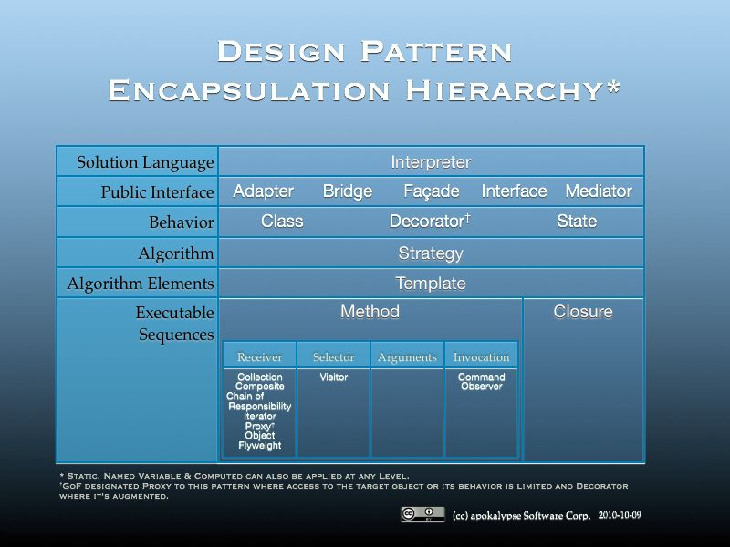
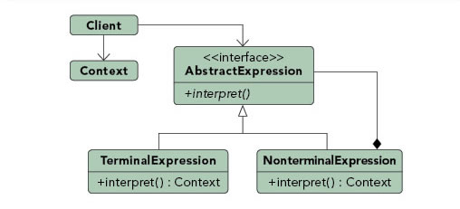

---
title: Design Pattern
author: Manish
rights:  Creative Commons Non-Commercial Share Alike 3.0
language: en-US
...

Design Patterns Tutorials
=========================

	..\pandoc-2.1.3\pandoc.exe --toc --toc-depth 6 -s *.md -o designPattern.epub
	
Design patterns are a popular topic in software development. A design pattern is a common, well-described solution to a common software problem. Sensible use of design patterns results in increased code maintainability, since in addition to being a good solution to a common problem, design patterns can be recognized by other developers, thus reducing the learning curve when dealing with a particular piece of code. Types of design patterns include creational, structural, and behavioral design patterns.

### Creational Design Patterns

- Singleton Pattern 
- Factory Pattern
- Abstract Factory Pattern 
- Builder Pattern 
- Prototype Pattern 

### Structural Design Patterns

- Adapter Pattern
- Composite Pattern 
- Proxy Pattern 
- Flyweight Pattern 
- Facade Pattern 
- Bridge Pattern 
- Decorator Pattern 

### Behavioral Design Patterns

- Template Method Pattern
- Mediator Pattern
- Chain of Responsibility Pattern
- Observer Pattern
- Strategy Pattern
- Command Pattern
- State Pattern
- Visitor Pattern
- Iterator Pattern
- Memento Pattern

#### Interpreter:- Solution Language

Purpose : Defines a representation for a grammar as well as a mechanism to understand and act upon the grammar.

Use When :
- There is grammar to interpret that can be represented as large syntax trees.
- The grammar is simple.
- Efficiency is not important.
- Decoupling grammar from underlying expressions is desired.

Example :

Text based adventures, wildly popular in the 1980's, provide a good example of this. Many had simple commands, such as "step down" that allowed traversal of the game. These commands could be nested such that it altered their meaning. For example, "go in" would result in a different outcome than "go up". By creating a hierarchy of commands based upon the command and the qualifier (non-terminal and terminal expressions) the application could easily map many command variations to a relating tree of actions.
