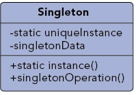
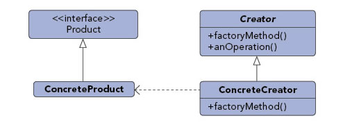
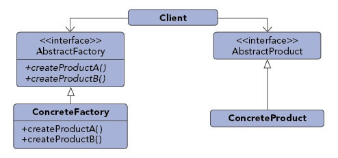
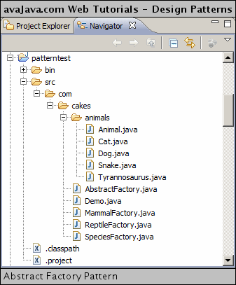
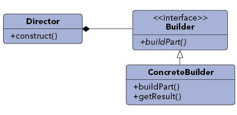
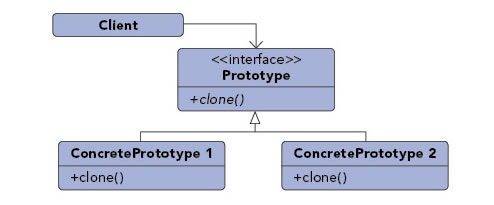

<!--Start Fragment-->
Creational Design Patterns
==========================

### Singleton Pattern



Purpose : Ensures that only one instance of a class is allowed within a system.

Use When :
- Exactly one instance of a class is required.
- Controlled access to a single object is necessary.

Example : 
Most languages provide some sort of system or environment object that allows the language to interact with the native operating system. Since the application is physically running on only one operating system there is only ever a need for a single instance of this system object. The singleton pattern would be implemented by the language runtime to ensure that only a single copy of the system object is created and to ensure only appropriate processes are allowed access to it.


A singleton is a class that is instantiated only once. This is typically accomplished by creating a static field in the class representing the class. A static method exists on the class to obtain the instance of the class and is typically named something such as getInstance(). The creation of the object referenced by the static field can be done either when the class is initialized or the first time that getInstance() is called. The singleton class typically has a private constructor to prevent the singleton class from being instantiated via a constructor. Rather, the instance of the singleton is obtained via the static getInstance() method.

The SingletonExample class is an example of a typical singleton class. It contains a private static SingletonExample field. It has a private constructor so that the class can not be instantiated by outside classes. It has a public static getInstance() method that returns the one and only SingletonExample instance. If this instance doesn't already exist, the getInstance() method creates it. The SingletonExample class has a public sayHello() method that can be used to test the singleton.

[SingletonExample.java](http://www.avajava.com/tutorials/design-patterns/singleton-pattern/SingletonExample.java)
```java
package com.cakes;

public class SingletonExample {
    
    private static SingletonExample singletonExample = null;
    
    private SingletonExample() {
    }
    
    public static SingletonExample getInstance() {
        if (singletonExample == null) {
            singletonExample = new SingletonExample();
        }
        return singletonExample;
    }
    
    public void sayHello() {
        System.out.println("Hello");
    }
}
```
The Demo class obtains a SingletonExample singleton class via the call to the static SingletonExample.getInstance(). We call the sayHello() method on the singleton class. Executing the Demo class outputs "Hello" to standard output.

[Demo.java](http://www.avajava.com/tutorials/design-patterns/singleton-pattern/Demo.java)
```java
package com.cakes;

public class Demo {
    
    public static void main(String[]args) {
        SingletonExample singletonExample = SingletonExample.getInstance();
        singletonExample.sayHello();
    }
    
}
```
Singleton classes are a useful way of concentrating access to particular resources into a single class instance.

**“Double Checked Locking”**
```java
class Singleton {
    private volatile static Singleton obj;

    private Singleton() {}

    public static Singleton getInstance()     {
        if (obj == null)         {
            // To make thread safe
            synchronized (Singleton.class) {
                // check again as multiple threads
                // can reach above step
                if (obj==null)
                    obj = new Singleton();
            }
        }
        return obj;
    }
}
```
**Block reflection** -> Enums also clone() method of Enum class throws CloneNotSupportedException

Cloning -> override Cloneable and throw exception

```java
@Override	
protected Object clone() throws CloneNotSupportedException {
    return super.clone();
}
```
**Block Serilizable**

```java
class Singleton implements Serializable {
    // public instance initialized when loading the class
    public static Singleton instance = new Singleton();

    private Singleton() {
     // private constructor
    }

    // implement readResolve method
    protected Object readResolve() {
        return instance;
    }
}
```
**Inner Static Helper Class**
```java
public class BillPughSingleton {

    private BillPughSingleton() {}
    
    private static class SingletonHelper {
        private static final BillPughSingleton INSTANCE = new BillPughSingleton();
    }
    
    public static BillPughSingleton getInstance() {
        return SingletonHelper.INSTANCE;
    }
}
```
Notice
### Factory Pattern



Purpose : Exposes a method for creating objects, allowing subclasses to control the actual creation process.

Use When :
- A class will not know what classes it will be required to create.
- Subclasses may specify what objects should be created.
- Parent classes wish to defer creation to their subclasses.

Example :

Many applications have some form of user and group structure for security. When the application needs to create a user it will typically delegate the creation of the user to multiple user implementations. The parent user object will handle most operations for each user but the subclasses will define the factory method that handles the distinctions in the creation of each type of user. A system may have AdminUser and StandardUser objects each of which extend the User object. The AdminUser object may perform some extra tasks to ensure access while the StandardUser may do the same to limit access.


The factory pattern (also known as the factory method pattern) is a creational design pattern. A factory is a Java class that is used to encapsulate object creation code. A factory class instantiates and returns a particular type of object based on data passed to the factory. The different types of objects that are returned from a factory typically are subclasses of a common parent class.

The data passed from the calling code to the factory can be passed either when the factory is created or when the method on the factory is called to create an object. This creational method is often called something such as getInstance or getClass .

As a simple example, let's create an AnimalFactory class that will return an animal object based on some data input. To start, here is an abstract Animal class. The factory will return an instantiated subclass of Animal. Animal has a single abstract method, makeSound().

[Animal.java](http://www.avajava.com/tutorials/design-patterns/factory-pattern/Animal.java)

```java
package com.cakes;

public abstract class Animal {
    public abstract String makeSound();
}
```

The Dog class is a subclass of Animal. It implements makeSound() to return "Woof".

[Dog.java](http://www.avajava.com/tutorials/design-patterns/factory-pattern/Dog.java)

```java
package com.cakes;

public class Dog extends Animal {		
    
    @Override 
    public String makeSound() {
        return "Woof";
    }
}
```

The Cat class is a subclass of Animal. It implements makeSound() to return 'Meow'.

[Cat.java](http://www.avajava.com/tutorials/design-patterns/factory-pattern/Cat.java)

```java
package com.cakes;

public class Cat extends Animal {		
    
    @Override
    public String makeSound() {
        return 'Meow';
    }
}
```

Now, let's implement our factory. We will call our factory's object creation method getAnimal. This method takes a String as a parameter. If the String is 'canine', it returns a Dog object. Otherwise, it returns a Cat object.

[AnimalFactory.java](http://www.avajava.com/tutorials/design-patterns/factory-pattern/AnimalFactory.java)

```java
package com.cakes;

public class AnimalFactory {		
    
    public Animal getAnimal(String type) {
        if ('canine'.equals(type)) {
            return new Dog();
        } else {
            return new Cat();
        }
    }
}
```

The Demo class demonstrates the use of our factory. It creates an AnimalFactory factory. The factory creates an Animal object and then another Animal object. The first object is a Cat and the second object is a Dog. The output of each object's makeSound() method is displayed.

[Demo.java](http://www.avajava.com/tutorials/design-patterns/factory-pattern/Demo.java)
```java
package com.cakes;

public class Demo {
    
    public static void main(String[] args) {
        AnimalFactory animalFactory = new AnimalFactory();
        Animal a1 = animalFactory.getAnimal("feline");
        System.out.println("a1 sound: " + a1.makeSound());
        Animal a2 = animalFactory.getAnimal("canine");
        System.out.println("a2 sound: " + a2.makeSound());
    }
}
```
The console output is shown here.

[Console Output](http://www.avajava.com/tutorials/design-patterns/factory-pattern/console.txt)

	a1 sound: Meow
	a2 sound: Woof

Notice that the factory has encapsulated our Animal object creation code, thus resulting in clean code in Demo, the class that creates the factory. Additionally, notice the use of polymorphism. We obtain different Animal objects (Cat and Dog) based on data passed to the factory.

Note that it is common to pass data that determines the type of object to be created to the factory when the factory is created (via the factory constructor). However, if multiple objects are being created by the factory, it may make sense to pass this data to the factory's creational method rather than to the constructor, since it might not make sense to create a new factory object each time we wanted to have the factory instantiate a new object.

A factory may also be used in conjunction with the singleton pattern. It is common to have a singleton return a factory instance. To do this, we could replace:

	AnimalFactory animalFactory = new AnimalFactory();

with
```java
AnimalFactory animalFactory = AnimalFactory.getAnimalFactoryInstance();
```
In this example, AnimalFactory.getAnimalFactoryInstance() would be implemented to return a static AnimalFactory object. This results in a single factory being instantiated and used rather than requiring a new factory to be instantiated each time the factory needs to be used.

### Abstract Factory Pattern



Purpose : Provide an interface that delegates creation calls to one or more concrete classes in order to deliver specific objects.

Use When :
- The creation of objects should be independent of the system utilizing them.
- Systems should be capable of using multiple families of objects.
- Families of objects must be used together.
- Libraries must be published without exposing implementation details.
- Concrete classes should be decoupled from clients.

Example :

Email editors will allow for editing in multiple formats including plain text, rich text, and HTML Depending on the format being used, different objects will need to be created. If the message is plain text then there could be a body object that represented just plain text and an attachment object that simply encrypted the attachment into Base64. If the message is HTML then the body object would represent HTML encoded text and the attachment object would allow for inline representation and a standard attachment. By utilizing an abstract factory for creation we can then ensure that the appropriate object sets are created based upon the style of email that is being sent.


The abstract factory pattern is a creational design pattern. An abstract factory is a factory that returns factories. Why is this layer of abstraction useful? A normal factory can be used to create sets of related objects. An abstract factory returns factories. Thus, an abstract factory is used to return factories that can be used to create sets of related objects.

As an example, you could have a Ford Explorer factory that returns car part objects (mufflers, air filters, etc) associated with a Ford Explorer. You could also have a Chevy Tahoe factory that returns car part objects associated with a Chevy Tahoe. We could create an abstract factory that returns these different types of car factories depending on the car that we were interested in. We could then obtain car part objects from the car factory. Via polymorphism, we can use a common interface to get the different factories, and we could could then use a common interface to get the different car parts.

Now, we will look at the code for another simple example of the abstract factory design pattern. The sample project is shown here:



Our AbstractFactory will return either a MammalFactory or a ReptileFactory via the SpeciesFactory return type. MammalFactory and ReptileFactory are subclasses of SpeciesFactory.

[AbstractFactory.java](http://www.avajava.com/tutorials/design-patterns/abstract-factory-pattern/AbstractFactory.java)
```java
package com.cakes;

public class AbstractFactory {	
	
	public SpeciesFactory getSpeciesFactory(String type) {
		if ("mammal".equals(type)) {
			return new MammalFactory();
		} else {
			return new ReptileFactory();
		}
	}
}
```
SpeciesFactory is an abstract class with the getAnimal() abstract method. This method returns an Animal object. The polymorphism of AbstractFactory is achieved because its getSpeciesFactory() method returns a SpeciesFactory, regardless of the actual underlying class. This polymorphism could also be achieved via an interface rather than an abstract class.

[SpeciesFactory.java](http://www.avajava.com/tutorials/design-patterns/abstract-factory-pattern/SpeciesFactory.java)

```java
package com.cakes;

import com.cakes.animals.Animal;

public abstract class SpeciesFactory {	
    public abstract Animal getAnimal(String type);
}
```

MammalFactory implements getAnimal(). It returns an Animal, which is either a Dog or a Cat.

[MammalFactory.java](http://www.avajava.com/tutorials/design-patterns/abstract-factory-pattern/MammalFactory.java)

```java
package com.cakes;

import com.cakes.animals.Animal;
import com.cakes.animals.Cat;
import com.cakes.animals.Dog;

public class MammalFactory extends SpeciesFactory {		
    @Override 
    public Animal getAnimal(String type) {
        if ("dog".equals(type)) {
            return new Dog();
        } else {
            return new Cat();
        }
    }
}
```

ReptileFactory implements getAnimal(). It returns an Animal, which is either a Snake or a Tyrannosaurus.

[ReptileFactory.java](http://www.avajava.com/tutorials/design-patterns/abstract-factory-pattern/ReptileFactory.java)

```java
package com.cakes;
import com.cakes.animals.Animal;
import com.cakes.animals.Snake;
import com.cakes.animals.Tyrannosaurus;

public class ReptileFactory extends SpeciesFactory {
    @Override	
    public Animal getAnimal(String type) {
        if ("snake".equals(type)) {
            return new Snake();
        } else {
            return new Tyrannosaurus();
        }
    }
}
```

Animal is an abstract class with the makeSound() abstract method. Subclasses of Animal implement the makeSound() method.

[Animal.java](http://www.avajava.com/tutorials/design-patterns/abstract-factory-pattern/Animal.java)

```java
package com.cakes.animals;

public abstract class Animal {
    public abstract String makeSound();
}
```

The Cat class is shown here.

[Cat.java](http://www.avajava.com/tutorials/design-patterns/abstract-factory-pattern/Cat.java)

```java
package com.cakes.animals;

public class Cat extends Animal {
    
    @Override	
    public String makeSound() {
        return "Meow";
    }
}
```

The Dog class is shown here.

[Dog.java](http://www.avajava.com/tutorials/design-patterns/abstract-factory-pattern/Dog.java)

```java
package com.cakes.animals;

public class Dog extends Animal {
    
    @Override	
    public String makeSound() {
        return "Woof";
    }
}
```

The Snake class is shown here.

[Snake.java](http://www.avajava.com/tutorials/design-patterns/abstract-factory-pattern/Snake.java)

```java
package com.cakes.animals;

public class Snake extends Animal {
    
    @Override	
    public String makeSound() {
        return "Hiss";
    }
}
```

The Tyrannosaurus class is shown here.

[Tyrannosaurus.java](http://www.avajava.com/tutorials/design-patterns/abstract-factory-pattern/Tyrannosaurus.java)

```java
package com.cakes.animals;

public class Tyrannosaurus extends Animal {
    
    @Override	
    public String makeSound() {
        return "Roar";
    }
}
```

The Demo class contains our main() method. It creates an AbstractFactory object. From the AbstractFactory, we obtain a SpeciesFactory (a ReptileFactory) and get two Animal objects (Tyrannosaurus and Snake) from the SpeciesFactory. After this, we obtain another SpeciesFactory (a MammalFactory) and then obtain two more Animal objects (Dog and Cat).

[Demo.java](http://www.avajava.com/tutorials/design-patterns/abstract-factory-pattern/Demo.java)
```java
package com.cakes;
import com.cakes.animals.Animal;

public class Demo {

    public static void main(String[] args) {
        AbstractFactory abstractFactory = new AbstractFactory();
        SpeciesFactory speciesFactory1 = abstractFactory.getSpeciesFactory("reptile");
        Animal a1 = speciesFactory1.getAnimal("tyrannosaurus");
        System.out.println("a1 sound: " + a1.makeSound());
        Animal a2 = speciesFactory1.getAnimal("snake");
        System.out.println("a2 sound: " + a2.makeSound());
        SpeciesFactory speciesFactory2 = abstractFactory.getSpeciesFactory("mammal");
        Animal a3 = speciesFactory2.getAnimal("dog");
        System.out.println("a3 sound: " + a3.makeSound());
        Animal a4 = speciesFactory2.getAnimal("cat");
        System.out.println("a4 sound: " + a4.makeSound());
    }
}
```
Executing the Demo class displays the sounds made by the four Animal
objects. The console output is shown here.

[Console Output](http://www.avajava.com/tutorials/design-patterns/abstract-factory-pattern/console.txt)

	a1 sound: Roar
	a2 sound: Hiss
	a3 sound: Woof
	a4 sound: Meow

Notice the use of polymorphism. We obtain different factories via the common SpeciesFactory superclass. We also obtain different animals via the common Animal superclass.

### Builder Pattern



Purpose : Allows for the dynamic creation of objects based upon easily interchangeable algorithms.

Use When :
- Object creation algorithms should be decoupled from the system.
- Multiple representations of creation algorithms are required.
- The addition of new creation functionality without changing the core code is necessary.
- Runtime control over the creation process is required.

Example : 
A file transfer application could possibly use many different protocols to send files and the actual transfer object that will be created will be directly dependent on the chosen protocol. Using a builder we can determine the right builder to use to instantiate the right object. If the setting is FTP then the FTP builder would be used when creating the object.


The builder pattern is a creational design pattern used to assemble complex objects. With the builder pattern, the same object construction process can be used to create different objects. The builder has 4 main parts: a Builder, Concrete Builders, a Director, and a Product.

A Builder is an interface (or abstract class) that is implemented (or extended) by Concrete Builders. The Builder interface sets forth the actions (methods) involved in assembling a Product object. It also has a method for retrieving the Product object (ie, getProduct()). The Product object is the object that gets assembled in the builder pattern.

Concrete Builders implement the Builder interface (or extend the Builder abstract class). A Concrete Builder is responsible for creating and assembling a Product object. Different Concrete Builders create and assemble Product objects differently.

A Director object is responsible for constructing a Product. It does this via the Builder interface to a Concrete Builder. It constructs a Product via the various Builder methods.

There are various uses of the builder pattern. For one, if we'd like the construction process to remain the same but we'd like to create a different type of Product, we can create a new Concrete Builder and pass this to the same Director. If we'd like to alter the construction process, we can modify the Director to use a different construction process.

Now, lets look at an example of the builder pattern. Our example will build different kinds of restaurant meals.

First off, our Product will be a Meal class, which represents food items in a meal. It represents a drink, main course, and side item.

[Meal.java](http://www.avajava.com/tutorials/design-patterns/builder-pattern/Meal.java)
```java
package com.cakes;

public class Meal {

    private String drink;

    private String mainCourse;

    private String side;

    public String getDrink() {
        return drink;
    }

    public void setDrink(String drink) {
        this.drink = drink;
    }

    public String getMainCourse() {
        return mainCourse;
    }

    public void setMainCourse(String mainCourse) {
        this.mainCourse = mainCourse;
    }

    public String getSide() {
        return side;
    }

    public void setSide(String side) {
        this.side = side;
    }

    public String toString() {
        return 'drink:' + drink + ', main course:' + mainCourse + ', side:' + side;
    }
}
```
Our Builder interface is MealBuilder. It features methods used to build a meal and a method to retrieve the meal.

[MealBuilder.java](http://www.avajava.com/tutorials/design-patterns/builder-pattern/MealBuilder.java)

```java
package com.cakes;

public interface MealBuilder {		
    public void buildDrink();

    public void buildMainCourse();

    public void buildSide();

    public Meal getMeal();

}
```

Our first Concrete Builder is ItalianMealBuilder. Its constructor creates a meal. Its methods are implemented to build the various parts of the meal. It returns the meal via getMeal().

[ItalianMealBuilder.java](http://www.avajava.com/tutorials/design-patterns/builder-pattern/ItalianMealBuilder.java)
```java
package com.cakes;

public class ItalianMealBuilder implements MealBuilder {
    private Meal meal;

    public ItalianMealBuilder() {
        meal = new Meal();
    }

    @Override
    public void buildDrink() {
        meal.setDrink("red wine");
    }

    @Override
    public void buildMainCourse() {
        meal.setMainCourse("pizza");
    }

    @Override
    public void buildSide() {
        meal.setSide("bread");
    }

    @Override
    public Meal getMeal() {
        return meal;
    }
}
```
Our second Concrete Builder is JapaneseMealBuilder. Its constructor creates a meal. Its methods are implemented to build the various parts of a Japanese meal. It returns the meal via getMeal().

[JapaneseMealBuilder.java](http://www.avajava.com/tutorials/design-patterns/builder-pattern/JapaneseMealBuilder.java)
```java
package com.cakes;

public class JapaneseMealBuilder implements MealBuilder {
    private Meal meal;

    public JapaneseMealBuilder() {
        meal = new Meal();
    }

    @Override
    public void buildDrink() {
        meal.setDrink("sake");
    }

    @Override
    public void buildMainCourse() {
        meal.setMainCourse("chicken teriyaki");
    }

    @Override
    public void buildSide() {
        meal.setSide("miso soup");
    }

    @Override
    public Meal getMeal() {
        return meal;
    }
}
```
Our Director class is MealDirector. It takes a MealBuilder as a parameter in its constructor. Thus, a different type of meal will be assembled by the MealDirector depending on the Concrete Builder passed in to the constructor. The assembly of the meal (Product) takes place in the constructMeal() method of the Director. This method spells out the parts of the meal that will be assembled.

[MealDirector.java](http://www.avajava.com/tutorials/design-patterns/builder-pattern/MealDirector.java)

```java
package com.cakes;

public class MealDirector {
    private MealBuilder mealBuilder = null;

    public MealDirector(MealBuilder mealBuilder) {
        this.mealBuilder = mealBuilder;
    }

    public void constructMeal() {
        mealBuilder.buildDrink();
        mealBuilder.buildMainCourse();
        mealBuilder.buildSide();
    }

    public Meal getMeal() {
        return mealBuilder.getMeal();
    }
}
```

The Demo class lets us demonstrate our builder pattern. First, our director builds an Italian meal. An ItalianMealBuilder is passed to the MealDirector's constructor. The meal is constructed via mealDirector.constructMeal(). The meal is obtained from mealDirector via mealDirector.getMeal(). The Italian meal is displayed. After this, we perform the same process to build and display a Japanese meal.

[Demo.java](http://www.avajava.com/tutorials/design-patterns/builder-pattern/Demo.java)
```java
package com.cakes;

public class Demo {
    public static void main(String[] args) {
        MealBuilder mealBuilder = new ItalianMealBuilder();
        MealDirector mealDirector = new MealDirector(mealBuilder);
        mealDirector.constructMeal();
        Meal meal = mealDirector.getMeal();
        System.out.println("meal is: " + meal);
        mealBuilder = new JapaneseMealBuilder();
        mealDirector = new MealDirector(mealBuilder);
        mealDirector.constructMeal();
        meal = mealDirector.getMeal();
        System.out.println("meal is: " + meal);
    }
}
```
The console output of executing Demo is shown here.

[Console Output](http://www.avajava.com/tutorials/design-patterns/builder-pattern/console.txt)

	meal is: drink:red wine, main course:pizza, side:bread
	meal is: drink:sake, main course:chicken teriyaki, side:miso soup

Notice that if we'd like to create a new type of meal, we can do so by implementing a new Concrete Builder (ie, SwedishMealBuilder, FrenchMealBuilder, etc), which we'd pass to the MealDirector. If we'd like the meal to be constructed of different parts (ie, no drink), we can alter the construction process in MealDirector. Thus, construction process has been separated to the Director, and the data representation is controlled by the Concrete Builders that implement the Builder interface.

### Prototype Pattern



Purpose : Create objects based upon a template of an existing objects through cloning.

Use When :
- Composition, creation, and representation of objects should be decoupled from a system.
- Classes to be created are specified at runtime.
- A limited number of state combinations exist in an object.
- Objects or object structures are required that are identical or closely resemble other existing objects or object structures.
- The initial creation of each object is an expensive operation.

Example :

Rates processing engines often require the lookup of many different configuration values, making the initialization of the engine a relatively expensive process. When multiple instances of the engine is needed, say for importing data in a multi-threaded manner, the expense of initializing many engines is high. By utilizing the prototype pattern we can ensure that only a single copy of the engine has to be initialized then simply clone the engine to create a duplicate of the already initialized object. The added benefit of this is that the clones can be streamlined to only include relevant data for their situation.


The prototype pattern is a creational design pattern. In the prototype pattern, a new object is created by cloning an existing object. In Java, the clone() method is an implementation of this design pattern. The prototype pattern can be a useful way of creating copies of objects. One example of how this can be useful is if an original object is created with a resource such as a data stream that may not be available at the time that a clone of the object is needed. Another example is if the original object creation involves a significant time commitment, such as reading data from a database or over a network. An added benefit of the prototype pattern is that it can reduce class proliferation in a project by avoiding factory proliferation.

Normally in Java, if you\'d like to use cloning (ie, the prototype pattern), you can utilize the clone() method and the Cloneable interface. By default, clone() performs a shallow copy. In another tutorial, we demonstrate how Serializable can be used to simplify deep copying.

However, we can implement our own prototype pattern. To do so, We'll create a Prototype interface that features a doClone() method.

[Prototype.java](http://www.avajava.com/tutorials/design-patterns/prototype-pattern/Prototype.java)

```java
package com.cakes;

public interface Prototype {
    public Prototype doClone();
}
```

The Person class implements the doClone() method. This method creates a new Person object and clones the name field. It returns the newly cloned Person object.

[Person.java](http://www.avajava.com/tutorials/design-patterns/prototype-pattern/Person.java)

```java
package com.cakes;

public class Person implements Prototype {
    
    String name;

    public Person(String name) {
        this.name = name;
    }

    @Override
    public Prototype doClone() {
        return new Person(name);
    }

    public String toString() {
        return "This person is named " + name;
    }
}
```

The Dog class also implements the doClone() method. This method creates a new Dog object and clones the sound field. The cloned Dog object is returned.

[Dog.java](http://www.avajava.com/tutorials/design-patterns/prototype-pattern/Dog.java)

```java
package com.cakes;

public class Dog implements Prototype {
    
    String sound;

    public Dog(String sound) {
        this.sound = sound;
    }

    @Override
    public Prototype doClone() {
        return new Dog(sound);
    }

    public String toString() {
        return "This dog says " + sound;
    }
}
```

The Demo class creates a Person object and then clones it to a second Person object. It then creates a Dog object and clones it to a second Dog object.

[Demo.java](http://www.avajava.com/tutorials/design-patterns/prototype-pattern/Demo.java)
```java
package com.cakes;

public class Demo {

    public static void main(String[] args) {
        Person person1 = new Person("Fred");
        System.out.println("person 1:" + person1);
        Person person2 = (Person) person1.doClone();
        System.out.println("person 2:" + person2);
        Dog dog1 = new Dog("Wooof!");
        System.out.println("dog 1:" + dog1);
        Dog dog2 = (Dog) dog1.doClone();
        System.out.println("dog 2:" + dog2);
    }
}
```
The console output of executing Demo is shown here.

[Console Output](http://www.avajava.com/tutorials/design-patterns/prototype-pattern/console.txt)

	person 1:This person is named Fred
	person 2:This person is named Fred
	dog 1:This dog says Wooof!
	dog 2:This dog says Wooof!


