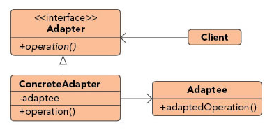
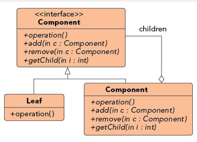
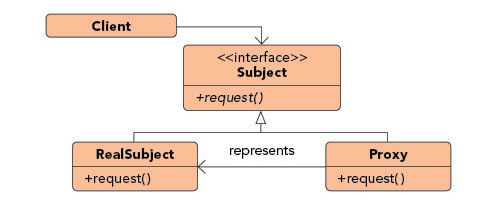
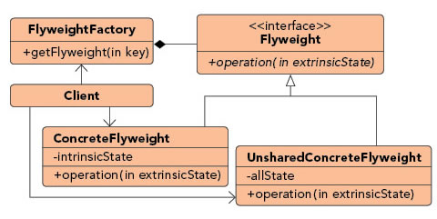
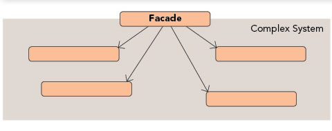
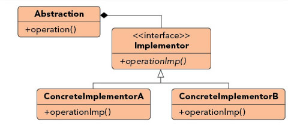
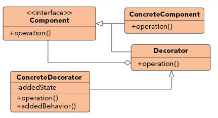

<!--Start Fragment-->
Structural Design Patterns
==========================

### Adapter Pattern



Purpose : Permits classes with disparate interfaces to work together by creating a common object by which they may communicate and interact.

Use When :
- A class to be used doesn't meet interface requirements.
- Complex conditions tie object behavior to its state.
- Transitions between states need to be explicit.

Example :

A billing application needs to interface with an HR application in order to exchange employee data, however each has its own interface and implementation for the Employee object. In addition, the SSN is stored in different formats by each system. By creating an adapter we can create a common interface between the two applications that allows them to communicate using their native objects and is able to transform the SSN format in the process.


The adapter pattern is a structural design pattern. In the adapter pattern, a wrapper class (ie, the adapter) is used translate requests from it to another class (ie, the adaptee). In effect, an adapter provides particular interactions with an adaptee that are not offered directly by the adaptee.

The adapter pattern takes two forms. In the first form, a "class adapter" utilizes inheritance. The class adapter extends the adaptee class and adds the desired methods to the adapter. These methods can be declared in an interface (ie, the "target" interface).

In the second form, an "object adapter" utilizes composition. The object adapter contains an adaptee and implements the target interface to interact with the adaptee.

Now lets look at simple examples of a class adapter and an object adapter. First, we have an adaptee class named CelciusReporter. It stores a temperature value in Celcius.

[CelciusReporter.java](http://www.avajava.com/tutorials/design-patterns/adapter-pattern/CelciusReporter.java)
```java
package com.cakes;

public class CelciusReporter {
    double temperatureInC;

    public CelciusReporter() {}

    public double getTemperature() {
        return temperatureInC;
    }

    public void setTemperature(double temperatureInC) {
        this.temperatureInC = temperatureInC;
    }
}
```
Here is our target interface that will be implemented by our adapter. It defines actions that our adapter will perform.

[TemperatureInfo.java](http://www.avajava.com/tutorials/design-patterns/adapter-pattern/TemperatureInfo.java)
```java
package com.cakes;

public interface TemperatureInfo {
    
    public double getTemperatureInF();

    public void setTemperatureInF(double temperatureInF);

    public double getTemperatureInC();

    public void setTemperatureInC(double temperatureInC);
}
```
TemperatureClassReporter is a class adapter. It extends CelciusReporter (the adaptee) and implements TemperatureInfo (the target interface). If a temperature is in Celcius, TemperatureClassReporter utilizes the temperatureInC value from CelciusReporter. Fahrenheit requests are internally handled in Celcius.

[TemperatureClassReporter.java](http://www.avajava.com/tutorials/design-patterns/adapter-pattern/TemperatureClassReporter.java)
```java
package com.cakes;

// example of a class adapter

public class TemperatureClassReporter extends CelciusReporter implements TemperatureInfo {
    
    @Override
    public double getTemperatureInC() {
        return temperatureInC;
    }

    @Override
    public double getTemperatureInF() {
        return cToF(temperatureInC);
    }

    @Override
    public void setTemperatureInC(double temperatureInC) {
        this.temperatureInC = temperatureInC;
    }

    @Override
    public void setTemperatureInF(double temperatureInF) {
        this.temperatureInC = fToC(temperatureInF);
    }

    private double fToC(double f) {
        return ((f - 32) * 5 / 9);
    }

    private double cToF(double c) {
        return ((c * 9 / 5) + 32);
    }
}
```
TemperatureObjectReporter is an object adapter. It is similar in functionality to TemperatureClassReporter, except that it utilizes composition for the CelciusReporter rather than inheritance.

[TemperatureObjectReporter.java](http://www.avajava.com/tutorials/design-patterns/adapter-pattern/TemperatureObjectReporter.java)
```java
package com.cakes;

// example of an object adapter

public class TemperatureObjectReporter implements TemperatureInfo {
    
    CelciusReporter celciusReporter;

    public TemperatureObjectReporter() {
        celciusReporter = new CelciusReporter();
    }

    @Override
    public double getTemperatureInC() {
        return celciusReporter.getTemperature();
    }

    @Override
    public double getTemperatureInF() {
        return cToF(celciusReporter.getTemperature());
    }

    @Override
    public void setTemperatureInC(double temperatureInC) {
        celciusReporter.setTemperature(temperatureInC);
    }

    @Override
    public void setTemperatureInF(double temperatureInF) {
        celciusReporter.setTemperature(fToC(temperatureInF));
    }

    private double fToC(double f) {
        return ((f - 32) * 5 / 9);
    }

    private double cToF(double c) {
        return ((c * 9 / 5) + 32);
    }
}
```
The AdapterDemo class is a client class that demonstrates the adapter pattern. First, it creates a TemperatureClassReporter object and references it via a TemperatureInfo reference. It demonstrates calls to the class adapter via the TemperatureInfo interface. After this, it creates a TemperatureObjectReporter object and references it via the same TemperatureInfo reference. It then demonstrates calls to the object adapter.

[AdapterDemo.java](http://www.avajava.com/tutorials/design-patterns/adapter-pattern/AdapterDemo.java)
```java
package com.cakes;

public class AdapterDemo {
    public static void main(String[] args) {
        
        // class adapter

        System.out.println("class adapter test");
        TemperatureInfo tempInfo = new TemperatureClassReporter();
        testTempInfo(tempInfo);
        
        // object adapter

        System.out.println("\nobject adapter test");
        tempInfo = new TemperatureObjectReporter();
        testTempInfo(tempInfo);
    }

    public static void testTempInfo(TemperatureInfo tempInfo) {
        tempInfo.setTemperatureInC(0);
        System.out.println("temp in C:" + tempInfo.getTemperatureInC());
        System.out.println("temp in F:" + tempInfo.getTemperatureInF());
        tempInfo.setTemperatureInF(85);
        System.out.println("temp in C:" + tempInfo.getTemperatureInC());
        System.out.println("temp in F:" + tempInfo.getTemperatureInF());
    }
}
```
The console output of the execution of AdapterDemo is shown here.

[Console Output](http://www.avajava.com/tutorials/design-patterns/adapter-pattern/console.txt)

	class adapter test
	temp in C:0.0
	temp in F:32.0
	temp in C:29.444444444444443
	temp in F:85.0
	object adapter test
	temp in C:0.0
	temp in F:32.0
	temp in C:29.444444444444443
	temp in F:85.0

### Composite Pattern



Purpose : Facilitates the creation of object hierarchies where each object can be treated independently or as a set of nested objects through the same interface.

Use When :
- Hierarchical representations of objects are needed.
- Objects and compositions of objects should be treated uniformly.

Example :

Sometimes the information displayed in a shopping cart is the product of a single item while other times it is an aggregation of multiple items. By implementing items as composites we can treat the aggregates and the items in the same way, allowing us to simply iterate over the tree and invoke functionality on each item. By calling the getCost() method on any given node we would get the cost of that item plus the cost of all child items, allowing items to be uniformly treated whether they were single items or groups of items.


The composite pattern is a structural design pattern. In the composite pattern, a tree structure exists where identical operations can be performed on leaves and nodes. A node in a tree is a class that can have children. A node class is a \'composite\' class. A leaf in a tree is a \'primitive\' class that does not have children. The children of a composite can be leaves or other composites.

The leaf class and the composite class share a common \'component\'interface that defines the common operations that can be performed on leaves and composites. When an operation on a composite is performed, this operation is performed on all children of the composite, whether they are leaves or composites. Thus, the composite pattern can be used to perform common operations on the objects that compose a tree.

The Gang of Four description of the composite pattern defines a client's interaction with the tree structure via a Component interface, where this interface includes the common operations on the composite and leaf classes, and the add/remove/get operations on the composites of the tree. This seems slightly awkward since a leaf does not implement the add/remove/get operations. In my opinion, in Java it makes more sense to define the common leaf/composite operations on a Component interface, but to put the add/remove/get composite operations in a separate interface or to simply implement them in the composite class.

Now We'll look at an example of the composite pattern. First, We'll declare a Component interface that declares the operations that are common for the composite class and the leaf class. This allows us to perform operations on composites and leaves using one standard interface.

[Component.java](http://www.avajava.com/tutorials/design-patterns/composite-pattern/Component.java)

```java
package com.cakes;

public interface Component {
    public void sayHello();

    public void sayGoodbye();
}
```

The Leaf class has a name field and implements the sayHello() and sayGoodbye() methods of the Component interface by outputting messages to standard output.

[Leaf.java](http://www.avajava.com/tutorials/design-patterns/composite-pattern/Leaf.java)
```java
package com.cakes;

public class Leaf implements Component {
    String name;

    public Leaf(String name) {
        this.name = name;
    }

    @Override
    public void sayHello() {
        System.out.println(name + " leaf says hello");
    }

    @Override
    public void sayGoodbye() {
        System.out.println(name + " leaf says goodbye");
    }
}
```
The Composite class implements the Component interface. It implements the sayHello() and sayGoodbye() methods by calling these same methods on all of its children, which are Components (since they can be both Leaf objects and Composite objects, which both implement the Component interface).

[Composite.java](http://www.avajava.com/tutorials/design-patterns/composite-pattern/Composite.java)
```java
package com.cakes;
import java.util.ArrayList;
import java.util.List;

public class Composite implements Component {
    List<Component> components = new ArrayList<>();

    @Override
    public void sayHello() {
        for (Component component : components) {
            component.sayHello();
        }
    }

    @Override
    public void sayGoodbye() {
        for (Component component : components) {
            component.sayGoodbye();
        }
    }

    public void add(Component component) {
        components.add(component);
    }

    public void remove(Component component) {
        components.remove(component);
    }

    public List<Component> getComponents() {
        return components;
    }

    public Component getComponent(int index) {
        return components.get(index);
    }
}
```
The CompositeDemo class demonstrates the composite pattern. It creates 5 Leaf objects. It adds two of these two a Composite object and two of these to another Composite object. It adds these two Composite objects and the last Leaf object to another Composite object. It calls sayHello() on leaf1, then sayHello() on composite1, then sayHello() on composite2, and then sayGoodbye() on composite3.

[CompositeDemo.java](http://www.avajava.com/tutorials/design-patterns/composite-pattern/CompositeDemo.java)
```java
package com.cakes;

public class CompositeDemo {
    public static void main(String[] args) {
        Leaf leaf1 = new Leaf("Bob");
        Leaf leaf2 = new Leaf("Fred");
        Leaf leaf3 = new Leaf("Sue");
        Leaf leaf4 = new Leaf("Ellen");
        Leaf leaf5 = new Leaf("Joe");
        Composite composite1 = new Composite();
        composite1.add(leaf1);
        composite1.add(leaf2);
        Composite composite2 = new Composite();
        composite2.add(leaf3);
        composite2.add(leaf4);
        Composite composite3 = new Composite();
        composite3.add(composite1);
        composite3.add(composite2);
        composite3.add(leaf5);
        System.out.println("Calling 'sayHello' on leaf1");
        leaf1.sayHello();
        System.out.println("\nCalling 'sayHello' on composite1");
        composite1.sayHello();
        System.out.println("\nCalling 'sayHello' on composite2");
        composite2.sayHello();
        System.out.println("\nCalling 'sayGoodbye\' on composite3");
        composite3.sayGoodbye();
    }
}
```
The console output of executing CompositeDemo is shown here.

[Console Output](http://www.avajava.com/tutorials/design-patterns/composite-pattern/console.txt)

	Calling 'sayHello' on leaf1
	Bob leaf says hello
	
	Calling 'sayHello' on composite1
	Bob leaf says hello
	Fred leaf says hello
	
	Calling 'sayHello' on composite2
	Sue leaf says hello
	Ellen leaf says hello
	
	Calling 'sayGoodbye' on composite3
	Bob leaf says goodbye
	Fred leaf says goodbye
	Sue leaf says goodbye
	Ellen leaf says goodbye
	Joe leaf says goodbye

As seen in the output, the composite pattern allows us to perform operations on the composites and leaves that make up a tree structure via a common interface.

### Proxy Pattern



Purpose : Allows for object level access control by acting as a pass through entity or a placeholder object.

Use When :
- The object being represented is external to the system.
- Objects need to be created on demand.
- Access control for the original object is required.
- Added functionality is required when an object is accessed.

Example :

Ledger applications often provide a way for users to reconcile their bank statements with their ledger data on demand, automating much of the process. The actual operation of communicating with a third party is a relatively expensive operation that should be limited. By using a proxy to represent the communications object we can limit the number of times or the intervals the communication is invoked. In addition, we can wrap the complex instantiation of the communication object inside the proxy class, decoupling calling code from the implementation details.


The proxy pattern is a structural design pattern. In the proxy pattern, a proxy class is used to control access to another class. The reasons for this control can vary. As one example, a proxy may avoid instantiation of an object until the object is needed. This can be useful if the object requires a lot of time or resources to create. Another reason to use a proxy is to control access rights to an object. A client request may require certain credentials in order to access the object.

Now, we'll look at an example of the proxy pattern. First, We'll create an abstract class called Thing with a basic sayHello() message that includes the date/time that the message is displayed.

[Thing.java](http://www.avajava.com/tutorials/design-patterns/proxy-pattern/Thing.java)
```java
package com.cakes;
import java.util.Date;

public abstract class Thing {
    
    public void sayHello() {
        System.out.println(this.getClass().getSimpleName() + " says howdy at > " + new Date());
    }
}
```
FastThing subclasses Thing.

[FastThing.java](http://www.avajava.com/tutorials/design-patterns/proxy-pattern/FastThing.java)

```java
package com.cakes;

public class FastThing extends Thing {
    public FastThing() {}
}
```

SlowThing also subclasses Thing. However, its constructor takes 5 seconds to execute.

[SlowThing.java](http://www.avajava.com/tutorials/design-patterns/proxy-pattern/SlowThing.java)

```java
package com.cakes;

public class SlowThing extends Thing {
    public SlowThing() {
        try {
            Thread.sleep(5000);
        } catch (InterruptedException e) {
            e.printStackTrace();
        }
    }
}
```

The Proxy class is a proxy to a SlowThing object. Since a SlowThing object takes 5 seconds to create, We'll use a proxy to a SlowThing so that a SlowThing object is only created on demand. This occurs when the proxy's sayHello() method is executed. It instantiates a SlowThing object if it doesn't already exist and then calls sayHello() on the SlowThing object.

[Proxy.java](http://www.avajava.com/tutorials/design-patterns/proxy-pattern/Proxy.java)
```java
package com.cakes;
import java.util.Date;

public class Proxy {
    SlowThing slowThing;

    public Proxy() {
        System.out.println("Creating proxy at " + new Date());
    }

    public void sayHello() {
        if (slowThing == null) {
            slowThing = new SlowThing();
        }
        slowThing.sayHello();
    }
}
```
The ProxyDemo class demonstrates the use of our proxy. It creates a Proxy object and then creates a FastThing object and calls sayHello() on the FastThing object. Next, it calls sayHello() on the Proxy object.

[ProxyDemo.java](http://www.avajava.com/tutorials/design-patterns/proxy-pattern/ProxyDemo.java)

```java
package com.cakes;

public class ProxyDemo {

    public static void main(String[] args) {
        Proxy proxy = new Proxy();
        FastThing fastThing = new FastThing();
        fastThing.sayHello();
        proxy.sayHello();
    }
}
```

The console output of executing ProxyDemo is shown here. From the output, notice that creating the Proxy object and calling sayHello() on the FastThing object occurred at 16:41:06, and calling sayHello() on the Proxy object did not call sayHello() on the SlowThing object until 16:41:11. We can see that the SlowThing creation was a time-consuming process. However, this did not slow down the execution of our application until the SlowThing object was actually required. We can see here that the proxy pattern avoids the creation of time-consuming objects until they are actually needed.

[Console Output](http://www.avajava.com/tutorials/design-patterns/proxy-pattern/console.txt)

	Creating proxy at Sat May 03 16:41:06 PDT 2008
	FastThing says howdy at Sat May 03 16:41:06 PDT 2008
	SlowThing says howdy at Sat May 03 16:41:11 PDT 2008

### Flyweight Pattern



Purpose : Facilitates the reuse of many fine grained objects, making the utilization of large numbers of objects more efficient.

Use When :
- Many like objects are used and storage cost is high.
- The majority of each object's state can be made extrinsic.
- A few shared objects can replace many unshared ones.
- The identity of each object does not matter.

Example :

Systems that allow users to define their own application flows and layouts often have a need to keep track of large numbers of fields, pages, and other items that are almost identical to each other. By making these items into flyweights all instances of each object can share the intrinsic state while keeping the extrinsic state separate. The intrinsic state would store the shared properties, such as how a textbox looks, how much data it can hold, and what events it exposes. The extrinsic state would store the unshared properties, such as where the item belongs, how to react to a user click, and how to handle events.


The flyweight pattern is a structural design pattern. In the flyweight pattern, instead of creating large numbers of similar objects, objects are reused. This can be used to reduce memory requirements and instantiation time and related costs. Similarities between objects are stored inside of the objects, and differences are moved outside of the objects and placed in client code. These differences are passed in to the objects when needed via method calls on the objects. A Flyweight interface declares these methods. A Concrete Flyweight class implements the Flyweight interface which is used to perform operations based on external state and it also stores common state. A Flyweight Factory is used create and return Flyweight objects.

Now, lets look at an example of the flyweight design pattern. We'll create a Flyweight interface with a doMath() method that will be used to perform a mathematical operation on two integers passed in as parameters.

[Flyweight.java](http://www.avajava.com/tutorials/design-patterns/flyweight-pattern/Flyweight.java)

```java
package com.cakes;

public interface Flyweight {
    public void doMath(int a, int b);
}
```

The FlyweightAdder class is a concrete flyweight class. It contains an "operation" field that is used to store the name of an operation that is common to adder flyweights. Notice the call to Thread.sleep(3000). This simulates a construction process that is expensive in terms of time. Each FlyweightAdder object that is created takes 3 seconds to create, so we definitely want to minimize the number of flyweight objects that are created. The doMath() method is implemented. It displays the common "operation" field and displays the addition of a and b, which are external state values that are passed in and used by the FlyweightAdder when doMath() is executed.

[FlyweightAdder.java](http://www.avajava.com/tutorials/design-patterns/flyweight-pattern/FlyweightAdder.java)
```java
package com.cakes;

public class FlyweightAdder implements Flyweight {
    
    String operation;

    public FlyweightAdder() {
        operation = "adding";

        try {
            Thread.sleep(3000);
        } catch (InterruptedException e) {
            e.printStackTrace();
        }
    }

    @Override
    public void doMath(int a, int b) {
        System.out.println(operation + ' ' + a + ' and ' + b + ': ' + (a + b));
    }
}
```
The FlyweightMultiplier class is similar to the FlyweightAdder class, except that it performs multiplication rather than addition.

[FlyweightMultiplier.java](http://www.avajava.com/tutorials/design-patterns/flyweight-pattern/FlyweightMultiplier.java)
```java
package com.cakes;

public class FlyweightMultiplier implements Flyweight {
    String operation;

    public FlyweightMultiplier() {
        operation = "multiplying";

        try {
            Thread.sleep(3000);
        } catch (InterruptedException e) {
            e.printStackTrace();
        }
    }

    @Override
    public void doMath(int a, int b) {
        System.out.println(operation + ' ' + a + ' and ' + b + ': ' + (a * b));
    }
}
```
The FlyweightFactory class is our flyweight factory. It utilizes the singleton pattern so that we only have once instance of the factory, which we obtain via its static getInstance() method. The FlyweightFactory creates a hashmap pool of flyweights. If a request is made for a flyweight object and that object doesn't exist, it is created and placed in the flyweight pool. The flyweight pool of the FlyweightFactory stores all the instances of the different types of flyweights (ie, FlyweightAdder object, FlyweightMultiplier object, etc). Thus, only one instance of each type is created, and this occurs on-demand.

[FlyweightFactory.java](http://www.avajava.com/tutorials/design-patterns/flyweight-pattern/FlyweightFactory.java)
```java
package com.cakes;
import java.util.HashMap;
import java.util.Map;

public class FlyweightFactory {
    private static FlyweightFactory flyweightFactory;

    private Map<String, Flyweight> flyweightPool;

    private FlyweightFactory() {
        flyweightPool = new HashMap<>();
    }

    public static FlyweightFactory getInstance() {
        if (flyweightFactory == null) {
            flyweightFactory = new FlyweightFactory();
        }

        return flyweightFactory;
    }

    public Flyweight getFlyweight(String key) {
        if (flyweightPool.containsKey(key)) {
            return flyweightPool.get(key);
        } else {Flyweight flyweight;

            if ("add".equals(key)) {
                flyweight = new FlyweightAdder();
            } else {
                flyweight = new FlyweightMultiplier();
            }

            flyweightPool.put(key, flyweight);

            return flyweight;
        }
    }
}
```
The FlyweightDemo class demonstrates our flyweight pattern. It obtains a FlyweightFactory object via FlyweightFactory.getInstance(). After this, in a loop, it obtains a FlyweightAdder from the FlyweightFactory and calls its doMath() operation with the current loop index as the two parameter values. Next, it does the same thing with a FlyweightMultiplier.

[FlyweightDemo.java](http://www.avajava.com/tutorials/design-patterns/flyweight-pattern/FlyweightDemo.java)
```java
package com.cakes;

public class FlyweightDemo {
    public static void main(String[] args) {
        FlyweightFactory flyweightFactory = FlyweightFactory.getInstance();

        for (int i = 0; i < 5; i++) {
            Flyweight flyweightAdder = flyweightFactory.getFlyweight("add");

            flyweightAdder.doMath(i, i);

            Flyweight flyweightMultiplier =
            flyweightFactory.getFlyweight("multiply");

            flyweightMultiplier.doMath(i, i);
        }
    }
}
```
The console output of executing FlyweightDemo is shown here.

[Console Output](http://www.avajava.com/tutorials/design-patterns/flyweight-pattern/console.txt)

	adding 0 and 0: 0
	multiplying 0 and 0: 0
	adding 1 and 1: 2
	multiplying 1 and 1: 1
	adding 2 and 2: 4
	multiplying 2 and 2: 4
	adding 3 and 3: 6
	multiplying 3 and 3: 9
	adding 4 and 4: 8
	multiplying 4 and 4: 16

When executing FlyweightDemo, we see that it takes 3 seconds to create the FlyweightAdder object and the same thing happens for the FlyweightMultiplier object. After this, no more delays occur since we keep reusing the flyweight objects rather than instantiating new objects. This highlights how the flyweight pattern can be used to minimize resource requirements by avoiding unnecessary object instantiations for similar objects.

### Facade Pattern



Purpose : Supplies a single interface to a set of interfaces within a system.

Use When :
- A simple interface is needed to provide access to a complex system.
- There are many dependencies between system implementations and clients.
- Systems and subsystems should be layered.

Example :

By exposing a set of functionalities through a web service the client code needs to only worry about the simple interface being exposed to them and not the complex relationships that may or may not exist behind the web service layer. A single web service call to update a system with new data may actually involve communication with a number of databases and systems, however this detail is hidden due to the implementation of the façade pattern.


The facade pattern is a structural design pattern. In the facade pattern, a facade classes is used to provide a single interface to set of classes. The facade simplifies a clients interaction with a complex system by localizing the interactions into a single interface. As a result, the client can interact with a single object rather than being required to interact directly in complicated ways with the objects that make up the subsystem.

As an example, supposed we have three horribly written classes. For based on the class and method names (and the lack of documentation), it would be very difficult for a client to interact with these classes.

Class1's doSomethingComplicated() method takes an integer and returns its cube.

[Class1.java](http://www.avajava.com/tutorials/design-patterns/facade-pattern/Class1.java)
```java
package com.cakes;

public class Class1 {
    public int doSomethingComplicated(int x) {
        return x * x * x;
    }
}
```
Class2's doAnotherThing() method doubles the cube of an integer and returns it.

[Class2.java](http://www.avajava.com/tutorials/design-patterns/facade-pattern/Class2.java)
```java
package com.cakes;

public class Class2 {
    public int doAnotherThing(Class1 class1, int x) {
        return 2 * class1.doSomethingComplicated(x);
    }
}
```
Class3's doMoreStuff() takes a Class1 object, a Class2 object, and an
integer and returns twice the sixth power of the integer.

[Class3.java](http://www.avajava.com/tutorials/design-patterns/facade-pattern/Class3.java)
```java
package com.cakes;

public class Class3 {
    public int doMoreStuff(Class1 class1, Class2 class2, int x) {
        return class1.doSomethingComplicated(x) * class2.doAnotherThing(class1, x);
    }
}
```
For a client unfamiliar with Class1, Class2, and Class3, it would be very difficult to figure out how to interact with these classes. The classes interact and perform tasks in unclear ways. As a result, we need to be able to simplify interaction with this system of classes so that clients can interact with these classes in a simple, standardized manner.

We do this with the Facade class. The Facade class has three methods: cubeX(), cubeXTimes2(), and xToSixthPowerTimes2(). The names of these methods clearly indicate what they do, and these methods hide the interactions of Class1, Class2, and Class3 from client code.

[Facade.java](http://www.avajava.com/tutorials/design-patterns/facade-pattern/Facade.java)
```java
package com.cakes;

public class Facade {
    
    public int cubeX(int x) {
        Class1 class1 = new Class1();
        return class1.doSomethingComplicated(x);
    }

    public int cubeXTimes2(int x) {
        Class1 class1 = new Class1();
        Class2 class2 = new Class2();
        return class2.doAnotherThing(class1, x);
    }

    public int xToSixthPowerTimes2(int x) {
        Class1 class1 = new Class1();
        Class2 class2 = new Class2();
        Class3 class3 = new Class3();
        return class3.doMoreStuff(class1, class2, x);
    }
}
```
The FacadeDemo class contains our client code. It creates a Facade object and then calls its three methods with a parameter value of 3. It displays the returned results.

[FacadeDemo.java](http://www.avajava.com/tutorials/design-patterns/facade-pattern/FacadeDemo.java)
```java
package com.cakes;

public class FacadeDemo {

    public static void main(String[] args) {
        Facade facade = new Facade();
        int x = 3;
        System.out.println("Cube of " + x + ":" + facade.cubeX(3));
        System.out.println("Cube of " + x + " times 2:" +
        facade.cubeXTimes2(3));
        System.out.println(x + " to sixth power times 2:" +
        facade.xToSixthPowerTimes2(3));
    }
}
```
The console output of the execution of FacadeDemo is shown here.

[Console Output](http://www.avajava.com/tutorials/design-patterns/facade-pattern/console.txt)

	Cube of 3:27
	Cube of 3 times 2:54
	3 to sixth power times 2:1458

This example demonstrates how the facade pattern can be used to simplify interactions with a system of classes by providing a single point of interaction with the subsystem and hiding the complex details of subsystem interactions from client code. This is accomplished with a Facade class.

### Bridge Pattern


Purpose : Defines an abstract object structure independently of the implementation object structure in order to limit coupling.

Use When :
- Abstractions and implementations should not be bound at compile time.
- Abstractions and implementations should be independently extensible.
- Changes in the implementation of an abstraction should have no impact on clients.
- Implementation details should be hidden from the client.

Example :

The Java Virtual Machine (JVM) has its own native set of functions that abstract the use of windowing, system logging, and byte code execution but the actual implementation of these functions is delegated to the operating system the JVM is running on. When an application instructs the JVM to render a window it delegates the rendering call to the concrete implementation of the JVM that knows how to communicate with the operating system in order to render the window.


The bridge pattern is a structural design pattern. In the bridge pattern, we separate an abstraction and its implementation and develop separate inheritance structures for both the abstraction and the implementor. The abstraction is an interface or abstract class, and the implementor is likewise an interface or abstract class. The abstraction contains a reference to the implementor. Children of the abstraction are referred to as refined abstractions, and children of the implementor are concrete implementors. Since we can change the reference to the implementor in the abstraction, we are able to change the abstraction's implementor at run-time. Changes to the implementor do not affect client code.

The bridge pattern can be demonstrated with an example. Suppose we have a Vehicle class. We can extract out the implementation of the engine into an Engine class. We can reference this Engine implementor in our Vehicle via an Engine field. We'll declare Vehicle to be an abstract class. Subclasses of Vehicle need to implement the drive() method. Notice that the Engine reference can be changed via the setEngine() method.

[Vehicle.java](http://www.avajava.com/tutorials/design-patterns/bridge-pattern/Vehicle.java)
```java
package com.cakes;

public abstract class Vehicle {

    Engine engine;

    int weightInKilos;

    public abstract void drive();

    public void setEngine(Engine engine) {
        this.engine = engine;
    }

    public void reportOnSpeed(int horsepower) {
        
        int ratio = weightInKilos / horsepower;

        if (ratio < 3) {
            System.out.println("The vehicle is going at a fast speed.");
        } 
        else if ((ratio >= 3) && (ratio < 8)) {
            System.out.println("The vehicle is going an average speed.");
        } 
        else {
            System.out.println("The vehicle is going at a slow speed.");
        }
    }
}
```
BigBus is a subclass of Vehicle. It has a weight of 3000 kg. Its drive() method displays a message, calls the engine's go() method, and then calls reportOnSpeed() with the horsepower of the engine to report on how fast the vehicle is moving.

[BigBus.java](http://www.avajava.com/tutorials/design-patterns/bridge-pattern/BigBus.java)
```java
package com.cakes;

public class BigBus extends Vehicle {
    
    public BigBus(Engine engine) {
        this.weightInKilos = 3000;
        this.engine = engine;
    }

    @Override
    public void drive() {
        System.out.println("\nThe big bus is driving");
        int horsepower = engine.go();
        reportOnSpeed(horsepower);
    }
}
```
SmallCar is similar to BigBus but is much lighter.

[SmallCar.java](http://www.avajava.com/tutorials/design-patterns/bridge-pattern/SmallCar.java)
```java
package com.cakes;

public class SmallCar extends Vehicle {
    public SmallCar(Engine engine) {
        this.weightInKilos = 600;
        this.engine = engine;
    }

    @Override
    public void drive() {
        System.out.println("\nThe small car is driving");
        int horsepower = engine.go();
        reportOnSpeed(horsepower);
    }
}
```
Our implementor interface is the Engine interface, which declares the go() method.

[Engine.java](http://www.avajava.com/tutorials/design-patterns/bridge-pattern/Engine.java)

```java
package com.cakes;

public interface Engine {
    public int go();
}
```

A BigEngine implements Engine. BigEngine has 350 horsepower. It's go()
method reports that it is running and returns the horsepower.

[BigEngine.java](http://www.avajava.com/tutorials/design-patterns/bridge-pattern/BigEngine.java)
```java
package com.cakes;

public class BigEngine implements Engine {
    
    int horsepower;

    public BigEngine() {
        horsepower = 350;
    }

    @Override
    public int go() {
        System.out.println("The big engine is running");
        return horsepower;
    }
}
```
SmallEngine is similar to BigEngine. It has only 100 horsepower.

[SmallEngine.java](http://www.avajava.com/tutorials/design-patterns/bridge-pattern/SmallEngine.java)
```java
package com.cakes;

public class SmallEngine implements Engine {int horsepower;

    public SmallEngine() {
        horsepower = 100;
    }

    @Override
    public int go() {
        System.out.println("The small engine is running");
        return horsepower;
    }
}
```
The BridgeDemo class demonstrates our bridge pattern. We create a BigBus vehicle with a SmallEngine implementor. We call the vehicle's drive() method. Next, we change the implementor to a BigEngine and once again call drive(). After this, we create a SmallCar vehicle with a SmallEngine implementor. We call drive(). Next, we change the engine to a BigEngine and once again call drive().

[BridgeDemo.java](http://www.avajava.com/tutorials/design-patterns/bridge-pattern/BridgeDemo.java)
```java
package com.cakes;

public class BridgeDemo {
    public static void main(String[] args) {
        Vehicle vehicle = new BigBus(new SmallEngine());
        vehicle.drive();
        vehicle.setEngine(new BigEngine());
        vehicle.drive();
        vehicle = new SmallCar(new SmallEngine());
        vehicle.drive();
        vehicle.setEngine(new BigEngine());
        vehicle.drive();
    }
}
```
The console output from the execution of BridgeDemo is shown here.

[Console Output](http://www.avajava.com/tutorials/design-patterns/bridge-pattern/console.txt)

	The big bus is driving
	The small engine is running
	The vehicle is going at a slow speed.
	
	The big bus is driving
	The big engine is running
	The vehicle is going at a slow speed.
	
	The small car is driving
	The small engine is running
	The vehicle is going an average speed.
	
	The small car is driving
	The big engine is running
	The vehicle is going at a fast speed.

Notice that we were able to change the implementor (engine) dynamically for each vehicle. These changes did not affect the client code in BridgeDemo. In addition, since BigBus and SmallCar were both subclasses of the Vehicle abstraction, we were even able to point the vehicle reference to a BigBus object and a SmallCar object and call the same drive() method for both types of vehicles.

### Decorator Pattern



Purpose : Allows for the dynamic wrapping of objects in order to modify their existing responsibilities and behaviors.

Use When :
- Object responsibilities and behaviors should be dynamically modifiable.
- Concrete implementations should be decoupled from responsibilities and behaviors.
- Subclassing to achieve modification is impractical or impossible.
- Specific functionality should not reside high in the object hierarchy.
- A lot of little objects surrounding a concrete implementation is acceptable.

Example :

Many businesses set up their mail systems to take advantage of decorators. When messages are sent from someone in the company to an external address the mail server decorates the original message with copyright and confidentiality information. As long as the message remains internal the information is not attached. This decoration allows the message itself to remain unchanged until a runtime decision is made to wrap the message with additional information.


The decorator pattern is a structural design pattern. Whereas inheritance adds functionality to classes, the decorator pattern adds functionality to objects by wrapping objects in other objects. Each time additional functionality is required, the object is wrapped in another object. Java I/O streams are a well-known example of the decorator pattern.

For the decorator pattern, we require a class that serves as the base object that we add functionality to. This is a Concrete Component, and it implements a Component interface. The Component interface declares the common operations that are to be performed by the concrete component and all the decorators that wrap the concrete component object. A Decorator is an abstract class that implements the Component interface and contains a reference to a Component. Concrete Decorators are classes that extend Decorator.

We can illustrate the decorator pattern with an example. We'll start by creating an Animal interface. The Animal interface is our component interface.

[Animal.java](http://www.avajava.com/tutorials/design-patterns/decorator-pattern/Animal.java)

```java
package com.cakes;

public interface Animal {
    public void describe();
}
```

LivingAnimal implements Animal and is our concrete component. Its
describe() method displays a message indicating that it is an animal.

[LivingAnimal.java](http://www.avajava.com/tutorials/design-patterns/decorator-pattern/LivingAnimal.java)
```java
package com.cakes;

public class LivingAnimal implements Animal {
    
    @Override
    public void describe() {
        System.out.println("\nI am an animal.");
    }
}
```
AnimalDecorator is our decorator abstract class. It implements Animal but since it is an abstract class, it does not have to implement describe(). Its constructor sets its Animal reference field.

[AnimalDecorator.java](http://www.avajava.com/tutorials/design-patterns/decorator-pattern/AnimalDecorator.java)
```java
package com.cakes;

public abstract class AnimalDecorator implements Animal {
    Animal animal;

    public AnimalDecorator(Animal animal) {
        this.animal = animal;
    }
}
```
LegDecorator is a concrete decorator. Its constructor passes an Animal reference to AnimalDecorator's constructor. Its describe() method call's the Animal reference's describe() method and then outputs an additional message. It then calls its dance() method, showing that additional functionality can be added by the concrete decorator.

[LegDecorator.java](http://www.avajava.com/tutorials/design-patterns/decorator-pattern/LegDecorator.java)
```java
package com.cakes;

public class LegDecorator extends AnimalDecorator {
    public LegDecorator(Animal animal) {
        super(animal);
    }

    @Override
    public void describe() {
        animal.describe();
        System.out.println("I have legs.");
        dance();
    }

    public void dance() {
        System.out.println("I can dance.");
    }
}
```
WingDecorator is a concrete decorator very similar to LegDecorator.

[WingDecorator.java](http://www.avajava.com/tutorials/design-patterns/decorator-pattern/WingDecorator.java)
```java
package com.cakes;

public class WingDecorator extends AnimalDecorator {
    
    public WingDecorator(Animal animal) {
        super(animal);
    }

    @Override
    public void describe() {
        animal.describe();
        System.out.println("I have wings.");
        fly();
    }

    public void fly() {
        System.out.println("I can fly.");
    }
}
```
GrowlDecorator is another concrete decorator.

[GrowlDecorator.java](http://www.avajava.com/tutorials/design-patterns/decorator-pattern/GrowlDecorator.java)
```java
package com.cakes;

public class GrowlDecorator extends AnimalDecorator {
    public GrowlDecorator(Animal animal) {
        super(animal);
    }

    @Override
    public void describe() {
        animal.describe();
        growl();
    }

    public void growl() {
        System.out.println("Grrrrr.");
    }
}
```
The DecoratorDemo class demonstrates the decorator design pattern. First, a LivingAnimal object is created and is referenced via the Animal reference. The describe() method is called. After this, we wrap the LivingAnimal in a LegDecorator object and once again call describe. We can see that legs have been added. After that, we wrap the LegDecorator in a WingDecorator, which adds wings to our animal. Later, we wrap the animal in two GrowlDecorators. From the describe() output, we can see that two growl messages are displayed since we wrapped the animal twice.

[DecoratorDemo.java](http://www.avajava.com/tutorials/design-patterns/decorator-pattern/DecoratorDemo.java)
```java
package com.cakes;

public class DecoratorDemo {
    public static void main(String[] args) {
        Animal animal = new LivingAnimal();
        animal.describe();
        animal = new LegDecorator(animal);
        animal.describe();
        animal = new WingDecorator(animal);
        animal.describe();
        animal = new GrowlDecorator(animal);
        animal = new GrowlDecorator(animal);
        animal.describe();
    }
}
```
The console output is shown here.

[Console Output](http://www.avajava.com/tutorials/design-patterns/decorator-pattern/console.txt)

	I am an animal.
	
	I am an animal.
	I have legs.
	I can dance.
	
	I am an animal.
	I have legs.
	I can dance.
	I have wings.
	I can fly.
	
	I am an animal.
	I have legs.
	I can dance.
	I have wings.
	I can fly.
	Grrrrr.
	Grrrrr.

In this example, we just used the Animal reference to refer to the objects. Using this approach, we could only access the shared operations of the Animal interface (ie, the describe() method). Instead of referencing this interface, we could have referenced the concrete decorator class. This would have exposed the unique functionality of the concrete decorator.


