<!--Start Fragment-->
Behavioral Design Patterns
==========================

### Template Method Pattern

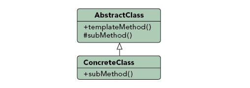

Purpose : Identifies the framework of an algorithm, allowing implementing classes to define the actual behavior.

Use When :
- A single abstract implementation of an algorithm is needed.
- Common behavior among subclasses should be localized to a common class.
- Parent classes should be able to uniformly invoke behavior in their subclasses.
- Most or all subclasses need to implement the behavior.

Example :

A parent class, InstantMessage, will likely have all the methods required to handle sending a message. However, the actual serialization of the data to send may vary depending on the implementation. A video message and a plain text message will require different algorithms in order to serialize the data correctly. Subclasses of InstantMessage can provide their own implementation of the serialization method, allowing the parent class to work with them without understanding their implementation details.


The template method pattern is a behavioral class pattern. A behavioral class pattern uses inheritance for distribution of behavior. In the template method pattern, a method (the \'template method\') defines the steps of an algorithm. The implementation of these steps (ie, methods) can be deferred to subclasses. Thus, a particular algorithm is defined in the template method, but the exact steps of this algorithm can be defined in subclasses. The template method is implemented in an abstract class. The steps (methods) of the algorithm are declared in the abstract class, and the methods whose implementations are to be delegated to subclasses are declared abstract.

Here is an example of the template method pattern. Meal is an abstract class with a template method called doMeal() that defines the steps involved in a meal. We declare the method as final so that it can not be overridden. The algorithm defined by doMeal() consists of four steps: prepareIngredients(), cook(), eat(), and cleanUp(). The eat() method is implemented although subclasses can override the implementation. The prepareIngredients(), cook(), and cleanUp() methods are are declared abstract so that subclasses need to implement them.

[Meal.java](http://www.avajava.com/tutorials/design-patterns/template-method-pattern/Meal.java)
```java
package com.cakes;

public abstract class Meal {// template method

    public final void doMeal() {
        prepareIngredients();
        cook();
        eat();
        cleanUp();
    }

    public abstract void prepareIngredients();

    public abstract void cook();

    public void eat() {
        System.out.println("Mmm, that's good");
    }

    public abstract void cleanUp();
}
```
The HamburgerMeal class extends Meal and implements Meal's three abstract methods.

[HamburgerMeal.java](http://www.avajava.com/tutorials/design-patterns/template-method-pattern/HamburgerMeal.java)
```java
package com.cakes;

public class HamburgerMeal extends Meal {
    
    @Override
    public void prepareIngredients() {
        System.out.println("Getting burgers, buns, and french fries");
    }

    @Override
    public void cook() {
        System.out.println("Cooking burgers on grill and fries in oven");
    }

    @Override
    public void cleanUp() {
        System.out.println("Throwing away paper plates");
    }
}
```
The TacoMeal class implements Meal's three abstract methods and also
overrides the eat() method.

[TacoMeal.java](http://www.avajava.com/tutorials/design-patterns/template-method-pattern/TacoMeal.java)
```java
package com.cakes;

public class TacoMeal extends Meal {
    
    @Override
    public void prepareIngredients() {
        System.out.println("Getting ground beef and shells");
    }

    @Override
    public void cook() {
        System.out.println("Cooking ground beef in pan");
    }

    @Override
    public void eat() {
        System.out.println("The tacos are tasty");
    }

    @Override
    public void cleanUp() {
        System.out.println("Doing the dishes");
    }
}
```
The Demo class creates a HamburgerMeal object and calls its doMeal() method. It creates a TacoMeal object and calls doMeal() on the TacoMeal object.

[Demo.java](http://www.avajava.com/tutorials/design-patterns/template-method-pattern/Demo.java)
```java
package com.cakes;

public class Demo {
    
    public static void main(String[] args) {
        Meal meal1 = new HamburgerMeal();
        meal1.doMeal();
        System.out.println();
        Meal meal2 = new TacoMeal();
        meal2.doMeal();
    }
}
```
The console output of the execution of Demo is shown here.

[Console Output](http://www.avajava.com/tutorials/design-patterns/template-method-pattern/console.txt)

	Getting burgers, buns, and french fries
	Cooking burgers on grill and fries in oven
	Mmm, that's good
	Throwing away paper plates
	
	Getting ground beef and shells
	Cooking ground beef in pan
	The tacos are tasty
	Doing the dishes

As you can see, the template method design pattern allows us to define the steps in an algorithm and pass the implementation of these steps to subclasses.

### Mediator Pattern

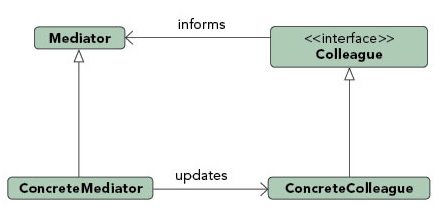

Purpose : Allows loose coupling by encapsulating the way disparate sets of objects interact and communicate with each other. Allows for the actions of each object set to vary independently of one another.

Use When :
- Communication between sets of objects is well defined and complex.
- Too many relationships exist and common point of control or communication is needed.

Example :

Mailing list software keeps track of who is signed up to the mailing list and provides a single point of access through which any one person can communicate with the entire list. Without a mediator implementation a person wanting to send a message to the group would have to constantly keep track of who was signed up and who was not. By implementing the mediator pattern the system is able to receive messages from any point then determine which recipients to forward the message on to, without the sender of the message having to be concerned with the actual recipient list.


The mediator pattern is a behavioral object design pattern. The mediator pattern centralizes communication between objects into a mediator object. This centralization is useful since it localizes in one place the interactions between objects, which can increase code maintainability, especially as the number of classes in an application increases. Since communication occurs with the mediator rather than directly with other objects, the mediator pattern results in a loose coupling of objects.

The classes that communicate with the mediator are known as Colleagues. The mediator implementation is known as the Concrete Mediator. The mediator can have an interface that spells out the communication with Colleages. Colleagues know their mediator, and the mediator knows its colleagues.

Now, lets look at an example of this pattern. We'll create a Mediator class (without implementing a mediator interface in this example). This mediator will mediate the communication between two buyers (a Swedish buyer and a French buyer), an American seller, and a currency converter.

The Mediator has references to the two buyers, the seller, and the converter. It has methods so that objects of these types can be registered. It also has a placeBid() method. This method takes a bid amount and a unit of currency as parameters. It converts this amount to a dollar amount via communication with the dollarConverter. It then asks the seller if the bid has been accepted, and it returns the answer.

[Mediator.java](http://www.avajava.com/tutorials/design-patterns/mediator-pattern/Mediator.java)
```java
package com.cakes;

public class Mediator {
    Buyer swedishBuyer;

    Buyer frenchBuyer;

    AmericanSeller americanSeller;

    DollarConverter dollarConverter;

    public Mediator() {}

    public void registerSwedishBuyer(SwedishBuyer swedishBuyer) {
        this.swedishBuyer = swedishBuyer;
    }

    public void registerFrenchBuyer(FrenchBuyer frenchBuyer) {
        this.frenchBuyer = frenchBuyer;
    }

    public void registerAmericanSeller(AmericanSeller americanSeller) {
        this.americanSeller = americanSeller;
    }

    public void registerDollarConverter(DollarConverter dollarConverter) {
        this.dollarConverter = dollarConverter;
    }

    public boolean placeBid(float bid, String unitOfCurrency) {
        float dollarAmount = dollarConverter.convertCurrencyToDollars(bid, unitOfCurrency);
        return americanSeller.isBidAccepted(dollarAmount);
    }
}
```
Here is the Buyer class. The SwedishBuyer and FrenchBuyer classes are subclasses of Buyer. The buyer has a unit of currency as a field, and it also has a reference to the mediator. The Buyer class has a attemptToPurchase() method. This method submits a bid to the mediator's placeBid() method. It returns the mediator's response.

[Buyer.java](http://www.avajava.com/tutorials/design-patterns/mediator-pattern/Buyer.java)
```java
package com.cakes;

public class Buyer {
    Mediator mediator;

    String unitOfCurrency;

    public Buyer(Mediator mediator, String unitOfCurrency) {
        this.mediator = mediator;
        this.unitOfCurrency = unitOfCurrency;
    }

    public boolean attemptToPurchase(float bid) {
        System.out.println("Buyer attempting a bid of " + bid + " " + unitOfCurrency);
        return mediator.placeBid(bid, unitOfCurrency);
    }
}
```
The SwedishBuyer class is a subclass of Buyer. In the constructor, we set the unitOfCurrency to be "krona". We also register the SwedishBuyer with the mediator so that the mediator knows about the SwedishBuyer object.

[SwedishBuyer.java](http://www.avajava.com/tutorials/design-patterns/mediator-pattern/SwedishBuyer.java)
```java
package com.cakes;

public class SwedishBuyer extends Buyer {
    public SwedishBuyer(Mediator mediator) {
        super(mediator, "krona");
        this.mediator.registerSwedishBuyer(this);
    }
}
```
The FrenchBuyer class is similar to the SwedishBuyer class, except the unitOfCurrency is "euro", and it registers with the mediator as the FrenchBuyer.

[FrenchBuyer.java](http://www.avajava.com/tutorials/design-patterns/mediator-pattern/FrenchBuyer.java)
```java
package com.cakes;

public class FrenchBuyer extends Buyer {
    public FrenchBuyer(Mediator mediator) {
        super(mediator, "euro");
        this.mediator.registerFrenchBuyer(this);
    }
}
```
In the constructor of the AmericanSeller class, the class gets a reference to the mediator and the priceInDollars gets set. This is the price of some good being sold. The seller registers with the mediator as the AmericanSeller. The seller's isBidAccepted() method takes a bid (in dollars). If the bid is over the price (in dollars), the bid is accepted and true is returned. Otherwise, false is returned.

[AmericanSeller.java](http://www.avajava.com/tutorials/design-patterns/mediator-pattern/AmericanSeller.java)
```java
package com.cakes;

public class AmericanSeller {
    Mediator mediator;

    float priceInDollars;

    public AmericanSeller(Mediator mediator, float priceInDollars) {
        this.mediator = mediator;
        this.priceInDollars = priceInDollars;
        this.mediator.registerAmericanSeller(this);
    }

    public boolean isBidAccepted(float bidInDollars) {
        if (bidInDollars >= priceInDollars) {
            System.out.println("Seller accepts the bid of " + bidInDollars + "dollars\n");
            return true;
        } else {
            System.out.println("Seller rejects the bid of " + bidInDollars + "dollars\n");
            return false;
        }
    }
}
```
The DollarConverter class is another colleague class. When created, it gets a reference to the mediator and registers itself with the mediator as the DollarConverter. This class has methods to convert amounts in euros and kronor to dollars.

[DollarConverter.java](http://www.avajava.com/tutorials/design-patterns/mediator-pattern/DollarConverter.java)
```java
package com.cakes;

public class DollarConverter {

    Mediator mediator;

    public static final float DOLLAR_UNIT = 1.0f;

    public static final float EURO_UNIT = 0.7f;

    public static final float KRONA_UNIT = 8.0f;

    public DollarConverter(Mediator mediator) {
        this.mediator = mediator;
        mediator.registerDollarConverter(this);
    }

    private float convertEurosToDollars(float euros) {
        float dollars = euros * (DOLLAR_UNIT / EURO_UNIT);
        System.out.println("Converting " + euros + " euros to " + dollars + " dollars");
        return dollars;
    }

    private float convertKronorToDollars(float kronor) {
        float dollars = kronor * (DOLLAR_UNIT / KRONA_UNIT);
        System.out.println("Converting " + kronor + " kronor to " + dollars + " dollars");
        return dollars;
    }

    public float convertCurrencyToDollars(float amount, String unitOfCurrency) {
        if ("krona".equalsIgnoreCase(unitOfCurrency)) {
            return convertKronorToDollars(amount);
        } else {
            return convertEurosToDollars(amount);
        }
    }
}
```
The Demo class demonstrates our mediator pattern. It creates a SwedishBuyer object and a FrenchBuyer object. It creates an AmericanSeller object with a selling price set to 10 dollars. It then creates a DollarConverter. All of these objects register themselves with the mediator in their constructors. The Swedish buyer starts with a bid of 55 kronor and keeps bidding up in increments of 15 kronor until the bid is accepted. The French buyer starts bidding at 3 euros and keeps bidding in increments of 1.50 euros until the bid is accepted.

[Demo.java](http://www.avajava.com/tutorials/design-patterns/mediator-pattern/Demo.java)
```java
package com.cakes;

public class Demo {
    public static void main(String[] args) {
        Mediator mediator = new Mediator();
        Buyer swedishBuyer = new SwedishBuyer(mediator);
        Buyer frenchBuyer = new FrenchBuyer(mediator);
        float sellingPriceInDollars = 10.0f;
        AmericanSeller americanSeller = new AmericanSeller(mediator, sellingPriceInDollars);
        DollarConverter dollarConverter = new DollarConverter(mediator);
        float swedishBidInKronor = 55.0f;

        while (!swedishBuyer.attemptToPurchase(swedishBidInKronor)) {
            swedishBidInKronor += 15.0f;
        }

        float frenchBidInEuros = 3.0f;

        while (!frenchBuyer.attemptToPurchase(frenchBidInEuros)) {
            frenchBidInEuros += 1.5f;
        }
    }
}
```
The console output of the execution of Demo is shown here.

[Console Output](http://www.avajava.com/tutorials/design-patterns/mediator-pattern/console.txt)

	Buyer attempting a bid of 55.0 krona
	Converting 55.0 kronor to 6.875 dollars
	Seller rejects the bid of 6.875 dollars
	
	Buyer attempting a bid of 70.0 krona
	Converting 70.0 kronor to 8.75 dollars
	Seller rejects the bid of 8.75 dollars
	
	Buyer attempting a bid of 85.0 krona
	Converting 85.0 kronor to 10.625 dollars
	Seller accepts the bid of 10.625 dollars
	
	Buyer attempting a bid of 3.0 euro
	Converting 3.0 euros to 4.285714 dollars
	Seller rejects the bid of 4.285714 dollars
	
	Buyer attempting a bid of 4.5 euro
	Converting 4.5 euros to 6.4285717 dollars
	Seller rejects the bid of 6.4285717 dollars
	
	Buyer attempting a bid of 6.0 euro
	Converting 6.0 euros to 8.571428 dollars
	Seller rejects the bid of 8.571428 dollars
	
	Buyer attempting a bid of 7.5 euro
	Converting 7.5 euros to 10.714286 dollars
	Seller accepts the bid of 10.714286 dollars

In this example of the mediator pattern, notice that all communication between our objects (buyers, seller, and converter) occurs via the mediator. The mediator pattern helps reduce the number of object references needed (via composition) as classes proliferate in a project as a project grows.

### Chain of Responsibility Pattern

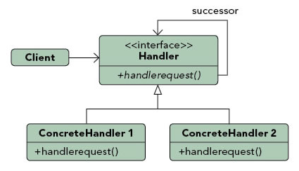

Purpose : Gives more than one object an opportunity to handle a request by linking receiving objects together.

Use When :

- Multiple objects may handle a request and the handler doesn't have to be a specific object.
- A set of objects should be able to handle a request with the handler determined at runtime.
- A request not being handled is an acceptable potential outcome.

Example : 

Exception handling in some languages implements this pattern. When an exception is thrown in a method the runtime checks to see if the method has a mechanism to handle the exception or if it should be passed up the call stack. When passed up the call stack the process repeats until code to handle the exception is encountered or until there are no more parent objects to hand the request to.


The chain of responsibility pattern is a behavioral object design pattern. In the chain of responsibility pattern, a series of handler objects are chained together to handle a request made by a client object. If the first handler can not handle the request, the request is forwarded to the next handler, and it is passed down the chain until the request reaches a handler that can handle the request or the chain ends. In this pattern, the client is decoupled from the actual handling of the request, since it does not know what class will actually handle the request.

In this pattern, a Handler is an interface for handling a request and accessing a handler's successor. A Handler is implemented by a Concrete Handler. The Concrete Handler will handle the request or pass it on to the next Concrete Handler. A Client makes the request to the start of the handler chain.

Now, lets look at an example of the chain of responsibility pattern. Rather than an interface, I\'ll use an abstract base class as the handler so that subclasses can utilize the implemented setSuccessor() method. This abstract class is called PlanetHandler. Concrete handlers that subclass PlanetHandler need to implement the handleRequest() method.

[PlanetHandler.java](http://www.avajava.com/tutorials/design-patterns/chain-of-responsibility-pattern/PlanetHandler.java)
```java
package com.cakes;

public abstract class PlanetHandler {
    PlanetHandler successor;

    public void setSuccessor(PlanetHandler successor) {
        this.successor = successor;
    }

    public abstract void handleRequest(PlanetEnum request);
}
```
This example will utilize an enum of the planets called PlanetEnum.

[PlanetEnum.java](http://www.avajava.com/tutorials/design-patterns/chain-of-responsibility-pattern/PlanetEnum.java)

```java
package com.cakes;

public enum PlanetEnum {
    MERCURY, VENUS, EARTH, MARS, JUPITER, SATURN, URANUS, NEPTUNE;
}
```

MercuryHandler subclasses PlanetHandler and implements the
handleRequest() method. If the request is a PlanetEnum.MERCURY, it will
handle the request. Otherwise, the request is passed on to this
handler's successor if the successor exists.

[MercuryHandler.java](http://www.avajava.com/tutorials/design-patterns/chain-of-responsibility-pattern/MercuryHandler.java)
```java
package com.cakes;

public class MercuryHandler extends PlanetHandler {
    
    public void handleRequest(PlanetEnum request) {
        if (request == PlanetEnum.MERCURY) {
            System.out.println("MercuryHandler handles " + request);
            System.out.println("Mercury is hot.\n");
        } else {
            System.out.println("MercuryHandler doesn't handle " + request);
            if (successor != null) {
                successor.handleRequest(request);
            }
        }
    }
}
```
VenusHandler is similar to MercuryHandler, except it handles PlanetEnum.VENUS requests.

[VenusHandler.java](http://www.avajava.com/tutorials/design-patterns/chain-of-responsibility-pattern/VenusHandler.java)
```java
package com.cakes;

public class VenusHandler extends PlanetHandler {
    public void handleRequest(PlanetEnum request) {
        if (request == PlanetEnum.VENUS) {
            System.out.println("VenusHandler handles " + request);
            System.out.println("Venus is poisonous.\n");
        } else {
            System.out.println("VenusHandler doesn't handle " + request);
            if (successor != null) {
                successor.handleRequest(request);
            }
        }
    }
}
```
EarthHandler similarly handles PlanetEnum.EARTH requests.

[EarthHandler.java](http://www.avajava.com/tutorials/design-patterns/chain-of-responsibility-pattern/EarthHandler.java)
```java
package com.cakes;

public class EarthHandler extends PlanetHandler {
    public void handleRequest(PlanetEnum request) {
        if (request == PlanetEnum.EARTH) {
            System.out.println("EarthHandler handles " + request);
            System.out.println("Earth is comfortable.\n");
        } else {
            System.out.println("EarthHandler doesn't handle " + request);

            if (successor != null) {
                successor.handleRequest(request);
            }
        }
    }
}
```
The Demo class is the client class. It creates the chain of handlers, starting with MercuryHandler, then VenusHandler, and then EarthHandler. The setUpChain() method returns the chain to main() via a PlanetHandler reference. Four requests are made of the chain, where the requests are VENUS, MERCURY, EARTH, and JUPITER.

[Demo.java](http://www.avajava.com/tutorials/design-patterns/chain-of-responsibility-pattern/Demo.java)
```java
package com.cakes;

public class Demo {
    public static void main(String[] args) {
        PlanetHandler chain = setUpChain();
        chain.handleRequest(PlanetEnum.VENUS);
        chain.handleRequest(PlanetEnum.MERCURY);
        chain.handleRequest(PlanetEnum.EARTH);
        chain.handleRequest(PlanetEnum.JUPITER);
    }

    public static PlanetHandler setUpChain() {
        PlanetHandler mercuryHandler = new MercuryHandler();
        PlanetHandler venusHandler = new VenusHandler();
        PlanetHandler earthHandler = new EarthHandler();
        mercuryHandler.setSuccessor(venusHandler);
        venusHandler.setSuccessor(earthHandler);
        return mercuryHandler;
    }
}
```
The console output of the execution of Demo is shown here. Notice that if a handler can not handle the request, it passes the request on to the next handler.

[Console Output](http://www.avajava.com/tutorials/design-patterns/chain-of-responsibility-pattern/console.txt)

	MercuryHandler doesn't handle VENUS
	VenusHandler handles VENUS
	Venus is poisonous.

	MercuryHandler handles MERCURY
	Mercury is hot.

	MercuryHandler doesn't handle EARTH
	VenusHandler doesn't handle EARTH
	EarthHandler handles EARTH
	Earth is comfortable.

	MercuryHandler doesn't handle JUPITER
	VenusHandler doesn't handle JUPITER
	EarthHandler doesn't handle JUPITER

> Notice that the last request made of the chain is JUPITER. This request is not handled by any handlers, demonstrating that a request does not have to be handled by any handlers. If we had wanted to, we could have also written an OtherPlanets handler and placed it at the end of the chain to handle planet requests not handled by other previous handlers. This would demonstrate that we can make our handlers specific at the beginning of the chain and more general at the end of the chain, thus handling broader categories of requests as we approach the end of the
chain.

### Observer Pattern

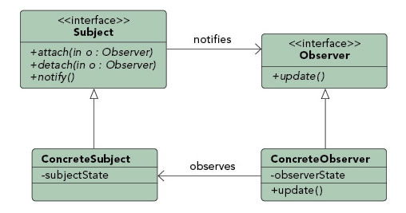

Purpose : Lets one or more objects be notified of state changes in other objects within the system.

Use When :
- State changes in one or more objects should trigger behavior in other objects
- Broadcasting capabilities are required.
- An understanding exists that objects will be blind to the expense of notification.

Example :

This pattern can be found in almost every GUI environment. When buttons, text, and other fields are placed in applications the application typically registers as a listener for those controls. When a user triggers an event, such as clicking a button, the control iterates through its registered observers and sends a notification to each.


*Actually the Events/Listener concept.*

*Defines a one-to-many dependency between objects so that when one*

*object changes state, all of its dependents are notified and updated automatically.*

The observer pattern is a behavioral object design pattern. (Publisher(Subject) + Subscriber(Observers) = Observer Pattern) In the observer pattern, an object called the subject maintains a collection of objects called observers. When the subject changes, it notifies the observers. Observers can be added or removed from the collection of observers in the subject. The changes in state of the subject can be passed to the observers so that the observers can change their own state to reflect this change.

> Observer Pattern is synchronized means **tightly coupled**.
>> Alternate: is Publisher Subscriber **Loose coupling**.
>>> Which is Async means an Event Bus exist acts as a broker for **Topic** based broadcasting.
>>>> JMS **Topic** based are primarily Pub-Sub. While **Point-to-Point** (queue-based messaging)

**Used in JMS with one more provider layer(Queues and Topics) for communication and to asynchronize the data. That means Observer Pattern + Producer/Consumer model is JMS Prorviders are provided by JMS and it also provides some interfaces to make publisher and subscriber.**

The subject has an interface that defines methods for attaching and detaching observers from the subject's collection of observers. This interface also features a notification method. This method should be called when the state of the subject changes. This notifies the observers that the subject's state has changed. The observers have an interface with a method to update the observer. This update method is called for each observer in the subject's notification method. Since this communication occurs via an interface, any concrete observer implementing the observer interface can be updated by the subject. This results in loose coupling between the subject and the observer classes.
 
Now we'll look at an example of the observer pattern. We'll start by creating an interface for the subject called WeatherSubject. This will declare three methods: addObserver(), removeObserver(), and doNotify().

The easiest way to implement a Subject's notify() method is with a single thread, but that can have undesirable performance implications. A single thread will update each observer one-at-a-time, in sequence; so those at the end of a long list of observers may need to wait a long time for updates. And a subject spending a long time updating all of its observers isn\'t accomplishing anything else. Even worse, an observer may well use its update thread to recact to the update, querying the subject for state and processing the new data; such observer work in the update thread makes the update process take even longer.

The Subject is what is observed. It is responsible for remembering who is observing. 

Thus the more sophisticated way to implement a Subject's Notify() method is to run each Update() call in its own thread. Then all observers can be updated concurrently, and whatever work each may do in its update thread does not delay the other observers or the subject. The downside is that implementing multithreading and handling thread-management issues is more complex. ***Look for JMS in this case upper mentioned case i.e Observer pattern in distributed environments more precisely JMS is Asynchronous Observer Pattern)***

**A slightly different Observer Pattern would be EventBus (google Guave technique or googe GUI MVP) technique:**

Converting an existing EventListener-based system to use the EventBus is easy.

**For Listeners**

   - To listen for a specific flavor of event (say, a CustomerChangeEvent)\...
      - \...in traditional Java events: implement an interface defined with the event \-- such as CustomerChangeEventListener.
      - \...with EventBus: create a method that accepts CustomerChangeEvent as its sole argument, and mark it with the Subscribe annotation / or some other technique.
   - To register your listener methods with the event producers\...
      - \...in traditional Java events: pass your object to each producer's registerCustomerChangeEventListener method. These methods are rarely defined in common interfaces, so in addition to knowing every possible producer, you must also know its type.
      - \...with EventBus: pass your object to the EventBus.register(Object) method on an EventBus. You\'ll need to make sure that your object shares an EventBus instance with the event producers.
   - To listen for a common event supertype (such as EventObject or Object)\...
      - \...in traditional Java events: not easy.
      - \...with EventBus: events are automatically dispatched to listeners of any supertype, allowing listeners for interface types or "wildcard listeners" for Object.
   - To listen for and detect events that were dispatched without listeners\...
      - \...in traditional Java events: add code to each event-dispatching method (perhaps using AOP).
      - \...with EventBus: subscribe to DeadEvent. The EventBus will notify you of any events that were posted but not delivered. (Handy for debugging.)

**For Producers**

   - To keep track of listeners to your events\...
      - \...in traditional Java events: write code to manage a list of listeners to your object, including synchronization, or use a utility class like EventListenerList.
      - \...with EventBus: EventBus does this for you.
   - To dispatch an event to listeners\...
      - \...in traditional Java events: write a method to dispatch events to each event listener, including error isolation and (if desired) asynchronicity.
      - \...with EventBus: pass the event object to an EventBus's EventBus.post(Object) method.

**Glossary**

The EventBus system and code use the following terms to discuss event distribution:

1. Event: Any object that may be posted to a bus.
1. Subscribing: The act of registering a listener with an EventBus, so that its handler methods will receive events.
1. Listener: An object that wishes to receive events, by exposing handler methods.
1. Handler method: A public method that the EventBus should use to deliver posted events. Handler methods are marked by the Subscribe annotation.
1. Posting an event: Making the event available to any listeners through
the EventBus.

[WeatherSubject.java](http://www.avajava.com/tutorials/design-patterns/observer-pattern/WeatherSubject.java)
```java
package com.cakes;

public interface WeatherSubject {
    public void addObserver(WeatherObserver weatherObserver);

    public void removeObserver(WeatherObserver weatherObserver);

    public void doNotify();
}
```
We'll also create an interface for the observers called
WeatherObserver. It features one method, a doUpdate() method.

[WeatherObserver.java](http://www.avajava.com/tutorials/design-patterns/observer-pattern/WeatherObserver.java)

```java
package com.cakes;

public interface WeatherObserver {
    public void doUpdate(int temperature);
}
```

The WeatherStation class implements WeatherSubject. It is our subject class. It maintains a set of WeatherObservers which are added via addObserver() and removed via removeObserver(). When WeatherSubject's state changes via setTemperature(), the doNotify() method is called, which contacts all the WeatherObservers with the temperature via their doUpdate() methods.

[WeatherStation.java](http://www.avajava.com/tutorials/design-patterns/observer-pattern/WeatherStation.java)
```java
package com.cakes;
import java.util.HashSet;
import java.util.Iterator;
import java.util.Set;

public class WeatherStation implements WeatherSubject {
    Set<WeatherObserver> weatherObservers;

    int temperature;

    public WeatherStation(int temperature) {
        weatherObservers = new HashSet<>();
        this.temperature = temperature;
    }

    @Override
    public void addObserver(WeatherObserver weatherObserver) {
        weatherObservers.add(weatherObserver);
    }

    @Override
    public void removeObserver(WeatherObserver weatherObserver) {
        weatherObservers.remove(weatherObserver);
    }

    @Override
    public void doNotify() {
        Iterator<WeatherObserver> it = weatherObservers.iterator();

        while (it.hasNext()) {
            WeatherObserver weatherObserver = it.next();
            weatherObserver.doUpdate(temperature);
        }
    }

    public void setTemperature(int newTemperature) {
        System.out.println("\nWeather station setting temperature to " + newTemperature);
        temperature = newTemperature;
        doNotify();
    }
}
```
WeatherCustomer1 is an observer that implements WeatherObserver. Its doUpdate() method gets the current temperature from the WeatherStation and displays it.

[WeatherCustomer1.java](http://www.avajava.com/tutorials/design-patterns/observer-pattern/WeatherCustomer1.java)
```java
package com.cakes;

public class WeatherCustomer1 implements WeatherObserver {
    
    @Override
    public void doUpdate(int temperature) {
        System.out.println("Weather customer 1 just found out the temperature is:" + temperature);
    }
}
```
WeatherCustomer2 performs similar functionality as WeatherCustomer1.

[WeatherCustomer2.java](http://www.avajava.com/tutorials/design-patterns/observer-pattern/WeatherCustomer2.java)
```java
package com.cakes;

public class WeatherCustomer2 implements WeatherObserver {
    @Override
    public void doUpdate(int temperature) {
        System.out.println("Weather customer 2 just found out the temperature is:" + temperature);
    }
}
```
The Demo class demonstrates the observer pattern. It creates a WeatherStation and then a WeatherCustomer1 and a WeatherCustomer2. The two customers are added as observers to the weather station. Then the setTemperature() method of the weather station is called. This changes the state of the weather station and the customers are notified of this temperature update. Next, the WeatherCustomer1 object is removed from the station's collection of observers. Then, the setTemperature() method is called again. This results in the notification of the WeatherCustomer2 object.

[Demo.java](http://www.avajava.com/tutorials/design-patterns/observer-pattern/Demo.java)
```java
package com.cakes;

public class Demo {
    public static void main(String[] args) {
        WeatherStation weatherStation = new WeatherStation(33);
        WeatherCustomer1 wc1 = new WeatherCustomer1();
        WeatherCustomer2 wc2 = new WeatherCustomer2();
        weatherStation.addObserver(wc1);
        weatherStation.addObserver(wc2);
        weatherStation.setTemperature(34);
        weatherStation.removeObserver(wc1);
        weatherStation.setTemperature(35);
    }
}
```
The console output of executing Demo is shown here.

[Console Output](http://www.avajava.com/tutorials/design-patterns/observer-pattern/console.txt)

	Weather station setting temperature to 34
	Weather customer 2 just found out the temperature is:34
	Weather customer 1 just found out the temperature is:34
	Weather station setting temperature to 35
	Weather customer 2 just found out the temperature is:35

In a more advanced case, we might have given each observer a reference to the weather station object. This could allow the observer the ability to compare the state of the subject in detail with its own state and make any necessary updates to its own state.

### Strategy Pattern

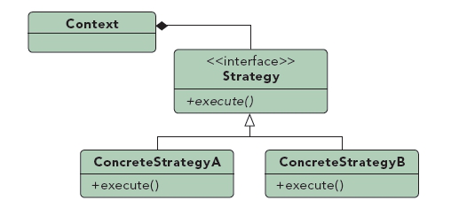

Purpose : Defines a set of encapsulated algorithms that can be swapped to carry out a specific behavior.

Use When :
- The only difference between many related classes is their behavior.
- Multiple versions or variations of an algorithm are required.
- Algorithms access or utilize data that calling code shouldn't be exposed to.
- The behavior of a class should be defined at runtime.
- Conditional statements are complex and hard to maintain.

Example :

When importing data into a new system different validation algorithms may be run based on the data set. By configuring the import to utilize strategies the conditional logic to determine what validation set to run can be removed and the import can be decoupled from the actual validation code. This will allow us to dynamically call one or more strategies during the import.


Strategy : *encapsulate the concept that varies* and *program to an interface, not an implementation*

The strategy pattern is a behavioral object design pattern. In the strategy pattern, different algorithms**(behavior)** are represented as Concrete Strategy classes (***simple words: segregate the data and its behavior to composition/aggregation rather than inheritance like Duck and its Fly and Quack behavior so that different ducks can use the different behaviors dynamically***), and they share a common Strategy interface. A Context object contains a reference to a Strategy. By changing the Context's Strategy, different behaviors can be obtained. Although these behaviors are different, the different strategies all operate on data from the Context.

The strategy pattern is one way that composition can be used as an alternative to subclassing. Rather than providing different behaviors via subclasses overriding methods in superclasses, the strategy pattern allows different behaviors to be placed in Concrete Strategy classes which share the common Strategy interface. A Context class is composed of a reference to a Strategy.

Here is an example of the strategy pattern. First, We'll define a Strategy interface. It declares a checkTemperature() method.

[Strategy.java](http://www.avajava.com/tutorials/design-patterns/strategy-pattern/Strategy.java)

```java
package com.cakes;

public interface Strategy {
    boolean checkTemperature(int temperatureInF);
}
```

The HikeStrategy class is a concrete strategy class that implements the Strategy interface. The checkTemperature method is implemented so that if the temperature is between 50 and 90, it returns true. Otherwise it returns false.

[HikeStrategy.java](http://www.avajava.com/tutorials/design-patterns/strategy-pattern/HikeStrategy.java)(behaviour)
```java
package com.cakes;

public class HikeStrategy implements Strategy {
    @Override
    public boolean checkTemperature(int temperatureInF) {
        if ((temperatureInF >= 50) && (temperatureInF <= 90)) {
            return true;
        } else {
            return false;
        }
    }
}
```
The SkiStrategy implements the Strategy interface. If the temperature is 32 or less, the checkTemperature method returns true. Otherwise it returns false.

[SkiStrategy.java](http://www.avajava.com/tutorials/design-patterns/strategy-pattern/SkiStrategy.java)(behaviour)
```java
package com.cakes;

public class SkiStrategy implements Strategy {
    @Override
    public boolean checkTemperature(int temperatureInF) {
        if (temperatureInF <= 32) {
            return true;
        } else {
            return false;
        }
    }
}
```
The Context class contains a temperature and a reference to a Strategy. The Strategy can be changed, resulting in different behavior that operates on the same data in the Context. The result of this can be obtained from the Context via the getResult() method.

[Context.java](http://www.avajava.com/tutorials/design-patterns/strategy-pattern/Context.java)(integrates the data i.e temp(can be a java class) and behavior i.e Strategy)
```java
package com.cakes;

public class Context {
    int temperatureInF;

    Strategy strategy;

    public Context(int temperatureInF, Strategy strategy) {
        this.temperatureInF = temperatureInF;
        this.strategy = strategy;
    }

    public void setStrategy(Strategy strategy) {
        this.strategy = strategy;
    }

    public int getTemperatureInF() {
        return temperatureInF;
    }

    public boolean getResult() { // invoker of behaviour
        return strategy.checkTemperature(temperatureInF);
    }
}
```
The Demo class creates a Context object with a temperature of 60 and with a SkiStrategy. It displays the temperature from the context and whether that temperature is OK for skiing. After that, it sets the Strategy in the Context to HikeStrategy. It then displays the temperature from the context and whether that temperature is OK for hiking.

[Demo.java](http://www.avajava.com/tutorials/design-patterns/strategy-pattern/Demo.java)
```java
package com.cakes;

public class Demo {
    public static void main(String[] args) {
        int temperatureInF = 60;

        Strategy skiStrategy = new SkiStrategy();

        Context context = new Context(temperatureInF, skiStrategy);

        System.out.println("Is the temperature (" + context.getTemperatureInF() + "F) good for skiing? " + context.getResult());

        Strategy hikeStrategy = new HikeStrategy();

        context.setStrategy(hikeStrategy);

        System.out.println("Is the temperature (" + context.getTemperatureInF() + "F) good for hiking? " + context.getResult());
    }
}
```
The console output of executing Demo is shown here.

[Console Output](http://www.avajava.com/tutorials/design-patterns/strategy-pattern/console.txt)

	Is the temperature (60F) good for skiing? false
	Is the temperature (60F) good for hiking? true

### Command Pattern

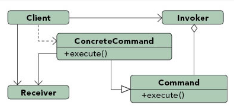

Purpose : Encapsulates a request allowing it to be treated as an object. This allows the request to be handled in traditionally object based relationships such as queuing and callbacks.

Use When :
- You need callback functionality.
- Requests need to be handled at variant times or in variant orders.
- A history of requests is needed.
- The invoker should be decoupled from the object handling the invocation.

Example :

Job queues are widely used to facilitate the asynchronous processing of algorithms. By utilizing the command pattern the functionality to be executed can be given to a job queue for processing without any need for the queue to have knowledge of the actual implementation it is invoking. The command object that is enqueued implements its particular algorithm within the confines of the interface the queue is expecting.


Encapsulates Method invocation: -

**Requester(Client) -> Command -> Receiver(who will take the action)**

The client instantiates the Invoker, the Receiver, and the concrete
command objects.

A workaround of **If-else or switch**.

Actually this is the OO approach to achieve the same objective operation.

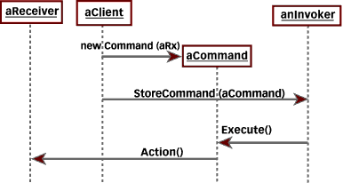

key idea here is that the concrete command registers itself with the Invoker and the Invoker calls it back, executing the command on the Receiver.

Command : Action and receiver are bounded in Command Object.

Command has an execute() method that encapsulates the action of the
Receiver

**Invoker: Command(which contains a set of actions on the receiver) is created by the client and given(set) to invoker which triggers the action as per requirement.**
   
   - **execute() method of Command is called by the invoker.**

 >> Undo commands can also be done

   1. Decouple the requester of an action from the object that actually performs the action.
   1. command object encapsulates a request to do something

The command pattern is a behavioral object design pattern. In the command pattern, a Command interface declares a method for executing a particular action. Concrete Command classes implement the execute() method of the Command interface, and this execute() method invokes the appropriate action method of a Receiver class that the Concrete Command class contains. The Receiver class performs a particular action. A Client class is responsible for creating a Concrete Command and setting the Receiver of the Concrete Command. An Invoker class contains a reference to a Command and has a method to execute the Command.

In the command pattern, the invoker is decoupled from the action performed by the receiver. The invoker has no knowledge of the receiver. The invoker invokes a command, and the command executes the appropriate action of the receiver. Thus, the invoker can invoke commands without knowing the details of the action to be performed. In addition, this decoupling means that changes to the receiver's action don\'t directly affect the invocation of the action.

The command pattern can be used to perform \'undo\' functionality. In this case, the Command interface should include an unexecute() method.

Here is an example of the command pattern. We have a Command interface with an execute() method.

[Command.java](http://www.avajava.com/tutorials/design-patterns/command-pattern/Command.java)
```java
package com.cakes;

public interface Command {
    public void execute(); // encapsulates the action of Receiver
}
```
LunchCommand implements Command. It contains a reference to Lunch, a receiver. Its execute() method invokes the appropriate action on the receiver.

[LunchCommand.java](http://www.avajava.com/tutorials/design-patterns/command-pattern/LunchCommand.java)
```java
package com.cakes;

public class LunchCommand implements Command {
    Lunch lunch;// Receiver

    public LunchCommand(Lunch lunch) {
        this.lunch = lunch;
    }

    @Override
    public void execute() {
        lunch.makeLunch(); // receiver action is encapsulated
    }
}
```
The DinnerCommand is similar to LunchCommand. It contains a reference to Dinner, a receiver. Its execute() method invokes the makeDinner() action of the Dinner object.

[DinnerCommand.java](http://www.avajava.com/tutorials/design-patterns/command-pattern/DinnerCommand.java)
```java
package com.cakes;

public class DinnerCommand implements Command {
    Dinner dinner;

    public DinnerCommand(Dinner dinner) {
        this.dinner = dinner;
    }

    @Override
    public void execute() {
        dinner.makeDinner();
    }
}
```
Lunch is a receiver.

[Lunch.java](http://www.avajava.com/tutorials/design-patterns/command-pattern/Lunch.java)(Receiver)
```java
package com.cakes;

public class Lunch {
    public void makeLunch() {
        System.out.println("Lunch is being made");
    }
}
```
Dinner is also a receiver.

[Dinner.java](http://www.avajava.com/tutorials/design-patterns/command-pattern/Dinner.java)
```java
package com.cakes;

public class Dinner {
    public void makeDinner() {
        System.out.println("Dinner is being made");
    }
}
```
MealInvoker is the invoker class. It contains a reference to the Command to invoke. Its invoke() method calls the execute() method of the Command.

[MealInvoker.java](http://www.avajava.com/tutorials/design-patterns/command-pattern/MealInvoker.java)(Invoker will call the execute of Command)
```java
package com.cakes;

public class MealInvoker {
    Command command;

    public MealInvoker(Command command) {
        this.command = command;
    }

    public void setCommand(Command command) {
        this.command = command;
    }

    public void invoke() {
        command.execute();
    }
}
```
The Demo class demonstrates the command pattern. It instantiates a Lunch (receiver) object and creates a LunchCommand (concrete command) with the Lunch. The LunchCommand is referenced by a Command interface reference. Next, we perform the same procedure on the Dinner and DinnerCommand objects. After this, we create a MealInvoker object with lunchCommand, and we call the invoke() method of mealInvoker. After this, we set mealInvoker's command to dinnerCommand, and once again call invoke() on mealInvoker.

[Demo.java](http://www.avajava.com/tutorials/design-patterns/command-pattern/Demo.java)
```java
package com.cakes;

public class Demo {
    public static void main(String[] args) {
        Lunch lunch = new Lunch(); // receiver
        Command lunchCommand = new LunchCommand(lunch); // concrete command
        Dinner dinner = new Dinner(); // receiver
        Command dinnerCommand = new DinnerCommand(dinner); // concrete command
        MealInvoker mealInvoker = new MealInvoker(lunchCommand); // invoker
        mealInvoker.invoke();
        mealInvoker.setCommand(dinnerCommand);
        mealInvoker.invoke();
    }
}
```
The console output of the execution of Demo is shown here.

[Console Output](http://www.avajava.com/tutorials/design-patterns/command-pattern/console.txt)

	Lunch is being made
	Dinner is being made

As you can see, the invoker invokes a command, but has no direct knowledge of the action being performed by the receiver.

### State Pattern

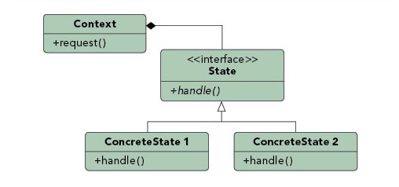

Purpose : Ties object circumstances to its behavior, allowing the object to behave in different ways based upon its internal state.

Use When :
- The behavior of an object should be influenced by its state.
- Complex conditions tie object behavior to its state.
- Transitions between states need to be explicit.

Example :

An email object can have various states, all of which will change how the object handles different functions. If the state is "not sent" then the call to send() is going to send the message while a call to recallMessage() will either throw an error or do nothing. However, if the state is "sent" then the call to send() would either throw an error or do nothing while the call to recallMessage() would attempt to send a recall notification to recipients. To avoid conditional statements in most or all methods there would be multiple state objects that handle the implementation with respect to their particular state. The calls within the Email object would then be delegated down to the appropriate state object for handling.


The state pattern is a behavioral object design pattern. The idea behind the state pattern is for an object to change its behavior depending on its state. In the state pattern, we have a Context class, and this class has a State reference to a Concrete State instance. The State interface declares particular methods that represent the behaviors of a particular state. Concrete States implement these behaviors. By changing a Context's Concrete State, we change its behavior. In essence, in the state pattern, a class (the Context) is supposed to behave like different classes depending on its state. The state pattern avoids the use of switch and if statements to change behavior.

Lets look at an example of the state pattern. First off, We'll define the EmotionalState interface. It declares two methods, sayHello() and sayGoodbye().

[EmotionalState.java](http://www.avajava.com/tutorials/design-patterns/state-pattern/EmotionalState.java)

```java
package com.cakes;

// State
public interface EmotionalState {
    public String sayHello();

    public String sayGoodbye();
}
```

The HappyState class is a Concrete State that implements sayHello() and sayGoodbye() of EmotionalState. These messages are cheerful (representing a happy state).

[HappyState.java](http://www.avajava.com/tutorials/design-patterns/state-pattern/HappyState.java)
```java
package com.cakes;

// Concrete State
public class HappyState implements EmotionalState {

    @Override
    public String sayGoodbye() {
        return "Bye, friend!";
    }

    @Override
    public String sayHello() {
        return "Hello, friend!";
    }
}
```
The SadState class also implements the EmotionalState interface. The messages are sad (representing a sad state).

[SadState.java](http://www.avajava.com/tutorials/design-patterns/state-pattern/SadState.java)
```java
package com.cakes;

// Concrete State
public class SadState implements EmotionalState {

    @Override
    public String sayGoodbye() {
        return "Bye. Sniff, sniff.";
    }

    @Override
    public String sayHello() {
        return "Hello. Sniff, sniff.";
    }
}
```
The Person class is the Context class. It contains an EmotionalState reference to a concrete state. In this example, we have Person implement the EmotionalState reference, and we pass the calls to Person's sayHello() and sayGoodbye() methods on to the corresponding methods on the emotionalState reference. As a result of this, a Person object behaves differently depending on the state of Person (ie, the current EmotionalState reference).

[Person.java](http://www.avajava.com/tutorials/design-patterns/state-pattern/Person.java)
```java
package com.cakes;

// Context
public class Person implements EmotionalState {

    EmotionalState emotionalState;

    public Person(EmotionalState emotionalState) {
        this.emotionalState = emotionalState;
    }

    public void setEmotionalState(EmotionalState emotionalState) {
        this.emotionalState = emotionalState;
    }

    @Override
    public String sayGoodbye() {
        return emotionalState.sayGoodbye();
    }

    @Override
    public String sayHello() {
        return emotionalState.sayHello();
    }
}
```
The Demo class demonstrates the state pattern. First, it creates a Person object with a HappyState object. We display the results of sayHello() and sayGoodbyte() when the person object is in the happy state. Next, we change the person object's state with a SadState object. We display the results of sayHello() and sayGoodbyte(), and we see that in the sad state, the person object's behavior is different.

[Demo.java](http://www.avajava.com/tutorials/design-patterns/state-pattern/Demo.java)
```java
package com.cakes;

public class Demo {
    public static void main(String[] args) {
        Person person = new Person(new HappyState());
        System.out.println("Hello in happy state: " + person.sayHello());
        System.out.println("Goodbye in happy state: " + person.sayGoodbye());
        person.setEmotionalState(new SadState());
        System.out.println("Hello in sad state: " + person.sayHello());
        System.out.println("Goodbye in sad state: " + person.sayGoodbye());
    }
}
```
The console output of executing Demo is shown here.

[Console Output](http://www.avajava.com/tutorials/design-patterns/state-pattern/console.txt)

	Hello in happy state: Hello, friend!
	Goodbye in happy state: Bye, friend!
	Hello in sad state: Hello. Sniff, sniff.
	Goodbye in sad state: Bye. Sniff, sniff.

Note that we don\'t necessarily need to have the Context (ie, Person) implement the EmotionalState interface. The behavioral changes could have been internal to the Context rather than exposing EmotionalState's methods to the outside. However, having the Context class implement the State interface allows us to directly access the different behaviors that result from the different states of the Context.

### Visitor Pattern

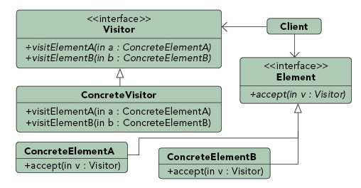

Purpose : Allows for one or more operations to be applied to a set of objects at runtime, decoupling the operations from the object structure.

Use When :
- An object structure must have many unrelated operations performed upon it.
- The object structure can't change but operations performed on it can.
- Operations must be performed on the concrete classes of an object structure.
- Exposing internal state or operations of the object structure is acceptable.
- Operations should be able to operate on multiple object structures that implement the same interface sets.

Example :

Calculating taxes in different regions on sets of invoices would require many different variations of calculation logic. Implementing a visitor allows the logic to be decoupled from the invoices and line items. This allows the hierarchy of items to be visited by calculation code that can then apply the proper rates for the region. Changing regions is as simple as substituting a different visitor.


The visitor pattern is a behavioral object design pattern. The visitor pattern is used to simplify operations on groupings of related objects. These operations are performed by the visitor rather than by placing this code in the classes being visited. Since the operations are performed by the visitor rather than by the classes being visited, the operation code gets centralized in the visitor rather than being spread out across the grouping of objects, thus leading to code maintainability. The visitor pattern also avoids the use of the instanceof operator in order to perform calculations on similar classes.

In the visitor pattern, we have a Visitor interface that declares visit() methods for the various types of elements that can be visited. Concrete Visitors implement the Visitor interface's visit() methods. The visit() methods are the operations that should be performed by the visitor on an element being visited.

The related classes that will be visited implement an Element interface that declares an accept() method that takes a visitor as an argument. Concrete Elements implement the Element interface and implement the accept() method. In the accept() method, the visitor's visit() method is called with 'this', the current object of the Concrete Element type.

The elements to visit all implement the accept() method that takes a visitor as an argument. In this method, they call the visitor's visit() method with 'this'. As a result of this, an element takes a visitor and then the visitor performs its operation on the element.

Lets illustrate the visitor pattern with an example. First, We'll define a NumberVisitor interface. This interface declares three visit methods which take different types as arguments. Note that if we only wrote one visit method, we'd have to use the instanceof operator or a similar technique to handle the different element types. However, since we have separate visit methods, we don\'t need the instanceof operator, since each visit method handles a different type.

[NumberVisitor.java](http://www.avajava.com/tutorials/design-patterns/visitor-pattern/NumberVisitor.java)
```java
package com.cakes;
import java.util.List;

public interface NumberVisitor {
    public void visit(TwoElement twoElement);

    public void visit(ThreeElement threeElement);

    public void visit(List<NumberElement> elementList);
}
```
All of the elements classes to be visited will implement the NumberElement interface. This interface has a single method that takes a NumberVisitor as an argument.

[NumberElement.java](http://www.avajava.com/tutorials/design-patterns/visitor-pattern/NumberElement.java)

```java
package com.cakes;

public interface NumberElement {
    public void accept(NumberVisitor visitor);
}
```

Lets create a TwoElement class that implements NumberElement. It has two int fields. Its accept() method calls the visitor's visit() method with 'this'. The operator to be performed on TwoElement is performed by the visitor.

[TwoElement.java](http://www.avajava.com/tutorials/design-patterns/visitor-pattern/TwoElement.java)
```java
package com.cakes;

public class TwoElement implements NumberElement {
    int a;
    int b;

    public TwoElement(int a, int b) {
        this.a = a;
        this.b = b;
    }

    @Override
    public void accept(NumberVisitor visitor) {
        visitor.visit(this);
    }
}
```
The ThreeElement class is similar to TwoElement, except that it has three int fields.

[ThreeElement.java](http://www.avajava.com/tutorials/design-patterns/visitor-pattern/ThreeElement.java)
```java
package com.cakes;

public class ThreeElement implements NumberElement {
    int a;
    int b;
    int c;

    public ThreeElement(int a, int b, int c) {
        this.a = a;
        this.b = b;
        this.c = c;
    }

    @Override
    public void accept(NumberVisitor visitor) {
        visitor.visit(this);
    }
}
```
Now, lets create a visitor called SumVisitor that implements the NumberVisitor interface. For TwoElement and ThreeElement objects, this visitor will sum up the int fields. For a List of NumElements (ie, TwoElement and ThreeElement objects), this visitor will iterate over the elements and call their accept() methods. As a result of this, the visitor will perform visit operations on all the TwoElement and ThreeElement objects that make up the list, since the call to accept() in turn calls the visitor's visit methods for the TwoElement and ThreeElement objects.

[SumVisitor.java](http://www.avajava.com/tutorials/design-patterns/visitor-pattern/SumVisitor.java)
```java
package com.cakes;
import java.util.List;

public class SumVisitor implements NumberVisitor {

    @Override
    public void visit(TwoElement twoElement) {
        int sum = twoElement.a + twoElement.b;
        System.out.println(twoElement.a + "+" + twoElement.b + "=" + sum);
    }

    @Override
    public void visit(ThreeElement threeElement) {
        int sum = threeElement.a + threeElement.b + threeElement.c;
        System.out.println(threeElement.a + "+" + threeElement.b + "+" +
                threeElement.c + "=" + sum);
    }

    @Override
    public void visit(List<NumberElement> elementList) {
        for (NumberElement ne : elementList) {
            ne.accept(this);
        }
    }
}
```
Here is another visitor, TotalSumVisitor. In addition to summing up the int fields and displaying the sum, this visitor will keep track of the total sums of all the elements that are visited.

[TotalSumVisitor.java](http://www.avajava.com/tutorials/design-patterns/visitor-pattern/TotalSumVisitor.java)
```java
package com.cakes;
import java.util.List;

public class TotalSumVisitor implements NumberVisitor {
    int totalSum = 0;

    @Override
    public void visit(TwoElement twoElement) {
        int sum = twoElement.a + twoElement.b;
        System.out.println("Adding " + twoElement.a + "+" + twoElement.b + "=" + sum + " to total");
        totalSum += sum;
    }

    @Override
    public void visit(ThreeElement threeElement) {
        int sum = threeElement.a + threeElement.b + threeElement.c;
        System.out.println(
                "Adding " + threeElement.a + "+" + threeElement.b + "+" + threeElement.c + "=" + sum + " to total");
        totalSum += sum;
    }

    @Override
    public void visit(List<NumberElement> elementList) {
        for (NumberElement ne : elementList) {
            ne.accept(this);
        }
    }

    public int getTotalSum() {
        return totalSum;
    }
}
```
Lets see the visitor pattern in action. The Demo class creates two TwoElement objects and one ThreeElement object. It creates a list of NumberElements and adds the TwoElement object and the ThreeElement object to the list. Next, we create a SumVisitor and we visit the list with the SumVisitor. After this, we create a TotalSumVisitor and visit the list with the TotalSumVisitor. We display the total sum via the call to TotalSumVisitor's getTotalSum() method.

[Demo.java](http://www.avajava.com/tutorials/design-patterns/visitor-pattern/Demo.java)
```java
package com.cakes;
import java.util.ArrayList;
import java.util.List;

public class Demo {

    public static void main(String[] args) {
        TwoElement two1 = new TwoElement(3, 3);
        TwoElement two2 = new TwoElement(2, 7);
        ThreeElement three1 = new ThreeElement(3, 4, 5);
        List<NumberElement> numberElements = new ArrayList<>();
        numberElements.add(two1);
        numberElements.add(two2);
        numberElements.add(three1);
        System.out.println("Visiting element list with SumVisitor");
        NumberVisitor sumVisitor = new SumVisitor();
        sumVisitor.visit(numberElements);
        System.out.println("\nVisiting element list with TotalSumVisitor");
        TotalSumVisitor totalSumVisitor = new TotalSumVisitor();
        totalSumVisitor.visit(numberElements);
        System.out.println("Total sum:" + totalSumVisitor.getTotalSum());
    }
}
```
The console output of executing Demo is shown here.

[Console Output](http://www.avajava.com/tutorials/design-patterns/visitor-pattern/console.txt)

Visiting element list with SumVisitor

	3+3=6
	2+7=9
	3+4+5=12

	Visiting element list with TotalSumVisitor
	Adding 3+3=6 to total
	Adding 2+7=9 to total
	Adding 3+4+5=12 to total
	Total sum:27

Notice that if we'd like to perform new operations on the grouping of elements, all we would need to do is write a new visitor class. We would not have to make any additions to the existing element classes, since they provide the data but none of the code for the operations.

### Iterator Pattern

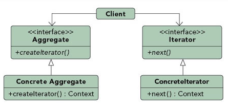

Purpose : Allows for access to the elements of an aggregate object without allowing access to its underlying representation.

Use When :
- Access to elements is needed without access to the entire representation.
- Multiple or concurrent traversals of the elements are needed.
- A uniform interface for traversal is needed.
- Subtle differences exist between the implementation details of various iterators.

Example :

The Java implementation of the iterator pattern allows users to traverse various types of data sets without worrying about the underlying implementation of the collection. Since clients simply interact with the iterator interface, collections are left to define the appropriate iterator for themselves. Some will allow full access to the underlying data set while others may restrict certain functionalities, such as removing items.


The iterator pattern is a behavioral object design pattern. The iterator pattern allows for the traversal through the elements in a grouping of objects via a standardized interface. An Iterator interface defines the actions that can be performed. These actions include being able to traverse the objects and also obtain the objects.

Java features the widely used java.util.Iterator interface which is used to iterate through things such as Java collections. We can write our own iterator by implementing java.util.Iterator. This interface features the hasNext(), next(), and remove() methods. When writing an iterator for a class, it is very common for the iterator class to be an inner class of the class that we'd like to iterate through.

Lets look at an example of this. We have an Item class, which represents an item on a menu. An item has a name and a price.

[Item.java](http://www.avajava.com/tutorials/design-patterns/iterator-pattern/Item.java)

```java
package com.cakes;

public class Item {

    String name;
    float price;

    public Item(String name, float price) {
        this.name = name;
        this.price = price;
    }

    public String toString() {
        return name + ": \$" + price;
    }
}
```

Here is the Menu class. It has a list of menu items of type Item. Items can be added via the addItem() method. The iterator() method returns an iterator of menu items. The MenuIterator class is an inner class of Menu that implements the Iterator interface for Item objects. It contains basic implementations of the hasNext(), next(), and remove() methods.

[Menu.java](http://www.avajava.com/tutorials/design-patterns/iterator-pattern/Menu.java)
```java
package com.cakes;
import java.util.ArrayList;
import java.util.Iterator;
import java.util.List;

public class Menu {

    List<Item> menuItems;

    public Menu() {
        menuItems = new ArrayList<>();
    }

    public void addItem(Item item) {
        menuItems.add(item);
    }

    public Iterator<Item> iterator() {
        return new MenuIterator();
    }

    class MenuIterator implements Iterator<Item> {
        int currentIndex = 0;

        @Override
        public boolean hasNext() {
            if (currentIndex >= menuItems.size()) {
                return false;
            } else {
                return true;
            }
        }

        @Override
        public Item next() {
            return menuItems.get(currentIndex++);
        }

        @Override
        public void remove() {
            menuItems.remove(\--currentIndex);
        }
    }
}
```
The Demo class demonstrates the iterator pattern. It creates three items and adds them to the menu object. Next, it gets an Item iterator from the menu object and iterates over the items in the menu. After this, it calls remove() to remove the last item obtained by the iterator. Following this, it gets a new iterator object from the menu and once again iterates over the menu items.

[Demo.java](http://www.avajava.com/tutorials/design-patterns/iterator-pattern/Demo.java)
```java
package com.cakes;
import java.util.Iterator;

public class Demo {
    
    public static void main(String[] args) {
        Item i1 = new Item("spaghetti", 7.50f);
        Item i2 = new Item("hamburger", 6.00f);
        Item i3 = new Item("chicken sandwich", 6.50f);
        Menu menu = new Menu();
        menu.addItem(i1);
        menu.addItem(i2);
        menu.addItem(i3);
        System.out.println("Displaying Menu:");
        Iterator<Item> iterator = menu.iterator();

        while (iterator.hasNext()) {
            Item item = iterator.next();
            System.out.println(item);
        }

        System.out.println("\nRemoving last item returned");
        iterator.remove();
        System.out.println("\nDisplaying Menu:");
        iterator = menu.iterator();

        while (iterator.hasNext()) {
            Item item = iterator.next();
            System.out.println(item);
        }
    }
}
```
The console output is shown here.

[Console Output](http://www.avajava.com/tutorials/design-patterns/iterator-pattern/console.txt)

	Displaying Menu:
	spaghetti: \$7.5
	hamburger: \$6.0
	chicken sandwich: \$6.5

	Removing last item returned

	Displaying Menu:
	spaghetti: \$7.5
	hamburger: \$6.0

 > Note that since the menu utilizes a Java collection, we could have used an iterator obtained for the menu list rather than write our own iterator as an inner class.

### Memento Pattern

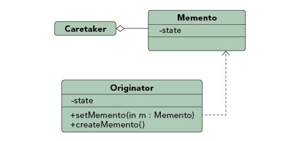

Purpose : Allows for capturing and externalizing an object's internal state so that it can be restored later, all without violating encapsulation.

Use When :
- The internal state of an object must be saved and restored at a later time.
- Internal state cannot be exposed by interfaces without exposing implementation.
- Encapsulation boundaries must be preserved.

Example :

Undo functionality can nicely be implemented using the memento pattern. By serializing and deserializing the state of an object before the change occurs we can preserve a snapshot of it that can later be restored should the user choose to undo the operation.


The memento pattern is a behavioral design pattern. The memento pattern is used to store an object's state so that this state can be restored at a later point. The saved state data in the memento object is not accessible outside of the object to be saved and restored. This protects the integrity of the saved state data.

In this pattern, an Originator class represents the object whose state we would like to save. A Memento class represents an object to store the state of the Originator. The Memento class is typically a private inner class of the Originator. As a result, the Originator has access to the fields of the memento, but outside classes do not have access to these fields. This means that state information can be transferred between the Memento and the Originator within the Originator class, but outside classes do not have access to the state data stored in the Memento.

The memento pattern also utilizes a Caretaker class. This is the object that is responsible for storing and restoring the Originator's state via a Memento object. Since the Memento is a private inner class, the Memento class type is not visible to the Caretaker. As a result, the Memento object needs to be stored as an Object within the Caretaker.

Now, lets look at an example. The DietInfo class is our Originator class. we'd like to be able to save and restore its state. It contains 3 fields: a dieter name field, the day number of the diet, and the weight of the dieter on the specified day of the diet.

This class contains a private inner class called Memento. This is our Memento class that is used to save the state of DietInfo. Memento has 3 fields representing the dieter name, the day number, and the weight of the dieter.

Notice the save() method of DietInfo. This creates and returns a Memento object. This returned Memento object gets stored by the caretaker. Note that DietInfo.Memento is not visible, so the caretaker can not reference DietInfo.Memento. Instead, it stores the reference as an Object.

The restore() method of DietInfo is used to restore the state of the DietInfo. The caretaker passes in the Memento (as an Object). The memento is cast to a Memento object and then the DietInfo object's state is restored by copying over the values from the memento.

[DietInfo.java](http://www.avajava.com/tutorials/design-patterns/memento-pattern/DietInfo.java)
```java
package com.cakes;

// originator - object whose state we want to save

public class DietInfo {
    String personName;

    int dayNumber;

    int weight;

    public DietInfo(String personName, int dayNumber, int weight) {
        this.personName = personName;
        this.dayNumber = dayNumber;
        this.weight = weight;
    }

    public String toString() {
        return "Name: " + personName + ", day number: " + dayNumber + ", weight: " + weight;
    }

    public void setDayNumberAndWeight(int dayNumber, int weight) {
        this.dayNumber = dayNumber;
        this.weight = weight;
    }

    public Memento save() {
        return new Memento(personName, dayNumber, weight);
    }

    public void restore(Object objMemento) {
        Memento memento = (Memento) objMemento;
        personName = memento.mementoPersonName;
        dayNumber = memento.mementoDayNumber;
        weight = memento.mementoWeight;
    }

    // memento - object that stores the saved state of the originator

    private class Memento {String mementoPersonName;

        int mementoDayNumber;

        int mementoWeight;

        public Memento(String personName, int dayNumber, int weight) {
            mementoPersonName = personName;
            mementoDayNumber = dayNumber;
            mementoWeight = weight;
        }
    }
}
```
DietInfoCaretaker is the caretaker class that is used to store the state (ie, the memento) of a DietInfo object (ie, the originator). The memento is stored as an object since DietInfo.Memento is not visible to the caretaker. This protects the integrity of the data stored in the Memento object. The caretaker's saveState() method saves the state of the DietInfo object. The caretaker's restoreState() method restores the state of the DietInfo object.

[DietInfoCaretaker.java](http://www.avajava.com/tutorials/design-patterns/memento-pattern/DietInfoCaretaker.java)
```java
package com.cakes;

// caretaker - saves and restores a DietInfo object's state via a memento

// note that DietInfo.Memento isn't visible to the caretaker so we need to cast the memento to Object

public class DietInfoCaretaker {
    Object objMemento;

    public void saveState(DietInfo dietInfo) {
        objMemento = dietInfo.save();
    }

    public void restoreState(DietInfo dietInfo) {
        dietInfo.restore(objMemento);
    }
}
```
The MementoDemo class demonstrates the memento pattern. It creates a caretaker and then a DietInfo object. The DietInfo object's state is changed and displayed. At one point, the caretaker saves the state of the DietInfo object. After this, the DietInfo object's state is further changed and displayed. After this, the caretaker restores the state of the DietInfo object. We verify this restoration by displaying the DietInfo object's state.

[MementoDemo.java](http://www.avajava.com/tutorials/design-patterns/memento-pattern/MementoDemo.java)
```java
package com.cakes;

public class MementoDemo {

    public static void main(String[] args) {
        // caretaker
        DietInfoCaretaker dietInfoCaretaker = new DietInfoCaretaker();

        // originator
        DietInfo dietInfo = new DietInfo("Fred", 1, 100);
        System.out.println(dietInfo);
        dietInfo.setDayNumberAndWeight(2, 99);
        System.out.println(dietInfo);
        System.out.println("Saving state.");
        dietInfoCaretaker.saveState(dietInfo);
        dietInfo.setDayNumberAndWeight(3, 98);
        System.out.println(dietInfo);
        dietInfo.setDayNumberAndWeight(4, 97);
        System.out.println(dietInfo);
        System.out.println("Restoring saved state.");
        dietInfoCaretaker.restoreState(dietInfo);
        System.out.println(dietInfo);
    }
}
```
The console output of the execution of MementoDemo is shown here. Notice how the state changes, and how we are able to save and restore the state of the originator via the caretaker's reference to the memento.

[Console Output](http://www.avajava.com/tutorials/design-patterns/memento-pattern/console.txt)

	Name: Fred, day number: 1, weight: 100
	Name: Fred, day number: 2, weight: 99
	Saving state.
	Name: Fred, day number: 3, weight: 98
	Name: Fred, day number: 4, weight: 97
	Restoring saved state.
	Name: Fred, day number: 2, weight: 99


