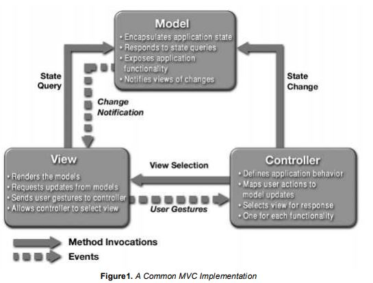
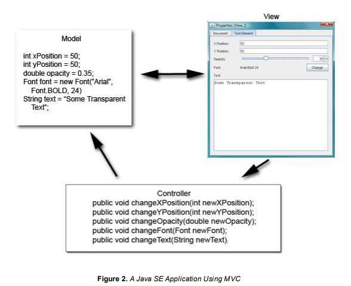
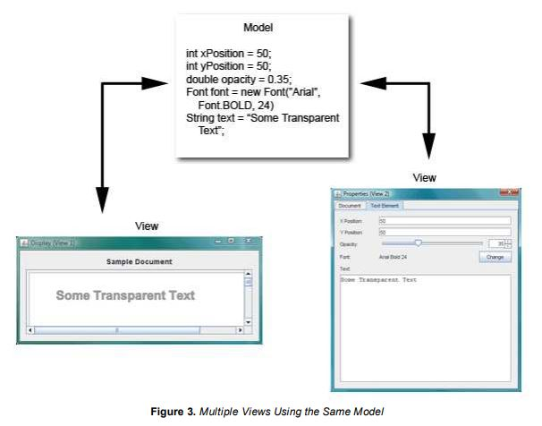
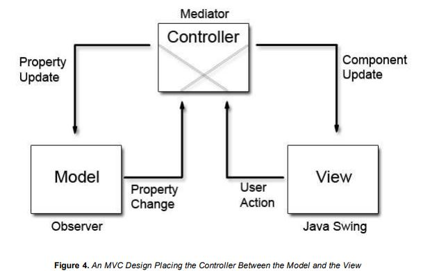
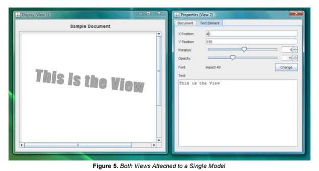

GUI desktop Architectures
=========================

As done in Tecnomen

Prerequisite:

Eclipse RCP plugin
1. tom-common
	
	All DTO's and Facade interfaces

2. mas
   
	   apps → tom-server (dependent on tom-common for DTO's and facade interfaces)
	   		has all the facade implementations. Facades handle the DTO's here

3. tom → tom-client
```
cstool
    model
        PROP_DIRTY = true // Either in this or super class
        save() and validate()
        addPropertyChangeListener(Property)
        model directly calls facade

    editor
        while populating the field
        Refer directly to model (has an instance of model; either it creates model or fetched from some shared resource) and it uses databinding concept to bindthe SWT → observeSelection to update the model 
```
4. tom-proxy

	Facades or code for communication


## Java SE Application Design With MVC

Java SE Application Design With MVC
By Robert Eckstein, March 2007

Articles Index Contents

 - What Is Model-View-Controller (MVC)?
 - Interaction Between MVC Components
 - Modifying the MVC Design
 - Using the Modified MVC
 - Issues With Application Design
 - Common Swing Component Listeners
 - Conclusion
 - For More Information

#### What Is Model-View-Controller (MVC)?

If you've programmed with graphical user interface (GUI) libraries in the past 10 years or so, you have likely come across the model-view-controller (MVC) design. MVC was first introduced by Trygve Reenskaug, a Smalltalk developer at the Xerox Palo Alto Research Center in 1979, and helps to decouple data access and business logic from the manner in which it is displayed to the user. More precisely, MVC can be broken down into three elements:

 - Model - The model represents data and the rules that govern access to and updates of this data. In enterprise software, a model often serves as a software approximation of a real-world process.
 - View - The view renders the contents of a model. It specifies exactly how the model data should be presented. If the model data changes, the view must update its presentation as needed. This can be achieved by using a push model, in which the view registers itself with the model for change notifications, or a pull model, in which the view is responsible for calling the model when it needs to retrieve the most current data.
 - Controller - The controller translates the user's interactions with the view into actions that the model will perform. In a stand-alone GUI client, user interactions could be button clicks or menu selections, whereas in an enterprise web application, they appear as GET and POST HTTP requests. Depending on the context, a controller may also select a new view -- for example, a web page of results -- to present back to the user.

Although different architectures allow the three components to interact in different ways, Figure 1 shows a common implementation of the MVC design pattern, as shown in the Sun BluePrints Catalog.



#### Interaction Between MVC Components

This section will take a closer look at one way to implement Figure 1 in the context of an application in the Java Platform, Standard Edition 6 (Java SE 6). Once the model, view, and controller objects are instantiated, the following occurs:

 1. The view registers as a listener on the model. Any changes to the underlying data of the model immediately result in a broadcast change notification, which the view receives. This is an example of the push model described earlier. Note that the model is not aware of the view or the controller -- it simply broadcasts change notifications to all interested listeners.
 1. The controller is bound to the view. This typically means that any user actions that are performed on the view will invoke a registered listener method in the controller class.
 1. The controller is given a reference to the underlying model.

Once a user interacts with the view, the following actions occur:

 1. The view recognizes that a GUI action -- for example, pushing a button or dragging a scroll bar -- has occurred, using a listener method that is registered to be called when such an action occurs.
 1. The view calls the appropriate method on the controller.
 1. The controller accesses the model, possibly updating it in a way appropriate to the user's action.
 1. If the model has been altered, it notifies interested listeners, such as the view, of the change. In some architectures, the controller may also be responsible for updating the view. This is common in Java technology-based enterprise applications.

Figure 2 shows this interaction in more detail.



As this article mentioned earlier, the model does not carry a reference to the view but instead uses an event-notification model to notify interested parties of a change. One of the consequences of this powerful design is that the many views can have the same underlying model. When a change in the data model occurs, each view is notified by a property change event and can update itself accordingly. For example, Figure 3 shows two views that use the same data model.



A more recent implementation of the MVC design places the controller between the model and the view. This design, which is common in the Apple Cocoa framework, is shown in Figure 4.

<!---->

	              +--------------+
	         +----+  Controller  +------+
	Property |    +----^---^-----+      | Component
	Update   |         |   |            | Update
	         |         |   |            |
	         |         |   |            |
	         |         |   |            |
	 +-------v-+       |   |          +-v--------+
	 |  Model  | +-----+   +----------+   View   |
	 +---------+  Property     User   +----------+
	  Observer    Change       Action   Java Swing

The primary difference between this design and the more traditional version of MVC is that the notifications of state changes in model objects are communicated to the view through the controller. Hence, the controller mediates the flow of data between model and view objects in both directions. View objects, as always, use the controller to translate user actions into property updates on the model. In addition, changes in model state are communicated to view objects through an application's controller objects. Thus, when all three components are instantiated, the view and the model will both register with the controller. Once a user interacts with the view, the events are nearly identical:

 1. The view recognizes that a GUI action -- for example, pushing a button or dragging a scroll bar -- has occurred, using a listener method that is registered to be called when such an action occurs.
 1. The view calls the appropriate method on the controller.
 1. The controller accesses the model, possibly updating it in a way appropriate to the user's action.
 1. If the model has been altered, it notifies interested listeners of the change. However, in this case, the change is sent to the controller.

Why adopt this design? Using this modified MVC helps to more completely decouple the model from the view. In this case, the controller can dictate the model properties that it expects to find in one or more models registered with the controller. In addition, it can also provide the methods that effect the model's property changes for one or more views that are registered with it.

##### Using the Modified MVC

This section of the article shows you how to put this design into practice, starting with the model. Suppose that you want to paint some text using a simple display model with five properties. Code Sample 1 shows a simple component that you can use to create such a model.

Code Sample 1
```java
public class TextElementModel extends AbstractModel {}

	private String text;
	private Font font;
	private Integer x;
	private Integer y;
	private Integer opacity;
	private Integer rotation;

	/**
	 * Provides the means to set or reset the model to
	 * a default state
	 */
	public void initDefault() {

		setOpacity(89);
		setRotation(0);
		setText('Sample Text');
		setFont(new Font('Arial', Font.BOLD, 24));
		setX(50);
		setY(50);

	}

	//  Accessors
	public String getText() {
		return text;
	}

	public void setText(String text) {

		String oldText = this.text;
		this.text = text;

		firePropertyChange(
			DefaultController.ELEMENT_TEXT_PROPERTY,
			oldText, text);
	}

	public Font getFont() {
		return font;
	}

	public void setFont(Font font) {

		Font oldFont = this.font;
		this.font = font;

		firePropertyChange(
			DefaultController.ELEMENT_FONT_PROPERTY,
			oldFont, font);
	}

	//  The remaining accessors for properties are omitted.

}
```
 > Note that the rest of the accessors follow the standard JavaBeans model, although they are omitted in Code Sample 1. For reference, Code Sample 2 shows the underlying AbstractModel class, which simply uses the javax.beans.PropertyChangeSupport class to register, deregister, and notify interested listeners of changes to the model.

Code Sample 2
```java
public abstract class AbstractModel
{

	protected PropertyChangeSupport propertyChangeSupport;

	public AbstractModel()
	{
		propertyChangeSupport = new PropertyChangeSupport(this);
	}

	public void addPropertyChangeListener(PropertyChangeListener listener) {
		propertyChangeSupport.addPropertyChangeListener(listener);
	}

	public void removePropertyChangeListener(PropertyChangeListener listener) {
		propertyChangeSupport.removePropertyChangeListener(listener);
	}

	protected void firePropertyChange(String propertyName, Object oldValue, Object newValue) {
		propertyChangeSupport.firePropertyChange(propertyName, oldValue, newValue);
	}
}
```

##### The Controller
Between the model and view lies the controller. First, take a look at the code for the abstract controller superclass, as shown in Code Sample 3.

Code Sample 3
```java
public abstract class AbstractController implements PropertyChangeListener {

	private ArrayList<abstractviewpanel> registeredViews;
	private ArrayList<abstractmodel> registeredModels;

	public AbstractController() {
		registeredViews = new ArrayList<abstractviewpanel>();
		registeredModels = new ArrayList<abstractmodel>();
	}


	public void addModel(AbstractModel model) {
		registeredModels.add(model);
		model.addPropertyChangeListener(this);
	}

	public void removeModel(AbstractModel model) {
		registeredModels.remove(model);
		model.removePropertyChangeListener(this);
	}

	public void addView(AbstractViewPanel view) {
		registeredViews.add(view);
	}

	public void removeView(AbstractViewPanel view) {
		registeredViews.remove(view);
	}


	//  Use this to observe property changes from registered models
	//  and propagate them on to all the views.


	public void propertyChange(PropertyChangeEvent evt) {

		for (AbstractViewPanel view: registeredViews) {
			view.modelPropertyChange(evt);
		}
	}

	/**
		* This is a convenience method that subclasses can call upon
		* to fire property changes back to the models. This method
		* uses reflection to inspect each of the model classes
		* to determine whether it is the owner of the property
		* in question. If it isn't, a NoSuchMethodException is thrown,
		* which the method ignores.
		*
		* @param propertyName = The name of the property.
		* @param newValue = An object that represents the new value
		* of the property.
		*/
	protected void setModelProperty(String propertyName, Object newValue) {

		for (AbstractModel model: registeredModels) {
			try {

				Method method = model.getClass().
					getMethod('set'+propertyName, new Class[] {
														newValue.getClass()
													}
								);
				method.invoke(model, newValue);

			} catch (Exception ex) {
				//  Handle exception.
			}
		}
	}
}
```
The AbstractController class contains two ArrayList objects, which are used to keep track of the models and views that are registered. Note that whenever a model is registered, the controller also registers itself as a property change listener on the model. This way, whenever a model changes its state, the propertyChange() method is called and the controller will pass this event on to the appropriate views.

The final method, setModelProperty(), employs some magic to get its work done. In order to keep the models completely decoupled from the controller, the code samples in this article have employed the Java Reflection API. In this case, when this method is called with the desired property name, you hunt through the registered models to determine which one contains the appropriate method. Once you find it, you invoke the method using the new value. If the method is not called, the getMethod()will throw a NoSuchMethodException, which the exception handler ignores, allowing the for- loop to continue.

Code Sample 4 shows the source code for the default controller class. This class consists of only property constants and methods called by the GUI event listeners of the view.

Code Sample 4
```java
public class DefaultController extends AbstractController
{

	public static final String ELEMENT_TEXT_PROPERTY = 'Text';
	public static final String ELEMENT_FONT_PROPERTY = 'Font';
	public static final String ELEMENT_X_PROPERTY = 'X';
	public static final String ELEMENT_Y_PROPERTY = 'Y';
	public static final String ELEMENT_OPACITY_PROPERTY = 'Opacity';
	public static final String ELEMENT_ROTATION_PROPERTY = 'Rotation';

	//  Code omitted

	public void changeElementText(String newText) {
		setModelProperty(ELEMENT_TEXT_PROPERTY, newText);
	}

	public void changeElementFont(Font newFont) {
		setModelProperty(ELEMENT_FONT_PROPERTY, newFont);
	}

	public void changeElementXPosition(int newX) {
		setModelProperty(ELEMENT_X_PROPERTY, newX);
	}

	public void changeElementYPosition(int newY) {
		setModelProperty(ELEMENT_Y_PROPERTY, newY);
	}

	public void changeElementOpacity(int newOpacity) {
		setModelProperty(ELEMENT_OPACITY_PROPERTY, newOpacity);
	}

	public void changeElementRotation(int newRotation) {
		setModelProperty(ELEMENT_ROTATION_PROPERTY, newRotation);
	}
}
```
##### The View

This example will have two views displaying the data from the model: a property-editor view and a graphical page view. Both of these are implementations of a JPanel, inserted into either a JDialogor JFrame. The dialog box allows the user to update the values of the model, and the frame panel simply reflects the changes as the final textual display. The author of this article built this example using the NetBeans Swing GUI Builder, formerly referred to as Project Matisse, to design the GUI forms.

Code Sample 5 shows the source code for the property-editor view, the more interesting of the two. The first section is simply devoted to initialization of the components, which for the most part was automatically generated by the NetBeans integrated development environment (IDE) in theinitComponents() method. All of this section is omitted but is present in the downloadable code. Any other initialization that you need to perform -- in this case, creating custom models for JSpinnerand JSlider objects or adding DocumentListeners to the JTextField components -- is handled in the localInitialization() method.

Code Sample 5
```java
public PropertiesViewPanel(DefaultController controller) {

	this.controller = controller;

	initComponents();
	localInitialization();

}

// ‹editor-fold defaultstate='collapsed' desc=' Local Initialization '›

/**
  * Used to provide local initialization of Swing components
  * outside of the NetBeans automatic code generator
  */
public void localInitialization() {

	opacitySpinner.setModel(new SpinnerNumberModel(100, 0, 100, 1));
	opacitySlider.setModel(new DefaultBoundedRangeModel(100, 0, 0, 100));

	rotationSpinner.setModel(new SpinnerNumberModel(0, -180, 180, 1));
	rotationSlider.setModel(new DefaultBoundedRangeModel(0, 0, -180, 180));

	text.getDocument().addDocumentListener(new DocumentListener() {

		public void insertUpdate(DocumentEvent e) {
			textDocumentChanged(e);
		}

		public void removeUpdate(DocumentEvent e) {
			textDocumentChanged(e);
		}

		public void changedUpdate(DocumentEvent e) {
			textDocumentChanged(e);
		}
	});
}

// ‹/editor-fold›
```
Note that the automatically generated NetBeans IDE code folds in the source code so that the developer can collapse each of these sections when it is not needed:

	// ‹editor-fold defaultstate='collapsed' desc=' Local Initialization '›
	// ‹/editor-fold›

If you're using the NetBeans IDE, this practice is highly recommended.

The second section of the PropertiesViewPanel class deals exclusively with the model. In Code Sample 6, a modelPropertyChange() method is called by the controller whenever the model reports a state change.

Code Sample 6
```java
// ‹editor-fold defaultstate='collapsed' desc=' Model Event Handling Code '›
public void modelPropertyChange(final PropertyChangeEvent evt) {
	if (evt.getPropertyName().equals(
				DefaultController.ELEMENT_X_PROPERTY)) {
		String newStringValue = evt.getNewValue().toString();
		xPositionTextField.setText(newStringValue);
	} else if
		(evt.getPropertyName().equals(
				DefaultController.ELEMENT_Y_PROPERTY)) {
		String newStringValue = evt.getNewValue().toString();
		yPositionTextField.setText(newStringValue);
	} else if
		(evt.getPropertyName().equals(
				DefaultController.ELEMENT_OPACITY_PROPERTY)) {
		int newIntegerValue = (Integer)evt.getNewValue();
		opacitySpinner.setValue(newIntegerValue);
		opacitySlider.setValue(newIntegerValue);
	} else if
		(evt.getPropertyName().equals(
				DefaultController.ELEMENT_ROTATION_PROPERTY)) {
		int newIntegerValue = (Integer)evt.getNewValue();
		rotationSpinner.setValue(newIntegerValue);
		rotationSlider.setValue(newIntegerValue);
	} else if
		(evt.getPropertyName().equals(
				DefaultController.ELEMENT_TEXT_PROPERTY)) {
		String newStringValue = evt.getNewValue().toString();
		text.setText(newStringValue);
	} else if
		(evt.getPropertyName().equals(
				DefaultController.ELEMENT_FONT_PROPERTY)) {
		Font f = (Font)evt.getNewValue();
		String fontString = f.getFontName() + ' ' + f.getSize();
		font.setText(fontString);
		currentFont = f;
	}
	//  Remainder of the code omitted
}
// ‹/editor-fold›
```

Again, this code sample omits portions of the code that are similar to the sections shown.

The final portion consists of the GUI event listeners. Code Sample 7 contains listeners that are called whenever GUI events occur, such as pushing the Change Font button or the Opacity spinner buttons, or resetting the text in any of the text fields. These are largely event listeners that most Swing developers are already familiar with. If you're using the NetBeans IDE, you'll see that the IDE can automatically generate many of these using the GUI developer.

Code Sample 7
```java
// ‹editor-fold defaultstate='collapsed' desc=' GUI Event Handling Code '›
// Code omitted
private void yPositionTextFieldFocusLost(java.awt.event.FocusEvent evt) {
	try {
		controller.changeElementYPosition(
			Integer.parseInt(yPositionTextField.getText()));
	} catch (Exception e) {
		//  Handle exception.
	}
}

private void yPositionTextFieldActionPerformed(java.awt.event.ActionEvent evt) {
	try {
		controller.changeElementYPosition(
			Integer.parseInt(yPositionTextField.getText()));
	} catch (Exception e) {
		//  Handle exception.
	}
}

// Code omitted -- code for xPosition
// is nearly the same as for yPosition.

private void changeFontButtonActionPerformed(java.awt.event.ActionEvent evt) {

	JFontChooserDialog fontChooser = new
		JFontChooserDialog((Dialog)this.getTopLevelAncestor());
	fontChooser.setSelectedFont(currentFont);
	fontChooser.setVisible(true);

	Font returnedFont = fontChooser.getSelectedFont();
	if (returnedFont != null) {
		controller.changeElementFont(returnedFont);
	}
}

private void opacitySliderStateChanged(javax.swing.event.ChangeEvent evt) {
	controller.changeElementOpacity((int)opacitySlider.getValue());
}

private void rotationSliderStateChanged(javax.swing.event.ChangeEvent evt) {
	controller.changeElementRotation((int)rotationSlider.getValue());
}

private void opacitySpinnerStateChanged(javax.swing.event.ChangeEvent evt) {
	controller.changeElementOpacity((Integer)opacitySpinner.getValue());
}

private void rotationSpinnerStateChanged(javax.swing.event.ChangeEvent evt) {
	controller.changeElementRotation((Integer)rotationSpinner.getValue());
}

private void textDocumentChanged(DocumentEvent evt) {

	Document document = evt.getDocument();
	try {
		controller.changeElementText(document.getText(0,
		document.getLength()));
	} catch (BadLocationException ex) {
		//  Handle exception.
	}
}

// ‹/editor-fold›
```

##### Issues With Application Design

Once the application is up and running, you immediately run into a problem. Consider the following chain of events:

 1. One of the Swing components in the view receives a change, presumably from the user action.
 1. The appropriate controller method is called.
 1. The model is updated. It notifies the controller of its property change.
 1. The view receives a change event from the controller and attempts to reset the value of the appropriate Swing components.
 1. The appropriate controller method is called, and the model is updated again.

At this point, any of three different scenarios can occur, depending on what Swing component you use and how robust your model is.

 - The Swing component that prompted the initial change refuses to update itself the second time, noting that its property state cannot be updated again while it is in the process of notifying listeners of the initial state change. This primarily occurs when you use Swing text components.
 - The model notes that the value of the second update matches that of the first, its current value, and refuses to send a change notification. This is always a safe programming practice, and it automatically occurs if you use the PropertyChangeSupport class provided in the java.beanspackage. However, it does not keep the model from receiving a redundant update.
 - No safeguards are in place on either the model or the Swing component, and the program enters an infinite loop.

This issue occurs because the Swing components are autonomous. For example, what happens if the user presses the up arrow of the JSpinner component in PropertiesViewPanel, incrementing the spinner's value by one? After the value is updated, a GUI event listener method that is listening for value changes is called, opacitySpinnerStateChanged(), which in turn calls the controller and then updates the appropriate property in the model.

With a traditional MVC design, the view would still contain the previous value, and the change in the model would update the view to the current value. However, there is no need to update the Swing component because it has already reset itself to the correct value -- it did so before it even passed an event to the controller.

How do you get around this? One way is to write a mechanism that tells the model or the controller not to propagate a change notification under these circumstances, but this is not a good idea. Remember that more than one view may be listening for changes on the model. If you shut down the change notification for the model, no other listeners, including other views, will be notified of the change. In addition, other components in the same view may rely on the property change notification, with a slider and spinner combination, for example.

Ideally, each Swing component would be aware of its current value and the value that the view is trying to set it to. If they match, no change notifications will be sent. However, some Swing components include this logic, and others do not. One possible solution is to check the incoming changed value of the model against the current value stored in the Swing component. If they are identical, there is no need to reset the value of the Swing component.

Code Sample 8 shows an update of the modelPropertyChange() method to demonstrate this approach.

Code Sample 8
```java
public void modelPropertyChange(final PropertyChangeEvent evt) {

	if (evt.getPropertyName().equals(DefaultController.ELEMENT_X_PROPERTY)) {

		String newStringValue = evt.getNewValue().toString();
		if (!xPositionTextField.getText().equals(newStringValue))
			xPositionTextField.setText(newStringValue);

	}

	//  Remaining code omitted

}
```
The final example, which uses two delegate views, is shown in Figure 5. The second delegate makes use of the Java 2D libraries to display the text, which is beyond the scope of this article. However, the source code is relatively easy to follow and is included in the downloadable source code.



#### Conclusion

MVC is one of the staples of any GUI programmer's toolkit. This article has shown how to implement a variation of the MVC design using Java SE and the Swing libraries. In addition, it has demonstrated some common issues that programmers may face when using MVC, as well as listed common Swing component events that any Java platform programmer can use when creating a view.


