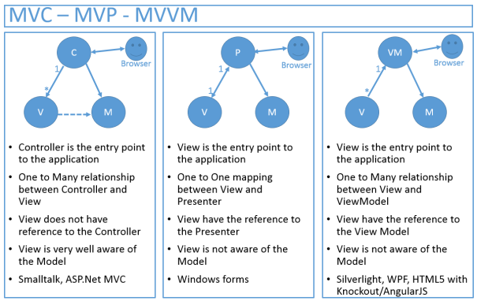
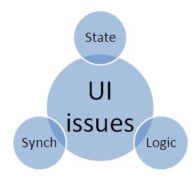
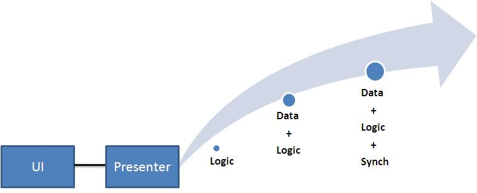
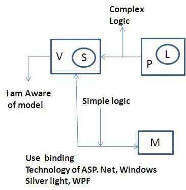
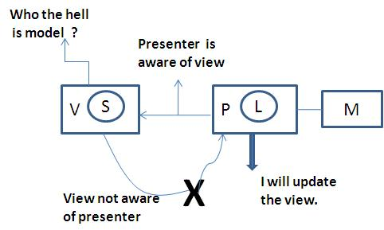
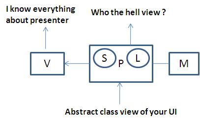
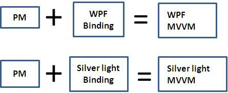
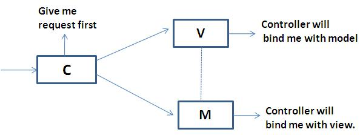
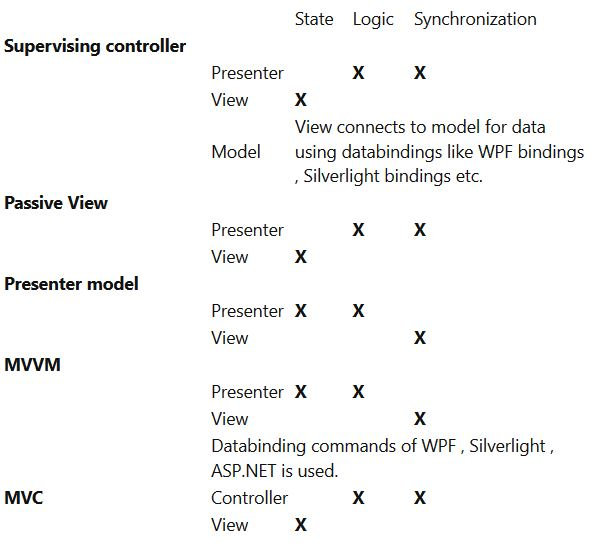
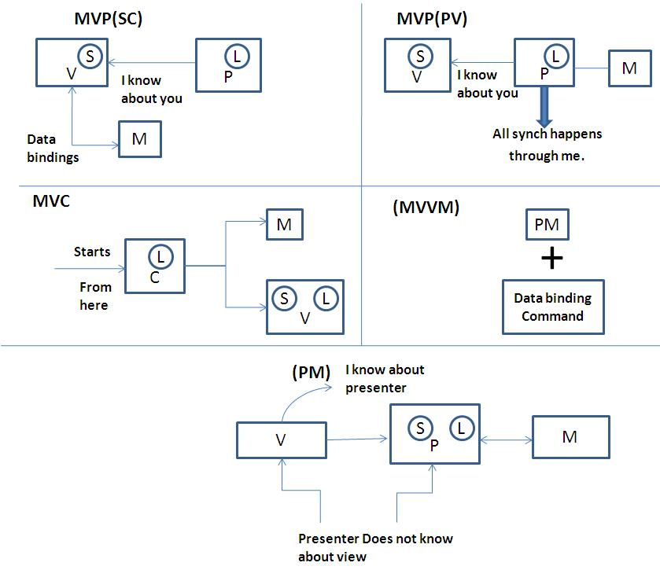

GUI Presentation Design
=======================

### Introduction



This article will compare four important architecture presentation patterns i.e. MVP(SC),MVP(PV),PM,MVVM and MVC. Many developers are confused around what is the difference between these patterns and when should we use what. This article will first kick start with a background and explain different types of presentation patterns. We will then move ahead discussing about the state , logic and synchronization issues. Finally we will go in detail of each pattern and conclude how they differ from each other.


### Background - Presentation patterns  

One of the biggest problems associated with user interface is lot of cluttered code. This cluttered code is due to two primary reasons , first the UI has complicated logic to manipulate the user interface objects and second it also maintains state of the application. Presentation patterns revolve around how to remove the UI complication and make the UI more clean and manageable. Below are different variety and classifications of presentation patterns as shown in the below figure.

```
                                         +--------------+
                                         | Presentation |
                                         | Pattern      |
                                         +------+-------+
                                                |
                                                |
                      +---------------------------------------------+
                      |                         |                   |
                   +--v--+                   +--v--+          +-----v-------+
                   | MVP |                   | MVC |          | Presentation|
                   +--+--+                   +-----+          | Model       |
                      |                                       +------+------+
    +-----------------v--------+                                     |
    |                          |                                     |
+---v---------+          +------------+                         +----v-----+
| Supervising |          |Passive View|                         |   MVVM   |
| Presenter   |          +------------+                         +----------+
+-------------+
```

### 3 big problems of UI :- State , Logic and Synchronization

There are 3 big problems associated with UI as listed below.

State :- State / data is one of the biggest concern in UI. State means the current data picture of your user interface. In web terminologies it can be session variable and in windows application it can be a simple UI level data. The more the UI maintains states ,the more complication is increased.

Logic :- User interface normally have UI logics like manipulating textboxes , combo boxes or any other UI elements.The more these kind of logic exists in the UI the more it becomes complex.

Synchronization :- User interfaces normally co-ordinate with domain / business components. UI also needs to synchronize data between UI elements ( textboxes , comboboxes etc) and business objects. If your UI is taking of synchronization again the UI complexity increases.




### The Hero - Presentation design Pattern

Presentation design pattern helps to solve the above UI problems. The base logic of presentation design patterns is that we need to create a extra class which will consume complicated logic , data and synch issues which currently the UI does , thus making the UI dump , clean and simple. Depending on how much this class takes responsibilities defines further whether its a SC , PV , PM design pattern etc. In other words its the maturity of the presenter class which will define what kind of design pattern it is.




### Some acronyms to simplify the article

```
Acronym		Full form
V		View or user Interface.	
P		Presenter class which has the UI logic.	
L		UI logic	
S		State of the UI	
M		Business components or domain objects.	
SC		Supervising controller .	
PV		Passive view.	
PM		Presenter model.
```
We will use the above acronym to simplify our explanation of presentation design pattern.


### Supervising controller pattern ( SC )

Fundamentals about SC :-

- State is stored in the view.
- Presenter owns the complex presentation logic. Simple UI binding logic is taken care by using binding technologies like WPF binding and Silverlight binding. Anything complex is taken care presenter class.
- Presenter is aware of the view.
- View is not aware of the presenter.
- View connects with model using technical bindings provided by WPF and Silverlight.




### Passive view (PV)

Fundamentals about PV :-

- State is stored in the view.
- All logic of UI is stored in presenter.
- View is completely isolated from the model. It also takes the extra task of synchronizing data between model and view.
- Presenter is aware of the view.
- View is not aware of the presenter.

You can read more about MVP (PV) from this , it also has a sample code which shows how MVP comes in to action link




### Presentation Model (PM)

Fundamentals about SC :-

- State is stored in the presenter.
- Logic is stored in presenter.
- Presenter represents a abstract view of the UI.
- Presenter is not aware of the view.
- View is aware of the presenter.
- View is completely isolated from the model.




### MVVM

Fundamentals about SC :-

- Presenter model is the base.
- State is stored in the presenter.
- Logic is stored in presenter.
- Presenter represents an abstract view of the UI.
- Presenter is not aware of the view.
- View is aware of the presenter.
- View is completely isolated from the model.
- Uses WPF and Silverlight bindings.




### MVC

Fundamentals about MVC :-

- Does not have a presenter , has a controller.
- Request first comes to the controller.
- Controller binds the model with the view.
- Logic is stored in the controller.

You can read more about MVC from this, it also has a sample code which shows how MVC comes in to action link




### Summarizing

Below is a summary comparison table for all presentation patterns from the aspect of state , logic and synchronization.



Below is a visual comparison of what we discussed above.




### When to use MVP and When to use MVC ?

First thing all the above patterns are variations of MVC. In other words all MVP patterns are twists of MVC. We will compare between MVC and MVP first and then we will compare between different variations of the MVP.

Below are the situations of when MVP is preferred over MVC.

**UI unit test** :- If your project is laying more stress on automated unit test on UI then MVP is preferred over MVC because the presenter class of MVP isolates all the UI logic in to the presenter. The presenter is a complete mock of the UI so it can  be unit tested separately using VSTS test suite or NUNIT.

Views are same with slight variations :- If your application nature is such that it has views which can be reused with different data then MVC is a good thought. Especially if you have a application which is more report oriented. For example you have a two views which are almost same like 'Sales by month' and 'Sales by year'. Both these reports can be shown by using the same ASPX page probably with different models. So if your application has same UI look and feel with slight variations MVC is a good fit. Especially if you have reporting nature kind of application MVC will fly as compared to MVP.

**Multi UI support** :- If you forecast that your application will consume different UI technologies then MVP is good fit. In other words if your application will be consumed by windows UI as well as web application UI then  MVP is a good fit. It will help you to increase reusability by using the presenter class.

**Complex Screens** :- If you have complex screen with lot of user interaction MVC can be complicated as you end up with lot of controller classes for every interaction. MVP here is a better suit because you can encapsulate those complex logic in to a class and test it separately to ensure a bug free code.

**Technology used** :- Technology is a very important factor. If technology provides automation for architecture building it becomes more sense to use patterns accordingly. For instance if you are purely using ASP.NET application with out Silverlight or WPF its more sensible to go with MVP. ASP.NET pages expect the control events to be handled on the behind code while MVC expects these events to be handled on the controller. So we end up with rewriting the complete code of event handling for ASP.NET controls on the controller. If you are using silverlight and WPF they have nice binding support which makes MVP a better fit. On the other hand if you have same view with slight variations and you are have 3.5 as a framework you can use MVC framework to automate and suit your needs.

Technology selection drives 60% of whether you will select MVC or MVP. 


