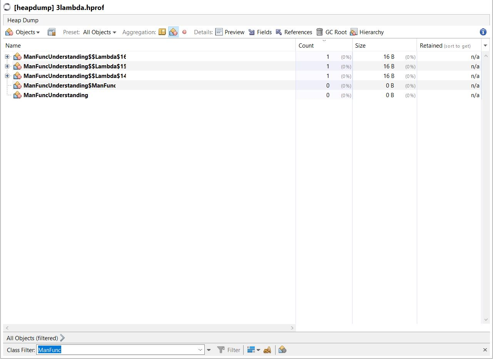
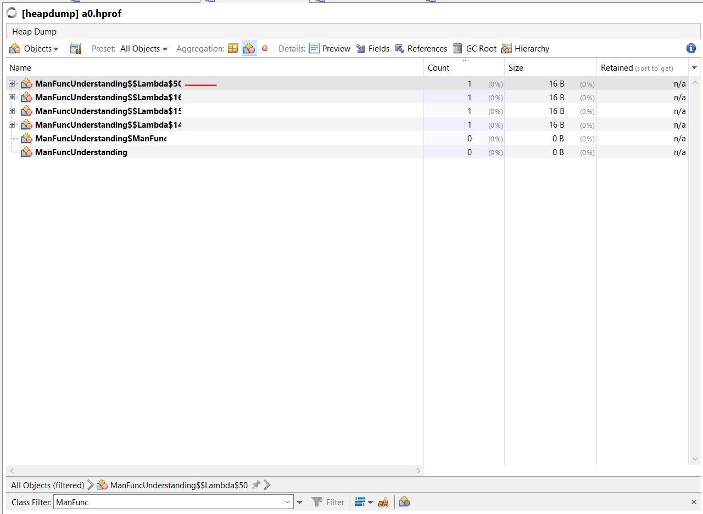
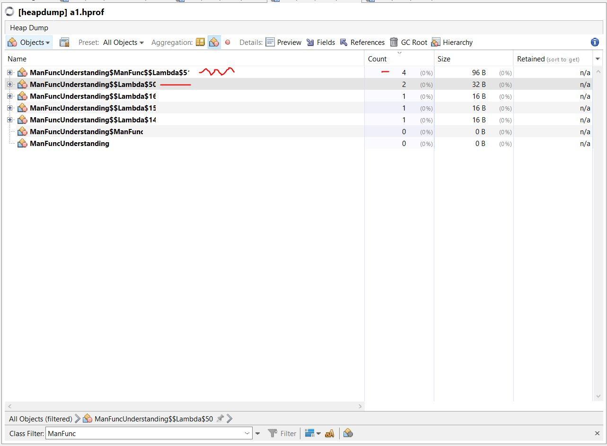
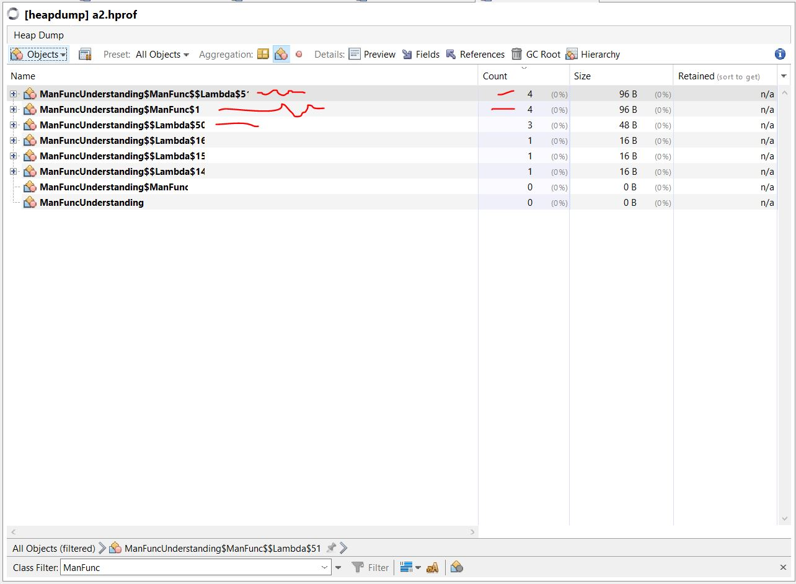

## Design Patterns with Java 8’s Lambdas

> Hint: Any design pattern which is based on one single function. However this is not limited.

> Its better if API consumer defines the API structure.

### Difference between OOPS and Functioal paradigm

**OOPS**: Data and Behaviour is one single unit and is called **Object**. Data and behaviour are combined in a template, called as **Class**. Data is given priority and behaviour works on it.

**FP**: *Data and Behaviour are **seperate entities***. Data is immutable (e.g. String Class) values that are transformed by pure functions, which do not have side effects.

OOPS is data centric with behaviour treated as secondary while in FP; functions are treated as first class citizen.

### When to Use Which?

> **OO** focuses on data, it makes a great candidate for data modeling. 

> **Functional programming** focuses on operations, it should be used for processing data.

### Moving parts
> OO makes code understandable by encapsulating moving parts.
> 
> FP makes code understandable by minimizing moving parts.
> - Michael Feathers


### Abstract Factory

A lambda that conforms to some interface and returns a new object. 

### Adapter

A lambda that calls a function with a different signature on some other object.
(Assuming the adapter interface has one public function.)

### Chain of responsibility

A lambda that may or may not delegate to another lambda, which may or may not delegate to another lambda, ad infinitum.
(How to get the ‘next’ reference into the lambda is left as an exercise for the reader.)

### Command

Otherwise known as: a lambda!
(Assuming you’re not planning on implementing undo. But then you just want a tuple of lambdas, don’t you?)

### Decorator

A lambda that calls another lambda with the same signature but changes the arguments on the way in, or the result on the way out, or performs some extra action.
(Assuming the decorated object has one public function.)

### Iterator

Close (though not identical) to forEach(lambda). More specific functions like map(lambda), filter(lambda), flatMap(lambda), foldLeft/Right(lambda), reduceLeft/Right(lambda), etc. cater for the majority of Iterator’s use in modern Java.

### Observer

Give some other object a lambda to call when something happens in the future.
(Assuming the Observer interface has a single function.)

### Strategy

Choose from a family of lambdas with identical signatures at runtime.

### Template method

Replace the abstract method polymorphism with composition, passing lambdas into the constructor.

### Visitor

### Validator


Once  a problem has a model. It can be implemented as a function. that can be created using:
- factory methods
- default methods

Handling exceptions are tricky though


### Java 8 Func understanding check 

```java
import com.sun.management.HotSpotDiagnosticMXBean;

import javax.management.MBeanServer;
import java.io.IOException;
import java.lang.management.ManagementFactory;
import java.util.Objects;

public class ManFuncUnderstanding {
    public interface ManFunc<T, R> {

        R apply(T t);

        default <V> ManFunc<V, R> compose(ManFunc<? super V, ? extends T> before) {
            Objects.requireNonNull(before);
            return (V v) -> apply(before.apply(v));
        }

        default <V> ManFunc<T, V> andThen(ManFunc<? super R, ? extends V> after) {
            Objects.requireNonNull(after);
            return (T t) -> after.apply(apply(t));
        }

        /**
         * This is the older way of doing, that can be achieved by lambda check andThen
         * Do note that both of the methods returns a new functions which operates on the existing function
         */
        default <V> ManFunc<T, V> andThenOld(ManFunc<? super R, ? extends V> after) {
            Objects.requireNonNull(after);
            return new ManFunc<T, V>() {
                @Override
                public V apply(T t) {
                    return after.apply(ManFunc.this.apply(t));
                }
            };
        }
    }

    public static ManFunc<String, String> getMyFunc(String text) {
        return s -> s + "" + text;
    }

    /**
     * Check the comments with VM status
     * @param args
     */
    public static void main(String[] args) {

        // 3 functions we created
        ManFunc<String, String> mf0 = s -> s + "0"; // ManFuncUnderstanding$$Lambda$14 1 instance
        ManFunc<String, String> mf1 = s -> s + "1"; // ManFuncUnderstanding$$Lambda$15 1 instance
        ManFunc<String, String> mf2 = s -> s + "2"; // ManFuncUnderstanding$$Lambda$16 1 instance
        heapDump("3lambda.hprof");

        ManFunc<String, String> mf3 = getMyFunc("3"); // ManFuncUnderstanding$$Lambda$50 1 instance

        heapDump("a0.hprof");

        System.out.println(mf0
                .andThen(mf1) // ManFuncUnderstanding$ManFunc$$Lambda$5' 1 instance
                .andThen(mf2) // ManFuncUnderstanding$ManFunc$$Lambda$5' 2 instance
                .andThen(mf3) // ManFuncUnderstanding$ManFunc$$Lambda$5' 3 instance
                .andThen(getMyFunc("4")) // ManFuncUnderstanding$ManFunc$$Lambda$5' 4 instance and ManFuncUnderstanding$$Lambda$50 2 instance
                .apply("a"));
        // In total 9 func exists, apply is called on ManFuncUnderstanding$ManFunc$$Lambda$5' its last instance created but do not via func chaining first func will be used to start processing the passed parameter.
        // check a1.hprof image Note: ManFunc is interface
        heapDump("a1.hprof");

        System.out.println(mf0
                .andThenOld(mf1) // ManFuncUnderstanding$ManFunc$1 1 instance
                .andThenOld(mf2) // ManFuncUnderstanding$ManFunc$1 2 instance
                .andThenOld(mf3) // ManFuncUnderstanding$ManFunc$1 3 instance
                .andThenOld(getMyFunc("4")) // ManFuncUnderstanding$ManFunc$1 4 instance and ManFuncUnderstanding$$Lambda$50 3 instance
                .apply("a"));
        // In total 14 func exists, apply is called on ManFuncUnderstanding$ManFunc$1 -> last instance, also it represents anonymous class
        // check a2.hprof image Note: ManFunc is interface
        heapDump("a2.hprof");
    }

    private static void heapDump(String file) {
        MBeanServer server = ManagementFactory.getPlatformMBeanServer();
        HotSpotDiagnosticMXBean mxBean = null;
        try {
            mxBean = ManagementFactory.newPlatformMXBeanProxy(
                    server, "com.sun.management:type=HotSpotDiagnostic", HotSpotDiagnosticMXBean.class);
            mxBean.dumpHeap(System.getProperty("user.home") + "/Downloads/" + file, false);
        } catch (IOException e) {
            throw new RuntimeException(e);
        }
    }
}
```

3 func created by declaring 3 local lambda as variables



4 func created (1 lambda obtained via function)



9 func in total; 4 via `andThen()` call; for more details check code



14 func in total; 4 via `andThenOld()` call, also new 4 are anonymous; for more details check code


