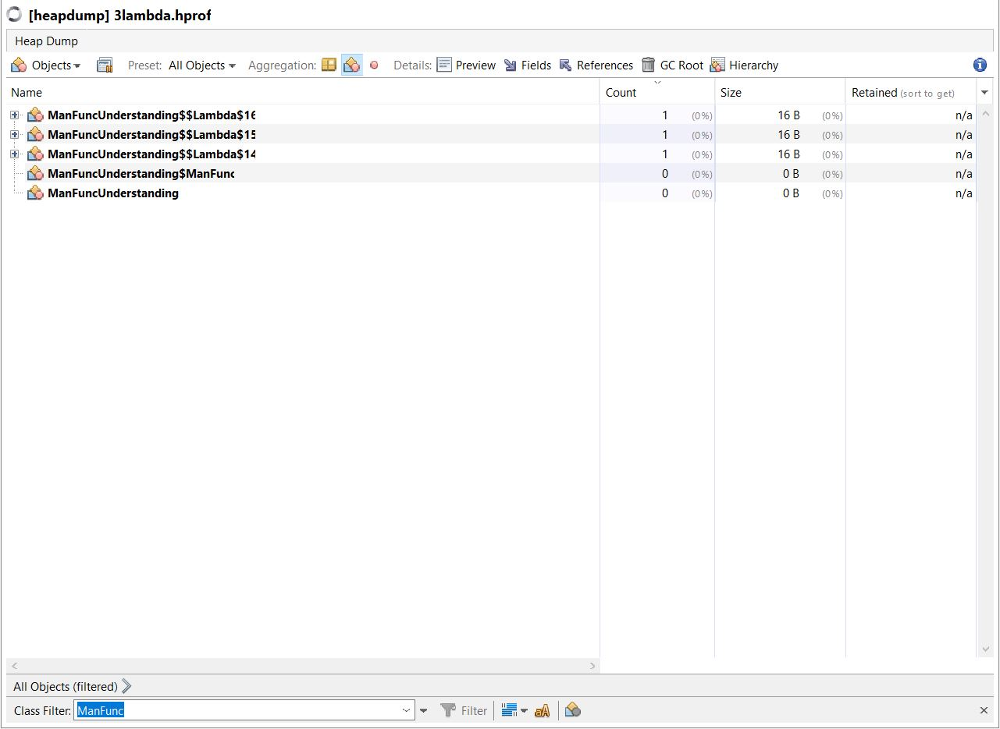
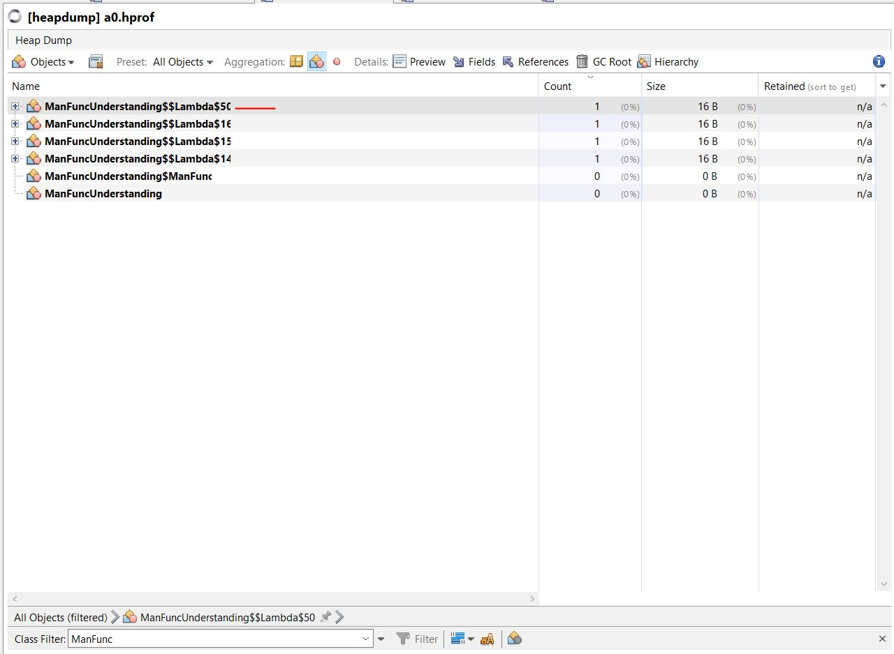
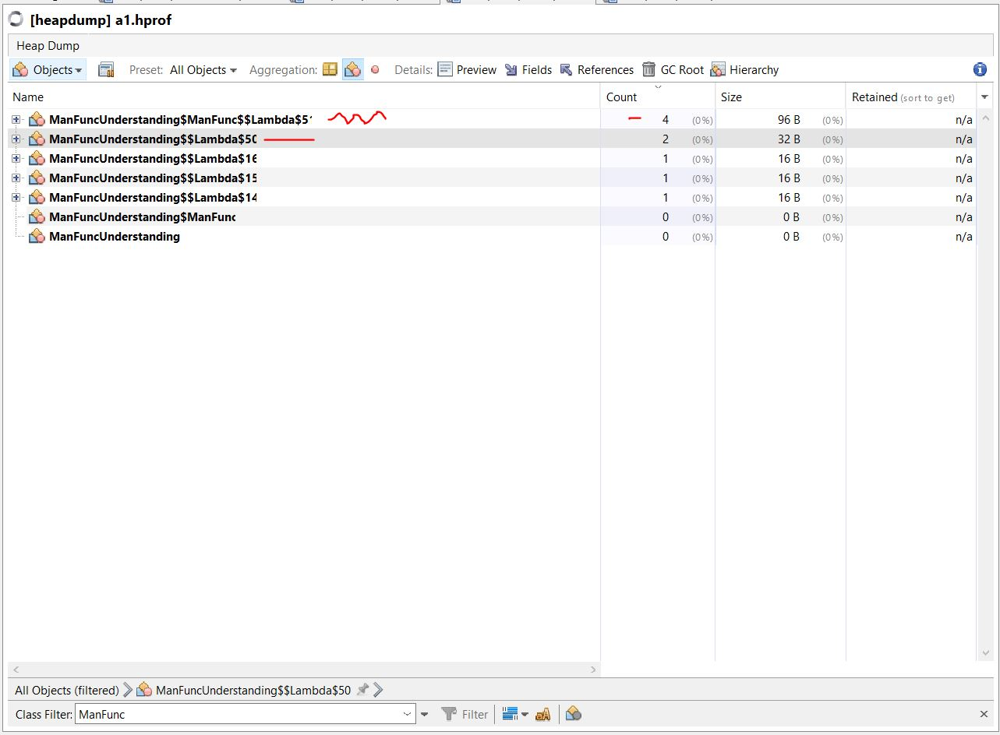
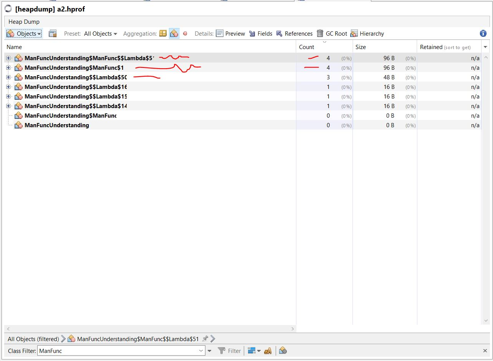

## Design Patterns with Java 8’s Lambdas

> Hint: Any design pattern which is based on one single function. Although exceptions exist with a redesign (e.g. Template, Visitor)

> Its better if API consumer defines the API structure.

> Good: https://github.com/mariofusco/from-gof-to-lambda/tree/master

*Funtion chaining works if passed argument is only 1 i.e. ```public arg2 work(arg1)``` can be chained but ```public arg3 work(arg1, arg2)``` can't be chained.* Rember Function<T, R>.

|Name|SAM (Single Abstract Method)|ToDo|Details|
|---|---|---|---|
|Creational DESIGN Pattern||||
|Abstract Factory|x||A lambda that conforms to some interface and returns a new object. |
|Builder|||Curries |
|Structural DESIGN Pattern||||
|Adapter|||A lambda that calls a function with a different signature on some other object. (Assuming the adapter interface has one public function.) |
|Decorator|x|Functions composition / Consumer Composition|A lambda that calls another lambda with the same signature but changes the arguments on the way in, or the result on the way out, or performs some extra action. (Assuming the decorated object has one public function.) / Consumer: Im Pure Function|
|Proxy|x|Functions||
|Flyweight|x|||
|Behavioral DESIGN Pattern||||
|Chain of responsibility|x|Stream of functions|A lambda that may or may not delegate to another lambda, which may or may not delegate to another lambda, ad infinitum. (How to get the ‘next’ reference into the lambda is left as an exercise for the reader.) |
|Command|x|Functions|Otherwise known as: a lambda! (Assuming you’re not planning on implementing undo. But then you just want a tuple of lambdas, don’t you?)|
|Iterator|||Close (though not identical) to forEach(lambda). More specific functions like map(lambda), filter(lambda), flatMap(lambda), foldLeft/Right(lambda), reduceLeft/Right(lambda), etc. cater for the majority of Iterator’s use in modern Java.|
|Observer|x|Consumer|Give some other object a lambda to call when something happens in the future. (Assuming the Observer interface has a single function.)|
|Strategy|x|Functions|Choose from a family of lambdas with identical signatures at runtime.|
|Template||Consumer|Replace the abstract method polymorphism with composition, passing lambdas into the constructor.|
|Visitor||Pattern matching + Functions||
|Validator||||
|Interpreter||Map of functions||

Once a problem has a model. It can be implemented as a function. that can be created using:
- factory methods
- default methods

Handling exceptions are tricky though

### Difference between OOPS and Functioal paradigm

**OOPS**: Data and Behaviour is one single unit and is called **Object**. Data and behaviour are combined in a template, called as **Class**. Data is given priority and behaviour works on it.

**FP**: *Data and Behaviour are **seperate entities***. Data is immutable (e.g. String Class) values that are transformed by pure functions, which do not have side effects.

OOPS is data centric with behaviour treated as secondary while in FP; functions are treated as first class citizen.

### When to Use Which?

> **OO** focuses on data, it makes a great candidate for data modeling. Remember Circle/Ellipse issue might come.

> **Functional programming** focuses on operations, it should be used for processing data.

### Moving parts
> OO makes code understandable by encapsulating moving parts.
> 
> FP makes code understandable by minimizing moving parts.
> - Michael Feathers

### Java 8 Func understanding check 

```java
import com.sun.management.HotSpotDiagnosticMXBean;

import javax.management.MBeanServer;
import java.io.IOException;
import java.lang.management.ManagementFactory;
import java.util.Objects;

public class ManFuncUnderstanding {
    public interface ManFunc<T, R> {

        R apply(T t);

        default <V> ManFunc<V, R> compose(ManFunc<? super V, ? extends T> before) {
            Objects.requireNonNull(before);
            return (V v) -> apply(before.apply(v));
        }

        default <V> ManFunc<T, V> andThen(ManFunc<? super R, ? extends V> after) {
            Objects.requireNonNull(after);
            return (T t) -> after.apply(apply(t));
        }

        /**
         * This is the older way of doing, that can be achieved by lambda check andThen
         * Do note that both of the methods returns a new functions which operates on the existing function
         */
        default <V> ManFunc<T, V> andThenOld(ManFunc<? super R, ? extends V> after) {
            Objects.requireNonNull(after);
            return new ManFunc<T, V>() {
                @Override
                public V apply(T t) {
                    return after.apply(ManFunc.this.apply(t));
                }
            };
        }
    }

    public static ManFunc<String, String> getMyFunc(String text) {
        return s -> s + "" + text;
    }

    /**
     * Check the comments with VM status
     * @param args
     */
    public static void main(String[] args) {

        // 3 functions we created
        ManFunc<String, String> mf0 = s -> s + "0"; // ManFuncUnderstanding$$Lambda$14 1 instance
        ManFunc<String, String> mf1 = s -> s + "1"; // ManFuncUnderstanding$$Lambda$15 1 instance
        ManFunc<String, String> mf2 = s -> s + "2"; // ManFuncUnderstanding$$Lambda$16 1 instance
        heapDump("3lambda.hprof");

        ManFunc<String, String> mf3 = getMyFunc("3"); // ManFuncUnderstanding$$Lambda$50 1 instance

        heapDump("a0.hprof");

        System.out.println(mf0
                .andThen(mf1) // ManFuncUnderstanding$ManFunc$$Lambda$5' 1 instance
                .andThen(mf2) // ManFuncUnderstanding$ManFunc$$Lambda$5' 2 instance
                .andThen(mf3) // ManFuncUnderstanding$ManFunc$$Lambda$5' 3 instance
                .andThen(getMyFunc("4")) // ManFuncUnderstanding$ManFunc$$Lambda$5' 4 instance and ManFuncUnderstanding$$Lambda$50 2 instance
                .apply("a"));
        // In total 9 func exists, apply is called on ManFuncUnderstanding$ManFunc$$Lambda$5' its last instance created but do not via func chaining first func will be used to start processing the passed parameter.
        // check a1.hprof image Note: ManFunc is interface
        heapDump("a1.hprof");

        System.out.println(mf0
                .andThenOld(mf1) // ManFuncUnderstanding$ManFunc$1 1 instance
                .andThenOld(mf2) // ManFuncUnderstanding$ManFunc$1 2 instance
                .andThenOld(mf3) // ManFuncUnderstanding$ManFunc$1 3 instance
                .andThenOld(getMyFunc("4")) // ManFuncUnderstanding$ManFunc$1 4 instance and ManFuncUnderstanding$$Lambda$50 3 instance
                .apply("a"));
        // In total 14 func exists, apply is called on ManFuncUnderstanding$ManFunc$1 -> last instance, also it represents anonymous class
        // check a2.hprof image Note: ManFunc is interface
        heapDump("a2.hprof");
    }

    private static void heapDump(String file) {
        MBeanServer server = ManagementFactory.getPlatformMBeanServer();
        HotSpotDiagnosticMXBean mxBean = null;
        try {
            mxBean = ManagementFactory.newPlatformMXBeanProxy(
                    server, "com.sun.management:type=HotSpotDiagnostic", HotSpotDiagnosticMXBean.class);
            mxBean.dumpHeap(System.getProperty("user.home") + "/Downloads/" + file, false);
        } catch (IOException e) {
            throw new RuntimeException(e);
        }
    }
}
```

3 func created by declaring 3 local lambda as variables



4 func created (1 lambda obtained via function)



9 func in total; 4 via `andThen()` call; for more details check code
> In other words a **new** function is needed(created) to chain 2 functions!!



14 func in total; 4 via `andThenOld()` call, also new 4 are anonymous; for more details check code




### Cheatsheet 23 GOF to Java 8 Functions

#### Complete GoF Patterns Mapped to Functional Interfaces

|Functional Interface | Standard Method Signature | Matching GoF Design Patterns | Behavioral Mapping & Reason | 
|---|---|---|---|
|Function<T, R> | R apply(T t) | Strategy, State, Adapter, Decorator, Transforming/Mapping Patterns, Chain of Responsibility, Template Method, Proxy, Flyweight, Bridge, Facade, Composite | Takes an input payload, key, index, or abstraction layer (input `T`), processes or delegates it, and **returns a result** (output `R`).| 
|Consumer | void accept(T t) | Command, Observer, Visitor, Mediator, Memento | Takes an input state, target, or event payload and **performs a terminal action or mutation** without returning data.| 
|Supplier | T get() | Factory Method, Abstract Factory, Prototype, Singleton, Builder | Takes no structural input arguments and strictly **instantiates, clones, or retrieves** an object instance.|

#### And More

| GoF Design Pattern | Function<T, R><br>`R apply(T)` | Consumer<br>`void accept(T)` | Supplier<br>`R get()` | Implementation Context & *Overlap* Logic |
|---|---|---|---|---|
| **Strategy** | Primary | *Overlap* | — | **Primary**: Computes a result from data.<br>*Overlap*: If it just processes data with a `void` side-effect. |
| **State** | Primary | *Overlap* | — | **Primary**: Transitions state and returns a response.<br>*Overlap*: If transitioning state yields no output (`void`). |
| **Command** | *Overlap* | Primary | — | **Primary**: Executes an action with `void` return.<br>*Overlap*: If the command calculates and returns a result. |
| **Iterator** | *Overlap* | — | Primary | **Primary**: Natively supplies the next element (`next()`).<br>*Overlap*: As a `Function` if passing a filter predicate. |
| **Template Method** | Primary | *Overlap* | *Overlap* | **Primary**: Processes an algorithm skeleton.<br>*Overlap*: Can act as a `Consumer` (side-effects) or `Supplier` (lifecycles). |
| **Chain of Responsibility** | Primary | *Overlap* | — | **Primary**: Passes a request down a line to get a response.<br>*Overlap*: Acts as a `Consumer` if logging or auditing text without return. |
| **Flyweight** | Primary | — | *Overlap* | **Primary**: Takes an extrinsic key (`T`) and returns an object (`R`).<br>*Overlap*: Acts as a Supplier if retrieving a default shared instance. |
| **Proxy** | Primary | *Overlap* | — | **Primary**: Forwards calls and intercepts results.<br>*Overlap*: Acts as a `Consumer` if proxying a `void` logging target. |
| **Adapter** | Primary | *Overlap* | — | **Primary**: Maps Type A into Type B interface.<br>*Overlap*: Maps an event handler parameter to a `void` signature. |
| **Decorator** | Primary | *Overlap* | — | **Primary**: Wraps an object to add behavior and return it.<br>*Overlap*: Wraps a `void` method (e.g., adding encryption to a write stream). |
| **Facade** | Primary | *Overlap* | — | **Primary**: Simplifies a subsystem request into a consolidated response.<br>*Overlap*: Executes a complex batch of fire-and-forget `void` scripts. |
| **Bridge** | Primary | *Overlap* | — | **Primary**: Delegates a functional query to an implementation tier.<br>*Overlap*: Delegates a `void` state mutation to the underlying tier. |
| **Composite** | Primary | *Overlap* | — | **Primary**: Evaluates a tree structure to return a unified calculation.<br>*Overlap*: Traverses a tree to execute a `void` operation on every node. |
| **Observer** | - | Primary | - | Primary: Event handling inherently ingests data for `void` notification. |
| **Visitor** | - | Primary | - | Primary: Performs terminal operations across an object structure. |
| **Mediator** | - | Primary | - | Primary: Loose coupling coordinator executing `void` notifications. |
| **Memento** | - | Primary | - | Primary: Object strictly ingests a snapshot token to restore state. |
| **Factory Method** | - | - | Primary | Primary: Instantiates an object without inputs. |
| **Abstract Factory** | - | - | Primary | Primary: Instantiates family objects without inputs. |
| **Builder** | - | - | Primary | Primary: Final step (`.build()`) acts as a pure object supplier. |
| **Prototype** | - | - | Primary | Primary: Natively clones an object template to supply a fresh instance. |
| **Singleton** | - | - | Primary | Primary: Universally supplies a shared single global instance. |
| **Interpreter** | Primary | - | - | Primary: Natively parses a syntax tree context (`T`) to return evaluation (`R`). |

#### Key Architectural Takeaways on Overlaps

* **The Creational Isolation**: Creational patterns (**Factory, Builder, Prototype, Singleton**) almost never overlap into `Function` or `Consumer` because they naturally take no configuration structure at execution time and simply yield a brand-new instance (`Supplier`).
* **Structural Duality (Function vs. Consumer)**: Structural patterns (**Proxy, Decorator, Facade, Bridge, Composite**) are chameleons. They echo whatever the wrapped interface dictates. If the underlying code returns a value, they are `Functions`. If the underlying code modifies state and returns `void`, they change into `Consumers`.
* **Behavioral Divergence**: Behavioral patterns (**Strategy, State, Command**) are defined by whether they adhere to **CQRS** (Command Query Responsibility Segregation). If they ask for information (Query), they map to `Function`. If they change system state (Command), they map to `Consumer`.
