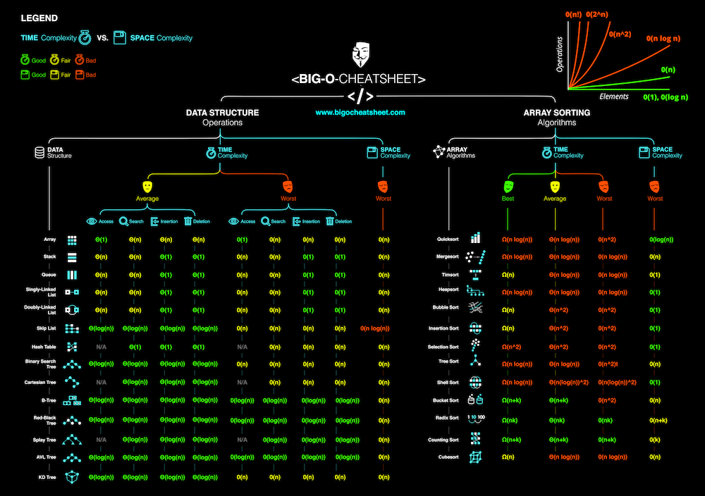
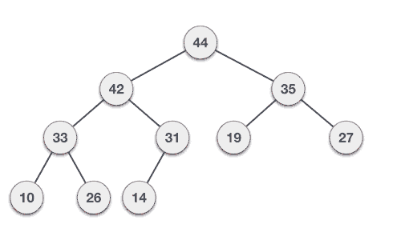

Data Structure and sorting charts
=================================

## Animation

#### Bubble Sort

#### Heap Sort

#### Insertion Sort

#### Max Heap

#### Max Heap deletion

#### Merge Sort

#### Quick Sort

1. Choose the highest index value has pivot
1. Take two variables to point left and right of the list excluding pivot
1. left points to the low index
1. right points to the high
1. while value at left is less than pivot move right
1. while value at right is greater than pivot move left
1. if both step 5 and step 6 does not match swap left and right
1. if left ≥ right, the point where they met is new pivot

#### Selection Sort

<!--Start Fragment-->