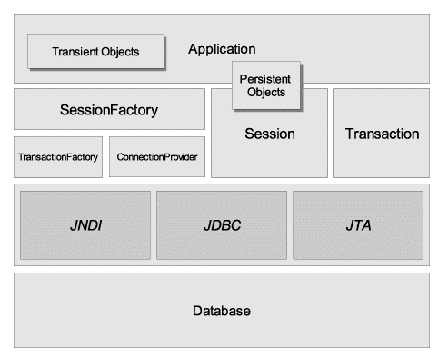
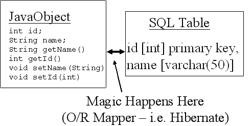
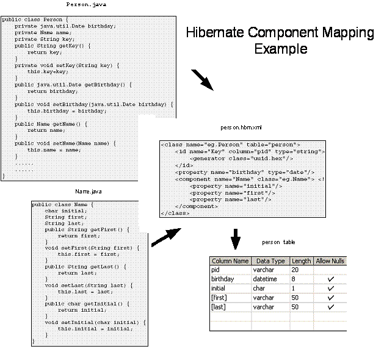

---
title: Hibernate
author: Manish
rights:  Creative Commons Non-Commercial Share Alike 3.0
language: en-US
...

## Hibernate 



is an Open Source Object Relational mapping tool which provides transparent persistence for POJOs. Object-relational mapping is used to map object-oriented programming objects to relational databases managed by Oracle, DB2, Sybase, and other relational database managers (RDBMSs). Hibernate is evolved from the JBoss core persistence framework.



`Other popular ORM solutions are iBatis, JDO and TopLink.`

#### Advantages of Hibernate:

- Retains natural object model (transparent)
- Minimizes Code
- Does not require a container
- Model is not tied to persistence implementation.
- Metadata controlled persistence
- Transparent - working with the model, not the data access technology
- Pooling, Caching, Transactions can all be handled outside of our code

Object/relational mappings are defined in an XML document. The mapping document is designed to be readable and hand-editable. The mapping language is Java-centric, meaning that mappings are constructed around persistent class declarations, not table declarations. Even though many Hibernate users choose to define XML mappings be hand, a number of tools exist to generate the mapping document, including XDoclet, Middlegen and AndroMDA.

Before we move to hibernate mapping here is a basic JDBC connection configured in hibernate.
```xml
<?xml version='1.0'>
<!DOCTYPE hibernate-configuration PUBLIC
'-//Hibernate/Hibernate Configuration DTD 3.0//EN'
'http://hibernate.sourceforge.net/hibernate-configuration-
3.0.dtd'>
<hibernate-configuration>
	<session-factory>
	<property name='connection.username'>uid</property>
	<property name='connection.password'>pwd</property>
	<property name='connection.url'>jdbc:mysql://localhost/db</property>
	<property name='connection.driver_class'>com.mysql.jdbc.Driver</property>
	<property name='dialect'>org.hibernate.dialect.MySQLDialect</property>
	<mapping resource='com/manning/hq/ch03/Event.hbm.xml'/>
	<mapping resource='com/manning/hq/ch03/Location.hbm.xml'/>
	<mapping resource='com/manning/hq/ch03/Speaker.hbm.xml'/>
	<mapping resource='com/manning/hq/ch03/Attendee.hbm.xml'/>
	</session-factory>
</hibernate-configuration>
```
To use Hibernate-provided JDBC connections, the configuration file requires the following five properties:

- connection.driver_class -The JDBC connection class for the specific database
- connection.url -The full JDBC URL to the database
- connection.username -The username used to connect to the database
- connection.password -The password used to authenticate the username
- dialect -The name of the SQL dialect for the database

A typical hibernate component mapping looks as this:
```xml
<?xml version='1.0'?>
<!DOCTYPE hibernate-mapping PUBLIC
		'-//Hibernate/Hibernate Mapping DTD 3.0//EN'
		'http://hibernate.sourceforge.net/hibernate-mapping-3.0.dtd'>
<hibernate-mapping package='com.manning.hq.ch03'>
	<class name='Event'table='events'>
		<id name='id'column='uid'type='long'unsaved-value='null'>
			<generator class='native'/>
		</id>
		<property name='name'type='string'length='100'/>
		<property name='startDate'column='start_date' type='date'/>
		<property name='duration'type='integer'/>
		<many-to-one name='location'column='location_id' class='Location'/>
		<set name='speakers'>
			<key column='event_id'/>
			<one-to-many class='Speaker'/>
		</set>
		<set name='attendees'/>
			<key column='event_id'/>
			<one-to-many class='Attendee'/>
		</set>
	</class>
</hibernate-mapping>
```

The mapping definition starts with the hibernate-mapping element. The package attribute sets the default package for unqualified class names in the mapping. With this attribute set, you need only give the class name for other persistent classes listed in the mapping file, such as the Speaker and Attendee classes. To refer to a persistent class outside the given package, you must provide the fully qualified class name within the mapping document.

If Hibernate has trouble locating a class because of a missing package on, for instance, a many-to-one element, Hibernate throws a MappingException. This doesn't mean that Hibernate can't find the actual class file, but that it isn't able to navigate from one mapping definition to another.

Immediately after the hibernate-mapping tag, you encounter the class tag. The class tag begins the mapping definition for a specific persistent class. The table attribute names the relational table used to store the state of the object. The class element has a number of attributes available, altering how Hibernate persists instances of the class.

The id element describes the primary key for the persistent class as well as how the key value is generated. Each persistent class must have an id element declaring the primary key for the relational table. Let's look at the id element:

```xml
<id name='id'column='uid'type='long'unsaved-value='null'>
	<generator class='native'/>
</id>
```
The name attribute defines the property in your persistent class that will be used to store the primary key value. The id element implies that the Event class has a property also named id:

	public Long getId(){
		return this.id;
	}
	public void setId(Long id){
		this.id =id;
	}

If the column for the primary key has a different name than your object property, the column attribute is used. For our example's purposes, this column name is uid . The values of the type and unsaved-value attributes depend on the generator used.

The generator creates the primary key value for the persistent class. Hibernate provides multiple generator implementations that use various methods to create primary key values. Some implementations increment a value stored in a shared database table, whereas others create hexadecimal strings. Another generator, called assigned, lets you generate and assign the object ID. The assigned generator allows applications to reuse legacy code, such as the UUID generator from an EJB application. A recent introduction is the select generator, which retrieves the primary key value by selecting a value from a database trigger. The generator type you choose determines its behavior based on the underlying database.

You've used the native generator class in mapping definitions. native generators provide portability for mapping documents since the framework can determine the generator method supported by the database. Generators using the native class will use identity or sequence columns depending on available database support. If neither method is supported, the native generator falls back to a high/low generator method to create unique primary key values. Databases supporting identity columns include Sybase, MySQL, Microsoft SQL Server, and IBM DB2. Oracle, PostgreSQL, and SAP DB support sequence columns.

The native generator returns a short, integer, or long value. You've set the type attribute to long, and the id property in the Event object has a type of java.lang.Long. The value of the type attribute and the property type in the object must be the same.

The different types of Id generators supported by hibernate are:

1. **increment**: It generates identifiers of type long, short or int that are unique only when no other process is inserting data into the same table. It should not the used in the clustered environment.
1. **identity**: It supports identity columns in DB2, MySQL, MS SQL Server, Sybase and HypersonicSQL. The returned identifier is of type long, short or int.
1. **sequence**: The sequence generator uses a sequence in DB2, PostgreSQL, Oracle, SAP DB, McKoi or a generator in Interbase. The returned identifier is of type long, short or int
1. **hilo**: The hilo generator uses a hi/lo algorithm to efficiently generate identifiers of type long, short or int, given a table and column (by default hibernate_unique_key and next_hi respectively) as a source of hi values. The hi/lo algorithm generates identifiers that are unique only for a particular database. Do not use this generator with connections enlisted with JTA or with a user-supplied connection.
1. **seqhilo**: The seqhilo generator uses a hi/lo algorithm to efficiently generate identifiers of type long, short or int, given a named database sequence.
1. **uuid**: The uuid generator uses a 128-bit UUID algorithm to generate identifiers of type string, unique within a network (the IP address is used). The UUID is encoded as a string of hexadecimal digits of length 32.
1. **guid**: It uses a database-generated GUID string on MS SQL Server and MySQL.
1. **native**: It picks identity, sequence or hilo depending upon the capabilities of the underlying database.
1. **assigned**: lets the application to assign an identifier to the object before save() is called. This is the default strategy if no element is specified.
1. **select**: retrieves a primary key assigned by a database trigger by selecting the row by some unique key and retrieving the primary key value.
1. **foreign**: uses the identifier of another associated object. Usually used in conjunction with a primary key association.

The unsaved-value attribute describes the value of the id property for transient instances of this class. The unsaved-value attribute affects how objects are stored. We'll discuss the impact of this attribute later in the article.

Properties Property elements for the Event object are similar to the id element:
```xml
<property name='name'type='string'length='100'/>
<property name='startDate'column='start_date'type='date'/>
<property name='duration'type='integer'/>
```
Each property element corresponds to a property in the Event object. The name attribute contains the property name, whereas the type attribute specifies the property object type. The column used to store the property value defaults to the property name. The column attribute overrides this default behavior, as shown in the startDate property.

If the type attribute is omitted, Hibernate determines the type using runtime reflection. In certain cases, you must provide the property type, since reflection may not be able to determine the desired type (such as differentiating between the Hibernate DATE and TIMESTAMP types). Valid property types include the Hibernate basic types, such as integer, string, and timestamp, as well as the corresponding Java objects and primitives. However, you aren't limited to basic data types.

The property element may also contain the name of a serializable Java class or a user-defined type. You create a new user-defined type by implementing either the org.hibernate.UserType or org.hibernate. CompositeUserType interface. The fully qualified class name of the user type or the serializable Java class is used as the property type value.

Hibernate supports different types of association and collection mappings. Download the sample source for each of the following mappings here.

1. Simple Association (one to one)
1. Simple Reference (many to one)
1. Proxies
1. Basic Collection (one to many)
1. Collection (many to many)
1. Collection (raw data)
1. Top-level Collections
1. Map
1. Entity Map
1. Subclasses
1. Joined Subclasses
1. Components
1. Collections of Components
1. Composite Id
1. Composite Index
1. Ternary Associations

#### Cascades

If you've worked with relational databases, you've no doubt encountered cascades. Cascades propagate certain operations on a table (such as a delete) to associated tables. (Remember that tables are associated through the use of foreign keys.) Suppose that when you delete an Event, you also want to delete each of the Speaker instances associated with the Event. Instead of having the application code perform the deletion, Hibernate can manage it for you.

Hibernate supports ten different types of cascades that can be applied to many-to-one associations as well as collections. The default cascade is none. Each cascade strategy specifies the operation or operations that should be propagated to child entities. The cascade types that you are most likely to use are the following:

- all -All operations are passed to child entities: save , update , and delete.
- save-update -Save and update ( and UPDATE , respectively) are passed to child entities.
- delete -Deletion operations are passed to child entities.
- delete-orphan -All operations are passed to child entities, and objects no longer associated with the parent object are deleted.

The cascade element is added to the desired many-to-one or collection element. For example, the following configuration instructs Hibernate to delete the child Speaker elements when the parent Event is deleted:

	<set name='speakers'cascade='delete'>
	  <key column='event_id'/>
	  <one-to-many class='Speaker'/>
	</set>

That's all there is to configuring cascades. It's important to note that Hibernate doesn't pass the cascade off to the database. Instead, the Hibernate service manages the cascades internally. This is necessary because Hibernate has to know exactly which objects are saved, updated, and deleted.

#### Fetching associated objects

When an object has one or more associated objects, it's important to consider how associated objects will be loaded. Hibernate 3 offers you two options. You can either retrieve associated objects using an outer join or by using a separate SELECT statement. The fetch attribute allows you to specify which method to use:

	<many-to-one name='location'class='Location'fetch='join'/>

When an Event instance is loaded, the associated Location instance will be loaded using an outer join. If you wanted to use a separate select, the many-to-one element would look like this:

	<many-to-one name='location'class='Location'fetch='select'/>

This also applies to child collections, but you can only fetch one collection using a join per persistent object. Additional collections must be fetched using the SELECT strategy.

If you're using Hibernate 2, the fetch attribute is not available. Instead, you must use the outer-join attribute for many-to-one associations. (There is no support for retrieving collections using a SELECT in Hibernate 2.) The outer-join attribute takes either a true or false value.

#### Building the SessionFactory
Hibernate's SessionFactory interface provides instances of the Session class, which represent connections to the database. Instances of SessionFactory are thread-safe and typically shared throughout an application. Session instances, on the other hand, aren't thread-safe and should only be used for a single transaction or unit of work in an application.

#### Configuring the SessionFactory
The Configuration class kicks off the runtime portion of Hibernate. It's used to load the mapping files and create a SessionFactory for those mapping files. Once these two functions are complete, the Configuration class can be discarded. Creating a Configuration and SessionFactory instance is simple, but you have some options. There are three ways to create and initialize a Configuration object.

This first snippet loads the properties and mapping files defined in the hibernate.cfg.xml file and creates the SessionFactory:
```java
Configuration cfg =new Configuration();
SessionFactory factory = cfg.configure().buildSessionFactory();
```
The configure() method tells Hibernate to load the hibernate.cfg.xml file. Without that, only hibernate.properties would be loaded from the classpath. The Configuration class can also load mapping documents programmatically:
```java
Configuration cfg = new Configuration();
cfg.addFile('com/manning/hq/ch03/Event.hbm.xml');
```
Another alternative is to have Hibernate load the mapping document based on the persistent class. This has the advantage of eliminating hard-coded filenames in the source code. For instance, the following code causes Hibernate to look for a file named com/manning/hq/ Event.hbm.xml in the classpath and load the associated class:
```java
Configuration cfg =new Configuration();
cfg.addClass(com.manning.hq.ch03.Event.class);
```
Since applications can have tens or hundreds of mapping definitions, listing each definition can quickly become cumbersome. To get around this, the hibernate.cfg.xml file supports adding all mapping files in a JAR file. Suppose your build process creates a JAR file named application.jar, which contains all the classes and mapping definitions required. You then update the hibernate.cfg.xml file:

	<mapping jar='application.jar'/>

Of course, you can also do this programmatically with the Configuration class:

	Configuration.addJar(new java.io.File('application.jar'));

Keep in mind that the JAR file must be in the application classpath. If you're deploying a web application archive (WAR) file, your application JAR file should be in the /WEB-INF/lib directory in the WAR file.

The four methods used to specify mapping definitions to the Hibernate runtime can be combined, depending the requirements for your project. However, once you create the SessionFactory from the Configuration instance, any additional mapping files added to the Configuration instance won't be reflected in the SessionFactory . This means you can't add new persistent classes dynamically.

You can use the SessionFactory instance to create Session instances:

	Session session =factory.openSession();

Instances of the Session class represent the primary interface to the Hibernate framework. They let you persist objects, query persistent objects, and make persistent objects transient. Let's look at persisting objects with Hibernate.

#### Persisting objects

Persisting a transient object with Hibernate is as simple as saving it with the Session instance:

	Event event = new Event();
	//populate the event
	Session session =factory.openSession();
	session.save(event);
	session.flush();

Calling save(...) for the Event instance assigns a generated ID value to the instance and persists the instance. (Keep in mind that Hibernate doesn't set the ID value if the generator type is assigned.) The flush() call forces persistent objects held in memory to be synchronized to the database. Session’s don't immediately write to the database when an object is saved. Instead, the Session queues a number of database writes to maximize performance.

If you would like to update an object that is already persistent, the update(...)method is available. Other than the type of SQL operation executed, the difference between save(...)and update(...)is that update(...)doesn't assign an ID value to the object. Because of this minor difference, the Session interface provides the saveOrUpdate(...) methods, which determine the correct operation to execute on the object. How does Hibernate know which method to call on an object?

When we described the mapping document, we mentioned the unsaved-value attribute. That attribute comes into play when you use the saveOrUpdate(...)method. Suppose you have a newly created Event instance. The id property is null until it's persisted by Hibernate. If the value is null, Hibernate assumes that the object is transient and assigns a new id value before saving the instance. A non-null id value indicates that the object is already persistent; the object is updated in the database, rather than inserted.

You could also use a long primitive to store the primary key value. However, using a primitive type also means that you must update the unsaved-value attribute value to 0, since primitive values can't be null.

Here's the necessary code to persist an Event instance:
```java
Configuration cfg =new Configuration();
SessionFactory factory =cfg.buildSessionFactory();
Event event =new Event();
//populate the Event instance
Session session =factory.openSession();
session.saveOrUpdate(event);
session.flush();
session.close();
```
The first two lines create the SessionFactory after loading the configuration file from the classpath. After the Event instance is created and populated, the Session instance, provided by the SessionFactory , persists the Event. The Session is then flushed and closed, which closes the JDBC connection and performs some internal cleanup. That's all there is to persisting objects.

Once you've persisted a number of objects, you'll probably want to retrieve them from the database. Retrieving persistent objects is the topic of the next section.

#### Retrieving objects

Suppose you want to retrieve an Event instance from the database. If you have the Event ID, you can use a Session to return it:

	Event event =(Event)session.load(Event.class,eventId);
	session.close();

This code tells Hibernate to return the instance of the Event class with an ID equal to eventId. Notice that you're careful to close the Session, returning the database connection to the pool. There is no need to flush the Session, since you're not persisting objects-only retrieving them. What if you don't know the ID of the object you want to retrieve? This is where HQL enters the picture.

The Session interface allows you to create Query objects to retrieve persistent objects. (In Hibernate 2, the Session interface supported a number of overloaded find methods. They were deprecated in Hibernate 3.) HQL statements are object-oriented, meaning that you query on object properties instead of database table and column names. Let’s look at some examples using the Query interface.

This example returns a collection of all Event instances. Notice that you don't need to provide a select ...clause when returning entire objects:

```java
Query query =session.createQuery('from Event');
List events =query.list();
```

This query is a little more interesting since we're querying on a property of the Event class:

```java
Query query =session.createQuery('from Event where name ='+”Opening Presentation”);
List events =query.list();
```

We've hardcoded the name value in the query, which isn't optimal. Let's rewrite it:
```java
Query query =session.createQuery('from Event where name =?', 'Opening Presentation');
query.setParameter(0,'Opening Presentation',Hibernate.STRING);
List events =query.list();
```
The question mark in the query string represents the variable, which is similar to the JDBC PreparedStatement interface. The second method parameter is the value bound to the variable, and the third parameter tells Hibernate the type of the value. (The Hibernate class provides constants for the built-in types, such as STRING , INTEGER , and LONG , so they can be referenced programmatically.)

One topic we haven't touched on yet is the cache maintained by the Session. The Session cache tends to cause problems for developers new to Hibernate, so we'll talk about it next.

#### The Session cache

One easy way to improve performance within the Hibernate service, as well as your applications, is to cache objects. By caching objects in memory, Hibernate avoids the overhead of retrieving them from the database each time. Other than saving overhead when retrieving objects, the Session cache also impacts saving and updating objects. Let's look at a short code listing:
```java
Session session =factory.openSession();
Event e = (Event)session.load(Event.class,myEventId);
e.setName('New Event Name');
session.saveOrUpdate(e);
//later,with the same Session instance
Event e = (Event)session.load(Event.class,myEventId);
e.setDuration(180);
session.saveOrUpdate(e);
session.flush();
```
This code first retrieves an Event instance, which the Session caches internally. It then does the following: updates the Event name, saves or updates the Event instance, retrieves the same Event instance (which is stored in the Session cache), updates the duration of the Event,and saves or updates the Event instance. Finally, you flush the Session.

All the updates made to the Event instance are combined into a single update when you flush the Session. This is made possible in part by the Session cache.

The Session interface supports a simple instance cache for each object that is loaded or saved during the lifetime of a given Session. Each object placed into the cache is keyed on the class type, such as The Session cache com.manning.hq.ch03.Event, and the primary key value. However, this cache presents some interesting problems for unwary developers.

A common problem new developers run into is associating two instances of the same object with the same Session instance, resulting in a NonUniqueObjectException. The following code generates this exception:

```java
Session session =factory.openSession();
Event firstEvent =(Event)session.load(Event.class,myEventId);
//...perform some operation on firstEvent
Event secondEvent =new Event();
secondEvent.setId(myEventId);
session.save(secondEvent);
```

This code opens the Session instance, loads an Event instance with a given ID, creates a second Event instance with the same ID, and then attempts to save the second Event instance, resulting in the Non-UniqueObjectException.

Any time an object passes through the Session instance, it's added to the Session’s cache. By passes through, we're referring to saving or retrieving the object to and from the database. To see whether an object is contained in the cache, call the Session.contains()method. Objects can be evicted from the cache by calling the Session.evict() method. Let's revisit the previous code, this time evicting the first Event instance:
```java
Session session = factory.openSession();
Event firstEvent = (Event)session.load(Event.class,myEventId);
//...perform some operation on firstEvent
if (session.contains(firstEvent)){
      session.evict(firstEvent);
}
Event secondEvent = new Event();
secondEvent.setId(myEventId);
session.save(secondEvent);
```
The code first opens the Session instance and loads an Event instance with a given ID. Next, it determines whether the object is contained in the Session cache and evicts the object if necessary. The code then creates a second Event instance with the same ID and successfully saves the second Event instance.

If you simply want to clear all the objects from the Session cache, you can call the aptly named Session.clear()method.

#### Connection pools

Connection pools are a common way to improve application performance. Rather than opening a separate connection to the database for each request, the connection pool maintains a collection of open database connections that are reused. Application servers often provide their own connection pools using a JNDI DataSource, which Hibernate can take advantage of when configured to use a DataSource.

If you're running a standalone application or your application server doesn't support connection pools, Hibernate supports three connection pooling services: C3P0, Apache's DBCP library, and Proxool. C3P0 is distributed with Hibernate; the other two are available as separate distributions.

When you choose a connection pooling service, you must configure it for your environment. Hibernate supports configuring connection pools from the hibernate.cfg.xml file. The connection.provider_class property sets the pooling implementation:
```xml
<property name='connection.provider_class'>
  org.hibernate.connection.C3P0ConnectionProvider
</property>
```
Once the provider class is set, the specific properties for the pooling service can also be configured from the hibernate.cfg.xml file:
```xml
<property name='c3p0.minPoolSize'>
  5
</property>
...
<property name='c3p0.timeout'>
  1000
</property>
```
As you can see, the prefix for the C3P0 configuration parameters is c3p0. Similarly, the prefixes for DBCP and Proxool are dbcp and proxool, respectively. Specific configuration parameters for each pooling service are available in the documentation with each service. Table 1 lists information for the supported connection pools.

Hibernate ships with a basic connection pool suitable for development and testing purposes. However, it should not be used in production. You should always use one of the available connection pooling services, like C3P0, when deploying your application to production.

If your preferred connection pool API isn't currently supported by Hibernate, you can add support for it by implementing the org.hibernate.connection.ConnectionProvider interface. Implementing the interface is straightforward.

##### Connection pooling services

| Pooling Service                                 | Provider Class                                     | Configuration Prefix                            |
| ----                                            | ----                                               | ----                                            |
| C3PO                                            | Apache DBCP                                        | Proxool                                         |
| org.hibernate.connection.C3P0ConnectionProvider | org.hibernate.connection.ProxoolConnectionProvider | org.hibernate.connection.DBCPConnectionProvider |
| c3p0                                            | Dbcp                                               | proxool                                         |

There isn't much to using a connection pool, since Hibernate does most of the work behind the scenes. The next configuration topic we’ll look at deals with transaction management with the Hibernate Transaction API.

#### Transactions

Transactions group many operations into a single unit of work. If any operation in the batch fails, all of the previous operations are rolled back, and the unit of work stops. Hibernate can run in many different environments supporting various notions of transactions. Standalone applications and some application servers only support simple JDBC transactions, whereas others support the Java Transaction API (JTA).

Hibernate needs a way to abstract the various transaction strategies from the environment. Hibernate has its own Transaction class that is accessible from the Session interface, demonstrated here:
```java
Session session =factory.openSession();
Transaction tx =session.beginTransaction();
Event event =new Event();
//...populate the Event instance
session.saveOrUpdate(event);
tx.commit();
```
In this example, factory is an initialized SessionFactory instance. This code creates an instance of the org.hibernate.Transaction class and then commits the Transaction instance.

Notice that you don't need to call session.flush(). Committing a transaction automatically flushes the Session object. The Event instance is persisted to the database when the transaction is committed. The transaction strategy you use (JDBC or JTA) doesn't matter to the application code-it's set in the Hibernate configuration file.

The transaction.factory_class property defines the transaction strategy that Hibernate uses. The default setting is to use JDBC transactions since they're the most common. To use JTA transactions, you need to set the following properties in hibernate.cfg.xml:
```xml
<property name='transaction.factory_class'>
    org.hibernate.transaction.JTATransactionFactory
</property>
<property name='jta.UserTransaction'>
    java:comp/UserTransaction
</property>
```
The transaction.factory_class property tells Hibernate that you'll be using JTA transactions. Currently, the only other option to JTA is JBDC transactions, which is the default. JTA transactions are retrieved from a JNDI URI, which is specified using the jta.User-Transaction property. If you don't know the URI for your specific application server, the default value is java:comp/UserTransaction.

There is some confusion about another property related to JTA transactions: transaction.manager_lookup_class. You only need to specify the manager lookup class when you're using a transactional cache. (We discuss caches in the next section–don't worry.) However, if you don't define the jta.UserTransaction property and transaction.manager_lookup_class is defined, the user transaction name in the lookup factory class is used. If neither of the properties are used, Hibernate falls back to java:comp/UserTransaction.

What's the benefit of using JTA transactions? JTA transactions are useful if you have multiple transactional resources, such as a database and a message queue. JTA allows you to treat the disparate transactions as a single transaction. Combining multiple transactions also applies within Hibernate. If you attempt to create multiple transactions from the same Session instance, all of the operations are batched into the first transaction. Let's look at an example that includes two transactions:
```java
Transaction tx0 =session.beginTransaction();
Event event =new Event();
//...populate the event instance
session.saveOrUpdate(event);
Transaction tx1 =session.beginTransaction();
Location location =new Location();
//...populate the Location instance
session.saveOrUpdate(location);
tx0.commit();
tx1.commit();
```
This example begins by creating a new transaction. The second use of session.beginTransaction()just returns the first transaction instance. session.saveOrUpdate(location)commits the first transaction, and tx0.commit()recommits the first transaction.

Although you explicitly create two Transaction objects, only one is used. Of course, this creates a problem. Let's assume you have a Session object being used by two application threads. The first application thread begins the JTA transaction and starts adding objects. Meanwhile, the second thread, using the same transaction, deletes an object and commits the transaction. Where does this leave the first thread?

The first thread won't be committed, which is what you'd expect. The problem is that this issue can be hard to debug, bringing up an important point: Sessions should be used by only one application thread at a time. This is a common concern in web applications, which are multithreaded by their very nature.

#### Cache providers

As we mentioned earlier, caching is a common method used to improve application performance. Caching can be as simple as having a class store frequently used data, or a cache can be distributed among multiple computers. The logic used by caches can also vary widely, but most use a simple least recently used (LRU) algorithm to determine which objects should be removed from the cache after a configurable amount of time.

Before you get confused, let's clarify the difference between the Session–level cache, also called the first–level cache, and what this section covers. The Session–level cache stores object instances for the lifetime of a given Session instance. The caching services described in this section cache data outside of the lifetime of a given Session. Another way to think about the difference is that the Session cache is like a transactional cache that only caches the data needed for a given operation or set of operations, whereas a second–level cache is an application-wide cache.

By default, Hibernate supports four different caching services. EHCache (Easy Hibernate Cache) is the default service. If you prefer to use an alternative cache, you need to set the cache.provider_class property in the hibernate.cfg.xml file:

	<property name='cache.provider_class'>
	  org.hibernate.cache.OSCacheProvider
	</property>

This snippet sets the cache provider to the OSCache caching service.

##### Caching Services Supported by Hibernate

| Caching Service | Provider Class                         | Type        |
| ----            | ----                                   | ----        |
| EHCache         | org.hibernate.cache.EhCacheProvider    | Memory,disk |
| OSCache         | org.hibernate.cache.OSCacheProvider    | Memory,disk |
| SwarmCache      | org.hibernate.cache.SwarmCacheProvider | Clustered   |
| TreeCache       | org.hibernate.cache.TreeCacheProvider  | Clustered   |

The caching services support the caching of classes as well as collections belonging to persistent classes. For instance, suppose you have a large number of Attendee instances associated with a particular Event instance. Instead of repeatedly fetching the collection of Attendee s, you can cache it. Caching for classes and collections is configured in the mapping files, with the cache element:
```xml
<class name='Event'table='events'>
    <cache usage='read-write'/>
    ...
</class>
    
Collections can also be cached:
    
<set name='attendees'>
    <cache usage='read-write'/>
    ...
</set>
```
Once you've chosen a caching service, what do you, the developer, need to do differently to take advantage of cached objects? Thankfully, you don't have to do anything. Hibernate works with the cache behind the scenes, so concerns about retrieving an outdated object from the cache can be avoided. You only need to select the correct value for the usage attribute.

The usage attribute specifies the caching concurrency strategy used by the underlying caching service. The previous configuration sets the usage to read–write , which is desirable if your application needs to update data. Alternatively, you may use the nonstrict–read–write strategy if it's unlikely two separate transaction threads could update the same object. If a persistent object is never updated, only read from the database, you may specify set usage to read-only.

Some caching services, such as the JBoss TreeCache, use transactions to batch multiple operations and perform the batch as a single unit of work. If you choose to use a transactional cache, you may set the usage attribute to transactional to take advantage of this feature. If you happen to be using a transactional cache, you'll also need to set the transaction.manager_lookup_class mentioned in the previous section.

The supported caching strategies differ based on the service used.

##### Supported Caching Service Strategies

| Caching    | Service Read-only | Read-write | Nonstrict-read-write | Transactional |
| -          | -                 | -          | -                    | -             |
| EHCache    | Y                 | Y          | Y                    | N             |
| OSCache    | Y                 | Y          | Y                    | N             |
| SwarmCache | Y                 | Y          | Y                    | N             |
| TreeCache  | Y                 | N          | N                    | Y             |

Clearly, the caching service you choose will depend on your application requirements and environment. Next, let's look at configuring EHCache.

##### Configuring EHCache

By now you're probably tired of reading about configuring Hibernate, but EHCache is pretty simple. It's a single XML file, placed in a directory listed in your classpath. You'll probably want to put the ehcache.xml file in the same directory as the hibernate.cfg.xml file.
```xml
ehcache.xml file
	
<ehcache>
	<diskStore path='java.io.tmp'/>
	<defaultCache
	maxElementsInMemory='10'
	eternal='false'
	timeToIdleSeconds='120'
	timeToLiveSeconds='120'
	overflowToDisk='true'/>
	<cache name='com.manning.hq.ch03.Event'
	maxElementsInMemory='20'
	eternal='false'
	timeToIdleSeconds='120'
	timeToLiveSeconds='180'
	overflowToDisk='true'/>
</ehcache>
```
In this example, the diskStore property sets the location of the disk cache store. Then, the listing declares two caches. The defaultCache element contains the settings for all cached objects that don't have a specific cache element: the number of cached objects held in memory, whether objects in the cache expire (if eternal is true , then objects don't expire), the number of seconds an object should remain the cache after it was last accessed, the number of seconds an object should remain in the cache after it was created, and whether objects exceeding maxElementsInMemory should be spooled to the diskStore. Next, for custom settings based on the class, the code defines a cache element with the fully qualified class name listed in the name attribute. (This listing only demonstrates a subset of the available configuration for EHCache. Please refer to the documentation found at http:// ehcache.sf.net for more information.)

#### Inheritance

Inheritance is a fundamental concept of object-oriented languages. Through inheritance, objects can inherit the state and behavior of their ancestor, or superclass. The most common use of object inheritance in applications is to create a generic base type with one or more specialized subclasses. Persisting a class hierarchy can be difficult, since each hierarchy can have its own unique requirements.

To address the problems found in hierarchy persistence, Hibernate supports three different inheritance persistence strategies:

- Table per class hierarchy
- Table per subclass
- Table per concrete class

Each mapping strategy is incrementally more complicated. In the following sections, we‘ll discuss the first two inheritance strategies. We've never needed to use the third, and most complicated, strategy.

##### Table per class hierarchy

This strategy is the most basic and easiest to use. All the classes in the hierarchy are stored in a single table. Suppose you have the base Event class, with ConferenceEvent and NetworkingEvent as subclasses. The mapping definition for this hierarchy is shown in listing 6.

Listing 6. Table per class hierarchy mapping
```xml
<class name='Event'table='events'discriminator-value='EVENT'>
	<id name='id'type='long'>
		<generator class='native'/>
	</id>
	<discriminator column='event_type' type='string' length='15'/>
	...
	<subclass name='ConferenceEvent' discriminator-value='CONF_EVENT'>
		<property name='numberOfSeats' column='num_seats'/>
		...
	</subclass>
	<subclass name='NetworkingEvent' discriminator-value='NET_EVENT'>
		<property name='foodProvided' column='food_provided'/>
		...
	</subclass>
</class>
```
We've introduced a few new features in the mapping definition. The most important is the inclusion of the discriminator element. The discriminator column is what Hibernate uses to tell the different sub-classes apart when retrieving classes from the database. If you don't specify a discriminator value, Hibernate uses the object's class name. The discriminator element in the example mapping tells Hibernate to look in the event_type column for a string describing the class type.

The discriminator is only a column in the relational table-you don't need to define it as a property in your Java object.

The subclass element contains the properties and associations belonging to the subclass. Any association element is allowed between sub- class tags. You can't have an id element or a nested subclass element.

The table per class hierarchy strategy requires a single table, events, to store the three types of Event instances.

As you can see, one table contains the fields for all the objects in the hierarchy. The only obvious limitation is that your subclasses can‘t have columns declared as NOT NULL. Subclasses can't have non-null attributes because inserting the superclass, which doesn‘t even have the non-null attribute, will cause a null column violation when it‘s inserted into the database. The next inheritance strategy, table per sub-class, doesn't have this limitation.

##### Table per subclass

Instead of putting all the classes into a single table, you can choose to put each subclass into its own table. This approach eliminates the discriminator column and introduces a one-to-one mapping from the sub-class tables to the superclass table. The mapping definition for this strategy is shown in listing 7.

Table-per-subclass mapping
```xml
<class name='Event'table='events'>
	<id name='event_id'type='long'>
		<generator class='native'/>
	</id>
	<joined-subclass name='ConferenceEvent'table='conf_events'>
		<key column='event_id'/>
		...
	</joined-subclass>
	<joined-subclass name='NetworkingEvent'table='net_events'>
		<key column='event_id'/>
		...
	</joined-subclass>
</class>
```
The joined-subclass element can contain the same elements as the subclass element. The key element contains the primary key associa-tion to the superclass, Event.

	<many-to-one class='Event'column='event'/>

##### Table per concrete class

Since this association can refer to any class in the Event hierarchy, the association is referred to as a polymorphic association. You can also create a concrete association by giving the name of the specific subclass:

	<many-to-one class='NetworkingEvent'column='event'/>

#### Simple Association (one-to-one)

Definition: Our first relationship is a simple association. In this relationship, one first-rank class holds a reference to a single instance of another first-rank class and they are related by a common PK.

Scenario: We have two first-rank classes, Foo and Bar which are related to each other as follows:

	Bar Foo.getBar() // returns corresponding Bar instance

Hibernate Mapping: In Hibernate, this could be mapped as follows:

	<class name='Foo' table='foo'
	    ...
	    <one-to-one name='bar' class='Bar'/>
	</class>

Table Schema:

| Foo |
| -   |
| id  |

| Bar |
| -   |
| id  |

No extra columns are needed to support this relationship. Instead both Foo and Bar must share the same PK values to be part of a one-to-one assocation.

If you create suitable instances of Foo and Bar with a shared PK, then retrieving a Foo will automatically retrieve the corresponding Bar.

Bidirectionality: This relationship can be bidrectional, with Bar having getFoo(), by simply adding a similar mapping and Foo property to Bar.

#### Simple Reference (many-to-one) 

Definition: A many-to-one reference is analogous to a simple Java reference. It is the same as the one-to-one situation except there is no requirement to have a shared PK. Instead a FK is used.

Scenario: We have two first-rank classes, Foo and Bar which are related to each other as follows:

	Bar Foo.getBar() // returns corresponding Bar instance

Hibernate Mapping: In Hibernate, this could be mapped as follows:

	<class name='Foo' table='foo'>
	     ...
	     <many-to-one name='bar' class='Bar' column='bar_id'/>
	</class>

Table Schema:

| Foo |        |
| -   | -      |
| id  | bar_id |

| Bar |
| -   |
| id  |

Now we have created an extra column in Foo's table which holds the FK to Bar. Foo and Bar can have completely different PKs and the relationship will still hold.

Bidirectionality: This relationship can be declared both ways, with Bar having getFoo(), by simply adding a similar mapping and property to Bar. This will result in Bar's table getting an extra column foo_id.


#### Proxies

An object proxy is just a way to avoid retrieving an object until you need it. Hibernate 2 does not proxy objects by default. However, experience has shown that using object proxies is preferred, so this is the default in Hibernate 3.

Object proxies can be defined in one of two ways. First, you can add a proxy attribute to the class element. You can either specify a different class or use the persistent class as the proxy. For example:

	<class name='Location' proxy='com.manning.hq.ch03.Location'...>...

The second method is to use the lazy attribute. Setting lazy='true'is a shorthand way of defining the persistent class as the proxy. Let's assume the Location class is defined as lazy:

	<class name='Location'lazy='true'...>...

The lazy attribute is true by default in Hibernate 3. An easy way to disable all proxies, including lazy collections, is to set the default-lazy attribute to true in the hibernate-mapping element for a given mapping file. Let's look at an example of using a proxied Location instance:

	Session session = factory.openSession(); 
	Event ev = (Event)session.load(Event.class,myEventId); 
	Location loc = ev.getLocation(); 
	String name = loc.getName(); 
	session.close();

The returned Location instance is a proxy. Hibernate populates the Location instance when getName()is called.

You'll be dealing with a proxy of Location generated by CGLIB until you call an instance method. (CGLIB is a code generation library used by Hibernate. You can find out more about it at http://cglib.sourceforge.net/.) What happens when you retrieve the Event instance from the database? All the properties for the Event are retrieved, along with the ID of the associated Location instance. The generated SQL looks something like this:

	select event0_.id as id0_,event0_.name as name0_,event0_.location_id as location_id0_from events event0_where event0_.id=?

When you call loc.getName(), the following generated SQL is executed:

	select location0_.id as id0_as id0_,location0_.name as name0_from locations location0_where location0_.id=?

If you've guessed that you can call loc.getId()without invoking a call to the database, you're correct. The proxied object already contains the ID value, so it can be safely accessed without retrieving the full object from the database.

#### Basic Collection (one-to-many) 

Definition: A one-to-many reference is basically a collection. Here a first-rank class, A, holds a reference to a collection of another first-rank class, B.

Scenario: We have two first-rank classes, Foo and Bar which are related to each other as follows:

	Set Foo.getBars() // returns a collection of Bar instances

Hibernate Mapping: In Hibernate, this could be mapped as follows:

	<class name='Foo' table='foo'>
	    ...
	    <set role='bars' table='bar'>
	        <key column='foo_id'/>
	        <one-to-many class='Bar'/>
	    </set>
	</class>

NB: We will mostly use type collections in these examples except where we are examining specific collection-type features. Please refer to the hibernate documentation to learn about the comprehensive set of collection types available.

Table Schema:

| Foo |
| -   |
| id  |


| Bar |        |
| -   |  -     |
| id  | foo_id |


Now we have created an extra column in Bar's table which holds the FK to Foo. This allows Foo to be assigned a collection of Bars based on the value of the foo_id column in Bar.

Bidirectionality: This relationship can be declared both ways, with Bar having getFoo(), by suitable code changes to Bar and the following schema change:

	<class name='Bar' table='bar'>
	    ...
	    <many-to-one name='foo' class='Foo' column='foo_id'/>
	</class>

Now your Bars will know who their Foo is. NB: No extra columns are generated for the bidirectionality. 


#### Collection (many-to-many) 

Definition: A many-to-many reference is basically a collection. First-rank class A holds a reference to a set of first-rank class B instances (as in the one-to-many case), but B might have multiple A's.

Scenario: We have two first-rank classes, Foo and Bar which are related to each other as follows:

	Set Foo.getBars() // returns a collection of Bar instances

Hibernate Mapping: In Hibernate, this could be mapped as follows:
```xml
<class name='Foo' table='foo'>
     ...
     <set role='bars' table='foo_bar'>
           <key column='foo_id'/>
           <many-to-many column='bar_id' class='Bar'/>
     </set>
</class>
```
Table Schema:

| Foo |
| -   |
| id  |


| Bar |
| -   |
| id  |


| Foo_Bar |        |
| -       | -      |
| foo_id  | bar_id |


This time we cannot have an extra column on Bar as that would dictate that each Bar has only one Foo. So instead we have an extra table, foo_bar, which holds the relationship between instances. 

**Bidirectionality**: 
This relationship can be declared both ways, with Bar having getFoos(), by suitable code changes to Bar and the following schema change:
```xml
<class name='Bar' table='bar'>
     ...
     <set role='foos' table='foo_bar'>
           <key column='bar_id'/>
           <many-to-many column='foo_id' class='Foo'/>
     </set>
</class>
```
Now your Bars will know who their Foos are. NB: No extra columns are generated for the bidirectionality.

If you want independent collections of Foos on Bars and Bars on Foos (i.e. membership one way doesn't imply the other), you need to declare Bar's table to be bar_foo. That way an independent table will be used to keep track of the Foo set on Bar.

 
#### Collection (raw data) 

Definition: A raw data collection is a collection on a first-rank class that contains second-rank classes. First- rank class A holds a reference to a set of second-rank class B instances. This is not limited to full classes - B could even be of primitive type. 

Scenario: We have one first-rank class, Foo, and a collection of Strings (e.g. people's names)

	Set Foo.getPeople() // returns a collection of String instances

Hibernate Mapping: 
In Hibernate, this could be mapped as follows:
```xml
<class name='Foo' table='foo'>
     ...
     <set role='people' table='Person'>
           <key column='foo_id'/>
          <element column='name' type='string'/>
     </set>
</class>
```
Table Schema:

| Foo |
| -   |
| id  |


| Person |      |
| -      |      |
| foo_id | name |


Note that Person does not represent a first-rank class. It is simply a collection of second-rank persistent data - in this case String objects. 

**Bidirectionality**: 
There's no bidirectional relationship available here as there is only one first-rank class involved.

 
#### Top-level Collections 

Definition:  A top-level collection is a collection defined outside of the scope of an individual class and available for use in all classes in the mapping files. 

Scenario: We have one first-rank class, Foo, and a collection of Strings (e.g. people's names) which we wish to make available to other classes without constantly declaring set definitions inside each one.

	Set Foo.getNames() // returns a collection of String instances

Hibernate Mapping: 
In Hibernate, this could be mapped as follows:
```xml
<set role='names' table='names'>
    <key column='id' type='string'>
    <generator class='uuid.hex'/> </key>
    <element column='name' type='string'/>
</set>

<class name='Foo' table='foo'>
    ...
    <collection name='names' column='name_id' role='names'/>
</class>
```
Note that a top-level collection needs its own key generator, and that this cannot be of the assigned type since it is never exposed to a calling application. 

Table Schema:

| Foo |           |
| -   |           |
| id  | person_id |


| Person |      |
| -      |      |
| id     | name |

Again, Person does not represents a first-rank class. It is simply a collection of second-rank persistent objects - in this case Strings. Note also that Names simply has id not foo_id. This is to allow it to be used by a variety of first-rank classes. Also, because we cannot use Person's id as a foo_id, we have added a person_id FK to Foo. 

**Bidirectionality**: 
There's no bidirectional relationship available here as there is only one first-rank class involved.


#### Map 

Definition: A map is a simple name-value pair list stored on a first rank collection.

Scenario: First rank class Foo has a map containing people's ages indexed by their names

	Map Foo.getAges() // returns a collection of String name-value pairs

Hibernate Mapping: In Hibernate, this could be mapped as follows:
```xml
<class name='Foo' table='foo'>
    ...
    <map role='ages'>
        <key column='id'/>
        <index column='name' type='string'/>
        <element column='age' type='string'/>
    </map>
</class>
```
Table Schema:

| Foo |
| -   |
| id  |


| Ages |      |     |
| -    |      |     |
| id   | name | age |


A simple extra table, Ages, is used to store the name and age string-value pair. Note that the map needs its own identity column too: id. 

**Bidirectionality**: 
Bidirectionality has no meaning for a map.

 
#### Entity Map 

Definition: An entity map is a map who is keyed by an entity class (i.e. First-rank) rather than a simple property. 

Scenario: Foo holds a Map of people's ages. This map is keyed by the Name entity class. Name holds a person's name as a string property.

	Map Foo.getAges()     //  returns a collection of Person-String instances

Hibernate Mapping: 
In Hibernate, this could be mapped as follows:
```xml
<class name='Foo' table='foo'>
	...
	<map role='ages'>
		<key column='id'/>
		<index-many-to-many column='person_id' class='Person'/>
		<element column='age' type='string'/>
	</map>
</class>

<class name='Person' table='person'>
	...
	<property name='name' column='name' type='string'/>
</class>	
```
Table Schema:

| Foo |
| -   |
| id  |


| Person |      |
| -      |      |
| id     | name |


| Ages |           |     |
| -    |           |     |
| id   | person_id | age |


As for the normal map a simple extra table, Ages, is used to store the Person FK and age data. 

**Bidirectionality**: 
Bidirectionality has no meaning for an entity map

#### Subclasses 

Definition: Subclasses are first-rank classes that extend another first-rank class in a standard OO inheritance relationship. 

Scenario: We have one first-rank class, Foo, and another first-rank class, Bar, which is a subclass of Foo.

	public class Bar extends Foo // Bar is a subclass of Foo


Hibernate Mapping: 
In Hibernate, this could be mapped as follows:
```xml
<class name='Foo' table='foo'  discriminator-value='F'>
	...
	<discriminator column='class'/>
	...
	<subclass name='subclass.Bar' discriminator-value='B'>
			<property name='name' column='name' type='string'/>
	</subclass>
</class>
```
Table Schema:

| Foo |       |      |
| -   |       |      |
| id  | class | name |


The class field holds a discriminator value. This value tells Hibernate which Java class to instantiate on loading. The subclass, Bar, has its properties stored in the Foo table. 

NB: In this case we've used one table per class hierarchy. An alternative would be one table per concrete class. We could map that by simply including two class definitions and repeating the attributes of Foo in the Bar definition. 

**Bidirectionality**: 
Inheritance relationships are only unidirectional in Java. A child can determine its parent class but the reverse has no meaning.

 
#### Joined Subclass 

Definition: Joined subclasses are those that are mapped to a table-per-subclass design rather than a table-per-hierarchy. 

Scenario: We have one first-rank class, Foo, and another first-rank class, Bar, which is a subclass of Foo.

	public class Bar extends Foo // Bar is a subclass of Foo

Hibernate Mapping: 
In Hibernate, this could be mapped as follows:
```xml
<class name='Foo' table='foo'>
	...
	<property name='name' column='name' type='string'
	<joined-subclass name='subclass.Bar' table='bar'>
			<key column='foo_id'/>
			<property name='age' column='age' type='string'/>
	</joined-subclass>
</class>
```

Table Schema:

| Foo |      |
| -   |      |
| id  | name |


| Bar    |     |
| -      |     |
| foo_id | age |


Here Bar inherits from Foo and so is joined using the PK foo_id and adds the extra data column age. 

**Bidirectionality**: 
Inheritance relationships are only unidirectional in Java. A child can determine its parent class but the reverse has no meaning.


#### Component

A typical component mapping looks as this:



Definition: Components are Java classes that are populated from selected columns of a parent class' table. This allows second-rank classes to exist within a first-rank class whilst still mapping to a single table for efficiency.

Scenario: We have one first-rank class, Foo, and a second-rank class, FooSecond.

FooSecond Foo.getSecond() // returns enclosed second-rank instance

Hibernate Mapping: In Hibernate, this could be mapped as follows:
```xml
<class name='Foo' table='foo'>
		...
		<component name='second' class='FooSecond'>
			<property name='firstName'/>
			<property name='lastName'/>
		</component>
</class>
```
Table Schema:

| Foo |           |          |
| -   |           |          |
| id  | firstName | lastName |


Here, Foo is mapped using id from table Foo. FooSecond is mapped from the same table using firstName and lastName. 

**Bidirectionality**: 
There's no bidirectional relationship available here as there is only one first-rank class involved.


#### Collections of Components 

Definition: Collections of components are also possible. These can be especially useful when dealing with a complex top-level collection.

Scenario: We have one first-rank class, Foo, and a top-level collection of second-rank class FooSecond which Foo holds.

	Set Foo.getSeconds() // returns a collection of FooSecond instances

Hibernate Mapping: In Hibernate, this could be mapped as follows:
```xml
<set role='seconds'>
		<key column='id' type='string'>
			<generator class='uuid.hex'/>
		</key>
		<composite-element class='FooSecond'>
			<property name='firstName'/>
			<property name='lastName'/>
		</composite-element>
</set>

<class name='Foo' table='foo'> ...
		<collection name='seconds' column='seconds_id' role='seconds'/>
</class>
 ```

Table Schema:

| Foo |            |
| -   |            |
| id  | seconds_id |


| Seconds |           |          |
| -       |           |          |
| id      | firstName | lastName |


This time we have two tables. Foo has a seconds_id FK column and Seconds appears as a collection table in its own right. The table structure is the same as for a standard top-level collection, but this time Seconds is being treated as a component object - a composite of two columns in the collection table - and set as a single property of Foo. 

**Bidirectionality**: 
There's no bidirectional relationship available here as there is only one first-rank class involved.

 
#### Composite Id 

Definition: Composite Identifiers are PK identifiers for first-rank classes that consist of more than one column. 

Scenario: Foo has a primary key that is of type Person. Person is made up of a String name and an Address type.

	Person Foo.getId()   // PK is multi-column mapped 

Hibernate Mapping: 
In Hibernate, this could be mapped as follows:

```xml
<class name='Foo' table='foo'>
	<composite-id name='id' class='Person'>
		<key-property name='name' type='string' column='name'/>
		<key-many-to-one name='address' class='Address' column='addr_id'/>
	</composite-id>
	<property name='age' column='age' type='string'/>
</class>

<class name='Address' table='address'>
	...
</class>
```
Foo has a composite id of type Person. This is mapped to two columns: 1) Name, 2) a many-to-one relationship with the Address class. 

	Either <key-property> or <key-many-to-one> declarations may exist within a composite id. 

Table Schema:

| Foo  |         |     |
| -    |         |     |
| name | addr_id | age |


| Address |
| -       |
| id      |


So Foo has two PK-columns: addr_id and name. These are combined to initialise Person instances. 

**Bidirectionality**: 
Bidirectionality has no meaning here.

 
#### Composite Index 

Definition: A Composite Index is used to provide a multi-column Map key. The semantics are very similar to Composite Id. 

Scenario: Foo contains a map of ages (strings). The map is keyed by Person, where Person is mapped as a String column (name) and Address instance.

	Map Foo.getAges()   // Foo contains a map of ages, keyed by Person

Hibernate Mapping: 
In Hibernate, this could be mapped as follows:
```xml
<class name='Foo' table='foo'>
	...
	<map role='ages'>
		<key column='id'/>
		<composite-index class='Person'>
			<key-property name='name' type='string' column='name'/>
			<key-many-to-one name='address' class='Address' column='addr_id'/>
		</composite-index>
		<element column='age' type='string'/>
	</map>
</class>

<class name='Address' table='address'>
	...
</class>
```

Table Schema:

| Foo |
| -   |
| id  |


| Ages |      |         |     |
| -    |      |         |     |
| id   | name | addr_id | age |

 
| Address |
| -       |
| id      |


Here the table Ages is created to hold the map. The key is made up of the columns name and addr_id which are used to map Person keys. The age field holds the map value. Finally, the map table needs its own id which is stored in the id field. 

**Bidirectionality**: 
Bidirectionality has no meaning here.


#### Ternary Associations (and beyond) 

Definition: Ternary associations are those that involve three first-rank classes. First-rank classes A, B and C are associated together in a relationship. 

Scenario: We have first-rank classes Foo, Bar and Snafu which are all related together. We choose to store their relationship in Foo using a composite class BarSnafu:

- Bar   BarSnafu.getBar()    // Retrieve Bar from BarSnafu
- Snafu BarSnafu.getSnafu()  // Retrieve Snafu from BarSnafu
- Set   Foo.getBarSnafus()   // Retrieve set of BarSnafus from Foo

Hibernate Mapping: 
In Hibernate, this could be mapped as follows:
```xml
<class name='Foo' table='foo'>
	...
	<set role='barsnafus' table='foo_bar_snafu'>
		<key column='foo_id'/>
		<composite-element class='BarSnafu'>
			<many-to-one name='bar' class='Bar' column='bar_id'/>
			<many-to-one name='snafu' class='Snafu' column='snafu_id'/>
		</composite-element>
	</set>
</class>
...
```

Table Schema:

| Foo |
| -   |
| id  |


| Bar |
| -   |
| id  |


| Snafu |
| -     |
| id    |


| Foo_Bar_Snafu |        |          |
| -             | -      | -        |
| foo_id        | bar_id | snafu_id |


So here we've got three first-rank classes. They are related together in table foo_bar_snafu. The result is stored as a set of BarSnafu instances on each Foo. Each BarSnafu instance references one Bar and one Snafu. 

Simple huh? 

NB: Using composite elements we can go beyond this and support 4 and more elements in a relationship. 

**Bidirectionality**: 
Bidirectionality has no meaning for a ternary relationship.


**Transient** - an object is transient if it has just been instantiated using the new operator, and it is not associated with a HibernateSession. It has no persistent representation in the database and no identifier value has been assigned. Transient instances will be destroyed by the garbage collector if the application does not hold a reference anymore. Use the Hibernate Session to make an object persistent (and let Hibernate take care of the SQL statements that need to be executed for this transition).

- Persistent - a persistent instance has a representation in the database and an identifier value. It might just have been saved or loaded, however, it is by definition in the scope of a Session. Hibernate will detect any changes made to an object in persistent state and synchronize the state with the database when the unit of work completes. Developers do not execute manual UPDATEstatements, or DELETE statements when an object should be made transient.
- Detached - a detached instance is an object that has been persistent, but its Session has been closed. The reference to the object is still valid, of course, and the detached instance might even be modified in this state. A detached instance can be reattached to a new Session at a later point in time, making it (and all the modifications) persistent again. This feature enables a programming model for long running units of work that require user think-time. We call them application transactions, i.e., a unit of work from the point of view of the user.


