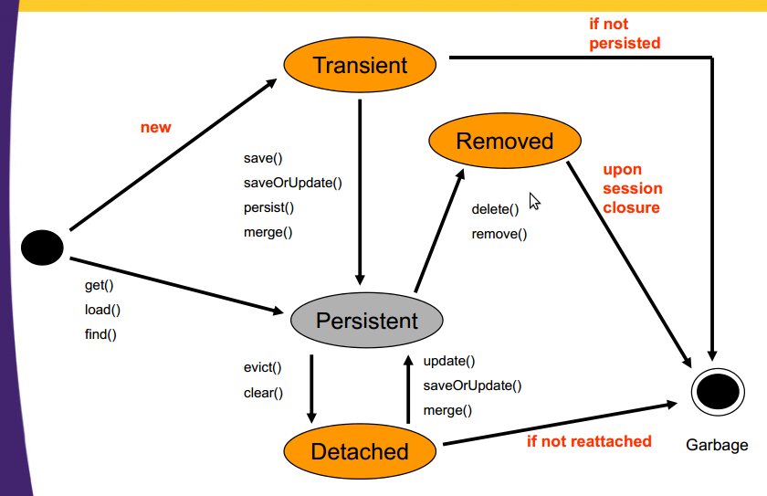

---
title: Hibernate
author: Manish
rights:  Creative Commons Non-Commercial Share Alike 3.0
language: en-US
...

HIBERNATE EXTENDED
==============

So far, we've been pretty focused on annotating JavaBeans, and invoking methods on some of the core Hibernate classes such as the Session and SessionFactory objects, to help us perform the basic CRUD operations. However, we haven't really discussed how Hibernate works, and what's going on when a JavaBean touches the Hibernate Session, or for that matter, what happens to instantiated objects when a transaction is committed, or the Hibernate Session goes out of scope. Well, with the experience we've had working with Hibernate, I think it's about time we delved a little deeper into how Hibernate works, and thought a little bit about what exactly is going on when we interact with the Hibernate framework.

### Thinking about Transient Instances

Let's start off with the basics. Now imagine you have a JPA annotated User class, and you create an instance of it using the following code:

	User u = new User();

Will Hibernate automatically persist this object, given just this line of code alone? Of course not! When you create an object in your Java code, even if your application does use the Hibernate framework for persistence, the newly created instance will exist only in the memory of the Java program that created it, and Hibernate has nothing to do with it. In fact, there's a special term we use to describe objects in Java programs that have been instantiated, but have not been placed under the spell of the Hibernate Session; such instances are referred to as transient instances, as their state is never persisted to the database.

### From Transient to Persistent

tran-sient [tran-shuhnt, -zhuhnt, -zee-uhnt] adjective 1. not lasting, enduring, or permanent; transitory. 2. lasting only a short time; existing briefly; temporary: transient authority. 3. staying only a short time

**transient instance**: a transient instance is one that is instantiated within a Java program, but is not managed by, or connected in any way to a Hibernate Session. Furthermore, transient objects do not have any existing representation in a database.

Now, if you create an instance of a class in your Java code, and you want Hibernate to manage the persistent state of that object, you have to associate you're newly created instance with the magical Hibernate Session. There are a number of ways to do this, with the easiest probably being to simply pass the Java instance to the saveOrUpdate method of the Hibernate Session.

	User u = new User(); // transient at this point
	session.saveOrUpdate(u); // no longer transient

Once an instance of a JavaBean has been associated with the Hibernate Session, it is no longer a transient instance, but instead, becomes what we call a persistent object, and the persistent state of the instance is then managed by the Hibernate Session for the duration of the transaction.

Now, that previous sentence was quite a mouthful, especially the part about the duration of the transaction. You see, whenever you want to perform any of the basic CRUD operations, you must first initiate a transaction, and when you are done, you must close the transaction. Don't let anyone tell you differently; that's the way database operations work.

#### The Transactional Context

As I said, any time you want Hibernate to manage the persistence of your JavaBeans, you must first initiate a transaction, which is just a simple method call on the Hibernate Session.

	hibernateSession.beginTransaction();

Once you being a transaction, you can start associating your POJOs and JavaBeans with the Hibernate Session. If you don't initiate a transaction, you'll get a runtime exception telling you about no transactional context being in existence, and at all costs, we want to avoid runtime exceptions.

Now, the really cool thing about Hibernate is the fact that once a transaction has been started, all you have to do is associate an instance with the Session, and then Hibernate will take care of fully managing the persistent state of that instance, right up to and including the point where you commit the transaction. When you finally commit the transaction, the state of all of the POJO's that have been associated with the Hibernate Session will be saved to the database.

The following snippet of code demonstrates the art of beginning a transaction, creating an instance, associating that instance with the Hibernate Session, and then finally, committing the transaction:

	hibernateSession.beginTransaction();
	User user = new User();
	hibernateSession.saveOrUpdate(user);
	hibernateSession.getTransaction().commit();

In this code snippet, a new transaction is created, after which a brand new, unassociated, transient instance of a User is created. This instance is then associated with the Hibernate Session when it is passed as an argument to the saveOrUpdate() method of the session, transitioning the instance from being a transient instance, to a persistent instance.

#### Affection for the saveOrUpdate Method

Now, I don't actually like the saveOrUpdate method. I mean, I love using it, but I don't really like the name, because I think the name is a little bit misleading as it implies that an instance that is passed to the method will be saved, or updated, immediately. You see, that's only partly true. Sure, when the saveOrUpdate method is invoked, the instance will eventually have its state persisted to the database, but more happens that just that. The instance in not only queued up for a database save, but the Hibernate Session keeps track of that instance, and if any further changes happen to the instance before the transaction is committed, then those changes to the instance's state will be persisted as well. I'd almost prefer it if the saveOrUpdate method was renamed to something more descriptive likesaveOrUpdateAndAssociateInstanceWithSession, but then again, I guess there is an upper limit on how long good method names should be.

Take a look at the following code snippet:
```java
	Session session=HibernateUtil.beginTransaction();
	User user = new User();
	user.setPassword('abc123');
	session.save(user);

	user.setLoginName('mj');
	user.setPassword('abc123');
	user.setEncryptedPassword('zab012');
	user.setEmailAddress('mj@scja.com');
	user.setLastAccessTime(new java.util.Date());
	user.setRegistrationDate(new java.util.GregorianCalendar());
	user.setVerified(Boolean.FALSE);

    HibernateUtil.commitTransaction();
```
Notice that in this code snippet, an instance of the user class is created, the password is set to abc123, and then the save method of the Hibernate Session is passed the instance. The call to the save method triggers the following SQL statement to be executed against the database:

	insert into examscam.user (emailAddress, lastAccessTime, login_name, password, registrationDate, verified) values (?, ?, ?, ?, ?, ?)

So, when the save method is invoked on the Hibernate Session, the state of the instance, which is really nothing more than a primary key and a password in this example, is persisted to the database. But look at the original code snippet, and see what happens after the save method is invoked. A bunch of other properties of the User instance are modified, and then the transaction is committed. The question is, will these changes to the state of the User instance be persisted to the database, or will the database only contain the primary key and the password once the transaction is committed? Well, in fact, all of the changes to the instance that took place even after the save method was invoked on the Hibernate Session will be persisted to the database. As the transaction is committed, Hibernate will issue the following SQL statement against the database:

    update examscam.user set emailAddress=?, lastAccessTime=?, login_name=?, password=?, registrationDate=?, verified=? where id=?

You see, that's the great thing about Hibernate: as soon as an instance is associated with the Session, be it through a load, get, update or save invocation, the state of that instance will be managed by Hibernate right up to the point in which the current transaction is committed. Hibernate will keep track of any changes that happen to the instance throughout the course of the transaction, and update the corresponding record in the database accordingly.

##### Proper Hibernate Coding Practices

I often see developers that are new to Hibernate constantly calling the saveOrUpdate method whenever a set of changes have been made to a POJO. This isn't necessary. You only have to associate an instance with the Hibernate Session once within the scope of a transaction. From that point on, you can do whatever you want to your JavaBean instances. Hibernate will persist the final state of your instance when the current transaction is finally committed.

The following piece of code needlessly calls the saveOrUpdate method after instance variables have been updated. This is totally unnecessary, as the User instance was already associated with the Hibernate Session through the original call to saveOrUpdate.
```java
	hibernateSession.getTransaction();
	User user = new User();
	hibernateSession.saveOrUpdate(user);
	user.setLoginName('mj');
	user.setPassword('abc123');
	hibernateSession.saveOrUpdate(user); /*BAD!*/
	hibernateSession.getTransaction().commit();
```
With the first call to saveOrUpdate, the instance named u becomes associated with the Hibernate session. From that point on, you can mess around with the user instance as much as you want, and Hibernate will take care of the persistence. You can initialize, update, change, and modify any instance variable of the user instance that you want, and Hibernate will save the final state of the instance once the transaction has been committed..
```java
	hibernateSession.getTransaction();
	User user = new User();
	hibernateSession.saveOrUpdate(user);
	user.setLoginName('mj');
	user.setPassword('abc123');
	hibernateSession.getTransaction().commit();
```
##### Loading Instances and the Hibernate Session

Of course, the saveOrUpdate method, along with the save method, is great for associating brand new instances with the Hibernate Session, but more often than not, you'll want to pull a previously persisted instance from the database into your Java program, perhaps so you can update the instance and subsequently persist that new information to the database. For pulling existing instances out of the database, while at the same time, ensuring they are associated with the Hibernate Session for persistence management, we use either the load or the getmethod of the Hibernate Session.

Note that the load method is intended to be used when you know an instance actually exists in the database. This method actually returns proxy objects that alleviate database hits until transaction commit time, making it a little more efficient. The get method is better used when you don't know for sure if the instance you are loading, or getting, actually exists in the database.

Calling the load or get method on the Hibernate Session in order to obtain a persistent object from the database not only provides you access to the instance of interest, but it also associates that instance with the Hibernate Session. Take a look at the following code, which pulls an instance of a User out of the Hibernate Session.
```java
	Session hibernateSession = this.getCurrentSession();
	hibernateSession.beginTransaction();
	User u = (User)hibernateSession.get(User.class, 2);
	u.setLoginName('Joey');
	u.setPassword('Shabidew');
	hibernateSession.getTransaction().commit();
```
Notice that after updating the properties of the instance, namely the loginName and password, that we simply ask the Hibernate Session to commit the transaction, which will in turn, update the database. There is no need to call the saveOrUpdate method after changing the attributes of the instance, because the instance is already associated with the Hibernate Session, and as a result, any changes to the state of the persistent instance will be updated in the database.

**Rushing the Update with a flush()**

As you know, the Hibernate Session will be keeping track of all of the updates that happen to instances that are associated with it, and as you could imagine, the list of updates that may need to be committed might end up getting quite large. Using the default configuration of Hibernate, you can never be totally sure when the updates will be committed to the database; all you can be sure of is that once the transaction has been committed, the updates have happened. However, if you have some compelling reason to rush the updates, and have them sent immediately to the database, you can call the flush() method on the Hibernate Session.

##### FlushMode

You can override the default flushing behavior of the Hibernate Session if you so desire. To have more control over how and when Hibernate will flush the changes that the Session is marinating, you can set the Session's FlushMode. There are five flush modes, although one has been deprecated. They are:

- AUTO - the Session is typically flushed before query execution to ensure query results do not contain stale data
- ALWAYS - the Session is flushed before every query
- COMMIT - the Session is flushed when the transaction.commit() method is called
- MANUAL - the Session is only flushed when the flush() method is invoked on the Session

There is also a FlushMode of NEVER, although this has been deprecated, and the use of the MANUAL setting is promoted instead.

##### The opposite of flush()? refresh()?

So, if flush() takes the state of all of the instances in the Hibernate Session and forces a database update, I guess the Session's refresh() method could be considered the flush() method's inverse, as the refresh method is conversely passed a persistent instance, and Hibernate is asked to go to the database and update the already associated instance's properties with the data stored in the database.

For the most part, you won't likely run into too many circumstances where a persistent instance has fallen out of favor with the Hibernate Session, but if you believe such a thing has happened, perhaps due to a set of batch updates that may have been kicked off, or even due to some direct JDBC calls that may have sidestepped the Hibernate Session, calling the refresh method just might be required.

Here's the Hibernate API JavaDoc on the Session's refresh() method. Note the warning they give about the appropriate use of the method:

public void refresh(Object object) throws HibernateException Parameters: object -a persistent or detached instance Re-read the state of the given instance from the underlying database. It is inadvisable to use this to implement long-running sessions that span many business tasks.

This method is, however, useful in certain special circumstances:

- where a database trigger alters the object state upon insert or update
- after executing direct SQL (eg. a mass update) in the same session
- after inserting a Blob or Clob

##### Terminology Review: Transient and Persistent

Transient instances are JavaBean instances that exist in your application, but do not have a representation in the database, and are not associated with a Hibernate Session.

A persistent instance is one that not only exists in your application code, but is also associated with a Hibernate Session within the scope of an active transaction, so that when the transaction is committed, the state of that instance will be persisted to the database.

##### Detached Instances

Okay, so we have a great appreciation for the fact that as soon as an instance has been associated with a Hibernate Session, Hibernate will take responsibility for the persistent state of that object until the current transaction is committed. But what happens after the transaction is committed? For example, take a look at the following code:
```java
	Session session=HibernateUtil.beginTransaction();
	User user = new User();
	user.setLoginName('mj');
	user.setPassword('aaaaaa');
	session.save(user);
	 
	user.setPassword('bbbbbb');
		
	HibernateUtil.commitTransaction();
	user.setPassword('cccccc')
```
So, if you peaked into the database after running this code snippet, what would the value of the password be for the associated database record? Would it be aaaaaa, bbbbbb or cccccc? The answer is bbbbbb, since the instance is first persisted to the database with the value aaaaaa, then, as the transaction is committed, the password is updated to bbbbbb. But when the final Java based update to the password field is done, there is no open transaction, and Hibernate has no context with which it can update the user's password to cccccc.

After the transaction has been committed, the User instance is said to be a detached instance, because the instance is no longer associated with a Hibernate Session, and no mechanism exists to tie the state of the instance to the database.

##### Programmatically Detaching Instances

Sometimes you may have an instance whose persistent state is being managed by the Hibernate Session, but then, for some reason, you want to shake that instance free of Hibernate's grasp. If you can't wait for a transaction to commit and have the instance naturally become detached, you can explicitly detach an instance from the Hibernate Session by simply calling the evict method of the Session, just as I do in this following snippet of code:
```java
	Session session=HibernateUtil.beginTransaction();
		
	User user = new User();
	user.setLoginName('mj');
	user.setPassword('aaaaaa');
	session.save(user);
	session.evict(user);
	user.setPassword('bbbbbb');
	HibernateUtil.commitTransaction();
```
So, after the transaction is committed in this snippet of code, what value would the password column for the user's corresponding database record be? Would it be null, aaaaaa or bbbbbb? Well, the correct answer is aaaaaa.

You see, the instance has its password initialized to aaaaaa, after which it is passed to the save method of the Hibernate Session, and the Hibernate Session does just that - it saves the state of the instance. However, we programmatically evict the instance from the Session, at which point, Hibernate wipes its hands clean of any further changes to the User instance. The instance indeed has a representation in the database, but the evict method has detached the instance from its underlying representation, so further changes to the state of the User instance, such as the changing of the password to bbbbbb, are no longer the concern of the Hibernate Session, and such changes are not persisted to the database.

##### Object Comparisons

Once you start mixing and matching persistent and detached objects within your code, which pretty much any J2EE application will do at some point in time, you will find some not-so-funny, and potentially non-intuitive, problems that come up when you start doing comparisons of instances that you would think would be the same.

For example, take a look at the following code that creates two instances, user1 and user2, based on the same, identical, database record. What do you think the output of the code snippet would be?
```java
	Session session=HibernateUtil.beginTransaction();
		
	User user1 = new User();  
	user1.setPassword('aaaaaa');
	Long id = (Long)session.save(user1);
	session.evict(user1);
	User user2 = (User)session.get(User.class, id);
		
	System.out.print('The instances are the same: ');
	System.out.println( user1.equals(user2));
	HibernateUtil.commitTransaction();
```
Since both instances of the User class are based on the same database record, they will have all of their properties set to the same values, which means the two objects are essentially the same, but the comparison of the two objects returns false. It's somewhat non-intuitive, but if you know what's going on under the covers of the Java Virtual Machine, it actually makes sense.

By default, when you compare two instances using .equals(), the compiler simply compares the memory locations of the two instances, as opposed to comparing their actual property values. Since we have two separate instances, we end up having two separate memory locations, and a .equals() comparison returns false. To overcome such situations, a Hibernate best practice is to have all of your JPA annotated classes properly override the inherited .hashcode() and .equals() methods, providing an implementation that makes sense for the class. That way, when two instances with exactly the same state are compared, the actual properties the object contains will be compared, and the compiler will not simply look at the memory locations of objects when performing an equality comparison.

##### The org.hibernate.NonUniqueObjectException

So, as we have seen, the following code snippet creates two instances, user1 and user2, both of which share the same set of properties, but with the main difference being the fact that user1 becomes a detached object after the evict(user1); method is called, whereas the instance user2 is a persistent object right up until the point that the transaction gets committed. Here's the code:
```java
	Session session=HibernateUtil.beginTransaction();
	User user1 = new User();
	user1.setPassword('aaaaaa');
	Long id = (Long)session.save(user1);
	session.evict(user1);
	User user2 = (User)session.get(User.class, id);
	HibernateUtil.commitTransaction();
```
Now, what do you think would happen if you changed some values in the detached instance, user1, and then tried to use the Hibernate Session to update that instance, considering the fact that user2, an instance that shares its id with user1, is already associated with the Hibernate Session? What would happen if you tried to run the following code:
```java
	Session session=HibernateUtil.beginTransaction();
	User user1 = new User();
	user1.setPassword('aaaaaa');
	Long id = (Long)session.save(user1);
	session.evict(user1);
	User user2 = (User)session.get(User.class, id);
	user1.setVerified(true);
	session.saveOrUpdate(user1);
	HibernateUtil.commitTransaction();
```
Well, here's another rule that Hibernate strictly enforces: only one instance of a class with a given unique primary key can be associated with the Session at a time. In this case, if we try to re-associate the evicted user1 with the Hibernate Session, Hibernate will kick out to us aNonUniqueObjectException, indicating that it is already managing an instance that represents that particular database record. So, Hibernate will gladly manage your unique instances, but fundamentally, it is that primary key that makes an object unique, and the developer must be careful not to add a second, non-unique instance of a class to an active Hibernate Session.

##### A Little Bit About Transactions

One of the things that you should know about a transaction is that it is an all or nothing type of thing. When you start a transaction, you can associate as many instances with your Hibernate Session as you like. Furthermore, you can perform an unlimited number of loads, gets, saves, updates, evictions or refreshes while a transaction is in progress. Hibernate, and the Hibernate Session, will keep track of all of your various method calls and state changes, and finally, when the transaction is committed, Hibernate will persist all of your changes to the database.

However, sometimes, when you are committing a transaction, something can go wrong. There are a multitude of reasons why a database write might fail, be it database deadlocking, or simply a connection timeout. But regardless of why a transaction fails, if a transaction does fail, all of the changes or updates that have taken place within that transaction are completely rolled back, taking the database back to the state it was in before the transaction was even started. Furthermore, if you have any instances in scope while the transaction failed, those instances will become detached instances, because the transaction and the Hibernate Session with which they were associated are junked, and no longer capable of persisting the state of your data. Furthermore, while data in the database will be rolled back to the state it was in before the transaction was committed, any JavaBeans that are still in scope will not have their internal state rolled back, making them out of sync with the database if they did have their state updated during the course of the failed transaction.

Any time we commit a transaction, the possibility of an exception being thrown looms large. As a result, if an exception does occur during the committing of a transaction, it is a best practice to catch the exception, explicitly rollback the transaction, and finally, close the session. Furthermore, since all of the POJO instances have become detached from the database, and are no longer under the Hibernate Session's spell, those instances should be allowed to simply go out of scope and be garbage collected, as they are no longer in sync with the database.

Finally, you can either re-throw the HibernateException, or potentially, throw a custom application exception that will be appropriately handled by an upper application layer, providing an appropriately formatted error message to the end user.
```java
	try {
		Session hibernateSession = this.getCurrentSession();
		hibernateSession.beginTransaction();
		User u = (User)hibernateSession.get(User.class, 2);
		hibernateSession.evict(u); /* u is now detached */
		u.setLoginName('Joey');
		u.setPassword('shabidew');
		hibernateSession.getTransaction().commit();
	} catch (HibernateException e) {
		e.printStackTrace();
		hibernateSession.getTransaction().rollback();
		hibernateSession.close();
		throw e;
	}
```
##### In Summary

So, when we create instances in our Java code, the instance is considered to be a transient instance, which means there is no mechanism in place to manage the persistent state of that instance. However, once we pass a transient instance to the save, update, or saveOrUpdate method of the Hibernate Session, we consider the transient instance to have transitioned into a persistent instance, as Hibernate will begin to manage the persistent state of that instance. Any instance associated with the Hibernate Session is said to be a persistent instance.

Saving or updating a JavaBean isn't the only way to get your hands on a persistent instance. JavaBeans that have been loaded into the Hibernate Session, either by a get or load method call, or even an HQL or criteria query, are considered to be persistent instances, and as such, any changes or updates to the state of those instances will be persisted to the database by the Hibernate Session as well.

If you do have an instance that you want to release from Hibernate's control, you can always call the evict method of the Hibernate Session, passing in the name of the instance you want freed from Hibernate's control. When an instance is no longer having its state managed by the Hibernate Session, we call that a detached instance, because while it does have a representation in the database, Hibernate isn't doing anything to keep the instance in sync with the underlying persistence store. In effect, the instance is detached from its corresponding representation in the database.

Of course, when we work with Hibernate, all of our interactions with the database must occur within the scope of a transaction. By default, when we call methods like save or update, we can never be totally sure when the corresponding record in the database is updated - all we know for sure is that once the transaction is committed, all of the changes to any of the persistent instances associated with the Hibernate Session will be saved to the database. Of course, there is always the potential that the act of saving all of the data to the database will fail for some reason, and if that does happen, Hibernate will throw a runtime exception. At this point, there's really not too much you can do, other than roll back the current transaction, and close the Hibernate Session. At this point, all of the instances that were previously under the control of the Hibernate Session become detached objects, and quite likely, are no longer in sync with the database. In such a case, you can always start a new transaction, and try to turn your detached instances back into persistent instances by re-associating them with the Hibernate Session through save or update calls, but in the end, you're probably better off just sending a friendly error message to your client application, and start any request-response cycle over again from scratch.

And that's about it; a quick description of how hibernate works, along with a simple description of what we mean when we talk about transient, persistent and detached objects.

 
##### Make multi column combination unique key

e.g. Table A has columns

	COl1(P.K.), Col2, Col3, Col4
 
business case is like -- Col2, Col3 need to be unique in combination.
 
Ways to achieve this:

1. Composite P.K. -> Col1, Col2, Col3
	Are always evil and much more difficult to handle in hibernate ORM context.
1. Use Surrogate keys.
	Should be unique and system generated and should never be business case oriented.
1. Natural Key
	Use combination unique key on columns like unique(Col2, Col3).
	A natural key is a property or combination of properties business oriented, unique, not null and immutable that is unique and non-null. It is also immutable. Map the properties of the natural key as @NaturalId or map them inside the element. Hibernate will generate the necessary unique key and nullability constraints and, as a result, your mapping will be more self-documenting.
1. Logically exclusive properties defined under

```
<properties> //either use <unique true here>
      <property> // or define <unique-key in all sub properties>
      <many-to-one>
</proeprties>
```

Hibernate doesn't use unique key - it use only for schema export utility, but it isn't good definition and it use nobody.

`(except in annotations)`

unique-key is defined on level property in hibernate - however it is table level concept - you define unique key for table, no for column in relational database - therefore it isn't used too much and there isn't documentation for this feature.i try explain example

Table with column a.b and c can have unique-keys

1. column a, b
1. column b,c

This is imposible define in hibernate - you can add two unique_key attributes for b property

However - it is better that unique keys and other integrity rules be in database

It isn't important who throw exception: hibernate or database, but it is better do on database level - hibernate can be used in client-server mode (more JVMs) and then hibernate can't trown exception when key exists in two JVMs (two clients)

You are strongly encouraged to use a surrogate primary key on your tables, i.e. a column called id which is not derived from the business data. However there is most likely a combination of fields which form a sensible business key for a table. These fields should be non-null and immutable. This is what would be marked as the natural key and would also be used in the equals and hashCode implementations for that class.

If Hibernate were to generate your database schema from your mapped domain classes this natural key would be used to generate a unique index for the table.
```xml
	<properties name='uniqueCombination' unique='false'>
		<property name='serviceCollectionName' type='string' not-null='true' column='service_collection_name' />
		<property name='serviceName' type='string' not-null='true' column='service_name' />
	</properties>

//OR

	<natural-id>
		<property name='serviceCollectionName' type='string' column='service_collection_name' />
		<property name='serviceName' type='string' not-null='true' column='service_name' />
	</natural-id>

	<properties name='lrt_bps_bpr_acs_uk' unique='true'>
	    <many-to-one name='activitySummary' column='bps_acs_id' class='xyz.ActivitySummary' unique-key='lrt_bps_bpr_acs_uk'/>
	    <many-to-one name='bestPractice' column='bps_bpr_id' class='xyz.BestPractice' unique-key='lrt_bps_bpr_acs_uk'/>
	</properties>
```
##### One or two things about hibearate Criterion

Criteria query for one-to-many or many-to-one works successculy if using the parent or childs primary key for any other value u need full fledged object.
```java
DetachedCriteria dc = DetachedCriteria.forClass(ServiceDTO.class); 
dc.add(Restrictions.eq('name', serviceName)). 

add(Restrictions.eq('serviceCollection.name', serCollName)); // This will not work as its not the F.K in the ServiceDto class need a full fledged Service Collection Object ; use Hql to make this work.

add(Restrictions.eq('serviceCollection.collectionId', id)); // This being the F.K will work 

List serviceDTOs = hibernateTemplate.findByCriteria(dc); use HQL in this case
```

#### Design of app in hibernate

1. If using opensessioninview technique: - not much problems are faced.
1. Using seperate serializable class to send on network.
	1. Two set of models
	1. DB mapped models
	1. Networked mapped models (ensure it contains DB mapped pri key)
	1. A transformer class; convert DB mapped model -> Networked Mapped Model as per requirement. (Lazyly loaded objects need to 1. fetched inside a transaction and should be set to network mapped models if/as required.)
	1. Avoid vice versa of Step 3 i.e. transforming networked mapped model to DB mapped model. In other words unless a new record is inserted in the table never create a new instance of DB mapped models.

Why?

Such a transformation has a potential to miss column(s) or collection data of DB mapped model; for which session.update(entity) may work erratically.

To Do?

From networked mapped model get the pri key, get the DB mapped model by fetching from DB and modify that object accordingly; if running in transaction no need to update commit the transaction.

CONS:

Data will be accessed from DB for any update done in DB or opt for session.merge() option.

Additionally -

1. Maintain a column 'version' hibernate to handle optimistic locking.
1. Transactions rollback - database will be rolled back, JavaBeans will not.

